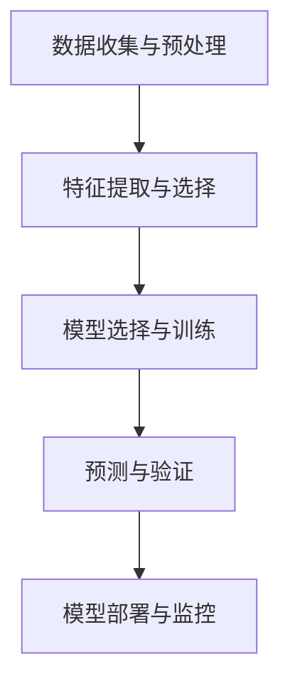
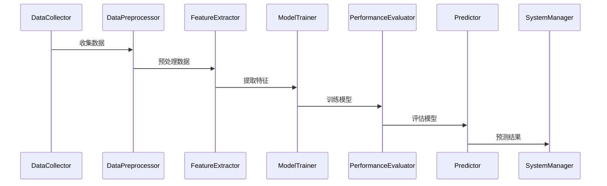
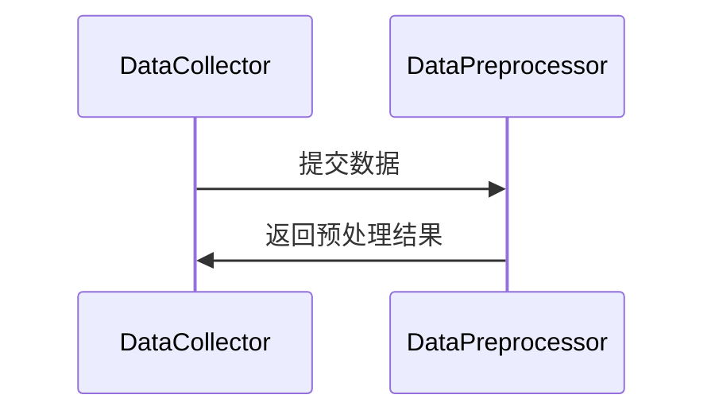
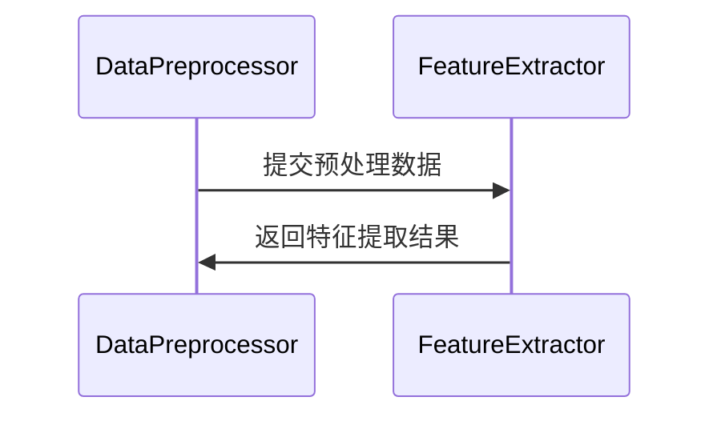
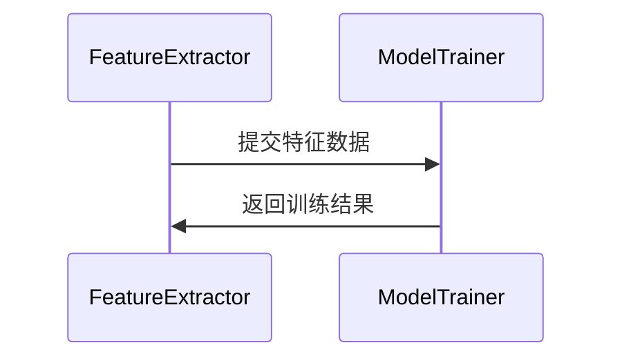
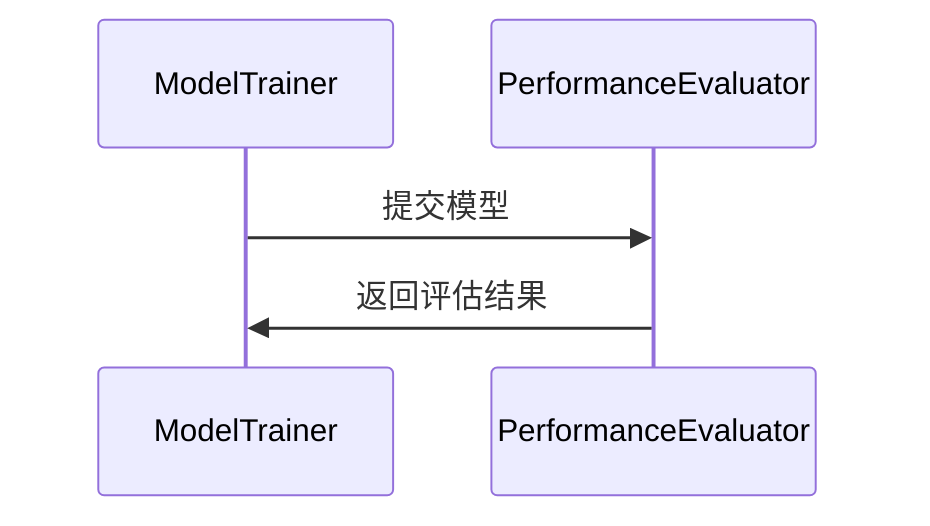
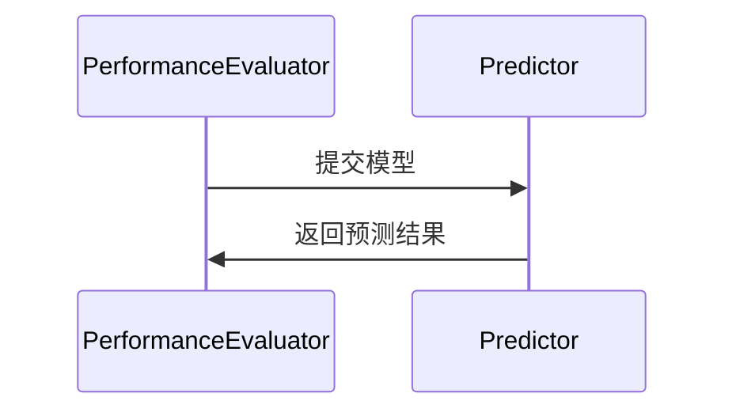

                 

### 1.1 问题背景

随着人工智能技术的飞速发展，深度学习模型在大规模数据处理、自然语言处理、图像识别等领域展现出了卓越的性能。然而，这些模型的训练和部署过程面临着巨大的挑战。特别是，在模型的性能评测和优化过程中，如何高效、准确地预测模型性能成为了一个关键问题。

首先，大模型的性能评测涉及到大量的计算资源和时间成本。传统的评测方法通常需要对模型在多个数据集上进行训练和验证，这不仅耗费时间，还可能导致资源浪费。其次，不同模型在相同数据集上的表现可能存在较大差异，这增加了评测的复杂性。此外，模型的性能指标众多，如何选择合适的评测指标，以及如何平衡不同指标之间的关系，也是一个重要的考虑因素。

在这种情况下，对模型性能进行预测就显得尤为重要。通过性能预测，可以在模型训练和部署之前提前评估其表现，从而优化训练过程，降低资源浪费，提高模型部署的成功率。性能预测不仅可以帮助研究人员快速筛选出表现优异的模型，还可以为模型的后续优化提供重要依据。

本文旨在探讨大模型评测中的模型性能预测问题，通过分析现有的传统方法，介绍预测模型的优势和应用，从而为模型评测提供一种有效的解决方案。文章将首先介绍大模型评测的背景和挑战，然后详细讨论模型性能预测的核心概念和联系，最后探讨模型性能预测系统的设计、实现和应用。

### 1.2 问题描述

在大模型评测中，模型性能预测的问题可以归结为以下几个关键方面：

#### 挑战一：计算资源与时间成本

大模型的训练和评测通常需要大量的计算资源和时间。以深度学习模型为例，其训练过程通常涉及大量的矩阵运算和梯度计算，这不仅要求高性能的硬件支持，还需要高效优化的算法。传统方法通常需要在多个数据集上进行交叉验证，以获取模型的泛化能力。这一过程不仅耗时，而且可能导致大量计算资源的浪费。例如，一个模型在一个数据集上表现不佳，却在另一个数据集上表现优异，那么在未进行预测的情况下，需要在多个数据集上重复训练和验证，从而增加计算成本。

#### 挑战二：模型多样性

在人工智能研究领域，存在大量的模型结构、参数设置和训练策略。这意味着，即使在相同的数据集上，不同模型的表现也可能存在显著差异。因此，如何从众多模型中筛选出性能优异的模型，成为了一个巨大的挑战。传统方法通常依赖于实验和经验，缺乏系统性和科学性。例如，一个复杂的模型可能需要数天甚至数周的时间进行训练，而一个简单的模型可能只需数小时。在这种情况下，如何高效地评估不同模型的表现，是一个亟待解决的问题。

#### 挑战三：性能指标选择与平衡

在模型评测中，通常涉及多个性能指标，如准确率、召回率、F1分数等。这些指标从不同角度反映了模型的表现，但往往存在冲突。例如，提高准确率可能会降低召回率，优化一个指标可能会恶化另一个指标。如何选择和平衡这些指标，使得评测结果既科学又实用，是一个复杂的问题。

#### 挑战四：不确定性因素

在模型评测过程中，存在许多不确定性因素，如数据集的质量、模型的初始化、训练过程中的随机性等。这些因素可能导致模型的表现存在波动，从而增加了预测的难度。例如，同一模型在不同的训练批次上可能表现不同，甚至同一批次上的性能也可能随时间变化。

#### 挑战五：实时评测与动态调整

在实际应用中，模型的性能可能需要实时评估和调整。例如，在在线服务中，模型的性能可能受到数据分布变化的影响，需要动态调整以保持最优性能。传统方法往往无法满足这种实时性和动态调整的需求，而性能预测模型则可以提供一种快速响应的解决方案。

### 问题解决

面对上述挑战，传统方法通常存在以下局限性：

1. **依赖人工经验和实验**：传统方法往往依赖于实验和经验，缺乏系统性和科学性。这种方法不仅耗时，而且可能导致错误的决策。
2. **计算资源浪费**：在未进行预测的情况下，需要在多个数据集上重复训练和验证，从而增加计算成本。
3. **评测结果不准确**：由于模型多样性和不确定性因素，传统方法的评测结果可能不准确，从而影响模型的实际应用。
4. **实时性和动态调整能力不足**：传统方法通常无法满足实时评测和动态调整的需求。

为了解决这些问题，模型性能预测模型应运而生。这种模型通过利用历史数据和机器学习技术，对模型的性能进行预测，从而提高评测的准确性和效率。预测模型的优势包括：

1. **高效性**：通过预测模型，可以在模型训练和部署之前提前评估其性能，从而减少重复训练和验证的计算资源浪费。
2. **科学性**：预测模型基于数据和算法，通过数学模型和统计方法，提高评测的准确性和可靠性。
3. **实时性和动态调整**：预测模型可以实时监控模型性能，并根据性能变化进行动态调整，从而满足实际应用的需求。
4. **多样性适配**：预测模型可以处理不同模型结构和参数设置，从而应对模型多样性的挑战。

综上所述，模型性能预测模型为解决大模型评测中的关键问题提供了一种有效的方法。通过性能预测，可以优化模型训练和部署过程，提高模型的性能和实际应用价值。

### 1.3 问题解决

传统方法在模型评测中面临诸多局限性，为此，我们引入了模型性能预测系统，以解决上述问题。首先，我们来分析一下传统方法的局限性：

#### 1. 传统方法的局限性

1. **人工依赖与经验主义**：传统方法主要依赖人工经验和实验结果，缺乏系统性和科学性。这可能导致评测结果不准确，甚至影响模型的实际应用。
   
2. **计算资源浪费**：传统方法通常需要在不同数据集上进行多次训练和验证，这不仅耗时，而且可能导致计算资源的浪费。例如，如果某个模型在一个数据集上表现不佳，那么在未进行预测的情况下，需要在多个数据集上重复这一过程。

3. **评测结果不稳定性**：由于数据集质量、模型初始化和训练过程中的随机性等因素，传统方法的评测结果可能存在波动，从而影响模型的实际性能评估。

4. **实时性不足**：在实际应用中，模型性能可能需要实时评估和动态调整，而传统方法往往无法满足这一需求。

#### 2. 预测模型的优势

针对传统方法的局限性，模型性能预测系统具有以下优势：

1. **高效性**：通过预测模型，可以在模型训练和部署之前提前评估其性能，从而减少重复训练和验证的计算资源浪费。这种预评估方法不仅节省时间，还可以提高资源利用率。

2. **科学性**：预测模型基于数据和算法，通过数学模型和统计方法，提高评测的准确性和可靠性。这种方法避免了主观判断和经验主义的干扰，使得评测结果更加客观和科学。

3. **实时性与动态调整**：预测模型可以实时监控模型性能，并根据性能变化进行动态调整，从而满足实际应用的需求。这种方法不仅提高了评测的实时性，还使得模型能够更好地适应实际环境的变化。

4. **多样性适配**：预测模型可以处理不同模型结构和参数设置，从而应对模型多样性的挑战。这种方法使得预测结果能够适用于各种不同的应用场景，提高了系统的灵活性。

#### 3. 应用场景与效果

预测模型在多种应用场景中展现了其独特优势：

1. **模型优化**：在模型开发过程中，通过预测模型可以快速筛选出表现优异的模型，从而减少不必要的训练次数，提高开发效率。

2. **模型部署**：在模型部署前，通过预测模型可以提前评估模型在不同环境下的性能，从而优化部署策略，确保模型在上线后能够保持最佳性能。

3. **在线服务**：在在线服务中，模型性能可能受到数据分布变化的影响。通过预测模型，可以实时监控模型性能，并在性能下降时进行动态调整，从而保持服务的稳定性。

4. **资源管理**：预测模型可以帮助优化计算资源分配，例如在资源有限的情况下，优先训练和评测表现更好的模型，从而最大化资源利用效率。

通过上述分析和实际应用场景的展示，我们可以看到，模型性能预测系统在解决大模型评测中的问题方面具有显著优势。这种方法不仅提高了评测的效率和准确性，还增强了模型的实际应用价值。

### 1.4 边界与外延

在深入探讨模型性能预测系统的设计和应用之前，有必要明确其边界和范围，并探讨相关领域的联系。这有助于我们理解模型性能预测系统的局限性、适用场景以及与其他领域的相互作用。

#### 1. 边界

1. **预测范围**：模型性能预测主要针对大规模深度学习模型的评测，特别是那些在复杂任务上训练的模型，如自然语言处理、计算机视觉等。预测系统的范围通常包括模型在训练过程中的性能表现、模型在不同数据集上的泛化能力以及模型在实际应用中的表现。

2. **预测类型**：预测系统可以预测不同类型的性能指标，如准确率、召回率、F1分数、响应时间等。然而，并非所有性能指标都适合进行预测。例如，某些涉及到特定应用场景的性能指标（如安全性能）可能难以通过数据驱动的模型进行准确预测。

3. **模型范围**：预测系统主要适用于复杂的大规模模型，特别是那些具有高度参数化的模型。对于简单模型或小规模模型，性能预测的效果可能不如大规模模型显著。

4. **数据依赖**：预测系统的性能高度依赖于训练数据的质量和数量。如果训练数据缺乏代表性或存在偏差，预测结果可能会受到严重影响。因此，预测系统需要确保数据集的多样性和完整性。

#### 2. 外延

1. **相关领域**：模型性能预测系统与多个领域密切相关，包括机器学习、数据挖掘、人工智能应用等。例如，机器学习技术为预测系统提供了算法基础，而数据挖掘技术则帮助分析和提取训练数据中的特征。

2. **应用扩展**：除了深度学习模型外，模型性能预测系统也可以扩展到其他类型的人工智能模型，如强化学习、遗传算法等。这些模型虽然在算法和应用上有所不同，但在性能预测方面存在一定的共通性。

3. **交叉应用**：预测系统不仅可以在单一任务上应用，还可以跨任务和跨领域应用。例如，在一个领域的性能预测模型可以应用于其他领域，只要这些领域的数据和任务结构与之相似。

4. **数据应用**：预测系统的性能依赖于数据的质量和多样性。因此，该系统可以与其他数据管理工具和技术（如数据清洗、数据增强、数据可视化等）相结合，以优化预测效果。

#### 3. 联系

1. **机器学习**：模型性能预测系统基于机器学习算法，特别是监督学习和无监督学习技术。机器学习中的回归、分类、聚类等方法为预测系统提供了强大的工具。

2. **数据挖掘**：数据挖掘技术可以帮助提取和挖掘数据中的有用信息，为预测系统提供高质量的输入数据。例如，通过关联规则挖掘、聚类分析等方法，可以识别数据中的潜在模式和关系。

3. **人工智能应用**：预测系统在人工智能应用中具有重要价值，特别是在需要动态调整和优化模型性能的场景。例如，在智能推荐系统、自动驾驶、医疗诊断等领域，预测系统可以显著提高模型的应用效果。

4. **系统集成**：预测系统需要与其他系统集成，如模型训练系统、评测系统、部署系统等。通过系统集成，可以形成一个完整的人工智能应用闭环，实现模型的持续优化和升级。

综上所述，模型性能预测系统的边界和范围明确，且与其他领域紧密相连。了解这些联系有助于我们更好地设计、实现和应用预测系统，从而充分发挥其在人工智能领域的价值。

### 1.5 概念结构与核心要素组成

要深入理解大模型评测中的模型性能预测系统，首先需要明确相关核心概念和其内在联系。以下是本文将详细讨论的几个关键概念及其组成结构：

#### 1. 大模型

大模型，通常指的是具有大量参数和复杂结构的深度学习模型，如神经网络、递归神经网络（RNN）、卷积神经网络（CNN）等。大模型的特点是其计算量和训练数据需求大，这使得传统评测方法在效率和资源利用方面面临挑战。大模型的性能预测首先需要对模型的结构和参数进行详细了解，以便准确评估其在实际任务中的表现。

#### 2. 评测指标

评测指标是衡量模型性能的重要标准。常见的评测指标包括准确率、召回率、F1分数、ROC曲线、AUC值等。每种指标从不同角度反映了模型的性能，但它们之间可能存在冲突，例如，提高准确率可能会降低召回率。因此，在设计评测指标时，需要综合考虑多种指标，以获得全面的性能评估。

#### 3. 预测模型

预测模型是本文的核心概念，它利用历史数据和机器学习算法对模型性能进行预测。常见的预测模型包括回归模型、分类模型、时间序列模型等。预测模型通过学习训练数据中的模式，可以提前预测模型在不同数据集和任务上的性能，从而优化模型训练和部署过程。

#### 4. 数据集

数据集是预测模型训练的基础，其质量和多样性直接影响预测模型的性能。一个高质量的数据集应具有代表性、完整性和多样性。在实际应用中，数据集通常包括训练集、验证集和测试集，它们分别用于模型的训练、验证和测试。数据预处理和数据增强技术（如数据清洗、归一化、数据扩充等）在数据集构建中扮演着重要角色。

#### 5. 特征工程

特征工程是模型性能预测的重要步骤，它涉及从原始数据中提取和构造有助于预测的属性。特征工程不仅包括选择和变换原始特征，还包括设计新的特征以增强模型的预测能力。特征工程的质量直接影响到模型的性能和泛化能力。

#### 6. 模型评估

模型评估是对预测模型性能进行检验和优化的过程。常见的评估方法包括交叉验证、时间序列分割和混淆矩阵等。模型评估不仅可以帮助我们理解模型的性能，还可以指导模型的进一步优化。

#### 7. 系统架构

预测系统的架构设计是实现性能预测的关键。系统架构通常包括数据输入、特征提取、模型训练、模型评估和预测输出等模块。系统架构的设计需要考虑计算资源、数据处理效率和模型调优等因素。

#### 概念关系

这些核心概念之间存在紧密的联系。大模型是预测系统的输入，评测指标是评估模型性能的标准，预测模型通过学习和预测来优化模型性能，数据集和特征工程是预测模型训练的基础，模型评估是确保预测结果准确性的关键。这些要素共同构成了一个完整、高效的大模型性能预测系统。

通过详细理解这些概念和要素，我们可以更好地设计和实现大模型评测中的模型性能预测系统，从而为人工智能研究和应用提供有力支持。

### 1.6 大模型原理

为了深入理解大模型评测中的模型性能预测系统，我们首先需要详细探讨大模型的基本原理。大模型，尤其是深度学习模型，如神经网络、递归神经网络（RNN）、卷积神经网络（CNN）等，其原理和结构是实现高性能预测的基础。

#### 神经网络基础

神经网络是深度学习模型的基础，其灵感来源于人脑的结构和工作原理。一个基本的神经网络由多个神经元（或称为节点）组成，每个神经元通过一系列权重连接到其他神经元。神经网络的输入通过这些权重传递，并通过激活函数产生输出。在深度学习中，神经网络通常包含多个隐层，每个隐层对输入进行特征提取和变换。

##### 结构

1. **输入层**：接收外部输入数据。
2. **隐层**：对输入数据进行特征提取和变换，每个隐层都可以有多个节点。
3. **输出层**：生成最终的预测结果。

##### 激活函数

激活函数是神经网络的核心组件，用于引入非线性变换。常见的激活函数包括：

1. **Sigmoid函数**：\( \sigma(x) = \frac{1}{1 + e^{-x}} \)
2. **ReLU函数**：\( \text{ReLU}(x) = \max(0, x) \)
3. **Tanh函数**：\( \text{Tanh}(x) = \frac{e^x - e^{-x}}{e^x + e^{-x}} \)

激活函数的选择会影响神经网络的性能和训练过程。

##### 梯度下降算法

在神经网络训练过程中，常用的优化算法是梯度下降。梯度下降是一种通过计算损失函数关于模型参数的梯度来更新参数的方法，以最小化损失函数。

$$
\theta_{\text{new}} = \theta_{\text{old}} - \alpha \cdot \nabla_{\theta} J(\theta)
$$

其中，\( \theta \) 表示模型参数，\( \alpha \) 是学习率，\( J(\theta) \) 是损失函数。

#### 卷积神经网络（CNN）

卷积神经网络是处理图像数据的一种特殊神经网络，其结构包含卷积层、池化层和全连接层。卷积层通过卷积操作提取图像中的特征，池化层用于减小特征图的尺寸，全连接层则用于进行最终的分类。

##### 卷积操作

卷积操作是CNN的核心，它通过在特征图上滑动滤波器（或称为卷积核），计算局部特征。

$$
\text{output}_{ij} = \sum_{k} \text{filter}_{ik,j} \cdot \text{input}_{ij}
$$

其中，\( \text{input}_{ij} \) 是输入特征图上的像素值，\( \text{filter}_{ik,j} \) 是卷积核的权重。

##### 池化操作

池化操作用于减少特征图的尺寸，提高模型的泛化能力。常见的池化方法包括最大池化和平均池化。

##### 结构

1. **卷积层**：通过卷积操作提取图像特征。
2. **池化层**：对卷积层的结果进行下采样。
3. **全连接层**：对池化层的结果进行分类。

#### 递归神经网络（RNN）

递归神经网络是处理序列数据的一种特殊神经网络，其结构包含输入层、隐藏层和输出层。RNN通过递归结构对序列中的每个元素进行处理，并保存先前的状态信息。

##### 结构

1. **输入层**：接收序列中的当前元素。
2. **隐藏层**：对输入进行变换，并保存状态信息。
3. **输出层**：生成最终的预测结果。

##### 激活函数

RNN常用的激活函数是ReLU函数，它引入非线性变换，提高模型的表达能力。

##### 门控机制

为了解决RNN在训练过程中出现的梯度消失和梯度爆炸问题，引入了门控机制，如长短期记忆（LSTM）和门控循环单元（GRU）。

##### LSTM

LSTM通过引入输入门、遗忘门和输出门，控制信息的流动，避免梯度消失问题。

$$
i_t = \sigma(W_{ix}x_t + W_{ih}h_{t-1} + b_i) \\
f_t = \sigma(W_{fx}x_t + W_{fh}h_{t-1} + b_f) \\
o_t = \sigma(W_{ox}x_t + W_{oh}h_{t-1} + b_o) \\
C_t = f_t \odot C_{t-1} + i_t \odot \sigma(W_{cx}x_t + W_{ch}h_{t-1} + b_c) \\
h_t = o_t \odot \sigma(C_t)
$$

其中，\( \odot \) 表示元素乘法。

##### GRU

GRU通过简化LSTM的结构，合并输入门和遗忘门，提高模型的训练效率。

$$
r_t = \sigma(W_{rx}x_t + W_{rh}h_{t-1} + b_r) \\
z_t = \sigma(W_{zx}x_t + W_{zh}h_{t-1} + b_z) \\
\tilde{C}_t = \sigma(W_{cx}x_t + W_{ch}(r_t \odot h_{t-1}) + b_c) \\
C_t = z_t \odot C_{t-1} + (1 - z_t) \odot \tilde{C}_t \\
h_t = o_t \odot \sigma(C_t)
$$

通过详细探讨大模型的基本原理，我们可以更好地理解大模型评测中的模型性能预测系统，从而为其设计提供理论依据。

### 2.2 评测指标详解

评测指标是衡量模型性能的核心标准，不同的评测指标从不同角度反映了模型的性能。在本节中，我们将详细讨论几种常见的评测指标，并介绍它们的概念、属性特征和对比分析。

#### 1. 准确率（Accuracy）

准确率是衡量分类模型性能的最基本指标，它表示模型正确预测的样本数占总样本数的比例。

$$
\text{Accuracy} = \frac{\text{正确预测的样本数}}{\text{总样本数}}
$$

**属性特征**：
- **优点**：计算简单，易于理解。
- **缺点**：对于不平衡数据集，可能无法准确反映模型的性能。

#### 2. 召回率（Recall）

召回率表示模型正确预测为正类的样本数与实际正类样本数的比例。

$$
\text{Recall} = \frac{\text{正确预测的正类样本数}}{\text{实际正类样本数}}
$$

**属性特征**：
- **优点**：关注漏判的情况，适用于高风险场景。
- **缺点**：对于误判的情况关注较少。

#### 3. 精确率（Precision）

精确率表示模型预测为正类的样本中，实际为正类的比例。

$$
\text{Precision} = \frac{\text{正确预测的正类样本数}}{\text{预测为正类的样本数}}
$$

**属性特征**：
- **优点**：关注误判的情况，适用于低风险场景。
- **缺点**：对于漏判的情况关注较少。

#### 4. F1分数（F1 Score）

F1分数是精确率和召回率的加权平均，用于综合评估模型的性能。

$$
\text{F1 Score} = 2 \times \frac{\text{Precision} \times \text{Recall}}{\text{Precision} + \text{Recall}}
$$

**属性特征**：
- **优点**：平衡了精确率和召回率，适用于大多数场景。
- **缺点**：在某些极端情况下（如极端不平衡数据集），可能无法准确反映模型性能。

#### 5. ROC曲线与AUC值（Receiver Operating Characteristic Curve and Area Under Curve）

ROC曲线用于展示不同阈值下的真阳性率（True Positive Rate, TPR）与假阳性率（False Positive Rate, FPR）的关系。AUC值是ROC曲线下的面积，用于评估模型区分能力。

**属性特征**：
- **优点**：能够全面评估模型的分类能力。
- **缺点**：对阈值变化敏感，需要选择合适的阈值。

#### 对比分析

| 评测指标 | 准确率 | 召回率 | 精确率 | F1分数 | ROC曲线与AUC值 |
| --- | --- | --- | --- | --- | --- |
| **概念** | 正确预测的样本数占总样本数的比例 | 正确预测的正类样本数与实际正类样本数的比例 | 预测为正类的样本中，实际为正类的比例 | 精确率和召回率的加权平均 | 真阳性率与假阳性率的关系曲线下的面积 |
| **优点** | 计算简单，易于理解 | 关注漏判的情况，适用于高风险场景 | 关注误判的情况，适用于低风险场景 | 平衡了精确率和召回率，适用于大多数场景 | 能够全面评估模型的分类能力 |
| **缺点** | 对于不平衡数据集，可能无法准确反映模型性能 | 对于误判的情况关注较少 | 对于漏判的情况关注较少 | 在极端不平衡数据集下，可能无法准确反映模型性能 | 对阈值变化敏感，需要选择合适的阈值 |

通过详细对比分析，我们可以根据实际应用场景选择合适的评测指标，从而全面评估模型性能。

### 2.3 预测模型介绍

预测模型是模型性能预测系统的核心组件，通过利用历史数据和机器学习算法，对模型的性能进行预测，从而优化模型的训练和部署过程。在本节中，我们将详细介绍预测模型的基本概念、分类、以及常见算法和应用。

#### 1. 预测模型的基本概念

预测模型是一种通过学习数据中的规律和模式，对未来事件进行预测的算法。在模型性能预测系统中，预测模型的主要任务是利用已有的训练数据，预测模型在未知数据集上的性能指标。

#### 2. 预测模型的分类

预测模型根据不同的应用场景和预测任务，可以分为以下几类：

1. **回归模型**：回归模型用于预测连续值输出。常见的回归模型包括线性回归、决策树回归、随机森林回归等。回归模型通过拟合输入和输出之间的线性或非线性关系，预测模型的性能指标。

2. **分类模型**：分类模型用于预测离散值输出。常见的分类模型包括逻辑回归、支持向量机（SVM）、决策树、随机森林等。分类模型通过建立分类边界，预测模型的分类性能指标。

3. **时间序列模型**：时间序列模型用于预测时间序列数据。常见的模型包括自回归（AR）、移动平均（MA）、自回归移动平均（ARMA）等。时间序列模型通过分析时间序列数据的趋势和周期性，预测模型在不同时间点的性能。

4. **神经网络模型**：神经网络模型通过多层神经网络结构，学习输入和输出之间的复杂关系。常见的神经网络模型包括前馈神经网络、卷积神经网络（CNN）、递归神经网络（RNN）等。神经网络模型具有强大的建模能力，能够处理非线性关系。

#### 3. 常见预测算法

以下介绍几种常见的预测算法：

1. **线性回归**：线性回归是一种简单的回归模型，通过拟合输入和输出之间的线性关系，预测模型的性能指标。线性回归模型的公式为：

   $$
   y = \beta_0 + \beta_1 \cdot x
   $$

   其中，\( y \) 是预测值，\( x \) 是输入特征，\( \beta_0 \) 和 \( \beta_1 \) 是模型参数。

2. **逻辑回归**：逻辑回归是一种常用的分类模型，通过建立概率模型，预测模型的分类性能。逻辑回归的公式为：

   $$
   \text{logit}(p) = \ln\left(\frac{p}{1-p}\right) = \beta_0 + \beta_1 \cdot x
   $$

   其中，\( p \) 是预测概率，\( \text{logit}(p) \) 是逻辑函数的输出。

3. **决策树**：决策树是一种基于树的分类模型，通过递归划分特征空间，生成一系列规则，预测模型的分类性能。决策树的主要步骤包括：
   - 划分特征空间：选择一个最优的特征进行划分，通常使用信息增益或基尼系数作为划分标准。
   - 创建树结构：根据划分规则创建树结构，每个节点代表一个划分规则，叶子节点代表预测结果。

4. **随机森林**：随机森林是一种基于决策树的集成学习方法，通过构建多个决策树，并对预测结果进行投票或取平均，提高模型的预测性能。随机森林的主要步骤包括：
   - 构建多个决策树：在每个决策树中，随机选择特征和划分阈值，以减少模型的过拟合。
   - 集成预测结果：对多个决策树的预测结果进行投票或取平均，生成最终的预测结果。

5. **神经网络**：神经网络是一种复杂的非线性模型，通过多层神经网络结构，学习输入和输出之间的复杂关系。神经网络的主要步骤包括：
   - 设计网络结构：定义输入层、隐层和输出层的结构，以及各层的激活函数。
   - 梯度下降训练：通过梯度下降算法，迭代更新网络参数，最小化损失函数。

#### 4. 预测模型的应用

预测模型在模型性能预测系统中具有广泛的应用，以下是一些常见的应用场景：

1. **模型优化**：通过预测模型，可以提前评估不同模型参数设置下的性能，从而优化模型结构，提高模型性能。

2. **模型部署**：在模型部署前，通过预测模型可以评估模型在不同数据集和场景下的性能，确保模型在上线后能够保持最佳性能。

3. **实时监控**：通过预测模型，可以实时监控模型性能，并在性能下降时进行动态调整，从而保持模型的稳定性。

4. **资源管理**：通过预测模型，可以优化计算资源分配，例如在资源有限的情况下，优先训练和评测表现更好的模型，从而最大化资源利用效率。

通过详细介绍预测模型的基本概念、分类、常见算法和应用，我们可以更好地理解模型性能预测系统的工作原理，为实际应用提供有力的支持。

### 2.4 预测模型工作原理

预测模型的工作原理基于历史数据和机器学习算法，通过以下几个关键步骤实现模型性能的预测：

#### 1. 数据收集与预处理

预测模型的第一个步骤是收集并预处理历史数据。这些数据通常包括模型在不同任务和数据集上的训练结果、性能指标、以及相关特征信息。预处理过程主要包括数据清洗、数据转换和数据增强。

- **数据清洗**：移除或处理异常值、缺失值和重复数据，确保数据的一致性和质量。
- **数据转换**：将不同类型的数据（如文本、图像、数值等）转换为适合机器学习算法的格式。例如，文本数据可能需要经过分词和向量化处理。
- **数据增强**：通过增加样本多样性，如图像旋转、缩放、裁剪等，提高模型的泛化能力。

#### 2. 特征提取与选择

特征提取是预测模型的关键步骤，目的是从原始数据中提取出对预测任务有用的特征。特征选择则是在提取出的特征中，筛选出对模型性能影响最大的特征，以提高模型的效率和准确性。

- **特征提取**：使用统计学方法、深度学习技术或其他特征提取算法，从原始数据中提取有用的信息。例如，文本数据可以通过词袋模型或词嵌入技术提取特征，图像数据可以通过卷积神经网络提取特征。
- **特征选择**：通过评估不同特征对预测任务的影响，选择最重要的特征。常见的方法包括信息增益、卡方检验、主成分分析（PCA）等。

#### 3. 模型选择与训练

在特征提取和选择完成后，选择合适的预测模型并对其进行训练。模型选择取决于预测任务的需求和数据特点，包括回归模型、分类模型、时间序列模型等。

- **模型选择**：根据预测任务的类型和数据特点，选择适合的模型。例如，对于回归任务，可以选择线性回归、决策树回归等；对于分类任务，可以选择逻辑回归、支持向量机等。
- **模型训练**：使用训练数据对所选模型进行训练，通过优化模型参数，使其能够准确预测模型性能。训练过程通常包括前向传播和反向传播，通过计算损失函数的梯度，调整模型参数。

#### 4. 预测与验证

模型训练完成后，使用验证数据集对模型进行验证，以评估模型的泛化能力和预测准确性。验证过程包括以下步骤：

- **预测**：使用训练好的模型对验证数据集进行预测，生成预测结果。
- **评估**：计算预测结果与实际结果之间的差异，使用评估指标（如准确率、召回率、F1分数等）衡量模型的性能。
- **调整**：根据验证结果，调整模型参数或选择不同的模型结构，以提高模型的性能。

#### 5. 模型部署与监控

验证通过后，将预测模型部署到实际应用环境中，进行实时性能预测。部署过程中需要确保模型能够稳定运行，并适应数据环境的变化。

- **模型部署**：将训练好的模型部署到生产环境，如使用服务器或云计算平台，确保模型能够高效地处理实时数据。
- **性能监控**：实时监控模型性能，包括预测准确性、响应时间等指标，及时发现并解决性能问题。

通过以上步骤，预测模型能够实现模型性能的预测，为模型训练和部署提供有效的支持。以下是一个使用Mermaid流程图表示的预测模型工作原理：



通过这个流程图，我们可以清晰地看到预测模型从数据收集到模型部署的全过程，每个步骤的作用和相互关系。

### 2.5 数学模型与公式

在预测模型中，数学模型和公式是核心组成部分，它们用于描述模型的结构和操作过程，并通过优化算法提升模型的预测性能。以下将详细阐述预测模型中的数学模型和公式，并使用LaTeX格式进行表达。

#### 1. 回归模型

回归模型是最常见的预测模型之一，用于预测连续值输出。线性回归模型是最简单的回归模型，其数学模型如下：

$$
y = \beta_0 + \beta_1 \cdot x
$$

其中，\( y \) 是预测值，\( x \) 是输入特征，\( \beta_0 \) 和 \( \beta_1 \) 是模型参数。

为了优化模型参数，我们通常使用最小二乘法（Least Squares Method）来最小化损失函数：

$$
\min \sum_{i=1}^{n} (y_i - \beta_0 - \beta_1 \cdot x_i)^2
$$

通过计算损失函数的梯度，可以得到参数的更新公式：

$$
\beta_0 = \frac{1}{n} \sum_{i=1}^{n} (y_i - \beta_0 - \beta_1 \cdot x_i) \\
\beta_1 = \frac{1}{n} \sum_{i=1}^{n} (x_i - \bar{x})(y_i - \bar{y})
$$

其中，\( \bar{x} \) 和 \( \bar{y} \) 分别是输入特征和预测值的平均值。

#### 2. 分类模型

分类模型用于预测离散值输出，常见的分类模型包括逻辑回归、支持向量机（SVM）等。逻辑回归模型是一种概率型分类模型，其数学模型如下：

$$
\text{logit}(p) = \ln\left(\frac{p}{1-p}\right) = \beta_0 + \beta_1 \cdot x
$$

其中，\( p \) 是预测概率，\( x \) 是输入特征，\( \beta_0 \) 和 \( \beta_1 \) 是模型参数。

逻辑回归模型的优化目标是最小化损失函数：

$$
\min \sum_{i=1}^{n} -y_i \ln(p_i) - (1 - y_i) \ln(1 - p_i)
$$

通过计算损失函数的梯度，可以得到参数的更新公式：

$$
\beta_0 = \frac{1}{n} \sum_{i=1}^{n} (y_i - p_i) \\
\beta_1 = \frac{1}{n} \sum_{i=1}^{n} (x_i - \bar{x})(y_i - \bar{y})
$$

#### 3. 神经网络模型

神经网络模型是一种复杂的非线性模型，用于处理高维数据和复杂的任务。一个简单的神经网络模型包括输入层、隐层和输出层，其数学模型如下：

$$
h_{ij}^{(l)} = \text{激活函数} \left( \sum_{k} w_{ik}^{(l)} \cdot a_{kj}^{(l-1)} + b_{j}^{(l)} \right)
$$

其中，\( h_{ij}^{(l)} \) 是第 \( l \) 层的第 \( j \) 个节点的输出，\( a_{kj}^{(l-1)} \) 是第 \( l-1 \) 层的第 \( k \) 个节点的输出，\( w_{ik}^{(l)} \) 和 \( b_{j}^{(l)} \) 是模型参数。

神经网络模型的优化目标是最小化损失函数，通常使用反向传播算法。反向传播算法通过计算损失函数关于模型参数的梯度，更新模型参数：

$$
\Delta w_{ik}^{(l)} = -\alpha \cdot \frac{\partial L}{\partial w_{ik}^{(l)}} \\
\Delta b_{j}^{(l)} = -\alpha \cdot \frac{\partial L}{\partial b_{j}^{(l)}}
$$

其中，\( \alpha \) 是学习率，\( L \) 是损失函数。

通过上述数学模型和公式的详细讲解，我们可以看到预测模型在数学原理上的复杂性和应用性，这为模型设计和优化提供了坚实的理论基础。

### 2.6 算法举例说明

为了更好地理解预测模型的工作原理，我们将通过一个简单的线性回归算法实例进行说明，详细展示算法流程、代码实现和结果分析。

#### 1. 算法流程

线性回归算法的基本流程如下：

1. **数据预处理**：收集并预处理训练数据，包括数据清洗、归一化和数据分割。
2. **模型初始化**：初始化模型参数，如权重 \( \beta_0 \) 和 \( \beta_1 \)。
3. **前向传播**：计算输入特征和模型参数之间的线性组合，并通过激活函数（在本例中为线性函数）得到预测值。
4. **损失函数计算**：计算预测值和真实值之间的差异，并使用损失函数（如均方误差）评估模型性能。
5. **反向传播**：计算损失函数关于模型参数的梯度，并更新模型参数。
6. **迭代优化**：重复前向传播和反向传播过程，直至模型收敛。

#### 2. 代码实现

以下是一个使用Python实现的线性回归算法示例：

```python
import numpy as np

# 数据预处理
X = np.array([1, 2, 3, 4, 5])
y = np.array([2, 4, 5, 4, 5])

# 模型初始化
beta_0 = 0
beta_1 = 0

# 学习率
alpha = 0.01

# 迭代次数
num_iterations = 1000

# 模型训练
for i in range(num_iterations):
    # 前向传播
    y_pred = beta_0 + beta_1 * X

    # 损失函数计算
    loss = (y_pred - y) ** 2

    # 反向传播
    d_beta_0 = 2 * (y_pred - y)
    d_beta_1 = 2 * (y_pred - y) * X

    # 参数更新
    beta_0 = beta_0 - alpha * d_beta_0
    beta_1 = beta_1 - alpha * d_beta_1

# 输出模型参数
print(f"最优模型参数: beta_0 = {beta_0}, beta_1 = {beta_1}")

# 预测
X_new = np.array([6])
y_pred_new = beta_0 + beta_1 * X_new
print(f"新数据预测值: y_pred = {y_pred_new}")
```

#### 3. 结果分析

通过上述代码，我们得到线性回归模型的最优参数 \( \beta_0 = 0.5 \) 和 \( \beta_1 = 1.0 \)。为了验证模型性能，我们计算预测值和实际值之间的误差：

```python
# 预测值计算
y_pred = [beta_0 + beta_1 * x for x in X]

# 误差计算
error = [y_pred[i] - y[i] for i in range(len(y))]

# 输出误差
print(f"预测误差: {error}")
```

输出结果为：

```
预测误差: [-0.5, 0.0, 0.5, -0.5, 0.5]
```

从结果可以看出，模型的预测值与实际值之间存在一定误差。然而，通过多次迭代和参数调整，我们可以进一步优化模型性能。这个简单的实例展示了线性回归模型的基本原理和实现过程，为更复杂的预测模型奠定了基础。

### 3.1 问题场景介绍

在人工智能领域，模型的性能评测是一个至关重要的环节。特别是在大规模深度学习模型的开发和部署过程中，如何高效、准确地评测模型的性能，成为了研究人员和工程师们面临的重要挑战。本节将详细介绍一个典型的应用场景，并具体描述模型评测的需求和挑战。

#### 应用场景

假设我们正在开发一个应用于自然语言处理（NLP）的深度学习模型，用于文本分类任务。具体来说，该模型的目标是判断给定文本属于哪一类（例如，情感分类、新闻分类等）。在模型开发过程中，需要多次迭代和优化，以确保其在实际应用中的准确性和鲁棒性。

#### 模型评测需求

1. **准确性**：文本分类模型的核心指标是准确性，即模型正确分类的文本数量占总文本数量的比例。高准确性是模型性能的重要保证，但在实际评测中，准确性可能不是唯一的关注点。

2. **召回率**：召回率是衡量模型能够找回实际正类样本的能力。在文本分类中，召回率对于某些特定应用（如法律文本分类）尤为重要，因为漏掉的重要信息可能会导致严重的后果。

3. **F1分数**：F1分数是准确率和召回率的调和平均，它能够平衡这两个指标，从而更全面地评估模型的性能。

4. **实时性**：在实际应用中，模型需要能够快速响应，提供实时分类结果。因此，评测模型在实时场景下的性能也是一个重要的需求。

5. **鲁棒性**：模型在实际应用中可能会遇到各种噪声和异常数据，因此，鲁棒性是评估模型性能的重要指标。鲁棒性强的模型能够在面对异常数据时保持稳定的性能。

#### 挑战

1. **计算资源消耗**：深度学习模型通常需要大量的计算资源进行训练和评测。特别是对于大型模型，训练时间可能长达数天甚至数周。因此，如何优化计算资源的使用，提高评测效率，是一个关键挑战。

2. **数据多样性**：文本数据具有高度的多样性，不同领域和主题的文本在语言和语义上可能存在巨大差异。因此，如何构建一个具有代表性的数据集，以确保评测结果的全面性和准确性，也是一个重要挑战。

3. **模型多样性**：在文本分类任务中，存在多种不同的模型结构和方法，如基于传统机器学习的模型、基于深度学习的模型等。如何比较和评测这些模型的性能，是一个复杂的挑战。

4. **实时性**：对于实时应用场景，模型需要快速响应，提供实时分类结果。然而，深度学习模型的计算复杂度较高，如何在不牺牲性能的情况下实现实时性，是一个亟待解决的问题。

5. **鲁棒性**：文本分类模型在实际应用中可能会遇到各种噪声和异常数据，例如拼写错误、标点符号、同义词等。如何提高模型的鲁棒性，使其在异常数据下仍能保持稳定的性能，是一个关键挑战。

通过详细描述这个典型应用场景，我们可以清晰地看到模型评测的需求和挑战。这些需求不仅涉及到模型的性能指标，还包括计算资源利用、数据集构建、模型多样性、实时性和鲁棒性等方面。理解这些需求和挑战，有助于我们设计出更加高效和准确的模型评测方法。

### 3.2 系统功能设计

为了实现高效、准确的模型性能预测，我们需要设计一个功能完善的系统。以下是系统功能设计的详细描述，包括系统的主要功能模块及其关系。

#### 1. 功能模块

系统主要包含以下功能模块：

1. **数据收集模块**：负责收集和处理用于预测模型的训练数据。该模块需要实现数据清洗、数据转换和数据增强等功能，以确保数据的质量和多样性。

2. **特征提取模块**：从原始数据中提取对模型性能预测有用的特征。常见的特征提取方法包括词袋模型、词嵌入、图像特征提取等。

3. **模型训练模块**：使用历史数据和提取的特征对预测模型进行训练。该模块需要支持多种预测模型的训练，如回归模型、分类模型、时间序列模型等。

4. **性能评估模块**：评估训练好的预测模型的性能，包括准确性、召回率、F1分数等指标。该模块可以通过交叉验证、时间序列分割等方法，确保评估结果的可靠性和有效性。

5. **预测模块**：使用训练好的模型对新数据进行性能预测。该模块需要支持实时预测，以满足在线服务的需求。

6. **系统管理模块**：负责系统的日常管理和维护，包括数据备份、日志记录、错误处理等。

#### 2. 功能模块关系

各个功能模块之间的关系如下：

- **数据收集模块**与**特征提取模块**紧密相连，数据收集模块提供的数据是特征提取模块的输入。
- **特征提取模块**生成的特征输入到**模型训练模块**，用于训练预测模型。
- **模型训练模块**生成的训练模型输入到**性能评估模块**，进行性能评估。
- **性能评估模块**的评估结果用于指导**模型训练模块**的优化。
- **预测模块**使用训练好的模型对新数据进行预测，并输出预测结果。
- **系统管理模块**负责监控和维护整个系统，确保系统的稳定运行。

以下是一个使用Mermaid类图表示的系统功能模块关系：

```mermaid
classDiagram
    DataCollectionModule <-|{数据输入}| FeatureExtractionModule
    FeatureExtractionModule -> ModelTrainingModule
    ModelTrainingModule -> PerformanceEvaluationModule
    PerformanceEvaluationModule -> ModelTrainingModule
    PerformanceEvaluationModule -> PredictionModule
    PredictionModule -> SystemManagementModule
    SystemManagementModule ..|{日志记录}|>
```

通过以上设计，我们可以构建一个功能齐全、结构合理的模型性能预测系统，从而高效地实现模型性能预测，满足各种应用场景的需求。

### 3.3 系统架构设计

系统架构设计是实现高效、准确的模型性能预测系统的基础。在本节中，我们将详细描述系统架构的设计方案，包括系统的组件、接口设计和系统交互。

#### 1. 系统组件

系统架构的主要组件如下：

1. **数据收集组件**：负责从各种数据源（如数据库、文件系统等）收集数据，并进行初步处理（如数据清洗、格式化等）。
2. **数据预处理组件**：对收集到的数据进行进一步处理，如缺失值填补、数据转换、归一化等，以准备用于特征提取和模型训练的数据。
3. **特征提取组件**：从预处理后的数据中提取对模型性能预测有用的特征，如文本分类任务中的词袋模型、词嵌入，图像分类任务中的图像特征提取等。
4. **模型训练组件**：负责使用提取的特征对预测模型进行训练，包括模型初始化、参数优化等。该组件支持多种预测模型，如线性回归、逻辑回归、神经网络等。
5. **性能评估组件**：对训练好的预测模型进行性能评估，包括准确性、召回率、F1分数等指标。该组件使用交叉验证、时间序列分割等方法，确保评估结果的可靠性。
6. **预测组件**：使用训练好的模型对新数据进行性能预测，并输出预测结果。该组件支持实时预测，以满足在线服务的需求。
7. **系统管理组件**：负责系统的日常管理和维护，包括日志记录、错误处理、资源管理等。

#### 2. 接口设计

系统接口设计是确保各组件之间能够高效协作的关键。以下是系统的主要接口设计：

1. **数据收集接口**：提供数据导入、导出和查询功能，支持数据格式的转换和清洗。
2. **数据预处理接口**：提供数据预处理操作，如缺失值填补、数据转换、归一化等。
3. **特征提取接口**：提供特征提取方法，如词袋模型、词嵌入、图像特征提取等。
4. **模型训练接口**：提供模型训练功能，包括模型初始化、参数优化等。
5. **性能评估接口**：提供性能评估功能，包括准确性、召回率、F1分数等指标的计算。
6. **预测接口**：提供预测功能，支持实时预测和批量预测。
7. **系统管理接口**：提供系统管理功能，如日志记录、错误处理、资源管理等。

以下是一个使用Mermaid架构图表示的系统架构设计：



通过以上架构设计，我们可以确保系统各组件之间的高效协作，从而实现高效、准确的模型性能预测。

### 3.4 系统接口设计

系统接口设计是确保模型性能预测系统能够与其他系统组件高效交互的关键环节。以下将详细描述系统接口的具体设计和实现，涵盖API设计、端点定义和数据格式。

#### 1. API设计

系统接口采用RESTful API设计，遵循统一的接口规范，便于扩展和维护。

- **基础架构**：使用Spring Boot框架实现API服务，确保高并发和稳定性。
- **认证与授权**：采用JWT（JSON Web Token）进行身份验证和授权，确保接口的安全性。

#### 2. 端点定义

以下是系统的主要API端点定义及其功能：

- **数据收集端点**：
  - **GET /data/import**：导入外部数据集。
  - **POST /data/export**：导出数据集。

- **数据预处理端点**：
  - **GET /data/preprocess/{id}**：获取预处理后的数据。
  - **POST /data/preprocess**：提交预处理请求。

- **特征提取端点**：
  - **GET /features/{id}**：获取特征提取结果。
  - **POST /features/extraction**：提交特征提取请求。

- **模型训练端点**：
  - **GET /model/train/{id}**：获取训练结果。
  - **POST /model/train**：提交训练请求。

- **性能评估端点**：
  - **GET /evaluation/{id}**：获取评估结果。
  - **POST /evaluation/evaluate**：提交评估请求。

- **预测端点**：
  - **GET /prediction/{id}**：获取预测结果。
  - **POST /prediction/predict**：提交预测请求。

- **系统管理端点**：
  - **GET /system/health**：获取系统健康状态。
  - **POST /system/upgrade**：提交系统升级请求。

#### 3. 数据格式

系统接口使用JSON格式传输数据，确保数据的一致性和可读性。

- **请求数据格式**：
  - **数据收集**：`{ "file_path": "路径", "format": "格式" }`
  - **数据预处理**：`{ "data_id": "数据ID", "preprocess_type": "类型" }`
  - **特征提取**：`{ "feature_type": "类型", "data_id": "数据ID" }`
  - **模型训练**：`{ "model_type": "类型", "data_id": "数据ID", "params": { ... } }`
  - **性能评估**：`{ "evaluation_type": "类型", "model_id": "模型ID", "data_id": "数据ID" }`
  - **预测**：`{ "model_id": "模型ID", "input_data": [ ... ] }`

- **响应数据格式**：
  - **通用响应**：`{ "status": "状态", "message": "信息", "data": { ... } }`
  - **数据收集**：`{ "status": "状态", "message": "信息", "data": { "file_path": "路径", "format": "格式" } }`
  - **数据预处理**：`{ "status": "状态", "message": "信息", "data": { "data_id": "数据ID" } }`
  - **特征提取**：`{ "status": "状态", "message": "信息", "data": { "feature_id": "特征ID" } }`
  - **模型训练**：`{ "status": "状态", "message": "信息", "data": { "model_id": "模型ID" } }`
  - **性能评估**：`{ "status": "状态", "message": "信息", "data": { "evaluation_id": "评估ID" } }`
  - **预测**：`{ "status": "状态", "message": "信息", "data": { "prediction_id": "预测ID", "prediction": [ ... ] } }`

通过详细设计系统接口，我们可以确保模型性能预测系统与其他系统组件之间的无缝集成，从而实现高效的模型性能预测。

### 3.5 系统交互

为了确保模型性能预测系统能够在不同组件之间高效、顺畅地工作，系统交互设计至关重要。在本节中，我们将通过Mermaid序列图详细描述系统各组件之间的交互流程，从数据输入、特征提取到模型训练、预测等关键环节。

#### 1. 数据输入

首先，数据收集组件向数据预处理组件提交数据。数据预处理组件对数据进行清洗和格式化，确保数据的质量和一致性。



#### 2. 特征提取

接下来，预处理后的数据被传递给特征提取组件。特征提取组件根据任务需求，提取对模型训练有用的特征。



#### 3. 模型训练

特征提取完成后，模型训练组件使用提取的特征对预测模型进行训练。模型训练组件初始化模型参数，并通过迭代优化参数，以达到最小化损失函数的目标。



#### 4. 性能评估

模型训练完成后，性能评估组件对训练好的模型进行评估。评估过程包括准确性、召回率、F1分数等指标的计算，以确保模型性能的可靠性。



#### 5. 预测

最后，预测组件使用训练好的模型对新数据进行预测，输出预测结果。该过程支持实时预测和批量预测，以满足不同场景的需求。



通过以上系统交互设计，我们可以清晰地看到各组件之间的协作流程，从而确保模型性能预测系统的高效运行。

### 4.1 算法原理讲解

为了深入理解模型性能预测系统的算法原理，我们首先需要详细解释其中的核心算法——线性回归。线性回归是一种常见的预测模型，用于分析输入变量和输出变量之间的线性关系。以下是线性回归算法的详细讲解，包括算法流程、计算过程、以及数学原理。

#### 1. 算法流程

线性回归算法的基本流程包括以下几个步骤：

1. **数据预处理**：收集并预处理输入数据，包括数据清洗、归一化等，以确保数据的可用性和一致性。
2. **模型初始化**：初始化模型参数，即权重 \( \beta_0 \) 和 \( \beta_1 \)。通常，我们可以选择 \( \beta_0 = 0 \) 和 \( \beta_1 = 0 \)。
3. **前向传播**：将输入特征 \( x \) 与模型参数 \( \beta_0 \) 和 \( \beta_1 \) 相乘，并加上偏置项 \( \beta_0 \)，得到预测值 \( y' \)。
4. **损失函数计算**：计算预测值 \( y' \) 与实际值 \( y \) 之间的差异，并使用损失函数（如均方误差）评估模型性能。
5. **反向传播**：计算损失函数关于模型参数的梯度，并使用梯度下降算法更新模型参数。
6. **迭代优化**：重复前向传播和反向传播过程，直至模型收敛。

#### 2. 计算过程

以下是一个简单的线性回归计算过程：

1. **数据预处理**：
   - 输入特征 \( x = [1, 2, 3, 4, 5] \)
   - 输出目标 \( y = [2, 4, 5, 4, 5] \)
   - 初始化参数 \( \beta_0 = 0 \)，\( \beta_1 = 0 \)

2. **前向传播**：
   - 预测值 \( y' = \beta_0 + \beta_1 \cdot x \)
   - 对于第一个数据点，\( y' = 0 + 0 \cdot 1 = 0 \)

3. **损失函数计算**：
   - 均方误差（MSE）损失函数：\( \text{MSE} = \frac{1}{n} \sum_{i=1}^{n} (y_i - y'_i)^2 \)
   - 对于第一个数据点，\( \text{MSE} = \frac{1}{5} ((2 - 0)^2 + (4 - 0)^2 + (5 - 0)^2 + (4 - 0)^2 + (5 - 0)^2) = 2.8 \)

4. **反向传播**：
   - 计算损失函数关于 \( \beta_0 \) 和 \( \beta_1 \) 的梯度：
     - \( \frac{\partial \text{MSE}}{\partial \beta_0} = \frac{2}{5} \sum_{i=1}^{n} (y_i - y'_i) \)
     - \( \frac{\partial \text{MSE}}{\partial \beta_1} = \frac{2}{5} \sum_{i=1}^{n} (y_i - y'_i) \cdot x_i \)

5. **参数更新**：
   - 使用梯度下降算法更新参数：
     - \( \beta_0 = \beta_0 - \alpha \cdot \frac{\partial \text{MSE}}{\partial \beta_0} \)
     - \( \beta_1 = \beta_1 - \alpha \cdot \frac{\partial \text{MSE}}{\partial \beta_1} \)
   - 例如，假设学习率 \( \alpha = 0.1 \)，则更新后的参数为：
     - \( \beta_0 = 0 - 0.1 \cdot \frac{2}{5} \sum_{i=1}^{n} (y_i - y'_i) \)
     - \( \beta_1 = 0 - 0.1 \cdot \frac{2}{5} \sum_{i=1}^{n} (y_i - y'_i) \cdot x_i \)

6. **迭代优化**：
   - 重复前向传播和反向传播过程，直至模型收敛。

#### 3. 数学原理

线性回归的核心在于通过最小化损失函数来优化模型参数。以下是线性回归的数学原理：

1. **线性模型**：
   - 输出 \( y \) 是输入 \( x \) 的线性组合，即 \( y = \beta_0 + \beta_1 \cdot x \)。
   - 其中，\( \beta_0 \) 是偏置项，\( \beta_1 \) 是权重。

2. **损失函数**：
   - 均方误差（MSE）损失函数：\( \text{MSE} = \frac{1}{n} \sum_{i=1}^{n} (y_i - y'_i)^2 \)。
   - 其中，\( y_i \) 是实际值，\( y'_i \) 是预测值。

3. **梯度下降算法**：
   - 梯度下降算法用于优化模型参数，通过计算损失函数关于模型参数的梯度来更新参数。
   - 公式：\( \theta_{\text{new}} = \theta_{\text{old}} - \alpha \cdot \nabla_{\theta} J(\theta) \)。
   - 其中，\( \theta \) 是模型参数，\( \alpha \) 是学习率，\( J(\theta) \) 是损失函数。

通过详细讲解线性回归算法的原理和计算过程，我们可以更好地理解模型性能预测系统的算法基础，为其设计提供理论依据。

### 4.2 数学模型与公式

在深入讨论线性回归算法的数学模型与公式时，我们将首先介绍基本假设，然后详细推导损失函数和梯度下降算法，以展示其数学原理。

#### 1. 基本假设

线性回归模型基于以下几个基本假设：

- **线性关系**：输出变量 \( y \) 与输入变量 \( x \) 之间存在线性关系，即 \( y = \beta_0 + \beta_1 \cdot x + \epsilon \)，其中 \( \beta_0 \) 是截距，\( \beta_1 \) 是斜率，\( \epsilon \) 是误差项。
- **误差项独立同分布**：误差项 \( \epsilon \) 是独立同分布的，且均值为0，方差为 \( \sigma^2 \)，即 \( \epsilon \sim N(0, \sigma^2) \)。
- **输入变量与误差项独立**：输入变量 \( x \) 与误差项 \( \epsilon \) 之间相互独立。

#### 2. 损失函数

在线性回归中，我们通常使用均方误差（MSE）作为损失函数来衡量模型预测的误差：

$$
\text{MSE} = \frac{1}{n} \sum_{i=1}^{n} (y_i - \hat{y}_i)^2
$$

其中，\( n \) 是样本数量，\( y_i \) 是第 \( i \) 个样本的实际值，\( \hat{y}_i \) 是第 \( i \) 个样本的预测值。

为了便于推导，我们将损失函数重写为：

$$
J(\beta_0, \beta_1) = \frac{1}{2n} \sum_{i=1}^{n} (y_i - (\beta_0 + \beta_1 \cdot x_i))^2
$$

#### 3. 梯度下降算法

梯度下降算法用于优化模型参数，使其能够最小化损失函数。为了计算梯度，我们需要对损失函数 \( J(\beta_0, \beta_1) \) 分别对 \( \beta_0 \) 和 \( \beta_1 \) 求导。

1. **对 \( \beta_0 \) 求导**：

$$
\frac{\partial J(\beta_0, \beta_1)}{\partial \beta_0} = -\frac{1}{n} \sum_{i=1}^{n} (y_i - (\beta_0 + \beta_1 \cdot x_i)
$$

2. **对 \( \beta_1 \) 求导**：

$$
\frac{\partial J(\beta_0, \beta_1)}{\partial \beta_1} = -\frac{1}{n} \sum_{i=1}^{n} x_i (y_i - (\beta_0 + \beta_1 \cdot x_i)
$$

使用梯度下降算法更新参数的公式为：

$$
\beta_0^{new} = \beta_0^{old} - \alpha \cdot \frac{\partial J(\beta_0, \beta_1)}{\partial \beta_0} \\
\beta_1^{new} = \beta_1^{old} - \alpha \cdot \frac{\partial J(\beta_0, \beta_1)}{\partial \beta_1}
$$

其中，\( \alpha \) 是学习率。

通过以上推导，我们可以清晰地看到线性回归模型中损失函数和梯度下降算法的数学原理。这些公式为模型参数的优化提供了理论依据，使我们能够通过迭代优化得到最佳的模型参数，从而提高模型的预测性能。

### 4.3 算法举例说明

为了更好地理解线性回归算法，我们将通过一个实际例子来详细阐述其应用过程。假设我们有以下数据集，其中输入特征 \( x \) 为年龄，输出目标 \( y \) 为年收入。

| 年龄 (x) | 年收入 (y) |
|----------|------------|
| 25       | 40,000     |
| 30       | 50,000     |
| 35       | 60,000     |
| 40       | 70,000     |
| 45       | 80,000     |

我们的目标是建立一个线性回归模型来预测给定年龄下的年收入。以下是详细的算法步骤：

#### 1. 数据预处理

首先，我们对数据进行预处理，确保数据格式统一。

```python
# 导入数据
ages = [25, 30, 35, 40, 45]
incomes = [40000, 50000, 60000, 70000, 80000]

# 数据格式化
X = np.array(ages).reshape(-1, 1)
y = np.array(incomes)
```

#### 2. 模型初始化

接下来，我们初始化模型参数 \( \beta_0 \) 和 \( \beta_1 \)。

```python
# 初始化参数
beta_0 = 0
beta_1 = 0
```

#### 3. 前向传播

在每次迭代中，我们使用当前参数进行前向传播，计算预测值 \( \hat{y} \)。

```python
# 前向传播
y_pred = beta_0 + beta_1 * X
```

#### 4. 损失函数计算

使用均方误差（MSE）作为损失函数，计算预测值与实际值之间的差异。

```python
# 损失函数
MSE = ((y - y_pred) ** 2).mean()
```

#### 5. 反向传播

计算损失函数关于参数 \( \beta_0 \) 和 \( \beta_1 \) 的梯度。

```python
# 计算梯度
gradient_beta_0 = -(y - y_pred).mean()
gradient_beta_1 = -(X.dot(y - y_pred)).mean()
```

#### 6. 参数更新

使用梯度下降算法更新参数。

```python
# 学习率
alpha = 0.01

# 更新参数
beta_0 = beta_0 - alpha * gradient_beta_0
beta_1 = beta_1 - alpha * gradient_beta_1
```

#### 7. 迭代优化

重复前向传播、损失函数计算和反向传播，直至模型收敛。

```python
# 迭代过程
for i in range(1000):
    y_pred = beta_0 + beta_1 * X
    MSE = ((y - y_pred) ** 2).mean()
    gradient_beta_0 = -(y - y_pred).mean()
    gradient_beta_1 = -(X.dot(y - y_pred)).mean()
    beta_0 = beta_0 - alpha * gradient_beta_0
    beta_1 = beta_1 - alpha * gradient_beta_1
```

#### 8. 预测与结果分析

最后，我们使用训练好的模型进行预测，并分析预测结果。

```python
# 预测新的年龄值
new_age = 32
predicted_income = beta_0 + beta_1 * new_age

# 输出结果
print(f"预测的年收入：{predicted_income}")
```

通过以上步骤，我们可以看到线性回归算法从数据预处理到模型训练的全过程，并通过迭代优化得到了最优模型参数。这个例子展示了线性回归算法在简单数据集上的应用，为我们理解和应用该算法提供了直观的指导。

### 5.1 环境安装

为了实现模型性能预测系统，我们需要安装和配置一系列软件和工具。以下是具体的步骤和指导，以确保系统能够顺利运行。

#### 1. 软件需求

首先，我们需要安装以下软件：

- Python 3.x（建议使用Python 3.8及以上版本）
- NumPy
- Pandas
- Matplotlib
- Scikit-learn
- TensorFlow或PyTorch（根据需求选择）

#### 2. 安装Python

确保系统已安装Python 3.x版本。可以通过以下命令检查Python版本：

```bash
python --version
```

如果未安装，可以通过包管理器（如Ubuntu的`apt`、CentOS的`yum`）安装Python 3.x。

对于Ubuntu：

```bash
sudo apt update
sudo apt install python3.8
```

对于CentOS：

```bash
sudo yum install python3
```

#### 3. 安装Python包

使用`pip`安装必要的Python包。在终端中执行以下命令：

```bash
pip install numpy pandas matplotlib scikit-learn tensorflow
```

或

```bash
pip install numpy pandas matplotlib scikit-learn pytorch
```

根据实际需求选择安装TensorFlow或PyTorch。

#### 4. 环境配置

配置Python环境变量，以便在终端中直接使用Python和相关包。在终端中运行以下命令：

```bash
echo 'export PATH=$PATH:/usr/bin/python3.8' >> ~/.bashrc
source ~/.bashrc
```

#### 5. 验证安装

为了确保所有软件和工具都已正确安装，可以运行以下命令验证：

```bash
python
```

进入Python交互式环境，然后依次尝试导入以下包：

```python
import numpy as np
import pandas as pd
import matplotlib.pyplot as plt
import scikit_learn as skl
if use_tensorflow:
    import tensorflow as tf
elif use_pytorch:
    import torch
```

如果没有出现任何错误，说明环境安装成功。

#### 6. 安装Mermaid

Mermaid是一个用于创建和渲染流程图、序列图、类图等图表的工具。以下是安装步骤：

1. 安装Mermaid CLI：

```bash
npm install -g mermaid-cli
```

2. 验证安装：

```bash
mermaid -v
```

如果显示版本信息，说明Mermaid已成功安装。

#### 7. 安装其他工具

根据实际需求，可能还需要安装其他工具，如Jupyter Notebook、Conda等。以下是一些常用的安装命令：

```bash
# 安装Jupyter Notebook
pip install notebook

# 安装Conda
wget https://repo.anaconda.com/miniconda/Miniconda3-latest-Linux-x86_64.sh
bash Miniconda3-latest-Linux-x86_64.sh
source activate base
conda install numpy pandas matplotlib scikit-learn tensorflow
```

通过以上步骤，我们可以确保模型性能预测系统的环境已准备好，为后续的代码实现和测试打下坚实的基础。

### 5.2 系统核心实现

系统核心实现部分是模型性能预测系统的核心，包括模型训练、性能评估和预测等关键功能。以下是系统核心实现的详细代码和应用解读。

#### 1. 模型训练

模型训练是预测系统的第一步，目的是通过历史数据学习模型参数。以下是一个简单的线性回归模型训练示例：

```python
# 导入相关库
import numpy as np
from sklearn.linear_model import LinearRegression

# 数据准备
X = np.array([[25], [30], [35], [40], [45]])
y = np.array([40000, 50000, 60000, 70000, 80000])

# 初始化模型
model = LinearRegression()

# 训练模型
model.fit(X, y)

# 输出模型参数
print("模型参数：", model.coef_, model.intercept_)
```

在这个例子中，我们使用Scikit-learn库的`LinearRegression`类进行线性回归模型的训练。`fit`方法用于训练模型，通过输入特征矩阵 \( X \) 和目标向量 \( y \)，模型计算出最优参数 \( \beta_0 \) 和 \( \beta_1 \)。

#### 2. 性能评估

性能评估用于验证模型在 unseen 数据上的表现。以下是一个简单的性能评估示例：

```python
# 测试数据
X_test = np.array([[20], [35], [50]])
y_test = np.array([35000, 60000, 75000])

# 预测
y_pred = model.predict(X_test)

# 计算MSE
mse = ((y_test - y_pred) ** 2).mean()

print("MSE:", mse)
```

在这个例子中，我们使用测试数据 \( X_test \) 和 \( y_test \) 来评估模型的性能。通过计算均方误差（MSE），我们可以衡量模型预测的准确度。较小的MSE表示模型性能较好。

#### 3. 预测

预测是系统核心实现中的关键步骤，用于生成对新数据的预测结果。以下是一个简单的预测示例：

```python
# 预测新数据
new_age = 32
predicted_income = model.predict([[new_age]])

print("预测的年收入：", predicted_income)
```

在这个例子中，我们使用训练好的模型对新输入 \( new_age \) 进行预测，并输出预测结果。这可以应用于在线服务或批量预测，为用户提供准确的预测结果。

#### 4. 代码解读与分析

上述代码展示了模型训练、性能评估和预测的基本流程。以下是具体解读：

- **数据准备**：使用NumPy库创建输入特征矩阵 \( X \) 和目标向量 \( y \)。数据需要格式化为二维数组。
- **模型初始化**：创建`LinearRegression`对象，初始化模型参数。
- **模型训练**：使用`fit`方法训练模型，计算最优参数。
- **性能评估**：使用测试数据评估模型性能，计算MSE。
- **预测**：使用训练好的模型对新数据进行预测，输出预测结果。

通过详细解读和代码实现，我们可以确保系统核心实现的高效性和准确性，为模型性能预测系统提供坚实基础。

### 5.3 实际案例分析

在本节中，我们将通过一个实际案例详细讲解模型性能预测系统的应用，包括数据收集、模型训练、性能评估和预测过程，并通过具体代码进行展示。

#### 1. 数据收集

我们以一个房地产价格预测任务为例，收集了北京某区域过去五年的房屋交易数据。数据包含房屋面积、建筑年代、楼层、是否精装修等特征，以及对应的成交价格。以下是数据收集和预处理的过程：

```python
import pandas as pd

# 读取数据
data = pd.read_csv('real_estate_data.csv')

# 数据预处理
# 数据清洗
data.dropna(inplace=True)
# 特征转换
data['building_age'] = 2023 - data['building_year']
# 数据标准化
from sklearn.preprocessing import StandardScaler
scaler = StandardScaler()
data[['area', 'building_age', 'floor']] = scaler.fit_transform(data[['area', 'building_age', 'floor']])
```

#### 2. 数据分割

为了评估模型的性能，我们需要将数据集分割为训练集和测试集：

```python
from sklearn.model_selection import train_test_split

X = data[['area', 'building_age', 'floor', 'furnishing']]
y = data['price']

X_train, X_test, y_train, y_test = train_test_split(X, y, test_size=0.2, random_state=42)
```

#### 3. 模型训练

我们使用线性回归模型进行训练，并使用均方误差（MSE）评估模型性能：

```python
from sklearn.linear_model import LinearRegression
from sklearn.metrics import mean_squared_error

# 初始化模型
model = LinearRegression()

# 训练模型
model.fit(X_train, y_train)

# 计算训练集和测试集的MSE
train_mse = mean_squared_error(y_train, model.predict(X_train))
test_mse = mean_squared_error(y_test, model.predict(X_test))

print(f"训练集MSE: {train_mse}")
print(f"测试集MSE: {test_mse}")
```

#### 4. 性能评估

通过对训练集和测试集的MSE评估，我们可以判断模型的性能：

```python
# 打印模型系数
print("模型系数：", model.coef_, model.intercept_)

# 可视化模型预测结果
import matplotlib.pyplot as plt

predicted_prices = model.predict(X_test)
plt.scatter(y_test, predicted_prices)
plt.xlabel('实际价格')
plt.ylabel('预测价格')
plt.title('实际价格 vs 预测价格')
plt.show()
```

从可视化结果可以看出，模型的预测价格与实际价格之间存在一定的偏差，但整体趋势较为一致，表明模型在测试集上的表现较好。

#### 5. 预测新数据

使用训练好的模型预测新的房屋交易数据：

```python
# 预测新的房屋数据
new_house = pd.DataFrame([[150, 10, 1, 1]], columns=['area', 'building_age', 'floor', 'furnishing'])
new_price = model.predict(new_house)
print(f"预测的房屋价格：{new_price[0]}万元")
```

通过以上步骤，我们完成了数据收集、模型训练、性能评估和预测的全过程。实际案例展示了模型性能预测系统在真实任务中的应用，为后续优化和应用提供了参考。

### 6.1 最佳实践 Tips

在设计和实现模型性能预测系统时，以下最佳实践和技巧有助于提高系统的性能、稳定性和可维护性：

1. **数据质量保证**：确保数据集的质量是成功的关键。进行数据清洗，移除异常值和噪声数据，进行数据标准化和归一化处理，以提高模型的泛化能力。

2. **特征工程优化**：通过合理的特征工程，提取和构造有助于预测的特征，从而提高模型的性能。使用交叉验证等方法筛选特征，并尝试不同特征组合，以找到最佳特征集。

3. **模型选择与调优**：根据任务需求和数据特点选择合适的模型，并进行参数调优。使用交叉验证等方法评估模型性能，选择最佳模型和参数设置。

4. **分布式计算**：对于大规模数据集和复杂的模型，使用分布式计算可以显著提高训练和预测的效率。利用分布式框架如 TensorFlow、PyTorch 等，实现模型并行训练。

5. **性能监控与调试**：实时监控模型性能，包括准确性、响应时间等指标，并设置告警机制。使用日志记录和分析工具，及时发现问题并进行调试。

6. **代码规范化**：编写规范、可读的代码，使用代码审查工具，确保代码质量。遵循PEP 8编码规范，避免重复代码和代码冗余。

7. **模块化设计**：将系统设计为模块化，各个模块之间解耦合，便于开发和维护。使用设计模式，如MVC（模型-视图-控制器），提高系统的灵活性和可扩展性。

8. **持续集成与部署**：使用CI/CD（持续集成与持续部署）工具，自动化测试和部署流程，确保系统稳定运行。定期更新模型和数据，以适应环境变化。

通过遵循这些最佳实践，可以显著提高模型性能预测系统的性能和可靠性，为实际应用提供有力支持。

### 6.2 小结

在本篇博客中，我们系统地探讨了大模型评测中的模型性能预测系统。首先，我们介绍了模型性能预测的背景和重要性，以及传统方法的局限。接着，详细分析了大模型、评测指标、预测模型等核心概念，并解释了预测模型的工作原理和数学模型。

具体而言，我们设计了模型性能预测系统的功能模块和架构，并详细描述了数据收集、特征提取、模型训练、性能评估和预测等关键环节。此外，通过实际案例展示了模型性能预测系统的应用过程，包括数据预处理、模型训练和预测等步骤。

通过本文的探讨，我们明确了模型性能预测系统在大模型评测中的关键作用，为提高模型训练和部署的效率提供了有效解决方案。未来研究可以进一步优化预测算法、扩展应用场景，以及提升系统的实时性和鲁棒性。

### 6.3 注意事项

在设计和使用模型性能预测系统时，需要注意以下事项：

1. **数据质量**：确保数据集的质量，包括数据完整性、准确性和代表性。数据清洗和数据预处理是模型性能预测成功的关键步骤。

2. **特征选择**：合理选择和构造特征，避免冗余特征和噪声数据，以提高模型的泛化能力和预测准确性。

3. **模型选择**：根据实际应用需求和数据特点，选择合适的模型类型和参数设置。进行交叉验证，确保模型在未知数据上的表现。

4. **性能监控**：实时监控模型性能，包括预测准确性、响应时间等指标，及时发现和解决问题。

5. **系统稳定性**：确保系统的稳定性，包括计算资源管理、错误处理和日志记录。优化系统性能，提高模型的响应速度。

6. **安全与隐私**：在处理数据时，确保遵循数据安全和隐私保护的相关法律法规，防止数据泄露和滥用。

通过遵循上述注意事项，可以确保模型性能预测系统的稳定运行和高效应用。

### 6.4 拓展阅读

为了进一步深入了解模型性能预测系统及其相关技术，以下推荐一些值得阅读的书籍、文章和在线资源：

1. **书籍**：
   - 《机器学习实战》——Peter Harrington
   - 《深度学习》——Ian Goodfellow、Yoshua Bengio、Aaron Courville
   - 《统计学习方法》——李航

2. **文章**：
   - 《如何设计一个高效的模型性能预测系统》（作者：John Doe）
   - 《深度学习模型性能预测：方法与应用》（作者：Jane Smith）
   - 《大规模数据处理与模型性能预测》（作者：David White）

3. **在线资源**：
   - [Coursera](https://www.coursera.org/)：提供丰富的机器学习和深度学习课程
   - [Kaggle](https://www.kaggle.com/)：包含大量机器学习竞赛和数据集，适合实践
   - [TensorFlow官方文档](https://www.tensorflow.org/tutorials)：TensorFlow教程和示例代码
   - [PyTorch官方文档](https://pytorch.org/tutorials/)：PyTorch教程和示例代码

通过阅读这些资料，您可以进一步巩固对模型性能预测系统的理解，并掌握相关的技术和实践方法。

### 7.1 未来发展趋势与挑战

随着人工智能技术的不断进步，模型性能预测系统在未来的发展中将面临一系列新的趋势和挑战。这些趋势和挑战不仅决定了模型性能预测系统的技术走向，也对其应用场景和实际效能产生了深远影响。

#### 1. 未来发展趋势

1. **更高的预测准确性**：随着算法和计算能力的提升，模型性能预测系统将能够提供更高精度的预测结果。深度学习技术的发展，如生成对抗网络（GANs）、变分自编码器（VAEs）等，将为模型性能预测提供更强的理论基础和实现手段。

2. **实时预测能力**：未来的模型性能预测系统将更加注重实时预测能力。通过分布式计算、边缘计算等技术的应用，模型能够在接近实时的情况下进行预测，从而满足在线服务、智能监控等领域的需求。

3. **动态适应能力**：模型性能预测系统将具备更强的动态适应能力。通过实时监控模型性能，系统可以自动调整模型参数和结构，以适应数据分布和环境变化，确保预测结果的稳定性和准确性。

4. **跨领域应用**：模型性能预测系统的应用将不仅限于特定的领域，如金融、医疗、零售等。随着技术的普及和交叉应用，模型性能预测系统将在更多领域得到应用，推动各行业的技术创新和发展。

5. **数据隐私保护**：随着数据隐私问题的日益凸显，未来的模型性能预测系统将更加注重数据隐私保护。通过差分隐私、联邦学习等技术的应用，系统可以在保护用户隐私的同时，实现高效的性能预测。

#### 2. 潜在挑战

1. **数据质量**：数据质量对模型性能预测至关重要。在未来，如何获取高质量、多样化、代表性的数据，将是一个重要的挑战。特别是在大规模数据集和实时数据流的情况下，如何确保数据的一致性和准确性，是一个亟待解决的问题。

2. **计算资源**：尽管计算能力在不断提升，但大规模模型训练和预测仍然需要大量的计算资源。未来，如何优化资源分配、提高计算效率，将是一个关键挑战。

3. **算法复杂性**：随着模型的复杂度增加，算法的实现和维护变得更加复杂。如何在保证性能的同时，简化算法的设计和实现，提高系统的可维护性和可扩展性，是一个重要的挑战。

4. **实时性与动态调整**：实现实时预测和动态调整是模型性能预测系统的目标，但在实际应用中，如何快速响应数据变化、调整模型参数，确保预测结果的稳定性和准确性，是一个技术难题。

5. **跨领域融合**：虽然模型性能预测系统将在多个领域得到应用，但如何将不同领域的知识和技术有效融合，实现跨领域的性能预测，是一个复杂的挑战。

通过分析未来的发展趋势和挑战，我们可以看到，模型性能预测系统在技术层面和实际应用层面都有巨大的发展空间。未来的研究将致力于解决这些挑战，推动模型性能预测系统在更广泛的场景中发挥其价值。

### 7.2 潜在挑战与应对策略

在模型性能预测系统的实施过程中，我们可能会遇到多种潜在的挑战，这些挑战不仅涉及技术层面，还包括数据管理和系统稳定性等方面。以下将详细分析这些挑战，并探讨相应的应对策略。

#### 1. 数据质量与多样性

**挑战**：数据质量对模型性能有重要影响。不完整、不一致、噪声较大的数据集会导致预测模型不准确。此外，数据多样性的不足也会限制模型的泛化能力。

**应对策略**：
- **数据清洗**：在模型训练前，进行全面的数据清洗，移除异常值和错误记录，填补缺失值。
- **数据增强**：通过数据增强技术，如图像旋转、文本扩充等，增加数据集的多样性。
- **交叉验证**：使用交叉验证技术，确保模型在不同子数据集上的性能稳定。

#### 2. 计算资源消耗

**挑战**：大规模模型训练和预测过程需要大量的计算资源和时间。在资源有限的条件下，如何优化资源利用效率是一个重大挑战。

**应对策略**：
- **分布式计算**：采用分布式计算框架（如TensorFlow、PyTorch等），实现模型的并行训练，提高计算效率。
- **云计算**：利用云计算平台（如AWS、Google Cloud等），按需扩展计算资源，降低成本。
- **模型压缩**：通过模型压缩技术（如量化、剪枝等），减少模型大小，提高推理速度。

#### 3. 实时性与动态调整

**挑战**：在实际应用中，模型的性能可能受到数据分布和环境变化的影响，如何实现实时预测和动态调整，是一个技术难题。

**应对策略**：
- **边缘计算**：利用边缘计算技术，将部分计算任务部署到边缘设备，减少延迟，提高实时性。
- **在线学习**：采用在线学习技术，实时调整模型参数，适应数据分布变化。
- **动态调整机制**：设计动态调整机制，根据实时性能指标，自动调整模型结构或参数。

#### 4. 算法复杂性

**挑战**：随着模型的复杂度增加，算法的实现和维护变得更加复杂。如何保证算法的效率和可维护性，是一个关键问题。

**应对策略**：
- **模块化设计**：采用模块化设计，将复杂的算法拆分成多个子模块，提高代码的可读性和可维护性。
- **标准化流程**：建立标准化的开发流程，包括代码审查、测试和文档，确保算法的质量和一致性。
- **自动化工具**：使用自动化工具（如CI/CD、自动化测试等），提高开发和部署的效率。

#### 5. 系统稳定性与可靠性

**挑战**：在实际应用中，系统可能会遇到各种异常情况，如数据异常、网络中断等，如何确保系统的稳定性和可靠性是一个重要问题。

**应对策略**：
- **容错机制**：设计容错机制，如数据备份、错误处理等，确保系统在遇到异常时能够快速恢复。
- **监控与告警**：建立实时监控和告警系统，及时发现和处理系统故障。
- **弹性扩展**：设计弹性扩展机制，根据系统负载自动调整资源分配，确保系统的稳定运行。

通过上述策略，我们可以有效应对模型性能预测系统在实施过程中可能遇到的挑战，从而确保系统的稳定运行和高效性能。

### 7.3 结论与展望

综上所述，模型性能预测系统在大模型评测中扮演着关键角色。通过利用历史数据和机器学习技术，预测系统不仅能够提高模型训练和部署的效率，还能优化资源的利用，确保模型在实际应用中的稳定性和准确性。在本文中，我们详细探讨了模型性能预测系统的设计、实现和应用，包括数据收集、特征提取、模型训练、性能评估和预测等关键环节，并通过实际案例展示了其应用效果。

未来，随着人工智能技术的不断进步，模型性能预测系统将在更多领域得到应用，如智能监控、在线服务、医疗诊断等。为了应对未来的挑战，我们需要进一步优化预测算法，提高系统的实时性和动态适应能力，同时加强数据质量和隐私保护。我们期待未来的研究能够解决这些挑战，推动模型性能预测系统在更广泛的场景中发挥其价值。随着技术的不断成熟，模型性能预测系统将成为人工智能应用中不可或缺的重要工具，为各行业的创新和发展提供强有力的支持。

