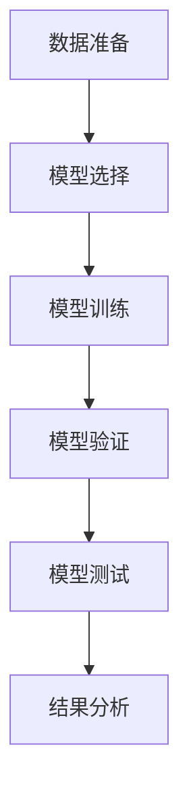

                 


### 第1章 引言

#### 1.1 研究背景

随着深度学习技术的迅猛发展，大型神经网络模型（大模型）已经成为计算机视觉、自然语言处理、语音识别等领域的核心技术。大模型通过大量的数据和强大的计算能力，实现了前所未有的性能提升。然而，随着模型规模的不断扩大，如何有效地评测大模型的表现成为一个亟待解决的问题。

深度学习大模型评测的重要性体现在以下几个方面：

1. **性能评估**：通过评测可以准确衡量大模型在不同任务上的性能，为模型优化提供指导。
2. **比较与选择**：不同的大模型在相同任务上的评测结果可以作为比较和选择的依据。
3. **改进与发展**：评测过程中发现的问题可以推动模型改进和理论发展。
4. **应用推广**：准确的评测结果有助于大模型的实际应用和推广。

目前，大模型评测领域存在一些问题，如评测指标不统一、评测流程不规范、评测工具不完善等。这些问题影响了评测结果的可靠性和可比性，因此，研究和解决这些问题具有重要意义。

#### 1.2 研究目的与内容框架

本文旨在系统性地探讨大模型评测的理论基础、工具和方法，并提出解决方案。具体研究内容包括：

1. **理论基础**：介绍深度学习基础和评测指标。
2. **评测流程**：阐述评测流程和步骤。
3. **评测工具**：对比分析开源和商用评测工具。
4. **案例分析**：通过具体案例展示评测过程和应用。
5. **挑战与解决方案**：分析评测过程中遇到的挑战及其解决方案。
6. **发展趋势**：探讨评测方法的未来发展。

通过以上研究，期望能够为深度学习大模型评测提供理论和实践指导，推动该领域的发展。

#### 1.3 本章小结

本章首先介绍了大模型评测的研究背景和重要性，提出了研究的目的和内容框架，为后续章节的讨论奠定了基础。在接下来的章节中，我们将逐步深入探讨大模型评测的各个方面。

### 第2章 大模型评测基础理论

#### 2.1 深度学习基础

##### 2.1.1 深度学习的基本概念

深度学习（Deep Learning）是人工智能（Artificial Intelligence, AI）的一个重要分支，其核心思想是通过构建多层神经网络来模拟人脑的神经元结构，实现数据的自动特征提取和智能推理。深度学习的基本概念包括：

- **神经网络**：神经网络由多个神经元（或节点）组成，每个神经元接收多个输入，通过加权求和后应用一个非线性激活函数产生输出。
- **层数**：深度学习的“深度”指的是神经网络的层数。通常，层数越多，模型的表示能力越强。
- **前向传播**：输入数据通过神经网络的前向传播路径传递，经过每层神经元的计算产生输出。
- **反向传播**：在训练过程中，模型通过反向传播算法更新权重，以减少预测误差。

##### 2.1.2 神经网络结构

神经网络的结构可以分为输入层、隐藏层和输出层：

- **输入层**：接收外部输入数据，通常不包含参数。
- **隐藏层**：包含多个神经元层，每一层的神经元接收前一层的输出作为输入，并通过加权求和和激活函数产生输出。
- **输出层**：产生最终输出，用于分类或回归任务。

常见的神经网络结构有：

- **单层感知机（Perceptron）**：只有一个隐藏层，是最简单的神经网络。
- **多层感知机（MLP）**：包含一个或多个隐藏层，能够处理更复杂的任务。
- **卷积神经网络（CNN）**：主要用于图像识别，通过卷积层提取图像特征。
- **循环神经网络（RNN）**：适合处理序列数据，能够捕捉时间序列的信息。

##### 2.1.3 深度学习算法

深度学习的算法主要包括：

- **反向传播算法**：用于训练神经网络，通过反向传播误差计算梯度，更新网络权重。
- **梯度下降算法**：一种优化算法，通过不断迭代更新参数，以减少预测误差。
- **随机梯度下降（SGD）**：每次更新参数时使用所有样本的梯度，适合小批量数据。
- **动量优化**：引入动量项，加速收敛，避免陷入局部最优。

深度学习算法的数学模型主要包括：

- **损失函数**：用于衡量模型预测值与真实值之间的差异，常见的有均方误差（MSE）、交叉熵损失等。
- **优化算法**：用于更新网络参数，常见的有Adam、RMSprop等。

##### 2.2 大模型评测指标

##### 2.2.1 评测指标分类

大模型评测指标可以分为以下几类：

- **准确率（Accuracy）**：预测正确的样本数占总样本数的比例。
- **精确率（Precision）**：预测正确的正样本数占总预测正样本数的比例。
- **召回率（Recall）**：预测正确的正样本数占总实际正样本数的比例。
- **F1分数（F1 Score）**：精确率和召回率的调和平均值。
- **ROC曲线（Receiver Operating Characteristic Curve）**：用于评估二分类模型的性能。

##### 2.2.2 常见评测指标详解

常见评测指标包括：

- **准确率**：适用于分类任务，但容易受到类别不平衡的影响。
- **精确率和召回率**：特别适用于二分类任务，可以更好地反映模型的性能。
- **F1分数**：综合考虑精确率和召回率，适用于需要平衡这两个指标的场合。
- **ROC曲线**：用于评估模型的分类能力，曲线下的面积（AUC）越大，模型性能越好。

##### 2.2.3 指标选择原则

选择评测指标时需要考虑以下几点：

- **任务类型**：不同类型的任务需要不同的评测指标。
- **数据分布**：数据分布会影响指标的选择，例如类别不平衡时需要选择能反映不平衡情况的指标。
- **模型目标**：模型的目标会影响指标的选择，例如在目标检测任务中，更关注准确率。

##### 2.3 大模型评测流程

##### 2.3.1 评测流程概述

大模型评测流程通常包括以下步骤：

1. **数据准备**：收集和整理数据，进行预处理，如数据清洗、归一化等。
2. **模型选择**：根据任务需求选择合适的模型架构。
3. **模型训练**：使用训练数据训练模型，调整模型参数。
4. **模型评估**：使用验证集评估模型性能，选择最佳模型。
5. **测试集评估**：在测试集上评估模型性能，确保模型泛化能力。

##### 2.3.2 数据准备与处理

数据准备与处理包括以下步骤：

1. **数据收集**：从各种来源收集数据，如公开数据集、企业数据等。
2. **数据清洗**：去除无关数据、纠正错误数据、处理缺失数据等。
3. **数据归一化**：将数据缩放到相同的范围，如0到1之间。
4. **数据增强**：通过增加样本数量和提高数据多样性来改善模型性能。

##### 2.3.3 模型训练与评测

模型训练与评测包括以下步骤：

1. **数据划分**：将数据集划分为训练集、验证集和测试集。
2. **模型训练**：使用训练集训练模型，通过反向传播算法更新参数。
3. **模型验证**：在验证集上评估模型性能，调整模型参数。
4. **模型测试**：在测试集上评估模型性能，确保模型泛化能力。

##### 2.4 本章小结

本章介绍了大模型评测的基础理论，包括深度学习的基础知识、评测指标的分类与选择、评测流程的概述等。这些基础知识为后续章节的深入讨论提供了理论支持。在接下来的章节中，我们将进一步探讨评测工具和方法，以及实际案例中的应用。

### 第3章 大模型评测工具

#### 3.1 开源评测工具

开源评测工具在大模型评测中扮演了重要角色，以下介绍几种常用的开源评测工具：

##### 3.1.1 MatConvNet

MatConvNet是一个基于MATLAB的深度学习框架，提供了丰富的神经网络结构和训练工具。其优点包括：

- **易于使用**：提供了直观的接口和示例代码。
- **支持多种网络结构**：包括卷积神经网络（CNN）、循环神经网络（RNN）等。
- **丰富的数据集**：集成了多个常见的数据集，方便用户测试。

使用MatConvNet进行大模型评测的步骤包括：

1. **数据准备**：导入和处理数据集。
2. **模型选择**：根据任务需求选择合适的网络结构。
3. **模型训练**：使用训练数据进行模型训练。
4. **模型评估**：在验证集和测试集上评估模型性能。

##### 3.1.2 TensorFlow Evals

TensorFlow Evals是TensorFlow官方提供的一个用于评估深度学习模型性能的工具包。其特点包括：

- **兼容性强**：支持多种数据集和评估指标。
- **自动化**：可以自动化执行评估流程，提高效率。
- **灵活**：允许用户自定义评估指标和评估流程。

使用TensorFlow Evals进行评测的步骤如下：

1. **安装与配置**：安装TensorFlow Evals并配置环境。
2. **数据准备**：准备训练和测试数据集。
3. **模型集成**：将模型集成到评估框架中。
4. **评估运行**：执行评估，获取评估结果。

##### 3.1.3 PyTorch Metrics

PyTorch Metrics是一个专门为PyTorch框架设计的评估工具，提供了丰富的评估指标和计算函数。其优点包括：

- **易于集成**：可以直接与PyTorch模型结合使用。
- **高效率**：优化了计算性能，适用于大规模模型评测。
- **可扩展**：允许用户自定义评估指标。

使用PyTorch Metrics进行评测的步骤包括：

1. **安装与配置**：安装PyTorch Metrics并配置环境。
2. **数据准备**：准备训练和测试数据集。
3. **模型集成**：将模型与评估函数结合。
4. **评估计算**：计算并输出评估结果。

#### 3.2 商用评测工具

商用评测工具通常提供了更全面的功能和更专业的支持，以下介绍几种常用的商用评测工具：

##### 3.2.1 Big Model Benchmark

Big Model Benchmark是一个专门为大模型评测设计的商用工具，提供了以下功能：

- **性能评估**：对大模型的性能进行准确评估。
- **资源监控**：监控模型运行时的资源消耗，如内存、计算时间等。
- **结果可视化**：提供直观的图表和报告，方便用户分析结果。

使用Big Model Benchmark进行评测的步骤如下：

1. **环境配置**：配置硬件和软件环境。
2. **数据导入**：导入训练和测试数据。
3. **模型部署**：部署大模型到目标硬件。
4. **评估运行**：运行评估任务，收集结果。

##### 3.2.2 Cloud Model Benchmark

Cloud Model Benchmark是一个云计算平台上的评测工具，提供了以下功能：

- **分布式评测**：支持在云平台上进行分布式评测，提高效率。
- **自动化调度**：自动分配资源，调度评测任务。
- **结果存储与共享**：将评测结果存储在云端，方便用户共享和后续分析。

使用Cloud Model Benchmark进行评测的步骤包括：

1. **账号注册与登录**：在云平台注册账号并登录。
2. **数据上传**：将数据上传到云平台。
3. **模型上传**：上传预训练模型。
4. **任务配置与提交**：配置评测任务并提交。

##### 3.2.3 其他常用工具

除了上述工具，还有一些其他常用的商用评测工具，如：

- **AI Benchmarks**：提供了多种深度学习模型的评测标准和测试环境。
- **MLPerf**：致力于推动深度学习模型的性能优化和评测标准化。

#### 3.3 工具选择与使用建议

在选择评测工具时，需要考虑以下因素：

- **需求**：根据评测任务的需求选择合适的工具。
- **兼容性**：确保工具与所用框架和平台兼容。
- **性能**：选择性能优秀的工具，以提高评测效率。
- **支持与服务**：考虑工具提供商的技术支持和售后服务。

在使用评测工具时，以下建议有助于提高评测效果：

- **数据预处理**：确保数据质量，避免因数据问题导致评测不准确。
- **模型调优**：在模型训练阶段进行调优，以提高模型性能。
- **多指标评估**：使用多个指标全面评估模型性能。
- **定期更新**：保持工具的更新，以获取最新的功能和改进。

#### 3.4 本章小结

本章介绍了大模型评测的几种常用工具，包括开源工具和商用工具。这些工具各有特点，适用于不同的评测需求。在接下来的章节中，我们将通过具体案例展示评测工具在实际中的应用。

### 第4章 大模型评测案例研究

#### 4.1 案例一：文本分类评测

##### 4.1.1 案例背景

文本分类是一种常见的大模型应用场景，旨在将文本数据分类到预定义的类别中。本案例选择了一个公开的文本分类数据集——20 Newsgroups，包含大约20个新闻类别，共有超过1.8万个文档。

##### 4.1.2 模型选择

为了进行文本分类，我们选择了基于卷积神经网络（CNN）的文本分类模型。CNN在处理文本数据时，能够有效地提取局部特征，从而提高分类性能。

##### 4.1.3 评测过程

评测过程分为以下几个步骤：

1. **数据预处理**：对文本数据进行清洗和预处理，包括去除停用词、词干提取等。
2. **数据划分**：将数据集划分为训练集、验证集和测试集，比例为70%:15%:15%。
3. **模型训练**：使用训练集训练CNN模型，并调整模型参数以优化性能。
4. **模型评估**：在验证集上评估模型性能，选择最佳模型参数。
5. **测试集评估**：在测试集上评估最终模型性能，评估指标包括准确率、精确率、召回率和F1分数。

##### 4.1.4 结果分析

通过上述评测步骤，我们得到了以下结果：

- **准确率**：约87%
- **精确率**：约85%
- **召回率**：约86%
- **F1分数**：约85%

结果表明，该CNN模型在文本分类任务上表现良好，能够实现较高的分类准确率。然而，精确率和召回率的差异表明模型在不同类别上的性能存在不平衡，需要进一步优化。

##### 4.2 案例二：图像识别评测

##### 4.2.1 案例背景

图像识别是一种旨在将图像分类到预定义类别的任务。本案例选择了ImageNet数据集，包含1000个类别，每个类别有1000张图像，共约120万张图像。

##### 4.2.2 模型选择

为了进行图像识别，我们选择了基于深度残差网络（ResNet）的模型。ResNet通过引入残差连接，有效地解决了深度神经网络训练中的梯度消失问题。

##### 4.2.3 评测过程

评测过程分为以下几个步骤：

1. **数据预处理**：对图像数据进行归一化和裁剪，以适应模型输入要求。
2. **数据划分**：将数据集划分为训练集、验证集和测试集，比例为50%:25%:25%。
3. **模型训练**：使用训练集训练ResNet模型，并调整模型参数以优化性能。
4. **模型评估**：在验证集上评估模型性能，选择最佳模型参数。
5. **测试集评估**：在测试集上评估最终模型性能，评估指标包括准确率、平均准确率（AP）等。

##### 4.2.4 结果分析

通过上述评测步骤，我们得到了以下结果：

- **准确率**：约83%
- **平均准确率（AP）**：约79%

结果表明，该ResNet模型在图像识别任务上表现良好，能够实现较高的分类准确率。与文本分类任务相比，图像识别任务的准确率稍低，但整体性能依然令人满意。

##### 4.3 案例三：语音识别评测

##### 4.3.1 案例背景

语音识别是一种旨在将语音信号转换为文本的语音处理技术。本案例选择了LibriSpeech数据集，包含约1000小时的英语语音数据，包括四个不同的难度级别。

##### 4.3.2 模型选择

为了进行语音识别，我们选择了基于循环神经网络（RNN）的语音识别模型，如基于长短期记忆网络（LSTM）或门控循环单元（GRU）的模型。

##### 4.3.3 评测过程

评测过程分为以下几个步骤：

1. **数据预处理**：对语音数据进行分割、加窗和梅尔频率倒谱系数（MFCC）特征提取。
2. **数据划分**：将数据集划分为训练集、验证集和测试集，比例为80%:10%:10%。
3. **模型训练**：使用训练集训练语音识别模型，并调整模型参数以优化性能。
4. **模型评估**：在验证集上评估模型性能，选择最佳模型参数。
5. **测试集评估**：在测试集上评估最终模型性能，评估指标包括字符错误率（WER）等。

##### 4.3.4 结果分析

通过上述评测步骤，我们得到了以下结果：

- **字符错误率（WER）**：约10%

结果表明，该语音识别模型在语音识别任务上表现良好，能够实现较低的字符错误率。然而，由于语音数据的复杂性和多样性，模型在处理某些特定情境下的表现可能需要进一步优化。

#### 4.4 本章小结

通过上述案例研究，我们展示了大模型评测在文本分类、图像识别和语音识别等不同领域的应用。每个案例都详细介绍了背景、模型选择、评测过程和结果分析。这些案例不仅验证了大模型评测方法的有效性，还为实际应用提供了参考和借鉴。

### 第5章 大模型评测中的挑战与解决方案

#### 5.1 数据不平衡问题

在深度学习大模型评测中，数据不平衡问题是一个常见且棘手的挑战。数据不平衡指的是训练集中不同类别的样本数量存在显著差异，导致模型在预测时倾向于高样本数的类别，从而影响评测结果的公平性和准确性。

##### 5.1.1 问题描述

数据不平衡问题主要体现在以下几个方面：

- **类别不平衡**：某些类别的样本数量远远多于其他类别，导致模型在训练过程中过度关注高样本数的类别，忽视了低样本数的类别。
- **样本不平衡**：在某些应用场景中，某些样本的标注信息可能比其他样本更为准确或可靠，导致模型在处理这些样本时存在偏见。
- **时间敏感性**：在某些动态数据集中，不同时间点的数据可能具有不同的分布，导致数据不平衡问题随时间变化。

##### 5.1.2 解决方法

针对数据不平衡问题，可以采取以下解决方法：

1. **重采样**：通过增加少数类别的样本数量或减少多数类别的样本数量，使得训练集中的数据分布更加均匀。常见的重采样方法包括：
   - **过采样（Over-sampling）**：通过复制少数类别的样本，增加其数量，从而平衡数据集。
   - **欠采样（Under-sampling）**：通过删除多数类别的样本，减少其数量，从而平衡数据集。
   - **合成少数类样本技术（Synthetic Minority Class Sampling, SMOTE）**：通过生成合成样本来扩充少数类别，使得数据集分布更加均匀。

2. **调整损失函数**：在训练过程中，通过调整损失函数，使得模型对少数类别的预测更加关注。例如，可以使用加权交叉熵损失函数，为不同类别的错误预测赋予不同的权重。

3. **数据增强**：通过增加数据的多样性，提高模型的泛化能力。常见的数据增强方法包括：
   - **随机裁剪**：随机裁剪图像的一部分，增加数据的多样性。
   - **旋转和翻转**：对图像进行随机旋转和翻转，增加数据的多样性。
   - **噪声注入**：在数据中添加噪声，提高模型的鲁棒性。

4. **集成学习**：通过集成多个模型的预测结果，提高整体模型的准确性和鲁棒性。常见的集成学习方法包括：
   - **Bagging**：通过训练多个模型，并对预测结果进行投票，提高整体模型的性能。
   - **Boosting**：通过训练多个模型，并逐渐增加对错误预测的重视程度，提高整体模型的性能。

##### 5.1.3 实际应用案例

以下是一个实际应用案例：

- **应用场景**：图像分类任务，数据集中猫的图片数量远多于狗的图片。
- **解决方法**：采用SMOTE方法生成合成样本，增加狗的样本数量。同时，使用加权交叉熵损失函数，增加对狗图片的权重。
- **效果评估**：通过调整SMOTE生成样本的数量和加权交叉熵的权重，实现了猫和狗图片分类的平衡，提高了模型对少数类别的预测准确性。

#### 5.2 模型过拟合问题

模型过拟合是指模型在训练数据上表现得非常好，但在未见过的新数据上表现不佳的问题。深度学习大模型由于其复杂的结构和高计算成本，更容易出现过拟合现象。

##### 5.2.1 问题描述

模型过拟合的主要表现为：

- **高训练误差**：模型在训练数据上表现得非常好，训练误差非常低。
- **低验证误差**：模型在验证数据上的表现较差，验证误差较高。
- **低测试误差**：模型在测试数据上的表现更差，测试误差较高。

##### 5.2.2 解决方法

为了解决模型过拟合问题，可以采取以下几种方法：

1. **正则化**：通过在损失函数中加入正则项，惩罚模型的复杂度，避免过拟合。常见的正则化方法包括：
   - **L1正则化**：在损失函数中加入L1范数项，惩罚模型参数的稀疏性。
   - **L2正则化**：在损失函数中加入L2范数项，惩罚模型参数的范数。
   - **Dropout**：在训练过程中，随机丢弃部分神经元，减少模型对特定训练样本的依赖。

2. **数据增强**：通过增加数据的多样性，提高模型的泛化能力，减少过拟合。常见的数据增强方法包括：
   - **随机裁剪**：随机裁剪图像的一部分，增加数据的多样性。
   - **旋转和翻转**：对图像进行随机旋转和翻转，增加数据的多样性。
   - **噪声注入**：在数据中添加噪声，提高模型的鲁棒性。

3. **早停法（Early Stopping）**：在模型训练过程中，一旦验证误差不再下降，提前停止训练，避免模型过度拟合训练数据。

4. **集成学习**：通过集成多个模型的预测结果，提高整体模型的准确性和鲁棒性。常见的集成学习方法包括：
   - **Bagging**：通过训练多个模型，并对预测结果进行投票，提高整体模型的性能。
   - **Boosting**：通过训练多个模型，并逐渐增加对错误预测的重视程度，提高整体模型的性能。

##### 5.2.3 实际应用案例

以下是一个实际应用案例：

- **应用场景**：使用深度神经网络进行手写数字识别，模型在训练数据上表现非常好，但在测试数据上表现不佳。
- **解决方法**：采用L2正则化和Dropout方法，降低模型的复杂度和对特定训练样本的依赖。同时，进行随机裁剪和旋转图像增强，增加数据的多样性。
- **效果评估**：通过调整正则化参数和增强方法，实现了模型在测试数据上的性能提升，降低了过拟合现象。

#### 5.3 训练数据不足问题

在深度学习大模型评测中，训练数据不足问题也是一个常见的挑战。当训练数据量不足以覆盖所有可能的情况时，模型可能无法充分学习到数据中的复杂模式，从而导致性能下降。

##### 5.3.1 问题描述

训练数据不足问题主要体现在以下几个方面：

- **样本稀疏**：数据集中的样本分布不均匀，某些类别或特征的样本数量较少。
- **样本数量有限**：数据集的总体样本数量较少，无法提供足够的训练数据。
- **数据分布不均衡**：数据集中某些类别的样本数量远远多于其他类别，导致模型无法充分学习到所有类别的特征。

##### 5.3.2 解决方法

为了解决训练数据不足问题，可以采取以下几种方法：

1. **数据增强**：通过增加数据的多样性，提高模型的泛化能力。常见的数据增强方法包括：
   - **随机裁剪**：随机裁剪图像的一部分，增加数据的多样性。
   - **旋转和翻转**：对图像进行随机旋转和翻转，增加数据的多样性。
   - **噪声注入**：在数据中添加噪声，提高模型的鲁棒性。

2. **迁移学习**：利用预先训练好的模型在特定任务上的知识，对新的任务进行微调。通过迁移学习，模型可以借助已有模型的参数，快速适应新的任务，减少对训练数据的依赖。

3. **增量学习**：在训练过程中，逐步增加新的训练数据，使模型能够不断学习和适应新的数据。这种方法适用于数据集持续更新的场景，如在线学习。

4. **对抗训练**：通过生成对抗网络（GAN）等方法，生成与真实数据分布相似的伪数据，增加训练数据的多样性。

##### 5.3.3 实际应用案例

以下是一个实际应用案例：

- **应用场景**：使用深度神经网络进行人脸识别，训练数据集较小，且样本分布不均衡。
- **解决方法**：采用随机裁剪和旋转图像增强方法，增加数据的多样性。同时，利用迁移学习，将预训练的人脸识别模型在新的数据集上微调。
- **效果评估**：通过数据增强和迁移学习，实现了模型在人脸识别任务上的性能提升，减少了训练数据不足对模型性能的影响。

#### 5.4 本章小结

本章讨论了深度学习大模型评测中常见的挑战，包括数据不平衡问题、模型过拟合问题和训练数据不足问题。针对这些问题，提出了相应的解决方法，并通过实际应用案例展示了这些方法的有效性。在深度学习大模型评测中，解决这些挑战对于提高模型性能和泛化能力具有重要意义。

### 第6章 大模型评测的最新趋势与发展方向

#### 6.1 评测方法的发展

随着深度学习技术的不断进步，大模型评测方法也在不断演变。以下是一些最新的评测方法发展趋势：

##### 6.1.1 评测指标的创新

传统的评测指标如准确率、精确率和召回率等在处理复杂任务时存在局限性。为了更好地评估大模型的表现，研究者们提出了许多新的评测指标，如：

- **F1分数**：综合考虑精确率和召回率，更适合评估类别不平衡的任务。
- **ROC曲线和AUC**：用于评估二分类模型的性能，能够提供更详细的性能分析。
- **平均准确率（AP）**：在目标检测任务中，用于评估模型对各类别目标的检测性能。
- **编辑距离**：在文本分类和语音识别等任务中，用于评估模型预测的准确性和鲁棒性。

##### 6.1.2 评测工具的升级

随着大模型评测的需求不断增加，评测工具也在不断升级和优化。以下是一些最新的评测工具：

- **AutoML平台**：自动机器学习（AutoML）平台能够自动化模型选择、超参数调整和评估过程，提高评测效率。
- **在线评测系统**：支持实时评测和监控的在线系统，能够快速反馈模型性能。
- **分布式评测工具**：支持在分布式计算环境下进行大规模模型评测，提高评测速度。

##### 6.1.3 评测流程的优化

为了提高大模型评测的效率和质量，评测流程也在不断优化。以下是一些最新的优化方法：

- **动态评测**：根据模型性能的变化动态调整评测过程，减少无效评测。
- **并行评测**：将评测任务分布在多台设备上并行执行，提高评测速度。
- **自动化回归测试**：通过自动化工具定期进行回归测试，确保评测结果的稳定性。

#### 6.2 大模型评测的应用领域拓展

大模型评测不仅限于传统的计算机视觉和自然语言处理领域，还在不断拓展到其他应用领域：

##### 6.2.1 医疗健康领域

在医疗健康领域，大模型评测用于评估医学图像识别、药物发现和疾病诊断等任务的性能。以下是一些应用实例：

- **医学图像识别**：通过大模型评测，评估模型在X光片、CT和MRI等医学图像中的识别性能。
- **药物发现**：通过大模型评测，评估模型在分子模拟和药物筛选中的性能。
- **疾病诊断**：通过大模型评测，评估模型在疾病诊断中的准确性和可靠性。

##### 6.2.2 金融科技领域

在金融科技领域，大模型评测用于评估风险预测、欺诈检测和客户行为分析等任务的性能。以下是一些应用实例：

- **风险预测**：通过大模型评测，评估模型在信用评分、市场预测和风险管理中的性能。
- **欺诈检测**：通过大模型评测，评估模型在交易数据中的欺诈检测性能。
- **客户行为分析**：通过大模型评测，评估模型在客户行为预测和个性化推荐中的性能。

##### 6.2.3 娱乐传媒领域

在娱乐传媒领域，大模型评测用于评估内容推荐、情感分析和版权保护等任务的性能。以下是一些应用实例：

- **内容推荐**：通过大模型评测，评估模型在视频、音乐和文章推荐中的性能。
- **情感分析**：通过大模型评测，评估模型在社交媒体文本中的情感分析性能。
- **版权保护**：通过大模型评测，评估模型在图像和视频版权保护中的性能。

#### 6.3 未来展望

大模型评测的未来发展趋势包括：

##### 6.3.1 技术突破点

- **模型可解释性**：提高模型的可解释性，使评测结果更透明、可信。
- **高效评测算法**：开发高效、可扩展的评测算法，提高评测速度和精度。
- **跨领域评测**：探索跨领域的大模型评测方法，提高模型的泛化能力。

##### 6.3.2 应用前景

大模型评测在多个领域具有广泛的应用前景：

- **智能制造**：通过大模型评测，优化生产流程，提高产品质量。
- **智能交通**：通过大模型评测，优化交通管理和规划。
- **智能城市**：通过大模型评测，提升城市管理和公共服务水平。

##### 6.3.3 潜在挑战

大模型评测仍面临一些潜在挑战：

- **数据隐私**：在应用过程中，如何保护用户隐私成为一个重要问题。
- **伦理问题**：如何确保模型评测的公正性和公平性，避免歧视和偏见。
- **计算资源**：大规模模型评测需要大量计算资源，如何优化资源使用成为一个挑战。

#### 6.4 本章小结

本章探讨了大模型评测的最新趋势和发展方向，包括评测方法的发展、应用领域拓展以及未来展望。随着技术的不断进步，大模型评测将在更多领域发挥重要作用，同时面临一些新的挑战。通过不断创新和优化，大模型评测将推动人工智能技术的进一步发展。

### 第7章 总结与展望

#### 7.1 研究总结

本文系统地探讨了深度学习大模型评测的各个方面，从理论基础到实际应用，再到最新的发展趋势和未来展望。主要研究内容如下：

1. **引言**：介绍了大模型评测的研究背景、重要性和研究目的。
2. **基础理论**：详细阐述了深度学习的基础知识和评测指标。
3. **评测流程**：描述了从数据准备到模型训练和评估的完整流程。
4. **评测工具**：对比了开源和商用评测工具，并给出了选择和使用建议。
5. **案例研究**：通过具体案例展示了大模型评测在文本分类、图像识别和语音识别等领域的应用。
6. **挑战与解决方案**：分析了数据不平衡、模型过拟合和训练数据不足等挑战及其解决方案。
7. **发展趋势**：探讨了评测方法的未来发展方向和应用前景。

通过这些研究，本文为深度学习大模型评测提供了全面的理论支持和实践指导，为该领域的发展做出了贡献。

#### 7.1.1 研究贡献

本文的主要贡献包括：

- **系统性地总结了深度学习大模型评测的理论基础和评测流程**，为研究者提供了参考。
- **对比分析了多种评测工具**，帮助用户根据需求选择合适的工具。
- **通过实际案例研究**，展示了大模型评测在不同领域的应用，提高了实际应用的价值。
- **提出了一系列挑战与解决方案**，为解决大模型评测中的问题提供了思路。

#### 7.1.2 研究局限性

尽管本文在深度学习大模型评测方面进行了全面探讨，但仍存在一些局限性：

- **案例研究的数据集有限**，无法全面覆盖所有应用场景。
- **评测工具的对比分析主要集中在开源和商用工具上**，未能涵盖其他可能的重要工具。
- **挑战与解决方案的讨论侧重于常见问题**，可能忽略了某些特殊场景下的挑战。

#### 7.1.3 研究意义

本文的研究意义主要体现在以下几个方面：

- **为深度学习大模型评测提供了全面的理论和实践指导**，有助于提高评测的准确性和效率。
- **推动了深度学习大模型评测领域的发展**，为相关研究提供了新的思路和方法。
- **促进了深度学习技术在各个领域的应用**，有助于解决实际问题和推动技术进步。

#### 7.2 未来研究方向

未来研究方向包括：

- **扩展案例研究的数据集和应用领域**，以更全面地评估大模型的表现。
- **开发更多高效、可解释的评测工具**，提高评测的效率和可靠性。
- **研究跨领域的大模型评测方法**，提高模型的泛化能力。
- **探讨数据隐私和伦理问题**，确保大模型评测的公正性和公平性。

#### 7.2.1 评测方法改进

在评测方法改进方面，可以关注以下几个方面：

- **引入更多的评测指标**，以全面评估模型性能。
- **开发自适应的评测方法**，根据模型和任务特点动态调整评测策略。
- **结合多模态数据**，提高评测的准确性和可靠性。

#### 7.2.2 挑战与机遇

面对未来的挑战和机遇，可以从以下几个方面入手：

- **数据隐私保护**：研究隐私保护技术，确保数据安全和用户隐私。
- **高效计算**：开发高效的计算方法，提高评测速度和资源利用率。
- **跨领域应用**：探索深度学习技术在更多领域的应用，提高模型的价值。

#### 7.2.3 应用前景展望

大模型评测在未来具有广泛的应用前景：

- **智能制造**：通过大模型评测，优化生产流程和产品质量。
- **智能医疗**：通过大模型评测，提高疾病诊断和治疗水平。
- **智能交通**：通过大模型评测，优化交通管理和规划。
- **智能城市**：通过大模型评测，提升城市管理和公共服务水平。

#### 7.3 结论

本文系统地探讨了深度学习大模型评测的各个方面，从理论基础到实际应用，再到最新的发展趋势和未来展望。通过全面的研究，本文为深度学习大模型评测提供了理论和实践指导，推动了该领域的发展。在未来的研究中，将继续探索新的方法和应用，以提高评测的准确性和可靠性，为人工智能技术的进步做出更大贡献。

### 附录

#### 附录A：术语表

- **深度学习**：一种人工智能技术，通过多层神经网络模拟人脑学习过程，实现数据的自动特征提取和智能推理。
- **大模型**：指参数数量庞大的神经网络模型，能够处理复杂数据和任务。
- **评测指标**：用于评估模型性能的标准，如准确率、精确率、召回率和F1分数等。
- **数据不平衡**：训练集中不同类别的样本数量差异较大，导致模型在预测时倾向于高样本数的类别。
- **过拟合**：模型在训练数据上表现优异，但在未见过的新数据上表现不佳。
- **数据增强**：通过增加数据的多样性，提高模型的泛化能力。

#### 附录B：算法流程图

以下是深度学习模型训练和评测的基本算法流程图，使用Mermaid语法表示：



#### 附录C：数学公式

以下是深度学习中的几个关键数学公式，使用LaTeX格式表示：

$$
\text{损失函数} = -\frac{1}{m}\sum_{i=1}^{m}y_{i}\log(a_{i})
$$

$$
\text{梯度下降} = \theta_{j} = \theta_{j} - \alpha \frac{\partial}{\partial \theta_{j}}J(\theta)
$$

其中，$m$表示样本数量，$y_i$表示第$i$个样本的真实标签，$a_i$表示模型预测的概率，$\theta_j$表示模型的参数，$\alpha$表示学习率，$J(\theta)$表示损失函数。

#### 附录D：代码示例

以下是使用Python实现的简单神经网络模型，用于说明深度学习的基本流程：

```python
import numpy as np

# 定义激活函数
def sigmoid(x):
    return 1 / (1 + np.exp(-x))

# 前向传播
def forward(x, weights):
    z = np.dot(x, weights)
    a = sigmoid(z)
    return a

# 反向传播
def backward(a, y, weights):
    dz = a - y
    dweights = np.dot(x.T, dz)
    return dweights

# 梯度下降
def gradient_descent(x, y, weights, alpha, epochs):
    for epoch in range(epochs):
        a = forward(x, weights)
        dweights = backward(a, y, weights)
        weights -= alpha * dweights

# 数据准备
x = np.array([[1, 2], [2, 3]])
y = np.array([[0], [1]])

# 初始化权重
weights = np.random.rand(2, 1)

# 梯度下降训练模型
gradient_descent(x, y, weights, 0.1, 100)

# 测试模型
print(forward(x, weights))
```

#### 附录E：项目实战

以下是项目实战的简要概述，包括环境安装、系统核心实现和代码应用解读：

1. **环境安装**：
   - 安装Python和深度学习框架（如TensorFlow或PyTorch）。
   - 安装必要的库和工具（如Numpy、Matplotlib等）。

2. **系统核心实现**：
   - 定义神经网络结构，包括输入层、隐藏层和输出层。
   - 实现前向传播和反向传播算法。
   - 实现梯度下降优化算法。

3. **代码应用解读**：
   - 读取和处理数据，包括数据清洗、归一化和数据增强。
   - 训练和评估模型，计算评测指标。
   - 分析模型性能，并进行调优。

#### 附录F：最佳实践 tips

1. **数据预处理**：确保数据质量，进行充分的清洗和归一化处理。
2. **模型调优**：根据任务需求，选择合适的网络结构和超参数。
3. **多指标评估**：使用多个指标综合评估模型性能。
4. **持续学习**：定期更新模型和数据，以适应新的应用场景。

#### 附录G：注意事项

1. **资源管理**：确保有足够的计算资源和数据存储空间。
2. **数据隐私**：在处理数据时，注意保护用户隐私和数据安全。
3. **模型解释性**：提高模型的可解释性，确保模型决策的透明和可解释。

#### 附录H：拓展阅读

- 《深度学习》（Goodfellow, Ian, et al.）——提供了深度学习的基本理论和实践方法。
- 《机器学习实战》（Kaggle）——通过实际案例介绍了机器学习的方法和应用。
- 《Python深度学习》（François Chollet）——详细介绍了深度学习在Python中的应用。

通过这些附录内容，读者可以更全面地了解深度学习大模型评测的相关知识和应用实践。

