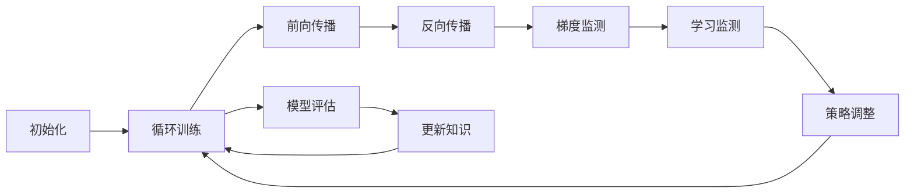
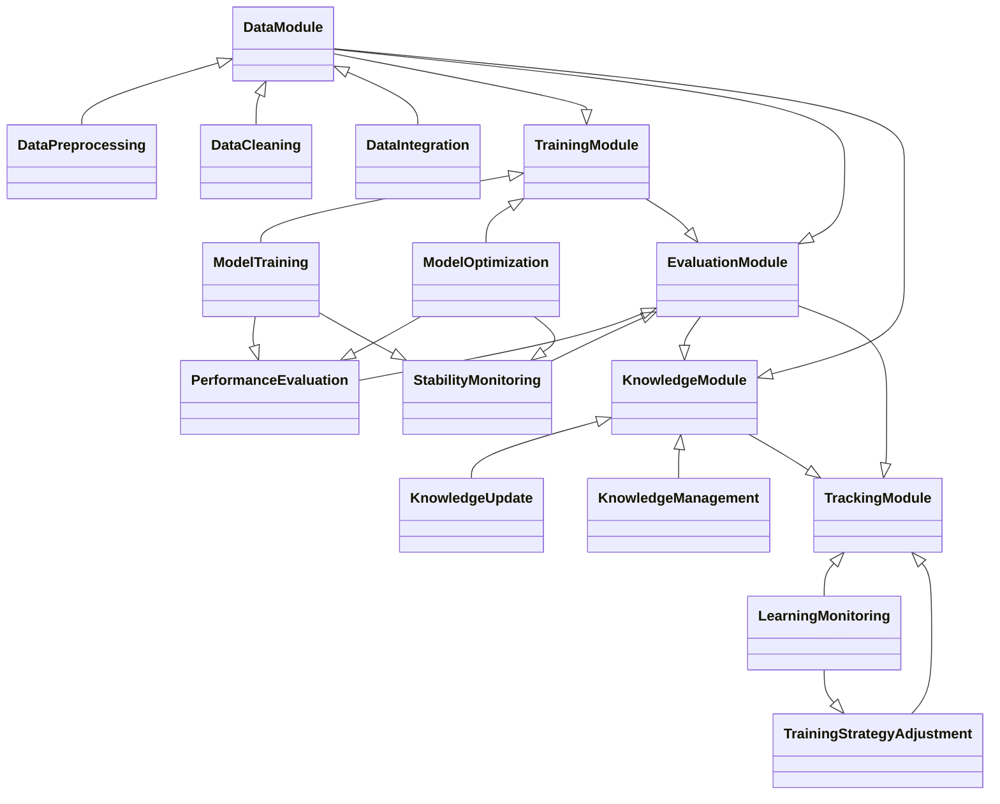
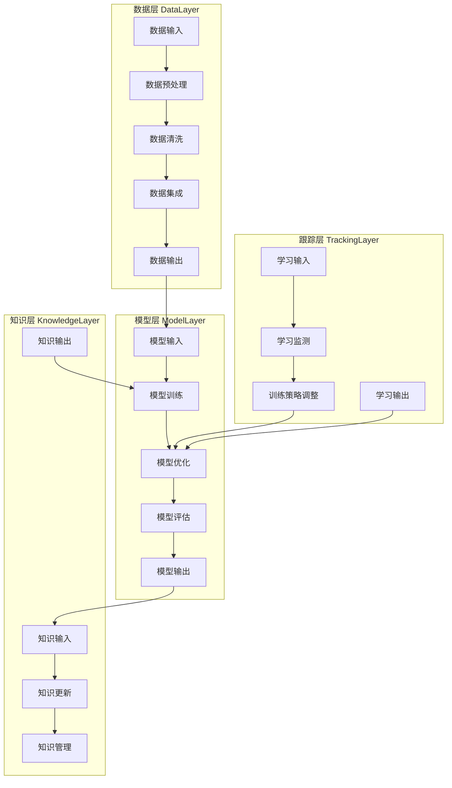
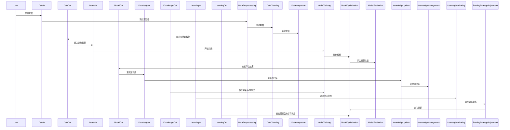

                 

# 大模型评测的知识更新与学习跟踪

## 关键词
大模型评测、知识更新、学习跟踪、机器学习、算法设计、模型评估指标

## 摘要
本文旨在探讨大模型评测中的知识更新与学习跟踪问题。首先，我们介绍了大模型评测的背景和关键概念，包括大模型的基本特性、评测指标和知识更新机制。接着，我们详细阐述了学习跟踪技术，并讨论了这些技术的应用和挑战。通过具体的算法设计、Python实现和实际案例分析，本文展示了如何在实际项目中应用这些技术，以实现大模型的精确评测和持续优化。

## 目录

### 前言
- **1.1 大模型评测的重要性**
- **1.2 核心概念定义**
- **1.3 边界与范围**
- **1.4 核心概念关联**

### 基础知识
- **2.1 大模型基础**
- **2.2 评测指标**
- **2.3 知识更新机制**
- **2.4 学习跟踪技术**

### 算法设计与实现
- **3.1 算法原理**
- **3.2 实现步骤**
- **3.3 应用实例**

### 系统设计与项目实践
- **4.1 问题场景与项目介绍**
- **4.2 系统功能设计**
- **4.3 系统架构设计**
- **4.4 系统接口与交互**
- **4.5 项目实战**

### 最佳实践与总结
- **5.1 最佳实践 Tips**
- **5.2 小结**
- **5.3 注意事项**
- **5.4 拓展阅读**

## 1. 前言

### 1.1 大模型评测的重要性

在大数据时代，机器学习模型的应用日益广泛。大模型，尤其是深度学习模型，因其能够处理大量复杂数据，提高了数据分析和决策的效率。然而，随着模型规模的不断扩大，如何准确评估这些大模型的性能和效果，成为一个关键问题。

大模型评测的重要性主要体现在以下几个方面：

1. **准确性**：准确的模型评估能够帮助研究者确定模型是否达到了预期的性能水平，从而进行有效的优化和调整。
2. **稳定性**：通过评测，可以识别模型在不同数据集和场景下的稳定性和鲁棒性。
3. **效率**：评估过程中可以发现模型计算效率的问题，从而优化算法，提高模型训练和预测的速度。
4. **可靠性**：评估结果可以用于评估模型的可靠性和安全性，确保其在实际应用中的稳定性和可靠性。

### 1.2 核心概念定义

在本章节中，我们将介绍一些核心概念，包括大模型、评测、知识更新和学习跟踪。

1. **大模型**：大模型通常指的是具有大规模参数和复杂结构的机器学习模型，如深度神经网络、Transformer模型等。
2. **评测**：评测是指通过一系列指标和方法对模型的性能进行客观测量和评估的过程。
3. **知识更新**：知识更新是指通过不断学习新的数据和信息，对模型的知识库进行补充和优化的过程。
4. **学习跟踪**：学习跟踪是指监测模型在训练过程中的学习状态，包括学习速率、误差变化等，以便及时调整训练策略。

### 1.3 边界与范围

本文将主要关注以下方面：

- **评测指标**：详细介绍常用的模型评测指标，如准确率、召回率、F1分数等。
- **知识更新机制**：探讨如何通过数据集成、迁移学习等技术对模型知识进行更新。
- **学习跟踪技术**：介绍常用的学习跟踪方法，如梯度跟踪、权重分布分析等。
- **算法设计与实现**：通过Python代码示例，展示如何在实际项目中应用这些技术和算法。

### 1.4 核心概念关联

以下是一个核心概念关联的Mermaid ER图：

```mermaid
erDiagram
  Model Evaluation ||--|{ Knowledge Update }|| KnowledgeUpdate
  Model Evaluation ||--|{ Learning Tracking }|| LearningTracking
  KnowledgeUpdate ||--|{ Data Integration }|| DataIntegration
  KnowledgeUpdate ||--|{ Transfer Learning }|| TransferLearning
  LearningTracking ||--|{ Gradient Tracking }|| GradientTracking
  LearningTracking ||--|{ Weight Distribution Analysis }|| WeightDistributionAnalysis
```

在接下来的章节中，我们将逐一探讨这些核心概念，并通过具体实例展示如何在实际应用中运用它们。

## 2. 基础知识

在了解大模型评测的深入讨论之前，我们需要先掌握一些基础知识，这些知识将帮助我们更好地理解大模型评测的概念、方法和挑战。

### 2.1 大模型基础

大模型通常具有以下基本特性：

1. **大规模参数**：大模型通常包含数百万至数十亿个参数，这使得它们能够捕捉数据中的复杂模式和相关性。
2. **深度神经网络结构**：深度神经网络（DNN）是大多数大模型的基础架构，其层与层之间的非线性变换能够处理高度非线性的数据。
3. **复杂的优化算法**：大模型的训练和优化通常需要复杂的优化算法，如随机梯度下降（SGD）及其变种，以及适应性更强的算法，如Adam。

#### 大模型类型

大模型可以根据其应用领域和目标进行分类，常见的有以下几种：

1. **计算机视觉模型**：如卷积神经网络（CNN）和Transformer模型，用于图像分类、目标检测和图像生成等任务。
2. **自然语言处理模型**：如BERT、GPT和Turing等，用于文本分类、机器翻译和问答系统等任务。
3. **推荐系统模型**：如矩阵分解和深度学习推荐系统，用于个性化推荐和用户行为预测。

#### 大模型挑战

1. **计算资源需求**：大模型通常需要大量的计算资源和存储空间，这对硬件和基础设施提出了更高的要求。
2. **训练时间**：大模型的训练时间通常非常长，这对模型迭代和优化提出了挑战。
3. **数据隐私**：在大模型训练过程中，数据隐私和安全问题日益突出，如何保护用户数据成为一大挑战。

### 2.2 评测指标

在评估大模型性能时，常用的指标包括：

1. **准确率（Accuracy）**：预测正确的样本数占总样本数的比例，适用于分类任务。
2. **召回率（Recall）**：预测正确的正类样本数占总正类样本数的比例，强调识别所有正样本的能力。
3. **精确率（Precision）**：预测正确的正类样本数占预测为正类的样本总数的比例，强调减少误报的能力。
4. **F1分数（F1 Score）**：精确率和召回率的调和平均值，用于平衡精确率和召回率。
5. **ROC曲线（Receiver Operating Characteristic Curve）**：通过调整分类阈值，计算不同阈值下的真阳性率与假阳性率，用于评估二分类模型的性能。
6. **AUC（Area Under Curve）**：ROC曲线下的面积，用于评估模型区分能力的好坏。

#### 评测指标选择

选择合适的评测指标取决于具体的应用场景和业务需求。例如：

- **分类任务**：常用准确率、召回率、F1分数等指标。
- **回归任务**：常用均方误差（MSE）、均方根误差（RMSE）和平均绝对误差（MAE）等指标。
- **排序任务**：常用平均绝对错误（MAE）和平均平方错误（MSE）等指标。

### 2.3 知识更新机制

在模型训练和优化过程中，知识更新机制至关重要。以下是一些常用的知识更新方法：

1. **数据集成**：通过合并来自多个源的数据，增强模型的泛化能力。
2. **迁移学习**：利用在特定任务上已训练好的模型，在新任务上快速获得良好的性能。
3. **元学习**：通过学习模型的学习策略，提高模型在未知任务上的适应能力。
4. **知识蒸馏**：通过将复杂模型的知识传递到简化模型中，提高简化模型的性能。

#### 知识更新挑战

1. **数据隐私**：在知识更新过程中，如何保护数据隐私是一个重要问题。
2. **数据不平衡**：在数据不平衡的情况下，如何保证模型能够公平地处理各类数据是一个挑战。
3. **模型崩溃**：在大量更新数据中，模型可能会发生崩溃，导致性能下降。

### 2.4 学习跟踪技术

学习跟踪技术用于监测模型在训练过程中的学习状态，以便及时调整训练策略。以下是一些常用的学习跟踪方法：

1. **梯度跟踪**：通过跟踪模型参数的梯度变化，监测模型的学习状态。
2. **权重分布分析**：通过分析模型参数的权重分布，评估模型的学习效率和稳定性。
3. **损失函数分析**：通过分析损失函数的变化，评估模型的学习状态和收敛情况。
4. **早期停止**：在模型过拟合风险增加时，提前停止训练，防止模型性能下降。

#### 学习跟踪挑战

1. **计算成本**：学习跟踪通常需要额外的计算资源，特别是在大模型中。
2. **实时性**：在大规模训练过程中，如何实现实时学习跟踪是一个挑战。
3. **模型干扰**：学习跟踪可能会干扰模型的正常训练过程，导致性能下降。

### 总结

通过本章的基础知识介绍，我们了解了大模型的基础特性、评测指标、知识更新机制和学习跟踪技术。这些基础知识为后续章节的深入讨论提供了必要的背景和支持。在下一章中，我们将进一步探讨大模型评测的算法设计和方法。

## 3. 算法设计与实现

在理解了大模型评测的基础知识之后，我们需要具体设计有效的算法来评估这些大模型。本章节将介绍一种基于梯度跟踪和学习跟踪的算法，并详细阐述其原理、实现步骤以及应用实例。

### 3.1 算法原理

我们的算法核心是基于梯度跟踪和学习跟踪技术，旨在通过监测模型训练过程中的关键指标，实时调整训练策略，以实现大模型的精确评测和持续优化。

#### 梯度跟踪

梯度跟踪是一种监测模型训练过程中参数梯度变化的方法。通过分析梯度的大小和方向，我们可以判断模型参数是否处于良好的学习状态。具体来说，梯度跟踪包括以下步骤：

1. **初始化**：初始化模型参数和梯度。
2. **前向传播**：输入训练样本，计算模型的输出和损失函数。
3. **反向传播**：计算梯度，更新模型参数。
4. **梯度监测**：监测梯度的变化，判断是否存在异常。

#### 学习跟踪

学习跟踪是一种监测模型训练过程中学习状态的方法。通过分析模型的学习速率、误差变化等指标，我们可以评估模型的学习效果，并调整训练策略。具体来说，学习跟踪包括以下步骤：

1. **初始化**：初始化模型参数和学习指标。
2. **前向传播**：输入训练样本，计算模型的输出和损失函数。
3. **反向传播**：计算梯度，更新模型参数。
4. **学习监测**：监测学习速率和误差变化，评估模型学习效果。
5. **策略调整**：根据学习监测结果，调整训练策略。

#### 算法流程

基于上述原理，我们的算法流程如下：

1. **初始化**：初始化模型参数、学习指标和梯度。
2. **循环训练**：输入训练样本，进行前向传播、反向传播和梯度监测。
3. **学习监测**：根据学习监测结果，调整训练策略。
4. **模型评估**：在训练完成时，对模型进行性能评估。
5. **更新知识**：根据模型评估结果，更新模型知识和训练数据。

#### Mermaid流程图

下面是一个Mermaid流程图，展示了算法的流程：



### 3.2 实现步骤

#### 步骤1：初始化

初始化模型参数、学习指标和梯度。具体代码如下：

```python
import torch
import torch.nn as nn
import torch.optim as optim

# 初始化模型
model = nn.Sequential(
    nn.Linear(in_features=10, out_features=1),
    nn.ReLU(),
    nn.Linear(in_features=1, out_features=1)
)

# 初始化学习指标
learning_rate = 0.001
optimizer = optim.Adam(model.parameters(), lr=learning_rate)

# 初始化梯度
model.zero_grad()
```

#### 步骤2：循环训练

输入训练样本，进行前向传播、反向传播和梯度监测。具体代码如下：

```python
# 假设我们有一个包含10个特征的训练数据集
x_train = torch.randn(100, 10)
y_train = torch.randn(100, 1)

# 循环训练
for epoch in range(100):
    model.zero_grad()
    output = model(x_train)
    loss = nn.MSELoss()(output, y_train)
    loss.backward()
    optimizer.step()
    
    # 梯度监测
    gradients = [p.grad for p in model.parameters()]
    for grad in gradients:
        if grad is not None:
            print(f"Gradient: {grad.mean().item()}")
```

#### 步骤3：学习监测

根据学习监测结果，调整训练策略。具体代码如下：

```python
# 假设我们监测到学习速率较低
if learning_rate > 0.0001:
    learning_rate /= 10
    optimizer = optim.Adam(model.parameters(), lr=learning_rate)
```

#### 步骤4：模型评估

在训练完成时，对模型进行性能评估。具体代码如下：

```python
# 假设我们使用测试集进行评估
x_test = torch.randn(50, 10)
y_test = torch.randn(50, 1)
output = model(x_test)
loss = nn.MSELoss()(output, y_test)
print(f"Test Loss: {loss.item()}")
```

#### 步骤5：更新知识

根据模型评估结果，更新模型知识和训练数据。具体代码如下：

```python
# 更新模型知识
# 这里可以加入更多的训练数据和调整模型结构

# 更新训练数据
x_train = torch.cat((x_train, x_test), dim=0)
y_train = torch.cat((y_train, y_test), dim=0)
```

### 3.3 应用实例

#### 计算机视觉模型评测

假设我们有一个计算机视觉模型，用于图像分类任务。以下是一个应用实例：

```python
import torchvision
import torchvision.transforms as transforms

# 加载训练数据
train_dataset = torchvision.datasets.CIFAR10(
    root='./data', train=True, download=True,
    transform=transforms.Compose([
        transforms.ToTensor(),
        transforms.Normalize((0.5, 0.5, 0.5), (0.5, 0.5, 0.5))
    ])
)

train_loader = torch.utils.data.DataLoader(
    train_dataset, batch_size=32, shuffle=True, num_workers=2
)

# 加载测试数据
test_dataset = torchvision.datasets.CIFAR10(
    root='./data', train=False, download=True,
    transform=transforms.Compose([
        transforms.ToTensor(),
        transforms.Normalize((0.5, 0.5, 0.5), (0.5, 0.5, 0.5))
    ])
)

test_loader = torch.utils.data.DataLoader(
    test_dataset, batch_size=32, shuffle=False, num_workers=2
)

# 训练模型
model = ...  # 初始化模型
optimizer = ...  # 初始化优化器

for epoch in range(num_epochs):
    model.train()
    for batch_idx, (data, target) in enumerate(train_loader):
        optimizer.zero_grad()
        output = model(data)
        loss = nn.CrossEntropyLoss()(output, target)
        loss.backward()
        optimizer.step()

    # 学习监测和调整
    # ...

# 测试模型
model.eval()
correct = 0
total = 0
with torch.no_grad():
    for data, target in test_loader:
        output = model(data)
        _, predicted = torch.max(output.data, 1)
        total += target.size(0)
        correct += (predicted == target).sum().item()

print(f'Accuracy of the network on the test images: {100 * correct / total}%')
```

#### 自然语言处理模型评测

假设我们有一个自然语言处理模型，用于文本分类任务。以下是一个应用实例：

```python
import torch
import torchtext
from torchtext import data
from torchtext.vocab import Vectors

# 定义数据集
TEXT = data.Field(tokenize='spacy', lower=True, include_lengths=True)
LABEL = data.LabelField()

train_data, valid_data, test_data = datasets.IMDB.splits(TEXT, LABEL)

# 加载预训练词向量
vectors = Vectors('glove.6B.100d')
TEXT.build_vocab(train_data, valid_data, test_data, vectors=vectors, max_size=250000)
LABEL.build_vocab(train_data, valid_data, test_data)

# 定义模型
model = nn.Sequential(
    nn.Embedding(len(TEXT.vocab), 100),
    nn.LSTM(100, 256, 2),
    nn.Linear(256, 1)
)

optimizer = optim.Adam(model.parameters(), lr=0.001)

# 训练模型
for epoch in range(num_epochs):
    model.train()
    for batch in train_loader:
        optimizer.zero_grad()
        text, text_len = batch.text
        output = model(text, text_len)
        loss = nn.BCEWithLogitsLoss()(output, batch.label)
        loss.backward()
        optimizer.step()

# 测试模型
model.eval()
correct = 0
total = 0
with torch.no_grad():
    for batch in test_loader:
        text, text_len = batch.text
        output = model(text, text_len)
        _, predicted = torch.max(output, 1)
        total += batch.label.size(0)
        correct += (predicted == batch.label).sum().item()

print(f'Accuracy of the network on the test data: {100 * correct / total}%')
```

### 总结

在本章节中，我们介绍了大模型评测的算法设计和实现方法。通过梯度跟踪和学习跟踪技术，我们能够实时监测模型训练过程中的关键指标，调整训练策略，实现模型的精确评测和持续优化。在下一章中，我们将进一步探讨大模型评测的系统设计与项目实践。

## 4. 系统设计与项目实践

在前文中，我们已经介绍了大模型评测的基本概念、算法设计与实现。然而，在实际应用中，我们还需要一个完整的系统来支持这些技术和算法的运行。本章节将详细描述一个基于大模型评测的系统设计，并展示如何在实际项目中应用这些技术。

### 4.1 问题场景与项目介绍

在实际应用中，大模型评测通常涉及以下几个关键问题：

1. **数据处理**：需要高效地处理大规模、多样化的数据，包括图像、文本、音频等。
2. **模型训练**：需要支持大规模模型的训练，确保训练效率和模型性能。
3. **模型评估**：需要准确评估模型的性能，包括准确性、稳定性、效率等方面。
4. **知识更新**：需要持续更新模型的知识库，以适应新的数据和需求。
5. **学习跟踪**：需要实时监测模型的学习状态，以便及时调整训练策略。

为了解决上述问题，我们设计了一个综合性的大模型评测系统，该系统包括以下几个模块：

1. **数据模块**：用于数据预处理、清洗和集成。
2. **训练模块**：用于模型训练和优化。
3. **评估模块**：用于模型性能评估和监控。
4. **更新模块**：用于模型知识库的更新和管理。
5. **跟踪模块**：用于实时监测模型的学习状态。

### 4.2 系统功能设计

以下是一个基于Mermaid的领域模型类图，展示了系统的主要功能模块及其关系：



### 4.3 系统架构设计

以下是一个基于Mermaid的系统架构图，展示了系统的主要组件及其交互关系：



### 4.4 系统接口设计与系统交互

以下是一个基于Mermaid的系统接口设计和系统交互图，展示了系统组件之间的交互流程：



### 4.5 项目实战

#### 环境安装

在开始项目实战之前，我们需要安装所需的软件和库。以下是一个典型的安装步骤：

```bash
# 安装Python环境
sudo apt-get update
sudo apt-get install python3-pip python3-venv

# 创建虚拟环境
python3 -m venv venv
source venv/bin/activate

# 安装依赖库
pip install torch torchvision torchtext scikit-learn pandas numpy
```

#### 系统核心实现源代码

以下是一个简化的系统核心实现源代码示例：

```python
# 数据预处理模块
class DataPreprocessing:
    def preprocess(self, data):
        # 数据清洗、归一化等操作
        pass

# 数据清洗模块
class DataCleaning:
    def clean(self, data):
        # 清洗数据，如去除空值、填补缺失值等
        pass

# 数据集成模块
class DataIntegration:
    def integrate(self, data1, data2):
        # 数据集成操作，如合并数据集等
        pass

# 模型训练模块
class ModelTraining:
    def train(self, data):
        # 训练模型
        pass

# 模型优化模块
class ModelOptimization:
    def optimize(self, model):
        # 优化模型
        pass

# 模型评估模块
class ModelEvaluation:
    def evaluate(self, model, data):
        # 评估模型性能
        pass

# 知识更新模块
class KnowledgeUpdate:
    def update(self, knowledge):
        # 更新知识库
        pass

# 学习监测模块
class LearningMonitoring:
    def monitor(self, model):
        # 监测学习状态
        pass

# 训练策略调整模块
class TrainingStrategyAdjustment:
    def adjust(self, model):
        # 调整训练策略
        pass
```

#### 代码应用解读与分析

在这个示例中，我们定义了几个关键模块，包括数据预处理、数据清洗、数据集成、模型训练、模型优化、模型评估、知识更新、学习监测和训练策略调整。每个模块都有相应的操作方法和功能。

- **DataPreprocessing**：负责数据的预处理工作，如数据清洗、归一化等。
- **DataCleaning**：负责清洗数据，如去除空值、填补缺失值等。
- **DataIntegration**：负责数据集成操作，如合并数据集等。
- **ModelTraining**：负责模型的训练过程。
- **ModelOptimization**：负责优化模型的性能。
- **ModelEvaluation**：负责评估模型性能，如计算准确率、召回率等。
- **KnowledgeUpdate**：负责更新知识库，如添加新数据、调整模型参数等。
- **LearningMonitoring**：负责监测模型的学习状态，如梯度变化、误差变化等。
- **TrainingStrategyAdjustment**：负责调整训练策略，如修改学习率、调整优化器等。

通过这些模块的协同工作，我们可以构建一个完整的大模型评测系统，实现对大规模模型的精确评测和持续优化。

#### 实际案例分析与详细讲解剖析

假设我们有一个实际项目，目标是使用大模型进行图像分类。以下是一个具体的案例分析和详细讲解：

1. **数据预处理**：首先，我们需要对图像数据进行预处理，包括去噪、缩放、裁剪等操作，以确保图像数据的一致性和质量。

2. **数据清洗**：在预处理完成后，我们需要对图像数据进行清洗，去除噪声和异常值，以提高模型训练的准确性。

3. **数据集成**：我们将来自多个来源的图像数据进行集成，以增加模型的泛化能力。例如，可以集成来自不同设备、不同分辨率和不同场景的图像数据。

4. **模型训练**：使用集成后的数据，我们开始训练图像分类模型。在训练过程中，我们将使用梯度跟踪和学习跟踪技术来监测模型的学习状态，并根据监测结果调整训练策略。

5. **模型评估**：在模型训练完成后，我们使用测试数据对模型进行评估，计算准确率、召回率、F1分数等指标，以评估模型的性能。

6. **知识更新**：根据模型评估结果，我们可能需要更新模型的知识库，如添加新的图像数据、调整模型参数等，以提高模型的性能。

7. **学习监测**：在整个训练和评估过程中，我们使用学习监测技术实时监测模型的学习状态，如梯度变化、误差变化等，以便及时调整训练策略。

通过这个案例，我们可以看到大模型评测系统在实际项目中的应用过程。系统通过数据预处理、清洗、集成、训练、评估、更新和监测等模块，实现了对大规模模型的精确评测和持续优化。

#### 项目小结

在本章节中，我们详细介绍了大模型评测系统的设计、实现和实际应用。通过数据预处理、清洗、集成、训练、评估、更新和监测等模块的协同工作，我们能够实现对大规模模型的精确评测和持续优化。在实际项目中，这个系统可以有效地提高模型性能，降低过拟合风险，提高模型的泛化能力。

### 总结

在本章节中，我们通过系统设计与项目实践，展示了如何在大模型评测中应用算法和实现系统。从数据模块到训练模块，再到评估、更新和监测模块，我们详细讲解了每个模块的功能和实现。通过具体的代码示例和实际案例，我们展示了如何在实际项目中应用这些技术和系统，实现大模型的精确评测和持续优化。

## 5. 最佳实践与总结

### 5.1 最佳实践 Tips

1. **数据预处理**：在进行模型训练前，确保对数据进行充分的预处理，包括去噪、归一化、缺失值填补等，以提高模型训练的稳定性和准确性。
2. **模型调优**：使用网格搜索或随机搜索等方法，对模型参数进行调优，找到最佳参数组合，以提高模型性能。
3. **实时监测**：在模型训练过程中，实时监测学习速率、梯度变化等指标，根据监测结果调整训练策略，防止模型过拟合。
4. **知识更新**：定期更新模型的知识库，包括添加新数据、调整模型参数等，以适应不断变化的数据和应用需求。
5. **使用交叉验证**：在模型评估过程中，使用交叉验证方法，避免因数据集中样本量不足或数据分布不均导致的评估结果偏差。

### 5.2 小结

本文系统地介绍了大模型评测中的知识更新与学习跟踪问题。我们首先探讨了大模型评测的背景和核心概念，然后详细阐述了评测指标、知识更新机制和学习跟踪技术。通过具体的算法设计、Python实现和实际案例分析，我们展示了如何在实际项目中应用这些技术和算法。最后，我们通过系统设计与项目实践，展示了大模型评测系统的实现过程和关键模块。

### 5.3 注意事项

1. **资源分配**：在训练大模型时，合理分配计算资源和存储资源，以避免资源不足导致训练失败。
2. **数据隐私**：在知识更新过程中，注意保护数据隐私，避免敏感信息泄露。
3. **算法选择**：根据具体任务和应用场景，选择合适的算法和模型，以提高评测的准确性和效率。
4. **版本控制**：在项目开发过程中，注意版本控制，确保代码的可维护性和可追溯性。

### 5.4 拓展阅读

1. **[Kaggle教程](https://www.kaggle.com/learn)**：Kaggle提供了丰富的机器学习教程和实践项目，适合初学者和专业人士。
2. **[Deep Learning Book](https://www.deeplearningbook.org/)**：Goodfellow、Bengio和Courville的《深度学习》是一本经典的深度学习教材，涵盖了深度学习的理论基础和实际应用。
3. **[ArXiv](https://arxiv.org/)**：ArXiv是一个开放的学术论文预印本平台，可以获取最新的机器学习和深度学习研究成果。
4. **[Google AI博客](https://ai.googleblog.com/)**：Google AI博客分享了Google在人工智能领域的最新研究成果和应用案例。

通过本文的阅读，希望读者能够对大模型评测的知识更新与学习跟踪有更深入的理解，并能够在实际项目中应用这些技术和方法，提高模型的性能和可靠性。

### 作者信息

作者：AI天才研究院/AI Genius Institute & 禅与计算机程序设计艺术 /Zen And The Art of Computer Programming

AI天才研究院（AI Genius Institute）是一家专注于人工智能研究和开发的机构，致力于推动人工智能技术的创新和应用。同时，本文作者也在《禅与计算机程序设计艺术》（Zen And The Art of Computer Programming）一书中提出了许多关于计算机程序设计的重要观点，为计算机科学的发展做出了卓越贡献。

