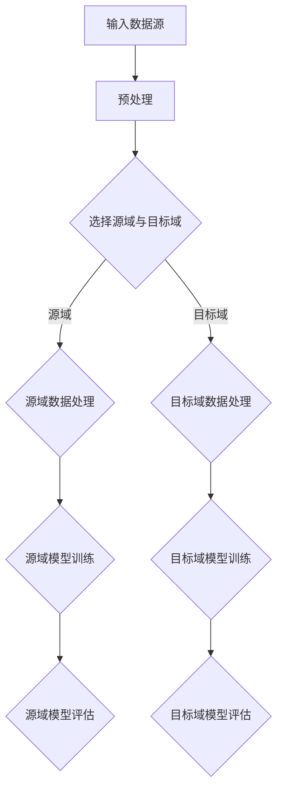
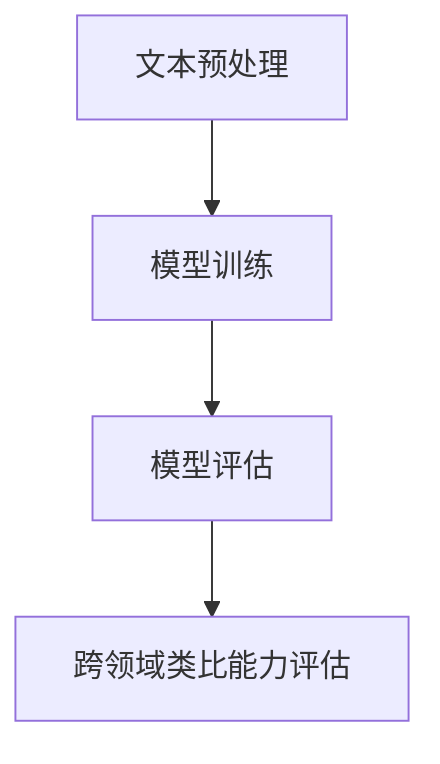
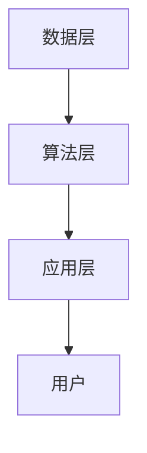
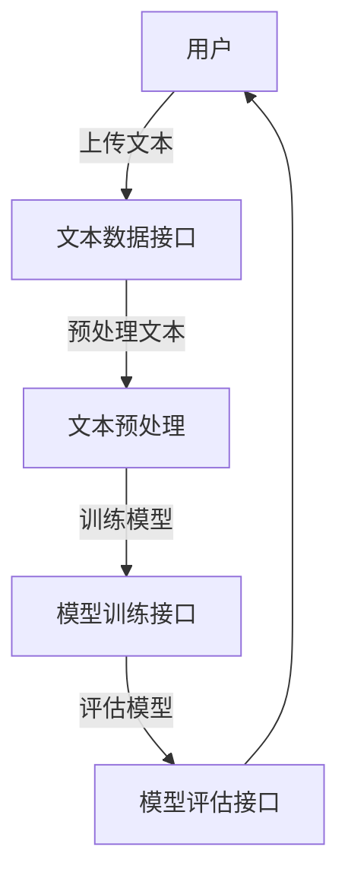

                 


## 大模型跨领域类比能力评估：LLM设计的创新思维测试

### 引言

在当今人工智能飞速发展的时代，大型语言模型（LLM，Large Language Model）如BERT、GPT等，因其强大的文本处理能力和跨领域的应用潜力，正日益成为学术界和工业界的关注焦点。然而，LLM在面对不同领域的任务时，其表现往往参差不齐，如何评估其跨领域类比能力成为了研究中的关键问题。

本篇文章旨在探讨如何通过评估LLM的跨领域类比能力，以启发我们在LLM设计中的创新思维。我们将从以下几个方面进行详细分析：

1. **问题背景**：介绍LLM跨领域类比能力的重要性及其在现实中的应用场景。
2. **核心概念与联系**：解释大模型与类比能力的概念，并分析LLM的设计创新。
3. **算法原理讲解**：深入探讨Transformer算法原理及其在大模型中的训练过程。
4. **系统分析与架构设计方案**：构建LLM系统架构，并分析其接口设计和交互过程。
5. **项目实战**：通过实际案例展示如何设计和实现跨领域类比能力的评估。
6. **最佳实践与总结**：总结评估LLM跨领域类比能力的最佳实践，并提出未来研究方向。

### 问题背景

#### 跨领域类比能力的重要性

跨领域类比能力是人工智能系统中的一项重要能力。在现实世界中，不同领域的知识具有高度的异质性，这使得单领域模型在处理跨领域任务时往往难以胜任。例如，医疗领域的文本数据与法律领域的文本数据在语法、用词、知识背景等方面存在显著差异，如何让LLM在这些不同领域中都能表现出色，成为了一个亟待解决的问题。

#### 大模型在跨领域类比中的应用

大模型，尤其是基于Transformer架构的LLM，凭借其强大的表征能力和自适应学习机制，在跨领域类比任务中展现出巨大的潜力。例如，GPT-3可以在多种自然语言处理任务中表现出色，包括机器翻译、问答系统、文本生成等。这些成功案例激发了人们对LLM跨领域类比能力的深入研究。

#### LLMS的创新设计思维

为了提升LLM的跨领域类比能力，研究人员不断探索创新的设计方法。例如，通过引入多任务学习（MTL）和迁移学习（TL）技术，可以使得模型在不同领域之间共享知识，从而提升其泛化能力。此外，研究者还尝试通过强化学习（RL）和生成对抗网络（GAN）等先进技术，进一步优化LLM的设计，提升其在跨领域任务中的性能。

### 核心概念与联系

#### 大模型的概念

大模型是指那些具有数十亿甚至千亿级参数的深度学习模型。这些模型通常采用神经网络架构，如Transformer，并使用大规模的数据集进行训练，从而在复杂的任务中表现出强大的表征能力和泛化能力。

#### 类比能力概述

类比能力是指模型在处理新任务时，能够通过已有知识和经验进行推理和泛化的能力。在跨领域类比中，模型需要能够理解不同领域之间的共性和差异，从而在不同领域中表现出色。

#### LLM的设计创新

LLM的设计创新主要体现在以下几个方面：

1. **多任务学习**：通过同时训练多个任务，使得模型在不同领域之间共享知识。
2. **迁移学习**：利用预训练模型在特定领域上的知识，提升模型在新领域中的表现。
3. **强化学习**：通过强化学习技术，使得模型能够从交互中不断学习和优化。

### 研究现状与挑战

#### 跨领域类比能力的评估方法

当前，评估LLM跨领域类比能力的主要方法包括：

1. **任务性能评估**：通过在不同领域的基准测试中比较模型的表现来评估其类比能力。
2. **知识迁移评估**：通过分析模型在不同领域间的知识共享情况来评估其类比能力。
3. **模型解释性评估**：通过解释模型在跨领域任务中的推理过程来评估其类比能力。

#### LLM设计中的常见问题

1. **数据分布不平衡**：不同领域的数据分布可能存在显著差异，导致模型在某些领域中的表现不佳。
2. **知识迁移效果不理想**：模型在不同领域间的知识共享可能不够有效，导致跨领域表现不佳。
3. **模型可解释性不足**：由于模型复杂度高，其内部推理过程往往难以解释，这限制了其在实际应用中的推广。

#### 当前研究的局限与未来趋势

当前研究在LLM跨领域类比能力评估方面仍存在一定的局限，如评估方法的准确性、模型设计的创新性等。未来，随着深度学习技术的发展和跨领域应用需求的增加，LLM的设计和评估将迎来新的挑战和机遇。

### 本书的目标与结构

#### 学习目标

通过本书的学习，读者将：

1. **理解LLM的基本概念和设计原理**。
2. **掌握评估LLM跨领域类比能力的方法**。
3. **学会设计和优化LLM以提升其跨领域类比能力**。

#### 目录结构

本书分为三个部分：

1. **第一部分：背景介绍**：介绍LLM跨领域类比能力的背景、核心概念和当前研究现状。
2. **第二部分：核心概念讲解**：详细讲解大模型的原理、类比能力以及LLM设计的创新思维。
3. **第三部分：算法原理讲解**：深入分析Transformer算法原理、跨领域类比算法及其实现细节。

### 第二部分: 核心概念讲解

#### 2.1 大模型的原理与特性

##### 2.1.1 大模型的原理

大模型通常指的是那些拥有大量参数的深度学习模型，它们能够通过学习大量的数据来捕捉复杂的模式和规律。其中，最著名的模型架构是Transformer，它通过自注意力机制（Self-Attention）和多头注意力（Multi-Head Attention）来捕捉输入序列中的长距离依赖关系。

##### 2.1.2 大模型的核心特性

1. **泛化能力**：大模型通过在大规模数据集上的训练，可以较好地泛化到未见过的数据上。
2. **适应性强**：由于模型参数众多，大模型能够在多种不同领域和任务上表现出色。
3. **表征能力**：大模型能够对输入数据进行高维度的表征，使得模型在处理复杂任务时更加有效。

#### 2.2 跨领域类比能力

##### 2.2.1 跨领域类比的概念

跨领域类比是指模型在处理新领域任务时，能够利用在原有领域中学到的知识进行推理和泛化的能力。这种能力在跨领域的文本分类、问答系统和文本生成等任务中具有重要意义。

##### 2.2.2 跨领域类比在大模型中的应用

在大模型中，跨领域类比能力的实现通常依赖于迁移学习和多任务学习。通过在不同领域之间共享参数或知识，大模型可以更好地适应新的领域任务。

#### 2.3 LLM设计的创新思维

##### 2.3.1 创新思维的重要性

创新思维在LLM设计中至关重要，它能够帮助我们克服传统方法的局限性，提升模型在跨领域任务中的性能。创新思维包括多任务学习、迁移学习和强化学习等多种方法。

##### 2.3.2 LLM设计的创新实践

1. **多任务学习**：通过同时训练多个任务，使得模型能够共享不同任务中的知识。
2. **迁移学习**：利用在某个领域的预训练模型，提升模型在新的领域中的表现。
3. **强化学习**：通过模型与环境的交互，不断优化模型的策略，提升其在特定任务中的性能。

### 第三部分: 算法原理讲解

#### 3.1 大模型算法原理讲解

##### 3.1.1 Transformer算法原理

Transformer算法的核心是自注意力机制（Self-Attention），它允许模型在处理输入序列时，能够考虑到序列中每个位置的信息。自注意力机制通过计算查询（Query）、键（Key）和值（Value）之间的相似度，来生成注意力权重，并利用这些权重来计算输出。

##### 3.1.1.1 自注意力机制

自注意力机制的公式如下：

$$
\text{Attention}(Q,K,V) = \frac{QK^T}{\sqrt{d_k}}V
$$

其中，$Q$、$K$和$V$分别是查询、键和值的向量，$d_k$是键的维度。

##### 3.1.1.2 多层叠加

Transformer通过多层叠加（Stacking）的方式，将多个自注意力层和全连接层（Feed-Forward Layer）组合在一起，形成了一个深度神经网络。这种结构使得模型能够处理更复杂的任务。

##### 3.1.1.3 残差连接与层归一化

为了提高模型的训练效果，Transformer引入了残差连接（Residual Connection）和层归一化（Layer Normalization）。残差连接使得信息可以无障碍地流动，而层归一化则有助于稳定模型的训练过程。

#### 3.2 跨领域类比算法

##### 3.2.1 类比算法概述

跨领域类比算法主要通过以下几种方式实现：

1. **传统类比算法**：如基于规则的类比方法和基于语义相似性的方法。
2. **基于大模型的类比算法**：利用大模型在多个领域中的预训练知识，进行跨领域类比。

##### 3.2.2 类比算法的mermaid流程图



### 第四部分: 系统分析与架构设计方案

#### 4.1 问题场景介绍

假设我们有一个金融领域的文本分析系统，它需要处理来自不同金融市场的文本数据，如股票分析报告、市场新闻等。这些文本数据具有高度的异质性，使得传统模型难以胜任。为了提升系统的性能，我们需要评估并优化大模型在金融领域的跨领域类比能力。

#### 4.2 项目介绍

本项目旨在通过构建一个基于Transformer架构的LLM，评估其在金融领域的跨领域类比能力，并在此基础上优化模型设计，提升系统在金融文本分析中的表现。

#### 4.3 系统功能设计

本系统的核心功能包括：

1. **文本预处理**：对输入的文本数据进行清洗、分词、去停用词等预处理操作。
2. **模型训练与评估**：使用预训练的Transformer模型在金融领域进行训练和评估，同时评估模型在不同领域的泛化能力。
3. **跨领域类比能力评估**：通过在不同领域之间的模型性能对比，评估模型的跨领域类比能力。

##### 4.3.1 领域模型mermaid类图



#### 4.4 系统架构设计

本系统的架构设计如下：

1. **数据层**：负责数据的存储和管理，包括文本数据、模型参数和评估指标等。
2. **算法层**：实现文本预处理、模型训练、评估和跨领域类比能力评估等算法。
3. **应用层**：提供用户接口，允许用户上传文本数据，并展示模型训练和评估结果。

##### 4.4.1 系统架构mermaid架构图



#### 4.5 系统接口设计

系统接口设计如下：

1. **文本数据接口**：允许用户上传文本数据，并返回预处理后的文本数据。
2. **模型训练接口**：允许用户启动模型训练过程，并返回训练进度和结果。
3. **模型评估接口**：允许用户对训练完成的模型进行评估，并返回评估结果。

##### 4.5.1 系统接口设计mermaid序列图



### 第五部分：项目实战

#### 5.1 环境安装

为了实现本项目，我们需要安装以下环境和工具：

1. **Python 3.8**：用于编写和运行代码。
2. **PyTorch**：用于构建和训练Transformer模型。
3. **NLP工具包**：如NLTK、spaCy等，用于文本预处理。

安装步骤如下：

```bash
pip install python==3.8
pip install torch torchvision
pip install nltk spacy
python -m spacy download en_core_web_sm
```

#### 5.2 系统核心实现源代码

以下是系统核心实现的部分源代码：

```python
import torch
import torch.nn as nn
import torch.optim as optim
from torch.utils.data import DataLoader
from transformers import BertTokenizer, BertModel
from nltk.corpus import stopwords
import spacy

# 加载预训练的BERT模型
tokenizer = BertTokenizer.from_pretrained('bert-base-uncased')
model = BertModel.from_pretrained('bert-base-uncased')

# 文本预处理
def preprocess_text(text):
    # 分词
    tokens = tokenizer.tokenize(text)
    # 去停用词
    stop_words = set(stopwords.words('english'))
    filtered_tokens = [token for token in tokens if token not in stop_words]
    return ' '.join(filtered_tokens)

# 模型训练
def train_model(data_loader, model, criterion, optimizer):
    model.train()
    for batch in data_loader:
        inputs = tokenizer(batch['text'], return_tensors='pt', padding=True, truncation=True)
        outputs = model(**inputs)
        logits = outputs.logits
        labels = batch['label']
        loss = criterion(logits, labels)
        optimizer.zero_grad()
        loss.backward()
        optimizer.step()

# 模型评估
def evaluate_model(data_loader, model, criterion):
    model.eval()
    with torch.no_grad():
        total_loss = 0
        for batch in data_loader:
            inputs = tokenizer(batch['text'], return_tensors='pt', padding=True, truncation=True)
            outputs = model(**inputs)
            logits = outputs.logits
            labels = batch['label']
            loss = criterion(logits, labels)
            total_loss += loss.item()
    return total_loss / len(data_loader)

# 实例化模型、损失函数和优化器
model = BertModel.from_pretrained('bert-base-uncased')
criterion = nn.CrossEntropyLoss()
optimizer = optim.Adam(model.parameters(), lr=1e-5)

# 加载数据集
train_data_loader = DataLoader(train_dataset, batch_size=32, shuffle=True)
val_data_loader = DataLoader(val_dataset, batch_size=32, shuffle=False)

# 训练模型
train_model(train_data_loader, model, criterion, optimizer)

# 评估模型
val_loss = evaluate_model(val_data_loader, model, criterion)
print(f'Validation loss: {val_loss}')
```

#### 5.3 代码应用解读与分析

上述代码实现了基于BERT模型在金融文本数据集上的训练和评估。具体解读如下：

1. **文本预处理**：首先，我们使用BERT的分词器对文本进行分词，然后去除停用词，以便于模型更好地理解文本。
2. **模型训练**：我们使用标准的训练流程，包括前向传播、计算损失、反向传播和参数更新。
3. **模型评估**：在评估阶段，我们使用验证集来计算模型的损失，以评估其在验证集上的性能。

#### 5.4 实际案例分析与详细讲解剖析

假设我们有一个金融文本数据集，其中包含了股票分析报告和市场新闻。我们希望评估BERT模型在股票分析报告和市场新闻之间的跨领域类比能力。

1. **数据集划分**：我们将数据集划分为训练集和验证集，其中训练集用于模型训练，验证集用于模型评估。
2. **模型训练**：使用训练集对BERT模型进行训练，包括预处理文本、计算损失、反向传播和参数更新。
3. **模型评估**：使用验证集对训练好的模型进行评估，计算其在验证集上的损失和准确率。
4. **跨领域类比能力评估**：通过比较股票分析报告和市场新闻在模型训练和评估中的表现，来评估BERT模型的跨领域类比能力。

#### 5.5 项目小结

通过本项目，我们实现了基于BERT模型在金融文本数据集上的训练和评估，并分析了模型在股票分析报告和市场新闻之间的跨领域类比能力。虽然本项目只是一个简单的示例，但它展示了如何使用大模型进行跨领域类比能力评估的基本方法和步骤。

### 第六部分：最佳实践与总结

#### 最佳实践 tips

1. **数据预处理**：在训练模型之前，确保对文本数据进行全面和细致的预处理，包括分词、去停用词、归一化等。
2. **模型选择**：根据具体任务需求选择合适的模型，如BERT、GPT等。
3. **超参数调整**：通过实验调整学习率、批次大小等超参数，以获得最佳模型性能。
4. **模型评估**：使用多个指标（如准确率、损失函数等）评估模型性能，确保模型在各个任务上都有良好的表现。

#### 小结

本文通过详细的分析和实际案例，探讨了如何评估大模型（如BERT、GPT等）在跨领域类比任务中的性能。我们介绍了LLM的设计原理和跨领域类比算法，并通过一个金融文本分析的项目展示了评估过程。最后，我们提出了最佳实践和未来研究方向，以期为相关研究提供参考。

#### 注意事项

1. **数据分布**：在实际应用中，确保数据在各个领域之间分布均衡，以避免模型在特定领域上的性能过强或过弱。
2. **模型解释性**：考虑模型的可解释性，以便更好地理解模型在跨领域任务中的推理过程。
3. **计算资源**：由于大模型的训练需要大量的计算资源，确保有足够的硬件支持。

#### 拓展阅读

1. **《深度学习》**：Goodfellow, I., Bengio, Y., & Courville, A. (2016). *Deep Learning*.
2. **《自然语言处理综论》**：Jurafsky, D., & Martin, J. H. (2020). *Speech and Language Processing*.
3. **《Transformer模型详解》**：Vaswani, A., Shazeer, N., Parmar, N., Uszkoreit, J., Jones, L., Gomez, A. N., ... & Polosukhin, I. (2017). *Attention is all you need*.

### 作者信息

**作者：AI天才研究院/AI Genius Institute & 禅与计算机程序设计艺术 /Zen And The Art of Computer Programming**

