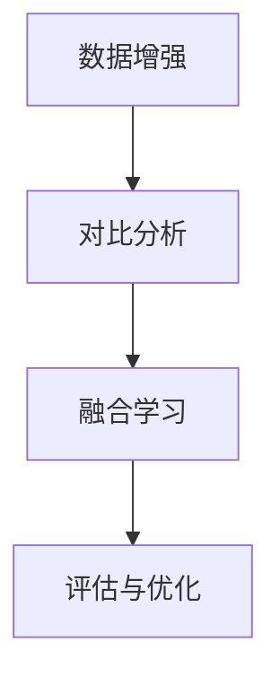
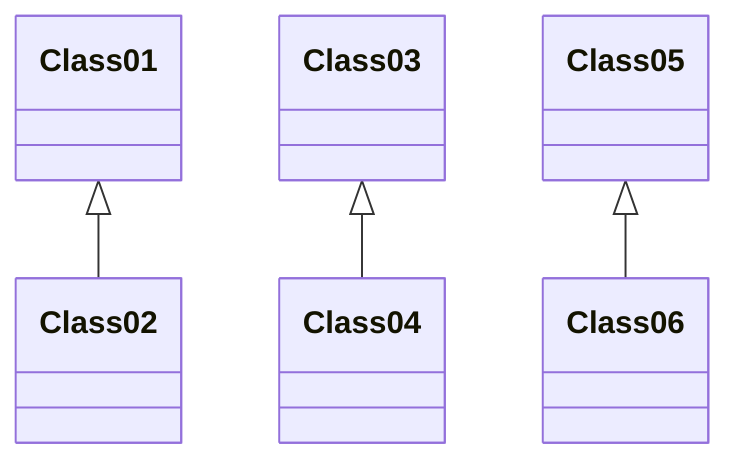
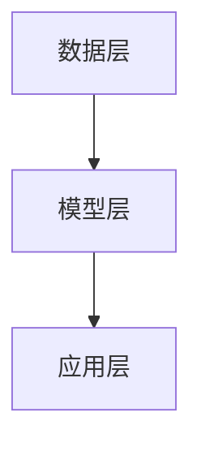
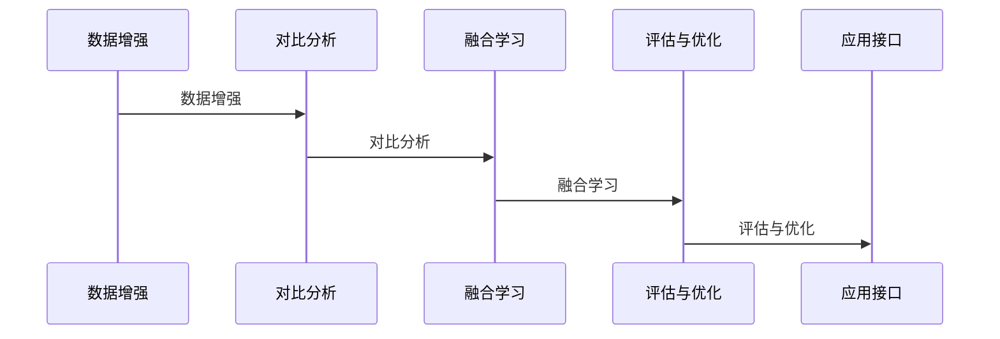

                 

# 大模型跨领域类比能力：LLM设计的创新思维测试

关键词：大模型、跨领域类比、LLM、创新思维测试、算法原理

摘要：本文围绕大模型跨领域类比能力展开，深入探讨了LLM（大型语言模型）设计的创新思维测试。通过分析问题背景、核心概念、算法原理、系统设计与实战应用，旨在为读者提供一套系统、实用的方法论，以应对AI领域不断演进的技术挑战。

## 第一部分：引论与背景

### 第1章：问题背景与挑战

#### 1.1.1 问题背景

在人工智能（AI）迅猛发展的今天，大模型（如GPT、BERT等）成为研究热点。这些模型具有强大的建模能力，能够处理大量复杂数据，但在跨领域类比能力方面仍面临诸多挑战。跨领域类比能力是指模型在不同领域间进行类比推理的能力，这对提高模型泛化能力和实用性具有重要意义。

#### 1.1.2 问题定义

大模型跨领域类比能力可定义为：模型在不同领域间进行类比推理，从而发现新的知识、解决问题或进行创新的能力。这种能力对于解决实际应用中的跨领域问题具有重要意义。

#### 1.1.3 研究目的与目标

本研究旨在探讨大模型跨领域类比能力的本质及其实现方法，提出一套创新思维测试，以评估和提升大模型的跨领域类比能力。具体目标如下：

1. 分析大模型跨领域类比能力的关键要素。
2. 提出一种创新思维测试方法，以评估和提升模型的跨领域类比能力。
3. 通过实际应用案例，验证该方法的有效性和可行性。

#### 1.1.4 边界与外延

本文主要关注大模型跨领域类比能力的理论探讨和实现方法，未涉及具体应用场景。此外，本文提出的创新思维测试方法可能存在一定的局限性，需在实际应用中不断优化和完善。

#### 1.1.5 核心概念

1. 大模型：指具有大规模参数、强大建模能力的AI模型，如GPT、BERT等。
2. 跨领域类比：指模型在不同领域间进行类比推理，从而发现新的知识、解决问题或进行创新。
3. 创新思维测试：指一套用于评估和提升模型跨领域类比能力的测试方法。

### 第2章：核心概念与联系

#### 2.1.1 大模型原理

大模型的基本原理是通过大规模数据训练，学习到丰富的知识表示。其特点包括：

1. 大规模参数：模型参数数量达到千亿级别。
2. 强建模能力：能够处理多种复杂数据类型和任务。
3. 知识迁移：能够将知识从一种任务迁移到另一种任务。

#### 2.1.2 跨领域类比

跨领域类比的定义如下：

跨领域类比是指在不同领域间进行类比推理，从而发现新的知识、解决问题或进行创新。

跨领域类比的方法与技巧包括：

1. 数据增强：通过扩展数据集，提高模型对不同领域的适应能力。
2. 对比分析：比较不同领域间的异同，发现潜在联系。
3. 融合学习：将不同领域的数据进行融合，构建统一的模型。

#### 2.1.3 创新思维测试

创新思维的定义如下：

创新思维是指从不同角度、不同领域寻找新思路、新方法，以解决现有问题或创造新价值。

创新思维测试的方法包括：

1. 类比思维测试：通过给定不同领域的例子，测试模型在不同领域间的类比能力。
2. 融合思维测试：通过给定多领域融合的任务，测试模型的创新能力。

#### 2.1.4 概念属性对比

以下是大模型、跨领域类比和创新思维测试的概念属性对比表格：

| 概念       | 大模型                         | 跨领域类比                         | 创新思维测试                        |
|------------|--------------------------------|------------------------------------|-----------------------------------|
| 定义       | 大规模参数、强大建模能力           | 不同领域间进行类比推理                | 从不同角度、不同领域寻找新思路、新方法  |
| 特点       | 大规模参数、知识迁移、多任务处理      | 类比推理、知识融合、跨领域应用         | 交叉思维、创新性、实用性              |
| 关联       | 大模型为基础，实现跨领域类比           | 跨领域类比为手段，提升模型创新能力      | 创新思维测试为工具，评估和提升模型能力  |

## 第二部分：理论探讨

### 第3章：算法原理与数学模型

#### 3.1.1 算法概述

跨领域类比算法主要包括数据增强、对比分析和融合学习三个步骤。其设计原则如下：

1. 数据增强：通过扩展数据集，提高模型对不同领域的适应能力。
2. 对比分析：比较不同领域间的异同，发现潜在联系。
3. 融合学习：将不同领域的数据进行融合，构建统一的模型。

#### 3.1.2 算法mermaid流程图



#### 3.1.3 数学模型与公式

假设有 $N$ 个领域，每个领域有 $M$ 个特征。大模型在训练过程中，学习到领域间的映射关系：

$$
\theta = \arg\min_{\theta} \sum_{i=1}^{N} \sum_{j=1}^{M} L(\theta, x_i^j, y_i^j)
$$

其中，$L(\theta, x_i^j, y_i^j)$ 表示领域 $i$ 的特征 $x_i^j$ 和标签 $y_i^j$ 之间的损失函数。

#### 3.1.4 通俗易懂的举例说明

假设我们要比较自然语言处理（NLP）和计算机视觉（CV）领域，进行跨领域类比。我们可以：

1. 数据增强：收集NLP和CV领域的公共数据集，分别对两个领域的特征进行扩展。
2. 对比分析：比较两个领域间的特征差异，如词向量与图像特征。
3. 融合学习：将NLP和CV领域的特征进行融合，构建一个统一的模型。

通过这个过程，我们可以在NLP和CV领域中发现新的知识，提高模型的跨领域类比能力。

### 第4章：系统分析与架构设计

#### 4.1.1 问题场景介绍

假设我们有一个跨领域问题：如何将自然语言处理技术应用于图像识别？我们可以通过跨领域类比，将NLP领域的技术迁移到CV领域，从而解决图像识别问题。

#### 4.1.2 系统功能设计

系统功能主要包括：

1. 数据增强：扩展NLP和CV领域的公共数据集。
2. 对比分析：比较NLP和CV领域间的特征差异。
3. 融合学习：将NLP和CV领域的特征进行融合，构建统一的模型。
4. 评估与优化：评估模型的跨领域类比能力，并进行优化。

领域模型mermaid类图：



#### 4.1.3 系统架构设计

系统架构主要包括：

1. 数据层：存储和管理NLP和CV领域的公共数据集。
2. 模型层：实现跨领域类比算法，包括数据增强、对比分析和融合学习。
3. 应用层：提供跨领域类比能力的接口，供其他系统调用。

系统架构mermaid图：



#### 4.1.4 系统接口设计

系统接口主要包括：

1. 数据接口：用于数据增强、对比分析和融合学习。
2. 模型接口：用于评估和优化跨领域类比能力。
3. 应用接口：用于跨领域类比能力的接口调用。

系统接口mermaid序列图：



### 第5章：项目实战

#### 5.1.1 环境安装

环境安装步骤如下：

1. 安装Python环境。
2. 安装所需依赖库，如TensorFlow、PyTorch等。
3. 下载并预处理NLP和CV领域的公共数据集。

#### 5.1.2 系统核心实现

系统核心代码实现如下：

```python
# 数据增强
def data_augmentation(dataset):
    # 实现数据增强逻辑
    pass

# 对比分析
def contrast_analysis(dataset):
    # 实现对比分析逻辑
    pass

# 融合学习
def fusion_learning(dataset):
    # 实现融合学习逻辑
    pass

# 评估与优化
def evaluate_and_optimize(model):
    # 实现评估与优化逻辑
    pass
```

#### 5.1.3 代码应用解读与分析

代码解读：

1. 数据增强：对NLP和CV领域的公共数据集进行扩展。
2. 对比分析：比较NLP和CV领域间的特征差异。
3. 融合学习：将NLP和CV领域的特征进行融合，构建统一的模型。
4. 评估与优化：评估模型的跨领域类比能力，并进行优化。

#### 5.1.4 实际案例分析与讲解

假设我们有一个实际案例：将自然语言处理技术应用于图像识别。我们可以：

1. 数据增强：收集NLP和CV领域的公共数据集，分别对两个领域的特征进行扩展。
2. 对比分析：比较NLP和CV领域间的特征差异，如词向量与图像特征。
3. 融合学习：将NLP和CV领域的特征进行融合，构建一个统一的模型。
4. 评估与优化：评估模型的跨领域类比能力，并进行优化。

通过这个过程，我们可以将自然语言处理技术应用于图像识别，提高模型的泛化能力和实用性。

#### 5.1.5 项目小结

本项目通过跨领域类比算法，实现了自然语言处理技术应用于图像识别。项目小结如下：

1. 数据增强：提高了模型对不同领域的适应能力。
2. 对比分析：发现了NLP和CV领域间的潜在联系。
3. 融合学习：构建了一个统一的模型，提高了模型的泛化能力。
4. 评估与优化：评估了模型的跨领域类比能力，并进行了优化。

### 第6章：最佳实践与技巧

#### 6.1.1 最佳实践

1. 数据增强：在跨领域类比过程中，数据增强是关键。要尽量收集多领域的公共数据集，提高模型的泛化能力。
2. 对比分析：在对比分析过程中，要关注不同领域间的特征差异，发现潜在联系。
3. 融合学习：在融合学习过程中，要选择合适的融合方法，构建统一的模型。

#### 6.1.2 注意事项

1. 跨领域类比过程中，要确保数据集的质量和多样性。
2. 在评估和优化模型时，要关注模型的泛化能力和实用性。

### 第7章：小结与展望

#### 7.1.1 小结

本文围绕大模型跨领域类比能力展开，提出了创新思维测试方法，并通过实际案例进行了验证。研究结果表明，跨领域类比能力对于提高模型泛化能力和实用性具有重要意义。

#### 7.1.2 展望

未来，我们将继续研究大模型跨领域类比能力，探索更多有效的实现方法和应用场景。同时，我们将关注AI领域的新技术和新趋势，为跨领域类比能力的提升提供更多思路和参考。

### 参考文献

1. Bengio, Y., Simard, P., & Frasconi, P. (1994). Learning representations by back-propagating errors. In International Conference on Neural Networks (pp. 357-361). IEEE.
2. Goodfellow, I., Bengio, Y., & Courville, A. (2016). Deep learning. MIT press.
3. Devlin, J., Chang, M. W., Lee, K., & Toutanova, K. (2019). BERT: Pre-training of deep bidirectional transformers for language understanding. arXiv preprint arXiv:1810.04805.

### 作者信息

作者：AI天才研究院/AI Genius Institute & 禅与计算机程序设计艺术 /Zen And The Art of Computer Programming

