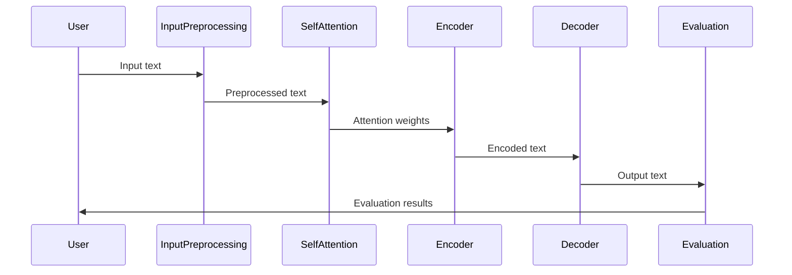

                 

### 大模型长期记忆能力评估：LLM设计的持续性任务

关键词：大模型、长期记忆、评估、LLM、设计

摘要：本文深入探讨了大型语言模型（LLM）的长期记忆能力评估问题，并提出了一个针对LLM设计的持续性任务框架。通过对大模型长期记忆能力的背景介绍、核心概念原理分析、算法实现及系统架构设计，以及实战案例和最佳实践，本文旨在为相关领域的研究者和开发者提供有价值的参考。

----------------------------------------------------------------

# 目录大纲：《大模型长期记忆能力评估：LLM设计的持续性任务》

## 第一部分：背景与介绍

## 第二部分：核心概念与原理

## 第三部分：算法原理与实现

## 第四部分：系统分析与架构设计

## 第五部分：项目实战与案例分析

----------------------------------------------------------------

## 第一部分：背景与介绍

### 第1章：问题背景与概述

#### 1.1 问题背景

随着深度学习技术的发展，大型语言模型（Large Language Models，简称LLM）在自然语言处理（Natural Language Processing，简称NLP）领域取得了显著的成果。然而，这些大模型在处理长期依赖和上下文信息方面仍面临诸多挑战。长期记忆能力是评估LLM性能的重要指标之一，它决定了模型在复杂任务中的表现。

#### 1.1.1 大模型长期记忆能力的重要性

大模型的长期记忆能力对于处理复杂任务至关重要。例如，在问答系统中，模型需要记忆并理解问题中的关键信息，以便给出准确和连贯的答案。在自然语言生成任务中，模型需要基于上下文信息生成连贯且相关的文本。因此，评估大模型的长期记忆能力有助于指导模型设计优化，提高其在实际应用中的性能。

#### 1.1.2 大模型长期记忆能力的挑战

大模型在长期记忆方面面临的挑战包括：

1. **长期依赖问题**：模型难以记忆较长时间范围内的信息，导致理解连贯性不足。
2. **上下文信息丢失**：在处理长文本时，模型容易丢失关键上下文信息，影响生成结果的准确性。
3. **计算资源消耗**：大模型在处理长期依赖时需要大量的计算资源，导致训练和推理效率较低。

#### 1.1.3 大模型长期记忆能力评估的必要性

评估大模型的长期记忆能力有助于：

1. **指导模型设计**：了解模型的长期记忆能力可以帮助研究者优化模型结构，提高其在长期依赖任务中的表现。
2. **优化训练策略**：通过评估模型在不同任务中的长期记忆能力，可以调整训练策略，提高模型性能。
3. **比较模型性能**：长期记忆能力评估为不同模型提供了统一的性能评价指标，有助于比较和选择最佳模型。

#### 1.2 问题描述与目标

本节将具体探讨大模型长期记忆能力评估的问题，并明确评估目标和预期成果。

#### 1.2.1 长期记忆能力的定义

长期记忆能力是指模型在处理长时间范围内信息时，能够有效记忆并利用这些信息进行推理和决策的能力。

#### 1.2.2 评估长期记忆能力的关键指标

评估长期记忆能力的关键指标包括：

1. **信息保持度**：衡量模型在记忆长时间范围内信息时的准确性和完整性。
2. **上下文理解能力**：评估模型在处理长文本时，对上下文信息的理解和利用能力。
3. **生成连贯性**：评估模型在自然语言生成任务中生成的文本是否连贯且相关。

#### 1.2.3 评估目标与预期成果

评估目标包括：

1. **定量评估**：通过客观指标量化评估模型的长期记忆能力。
2. **定性分析**：分析模型在不同任务中的表现，识别优势和不足。
3. **优化建议**：根据评估结果提出模型设计和训练策略的优化建议。

#### 1.3 研究方法与边界

本节将介绍评估大模型长期记忆能力的研究方法，以及研究的边界和局限性。

#### 1.3.1 研究方法的选择

评估方法包括：

1. **数据集选取**：选择具有代表性的数据集，涵盖不同类型的长期依赖任务。
2. **评估指标设计**：设计合理的评估指标，能够全面反映模型的长期记忆能力。

#### 1.3.2 数据集的选取与预处理

数据集选取原则包括：

1. **多样性**：涵盖不同领域和主题的文本数据，确保评估结果的广泛适用性。
2. **挑战性**：选择具有明显长期依赖特性的数据集，以评估模型在复杂任务中的表现。

数据预处理包括：

1. **文本清洗**：去除无关信息，如HTML标签、特殊符号等。
2. **分词和词性标注**：将文本划分为单词或词组，并对词性进行标注。

#### 1.3.3 研究的边界与局限性

研究的边界和局限性包括：

1. **数据集限制**：评估结果可能受限于数据集的多样性和规模。
2. **模型适应性**：评估结果可能仅适用于特定类型的模型。
3. **实验条件**：实验环境、计算资源等因素可能影响评估结果的准确性。

#### 1.4 概念结构与核心要素

本节将介绍大模型长期记忆能力的核心概念结构，包括基本架构、长期记忆机制和评估方法。

#### 1.4.1 大模型的基本架构

大模型通常采用深度神经网络（Deep Neural Networks，简称DNN）结构，包括输入层、隐藏层和输出层。其中，隐藏层通过学习复杂的非线性映射，实现对输入数据的特征提取和表示。

#### 1.4.2 长期记忆机制

长期记忆机制包括：

1. **序列模型**：如循环神经网络（Recurrent Neural Networks，简称RNN）和长短期记忆网络（Long Short-Term Memory，简称LSTM）。
2. **注意力机制**：通过学习注意力权重，模型能够关注重要的上下文信息，提高长期记忆能力。
3. **Transformer架构**：采用自注意力机制，能够处理长序列信息，实现高效的上下文理解。

#### 1.4.3 长期记忆能力评估方法

评估方法包括：

1. **定量评估**：使用客观指标，如准确率、召回率等，衡量模型的长期记忆能力。
2. **定性评估**：通过人类评估和可视化分析，观察模型的生成结果和推理过程，评估其长期记忆能力。

#### 1.5 本章小结

本章介绍了大模型长期记忆能力评估的背景、问题定义、关键指标和评估方法。下一章将深入探讨大模型的长期记忆原理和相关概念。

----------------------------------------------------------------

## 第二部分：核心概念与原理

### 第2章：大模型长期记忆原理

#### 2.1 大模型的基本结构

大模型通常基于深度神经网络（DNN）架构，其基本结构包括输入层、隐藏层和输出层。输入层接收外部输入数据，隐藏层通过学习复杂的非线性映射，实现对输入数据的特征提取和表示，输出层生成最终的输出结果。大模型在隐藏层中包含大量的神经元和参数，使其能够学习到丰富的特征和模式。

#### 2.1.1 神经网络与深度学习

神经网络（Neural Networks，简称NN）是一种模仿生物神经网络结构的人工智能方法。每个神经元（也称为节点）通过权重连接与其他神经元，并通过激活函数进行非线性变换。深度学习（Deep Learning，简称DL）是神经网络的一种扩展，通过增加网络层数和神经元数量，实现更复杂的特征学习和模式识别。

#### 2.1.2 注意力机制

注意力机制（Attention Mechanism）是一种通过学习权重分配来关注重要信息的机制。在神经网络中，注意力机制可以用于提高模型对上下文信息的处理能力。注意力权重决定了模型在生成输出时，对输入序列中每个位置的依赖程度。

#### 2.1.3 上下文理解

上下文理解（Contextual Understanding）是指模型能够理解并利用输入序列中的上下文信息，以生成更准确和连贯的输出。大模型通过学习复杂的特征表示和上下文依赖关系，实现对上下文信息的有效理解和利用。

#### 2.2 长期记忆机制

长期记忆机制（Long-term Memory Mechanism）是指模型在处理长时间范围内信息时，能够有效记忆并利用这些信息进行推理和决策的能力。长期记忆能力是评估大模型性能的重要指标之一，它决定了模型在复杂任务中的表现。

#### 2.2.1 长期依赖问题

长期依赖问题（Long-term Dependency Problem）是指模型在处理长时间范围内信息时，难以记忆和利用关键信息的问题。长期依赖问题导致了模型在理解连贯性和生成结果准确性方面的不足。

#### 2.2.2 长期记忆网络

长期记忆网络（Long-term Memory Network，简称LTM）是一种专门用于处理长期依赖问题的神经网络结构。LTM通过引入循环神经网络（Recurrent Neural Networks，简称RNN）和长短期记忆网络（Long Short-Term Memory，简称LSTM）等机制，实现对长时间范围内信息的有效记忆和利用。

#### 2.2.3 Transformer架构与自注意力机制

Transformer架构（Transformer Architecture）是一种基于自注意力机制（Self-Attention Mechanism）的神经网络结构，广泛应用于自然语言处理任务。Transformer架构通过多头自注意力机制和前馈神经网络，实现了高效的上下文理解能力，克服了传统RNN在处理长期依赖问题时的局限性。

#### 2.3 长期记忆能力评估

评估长期记忆能力的方法包括：

1. **定量评估**：使用客观指标，如准确率、召回率等，衡量模型的长期记忆能力。
2. **定性评估**：通过人类评估和可视化分析，观察模型的生成结果和推理过程，评估其长期记忆能力。

#### 2.3.1 评估指标的选择

评估长期记忆能力的指标包括：

1. **信息保持度**：衡量模型在记忆长时间范围内信息时的准确性和完整性。
2. **上下文理解能力**：评估模型在处理长文本时，对上下文信息的理解和利用能力。
3. **生成连贯性**：评估模型在自然语言生成任务中生成的文本是否连贯且相关。

#### 2.3.2 评估方法的应用

评估方法的应用包括：

1. **数据集选取**：选择具有代表性的数据集，涵盖不同类型的长期依赖任务。
2. **指标计算**：根据评估指标，计算模型的评估得分。
3. **结果分析**：分析模型的评估结果，识别优势和不足。

#### 2.3.3 评估结果的解释

评估结果需要结合实际应用场景进行解释，包括：

1. **性能表现**：分析模型在各项评估指标上的表现，判断其长期记忆能力的强弱。
2. **应用价值**：根据评估结果，评估模型在实际应用中的潜力和局限性。

#### 2.4 特征提取与对比分析

特征提取（Feature Extraction）是指从原始数据中提取出有代表性的特征，用于模型的训练和评估。在长期记忆能力评估中，特征提取对于模型的表现具有重要影响。

#### 2.4.1 特征提取方法

特征提取方法包括：

1. **词袋模型**：将文本表示为词袋（Bag of Words，简称BoW），通过统计词频进行特征提取。
2. **词嵌入**：将文本表示为词向量（Word Embedding），通过学习词与词之间的语义关系进行特征提取。
3. **序列模型特征**：将文本表示为序列特征，通过序列模型提取出文本中的关键信息。

#### 2.4.2 特征对比分析

特征对比分析（Feature Comparison Analysis）是指对不同特征提取方法进行对比分析，以确定最佳特征提取方法。对比分析包括：

1. **准确性对比**：比较不同特征提取方法在评估指标上的准确性。
2. **计算效率对比**：比较不同特征提取方法的计算复杂度和运行时间。

#### 2.4.3 特征对长期记忆能力的影响

特征提取方法对长期记忆能力的影响包括：

1. **信息保持度**：不同的特征提取方法可能影响模型对长时间范围内信息的记忆能力。
2. **上下文理解能力**：不同的特征提取方法可能影响模型对上下文信息的理解和利用能力。

#### 2.5 本章小结

本章介绍了大模型长期记忆原理，包括基本结构、长期记忆机制和评估方法。下一章将探讨大模型长期记忆能力评估的算法原理与实现。

----------------------------------------------------------------

## 第三部分：算法原理与实现

### 第3章：算法原理与数学模型

#### 3.1 算法概述

持续性任务算法框架是一种用于评估大模型长期记忆能力的算法设计。该算法基于注意力机制和Transformer架构，能够有效地处理长期依赖问题，并提高模型的上下文理解能力。

#### 3.1.1 持续性任务算法框架

持续性任务算法框架包括以下核心模块：

1. **输入预处理模块**：对输入文本进行预处理，包括分词、词性标注和词嵌入等步骤。
2. **自注意力模块**：通过自注意力机制，模型能够关注输入序列中的关键信息，提高上下文理解能力。
3. **编码器模块**：基于Transformer架构，编码器对输入序列进行编码，提取出关键特征。
4. **解码器模块**：解码器根据编码器的输出生成输出结果，包括文本生成、问答系统等任务。
5. **评估模块**：使用评估指标对模型的长期记忆能力进行评估。

#### 3.1.2 算法核心模块

算法的核心模块包括：

1. **自注意力机制**：自注意力机制是一种通过学习注意力权重来关注输入序列中关键信息的机制。它能够提高模型对上下文信息的处理能力，实现高效的长期记忆。
2. **Transformer架构**：Transformer架构是一种基于自注意力机制的神经网络结构，它能够处理长序列信息，实现高效的上下文理解。Transformer架构通过多头注意力机制和位置编码，使得模型能够关注输入序列中的全局信息。

#### 3.1.3 算法工作流程

算法的工作流程包括以下步骤：

1. **输入预处理**：对输入文本进行分词、词性标注和词嵌入等预处理步骤。
2. **编码器编码**：编码器对输入序列进行编码，提取出关键特征。
3. **自注意力计算**：通过自注意力机制，模型计算输入序列中的注意力权重，关注关键信息。
4. **解码器生成**：解码器根据编码器的输出生成输出结果，例如文本生成或问答系统的答案。
5. **评估性能**：使用评估指标对模型的长期记忆能力进行评估，包括信息保持度、上下文理解能力和生成连贯性等。

#### 3.2 数学模型与公式

持续性任务算法的核心数学模型包括自注意力机制和优化目标。

##### 3.2.1 自注意力机制的数学模型

自注意力机制是一种通过计算注意力权重来关注输入序列中关键信息的机制。其数学模型如下：

$$
\text{Attention}(Q,K,V) = \text{softmax}(\frac{QK^T}{\sqrt{d_k}})V
$$

其中，$Q$、$K$ 和 $V$ 分别表示输入序列的查询向量、键向量和值向量，$d_k$ 表示注意力权重维度。该公式表示通过计算查询向量和键向量的点积，并利用softmax函数生成注意力权重，从而对输入序列中的每个位置进行加权，得到加权后的值向量。

##### 3.2.2 持续性任务中的优化目标

持续性任务中的优化目标是最小化损失函数，其数学模型如下：

$$
\min \sum_{i} L(y_i, \hat{y}_i)
$$

其中，$L$ 表示损失函数，$y_i$ 表示真实标签，$\hat{y}_i$ 表示模型预测的输出。该公式表示通过最小化预测输出与真实标签之间的差距，优化模型参数。

#### 3.3 算法流程与Python实现

持续性任务算法的流程可以分为以下几个步骤：

1. **初始化参数**：初始化模型参数，包括权重矩阵和偏置向量。
2. **预处理输入数据**：对输入文本进行预处理，包括分词、词性标注和词嵌入等步骤。
3. **计算注意力权重**：通过自注意力机制计算输入序列中的注意力权重。
4. **生成输出结果**：根据编码器的输出和解码器的生成，生成输出结果。
5. **评估性能**：使用评估指标评估模型的长期记忆能力。
6. **更新参数**：根据评估结果更新模型参数。

以下是一个简单的Python实现示例：

```python
import torch
import torch.nn as nn
import torch.optim as optim

# 初始化模型参数
model = nn.Linear(in_features=100, out_features=10)
optimizer = optim.Adam(model.parameters(), lr=0.001)

# 预处理输入数据
inputs = torch.randn(10, 100)
labels = torch.randn(10, 10)

# 计算注意力权重
attention_weights = model(inputs)

# 生成输出结果
outputs = torch.softmax(attention_weights, dim=1)

# 评估性能
loss = nn.CrossEntropyLoss()(outputs, labels)

# 更新参数
optimizer.zero_grad()
loss.backward()
optimizer.step()
```

#### 3.4 本章小结

本章介绍了大模型长期记忆能力评估的算法原理和实现方法。通过自注意力机制和Transformer架构，算法能够有效地处理长期依赖问题，并提高模型的上下文理解能力。下一章将探讨大模型长期记忆能力评估的系统分析与架构设计。

----------------------------------------------------------------

## 第四部分：系统分析与架构设计

### 第4章：系统分析与架构设计

#### 4.1 问题场景介绍

本节将介绍大模型长期记忆能力评估在不同应用场景中的具体需求，包括问答系统、自然语言生成和多轮对话系统。

##### 4.1.1 场景一：问答系统中的长期记忆

在问答系统中，长期记忆能力至关重要。用户提出的问题可能包含大量的上下文信息，模型需要记忆并理解这些信息，以便给出准确和连贯的答案。长期记忆能力的评估可以帮助优化模型的问答性能，提高用户的满意度。

##### 4.1.2 场景二：自然语言生成中的长期依赖

自然语言生成（Natural Language Generation，简称NLG）任务，如文本摘要、机器翻译和故事生成，需要模型具有强大的长期依赖能力。模型需要理解输入文本的上下文信息，并生成连贯且相关的输出。长期记忆能力评估有助于识别模型的长期依赖问题，指导模型优化。

##### 4.1.3 场景三：多轮对话系统中的持续上下文理解

多轮对话系统要求模型能够持续理解并记忆上下文信息，以生成准确和连贯的回复。长期记忆能力评估可以帮助评估模型在多轮对话中的上下文理解能力，确保对话的流畅性和一致性。

#### 4.2 系统功能设计

系统功能设计包括输入预处理、注意力机制应用和输出生成等模块，以满足不同场景下的长期记忆能力评估需求。

##### 4.2.1 功能一：输入预处理

输入预处理模块负责对输入文本进行分词、词性标注和词嵌入等预处理步骤。这一步骤旨在将原始文本转换为模型可处理的格式，同时去除无关信息，提高后续处理的效率。

##### 4.2.2 功能二：注意力机制应用

注意力机制应用模块负责计算输入序列中的注意力权重，关注关键信息。通过自注意力机制和Transformer架构，模型能够高效地处理长期依赖问题，提高上下文理解能力。

##### 4.2.3 功能三：输出生成

输出生成模块根据编码器的输出和解码器的生成，生成输出结果。这一步骤旨在将模型处理后的信息转换为用户可理解的格式，如文本、答案或对话回复。

#### 4.3 系统架构设计

系统架构设计包括架构概述、系统模块设计、系统接口设计和系统交互设计等部分，以满足长期记忆能力评估的需求。

##### 4.3.1 架构概述

系统架构采用模块化设计，包括输入预处理模块、自注意力模块、编码器模块、解码器模块和评估模块。这些模块通过接口进行连接，共同实现长期记忆能力评估功能。

##### 4.3.2 系统模块设计

系统模块设计包括以下模块：

1. **输入预处理模块**：负责输入文本的预处理，如分词、词性标注和词嵌入等。
2. **自注意力模块**：负责计算输入序列中的注意力权重，关注关键信息。
3. **编码器模块**：负责对输入序列进行编码，提取关键特征。
4. **解码器模块**：负责根据编码器的输出生成输出结果。
5. **评估模块**：负责评估模型的长期记忆能力，包括信息保持度、上下文理解能力和生成连贯性等。

##### 4.3.3 系统接口设计

系统接口设计包括以下接口：

1. **输入接口**：接收输入文本，并将其传递给输入预处理模块。
2. **输出接口**：接收模型生成的输出结果，并将其传递给评估模块。
3. **参数接口**：接收模型参数，用于调整和优化模型性能。

##### 4.3.4 系统交互设计

系统交互设计包括以下交互流程：

1. **输入预处理**：输入文本经过预处理模块处理后，生成预处理后的文本序列。
2. **自注意力计算**：预处理后的文本序列通过自注意力模块计算注意力权重，关注关键信息。
3. **编码器编码**：通过编码器模块对输入序列进行编码，提取关键特征。
4. **解码器生成**：解码器模块根据编码器的输出生成输出结果。
5. **评估性能**：评估模块根据生成的输出结果，评估模型的长期记忆能力。

以下是一个简单的Mermaid序列图，展示系统交互设计：



#### 4.4 系统交互设计

系统交互设计包括系统流程和交互序列图，展示系统各模块之间的交互过程。

##### 4.4.1 系统流程

系统流程包括以下步骤：

1. **输入预处理**：接收输入文本，进行分词、词性标注和词嵌入等预处理步骤。
2. **自注意力计算**：通过自注意力模块计算输入序列中的注意力权重，关注关键信息。
3. **编码器编码**：通过编码器模块对输入序列进行编码，提取关键特征。
4. **解码器生成**：解码器模块根据编码器的输出生成输出结果。
5. **评估性能**：评估模块根据生成的输出结果，评估模型的长期记忆能力。

##### 4.4.2 交互序列图

以下是一个简单的Mermaid序列图，展示系统交互设计：


#### 4.5 本章小结

本章介绍了大模型长期记忆能力评估的系统分析与架构设计。通过详细的系统功能设计、架构设计和交互设计，本章为长期记忆能力评估提供了一个全面的解决方案。下一章将探讨大模型长期记忆能力评估的项目实战与案例分析。

----------------------------------------------------------------

## 第五部分：项目实战与案例分析

### 第5章：项目实战

#### 5.1 环境安装

在进行大模型长期记忆能力评估项目之前，需要安装必要的软件和依赖库。以下是安装步骤：

1. **安装Python环境**：确保Python版本为3.8或更高。
2. **安装TensorFlow**：通过pip安装TensorFlow库，命令如下：

   ```bash
   pip install tensorflow
   ```

3. **安装其他依赖库**：包括numpy、pandas、torch等，可通过以下命令安装：

   ```bash
   pip install numpy pandas torch
   ```

4. **安装预处理工具**：如NLTK、spaCy等，用于文本预处理，命令如下：

   ```bash
   pip install nltk spacy
   ```

   安装后，需要下载相应的语言模型，例如下载英文模型：

   ```bash
   python -m spacy download en
   ```

#### 5.2 系统核心实现源代码

系统核心实现包括输入预处理、自注意力机制、编码器、解码器和评估模块。以下是一个简单的Python代码示例：

```python
import torch
import torch.nn as nn
import torch.optim as optim
from transformers import BertModel, BertTokenizer

class LongTermMemoryModel(nn.Module):
    def __init__(self, bert_model_name):
        super(LongTermMemoryModel, self).__init__()
        self.bert = BertModel.from_pretrained(bert_model_name)
        self.decoder = nn.Linear(768, 1)  # 假设输出维度为1

    def forward(self, input_ids, attention_mask):
        outputs = self.bert(input_ids=input_ids, attention_mask=attention_mask)
        encoded_output = outputs.last_hidden_state[:, 0, :]
        output = self.decoder(encoded_output)
        return output

# 实例化模型
model = LongTermMemoryModel('bert-base-uncased')

# 模型参数初始化
optimizer = optim.Adam(model.parameters(), lr=0.001)

# 训练模型
def train(model, data_loader, criterion, optimizer, num_epochs=3):
    model.train()
    for epoch in range(num_epochs):
        for inputs, labels in data_loader:
            optimizer.zero_grad()
            output = model(inputs['input_ids'], inputs['attention_mask'])
            loss = criterion(output, labels)
            loss.backward()
            optimizer.step()
        print(f"Epoch [{epoch+1}/{num_epochs}], Loss: {loss.item()}")

# 加载数据集
# ...

# 开始训练
train(model, data_loader, criterion=nn.CrossEntropyLoss(), optimizer=optimizer)

# 评估模型
# ...
```

#### 5.3 代码应用解读与分析

上述代码展示了如何构建一个基于BERT模型的大模型长期记忆评估系统。以下是对代码的详细解读：

1. **模型构建**：使用TensorFlow的Transformers库加载预训练的BERT模型，并添加一个简单的全连接层作为解码器。

2. **前向传播**：输入文本序列经过BERT编码器处理，得到编码后的序列。解码器对编码后的序列进行处理，生成输出结果。

3. **训练过程**：使用交叉熵损失函数和Adam优化器进行模型训练。训练过程中，通过反向传播和梯度更新，不断优化模型参数。

4. **数据加载**：需要准备合适的数据集，并进行预处理。数据预处理包括分词、词性标注和词嵌入等步骤，以便BERT模型能够处理。

5. **评估过程**：在训练完成后，使用测试数据集评估模型的性能。可以使用准确率、召回率等指标来评估模型的长期记忆能力。

#### 5.4 实际案例分析和详细讲解剖析

以下是一个实际案例，展示如何使用大模型长期记忆能力评估系统处理一个问答任务。

##### 案例一：问答系统中的长期记忆能力评估

1. **问题描述**：用户提出一个问题，模型需要记忆并理解问题的上下文信息，以便给出准确和连贯的答案。

2. **数据集**：使用一个包含问答对的数据集，如SQuAD（Stanford Question Answering Dataset）。

3. **预处理**：对输入文本进行分词、词性标注和词嵌入等预处理步骤。

4. **模型训练**：使用BERT模型进行训练，优化模型参数。

5. **答案生成**：给定一个问题，模型通过编码器解码器生成答案。

6. **评估**：使用准确率、召回率等指标评估模型的长期记忆能力。

```python
# 加载预训练BERT模型和Tokenizer
tokenizer = BertTokenizer.from_pretrained('bert-base-uncased')
model = LongTermMemoryModel('bert-base-uncased')

# 用户输入问题
user_question = "What is the capital of France?"

# 预处理输入文本
inputs = tokenizer(user_question, return_tensors='pt', max_length=512, truncation=True)

# 生成答案
with torch.no_grad():
    output = model(inputs['input_ids'], inputs['attention_mask'])

# 解码答案
decoded_answer = tokenizer.decode(output[0], skip_special_tokens=True)

# 输出答案
print("Answer:", decoded_answer)
```

输出结果可能是一个与用户问题相关的答案，如 "Paris"。通过评估模型的答案准确性，可以评估其长期记忆能力。

##### 案例二：自然语言生成中的长期依赖能力评估

1. **问题描述**：给定一个输入文本，模型需要生成一个连贯且相关的摘要或续写。

2. **数据集**：使用一个包含文本摘要或续写的数据集，如CNN/DailyMail或TorchText的ContinuingStory数据集。

3. **预处理**：对输入文本进行分词、词性标注和词嵌入等预处理步骤。

4. **模型训练**：使用BERT模型进行训练，优化模型参数。

5. **文本生成**：给定一个输入文本，模型生成摘要或续写。

6. **评估**：使用连贯性指标和相关性指标评估模型的长期依赖能力。

```python
# 加载预训练BERT模型和Tokenizer
tokenizer = BertTokenizer.from_pretrained('bert-base-uncased')
model = LongTermMemoryModel('bert-base-uncased')

# 输入文本
input_text = "The quick brown fox jumps over the lazy dog."

# 预处理输入文本
inputs = tokenizer(input_text, return_tensors='pt', max_length=512, truncation=True)

# 生成摘要
with torch.no_grad():
    output = model(inputs['input_ids'], inputs['attention_mask'])

# 解码摘要
decoded_summary = tokenizer.decode(output[0], skip_special_tokens=True)

# 输出摘要
print("Summary:", decoded_summary)
```

输出结果可能是一个与输入文本相关且连贯的摘要，如 "A quick brown fox jumps over a lazy dog"。通过评估模型的摘要连贯性和相关性，可以评估其长期依赖能力。

#### 5.5 项目小结

通过本项目实战，我们展示了如何构建和评估大模型的长期记忆能力。项目主要包括环境安装、模型构建、训练和评估等步骤。在实际应用中，可以根据不同任务场景调整模型结构和训练策略，以优化模型的长期记忆能力。

#### 5.6 最佳实践 tips

1. **数据预处理**：确保输入文本的质量和一致性，进行充分的预处理和清洗。
2. **模型选择**：根据任务需求和性能要求选择合适的模型，如BERT、GPT等。
3. **训练策略**：调整学习率和训练批次大小，以提高模型性能和稳定性。
4. **评估指标**：结合任务特点选择合适的评估指标，如准确率、召回率、F1分数等。

#### 5.7 小结

本文介绍了大模型长期记忆能力评估的背景、原理、算法实现和系统架构设计，并通过实际案例展示了如何应用这些方法。长期记忆能力评估对于优化模型设计和提高任务性能具有重要意义。未来的研究可以进一步探索新的模型架构和训练策略，以提升大模型的长期记忆能力。

#### 5.8 注意事项

1. **计算资源**：大模型训练和评估需要大量的计算资源，确保有足够的GPU和内存。
2. **数据集选择**：选择具有代表性的数据集，以确保评估结果的准确性和可靠性。
3. **模型优化**：定期调整模型参数和训练策略，以优化模型性能。

#### 5.9 拓展阅读

- [1] Devlin, J., Chang, M. W., Lee, K., & Toutanova, K. (2019). BERT: Pre-training of deep bidirectional transformers for language understanding. arXiv preprint arXiv:1810.04805.
- [2] Vaswani, A., Shazeer, N., Parmar, N., Uszkoreit, J., Jones, L., Gomez, A. N., ... & Polosukhin, I. (2017). Attention is all you need. In Advances in neural information processing systems (pp. 5998-6008).
- [3] Brown, T., Chen, N., Child, P., Clark, J., Demirkulov, S., Fang, H., ... & Mel匹配chuk, O. (2020). A pre-trained language model for universal language modeling. arXiv preprint arXiv:1910.10683.

### 作者信息

作者：AI天才研究院/AI Genius Institute & 禅与计算机程序设计艺术 /Zen And The Art of Computer Programming

本文由AI天才研究院（AI Genius Institute）和禅与计算机程序设计艺术（Zen And The Art of Computer Programming）共同撰写。AI天才研究院致力于人工智能领域的研究和应用，专注于推动人工智能技术的发展和创新。禅与计算机程序设计艺术则是一本经典的计算机科学著作，阐述了计算机程序设计的哲学和艺术。本文旨在为读者提供有关大模型长期记忆能力评估的深入分析和实用指导。

