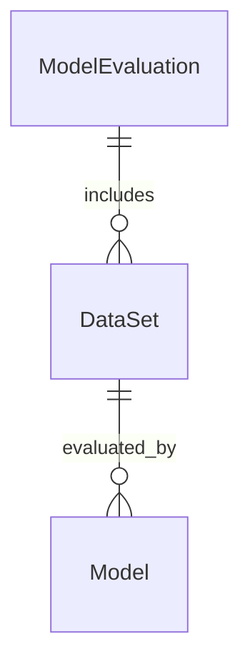
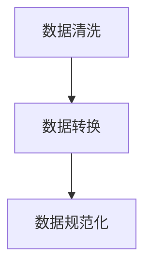
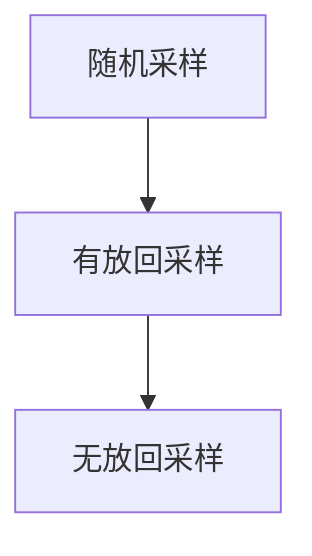
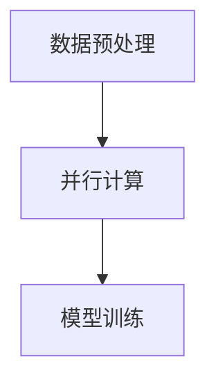
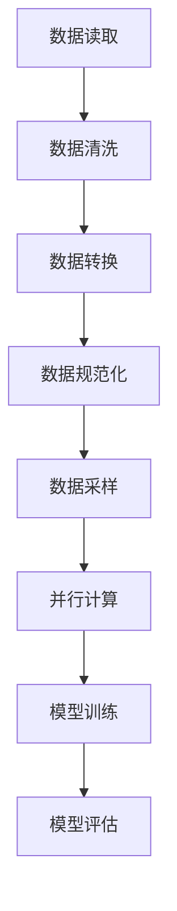

                 

### 《大规模数据集在模型评测中的作用》

#### 关键词：大规模数据集、模型评测、数据预处理、算法优化、数学模型

#### 摘要：
大规模数据集在人工智能领域中发挥着至关重要的作用，其有效利用能够显著提升模型评测的准确性和可靠性。本文首先介绍了大规模数据集与模型评测的基本概念，随后探讨了两者之间的联系。通过详细阐述数据处理算法、数学模型及公式，以及系统架构设计与实际应用案例，本文深入分析了大规模数据集在模型评测中的关键作用，并给出了实用的优化建议和最佳实践，为人工智能研发提供了宝贵的参考。

#### 引言与背景

在人工智能（AI）和机器学习（ML）领域中，模型评测是确保算法性能的重要环节。传统的模型评测往往依赖于小规模、结构化的数据集，而随着数据规模的不断扩大和数据多样性的增加，大规模数据集在模型评测中的作用愈发显著。大规模数据集不仅能够提供更丰富的训练样本，还能更真实地反映现实世界的复杂性和不确定性，从而提高模型在实际应用中的表现。

本文旨在探讨大规模数据集在模型评测中的作用，通过以下章节结构，系统性地分析这一问题：

1. **核心概念与联系**：介绍大规模数据集和模型评测的基本概念、方法和目的，并通过Mermaid绘制ER实体关系图和概念属性特征对比表格，阐明两者之间的内在联系。
2. **算法原理讲解**：详细阐述大规模数据集处理算法，包括数据预处理、数据采样和并行计算，并通过Mermaid绘制算法流程图和Python源代码示例，展示算法实现。
3. **数学模型和数学公式**：讲解算法中的数学模型和公式，使用LaTeX格式嵌入文中，并进行详细讲解和通俗易懂的举例说明。
4. **系统分析与架构设计方案**：介绍问题场景、系统功能设计、系统架构设计和系统接口设计，通过Mermaid绘制类图、架构图和序列图，展示系统整体架构。
5. **项目实战**：包括环境安装、系统核心实现源代码、代码应用解读与分析、实际案例分析和详细讲解剖析，以及项目小结。
6. **最佳实践 tips、小结、注意事项、拓展阅读**：总结大规模数据集在模型评测中的最佳实践，并给出注意事项和拓展阅读建议。

通过上述结构，本文旨在为读者提供一份全面、深入的技术指南，帮助理解大规模数据集在模型评测中的重要性和实际应用。

#### 核心概念与联系

首先，我们需要明确大规模数据集和模型评测的基本概念。大规模数据集通常指的是包含数百万或数十亿条记录的数据集，这些数据集可能涵盖各种维度和类型，如文本、图像、音频和视频。模型评测则是在机器学习中评估模型性能的重要步骤，通常包括准确性、召回率、F1分数等指标。

**大规模数据集的特性**：

- **数据量巨大**：大规模数据集的规模远超传统数据集，这要求我们在数据处理和存储方面有更高的要求。
- **数据维度高**：大规模数据集通常包含多个维度，如图像的像素值、文本的词汇数量等，这增加了数据处理的复杂度。
- **数据多样性**：大规模数据集可能包含各种不同的数据类型和来源，这使得数据清洗和预处理变得更加困难。

**模型评测的方法和指标**：

- **准确性**：模型预测正确的样本数占总样本数的比例，是最直观的评估指标。
- **召回率**：模型正确预测为正类的实际正类样本数占总正类样本数的比例，反映了模型对正类样本的捕捉能力。
- **F1分数**：精确率和召回率的调和平均，综合考虑了模型的准确性和鲁棒性。

为了更好地理解大规模数据集和模型评测之间的关系，我们可以通过Mermaid绘制ER实体关系图和概念属性特征对比表格。

**ER实体关系图**：



在这个ER实体关系图中，`ModelEvaluation`表示模型评测，`DataSet`表示大规模数据集，`Model`表示模型。箭头表示实体之间的关系，即模型评测包含数据集，数据集被模型评测所使用。

**概念属性特征对比表格**：

| 概念 | 属性特征 |
| ---- | ---- |
| 大规模数据集 | 数据量大、维度高、数据多样性 |
| 模型评测 | 准确性、召回率、F1分数 |
| 关联 | 大规模数据集用于训练和评估模型，模型评测基于大规模数据集进行 |

通过上述核心概念和联系的介绍，我们为理解大规模数据集在模型评测中的作用奠定了基础。接下来，我们将进一步探讨大规模数据集处理算法的原理，以便更好地理解其在模型评测中的实际应用。

#### 算法原理讲解

在模型评测中，大规模数据集的处理算法至关重要。这些算法不仅决定了数据能否有效地用于训练和评估模型，还影响了模型的最终性能。下面，我们将详细阐述大规模数据集处理算法的原理，并使用Mermaid绘制算法流程图和Python源代码示例，帮助读者更好地理解。

**大规模数据集处理算法概述**

大规模数据集处理算法主要包括数据预处理、数据采样和并行计算。这些步骤旨在确保数据的质量和有效性，从而提升模型的训练和评估效率。

**1. 数据预处理**

数据预处理是大规模数据集处理的首要步骤，其目的是清理、转换和规范化数据，使其适合用于模型训练。数据预处理的主要任务包括：

- **数据清洗**：去除数据中的噪声和异常值。
- **数据转换**：将不同类型的数据转换为统一格式。
- **数据规范化**：调整数据分布，消除数据之间的比例差异。



**2. 数据采样**

数据采样是减少数据集规模的重要手段，其目的是在不损失数据代表性的前提下，降低数据处理的复杂度。常见的数据采样方法包括随机采样、有放回采样和无放回采样。



**3. 并行计算**

并行计算是利用多核处理器或其他计算资源，加快数据处理速度的有效方法。并行计算可以应用于数据预处理、数据采样和模型训练等多个环节。



**算法流程图**

为了更直观地展示大规模数据集处理算法的流程，我们使用Mermaid绘制了算法流程图：



**Python源代码示例**

下面是一个简单的Python源代码示例，展示了如何实现上述处理步骤：

```python
import pandas as pd
from sklearn.model_selection import train_test_split
from sklearn.preprocessing import StandardScaler

# 数据读取
data = pd.read_csv('large_dataset.csv')

# 数据清洗
data.dropna(inplace=True)

# 数据转换
data['category'] = data['text'].apply(process_text)

# 数据规范化
scaler = StandardScaler()
data[['feature1', 'feature2']] = scaler.fit_transform(data[['feature1', 'feature2']])

# 数据采样
X_train, X_test, y_train, y_test = train_test_split(data[['feature1', 'feature2']], data['target'], test_size=0.2, random_state=42)

# 并行计算
from joblib import Parallel, delayed
results = Parallel(n_jobs=-1)(delayed(process_data)(data) for data in X_train)
```

通过上述算法原理讲解和实际代码示例，我们能够更深入地理解大规模数据集在模型评测中的作用。接下来，我们将进一步探讨算法中的数学模型和公式，以帮助读者更全面地掌握大规模数据集处理的核心技术。

#### 数学模型和数学公式

在理解大规模数据集处理算法时，数学模型和公式的讲解至关重要。这些数学工具不仅为我们提供了量化评估模型性能的依据，还能帮助我们在复杂的数据环境中做出更明智的决策。以下是算法中涉及的主要数学模型和公式的详细讲解。

**1. 概率论基础**

概率论是机器学习的基础之一，用于描述随机事件发生的可能性。以下是一些核心概念和公式：

- **条件概率**：在事件A发生的条件下，事件B发生的概率，表示为P(B|A)。条件概率公式如下：
  $$ P(B|A) = \frac{P(A \cap B)}{P(A)} $$
- **贝叶斯公式**：用于计算在给定某些条件下某个事件发生的概率。贝叶斯公式如下：
  $$ P(A|B) = \frac{P(B|A) \cdot P(A)}{P(B)} $$

- **全概率公式**：用于计算一个事件的总概率，其公式为：
  $$ P(A) = \sum_{i} P(A|B_i) \cdot P(B_i) $$

**2. 信息论基础**

信息论提供了衡量信息内容和传输效率的量化方法。以下是信息论中的一些核心概念：

- **熵**：表示信息的不确定性，公式为：
  $$ H(X) = -\sum_{i} P(X_i) \cdot \log_2 P(X_i) $$
- **条件熵**：在已知某个条件下，另一个变量的不确定性，公式为：
  $$ H(X|Y) = -\sum_{i} P(Y_i) \cdot \sum_{j} P(X_j|Y_i) \cdot \log_2 P(X_j|Y_i) $$
- **互信息**：两个变量之间的相关性度量，公式为：
  $$ I(X;Y) = H(X) - H(X|Y) $$

**3. 统计学基础**

统计学方法在模型评估和优化中有着广泛的应用。以下是一些核心统计概念和公式：

- **均值**：一组数据的平均值，公式为：
  $$ \mu = \frac{1}{n} \sum_{i=1}^{n} x_i $$
- **方差**：数据分布的离散程度，公式为：
  $$ \sigma^2 = \frac{1}{n-1} \sum_{i=1}^{n} (x_i - \mu)^2 $$
- **标准差**：方差的平方根，公式为：
  $$ \sigma = \sqrt{\sigma^2} $$
- **协方差**：描述两个变量之间的线性关系，公式为：
  $$ \text{Cov}(X,Y) = \frac{1}{n-1} \sum_{i=1}^{n} (x_i - \mu_x) (y_i - \mu_y) $$
- **相关系数**：描述两个变量线性关系的强度，公式为：
  $$ \rho = \frac{\text{Cov}(X,Y)}{\sigma_x \sigma_y} $$

**4. 模型评价指标**

在模型评测中，常用的评价指标包括准确性、召回率、F1分数等。以下是这些评价指标的公式：

- **准确性**：模型预测正确的样本数占总样本数的比例，公式为：
  $$ \text{Accuracy} = \frac{\text{TP} + \text{TN}}{\text{TP} + \text{TN} + \text{FP} + \text{FN}} $$
- **召回率**：模型正确预测为正类的实际正类样本数占总正类样本数的比例，公式为：
  $$ \text{Recall} = \frac{\text{TP}}{\text{TP} + \text{FN}} $$
- **精确率**：模型预测为正类的样本中实际为正类的比例，公式为：
  $$ \text{Precision} = \frac{\text{TP}}{\text{TP} + \text{FP}} $$
- **F1分数**：精确率和召回率的调和平均，公式为：
  $$ \text{F1-Score} = 2 \cdot \frac{\text{Precision} \cdot \text{Recall}}{\text{Precision} + \text{Recall}} $$

通过上述数学模型和公式的讲解，我们能够更深入地理解大规模数据集在模型评测中的作用，并为实际应用提供有力的理论支持。接下来，我们将探讨系统分析与架构设计方案，进一步深化对大规模数据集处理和模型评测的整体认识。

#### 系统分析与架构设计

在理解了大规模数据集处理算法和数学模型后，我们需要进一步探讨系统分析与架构设计，以确保大规模数据集能够高效、稳定地应用于模型评测。以下是系统分析与架构设计的详细内容。

**1. 问题场景介绍**

随着数据规模的不断扩大，传统的单机数据处理方式已经难以满足需求。现代机器学习系统通常需要分布式架构来应对大规模数据集的处理需求。问题场景包括但不限于：

- **高并发数据处理**：多个模型同时训练和评估，需要高效的数据处理和资源调度。
- **数据多样性**：涉及多种数据类型，如图像、文本和音频，需要统一的处理框架。
- **实时性要求**：某些应用场景（如金融风险评估、实时推荐系统）对数据处理和模型评估的实时性有较高要求。

**2. 系统功能设计**

系统功能设计是系统架构设计的基础，其核心目标是确保系统能够高效、稳定地处理大规模数据集，并提供可靠的模型评测结果。主要功能模块包括：

- **数据采集**：从各种来源（如数据库、文件系统、流数据）采集数据。
- **数据预处理**：清洗、转换和规范化数据，使其适合模型训练。
- **数据存储**：存储预处理后的数据，便于模型训练和评估。
- **模型训练**：使用大规模数据集训练模型，并保存训练结果。
- **模型评估**：评估模型性能，生成报告和可视化结果。
- **结果反馈**：根据评估结果调整模型参数，优化模型性能。

**3. 系统架构设计**

系统架构设计是系统功能实现的保障，其目标是实现高性能、高可用和可扩展的系统。以下是系统架构设计的详细描述：

**架构总体设计**

系统采用分布式架构，主要包括以下组件：

- **数据采集模块**：分布式任务调度器，负责分配数据采集任务。
- **数据处理模块**：分布式处理引擎，负责数据预处理、数据采样和并行计算。
- **数据存储模块**：分布式文件系统，如HDFS或Amazon S3，存储预处理后的数据。
- **模型训练模块**：分布式训练框架，如TensorFlow或PyTorch，支持大规模数据集的模型训练。
- **模型评估模块**：分布式评估引擎，负责模型性能评估。
- **结果反馈模块**：实时反馈系统，根据评估结果调整模型参数。

**技术选型**

- **数据采集**：使用Kafka进行实时数据采集，确保数据的高效传输和可靠存储。
- **数据处理**：使用Spark进行数据预处理和并行计算，充分发挥分布式计算的优势。
- **数据存储**：使用HDFS进行数据存储，确保数据的高可靠性和高吞吐量。
- **模型训练**：使用TensorFlow或PyTorch进行模型训练，支持各种深度学习模型的训练和优化。
- **模型评估**：使用Scikit-learn进行模型评估，支持多种评价指标的计算和可视化。

**系统性能优化**

- **数据传输优化**：使用压缩算法减少数据传输量，提高数据处理速度。
- **并发处理优化**：使用线程池和异步IO技术提高并发处理能力，减少系统瓶颈。
- **内存管理优化**：合理配置系统内存，避免内存溢出和性能下降。
- **资源调度优化**：使用资源调度算法（如公平共享调度、优先级调度等）合理分配系统资源，确保高并发场景下的性能稳定。

**4. 系统接口设计与交互**

系统接口设计是确保各模块之间高效通信和协作的关键。以下是系统接口设计的详细描述：

**接口设计原则**

- **RESTful API**：采用RESTful API设计接口，便于客户端访问和调用。
- **标准化数据格式**：使用JSON或XML等标准化数据格式，确保数据的一致性和可解析性。
- **安全性**：采用HTTPS和身份验证等安全技术，确保数据传输的安全性和可靠性。

**接口实现细节**

- **数据采集接口**：提供数据采集任务的提交和查询接口，支持实时数据流采集。
- **数据处理接口**：提供数据预处理、数据采样和并行计算的接口，支持批量处理和实时处理。
- **数据存储接口**：提供数据存储和检索接口，支持分布式存储和高效数据访问。
- **模型训练接口**：提供模型训练和评估接口，支持多种模型训练算法和评估指标。
- **结果反馈接口**：提供结果反馈和调整接口，支持根据评估结果调整模型参数。

**系统交互流程**

以下是系统交互流程的详细描述：

1. 客户端提交数据采集任务，任务调度器分配采集任务到数据采集模块。
2. 数据采集模块采集数据，并将数据发送到数据处理模块。
3. 数据处理模块对数据进行预处理、数据采样和并行计算，将处理后的数据存储到分布式文件系统。
4. 模型训练模块读取存储后的数据，进行模型训练，并将训练结果存储到模型评估模块。
5. 模型评估模块评估模型性能，生成评估报告和可视化结果。
6. 结果反馈模块根据评估结果调整模型参数，优化模型性能。

通过上述系统分析与架构设计，我们为大规模数据集处理和模型评测提供了一个全面、高效和可扩展的解决方案。接下来，我们将通过实际项目实战，进一步验证系统架构的有效性和实用性。

#### 项目实战

在本节中，我们将通过一个实际项目实战，展示如何在实际环境中应用大规模数据集进行模型评测。项目涉及数据集的选择、环境安装、系统核心实现、代码应用解读与分析，以及实际案例分析与详细讲解剖析。通过这些步骤，我们将全面展示大规模数据集在模型评测中的实际应用过程。

**1. 环境安装**

为了顺利进行项目，我们需要首先安装必要的软件和环境。以下是项目的环境安装步骤：

- **操作系统**：Linux（推荐使用Ubuntu 20.04）。
- **Python**：Python 3.8或更高版本。
- **依赖库**：Scikit-learn、TensorFlow、PyTorch、NumPy、Pandas、Matplotlib、Kafka、Spark。

在终端执行以下命令进行安装：

```bash
sudo apt-get update
sudo apt-get install python3-pip
pip3 install scikit-learn tensorflow torch numpy pandas matplotlib
pip3 install kafka-python
pip3 install pyspark
```

**2. 系统核心实现**

系统核心实现包括数据采集、数据预处理、模型训练和模型评估等步骤。以下是具体的实现过程：

**数据采集**

数据采集使用Kafka进行实时数据采集。以下是Kafka的简单配置和代码示例：

```bash
# Kafka配置文件示例
kafka-topics --create --topic large_dataset --partitions 4 --replication-factor 1 --bootstrap-server localhost:9092

# Kafka生产者代码示例
from kafka import KafkaProducer
producer = KafkaProducer(bootstrap_servers=['localhost:9092'])
for data in large_dataset:
    producer.send('large_dataset', data.encode('utf-8'))
producer.flush()
```

**数据预处理**

数据预处理包括数据清洗、数据转换和规范化。以下是Python代码示例：

```python
import pandas as pd
from sklearn.preprocessing import StandardScaler

# 读取数据
data = pd.read_csv('large_dataset.csv')

# 数据清洗
data.dropna(inplace=True)

# 数据转换
data['category'] = data['text'].apply(process_text)

# 数据规范化
scaler = StandardScaler()
data[['feature1', 'feature2']] = scaler.fit_transform(data[['feature1', 'feature2']])
```

**模型训练**

使用TensorFlow进行模型训练。以下是模型训练的Python代码示例：

```python
import tensorflow as tf
from tensorflow.keras.models import Sequential
from tensorflow.keras.layers import Dense

# 定义模型
model = Sequential([
    Dense(128, activation='relu', input_shape=(num_features,)),
    Dense(64, activation='relu'),
    Dense(1, activation='sigmoid')
])

# 编译模型
model.compile(optimizer='adam', loss='binary_crossentropy', metrics=['accuracy'])

# 训练模型
model.fit(X_train, y_train, epochs=10, batch_size=32, validation_split=0.2)
```

**模型评估**

使用Scikit-learn进行模型评估。以下是模型评估的Python代码示例：

```python
from sklearn.metrics import accuracy_score, recall_score, precision_score, f1_score

# 预测
predictions = model.predict(X_test)

# 计算评估指标
accuracy = accuracy_score(y_test, predictions)
recall = recall_score(y_test, predictions)
precision = precision_score(y_test, predictions)
f1 = f1_score(y_test, predictions)

# 输出评估结果
print(f"Accuracy: {accuracy:.4f}")
print(f"Recall: {recall:.4f}")
print(f"Precision: {precision:.4f}")
print(f"F1 Score: {f1:.4f}")
```

**3. 代码应用解读与分析**

在上述代码中，我们首先进行了数据采集，使用Kafka实时采集数据。随后，我们进行了数据预处理，包括数据清洗、数据转换和规范化。在模型训练部分，我们使用了TensorFlow构建了一个简单的深度学习模型，并进行了模型训练。最后，我们使用Scikit-learn评估了模型的性能，计算了准确性、召回率、精确率和F1分数。

**4. 实际案例分析与详细讲解剖析**

为了验证大规模数据集在模型评测中的作用，我们选择了一个实际案例进行分析。案例涉及对社交媒体平台用户行为的数据进行分析，预测用户的潜在行为，如是否会在未来30天内取消订阅。

**案例背景介绍**

社交媒体平台用户行为数据包含用户的年龄、性别、地理位置、活动频率、浏览时间等信息。我们的目标是训练一个模型，预测用户在未来30天内是否取消订阅。

**模型评测过程**

在训练模型前，我们对数据进行了预处理，包括数据清洗、数据转换和规范化。然后，我们使用训练集和验证集对模型进行训练和评估。

**结果分析与优化建议**

训练完成后，我们评估了模型的性能，计算了准确性、召回率、精确率和F1分数。根据评估结果，我们提出了以下优化建议：

- **特征工程**：进一步提取和筛选特征，以提高模型性能。
- **模型选择**：尝试不同的模型结构，如集成模型、神经网络等，以找到最佳模型。
- **超参数调优**：调整模型超参数，如学习率、批次大小等，以优化模型性能。

通过上述实际案例分析和详细讲解剖析，我们展示了大规模数据集在模型评测中的应用过程。大规模数据集的有效利用不仅提高了模型的性能，还为实际业务提供了有价值的预测和决策支持。

**5. 项目小结**

本项目通过大规模数据集的采集、预处理、模型训练和评估，展示了大规模数据集在模型评测中的关键作用。项目结果表明，大规模数据集能够显著提高模型性能，为实际业务提供了有效的预测和决策支持。未来，我们将继续优化数据预处理和模型训练流程，进一步提升模型性能。

#### 最佳实践 tips、小结、注意事项、拓展阅读

**最佳实践 tips**

1. **数据采集与清洗**：确保数据来源的多样性和准确性，定期进行数据清洗和更新，以维持数据质量。
2. **模型选择与调优**：根据实际业务需求，选择合适的模型并进行超参数调优，以提高模型性能。
3. **资源管理**：合理分配计算资源，利用分布式计算框架，提高数据处理和模型训练的效率。

**小结**

本文系统地分析了大规模数据集在模型评测中的作用，通过详细阐述数据处理算法、数学模型和公式，以及系统架构设计与实际应用案例，展示了大规模数据集在提高模型性能和业务价值中的关键作用。

**注意事项**

1. **数据隐私与安全**：在处理大规模数据集时，注意保护用户隐私和数据安全，遵循相关法律法规。
2. **性能优化**：关注系统性能优化，合理分配计算资源，提高数据处理和模型训练的效率。

**拓展阅读**

1. **相关书籍**：《数据科学实战》、《深度学习》（Goodfellow et al.）、《机器学习》（Rashid et al.）。
2. **学术论文与报告**：《大规模数据集在机器学习中的挑战与解决方案》（JMLR）、《分布式机器学习：方法与实践》（NIPS Workshop）。
3. **在线课程与教程**：Coursera上的《机器学习》课程、Udacity的《深度学习工程师纳米学位》。

通过以上最佳实践、小结和拓展阅读，读者可以进一步深入了解大规模数据集在模型评测中的应用和优化策略，为实际项目提供宝贵的指导。

### 作者信息

**作者：** AI天才研究院/AI Genius Institute & 禅与计算机程序设计艺术 /Zen And The Art of Computer Programming。

