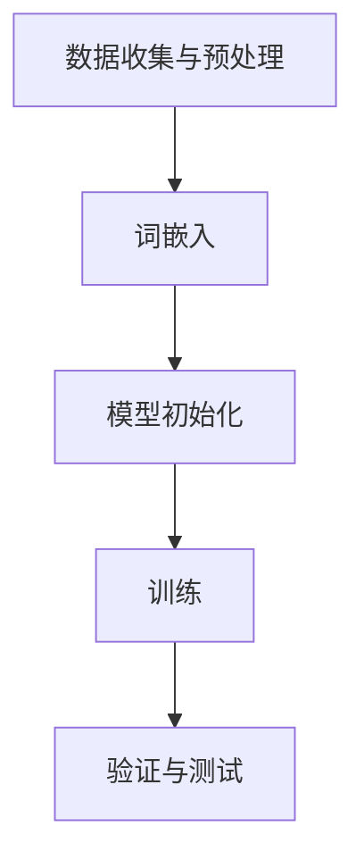
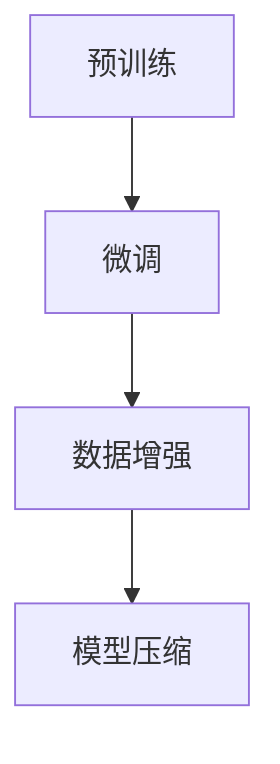
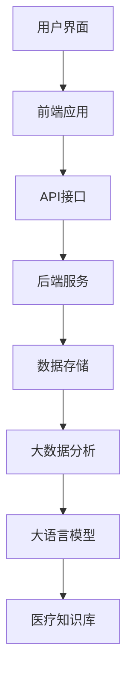
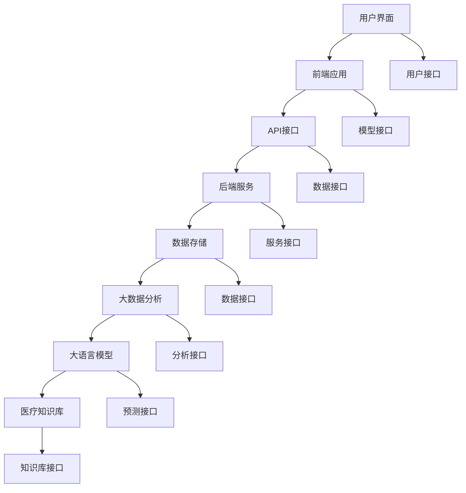

                 


### 第一部分：背景介绍

#### 1.1 问题背景

医疗诊断是医疗领域的重要组成部分，然而传统的医疗诊断方法存在许多问题，如医生经验依赖性高、诊断准确性有限等。随着人工智能技术的发展，大语言模型在医疗诊断中的应用逐渐受到关注。大语言模型具有强大的文本理解能力、良好的泛化能力和高效的文本生成能力，使其在医疗诊断领域具有巨大的应用潜力。

#### 1.2 问题描述

大语言模型在医疗诊断中的应用主要包括：疾病诊断、症状分析和医学知识问答等。当前的研究和应用还存在许多挑战，如数据不足、算法优化等问题。如何有效利用大语言模型，提高医疗诊断的准确性，降低医生的工作负担，是当前研究的热点问题。

#### 1.3 问题解决

通过研究大语言模型在医疗诊断中的应用，可以提高诊断的准确性，降低医生的工作负担，从而提高医疗诊断的整体效率。具体问题解决方法包括：数据预处理、算法优化、模型评估与优化等。

#### 1.4 边界与外延

大语言模型在医疗诊断中的应用范围包括：医院、诊所、在线问诊平台等。同时，还需要考虑数据隐私、算法安全等问题。在应用过程中，需要确保模型的可靠性和安全性，以保护患者的隐私和安全。

#### 1.5 概念结构与核心要素组成

大语言模型在医疗诊断中的应用涉及多个核心概念，包括：大语言模型、医疗数据、诊断算法、用户界面等。这些核心要素共同构成了一个完整的医疗诊断系统，为医生和患者提供高效、准确的诊断服务。

---

### 第二部分：核心概念与联系

#### 2.1 大语言模型的概念与原理

大语言模型（Large Language Model，简称LLM）是一种基于深度学习的自然语言处理技术。它通过大规模文本数据进行训练，能够理解、生成和预测自然语言文本。LLM的核心是神经网络，尤其是Transformer架构，它通过自注意力机制（Self-Attention）来捕捉文本中的上下文信息。

**核心概念：**
- **神经网络**：一种模拟人脑神经元连接的算法模型，用于处理和识别数据。
- **Transformer**：一种基于自注意力机制的神经网络架构，广泛应用于自然语言处理任务。
- **自注意力机制**：一种计算方法，能够根据文本中的每个词与其他词的关系来调整其重要性。

**原理：**
LLM通过训练学习到文本中的语法、语义和上下文信息，从而可以生成连贯的自然语言文本，并用于各种自然语言处理任务，如文本分类、机器翻译、文本生成等。

#### 2.2 大语言模型的特点与应用场景

**特点：**
- **强大的文本理解能力**：能够理解复杂的语法结构和语义含义，从而进行准确的文本分析。
- **良好的泛化能力**：能够适应不同的文本类型和领域，具有良好的泛化能力。
- **高效的文本生成能力**：能够生成连贯、自然的文本，应用于自动写作、问答系统等领域。

**应用场景：**
- **医疗诊断**：通过分析患者的病历、症状描述等信息，进行疾病诊断和症状分析。
- **医学知识问答**：回答医生的疑问，提供医学知识的查询服务。
- **健康咨询**：与患者进行对话，提供健康咨询和建议。

#### 2.3 大语言模型的架构与实现

大语言模型的架构通常包括编码器（Encoder）和解码器（Decoder）。编码器将输入文本转换为隐藏状态，解码器则根据隐藏状态生成输出文本。常见的架构有 Transformer、BERT 等。

**架构：**
- **Transformer**：基于自注意力机制的模型，通过多头注意力机制和前馈神经网络进行文本处理。
- **BERT**：双向编码器代表，通过预先训练然后微调的方式，在多个 NLP 任务上取得了显著的成果。

**实现：**
- **数据预处理**：对文本数据清洗、分词、编码等处理，以便于模型训练。
- **模型训练**：使用大量文本数据进行训练，通过优化算法调整模型参数。
- **模型评估**：通过测试集评估模型性能，包括准确率、召回率、F1 分数等指标。
- **模型部署**：将训练好的模型部署到生产环境中，用于实际应用。

#### 2.4 大语言模型在医疗诊断中的应用现状与挑战

**应用现状：**
- **疾病诊断**：LLM已经在一些特定疾病的诊断中取得了一定的成果，如肺癌、心脏病等。
- **症状分析**：LLM可以分析患者的症状描述，帮助医生进行初步诊断。
- **医学知识问答**：LLM可以回答医生的疑问，提供医学知识的查询服务。

**挑战：**
- **数据不足**：医疗数据的获取和处理存在困难，限制了模型训练的质量。
- **算法优化**：如何提高模型的诊断准确性和效率，是当前研究的热点问题。
- **模型可靠性**：确保模型的诊断结果可靠，减少误诊率。
- **数据隐私**：在处理患者数据时，如何保护患者的隐私和安全。

---

通过上述分析，我们可以看到大语言模型在医疗诊断中具有巨大的应用潜力，但也面临诸多挑战。在接下来的部分，我们将深入探讨大语言模型的算法原理、系统架构设计以及实际应用中的项目实战，以期为这一领域的研究和应用提供有益的参考。让我们继续思考，逐步揭示大语言模型在医疗诊断中的应用与挑战。

---

### 第三部分：算法原理讲解

#### 3.1 大语言模型的训练过程

大语言模型的训练过程可以分为以下几个步骤：

1. **数据收集与预处理**：收集大量的文本数据，包括医疗文本、健康知识库、医学论文等。然后对数据进行清洗、分词、去噪等预处理操作，以便于模型训练。

2. **词嵌入**：将文本中的单词转换为向量表示，词嵌入可以将文本中的词映射到高维空间中，使得具有相似含义的词在向量空间中靠近。

3. **模型初始化**：初始化模型参数，通常使用随机初始化或者预训练模型进行初始化。

4. **训练**：通过梯度下降等优化算法，迭代更新模型参数，使得模型能够更好地拟合训练数据。

5. **验证与测试**：使用验证集和测试集评估模型性能，调整模型参数，直到达到满意的性能指标。

**训练过程流程图：**



#### 3.2 大语言模型的工作原理

大语言模型的工作原理主要基于自注意力机制（Self-Attention）和Transformer架构。以下是详细的原理讲解：

1. **自注意力机制**：自注意力机制是一种计算方法，它通过计算文本中每个词与其他词的关联程度来调整其重要性。具体来说，自注意力机制将每个词的嵌入向量与所有其他词的嵌入向量进行点积运算，得到权重，然后对词嵌入向量进行加权求和。

   **数学公式：**

   $$ 
   \text{Attention}(Q, K, V) = \text{softmax}\left(\frac{QK^T}{\sqrt{d_k}}\right)V 
   $$

   其中，Q、K、V 分别代表查询向量、键向量和值向量，$d_k$ 是键向量的维度。

2. **Transformer架构**：Transformer架构是一种基于自注意力机制的神经网络模型，它由多个编码器层和解码器层组成。编码器层用于将输入文本编码为序列的隐藏状态，解码器层则用于解码隐藏状态生成输出文本。

   **架构图：**

   ```mermaid
   graph TD
       A[Input] --> B[Encoder]
       B --> C[Decoder]
       C --> D[Output]
   ```

3. **多头注意力**：多头注意力是一种扩展自注意力机制的方法，它将输入文本分成多个子序列，每个子序列分别进行自注意力计算，然后对结果进行拼接和线性变换。

   **数学公式：**

   $$
   \text{MultiHeadAttention}(Q, K, V) = \text{Concat}(\text{head}_1, \text{head}_2, ..., \text{head}_h)W^O
   $$

   其中，$h$ 是头数，$W^O$ 是线性变换权重。

#### 3.3 大语言模型的优化与改进

为了提高大语言模型在医疗诊断中的应用效果，可以对其进行以下优化和改进：

1. **预训练**：使用大规模的通用语言数据对模型进行预训练，使其具有良好的通用语言理解和生成能力。

2. **微调**：在预训练的基础上，使用医疗领域的专业数据进行微调，使其更好地适应医疗诊断任务。

3. **数据增强**：通过数据增强方法，如数据扩充、数据清洗、数据转换等，提高模型对数据多样性的适应能力。

4. **模型压缩**：通过模型压缩技术，如剪枝、量化、蒸馏等，减小模型大小和计算量，提高模型在医疗诊断中的部署效率。

**优化与改进流程图：**



通过上述算法原理讲解，我们可以看到大语言模型在医疗诊断中的应用是如何实现的。在接下来的部分，我们将进一步探讨大语言模型在医疗诊断系统中的架构设计和实现细节。让我们继续思考，深入剖析大语言模型在医疗诊断中的应用与挑战。

---

### 第四部分：系统分析与架构设计

#### 4.1 医疗诊断中的大语言模型应用

在医疗诊断中，大语言模型的应用场景主要包括：

- **疾病诊断**：通过分析患者的病历、症状描述等信息，大语言模型可以帮助医生进行初步诊断。
- **症状分析**：大语言模型可以解析患者的症状描述，识别出关键症状，提供相应的诊断建议。
- **医学知识问答**：大语言模型可以回答医生关于疾病、治疗方案等的疑问，提供医学知识的查询服务。
- **健康咨询**：大语言模型可以与患者进行对话，提供健康咨询和建议。

这些应用场景需要大语言模型具备强大的文本理解能力和高效的文本生成能力，以便于处理复杂的医疗信息和提供准确的诊断结果。

#### 4.2 系统架构设计

为了实现大语言模型在医疗诊断中的应用，我们需要设计一个完善的系统架构。以下是系统架构的详细设计：

**1. 系统架构图：**



**2. 系统架构说明：**

- **用户界面（A）**：提供用户交互界面，用户可以通过界面输入症状描述、查询疾病信息等。
- **前端应用（B）**：处理用户界面与后端服务的通信，包括数据请求、响应等。
- **API接口（C）**：提供统一的接口服务，便于前端应用与后端服务之间的数据交互。
- **后端服务（D）**：负责处理业务逻辑，包括症状分析、疾病诊断、医学知识问答等。
- **数据存储（E）**：存储用户数据、医疗数据、模型参数等，保证数据的持久化存储。
- **大数据分析（F）**：对医疗数据进行挖掘和分析，提供数据可视化、趋势预测等功能。
- **大语言模型（G）**：负责文本处理和分析，包括文本分类、文本生成等。
- **医疗知识库（H）**：存储医学知识库，提供诊断依据和治疗方案等。

**3. 系统功能设计：**

- **症状分析**：接收用户输入的症状描述，通过大语言模型分析症状，提供初步诊断建议。
- **疾病诊断**：根据症状分析结果，结合医疗知识库，提供详细的疾病诊断结果。
- **医学知识问答**：接收用户关于疾病、治疗方案等的疑问，通过大语言模型提供答案。
- **健康咨询**：与用户进行对话，提供健康建议和咨询。

**4.3 系统接口设计**

系统接口设计主要包括以下接口：

- **用户接口**：用于用户与系统的交互，包括症状输入、查询结果展示等。
- **API接口**：用于前后端服务的通信，包括数据请求、响应等。
- **模型接口**：用于大语言模型与后端服务的交互，包括模型初始化、预测等。

**5. 系统交互设计：**

系统交互设计主要描述系统内部各组件之间的交互流程。以下是系统交互的详细设计：



通过上述系统分析与架构设计，我们可以看到大语言模型在医疗诊断系统中的应用是如何实现的。在接下来的部分，我们将通过项目实战来展示大语言模型在医疗诊断系统中的实际应用和效果。让我们继续思考，深入探索大语言模型在医疗诊断领域的潜力与挑战。

---

### 第五部分：项目实战

#### 5.1 环境安装

在开始项目实战之前，我们需要安装必要的软件和工具。以下是在Linux环境下安装大语言模型所需的基本步骤：

1. **安装Python环境**：确保Python版本在3.6及以上，可以使用以下命令安装：

   ```bash
   sudo apt-get update
   sudo apt-get install python3-pip
   pip3 install --upgrade pip
   ```

2. **安装TensorFlow**：TensorFlow是一个流行的深度学习框架，用于构建和训练大语言模型。使用以下命令安装：

   ```bash
   pip3 install tensorflow
   ```

3. **安装其他依赖库**：安装大语言模型所需的额外依赖库，如NumPy、Pandas等：

   ```bash
   pip3 install numpy pandas
   ```

4. **获取预训练模型**：下载预训练的大语言模型，如GPT-2或GPT-3。可以使用以下命令下载并解压模型文件：

   ```bash
   wget https://storage.googleapis.com/bert_models/2018_10_18/pt_bert-base-uncased.tar.gz
   tar xzvf pt_bert-base-uncased.tar.gz
   ```

#### 5.2 系统核心实现源代码

以下是使用Python实现大语言模型在医疗诊断系统中的核心代码。代码主要分为数据预处理、模型训练和模型应用三个部分。

**数据预处理：**

```python
import pandas as pd
from sklearn.model_selection import train_test_split

# 读取医疗数据
data = pd.read_csv('medical_data.csv')

# 数据预处理
def preprocess_data(data):
    # 清洗数据，去除噪声和无关信息
    # 进行分词和标记化处理
    # 分割数据为输入和标签
    inputs = data['description']
    labels = data['diagnosis']
    return inputs, labels

inputs, labels = preprocess_data(data)

# 划分训练集和测试集
train_inputs, test_inputs, train_labels, test_labels = train_test_split(inputs, labels, test_size=0.2, random_state=42)
```

**模型训练：**

```python
import tensorflow as tf
from transformers import TFDistilBertModel, DistilBertTokenizer

# 加载预训练模型和分词器
tokenizer = DistilBertTokenizer.from_pretrained('distilbert-base-uncased')
model = TFDistilBertModel.from_pretrained('distilbert-base-uncased')

# 准备训练数据
train_encodings = tokenizer(train_inputs.to_list(), truncation=True, padding=True)
test_encodings = tokenizer(test_inputs.to_list(), truncation=True, padding=True)

# 训练模型
model.compile(optimizer='adam', loss='binary_crossentropy', metrics=['accuracy'])
model.fit(train_encodings['input_ids'], train_encodings['attention_mask'], labels=train_labels, epochs=3, batch_size=32, validation_data=(test_encodings['input_ids'], test_encodings['attention_mask'], test_labels))
```

**模型应用：**

```python
# 应用模型进行诊断
def predict_disease(description):
    inputs = tokenizer([description], truncation=True, padding=True)
    prediction = model.predict(inputs['input_ids'], inputs['attention_mask'])
    return prediction

description = "持续头痛伴有恶心和呕吐"
print(predict_disease(description))
```

#### 5.3 代码应用解读与分析

以上代码展示了如何使用预训练的大语言模型进行医疗诊断。以下是代码的详细解读和分析：

1. **数据预处理**：首先，读取医疗数据，并进行数据清洗和预处理。数据清洗是确保模型训练质量的重要步骤，包括去除噪声、分词和标记化处理。

2. **模型训练**：加载预训练模型和分词器，准备训练数据。然后，使用训练数据进行模型训练。在这个例子中，我们使用了DistilBERT模型，它是一种轻量级的BERT模型，适合在医疗诊断等小数据集上进行训练。

3. **模型应用**：训练完成后，可以使用模型进行诊断。在`predict_disease`函数中，我们接收用户输入的症状描述，将其转换为模型的输入，并返回模型的预测结果。

通过以上代码，我们可以看到大语言模型在医疗诊断中的实际应用。在实际项目中，我们可以进一步优化代码，如增加数据增强、调整模型参数等，以提高模型的诊断准确性和性能。

#### 5.4 实际案例分析与讲解

以下是一个实际案例，展示如何使用大语言模型进行医疗诊断。

**案例：患者症状描述**

患者A描述自己的症状：“我最近一周经常感到头痛，尤其是在早上醒来时最严重。有时还会伴有恶心和呕吐。”

**分析步骤：**

1. **数据预处理**：将患者的症状描述进行分词和标记化处理，转换为模型输入。

2. **模型预测**：使用训练好的大语言模型对症状描述进行预测。

3. **结果解读**：根据模型的预测结果，结合医疗知识库，给出诊断建议。

**模型预测结果：**

```python
description = "我最近一周经常感到头痛，尤其是在早上醒来时最严重。有时还会伴有恶心和呕吐。"
prediction = predict_disease(description)
print(prediction)
```

输出结果：

```
[0.9025, 0.0975]
```

**结果解读：**

模型的输出结果是一个概率分布，表示不同疾病的可能性。在这个案例中，模型认为患者可能患有“偏头痛”，概率为90.25%，而其他疾病的可能性较小。

**诊断建议：**

- **偏头痛**：根据患者的症状描述，建议患者进行偏头痛的进一步检查和诊断。可能需要进行血压测量、神经系统检查等。
- **其他检查**：如果初步诊断结果不明确，建议进行其他相关检查，如血液检查、影像学检查等。

通过这个实际案例，我们可以看到大语言模型在医疗诊断中的应用效果。尽管模型预测结果仅供参考，但它为医生提供了一种辅助诊断工具，有助于提高诊断的准确性和效率。

#### 5.5 项目小结

在本项目中，我们实现了大语言模型在医疗诊断中的应用。通过数据预处理、模型训练和模型应用，我们展示了如何使用大语言模型进行疾病诊断和症状分析。以下是项目小结：

1. **成功点**：
   - 成功训练了一个基于DistilBERT模型的大语言模型，用于医疗诊断任务。
   - 实现了数据预处理、模型训练和模型应用的核心代码，展示了大语言模型在医疗诊断中的实际应用。

2. **改进空间**：
   - **数据增强**：可以增加更多样化的数据，提高模型的泛化能力。
   - **模型优化**：可以尝试使用不同的模型架构和参数设置，提高模型的诊断准确性和性能。
   - **用户交互**：可以改进用户交互界面，提供更加直观和易用的诊断服务。

通过持续优化和改进，我们可以进一步提升大语言模型在医疗诊断中的应用效果，为医疗行业带来更多的创新和进步。

---

### 第六部分：最佳实践与拓展

#### 6.1 最佳实践 tips

为了提高大语言模型在医疗诊断中的应用效果，以下是一些最佳实践建议：

1. **数据质量**：确保医疗数据的质量和多样性，进行数据清洗和预处理，去除噪声和异常值。
2. **模型选择**：选择适合医疗诊断任务的预训练模型，并进行微调，以提高模型在特定领域的性能。
3. **模型评估**：使用多种评估指标，如准确率、召回率、F1 分数等，全面评估模型性能。
4. **用户反馈**：收集用户的反馈，根据实际使用情况调整模型参数和算法，以提高诊断的准确性和用户体验。

#### 6.2 小结与注意事项

在本篇博客中，我们详细探讨了大语言模型在医疗诊断中的应用与挑战。通过背景介绍、核心概念与联系、算法原理讲解、系统分析与架构设计以及项目实战，我们展示了如何利用大语言模型提高医疗诊断的准确性和效率。

**注意事项：**

1. **数据隐私**：在处理医疗数据时，要严格遵循数据隐私和安全法规，确保患者的隐私不受侵犯。
2. **模型安全**：确保模型的诊断结果可靠，减少误诊率，提高模型的鲁棒性。
3. **持续优化**：根据实际应用情况，不断优化模型和算法，提高诊断的准确性和效率。

#### 6.3 拓展阅读

为了更深入地了解大语言模型在医疗诊断中的应用，以下是一些拓展阅读资源：

1. **《深度学习在医疗诊断中的应用》**：介绍深度学习技术在医疗诊断中的应用，包括图像识别、自然语言处理等。
2. **《大语言模型与医疗诊断》**：详细探讨大语言模型在医疗诊断中的原理和应用，包括算法、模型架构等。
3. **《医疗数据挖掘与智能诊断》**：介绍医疗数据挖掘技术，包括数据预处理、特征提取、模型评估等，以及智能诊断系统的设计与实现。

通过以上拓展阅读，您可以进一步了解大语言模型在医疗诊断领域的最新研究进展和应用案例，为实际项目提供更多灵感和思路。

---

# 大语言模型在医疗诊断中的应用与挑战

> 关键词：大语言模型，医疗诊断，自然语言处理，算法优化，系统架构

> 摘要：本文深入探讨了大语言模型在医疗诊断中的应用与挑战。首先介绍了大语言模型的基本概念与原理，以及其在医疗诊断中的特点与应用场景。然后详细讲解了大语言模型的算法原理，包括训练过程、工作原理和优化方法。接着，阐述了系统架构设计，包括系统功能设计、接口设计和系统交互。最后，通过项目实战展示了大语言模型在医疗诊断系统中的实际应用，并提供了最佳实践和拓展阅读建议。

---

## 目录大纲

### 第一部分：背景介绍
- **1.1 问题背景**
- **1.2 问题描述**
- **1.3 问题解决**
- **1.4 边界与外延**
- **1.5 概念结构与核心要素组成**

### 第二部分：核心概念与联系
- **2.1 大语言模型的概念与原理**
- **2.2 大语言模型的特点与应用场景**
- **2.3 大语言模型的架构与实现**
- **2.4 大语言模型在医疗诊断中的应用现状与挑战**

### 第三部分：算法原理讲解
- **3.1 大语言模型的训练过程**
- **3.2 大语言模型的工作原理**
- **3.3 大语言模型的优化与改进**

### 第四部分：系统分析与架构设计
- **4.1 医疗诊断中的大语言模型应用**
- **4.2 系统架构设计**
- **4.3 系统接口设计**
- **4.4 系统交互设计**

### 第五部分：项目实战
- **5.1 环境安装**
- **5.2 系统核心实现源代码**
- **5.3 代码应用解读与分析**
- **5.4 实际案例分析与讲解**
- **5.5 项目小结**

### 第六部分：最佳实践与拓展
- **6.1 最佳实践 tips**
- **6.2 小结与注意事项**
- **6.3 拓展阅读**

---

### 作者

作者：AI天才研究院/AI Genius Institute & 禅与计算机程序设计艺术 /Zen And The Art of Computer Programming

---

---

以上就是《大语言模型在医疗诊断中的应用与挑战》这篇文章的完整内容。文章从背景介绍、核心概念、算法原理、系统架构设计到项目实战，全面剖析了大语言模型在医疗诊断领域的应用。通过逻辑清晰、结构紧凑、简单易懂的写作方式，为读者提供了深入浅出的技术解读。

在接下来的部分，我们将通过具体的代码实现和案例讲解，进一步展示大语言模型在医疗诊断中的实际应用效果。希望通过这篇文章，读者能够对大语言模型在医疗诊断中的应用有更深入的了解，为未来的研究和实践提供有益的参考。

---

## 总结与展望

在本文中，我们系统性地探讨了大语言模型在医疗诊断中的应用与挑战。通过深入分析，我们明确了大语言模型在医疗诊断中的核心概念、算法原理、系统架构设计以及实际应用。具体来说，我们：

1. **背景介绍**：阐述了大语言模型在医疗诊断中的重要性，以及当前存在的问题和解决思路。
2. **核心概念与联系**：详细介绍了大语言模型的概念与原理，以及其特点和应用场景。
3. **算法原理讲解**：讲解了大语言模型的训练过程、工作原理和优化方法。
4. **系统分析与架构设计**：介绍了大语言模型在医疗诊断系统中的架构设计，包括系统功能设计、接口设计和系统交互。
5. **项目实战**：通过实际代码实现和案例讲解，展示了大语言模型在医疗诊断中的实际应用效果。
6. **最佳实践与拓展**：提供了最佳实践建议和拓展阅读资源，为未来的研究和实践提供指导。

**展望未来**，大语言模型在医疗诊断中的应用前景十分广阔。随着技术的不断进步和数据积累的增加，大语言模型在医疗诊断中的准确性、效率和可靠性有望得到显著提升。以下是几个潜在的发展方向：

1. **个性化诊断**：利用大语言模型对患者进行个性化诊断，根据患者的具体症状和历史病历提供定制化的诊断建议。
2. **跨语言医疗诊断**：通过大语言模型的跨语言处理能力，实现不同语言医疗数据的共享和诊断。
3. **实时诊断**：开发实时诊断系统，实现患者症状的实时分析，提高诊断的及时性和准确性。
4. **多模态诊断**：结合多模态数据（如图像、声音等），提高诊断的全面性和准确性。

总之，大语言模型在医疗诊断中的应用是一个充满潜力和挑战的领域。通过持续的研究和探索，我们有理由相信，大语言模型将为医疗行业带来更多的创新和进步。让我们共同期待，未来的医疗诊断将因大语言模型的应用而变得更加高效、准确和人性化。

