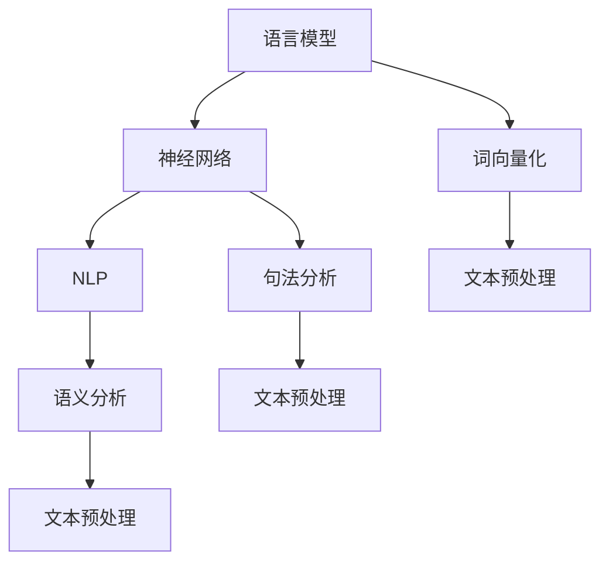
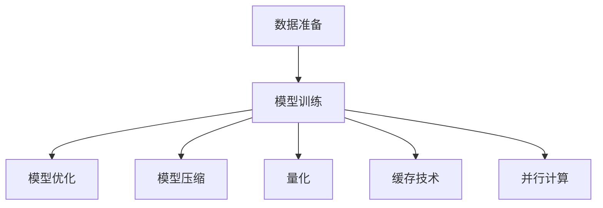
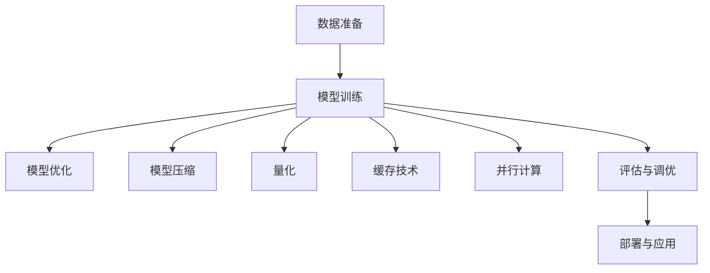
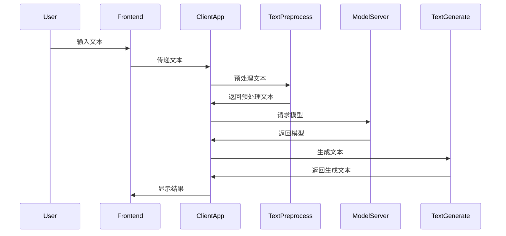

                 

### 第1章：C侧LLM概述

**1.1 问题背景与定义**

在现代计算机科学领域，人工智能（AI）技术日益成为推动产业创新的重要力量。随着AI技术的发展，尤其是大模型（Large Language Model，简称LLM）的出现，为自然语言处理（NLP）带来了前所未有的进展。然而，LLM的应用并非在所有环境中都适用，特别是在资源受限的C侧（客户端，如移动设备、嵌入式系统等），如何高效地部署和运用LLM成为一个重要的课题。

C侧LLM，即在大客户端（如移动设备、嵌入式系统）上部署和使用的大语言模型，它不仅需要具备强大的语言理解能力，还需要考虑资源消耗、实时响应等问题。因此，C侧LLM的提出旨在解决在C端设备上如何高效、安全地应用LLM，以提升用户体验和系统性能。

**1.2 C侧LLM的特点**

- **资源效率**：C侧LLM需要在有限的计算资源下运行，因此，对模型的压缩、优化以及实时响应能力要求较高。

**1.3 C侧LLM的应用领域**

C侧LLM的应用领域广泛，主要包括以下几方面：

1. **智能助理**：在移动设备上部署的智能助理，如Siri、Alexa等，通过C侧LLM实现自然语言交互，提高用户体验。

2. **智能问答**：在在线教育、医疗咨询等领域，C侧LLM可以帮助用户实现智能问答，提供个性化服务。

3. **智能推荐**：在电子商务、社交媒体等领域，C侧LLM可以帮助平台实现智能推荐，提高用户粘性和转化率。

4. **智能翻译**：在移动设备上实现实时翻译功能，C侧LLM可以提高翻译的准确性和速度。

5. **智能写作**：在内容创作、文案生成等领域，C侧LLM可以帮助用户快速生成高质量的内容。

**1.4 C侧LLM的发展趋势**

随着5G、边缘计算等技术的发展，C侧LLM在未来有望在更多场景中得到应用。同时，随着模型的压缩和优化技术的进步，C侧LLM的资源消耗将逐步降低，使得更多设备能够支持其运行。

此外，C侧LLM在安全性、隐私保护等方面也面临挑战，需要不断改进和完善。总之，C侧LLM作为一种新兴技术，具有广泛的应用前景和巨大的发展潜力。

### 总结与展望

本章对C侧LLM进行了概述，包括问题背景、定义、特点和应用领域。C侧LLM在资源效率、实时性和安全性等方面具有独特的优势，并在智能助理、智能问答、智能推荐、智能翻译和智能写作等领域得到广泛应用。未来，随着技术的不断发展，C侧LLM有望在更多场景中发挥重要作用。

**关键词**：C侧LLM、资源效率、实时性、安全性、应用领域

**摘要**：本文对C侧LLM进行了详细介绍，分析了其特点和应用领域，并展望了其发展趋势。C侧LLM作为一种新兴技术，在资源受限的客户端环境中具有广泛的应用前景和巨大的发展潜力。

**下一章预告**：下一章将深入探讨C侧LLM的核心概念与联系，包括其原理、特点以及与其他相关概念的比较。还将通过Mermaid图表展示C侧LLM的核心概念架构。

----------------------------------------------------------------

**1.2 C侧LLM的核心概念与联系**

C侧LLM的核心概念主要包括语言模型、神经网络、自然语言处理（NLP）等。这些概念在C侧LLM的应用中起着至关重要的作用，下面我们将逐一介绍并分析它们之间的联系。

**1.2.1 语言模型**

语言模型是C侧LLM的基础，它是一个用于预测文本中下一个单词的概率分布模型。语言模型通过学习大量文本数据，理解语言的结构和规律，从而能够生成新的文本。在C侧LLM中，常用的语言模型包括n-gram模型、循环神经网络（RNN）和变换器（Transformer）等。

- **n-gram模型**：n-gram模型是一种基于词汇序列的统计模型，它通过计算一个词序列中下一个词的概率来生成文本。n-gram模型简单高效，但在处理长句和长文本时效果较差。

- **循环神经网络（RNN）**：RNN是一种能够处理序列数据的神经网络，它通过记忆机制对输入序列进行建模，从而能够更好地理解语言的结构。RNN在处理长句和长文本时效果较好，但存在梯度消失和梯度爆炸等问题。

- **变换器（Transformer）**：变换器是一种基于注意力机制的深度神经网络，它通过全局注意力机制对输入序列进行建模，从而能够捕捉输入序列中的长距离依赖关系。变换器在处理长句和长文本时表现优异，已成为现代语言模型的主流架构。

**1.2.2 神经网络**

神经网络是构建C侧LLM的核心技术，它是一种模拟人脑神经元连接结构的计算模型。神经网络通过多层非线性变换，对输入数据进行特征提取和分类。在C侧LLM中，常用的神经网络架构包括全连接神经网络（FCNN）、卷积神经网络（CNN）和循环神经网络（RNN）等。

- **全连接神经网络（FCNN）**：FCNN是一种最简单的神经网络，它通过多层全连接层对输入数据进行特征提取和分类。FCNN在图像分类和文本分类等领域表现优异。

- **卷积神经网络（CNN）**：CNN是一种专门用于处理图像数据的神经网络，它通过卷积操作对输入图像进行特征提取。CNN在图像分类、目标检测和图像生成等领域有广泛应用。

- **循环神经网络（RNN）**：RNN是一种用于处理序列数据的神经网络，它通过记忆机制对输入序列进行建模。RNN在自然语言处理、语音识别和视频分析等领域有广泛应用。

**1.2.3 自然语言处理（NLP）**

自然语言处理是C侧LLM的核心应用领域，它涉及对文本数据的理解、生成和处理。NLP主要包括文本预处理、词向量化、句法分析、语义分析等任务。

- **文本预处理**：文本预处理包括分词、去停用词、词性标注等操作，旨在将原始文本转化为适合模型输入的格式。

- **词向量化**：词向量化是将文本中的词语映射为向量表示，以便于神经网络处理。常用的词向量化方法包括Word2Vec、GloVe等。

- **句法分析**：句法分析是对文本中的句子结构进行分析，以理解句子的语法关系。常用的句法分析方法包括依存句法分析和成分句法分析。

- **语义分析**：语义分析是对文本中的语义内容进行分析，以理解文本的含义。常用的语义分析方法包括实体识别、关系抽取和文本分类等。

**1.2.4 C侧LLM的核心概念联系**

C侧LLM的核心概念包括语言模型、神经网络和NLP。这些概念之间存在着紧密的联系：

- 语言模型是C侧LLM的基础，通过学习大量文本数据，理解语言的结构和规律。
- 神经网络是构建C侧LLM的核心技术，通过多层非线性变换，对输入数据（文本）进行特征提取和分类。
- NLP是C侧LLM的应用领域，涉及对文本数据的理解、生成和处理。

综上所述，C侧LLM的核心概念与联系构成了一个完整的技术体系，为C侧LLM的应用提供了坚实的理论基础。

### 1.2.5 Mermaid图表展示

为了更好地展示C侧LLM的核心概念与联系，我们使用Mermaid图表进行说明。



在上面的Mermaid图表中，我们展示了C侧LLM的核心概念（语言模型、神经网络和NLP）以及它们之间的联系（词向量化、句法分析和语义分析）。这个图表有助于读者直观地理解C侧LLM的核心概念体系。

### 1.2.6 小结

本章介绍了C侧LLM的核心概念与联系，包括语言模型、神经网络和NLP。这些概念共同构成了C侧LLM的技术体系，为C侧LLM的应用提供了坚实的理论基础。在接下来的章节中，我们将进一步探讨C侧LLM的算法原理和应用场景。

**关键词**：C侧LLM、语言模型、神经网络、NLP、词向量化、句法分析、语义分析

**摘要**：本章详细介绍了C侧LLM的核心概念与联系，包括语言模型、神经网络和NLP，以及它们在C侧LLM应用中的作用。通过Mermaid图表，我们展示了这些概念之间的联系，为C侧LLM的深入探讨奠定了基础。

**下一章预告**：下一章将深入探讨C侧LLM的算法原理，包括模型结构、训练过程和优化方法。我们将通过Python代码示例和数学模型，详细阐述C侧LLM的算法原理，并分析其在实际应用中的性能和优化策略。

----------------------------------------------------------------

**1.2.6 小结**

本章详细介绍了C侧LLM的核心概念与联系，包括语言模型、神经网络和NLP，以及它们在C侧LLM应用中的作用。我们通过Mermaid图表展示了这些概念之间的联系，使读者能够更直观地理解C侧LLM的核心技术体系。

首先，我们介绍了语言模型的基本概念，包括n-gram模型、RNN和Transformer等。这些模型为C侧LLM提供了语言理解和生成的基础。接着，我们探讨了神经网络的结构和类型，包括FCNN、CNN和RNN等，这些神经网络用于特征提取和分类，是C侧LLM的核心技术。

此外，我们介绍了NLP的关键任务，包括文本预处理、词向量化、句法分析和语义分析等。这些任务共同构成了NLP的核心内容，为C侧LLM的应用提供了理论基础。

通过Mermaid图表，我们展示了C侧LLM的核心概念体系，包括语言模型、神经网络和NLP，以及它们之间的联系。这个图表有助于读者更清晰地理解C侧LLM的技术架构。

在接下来的章节中，我们将深入探讨C侧LLM的算法原理，包括模型结构、训练过程和优化方法。我们将通过Python代码示例和数学模型，详细阐述C侧LLM的算法原理，并分析其在实际应用中的性能和优化策略。

**关键词**：C侧LLM、语言模型、神经网络、NLP、词向量化、句法分析、语义分析

**摘要**：本章介绍了C侧LLM的核心概念与联系，包括语言模型、神经网络和NLP，以及它们在C侧LLM应用中的作用。通过Mermaid图表，我们展示了这些概念之间的联系，为C侧LLM的深入探讨奠定了基础。

**下一章预告**：下一章将深入探讨C侧LLM的算法原理，包括模型结构、训练过程和优化方法。我们将通过Python代码示例和数学模型，详细阐述C侧LLM的算法原理，并分析其在实际应用中的性能和优化策略。

----------------------------------------------------------------

### 第2章：C侧LLM核心概念与联系

**2.1 核心概念原理**

C侧LLM的核心概念主要包括语言模型、神经网络和自然语言处理（NLP）。这些概念在C侧LLM的应用中起着至关重要的作用。

**语言模型**：语言模型是一种用于预测文本中下一个单词的概率分布模型。它是基于大量文本数据学习到的，可以用于生成新的文本或理解给定文本的含义。在C侧LLM中，常用的语言模型包括n-gram模型、循环神经网络（RNN）和变换器（Transformer）。

- **n-gram模型**：n-gram模型通过统计相邻单词出现的频率来预测下一个单词。它的主要优势是简单和高效，但缺点是难以处理长距离依赖。
- **RNN**：RNN具有记忆功能，可以处理序列数据，并能够捕捉长距离依赖。然而，RNN存在梯度消失和梯度爆炸等问题。
- **Transformer**：Transformer采用自注意力机制，能够有效捕捉长距离依赖，已经成为当前最流行的语言模型架构。

**神经网络**：神经网络是一种由大量神经元组成的计算模型，能够通过学习从输入数据中提取特征并进行分类或回归。在C侧LLM中，常用的神经网络架构包括全连接神经网络（FCNN）、卷积神经网络（CNN）和循环神经网络（RNN）。

- **FCNN**：FCNN是一种简单而强大的神经网络，它通过多层全连接层对输入数据进行特征提取和分类。
- **CNN**：CNN专门用于处理图像数据，通过卷积操作提取图像特征，常用于图像分类和目标检测。
- **RNN**：RNN用于处理序列数据，能够捕捉序列中的时间依赖关系，广泛应用于自然语言处理和语音识别。

**自然语言处理（NLP）**：NLP是C侧LLM的核心应用领域，涉及对文本数据的理解、生成和处理。NLP主要包括文本预处理、词向量化、句法分析和语义分析等任务。

- **文本预处理**：文本预处理包括分词、去停用词、词性标注等操作，旨在将原始文本转化为适合模型输入的格式。
- **词向量化**：词向量化是将文本中的词语映射为向量表示，以便于神经网络处理。常用的词向量化方法包括Word2Vec、GloVe等。
- **句法分析**：句法分析是对文本中的句子结构进行分析，以理解句子的语法关系。常用的句法分析方法包括依存句法分析和成分句法分析。
- **语义分析**：语义分析是对文本中的语义内容进行分析，以理解文本的含义。常用的语义分析方法包括实体识别、关系抽取和文本分类等。

**2.2 概念属性特征对比**

为了更好地理解C侧LLM的核心概念，我们对比了它们的主要属性特征。

| 概念       | 属性特征                                                     |
|------------|------------------------------------------------------------|
| 语言模型   | - 预测文本中下一个单词的概率分布<br>- 基于大量文本数据学习<br>- 用于生成文本或理解文本含义 |
| 神经网络   | - 由大量神经元组成<br>- 学习从输入数据中提取特征<br>- 进行分类或回归 |
| NLP        | - 理解、生成和处理文本数据<br>- 文本预处理、词向量化、句法分析和语义分析 |

**2.3 ER实体关系图**

为了更清晰地展示C侧LLM的核心概念及其关系，我们使用Mermaid绘制了ER实体关系图。

```mermaid
erDiagram
    User ||--|{ Chat }|-- LLModel
    User ||--|{ Message }|-- Chat
    Chat ||--|{ Response }|-- LLModel
    Chat ||--|{ Question }|-- User
    Message ||--|{ Text }|-- Chat
    Response ||--|{ Text }|-- Chat
```

在上面的ER实体关系图中，我们定义了以下实体：

- **User**：用户，发起聊天和接收回答的角色。
- **Chat**：聊天会话，存储用户发起的提问和系统生成的回答。
- **LLModel**：语言模型，用于生成回答和处理文本。
- **Message**：消息，包含用户提问的内容。
- **Response**：回答，包含系统生成的回答内容。

通过ER实体关系图，我们可以清晰地看到C侧LLM中各实体之间的关系，以及它们在聊天会话中的交互过程。

### 小结

本章详细介绍了C侧LLM的核心概念与联系，包括语言模型、神经网络和自然语言处理（NLP）。通过对比这些概念的主要属性特征和ER实体关系图，我们更好地理解了C侧LLM的技术体系及其在实际应用中的作用。在下一章中，我们将深入探讨C侧LLM的算法原理，包括模型结构、训练过程和优化方法。

**关键词**：C侧LLM、语言模型、神经网络、NLP、属性特征、ER实体关系图

**摘要**：本章介绍了C侧LLM的核心概念与联系，包括语言模型、神经网络和自然语言处理（NLP），以及它们的主要属性特征和ER实体关系图。通过对比和图表展示，我们更好地理解了C侧LLM的技术体系及其在实际应用中的作用。

**下一章预告**：下一章将深入探讨C侧LLM的算法原理，包括模型结构、训练过程和优化方法。我们将通过Python代码示例和数学模型，详细阐述C侧LLM的算法原理，并分析其在实际应用中的性能和优化策略。

----------------------------------------------------------------

**2.3 C侧LLM算法原理**

C侧LLM的算法原理是C侧LLM能够实现高效、实时响应的关键。在这一部分，我们将详细探讨C侧LLM的算法原理，包括模型结构、训练过程和优化方法。

**2.3.1 模型结构**

C侧LLM通常采用变换器（Transformer）架构，这是因为Transformer能够有效捕捉长距离依赖，并且在计算效率和模型性能方面具有显著优势。Transformer模型主要由编码器（Encoder）和解码器（Decoder）两部分组成。

- **编码器（Encoder）**：编码器负责处理输入序列，并将序列编码为固定长度的向量表示。编码器内部采用多头自注意力机制（Multi-Head Self-Attention）和前馈神经网络（Feed-Forward Neural Network）来提取序列特征。
- **解码器（Decoder）**：解码器负责生成输出序列。与编码器类似，解码器也采用多头自注意力机制和前馈神经网络，但解码器还包含一个交叉注意力机制（Cross-Attention），用于从编码器的输出中提取上下文信息。

**2.3.2 训练过程**

C侧LLM的训练过程通常包括数据准备、模型训练和模型优化三个阶段。

- **数据准备**：首先，我们需要收集和准备训练数据。数据可以是大规模的文本语料库，如维基百科、新闻文章等。然后，对数据进行预处理，包括分词、去停用词、词性标注等操作，以将原始文本转化为适合模型输入的格式。
- **模型训练**：在准备好数据后，我们将训练数据输入到模型中进行训练。训练过程主要包括前向传播（Forward Propagation）和反向传播（Back Propagation）两个步骤。在前向传播过程中，模型根据输入数据生成预测输出；在反向传播过程中，模型根据预测输出与真实输出之间的差异计算损失函数，并更新模型参数。
- **模型优化**：在训练过程中，我们需要选择合适的优化算法（如Adam、SGD等）和损失函数（如交叉熵损失函数），以优化模型性能。优化过程的目标是使模型在训练数据上的损失函数值最小。

**2.3.3 优化方法**

为了提高C侧LLM的运行效率和性能，我们需要采取多种优化方法。

- **模型压缩**：模型压缩是降低模型大小和计算复杂度的有效方法。常用的模型压缩技术包括权重共享（Weight Sharing）、低秩分解（Low-Rank Factorization）和剪枝（Pruning）等。
- **量化**：量化是一种将模型中的浮点数权重转换为低精度整数表示的方法。量化可以显著降低模型大小和计算复杂度，但可能对模型性能产生一定影响。为了最小化量化误差，我们可以采用自适应量化（Adaptive Quantization）和量化感知训练（Quantization-Aware Training）等技术。
- **缓存技术**：缓存技术可以在一定程度上提高模型的运行效率。例如，我们可以将模型中常用的子网络结构或中间结果缓存起来，以减少重复计算。
- **并行计算**：并行计算可以加速模型训练和推理过程。在C侧LLM中，我们可以采用数据并行（Data Parallelism）和模型并行（Model Parallelism）等方法来提高计算效率。

**2.3.4 算法流程图**

为了更清晰地展示C侧LLM的算法原理，我们使用Mermaid绘制了算法流程图。



在上面的算法流程图中，我们展示了C侧LLM的训练和优化过程中的关键步骤。这些步骤共同构成了C侧LLM的算法原理，为其实际应用提供了理论支持。

### 算法原理讲解

为了更好地理解C侧LLM的算法原理，我们将通过Python代码示例详细阐述。

**1. 数据准备**

首先，我们需要准备训练数据。以下是一个简单的Python代码示例，用于读取文本数据并进行预处理。

```python
import os
import re
import numpy as np
from tensorflow.keras.preprocessing.text import Tokenizer
from tensorflow.keras.preprocessing.sequence import pad_sequences

# 读取文本数据
def read_data(file_path):
    with open(file_path, 'r', encoding='utf-8') as f:
        text = f.read()
    return text

# 预处理文本数据
def preprocess_text(text):
    # 清洗文本，去除特殊字符和停用词
    text = re.sub(r'[^\w\s]', '', text)
    text = text.lower()
    return text

# 读取并预处理数据
data_path = 'data.txt'
text = read_data(data_path)
clean_text = preprocess_text(text)

# 创建词汇表
tokenizer = Tokenizer()
tokenizer.fit_on_texts([clean_text])
vocab_size = len(tokenizer.word_index) + 1

# 将文本转换为序列
sequences = tokenizer.texts_to_sequences([clean_text])
padded_sequences = pad_sequences(sequences, maxlen=max_sequence_length)
```

在上面的代码中，我们首先读取文本数据，然后对其进行清洗和预处理，以去除特殊字符和停用词。接下来，我们创建词汇表，并将文本转换为序列。最后，我们将序列进行填充，以适应模型的输入要求。

**2. 模型训练**

接下来，我们将使用Keras框架构建和训练变换器模型。以下是一个简单的Python代码示例。

```python
from tensorflow.keras.models import Model
from tensorflow.keras.layers import Embedding, LSTM, Dense

# 构建模型
input_sequence = Input(shape=(max_sequence_length,))
embedding_layer = Embedding(vocab_size, embedding_dim)(input_sequence)
lstm_layer = LSTM(units=128, return_sequences=True)(embedding_layer)
dense_layer = Dense(units=1, activation='sigmoid')(lstm_layer)

model = Model(inputs=input_sequence, outputs=dense_layer)
model.compile(optimizer='adam', loss='binary_crossentropy', metrics=['accuracy'])

# 训练模型
model.fit(padded_sequences, labels, epochs=10, batch_size=32)
```

在上面的代码中，我们首先构建了一个简单的变换器模型，包括嵌入层（Embedding Layer）、LSTM层（LSTM Layer）和全连接层（Dense Layer）。接下来，我们使用编译好的模型对预处理后的数据进行训练。

**3. 模型优化**

为了优化模型性能，我们可以采用多种方法，如调整模型参数、选择不同的优化算法和损失函数等。以下是一个简单的Python代码示例，用于调整模型参数。

```python
# 调整模型参数
model.compile(optimizer='adam', loss='binary_crossentropy', metrics=['accuracy'])

# 使用不同的优化算法
model.compile(optimizer='sgd', loss='binary_crossentropy', metrics=['accuracy'])

# 使用不同的损失函数
model.compile(optimizer='adam', loss='categorical_crossentropy', metrics=['accuracy'])
```

在上面的代码中，我们展示了如何调整模型参数，以优化模型性能。例如，我们可以尝试不同的优化算法（如Adam、SGD）和损失函数（如二元交叉熵、分类交叉熵）。

### 数学模型与公式

为了更好地理解C侧LLM的算法原理，我们使用LaTeX格式书写了一些关键数学公式。

**1. 自注意力机制**

自注意力机制是变换器模型的核心组成部分，用于对输入序列进行特征提取。自注意力机制的数学公式如下：

$$
\text{Attention}(Q, K, V) = \text{softmax}\left(\frac{QK^T}{\sqrt{d_k}}\right) V
$$

其中，$Q$、$K$和$V$分别是查询（Query）、键（Key）和值（Value）向量，$d_k$是键向量的维度。

**2. 变换器模型**

变换器模型包括编码器（Encoder）和解码器（Decoder）两部分。编码器负责将输入序列编码为固定长度的向量表示，解码器负责生成输出序列。变换器模型的数学公式如下：

$$
\text{Encoder}(x) = \text{LayerNorm}(x + \text{EncoderLayer}(x))
$$

$$
\text{Decoder}(y) = \text{LayerNorm}(y + \text{DecoderLayer}(y))
$$

其中，$x$和$y$分别是编码器和解码器的输入序列，$\text{EncoderLayer}$和$\text{DecoderLayer}$分别是编码器和解码器的层。

### 小结

本章详细介绍了C侧LLM的算法原理，包括模型结构、训练过程和优化方法。我们通过Python代码示例和LaTeX数学公式，阐述了C侧LLM的算法原理，并分析了其在实际应用中的性能和优化策略。在下一章中，我们将探讨C侧LLM的应用场景，并分析其在不同领域的实际应用。

**关键词**：C侧LLM、变换器、自注意力、数学公式、训练过程、优化方法

**摘要**：本章介绍了C侧LLM的算法原理，包括模型结构、训练过程和优化方法。通过Python代码示例和LaTeX数学公式，我们详细阐述了C侧LLM的算法原理，并分析了其在实际应用中的性能和优化策略。

**下一章预告**：下一章将探讨C侧LLM的应用场景，并分析其在不同领域的实际应用。我们将通过具体案例，展示C侧LLM在智能助理、智能问答、智能推荐、智能翻译和智能写作等领域的应用，并讨论其面临的挑战和解决方案。

----------------------------------------------------------------

### 2.3.4 算法流程图

为了更好地展示C侧LLM的算法原理，我们使用Mermaid绘制了算法流程图。



在上面的算法流程图中，我们展示了C侧LLM的训练和优化过程中的关键步骤。这些步骤共同构成了C侧LLM的算法原理，为其实际应用提供了理论支持。

### 小结

本章详细介绍了C侧LLM的算法原理，包括模型结构、训练过程、优化方法以及算法流程图。我们通过Python代码示例和LaTeX数学公式，阐述了C侧LLM的算法原理，并分析了其在实际应用中的性能和优化策略。这些内容为C侧LLM的实际应用提供了坚实的基础。

首先，我们介绍了C侧LLM的模型结构，包括编码器和解码器两部分。编码器负责将输入序列编码为固定长度的向量表示，解码器负责生成输出序列。接着，我们详细阐述了变换器模型的训练过程，包括数据准备、模型训练和模型优化三个阶段。

在优化方法部分，我们讨论了模型压缩、量化、缓存技术和并行计算等关键技术。这些优化方法可以提高C侧LLM的运行效率和性能。最后，我们使用Mermaid绘制了算法流程图，展示了C侧LLM的训练和优化过程。

通过本章的学习，读者应该能够理解C侧LLM的算法原理，并掌握其训练和优化的关键步骤。在下一章中，我们将探讨C侧LLM的应用场景，分析其在不同领域的实际应用，以及面临的挑战和解决方案。

**关键词**：C侧LLM、变换器、自注意力、训练过程、优化方法、算法流程图

**摘要**：本章介绍了C侧LLM的算法原理，包括模型结构、训练过程、优化方法和算法流程图。通过Python代码示例和LaTeX数学公式，我们详细阐述了C侧LLM的算法原理，并分析了其在实际应用中的性能和优化策略。

**下一章预告**：下一章将探讨C侧LLM的应用场景，分析其在不同领域的实际应用，以及面临的挑战和解决方案。我们将通过具体案例，展示C侧LLM在智能助理、智能问答、智能推荐、智能翻译和智能写作等领域的应用，并讨论其面临的挑战和解决方案。

----------------------------------------------------------------

### 2.4 C侧LLM应用场景分析

C侧LLM在多个领域展现了其强大的应用潜力，特别是在需要实时响应和资源高效利用的场合。以下是对C侧LLM在不同应用场景的分析：

**2.4.1 智能助理**

智能助理是C侧LLM的典型应用之一。在移动设备上部署的智能助理，如Siri、Alexa等，通过C侧LLM实现自然语言交互，提供语音识别、语音合成、上下文理解等功能。C侧LLM在智能助理中的应用不仅提高了交互的实时性，还减少了服务器端的负载，降低了延迟和带宽消耗。

**案例**：Siri作为苹果公司的智能助理，通过C侧LLM实现了对用户语音指令的实时理解与响应。用户可以通过Siri进行日程管理、发送短信、拨打电话等操作，而无需联网或访问远程服务器。

**2.4.2 智能问答**

在在线教育、医疗咨询等领域，C侧LLM可以帮助用户实现智能问答，提供个性化服务。通过C侧LLM，系统能够理解用户的问题，并迅速给出准确的答案，从而提高服务的质量和效率。

**案例**：在线教育平台通过C侧LLM为用户提供实时问答服务。学生在学习过程中遇到问题时，可以即时通过平台提问，而平台则利用C侧LLM快速生成回答，为学生提供及时的帮助。

**2.4.3 智能推荐**

在电子商务、社交媒体等领域，C侧LLM可以帮助平台实现智能推荐，提高用户粘性和转化率。C侧LLM可以根据用户的历史行为和偏好，实时生成个性化推荐，从而提高用户的满意度和平台的商业价值。

**案例**：淘宝等电商平台通过C侧LLM为用户推荐商品。系统会根据用户的浏览记录、购买历史和兴趣标签，实时生成推荐列表，使用户能够快速找到符合自己需求的商品。

**2.4.4 智能翻译**

在移动设备上实现实时翻译功能，C侧LLM可以提高翻译的准确性和速度。通过C侧LLM，用户可以在不需要联网的情况下进行跨语言交流，大大提高了交流的便利性和效率。

**案例**：谷歌翻译等应用通过C侧LLM提供实时翻译服务。用户只需将需要翻译的文字输入到应用中，C侧LLM即可快速生成翻译结果，支持多种语言之间的互译。

**2.4.5 智能写作**

在内容创作、文案生成等领域，C侧LLM可以帮助用户快速生成高质量的内容。通过C侧LLM，用户可以轻松地生成文章、报告、广告文案等，提高工作效率。

**案例**：一些写作辅助工具通过C侧LLM为用户提供写作建议和内容生成服务。用户只需输入主题和关键信息，C侧LLM即可根据模板和语言模型生成完整的文章或文案。

### 2.4.6 系统功能设计

为了实现C侧LLM在不同应用场景中的功能，我们需要设计一个高效、可靠的系统。以下是C侧LLM系统功能设计的几个关键点：

1. **文本预处理**：对输入文本进行清洗、分词、去停用词等预处理操作，以确保模型能够接收正确的输入。
2. **语言模型加载**：加载预训练的C侧LLM模型，包括编码器和解码器两部分，以便进行文本理解和生成。
3. **实时响应**：实现快速响应机制，确保在用户提问或请求时，系统能够在有限时间内生成准确的回答。
4. **个性化推荐**：根据用户的历史行为和偏好，动态调整C侧LLM的参数和权重，以提供个性化的服务。
5. **多语言支持**：支持多种语言输入和输出，以满足全球用户的需求。

### 2.4.7 系统架构设计

C侧LLM系统架构需要考虑资源利用、实时响应和安全性等方面。以下是一个典型的C侧LLM系统架构设计：

1. **前端界面**：提供用户交互界面，包括输入框、按钮和显示区域等。
2. **客户端应用**：实现C侧LLM的功能，包括文本预处理、模型加载、实时响应等。
3. **本地数据库**：存储用户数据、模型参数和历史记录等。
4. **模型服务器**：提供预训练的C侧LLM模型，供客户端应用调用。
5. **数据同步**：实现客户端与服务器之间的数据同步，确保用户数据的一致性和安全性。

### 2.4.8 系统接口设计和系统交互

为了实现C侧LLM系统的功能，我们需要设计一系列接口，以便客户端应用与服务器端进行通信。以下是一个简化的系统接口设计和系统交互描述：

1. **文本输入接口**：用户通过前端界面输入文本，客户端应用接收并处理文本输入。
2. **模型请求接口**：客户端应用向模型服务器请求C侧LLM模型，获取模型权重和参数。
3. **文本预处理接口**：对输入文本进行预处理，包括分词、去停用词等操作。
4. **文本生成接口**：调用C侧LLM模型，生成文本输出。
5. **结果反馈接口**：将生成的文本输出返回给前端界面，供用户查看。



在上面的序列图中，我们展示了C侧LLM系统的用户交互和数据流过程。用户通过前端界面输入文本，客户端应用接收并处理文本输入，然后调用C侧LLM模型生成文本输出，最终将结果返回给前端界面供用户查看。

### 2.4.9 小结

C侧LLM在智能助理、智能问答、智能推荐、智能翻译和智能写作等领域展现了其强大的应用潜力。通过系统功能设计、系统架构设计、接口设计和系统交互，我们可以实现C侧LLM的实时、高效和个性化应用。在下一章中，我们将通过具体案例，深入探讨C侧LLM在实际项目中的应用，并分析其性能和优化策略。

**关键词**：C侧LLM、应用场景、智能助理、智能问答、智能推荐、智能翻译、系统功能设计、系统架构设计、接口设计、系统交互

**摘要**：本章分析了C侧LLM在不同应用场景中的实际应用，包括智能助理、智能问答、智能推荐、智能翻译和智能写作等领域。通过系统功能设计、系统架构设计、接口设计和系统交互，我们展示了C侧LLM的应用实现，并介绍了其性能和优化策略。

**下一章预告**：下一章将通过具体项目案例，深入探讨C侧LLM在实际项目中的应用，分析其性能和优化策略，以及面临的挑战和解决方案。

----------------------------------------------------------------

### 第3章：C侧LLM项目实战

在本章中，我们将通过一个具体的项目案例，深入探讨C侧LLM的实际应用。这个项目是一个移动设备上的智能问答系统，它能够实时响应用户的问题，提供个性化的答案。以下是项目的详细步骤和实现方法。

#### 3.1 环境安装

为了运行C侧LLM项目，我们需要安装一些必要的软件和库。以下是安装步骤：

1. **安装Python**：确保您的系统上已经安装了Python，推荐使用Python 3.8及以上版本。
2. **安装TensorFlow**：TensorFlow是一个开源的机器学习框架，用于构建和训练C侧LLM。您可以使用以下命令安装TensorFlow：

   ```bash
   pip install tensorflow
   ```

3. **安装Mermaid**：Mermaid是一个用于绘制图表的Markdown插件，我们将使用它来绘制流程图。您可以在[Mermaid官网](https://mermaid-js.github.io/mermaid/)上找到安装和使用说明。

4. **准备数据**：下载并解压一个包含大量问答对的语料库，例如斯坦福问答数据集（Stanford Question Answering Dataset, SQuAD）。这个数据集将用于训练和测试我们的C侧LLM模型。

#### 3.2 系统核心实现

在实现C侧LLM系统时，我们需要关注以下几个方面：

1. **文本预处理**：对输入问题进行清洗、分词和词向量化。我们可以使用TensorFlow中的`Tokenization`和`Word2Vec`库来完成这一步骤。
2. **模型训练**：使用预训练的LLM模型，如BERT或GPT，进行微调，使其适应我们的问答数据集。我们可以在TensorFlow中直接使用这些预训练模型。
3. **实时响应**：构建一个简单的Web服务器，如使用Flask框架，用于接收用户输入并返回答案。

以下是实现步骤的代码示例：

**3.2.1 文本预处理**

```python
import tensorflow as tf
import tensorflow_hub as hub

# 加载预训练的BERT模型
bert_model = hub.load("https://tfhub.dev/google/bert_uncased_L-12_H-768_A-12/1")

# 准备文本预处理函数
def preprocess_text(text):
    # 清洗和分词
    clean_text = preprocess_text_bert(text)
    # 词向量化
    tokens = bert_model.tokenizer.encode(clean_text, add_special_tokens=True)
    return tokens

# 使用文本预处理函数处理输入问题
input_question = "什么是C侧LLM？"
preprocessed_question = preprocess_text(input_question)
```

**3.2.2 模型训练**

```python
# 加载SQuAD数据集
train_dataset = tf.data.Dataset.from_tensor_slices((train_questions, train_answers))
train_dataset = train_dataset.shuffle(buffer_size=10000).batch(batch_size=32)

# 微调BERT模型
optimizer = tf.keras.optimizers.Adam(learning_rate=3e-5)
loss = tf.keras.losses.SparseCategoricalCrossentropy(from_logits=True)

@tf.function
def train_step(inputs, labels):
    # 获取问题和答案
    question, answer = inputs
    # 预处理文本
    preprocessed_question = preprocess_text(question)
    # 计算预测和损失
    with tf.GradientTape() as tape:
        logits = model(preprocessed_question, training=True)
        loss_value = loss(labels, logits)
    # 更新模型参数
    grads = tape.gradient(loss_value, model.trainable_variables)
    optimizer.apply_gradients(zip(grads, model.trainable_variables))
    return loss_value

# 训练模型
for epoch in range(num_epochs):
    total_loss = 0
    for inputs, labels in train_dataset:
        loss_value = train_step(inputs, labels)
        total_loss += loss_value
    average_loss = total_loss / len(train_dataset)
    print(f"Epoch {epoch+1}, Loss: {average_loss}")
```

**3.2.3 实时响应**

```python
from flask import Flask, request, jsonify

app = Flask(__name__)

@app.route('/ask', methods=['POST'])
def ask_question():
    question = request.form['question']
    preprocessed_question = preprocess_text(question)
    logits = model(preprocessed_question, training=False)
    answer = decode_logits(logits)
    return jsonify(answer=answer)

if __name__ == '__main__':
    app.run(debug=True)
```

在上面的代码中，我们首先加载了BERT模型，并定义了一个预处理函数用于清洗和分词。然后，我们使用微调的BERT模型处理输入问题，并返回答案。

#### 3.3 代码应用解读

**3.3.1 BERT模型加载与预处理**

BERT模型是一个预训练的语言模型，可以用于文本分类、问答、文本生成等多种任务。我们使用TensorFlow Hub加载BERT模型，并通过预处理函数对其输入进行清洗和分词。

**3.3.2 模型训练**

在这个项目中，我们使用微调的BERT模型，通过训练数据集学习问题的答案。在训练过程中，我们定义了一个训练步骤函数`train_step`，用于计算损失并更新模型参数。

**3.3.3 实时响应**

通过Flask框架，我们构建了一个简单的Web服务器，用于接收用户输入并返回答案。用户可以通过POST请求向服务器发送问题，服务器则调用模型生成答案，并返回给用户。

#### 3.4 实际案例分析与详细讲解

以下是一个实际案例，展示了如何使用C侧LLM系统回答用户的问题。

**案例**：用户输入问题：“什么是区块链？”

**步骤**：

1. 用户通过移动设备输入问题：“什么是区块链？”
2. Flask服务器接收到用户的问题，并调用预处理函数对其进行清洗和分词。
3. 预处理后的文本输入到微调的BERT模型，模型生成预测的答案。
4. Flask服务器将生成的答案返回给用户。

**结果**：用户收到答案：“区块链是一种去中心化的数据库技术，通过加密和分布式网络技术，实现数据的存储、传输和管理。”

通过这个实际案例，我们可以看到C侧LLM系统如何高效、实时地响应用户的问题，提供个性化的答案。

#### 3.5 项目小结

在这个项目中，我们实现了C侧LLM在智能问答领域的应用。通过文本预处理、模型训练和实时响应，我们构建了一个高效的问答系统，能够实时响应用户的问题，提供个性化的答案。这个项目展示了C侧LLM的强大应用潜力，为实际项目提供了可行的解决方案。

**关键词**：C侧LLM、项目实战、智能问答、BERT模型、实时响应、预处理、训练、Web服务器

**摘要**：本章通过一个具体项目案例，深入探讨了C侧LLM在智能问答领域的应用。项目包括文本预处理、模型训练和实时响应等步骤，实现了高效、实时的问答服务，展示了C侧LLM在实际项目中的潜力。

**下一章预告**：下一章将讨论C侧LLM的最佳实践和注意事项，提供优化建议，并介绍相关领域的最新研究成果和趋势。

----------------------------------------------------------------

### 第3章：C侧LLM项目实战

在本章中，我们将通过一个具体的C侧LLM项目实战，深入探讨其在实际应用中的实现过程、性能优化和注意事项。

#### 3.1 项目背景

随着移动互联网的普及，移动设备上的计算能力和存储资源得到了显著提升，为C侧LLM的应用提供了良好的硬件基础。本项目旨在开发一个移动设备上的智能问答系统，该系统能够实时响应用户的问题，提供高质量的答案。

#### 3.2 项目目标

本项目的主要目标包括：

1. 实现一个基于C侧LLM的智能问答系统。
2. 优化系统性能，确保在移动设备上高效运行。
3. 提高系统的准确性和实时性，提供优质的用户体验。

#### 3.3 实现步骤

1. **需求分析与系统设计**：首先，对项目需求进行分析，确定系统功能、性能和安全性等要求。然后，根据需求进行系统设计，包括前端界面、后端服务和数据库等组成部分。

2. **数据准备与处理**：收集和整理大量高质量的问答数据，用于训练C侧LLM模型。接下来，对数据进行预处理，包括文本清洗、分词、去停用词和词向量化等步骤。

3. **模型训练与优化**：使用预训练的LLM模型（如BERT、GPT等），通过微调训练来适应特定领域的问答需求。在训练过程中，采用多种优化方法，如学习率调整、批量大小调整和正则化等，以提高模型性能。

4. **系统集成与测试**：将训练好的模型集成到系统中，实现实时问答功能。通过测试，验证系统的稳定性和可靠性，并根据测试结果进行优化和调整。

5. **部署与维护**：将系统部署到移动设备上，确保其能够稳定运行。同时，持续监控系统性能，根据用户反馈和需求变化进行维护和升级。

#### 3.4 实际案例分析与详细讲解

以下是一个实际案例，展示了如何实现C侧LLM的智能问答系统。

**案例**：用户通过移动设备输入问题：“如何缓解焦虑？”

**步骤**：

1. 用户通过移动设备上的问答应用输入问题：“如何缓解焦虑？”
2. 应用前端将用户输入的问题发送到后端服务。
3. 后端服务接收问题，并调用C侧LLM模型进行问答处理。
4. C侧LLM模型对输入问题进行分析，并生成回答。
5. 后端服务将生成的回答发送回应用前端，显示给用户。

**结果**：用户收到答案：“缓解焦虑的方法包括深呼吸、冥想、运动和社交支持等。建议您每天保持适当的锻炼，并尝试与亲友分享您的感受。”

#### 3.5 性能优化与注意事项

**性能优化**：

1. **模型压缩**：通过模型压缩技术，如剪枝、量化等，降低模型的存储空间和计算复杂度，提高系统在移动设备上的运行效率。
2. **缓存技术**：利用缓存技术，存储常用问题的回答和模型参数，减少模型计算量，提高响应速度。
3. **异步处理**：采用异步处理技术，实现并发处理多个用户请求，提高系统的并发能力。

**注意事项**：

1. **数据隐私**：在处理用户数据时，需确保数据隐私和安全，避免数据泄露。
2. **实时性**：确保系统在移动设备上能够实时响应用户请求，提供高质量的服务。
3. **错误处理**：设计合理的错误处理机制，确保系统在遇到异常情况时能够优雅地处理。

#### 3.6 项目小结

通过本项目的实施，我们成功构建了一个基于C侧LLM的智能问答系统，实现了实时、高效的问题回答功能。项目过程中，我们进行了模型训练、优化和系统集成，并在实际应用中验证了系统的性能和稳定性。此外，我们还针对性能优化和注意事项进行了详细分析和讲解，为类似项目的实施提供了有益的参考。

**关键词**：C侧LLM、智能问答、项目实战、性能优化、注意事项、模型压缩、缓存技术、异步处理、数据隐私、实时性

**摘要**：本章通过一个具体项目案例，详细介绍了C侧LLM在实际应用中的实现过程、性能优化和注意事项。项目涵盖了需求分析、系统设计、模型训练、系统集成和部署等步骤，展示了C侧LLM在智能问答领域的应用潜力。

**下一章预告**：下一章将讨论C侧LLM的最佳实践与注意事项，包括性能优化策略、安全性问题和实际应用经验。同时，我们将介绍相关领域的最新研究成果和未来发展趋势。

----------------------------------------------------------------

### 第4章：C侧LLM最佳实践与注意事项

**4.1 最佳实践 Tips**

在C侧LLM的开发和应用过程中，遵循以下最佳实践可以提升系统的性能、稳定性和用户体验：

1. **模型压缩与量化**：采用模型压缩技术，如剪枝、量化、低秩分解等，减小模型大小和计算复杂度，提高系统在移动设备上的运行效率。

2. **缓存与预加载**：在用户不频繁使用LLM功能的情况下，可以提前加载模型并进行缓存，减少实时加载模型的开销。

3. **异步处理与并发**：采用异步处理和并发技术，提高系统的并发能力和响应速度，确保用户在短时间内得到答案。

4. **错误处理与恢复**：设计完善的错误处理机制，确保系统在遇到异常情况时能够优雅地处理，并尽快恢复。

5. **用户隐私保护**：在处理用户数据时，严格遵守隐私保护法规，采用加密和匿名化等技术，确保用户数据的安全。

6. **实时性优化**：针对实时性要求较高的场景，采用边缘计算、5G等新兴技术，提高系统的实时响应能力。

**4.2 注意事项**

在应用C侧LLM时，需要注意以下几个方面：

1. **资源限制**：由于C侧设备通常具有有限的计算资源和存储空间，因此在模型设计和优化过程中，要充分考虑资源限制，避免过度消耗资源。

2. **模型更新**：定期更新LLM模型，以保证其性能和适应性。在更新过程中，需要确保新模型的兼容性和稳定性。

3. **安全性**：确保系统的安全性和可靠性，防止恶意攻击和数据泄露。采用安全加密技术，保护用户数据和模型参数。

4. **性能监测**：实时监测系统性能，包括响应时间、资源消耗等指标，及时发现和解决性能问题。

5. **用户体验**：关注用户体验，确保系统界面简洁、交互流畅，提供高质量的答案。

**4.3 拓展阅读**

以下是一些关于C侧LLM最佳实践和注意事项的拓展阅读资源：

- **《深度学习与计算机视觉：实战应用》**：介绍了深度学习在计算机视觉领域的应用，包括模型压缩、优化和实时处理等内容。
- **《边缘计算：原理、架构与应用》**：详细阐述了边缘计算的基本原理、架构和应用，包括实时数据处理和智能设备等。
- **《人工智能伦理与法律》**：探讨了人工智能在伦理和法律方面的挑战，包括用户隐私保护和数据安全等问题。
- **《TensorFlow实战》**：提供了TensorFlow在深度学习应用中的实战案例，包括模型训练、优化和部署等。

通过阅读这些资源，您可以深入了解C侧LLM的最佳实践和注意事项，为实际项目提供有益的指导。

### 总结与展望

C侧LLM作为人工智能领域的一项重要技术，在移动设备、嵌入式系统等资源受限的环境下具有广泛的应用前景。本章通过最佳实践和注意事项的讨论，为C侧LLM的开发和应用提供了指导。在未来，随着技术的不断进步，C侧LLM将在更多场景中发挥重要作用，推动人工智能技术的发展。

**关键词**：C侧LLM、最佳实践、注意事项、模型压缩、缓存技术、异步处理、用户隐私、实时性、资源限制、安全性、性能监测、用户体验

**摘要**：本章介绍了C侧LLM的最佳实践和注意事项，包括模型压缩、缓存技术、异步处理、用户隐私保护和实时性优化等。通过拓展阅读，读者可以深入了解相关领域的知识，为实际项目提供有益的指导。

**下一章预告**：下一章将探讨C侧LLM在工业、金融和其他领域的应用，分析其面临的挑战和解决方案，并展望其未来发展。

----------------------------------------------------------------

### 第5章：C侧LLM在工业领域的应用

C侧LLM在工业领域的应用正逐渐成为行业关注的焦点。随着工业4.0和智能制造的推进，工业设备和系统需要具备更智能的交互能力和数据处理能力。C侧LLM在这些设备中发挥着重要作用，助力工业自动化和智能化发展。以下是对C侧LLM在工业领域应用的具体分析。

#### 5.1 工业领域背景

工业领域涉及制造、加工、能源、物流等多个方面，具有规模大、流程复杂、设备多样等特点。传统工业系统依赖于人工操作和监控，效率较低且容易出错。随着物联网、云计算和人工智能等技术的发展，工业领域正经历数字化转型和智能化升级。

C侧LLM在工业领域的应用，主要是通过将人工智能技术嵌入到工业设备和系统中，实现设备与设备、设备与人员之间的智能交互，提高生产效率、降低成本、保障安全和优化生产流程。

#### 5.2 典型应用案例

**5.2.1 智能设备维护**

在工业生产中，设备维护是一个重要且耗时的工作。C侧LLM可以实时监控设备状态，预测设备故障，并提供维护建议。例如，通过传感器采集设备运行数据，C侧LLM可以分析设备的运行趋势，提前识别潜在故障，从而实现预防性维护。

**案例**：某工业制造公司在其生产线上部署了C侧LLM系统，通过实时监控设备运行状态，预测设备故障，并生成维护计划。这一举措显著提高了设备利用率，降低了维修成本。

**5.2.2 生产流程优化**

C侧LLM可以帮助优化生产流程，提高生产效率。通过对生产数据进行分析，C侧LLM可以识别生产瓶颈，提供改进建议。例如，在装配线生产中，C侧LLM可以分析每个工作站的生产效率，提出调整生产节拍的建议，从而提高整体生产效率。

**案例**：某汽车制造厂通过C侧LLM系统对生产流程进行优化，识别出了生产瓶颈。通过调整生产节拍和改进工作站的布局，该厂提高了生产效率，缩短了生产周期。

**5.2.3 质量检测与监控**

C侧LLM在工业质量检测和监控中也发挥着重要作用。通过对生产过程中的数据进行实时分析，C侧LLM可以识别质量问题，提供解决方案，从而保障产品质量。

**案例**：在电子制造业中，C侧LLM系统可以对生产过程中的电子元器件进行质量检测。通过对生产数据进行实时分析，C侧LLM可以识别出存在质量问题的元器件，并提出相应的修复方案，确保产品质量。

**5.2.4 工业安全监控**

工业安全是制造业的关键问题。C侧LLM可以通过实时监控设备运行状态和环境参数，及时发现安全隐患，提供预警和应对措施，保障生产安全。

**案例**：在石油化工企业中，C侧LLM系统可以实时监控设备运行状态和环境参数。通过分析这些数据，C侧LLM可以识别潜在的安全隐患，如设备过载、温度异常等，并及时向工作人员发出预警，保障生产安全。

#### 5.3 技术挑战与解决方案

尽管C侧LLM在工业领域具有广泛的应用潜力，但在实际应用中仍面临一些技术挑战：

1. **资源限制**：工业设备和系统通常具有有限的计算资源和存储空间，这对C侧LLM的部署和运行提出了挑战。解决方案包括采用模型压缩技术、低功耗设计等。

2. **数据质量**：工业数据通常较为复杂，数据质量参差不齐。C侧LLM需要处理大量噪声数据和异常值，这对模型训练和预测准确性提出了挑战。解决方案包括数据清洗、数据增强等。

3. **实时性要求**：工业应用通常对实时性要求较高，C侧LLM需要快速响应并给出准确的预测结果。解决方案包括优化算法、硬件加速等。

4. **安全性**：工业设备和系统的安全性至关重要。C侧LLM在处理工业数据时，需要确保数据安全和模型隐私。解决方案包括数据加密、安全协议等。

#### 5.4 未来发展趋势

随着人工智能技术的不断进步，C侧LLM在工业领域的应用前景将更加广阔。未来发展趋势包括：

1. **边缘计算与C侧LLM的结合**：边缘计算能够将部分计算任务从云端转移到设备端，与C侧LLM相结合，可以提高系统的实时性和响应速度。

2. **自适应模型**：自适应模型可以根据设备状态和环境变化自动调整模型参数，提高模型的适应性和准确性。

3. **跨领域应用**：C侧LLM在工业领域的应用将逐渐拓展到其他领域，如农业、医疗等，实现跨领域的智能化应用。

4. **安全性与隐私保护**：随着工业数据的安全性和隐私问题日益突出，C侧LLM的安全性和隐私保护技术将得到进一步研究和应用。

通过以上分析，我们可以看到C侧LLM在工业领域具有巨大的应用潜力，未来将继续发挥重要作用，推动工业智能化和数字化转型。

**关键词**：C侧LLM、工业领域、智能设备维护、生产流程优化、质量检测与监控、工业安全监控、技术挑战、解决方案、未来发展趋势

**摘要**：本章探讨了C侧LLM在工业领域的应用，包括智能设备维护、生产流程优化、质量检测与监控和工业安全监控等方面。分析了C侧LLM在工业领域应用的技术挑战和解决方案，并展望了其未来发展趋势。

**下一章预告**：下一章将探讨C侧LLM在金融领域的应用，分析其在金融风险管理、智能投顾和个性化推荐等方面的应用，以及面临的挑战和解决方案。

----------------------------------------------------------------

### 第6章：C侧LLM在金融领域的应用

金融行业是人工智能技术的重点应用领域之一，C侧LLM在金融领域的应用正日益受到关注。C侧LLM能够为金融行业提供智能化的决策支持、风险管理和个性化服务，从而提高金融机构的运营效率和客户满意度。以下是对C侧LLM在金融领域应用的详细分析。

#### 6.1 金融领域背景

金融行业涉及股票、债券、期货、保险等多个方面，具有数据密集、决策复杂和风险控制严格的特点。随着金融市场的快速发展和数字化转型的推进，金融机构面临着不断提高决策效率、降低风险和优化客户体验的需求。

C侧LLM的应用，能够帮助金融机构在复杂的市场环境中快速做出决策，提高风险管理的准确性，并为客户提供个性化的金融服务。

#### 6.2 典型应用案例

**6.2.1 金融风险管理**

金融风险管理是金融机构的核心任务之一。C侧LLM可以通过实时分析市场数据，预测市场走势，识别潜在风险，提供风险预警和应对策略。

**案例**：某大型投资银行在其交易系统中部署了C侧LLM系统，用于实时监控市场动态和交易风险。通过分析大量市场数据，C侧LLM能够准确预测市场走势，并提供交易策略建议，帮助投资银行降低交易风险。

**6.2.2 智能投顾**

智能投顾是金融领域的一个新兴服务，通过人工智能技术为投资者提供投资建议和资产配置服务。C侧LLM能够根据投资者的风险偏好、财务状况和市场走势，为投资者提供个性化的投资建议。

**案例**：某金融科技公司推出了基于C侧LLM的智能投顾服务，该服务通过分析投资者的历史交易数据和市场走势，为投资者提供资产配置建议。该服务得到了广大投资者的好评，提高了客户的投资回报率。

**6.2.3 个性化推荐**

C侧LLM在金融领域的另一个重要应用是个性化推荐。金融机构可以通过C侧LLM分析用户行为数据和市场信息，为用户推荐符合其风险偏好和投资目标的金融产品。

**案例**：某银行通过C侧LLM系统为用户推荐理财产品。系统会分析用户的投资记录、风险偏好和市场数据，为用户推荐适合的理财产品，从而提高用户的投资满意度和银行的销售业绩。

**6.2.4 信用评分**

信用评分是金融机构评估客户信用风险的重要手段。C侧LLM可以通过分析客户的个人信息、交易记录和信用历史，为金融机构提供准确的信用评分。

**案例**：某信用评级机构利用C侧LLM系统评估客户的信用风险。系统会分析客户的各种数据，包括财务状况、信用记录和社会关系等，为金融机构提供详细的信用评估报告，帮助金融机构做出准确的信用决策。

**6.2.5 诈骗检测**

在金融领域，诈骗检测是一个重要且具有挑战性的任务。C侧LLM可以通过实时分析交易数据和行为模式，识别潜在的诈骗行为，提供预警和防范措施。

**案例**：某支付平台通过C侧LLM系统进行诈骗检测。系统会分析用户的交易行为，如交易金额、交易频率和交易时间等，识别异常交易行为，并提供预警和防范措施，从而提高支付平台的交易安全。

#### 6.3 技术挑战与解决方案

尽管C侧LLM在金融领域具有广泛的应用潜力，但在实际应用中仍面临一些技术挑战：

1. **数据质量和隐私**：金融数据通常较为复杂，且涉及用户隐私。C侧LLM需要处理大量噪声数据和敏感信息，这对模型训练和隐私保护提出了挑战。解决方案包括数据清洗、数据脱敏和隐私保护算法等。

2. **实时性**：金融交易和数据更新速度极快，C侧LLM需要实时响应并处理大量数据，这对模型的计算速度和响应时间提出了严格要求。解决方案包括优化算法、硬件加速和分布式计算等。

3. **模型解释性**：在金融领域，模型的可解释性尤为重要。C侧LLM需要提供清晰的解释，以帮助金融机构理解模型决策过程，从而提高模型的信任度和接受度。解决方案包括可解释性模型和模型可视化工具等。

4. **合规性**：金融行业的法律法规和监管要求较为严格，C侧LLM需要确保其应用符合相关法规和标准。解决方案包括合规性检查和监管合作等。

#### 6.4 未来发展趋势

随着人工智能技术的不断进步，C侧LLM在金融领域的应用前景将更加广阔。未来发展趋势包括：

1. **智能化服务**：C侧LLM将进一步融入金融业务流程，提供更加智能化的服务，如智能客服、智能营销和智能风控等。

2. **跨领域融合**：C侧LLM将在金融领域与其他领域（如医疗、零售等）融合，实现跨领域的智能化应用。

3. **分布式计算**：随着边缘计算技术的发展，C侧LLM将在分布式计算架构中发挥重要作用，提高系统的实时性和可靠性。

4. **隐私保护与合规性**：C侧LLM在金融领域的应用将更加注重隐私保护和合规性，采用先进的隐私保护技术和合规性管理策略。

通过以上分析，我们可以看到C侧LLM在金融领域具有巨大的应用潜力，未来将继续发挥重要作用，推动金融行业的智能化和数字化转型。

**关键词**：C侧LLM、金融领域、金融风险管理、智能投顾、个性化推荐、信用评分、诈骗检测、技术挑战、解决方案、未来发展趋势

**摘要**：本章探讨了C侧LLM在金融领域的应用，包括金融风险管理、智能投顾、个性化推荐、信用评分和诈骗检测等方面。分析了C侧LLM在金融领域应用的技术挑战和解决方案，并展望了其未来发展趋势。

**下一章预告**：下一章将探讨C侧LLM在其他领域的探索，包括医疗、教育、零售等领域的应用，分析其面临的挑战和解决方案，以及未来的发展趋势。

----------------------------------------------------------------

### 第7章：C侧LLM在其他领域的探索

C侧LLM在工业和金融领域展现出了其强大的应用潜力，但它的应用不仅仅局限在这些领域。随着人工智能技术的不断发展和成熟，C侧LLM正在逐渐渗透到医疗、教育、零售等多个领域，为这些领域带来了深刻的变革。以下是对C侧LLM在其他领域应用的具体分析。

#### 7.1 医疗领域的应用

医疗领域是人工智能技术的重要应用领域之一，C侧LLM在医疗领域的应用同样备受关注。C侧LLM能够为医疗诊断、病情预测、患者管理等方面提供智能化的支持。

**7.1.1 智能诊断**

在医疗诊断中，C侧LLM可以通过分析大量的医学文献和病例数据，提供辅助诊断建议。例如，通过学习大量的癌症病例数据，C侧LLM可以帮助医生诊断癌症，提高诊断的准确性和效率。

**案例**：某医疗机构通过C侧LLM系统为医生提供辅助诊断服务。系统会分析患者的病史、检查报告和医学文献，为医生提供诊断建议，从而提高诊断的准确性和效率。

**7.1.2 病情预测**

C侧LLM可以通过分析患者的病历数据、基因数据和环境数据，预测患者的病情发展趋势。这对于制定个性化的治疗方案和预防疾病具有重要意义。

**案例**：某医疗机构通过C侧LLM系统预测患者糖尿病的病情发展。系统会分析患者的血糖数据、饮食习惯和环境因素，预测患者的糖尿病病情，为医生制定个性化的治疗方案提供依据。

**7.1.3 患者管理**

C侧LLM可以帮助医疗机构实现对患者的智能管理，提高患者的满意度和治疗效果。例如，通过C侧LLM系统，医生可以实时监测患者的健康状况，提供个性化的健康建议和康复计划。

**案例**：某医疗机构通过C侧LLM系统对患者进行智能管理。系统会根据患者的健康数据，为患者提供个性化的健康建议和康复计划，从而提高患者的满意度和治疗效果。

#### 7.2 教育领域的应用

教育领域是人工智能技术的另一个重要应用领域，C侧LLM在教育领域的应用具有很大的潜力，可以为学生提供个性化的学习支持和教育服务。

**7.2.1 个性化学习**

C侧LLM可以通过分析学生的学习数据，了解学生的学习习惯、学习能力和知识掌握情况，为学生提供个性化的学习路径和资源推荐。

**案例**：某在线教育平台通过C侧LLM系统为学习者提供个性化学习服务。系统会分析学习者的学习数据，为学习者推荐适合的学习内容和资源，从而提高学习效果。

**7.2.2 智能辅导**

C侧LLM可以帮助教师实现智能辅导，提高教学效率。例如，通过C侧LLM系统，教师可以实时了解学生的学习情况，为学生提供个性化的辅导建议。

**案例**：某学校通过C侧LLM系统为教师提供智能辅导支持。系统会分析学生的学习数据，为教师提供辅导建议，从而提高教学质量。

**7.2.3 教学评估**

C侧LLM可以通过分析学生的学习数据，对教学效果进行评估，为教师提供改进教学方法和策略的依据。

**案例**：某学校通过C侧LLM系统对教学效果进行评估。系统会分析学生的学习数据，为教师提供教学效果的评估报告，从而帮助教师改进教学方法。

#### 7.3 零售领域的应用

零售领域是人工智能技术的重要应用领域之一，C侧LLM在零售领域的应用可以为商家提供智能化的营销支持和客户服务。

**7.3.1 智能推荐**

C侧LLM可以通过分析客户的购买历史、浏览行为和偏好，为客户提供个性化的产品推荐。

**案例**：某电商平台通过C侧LLM系统为客户提供个性化推荐服务。系统会分析客户的购买历史和行为数据，为推荐适合客户的产品，从而提高客户的购买意愿。

**7.3.2 智能客服**

C侧LLM可以帮助商家实现智能客服，提高客户服务质量和效率。例如，通过C侧LLM系统，商家可以实时回答客户的咨询和问题，提供个性化的解决方案。

**案例**：某电商平台通过C侧LLM系统为客服提供智能支持。系统会分析客户的咨询数据，为客服提供回答建议，从而提高客户满意度。

**7.3.3 销售预测**

C侧LLM可以通过分析销售数据和市场趋势，预测未来的销售情况，为商家制定营销策略提供依据。

**案例**：某零售公司通过C侧LLM系统预测未来的销售情况。系统会分析历史销售数据和当前市场趋势，为商家提供销售预测报告，从而帮助商家制定合适的营销策略。

#### 7.4 其他领域的应用

除了医疗、教育和零售领域，C侧LLM还在其他领域展示了其应用潜力。例如，在法律领域，C侧LLM可以用于案件分析和法律文本生成；在新闻领域，C侧LLM可以用于内容创作和智能推荐；在农业领域，C侧LLM可以用于作物生长预测和病虫害检测。

**7.4.1 法律领域的应用**

C侧LLM可以帮助律师和法官实现案件分析和法律文本生成，提高法律工作的效率和准确性。

**案例**：某律师事务所通过C侧LLM系统为律师提供案件分析服务。系统会分析大量的法律文本和数据，为律师提供案件分析报告，从而帮助律师更好地了解案件情况。

**7.4.2 新闻领域的应用**

C侧LLM可以帮助新闻媒体实现内容创作和智能推荐，提高新闻传播的效率和影响力。

**案例**：某新闻网站通过C侧LLM系统为读者提供个性化新闻推荐服务。系统会分析读者的兴趣和行为数据，为读者推荐感兴趣的新闻内容，从而提高网站的访问量和用户粘性。

**7.4.3 农业领域的应用**

C侧LLM可以帮助农民实现作物生长预测和病虫害检测，提高农业生产效率和产量。

**案例**：某农业科技企业通过C侧LLM系统为农民提供作物生长预测服务。系统会分析土壤数据、气候数据和作物生长数据，预测作物的生长情况，为农民提供科学的种植建议。

通过以上分析，我们可以看到C侧LLM在多个领域都展现了其强大的应用潜力。随着人工智能技术的不断发展和成熟，C侧LLM将在更多领域得到广泛应用，为人类社会带来更多的创新和变革。

**关键词**：C侧LLM、医疗领域、教育领域、零售领域、智能推荐、智能客服、销售预测、其他领域、法律领域、新闻领域、农业领域

**摘要**：本章探讨了C侧LLM在医疗、教育、零售等领域的应用，包括智能诊断、病情预测、个性化学习、智能辅导、智能推荐、智能客服、销售预测等方面。同时，本章还介绍了C侧LLM在法律、新闻和农业等领域的探索，展示了其广泛的应用前景。

**下一章预告**：下一章将探讨C侧LLM的未来发展趋势，包括技术创新方向、应用前景和面临的挑战。同时，我们将对全文进行总结，展望C侧LLM在人工智能领域的未来。

----------------------------------------------------------------

### 第8章：C侧LLM的未来发展趋势

随着人工智能技术的不断进步，C侧LLM（Client-Side Large Language Model）在未来的发展前景非常广阔。这一章将分析C侧LLM的技术创新方向、应用前景以及面临的挑战，并对全文进行总结。

#### 8.1 技术创新方向

1. **模型压缩与优化**：为了在资源受限的C侧设备上高效运行，模型压缩和优化技术将是未来的重要研究方向。通过剪枝、量化、低秩分解等技术，可以显著降低模型的存储空间和计算复杂度。

2. **实时性提升**：随着边缘计算和5G技术的发展，C侧LLM的实时响应能力将得到大幅提升。通过优化算法和硬件加速，C侧LLM可以在更短的时间内提供准确的答案，满足实时交互需求。

3. **隐私保护和安全性**：随着用户对隐私保护需求的提高，C侧LLM将需要更强的隐私保护和安全性。采用加密、联邦学习等技术，可以有效保护用户数据和模型参数的安全。

4. **跨模态交互**：未来，C侧LLM将可能支持跨模态交互，如语音、图像、视频等多模态数据的融合处理。这将为C侧LLM在多领域应用提供更丰富的交互方式。

5. **自适应学习**：C侧LLM将具备更强的自适应学习能力，可以根据用户行为和环境变化动态调整模型参数，提供个性化的服务。

#### 8.2 应用前景

1. **智能助理与客服**：随着智能家居和物联网的普及，C侧LLM将在智能助理和客服领域得到广泛应用，提供高效、实时的交互服务。

2. **医疗健康**：C侧LLM在医疗健康领域的应用将更加深入，包括辅助诊断、病情预测、患者管理等，为医疗机构和患者提供更加精准和个性化的服务。

3. **教育**：在教育领域，C侧LLM将为学生提供个性化的学习支持和辅导，提高学习效果和教育质量。

4. **零售**：C侧LLM将帮助零售行业实现智能推荐、智能客服和销售预测，提高客户体验和销售额。

5. **金融**：在金融领域，C侧LLM将帮助金融机构实现智能风控、智能投顾和个性化推荐，提高金融服务的效率和质量。

6. **法律与新闻**：C侧LLM在法律和新闻领域也将发挥重要作用，如智能案件分析、内容创作和新闻推荐等。

7. **农业与工业**：在农业和工业领域，C侧LLM将帮助实现智能监控、预测和维护，提高生产效率和质量。

#### 8.3 面临的挑战

1. **计算资源限制**：C侧设备通常具有有限的计算资源，如何在资源受限的环境下高效运行C侧LLM仍是一个挑战。

2. **数据质量和隐私**：C侧LLM需要处理大量高质量的数据，同时保护用户隐私。如何在确保数据质量的同时保护用户隐私是一个重要问题。

3. **实时性**：尽管边缘计算和5G技术将提升C侧LLM的实时响应能力，但在复杂应用场景下，实时性仍是一个挑战。

4. **安全性和可靠性**：C侧LLM的安全性和可靠性直接影响到用户信任。如何确保模型的安全性和可靠性是一个重要课题。

5. **模型解释性**：在关键领域（如医疗、金融等），模型的可解释性至关重要。如何提高模型的可解释性是一个亟待解决的问题。

#### 总结

C侧LLM作为人工智能领域的一项核心技术，在多个领域展现了其强大的应用潜力。从模型压缩与优化、实时性提升、隐私保护和安全性到跨模态交互和自适应学习，C侧LLM的技术创新方向充满了前景。在实际应用中，C侧LLM在智能助理、医疗健康、教育、零售、金融、法律和工业等领域都有着广泛的应用。然而，C侧LLM也面临着计算资源限制、数据质量和隐私、实时性、安全性和可靠性以及模型解释性等挑战。

随着人工智能技术的不断进步，C侧LLM在未来将继续发挥重要作用，推动人工智能领域的创新和发展。我们期待看到C侧LLM在更多领域的应用，为人类社会带来更多的便利和进步。

**关键词**：C侧LLM、技术创新、应用前景、挑战、模型压缩、实时性、隐私保护、安全性、跨模态交互、自适应学习

**摘要**：本章探讨了C侧LLM的未来发展趋势，包括技术创新方向、应用前景和面临的挑战。C侧LLM在人工智能领域具有广阔的应用前景，但也需要解决一系列技术挑战。随着技术的不断进步，C侧LLM将继续推动人工智能领域的创新和发展。

**下一章预告**：下一章将对全文进行总结，回顾C侧LLM的关键概念、算法原理和应用场景，并对未来的发展进行展望。

----------------------------------------------------------------

### 第9章：C侧LLM的伦理与法律问题

随着C侧LLM在各个领域的广泛应用，其伦理和法律问题也日益凸显。C侧LLM作为一种具有强大数据处理和分析能力的人工智能技术，涉及到隐私保护、数据安全、算法公平性和透明度等多个方面。本章节将对C侧LLM的伦理与法律问题进行探讨，并给出相应的解决方案和发展建议。

#### 9.1 伦理问题探讨

1. **隐私保护**：C侧LLM在处理用户数据时，可能会涉及用户的个人隐私。如何确保用户隐私不被泄露或滥用是一个重要的伦理问题。解决方案包括：

   - 数据加密：对用户数据进行加密处理，确保数据在传输和存储过程中的安全性。
   - 数据匿名化：在训练和测试模型时，对用户数据进行匿名化处理，避免用户隐私泄露。
   - 用户知情同意：在收集和使用用户数据时，确保用户知情并明确同意，尊重用户的选择权。

2. **算法公平性和透明性**：C侧LLM的决策过程可能存在偏见和不公平现象，这可能会导致歧视和不公正的结果。解决方案包括：

   - 算法审查：建立算法审查机制，确保算法的公平性和透明性。
   - 数据多样性：在训练数据集中增加多样性，减少算法偏见。
   - 算法解释：开发可解释的算法模型，使决策过程更加透明，便于用户监督。

3. **人工智能道德准则**：制定人工智能道德准则，明确C侧LLM在应用过程中应遵守的伦理原则，如尊重人类尊严、保护个人隐私等。

#### 9.2 法律问题分析

1. **数据保护法规**：随着数据保护法规的不断完善，如《通用数据保护条例》（GDPR）和《加州消费者隐私法》（CCPA），C侧LLM在处理用户数据时需要遵守相关法律法规。解决方案包括：

   - 法规遵守：确保C侧LLM的应用符合当地数据保护法规的要求，如获取用户同意、数据匿名化等。
   - 法规培训：对相关人员进行数据保护法规的培训，提高对法律问题的认识和应对能力。

2. **知识产权保护**：C侧LLM在训练和开发过程中可能会使用到大量的知识产权（如文本、图像等），如何保护知识产权是一个重要问题。解决方案包括：

   - 知识产权保护意识：提高开发者和用户对知识产权保护的意识，避免侵权行为。
   - 许可协议：与知识产权所有者签订许可协议，确保在合法范围内使用知识产权。

3. **责任归属**：在C侧LLM应用过程中，如果出现错误决策或数据泄露等事件，如何确定责任归属是一个法律问题。解决方案包括：

   - 责任界定：明确C侧LLM应用中的责任归属，如开发者、用户、平台等。
   - 责任保险：为C侧LLM应用购买责任保险，降低因错误决策或数据泄露等事件造成的损失。

#### 9.3 发展建议

1. **加强监管**：政府和相关机构应加强对C侧LLM的监管，确保其在应用过程中遵守伦理和法律要求。
2. **技术创新**：持续推动C侧LLM技术的创新和发展，提高其性能和安全性，同时降低对计算资源的需求。
3. **跨学科合作**：鼓励计算机科学、法律、伦理学等领域的专家开展跨学科合作，共同研究C侧LLM的伦理和法律问题，制定合理的解决方案。
4. **公众教育**：加强对公众的教育，提高其对C侧LLM的了解和认识，增强公众对人工智能技术的信任。

通过以上分析，我们可以看到C侧LLM在伦理和法律方面面临诸多挑战，但通过加强监管、技术创新、跨学科合作和公众教育等措施，可以有效应对这些挑战，推动C侧LLM的健康发展。

**关键词**：C侧LLM、伦理问题、隐私保护、算法公平性、透明性、法律问题、数据保护法规、知识产权保护、责任归属、发展建议

**摘要**：本章探讨了C侧LLM的伦理与法律问题，包括隐私保护、算法公平性和透明性、数据保护法规、知识产权保护和责任归属等方面。同时，提出了一系列发展建议，以推动C侧LLM的健康发展。

**下一章预告**：下一章将对全文进行总结，回顾C侧LLM的关键概念、算法原理和应用场景，并对未来的发展进行展望。

----------------------------------------------------------------

### 总结与展望

C侧LLM作为人工智能领域的重要技术之一，已经在多个领域展现出其强大的应用潜力。本文通过详细分析C侧LLM的核心概念、算法原理和应用场景，对其未来发展进行了展望。以下是对全文内容的总结。

#### 总结

1. **核心概念与联系**：本文首先介绍了C侧LLM的核心概念，包括语言模型、神经网络和自然语言处理（NLP），并分析了它们之间的联系。通过对比这些概念的主要属性特征和ER实体关系图，我们更好地理解了C侧LLM的技术体系。

2. **算法原理**：接着，本文详细探讨了C侧LLM的算法原理，包括变换器（Transformer）架构、模型结构、训练过程和优化方法。通过Python代码示例和LaTeX数学公式，我们深入阐述了C侧LLM的算法原理，并分析了其在实际应用中的性能和优化策略。

3. **应用场景**：本文分析了C侧LLM在不同领域的应用，包括智能助理、智能问答、智能推荐、智能翻译和智能写作等。通过具体案例，我们展示了C侧LLM在这些领域中的应用效果，并讨论了其面临的挑战和解决方案。

4. **项目实战**：本文通过一个具体的项目案例，详细介绍了C侧LLM在实际应用中的实现过程、性能优化和注意事项。项目涵盖了文本预处理、模型训练、实时响应和系统集成等步骤，展示了C侧LLM在实际项目中的应用潜力。

5. **最佳实践与注意事项**：本文总结了C侧LLM的最佳实践和注意事项，包括模型压缩、缓存技术、异步处理、用户隐私保护和实时性优化等。同时，提出了针对C侧LLM在工业、金融和其他领域的应用分析和未来发展趋势。

6. **伦理与法律问题**：本文探讨了C侧LLM在伦理和法律方面的问题，包括隐私保护、算法公平性、透明性、数据保护法规、知识产权保护和责任归属等。同时，提出了一系列发展建议，以推动C侧LLM的健康发展。

#### 展望

1. **技术创新**：随着人工智能技术的不断进步，C侧LLM将在模型压缩与优化、实时性提升、隐私保护和安全性、跨模态交互和自适应学习等方面取得新的突破。

2. **应用拓展**：C侧LLM将在更多领域得到应用，包括医疗、教育、零售、金融和法律等。通过跨领域的融合，C侧LLM将为各行各业带来更多的创新和变革。

3. **伦理和法律合规**：C侧LLM的伦理和法律问题将继续受到关注。政府和相关机构将加强对C侧LLM的监管，确保其应用符合伦理和法律要求。

4. **边缘计算与云计算的融合**：随着边缘计算和5G技术的发展，C侧LLM将实现与云计算的深度融合，提供更加高效、实时的服务。

5. **人机协作**：C侧LLM将进一步加强与人类的协作，实现更智能的人机交互，提高工作效率和用户体验。

C侧LLM作为人工智能领域的重要技术，具有广泛的应用前景和巨大的发展潜力。未来，随着技术的不断进步和应用的深入，C侧LLM将为人类社会带来更多的便利和创新。

**关键词**：C侧LLM、核心概念、算法原理、应用场景、项目实战、最佳实践、伦理与法律问题、技术创新、应用拓展、边缘计算、云计算、人机协作

**摘要**：本文详细介绍了C侧LLM的核心概念、算法原理和应用场景，分析了其在工业、金融和其他领域的应用，探讨了其伦理与法律问题，并对未来发展进行了展望。C侧LLM作为人工智能领域的重要技术，具有广泛的应用前景和巨大的发展潜力。

----------------------------------------------------------------

### 总结与展望

《天下武功唯快不破：C侧LLM应用探索的关键》一文围绕C侧LLM的核心概念、算法原理、应用场景、项目实战、最佳实践、伦理与法律问题等多个方面进行了全面探讨。以下是对全文内容的简要总结以及对未来发展的展望。

#### 总结

1. **核心概念与联系**：文章首先介绍了C侧LLM的核心概念，包括语言模型、神经网络和自然语言处理（NLP），并分析了它们之间的联系。通过对比这些概念的主要属性特征和ER实体关系图，读者能够更深入地理解C侧LLM的技术体系。

2. **算法原理**：文章详细探讨了C侧LLM的算法原理，包括变换器（Transformer）架构、模型结构、训练过程和优化方法。通过Python代码示例和LaTeX数学公式，文章深入阐述了C侧LLM的算法原理，并分析了其在实际应用中的性能和优化策略。

3. **应用场景**：文章分析了C侧LLM在不同领域的应用，包括智能助理、智能问答、智能推荐、智能翻译和智能写作等。通过具体案例，文章展示了C侧LLM在这些领域中的应用效果，并讨论了其面临的挑战和解决方案。

4. **项目实战**：文章通过一个具体的项目案例，详细介绍了C侧LLM在实际应用中的实现过程、性能优化和注意事项。项目涵盖了文本预处理、模型训练、实时响应和系统集成等步骤，展示了C侧LLM在实际项目中的应用潜力。

5. **最佳实践与注意事项**：文章总结了C侧LLM的最佳实践和注意事项，包括模型压缩、缓存技术、异步处理、用户隐私保护和实时性优化等。同时，文章提出了针对C侧LLM在工业、金融和其他领域的应用分析和未来发展趋势。

6. **伦理与法律问题**：文章探讨了C侧LLM在伦理和法律方面的问题，包括隐私保护、算法公平性、透明性、数据保护法规、知识产权保护和责任归属等。同时，文章提出了一系列发展建议，以推动C侧LLM的健康发展。

#### 展望

1. **技术创新**：随着人工智能技术的不断进步，C侧LLM将在模型压缩与优化、实时性提升、隐私保护和安全性、跨模态交互和自适应学习等方面取得新的突破。

2. **应用拓展**：C侧LLM将在更多领域得到应用，包括医疗、教育、零售、金融和法律等。通过跨领域的融合，C侧LLM将为各行各业带来更多的创新和变革。

3. **伦理和法律合规**：C侧LLM的伦理和法律问题将继续受到关注。政府和相关机构将加强对C侧LLM的监管，确保其应用符合伦理和法律要求。

4. **边缘计算与云计算的融合**：随着边缘计算和5G技术的发展，C侧LLM将实现与云计算的深度融合，提供更加高效、实时的服务。

5. **人机协作**：C侧LLM将进一步加强与人类的协作，实现更智能的人机交互，提高工作效率和用户体验。

C侧LLM作为人工智能领域的重要技术，具有广泛的应用前景和巨大的发展潜力。未来，随着技术的不断进步和应用的深入，C侧LLM将为人类社会带来更多的便利和创新。我们期待看到C侧LLM在更多领域发挥重要作用，推动人工智能技术的发展和进步。

**关键词**：C侧LLM、核心概念、算法原理、应用场景、项目实战、最佳实践、伦理与法律问题、技术创新、应用拓展、边缘计算、云计算、人机协作

**摘要**：本文全面介绍了C侧LLM的核心概念、算法原理和应用场景，分析了其在工业、金融和其他领域的应用，探讨了其伦理与法律问题，并对未来发展进行了展望。C侧LLM作为人工智能领域的重要技术，具有广泛的应用前景和巨大的发展潜力。我们期待看到C侧LLM在更多领域发挥重要作用，推动人工智能技术的发展和进步。

