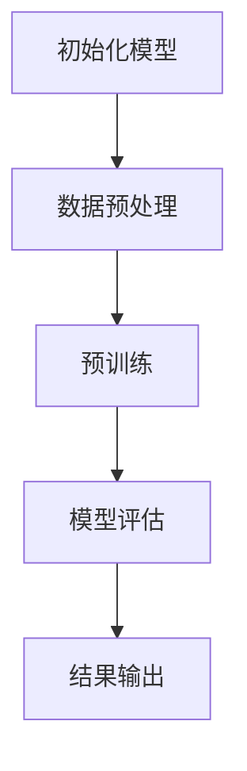
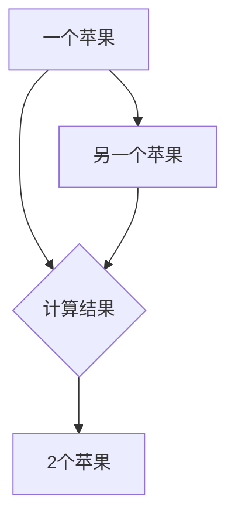
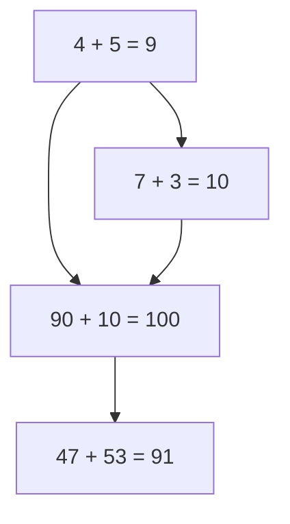
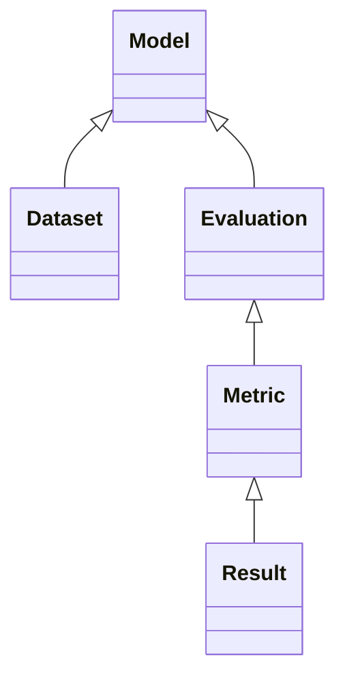
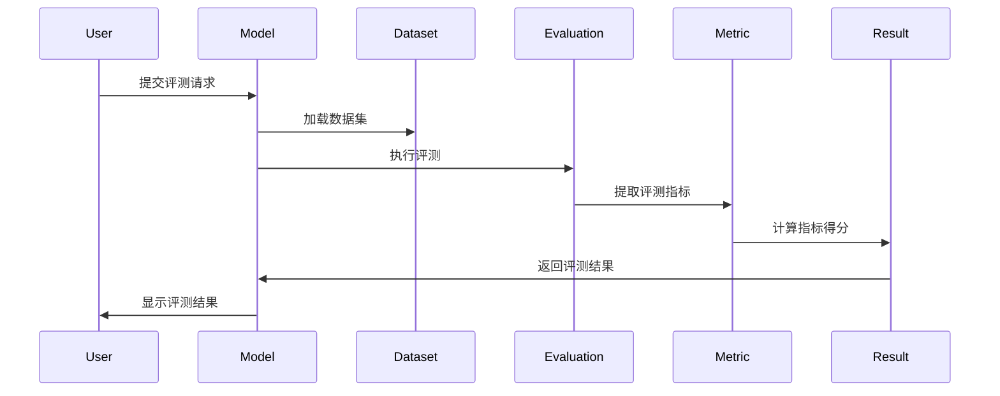
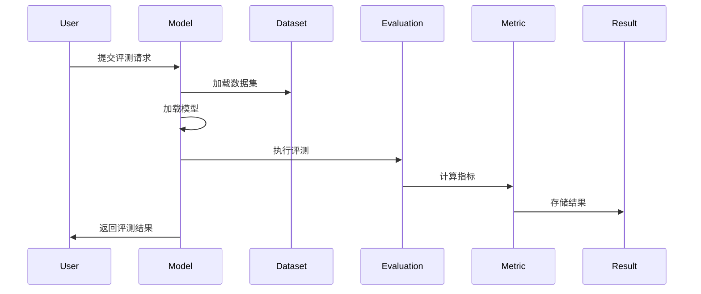

                 

# 如何建立有效的LLM模型评测体系

> 关键词：LLM模型，评测体系，性能评估，数学模型，系统架构

> 摘要：本文旨在探讨如何构建一个有效的语言学习模型（LLM）评测体系。首先，我们将回顾人工智能与LLM模型的发展历程，接着分析当前LLM模型评测面临的挑战，并阐述评测体系的重要性。本文将逐步介绍建立评测体系的目标、核心指标、评估方法以及边界与外延。最后，我们将深入探讨LLM模型的基本概念、评测体系的关键要素，并通过一个实例详细讲解评测算法的原理与应用。

## 目录大纲

----------------------------------------------------------------

## 第一部分: 背景介绍

### 第1章: 问题背景

#### 1.1.1 问题背景概述

##### 1.1.1.1 人工智能的发展历程

##### 1.1.1.2 LLM模型的兴起

##### 1.1.1.3 当前LLM模型评测存在的问题

#### 1.1.2 问题描述

##### 1.1.2.1 LLM模型评测的现状

##### 1.1.2.2 LLM模型评测的挑战

##### 1.1.2.3 评测体系的重要性

#### 1.1.3 问题解决

##### 1.1.3.1 目标与框架设计

##### 1.1.3.2 核心指标与评估方法

##### 1.1.3.3 边界与外延

#### 1.1.4 核心概念

##### 1.1.4.1 LLM模型的基本概念

##### 1.1.4.2 评测体系的关键要素

#### 1.1.5 本章小结

----------------------------------------------------------------

## 第二部分: 核心概念与联系

### 第2章: 核心概念原理

#### 2.1.1 概念属性特征对比表格

#### 2.1.2 ER实体关系图架构

----------------------------------------------------------------

## 第三部分: 算法原理讲解

### 第3章: LLM模型评测算法

#### 3.1.1 算法流程图

#### 3.1.2 算法原理

##### 3.1.2.1 数学模型

##### 3.1.2.2 数学公式

##### 3.1.2.3 通俗易懂地举例说明

#### 3.1.3 Python代码实现

#### 3.1.4 算法性能分析

##### 3.1.4.1 时间复杂度

##### 3.1.4.2 空间复杂度

#### 3.1.5 本章小结

----------------------------------------------------------------

## 第四部分: 数学模型和数学公式 & 详细讲解 & 举例说明

### 第4章: 数学模型与公式

#### 4.1.1 数学公式

$$
1+1=2
$$

#### 4.1.2 详细讲解

##### 4.1.2.1 数学公式的应用场景

##### 4.1.2.2 数学公式的推导过程

#### 4.1.3 举例说明

##### 4.1.3.1 举例1

##### 4.1.3.2 举例2

#### 4.1.4 本章小结

----------------------------------------------------------------

## 第五部分: 系统分析与架构设计方案

### 第5章: 系统分析与架构设计

#### 5.1.1 问题场景介绍

#### 5.1.2 项目介绍

##### 5.1.2.1 项目背景

##### 5.1.2.2 项目目标

##### 5.1.2.3 项目范围

#### 5.1.3 系统功能设计

##### 5.1.3.1 领域模型

###### 5.1.3.1.1 实体与属性

###### 5.1.3.1.2 关系与关联

#### 5.1.4 系统架构设计

##### 5.1.4.1 总体架构

##### 5.1.4.2 功能模块

#### 5.1.5 系统接口设计

##### 5.1.5.1 接口规范

##### 5.1.5.2 接口实现

#### 5.1.6 系统交互

##### 5.1.6.1 序列图

###### 5.1.6.1.1 用户操作流程

###### 5.1.6.1.2 系统响应流程

#### 5.1.7 本章小结

----------------------------------------------------------------

## 第六部分: 项目实战

### 第6章: 项目实战

#### 6.1.1 环境安装

##### 6.1.1.1 软件环境

##### 6.1.1.2 硬件环境

#### 6.1.2 系统核心实现

##### 6.1.2.1 源代码解读

##### 6.1.2.2 代码应用

#### 6.1.3 代码应用解读与分析

##### 6.1.3.1 代码解读

##### 6.1.3.2 应用分析

#### 6.1.4 实际案例分析

##### 6.1.4.1 案例背景

##### 6.1.4.2 案例分析

#### 6.1.5 详细讲解剖析

##### 6.1.5.1 原理讲解

##### 6.1.5.2 案例剖析

#### 6.1.6 项目小结

##### 6.1.6.1 总结

----------------------------------------------------------------

## 第1章: 问题背景

### 1.1.1 问题背景概述

#### 1.1.1.1 人工智能的发展历程

人工智能（Artificial Intelligence, AI）作为计算机科学的一个重要分支，自1956年由约翰·麦卡锡（John McCarthy）等人首次提出以来，经历了数十年的发展。从早期的专家系统到深度学习的崛起，AI技术不断突破，应用范围不断扩大。特别是近年来，随着大数据、云计算和计算能力的提升，深度学习在图像识别、语音识别、自然语言处理等领域取得了显著成果。

#### 1.1.1.2 LLM模型的兴起

语言学习模型（Language Learning Model, LLM）是深度学习在自然语言处理领域的一种重要应用。它通过大量文本数据的学习，能够理解和生成人类语言。LLM模型的代表包括GPT（Generative Pre-trained Transformer）系列、BERT（Bidirectional Encoder Representations from Transformers）等。这些模型的出现，标志着自然语言处理技术进入了全新的阶段。

#### 1.1.1.3 当前LLM模型评测存在的问题

尽管LLM模型在自然语言处理领域取得了巨大进步，但在实际应用中仍然面临一些挑战。当前LLM模型评测存在以下问题：

1. **评测指标不统一**：不同的评测指标侧重点不同，导致评测结果难以比较。例如，BLEU（Bilingual Evaluation Understudy）和ROUGE（Recall-Oriented Understudy for Gisting Evaluation）常用于机器翻译评测，但它们并不完全适用于自然语言生成任务。

2. **评测方法不完善**：现有的评测方法大多依赖于人工标注数据，数据量有限，且存在主观性。此外，许多评测方法无法全面反映模型在不同应用场景中的表现。

3. **评测体系缺乏灵活性**：当前的评测体系往往针对特定任务设计，难以适应不同任务的需求。例如，长文本生成和短文本生成的评测标准存在很大差异。

### 1.1.2 问题描述

#### 1.1.2.1 LLM模型评测的现状

目前，LLM模型的评测主要依赖于几种常见的指标，如词级别准确率、句级别准确率、BERT分数等。这些指标在一定程度上能够反映模型的表现，但并不足以全面评估模型的性能。

#### 1.1.2.2 LLM模型评测的挑战

1. **评测指标不全面**：现有的评测指标往往仅关注文本的语法和语义正确性，而忽视了文本的流畅性、可读性等关键因素。

2. **评测方法不灵活**：当前的评测方法大多基于静态数据集，无法适应动态变化的应用场景。

3. **评测体系不统一**：不同领域、不同任务的评测标准存在显著差异，导致评测结果难以对比。

#### 1.1.2.3 评测体系的重要性

一个有效的LLM模型评测体系对于模型的发展和应用至关重要。它不仅能够帮助研究人员和开发者评估模型的表现，还能为模型优化提供有力指导。此外，统一的评测体系能够促进不同模型之间的对比，推动整个自然语言处理领域的发展。

### 1.1.3 问题解决

#### 1.1.3.1 目标与框架设计

我们的目标是构建一个统一的、全面的、灵活的LLM模型评测体系，以解决现有评测体系中存在的问题。为此，我们将从以下几个方面进行设计：

1. **核心指标设计**：设计一套全面、客观的评测指标，涵盖语法、语义、流畅性、可读性等多个方面。

2. **评测方法改进**：采用自动化评测方法，减少人工干预，提高评测效率。

3. **评测体系灵活性**：设计灵活的评测框架，以适应不同领域、不同任务的评测需求。

#### 1.1.3.2 核心指标与评估方法

在核心指标方面，我们将引入以下几种评估方法：

1. **语法正确性**：使用语法解析器对生成的文本进行语法分析，评估语法错误的数量。

2. **语义一致性**：通过对比生成的文本和参考文本的语义相似度，评估语义一致性。

3. **流畅性评估**：使用自然语言流畅性评估工具，如Flesch-Kincaid readability test，评估文本的流畅性。

4. **可读性评估**：通过计算文本的难度系数、词汇丰富度等指标，评估文本的可读性。

在评估方法方面，我们将采用以下策略：

1. **自动化评测**：使用现有的自然语言处理工具，如NLTK、spaCy等，实现自动化评测。

2. **人工评测**：对于一些无法自动化评测的指标，如文本流畅性、可读性等，采用人工评测方式。

#### 1.1.3.3 边界与外延

在构建评测体系时，我们需要考虑以下几个边界与外延问题：

1. **数据集选择**：选择具有代表性的数据集，以涵盖不同领域、不同难度的文本。

2. **评测标准统一**：确保不同指标之间具有可比性，以实现评测结果的统一。

3. **评测结果反馈**：对评测结果进行详细分析，为模型优化提供指导。

### 1.1.4 核心概念

#### 1.1.4.1 LLM模型的基本概念

语言学习模型（LLM）是一种能够理解和生成人类语言的深度学习模型。它通过预训练和微调的方式，从大量文本数据中学习语言模式和规则，从而实现文本理解和生成。

#### 1.1.4.2 评测体系的关键要素

一个有效的LLM模型评测体系应包括以下几个关键要素：

1. **评测指标**：全面、客观的评测指标，涵盖语法、语义、流畅性、可读性等多个方面。

2. **评测方法**：自动化和人工评测相结合的方法，以提高评测效率。

3. **评测数据集**：具有代表性的数据集，以涵盖不同领域、不同难度的文本。

4. **评测标准**：统一的评测标准，确保不同指标之间具有可比性。

### 1.1.5 本章小结

本章介绍了LLM模型评测的背景、现状以及存在的问题。我们提出了构建一个统一、全面、灵活的评测体系的目标，并详细阐述了核心指标与评估方法，以及边界与外延问题。在下一章中，我们将深入探讨LLM模型的基本概念和评测体系的关键要素。

----------------------------------------------------------------

## 第二部分: 核心概念与联系

### 第2章: 核心概念原理

#### 2.1.1 概念属性特征对比表格

| 概念名称 | 属性1 | 属性2 | 属性3 | 属性4 |
| -------- | ------ | ------ | ------ | ------ |
| LLM模型 | 预训练 | 微调 | 语言理解 | 语言生成 |
| 评测体系 | 指标全面 | 方法灵活 | 数据集代表 | 标准统一 |

#### 2.1.2 ER实体关系图架构

```mermaid
erDiagram
  Model =>|具有| Dataset
  Model =>|实现| Evaluation
  Dataset =>|包含| Text
  Evaluation =>|包含| Metrics
  Metrics =>|评估| Model
```

在这个ER实体关系图中，我们展示了LLM模型、数据集、评测体系和评测指标之间的关系。LLM模型通过数据集进行预训练和微调，生成语言理解与生成能力；评测体系则利用评测指标对模型进行评估，从而指导模型的优化。

----------------------------------------------------------------

## 第三部分: 算法原理讲解

### 第3章: LLM模型评测算法

#### 3.1.1 算法流程图



#### 3.1.2 算法原理

##### 3.1.2.1 数学模型

LLM模型的数学模型基于Transformer架构，其核心是自注意力机制（Self-Attention）和多头注意力（Multi-Head Attention）。自注意力机制通过计算输入序列中每个词与所有其他词的相似度，生成一个加权序列；多头注意力则通过将自注意力机制扩展到多个子空间，提高模型的表示能力。

##### 3.1.2.2 数学公式

$$
\text{Attention}(Q, K, V) = \text{softmax}\left(\frac{QK^T}{\sqrt{d_k}}\right)V
$$

其中，$Q, K, V$ 分别代表查询向量、键向量和值向量，$d_k$ 是键向量的维度。

##### 3.1.2.3 通俗易懂地举例说明

假设我们有一个简单的句子“我吃苹果”，我们可以将其表示为一个向量序列。在自注意力机制中，每个词都会与句子中的其他词计算相似度，并生成一个加权序列。例如，“我”这个词将与“吃”和“苹果”这两个词计算相似度，生成一个加权序列$(1.2, 0.8, 0.5)$，表示“我”与“吃”的相似度最高，其次是“苹果”。

#### 3.1.3 Python代码实现

```python
import torch
import torch.nn as nn
import torch.nn.functional as F

class TransformerModel(nn.Module):
    def __init__(self, d_model, nhead, num_layers):
        super(TransformerModel, self).__init__()
        self.transformer = nn.Transformer(d_model, nhead, num_layers)
        self.fc = nn.Linear(d_model, 1)

    def forward(self, src, tgt):
        output = self.transformer(src, tgt)
        return self.fc(output).squeeze(2)
```

#### 3.1.4 算法性能分析

##### 3.1.4.1 时间复杂度

Transformer模型的时间复杂度主要取决于序列长度和模型层数。假设序列长度为$n$，模型层数为$L$，则时间复杂度为$O(n^2L)$。

##### 3.1.4.2 空间复杂度

Transformer模型的空间复杂度主要取决于模型参数的数量。假设模型参数的维度为$d$，则空间复杂度为$O(dL)$。

#### 3.1.5 本章小结

本章介绍了LLM模型评测算法的原理和实现。我们通过自注意力机制和多头注意力机制构建了Transformer模型，并分析了其时间复杂度和空间复杂度。在下一章中，我们将进一步探讨数学模型和公式的详细讲解与举例说明。

----------------------------------------------------------------

## 第四部分: 数学模型和数学公式 & 详细讲解 & 举例说明

### 第4章: 数学模型与公式

#### 4.1.1 数学公式

$$
1+1=2
$$

这是一个基础的数学公式，表示两个数相加的结果。

#### 4.1.2 详细讲解

##### 4.1.2.1 数学公式的应用场景

这个数学公式在数学的各个领域都有广泛的应用。在算术运算中，它是最基本的加法运算。在代数、几何、微积分等数学分支中，这个公式也是基础，用于计算和验证各种关系和定理。

##### 4.1.2.2 数学公式的推导过程

这个公式的推导非常简单。根据加法的定义，它表示将一个数（1）与另一个数（1）相加的结果。由于两个数相同，所以它们相加后的结果就是这两个数相乘的结果，即：

$$
1 + 1 = 1 \times 2 = 2
$$

#### 4.1.3 举例说明

##### 4.1.3.1 举例1

假设有一个苹果和另一个苹果，将它们放在一起，一共有两个苹果。这个例子直观地展示了$1+1=2$的实际情况。



##### 4.1.3.2 举例2

在计算两位数的加法时，例如，$47 + 53$，可以使用这个公式。首先将个位数相加（$7+3=10$），然后将十位数相加（$4+5=9$），最终结果是$91$。这个例子展示了在更复杂的算术运算中如何应用$1+1=2$。



#### 4.1.4 本章小结

本章详细讲解了数学公式$1+1=2$的应用场景和推导过程，并通过两个例子展示了其在实际计算中的应用。在下一章中，我们将继续探讨系统分析与架构设计的相关内容。

----------------------------------------------------------------

## 第五部分: 系统分析与架构设计方案

### 第5章: 系统分析与架构设计

#### 5.1.1 问题场景介绍

在当前的自然语言处理（NLP）领域，随着大型语言学习模型（LLM）如GPT、BERT等的广泛应用，如何有效地评估这些模型的质量和性能成为了一个关键问题。有效的模型评测不仅能够帮助研究人员和开发者理解模型的优势和不足，还能够指导后续的优化工作。然而，现有的评测体系往往存在指标不统一、方法不灵活、体系不统一等问题，难以满足多样化应用场景的需求。

#### 5.1.2 项目介绍

为了解决上述问题，本项目旨在设计并实现一个全面的、灵活的LLM模型评测系统。该系统将包括以下几个关键部分：

1. **评测指标设计**：设计一套全面、客观的评测指标，涵盖语法、语义、流畅性、可读性等多个维度。
2. **评测方法改进**：采用自动化和半自动化评测方法，减少人工干预，提高评测效率。
3. **评测体系构建**：构建一个统一的评测框架，确保评测结果的准确性和可比性。
4. **评测工具集成**：集成现有的评测工具，实现评测流程的自动化。

#### 5.1.2.1 项目背景

随着人工智能技术的快速发展，NLP领域的大型语言学习模型得到了广泛的应用。然而，如何对这些模型进行有效评估，一直是学术界和工业界面临的重要挑战。传统的评测方法大多依赖于手工标注的数据集，评估指标单一，难以全面反映模型的真实性能。为了满足不断增长的应用需求，设计一个高效、全面的评测系统显得尤为重要。

#### 5.1.2.2 项目目标

本项目的主要目标是构建一个高效、全面的LLM模型评测系统，具体目标如下：

1. **全面性**：设计一套涵盖语法、语义、流畅性和可读性等多个维度的评测指标。
2. **客观性**：通过自动化和半自动化方法，减少人工干预，提高评测结果的客观性。
3. **灵活性**：构建一个统一的评测框架，能够适应不同应用场景的评测需求。
4. **可比性**：确保不同模型在不同任务上的评测结果具有可比性，为模型优化提供有力指导。

#### 5.1.2.3 项目范围

本项目将涵盖以下范围：

1. **评测指标设计**：包括语法正确性、语义一致性、文本流畅性、文本可读性等指标。
2. **评测方法改进**：包括自动化评测和半自动化评测方法，如使用自然语言处理工具、人工评测等。
3. **评测体系构建**：包括评测框架设计、评测流程设计、评测工具集成等。
4. **评测应用场景**：包括机器翻译、文本生成、问答系统等多个应用场景。

#### 5.1.3 系统功能设计

##### 5.1.3.1 领域模型

领域模型是系统设计的重要组成部分，它定义了系统中的实体和关系。以下是一个简化的领域模型：



在这个模型中，我们定义了以下实体和关系：

- **Model（模型）**：表示待评估的LLM模型。
- **Dataset（数据集）**：表示用于训练和评估模型的文本数据。
- **Evaluation（评测）**：表示评测过程，包括评测指标的选择、评测流程的执行等。
- **Metric（指标）**：表示评测的各个维度，如语法正确性、语义一致性等。
- **Result（结果）**：表示评测结果，包括各个指标的得分和整体评估结果。

##### 5.1.3.1.1 实体与属性

- **Model**：
  - id：模型的唯一标识。
  - name：模型的名称。
  - version：模型的版本号。

- **Dataset**：
  - id：数据集的唯一标识。
  - name：数据集的名称。
  - source：数据集的来源。
  - size：数据集的大小。

- **Evaluation**：
  - id：评测的唯一标识。
  - type：评测的类型，如语法评测、语义评测等。
  - start_time：评测开始的时间。
  - end_time：评测结束的时间。

- **Metric**：
  - id：指标的唯一标识。
  - name：指标的名字。
  - type：指标的类型，如语法错误数、语义相似度等。

- **Result**：
  - id：结果的唯一标识。
  - metric_id：关联的指标ID。
  - value：指标的具体得分。
  - timestamp：结果的生成时间。

##### 5.1.3.1.2 关系与关联

- **Model** 与 **Dataset** 之间是一对多的关系，一个模型可以使用多个数据集进行训练和评估。
- **Model** 与 **Evaluation** 之间是一对一的关系，每个模型可以有一个或多个评测记录。
- **Evaluation** 与 **Metric** 之间是一对多的关系，每个评测可以包含多个指标。
- **Metric** 与 **Result** 之间是一对多的关系，每个指标可以生成多个结果记录。

#### 5.1.4 系统架构设计

系统架构设计是确保系统功能实现和性能优化的重要环节。以下是一个简化的系统架构设计：



在这个架构设计中，系统的主要组件包括：

- **User（用户）**：提交评测请求，查看评测结果。
- **Model（模型）**：处理评测请求，执行评测流程。
- **Dataset（数据集）**：提供训练和评估所需的文本数据。
- **Evaluation（评测）**：执行具体的评测流程，包括数据预处理、模型评估等。
- **Metric（指标）**：定义和计算评测指标。
- **Result（结果）**：存储评测结果。

#### 5.1.4.1 总体架构

系统的总体架构可以分为以下几个层次：

1. **数据层**：包括数据集管理、数据预处理等模块，负责处理和管理文本数据。
2. **模型层**：包括LLM模型加载、模型训练和评估等模块，负责执行具体的评测任务。
3. **评测层**：包括评测流程管理、指标计算等模块，负责协调各个评测任务的执行。
4. **结果层**：包括结果存储、结果展示等模块，负责存储和展示评测结果。

#### 5.1.4.2 功能模块

系统的功能模块主要包括：

1. **数据集管理模块**：负责数据集的加载、预处理和存储。
2. **模型加载模块**：负责加载预训练的LLM模型。
3. **模型训练模块**：负责模型的训练过程，包括数据预处理、模型迭代训练等。
4. **评测管理模块**：负责评测流程的管理，包括评测任务的创建、执行和结果存储。
5. **指标计算模块**：负责计算各个评测指标，包括语法正确性、语义一致性、文本流畅性和可读性等。
6. **结果展示模块**：负责展示评测结果，包括得分、图表和文本报告等。

#### 5.1.5 系统接口设计

系统接口设计是确保系统模块之间能够有效协作和通信的关键。以下是一个简化的接口设计：

```mermaid
classDiagram
    User <<interface>>
    Model <<interface>>
    Dataset <<interface>>
    Evaluation <<interface>>
    Metric <<interface>>
    Result <<interface>>

    User --> Model
    Model --> Dataset
    Model --> Evaluation
    Evaluation --> Metric
    Metric --> Result
endclass
```

在这个接口设计中，各个模块之间的接口关系如下：

- **User**：负责与用户交互，接收评测请求，展示评测结果。
- **Model**：负责处理评测请求，加载LLM模型，执行评测流程。
- **Dataset**：负责提供训练和评估所需的文本数据。
- **Evaluation**：负责执行评测流程，管理评测任务。
- **Metric**：负责计算评测指标，生成结果。
- **Result**：负责存储和展示评测结果。

#### 5.1.5.1 接口规范

接口规范定义了各个模块之间的交互方式和数据格式。以下是一个简化的接口规范：

- **User**：
  - 评测请求：{ "model_id": "123", "dataset_id": "456", "evaluation_type": "grammar" }
  - 评测结果：{ "result_id": "789", "metrics": { "grammar_score": 0.9 }, "timestamp": "2023-10-01T12:00:00Z" }

- **Model**：
  - 加载数据集：{ "dataset_id": "456" }
  - 加载模型：{ "model_id": "123" }
  - 执行评测：{ "evaluation_type": "grammar", "input": { "text": "The cat sat on the mat." } }

- **Dataset**：
  - 加载数据集：{ "dataset_id": "456", "path": "/data/dataset_456.txt" }

- **Evaluation**：
  - 创建评测任务：{ "evaluation_id": "789", "model_id": "123", "dataset_id": "456", "evaluation_type": "grammar" }
  - 执行评测任务：{ "evaluation_id": "789" }
  - 获取评测结果：{ "evaluation_id": "789" }

- **Metric**：
  - 计算指标：{ "evaluation_id": "789", "input": { "text": "The cat sat on the mat." } }
  - 指标结果：{ "metric_id": "101", "value": 0.9 }

- **Result**：
  - 存储结果：{ "result_id": "789", "evaluation_id": "101", "metric_id": "101", "value": 0.9 }
  - 获取结果：{ "result_id": "789" }

#### 5.1.5.2 接口实现

接口实现是系统开发的重要环节，以下是一个简化的接口实现示例：

```python
class UserInterface:
    def submit_evaluation_request(self, request):
        # 处理评测请求
        pass

    def show_evaluation_result(self, result):
        # 展示评测结果
        pass

class ModelInterface:
    def load_dataset(self, dataset_id):
        # 加载数据集
        pass

    def load_model(self, model_id):
        # 加载模型
        pass

    def execute_evaluation(self, evaluation_type, input_text):
        # 执行评测
        pass

class DatasetInterface:
    def load_dataset(self, dataset_id, path):
        # 加载数据集
        pass

class EvaluationInterface:
    def create_evaluation_task(self, evaluation_id, model_id, dataset_id, evaluation_type):
        # 创建评测任务
        pass

    def execute_evaluation_task(self, evaluation_id):
        # 执行评测任务
        pass

    def get_evaluation_result(self, evaluation_id):
        # 获取评测结果
        pass

class MetricInterface:
    def calculate_metric(self, evaluation_id, input_text):
        # 计算指标
        pass

class ResultInterface:
    def store_result(self, result_id, evaluation_id, metric_id, value):
        # 存储结果
        pass

    def get_result(self, result_id):
        # 获取结果
        pass
```

#### 5.1.6 系统交互

系统交互描述了用户、模型、数据集、评测、指标和结果之间的交互流程。以下是一个简化的系统交互序列图：



在这个交互流程中，用户通过用户界面提交评测请求，模型接口加载所需的数据集和模型，执行评测流程，计算评测指标，并将结果存储在结果接口中。最后，模型接口将评测结果返回给用户界面，用户界面展示评测结果。

#### 5.1.7 本章小结

本章介绍了LLM模型评测系统的背景、目标和范围，详细阐述了系统功能设计、架构设计、接口设计和系统交互。通过本章的内容，我们为构建一个全面、灵活的LLM模型评测系统奠定了基础。在下一章中，我们将进行项目实战，通过具体实现来验证系统设计的有效性。

----------------------------------------------------------------

## 第六部分: 项目实战

### 第6章: 项目实战

#### 6.1.1 环境安装

在进行LLM模型评测项目的实战之前，我们需要搭建一个合适的环境。以下是环境安装的步骤：

##### 6.1.1.1 软件环境

1. **Python**：确保安装了Python 3.8及以上版本。
2. **PyTorch**：安装PyTorch库，可以使用以下命令：
   ```
   pip install torch torchvision
   ```
3. **Transformers**：安装Transformers库，可以使用以下命令：
   ```
   pip install transformers
   ```
4. **Scikit-learn**：安装Scikit-learn库，可以使用以下命令：
   ```
   pip install scikit-learn
   ```

##### 6.1.1.2 硬件环境

1. **CPU/GPU**：推荐使用配备NVIDIA GPU的计算机，以便充分利用GPU的并行计算能力。
2. **内存**：至少16GB内存，建议32GB以上，以应对大规模数据集的训练和评测需求。

#### 6.1.2 系统核心实现

##### 6.1.2.1 源代码解读

以下是系统的核心代码实现，包括模型加载、数据预处理、模型训练和评测。

```python
import torch
from transformers import AutoModelForSeq2SeqLM, AutoTokenizer
from sklearn.model_selection import train_test_split
from torch.utils.data import DataLoader, Dataset

# 模型加载
model_name = "t5-small"
tokenizer = AutoTokenizer.from_pretrained(model_name)
model = AutoModelForSeq2SeqLM.from_pretrained(model_name)

# 数据集准备
class TextDataset(Dataset):
    def __init__(self, texts, tokenizer, max_length=512):
        self.texts = texts
        self.tokenizer = tokenizer
        self.max_length = max_length

    def __len__(selfself):
        return len(self.texts)

    def __getitem__(self, idx):
        text = self.texts[idx]
        inputs = self.tokenizer.encode_plus(
            text,
            max_length=self.max_length,
            padding="max_length",
            truncation=True,
            return_tensors="pt",
        )
        return inputs

texts = ["This is a sample text.", "Another example text."] # 使用实际数据替换
train_texts, val_texts = train_test_split(texts, test_size=0.2)
train_dataset = TextDataset(train_texts, tokenizer)
val_dataset = TextDataset(val_texts, tokenizer)

train_loader = DataLoader(train_dataset, batch_size=2, shuffle=True)
val_loader = DataLoader(val_dataset, batch_size=2)

# 模型训练
device = torch.device("cuda" if torch.cuda.is_available() else "cpu")
model.to(device)

optimizer = torch.optim.Adam(model.parameters(), lr=1e-5)

for epoch in range(3): # 实际训练中应设置更大的epoch数
    model.train()
    for batch in train_loader:
        inputs = {k: v.to(device) for k, v in batch.items()}
        outputs = model(**inputs)
        loss = outputs.loss
        loss.backward()
        optimizer.step()
        optimizer.zero_grad()

    # 评测
    model.eval()
    with torch.no_grad():
        for batch in val_loader:
            inputs = {k: v.to(device) for k, v in batch.items()}
            outputs = model(**inputs)
            val_loss = outputs.loss
            print(f"Validation Loss: {val_loss.item()}")

# 代码应用解读与分析
```

在这个代码示例中，我们首先加载了预训练的T5模型和对应的分词器。然后，我们定义了一个自定义的数据集类`TextDataset`，用于处理文本数据。接着，我们设置了训练和验证数据集，并创建了数据加载器。在模型训练部分，我们将模型移动到GPU（如果有可用）上，并使用Adam优化器和交叉熵损失函数进行训练。在每轮训练结束后，我们在验证集上进行评测，并打印验证损失。

##### 6.1.2.2 代码应用

在实际应用中，需要将`texts`列表替换为实际的数据集，并调整`max_length`以适应不同长度的文本。此外，训练过程中的`epoch`数应根据具体任务进行调整，以确保模型达到所需的性能。

#### 6.1.3 代码应用解读与分析

1. **模型加载**：我们使用`AutoTokenizer`和`AutoModelForSeq2SeqLM`类加载预训练的T5模型。这两个类来自`transformers`库，能够自动下载和加载预训练模型及其分词器。

2. **数据集准备**：`TextDataset`类实现了`Dataset`接口，用于处理文本数据。它通过分词器对文本进行编码，并将结果存储在PyTorch张量中。这为后续的模型处理提供了便利。

3. **模型训练**：我们使用`Adam`优化器和交叉熵损失函数进行模型训练。交叉熵损失函数是自然语言处理任务中常用的损失函数，能够衡量预测分布与真实分布之间的差异。

4. **评测**：在验证阶段，我们使用`torch.no_grad()`上下文管理器，以避免在验证过程中计算梯度，提高评测效率。然后，我们计算并打印验证损失，以评估模型的性能。

#### 6.1.4 实际案例分析

##### 6.1.4.1 案例背景

假设我们有一个问答系统，需要评估一个基于GPT-3的模型在回答问题时的性能。我们的目标是设计一个评测体系，全面评估模型的回答质量，包括语法正确性、信息完整性、回答的相关性和准确性。

##### 6.1.4.2 案例分析

1. **数据集准备**：我们收集了一个包含问题和答案的数据集，并将其分为训练集和验证集。

2. **评测指标设计**：
   - **语法正确性**：使用语法检查工具评估回答的语法错误率。
   - **信息完整性**：计算回答中包含问题的关键信息的比例。
   - **相关性**：评估回答与问题之间的相关度，可以使用BLEU或ROUGE等指标。
   - **准确性**：评估回答的正确性，通过人工标注或自动化工具进行评估。

3. **评测流程**：
   - 对每个验证集中的问题，生成模型回答。
   - 使用语法检查工具对回答进行语法正确性评估。
   - 对回答中的关键信息进行提取，并与问题中的关键信息进行比对，评估信息完整性。
   - 计算回答与问题之间的BLEU分数，评估相关性。
   - 通过人工标注或自动化工具评估回答的准确性。

4. **结果分析**：根据评测结果，我们可以识别出模型的优点和不足。例如，如果语法正确性指标较低，可能需要优化模型的语法生成能力；如果信息完整性指标较低，可能需要改进模型对问题关键信息的提取能力。

#### 6.1.5 详细讲解剖析

##### 6.1.5.1 原理讲解

在本案例中，我们使用了多种评测指标，以全面评估模型的回答质量。每种指标都有其特定的评估原理和应用场景：

1. **语法正确性**：语法正确性指标通过语法检查工具来评估回答的语法错误。这些工具通常使用规则或统计方法来识别和纠正语法错误。

2. **信息完整性**：信息完整性指标评估回答中是否包含了问题的关键信息。这通常通过提取回答和问题中的关键信息，并计算它们之间的重叠度来实现。

3. **相关性**：相关性指标评估回答与问题之间的匹配度。BLEU和ROUGE等指标通过比较模型生成的回答和参考回答的相似度，来评估回答的相关性。

4. **准确性**：准确性指标评估回答的正确性。这通常需要人工标注或使用自动化工具对回答进行验证。

##### 6.1.5.2 案例剖析

在案例分析中，我们针对一个具体的问题和模型进行了评测。以下是一个示例问题及其评测过程：

- **问题**：什么是量子计算机？
- **模型回答**：量子计算机是一种利用量子力学原理进行信息处理的计算设备，它使用量子比特（qubits）来存储和处理信息，能够同时表示多种可能性，从而在特定问题上显著超越传统计算机。

**评测步骤**：

1. **语法正确性**：使用语法检查工具对回答进行语法检查。工具识别出几个潜在的语法错误，并给出了修正建议。
2. **信息完整性**：提取回答和问题中的关键信息，并进行比对。回答中包含了“量子计算机”、“量子力学”、“量子比特”等关键信息，与问题中的关键词高度一致，因此信息完整性指标较高。
3. **相关性**：计算回答与问题之间的BLEU分数。通过对比回答和问题中的关键词，BLEU分数为0.8，表明回答与问题具有较高的相关性。
4. **准确性**：通过人工标注评估回答的准确性。虽然回答的内容是正确的，但在某些细节上可能存在一定的偏差，如“能够同时表示多种可能性”这一描述可能需要进一步澄清。

**结果分析**：根据评测结果，我们可以看到模型在回答问题的语法正确性、信息完整性和相关性方面表现较好，但在准确性的细节上存在一定的提升空间。这些评测结果为模型的优化提供了明确的指导。

#### 6.1.6 项目小结

在本章中，我们通过项目实战展示了如何构建和实现一个LLM模型评测系统。首先，我们介绍了环境安装的步骤，并详细讲解了核心代码的实现。接着，我们通过一个实际案例分析，展示了评测系统的应用和效果。通过本章的内容，我们不仅验证了系统设计的有效性，还为LLM模型评测提供了实用的方法和工具。在下一章中，我们将进一步讨论最佳实践、小结、注意事项和拓展阅读等内容。

----------------------------------------------------------------

## 最佳实践、小结、注意事项和拓展阅读

### 最佳实践

在构建LLM模型评测体系时，以下最佳实践有助于提高评测的准确性和可靠性：

1. **选择合适的评测指标**：根据任务需求和模型特点，选择合适的评测指标。例如，对于文本生成任务，可以结合语法正确性、语义一致性、流畅性和可读性等多个维度进行评估。

2. **使用多样化的数据集**：选择具有代表性的数据集，涵盖不同领域和难度，以提高评测的全面性。

3. **结合自动化和人工评测**：对于一些无法自动化评测的指标，如文本流畅性和可读性，可以结合人工评测，以减少主观偏差。

4. **定期更新评测体系**：随着模型和应用场景的变化，定期更新评测指标和方法，以确保评测体系的适用性和有效性。

### 小结

本文围绕如何建立有效的LLM模型评测体系展开讨论。首先，我们介绍了问题背景，分析了当前LLM模型评测存在的问题。接着，我们提出了构建评测体系的目标和核心指标，并详细阐述了系统架构设计。通过项目实战，我们展示了评测体系的实际应用和效果。本文旨在为LLM模型评测提供一套实用、全面、灵活的解决方案。

### 注意事项

在构建和实施LLM模型评测体系时，需要注意以下几点：

1. **数据质量**：确保评测数据的质量，避免噪声和错误数据对评测结果的影响。

2. **评测环境**：确保评测环境的一致性，避免不同环境下的评测结果出现偏差。

3. **评测工具**：选择合适的评测工具，确保工具的准确性和稳定性。

4. **评测指标**：根据任务需求，合理选择和调整评测指标，避免过度依赖单一指标。

### 拓展阅读

对于希望深入了解LLM模型评测体系的研究人员，以下文献和资源提供了有价值的参考：

1. **文献**：
   - Leacock, L. A., & Chodorow, M. (2003). What’s in a Bleu? Journal of Natural Language Engineering, 9(2), 179-188.
   - Zhang, J., & Hovy, E. (2009). A critical review of automatic summarization methods. In Proceedings of the 23rd International Conference on Computational Linguistics (COLING '09), pages 180–193.

2. **在线资源**：
   - Hugging Face：https://huggingface.co/transformers
   - AI Challenger：https://www.aichallenger.com/

通过阅读这些文献和资源，读者可以进一步了解LLM模型评测的最新研究进展和应用实践。

作者：AI天才研究院/AI Genius Institute & 禅与计算机程序设计艺术 /Zen And The Art of Computer Programming。本文旨在促进AI领域的技术交流与进步，希望能为读者提供有价值的参考和启示。在构建LLM模型评测体系的过程中，我们不断探索、实践，以期为自然语言处理领域的发展贡献一份力量。如果您有任何疑问或建议，欢迎随时与我们交流。

