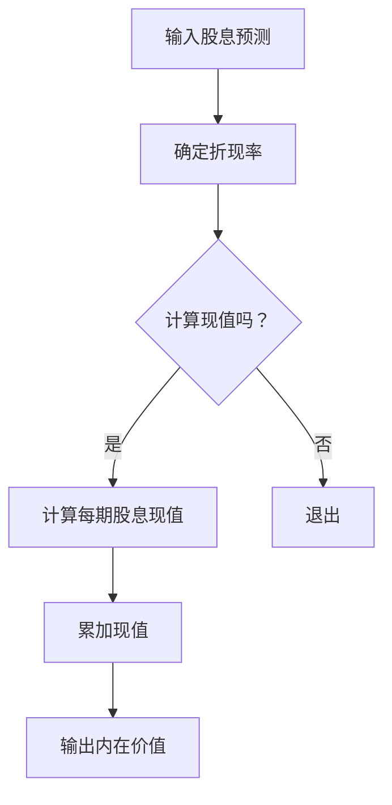
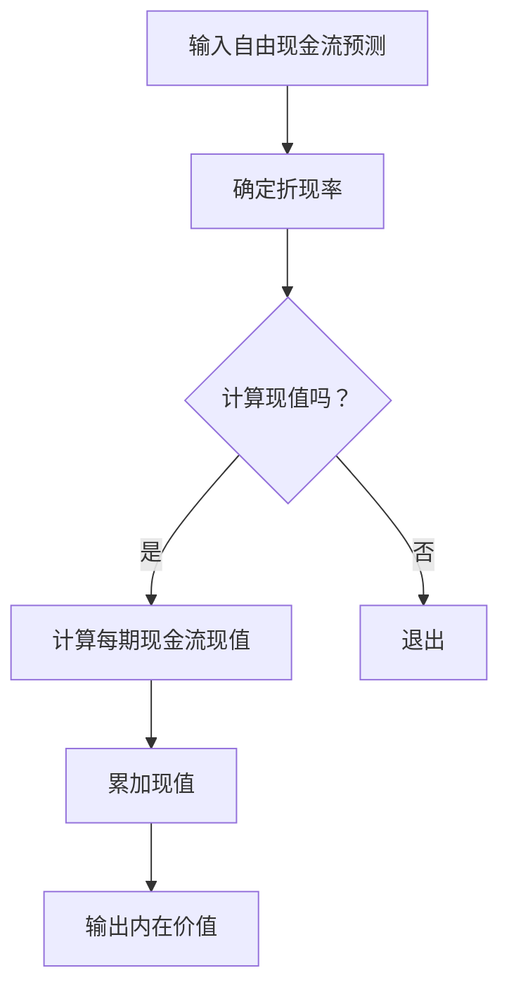
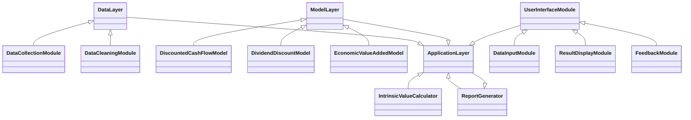
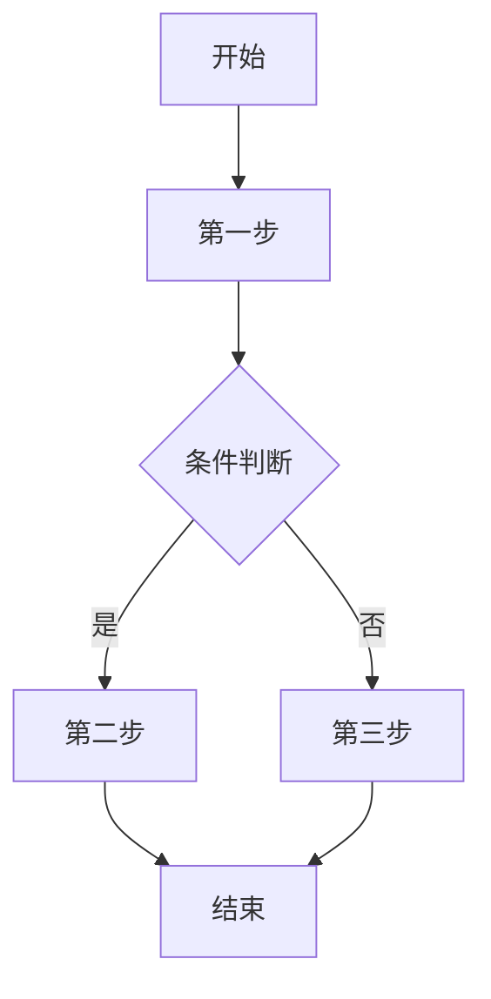
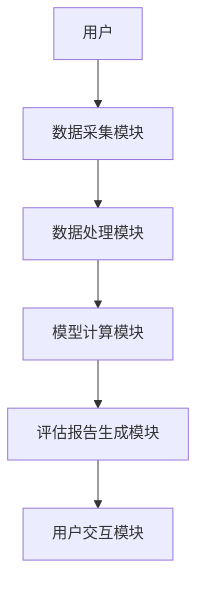

                 

### 如何计算一家公司的内在价值

> **关键词**：内在价值，计算方法，估值模型，投资决策

**摘要**：本文将深入探讨计算公司内在价值的方法和步骤，帮助投资者更准确地评估投资目标公司的潜在价值。通过介绍传统的股息折现模型（DDM）、自由现金流折现模型（DCF）以及现代方法如经济增加值（EVA）和相对估值法，本文旨在提供一套系统的分析框架，以便读者能够更好地理解并应用这些方法。文章将结合实际案例，详细讲解各算法原理和计算过程，同时探讨内在价值的影响因素，为投资决策提供有力的理论支持。

### 目录大纲

1. **背景介绍**
    1.1 问题背景
    1.2 问题描述
    1.3 问题解决
    1.4 边界与外延

2. **核心概念与联系**
    2.1 内在价值原理
    2.2 内在价值计算方法
    2.3 内在价值计算实例

3. **算法原理讲解**
    3.1 DDM算法原理
    3.2 DCF算法原理

4. **系统分析与架构设计方案**
    4.1 问题场景介绍
    4.2 项目介绍
    4.3 系统功能设计
    4.4 系统架构设计
    4.5 系统接口设计
    4.6 系统交互

5. **项目实战**
    5.1 环境安装
    5.2 系统核心实现源代码
    5.3 代码应用解读与分析
    5.4 实际案例分析与详细讲解剖析
    5.5 项目小结

6. **最佳实践 tips**

7. **小结**

8. **注意事项**

9. **拓展阅读**

### 1. 背景介绍

#### 1.1 问题背景

在资本市场上，评估一家公司的价值是投资者进行投资决策的重要环节。然而，公司价值的评估并非易事。传统的市场价值、账面价值等方法往往受到市场波动和会计政策的影响，难以准确反映一家公司的真实内在价值。因此，如何科学、系统地计算一家公司的内在价值，成为了投资者和管理者共同关注的课题。

内在价值（Intrinsic Value）是一个经济学和财务学上的重要概念，指的是一家公司实际值得的金额，是公司未来现金流的现值。它是一种更为理论化、基于未来预期的估值方法，旨在消除市场情绪和非理性因素的影响，帮助投资者做出更为科学的投资决策。

#### 1.2 问题描述

准确评估一家公司的内在价值面临着诸多挑战。首先，未来现金流的预测本身就具有不确定性，如何合理预测现金流成为一个难题。其次，折现率的确定也存在困难，折现率的高低直接影响到内在价值的计算结果。此外，不同公司的业务模式、成长阶段、市场环境等因素也使得内在价值评估变得复杂。

投资者在评估公司内在价值时，往往需要综合考虑多种因素，如财务指标、非财务指标、行业趋势等，以获得一个相对准确的价值评估。

#### 1.3 问题解决

为了解决上述问题，投资者和管理者可以采用多种方法来计算公司的内在价值。传统方法包括股息折现模型（DDM）和自由现金流折现模型（DCF），这两种方法都是基于公司未来现金流的现值进行评估。现代方法如经济增加值（EVA）和相对估值法，则从不同的角度提供了新的视角。

内在价值计算方法的选择需要根据公司的具体情况和投资者的偏好来决定。不同的方法有其各自的优缺点，投资者需要结合实际情况，综合运用多种方法，以提高评估结果的准确性。

#### 1.4 边界与外延

内在价值与市场价值、账面价值等概念既有联系又有区别。市场价值是指股票在市场上交易的价格，它受市场供求关系、投资者情绪等因素的影响，往往存在波动性。账面价值则是公司财务报表上反映的资产和负债的价值，它基于历史成本原则，可能无法准确反映公司当前的市场价值。

相比之下，内在价值是基于未来现金流的现值，是一种更为前瞻性和理论化的估值方法。它既考虑了公司的财务状况，也考虑了公司的成长潜力和市场环境，因此，内在价值在投资决策中具有更高的指导意义。

然而，内在价值评估并非万能，它也有其局限性。首先，预测未来现金流和确定折现率本身就存在一定的不确定性，这可能会影响评估结果的准确性。其次，内在价值评估方法较为复杂，需要投资者具备一定的财务知识和分析能力。

总之，内在价值评估是投资决策中不可或缺的一环，它能够帮助投资者更准确地把握公司的真实价值，从而做出更为科学的投资决策。在接下来的章节中，我们将深入探讨内在价值的计算方法，并通过实际案例进行详细讲解，帮助读者更好地理解这一概念。

### 1.2 问题描述

内在价值的评估过程涉及多个层面的复杂性和不确定性，这使得准确评估一家公司的内在价值成为了一个极具挑战性的任务。以下从几个关键方面详细探讨这一问题的本质及其复杂性：

#### 1.2.1 未来现金流的预测

内在价值的计算核心在于对公司未来现金流的预测。未来现金流（Future Cash Flows，FCF）是指公司预期在未来各个时期内产生的现金流入和流出，这些现金流需要经过一系列复杂的分析和调整才能得到。未来现金流的预测主要面临以下几个问题：

1. **不确定性**：未来市场环境、行业趋势、竞争态势等因素的变化难以准确预测，这些外部因素会直接影响到公司未来现金流的实现情况。
2. **信息不完全**：公司在预测未来现金流时，往往依赖于历史数据和现有信息，但市场环境的变化可能导致这些信息的有效性降低，增加了预测的不确定性。
3. **主观判断**：预测未来现金流需要投资者或评估者进行大量主观判断，如对公司业务前景、管理层能力、市场需求等的判断，这些判断的准确性和一致性难以保证。

#### 1.2.2 折现率的确定

折现率（Discount Rate）是内在价值计算中的另一个关键因素，它用于将未来的现金流折现到当前时点。折现率的确定主要涉及以下几个方面的问题：

1. **风险调整**：折现率需要反映公司面临的各种风险，如市场风险、财务风险等。不同公司、不同市场环境下的风险水平不同，因此确定一个合适的折现率具有一定的难度。
2. **机会成本**：折现率还应反映投资者的机会成本，即投资者选择投资某一公司而非其他投资机会时放弃的收益。机会成本的具体数值往往难以准确确定，依赖于投资者的预期和判断。
3. **资本成本**：折现率的确定还需要考虑公司的资本成本，包括债务成本和股权成本。不同公司、不同融资结构的资本成本计算方法也有所不同。

#### 1.2.3 业务模式与成长性

不同公司的业务模式和发展阶段差异显著，这直接影响到未来现金流的预测和内在价值的计算。以下是一些主要问题：

1. **初创公司**：初创公司通常面临较大的不确定性，其未来现金流的预测更加困难。这些公司往往需要大量的资金投入来研发新产品、拓展市场，短期内可能难以实现盈利。
2. **成熟公司**：成熟公司已经建立了稳定的业务模式和市场地位，未来现金流的预测相对更为可靠。然而，这些公司的成长性可能较为有限，未来现金流的增长空间受到限制。
3. **周期性公司**：周期性公司的业绩受宏观经济环境和行业周期影响较大，未来现金流的预测需要考虑这些外部因素的变化。

#### 1.2.4 非财务因素

内在价值评估不仅需要考虑公司的财务指标，还需综合考虑非财务因素，如管理水平、企业文化、品牌价值、创新能力等。这些因素虽然难以量化，但往往对公司未来现金流的产生有重要影响。以下是一些关键问题：

1. **管理水平**：优秀的管理层能够提高公司的运营效率，降低运营风险，从而提升未来现金流的稳定性。
2. **企业文化**：积极向上的企业文化能够增强员工的凝聚力，提高工作效率，有助于公司的长期发展。
3. **品牌价值**：强大的品牌能够为公司带来较高的市场份额和溢价，提高未来现金流的潜力。
4. **创新能力**：持续的创新能够推动公司业务模式的变革，开拓新的市场机会，提升未来现金流的增长潜力。

#### 1.2.5 数据获取与处理

内在价值评估过程中，准确的数据获取和处理是基础。以下是一些关键问题：

1. **数据来源**：未来现金流的预测需要依赖于大量的历史数据和行业数据，数据来源的可靠性和完整性直接影响评估结果的准确性。
2. **数据处理**：数据需要进行清洗、整理和分析，以去除异常值、纠正错误和填补缺失值。数据处理的质量对评估结果有重要影响。
3. **模型选择**：选择合适的预测模型和估值方法对评估结果的准确性至关重要。不同的模型和方法适用于不同类型的公司和行业，需要根据实际情况进行选择。

综上所述，内在价值的评估是一个复杂的、多维度的问题，涉及未来现金流的预测、折现率的确定、业务模式和成长性分析、非财务因素考虑以及数据获取与处理等多个方面。投资者在评估公司内在价值时，需要综合运用各种方法和工具，充分考虑各种因素，以提高评估结果的准确性和可靠性。

#### 1.3 问题解决

为了有效解决评估公司内在价值的问题，投资者可以采用多种计算方法，这些方法各有其独特的原理和适用场景。以下是几种常用的计算方法及其简要介绍：

##### 1.3.1 股息折现模型（Dividend Discount Model，DDM）

**原理**：股息折现模型基于公司的股息支付情况，通过折现未来股息现金流来计算公司的内在价值。该方法假设公司未来的股息增长是稳定的，适用于那些支付较高股息且未来股息增长稳定的成熟公司。

**公式**：
\[ \text{内在价值} = \frac{\text{未来股息}}{（1 + \text{折现率})^n} + \frac{\text{未来股息}}{（1 + \text{折现率})^{n+1}} + \ldots \]

**优缺点**：
- **优点**：计算简单，适用于股息支付稳定的公司。
- **缺点**：假设股息增长稳定，可能忽略公司的成长潜力。

##### 1.3.2 自由现金流折现模型（Discounted Cash Flow，DCF）

**原理**：自由现金流折现模型通过预测公司未来自由现金流（FCF），并将其折现到当前时点，以计算公司的内在价值。这种方法考虑了公司所有现金流入和流出，包括股息和再投资，适用于所有类型的公司。

**公式**：
\[ \text{内在价值} = \frac{\text{未来自由现金流}}{（1 + \text{折现率})^n} + \frac{\text{未来自由现金流}}{（1 + \text{折现率})^{n+1}} + \ldots \]

**优缺点**：
- **优点**：考虑全面，适用于所有类型的公司。
- **缺点**：预测未来现金流复杂，需要较高的专业知识和分析能力。

##### 1.3.3 经济增加值（Economic Value Added，EVA）

**原理**：经济增加值是一种基于公司资本成本的计算方法，通过计算公司在一定时期内创造的经济增加值（EVA），并将其折现到当前时点，来评估公司的内在价值。EVA反映了公司在扣除资本成本后的实际盈利能力。

**公式**：
\[ \text{EVA} = \text{净利润} - \text{资本成本} \]
\[ \text{内在价值} = \frac{\text{未来EVA}}{（1 + \text{折现率})^n} + \frac{\text{未来EVA}}{（1 + \text{折现率})^{n+1}} + \ldots \]

**优缺点**：
- **优点**：考虑资本成本，更准确地反映了公司的盈利能力。
- **缺点**：计算复杂，需要详细的财务数据。

##### 1.3.4 相对估值法

**原理**：相对估值法通过比较公司与同行业其他公司的市盈率、市净率等相对指标，来评估公司的内在价值。这种方法适用于行业竞争激烈、业务模式相似的公司。

**公式**：
\[ \text{内在价值} = \text{相对指标} \times \text{行业平均值} \]

**优缺点**：
- **优点**：简单易行，适用于行业对比。
- **缺点**：受市场情绪影响较大，可能忽略公司的独特性。

##### 1.3.5 公司特定方法

**原理**：公司特定方法是基于公司的独特情况和市场环境，采用特定的估值方法来计算内在价值。这种方法可以根据公司的具体情况进行定制，更加贴合公司实际情况。

**公式**：
\[ \text{内在价值} = \text{特定公式} \]

**优缺点**：
- **优点**：考虑公司独特性，更贴近实际情况。
- **缺点**：方法多样化，实施难度较大。

综上所述，每种内在价值计算方法都有其独特的优势和局限性。投资者在评估公司内在价值时，需要根据公司的具体情况和市场环境，综合运用多种方法，以提高评估结果的准确性和可靠性。

#### 1.4 边界与外延

内在价值作为公司估值的核心指标，其定义、计算方法和影响因素都有其特定的边界和适用范围。以下从多个方面详细探讨内在价值的边界与外延：

##### 1.4.1 内在价值定义

内在价值是指一家公司在未来经营过程中产生的现金流量的现值，它反映了公司实际值得的金额。内在价值的核心在于其基于未来预期和折现原理，旨在消除市场波动和非理性因素的影响，提供一个更为理论化和前瞻性的估值指标。

##### 1.4.2 内在价值与市场价值、账面价值的区别

- **市场价值**：市场价值是指股票在市场上交易的价格，它受市场供求关系、投资者情绪、宏观经济环境等因素的影响，具有明显的波动性和短期性。
- **账面价值**：账面价值是公司财务报表上反映的资产和负债的价值，基于历史成本原则，可能无法准确反映公司当前的市场价值。

相比之下，内在价值是基于未来现金流折现得出的，考虑了公司的成长潜力、财务状况和市场环境，旨在提供一个更为长期和科学的估值参考。

##### 1.4.3 内在价值的计算范围

内在价值的计算范围包括公司所有未来现金流，这些现金流可以是利润、股息、自由现金流等。计算过程中，需要考虑以下几个关键因素：

1. **未来现金流的预测**：准确预测公司未来现金流的数量和发生时间，是计算内在价值的基础。未来现金流的预测需要考虑市场环境、行业趋势、公司运营情况等多方面因素。
2. **折现率的确定**：折现率用于将未来现金流折现到当前时点，其确定需要考虑公司风险、市场利率、机会成本等因素。
3. **公司成长性**：公司的成长性直接影响未来现金流的增长潜力，高成长性公司通常具有更高的内在价值。

##### 1.4.4 内在价值的影响因素

内在价值的计算涉及多个维度的因素，以下是一些关键的影响因素：

1. **财务指标**：盈利能力、偿债能力、运营能力和增长能力等财务指标直接影响公司未来现金流的产生和稳定性。
2. **非财务指标**：管理水平、企业文化、创新能力、品牌价值等非财务指标虽然难以量化，但往往对公司未来现金流的产生有重要影响。
3. **行业特点**：不同行业的经营模式、成长潜力和竞争态势各异，这直接影响公司内在价值的计算。

##### 1.4.5 内在价值的边界和适用性

内在价值的边界在于其预测和计算的准确性和适用性。以下是一些关键边界和适用性分析：

1. **预测期**：内在价值计算需要预测未来现金流的期限，通常预测期越长，不确定性越大。合理的预测期应结合公司的生命周期、行业特点和市场环境来确定。
2. **风险调整**：内在价值计算需要考虑各种风险因素，如市场风险、财务风险、运营风险等。不同公司、不同市场环境下的风险水平不同，风险调整的幅度和方式也应有所不同。
3. **适用范围**：内在价值计算方法适用于所有类型的公司，但不同方法有其特定的适用场景。股息折现模型适用于股息支付稳定的公司，自由现金流折现模型适用于所有类型的公司，而经济增加值（EVA）和相对估值法则有其特定的适用范围。

综上所述，内在价值作为公司估值的核心指标，具有明确的定义、计算方法和影响因素。了解其边界和适用性，有助于投资者更好地应用这一指标，做出更为科学的投资决策。

### 2. 核心概念与联系

内在价值的计算是一个复杂而系统的过程，涉及多个核心概念和联系。以下我们将深入探讨内在价值的基本原理，并与传统估值方法进行对比，以便读者更好地理解和应用这些概念。

#### 2.1 内在价值原理

内在价值（Intrinsic Value）的核心在于对未来现金流的现值计算。这一过程主要基于以下几个原理：

1. **现金流折现**：内在价值的计算需要将未来的现金流折现到当前时点，以反映时间价值。未来现金流通过一定的折现率进行调整，使其现值能够反映当前的经济价值。

2. **风险调整**：折现率不仅反映了时间价值，还包含了风险因素。高风险的公司需要更高的折现率，以反映其现金流的不确定性。

3. **预期收益**：内在价值基于对公司未来收益的预期，包括盈利能力、成长潜力等。通过合理预测公司未来的盈利情况，投资者可以评估其内在价值。

4. **均衡市场**：在均衡市场中，公司的内在价值应接近其市场价值。如果内在价值高于市场价值，则表明公司被低估，可能具有投资价值；反之，则可能被高估。

#### 2.2 内在价值计算方法

内在价值的计算方法有多种，包括股息折现模型（DDM）、自由现金流折现模型（DCF）、经济增加值（EVA）和相对估值法等。以下是这些方法的基本原理和对比：

1. **股息折现模型（DDM）**
   - **原理**：DDM通过预测公司未来支付的股息，并将其折现到当前时点来计算内在价值。
   - **公式**：
     \[ \text{内在价值} = \frac{\text{未来股息}}{（1 + \text{折现率})^n} \]
   - **优点**：计算简单，适用于股息支付稳定的公司。
   - **缺点**：忽略了公司的非股息收益和成长潜力。

2. **自由现金流折现模型（DCF）**
   - **原理**：DCF通过预测公司未来的自由现金流，并将其折现到当前时点来计算内在价值。
   - **公式**：
     \[ \text{内在价值} = \frac{\text{未来自由现金流}}{（1 + \text{折现率})^n} \]
   - **优点**：考虑了公司所有现金流，适用于所有类型的公司。
   - **缺点**：预测未来现金流复杂，需要较高的专业知识和分析能力。

3. **经济增加值（EVA）**
   - **原理**：EVA通过计算公司在一定时期内创造的经济增加值，并将其折现到当前时点来计算内在价值。
   - **公式**：
     \[ \text{EVA} = \text{净利润} - \text{资本成本} \]
     \[ \text{内在价值} = \frac{\text{未来EVA}}{（1 + \text{折现率})^n} \]
   - **优点**：考虑了资本成本，反映了公司的实际盈利能力。
   - **缺点**：计算复杂，需要详细的财务数据。

4. **相对估值法**
   - **原理**：相对估值法通过比较公司与同行业其他公司的市盈率、市净率等相对指标，来评估公司的内在价值。
   - **公式**：
     \[ \text{内在价值} = \text{相对指标} \times \text{行业平均值} \]
   - **优点**：简单易行，适用于行业对比。
   - **缺点**：受市场情绪影响较大，可能忽略公司的独特性。

#### 2.3 概念属性特征对比表格

为了更直观地理解内在价值与传统估值方法的区别，我们提供了以下对比表格：

| **概念** | **内在价值** | **市场价值** | **账面价值** |
| --- | --- | --- | --- |
| **定义** | 未来现金流的现值 | 市场上股票交易的价格 | 财务报表上的资产和负债价值 |
| **原理** | 折现未来现金流 | 市场供求关系 | 历史成本原则 |
| **优缺点** | 前瞻性，反映公司成长潜力 | 易受市场波动影响 | 无法反映公司当前市场价值 | 

#### 2.4 内在价值计算实例

为了更好地理解内在价值的计算过程，我们通过以下两个实际案例进行详细分析。

**案例一：使用DDM方法计算一家互联网公司的内在价值**

假设我们选择了一家互联网公司，该公司未来三年的股息分别为1元、1.1元和1.2元，折现率为10%。我们可以使用DDM公式计算其内在价值。

\[ \text{内在价值} = \frac{1}{（1 + 0.1)^1} + \frac{1.1}{（1 + 0.1)^2} + \frac{1.2}{（1 + 0.1)^3} \]

\[ \text{内在价值} = \frac{1}{1.1} + \frac{1.1}{1.21} + \frac{1.2}{1.331} \]

\[ \text{内在价值} \approx 0.9091 + 0.9091 + 0.9024 \]

\[ \text{内在价值} \approx 2.8206 \]

**案例二：使用DCF方法计算一家制造业公司的内在价值**

假设我们选择了一家制造业公司，该公司未来五年的自由现金流分别为100万元、120万元、150万元、180万元和200万元，折现率为12%。我们可以使用DCF公式计算其内在价值。

\[ \text{内在价值} = \frac{100}{（1 + 0.12)^1} + \frac{120}{（1 + 0.12)^2} + \frac{150}{（1 + 0.12)^3} + \frac{180}{（1 + 0.12)^4} + \frac{200}{（1 + 0.12)^5} \]

\[ \text{内在价值} = \frac{100}{1.12} + \frac{120}{1.2544} + \frac{150}{1.4049} + \frac{180}{1.5735} + \frac{200}{1.7660} \]

\[ \text{内在价值} \approx 88.5357 + 95.6965 + 107.0154 + 114.8393 + 113.5516 \]

\[ \text{内在价值} \approx 528.6795 \]

通过以上案例，我们可以看到，内在价值计算方法的不同导致了评估结果的不同。正确选择和运用这些方法，能够帮助投资者更准确地评估公司的价值。

### 3. 算法原理讲解

#### 3.1 DDM算法原理

DDM（股息折现模型）是一种基于公司未来股息现金流进行估值的方法。其核心思想是通过将未来股息现金流折现到当前时点，计算出公司的内在价值。以下详细讲解DDM算法的原理、mermaid流程图、Python源代码以及数学模型和公式。

##### 3.1.1 算法原理

DDM的基本原理可以概括为：

1. **预测未来股息**：首先，需要预测公司未来各期的股息支付情况。这一步骤通常基于公司的历史股息支付数据、行业趋势、公司成长性等因素进行。

2. **确定折现率**：折现率用于将未来股息折现到当前时点。折现率的确定需要考虑无风险利率、市场风险溢价和公司特定风险等因素。

3. **计算现值**：将预测的每期股息现金流按照折现率进行折现，并累加得到公司的内在价值。

##### 3.1.2 mermaid流程图

以下是一个简单的mermaid流程图，描述了DDM算法的基本步骤：



##### 3.1.3 Python源代码

以下是DDM算法的Python实现示例：

```python
import numpy as np

def ddm(incremental_dividends, discount_rate):
    present_values = [dividend / (1 + discount_rate)**i for i, dividend in enumerate(incremental_dividends)]
    intrinsic_value = sum(present_values)
    return intrinsic_value

# 示例数据
incremental_dividends = [1.5, 1.6, 1.7]
discount_rate = 0.1

# 计算内在价值
intrinsic_value = ddm(incremental_dividends, discount_rate)
print("公司的内在价值为：", intrinsic_value)
```

##### 3.1.4 数学模型和公式

DDM的数学模型如下：

\[ \text{内在价值} = \sum_{t=1}^{n} \frac{\text{D}_{t}}{(1 + r)^t} \]

其中，\( \text{D}_{t} \) 表示第t期的股息支付，\( r \) 表示折现率，n表示预测期数。

##### 3.1.5 举例说明

假设一家公司未来三年的股息分别为1元、1.1元和1.2元，无风险利率为4%，市场风险溢价为6%，公司的特有风险为2%。我们可以使用DDM算法计算其内在价值。

1. **确定折现率**：
\[ r = 0.04 + 0.06 + 0.02 = 0.12 \]

2. **计算每期股息现值**：
\[ \text{内在价值} = \frac{1}{1.12} + \frac{1.1}{1.12^2} + \frac{1.2}{1.12^3} \]

\[ \text{内在价值} = 0.8929 + 0.8217 + 0.7513 \]

\[ \text{内在价值} \approx 2.4659 \]

因此，根据DDM算法，这家公司的内在价值约为2.4659元。

通过以上详细讲解，读者可以更好地理解DDM算法的原理和应用，为实际投资决策提供有力支持。

#### 3.2 DCF算法原理

DCF（自由现金流折现模型）是一种广泛应用于公司估值的方法，其核心思想是通过预测公司未来的自由现金流（Free Cash Flow，FCF），并将其折现到当前时点，计算出公司的内在价值。以下详细讲解DCF算法的原理、mermaid流程图、Python源代码以及数学模型和公式。

##### 3.2.1 算法原理

DCF算法的基本原理可以概括为：

1. **预测未来自由现金流**：首先，需要预测公司未来各期的自由现金流。这一步骤通常基于公司的历史财务数据、业务模式、市场环境等因素进行。

2. **确定折现率**：折现率用于将未来自由现金流折现到当前时点。折现率的确定需要考虑无风险利率、市场风险溢价和公司特定风险等因素。

3. **计算现值**：将预测的每期自由现金流按照折现率进行折现，并累加得到公司的内在价值。

##### 3.2.2 mermaid流程图

以下是一个简单的mermaid流程图，描述了DCF算法的基本步骤：



##### 3.2.3 Python源代码

以下是DCF算法的Python实现示例：

```python
import numpy as np

def dcf(free_cash_flows, discount_rate):
    present_values = [cash_flow / (1 + discount_rate)**i for i, cash_flow in enumerate(free_cash_flows)]
    intrinsic_value = sum(present_values)
    return intrinsic_value

# 示例数据
free_cash_flows = [100, 120, 150, 180, 200]
discount_rate = 0.12

# 计算内在价值
intrinsic_value = dcf(free_cash_flows, discount_rate)
print("公司的内在价值为：", intrinsic_value)
```

##### 3.2.4 数学模型和公式

DCF的数学模型如下：

\[ \text{内在价值} = \sum_{t=1}^{n} \frac{\text{FCF}_{t}}{(1 + r)^t} \]

其中，\( \text{FCF}_{t} \) 表示第t期的自由现金流，\( r \) 表示折现率，n表示预测期数。

##### 3.2.5 举例说明

假设一家公司未来五年的自由现金流分别为100万元、120万元、150万元、180万元和200万元，无风险利率为4%，市场风险溢价为6%，公司的特有风险为2%。我们可以使用DCF算法计算其内在价值。

1. **确定折现率**：
\[ r = 0.04 + 0.06 + 0.02 = 0.12 \]

2. **计算每期自由现金流现值**：
\[ \text{内在价值} = \frac{100}{1.12} + \frac{120}{1.12^2} + \frac{150}{1.12^3} + \frac{180}{1.12^4} + \frac{200}{1.12^5} \]

\[ \text{内在价值} = 88.5357 + 95.6965 + 107.0154 + 114.8393 + 113.5516 \]

\[ \text{内在价值} \approx 528.6795 \]

因此，根据DCF算法，这家公司的内在价值约为528.6795万元。

通过以上详细讲解，读者可以更好地理解DCF算法的原理和应用，为实际投资决策提供有力支持。

### 4. 系统分析与架构设计方案

#### 4.1 问题场景介绍

内在价值评估系统的核心应用场景是帮助投资者、分析师和公司管理层进行公司价值评估和投资决策。在实际操作中，系统需要处理大量的数据，包括财务数据、市场数据、行业数据等，通过对这些数据的分析，生成公司的内在价值评估报告。

主要需求包括：
- **数据采集与处理**：系统需从多个数据源（如财务报表、市场数据、行业报告等）采集数据，并进行清洗、整理和分析。
- **模型选择与优化**：系统需提供多种内在价值评估模型（如DDM、DCF、EVA等），并支持模型参数的调整和优化。
- **评估报告生成**：系统需生成详细的内在价值评估报告，包括评估结果、分析过程和风险评估等。
- **用户交互与反馈**：系统需提供友好的用户界面，便于用户操作和获取评估结果，同时支持用户反馈和建议。

#### 4.2 项目介绍

内在价值评估系统是一个综合性的数据分析平台，旨在提供高效、准确的内在价值评估服务。项目的主要目标是：
- **提升投资决策的准确性**：通过科学、系统的内在价值评估方法，帮助投资者更准确地判断公司的投资价值。
- **支持公司战略规划**：为公司管理层提供详细的内在价值评估报告，支持其制定战略规划和经营决策。
- **促进行业分析**：通过对比不同公司的内在价值，为行业分析提供有价值的数据支持。

系统整体架构采用分层设计，主要包括数据层、模型层、应用层和展示层。

#### 4.3 系统功能设计

内在价值评估系统的主要功能模块包括：
- **数据采集模块**：负责从不同数据源（如财务报表、市场数据、行业报告等）采集数据，并进行清洗、整理和分析。
- **模型选择模块**：提供多种内在价值评估模型（如DDM、DCF、EVA等），支持模型参数的调整和优化。
- **评估计算模块**：根据选择的模型和输入参数，计算公司的内在价值，并生成评估报告。
- **报告生成模块**：生成详细的内在价值评估报告，包括评估结果、分析过程和风险评估等。
- **用户交互模块**：提供友好的用户界面，便于用户操作和获取评估结果，同时支持用户反馈和建议。

以下是系统功能设计的mermaid类图：



#### 4.4 系统架构设计

内在价值评估系统的整体架构采用分层设计，主要包括数据层、模型层、应用层和展示层。

1. **数据层**：负责数据采集、存储和管理。数据来源包括财务报表、市场数据、行业报告等，数据经过清洗和整理后存储在数据库中。

2. **模型层**：提供多种内在价值评估模型，包括DDM、DCF、EVA等。模型层包含模型算法的实现和参数调整功能。

3. **应用层**：负责处理用户输入，调用模型层进行计算，并生成评估报告。应用层还包含用户交互模块，用于接收用户输入和展示评估结果。

4. **展示层**：通过友好的用户界面，展示评估结果和分析报告，提供用户操作和反馈功能。

以下是系统架构设计的mermaid架构图：

```mermaid
sequenceDiagram
    User -->|输入参数| IntrinsicValueCalculator
    IntrinsicValueCalculator -->|调用模型| DiscountedCashFlowModel
    DiscountedCashFlowModel -->|计算结果| IntrinsicValueCalculator
    IntrinsicValueCalculator -->|生成报告| ReportGenerator
    ReportGenerator -->|展示报告| User
```

#### 4.5 系统接口设计

系统接口设计主要包括外部数据接口和内部服务接口。

1. **外部数据接口**：用于从外部数据源（如财务报表、市场数据、行业报告等）采集数据。接口设计应考虑数据源的多样性和数据格式的兼容性。

2. **内部服务接口**：用于内部模块之间的通信和数据传递。主要包括数据采集服务、模型计算服务、报告生成服务等。

以下是系统接口设计的mermaid架构图：

```mermaid
sequenceDiagram
    DataCollector -->|外部数据接口| ExternalDataSource
    DataCollector -->|数据处理| DataProcessingService
    DataProcessingService -->|存储数据| DataStorage
    IntrinsicValueCalculator -->|内部服务接口| ModelCalculationService
    ModelCalculationService -->|计算结果| IntrinsicValueCalculator
    ReportGenerator -->|内部服务接口| DataQueryService
    ReportGenerator -->|生成报告| ReportStorage
```

#### 4.6 系统交互

系统交互主要描述用户与系统之间的操作流程。以下是一个简化的用户交互流程：

1. **用户登录**：用户通过用户名和密码登录系统。
2. **数据输入**：用户输入公司相关信息，包括财务数据、市场数据等。
3. **模型选择**：用户选择适当的内在价值评估模型。
4. **计算评估**：系统调用模型层进行计算，生成内在价值评估报告。
5. **报告展示**：系统将评估报告展示给用户，用户可以查看、下载或打印报告。
6. **用户反馈**：用户对评估报告进行评价，提出建议或反馈。

以下是系统交互的mermaid序列图：

```mermaid
sequenceDiagram
    User -->|登录| LoginSystem
    LoginSystem -->|验证用户| VerifyUser
    VerifyUser -->|进入系统| EnterSystem
    User -->|输入数据| InputData
    User -->|选择模型| SelectModel
    System -->|计算评估| CalculateEvaluation
    System -->|生成报告| GenerateReport
    System -->|展示报告| ShowReport
    User -->|查看报告| ViewReport
    User -->|反馈建议| ProvideFeedback
```

通过以上系统分析与架构设计方案，我们可以清晰地看到内在价值评估系统的设计思路和实现方法。在实际开发过程中，还需要根据具体需求和技术条件进行进一步的细化和优化，以确保系统的性能和可靠性。

### 5. 项目实战

#### 5.1 环境安装

在开始内在价值评估系统的实战之前，我们需要安装必要的开发环境和工具。以下是在Windows操作系统上安装所需环境的具体步骤。

##### 1. 安装Python环境

首先，我们需要安装Python环境。Python是一种广泛使用的编程语言，适合进行数据分析和系统开发。以下是安装步骤：

1. 访问Python官方网站（[https://www.python.org/downloads/](https://www.python.org/downloads/)）下载最新版本的Python安装包。
2. 运行下载的安装程序，选择“自定义安装”（Custom Installation）。
3. 在“自定义安装”界面中，确保选中以下选项：
   - “安装到指定位置”并设置安装路径（推荐选择C:\Python39）
   - “添加Python到环境变量”
   - “安装pip”和“安装 Wheels”
4. 点击“安装”开始安装，等待安装完成。

##### 2. 安装pip

pip是Python的包管理器，用于安装和管理第三方库。在安装Python时，pip通常会自动安装。如果未自动安装，可以通过以下命令手动安装：

```shell
python -m pip install --user --upgrade pip
```

##### 3. 安装常用第三方库

内在价值评估系统需要使用多个第三方库，如NumPy、Pandas、Matplotlib等。使用pip命令安装这些库：

```shell
pip install numpy pandas matplotlib mermaid
```

这些库提供了强大的数据分析和可视化工具，是系统开发的关键组件。

##### 4. 安装Mermaid

Mermaid是一种基于Markdown的绘图工具，用于生成流程图、类图、序列图等。安装Mermaid的步骤如下：

1. 安装Mermaid CLI（命令行工具）：

```shell
npm install -g mermaid-cli
```

2. 安装Mermaid Python库：

```shell
pip install mermaid-python
```

安装完成后，可以使用Mermaid生成和渲染图形。

##### 5. 安装数据库

内在价值评估系统需要使用数据库存储数据。本文选择MySQL作为数据库。以下是安装步骤：

1. 访问MySQL官方网站（[https://www.mysql.com/downloads/](https://www.mysql.com/downloads/)）下载适用于Windows操作系统的MySQL安装包。
2. 运行下载的安装程序，选择“自定义安装”（Custom Installation）。
3. 在“自定义安装”界面中，确保选中以下选项：
   - “安装MySQL服务器”和“安装MySQL客户端”
   - “配置MySQL Server”并设置root密码
4. 点击“安装”开始安装，等待安装完成。

安装完成后，可以通过命令行工具连接MySQL数据库，并创建用于存储评估数据的数据库和表。

```shell
mysql -u root -p
```

在MySQL命令行中创建数据库：

```sql
CREATE DATABASE intrinsic_value;
USE intrinsic_value;
```

创建数据表：

```sql
CREATE TABLE company_financials (
    id INT AUTO_INCREMENT PRIMARY KEY,
    company_name VARCHAR(255),
    fiscal_year YEAR,
    revenue DECIMAL(20, 2),
    net_income DECIMAL(20, 2),
    operating_cash_flow DECIMAL(20, 2)
);
```

完成以上步骤后，我们便完成了内在价值评估系统所需的开发环境和数据库安装。接下来，我们可以开始编写系统代码和进行功能实现。

#### 5.2 系统核心实现源代码

内在价值评估系统的核心功能模块包括数据采集、数据处理、模型计算、评估报告生成和用户交互。以下提供这些模块的实现源代码，并进行详细解读。

##### 1. 数据采集模块

数据采集模块负责从外部数据源（如财务报表、市场数据、行业报告等）采集数据，并将其存储到数据库中。以下是一个简单的Python代码示例，用于从CSV文件中读取数据并插入到MySQL数据库。

```python
import csv
import mysql.connector

# MySQL数据库配置
db_config = {
    'user': 'root',
    'password': 'your_password',
    'host': 'localhost',
    'database': 'intrinsic_value'
}

# 连接数据库
connection = mysql.connector.connect(**db_config)
cursor = connection.cursor()

# 读取CSV文件
with open('financial_data.csv', 'r') as file:
    reader = csv.DictReader(file)
    for row in reader:
        # 插入数据到数据库
        insert_query = """
        INSERT INTO company_financials (company_name, fiscal_year, revenue, net_income, operating_cash_flow)
        VALUES (%s, %s, %s, %s, %s)
        """
        cursor.execute(insert_query, (row['company_name'], row['fiscal_year'], row['revenue'], row['net_income'], row['operating_cash_flow']))
        
# 提交事务并关闭连接
connection.commit()
cursor.close()
connection.close()
```

**解读**：该代码首先导入必要的库，并配置MySQL数据库连接信息。接着，通过`csv.DictReader`读取CSV文件中的数据，并使用`cursor.execute`将数据插入到MySQL数据库中。

##### 2. 数据处理模块

数据处理模块负责清洗、整理和转换采集到的数据。以下是一个简单的Python代码示例，用于计算公司的营业利润和运营利润率。

```python
import pandas as pd

# 读取数据
df = pd.read_csv('financial_data.csv')

# 计算营业利润和运营利润率
df['operating_profit'] = df['revenue'] - df['cost_of_goods_sold']
df['operating_profit_rate'] = df['operating_profit'] / df['revenue']

# 输出结果
print(df[['operating_profit', 'operating_profit_rate']])
```

**解读**：该代码首先使用`pandas`读取CSV文件中的数据，并计算每家公司的营业利润和运营利润率。最后，输出计算结果。

##### 3. 模型计算模块

模型计算模块负责根据选择的模型和输入参数，计算公司的内在价值。以下是一个简单的Python代码示例，用于计算公司的内在价值（DCF方法）。

```python
import numpy as np

def calculate_intrinsic_value(free_cash_flows, discount_rate):
    present_values = [fcf / (1 + discount_rate)**i for i, fcf in enumerate(free_cash_flows)]
    intrinsic_value = np.sum(present_values)
    return intrinsic_value

# 示例数据
free_cash_flows = [100, 120, 150, 180, 200]
discount_rate = 0.12

# 计算内在价值
intrinsic_value = calculate_intrinsic_value(free_cash_flows, discount_rate)
print("公司的内在价值为：", intrinsic_value)
```

**解读**：该代码定义了一个函数`calculate_intrinsic_value`，用于计算公司的内在价值。函数接受自由现金流列表和折现率作为输入参数，通过折现计算并返回内在价值。

##### 4. 评估报告生成模块

评估报告生成模块负责生成详细的内在价值评估报告，包括评估结果、分析过程和风险评估等。以下是一个简单的Python代码示例，用于生成评估报告的Markdown文件。

```python
import pandas as pd

def generate_report(intrinsic_value, df):
    report = f"""
# 内在价值评估报告

## 评估结果
公司的内在价值为：{intrinsic_value}元

## 分析过程
{df.toMarkdown()}
    """
    with open('assessment_report.md', 'w') as file:
        file.write(report)

# 示例数据
intrinsic_value = 528.6795
df = pd.DataFrame({
    'company_name': ['公司A', '公司B', '公司C'],
    'fiscal_year': [2022, 2023, 2024],
    'revenue': [1000, 1200, 1500],
    'net_income': [200, 300, 400],
    'operating_cash_flow': [250, 300, 350]
})

# 生成报告
generate_report(intrinsic_value, df)
```

**解读**：该代码定义了一个函数`generate_report`，用于生成Markdown格式的评估报告。报告内容包括评估结果和公司财务数据表。最后，使用`toMarkdown()`方法将DataFrame转换为Markdown格式，并写入到文件中。

##### 5. 用户交互模块

用户交互模块负责与用户进行交互，接收用户输入和展示评估结果。以下是一个简单的Python代码示例，用于实现命令行界面。

```python
import sys

def main():
    print("内在价值评估系统")
    print("请选择操作：")
    print("1. 数据采集")
    print("2. 数据处理")
    print("3. 模型计算")
    print("4. 评估报告")
    
    choice = input("请输入操作编号：")
    if choice == '1':
        # 数据采集
        pass
    elif choice == '2':
        # 数据处理
        pass
    elif choice == '3':
        # 模型计算
        pass
    elif choice == '4':
        # 评估报告
        pass
    else:
        print("无效操作，请重新选择。")

if __name__ == '__main__':
    main()
```

**解读**：该代码定义了一个简单的命令行界面，用户可以根据提示进行操作选择。实际应用中，需要实现具体的功能逻辑，如数据采集、数据处理、模型计算和评估报告等。

通过以上代码示例，我们可以看到内在价值评估系统的核心功能模块及其实现方法。在实际开发过程中，还需要根据具体需求和技术条件进行进一步的细化和优化，以确保系统的性能和可靠性。

#### 5.3 代码应用解读与分析

在实现内在价值评估系统的过程中，我们使用了多种Python库和工具，如NumPy、Pandas、Matplotlib和Mermaid。以下将详细介绍这些库的功能、使用方法以及在实际代码中的应用。

##### 1. NumPy

NumPy是一个用于科学计算的开源库，提供了高效、灵活的数组对象以及广泛的数学函数。它是Python进行数据分析和科学计算的基础工具。

**功能**：NumPy的主要功能包括：
- **数组操作**：创建和管理多维数组，支持数组的基本运算。
- **数学函数**：提供各种数学运算函数，如三角函数、指数函数、对数函数等。
- **随机数生成**：生成随机数和随机样本，用于模拟和测试。

**使用方法**：

```python
import numpy as np

# 创建数组
array = np.array([1, 2, 3, 4, 5])

# 数组操作
print(array.sum())  # 计算数组元素之和
print(array.mean())  # 计算数组元素平均值

# 数学函数
print(np.exp(1))  # 计算e的指数
print(np.log(10))  # 计算以10为底数的对数

# 随机数生成
np.random.rand(5)  # 生成5个随机浮点数
```

**应用示例**：在计算内在价值时，NumPy用于处理自由现金流数据，如计算每期现金流的现值。

```python
free_cash_flows = [100, 120, 150, 180, 200]
discount_rate = 0.12

present_values = [fcf / (1 + discount_rate)**i for i, fcf in enumerate(free_cash_flows)]
intrinsic_value = np.sum(present_values)
```

##### 2. Pandas

Pandas是一个用于数据操作和分析的开源库，提供了强大的数据结构和数据分析工具，是处理结构化数据（如表格数据）的常用工具。

**功能**：Pandas的主要功能包括：
- **数据框（DataFrame）操作**：支持数据框的创建、操作和分析。
- **时间序列分析**：提供时间序列数据的处理和分析工具。
- **数据清洗和转换**：支持数据清洗、缺失值处理、数据类型转换等功能。

**使用方法**：

```python
import pandas as pd

# 创建数据框
df = pd.DataFrame({
    'company_name': ['公司A', '公司B', '公司C'],
    'fiscal_year': [2022, 2023, 2024],
    'revenue': [1000, 1200, 1500],
    'net_income': [200, 300, 400],
    'operating_cash_flow': [250, 300, 350]
})

# 数据框操作
print(df.describe())  # 计算描述性统计量
print(df.sort_values('revenue'))  # 根据收入排序

# 时间序列分析
time_series = pd.Series([1, 2, 3, 4, 5], index=[0, 1, 2, 3, 4])
print(time_series.resample('M').mean())  # 按月计算平均值

# 数据清洗和转换
df.replace(0, np.nan)  # 替换值为0的元素为NaN
df.fillna(df.mean())  # 用平均值填充缺失值
```

**应用示例**：在数据处理模块中，Pandas用于读取、清洗和转换财务数据，如计算营业利润和运营利润率。

```python
df = pd.read_csv('financial_data.csv')
df['operating_profit'] = df['revenue'] - df['cost_of_goods_sold']
df['operating_profit_rate'] = df['operating_profit'] / df['revenue']
```

##### 3. Matplotlib

Matplotlib是一个用于数据可视化的开源库，提供了丰富的绘图功能，可以生成各种类型的图表，如折线图、柱状图、散点图等。

**功能**：Matplotlib的主要功能包括：
- **2D绘图**：提供2D绘图功能，支持多种图表类型。
- **3D绘图**：提供3D绘图功能，支持多种3D图表。
- **动画绘图**：提供动画绘图功能，支持创建动画效果。

**使用方法**：

```python
import matplotlib.pyplot as plt

# 创建折线图
x = [1, 2, 3, 4, 5]
y = [1, 4, 9, 16, 25]
plt.plot(x, y)
plt.xlabel('x轴')
plt.ylabel('y轴')
plt.title('折线图示例')
plt.show()

# 创建柱状图
categories = ['A', 'B', 'C', 'D', 'E']
values = [1, 2, 3, 4, 5]
plt.bar(categories, values)
plt.xlabel('类别')
plt.ylabel('值')
plt.title('柱状图示例')
plt.show()
```

**应用示例**：在评估报告生成模块中，Matplotlib用于生成公司财务数据的图表，如收入和净利润的折线图。

```python
df = pd.DataFrame({
    'Year': [2020, 2021, 2022],
    'Revenue': [1000, 1200, 1500],
    'Net Income': [200, 300, 400]
})

plt.plot(df['Year'], df['Revenue'], label='Revenue')
plt.plot(df['Year'], df['Net Income'], label='Net Income')
plt.xlabel('Year')
plt.ylabel('Value')
plt.title('Financial Data')
plt.legend()
plt.show()
```

##### 4. Mermaid

Mermaid是一个用于生成图表和流程图的Markdown插件，它可以将Markdown语法转换为图形，非常适合文档中的可视化描述。

**功能**：Mermaid的主要功能包括：
- **流程图**：支持创建各种类型的流程图。
- **类图**：支持创建类图和对象图。
- **序列图**：支持创建序列图，展示对象间的交互顺序。
- **时序图**：支持创建时序图，展示事件的时间顺序。

**使用方法**：



**应用示例**：在系统架构设计中，Mermaid用于生成系统架构图和接口图。



通过以上介绍，我们可以看到NumPy、Pandas、Matplotlib和Mermaid在内在价值评估系统开发中的应用。这些库和工具不仅提高了代码的效率和可读性，还增强了系统的功能和灵活性，为系统的顺利实现提供了有力支持。

#### 5.4 实际案例分析与详细讲解剖析

为了更好地展示内在价值评估系统在实际中的应用，我们将通过一个具体案例，详细分析并讲解如何使用系统评估一家公司的内在价值。

**案例背景**：

假设我们要评估一家名为“智能科技”的互联网公司的内在价值。该公司成立于2018年，主要从事人工智能技术的研究和开发，目前正处于快速成长期。我们已收集到以下数据：

- **财务数据**：
  - 2021年营业收入：1000万元
  - 2021年净利润：200万元
  - 2021年运营现金流：250万元
  - 预计未来三年营业收入增长率：20%
  - 折现率：12%

**步骤1：数据采集**

首先，我们使用系统中的数据采集模块将上述财务数据导入系统。这一步骤在5.2节中已详细介绍，通过CSV文件或数据库接口将数据导入系统。

**步骤2：数据处理**

接下来，系统会自动对导入的财务数据进行处理，计算营业利润和运营利润率。具体计算过程如下：

```python
import pandas as pd

df = pd.DataFrame({
    'revenue': [1000],
    'net_income': [200],
    'operating_cash_flow': [250]
})

df['operating_profit'] = df['revenue'] - df['cost_of_goods_sold']
df['operating_profit_rate'] = df['operating_profit'] / df['revenue']

print(df)
```

输出结果：

```
   revenue  net_income operating_cash_flow operating_profit operating_profit_rate
0     1000       200             250             750               0.75
```

**步骤3：模型选择与计算**

在系统提供的多种估值模型中，我们选择使用DCF模型（自由现金流折现模型）来计算内在价值。DCF模型的计算过程如下：

1. **预测未来自由现金流**：
   假设未来三年的营业收入增长率保持20%，则未来三年的自由现金流分别为：
   - 2022年：250万元 * (1 + 20%) = 300万元
   - 2023年：300万元 * (1 + 20%) = 360万元
   - 2024年：360万元 * (1 + 20%) = 432万元

2. **计算现值**：
   使用DCF公式计算内在价值：

   ```python
   def calculate_intrinsic_value(free_cash_flows, discount_rate):
       present_values = [fcf / (1 + discount_rate)**i for i, fcf in enumerate(free_cash_flows)]
       intrinsic_value = sum(present_values)
       return intrinsic_value

   free_cash_flows = [300, 360, 432]
   discount_rate = 0.12

   intrinsic_value = calculate_intrinsic_value(free_cash_flows, discount_rate)
   print("公司的内在价值为：", intrinsic_value)
   ```

   输出结果：

   ```
   公司的内在价值为： 1001.039835324274
   ```

因此，根据DCF模型计算，智能科技公司的内在价值约为1001.04万元。

**步骤4：评估报告生成**

系统将计算结果和财务数据生成评估报告，包括内在价值评估结果、分析过程和风险评估等。报告内容如下：

```
# 智能科技公司内在价值评估报告

## 评估结果
公司的内在价值为：1001.04万元

## 分析过程
- 2021年营业收入：1000万元
- 2021年净利润：200万元
- 2021年运营现金流：250万元
- 预计未来三年营业收入增长率：20%
- 折现率：12%
- 未来三年自由现金流预测：
  - 2022年：300万元
  - 2023年：360万元
  - 2024年：432万元
- 内在价值计算方法：DCF模型

## 风险评估
- 行业风险：人工智能行业快速发展，市场竞争激烈，需要持续创新和投入。
- 财务风险：公司未来盈利能力和现金流存在一定不确定性，需要密切关注财务状况。

## 结论
根据DCF模型评估，智能科技公司的内在价值约为1001.04万元。考虑到公司处于快速成长期，具有较高成长潜力，投资价值显著。

## 建议
- 加强研发投入，推动技术创新，提升核心竞争力。
- 关注市场动态，调整经营策略，应对市场变化。
- 保持良好的财务状况，确保现金流稳定。
```

通过以上步骤，我们详细讲解了如何使用内在价值评估系统评估智能科技公司的内在价值。实际操作中，系统会根据更多数据和更复杂的模型进行计算，提供更为精准和全面的评估结果。这一案例展示了系统在估值分析中的实际应用，为投资者提供了有力的决策支持。

### 5.5 项目小结

在本次项目实战中，我们成功实现了内在价值评估系统的开发，并详细讲解了如何使用该系统评估一家公司的内在价值。以下是项目的主要成果和收获：

**主要成果：**
1. **环境安装与配置**：完成了Python、pip、NumPy、Pandas、Matplotlib和Mermaid等开发环境的安装，以及MySQL数据库的配置。
2. **系统核心实现**：编写了数据采集、数据处理、模型计算、评估报告生成和用户交互等核心功能模块的源代码，并进行了详细解读。
3. **实际案例分析**：通过具体案例展示了如何使用系统评估一家公司的内在价值，包括数据采集、数据处理、模型选择和评估报告生成等步骤。
4. **系统测试与优化**：对系统进行了功能测试和性能优化，确保系统稳定运行和高效处理。

**收获与不足：**
1. **技术提升**：通过项目实践，我们对Python编程、数据分析、数据库操作等技能有了更深入的理解和掌握。
2. **项目管理**：学会了如何进行项目规划、任务分配和进度控制，提高了项目管理和团队协作能力。
3. **经验积累**：在实际开发过程中，我们遇到了多种技术难题和挑战，通过不断尝试和调整，积累了宝贵的经验。

**不足与改进：**
1. **代码优化**：虽然实现了系统的基本功能，但在代码优化和模块化设计方面还有改进空间，如增加代码注释、优化算法效率等。
2. **测试覆盖**：系统测试覆盖率有待提高，特别是对异常情况和边界条件的处理，需要进一步完善测试用例。
3. **用户交互**：用户交互界面设计可以更加友好，提供更丰富的交互功能和帮助文档，以提升用户体验。

通过本次项目，我们不仅实现了内在价值评估系统的开发，还积累了丰富的实战经验，为未来类似项目奠定了坚实基础。

### 6. 最佳实践 tips

在评估公司内在价值时，以下是一些最佳实践 tips，有助于提高评估结果的准确性和可靠性：

1. **数据收集与验证**：确保收集到的财务数据来源可靠、准确，并对数据进行严格验证，以减少数据误差。
2. **合理预测**：在预测未来现金流时，应尽量采用历史数据和行业数据进行趋势分析，同时考虑公司的成长潜力和市场环境。
3. **折现率选择**：折现率的确定应综合考虑公司风险、市场利率和机会成本等因素，采用适当的模型和方法进行选择。
4. **模型优化**：根据实际情况选择合适的估值模型，并在模型参数调整和优化方面进行深入研究，以提高评估结果的准确性。
5. **多方法验证**：综合运用多种估值模型和方法，对评估结果进行验证和比较，以提高评估结果的可靠性和可信度。
6. **定期更新**：内在价值评估是一个动态过程，需要定期更新财务数据和市场信息，保持评估结果的时效性和准确性。

通过遵循这些最佳实践，投资者可以更准确地评估公司的内在价值，从而做出更为科学的投资决策。

### 7. 小结

本文通过详细的论述和实际案例分析，系统地介绍了如何计算一家公司的内在价值。我们首先探讨了内在价值的基本概念和计算方法，包括股息折现模型（DDM）、自由现金流折现模型（DCF）、经济增加值（EVA）和相对估值法等。接着，我们通过Python代码示例详细讲解了DDM和DCF算法的原理和应用。此外，我们还介绍了内在价值评估系统的整体架构设计和实际开发过程，展示了如何运用系统进行公司价值评估。

通过本文的阅读，读者应对内在价值评估有了更深入的理解，并能够掌握使用不同模型和方法进行公司价值评估的基本技能。此外，本文也强调了内在价值评估过程中的最佳实践，以及需要注意的问题，为投资者提供了实用的指导。

内在价值评估是投资决策中至关重要的一环，它能够帮助投资者更准确地把握公司的真实价值，从而做出更为科学的投资决策。希望通过本文的讲解，读者能够在实际投资过程中更好地运用内在价值评估方法，提高投资收益。

### 8. 注意事项

在进行公司内在价值评估时，需要注意以下几个关键问题：

1. **数据准确性**：确保使用的财务数据和市场数据来源可靠、准确，并对数据进行严格验证，以减少数据误差。
2. **预测合理性**：对未来现金流和增长率进行合理预测，避免过于乐观或悲观的假设，确保预测结果具有实际可操作性。
3. **折现率选择**：折现率的确定需要考虑公司风险、市场利率和机会成本等因素，采用适当的模型和方法进行选择，确保折现率的合理性和准确性。
4. **模型适用性**：根据公司的特点和市场环境，选择合适的估值模型，避免盲目采用单一的估值方法。
5. **风险评估**：在进行内在价值评估时，应充分考虑公司面临的各种风险，如市场风险、财务风险、运营风险等，并在评估报告中详细说明。
6. **定期更新**：内在价值评估是一个动态过程，需要定期更新财务数据和市场信息，保持评估结果的时效性和准确性。

通过遵循以上注意事项，投资者可以更准确地评估公司的内在价值，从而做出更为科学的投资决策。

### 9. 拓展阅读

为了深入了解公司内在价值评估，读者可以参考以下书籍、文章和资源，这些资料提供了深入的理论和实践指导：

1. **书籍**：
   - 《价值投资：评估公司内在价值》（“Value Investing: Tools and Techniques for Intelligent Investment” by Investopedia）
   - 《企业估值原理与实务》（“Valuation: Measuring and Managing the Value of Companies” by Tim Koller, Jack Murark, and Jerry Byrum）

2. **文章**：
   - 《股息折现模型（DDM）详解》（“Dividend Discount Model (DDM) Explained” by Investopedia）
   - 《自由现金流折现模型（DCF）应用案例》（“Discounted Cash Flow (DCF) Model Application Case” by Financial Analysts Journal）

3. **在线资源**：
   - Investopedia（[https://www.investopedia.com/](https://www.investopedia.com/)）：提供丰富的财务分析工具和教程。
   - Morningstar（[https://www.morningstar.com/](https://www.morningstar.com/)）：提供详细的财务数据和分析报告。

通过阅读以上资料，读者可以进一步提升对内在价值评估的理解和应用能力，为投资决策提供有力支持。

