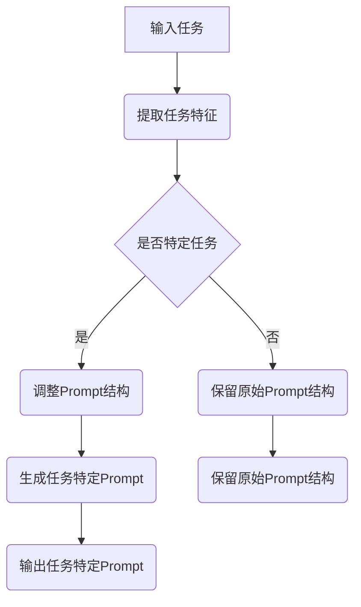
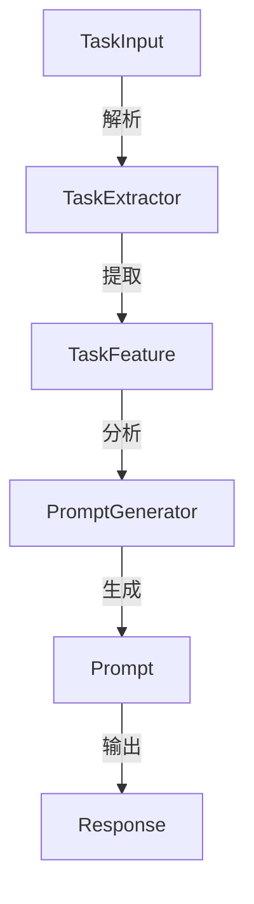
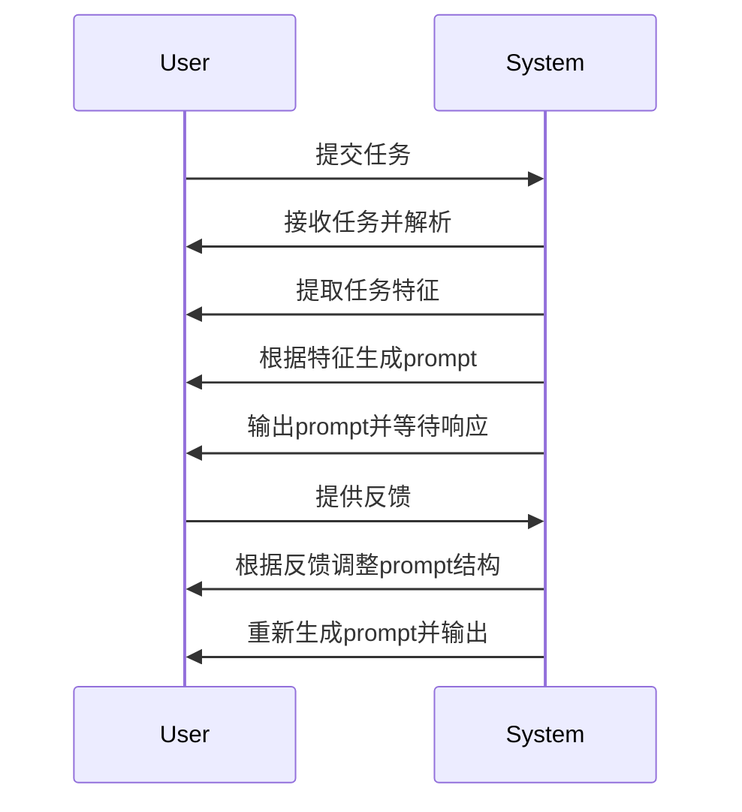

                 

# 《如何设计任务特定的prompt结构》

## 关键词

- **prompt结构设计**
- **任务特定**
- **人工智能应用**
- **算法原理**
- **系统架构设计**
- **mermaid流程图**

## 摘要

本文将深入探讨如何设计任务特定的prompt结构，分析其在人工智能应用中的重要性，并详细阐述设计原则和方法。我们将从背景介绍、核心概念、算法原理到系统分析与架构设计，逐步讲解任务特定prompt的设计过程，以帮助读者深入理解并掌握这一关键技能。

## 目录大纲

# 《如何设计任务特定的prompt结构》

## 第一部分：背景介绍

### 第1章：问题背景与核心概念

### 1.1.1 问题背景

随着人工智能技术的迅猛发展，人工智能助手已经在各行各业中得到了广泛应用。从智能家居到智能客服，从自动驾驶到自然语言处理，AI助手的出现极大地提高了工作效率和生活质量。然而，要实现高效准确的任务执行，关键在于如何设计出任务特定的prompt结构。

### 1.1.2 问题描述

prompt设计在人工智能应用中扮演着至关重要的角色。一个优秀的prompt能够引导人工智能助手准确理解任务意图，从而提高任务执行的效率和质量。任务特定prompt是指针对特定任务场景设计的prompt，其目的是确保AI助手能够准确理解任务需求，提供精确的解决方案。

### 1.1.3 问题解决

当前，prompt设计面临的主要挑战是如何确保prompt既具有通用性，又能适应特定任务的需求。为了解决这个问题，我们需要从设计原则和方法入手，逐步构建出任务特定的prompt结构。

### 1.1.4 边界与外延

prompt设计不仅涉及自然语言处理技术，还与知识图谱、语义分析等多个领域密切相关。任务特定prompt的应用范围广泛，涵盖了从日常生活中的简单任务到复杂工业领域的应用。

### 1.1.5 概念结构与核心要素组成

prompt结构的基本组成部分包括输入部分、任务描述部分、输出部分和反馈部分。任务特定prompt的关键要素则是根据任务需求进行定制，以确保AI助手能够准确理解和执行任务。

## 第二部分：核心概念与联系

### 第2章：核心概念原理与属性特征对比

### 2.1.1 核心概念原理

普通prompt结构与任务特定prompt结构的主要区别在于任务描述的精确性和个性化程度。普通prompt结构通常适用于广泛场景，而任务特定prompt则需要针对特定任务进行详细描述。

### 2.1.2 属性特征对比

- **通用属性特征**：包括清晰、简洁、具有引导性。
- **特殊属性特征**：包括精确、个性化、针对性。

## 第三部分：算法原理讲解

### 第3章：任务特定Prompt设计算法

### 3.1.1 算法mermaid流程图



### 3.1.2 Python源代码实现

```python
def generate_prompt(task):
    # 提取任务特征
    features = extract_task_features(task)
    
    # 是否特定任务
    if is_specific_task(features):
        # 调整Prompt结构
        prompt_structure = adjust_prompt_structure(features)
        # 生成任务特定Prompt
        prompt = generate_specific_prompt(prompt_structure)
    else:
        # 保留原始Prompt结构
        prompt = task
    
    return prompt
```

### 3.1.3 算法原理的数学模型和公式

- **提取任务特征**：$f_t = f_1 + f_2 + ... + f_n$
- **是否特定任务**：$T_t = \sum_{i=1}^{n} f_i \cdot w_i$
- **调整Prompt结构**：$P_t = P_0 + \alpha \cdot (P_t - P_0)$
- **生成任务特定Prompt**：$P_s = P_t + \beta \cdot (P_s - P_t)$

### 3.1.4 举例说明

假设输入任务为“请回答以下数学问题：3 + 4 = ?”。输出任务特定Prompt可以为：“请使用数学符号和公式解答以下问题：$3 + 4 = ?$”。

## 第四部分：系统分析与架构设计

### 第4章：系统功能设计

### 4.1.1 领域模型mermaid类图

```mermaid
classDiagram
    Prompt <<Interface>>
    Task <<Interface>>
    PromptGenerator <<Class>>
    TaskExtractor <<Class>>
    PromptAdjuster <<Class>>

    Prompt "1" --|U|> PromptGenerator
    PromptGenerator "1" --|U|> TaskExtractor
    TaskExtractor "1" --|U|> PromptAdjuster
    PromptAdjuster "1" --|U|> Prompt
```

### 4.1.2 系统架构设计mermaid架构图



### 4.1.3 系统接口设计和系统交互mermaid序列图



## 结论与展望

本文详细探讨了如何设计任务特定的prompt结构，从背景介绍、核心概念、算法原理到系统分析与架构设计，层层递进，深入浅出地解析了这一关键技能。通过本文的讲解，读者应该能够掌握任务特定prompt的设计原则和方法，并在实际应用中充分发挥其价值。

展望未来，随着人工智能技术的不断进步，任务特定prompt设计将在更多领域得到应用，为人工智能助手提供更高效、更精准的解决方案。我们期待读者在了解本文内容的基础上，能够积极尝试和实践，不断探索和创新，为人工智能技术的发展贡献自己的力量。

### 作者信息

作者：AI天才研究院/AI Genius Institute & 禅与计算机程序设计艺术 /Zen And The Art of Computer Programming

---

通过本文，我们系统地介绍了如何设计任务特定的prompt结构。首先，我们明确了prompt设计在人工智能应用中的重要性，并详细阐述了任务特定prompt的定义和特点。接着，我们分析了当前prompt设计面临的挑战，并提出了设计任务特定prompt的方法和原则。

在核心概念与联系部分，我们对比了普通prompt结构与任务特定prompt结构的差异，并详细介绍了任务特定prompt的通用属性特征和特殊属性特征。随后，我们深入讲解了任务特定Prompt设计算法的原理，包括mermaid流程图、Python源代码实现、算法原理的数学模型和公式以及具体的举例说明。

最后，我们在系统分析与架构设计部分，介绍了系统功能设计、系统架构设计以及系统接口设计和系统交互mermaid序列图。通过这些详细的设计方案，读者可以更好地理解任务特定prompt结构在实际系统中的应用。

我们希望本文能够为读者提供有价值的指导和启示，帮助他们在人工智能领域取得更大的成就。同时，我们也鼓励读者在了解本文内容的基础上，积极实践和探索，为人工智能技术的发展贡献自己的力量。

在未来的研究中，我们可以进一步探讨任务特定prompt在更多场景中的应用，如自动驾驶、智能医疗等，不断优化和完善任务特定prompt的设计方法，为人工智能助手提供更加智能、高效的解决方案。此外，我们还可以研究如何结合其他先进技术，如深度学习、强化学习等，进一步提升任务特定prompt的性能和效果。

总之，任务特定prompt设计是人工智能应用中一个重要且具有挑战性的课题，需要我们不断探索和创新。我们期待读者在本文的基础上，能够深入研究并实践任务特定prompt设计，为人工智能技术的发展贡献自己的智慧和力量。让我们一起为构建一个更加智能、高效的人工智能世界而努力！

