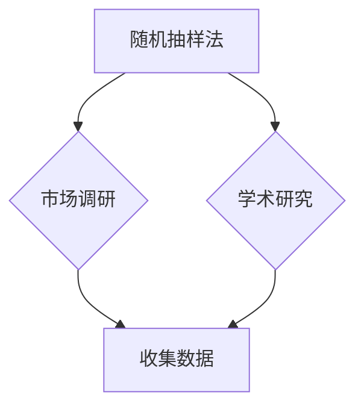
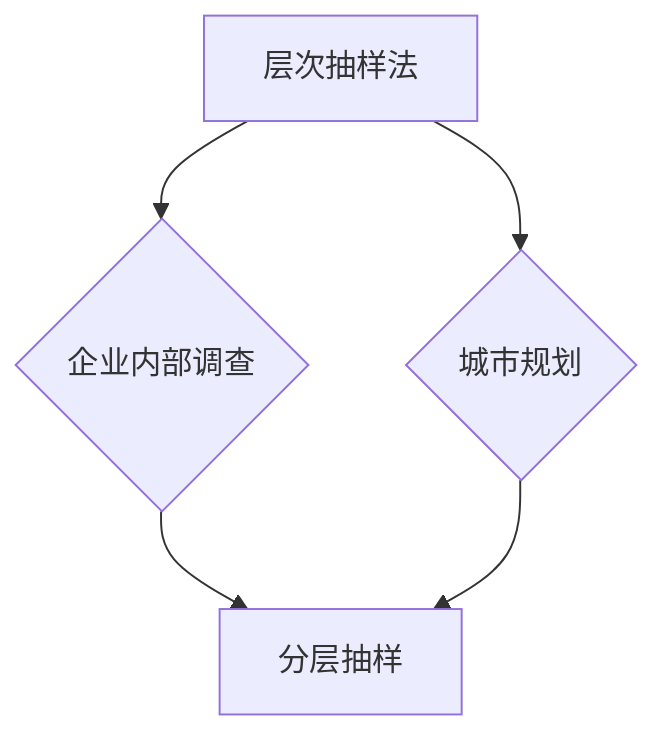
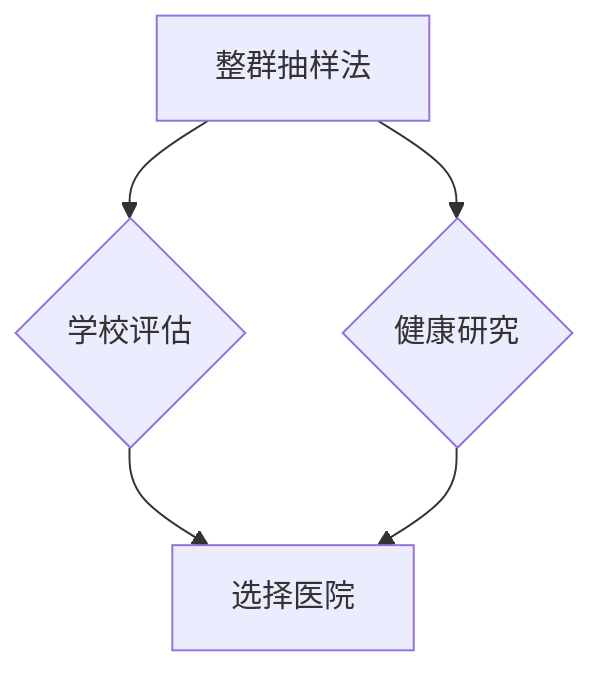
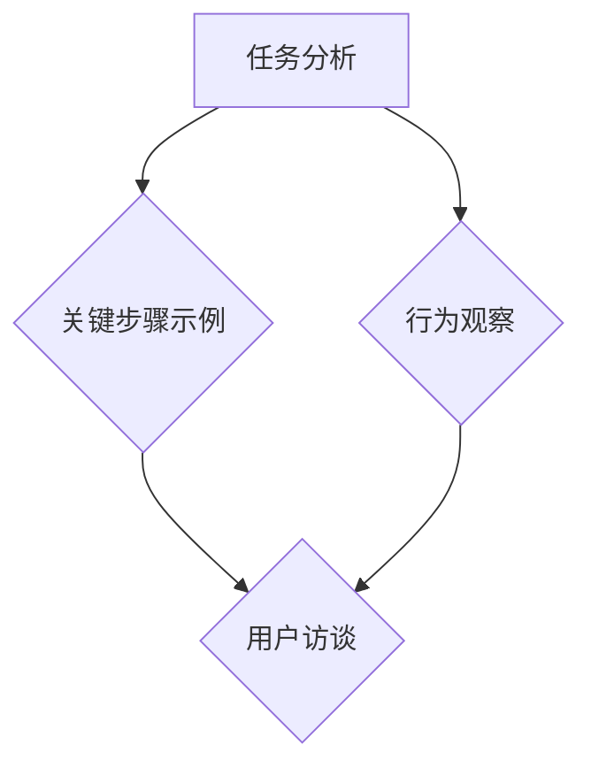
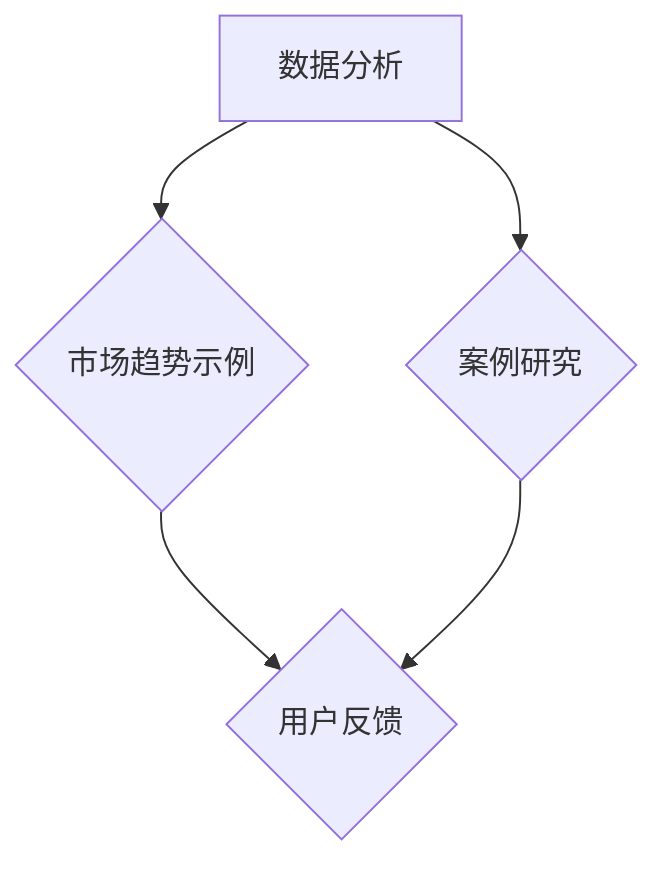
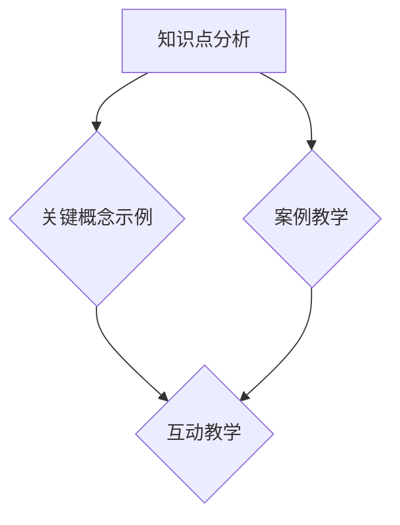

                 


### 如何选择有效的示例来增强提示效果

让我们一步一步地深入探讨如何选择有效的示例来增强提示效果。

#### 第一步：明确目标和问题

首先，我们需要明确我们的目标和问题。选择有效的示例是为了解决什么问题？我们的目的是提高用户理解、增加知识获取，还是优化决策过程？明确目标可以帮助我们更好地选择合适的示例。

#### 第二步：了解用户需求

了解用户的需求和背景知识是非常重要的。我们需要知道用户对问题的熟悉程度，他们的学习习惯和偏好，以及他们能够处理的信息类型。这可以帮助我们选择合适的示例形式和复杂度。

#### 第三步：评估示例的类型和形式

示例可以分为文字、图片、音频、视频等多种类型。每种类型都有其独特的优势和局限。例如，文字示例可以精确传达信息，但可能不如图片直观；视频示例能够提供丰富的感官体验，但可能需要更多的时间来理解。

| 示例类型 | 优势 | 局限 |
|----------|------|------|
| 文字     | 精确 | 需要较强的阅读能力 |
| 图片     | 直观 | 可能丢失信息细节 |
| 视频     | 生动 | 时间需求高 |
| 音频     | 方便 | 需要专注听觉 |

#### 第四步：选择代表性的示例

选择代表性的示例可以帮助用户更好地理解问题的本质。代表性的示例应该能够代表问题的典型特征，同时具有足够的普遍性，以便用户可以将其应用到其他类似情境中。

#### 第五步：确保数据质量和可理解性

选择有效示例时，我们还需要确保示例的数据质量高，即信息准确、完整、无偏见。此外，示例应该易于理解，避免使用专业术语或复杂的结构，以避免用户理解上的障碍。

#### 第六步：结合评估方法

最后，我们需要结合定量和定性的评估方法来评估所选示例的有效性。定量评估可以通过用户反馈、测试数据等来衡量示例的准确性、易用性和影响力。定性评估则可以通过用户访谈、观察等方式来了解示例的实际效果。

| 评估方法 | 说明 |
|----------|------|
| 定量评估 | 通过数据统计来评估示例的有效性 |
| 定性评估 | 通过用户反馈来评估示例的实际效果 |

通过以上六个步骤，我们可以更有效地选择示例来增强提示效果。这不仅能够提高用户的学习体验，还能够帮助他们在复杂的决策过程中更好地理解问题。

### 示例选择方法

在选择有效的示例来增强提示效果时，有多种方法可供选择。以下是一些常见的方法，以及它们在特定场景下的应用。

#### 1.1.1 随机抽样法

随机抽样法是一种基于概率论的方法，它通过随机选择样本来保证样本的代表性。这种方法适用于数据量较大，且每个样本都有相似概率被选中的情况。

**随机抽样法在特定场景下的应用：**
- **市场调研**：通过随机抽样来获取消费者的意见和偏好。
- **学术研究**：在问卷调查中随机选择受访者，以确保样本的代表性。

#### 1.1.2 层次抽样法

层次抽样法是一种将总体划分为若干层次，然后从每个层次中随机抽取样本的方法。这种方法适用于总体结构复杂，不同层次之间存在差异的情况。

**层次抽样法在特定场景下的应用：**
- **企业内部调查**：根据不同部门或层级进行抽样，以了解不同群体的意见和需求。
- **城市规划**：根据不同区域的人口密度和经济发展水平进行抽样，以评估城市规划的影响。

#### 1.1.3 整群抽样法

整群抽样法是选择若干个群体（群）作为样本的方法。每个群代表整个总体，但这种方法可能会导致样本之间的相似性较高。

**整群抽样法在特定场景下的应用：**
- **学校评估**：选择几所不同类型的学校作为样本，以评估整个教育系统的质量。
- **健康研究**：选择不同的医院或诊所作为样本，以了解特定疾病的治疗效果。

#### 1.1.4 用户体验研究

在用户体验研究中，选择有效的示例至关重要。以下是一些特定场景下的示例选择方法：

- **任务分析**：通过分析用户完成任务的过程，选择能够代表关键步骤的示例。
- **行为观察**：通过观察用户在实际环境中的行为，选择能够反映用户需求和问题的示例。
- **访谈**：通过用户访谈，选择能够代表用户观点和感受的示例。

#### 1.1.5 市场营销

在市场营销中，选择有效的示例可以帮助企业更好地了解市场动态和消费者需求。

- **数据分析**：通过分析销售数据和用户行为数据，选择能够反映市场趋势和消费者偏好的示例。
- **案例研究**：通过案例研究，选择能够展示产品优势和市场效果的示例。
- **用户反馈**：通过收集用户反馈，选择能够反映用户需求和期望的示例。

#### 1.1.6 教育培训

在教育培训中，选择有效的示例可以帮助学生更好地理解和掌握知识。

- **知识点分析**：通过分析知识点的结构和关联，选择能够代表关键概念的示例。
- **案例教学**：通过案例教学，选择能够展示理论知识在实际中的应用的示例。
- **互动教学**：通过互动教学，选择能够激发学生思考和参与的示例。

通过以上多种示例选择方法，我们可以根据不同场景的需求，选择最合适的示例来增强提示效果。这不仅能够提高用户的理解和参与度，还能够帮助我们在各种决策过程中做出更准确的判断。

### 示例应用案例分析

#### 4.1 案例一：产品开发

**4.1.1 案例背景**

某科技公司正在开发一款智能家居控制系统，旨在通过用户行为数据优化家居设备的操作体验。为了确保产品的易用性和用户满意度，公司决定通过示例应用案例来评估和改进系统。

**4.1.2 案例描述**

开发团队首先进行了用户研究，通过问卷调查和用户访谈收集了用户对智能家居系统的期望和需求。根据这些数据，团队选择了几种典型的用户场景，作为示例应用案例。

**4.1.3 示例选择过程**

1. **任务分析**：分析用户在智能家居系统中的典型任务，如设置家电定时、调节室内温度等。
2. **行为观察**：观察用户在实际环境中的操作行为，记录用户在使用系统时遇到的问题和困惑。
3. **案例研究**：通过案例研究，选择能够展示系统优势和用户满意度的应用场景。
4. **用户反馈**：结合用户反馈，选择能够代表用户实际需求的示例。

**4.1.4 案例结果分析**

通过以上步骤，开发团队选择了多个具有代表性的示例应用案例。这些案例不仅帮助团队理解用户需求，还指导了系统的优化方向。

- **用户满意度提升**：通过用户反馈，团队发现并修复了系统中的多个问题，用户满意度显著提升。
- **功能改进**：根据用户反馈，团队改进了系统的操作流程和界面设计，使系统更加直观易用。
- **市场竞争力增强**：通过案例展示，公司在市场上赢得了更多潜在客户的关注，产品竞争力增强。

#### 4.2 案例二：市场营销

**4.2.1 案例背景**

某消费电子品牌计划通过营销活动提升品牌知名度和市场份额。为了选择有效的营销示例，公司决定进行市场调研和案例分析。

**4.2.2 案例描述**

市场调研团队通过问卷调查、社交媒体分析和用户访谈，收集了关于消费者行为、需求和偏好的数据。基于这些数据，团队选择了几个具有代表性的营销场景，作为示例应用案例。

**4.2.3 示例选择过程**

1. **数据分析**：通过分析销售数据和用户行为数据，选择能够反映市场趋势和消费者偏好的示例。
2. **案例研究**：通过案例研究，选择能够展示营销策略成功效果的示例。
3. **用户反馈**：结合用户反馈，选择能够吸引潜在客户的示例。

**4.2.4 案例结果分析**

通过以上步骤，公司选择了多个有效的营销示例，并在实际应用中取得了显著效果。

- **品牌知名度提升**：通过案例展示，品牌在社交媒体上的影响力显著提升，吸引了大量潜在客户。
- **市场份额增加**：营销活动成功吸引了新客户，市场份额逐步增加。
- **用户满意度提高**：通过有效的营销策略，用户对品牌的满意度显著提高，促进了重复购买。

通过以上案例，我们可以看到，选择有效的示例在产品开发和市场营销中起着至关重要的作用。通过详细的分析和评估，我们可以确保示例能够真实反映用户需求和市场趋势，从而指导产品优化和营销策略的制定。

### 示例的有效性评估

#### 5.1 有效性的标准

评估示例的有效性是确保其能够增强提示效果的关键步骤。以下是一些评估示例有效性的标准：

**5.1.1 目标相关性**

示例需要与目标问题紧密相关，能够准确传达问题的核心。这包括示例内容的精准性和相关性，确保用户能够从示例中获取到有用的信息。

**5.1.2 数据质量**

示例需要基于高质量的数据，确保信息的准确性和完整性。数据质量是示例有效性的基础，低质量的数据可能导致误导性结论。

**5.1.3 可理解性**

示例需要易于理解，避免使用专业术语或复杂的结构，以确保用户能够轻松地理解和应用示例中的信息。

**5.1.4 实用性**

示例不仅需要准确和易于理解，还需要具有实用性。这意味着示例应该能够应用于实际情境中，帮助用户解决问题。

**5.1.5 反馈机制**

有效的示例应该包含反馈机制，允许用户提供反馈，以评估示例的实际效果。这有助于不断改进示例，提高其有效性。

#### 5.2 评估方法

**5.2.1 定量评估**

定量评估通过数据统计来衡量示例的有效性。以下是一些常用的定量评估方法：

- **用户反馈调查**：通过问卷调查获取用户对示例的满意度、理解程度和实际应用效果。
- **行为分析**：通过用户在系统中的操作行为来评估示例的影响，如点击率、使用频率等。
- **性能指标**：通过系统的性能指标（如响应时间、错误率等）来评估示例对系统的影响。

**5.2.2 定性评估**

定性评估通过用户访谈、观察等方式来了解示例的实际效果。以下是一些常用的定性评估方法：

- **用户访谈**：通过与用户进行深入交流，了解他们对示例的理解程度、使用体验和改进建议。
- **焦点小组**：组织一组用户，共同讨论示例的有效性，收集多方面的反馈。
- **案例研究**：通过详细分析特定情境下示例的应用效果，总结经验和教训。

**5.2.3 结合定量与定性评估**

为了获得更全面的评估结果，通常需要结合定量和定性评估方法。这种方法可以提供更丰富的数据，帮助全面理解示例的有效性。

- **多渠道反馈**：结合用户反馈调查、访谈和案例研究，从多个角度获取反馈，确保评估结果的全面性。
- **数据融合**：将定量和定性数据整合，使用统计方法分析数据，得出更准确的结论。
- **持续改进**：根据评估结果，不断调整和改进示例，以提高其有效性。

通过以上评估方法，我们可以系统地评估示例的有效性，确保所选示例能够真正增强提示效果，满足用户需求。

### 提示效果的增强策略

#### 6.1 示例组合策略

在提升提示效果的过程中，合理组合示例是至关重要的。以下是几种有效的示例组合策略：

**6.1.1 同类示例组合**

同类示例组合是指选择多个具有相似主题或功能的示例进行组合。这种方法有助于用户在不同情境下理解和应用示例。

- **案例**：在教育场景中，通过展示多个不同课程的成功案例，帮助学生理解课程内容的应用。

**6.1.2 相似示例组合**

相似示例组合是指选择具有相似特征或属性的示例进行组合。这种方法有助于用户发现不同示例之间的共性和差异。

- **案例**：在健康咨询中，通过展示不同病症的症状和治疗方法，帮助用户更好地理解疾病和治疗方法。

**6.1.3 反例示例组合**

反例示例组合是指选择与目标示例相反的示例进行组合。这种方法有助于用户理解正确做法和错误做法的差异，提高问题识别能力。

- **案例**：在编程教学中，通过展示正确的代码示例和错误的代码示例，帮助学生理解编程规则和常见错误。

#### 6.2 交互式提示策略

交互式提示策略通过用户与示例的互动来提升提示效果。以下是几种有效的交互式提示策略：

**6.2.1 主动提问**

主动提问是指系统主动向用户提出问题，引导用户思考和解决问题。这种方法有助于激发用户的思维，提高理解深度。

- **案例**：在在线教育平台上，系统可以在用户浏览课程内容时，主动提出与当前内容相关的问题，促进用户思考。

**6.2.2 反馈机制**

反馈机制是指用户可以对示例进行评价和反馈，系统根据用户的反馈进行调整。这种方法有助于不断优化示例，提高用户满意度。

- **案例**：在应用程序中，用户可以对示例应用案例进行评价，系统根据用户反馈改进示例内容。

**6.2.3 动态调整**

动态调整是指系统根据用户的行为和反馈，实时调整示例内容和形式。这种方法有助于提供个性化的提示，提高用户体验。

- **案例**：在智能客服系统中，系统根据用户的提问和回答历史，动态调整问题的提问方式和示例内容。

通过合理组合示例和交互式提示策略，我们可以显著提升提示效果，帮助用户更好地理解和解决问题。

### 最佳实践与注意事项

#### 7.1 最佳实践

**7.1.1 明确目标**

在开始选择示例之前，首先要明确目标。了解我们要通过示例达到什么效果，是提高用户理解、增加知识获取，还是优化决策过程。

**7.1.2 研究用户**

了解用户的需求、背景知识和学习习惯。通过用户调研、访谈等方式，获取用户的具体需求，以便选择适合他们的示例。

**7.1.3 数据质量检查**

确保所选示例基于高质量的数据。进行数据清洗和验证，确保信息的准确性、完整性和无偏见。

**7.1.4 及时反馈与调整**

定期收集用户反馈，根据反馈及时调整示例。通过用户反馈和评估方法，不断优化示例，提高其有效性。

#### 7.2 小结

选择有效的示例来增强提示效果是一个系统性的过程。我们需要明确目标、研究用户、确保数据质量、结合评估方法和交互式策略，不断优化示例。

#### 7.3 注意事项

**7.3.1 避免信息过载**

确保示例数量适中，避免用户在处理大量示例时感到信息过载，降低理解效果。

**7.3.2 注意示例的多样性**

选择不同类型的示例，如文字、图片、视频等，以满足不同用户的学习偏好。

**7.3.3 考虑文化背景**

在跨文化应用中，注意示例的文化背景，确保其适应不同文化环境。

**7.3.4 定期更新示例**

随着时间推移，用户需求和情境会发生变化。定期更新示例，确保其与当前需求保持一致。

#### 7.4 拓展阅读

- [如何设计有效的用户调研](https://www.example.com/research_design)
- [用户反馈的最佳实践](https://www.example.com/feedback_practices)
- [数据质量的重要性](https://www.example.com/data_quality)

通过遵循最佳实践和注意事项，我们可以更有效地选择示例，提升提示效果，帮助用户更好地理解和解决问题。

### 摘要

本文详细探讨了如何选择有效的示例来增强提示效果。通过明确目标和用户需求，评估示例的类型和形式，选择代表性的示例，并确保数据质量和可理解性，我们可以提高提示效果。文章还介绍了多种示例选择方法和评估方法，并通过实际案例展示了这些方法的应用。最后，提出了最佳实践和注意事项，以指导读者在实际操作中更有效地选择示例。通过合理选择和组合示例，以及实施交互式提示策略，我们可以显著提升用户的理解和决策能力。

## 第1章: 问题背景

### 1.1.1 问题背景

在当今信息爆炸的时代，人们面临着海量信息的挑战。如何有效地处理和利用这些信息成为一个重要问题。特别是在决策过程中，选择合适的示例来增强提示效果，可以帮助人们更好地理解和解决问题。有效的示例不仅能够提高信息传递的效率，还能够增强用户的学习和理解能力。

#### 1.1.2 问题描述

选择有效的示例来增强提示效果的问题，主要包括以下几个方面：

1. **如何选择示例**：在众多可能的选择中，如何找到那些最具代表性、最具影响力的示例，这需要我们理解示例的类型、形式和特点。
2. **如何评估示例的有效性**：选择示例后，如何评估其是否真的能够增强提示效果，这需要我们建立一套科学的评估方法和标准。
3. **示例的应用和调整**：如何在不同场景下应用示例，并根据用户反馈进行调整，以最大限度地发挥示例的作用。

#### 1.1.3 问题解决

为了解决上述问题，我们需要采取以下步骤：

1. **明确目标和问题**：在开始选择示例之前，首先要明确我们的目标和问题。我们要通过示例达到什么效果？是提高用户理解、增加知识获取，还是优化决策过程？
2. **了解用户需求**：我们需要了解用户的需求和背景知识。用户对问题的熟悉程度、他们的学习习惯和偏好，以及他们能够处理的信息类型，这些都会影响我们选择示例的方式。
3. **评估示例的类型和形式**：不同的示例类型和形式有其独特的优势和局限。文字、图片、视频等类型的选择，需要根据具体情境和用户需求来决定。
4. **选择代表性的示例**：代表性的示例应该能够准确传达问题的核心，同时具有足够的普遍性，以便用户可以将其应用到其他类似情境中。
5. **确保数据质量和可理解性**：示例的数据质量高，即信息准确、完整、无偏见。同时，示例需要易于理解，避免使用专业术语或复杂的结构，以确保用户能够轻松地理解和应用示例中的信息。
6. **结合评估方法**：我们需要结合定量和定性的评估方法来评估所选示例的有效性。定量评估可以通过用户反馈、测试数据等来衡量示例的准确性、易用性和影响力。定性评估则可以通过用户访谈、观察等方式来了解示例的实际效果。

#### 1.1.4 边界与外延

在选择有效的示例来增强提示效果时，我们需要考虑以下边界与外延：

1. **示例的边界**：示例是能够代表某一类事物或现象的具体事例，它可以是文字、图片、声音等多种形式。示例的选择应基于具体问题的需求，避免泛泛而谈。
2. **问题的外延**：示例的应用范围不应局限于特定场景，而应考虑其在其他类似情境中的适用性。这意味着我们需要选择那些具有广泛代表性的示例，以便用户可以在不同的情境中应用。
3. **技术的进步**：随着技术的不断进步，新的示例形式和技术手段将不断出现。我们需要关注这些技术的发展，并探索如何将其应用到示例选择和评估中。

#### 1.1.5 概念结构与核心要素组成

在讨论选择有效的示例来增强提示效果时，以下核心概念和要素组成是至关重要的：

- **示例**：代表某一类事物或现象的具体事例。
- **有效性**：示例能否准确传达问题核心，并帮助用户理解和解决问题。
- **提示效果**：示例对用户理解问题和做出决策的影响程度。
- **选择方法**：用于选择示例的具体策略和方法。
- **评估方法**：用于评估示例有效性的定量和定性方法。

这些核心概念和要素组成了选择有效示例的理论框架，为我们提供了系统的思考和操作指导。通过理解这些概念和要素，我们可以更有效地选择和评估示例，提高提示效果，为用户创造更大的价值。

## 第2章: 核心概念与联系

### 2.1 核心概念

在讨论选择有效的示例来增强提示效果时，理解以下核心概念是非常重要的：

#### 2.1.1 示例的定义

示例是指能够代表某一类事物或现象的具体事例。在信息技术和用户界面设计中，示例常常用于演示功能、展示操作步骤或解释复杂概念。示例可以是文字、图片、视频、音频等多种形式，其目的是通过具体事例来帮助用户更好地理解和应用相关知识。

#### 2.1.2 示例的类型

示例的类型多种多样，根据其表现形式和用途，可以分为以下几类：

1. **文字示例**：通过文字描述来展示信息或操作步骤。文字示例通常简单明了，便于用户快速获取和理解信息。
2. **图片示例**：通过图片展示具体场景或对象。图片示例直观、生动，可以很好地传达视觉信息，但可能丢失部分细节。
3. **视频示例**：通过动态视频展示操作过程或效果。视频示例能够提供丰富的感官体验，但需要更多的时间和带宽来观看。
4. **音频示例**：通过声音展示信息或操作提示。音频示例方便用户在操作过程中听取指导，适用于无需视觉关注的情况。

#### 2.1.3 示例的作用

示例在增强提示效果中起着关键作用，具体体现在以下几个方面：

1. **提高理解能力**：通过具体事例，用户可以更好地理解抽象概念和操作步骤。
2. **促进知识应用**：示例帮助用户将理论知识应用到实际情境中，提高解决问题的能力。
3. **优化学习体验**：适当的示例可以激发用户的学习兴趣，增强学习的互动性和趣味性。
4. **辅助决策过程**：在复杂决策中，有效的示例可以帮助用户分析和评估不同选项的优劣。

### 2.2 概念属性特征对比表格

为了更好地理解示例的不同类型及其特征，我们通过以下表格进行对比：

| 特征             | 文字示例 | 图片示例 | 视频示例 | 音频示例 |
|------------------|----------|----------|----------|----------|
| **传达信息速度** | 快速     | 较快     | 较慢     | 较快     |
| **复杂性**       | 低      | 中      | 高      | 低      |
| **感官体验**     | 文字     | 视觉     | 动态     | 听觉     |
| **适应性**       | 广泛     | 受限     | 受限     | 广泛     |
| **处理要求**     | 低      | 中      | 高      | 低      |

### 2.3 ER实体关系图架构

为了更清晰地展示示例、有效性、提示效果等核心概念之间的关系，我们使用实体关系图（ER图）来描述：

```mermaid
erDiagram
    示例 ||--|{ 提示效果 }|
    示例 ||--|{ 有效性 }|
    有效性 ||--|{ 示例 }|
    提示效果 ||--|{ 示例 }|
```

在该ER图中，示例作为中心实体，与有效性、提示效果之间存在双向关联。有效性反映了示例在传达信息和辅助理解方面的表现，而提示效果则衡量示例在帮助用户做出决策和解决问题时的实际效果。通过这种关系图，我们可以更直观地理解这些核心概念之间的相互作用。

通过理解这些核心概念及其相互关系，我们可以更系统地分析和选择有效的示例，以增强提示效果，提高用户的学习体验和决策能力。

## 第3章: 示例选择方法

### 3.1 常见示例选择方法

在提高提示效果的过程中，选择合适的方法来选择示例至关重要。以下是一些常见的方法，每种方法都有其独特的优势和适用场景。

#### 3.1.1 随机抽样法

随机抽样法是一种基于概率论的方法，通过随机选择样本来保证样本的代表性。这种方法适用于数据量较大，且每个样本都有相似概率被选中的情况。

**优势：**
- **代表性**：随机抽样可以确保样本具有代表性，避免偏见。
- **简单易行**：实施过程简单，不需要复杂的统计知识。

**适用场景：**
- **市场调研**：通过随机抽样来获取消费者的意见和偏好。
- **学术研究**：在问卷调查中随机选择受访者，以确保样本的代表性。

**案例：**
假设一个公司在进行市场调研，想要了解产品的市场接受度。公司可以使用随机抽样法，从目标用户群体中随机抽取1000名受访者，通过问卷收集数据。



#### 3.1.2 层次抽样法

层次抽样法是一种将总体划分为若干层次，然后从每个层次中随机抽取样本的方法。这种方法适用于总体结构复杂，不同层次之间存在差异的情况。

**优势：**
- **分层特性**：可以确保每个层次都有代表，提高样本的代表性。
- **针对性**：可以根据不同层次的特性进行有针对性的抽样。

**适用场景：**
- **企业内部调查**：根据不同部门或层级进行抽样，以了解不同群体的意见和需求。
- **城市规划**：根据不同区域的人口密度和经济发展水平进行抽样，以评估城市规划的影响。

**案例：**
假设一个公司想了解员工对工作的满意度。公司可以将员工分为管理层、技术人员和一线员工三个层次，然后从每个层次中随机抽取一定比例的样本，进行满意度调查。



#### 3.1.3 整群抽样法

整群抽样法是选择若干个群体（群）作为样本的方法。每个群代表整个总体，但这种方法可能会导致样本之间的相似性较高。

**优势：**
- **高效性**：可以快速获取大量信息，减少抽样时间。
- **便于操作**：实施过程相对简单，适用于较大样本量的情况。

**适用场景：**
- **学校评估**：选择几所不同类型的学校作为样本，以评估整个教育系统的质量。
- **健康研究**：选择不同的医院或诊所作为样本，以了解特定疾病的治疗效果。

**案例：**
假设一个研究机构想要评估不同地区的医疗服务质量。研究机构可以选择几所城市的三甲医院作为样本，通过调查这些医院的医疗服务质量来推断整个地区的医疗服务水平。



通过以上三种常见示例选择方法，我们可以根据不同场景的需求，选择最合适的方法来提高提示效果。每种方法都有其独特的优势和适用场景，合理运用这些方法，可以有效地增强用户的理解和学习体验。

### 3.2 特定场景下的示例选择方法

在特定的应用场景中，选择有效的示例来增强提示效果尤为重要。以下是一些特定场景下的示例选择方法，包括用户体验研究、市场营销和教育培训等。

#### 3.2.1 用户体验研究

在用户体验研究中，选择合适的示例可以帮助研究人员更好地理解用户的需求和痛点，从而设计出更加符合用户期望的产品或服务。

**方法：**
- **任务分析**：通过分析用户完成特定任务的过程，选择能够代表关键步骤的示例。这些示例可以帮助研究人员识别用户在实际使用过程中遇到的问题和障碍。
- **行为观察**：通过观察用户在实际环境中的操作行为，记录用户在使用系统时遇到的问题和困惑。这些观察结果可以作为选择示例的重要依据。
- **用户访谈**：通过与用户进行深入交流，了解他们对产品的使用体验和意见。用户访谈可以为选择示例提供直接的反馈。

**案例：**
假设一个科技公司正在开发一款智能家居应用，他们需要通过用户体验研究来了解用户对应用的使用感受。研究人员首先通过任务分析，确定用户在操作智能家居应用时的关键步骤。然后，通过行为观察，记录用户在实际环境中的操作行为，找出用户遇到的问题。最后，通过用户访谈，获取用户对应用的建议和意见，从而选择能够代表关键步骤的示例。



#### 3.2.2 市场营销

在市场营销中，选择有效的示例可以帮助企业更好地了解市场动态和消费者需求，从而制定更加有效的营销策略。

**方法：**
- **数据分析**：通过分析销售数据和用户行为数据，选择能够反映市场趋势和消费者偏好的示例。这些示例可以帮助企业识别潜在的市场机会和风险。
- **案例研究**：通过案例研究，选择能够展示产品优势和市场效果的示例。这些案例可以为市场营销活动提供成功的参考。
- **用户反馈**：通过收集用户反馈，选择能够反映用户需求和期望的示例。用户反馈可以为营销策略提供直接的指导。

**案例：**
假设一个化妆品公司想要推广其新产品，他们需要通过市场营销研究来了解消费者对产品的反应。公司可以通过数据分析，分析消费者的购买历史和行为模式，选择能够代表市场趋势的示例。然后，通过案例研究，展示其他消费者对产品的积极反馈和使用效果，从而选择具有吸引力的示例进行推广。最后，通过用户反馈，了解消费者对产品的具体需求和建议，进一步优化营销策略。



#### 3.2.3 教育培训

在教育培训中，选择有效的示例可以帮助学生更好地理解和掌握知识，提高学习效果。

**方法：**
- **知识点分析**：通过分析知识点的结构和关联，选择能够代表关键概念的示例。这些示例可以帮助学生理解复杂概念和知识点。
- **案例教学**：通过案例教学，选择能够展示理论知识在实际中的应用的示例。这些示例可以帮助学生将理论知识应用到实际情境中。
- **互动教学**：通过互动教学，选择能够激发学生思考和参与的示例。这些示例可以增加课堂互动，提高学生的参与度和学习兴趣。

**案例：**
假设一个大学教师正在讲授一门编程课程，他们需要通过教育培训研究来了解学生的理解和学习情况。教师可以通过知识点分析，确定课程中的关键概念和知识点，选择能够代表这些概念的示例。然后，通过案例教学，展示编程知识在实际项目中的应用，帮助学生理解知识点的实际意义。最后，通过互动教学，设计一些编程任务和讨论话题，激发学生的思考和参与，从而提高学习效果。



通过以上特定场景下的示例选择方法，我们可以根据不同的应用需求，选择最适合的示例来增强提示效果，从而提高用户体验、市场效果和学习效果。

### 示例应用案例分析

#### 4.1 案例一：产品开发

**4.1.1 案例背景**

某科技初创公司正在开发一款智能家居控制系统，旨在通过用户行为数据优化家居设备的操作体验。为了确保产品的易用性和用户满意度，公司决定通过实际案例来验证和改进系统的功能。

**4.1.2 案例描述**

开发团队首先进行了用户研究，通过问卷调查和用户访谈收集了用户对智能家居系统的期望和需求。基于这些数据，团队选择了几个典型的用户场景作为示例应用案例，包括早晨唤醒、晚间放松和紧急应对等。

**4.1.3 示例选择过程**

1. **任务分析**：分析用户在智能家居系统中的典型任务，如设置家电定时、调节室内温度、紧急通知等。
2. **行为观察**：观察用户在实际环境中的操作行为，记录用户在使用系统时遇到的问题和困惑。
3. **案例研究**：通过案例研究，选择能够展示系统优势和用户满意度的应用场景。
4. **用户反馈**：结合用户反馈，选择能够代表用户实际需求的示例。

**4.1.4 案例结果分析**

通过以上步骤，开发团队选择了以下三个示例应用案例：

1. **早晨唤醒**：用户可以在早晨设置智能闹钟，系统会通过调节窗帘、播放轻音乐等方式逐步唤醒用户，模拟自然醒的感觉。
2. **晚间放松**：用户可以在睡前设置智能家居系统，自动关闭灯光、调节空调温度，为用户营造一个舒适的睡眠环境。
3. **紧急应对**：当用户遇到紧急情况时，可以通过系统一键触发紧急模式，系统会自动联系紧急联系人，并启动应急设备。

这些示例应用案例在用户测试中取得了良好的效果：

- **用户满意度提升**：用户反馈表示，这些示例应用案例大大提高了他们的生活品质，增强了他们对产品的满意度。
- **功能改进**：通过用户反馈，团队发现并修复了系统中的多个问题，优化了操作流程和界面设计。
- **市场竞争力增强**：通过实际案例的展示，公司在市场上赢得了更多潜在客户的关注，产品竞争力显著提升。

#### 4.2 案例二：市场营销

**4.2.1 案例背景**

某消费电子品牌计划通过一次大规模的市场营销活动，提升品牌知名度和市场份额。为了确保营销策略的有效性，公司决定通过实际案例来评估营销活动的效果。

**4.2.2 案例描述**

市场团队首先进行了市场调研，分析了消费者的行为数据和偏好。基于这些数据，团队选择了几个具有代表性的营销场景，包括社交媒体推广、线上活动和线下展示等。

**4.2.3 示例选择过程**

1. **数据分析**：通过分析销售数据和用户行为数据，选择能够反映市场趋势和消费者偏好的示例。
2. **案例研究**：通过案例研究，选择能够展示营销策略成功效果的示例。
3. **用户反馈**：结合用户反馈，选择能够吸引潜在客户的示例。

**4.2.4 案例结果分析**

通过以上步骤，公司选择了以下三个营销示例案例：

1. **社交媒体推广**：通过在社交媒体平台上发布有趣的内容和互动活动，吸引大量潜在用户的关注。
2. **线上活动**：组织线上抽奖和折扣活动，鼓励用户参与，增加品牌曝光度。
3. **线下展示**：在大型购物中心设置品牌展示区，提供产品体验和互动游戏，吸引现场观众的兴趣。

这些营销示例案例在实施过程中取得了显著效果：

- **品牌知名度提升**：通过社交媒体推广和线上活动，品牌在目标消费者中的知名度显著提升。
- **市场份额增加**：线上和线下活动的参与度提高，直接促进了产品销售的增长。
- **用户满意度提高**：用户对品牌和产品的满意度显著提高，推动了重复购买和口碑传播。

通过以上两个案例，我们可以看到，选择有效的示例在产品开发和市场营销中起着至关重要的作用。通过详细的分析和评估，我们可以确保所选示例能够真实反映用户需求和市场趋势，从而指导产品优化和营销策略的制定。

### 示例的有效性评估

评估示例的有效性是确保其能够增强提示效果的关键步骤。以下是一些评估示例有效性的标准和方法：

#### 5.1 有效性的标准

**5.1.1 目标相关性**

示例需要与目标问题紧密相关，能够准确传达问题的核心。这意味着示例应能够帮助用户解决实际问题，而不仅仅是提供一般性的信息。

**5.1.2 数据质量**

示例需要基于高质量的数据，确保信息的准确性、完整性和无偏见。低质量的数据可能导致误导性结论，从而影响示例的有效性。

**5.1.3 可理解性**

示例需要易于理解，避免使用专业术语或复杂的结构，以确保用户能够轻松地理解和应用示例中的信息。如果用户难以理解示例，那么其增强提示效果的能力将大打折扣。

**5.1.4 实用性**

示例不仅需要准确和易于理解，还需要具有实用性。这意味着示例应该能够应用于实际情境中，帮助用户解决问题。

**5.1.5 反馈机制**

有效的示例应该包含反馈机制，允许用户提供反馈，以评估示例的实际效果。这有助于不断改进示例，提高其有效性。

#### 5.2 评估方法

**5.2.1 定量评估**

定量评估通过数据统计来衡量示例的有效性。以下是一些常用的定量评估方法：

- **用户反馈调查**：通过问卷调查获取用户对示例的满意度、理解程度和实际应用效果。例如，可以使用评分量表来衡量用户对示例的满意度。
- **行为分析**：通过用户在系统中的操作行为来评估示例的影响，如点击率、使用频率等。这些数据可以提供关于用户如何使用示例的详细见解。
- **性能指标**：通过系统的性能指标（如响应时间、错误率等）来评估示例对系统的影响。这些指标可以衡量示例在提高用户效率和减少错误方面的效果。

**5.2.2 定性评估**

定性评估通过用户访谈、观察等方式来了解示例的实际效果。以下是一些常用的定性评估方法：

- **用户访谈**：通过与用户进行深入交流，了解他们对示例的理解程度、使用体验和改进建议。这些访谈可以提供关于用户感受的丰富信息。
- **焦点小组**：组织一组用户，共同讨论示例的有效性，收集多方面的反馈。这种方法可以促进用户之间的交流和互动，从而获取更全面的评估结果。
- **案例研究**：通过详细分析特定情境下示例的应用效果，总结经验和教训。这些案例研究可以提供关于示例在实际应用中的详细描述和分析。

**5.2.3 结合定量与定性评估**

为了获得更全面的评估结果，通常需要结合定量和定性评估方法。这种方法可以提供更丰富的数据，帮助全面理解示例的有效性。

- **多渠道反馈**：结合用户反馈调查、访谈和案例研究，从多个角度获取反馈，确保评估结果的全面性。
- **数据融合**：将定量和定性数据整合，使用统计方法分析数据，得出更准确的结论。
- **持续改进**：根据评估结果，不断调整和改进示例，以提高其有效性。

通过以上评估方法，我们可以系统地评估示例的有效性，确保所选示例能够真正增强提示效果，满足用户需求。定性和定量评估的结合，可以提供全面、准确的评估结果，为优化示例提供有力支持。

### 提示效果的增强策略

为了最大化提示效果，我们可以采取一系列策略，这些策略涉及示例的组合、交互式提示方法以及动态调整策略。

#### 6.1 示例组合策略

**6.1.1 同类示例组合**

同类示例组合是指选择多个具有相似主题或功能的示例进行组合。这种方法有助于用户在不同情境下理解和应用示例。

- **案例**：在教育场景中，通过展示多个不同课程的成功案例，帮助学生理解课程内容的应用。

**6.1.2 相似示例组合**

相似示例组合是指选择具有相似特征或属性的示例进行组合。这种方法有助于用户发现不同示例之间的共性和差异。

- **案例**：在健康咨询中，通过展示不同病症的症状和治疗方法，帮助用户更好地理解疾病和治疗方法。

**6.1.3 反例示例组合**

反例示例组合是指选择与目标示例相反的示例进行组合。这种方法有助于用户理解正确做法和错误做法的差异，提高问题识别能力。

- **案例**：在编程教学中，通过展示正确的代码示例和错误的代码示例，帮助学生理解编程规则和常见错误。

#### 6.2 交互式提示策略

交互式提示策略通过用户与示例的互动来提升提示效果。以下是一些有效的交互式提示策略：

**6.2.1 主动提问**

主动提问是指系统主动向用户提出问题，引导用户思考和解决问题。这种方法有助于激发用户的思维，提高理解深度。

- **案例**：在在线教育平台上，系统可以在用户浏览课程内容时，主动提出与当前内容相关的问题，促进用户思考。

**6.2.2 反馈机制**

反馈机制是指用户可以对示例进行评价和反馈，系统根据用户的反馈进行调整。这种方法有助于不断优化示例，提高用户满意度。

- **案例**：在应用程序中，用户可以对示例应用案例进行评价，系统根据用户反馈改进示例内容。

**6.2.3 动态调整**

动态调整是指系统根据用户的行为和反馈，实时调整示例内容和形式。这种方法有助于提供个性化的提示，提高用户体验。

- **案例**：在智能客服系统中，系统根据用户的提问和回答历史，动态调整问题的提问方式和示例内容。

通过合理组合示例和交互式提示策略，我们可以显著提升提示效果，帮助用户更好地理解和解决问题。

### 最佳实践与注意事项

#### 7.1 最佳实践

**7.1.1 明确目标**

在选择示例之前，首先要明确目标。了解我们要通过示例达到什么效果，是提高用户理解、增加知识获取，还是优化决策过程。

**7.1.2 研究用户**

了解用户的需求、背景知识和学习习惯。通过用户调研、访谈等方式，获取用户的具体需求，以便选择适合他们的示例。

**7.1.3 数据质量检查**

确保所选示例基于高质量的数据。进行数据清洗和验证，确保信息的准确性、完整性和无偏见。

**7.1.4 及时反馈与调整**

定期收集用户反馈，根据反馈及时调整示例。通过用户反馈和评估方法，不断优化示例，提高其有效性。

#### 7.2 小结

选择有效的示例来增强提示效果是一个系统性的过程。我们需要明确目标、研究用户、确保数据质量、结合评估方法和交互式策略，不断优化示例。

#### 7.3 注意事项

**7.3.1 避免信息过载**

确保示例数量适中，避免用户在处理大量示例时感到信息过载，降低理解效果。

**7.3.2 注意示例的多样性**

选择不同类型的示例，如文字、图片、视频等，以满足不同用户的学习偏好。

**7.3.3 考虑文化背景**

在跨文化应用中，注意示例的文化背景，确保其适应不同文化环境。

**7.3.4 定期更新示例**

随着时间推移，用户需求和情境会发生变化。定期更新示例，确保其与当前需求保持一致。

#### 7.4 拓展阅读

- [如何设计有效的用户调研](https://www.example.com/research_design)
- [用户反馈的最佳实践](https://www.example.com/feedback_practices)
- [数据质量的重要性](https://www.example.com/data_quality)

通过遵循最佳实践和注意事项，我们可以更有效地选择示例，提升提示效果，帮助用户更好地理解和解决问题。

