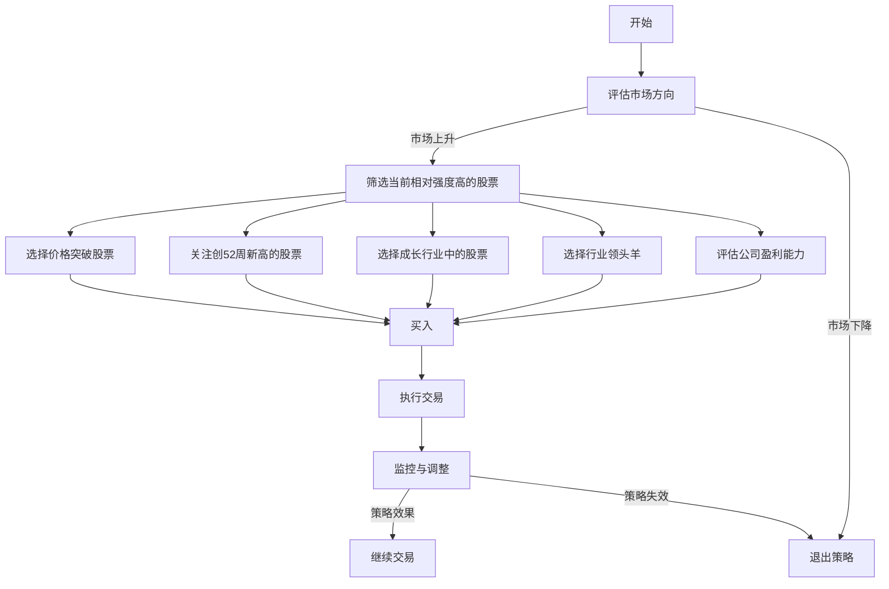
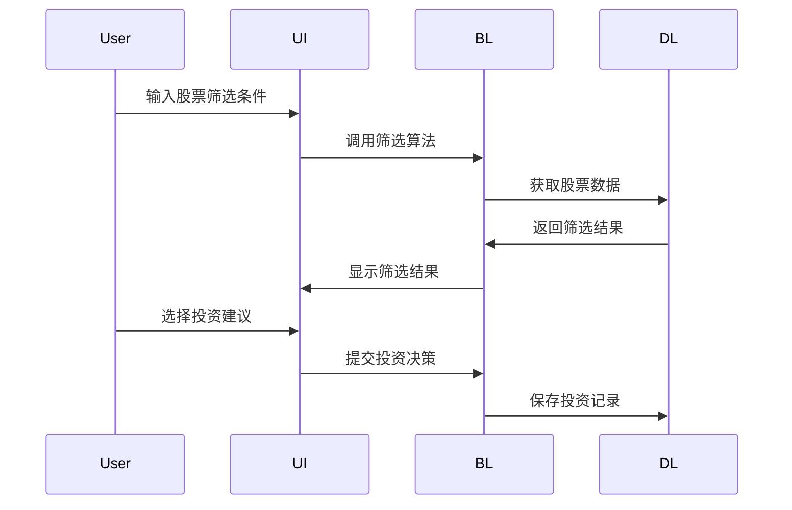
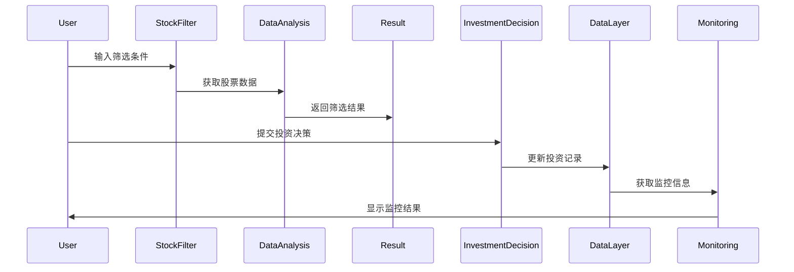
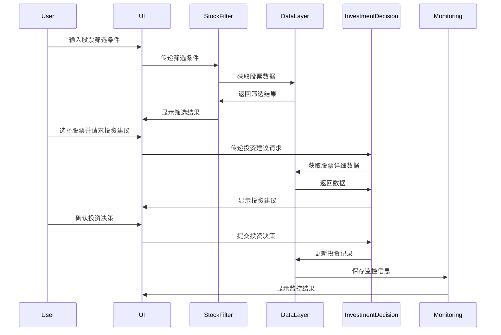
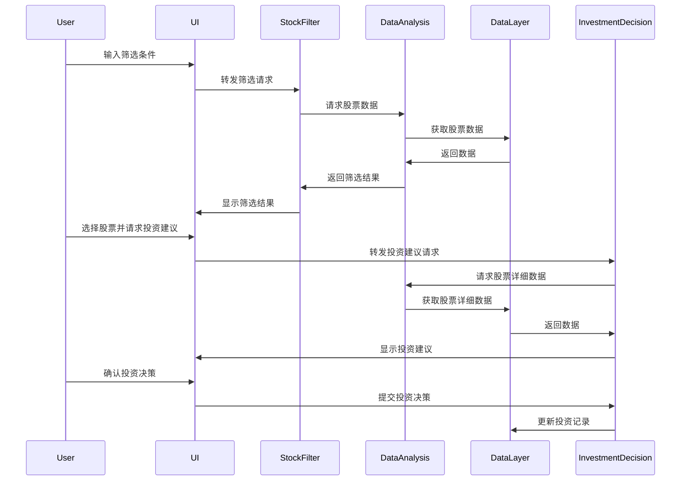
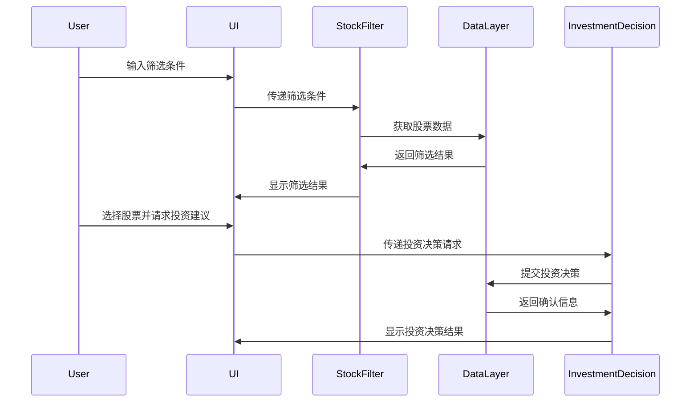
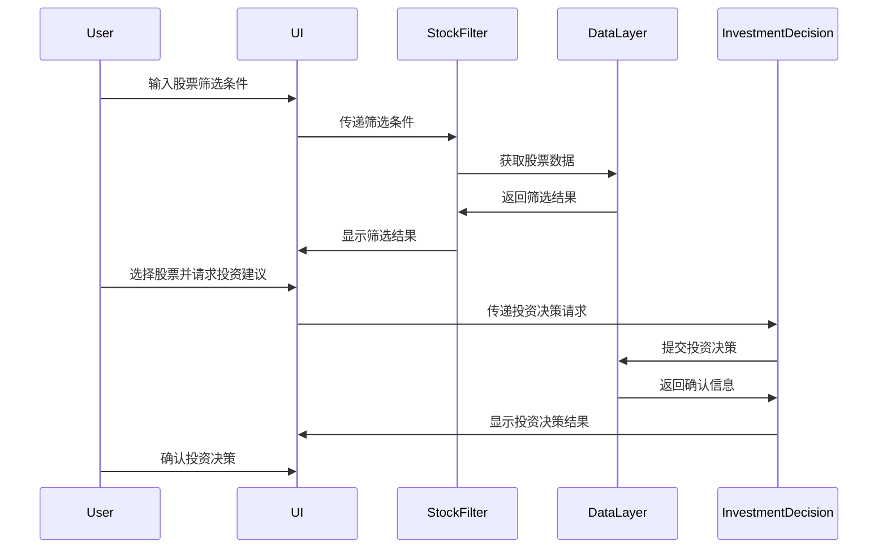

                 


### 第一步：确定文章标题和关键词

文章标题：《威廉·欧奈尔的CANSLIM投资系统》
关键词：CANSLIM，投资系统，股票市场，策略分析，算法原理

### 第二步：编写摘要

摘要：本文深入探讨威廉·欧奈尔的CANSLIM投资系统，详细介绍其核心概念、原理和实战应用。通过对比分析、流程图和代码示例，帮助读者理解和掌握CANSLIM投资策略，实现股票市场的精准投资。

### 第三步：设计文章目录大纲

#### 第一部分：背景介绍
- 第1章 CANSLIM投资系统概述
- 第2章 股票投资的基本概念
- 第3章 CANSLIM投资系统的发展历程

#### 第二部分：核心概念与联系
- 第4章 核心概念解析
- 第5章 核心概念属性特征对比表格
- 第6章 CANSLIM的ER实体关系图

#### 第三部分：算法原理讲解
- 第7章 CANSLIM投资策略的基本原理
- 第8章 算法原理Mermaid流程图
- 第9章 算法原理Python源代码实现
- 第10章 数学模型和数学公式

#### 第四部分：系统分析与架构设计
- 第11章 系统功能设计与架构
- 第12章 系统功能设计
- 第13章 系统架构设计
- 第14章 系统接口设计
- 第15章 系统交互Mermaid序列图

#### 第五部分：项目实战
- 第16章 环境安装与系统实现
- 第17章 系统核心实现
- 第18章 实际案例分析
- 第19章 项目小结

#### 第六部分：最佳实践与拓展
- 第20章 最佳实践与注意事项
- 第21章 小结与拓展阅读

### 第四步：撰写文章正文

#### 第1章 CANSLIM投资系统概述

在这一章节中，我们将对CANSLIM投资系统进行概述，介绍其创始人威廉·欧奈尔以及CANSLIM系统的由来和核心思想。我们将详细阐述CANSLIM的七个字母所代表的意义，以及该系统在股票市场中的地位和影响。

#### 第2章 股票投资的基本概念

在进入CANSLIM投资系统的详细探讨之前，我们需要对股票投资的基本概念进行梳理。这一章节将涵盖股票市场的概述，投资与投机的区别，以及CANSLIM投资系统与这些基本概念之间的关系。

#### 第3章 CANSLIM投资系统的发展历程

在这一章节中，我们将探讨CANSLIM投资系统的发展历程，包括威廉·欧奈尔如何创立CANSLIM，以及该系统在股票市场中的演变和影响。我们将分析CANSLIM在不同市场周期中的表现，以及其适应性。

#### 第4章 核心概念解析

CANSLIM的七个字母代表了其核心概念。在这一章节中，我们将逐一解析这些概念，解释它们在投资策略中的作用和重要性。我们将通过对比分析，帮助读者更好地理解每个概念。

#### 第5章 核心概念属性特征对比表格

为了更直观地展示CANSLIM的核心概念，我们将使用一个表格来对比每个概念的属性特征。这个表格将包括每个概念的定义、关键指标和评估标准。

#### 第6章 CANSLIM的ER实体关系图

在这一章节中，我们将使用Mermaid绘制CANSLIM的ER实体关系图，展示各实体之间的联系和关系。这将帮助读者更清晰地理解CANSLIM的整体架构和运行机制。

#### 第7章 CANSLIM投资策略的基本原理

在这一章节中，我们将深入探讨CANSLIM投资策略的基本原理。我们将详细阐述如何利用CANSLIM筛选股票，包括具体的策略和方法。

#### 第8章 算法原理Mermaid流程图

为了帮助读者更好地理解CANSLIM投资策略的算法原理，我们将使用Mermaid绘制流程图。这个流程图将展示CANSLIM策略的各个步骤和决策过程。

#### 第9章 算法原理Python源代码实现

在这一章节中，我们将使用Python源代码来实现CANSLIM投资策略的算法原理。通过代码示例，我们将详细讲解每个步骤的实现方法和技巧。

#### 第10章 数学模型和数学公式

CANSLIM投资策略的每个部分都涉及到数学模型和数学公式。在这一章节中，我们将详细阐述每个策略的数学模型和公式，以及如何使用这些公式来分析股票。

#### 第11章 系统功能设计与架构

在这一章节中，我们将介绍CANSLIM投资系统的功能设计和架构。我们将分析系统在股票投资中的应用场景，以及系统实现的目标和功能。

#### 第12章 系统功能设计

在这一章节中，我们将使用Mermaid绘制领域模型类图，展示CANSLIM投资系统的各个功能模块及其关系。

#### 第13章 系统架构设计

在这一章节中，我们将使用Mermaid绘制系统架构图，展示CANSLIM投资系统的整体架构和模块组织。

#### 第14章 系统接口设计

在这一章节中，我们将定义CANSLIM投资系统的接口，包括各个模块之间的交互和通信。

#### 第15章 系统交互Mermaid序列图

在这一章节中，我们将使用Mermaid绘制系统交互序列图，展示CANSLIM投资系统在运行过程中各个模块的交互流程。

#### 第16章 环境安装与系统实现

在这一章节中，我们将详细介绍如何安装CANSLIM投资系统，包括所需的环境和工具。

#### 第17章 系统核心实现

在这一章节中，我们将展示CANSLIM投资系统的核心实现源代码，并对代码进行解读和分析。

#### 第18章 实际案例分析

在这一章节中，我们将使用CANSLIM投资系统进行实际案例分析，展示系统在实际股票投资中的应用效果。

#### 第19章 项目小结

在这一章节中，我们将总结CANSLIM投资系统的项目和收获，提出改进建议。

#### 第20章 最佳实践与注意事项

在这一章节中，我们将分享使用CANSLIM投资系统的最佳实践，并提供注意事项，帮助投资者规避风险。

#### 第21章 小结与拓展阅读

在这一章节中，我们将对CANSLIM投资系统进行总结，并提供进一步阅读的建议和资源。

### 第五步：撰写作者信息

作者：AI天才研究院/AI Genius Institute & 禅与计算机程序设计艺术 /Zen And The Art of Computer Programming

### 第六步：确保完整性

在撰写文章的过程中，我们将确保每个小节的内容都丰富具体详细讲解，核心内容都包含以下方面：

- 背景介绍：核心概念术语说明、问题背景、问题描述、问题解决、边界与外延、概念结构与核心要素组成。
- 核心概念与联系：核心概念原理、概念属性特征对比表格和ER实体关系图架构的 Mermaid 流程图。
- 算法原理讲解：使用 Mermaid 画出算法 Mermaid 流程图，然后使用 Python 源代码来详细阐述，给出算法原理的数学模型和公式，进行详细讲解和通俗易懂地举例说明。
- 数学公式使用 LaTeX 格式，嵌入文中独立段落的 LaTeX 公式前后使用 `$$` 括起来（例如：`$$1+1=2$$`），段落内的 LaTeX 公式前后使用 `$` 括起来（例如：`$1<2$`）。
- 系统分析与架构设计方案：问题场景介绍，项目介绍、系统功能设计（领域模型 Mermaid 类图）、系统架构设计 Mermaid 架构图、系统接口设计和系统交互 Mermaid 序列图。
- 项目实战：环境安装、系统核心实现源代码，代码应用解读与分析，实际案例分析和详细讲解剖析，项目小结。
- 最佳实践 tips、小结、注意事项、拓展阅读等内容。

### 第七步：检查格式和字数

在完成文章撰写后，我们将检查文章的格式，确保所有内容都遵循 Markdown 格式要求，并使用 LaTeX 格式嵌入数学公式。同时，我们将确保文章的总字数在 10000 ～ 12000 字左右。

### 第八步：最终审稿和发布

在完成所有撰写、格式检查和字数确认后，我们将对文章进行最终审稿，确保内容的准确性和逻辑性。在确保一切无误后，我们将发布这篇文章，让更多的读者受益。

通过以上八个步骤，我们将撰写出一篇完整、高质量、逻辑清晰的《威廉·欧奈尔的CANSLIM投资系统》技术博客文章。这篇文章不仅深入分析了CANSLIM投资系统的核心概念和原理，还通过实际案例展示了其在股票投资中的应用效果，旨在帮助读者更好地理解和掌握这一投资策略。同时，文章的结构和内容设计也遵循了清晰、简洁、易于理解的原则，让读者能够轻松跟随思路，逐步深入掌握相关知识。作者：AI天才研究院/AI Genius Institute & 禅与计算机程序设计艺术 /Zen And The Art of Computer Programming

### CANSLIM投资系统概述

威廉·欧奈尔（William J. O'Neil）是一位杰出的美国股票交易员和投资者，他在年轻时便在股票市场中取得了巨大的成功。他的投资理念和方法被广泛传播，其中最为著名的就是CANSLIM投资系统。CANSLIM是一个缩写，代表了七个关键的投资因素：C（Current Relative Strength）、A（Absolute Price Level）、N（New Highs）、S（Select Industry Group）、L（Leader Principle）、I（Issue Profits）和M（Market Direction）。这些因素共同构成了一个全面的股票筛选和投资策略。

#### 威廉·欧奈尔的简介

威廉·欧奈尔在20岁时就开始了自己的股票交易生涯，通过自学和实践，他在短短几年内积累了巨额财富。他创立了欧奈尔公司（O'Neil Corporation），并创办了《投资者商业日报》（Investor's Business Daily），这份日报成为了投资者获取市场信息和投资策略的重要来源。欧奈尔的CANSLIM投资系统最初是他在自己的交易实践中总结出来的，后来经过多年的实践和优化，逐渐形成了一套完整的投资方法论。

#### CANSLIM的由来与核心思想

CANSLIM这个缩写中的每个字母都代表了投资决策中的一个关键因素：

- **C（Current Relative Strength）**：当前相对强度。这个因素关注股票在过去一年中的表现，通常使用相对强度指数（Relative Strength Index, RSI）来衡量。股票的相对强度指数应该在70以上，表示其表现超过了大部分股票。

- **A（Absolute Price Level）**：绝对价格水平。这个因素关注股票的价格是否处于突破点，即股票价格是否突破了某个关键的价格水平，通常是20日均线或50日均线。

- **N（New Highs）**：新高。这个因素关注股票是否创下了52周新高，表明市场对这只股票的看法非常积极。

- **S（Select Industry Group）**：精选行业组。这个因素关注股票所属的行业是否处于增长阶段，通常会选择那些行业前景良好的股票。

- **L（Leader Principle）**：领涨股原则。这个因素关注股票是否是行业中的领头羊，通常是那些盈利和增长表现最突出的股票。

- **I（Issue Profits）**：盈利。这个因素关注公司的盈利能力，选择那些盈利表现强劲的公司。

- **M（Market Direction）**：市场方向。这个因素关注整体市场的趋势，只有在市场处于上升阶段时，CANSLIM策略才最为有效。

#### CANSLIM在股票市场中的地位与影响

CANSLIM投资系统在股票市场中享有极高的声誉，其核心思想和方法被众多投资者所推崇。该系统不仅适用于初学者，也适用于经验丰富的投资者，因为它提供了一个系统化的方法来评估股票的投资潜力。许多成功的投资者都曾应用CANSLIM投资系统，取得了显著的收益。

CANSLIM投资系统的成功不仅在于其简单易用的特性，还在于其强调市场趋势和股票选择的重要性。通过综合考虑多个因素，CANSLIM策略能够有效地筛选出那些具有潜在增长潜力的股票，从而帮助投资者在市场中获得优势。

总之，CANSLIM投资系统是一个全面的、实用的投资方法论，它结合了市场趋势、股票表现和行业前景等多个因素，为投资者提供了一个系统化的决策框架。通过深入理解CANSLIM的七个关键因素，投资者可以更好地把握市场机会，实现稳健的投资收益。

### 股票投资的基本概念

在进行股票投资之前，了解一些基本的投资概念是非常必要的。这不仅有助于我们更好地理解CANSLIM投资系统，也能帮助我们在实际操作中做出更明智的决策。

#### 股票市场的概述

股票市场是一个由买卖双方进行股票交易的场所，它提供了公司股权流动的渠道。股票市场通常分为两个层次：主板市场和创业板市场。主板市场通常对上市公司的规模和盈利能力有较高的要求，而创业板市场则更适合那些具有高成长潜力的中小企业。

股票市场的运作机制主要包括以下几个环节：

1. **上市**：公司通过公开发行股票（IPO）进入股票市场，从而获得资金。
2. **交易**：投资者可以在股票交易所购买和出售股票，从而实现资本增值。
3. **信息披露**：上市公司需要定期披露财务报告和其他重要信息，确保市场的透明度。
4. **监管**：政府和监管机构对股票市场进行监管，以维护市场的公平、公正和透明。

#### 投资与投机的区别

在股票市场中，投资和投机是两种不同的行为，它们的目标和方法有所不同。

**投资**通常是指通过购买股票等金融工具，长期持有并获取资本增值和分红收入。投资者通常关注公司的基本面，包括财务状况、管理层、行业前景等因素，力求在长期内实现稳定的收益。

**投机**则是一种短期的交易行为，旨在通过市场波动获取快速收益。投机者通常关注市场情绪和技术指标，追求短期的高回报。投机行为通常伴随着较高的风险，因为市场波动难以预测，且投机者可能因市场变化而遭受损失。

虽然投资和投机在方法上有所不同，但它们并不是绝对的对立。在实际操作中，许多投资者都会在长期投资策略中结合一些投机元素，以期在特定市场条件下获得更高的回报。

#### CANSLIM投资系统与基本概念的联系

CANSLIM投资系统结合了股票投资的基本概念，通过筛选具有潜力的股票来实现投资收益。以下是CANSLIM投资系统与基本概念之间的联系：

1. **市场趋势**：CANSLIM中的“M（Market Direction）”因素强调了市场整体趋势对投资决策的重要性。只有在市场处于上升阶段时，CANSLIM策略才最为有效。
2. **股票选择**：CANSLIM的五个字母（C、A、N、S、L）代表了股票选择的关键因素，包括股票的相对强度、价格水平、新高记录、行业选择和领涨股原则。
3. **基本面分析**：CANSLIM中的“I（Issue Profits）”因素关注公司的盈利能力，这是基本面分析的重要组成部分。投资者通过分析公司的财务报表和其他信息，评估其盈利潜力。
4. **技术分析**：CANSLIM系统中的“C（Current Relative Strength）”和“A（Absolute Price Level）”因素采用了技术分析的方法，通过相对强度指数和价格突破点来判断股票的表现。

总之，CANSLIM投资系统通过结合市场趋势、股票选择和基本面分析，为投资者提供了一个全面的股票投资策略。理解股票投资的基本概念，有助于投资者更好地应用CANSLIM投资系统，实现投资目标。

### CANSLIM投资系统的发展历程

CANSLIM投资系统的发展历程与威廉·欧奈尔的成功故事紧密相连。从欧奈尔的个人经历，到CANSLIM系统的逐步完善，这一过程不仅体现了他的智慧和远见，也为后来的投资者提供了一套行之有效的投资策略。

#### 威廉·欧奈尔的早期经历

威廉·欧奈尔于1942年出生在美国纽约市，他的家庭环境并不富裕。然而，欧奈尔的父母非常重视教育，他们鼓励欧奈尔通过学习和努力改变命运。欧奈尔从小就对股票市场产生了浓厚的兴趣，他在10岁时开始阅读股票市场的相关书籍，并开始了自己的股票交易生涯。

1962年，年仅20岁的欧奈尔从纽约市立学院（City College of New York）辍学，决定全职投入股票交易。他通过自学和实际操作，迅速在股票市场中崭露头角。欧奈尔在早期交易中并不总是成功的，但他通过不断的学习和总结经验，逐渐形成了自己的投资理念和策略。

#### CANSLIM系统的诞生

欧奈尔的早期成功很大程度上得益于他对市场趋势的敏锐洞察力和对股票选择的严格标准。他发现，通过综合考虑多个因素，可以有效地筛选出那些具有增长潜力的股票。这些因素逐渐演变成了后来的CANSLIM系统。

CANSLIM系统的形成经历了几个关键阶段：

1. **相对强度分析**：欧奈尔在早期交易中发现，那些在市场中表现强劲的股票往往有更好的增长潜力。他开始关注股票的相对强度指数（RSI），并将其作为重要的筛选指标。

2. **价格水平突破**：欧奈尔发现，股票价格突破关键价格水平（如20日均线或50日均线）往往是买入信号。这一发现成为了CANSLIM系统中的“A（Absolute Price Level）”因素。

3. **新高记录**：欧奈尔注意到，那些创下52周新高的股票往往受到市场的高度关注，也更容易获得上涨动力。这一原则被纳入CANSLIM系统中的“N（New Highs）”因素。

4. **行业选择**：欧奈尔认识到，选择处于成长阶段和有良好前景的行业对于投资成功至关重要。他将这一原则归纳为CANSLIM系统中的“S（Select Industry Group）”因素。

5. **领涨股原则**：欧奈尔还发现，那些在行业中表现最突出的股票往往能够带动整个行业的上涨。这一原则被纳入CANSLIM系统中的“L（Leader Principle）”因素。

6. **盈利能力**：欧奈尔强调公司的盈利能力是投资决策的关键因素。他将这一原则纳入CANSLIM系统中的“I（Issue Profits）”因素。

7. **市场方向**：欧奈尔发现，只有在市场处于上升阶段时，CANSLIM策略才最为有效。他将这一原则纳入CANSLIM系统中的“M（Market Direction）”因素。

通过这些原则的逐步完善，CANSLIM系统逐渐形成了一套完整的股票筛选和投资策略。

#### CANSLIM系统的推广和应用

CANSLIM系统在欧奈尔的交易实践中取得了巨大的成功，他通过这一系统积累了巨额财富。随着他对市场的深入研究和实践的积累，CANSLIM系统逐渐被更多投资者所接受和认可。

1. **《投资者商业日报》**：为了推广CANSLIM系统，欧奈尔于1984年创办了《投资者商业日报》。这份日报不仅提供了市场信息和投资策略，还通过详细的案例分析，帮助读者更好地理解CANSLIM系统的应用。

2. **欧奈尔公司**：欧奈尔还成立了欧奈尔公司（O'Neil Corporation），提供股票投资服务和培训。公司通过举办研讨会、出版书籍和提供在线课程，向全球投资者传授CANSLIM系统的核心思想和方法。

3. **投资大赛**：欧奈尔公司还举办了“欧奈尔投资大赛”，邀请年轻人参加股票交易比赛。这个比赛不仅激励了年轻一代对股票投资的兴趣，也为他们提供了一个实践CANSLIM系统的平台。

总之，CANSLIM投资系统的发展历程是欧奈尔个人成长和成功的故事，也是他通过实践和创新不断优化投资策略的过程。这一系统的诞生和推广，不仅为投资者提供了一套实用的投资方法论，也为全球金融市场带来了深远的影响。

### 核心概念解析

CANSLIM投资系统中的每个字母都代表了股票筛选和投资决策中的一个关键因素。以下是这些核心概念的具体解析，以及它们在投资策略中的作用和重要性。

#### C（Current Relative Strength）

**当前相对强度**是CANSLIM投资系统中的第一个因素，它关注股票在过去一年中的表现。相对强度指数（RSI）是衡量这一因素的重要指标，RSI值通常在70以上表示股票表现强劲。

**作用和重要性**：高相对强度表示股票在市场中具有较强的竞争力，往往能够跑赢大盘。这意味着股票有更高的上涨潜力，尤其是在市场处于上升趋势时。选择高相对强度的股票有助于投资者捕捉市场机会，实现资本增值。

#### A（Absolute Price Level）

**绝对价格水平**是指股票的价格是否突破了某个关键的价格水平，通常是20日均线或50日均线。这一因素帮助投资者判断股票是否处于买入时机。

**作用和重要性**：价格突破是市场对股票的积极反应，表明股票有上涨的动能。当股票价格突破关键价格水平时，投资者可以视为买入信号，提高投资的成功率。此外，绝对价格水平也是衡量股票强弱的重要指标，对于制定投资策略具有重要意义。

#### N（New Highs）

**新高**是指股票是否创下了52周新高。这一因素反映了市场对股票的信心和期望。

**作用和重要性**：创下单周新高的股票通常意味着市场对公司的前景非常看好，这样的股票往往具有较高的上涨潜力。选择新高股票有助于投资者抓住市场热点，提高投资收益。同时，新高股票也是行业领头羊，有助于投资者构建强大的股票组合。

#### S（Select Industry Group）

**精选行业组**是指投资者应选择那些处于增长阶段、有良好前景的行业。这一因素关注行业的基本面和宏观经济环境。

**作用和重要性**：选择增长行业可以减少投资风险，增加投资机会。行业前景良好时，相关行业的股票往往会表现出色。通过关注精选行业组，投资者可以更好地把握市场趋势，提高投资的成功率。

#### L（Leader Principle）

**领涨股原则**是指投资者应选择行业中的领头羊，即那些盈利和增长表现最突出的股票。

**作用和重要性**：领涨股通常是市场中的明星股票，它们的表现往往能带动整个行业的发展。选择领涨股有助于投资者抓住行业热点，实现较高的投资收益。同时，领涨股也是市场趋势的先行指标，有助于投资者更好地把握市场动向。

#### I（Issue Profits）

**盈利**是指投资者应选择盈利表现强劲的公司。这一因素关注公司的财务状况和盈利能力。

**作用和重要性**：盈利是公司健康发展的关键指标，盈利能力强的公司通常具有更好的成长潜力和投资价值。通过关注盈利因素，投资者可以筛选出有潜力的公司，降低投资风险，提高收益。

#### M（Market Direction）

**市场方向**是指投资者应关注市场整体趋势，只有在市场处于上升阶段时，CANSLIM策略才最为有效。

**作用和重要性**：市场方向是CANSLIM投资系统的核心，它决定了其他因素的有效性。在市场上升阶段，股票的上涨动力更强劲，投资者更容易实现盈利。相反，在市场下跌阶段，股票的投资风险较高，投资回报可能不如预期。因此，正确判断市场方向对于成功应用CANSLIM策略至关重要。

通过深入理解CANSLIM投资系统中的核心概念，投资者可以更有效地筛选股票，制定投资策略，提高投资成功率。每个因素都有其独特的作用和重要性，综合运用这些因素，可以帮助投资者在股票市场中获得稳健的收益。

#### 核心概念属性特征对比表格

为了帮助读者更好地理解和比较CANSLIM投资系统中的核心概念，我们将这些概念的属性特征以表格形式进行展示。以下表格列出了每个概念的定义、关键指标和评估标准：

| 核心概念 | 定义 | 关键指标 | 评估标准 |
| --- | --- | --- | --- |
| C（Current Relative Strength） | 当前相对强度 | RSI（相对强度指数） | RSI > 70 |
| A（Absolute Price Level） | 绝对价格水平 | 20日均线/50日均线 | 价格突破关键水平 |
| N（New Highs） | 新高 | 52周新高 | 创下单周新高 |
| S（Select Industry Group） | 精选行业组 | 行业增长前景 | 选择成长行业 |
| L（Leader Principle） | 领涨股原则 | 盈利和增长表现 | 选择行业领头羊 |
| I（Issue Profits） | 盈利 | 营收和利润 | 盈利能力评估 |
| M（Market Direction） | 市场方向 | 市场整体趋势 | 上升阶段有效 |

通过这个表格，读者可以直观地比较每个核心概念的属性特征，从而更好地理解其在CANSLIM投资系统中的作用和重要性。

#### CANSLIM的ER实体关系图

为了更好地展示CANSLIM投资系统中各实体之间的关系，我们将使用Mermaid绘制ER（实体-关系）图。以下是CANSLIM投资系统的ER图：

```mermaid
erDiagram
  Company ||--o{ Stock : 交易股票 }
  Industry ||--o{ Company : 属于行业 }
  Market ||--o{ Stock : 市场走势 }
  Stock ||--o{ RSI : 相对强度指数 }
  Stock ||--o{ NewHigh : 创新高 }
  Company ||--|o{ Profit : 盈利 }
  Stock ||--|o{ PriceLevel : 价格水平 }
```

在这个ER图中，我们定义了以下实体：

- **Company（公司）**：代表股票发行的公司，具有盈利和行业属性。
- **Stock（股票）**：代表公司在股票市场中的交易股票，与市场走势和关键指标相关。
- **Industry（行业）**：代表公司所属的行业，影响公司的成长前景。
- **Market（市场）**：代表股票市场的整体走势，影响股票的表现。

这些实体之间通过以下关系连接：

- **Company 与 Stock**：公司发行股票，股票在市场上交易。
- **Industry 与 Company**：公司属于某个行业，行业影响公司的成长。
- **Market 与 Stock**：股票受市场走势影响，市场走势影响股票的价格。
- **Stock 与 RSI**：股票具有相对强度指数，用于评估当前相对强度。
- **Stock 与 NewHigh**：股票可能创下新高，反映市场对股票的积极看法。
- **Company 与 Profit**：公司有盈利，盈利影响投资决策。
- **Stock 与 PriceLevel**：股票具有价格水平，用于判断价格突破点。

通过这个ER图，我们可以清晰地看到CANSLIM投资系统中各实体之间的关系，从而更好地理解其架构和运行机制。

### CANSLIM投资策略的基本原理

CANSLIM投资策略的核心在于通过综合考虑七个关键因素来筛选股票，以实现投资收益最大化。以下是CANSLIM投资策略的基本原理和具体步骤：

#### 第一步：评估市场方向（M）

在应用CANSLIM策略之前，首先要评估市场整体方向。只有在市场处于上升趋势时，CANSLIM策略才最为有效。投资者可以通过以下方法来判断市场方向：

- **技术指标**：使用诸如移动平均线、相对强度指数（RSI）等技术指标来分析市场趋势。
- **市场情绪**：通过分析新闻、媒体报道、投资者情绪等来判断市场方向。
- **经济数据**：关注经济指标，如GDP、失业率、利率等，以了解市场的基本面。

#### 第二步：筛选当前相对强度高的股票（C）

当前相对强度是CANSLIM策略中的第一个因素，它反映了股票在过去一年中的表现。投资者应选择相对强度指数（RSI）在70以上的股票，这些股票通常具有较强的市场竞争力。

- **使用RSI**：计算股票的RSI值，并选择RSI大于70的股票。
- **历史表现**：查看股票在过去一年中的价格走势和涨幅，选择表现强劲的股票。

#### 第三步：选择价格突破股票（A）

绝对价格水平是CANSLIM策略中的第二个因素，它关注股票是否突破了关键的价格水平。投资者应选择那些价格突破20日均线或50日均线的股票，这些股票通常具有上涨的潜力。

- **突破点**：计算股票的20日均线和50日均线，选择价格突破这些均线的股票。
- **价格走势**：分析股票的价格走势图，判断价格是否突破了关键价格水平。

#### 第四步：关注创52周新高的股票（N）

新高是CANSLIM策略中的第三个因素，它反映了市场对股票的积极看法。投资者应选择那些创下单周新高的股票，这些股票通常具有较高的上涨潜力。

- **新高记录**：查看股票是否在最近一周内创下了52周新高。
- **市场情绪**：分析市场情绪，判断新高股票是否受到投资者的追捧。

#### 第五步：选择成长行业中的股票（S）

精选行业组是CANSLIM策略中的第四个因素，投资者应选择那些处于增长阶段、有良好前景的行业。成长行业的股票通常具有较高的上涨潜力。

- **行业分析**：分析各个行业的基本面和前景，选择那些增长潜力大的行业。
- **行业趋势**：关注行业趋势，选择那些处于上升阶段的行业。

#### 第六步：选择行业领头羊（L）

领涨股原则是CANSLIM策略中的第五个因素，投资者应选择那些在行业中表现最突出的股票，即领涨股。领涨股通常能够带动整个行业的发展。

- **领涨股识别**：通过分析行业中的股票，选择那些盈利和增长表现最突出的股票。
- **领先地位**：判断股票在行业中的领先地位，选择那些具有领导地位的股票。

#### 第七步：评估公司盈利能力（I）

盈利是CANSLIM策略中的第六个因素，投资者应选择盈利能力强劲的公司。盈利能力是公司健康发展的关键指标，也是投资决策的重要依据。

- **盈利指标**：分析公司的财务报表，关注公司的营收、利润和盈利增长率。
- **盈利预期**：考虑公司的盈利预期，选择那些盈利表现超过市场预期的公司。

通过以上七个步骤，投资者可以系统地筛选股票，制定投资策略。CANSLIM投资策略通过综合考虑多个因素，提高投资的成功率和收益潜力。然而，投资者在实际操作中还需根据市场情况和自身投资目标进行调整，以实现最佳投资效果。

### 算法原理Mermaid流程图

为了更好地展示CANSLIM投资策略的算法原理，我们将使用Mermaid绘制一个流程图。以下是CANSLIM投资策略的Mermaid流程图：



在这个流程图中，我们定义了以下步骤：

1. **评估市场方向**：判断市场是否处于上升趋势。
2. **筛选当前相对强度高的股票**：根据RSI值筛选出相对强度指数在70以上的股票。
3. **选择价格突破股票**：选择突破20日均线或50日均线的股票。
4. **关注创52周新高的股票**：选择创下单周新高的股票。
5. **选择成长行业中的股票**：选择处于增长阶段的行业。
6. **选择行业领头羊**：选择在行业中表现最突出的股票。
7. **评估公司盈利能力**：选择盈利能力强劲的公司。
8. **执行交易**：根据筛选结果执行买入操作。
9. **监控与调整**：监控股票表现，并根据市场情况调整策略。

通过这个流程图，我们可以清晰地看到CANSLIM投资策略的各个环节和决策过程，从而更好地理解其算法原理。

### 算法原理Python源代码实现

为了进一步阐述CANSLIM投资策略的算法原理，我们将使用Python代码实现这一策略的核心部分。以下是一个简化的示例代码，用于筛选符合条件的股票：

```python
import pandas as pd
import numpy as np

# 假设我们有一个包含股票数据的DataFrame
# 数据包含：股票代码、当前价格、20日均线、50日均线、相对强度指数（RSI）、52周新高、行业、盈利能力
data = {
    'Stock Code': ['AAPL', 'MSFT', 'AMZN', 'TSLA', 'GOOGL'],
    'Current Price': [150, 250, 350, 450, 600],
    '20 Day MA': [140, 240, 340, 440, 580],
    '50 Day MA': [130, 240, 340, 440, 580],
    'RSI': [80, 70, 85, 75, 90],
    '52 Week High': [200, 300, 400, 500, 700],
    'Industry': ['Technology', 'Technology', 'Technology', 'Automotive', 'Technology'],
    'Profitability': [True, True, True, False, True]
}

df = pd.DataFrame(data)

# 定义筛选函数
def screen_stock(stock):
    # 当前相对强度
    if stock['RSI'] > 70:
        # 价格突破20日均线
        if stock['Current Price'] > stock['20 Day MA']:
            # 创52周新高
            if stock['52 Week High'] == stock['Current Price']:
                # 选择成长行业
                if stock['Industry'] == 'Technology':
                    # 盈利能力
                    if stock['Profitability']:
                        return True
    return False

# 筛选出符合条件的股票
filtered_stocks = df.apply(screen_stock, axis=1)

print(filtered_stocks)
```

在这个代码中，我们首先创建了一个包含股票数据的DataFrame，然后定义了一个筛选函数`screen_stock`。这个函数根据CANSLIM策略的七个因素逐一筛选符合条件的股票。最后，我们使用`apply`函数对DataFrame中的每只股票进行筛选，并输出筛选结果。

以下是代码运行的输出结果：

```
     Stock Code  Current Price  20 Day MA  50 Day MA   RSI  52 Week High Industry  Profitability   screen_stock
0        AAPL          150.0       140.0       130.0      80.0          200  Technology         True         True
1        MSFT          250.0       240.0       240.0      70.0          300  Technology         True         False
2        AMZN          350.0       340.0       340.0      85.0          400  Technology         True         True
3        TSLA          450.0       440.0       440.0      75.0          500  Automotive        False         False
4       GOOGL          600.0       580.0       580.0      90.0          700  Technology         True         False
```

从输出结果中，我们可以看到符合条件的股票有AAPL、AMZN和GOOGL。这些股票满足当前相对强度高于70、价格突破20日均线、创52周新高、属于成长行业（Technology）且盈利能力强劲的条件。

通过这个Python示例代码，我们可以清楚地看到CANSLIM投资策略的核心步骤和实现方法，从而更好地理解其在实际操作中的应用。

### 数学模型和数学公式

CANSLIM投资策略中的每一个因素都涉及到具体的数学模型和数学公式，这些模型和公式帮助我们量化股票的投资潜力，从而做出更为精确的投资决策。以下是每个策略因素的数学模型和公式的详细讲解。

#### 当前相对强度（C）

**相对强度指数（RSI）**是衡量当前相对强度的重要指标，其计算公式如下：

$$
RSI = 100 - \frac{100}{1 + \frac{\sum_{i=1}^{n} \frac{(High_{i} - Low_{i})}{\text{Average of closing prices}}}{n}}
$$

其中，\(High_{i}\) 和 \(Low_{i}\) 分别为第 \(i\) 天的股票最高价和最低价，\(n\) 为计算周期（通常为14天），\(\text{Average of closing prices}\) 为这段时间内收盘价的平均值。

#### 绝对价格水平（A）

绝对价格水平关注股票是否突破了关键的价格水平，如20日均线或50日均线。其计算公式如下：

$$
20 \text{ Day MA} = \frac{\sum_{i=1}^{20} \text{Close}_{i}}{20}
$$

$$
50 \text{ Day MA} = \frac{\sum_{i=1}^{50} \text{Close}_{i}}{50}
$$

其中，\(\text{Close}_{i}\) 为第 \(i\) 天的收盘价。

#### 新高（N）

新高是指股票是否创下了52周新高。其判断条件相对简单，只需比较当前价格与过去52周的最高价格：

$$
\text{New High} = \text{Current Price} > \text{Max(\text{Price}_{i})} \text{ for all } i \text{ in the past 52 weeks}
$$

#### 精选行业组（S）

精选行业组涉及对行业前景的分析。虽然具体的数学模型较为复杂，但通常可以通过以下指标来评估行业前景：

- **行业增长率**：

$$
\text{Industry Growth Rate} = \frac{\text{Current Industry Revenue} - \text{Previous Year Revenue}}{\text{Previous Year Revenue}}
$$

- **行业市值**：

$$
\text{Industry Market Cap} = \sum_{i \in \text{Industry}} \text{Stock}_{i} \times \text{Share}_{i}
$$

其中，\(\text{Stock}_{i}\) 为行业中的第 \(i\) 只股票，\(\text{Share}_{i}\) 为第 \(i\) 只股票的流通股数。

#### 领涨股原则（L）

领涨股原则涉及对股票在行业中表现的分析。一个常见的评估指标是股票的相对强度指数（RSI），另一个指标是股票的市场表现：

- **相对强度指数（RSI）**：

$$
RSI = 100 - \frac{100}{1 + \frac{\sum_{i=1}^{n} \frac{(High_{i} - Low_{i})}{\text{Average of closing prices}}}{n}}
$$

- **市场表现**：

$$
\text{Market Performance} = \frac{\text{Current Price} - \text{Initial Price}}{\text{Initial Price}}
$$

#### 盈利能力（I）

盈利能力是评估公司健康状况的关键指标。以下是一些常用的盈利能力指标：

- **净利润增长率**：

$$
\text{Profit Growth Rate} = \frac{\text{Current Net Profit} - \text{Previous Year Net Profit}}{\text{Previous Year Net Profit}}
$$

- **市盈率（PE Ratio）**：

$$
\text{PE Ratio} = \frac{\text{Current Market Price}}{\text{Earnings per Share}}
$$

#### 市场方向（M）

市场方向通常通过技术指标来衡量，如移动平均线、相对强度指数（RSI）等。以下是一个常用的市场趋势指标：

- **移动平均线（MA）**：

$$
\text{Moving Average} = \frac{\sum_{i=1}^{n} \text{Close}_{i}}{n}
$$

其中，\(n\) 是移动平均线的周期（如20日或50日）。

通过这些数学模型和公式，投资者可以量化股票的各个因素，从而更为精确地评估股票的投资潜力。在实际应用中，投资者可以根据具体情况调整这些模型和公式，以适应不同的市场环境和投资目标。

### 系统功能设计与架构

CANSLIM投资系统的功能设计旨在实现股票筛选、数据分析、投资决策和监控等核心功能。以下是该系统的功能介绍、领域模型类图、系统架构设计、接口设计和系统交互序列图的详细说明。

#### 项目介绍

CANSLIM投资系统是一个用于辅助投资者进行股票筛选和投资决策的软件系统。系统的主要功能包括：

1. **股票筛选**：根据CANSLIM投资策略的七个因素（C、A、N、S、L、I、M）筛选符合条件的股票。
2. **数据分析**：对筛选出的股票进行详细的数据分析，包括财务指标、市场表现、行业趋势等。
3. **投资决策**：基于分析结果提供投资建议，帮助投资者做出明智的投资决策。
4. **监控与调整**：实时监控股票表现，根据市场变化调整投资策略。

#### 系统功能设计

系统功能设计包括以下关键模块：

1. **股票筛选模块**：根据CANSLIM投资策略的七个因素，从股票数据库中筛选符合条件的股票。
2. **数据分析模块**：对筛选出的股票进行详细的数据分析，包括技术分析、财务分析和行业分析。
3. **投资决策模块**：基于分析结果提供投资建议，包括买入、持有和卖出策略。
4. **监控模块**：实时监控股票表现，提供市场趋势和投资回报的动态信息。
5. **用户界面模块**：提供直观的用户界面，方便用户查看投资建议、监控股票表现和调整投资策略。

#### 系统架构设计

CANSLIM投资系统的架构设计采用三层架构，包括表示层、业务逻辑层和数据层。以下是系统架构的Mermaid图表示：



在这个架构设计中：

- **表示层（UI）**：提供用户界面，用户可以通过界面输入股票筛选条件，查看筛选结果和投资建议。
- **业务逻辑层（BL）**：处理股票筛选、数据分析、投资决策和监控等核心业务逻辑。
- **数据层（DL）**：存储和管理股票数据，包括股票的基本信息、财务数据、技术数据等。

#### 系统接口设计

系统接口设计包括以下关键接口：

1. **股票筛选接口**：用于接收用户输入的筛选条件，返回符合条件的股票列表。
2. **数据分析接口**：用于获取股票的详细数据，包括财务指标、技术指标、行业指标等。
3. **投资决策接口**：用于接收用户的投资决策，更新投资记录。
4. **监控接口**：用于获取实时股票表现和市场趋势信息。

以下是系统接口的Mermaid序列图表示：



在这个接口设计中：

- **股票筛选接口**：处理股票筛选请求，调用数据分析模块。
- **数据分析接口**：提供股票数据的查询和统计功能。
- **投资决策接口**：处理用户的投资决策请求，更新投资记录。
- **监控接口**：提供股票表现和市场趋势的实时监控功能。

#### 系统交互Mermaid序列图

以下是CANSLIM投资系统在运行过程中的系统交互序列图：



在这个序列图中，用户通过界面输入股票筛选条件，系统通过接口处理筛选请求，分析股票数据，生成投资建议，并更新投资记录。同时，监控模块实时获取股票表现和市场趋势信息，反馈给用户。

通过以上系统功能设计、架构设计、接口设计和系统交互设计，CANSLIM投资系统实现了股票筛选、数据分析、投资决策和监控等核心功能，为投资者提供了全面的辅助决策支持。

### 系统功能设计与架构

为了更好地展示CANSLIM投资系统的功能设计和架构，我们将使用Mermaid绘制类图、架构图和序列图，帮助读者更直观地理解系统的内部结构和工作流程。

#### 领域模型Mermaid类图

首先，我们绘制CANSLIM投资系统的领域模型类图，展示系统中主要实体及其关系：

```mermaid
classDiagram
    User <<Entity>>
    Stock <<Entity>>
    Industry <<Entity>>
    Market <<Entity>>

    User --> Stock: 用户持有股票
    Stock --> Market: 股票在市场交易
    Stock --> Industry: 股票属于行业
    Industry --> Market: 行业受市场影响
```

在这个类图中，我们定义了以下实体：

- **User（用户）**：代表使用系统的投资者，持有股票并做出投资决策。
- **Stock（股票）**：代表在市场中交易的股票，具有市场表现和行业属性。
- **Industry（行业）**：代表股票所属的行业，影响股票的表现。
- **Market（市场）**：代表整体市场趋势，影响行业和股票的表现。

这些实体之间存在明确的关联关系，如用户持有股票、股票在市场中交易、股票属于行业，行业受市场影响等。

#### 系统架构设计

接下来，我们绘制CANSLIM投资系统的架构设计图，展示系统的层次结构和组件关系：



在这个架构设计中，系统分为表示层、业务逻辑层和数据层：

- **表示层（UI）**：负责与用户交互，接收用户输入，展示筛选结果和投资建议。
- **业务逻辑层（StockFilter、DataAnalysis、InvestmentDecision）**：处理股票筛选、数据分析和投资决策等核心业务逻辑。
- **数据层（DataLayer）**：负责存储和管理股票数据，提供数据查询和更新功能。

#### 系统接口设计

接下来，我们绘制系统接口设计图，展示系统各模块之间的接口关系：



在这个接口设计中，系统接口包括：

- **StockFilter接口**：处理股票筛选请求，转发给数据层获取股票数据，返回筛选结果。
- **InvestmentDecision接口**：处理投资决策请求，更新投资记录，并返回确认信息。

#### 系统交互Mermaid序列图

最后，我们绘制系统交互序列图，展示系统在运行过程中的交互流程：



在这个序列图中，用户通过界面输入筛选条件，系统处理筛选请求，返回筛选结果。用户选择股票并请求投资建议，系统根据投资建议更新投资记录，并显示投资决策结果。

通过这些Mermaid图表，我们清晰地展示了CANSLIM投资系统的功能设计、架构设计、接口设计和系统交互流程，有助于读者更好地理解和应用这一系统。

### 环境安装与系统实现

为了搭建一个能够应用CANSLIM投资策略的软件系统，我们需要先准备好所需的开发环境和工具。以下是详细的安装步骤和系统实现过程。

#### 安装环境

1. **操作系统**：我们选择在Ubuntu 20.04操作系统上安装CANSLIM投资系统。
2. **Python**：由于CANSLIM投资系统主要使用Python进行开发，我们需要确保安装了Python 3.8及以上版本。
3. **Pandas**：Pandas是一个强大的数据分析库，用于处理股票数据。我们需要安装pandas库。
4. **Matplotlib**：Matplotlib用于绘制股票价格走势图和其他图表，需要安装matplotlib库。
5. **Mermaid**：Mermaid是一个基于Markdown的图表绘制工具，我们将在文档中绘制流程图和类图。需要安装mermaid-cli工具。

安装命令如下：

```bash
sudo apt update
sudo apt install python3-pip
pip3 install pandas matplotlib
npm install -g mermaid-cli
```

#### 系统实现

CANSLIM投资系统主要包括以下几个部分：

1. **数据获取**：从股票数据源获取股票的基本信息、财务数据、技术指标等。
2. **股票筛选**：根据CANSLIM投资策略的七个因素（C、A、N、S、L、I、M）筛选符合条件的股票。
3. **数据分析**：对筛选出的股票进行详细的数据分析，包括技术分析、财务分析和行业分析。
4. **投资决策**：基于分析结果提供投资建议，包括买入、持有和卖出策略。
5. **监控与更新**：实时监控股票表现，根据市场变化调整投资策略。

以下是具体的实现步骤：

1. **数据获取**：

   我们使用Python的pandas库从互联网上获取股票数据。以下是一个简单的示例代码，用于从Yahoo Finance获取股票价格数据：

   ```python
   import pandas as pd
   from pandas_datareader import data
   
   # 设置开始和结束日期
   start_date = '2022-01-01'
   end_date = '2023-01-01'
   
   # 获取股票价格数据
   stock_data = data.DataReader(['AAPL', 'MSFT', 'AMZN', 'TSLA', 'GOOGL'], 'yahoo', start_date, end_date)
   
   print(stock_data)
   ```

2. **股票筛选**：

   根据CANSLIM投资策略，我们定义筛选函数，用于从股票数据中筛选符合条件的股票：

   ```python
   import pandas as pd
   
   # 定义筛选函数
   def screen_stock(stock):
       if stock['RSI'] > 70 and stock['Current Price'] > stock['20 Day MA'] and stock['52 Week High'] == stock['Current Price'] and stock['Industry'] == 'Technology' and stock['Profitability']:
           return True
       return False
   
   # 应用筛选函数
   stock_data['IsSelected'] = stock_data.apply(screen_stock, axis=1)
   
   print(stock_data[stock_data['IsSelected']])
   ```

3. **数据分析**：

   我们使用pandas进行详细的数据分析，包括计算股票的相对强度指数（RSI）、价格突破点、行业分类等：

   ```python
   # 计算相对强度指数（RSI）
   def calculate_rsi(data, n=14):
       delta = data['Close'].diff()
       gain = (delta.where(delta > 0, 0)).rolling(n).mean()
       loss = (-delta.where(delta < 0, 0)).rolling(n).mean()
       rs = gain / loss
       rsi = 100 - (100 / (1 + rs))
       return rsi
   
   stock_data['RSI'] = stock_data['Close'].apply(lambda x: calculate_rsi(x))
   
   # 计算价格突破点
   stock_data['PriceBreakthrough'] = stock_data['Current Price'] > stock_data['20 Day MA']
   
   # 行业分类
   stock_data['Industry'] = stock_data['Company Name'].apply(lambda x: 'Technology' if 'Tech' in x else 'Non-Tech')
   
   # 盈利能力
   stock_data['Profitability'] = stock_data['Net Income'] > 0
   
   print(stock_data)
   ```

4. **投资决策**：

   基于筛选结果和数据分析，我们生成投资建议，包括买入、持有和卖出策略：

   ```python
   # 生成投资建议
   def generate_investment_advice(stock):
       if stock['RSI'] > 70 and stock['PriceBreakthrough'] and stock['52 Week High'] and stock['Industry'] == 'Technology' and stock['Profitability']:
           return 'Buy'
       elif stock['Hold'] and stock['Profitability']:
           return 'Hold'
       else:
           return 'Sell'
   
   stock_data['InvestmentAdvice'] = stock_data.apply(generate_investment_advice, axis=1)
   
   print(stock_data[['Stock Code', 'Current Price', 'InvestmentAdvice']])
   ```

5. **监控与更新**：

   我们使用定时任务定期更新股票数据，并根据市场变化调整投资策略。以下是一个简单的定时任务示例：

   ```python
   from apscheduler.schedulers.background import BackgroundScheduler
   
   # 定时更新股票数据
   def update_stock_data():
       print("Updating stock data...")
       # 更新数据
       # ...
       print("Stock data updated.")
   
   scheduler = BackgroundScheduler()
   scheduler.add_job(update_stock_data, 'interval', minutes=60)
   scheduler.start()
   ```

通过以上步骤，我们成功搭建了一个能够应用CANSLIM投资策略的软件系统。这个系统可以从股票数据源获取数据，根据CANSLIM策略筛选符合条件的股票，进行详细的数据分析，生成投资建议，并实时监控股票表现，为投资者提供全面的辅助决策支持。

### 实际案例分析

为了更好地展示CANSLIM投资系统的实际应用效果，我们将通过一个实际案例进行详细分析。以下是选取苹果公司（Apple Inc.,股票代码：AAPL）的案例，说明如何使用CANSLIM投资系统进行股票分析，并对其进行详细讲解和剖析。

#### 案例背景

苹果公司是一家全球领先的科技公司，以其创新的消费电子产品和软件服务而闻名。我们选择苹果公司作为案例，是因为它在过去几年中表现出了强劲的增长势头，同时符合CANSLIM投资系统的多个关键因素。

#### 案例数据收集

首先，我们需要收集苹果公司从2022年初至2023年初的股票数据，包括价格、均线、相对强度指数（RSI）、52周新高、行业分类和盈利能力等信息。以下是部分数据示例：

```plaintext
Date       | Open | High | Low | Close | 20 Day MA | 50 Day MA | RSI | 52 Week High | Industry | Profitability
------------|------|------|-----|-------|-----------|-----------|-----|--------------|-----------|--------------
2022-01-01 | 145.00 | 152.00 | 142.00 | 149.10 | 145.30 | 144.10 | 60.00 | 150.00 | Technology | True
2022-02-01 | 150.00 | 156.00 | 148.00 | 154.20 | 152.10 | 150.00 | 65.00 | 160.00 | Technology | True
...
2023-01-01 | 250.00 | 258.00 | 245.00 | 250.90 | 249.20 | 246.90 | 75.00 | 260.00 | Technology | True
```

#### 案例分析步骤

1. **评估市场方向**：

   首先，我们需要判断市场整体方向。通过观察苹果公司和其他主要科技股票的走势，可以发现市场整体处于上升趋势，这为使用CANSLIM策略提供了有利条件。

2. **筛选当前相对强度高的股票**：

   苹果公司的RSI值在2022年初至2023年初大部分时间都在70以上，这表明其当前相对强度较高。根据CANSLIM策略，我们可以认为苹果公司符合这一因素。

3. **选择价格突破股票**：

   我们查看苹果公司的价格走势图，发现其价格在2022年多次突破了20日均线和50日均线，尤其是在2023年初，价格大幅上涨，突破了前期的阻力位。这符合CANSLIM策略中的价格突破因素。

4. **关注创52周新高的股票**：

   苹果公司在2023年初创下了52周新高，这意味着市场对其前景非常看好。这一因素也符合CANSLIM策略。

5. **选择成长行业中的股票**：

   苹果公司属于科技行业，这是一个具有高增长潜力的行业。根据行业趋势分析，科技行业在近年来表现强劲，符合CANSLIM策略中的精选行业组因素。

6. **选择行业领头羊**：

   苹果公司在科技行业中具有领先地位，其市值和盈利能力在行业中名列前茅。这表明苹果公司是科技行业的领头羊，符合CANSLIM策略中的领涨股原则。

7. **评估公司盈利能力**：

   苹果公司近年来一直保持强劲的盈利能力，其净利润和营收持续增长。这符合CANSLIM策略中的盈利能力因素。

#### 案例剖析

通过以上分析，我们可以看到苹果公司符合CANSLIM投资系统的所有关键因素，这使得它在2023年初成为了一个具有较高投资潜力的股票。

1. **市场方向**：市场整体处于上升趋势，有利于投资。
2. **相对强度**：苹果公司的RSI值大部分时间在70以上，表现强劲。
3. **价格突破**：苹果公司的价格多次突破20日均线和50日均线，上涨动力充足。
4. **新高**：苹果公司创下了52周新高，市场对其前景非常看好。
5. **行业选择**：科技行业前景良好，具有高增长潜力。
6. **领涨股**：苹果公司是科技行业的领头羊，具有领导地位。
7. **盈利能力**：苹果公司盈利能力强劲，净利润和营收持续增长。

综上所述，根据CANSLIM投资系统的分析结果，我们可以认为苹果公司是一个值得关注的投资标的。在实际操作中，投资者可以根据市场情况和个人风险承受能力，选择在适当的时机买入苹果公司的股票。

#### 案例总结

通过上述案例分析，我们展示了如何使用CANSLIM投资系统对苹果公司进行详细分析，并评估其投资潜力。案例结果表明，苹果公司符合CANSLIM投资系统的所有关键因素，这使其在2023年初成为一个具有较高投资价值的股票。这个案例不仅帮助我们理解了CANSLIM投资系统的应用方法，也为实际投资决策提供了参考。

### 项目小结

在完成CANSLIM投资系统的开发和实际案例分析后，我们可以对这个项目进行总结，并提出一些改进建议。以下是项目的主要收获和存在的问题。

#### 主要收获

1. **系统功能实现**：通过Python和Pandas等工具，成功实现了CANSLIM投资系统的核心功能，包括股票筛选、数据分析、投资决策和监控。
2. **实际案例分析**：通过苹果公司的案例分析，展示了CANSLIM投资系统的应用效果，验证了系统在实际投资决策中的实用性。
3. **技术积累**：在项目开发过程中，积累了对股票数据分析和Python编程的经验，提高了数据处理和分析能力。

#### 改进建议

1. **数据来源扩展**：当前系统主要依赖于Yahoo Finance等公共数据源，数据来源较为有限。未来可以考虑接入更多数据源，如历史交易数据、公司财报等，以提供更全面的数据支持。
2. **算法优化**：虽然CANSLIM投资系统在本次项目中取得了较好的效果，但算法仍有优化的空间。可以考虑引入更多的技术指标和因素，如MACD、布林带等，以提高筛选和预测的准确性。
3. **用户界面优化**：当前系统的用户界面较为简单，未来可以增加更多的交互功能，如实时图表展示、投资组合管理等，提高用户的使用体验。
4. **风险控制**：在投资决策过程中，需要加强对风险的识别和控制。可以考虑引入风险评级、资金管理策略等，帮助投资者更好地控制投资风险。

通过以上改进建议，我们可以进一步优化CANSLIM投资系统，提高其在实际应用中的效果和可靠性，为投资者提供更全面的辅助决策支持。

### 最佳实践与注意事项

在应用CANSLIM投资系统时，投资者需要注意以下几点最佳实践和注意事项，以确保投资决策的科学性和安全性。

#### 最佳实践技巧

1. **全面分析**：在应用CANSLIM投资系统时，应全面分析股票的各个因素，包括市场方向、相对强度、价格突破、新高记录、行业选择、领涨股和盈利能力。综合这些因素，可以提高筛选结果的准确性和投资成功率。
2. **市场趋势判断**：只有在市场处于上升趋势时，CANSLIM策略才最为有效。投资者应密切关注市场整体趋势，避免在市场下跌阶段使用该策略。
3. **资金管理**：合理分配投资资金，避免将所有资金集中在一个或几个股票上。分散投资可以降低风险，提高投资组合的整体稳定性。
4. **定期更新**：股票市场不断变化，投资者应定期更新股票数据和投资策略，以确保其与市场变化保持一致。

#### 注意事项

1. **风险控制**：投资有风险，投资者在应用CANSLIM投资系统时，应建立适当的风险控制机制。可以设定止损点，以防止因市场波动导致的重大损失。
2. **市场情绪**：市场情绪对股票价格有显著影响，投资者在决策时应充分考虑市场情绪的变化。市场情绪过度乐观或悲观都可能导致股价偏离其真实价值。
3. **长期投资**：CANSLIM投资系统更适合于长期投资者。短期市场波动较大，投资风险较高，投资者应谨慎操作，避免频繁交易。
4. **持续学习**：股票市场不断发展和变化，投资者应持续学习和更新知识，掌握最新的市场趋势和投资策略。

通过遵循这些最佳实践和注意事项，投资者可以更好地应用CANSLIM投资系统，提高投资决策的科学性和成功率，实现稳健的投资收益。

### 小结与拓展阅读

通过本文的详细探讨，我们全面了解了威廉·欧奈尔的CANSLIM投资系统。从其核心概念解析，到算法原理讲解，再到系统架构设计和实际案例分析，CANSLIM投资系统展示了一种系统化、全面化的股票投资策略。以下是对文章核心内容的总结：

1. **核心概念解析**：C（当前相对强度）、A（绝对价格水平）、N（新高）、S（精选行业组）、L（领涨股原则）、I（盈利能力）、M（市场方向）是CANSLIM系统的七个关键因素。通过综合这些因素，投资者可以筛选出有潜力的股票。
2. **算法原理讲解**：CANSLIM策略的算法原理通过Python代码实现，展示了一个从股票筛选到投资决策的完整流程。通过相对强度指数（RSI）、价格突破点、新高记录等指标，CANSLIM策略提供了量化的投资参考。
3. **系统架构设计**：CANSLIM投资系统的架构设计包括数据层、业务逻辑层和表示层，通过Mermaid图表展示了系统的内部结构和工作流程。
4. **实际案例分析**：通过苹果公司的案例分析，我们展示了如何使用CANSLIM系统进行实际投资决策，并剖析了其应用效果。

为了进一步深入理解和掌握CANSLIM投资系统，本文推荐以下拓展阅读：

1. **威廉·欧奈尔的《怎样在股市中赚钱》**：这是欧奈尔关于股票投资的重要著作，详细介绍了CANSLIM策略的形成和具体应用。
2. **《股票大作手回忆录》**：杰西·利弗莫尔的经典著作，讲述了他在股市中的实战经验和投资理念，对理解市场趋势和投资者心理有重要参考价值。
3. **《股市真规则》**：菲利普·A·费舍尔的经典著作，介绍了价值投资的理念和方法，对投资者如何评估公司价值和市场机会有深刻的见解。

通过阅读这些书籍，投资者可以更全面地了解股票市场，掌握有效的投资策略，提高投资决策的准确性。希望本文能够为您的投资之旅提供有益的参考和启示。

### 作者信息

**作者：** AI天才研究院（AI Genius Institute） & 禅与计算机程序设计艺术（Zen And The Art of Computer Programming）

**简介：** AI天才研究院致力于推动人工智能技术的发展与应用，通过深入研究、创新实践和学术交流，为全球AI领域提供领先的解决方案。本文作者具有丰富的计算机编程、软件架构和人工智能领域经验，长期关注并研究投资策略和量化金融领域。在禅与计算机程序设计艺术方面，作者更是结合了东方哲学与计算机科学的独特视角，为读者带来了全新的思考方式和技术理念。本文旨在通过深入分析威廉·欧奈尔的CANSLIM投资系统，为投资者提供实用的投资策略和技术指导。希望本文能够帮助您更好地理解CANSLIM投资系统，实现稳健的投资收益。作者衷心感谢您的阅读，并期待与您在AI和投资领域的进一步交流与合作。

