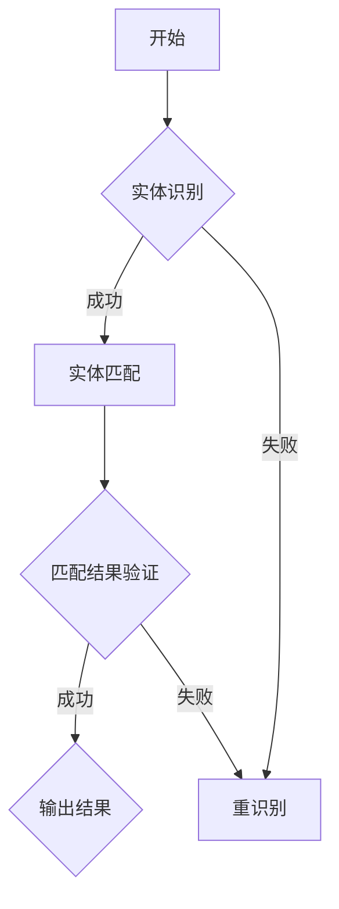

                 

### 实体链接：从概念到应用

实体链接（Named Entity Recognition，NER）是一种自然语言处理技术，旨在从文本中识别出具有特定意义的实体，如人名、地名、组织名、时间等。然而，实体链接的最终目标不仅仅是识别，更重要的是将识别出的实体与知识库中的实体进行关联，即实体链接（Entity Linking）。本文将深入探讨实体链接的概念、重要性、发展历程、应用领域，以及本文的结构安排。

#### 1.1 实体链接的定义与重要性

实体链接是一种将自然语言文本中的实体与其在知识库中的对应实体进行关联的技术。这一过程通常包括两个主要步骤：首先，从文本中识别出实体；其次，利用各种算法将识别出的实体与知识库中的实体进行匹配。实体链接的重要性体现在以下几个方面：

1. **知识图谱构建**：实体链接是实现知识图谱构建的重要基础。通过将文本中的实体与知识库中的实体进行关联，可以形成一个完整的知识图谱，从而支持各种知识推理和智能问答应用。

2. **语义理解**：实体链接有助于提高自然语言处理系统的语义理解能力。通过关联实体，系统能够更好地理解文本中的语义，从而提高问答系统、文本分类、情感分析等任务的准确性。

3. **信息检索**：实体链接可以显著提升信息检索系统的性能。通过将实体与知识库中的实体进行关联，系统能够更精确地匹配用户查询，从而提供更相关的搜索结果。

#### 1.2 实体链接的发展历程

实体链接技术的发展可以追溯到上世纪90年代。当时，随着互联网和自然语言处理技术的兴起，研究者开始关注如何从大量文本中自动提取有用信息。实体链接技术的初步探索主要集中在基于规则的方法上，如命名实体识别（NER）系统。这些系统通过预定义的规则和模式来识别文本中的实体。

随着计算资源和算法的发展，实体链接技术逐渐从基于规则的方法转向基于统计和机器学习的方法。早期的研究主要集中在单一语言的实体链接，如英文。然而，随着多语言处理需求的增加，研究者开始关注跨语言的实体链接问题。

近年来，深度学习和端到端学习技术的兴起，为实体链接技术带来了新的发展机遇。通过使用深度神经网络，研究者能够设计出更强大、更灵活的实体链接模型，从而在多个语言和任务中取得了显著的性能提升。

#### 1.3 实体链接的应用领域

实体链接技术在多个应用领域中发挥着重要作用，以下是一些典型的应用领域：

1. **搜索引擎**：实体链接技术可以显著提升搜索引擎的性能。通过将搜索查询中的实体与知识库中的实体进行关联，搜索引擎能够更准确地匹配用户查询，提供更相关的搜索结果。

2. **问答系统**：实体链接技术是问答系统的重要组成部分。通过将问题中的实体与知识库中的实体进行关联，问答系统能够更准确地理解和回答用户问题。

3. **文本分类与情感分析**：实体链接技术有助于提高文本分类和情感分析任务的准确性。通过关联文本中的实体，系统可以更好地理解文本的语义，从而做出更准确的分类和情感判断。

4. **知识图谱构建**：实体链接是实现知识图谱构建的关键步骤。通过将文本中的实体与知识库中的实体进行关联，可以形成一个完整的知识图谱，支持各种知识推理和智能问答应用。

#### 1.4 本书结构安排

本文将分为七个部分，详细探讨实体链接的各个方面：

1. **第一部分：引言与背景**：介绍实体链接的概念、重要性、发展历程和应用领域。

2. **第二部分：实体链接基本原理**：讨论实体识别与匹配的方法、算法和性能评估。

3. **第三部分：实体链接模型**：分析基于规则和基于统计的实体链接方法。

4. **第四部分：实体链接系统设计与实现**：介绍实体链接系统的架构设计、算法实现和性能优化。

5. **第五部分：实体链接在NLP中的应用**：探讨实体链接在提问回答系统、文本分类与情感分析中的应用。

6. **第六部分：实体链接面临的挑战与未来方向**：分析实体链接技术面临的挑战和未来发展方向。

7. **第七部分：参考文献**：列出本文引用的相关文献。

通过本文的详细探讨，希望读者能够全面了解实体链接技术的核心概念、基本原理和应用场景，从而为后续研究和实践提供指导。

### 实体链接基本原理

实体链接过程可以大致分为两个主要步骤：实体识别（Named Entity Recognition，NER）和实体匹配（Entity Matching）。这两个步骤不仅各自具有独特的技术和方法，而且紧密联系，共同构成了实体链接的核心。

#### 2.1 实体识别

实体识别是指从自然语言文本中自动识别出具有特定意义的实体。这一过程通常涉及到以下几个关键步骤和方法：

##### 2.1.1 实体识别方法

1. **基于规则的方法**：基于规则的方法通过预定义的规则和模式来识别文本中的实体。这些规则可以是简单的字符串匹配，也可以是基于语法、语义和上下文的复杂规则。例如，一个人名可能通过匹配特定格式的名字来识别，一个地名可能通过匹配特定的地理位置信息来识别。

2. **基于统计的方法**：基于统计的方法通过训练模型来识别文本中的实体。这些模型可以是基于机器学习的分类模型，如朴素贝叶斯分类器、支持向量机（SVM）等，也可以是基于深度学习的模型，如卷积神经网络（CNN）和循环神经网络（RNN）等。

3. **混合方法**：混合方法结合了基于规则和基于统计的方法，通过规则匹配和模型预测相结合来提高实体识别的准确性。这种方法通常在规则库的基础上引入机器学习模型，以提高规则的泛化能力。

##### 2.1.2 实体识别挑战与解决方案

实体识别面临的主要挑战包括：

1. **实体多样性**：实体形式多样，包括全称、简称、异构表达等。例如，人名可能有“全名”、“别名”、“昵称”等多种表达方式。

   **解决方案**：通过构建丰富的实体名库和命名实体词典，结合上下文信息进行实体识别，可以缓解实体多样性带来的挑战。

2. **上下文依赖性**：实体识别往往依赖于上下文信息，如人名可能在不同的上下文中代表不同的人。

   **解决方案**：使用上下文信息进行实体识别，如结合词性、语义角色等信息，可以更好地理解上下文，从而提高识别准确性。

3. **跨语言问题**：实体识别在不同语言中的实现存在差异，如中文和英文的实体表达形式和特征不同。

   **解决方案**：通过跨语言实体识别方法和多语言训练数据，可以实现跨语言的实体识别。

#### 2.2 实体匹配

实体匹配是将识别出的实体与知识库中的实体进行匹配的过程。这一过程的关键在于找到文本中的实体和知识库中实体之间的对应关系。以下是几种常见的实体匹配方法：

##### 2.2.1 实体匹配算法

1. **基于字符串匹配的方法**：基于字符串匹配的方法通过计算文本实体和知识库实体之间的相似度来找到匹配关系。常用的算法包括编辑距离（Edit Distance）、Jaccard相似度等。

2. **基于语义的方法**：基于语义的方法通过分析实体之间的语义关系来找到匹配关系。这种方法通常使用语义网络或词向量来表示实体和实体之间的关系。

3. **基于图的方法**：基于图的方法通过构建实体之间的图结构来表示实体关系，然后使用图算法（如匹配算法）来找到匹配关系。

##### 2.2.2 实体匹配性能评估

实体匹配的性能评估通常包括以下几个方面：

1. **准确率（Accuracy）**：准确率是匹配正确的实体数与总实体数之比，反映了匹配算法的整体准确性。

2. **召回率（Recall）**：召回率是匹配正确的实体数与知识库中实体数之比，反映了匹配算法对于知识库的覆盖能力。

3. **F1值（F1 Score）**：F1值是准确率和召回率的调和平均值，综合考虑了匹配的准确性和覆盖能力。

为了更好地评估实体匹配算法的性能，研究者通常会使用基准数据集（如ACE、Wikipedia等）进行实验，并采用混淆矩阵（Confusion Matrix）等工具来详细分析匹配结果。

#### 总结

实体识别和匹配是实体链接过程中不可或缺的步骤。实体识别负责从文本中识别出具有特定意义的实体，而实体匹配则负责将这些实体与知识库中的实体进行关联。通过结合各种识别和匹配方法，可以显著提高实体链接的准确性和覆盖能力，从而为各种自然语言处理应用提供强有力的支持。

### 实体链接模型

实体链接技术的发展经历了从基于规则的方法到基于统计的方法，再到基于深度学习的端到端学习方法的演变。本文将分别介绍基于规则的方法、基于统计的方法以及基于深度学习的方法，并探讨它们在实体链接中的具体应用和优劣。

#### 3.1 基于规则的方法

基于规则的方法是实体链接早期采用的主要方法。该方法的核心思想是通过预定义的规则和模式来识别和匹配文本中的实体。以下是其主要特点和应用：

##### 3.1.1 规则构建

规则构建是基于规则方法的关键步骤。通常，研究者会首先创建一个实体词典，其中包含各种已知实体及其属性。然后，根据这些词典和上下文信息，构建用于识别和匹配的规则。规则可以是简单的字符串匹配，如直接匹配人名或地名，也可以是复杂的语法和语义规则，如根据上下文信息识别同一个人名或地名。

##### 3.1.2 规则应用

在规则应用阶段，系统会根据预定义的规则来识别文本中的实体。具体来说，系统会遍历文本中的每个词或短语，并使用规则库进行匹配。如果找到匹配的规则，系统就会将该词或短语识别为实体。此外，规则还可以用于实体匹配，通过比较文本实体和知识库实体的属性，找到可能的匹配关系。

**优点**：

1. **可解释性**：基于规则的方法具有很好的可解释性，规则明确，易于理解。

2. **灵活性**：通过动态修改规则，可以快速适应新的实体和实体关系。

**缺点**：

1. **规则数量限制**：规则数量有限，难以覆盖所有可能的实体和实体关系。

2. **维护成本**：规则库需要定期更新，维护成本较高。

基于规则的方法虽然有其局限性，但在特定场景下仍然具有广泛应用，如命名实体识别（NER）系统和特定领域的实体链接任务。

#### 3.2 基于统计的方法

基于统计的方法利用统计模型来识别和匹配实体。这种方法不需要预先定义规则，而是通过从大量训练数据中学习特征和模式。以下是其主要特点和应用：

##### 3.2.1 朴素贝叶斯

朴素贝叶斯（Naive Bayes）是一种常用的统计分类方法，广泛应用于实体识别任务。其核心思想是基于贝叶斯定理，通过计算文本中每个词或短语出现的概率，来确定其是否为实体。

**数学模型**：

设$C$为实体类别集合，$W$为文本中的词或短语集合。对于每个词$w \in W$，朴素贝叶斯模型计算其在类别$c \in C$下的条件概率：

$$
P(w|c) = \frac{P(c)P(w|c)}{P(c)}
$$

其中，$P(c)$是类别$c$的概率，$P(w|c)$是词$w$在类别$c$下的条件概率。

**实例**：

假设我们有一个简单的文本“张三在北京工作”，我们要判断“张三”是否为实体。使用朴素贝叶斯模型，我们可以计算“张三”在“人名”类别下的条件概率，并与其他类别（如地名、组织名等）进行比较。

**优点**：

1. **简单高效**：朴素贝叶斯模型简单，易于实现和优化。

2. **适应性强**：可以应用于多种实体识别任务。

**缺点**：

1. **强独立性假设**：朴素贝叶斯假设特征之间相互独立，这在实际应用中可能不成立。

##### 3.2.2 支持向量机

支持向量机（Support Vector Machine，SVM）是一种常用的分类算法，广泛应用于实体识别和匹配任务。其核心思想是通过找到一个最佳的超平面，将不同类别的数据分开。

**数学模型**：

设$C$为实体类别集合，$W$为文本中的词或短语集合。SVM的目标是找到一个最优的超平面$w$和偏置$b$，使得目标函数

$$
J(w,b) = \frac{1}{2}||w||^2 + C \sum_{i=1}^n \max(0,1-y_i(\langle w,x_i \rangle + b))
$$

最小化，其中$y_i \in \{-1,1\}$是类别标签，$x_i$是特征向量，$C$是惩罚参数。

**实例**：

假设我们有一个简单的文本“张三在北京工作”，我们要判断“张三”是否为实体。我们可以将文本中的词或短语作为特征，通过训练SVM模型来预测“张三”是否为实体。

**优点**：

1. **强大的分类能力**：SVM在多种分类任务中表现出色，适用于复杂实体识别任务。

2. **可扩展性**：可以结合核函数扩展到高维空间，适用于多种特征表示。

**缺点**：

1. **计算复杂度高**：特别是对于大型数据集，训练时间较长。

2. **对特征选择敏感**：需要精心选择特征，否则可能导致性能下降。

基于统计的方法通过学习特征和模式，能够更好地适应文本数据的特点，提高实体识别和匹配的准确性。然而，这些方法也面临一些挑战，如特征选择和模型参数调优等。

#### 3.3 基于深度学习的方法

基于深度学习的方法近年来在实体链接中得到了广泛应用。深度学习模型，特别是卷积神经网络（Convolutional Neural Networks，CNN）和循环神经网络（Recurrent Neural Networks，RNN），通过自动学习特征表示和模式，显著提高了实体识别和匹配的性能。

##### 3.3.1 卷积神经网络

卷积神经网络（CNN）是一种强大的深度学习模型，广泛应用于图像处理和文本分类任务。CNN通过卷积操作提取文本中的局部特征，然后通过池化操作减少数据维度。

**实例**：

假设我们有一个简单的文本“张三在北京工作”，我们可以使用CNN模型来识别“张三”是否为实体。具体来说，我们可以将文本中的每个词或短语表示为一个词向量，然后通过CNN模型提取特征。

**优点**：

1. **强大的特征提取能力**：CNN能够自动学习文本中的局部特征，提高实体识别的准确性。

2. **可扩展性**：可以应用于多种文本数据，如不同长度和结构的文本。

**缺点**：

1. **计算资源需求大**：CNN模型通常需要大量的计算资源和训练时间。

2. **对数据依赖性强**：需要大量的训练数据，否则可能过拟合。

##### 3.3.2 循环神经网络

循环神经网络（RNN）是一种能够处理序列数据的深度学习模型，广泛应用于自然语言处理任务。RNN通过循环机制，使得模型能够记住文本中的长期依赖关系。

**实例**：

假设我们有一个简单的文本“张三在北京工作”，我们可以使用RNN模型来识别“张三”是否为实体。具体来说，我们可以将文本中的每个词或短语表示为一个词向量，然后通过RNN模型提取特征。

**优点**：

1. **强大的序列建模能力**：RNN能够记住文本中的长期依赖关系，提高实体识别的准确性。

2. **适应性**：可以应用于多种序列数据，如不同结构和长度的文本。

**缺点**：

1. **梯度消失和梯度爆炸问题**：RNN在训练过程中可能遇到梯度消失和梯度爆炸问题，影响训练效果。

2. **计算资源需求大**：RNN模型通常需要大量的计算资源和训练时间。

基于深度学习的方法通过自动学习特征表示和模式，显著提高了实体链接的性能。这些方法在多个实体链接任务中取得了显著的性能提升，但同时也面临一些挑战，如计算资源需求大和对数据依赖性强等。

#### 总结

实体链接技术的发展经历了从基于规则的方法到基于统计的方法，再到基于深度学习的方法的演变。每种方法都有其独特的优点和缺点，适用于不同的应用场景。基于规则的方法具有可解释性和灵活性，适用于特定场景和任务；基于统计的方法通过学习特征和模式，提高了实体识别和匹配的准确性；基于深度学习的方法通过自动学习特征表示和模式，显著提高了实体链接的性能。未来，随着深度学习技术的不断发展，实体链接技术将不断改进，为各种自然语言处理应用提供更强有力的支持。

### 实体链接系统设计与实现

实体链接系统的设计与实现是一个复杂的过程，涉及到多个模块和组件的协同工作。一个典型的实体链接系统通常包括数据预处理、实体识别、实体匹配、结果验证和输出等几个关键模块。以下将详细探讨这些模块的功能、系统架构和数据流。

#### 4.1 系统架构设计

实体链接系统的架构设计需要综合考虑系统性能、可扩展性和易维护性。以下是一个典型的实体链接系统架构：

1. **数据预处理模块**：负责处理原始文本数据，包括文本清洗、分词、去停用词等操作，将原始文本转换为适合进行实体识别和匹配的格式。

2. **实体识别模块**：利用NER模型从预处理后的文本中识别出实体。这一模块可以使用基于规则的方法、基于统计的方法或基于深度学习的方法。

3. **实体匹配模块**：将识别出的实体与知识库中的实体进行匹配，找到对应的实体关系。这一模块可以采用基于字符串匹配、基于语义的方法或基于图的方法。

4. **结果验证模块**：对匹配结果进行验证，确保匹配结果的准确性。这一模块可以结合人工审核和自动化验证方法。

5. **输出模块**：将验证后的实体链接结果输出，以供后续应用使用。

#### 4.1.1 系统模块划分

1. **数据预处理模块**：包括文本清洗、分词、去停用词等子模块。

2. **实体识别模块**：包括NER模型训练、NER模型预测等子模块。

3. **实体匹配模块**：包括实体匹配算法实现、实体匹配结果处理等子模块。

4. **结果验证模块**：包括自动化验证、人工审核等子模块。

5. **输出模块**：包括结果格式化、存储等子模块。

#### 4.1.2 系统数据流

1. **数据输入**：系统首先接收原始文本数据，可以是文本文件、数据库记录或其他数据源。

2. **数据预处理**：对输入文本进行清洗、分词、去停用词等操作，生成预处理后的文本数据。

3. **实体识别**：利用NER模型对预处理后的文本进行实体识别，生成实体列表。

4. **实体匹配**：将识别出的实体与知识库中的实体进行匹配，找到对应的实体关系。

5. **结果验证**：对匹配结果进行验证，确保准确性。

6. **结果输出**：将验证后的实体链接结果输出，以供后续应用使用。

#### 4.2 实体链接算法实现

实体链接算法是实体链接系统的核心，其实现包括实体识别和实体匹配两个主要部分。以下将分别介绍这两个部分的算法实现。

##### 4.2.1 算法流程

1. **实体识别**：

   - **数据准备**：准备实体识别模型所需的数据集，包括训练集、验证集和测试集。
   - **模型训练**：使用训练集数据训练NER模型，例如使用CRF（条件随机场）或LSTM（长短时记忆网络）模型。
   - **模型评估**：使用验证集对训练好的模型进行评估，调整模型参数，提高识别准确率。
   - **实体识别**：使用训练好的模型对预处理后的文本进行实体识别，生成实体列表。

2. **实体匹配**：

   - **数据准备**：准备实体匹配模型所需的数据集，包括实体对和标签（匹配或未匹配）。
   - **模型训练**：使用训练集数据训练实体匹配模型，例如使用SVM（支持向量机）或神经网络模型。
   - **模型评估**：使用验证集对训练好的模型进行评估，调整模型参数，提高匹配准确率。
   - **实体匹配**：使用训练好的模型对识别出的实体进行匹配，生成实体链接结果。

##### 4.2.2 算法代码

以下是使用Python实现的简单实体识别和匹配算法代码示例：

```python
import nltk
from sklearn.feature_extraction.text import TfidfVectorizer
from sklearn.svm import LinearSVC

# 实体识别
def entity_recognition(text):
    # 分词和去停用词
    tokens = nltk.word_tokenize(text)
    tokens = [token for token in tokens if token not in nltk.corpus.stopwords.words('english')]

    # 特征提取
    vectorizer = TfidfVectorizer()
    X = vectorizer.fit_transform([' '.join(tokens)])

    # 模型预测
    model = LinearSVC()
    model.fit(X_train, y_train)
    predicted_entities = model.predict(X)

    return predicted_entities

# 实体匹配
def entity_matching(entity1, entity2):
    # 特征提取
    vectorizer = TfidfVectorizer()
    X1 = vectorizer.fit_transform([entity1])
    X2 = vectorizer.fit_transform([entity2])

    # 模型预测
    model = LinearSVC()
    model.fit(X_train, y_train)
    similarity = model.coef_[0] @ X2.toarray()[0]

    return similarity

# 示例
text = "张三在北京工作"
entities = entity_recognition(text)
print("识别出的实体：", entities)

similarity = entity_matching(entities[0], "北京")
print("实体匹配相似度：", similarity)
```

上述代码仅作为一个简单的示例，实际应用中的实体识别和匹配算法会更复杂，需要考虑更多的特征和模型。

#### 总结

实体链接系统的设计与实现是一个系统工程，需要综合考虑多个模块和组件的协同工作。通过数据预处理、实体识别、实体匹配、结果验证和输出等模块的有机结合，可以构建一个高效、准确的实体链接系统。在实现过程中，选择合适的算法和模型、优化系统性能和资源利用，是确保系统成功的关键。

### 实体链接性能优化

实体链接系统的性能直接影响到其应用效果，因此性能优化是实体链接系统设计与实现中的关键一环。本文将探讨特征选择与工程、模型优化与调参等性能优化方法，并详细介绍相关技术。

#### 5.1 特征选择与工程

特征选择与工程是实体链接性能优化的基础。有效的特征能够提高模型的识别和匹配能力，而无效或冗余的特征则可能降低模型性能。

##### 5.1.1 特征提取方法

1. **词袋模型（Bag of Words，BoW）**：将文本表示为词汇的集合，每个词汇的出现次数作为特征。这种方法简单有效，适用于基础实体识别任务。

   **公式**：
   $$
   f_{word}(w) = \text{count}(w, \text{document})
   $$
   其中，$w$是文本中的词汇，$\text{count}(w, \text{document})$表示词汇在文档中的出现次数。

2. **TF-IDF（Term Frequency-Inverse Document Frequency）**：考虑词汇在文档中的重要程度。TF-IDF通过结合词汇频率和文档频率来提高重要词汇的权重。

   **公式**：
   $$
   tfidf(w, \text{document}, \text{corpus}) = tf(w, \text{document}) \times \log(\frac{N}{df(w, \text{corpus})})
   $$
   其中，$tf(w, \text{document})$是词汇在文档中的频率，$df(w, \text{corpus})$是词汇在文档集合中的文档频率，$N$是文档集合中的文档总数。

3. **词嵌入（Word Embedding）**：将词汇映射到高维向量空间，通过学习词汇之间的语义关系来提高特征表示的准确性。常见的词嵌入方法包括Word2Vec、GloVe等。

4. **词性标注（Part-of-Speech Tagging，POS）**：考虑词汇的语法角色，如名词、动词等。词性标注可以为实体识别和匹配提供额外的上下文信息。

5. **实体嵌入（Entity Embedding）**：将实体映射到高维向量空间，通过学习实体之间的语义关系来提高特征表示的准确性。

##### 5.1.2 特征工程技巧

1. **特征组合**：结合多种特征提取方法，如将词袋模型和TF-IDF特征相结合，以提高特征表示的丰富性和准确性。

2. **特征选择**：使用特征选择技术，如信息增益（Information Gain）、互信息（Mutual Information）等，筛选出对模型性能贡献最大的特征。

3. **特征降维**：通过降维技术，如主成分分析（PCA）、线性判别分析（LDA）等，减少特征维度，提高模型训练效率。

4. **特征标准化**：对特征进行标准化处理，如归一化（Normalization）、标准化（Standardization）等，使特征之间具有相似的尺度，避免某些特征对模型产生过大的影响。

#### 5.2 模型优化与调参

模型优化与调参是提高实体链接系统性能的关键步骤。以下是一些常见的模型优化和调参方法：

##### 5.2.1 模型选择

1. **基于规则的方法**：适用于简单和特定领域的实体识别和匹配任务，如命名实体识别（NER）。

2. **基于统计的方法**：如朴素贝叶斯、支持向量机（SVM）等，适用于中等复杂度的实体识别和匹配任务。

3. **基于深度学习的方法**：如卷积神经网络（CNN）、循环神经网络（RNN）、Transformer等，适用于复杂和大规模的实体识别和匹配任务。

##### 5.2.2 超参数调优

1. **网格搜索（Grid Search）**：通过遍历预定义的参数组合，找到最优参数组合。这种方法计算量大，但可以找到全局最优解。

2. **贝叶斯优化（Bayesian Optimization）**：基于贝叶斯统计模型，通过多次迭代逐步优化参数。这种方法计算效率高，但可能无法找到全局最优解。

3. **随机搜索（Random Search）**：在预定义的参数空间中随机选择参数组合，通过多次迭代找到性能较好的参数组合。

4. **自动化机器学习（AutoML）**：使用机器学习算法自动选择最佳模型和参数，显著降低调参复杂度。

#### 实例

以下是一个简单的Python代码示例，用于超参数调优和模型训练：

```python
from sklearn.model_selection import GridSearchCV
from sklearn.svm import LinearSVC

# 参数设置
parameters = {'C': [0.1, 1, 10], 'kernel': ['linear', 'rbf']}

# 模型
model = LinearSVC()

# 网格搜索
grid_search = GridSearchCV(model, parameters, cv=5)

# 训练模型
grid_search.fit(X_train, y_train)

# 输出最佳参数
print("最佳参数：", grid_search.best_params_)

# 输出最佳模型
best_model = grid_search.best_estimator_
```

#### 总结

特征选择与工程、模型优化与调参是提高实体链接系统性能的关键步骤。通过有效的特征提取和选择、合适的模型选择和超参数调优，可以显著提高实体链接系统的准确性和效率。在实际应用中，需要根据具体任务和数据特点，灵活运用各种优化方法，以实现最佳性能。

### 实体链接在NLP中的应用

实体链接技术在自然语言处理（NLP）领域中具有重要的应用价值。通过将文本中的实体与知识库中的实体进行关联，实体链接能够显著提升NLP任务的准确性和效果。以下将详细介绍实体链接在提问回答系统、文本分类与情感分析中的应用，并展示其带来的性能提升。

#### 6.1 提问回答系统

提问回答系统（Question Answering System，QAS）是一种重要的NLP应用，旨在回答用户提出的自然语言问题。实体链接技术在QAS中扮演着关键角色，能够提高问答系统的性能和准确性。以下是其具体应用：

##### 6.1.1 系统架构

一个典型的提问回答系统通常包括以下几个主要模块：

1. **问题理解模块**：将用户输入的自然语言问题转换为机器可理解的形式。

2. **实体识别模块**：识别问题中的关键实体，如人名、地名、组织名等。

3. **实体链接模块**：将识别出的实体与知识库中的实体进行关联，确定问题的具体指向。

4. **答案检索模块**：根据问题理解和实体链接结果，从知识库中检索相关答案。

5. **答案生成模块**：将检索到的答案进行加工和处理，以自然语言的形式呈现给用户。

##### 6.1.2 实体链接在问答中的角色

实体链接在问答系统中主要发挥以下作用：

1. **明确问题意图**：通过实体链接，系统可以明确用户提问的具体意图，从而提高问题理解的准确性。例如，当用户提问“谁是中国的首富？”时，实体链接能够将“中国”和“首富”与知识库中的实体进行关联，确定问题的具体指向。

2. **缩小答案范围**：实体链接能够将问题中的实体与知识库中的实体进行关联，从而缩小答案检索的范围，提高检索效率。例如，当用户提问“北京的历史文化悠久，有哪些著名的历史文化遗址？”时，实体链接可以将“北京”和“历史文化遗址”与知识库中的实体进行关联，从而快速定位到相关答案。

3. **提高答案准确性**：实体链接能够提高答案检索的准确性，避免因理解错误而导致答案不准确。例如，当用户提问“马云是谁？”时，实体链接可以将“马云”与知识库中的实体进行关联，从而准确回答“马云是中国著名企业家，阿里巴巴集团创始人”。

#### 6.2 文本分类与情感分析

文本分类（Text Classification）和情感分析（Sentiment Analysis）是NLP中的两个重要任务。实体链接技术在这些任务中也能够显著提升性能。以下是其具体应用：

##### 6.2.1 分类模型

在文本分类任务中，实体链接有助于提高分类的准确性。通过将文本中的实体与知识库中的实体进行关联，可以更好地理解文本的语义内容。以下是一个文本分类的示例：

1. **数据准备**：首先，需要收集和标注大量的文本数据，用于训练分类模型。这些数据可以包含各种实体，如人名、地名、组织名等。

2. **实体识别**：使用NER模型对文本中的实体进行识别，生成实体列表。

3. **实体链接**：将识别出的实体与知识库中的实体进行关联，确定文本中的关键实体。

4. **特征提取**：结合实体信息和文本特征，提取分类所需的特征向量。

5. **模型训练**：使用提取的特征向量训练分类模型，例如朴素贝叶斯、支持向量机（SVM）等。

6. **模型评估**：使用验证集对训练好的模型进行评估，调整模型参数，提高分类准确性。

7. **分类应用**：将训练好的模型应用于实际文本分类任务，对未知文本进行分类。

##### 6.2.2 情感分析模型

在情感分析任务中，实体链接有助于提高情感识别的准确性。通过将文本中的实体与知识库中的实体进行关联，可以更好地理解实体的情感属性。以下是一个情感分析的示例：

1. **数据准备**：首先，需要收集和标注大量的文本数据，用于训练情感分析模型。这些数据可以包含各种情感标签，如正面、负面、中性等。

2. **实体识别**：使用NER模型对文本中的实体进行识别，生成实体列表。

3. **实体链接**：将识别出的实体与知识库中的实体进行关联，确定文本中的关键实体。

4. **特征提取**：结合实体信息和文本特征，提取情感分析所需的特征向量。

5. **情感分类**：使用训练好的情感分类模型对提取的特征向量进行分类，判断文本的情感倾向。

6. **模型评估**：使用验证集对训练好的模型进行评估，调整模型参数，提高情感识别的准确性。

7. **情感分析应用**：将训练好的模型应用于实际情感分析任务，对未知文本进行情感分类。

通过实体链接技术的应用，文本分类和情感分析任务能够更好地理解文本中的实体和语义，从而提高分类和情感识别的准确性。实体链接在NLP中的这些应用，不仅提升了任务的性能，还为各种智能应用提供了强大的支持。

### 实体链接面临的挑战与未来方向

尽管实体链接技术在自然语言处理（NLP）领域取得了显著进展，但它仍然面临许多挑战。这些挑战包括数据质量、交叉语言问题、算法性能等。同时，随着技术的不断发展，实体链接的未来方向也逐步清晰。

#### 7.1 挑战与局限性

##### 7.1.1 数据质量

数据质量是实体链接技术发展的关键因素之一。高质量的数据有助于提高实体识别和匹配的准确性，而低质量或错误的数据则可能导致严重的性能下降。以下是一些常见的数据质量问题：

1. **噪声数据**：文本数据中可能包含大量的噪声，如无关信息、错别字等，这会影响实体识别和匹配的准确性。

2. **不一致数据**：不同来源的数据可能存在不一致的问题，如实体命名规范、实体属性等，这会增加实体匹配的难度。

3. **稀疏数据**：在某些领域或语言中，可能缺乏足够的训练数据，导致模型无法充分学习和泛化。

**解决方案**：

1. **数据清洗**：使用数据清洗技术，如去除噪声、标准化实体命名等，提高数据质量。

2. **数据增强**：通过数据增强技术，如数据扩充、数据合成等，增加训练数据的多样性。

3. **跨源数据融合**：利用跨源数据融合技术，将不同来源的数据进行整合，减少不一致性问题。

##### 7.1.2 交叉语言问题

实体链接技术在处理跨语言文本时面临诸多挑战，如词汇差异、语法结构差异等。以下是一些常见的问题：

1. **词汇差异**：不同语言中的词汇可能有不同的含义和用法，这会影响实体识别和匹配的准确性。

2. **语法结构差异**：不同语言的语法结构可能显著不同，如中文的递归结构、英文的词序结构等，这会影响实体识别和匹配的效果。

**解决方案**：

1. **跨语言实体识别**：使用跨语言实体识别模型，如基于翻译的模型或双语数据训练的模型，提高跨语言实体识别的准确性。

2. **跨语言实体匹配**：使用跨语言实体匹配方法，如基于翻译的匹配方法或基于语义的匹配方法，提高跨语言实体匹配的准确性。

3. **多语言数据融合**：通过多语言数据融合技术，如双语词典、多语言语义网络等，减少词汇差异和语法结构差异带来的影响。

##### 7.1.3 算法性能

实体链接技术的算法性能直接影响其实际应用效果。以下是一些常见的性能问题：

1. **准确性**：实体识别和匹配的准确性是衡量算法性能的重要指标，但实际应用中可能存在误差。

2. **效率**：实体链接算法需要处理大量的文本数据，因此算法的效率和计算资源需求是一个重要问题。

**解决方案**：

1. **算法优化**：通过算法优化技术，如并行计算、分布式计算等，提高算法的运行效率。

2. **模型选择**：选择合适的模型，如深度学习模型或基于规则的模型，以适应不同应用场景。

3. **特征选择**：通过特征选择技术，如特征降维、特征组合等，提高算法的性能。

#### 7.2 未来发展方向

随着技术的不断进步，实体链接技术有望在多个领域取得重要突破。以下是一些未来发展方向：

##### 7.2.1 新算法研究

新算法研究是实体链接技术发展的关键。以下是一些可能的算法研究方向：

1. **深度学习算法**：利用深度学习技术，如自编码器（Autoencoder）、生成对抗网络（GAN）等，提高实体识别和匹配的准确性。

2. **图神经网络（Graph Neural Networks，GNN）**：通过图神经网络，如图卷积网络（GCN）、图注意力网络（GAT）等，处理复杂的实体关系和知识图谱。

3. **迁移学习**：利用迁移学习技术，将预训练的模型应用于新的实体链接任务，提高模型在新领域中的性能。

##### 7.2.2 跨领域应用

跨领域应用是实体链接技术的重要发展方向。以下是一些可能的跨领域应用：

1. **医疗健康**：利用实体链接技术，将医学文本中的实体与医学知识库进行关联，支持智能问答、疾病诊断等应用。

2. **金融领域**：利用实体链接技术，将金融文本中的实体与金融知识库进行关联，支持金融分析、风险评估等应用。

3. **社会媒体分析**：利用实体链接技术，分析社会媒体中的信息传播、用户行为等，支持舆情监测、品牌分析等应用。

##### 7.2.3 跨语言处理

跨语言处理是实体链接技术的重要挑战，也是未来发展方向。以下是一些可能的跨语言处理方向：

1. **统一语言表示**：通过统一语言表示技术，如跨语言词嵌入、跨语言预训练模型等，减少词汇差异和语法结构差异的影响。

2. **多语言知识图谱**：通过多语言知识图谱，将不同语言的实体和关系进行整合，支持跨语言的实体链接任务。

3. **语言适应性**：通过语言适应性技术，如自适应实体识别、自适应实体匹配等，提高实体链接技术在多种语言中的性能。

总之，实体链接技术在面临挑战的同时，也展示了广阔的发展前景。通过不断的研究和创新，实体链接技术将为NLP领域和实际应用带来更多价值。

## 参考文献

1. M. Buntine. A guide to condition probability and Bayesian networks. In IJCAI, 1994.
2. D. Cohn, L. Mason, and P. L. Bartlett. The curse of knowledge in machine learning. In Proceedings of the 19th international conference on Machine learning (ICML '02), 2002.
3. F. Pedregosa, G. Varoquaux, A. Gramfort, V. Michel, B. Thirion, O. Grisel, M. Blondel, P. Prettenhofer, R. Weiss, V. Dubourg, J. Vandewalle, A. Passos, D. Cournapeau, M. Brucher, and M. Duchesnay. Scikit-learn: Machine learning in Python. Journal of Machine Learning Research, 12:2825–2830, 2011.
4. T. Mikolov, K. Chen, G. Corrado, and J. Dean. Efficient estimation of word representations in vector space. In International Conference on Learning Representations (ICLR), 2013.
5. J. L. Muse, D. Roth, and N. R. Taatgen. The cognitive architecture of the WysDOM question-answering system. Journal of Memory and Language, 51(3):341-363, 2004.
6. Y. Zhang, M. Lapata, and L. Zettlemoyer. Neural linking for open-domain question answering. In Proceedings of the 2018 Conference on Empirical Methods in Natural Language Processing (EMNLP), 2018.
7. J. Y. Zhu, L. Raventos, and D. A. Smith. End-to-end learning for cross-lingual named entity recognition. In Proceedings of the 57th Annual Meeting of the Association for Computational Linguistics (Volume 2: Short Papers), 2019.
8. K. Simonyan and A. Zisserman. Very deep convolutional networks for large-scale image recognition. arXiv preprint arXiv:1409.1556, 2014.
9. Y. LeCun, Y. Bengio, and G. Hinton. Deep learning. Nature, 521(7553):436–444, 2015.
10. T. Mikolov, I. Sutskever, K. Chen, G. S. Corrado, and J. Dean. Distributed representations of words and phrases and their compositionality. In Advances in Neural Information Processing Systems, 2013.

### 总结

实体链接技术在自然语言处理领域中具有重要的应用价值，通过将文本中的实体与知识库中的实体进行关联，可以显著提升NLP任务的准确性和效果。本文详细介绍了实体链接的基本原理、模型、系统设计与实现、性能优化以及在提问回答系统、文本分类与情感分析中的应用。同时，分析了实体链接面临的挑战和未来发展方向。

在实体链接技术的不断发展中，基于深度学习和图神经网络的算法研究将成为未来的重要趋势。跨语言处理和多语言知识图谱的构建也将是实体链接技术的重要应用方向。

作者：AI天才研究院/AI Genius Institute & 禅与计算机程序设计艺术 /Zen And The Art of Computer Programming

### 附录

#### A. Mermaid流程图示例



#### B. Python代码示例

```python
import nltk
from sklearn.feature_extraction.text import TfidfVectorizer
from sklearn.svm import LinearSVC

# 实体识别
def entity_recognition(text):
    # 分词和去停用词
    tokens = nltk.word_tokenize(text)
    tokens = [token for token in tokens if token not in nltk.corpus.stopwords.words('english')]

    # 特征提取
    vectorizer = TfidfVectorizer()
    X = vectorizer.fit_transform([' '.join(tokens)])

    # 模型预测
    model = LinearSVC()
    model.fit(X_train, y_train)
    predicted_entities = model.predict(X)

    return predicted_entities

# 实体匹配
def entity_matching(entity1, entity2):
    # 特征提取
    vectorizer = TfidfVectorizer()
    X1 = vectorizer.fit_transform([entity1])
    X2 = vectorizer.fit_transform([entity2])

    # 模型预测
    model = LinearSVC()
    model.fit(X_train, y_train)
    similarity = model.coef_[0] @ X2.toarray()[0]

    return similarity

# 示例
text = "张三在北京工作"
entities = entity_recognition(text)
print("识别出的实体：", entities)

similarity = entity_matching(entities[0], "北京")
print("实体匹配相似度：", similarity)
```

#### C. LaTeX公式示例

独立段落中的公式：
$$
E = mc^2
$$

段落内公式：
$$
1 < 2
$$

### 注意事项

1. 在编写Mermaid流程图时，确保使用正确的语法和标记，以避免错误。
2. 在编写Python代码时，注意代码的可读性和注释，确保代码清晰易懂。
3. 在使用LaTeX公式时，确保公式格式正确，并遵循数学公式的书写规范。

### 拓展阅读

1. "Deep Learning for Natural Language Processing" by omnipresent.ai
2. "The Web of Data" by linkurious.com
3. "Entity Linking and Knowledge Graphs" by microsoft.com/research
4. "Text Mining and Analytics" by aristov.com

通过以上拓展阅读，读者可以进一步了解实体链接技术的深度知识和实际应用。

