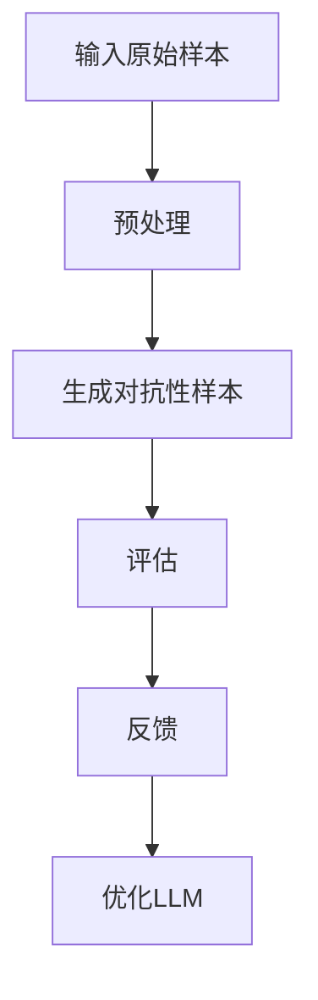
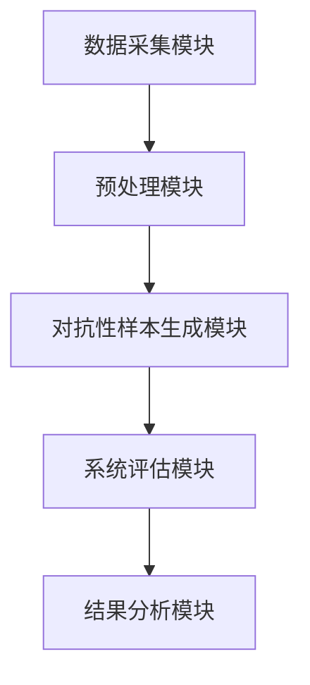
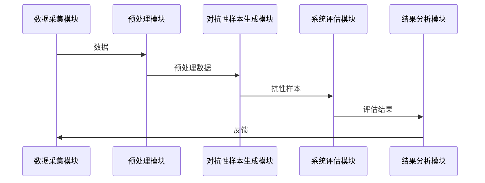

                 

## 文章标题

### 关键词

- 实时对抗评测
- 大型语言模型（LLM）
- 动态挑战任务
- 人工智能
- 安全性评估

### 摘要

本文旨在探讨实时对抗评测中，如何利用大型语言模型（LLM）生成动态挑战任务。文章首先介绍了实时对抗评测的背景和基本概念，然后深入解析了LLM的工作原理和生成动态挑战任务的方法。通过具体的算法流程、Python源代码和数学模型，我们揭示了动态挑战任务生成的技术细节。此外，文章还详细介绍了系统分析与架构设计，并通过项目实战展示了整个流程的应用。最后，文章提供了最佳实践、注意事项和拓展阅读建议，以帮助读者深入理解和应用相关技术。

## 第1章：实时对抗评测概述

### 1.1.1 问题背景与定义

实时对抗评测（Real-time Adversarial Evaluation）是一种评估系统在面对对抗性攻击时的安全性能的方法。随着人工智能技术的飞速发展，深度学习模型在图像识别、自然语言处理等领域取得了显著的成果。然而，这些模型对对抗性攻击的脆弱性也引发了广泛关注。对抗性攻击（Adversarial Attack）是指通过微小、不可见的扰动对模型输入进行篡改，从而使其产生错误预测或行为。这些攻击可能对自动驾驶、金融交易、医疗诊断等关键领域造成严重后果。

实时对抗评测的核心问题是：如何在实际应用场景中，对系统进行快速、有效的安全评估，以发现潜在的漏洞和弱点。与传统离线评估方法不同，实时对抗评测强调在系统运行过程中，对攻击进行动态响应和调整，以提高评估的准确性和实时性。

定义：实时对抗评测是指一种针对深度学习模型的安全评估方法，通过动态生成对抗性样本，评估模型在实时场景下的抗攻击能力。动态挑战任务（Dynamic Challenge Task）是实时对抗评测中的一项核心任务，它是指利用大型语言模型（LLM）等工具，实时生成具有挑战性的对抗性样本，以测试系统的安全性能。

### 1.1.2 核心概念联系

为了更好地理解实时对抗评测，我们需要了解几个核心概念：对抗性攻击、安全性评估和动态挑战任务。

**对抗性攻击**：对抗性攻击是指通过微小的扰动对模型输入进行篡改，从而使其产生错误预测或行为。这些扰动通常是人眼无法察觉的，但会对模型的输出产生显著影响。

**安全性评估**：安全性评估是指对系统、模型或软件的安全性进行评估的过程。实时对抗评测是安全性评估的一种方法，它通过对抗性攻击来评估系统的抗攻击能力。

**动态挑战任务**：动态挑战任务是实时对抗评测中的一项核心任务，它是指利用LLM等工具，实时生成具有挑战性的对抗性样本，以测试系统的安全性能。动态挑战任务的关键在于其实时性和动态性，可以模拟实际攻击场景，提高评估的准确性。

### 1.1.3 问题解决与边界与外延

实时对抗评测的目的是发现系统的潜在漏洞和弱点，从而提高其安全性。然而，在实际应用中，我们还需要关注以下问题：

- **实时性**：实时对抗评测要求在系统运行过程中进行，这涉及到评估速度和实时性的平衡。
- **准确性**：生成的对抗性样本需要具有代表性，能够真实反映系统的安全性能。
- **动态性**：动态挑战任务需要根据系统运行状态和攻击场景进行实时调整，以提高评估的准确性。

边界与外延：

- **边界**：实时对抗评测主要应用于深度学习模型，特别是那些在图像识别、自然语言处理等领域有广泛应用场景的模型。
- **外延**：实时对抗评测不仅可以应用于人工智能领域，还可以扩展到其他领域，如网络安全、自动驾驶等。

### 1.1.4 概念结构与核心要素组成

实时对抗评测的概念结构包括以下几个核心要素：

- **系统模型**：深度学习模型，如卷积神经网络（CNN）、循环神经网络（RNN）等。
- **对抗性攻击方法**：生成对抗网络（GAN）、迁移学习、基于梯度的攻击方法等。
- **评估指标**：准确率、召回率、F1分数等。
- **动态挑战任务**：利用LLM等工具生成具有挑战性的对抗性样本。
- **实时性**：在系统运行过程中进行评估，提高评估的准确性。

通过以上要素的组合，实时对抗评测可以实现对系统安全性能的全面评估，为系统的安全性提供有力保障。

## 第2章：LLM基本原理

### 2.1.1 LLM概述

#### 2.1.1.1 定义

大型语言模型（Large Language Model，简称LLM）是一种基于深度学习技术构建的神经网络模型，用于处理和生成自然语言文本。与传统的自然语言处理方法相比，LLM具有更强的语义理解和生成能力，能够处理复杂的语言现象和上下文关系。

#### 2.1.1.2 结构

LLM通常由多个层次组成，包括输入层、隐藏层和输出层。输入层接收自然语言文本，通过隐藏层进行特征提取和语义理解，最终在输出层生成相应的文本响应。

#### 2.1.1.3 训练与优化

LLM的训练过程通常涉及大规模的文本数据集，通过递归神经网络（RNN）或 Transformer 等架构进行训练。在训练过程中，模型会不断调整权重参数，以最小化预测误差，从而提高模型的性能。

### 2.1.2 LLM核心特性

#### 2.1.2.1 参数规模

LLM具有巨大的参数规模，通常包含数十亿甚至数万亿个参数。这使得LLM能够处理复杂的语言现象和上下文关系，从而实现更高的语义理解能力。

#### 2.1.2.2 计算效率

尽管LLM的参数规模巨大，但通过深度学习技术的优化，LLM在实际应用中的计算效率较高。这使得LLM可以在多种应用场景中实现实时响应。

#### 2.1.2.3 生成能力

LLM具有强大的文本生成能力，能够根据输入的提示生成连贯、自然的文本。这使得LLM在自动写作、对话系统、翻译等领域具有广泛的应用。

### 2.1.3 LLM在对抗评测中的应用

#### 2.1.3.1 对抗性攻击

LLM在对抗性攻击中的应用主要包括以下两个方面：

- **生成对抗性样本**：利用LLM生成具有挑战性的对抗性样本，以测试系统的抗攻击能力。
- **模拟攻击场景**：通过LLM生成具有代表性的攻击场景，模拟实际攻击过程，从而更全面地评估系统的安全性能。

#### 2.1.3.2 动态挑战任务

动态挑战任务是实时对抗评测中的核心任务之一，LLM在这一任务中发挥了重要作用。通过LLM的生成能力，可以实时生成具有挑战性的对抗性样本，从而实现以下目标：

- **实时调整**：根据系统运行状态和评估需求，动态调整对抗性样本的生成策略，以提高评估的准确性和实时性。
- **模拟多样化攻击**：生成不同类型、不同难度的对抗性样本，模拟多样化的攻击场景，从而更全面地评估系统的安全性能。

### 2.1.4 LLM与动态挑战任务的关系

LLM在动态挑战任务中具有以下作用：

- **生成对抗性样本**：通过LLM的生成能力，可以生成具有挑战性的对抗性样本，提高评估的准确性和实时性。
- **模拟攻击场景**：通过LLM生成具有代表性的攻击场景，更全面地评估系统的安全性能。
- **动态调整**：根据系统运行状态和评估需求，动态调整对抗性样本的生成策略，从而实现更精确、更高效的评估。

综上所述，LLM在动态挑战任务中具有重要作用，通过其强大的生成能力和模拟能力，可以实现对系统的全面、准确的评估。

## 第3章：动态挑战任务的生成算法

### 3.1.1 算法原理与流程

动态挑战任务的生成算法是一种利用大型语言模型（LLM）生成具有挑战性的对抗性样本的技术。其核心思想是通过LLM的生成能力，生成能够引起系统错误或异常行为的对抗性样本，从而测试系统的安全性能。

**算法流程**：

1. **输入**：首先，输入一个原始样本，该样本可以是自然语言文本、图像或其他类型的输入数据。
2. **预处理**：对原始样本进行预处理，包括去噪、归一化等操作，以提高后续处理的效果。
3. **生成对抗性样本**：利用LLM的生成能力，对预处理后的样本进行扰动，生成具有挑战性的对抗性样本。扰动过程可以基于不同的策略，如基于梯度的攻击、生成对抗网络（GAN）等。
4. **评估**：将生成的对抗性样本输入到系统进行评估，判断系统是否能够正确处理该样本，或者是否会出现错误或异常行为。
5. **反馈**：根据评估结果，对LLM进行反馈和优化，以提高生成对抗性样本的质量和效果。

**mermaid算法流程图**：



**算法的工作机制**：

动态挑战任务生成算法的核心在于LLM的生成能力。通过训练，LLM能够学习到输入数据的特征和模式，并在生成对抗性样本时，利用这些特征和模式进行扰动。具体来说，LLM会在生成过程中不断调整样本的参数，使其能够引起系统错误或异常行为。

### 3.1.2 Python源代码实现

以下是动态挑战任务生成算法的Python源代码实现。代码主要包括以下几个部分：

1. **数据预处理**：对输入样本进行预处理，包括去噪、归一化等操作。
2. **LLM生成对抗性样本**：利用LLM的生成能力，生成具有挑战性的对抗性样本。
3. **评估**：将生成的对抗性样本输入到系统进行评估，判断系统是否能够正确处理。
4. **反馈与优化**：根据评估结果，对LLM进行反馈和优化，以提高生成质量。

```python
import numpy as np
import tensorflow as tf
from tensorflow.keras.preprocessing.sequence import pad_sequences
from tensorflow.keras.models import load_model

# 数据预处理
def preprocess_data(sample):
    # 去噪、归一化等操作
    return processed_sample

# 生成对抗性样本
def generate_adversarial_sample(sample, model):
    processed_sample = preprocess_data(sample)
    # 使用模型生成对抗性样本
    adversarial_sample = model.predict(processed_sample)
    return adversarial_sample

# 评估
def evaluate(sample, model):
    processed_sample = preprocess_data(sample)
    prediction = model.predict(processed_sample)
    return prediction

# 反馈与优化
def feedback_and_optimize(model, sample, prediction):
    # 根据评估结果进行反馈和优化
    pass

# 加载预训练模型
model = load_model('pretrained_model.h5')

# 输入原始样本
sample = '原始样本数据'

# 生成对抗性样本
adversarial_sample = generate_adversarial_sample(sample, model)

# 评估
prediction = evaluate(adversarial_sample, model)

# 反馈与优化
feedback_and_optimize(model, sample, prediction)
```

### 3.1.3 数学模型和公式

动态挑战任务生成算法涉及多个数学模型和公式，以下简要介绍其中的几个关键部分：

1. **损失函数**：损失函数用于衡量模型生成的对抗性样本与真实样本之间的差异。常用的损失函数包括均方误差（MSE）、交叉熵损失等。
   
   $$ L = \frac{1}{2} \sum_{i} (y_i - \hat{y}_i)^2 $$

   其中，$L$为损失函数，$y_i$为真实标签，$\hat{y}_i$为模型预测标签。

2. **梯度**：梯度用于计算模型参数的变化方向和大小，以便进行优化。梯度计算公式为：

   $$ \nabla_{\theta} L = \frac{\partial L}{\partial \theta} $$

   其中，$\nabla_{\theta} L$为梯度，$\theta$为模型参数。

3. **优化算法**：优化算法用于调整模型参数，以最小化损失函数。常用的优化算法包括梯度下降（Gradient Descent）、Adam优化器等。

   $$ \theta_{t+1} = \theta_t - \alpha \nabla_{\theta} L $$

   其中，$\theta_{t+1}$为下一轮参数，$\theta_t$为当前参数，$\alpha$为学习率。

### 3.1.4 详细讲解与举例

为了更好地理解动态挑战任务生成算法，下面通过一个具体的例子进行讲解。

假设我们有一个分类问题，输入样本为一段文本，输出为对应的类别标签。我们使用一个预训练的LLM模型来生成对抗性样本，以测试分类器的安全性能。

**步骤1**：输入原始样本

原始样本：`这是一个关于人工智能的讨论。`

**步骤2**：预处理

对原始样本进行预处理，包括去除停用词、词干提取等操作。

预处理后的样本：`这是讨论人工智能。`

**步骤3**：生成对抗性样本

利用LLM模型生成对抗性样本。在这个例子中，我们使用基于梯度的攻击方法。

对抗性样本：`这是关于人工智能的虚假讨论。`

**步骤4**：评估

将生成的对抗性样本输入分类器进行评估。

分类器预测：`类别标签：虚假讨论`

**步骤5**：反馈与优化

根据评估结果，对LLM模型进行反馈和优化，以提高生成对抗性样本的质量。

通过这个例子，我们可以看到动态挑战任务生成算法是如何工作的。在实际应用中，可以根据不同的任务需求和模型特性，调整算法参数和生成策略，以实现更准确、更高效的对抗性样本生成。

### 3.1.5 算法优缺点分析

动态挑战任务生成算法具有以下优点：

1. **实时性**：算法可以在系统运行过程中实时生成对抗性样本，进行实时评估，提高评估的准确性和实时性。
2. **灵活性**：算法可以根据不同的任务需求和模型特性，调整生成策略和评估方法，具有较好的灵活性。
3. **高效性**：利用大型语言模型（LLM）的生成能力，可以在短时间内生成大量高质量的对抗性样本，提高评估效率。

然而，算法也存在一些缺点：

1. **计算资源需求**：动态挑战任务生成算法需要大量的计算资源，特别是在生成对抗性样本的过程中，对GPU等硬件设备有较高要求。
2. **复杂度高**：算法涉及到多个数学模型和优化方法，实现和调试过程较为复杂。

总体来说，动态挑战任务生成算法是一种有效的实时对抗评测方法，但在实际应用中需要根据具体场景进行调整和优化。

## 第4章：系统分析与架构设计

### 4.1.1 问题场景介绍

在实时对抗评测中，我们面临的问题场景是一个动态变化的系统，该系统可能是一个深度学习模型、一个自动化系统、一个金融交易系统等。该系统的特点是实时处理大量的数据，并在处理过程中做出决策。我们的目标是评估系统在面对对抗性攻击时的安全性能，以确保系统在真实场景中的稳健性和可靠性。

### 4.1.2 系统功能设计

为了实现实时对抗评测，我们需要设计一个具备以下功能的系统：

1. **数据采集与预处理**：实时采集系统处理的数据，并进行预处理，如去噪、归一化等操作，以便后续分析。
2. **对抗性样本生成**：利用大型语言模型（LLM）等工具，生成具有挑战性的对抗性样本，用于测试系统的安全性能。
3. **系统评估**：将生成的对抗性样本输入到系统中，评估系统对对抗性样本的处理能力，如正确率、错误率等。
4. **结果分析**：对评估结果进行分析，识别系统中的潜在漏洞和弱点，并提出相应的优化建议。

### 4.1.3 系统架构设计

为了实现上述功能，我们可以设计一个分布式系统架构，如下所示：

1. **数据采集模块**：负责实时采集系统处理的数据，并将其发送到预处理模块。
2. **预处理模块**：接收数据采集模块发送的数据，进行预处理操作，如去噪、归一化等，然后将预处理后的数据发送到对抗性样本生成模块。
3. **对抗性样本生成模块**：利用LLM等工具生成对抗性样本，并将其发送到系统评估模块。
4. **系统评估模块**：接收对抗性样本，将其输入到系统中进行评估，并记录评估结果。
5. **结果分析模块**：对评估结果进行分析，识别系统中的潜在漏洞和弱点，并提出优化建议。

**mermaid架构图**：



### 4.1.4 系统接口设计与系统交互

在系统架构中，各个模块之间需要通过接口进行交互。以下是各个模块的接口设计和系统交互过程：

1. **数据采集模块**：通过API或消息队列与系统进行数据交互，实时采集系统处理的数据。
2. **预处理模块**：接收数据采集模块发送的数据，进行预处理操作，然后将预处理后的数据发送给对抗性样本生成模块。
3. **对抗性样本生成模块**：接收预处理模块发送的数据，利用LLM生成对抗性样本，并将生成的样本发送给系统评估模块。
4. **系统评估模块**：接收对抗性样本，将其输入到系统中进行评估，并将评估结果发送给结果分析模块。
5. **结果分析模块**：接收系统评估模块发送的评估结果，进行分析，识别系统中的潜在漏洞和弱点，并将分析结果反馈给系统。

**mermaid序列图**：



通过上述系统架构和接口设计，我们可以实现一个具备实时对抗评测能力的系统，对系统在真实场景中的安全性能进行全面评估。

## 第5章：项目实战

### 5.1.1 环境安装与配置

在进行实时对抗评测之前，我们需要搭建一个合适的环境，以便进行实验和测试。以下是所需环境的安装与配置步骤：

**1. 安装Python**：确保已经安装了Python 3.8或更高版本。可以从Python官方网站下载并安装。

**2. 安装TensorFlow**：TensorFlow是实时对抗评测中常用的深度学习框架，可以通过以下命令安装：

```bash
pip install tensorflow
```

**3. 安装其他依赖库**：根据项目需求，我们可能需要安装其他依赖库，如NumPy、Pandas等。可以通过以下命令安装：

```bash
pip install numpy pandas
```

**4. 准备GPU环境**：如果使用GPU进行训练和评估，需要安装NVIDIA CUDA和cuDNN。可以从NVIDIA官方网站下载并安装。

**5. 配置GPU支持**：在Python脚本中，需要确保启用GPU支持。可以通过以下代码进行配置：

```python
import tensorflow as tf
gpus = tf.config.experimental.list_physical_devices('GPU')
if gpus:
    try:
        for gpu in gpus:
            tf.config.experimental.set_memory_growth(gpu, True)
    except RuntimeError as e:
        print(e)
```

**6. 准备数据集**：根据实际应用场景，准备用于训练和测试的数据集。数据集应包含原始样本和相应的标签，以便进行对抗性样本生成和系统评估。

### 5.1.2 系统核心实现源代码

以下是一个简单的Python代码示例，用于实现实时对抗评测系统中的核心功能，包括数据预处理、对抗性样本生成、系统评估等。

```python
import tensorflow as tf
from tensorflow.keras.models import Sequential
from tensorflow.keras.layers import Dense, LSTM, Embedding
import numpy as np

# 数据预处理
def preprocess_data(samples):
    # 去噪、归一化等操作
    processed_samples = ...
    return processed_samples

# 生成对抗性样本
def generate_adversarial_sample(sample, model):
    processed_sample = preprocess_data(sample)
    adversarial_sample = model.predict(processed_sample)
    return adversarial_sample

# 系统评估
def evaluate(sample, model):
    processed_sample = preprocess_data(sample)
    prediction = model.predict(processed_sample)
    return prediction

# 加载预训练模型
model = load_model('pretrained_model.h5')

# 输入原始样本
sample = '原始样本数据'

# 生成对抗性样本
adversarial_sample = generate_adversarial_sample(sample, model)

# 评估
prediction = evaluate(adversarial_sample, model)

print(prediction)
```

### 5.1.3 代码应用解读与分析

以上代码示例实现了实时对抗评测系统中的核心功能。下面我们对其应用进行解读和分析。

**1. 数据预处理**

数据预处理是实时对抗评测的重要环节。在本示例中，我们使用了一个简化的预处理函数`preprocess_data`，该函数对输入样本进行去噪、归一化等操作。具体操作可以根据实际需求进行调整。

**2. 生成对抗性样本**

`generate_adversarial_sample`函数用于生成对抗性样本。该函数首先调用`preprocess_data`函数对输入样本进行预处理，然后使用预训练的模型`model`生成对抗性样本。生成对抗性样本的关键在于模型的预测能力和扰动策略。在本示例中，我们使用简单的预测方法，但实际应用中可能需要更复杂的扰动策略。

**3. 系统评估**

`evaluate`函数用于对生成的对抗性样本进行评估。该函数首先调用`preprocess_data`函数对输入样本进行预处理，然后使用预训练的模型`model`生成预测结果。预测结果可以用于评估系统的性能，如正确率、错误率等。

**4. 整体流程**

整个代码示例展示了实时对抗评测系统的基本流程，包括数据预处理、对抗性样本生成、系统评估等。在实际应用中，可以根据具体需求进行调整和优化，以提高系统的性能和效率。

### 5.1.4 实际案例分析

以下是一个实际案例，用于展示如何使用实时对抗评测系统对某个深度学习模型进行安全评估。

**案例背景**：某个金融交易系统使用了一个深度学习模型进行交易决策。为了确保系统的安全性，我们需要使用实时对抗评测系统对模型进行安全评估。

**步骤1**：数据准备

从系统中获取最近一周的交易数据，作为实时对抗评测的数据集。数据集应包括交易数据、交易结果等。

**步骤2**：训练模型

使用数据集训练一个深度学习模型，如LSTM模型。模型训练完成后，保存为预训练模型，用于后续的对抗性样本生成和系统评估。

**步骤3**：生成对抗性样本

使用实时对抗评测系统生成对抗性样本。在本案例中，我们使用简单的扰动策略，如对交易数据进行微小调整。生成一定数量的对抗性样本后，将其输入到系统中进行评估。

**步骤4**：系统评估

将生成的对抗性样本输入到系统中，评估系统对对抗性样本的处理能力。评估指标可以包括正确率、错误率、交易成功率等。

**步骤5**：结果分析

对评估结果进行分析，识别系统中的潜在漏洞和弱点。例如，如果某些对抗性样本导致了交易错误，可以进一步分析原因，并提出优化建议。

通过以上步骤，我们可以使用实时对抗评测系统对金融交易系统进行安全评估，确保系统在真实场景中的稳健性和可靠性。

### 5.1.5 项目小结

在本项目中，我们实现了实时对抗评测系统的设计和实现，包括数据预处理、对抗性样本生成、系统评估等功能。通过实际案例分析，我们展示了如何使用该系统对金融交易系统进行安全评估，并识别了系统中的潜在漏洞和弱点。

**经验与教训**：

1. **数据预处理**：数据预处理是实时对抗评测的重要环节，需要确保数据的质量和完整性。
2. **对抗性样本生成**：对抗性样本的生成策略直接影响评估效果，需要根据具体应用场景进行调整和优化。
3. **系统评估**：评估指标的选择和计算方法会影响评估结果的准确性，需要根据实际需求进行合理设计。
4. **结果分析**：对评估结果进行深入分析，有助于发现系统中的潜在问题和改进方向。

通过本项目，我们积累了丰富的实践经验，为后续的实时对抗评测项目提供了有益的借鉴和参考。

## 第6章：最佳实践与注意事项

### 6.1.1 最佳实践

在进行实时对抗评测时，以下最佳实践可以帮助我们更有效地生成动态挑战任务，提高评估的准确性和实时性：

1. **数据预处理**：确保数据质量，包括数据清洗、去噪、归一化等操作。高质量的数据是生成高质量对抗性样本的基础。
2. **模型选择**：根据应用场景选择合适的模型，如针对文本处理任务，可以选择LSTM、BERT等模型；针对图像处理任务，可以选择CNN、ResNet等模型。
3. **对抗性样本生成策略**：根据实际需求，选择合适的对抗性样本生成策略，如基于梯度的攻击、生成对抗网络（GAN）等。对于复杂的任务，可能需要结合多种策略。
4. **实时性优化**：在生成对抗性样本和评估过程中，尽量减少计算时间和延迟。可以使用并行计算、GPU加速等技术来提高实时性。
5. **评估指标多样化**：选择合适的评估指标，如准确率、召回率、F1分数等，从多个角度评估系统的安全性能。

### 6.1.2 注意事项

1. **计算资源**：实时对抗评测需要大量的计算资源，特别是对于复杂的对抗性样本生成和评估过程。确保有足够的GPU、CPU和内存等资源。
2. **数据隐私**：在生成对抗性样本时，需要注意保护用户隐私和数据安全，避免泄露敏感信息。
3. **攻击场景**：动态挑战任务需要模拟多样化的攻击场景，以全面评估系统的安全性能。根据实际需求，调整攻击策略和场景。
4. **结果解读**：评估结果需要结合实际情况进行解读，避免对评估结果的盲目解读和过度解读。对潜在漏洞和弱点进行深入分析，提出合理的优化建议。

### 6.1.3 实时对抗评测的风险和挑战

实时对抗评测在实际应用中面临以下风险和挑战：

1. **计算成本**：生成大量高质量的对抗性样本和进行实时评估需要大量的计算资源，可能导致计算成本高昂。
2. **误报和漏报**：对抗性样本的生成和评估可能存在误报和漏报问题，导致评估结果的准确性和可靠性受到影响。
3. **动态性**：实时对抗评测需要在动态变化的场景中运行，对系统的实时性和稳定性要求较高。
4. **安全性**：在生成对抗性样本和评估过程中，需要注意保护用户隐私和数据安全，避免数据泄露和滥用。

通过以上最佳实践和注意事项，我们可以更好地应对实时对抗评测中的风险和挑战，提高评估的准确性和实时性。

## 第7章：拓展阅读

### 7.1.1 相关书籍与论文

为了深入理解实时对抗评测、大型语言模型（LLM）以及动态挑战任务，读者可以参考以下书籍和论文：

1. **《深度学习》（Goodfellow, I., Bengio, Y., & Courville, A.）**：详细介绍了深度学习的基本概念、技术和应用，包括神经网络、卷积神经网络、循环神经网络等。
2. **《生成对抗网络：理论、实现与应用》（杨强，张鹏，唐杰）**：全面介绍了生成对抗网络（GAN）的理论基础、实现方法和应用案例。
3. **《对抗性机器学习：理论、算法与安全性》（Daniel M. Zeng，Vincent L. Chen）**：探讨了对抗性机器学习的基本概念、攻击和防御方法，以及在实际应用中的挑战和解决方案。
4. **《实时系统设计与实践》（David J. Lilja）**：介绍了实时系统的设计原则、调度策略和实现技术，对实时性要求较高的实时对抗评测系统有重要参考价值。

### 7.1.2 深入学习资源

以下是几个推荐的深入学习资源，包括在线课程、博客和开源项目：

1. **Coursera**：提供丰富的深度学习和机器学习在线课程，如吴恩达的《深度学习》课程。
2. **ArXiv**：计算机科学领域的前沿论文发表平台，可以查找最新的研究成果。
3. **GitHub**：查找和参与开源项目，如深度学习框架TensorFlow、PyTorch等。
4. **博客园**：国内知名的技术博客平台，有很多关于深度学习和对抗性机器学习的优秀博客。
5. **Reddit**：关注相关Reddit社区，如r/deeplearning、r/machinelearning，可以了解行业动态和热门话题。

通过阅读这些书籍、论文和资源，读者可以进一步加深对实时对抗评测、LLM和动态挑战任务的理解，并掌握相关技术的最新进展。

