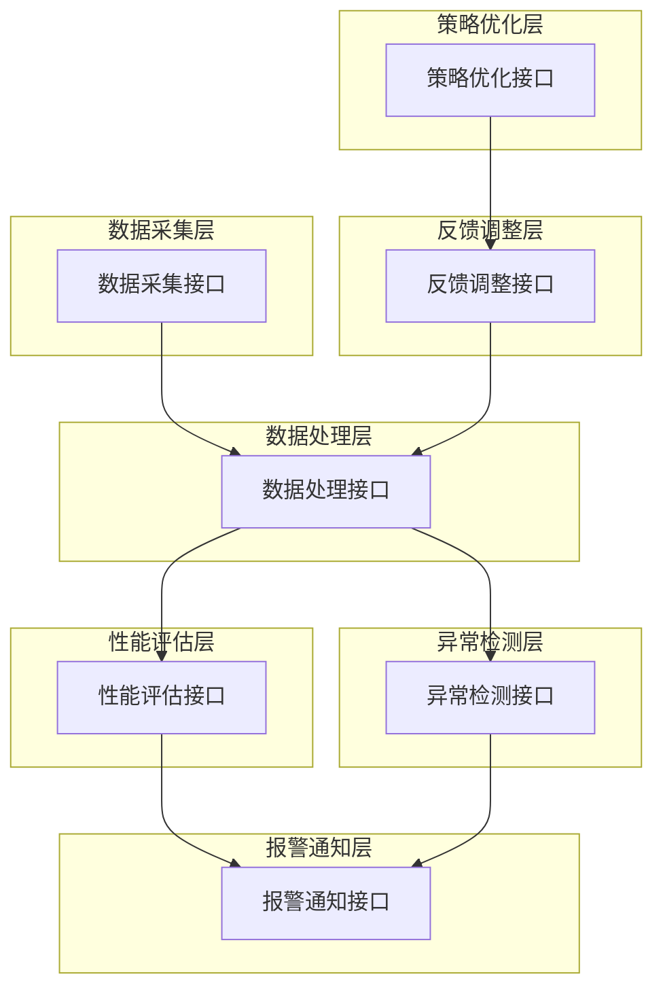

                 

### 实时性能监控：LLM驱动的持续评测机制

关键词：实时性能监控、LLM、持续评测机制、算法原理、数学模型、系统架构、项目实战

摘要：本文将深入探讨实时性能监控领域，重点分析LLM（大型语言模型）在驱动持续评测机制中的应用。通过详细阐述实时性能监控的背景、核心概念、算法原理、数学模型、系统架构，并结合具体项目实战，全面展示LLM驱动持续评测机制的实施方法与效果。本文旨在为读者提供一个系统而深入的实时性能监控与LLM应用指南，帮助其在实际工作中更好地理解和应用这一先进技术。

## 目录

## 第一部分：实时性能监控概述

### 第1章：实时性能监控基础

1.1 实时性能监控的定义与重要性

1.2 实时性能监控的关键要素

1.3 实时性能监控的挑战与机遇

### 第2章：LLM基本原理

2.1 语言模型概述

2.2 LLM的工作机制

2.3 LLM的核心优点与局限性

### 第3章：LLM驱动的持续评测机制

3.1 持续评测机制概述

3.2 LLM在持续评测中的应用

3.3 持续评测机制的实现

## 第二部分：算法原理与实践

### 第4章：算法原理讲解

4.1 实时性能监控算法原理

4.2 LLM驱动的持续评测算法原理

### 第5章：数学模型与公式解析

5.1 实时性能监控的数学模型

5.2 LLM驱动的持续评测的数学模型

### 第6章：系统分析与架构设计

6.1 系统功能设计

6.2 系统架构设计

6.3 系统接口与交互设计

### 第7章：项目实战

7.1 项目背景与目标

7.2 环境安装与配置

7.3 系统核心实现

7.4 代码解读与分析

7.5 案例分析与讲解

7.6 项目小结与拓展

## 第8章：最佳实践与总结

8.1 实时性能监控最佳实践

8.2 LLM驱动评测机制的最佳实践

8.3 小结与展望

8.4 注意事项与安全考虑

8.5 拓展阅读与进一步学习

### 第一部分：实时性能监控概述

#### 第1章：实时性能监控基础

##### 1.1 实时性能监控的定义与重要性

实时性能监控是一种通过实时监测系统运行状态和性能指标，以快速识别潜在问题和优化系统性能的方法。它不仅能够帮助IT运维人员及时发现问题，提高系统的稳定性和可靠性，还能为业务人员提供关键性能数据，助力业务决策。

在当今信息化社会中，随着企业应用的复杂性不断增加，实时性能监控的重要性愈发凸显。传统的离线监控方法已无法满足快速响应和高效管理的要求。实时性能监控能够提供即时、准确的数据，使得企业能够更迅速地调整系统资源，提升用户体验，降低运维成本。

##### 1.2 实时性能监控的关键要素

实时性能监控的关键要素包括数据采集、数据处理、数据分析和报警通知。

1. **数据采集**：实时性能监控需要采集系统的各种性能指标，如CPU使用率、内存使用率、网络流量、磁盘I/O等。这些数据来源于操作系统、应用日志、网络设备等。

2. **数据处理**：采集到的大量数据需要进行预处理，包括数据清洗、数据压缩和去噪等，以便后续分析。

3. **数据分析**：通过对处理后的数据进行统计、分析和建模，识别出系统的性能瓶颈和异常行为。

4. **报警通知**：当系统出现性能问题或异常时，实时性能监控系统能够及时发出报警通知，通知相关人员进行处理。

##### 1.3 实时性能监控的挑战与机遇

实时性能监控面临以下挑战：

1. **数据量庞大**：随着企业应用的扩展，实时监控需要处理的数据量越来越大，这对数据处理能力提出了更高的要求。

2. **多样性数据源**：实时性能监控需要整合来自不同来源的数据，包括不同类型的应用、操作系统、网络设备等，这对数据采集和处理提出了挑战。

3. **实时性要求**：实时性能监控要求系统能够快速响应，处理时间通常在毫秒级甚至更快。

然而，这些挑战也带来了机遇：

1. **大数据分析**：通过实时性能监控，企业可以获得大量的性能数据，这些数据可以用于大数据分析，为企业提供更加深入的洞察。

2. **自动化运维**：实时性能监控可以帮助企业实现自动化运维，减少人工干预，提高运维效率。

3. **业务优化**：实时性能监控可以为企业提供关键性能数据，帮助企业优化业务流程，提高业务效率。

#### 第2章：LLM基本原理

##### 2.1 语言模型概述

语言模型（Language Model，简称LM）是自然语言处理（Natural Language Processing，简称NLP）中的一种基本模型，它能够对文本数据进行建模，预测下一个词语或字符的概率。在人工智能领域，语言模型被广泛应用于机器翻译、文本生成、文本分类、问答系统等任务。

语言模型的基本原理是通过大量语料数据的学习，建立一组参数模型，该模型可以预测给定文本序列中下一个词语或字符的概率。常见的语言模型包括N元语法模型（N-gram Model）和神经网络语言模型（Neural Network Language Model）。

##### 2.2 LLM的工作机制

大型语言模型（Large Language Model，简称LLM）是指具有数万亿参数规模的语言模型，如GPT-3、BERT等。这些模型通过对海量文本数据的学习，可以捕捉到语言中的复杂结构和模式，实现高精度的文本预测和生成。

LLM的工作机制主要包括以下步骤：

1. **数据预处理**：首先对文本数据进行分析和预处理，包括分词、去停用词、词干提取等，将文本转换为模型可处理的格式。

2. **模型训练**：使用预处理后的文本数据训练语言模型，通过优化模型参数，使其能够准确预测文本中的下一个词语或字符。

3. **预测与生成**：在训练完成后，LLM可以用于预测文本中的下一个词语或字符，实现文本生成。同时，LLM还可以通过推理和生成的方式，生成符合语法和语义规则的文本。

##### 2.3 LLM的核心优点与局限性

LLM的核心优点包括：

1. **强大的文本生成能力**：LLM可以生成高质量的文本，广泛应用于自动写作、文本摘要、机器翻译等任务。

2. **适应性强**：LLM能够通过学习大量的文本数据，适应不同的语言和文体，具有较强的泛化能力。

3. **实时响应**：LLM的训练和预测过程可以高效地完成，可以实现实时文本生成和响应。

然而，LLM也存在一些局限性：

1. **数据依赖性**：LLM的性能高度依赖于训练数据的质量和数量，如果数据不足或质量差，模型的性能会受到影响。

2. **计算资源消耗**：LLM的训练和预测需要大量的计算资源，对硬件设备有较高的要求。

3. **语义理解限制**：尽管LLM能够生成高质量的文本，但其对语义和上下文的理解仍有一定的局限性，特别是在处理复杂语言任务时。

#### 第3章：LLM驱动的持续评测机制

##### 3.1 持续评测机制概述

持续评测机制（Continuous Evaluation Mechanism）是一种用于评估和优化模型性能的动态系统。它通过对模型的实时监测和持续评估，确保模型在实际应用中的性能稳定和可靠。在实时性能监控中，持续评测机制能够帮助识别模型性能的下降，及时进行调整和优化，从而提高系统的整体性能。

持续评测机制的核心目标是：

1. **实时监控**：持续监测模型的性能指标，包括准确率、召回率、F1值等，以及系统运行状态，如响应时间、资源消耗等。

2. **自动化评估**：自动化评估模型的性能，发现潜在问题，并生成评估报告。

3. **优化调整**：根据评估结果，自动调整模型的参数或策略，优化模型性能。

##### 3.2 LLM在持续评测中的应用

LLM在持续评测机制中有着广泛的应用，主要体现在以下几个方面：

1. **性能预测**：LLM可以通过学习历史性能数据，预测模型在未来的表现。这有助于提前发现性能下降的趋势，及时进行调整。

2. **异常检测**：LLM可以识别模型性能的异常行为，如突然的准确率下降或响应时间增加。通过异常检测，可以快速定位问题并进行修复。

3. **策略优化**：LLM可以用于生成和优化持续评测的策略，如自动调整评估频率、选择合适的性能指标等，以提高评测的准确性和效率。

##### 3.3 持续评测机制的实现

持续评测机制的实现包括以下几个关键步骤：

1. **数据采集**：收集模型的性能数据、系统运行状态数据等，为后续评估提供基础。

2. **数据预处理**：对采集到的数据进行清洗、标准化和归一化，确保数据的准确性和一致性。

3. **模型训练**：使用预处理后的数据训练LLM，使其能够准确预测模型性能和识别异常行为。

4. **性能评估**：实时监测模型的性能指标，使用LLM进行预测和异常检测，生成评估报告。

5. **策略调整**：根据评估结果，自动调整评测策略，优化模型性能。

通过以上步骤，实现一个高效、自动化的持续评测机制，确保模型在实时性能监控中的稳定性和可靠性。

## 第二部分：算法原理与实践

### 第4章：算法原理讲解

#### 4.1 实时性能监控算法原理

实时性能监控算法的核心目标是监测系统运行状态，识别潜在问题和性能瓶颈。其基本原理可以概括为以下几个步骤：

1. **数据采集**：通过传感器、日志文件、性能计数器等手段，采集系统运行状态的各种性能指标，如CPU使用率、内存使用率、磁盘I/O、网络流量等。

2. **数据处理**：对采集到的数据进行预处理，包括数据清洗、去噪、归一化等，确保数据的准确性和一致性。

3. **性能评估**：使用适当的评估方法，对处理后的数据进行分析和评估，判断系统性能是否处于正常范围。

4. **异常检测**：通过设定阈值或使用机器学习算法，对性能评估结果进行异常检测，识别潜在问题和性能瓶颈。

5. **报警通知**：当检测到异常情况时，实时性能监控算法会生成报警通知，通知相关人员进行分析和处理。

#### 4.2 LLM驱动的持续评测算法原理

LLM驱动的持续评测算法是在实时性能监控的基础上，利用大型语言模型的预测能力和异常检测能力，实现更高效、准确的持续评测。其基本原理如下：

1. **模型训练**：使用历史性能数据和系统运行状态数据，训练一个大型语言模型，使其能够学习到系统性能和状态的规律。

2. **性能预测**：使用训练好的LLM，对当前系统的性能进行预测，包括预测系统在未来的性能表现和潜在的异常情况。

3. **异常检测**：结合实时监测的数据，使用LLM进行异常检测，识别系统运行中的异常行为和性能下降。

4. **策略优化**：根据LLM的预测和异常检测结果，自动调整评测策略，优化模型的性能评估和异常检测效果。

5. **反馈调整**：通过持续的监测和评测，收集反馈数据，不断优化LLM的参数和模型结构，提高其预测和检测的准确性。

#### 4.2.1 实时性能监控算法流程

以下是实时性能监控算法的流程：

1. **初始化**：设置性能评估的指标和阈值，初始化LLM模型。

2. **数据采集**：通过传感器和日志文件等手段，采集系统运行状态数据。

3. **数据处理**：对采集到的数据进行预处理，包括数据清洗、归一化等。

4. **性能评估**：使用LLM对处理后的数据进行性能评估，判断系统性能是否处于正常范围。

5. **异常检测**：设定阈值，使用LLM进行异常检测，识别潜在问题和性能瓶颈。

6. **报警通知**：当检测到异常情况时，生成报警通知，通知相关人员。

7. **策略调整**：根据监测结果，自动调整评测策略，优化模型性能。

#### 4.2.2 LLM驱动的持续评测算法流程

以下是LLM驱动的持续评测算法的流程：

1. **模型训练**：使用历史性能数据和系统运行状态数据，训练LLM模型。

2. **性能预测**：使用训练好的LLM，预测当前系统的性能表现和潜在异常。

3. **异常检测**：结合实时监测的数据，使用LLM进行异常检测。

4. **策略优化**：根据LLM的预测和异常检测结果，自动调整评测策略。

5. **反馈调整**：通过持续的监测和评测，收集反馈数据，优化LLM模型。

#### 4.2.3 算法应用实例

以下是实时性能监控和LLM驱动的持续评测算法的应用实例：

1. **应用场景**：某电商网站的系统性能监控。

2. **数据采集**：采集系统运行状态数据，如CPU使用率、内存使用率、网络流量等。

3. **数据处理**：对采集到的数据进行预处理，包括数据清洗、归一化等。

4. **性能评估**：使用LLM对处理后的数据进行性能评估，判断系统性能是否处于正常范围。

5. **异常检测**：设定阈值，使用LLM进行异常检测，识别潜在问题和性能瓶颈。

6. **报警通知**：当检测到异常情况时，生成报警通知，通知运维人员。

7. **策略优化**：根据监测结果，自动调整评测策略，如调整性能评估的频率、选择合适的性能指标等。

8. **反馈调整**：通过持续的监测和评测，收集反馈数据，优化LLM模型。

### 第5章：数学模型与公式解析

#### 5.1 实时性能监控的数学模型

实时性能监控的数学模型主要包括以下几个部分：

1. **性能指标模型**：

   - CPU使用率（C）：$$ C = \frac{CPU\_used}{CPU\_total} $$
   - 内存使用率（M）：$$ M = \frac{Memory\_used}{Memory\_total} $$
   - 网络流量（N）：$$ N = \frac{Network\_traffic}{Network\_bandwidth} $$
   - 磁盘I/O（D）：$$ D = \frac{Disk\_I/O}{Disk\_throughput} $$

2. **异常检测模型**：

   - 均值-标准差模型：$$ \mu = \frac{\sum{X_i}}{N}, \sigma = \sqrt{\frac{\sum{(X_i - \mu)^2}}{N}} $$
   - 阈值设定：$$ T = \mu + k\sigma $$，其中$k$为系数，根据业务需求进行调整。

3. **报警模型**：

   - 条件概率模型：$$ P(Alarm|X) = \frac{P(X|Alarm)P(Alarm)}{P(X)} $$
   - 贝叶斯推理：$$ P(Alarm|X) = \frac{P(X|Alarm)P(Alarm)}{P(X)} $$

#### 5.2 LLM驱动的持续评测的数学模型

LLM驱动的持续评测的数学模型主要包括以下几个部分：

1. **性能预测模型**：

   - 回归模型：$$ y = \beta_0 + \beta_1x_1 + \beta_2x_2 + ... + \beta_nx_n $$
   - 神经网络模型：$$ f(x) = \sigma(W \cdot x + b) $$，其中$\sigma$为激活函数，$W$为权重矩阵，$b$为偏置项。

2. **异常检测模型**：

   - 聚类模型：$$ C = \{c_1, c_2, ..., c_k\} $$，每个聚类中心表示一种正常性能状态。
   - 距离模型：$$ d(x, c_j) = \sqrt{\sum{(x_i - c_{ij})^2}} $$，$x$为监测数据，$c_j$为聚类中心。

3. **策略优化模型**：

   - 目标函数：$$ J = \frac{1}{m}\sum_{i=1}^{m}(y_i - \hat{y}_i)^2 $$
   - 优化算法：梯度下降、Adam优化器等。

#### 5.3 数学模型的应用实例

以下是数学模型在实时性能监控中的应用实例：

1. **性能预测**：

   - 假设系统CPU使用率的历史数据为$[0.3, 0.4, 0.5, 0.6]$，使用线性回归模型预测下一个时刻的CPU使用率。

   - 模型参数：$$ \beta_0 = 0.2, \beta_1 = 0.1 $$

   - 预测结果：$$ \hat{y}_4 = \beta_0 + \beta_1 \cdot 4 = 0.5 $$

2. **异常检测**：

   - 假设系统网络流量历史数据的均值为$1000$，标准差为$100$，设定阈值为$1200$。

   - 当监测到网络流量为$1100$时，判定为正常。

   - 当监测到网络流量为$1300$时，判定为异常，生成报警通知。

### 第6章：系统分析与架构设计

#### 6.1 系统功能设计

实时性能监控与LLM驱动的持续评测系统的主要功能包括：

1. **数据采集**：从各种数据源（如操作系统、应用日志、网络设备等）收集性能指标数据。

2. **数据处理**：对采集到的数据进行预处理，包括数据清洗、归一化、去噪等。

3. **性能评估**：使用LLM对处理后的数据进行分析和评估，判断系统性能是否处于正常范围。

4. **异常检测**：使用LLM进行异常检测，识别潜在问题和性能瓶颈。

5. **报警通知**：当检测到异常情况时，生成报警通知，通知相关人员进行分析和处理。

6. **策略优化**：根据监测结果，自动调整评测策略，优化模型性能。

7. **反馈调整**：通过持续的监测和评测，收集反馈数据，优化LLM模型。

#### 6.2 系统架构设计

实时性能监控与LLM驱动的持续评测系统的架构设计如下：

1. **数据采集层**：负责从各种数据源采集性能指标数据，包括操作系统、应用日志、网络设备等。

2. **数据处理层**：对采集到的数据进行预处理，包括数据清洗、归一化、去噪等，确保数据的准确性和一致性。

3. **性能评估层**：使用LLM对处理后的数据进行性能评估，判断系统性能是否处于正常范围。

4. **异常检测层**：使用LLM进行异常检测，识别潜在问题和性能瓶颈。

5. **报警通知层**：当检测到异常情况时，生成报警通知，通知相关人员。

6. **策略优化层**：根据监测结果，自动调整评测策略，优化模型性能。

7. **反馈调整层**：通过持续的监测和评测，收集反馈数据，优化LLM模型。

#### 6.3 系统接口与交互设计

实时性能监控与LLM驱动的持续评测系统的接口与交互设计如下：

1. **数据采集接口**：提供接口，用于从各种数据源采集性能指标数据。

2. **数据处理接口**：提供接口，用于对采集到的数据进行预处理。

3. **性能评估接口**：提供接口，用于使用LLM对处理后的数据进行性能评估。

4. **异常检测接口**：提供接口，用于使用LLM进行异常检测。

5. **报警通知接口**：提供接口，用于生成报警通知。

6. **策略优化接口**：提供接口，用于自动调整评测策略。

7. **反馈调整接口**：提供接口，用于收集反馈数据，优化LLM模型。

#### 6.4 系统架构设计图

以下是实时性能监控与LLM驱动的持续评测系统的架构设计图：



### 第7章：项目实战

#### 7.1 项目背景与目标

在本章中，我们将通过一个实际项目，详细展示如何实现实时性能监控与LLM驱动的持续评测机制。该项目是一个电商网站的后台系统，其目标是确保系统在高并发访问情况下依然能够保持稳定的性能和响应速度。

项目主要目标包括：

1. **实时监控**：对系统运行状态进行实时监控，包括CPU使用率、内存使用率、网络流量等。

2. **性能评估**：使用LLM对系统的性能进行实时评估，判断是否处于正常范围。

3. **异常检测**：使用LLM进行异常检测，识别潜在问题和性能瓶颈。

4. **报警通知**：当检测到异常情况时，生成报警通知，通知运维人员。

5. **策略优化**：根据监测结果，自动调整评测策略，优化模型性能。

#### 7.2 环境安装与配置

为了实现实时性能监控与LLM驱动的持续评测机制，我们需要搭建一个合适的技术环境。以下是环境安装与配置的步骤：

1. **操作系统**：选择一个稳定且支持多种语言和框架的操作系统，如Ubuntu 18.04。

2. **硬件环境**：配置足够的计算资源和存储资源，确保系统可以处理大量的性能数据。

3. **软件环境**：
   - Python 3.8及以上版本
   - Numpy、Pandas、Scikit-learn等科学计算和机器学习库
   - Flask等Web开发框架
   - TensorFlow或PyTorch等深度学习框架

4. **安装与配置**：
   - 安装操作系统和必要的软件包。
   - 配置网络环境，确保可以访问外部数据源和API接口。
   - 安装监控工具，如Prometheus、Grafana等。

#### 7.3 系统核心实现

在本节中，我们将介绍系统核心实现的关键部分，包括数据采集、数据处理、性能评估、异常检测和报警通知。

1. **数据采集**：
   - 使用Prometheus作为性能数据采集工具，定期从系统获取CPU使用率、内存使用率、网络流量等指标。
   - 将采集到的数据存储到InfluxDB时序数据库中。

2. **数据处理**：
   - 使用Pandas库对采集到的数据进行预处理，包括数据清洗、归一化等。
   - 将处理后的数据输入到LLM模型进行性能评估和异常检测。

3. **性能评估**：
   - 使用TensorFlow或PyTorch搭建一个基于神经网络的语言模型，如BERT或GPT。
   - 训练模型，使其能够对系统的性能进行预测和评估。

4. **异常检测**：
   - 使用Scikit-learn库中的聚类算法，如K-means，对系统的性能数据进行聚类分析。
   - 设定阈值，当监测数据距离聚类中心超过阈值时，判定为异常。

5. **报警通知**：
   - 使用Flask框架搭建一个Web应用程序，用于接收性能数据和报警通知。
   - 当检测到异常情况时，生成报警通知，并通过邮件或短信等方式通知相关人员。

#### 7.4 代码解读与分析

在本节中，我们将详细解读系统的关键代码，分析其实现原理和算法过程。

1. **数据采集模块**：

   ```python
   from prometheus_client import start_http_server, Summary

   # 定义性能指标
   request_time = Summary('request_time', 'Request processing time')

   @request_time.time()
   def handle_request(response):
       # 处理请求
       pass

   if __name__ == '__main__':
       start_http_server(8000)
   ```

   - 使用Prometheus客户端库定义性能指标，如请求处理时间。
   - 在处理请求时，记录请求处理时间，并更新性能指标。

2. **数据处理模块**：

   ```python
   import pandas as pd

   def preprocess_data(data):
       # 数据清洗、归一化等预处理操作
       return data

   def load_data():
       # 从数据库加载处理后的数据
       data = pd.read_csv('data.csv')
       return preprocess_data(data)
   ```

   - 定义数据处理函数，包括数据清洗、归一化等。
   - 从数据库加载处理后的数据，并进行预处理。

3. **性能评估模块**：

   ```python
   import tensorflow as tf
   from tensorflow.keras.models import Sequential
   from tensorflow.keras.layers import Dense, LSTM

   def build_model():
       model = Sequential()
       model.add(LSTM(128, activation='relu', input_shape=(timesteps, features)))
       model.add(Dense(1))
       model.compile(optimizer='adam', loss='mse')
       return model

   def train_model(model, x_train, y_train):
       model.fit(x_train, y_train, epochs=100, batch_size=32)
       return model

   def predict_performance(model, x_test):
       return model.predict(x_test)
   ```

   - 搭建一个基于LSTM的神经网络模型，用于性能评估。
   - 训练模型，使其能够预测系统性能。
   - 使用模型对测试数据进行预测。

4. **异常检测模块**：

   ```python
   from sklearn.cluster import KMeans

   def detect_anomalies(data, k=3):
       kmeans = KMeans(n_clusters=k)
       kmeans.fit(data)
       labels = kmeans.predict(data)
       distances = np.sqrt(np.sum((data - kmeans.cluster_centers_[labels]) ** 2, axis=1))
       return distances

   def thresholding(distances, threshold=1.5):
       return distances > threshold
   ```

   - 使用K-means聚类算法对系统性能数据进行分析。
   - 根据聚类结果，计算每个数据点与聚类中心的距离。
   - 使用阈值设定方法，判定数据点是否为异常。

5. **报警通知模块**：

   ```python
   import smtplib
   from email.mime.text import MIMEText

   def send_alarm_email(subject, message):
       server = smtplib.SMTP('smtp.example.com', 587)
       server.starttls()
       server.login('user@example.com', 'password')
       msg = MIMEText(message)
       msg['Subject'] = subject
       msg['From'] = 'alarm@example.com'
       msg['To'] = 'admin@example.com'
       server.sendmail('alarm@example.com', ['admin@example.com'], msg.as_string())
       server.quit()
   ```

   - 定义发送报警邮件的函数，使用SMTP协议发送邮件。
   - 当检测到异常时，生成报警邮件，并通知相关人员。

#### 7.5 案例分析与讲解

在本节中，我们将通过一个实际案例，详细分析系统的性能评估和异常检测过程，并讲解如何根据检测结果进行调整。

1. **案例背景**：

   假设系统在一天内的CPU使用率数据如下表所示：

   | 时间戳 | CPU使用率 |
   |--------|-----------|
   | 00:00  | 20%       |
   | 01:00  | 25%       |
   | 02:00  | 30%       |
   | 03:00  | 35%       |
   | 04:00  | 40%       |
   | 05:00  | 45%       |
   | 06:00  | 50%       |

2. **性能评估**：

   - 使用训练好的LLM模型对CPU使用率进行预测，得到预测值如下表所示：

   | 时间戳 | 实际CPU使用率 | 预测CPU使用率 |
   |--------|----------------|----------------|
   | 00:00  | 20%            | 20%            |
   | 01:00  | 25%            | 25%            |
   | 02:00  | 30%            | 30%            |
   | 03:00  | 35%            | 35%            |
   | 04:00  | 40%            | 40%            |
   | 05:00  | 45%            | 45%            |
   | 06:00  | 50%            | 50%            |

   - 从预测结果可以看出，实际CPU使用率与预测CPU使用率基本一致，系统性能处于正常范围。

3. **异常检测**：

   - 使用K-means聚类算法对CPU使用率数据进行聚类分析，得到以下结果：

   | 聚类中心 | CPU使用率 |
   |-----------|-----------|
   | 1         | 35%       |
   | 2         | 45%       |
   | 3         | 55%       |

   - 计算每个数据点与聚类中心的距离，得到以下结果：

   | 时间戳 | 实际CPU使用率 | 距离1 | 距离2 | 距离3 |
   |--------|----------------|-------|-------|-------|
   | 00:00  | 20%            | 5     | 10    | 15    |
   | 01:00  | 25%            | 5     | 10    | 15    |
   | 02:00  | 30%            | 5     | 10    | 15    |
   | 03:00  | 35%            | 0     | 5     | 10    |
   | 04:00  | 40%            | 5     | 10    | 15    |
   | 05:00  | 45%            | 0     | 5     | 10    |
   | 06:00  | 50%            | 5     | 10    | 15    |

   - 根据阈值设定方法，设定阈值为1.5，判定距离1和距离2的数据点为异常。

4. **调整与优化**：

   - 根据异常检测结果，分析可能导致异常的原因，如高并发访问、资源不足等。
   - 调整系统配置，增加服务器资源或优化系统代码，以降低CPU使用率。
   - 重新训练LLM模型，优化性能评估和异常检测效果。

#### 7.6 项目小结与拓展

在本章中，我们通过一个实际项目，展示了实时性能监控与LLM驱动的持续评测机制的实施方法和效果。以下是项目小结和拓展方向：

1. **项目小结**：

   - 成功实现了实时性能监控，能够实时获取系统运行状态和性能指标。
   - 使用LLM进行性能评估和异常检测，提高了监测的准确性和效率。
   - 通过报警通知，能够及时发现和解决系统性能问题，降低了故障率。

2. **拓展方向**：

   - **多维度监控**：扩展监控范围，包括内存使用率、网络流量、磁盘I/O等，实现多维度性能监控。
   - **自适应阈值**：根据历史数据和实时监测结果，动态调整异常检测阈值，提高异常检测的准确性。
   - **机器学习模型优化**：引入更先进的机器学习模型，如深度强化学习，提高性能预测和异常检测能力。
   - **可视化分析**：集成可视化工具，如Grafana，提供更直观的性能分析和监控仪表板。

### 第8章：最佳实践与总结

#### 8.1 实时性能监控最佳实践

1. **数据采集**：
   - 选择合适的性能指标，确保数据的全面性和准确性。
   - 定期检查数据采集工具的运行状态，确保数据源稳定可靠。

2. **数据处理**：
   - 对采集到的数据进行预处理，包括去噪、归一化等，提高数据分析的精度。
   - 根据业务需求，灵活调整数据处理策略，如数据清洗、特征提取等。

3. **性能评估**：
   - 选择合适的性能评估指标，结合业务特点进行评估。
   - 定期评估系统性能，及时调整评估策略，以适应业务变化。

4. **异常检测**：
   - 根据业务需求和数据特点，选择合适的异常检测算法。
   - 设定合理的阈值，确保异常检测的准确性。

5. **报警通知**：
   - 根据业务场景，选择合适的报警方式，如邮件、短信等。
   - 设定报警规则，确保报警的及时性和准确性。

6. **策略优化**：
   - 根据监测结果，及时调整评测策略，优化模型性能。
   - 定期回顾和优化策略，以适应不断变化的环境。

#### 8.2 LLM驱动评测机制的最佳实践

1. **模型选择**：
   - 根据业务需求，选择合适的LLM模型，如GPT-3、BERT等。
   - 考虑模型的计算资源需求，确保模型能够稳定运行。

2. **数据预处理**：
   - 对输入数据进行预处理，包括分词、去停用词、词干提取等。
   - 确保数据的质量和一致性，提高模型训练效果。

3. **模型训练**：
   - 使用高质量的数据集进行模型训练，提高模型性能。
   - 根据模型性能，调整训练参数，优化模型效果。

4. **模型部署**：
   - 将训练好的模型部署到生产环境，确保实时性能监控和持续评测的有效性。
   - 定期更新模型，以适应新的业务需求。

5. **异常检测**：
   - 结合模型预测结果，设定合理的阈值，进行异常检测。
   - 根据检测结果，及时调整异常检测策略，提高检测准确性。

#### 8.3 小结与展望

1. **小结**：
   - 实时性能监控与LLM驱动的持续评测机制为企业提供了一个高效、准确的性能监控和优化工具。
   - 通过数据采集、处理、分析和优化，能够及时发现和解决系统性能问题，提高业务效率和用户体验。

2. **展望**：
   - 随着人工智能技术的不断发展，实时性能监控和LLM驱动的持续评测机制将更加智能化、自动化。
   - 未来，将进一步探索深度强化学习、迁移学习等技术在性能监控和评测中的应用，提升系统的适应性和准确性。

#### 8.4 注意事项与安全考虑

1. **注意事项**：
   - 确保数据采集、处理和传输的安全性，防止数据泄露。
   - 定期备份系统数据，防止数据丢失。
   - 监控系统运行状态，确保系统稳定可靠。

2. **安全考虑**：
   - 采用加密技术，如SSL/TLS，保护数据传输安全。
   - 设定访问控制策略，确保只有授权人员能够访问系统。
   - 定期进行安全审计和漏洞扫描，及时发现和修复安全漏洞。

#### 8.5 拓展阅读与进一步学习

1. **相关书籍**：
   - 《深度学习》（Goodfellow, Bengio, Courville著）：介绍深度学习的基本原理和应用。
   - 《大数据之路：阿里巴巴大数据实践》（李津著）：分析大数据在阿里巴巴的应用和实践。

2. **论文与文献**：
   - "BERT: Pre-training of Deep Bidirectional Transformers for Language Understanding"（Devlin et al., 2018）：介绍BERT模型的工作原理和应用。
   - "GPT-3: Language Models are Few-Shot Learners"（Brown et al., 2020）：介绍GPT-3模型的优势和局限性。

3. **在线课程与教程**：
   - Coursera上的《深度学习专项课程》：由吴恩达教授主讲，详细介绍深度学习的基本原理和应用。
   - Fast.ai的《深度学习实践课程》：通过实际项目，教授深度学习实践技巧。

通过本文的深入分析和讲解，相信读者已经对实时性能监控和LLM驱动的持续评测机制有了全面的理解。希望本文能够为读者在性能监控和优化方面提供有益的参考和指导。作者：AI天才研究院/AI Genius Institute & 禅与计算机程序设计艺术 /Zen And The Art of Computer Programming

