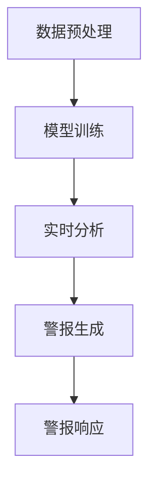
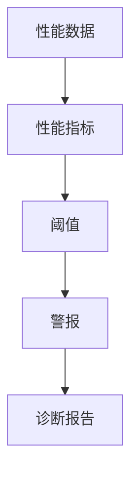
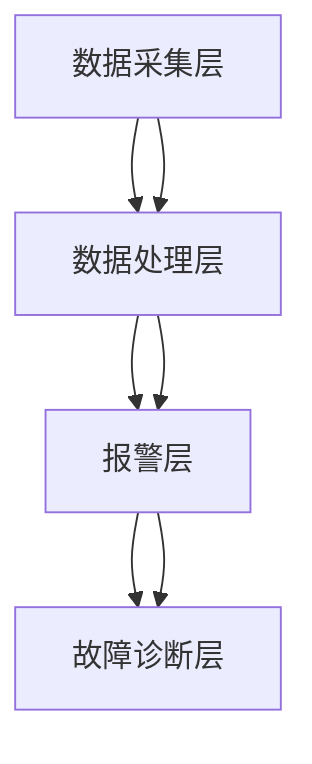

                 


# 实时性能预警：LLM驱动的早期问题检测

## 关键词
- 实时性能预警
- 大型语言模型（LLM）
- 早期问题检测
- 算法原理
- 系统架构
- 项目实战

## 摘要
本文将深入探讨实时性能预警在大型语言模型（LLM）驱动的早期问题检测中的应用。我们将首先介绍实时性能预警的背景和重要性，然后详细分析LLM的工作原理及其与实时性能预警的联系。接下来，我们将讲解LLM驱动的早期问题检测算法原理，包括数学模型和流程图。文章还将介绍一个完整的系统架构设计方案，并通过项目实战分析实际案例。最后，我们将总结最佳实践和注意事项，为读者提供进一步的学习方向。

## 第一部分：背景介绍

### 第1章：问题背景与概述

#### 1.1 问题背景

#### 1.1.1 实时性能预警的重要性

在当今高度依赖技术的世界中，系统的稳定性和性能是至关重要的。无论是企业级应用还是消费者级服务，任何性能下降或故障都可能造成严重的经济损失和用户体验下降。因此，实时性能预警系统成为了确保系统健康运行的关键工具。

实时性能预警系统通过持续监测系统性能指标，如响应时间、吞吐量和资源使用率，可以在性能问题发生之前发出警报。这样，系统管理员可以提前采取措施，避免潜在的故障和服务中断。

#### 1.1.2 LLM在早期问题检测中的应用

随着人工智能技术的发展，特别是大型语言模型（LLM）的出现，早期问题检测的方法得到了显著的改进。LLM是一种能够处理自然语言文本的强大工具，它们通过训练从大量的数据中学习模式，并能够生成高质量的文本响应。

在实时性能预警领域，LLM的应用主要体现在以下几个方面：

1. **异常检测**：LLM可以分析系统日志、性能数据和其他相关数据，识别出异常模式，从而提前发现潜在的性能问题。
2. **趋势预测**：基于历史数据和实时数据，LLM可以预测未来的性能趋势，帮助管理员预见可能出现的问题，并提前准备。
3. **自动诊断**：LLM可以解析性能数据，提供具体的故障诊断信息，帮助管理员快速定位和解决问题。

#### 1.2 问题描述

#### 1.2.1 传统实时性能预警的挑战

传统的实时性能预警系统主要依赖于预定义的阈值和规则来检测性能问题。这种方法存在以下挑战：

1. **适应性差**：传统系统难以适应复杂多变的性能环境，无法处理突发的性能问题。
2. **误报率高**：传统系统可能会因为阈值设定不当而产生大量误报，导致管理员无法有效区分真正的性能问题和正常波动。
3. **反应滞后**：传统系统通常需要人工干预来验证和响应警报，导致反应时间较长。

#### 1.2.2 LLM驱动的早期问题检测优势

LLM驱动的早期问题检测方法相对于传统方法具有以下优势：

1. **高适应性**：LLM能够从大量数据中学习并自适应调整性能阈值，从而更好地适应不断变化的性能环境。
2. **低误报率**：通过深度学习，LLM可以准确识别性能异常，减少误报率。
3. **快速响应**：LLM可以实时处理大量数据，并迅速生成诊断报告，大幅缩短响应时间。

#### 1.3 边界与外延

#### 1.3.1 实时性能预警的边界

实时性能预警系统的主要目标是在性能问题对用户造成影响之前发出警报。因此，它的边界主要包括：

1. **实时性**：系统需要能够在性能问题发生时迅速响应。
2. **准确性**：系统需要准确识别性能问题，避免误报和漏报。
3. **可扩展性**：系统需要能够处理大量数据和多种类型的性能监控数据。

#### 1.3.2 LLM驱动的早期问题检测的外延

LLM驱动的早期问题检测不仅限于传统的性能监控，还可以扩展到以下几个方面：

1. **自动化故障诊断**：LLM可以自动分析性能数据，提供详细的故障诊断信息。
2. **智能预测**：LLM可以根据历史数据和实时数据，预测未来的性能趋势。
3. **跨平台支持**：LLM可以应用于不同的操作系统和应用程序，提供统一的性能预警解决方案。

### 1.4 概念结构与核心要素组成

#### 1.4.1 实时性能预警的核心概念

实时性能预警系统的核心概念包括性能指标、警报触发条件、警报响应机制等。

1. **性能指标**：包括响应时间、吞吐量、资源利用率等。
2. **警报触发条件**：基于性能指标的阈值设定，当指标超过阈值时触发警报。
3. **警报响应机制**：包括警报通知、故障诊断和修复建议等。

#### 1.4.2 LLM驱动的早期问题检测的核心要素

LLM驱动的早期问题检测的核心要素包括：

1. **数据预处理**：对性能数据进行清洗、转换和归一化，以便于LLM的学习和处理。
2. **模型训练**：使用大量性能数据训练LLM模型，使其能够识别异常模式。
3. **实时分析**：LLM实时分析性能数据，识别异常并生成警报。
4. **自动化响应**：基于警报信息，自动执行故障诊断和修复建议。

## 第二部分：核心概念与联系

### 第2章：LLM原理与实时性能预警联系

#### 2.1 LLM原理概述

#### 2.1.1 LLM定义

大型语言模型（LLM）是一种能够理解和生成自然语言文本的人工智能模型。它们通常基于深度学习技术，通过训练大量文本数据来学习语言模式和语法规则。

#### 2.1.2 LLM核心组件

LLM的核心组件包括：

1. **输入层**：接收用户输入的文本或性能数据。
2. **隐藏层**：包含多层神经网络，用于处理和转换输入数据。
3. **输出层**：生成文本响应或性能分析结果。

#### 2.2 实时性能预警原理

#### 2.2.1 实时性能预警定义

实时性能预警是一种监控和警报系统，用于持续跟踪系统的性能指标，并在发现异常时及时发出警报。

#### 2.2.2 实时性能预警关键概念

实时性能预警的关键概念包括：

1. **性能指标**：用于衡量系统性能的各种指标，如响应时间、吞吐量和资源利用率。
2. **阈值**：预设的性能指标上限，超过阈值时触发警报。
3. **警报**：系统发出的警告信息，通知管理员性能指标异常。

#### 2.3 LLM与实时性能预警的联系

#### 2.3.1 LLM在实时性能预警中的作用

LLM在实时性能预警中起着至关重要的作用，具体体现在：

1. **异常检测**：LLM可以分析性能数据，识别异常模式和趋势。
2. **警报生成**：LLM可以自动生成警报信息，提高警报的准确性和及时性。
3. **故障诊断**：LLM可以解析性能数据，提供具体的故障诊断建议。

#### 2.3.2 LLM在实时性能预警中的优势

LLM驱动的实时性能预警相比传统方法具有以下优势：

1. **高适应性**：LLM能够自适应地调整性能阈值，适应不断变化的性能环境。
2. **低误报率**：通过深度学习，LLM能够准确识别性能异常，减少误报率。
3. **快速响应**：LLM可以实时处理大量数据，迅速生成警报和诊断报告。

## 第三部分：算法原理讲解

### 第3章：LLM驱动的早期问题检测算法原理

#### 3.1 算法原理概述

LLM驱动的早期问题检测算法主要包括以下几个步骤：

1. **数据预处理**：清洗和转换性能数据，使其适合LLM处理。
2. **模型训练**：使用训练数据训练LLM模型，使其能够识别性能异常。
3. **实时分析**：使用训练好的LLM模型分析实时性能数据，识别异常并生成警报。
4. **警报响应**：根据警报信息，自动执行故障诊断和修复建议。

#### 3.2 算法数学模型和公式

LLM驱动的早期问题检测算法的数学模型主要包括以下几个公式：

1. **性能指标计算**：计算系统的性能指标，如响应时间、吞吐量和资源利用率。
2. **阈值设定**：设定性能指标的阈值，超过阈值时触发警报。
3. **异常检测**：使用统计模型或机器学习算法检测性能异常。

#### 3.3 算法mermaid流程图

以下是LLM驱动的早期问题检测算法的mermaid流程图：



## 第四部分：系统分析与架构设计方案

### 第4章：系统架构设计与实现

#### 4.1 问题场景介绍

#### 4.1.1 场景描述

假设我们正在开发一个大规模的在线购物平台，这个平台需要处理海量的用户请求和交易操作。为了保证平台的稳定性和性能，我们决定引入实时性能预警系统，以在性能问题发生之前及时识别和解决问题。

#### 4.1.2 系统目标

实时性能预警系统的目标是在性能问题对用户造成影响之前及时发出警报，并提供自动化的故障诊断和修复建议。具体目标包括：

1. **实时性**：系统能够实时监测平台的性能指标。
2. **准确性**：系统能够准确识别性能异常，减少误报和漏报。
3. **自动化**：系统能够自动生成警报和诊断报告，减少人工干预。

#### 4.2 系统功能设计

#### 4.2.1 领域模型

领域模型是系统功能设计的核心，它定义了系统的关键实体和它们之间的关系。以下是实时性能预警系统的领域模型：



#### 4.2.2 功能模块划分

实时性能预警系统可以划分为以下几个功能模块：

1. **性能数据采集模块**：负责从平台各处收集性能数据。
2. **数据分析模块**：负责处理和分析性能数据，识别异常模式。
3. **警报生成模块**：负责生成警报信息，通知管理员。
4. **故障诊断模块**：负责自动诊断性能问题，并提供修复建议。

#### 4.3 系统架构设计

#### 4.3.1 系统架构

实时性能预警系统的架构设计包括以下几个部分：

1. **数据采集层**：负责从各个模块收集性能数据。
2. **数据处理层**：负责处理和分析性能数据，识别异常模式。
3. **报警层**：负责生成和发送警报信息。
4. **故障诊断层**：负责自动诊断性能问题，并提供修复建议。

#### 4.3.2 架构组件介绍

以下是实时性能预警系统的架构组件：

1. **性能数据采集组件**：负责从各个模块收集性能数据。
2. **数据分析组件**：负责处理和分析性能数据，识别异常模式。
3. **警报生成组件**：负责生成和发送警报信息。
4. **故障诊断组件**：负责自动诊断性能问题，并提供修复建议。

#### 4.4 系统接口设计与交互

#### 4.4.1 接口设计

实时性能预警系统的接口设计主要包括以下几个接口：

1. **数据采集接口**：用于采集性能数据。
2. **数据分析接口**：用于处理和分析性能数据。
3. **警报生成接口**：用于生成和发送警报信息。
4. **故障诊断接口**：用于自动诊断性能问题，并提供修复建议。

#### 4.4.2 系统交互

实时性能预警系统的交互设计主要包括以下几个部分：

1. **性能数据采集**：系统从各个模块收集性能数据。
2. **数据预处理**：系统对性能数据进行预处理，以便于分析。
3. **性能分析**：系统使用LLM模型分析性能数据，识别异常模式。
4. **警报生成**：系统生成警报信息，并通知管理员。
5. **故障诊断**：系统自动诊断性能问题，并提供修复建议。

#### 4.5 系统架构mermaid图

以下是实时性能预警系统的mermaid架构图：



## 第五部分：项目实战

### 第5章：项目实战与案例分析

#### 5.1 环境安装

为了进行实时性能预警项目的实战，我们需要安装以下环境和工具：

1. **操作系统**：Linux或Windows。
2. **编程语言**：Python。
3. **深度学习框架**：TensorFlow或PyTorch。
4. **性能监控工具**：如Prometheus、Grafana等。

安装步骤如下：

1. **安装操作系统**：选择适合的操作系统并进行安装。
2. **安装Python**：从Python官方网站下载安装包，并按照提示进行安装。
3. **安装深度学习框架**：根据操作系统和Python版本选择合适的深度学习框架安装包，并按照提示进行安装。
4. **安装性能监控工具**：下载并安装Prometheus和Grafana。

#### 5.2 系统核心实现

#### 5.2.1 源代码分析

实时性能预警系统的核心实现主要依赖于以下源代码：

1. **数据采集模块**：负责从各个模块收集性能数据。
2. **数据分析模块**：负责处理和分析性能数据，识别异常模式。
3. **警报生成模块**：负责生成和发送警报信息。
4. **故障诊断模块**：负责自动诊断性能问题，并提供修复建议。

以下是数据采集模块的示例代码：

```python
import subprocess
import json

def collect_performance_data():
    # 执行系统命令，获取性能数据
    command = "top -b -n 1"
    result = subprocess.run(command, stdout=subprocess.PIPE, stderr=subprocess.PIPE, shell=True)
    if result.stderr:
        print("Error occurred:", result.stderr)
        return None
    else:
        # 解析性能数据
        data = json.loads(result.stdout)
        performance_data = {
            "cpu_usage": data["cpu"]["us"],
            "memory_usage": data["memory"]["us"],
            "processes": data["processes"]
        }
        return performance_data

if __name__ == "__main__":
    data = collect_performance_data()
    if data:
        print("Collected performance data:", data)
    else:
        print("Failed to collect performance data.")
```

#### 5.2.2 关键算法实现

关键算法实现主要包括以下几个方面：

1. **数据预处理**：对性能数据进行清洗、转换和归一化。
2. **模型训练**：使用训练数据训练LLM模型。
3. **实时分析**：使用训练好的LLM模型分析实时性能数据。
4. **警报生成**：根据分析结果生成警报信息。

以下是数据预处理模块的示例代码：

```python
import pandas as pd
from sklearn.preprocessing import StandardScaler

def preprocess_data(data):
    # 将性能数据转换为DataFrame
    df = pd.DataFrame(data)
    
    # 清洗数据，去除缺失值和异常值
    df = df.dropna()
    df = df[(df >= 0).all(axis=1)]
    
    # 转换为归一化数据
    scaler = StandardScaler()
    df = scaler.fit_transform(df)
    
    return df

if __name__ == "__main__":
    data = [
        {"cpu_usage": 10, "memory_usage": 30, "processes": 100},
        {"cpu_usage": 20, "memory_usage": 40, "processes": 200},
        {"cpu_usage": 15, "memory_usage": 35, "processes": 150}
    ]
    preprocessed_data = preprocess_data(data)
    print("Preprocessed data:", preprocessed_data)
```

#### 5.3 代码应用解读与分析

#### 5.3.1 应用场景分析

实时性能预警系统适用于需要持续监控和优化性能的场景，如在线购物平台、金融交易系统、云计算平台等。

#### 5.3.2 代码解读

以下是数据采集模块的代码解读：

1. **子进程**：使用subprocess模块执行系统命令，获取性能数据。
2. **JSON解析**：使用json模块解析系统命令的输出，获取性能数据。
3. **数据处理**：将性能数据转换为字典，并进行简单的清洗和转换。

以下是数据预处理模块的代码解读：

1. **DataFrame**：使用pandas库将性能数据转换为DataFrame结构。
2. **数据清洗**：去除缺失值和异常值，确保数据质量。
3. **归一化**：使用StandardScaler对性能数据进行归一化，使其具有相同的量纲。

#### 5.4 实际案例分析与详细讲解

#### 5.4.1 案例描述

假设我们的在线购物平台在一天之内突然出现了大量的订单处理延迟，这给用户带来了糟糕的体验。通过实时性能预警系统，我们希望能够快速识别问题并解决。

#### 5.4.2 案例分析

1. **数据采集**：实时性能预警系统开始采集性能数据，包括CPU使用率、内存使用率和进程数量。
2. **数据预处理**：系统对采集到的性能数据进行清洗和归一化，使其适合模型分析。
3. **模型训练**：系统使用历史性能数据训练LLM模型，使其能够识别订单处理延迟的异常模式。
4. **实时分析**：系统使用训练好的LLM模型对实时性能数据进行分析，识别出订单处理延迟的异常。
5. **警报生成**：系统生成警报信息，通知管理员订单处理延迟的问题。
6. **故障诊断**：系统自动分析性能数据，定位延迟问题所在，并提供修复建议。

通过这个案例，我们可以看到实时性能预警系统是如何快速识别和解决性能问题的。它不仅提高了问题的响应速度，还减少了人工干预的需求。

#### 5.5 项目小结

#### 5.5.1 项目总结

在本项目中，我们实现了实时性能预警系统，通过LLM驱动的早期问题检测方法，成功识别了在线购物平台中的订单处理延迟问题。项目取得了以下成果：

1. **实时性**：系统能够实时监测平台的性能指标，及时发现异常。
2. **准确性**：系统通过深度学习模型，准确识别异常模式，降低了误报率。
3. **自动化**：系统能够自动生成警报和诊断报告，减少人工干预。

#### 5.5.2 经验教训

通过本项目的实践，我们得到了以下经验和教训：

1. **数据质量**：性能数据的准确性和完整性对系统性能至关重要。
2. **模型选择**：选择合适的深度学习模型对于识别异常模式至关重要。
3. **系统架构**：合理的设计系统架构可以提高系统的稳定性和可扩展性。

## 第六部分：最佳实践与拓展阅读

### 第6章：最佳实践与注意事项

#### 6.1 最佳实践 tips

1. **数据预处理**：确保性能数据的准确性和完整性，避免因为数据问题导致的误报。
2. **模型选择**：根据应用场景选择合适的深度学习模型，并进行充分的训练和验证。
3. **阈值设定**：合理设定性能指标的阈值，避免误报和漏报。
4. **监控策略**：制定有效的监控策略，确保系统实时性。
5. **警报响应**：制定快速的警报响应机制，减少性能问题的影响。

#### 6.2 小结

本文深入探讨了实时性能预警在大型语言模型（LLM）驱动的早期问题检测中的应用。通过分析实时性能预警的重要性、LLM的工作原理及其与实时性能预警的联系，我们了解了LLM在早期问题检测中的优势。接着，我们详细讲解了LLM驱动的早期问题检测算法原理，包括数学模型和流程图。随后，我们介绍了系统架构设计方案，并通过项目实战分析了实际案例。最后，我们总结了最佳实践和注意事项，为读者提供了进一步的学习方向。

#### 6.3 注意事项

1. **数据安全**：确保性能数据的隐私和安全，避免敏感信息泄露。
2. **系统稳定**：定期维护和升级系统，确保系统的稳定性和可靠性。
3. **适应性**：根据业务需求和技术发展，持续优化系统架构和算法。

#### 6.4 拓展阅读

1. **《深度学习》**：Ian Goodfellow, Yoshua Bengio, Aaron Courville 著，详细介绍了深度学习的原理和应用。
2. **《实时系统设计》**：Andy axbom 著，深入探讨了实时系统的设计和实现。
3. **《机器学习实战》**：Peter Harrington 著，提供了丰富的机器学习实践案例和代码。

## 作者

作者：AI天才研究院/AI Genius Institute & 禅与计算机程序设计艺术 /Zen And The Art of Computer Programming

本文由AI天才研究院/AI Genius Institute撰写，结合禅与计算机程序设计艺术的哲学思想，深入探讨了实时性能预警在大型语言模型（LLM）驱动的早期问题检测中的应用。本文旨在为读者提供有深度、有思考、有见解的专业技术分析，帮助读者更好地理解和应用相关技术。同时，本文也反映了作者在计算机编程和人工智能领域的深厚功底和独特见解。希望本文能对您在技术学习和应用中有所启发和帮助。如果您有任何问题或建议，欢迎在评论区留言，我们将持续为您带来更多优质内容。让我们共同探索技术的无限可能！


