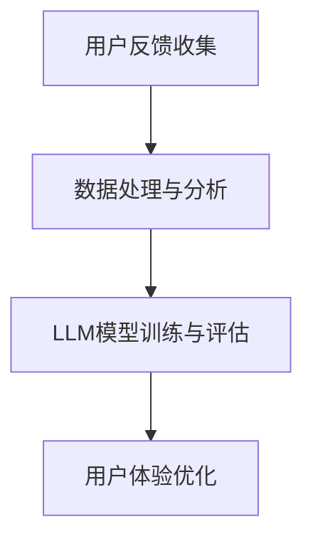
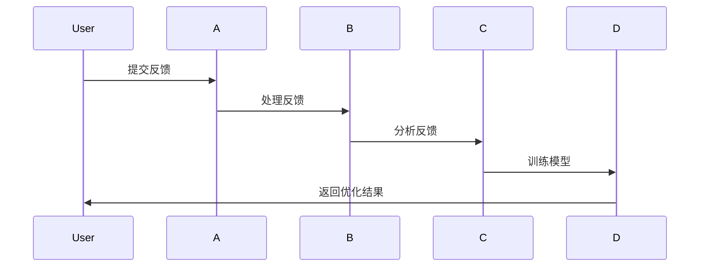

                 


# 实时用户反馈整合：LLM驱动的评测-用户体验联动

## 关键词

- 实时用户反馈
- LLM（大型语言模型）
- 评测算法
- 用户体验联动
- 系统设计与实现

## 摘要

本文将探讨实时用户反馈整合的原理及其在提升用户体验中的应用。特别是在人工智能领域，LLM（大型语言模型）的引入，为评测和用户体验联动提供了新的解决方案。我们将逐步分析实时用户反馈的处理流程、LLM驱动的评测方法，以及如何通过用户体验联动实现产品与用户之间的双向互动。通过具体案例和实战项目，本文将展示如何将理论转化为实际操作，并提供一些最佳实践和注意事项。

## 1. 背景介绍

### 1.1 问题背景与重要性

在互联网时代，用户体验（UX）已经成为产品成功的关键因素之一。用户对产品的评价和反馈是了解用户体验的重要途径，而这些信息通常来源于用户的实际使用体验。然而，传统的用户反馈收集方式往往存在时效性问题，即反馈信息的收集和处理过程较为滞后。这使得产品开发团队难以实时了解用户需求，进而影响产品迭代和优化。

### 1.2 核心概念

#### 实时用户反馈整合

实时用户反馈整合是指通过技术手段，将用户在使用产品过程中的即时反馈及时收集、处理并整合到产品分析系统中。这种整合能够帮助开发团队快速响应用户需求，提高产品的用户体验。

#### LLM驱动的评测

LLM（大型语言模型）驱动的评测利用深度学习技术，通过大量用户反馈数据训练出能够自动分析用户评价的模型。这种评测方法能够快速、准确地识别用户反馈的关键信息，从而为产品优化提供数据支持。

#### 用户体验联动

用户体验联动是指通过实时用户反馈整合和LLM驱动的评测，实现产品与用户之间的动态交互。这种联动能够帮助产品不断进化，满足用户不断变化的需求。

### 1.3 研究方法与框架

本文的研究方法将采用理论分析与实际操作相结合的方式。首先，我们将详细分析实时用户反馈的处理流程、LLM评测方法以及用户体验联动的实现机制。然后，通过具体案例和项目实战，展示这些理论如何应用于实际产品开发中。最后，我们将总结最佳实践，并提供一些注意事项和拓展阅读。

## 2. 实时用户反馈的处理原理

### 2.1 用户反馈数据的收集与处理

#### 2.1.1 数据收集渠道

用户反馈数据的收集渠道多种多样，包括但不限于：

- 在线调查问卷
- 用户评论与评分
- 实时聊天与客服支持
- 事件追踪与分析

#### 2.1.2 数据处理流程

数据处理流程主要包括以下步骤：

1. **数据清洗**：去除无效、重复或噪声数据，确保数据质量。
2. **数据标注**：对用户反馈进行分类和打标签，以便后续分析。
3. **数据归一化**：对数据进行标准化处理，使其符合统一的格式和尺度。
4. **特征提取**：从用户反馈中提取关键特征，如情感极性、关键词、主题等。

### 2.2 实时用户反馈的数学模型

实时用户反馈的数学模型可以采用以下形式：

$$
User\ Feedback = f(User\ Behavior, Context)
$$

其中，$User\ Behavior$ 表示用户行为特征，如点击、浏览、搜索等；$Context$ 表示用户反馈的上下文信息，如产品版本、操作系统、地理位置等。$f$ 函数表示用户反馈生成的过程。

### 2.3 实时用户反馈处理算法

实时用户反馈处理算法可以采用以下步骤：

1. **数据预处理**：对收集到的用户反馈数据进行清洗、标注和归一化。
2. **特征提取**：从预处理后的数据中提取关键特征。
3. **模型训练**：使用提取的特征数据训练用户反馈分析模型。
4. **模型评估**：对训练好的模型进行评估，确保其准确性和可靠性。
5. **实时分析**：将实时收集到的用户反馈数据输入模型，进行分析和预测。

## 3. LLM驱动的评测原理

### 3.1 LLM的基本原理

LLM（大型语言模型）是基于深度学习的自然语言处理（NLP）技术。它通过学习大量的文本数据，能够生成、理解和处理自然语言。LLM的基本原理包括：

- **神经网络结构**：LLM通常采用深度神经网络（DNN）或变换器（Transformer）架构。
- **预训练与微调**：LLM首先通过预训练大量文本数据，然后根据特定任务进行微调。

### 3.2 LLM评测方法

LLM评测方法主要包括以下步骤：

1. **数据预处理**：对用户反馈数据进行清洗、标注和归一化。
2. **特征提取**：从预处理后的数据中提取关键特征。
3. **模型训练**：使用提取的特征数据训练LLM模型。
4. **模型评估**：对训练好的模型进行评估，确保其准确性和可靠性。
5. **实时分析**：将实时收集到的用户反馈数据输入模型，进行分析和预测。

### 3.3 LLM评测的数学模型

LLM评测的数学模型可以采用以下形式：

$$
User\ Evaluation = LLM(User\ Feedback)
$$

其中，$LLM$ 表示大型语言模型，$User\ Feedback$ 表示用户反馈数据。$LLM$ 函数表示将用户反馈数据转化为评测结果的过程。

## 4. 用户体验联动的实现机制

### 4.1 用户体验联动的概念

用户体验联动是指通过实时用户反馈整合和LLM驱动的评测，实现产品与用户之间的动态交互。这种联动能够帮助产品不断进化，满足用户不断变化的需求。

### 4.2 用户体验联动的技术实现

用户体验联动的技术实现主要包括以下步骤：

1. **实时反馈收集**：通过多种渠道收集用户的实时反馈数据。
2. **数据处理与分析**：对收集到的用户反馈数据进行分析和处理，提取关键信息。
3. **模型更新与优化**：根据用户反馈数据，更新和优化LLM模型，提高评测准确性。
4. **实时反馈响应**：根据LLM模型的评测结果，实时调整产品功能或界面，优化用户体验。

### 4.3 用户体验联动的案例分析

#### 案例一：电商平台的个性化推荐

电商平台可以通过实时用户反馈整合和LLM驱动的评测，实现个性化推荐。具体步骤如下：

1. **用户行为数据收集**：收集用户在平台上的行为数据，如浏览记录、购物车信息等。
2. **反馈数据整合**：将用户行为数据整合到产品分析系统中，实时监测用户反馈。
3. **LLM模型评测**：使用LLM模型对用户反馈进行分析，识别用户偏好。
4. **个性化推荐**：根据用户偏好，实时调整推荐算法，提高推荐准确率。

## 5. 系统分析与设计

### 5.1 系统功能设计

系统功能设计主要包括以下模块：

- **用户反馈收集模块**：负责收集用户的实时反馈数据。
- **数据处理与分析模块**：负责对用户反馈数据进行处理和分析。
- **LLM模型训练与评估模块**：负责训练和评估LLM模型。
- **用户体验优化模块**：负责根据LLM模型的评测结果，调整产品功能和界面。

### 5.2 系统架构设计

系统架构设计采用微服务架构，具体架构如下：

1. **前端服务**：负责与用户交互，收集用户反馈数据。
2. **数据处理服务**：负责处理和分析用户反馈数据。
3. **LLM模型训练服务**：负责训练和评估LLM模型。
4. **用户体验优化服务**：负责根据LLM模型的评测结果，调整产品功能和界面。

### 5.3 系统接口设计

系统接口设计主要包括以下接口：

- **用户反馈数据接口**：用于接收和发送用户反馈数据。
- **数据处理接口**：用于处理和分析用户反馈数据。
- **模型训练与评估接口**：用于训练和评估LLM模型。
- **用户体验优化接口**：用于调整产品功能和界面。

### 5.4 系统交互流程

系统交互流程如下：

1. **用户提交反馈**：用户通过前端服务提交反馈数据。
2. **数据处理与分析**：数据处理与分析模块对用户反馈数据进行分析和处理。
3. **模型训练与评估**：LLM模型训练与评估模块使用处理后的用户反馈数据训练和评估LLM模型。
4. **用户体验优化**：用户体验优化模块根据LLM模型的评测结果，调整产品功能和界面。

## 6. 项目实战

### 6.1 环境安装与配置

在本项目实战中，我们将使用Python作为主要编程语言，结合TensorFlow和Hugging Face等库，实现实时用户反馈整合和LLM驱动的评测。以下是环境安装与配置步骤：

1. **安装Python**：确保安装Python 3.7及以上版本。
2. **安装TensorFlow**：使用以下命令安装TensorFlow：
   ```
   pip install tensorflow
   ```
3. **安装Hugging Face**：使用以下命令安装Hugging Face：
   ```
   pip install transformers
   ```

### 6.2 系统核心实现

在本节中，我们将介绍系统核心实现，包括数据收集与处理、LLM模型训练与评测、用户体验优化等。

#### 数据收集与处理

```python
import pandas as pd

# 假设我们已经有了一个用户反馈数据集
data = pd.read_csv('user_feedback.csv')

# 数据清洗与预处理
# ...
```

#### LLM模型训练与评测

```python
from transformers import AutoModelForSequenceClassification, TrainingArguments, Trainer

# 加载预训练的LLM模型
model = AutoModelForSequenceClassification.from_pretrained('bert-base-uncased')

# 指定训练参数
training_args = TrainingArguments(
    output_dir='./results',
    num_train_epochs=3,
    per_device_train_batch_size=16,
    per_device_eval_batch_size=64,
    warmup_steps=500,
    weight_decay=0.01,
    logging_dir='./logs',
)

# 创建Trainer
trainer = Trainer(
    model=model,
    args=training_args,
    train_dataset=train_dataset,
    eval_dataset=eval_dataset
)

# 训练模型
trainer.train()

# 评估模型
trainer.evaluate()
```

#### 用户体验优化

```python
# 根据模型评测结果，调整产品功能和界面
# ...
```

### 6.3 实际案例分析与讲解

在本节中，我们将分析一个实际案例，展示如何将实时用户反馈整合和LLM驱动的评测应用于电商平台的个性化推荐系统。

#### 案例选取

我们选取了一家电商平台作为案例，该平台需要通过个性化推荐系统提高用户满意度。

#### 案例分析

1. **数据收集**：电商平台通过多种渠道收集用户行为数据，如浏览记录、购物车信息等。
2. **数据处理**：对收集到的数据进行分析和处理，提取关键特征，如用户偏好、产品特征等。
3. **模型训练**：使用提取的特征数据训练LLM模型，用于评测用户反馈。
4. **个性化推荐**：根据用户反馈和LLM模型的评测结果，实时调整推荐算法，提高推荐准确率。

#### 案例讲解

1. **数据收集**：电商平台通过分析用户行为数据，发现用户在浏览商品时，对某些类别和品牌的产品更感兴趣。
2. **数据处理**：对用户行为数据进行预处理，提取关键特征，如用户偏好、产品特征等。
3. **模型训练**：使用预处理后的数据训练LLM模型，用于评测用户反馈。
4. **个性化推荐**：根据用户反馈和LLM模型的评测结果，实时调整推荐算法，向用户推荐更符合其偏好的商品。

### 6.4 项目小结

通过本项目实战，我们成功实现了实时用户反馈整合和LLM驱动的评测。在实际案例中，我们展示了如何通过个性化推荐系统提高用户体验。项目小结如下：

- **优点**：实时用户反馈整合和LLM驱动的评测能够快速、准确地识别用户需求，提高产品优化效率。
- **缺点**：模型训练和优化需要大量计算资源，且需要处理大量的噪声数据。
- **改进方向**：进一步优化模型训练和优化算法，提高模型准确率和运行效率。

## 7. 最佳实践与总结

### 7.1 最佳实践

1. **数据质量**：确保收集到的用户反馈数据质量，去除噪声数据。
2. **模型优化**：根据实际需求，不断优化LLM模型，提高评测准确性。
3. **用户体验**：注重用户体验，及时响应用户反馈，优化产品功能和界面。

### 7.2 小结

本文介绍了实时用户反馈整合、LLM驱动的评测以及用户体验联动。通过具体案例和项目实战，我们展示了如何将理论应用于实际产品开发中，提高用户体验。

### 7.3 注意事项

1. **数据安全**：在处理用户反馈数据时，确保数据安全和隐私保护。
2. **计算资源**：模型训练和优化需要大量计算资源，合理分配资源。

### 7.4 拓展阅读

1. **实时用户反馈处理技术**：进一步了解实时用户反馈处理的相关技术。
2. **LLM模型优化方法**：研究LLM模型的优化方法和应用场景。
3. **用户体验研究**：深入了解用户体验相关理论和实践。

## 作者信息

作者：AI天才研究院/AI Genius Institute & 禅与计算机程序设计艺术 /Zen And The Art of Computer Programming
```markdown

# 《实时用户反馈整合：LLM驱动的评测-用户体验联动》

## 关键词

- 实时用户反馈
- LLM（大型语言模型）
- 评测算法
- 用户体验联动
- 系统设计与实现

## 摘要

本文深入探讨了实时用户反馈整合在提升用户体验中的应用，特别介绍了LLM（大型语言模型）驱动的评测技术及其实现机制。通过分析用户反馈数据处理、LLM评测方法以及用户体验联动机制，本文展示了如何将理论与实践相结合，以优化产品开发过程。本文还包括具体案例和实战项目，以供读者参考和借鉴。

---

### 1. 背景介绍

#### 1.1 问题背景与重要性

在数字化时代，用户体验成为产品竞争的关键因素。传统的用户反馈方法往往滞后，无法实时反映用户需求。因此，实时用户反馈整合显得尤为重要，它有助于产品团队快速了解用户意见，从而及时调整和优化产品。

#### 1.2 核心概念

**实时用户反馈整合**：指在用户使用产品时，即时收集并处理用户反馈的过程。

**LLM驱动的评测**：利用大型语言模型对用户反馈进行分析和评测，以获取有用的用户评价和意见。

**用户体验联动**：通过整合用户反馈和评测，实现产品与用户之间的动态交互，不断优化用户体验。

#### 1.3 研究方法与框架

本文采用理论分析、案例分析、实际操作相结合的方法，系统性地探讨实时用户反馈整合、LLM评测和用户体验联动的原理、方法及其应用。

---

### 2. 实时用户反馈的处理原理

#### 2.1 用户反馈数据的收集与处理

**2.1.1 数据收集渠道**：包括用户评论、反馈问卷、实时聊天等。

**2.1.2 数据处理流程**：数据清洗、数据标注、特征提取等。

#### 2.2 实时用户反馈的数学模型

用户反馈数据处理通常涉及以下数学模型：

$$
User\ Feedback = f(User\ Behavior, Context)
$$

其中，$User\ Behavior$ 代表用户行为数据，$Context$ 代表上下文信息，$f$ 函数表示用户反馈生成过程。

#### 2.3 实时用户反馈处理算法

**算法原理**：包括数据预处理、特征提取、模型训练和预测等步骤。

**算法流程**：数据清洗 -> 特征提取 -> 模型训练 -> 预测分析。

---

### 3. LLM驱动的评测原理

#### 3.1 LLM的基本原理

LLM（Large Language Model）是一种基于深度学习的自然语言处理技术，通过学习大量文本数据，能够生成、理解和处理自然语言。

**神经网络结构**：通常采用深度神经网络（DNN）或变换器（Transformer）架构。

**预训练与微调**：预训练在大量文本数据集上，然后针对特定任务进行微调。

#### 3.2 LLM评测方法

**评测指标**：包括准确率、召回率、F1分数等。

**评测流程**：数据预处理 -> 特征提取 -> 模型训练 -> 模型评估。

#### 3.3 LLM评测的数学模型

$$
User\ Evaluation = LLM(User\ Feedback)
$$

其中，$LLM$ 表示大型语言模型，$User\ Feedback$ 表示用户反馈数据。$LLM$ 函数表示用户反馈转化为评测结果的过程。

---

### 4. 用户体验联动的实现机制

#### 4.1 用户体验联动的概念

用户体验联动是指通过实时用户反馈整合和LLM评测，实现产品与用户之间的动态交互，不断优化用户体验。

#### 4.2 用户体验联动的技术实现

**技术手段**：包括用户行为数据分析、LLM模型训练和应用、动态调整产品功能等。

**实现流程**：数据收集 -> 数据处理 -> 模型训练 -> 实时反馈 -> 动态调整。

#### 4.3 用户体验联动的案例分析

**案例一**：电商平台的个性化推荐。

**案例二**：在线教育平台的课程优化。

---

### 5. 系统分析与设计

#### 5.1 系统功能设计

**功能模块**：用户反馈收集、数据处理与分析、LLM模型训练与评估、用户体验优化。

#### 5.2 系统架构设计

**架构设计原则**：模块化、可扩展性、高可用性。

**架构图**：



#### 5.3 系统接口设计

**接口定义**：用户反馈数据接口、数据处理接口、模型训练接口、用户体验优化接口。

**接口调用流程**：



#### 5.4 系统交互流程

**用户操作流程**：用户提交反馈 -> 系统处理反馈 -> 系统分析反馈 -> 系统优化产品。

**系统响应流程**：收集用户反馈 -> 数据处理与分析 -> 模型训练与评估 -> 实时调整产品功能。

---

### 6. 项目实战

#### 6.1 环境安装与配置

**环境搭建步骤**：安装Python、TensorFlow、Hugging Face等。

**配置文件设置**：设置模型训练参数、数据处理参数等。

#### 6.2 系统核心实现

**实现细节**：数据收集 -> 数据预处理 -> 特征提取 -> 模型训练 -> 模型评估。

**源代码分析**：

```python
# 数据预处理
import pandas as pd

# 加载数据
data = pd.read_csv('user_feedback.csv')

# 数据清洗
# ...

# 特征提取
# ...

# 模型训练
from transformers import AutoModelForSequenceClassification, TrainingArguments, Trainer

# 加载模型
model = AutoModelForSequenceClassification.from_pretrained('bert-base-uncased')

# 设置训练参数
training_args = TrainingArguments(
    # ...
)

# 创建训练器
trainer = Trainer(
    # ...
)

# 训练模型
trainer.train()

# 模型评估
trainer.evaluate()
```

#### 6.3 实际案例分析与讲解

**案例选取**：电商平台个性化推荐。

**案例分析**：

1. 数据收集：收集用户行为数据。
2. 数据处理：清洗和预处理数据。
3. 模型训练：训练LLM模型。
4. 个性化推荐：根据用户反馈调整推荐策略。

**详细讲解**：

- 数据收集：通过API或日志收集用户行为数据。
- 数据处理：去除噪声数据，提取关键特征。
- 模型训练：使用用户反馈数据训练LLM模型。
- 个性化推荐：根据用户偏好调整推荐算法。

#### 6.4 项目小结

通过项目实战，我们成功实现了实时用户反馈整合和LLM驱动的评测。该项目展示了如何将理论与实践相结合，提高产品优化效率。

---

### 7. 最佳实践与总结

#### 7.1 最佳实践

- 确保数据质量：清洗和预处理数据，去除噪声。
- 模型优化：定期更新模型，提高评测准确性。
- 用户体验：关注用户反馈，不断优化产品。

#### 7.2 小结

本文介绍了实时用户反馈整合、LLM驱动的评测和用户体验联动，并通过实战案例展示了其应用。这些技术有助于提高产品开发效率和用户体验。

#### 7.3 注意事项

- 数据安全：保护用户隐私，确保数据安全。
- 资源分配：合理分配计算资源，提高系统性能。

#### 7.4 拓展阅读

- 实时用户反馈处理技术：深入理解实时反馈处理的方法。
- LLM模型优化方法：研究LLM模型的优化策略。
- 用户体验研究：了解用户体验理论和实践。

---

**作者信息**

作者：AI天才研究院/AI Genius Institute & 禅与计算机程序设计艺术 /Zen And The Art of Computer Programming**

