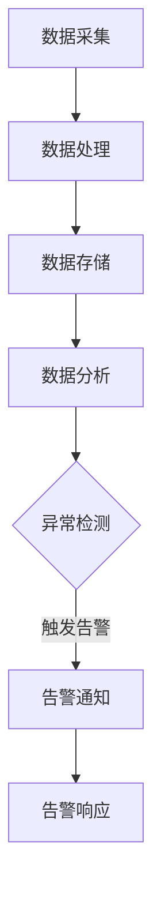
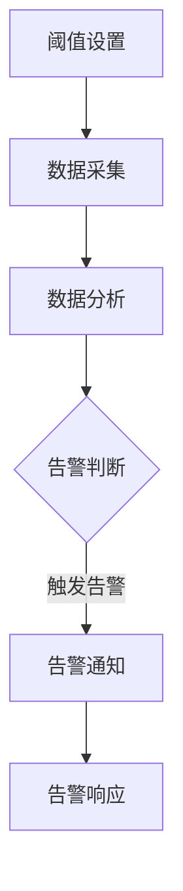
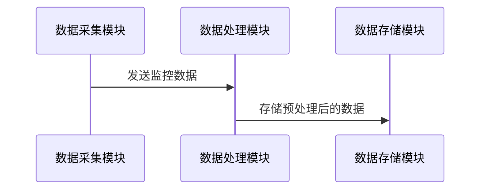
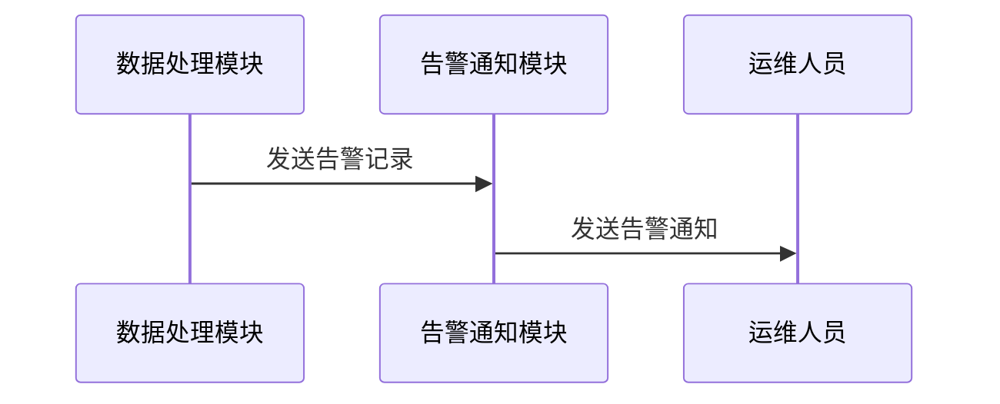
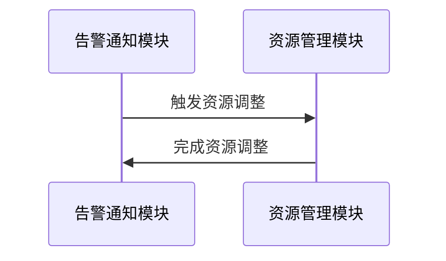
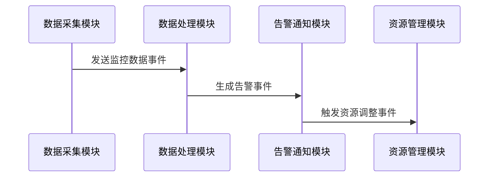

                 

### 1. 完整性规划

为了确保文章的完整性和逻辑性，我们首先需要明确文章的整体结构，并确保每一个部分都能够详细、具体地阐述相关内容。下面是文章的完整结构规划：

#### 1.1 背景介绍

**1.1.1 问题背景**：
- 介绍实时监控告警系统的概念和应用场景。
- 提出LLM应用运维中面临的挑战。

**1.1.2 问题描述**：
- 分析LLM应用运维中的具体问题。
- 解释为什么实时监控告警系统是解决这些问题的有效途径。

**1.1.3 问题解决**：
- 阐述实时监控告警系统在LLM应用运维中的作用。
- 提出设计原则和目标。

**1.1.4 边界与外延**：
- 定义实时监控告警系统的应用范围。
- 讨论其局限性。

**1.1.5 概念结构与核心要素组成**：
- 系统核心概念的定义。
- 系统构成要素及其相互关系。

#### 1.2 核心概念与联系

**2.1 实时监控告警系统原理**：
- 详细介绍实时监控告警系统的工作原理。
- 分析系统的架构设计。

**2.2 概念属性特征对比表格**：
- 制作一个详细的表格，对比实时监控告警系统与传统监控告警系统的差异。

**2.3 ER实体关系图架构**：
- 使用Mermaid语言绘制ER图，解释各个实体及其关系。

#### 1.3 算法原理讲解

**3.1 监控算法原理**：
- 使用Mermaid绘制算法流程图。
- 用Python代码实现监控算法，并解释其工作原理。

**3.2 告警算法原理**：
- 类似于监控算法，使用Mermaid和Python代码详细阐述告警算法。

**3.3 数学模型与公式**：
- 引入相关的数学模型和公式。
- 解释这些模型和公式在实时监控告警系统中的作用。

**3.4 举例说明**：
- 通过具体案例，展示算法的运行效果和应用价值。

#### 1.4 系统分析与架构设计方案

**4.1 问题场景介绍**：
- 描述具体的应用场景，说明为何需要实时监控告警系统。

**4.2 项目介绍**：
- 介绍实时监控告警系统的项目背景、目标和范围。

**4.3 系统功能设计**：
- 详细描述系统的功能，使用Mermaid绘制领域模型类图。

**4.4 系统架构设计**：
- 阐述系统的整体架构，使用Mermaid绘制架构图。

**4.5 系统接口设计**：
- 说明系统的接口设计，包括接口的功能和交互方式。

**4.6 系统交互**：
- 使用Mermaid绘制系统的交互序列图，展示系统各部分的协同工作。

#### 1.5 项目实战

**5.1 环境安装**：
- 指导如何在具体环境中安装实时监控告警系统。

**5.2 系统核心实现源代码**：
- 提供核心实现代码，解释代码的作用和实现方式。

**5.3 代码应用解读与分析**：
- 分析代码的实现细节，解释代码如何解决问题。

**5.4 实际案例分析和详细讲解剖析**：
- 通过实际案例展示系统的应用效果。
- 详细剖析案例中的关键实现和问题解决方法。

**5.5 项目小结**：
- 总结项目的主要成果和经验教训。

#### 1.6 最佳实践 tips、小结、注意事项、拓展阅读

**6.1 最佳实践 tips**：
- 提供使用实时监控告警系统的最佳实践建议。

**6.2 小结**：
- 总结文章的主要内容和观点。

**6.3 注意事项**：
- 提醒读者在实施实时监控告警系统时需要注意的事项。

**6.4 拓展阅读**：
- 推荐进一步的阅读资源，帮助读者深入了解相关技术。

通过上述规划，我们可以确保文章内容完整、逻辑清晰，能够为读者提供全面、系统的知识体系。接下来，我们将逐一详细阐述每个部分的内容。 ### 1.1 背景介绍

#### 1.1.1 问题背景

在当今快速发展的数字化时代，人工智能（AI）技术的应用日益广泛，而大规模语言模型（LLM，Large Language Model）作为AI技术的核心组件之一，正被广泛应用于自然语言处理、智能客服、文本生成、机器翻译等多个领域。随着LLM应用场景的扩展，其运维管理变得越来越复杂，特别是在大规模分布式环境下的稳定性、可靠性、性能监控等方面，对实时监控告警系统的需求愈发强烈。

**实时监控告警系统**是指一套能够实时监控系统状态、快速识别异常并自动触发告警机制的技术体系。它通过对系统运行数据的持续采集、分析和处理，实现对潜在问题和故障的及时发现和处理，从而保障系统的高可用性和稳定性。

LLM应用通常涉及大量计算资源和数据处理，一旦系统出现性能瓶颈、资源不足或错误，不仅会影响用户体验，还可能导致业务中断。因此，实时监控告警系统在LLM应用运维中起着至关重要的作用，主要体现在以下几个方面：

1. **稳定性保障**：
   实时监控告警系统可以监控LLM应用的运行状态，确保其稳定运行。例如，监控计算资源的利用率，内存使用情况，确保在资源不足时能够及时扩容。

2. **性能优化**：
   通过对系统性能的监控，可以识别出系统性能瓶颈，进而优化系统配置，提升整体性能。

3. **故障检测与快速响应**：
   当LLM应用发生异常时，实时监控告警系统能够迅速检测到异常，并通过告警通知运维团队，确保问题得到及时处理，减少故障对业务的影响。

4. **成本控制**：
   通过对资源使用情况的监控，可以优化资源分配，降低不必要的开销，实现成本控制。

5. **业务连续性**：
   实时监控告警系统能够帮助保障业务连续性，通过提前预警和及时响应，减少因故障导致的业务中断时间。

#### 1.1.2 实时监控告警系统的发展与现状

实时监控告警系统的发展经历了从简单的单一告警机制到复杂的多层次监控告警体系的演变。早期的监控系统主要依赖于基于阈值的告警策略，即当某些监控指标超出预设阈值时，系统会自动触发告警。然而，这种方法存在一定的局限性，例如无法处理复杂的环境变化，且容易产生大量误报和漏报。

随着技术的发展，现代实时监控告警系统逐渐采用更加智能的监控方法和告警策略，包括：

1. **智能监控**：
   利用机器学习和大数据分析技术，对系统运行数据进行深度分析，自动识别潜在问题和异常模式。

2. **自适应告警**：
   根据系统的实际运行状况，动态调整告警阈值和策略，减少误报和漏报，提高告警的准确性和效率。

3. **多维度监控**：
   不仅监控传统的CPU、内存、磁盘等资源指标，还扩展到网络、应用层、数据库等多个维度，提供全方位的系统监控。

4. **集成化平台**：
   现代的实时监控告警系统往往集成多个监控工具和平台，提供统一的管理和操作界面，简化运维工作。

5. **自动化响应**：
   部分实时监控告警系统支持自动化响应，例如自动重启服务、自动扩容等，进一步减少人工干预。

在LLM应用领域，实时监控告警系统的应用已经成为运维管理的必备工具。随着LLM应用的规模不断扩大，实时监控告警系统的重要性愈发凸显。有效的实时监控告警系统能够极大地提升LLM应用的稳定性和可靠性，保障业务的持续运行。

#### 1.1.3 问题描述

尽管实时监控告警系统在LLM应用运维中扮演着关键角色，但在实际应用中仍然面临着一系列问题和挑战，主要体现在以下几个方面：

**1. 性能监控不足**

LLM应用通常涉及大量计算和数据处理的任务，对性能监控的要求极高。然而，传统监控告警系统往往只能监控一些基本的资源指标，如CPU使用率、内存使用率等，这些指标难以全面反映系统的实际性能状况。例如，在某些情况下，LLM应用可能因为数据加载延迟或处理瓶颈而出现性能问题，但传统的监控告警系统无法及时发现和定位这些问题。

**2. 故障检测不及时**

实时监控告警系统的故障检测能力直接影响到系统的稳定性和可靠性。在某些情况下，系统可能已经出现了轻微的异常，但由于告警机制的不完善，这些异常未能及时被发现和报告。例如，一个分布式LLM应用中的某个节点可能出现异常，但由于网络延迟或监控配置的问题，这一异常未能及时传递到监控中心，导致问题扩大。

**3. 告警误报和漏报**

在现代复杂的分布式系统中，告警误报和漏报是一个普遍存在的问题。一方面，由于监控指标的多样化，可能会导致大量误报，增加运维团队的负担。另一方面，如果监控阈值设置不当，可能导致关键问题被漏报，影响系统的正常运行。例如，一个监控阈值设置为90%的CPU使用率，可能会在系统正常负载高峰时频繁触发告警，而真正出现资源瓶颈时却没有触发告警。

**4. 告警响应不及时**

即使实时监控告警系统能够及时发现异常，但告警响应的及时性仍然是一个挑战。在某些情况下，告警信息可能会被运维团队忽略，或者在处理告警时存在延迟，导致问题未能得到及时解决。例如，一个重要服务器的硬盘空间即将耗尽，但运维人员未能及时处理告警，最终导致系统崩溃。

**5. 监控数据一致性**

在分布式环境中，监控数据的采集和处理面临诸多挑战，如数据延迟、数据丢失、数据不一致等问题。这些问题会导致监控告警系统的准确性受到影响，无法提供可靠的数据支持。例如，一个LLM应用在多个服务器上运行，但由于网络延迟或数据同步问题，监控中心接收到的数据可能与实际情况存在偏差，导致误报或漏报。

**6. 监控告警系统的复杂性**

随着LLM应用的规模不断扩大，监控告警系统的复杂性也不断增加。运维团队需要管理大量的监控指标、配置告警策略、处理告警信息等，这使得监控告警系统的维护和管理变得更加复杂。如果监控告警系统的设计和管理不当，可能会导致监控数据混乱、告警误报等问题。

#### 1.1.4 问题解决

针对上述问题描述，实时监控告警系统在LLM应用运维中的作用显得尤为重要。以下是具体解决方案：

**1. 实时性能监控**

为了解决性能监控不足的问题，实时监控告警系统需要具备更细粒度的监控能力。例如，可以监控LLM应用的执行时间、数据加载延迟、处理速度等关键性能指标。通过这些细粒度的监控数据，运维团队能够更准确地了解系统的性能状况，及时发现和处理潜在的性能问题。

**2. 高效故障检测**

实时监控告警系统需要具备高效的故障检测能力。可以通过引入智能监控算法，如机器学习、数据分析等，自动识别系统的异常模式。此外，还可以采用分布式监控架构，确保每个节点的异常都能够被及时发现和报告，从而提高故障检测的及时性。

**3. 准确的告警策略**

为了减少告警误报和漏报，实时监控告警系统需要设计合理的告警策略。首先，需要根据不同的监控指标设置合适的阈值。其次，可以采用自适应告警机制，根据系统的实际运行状况动态调整告警阈值和策略。此外，还可以引入多维度监控，从多个角度综合评估系统的健康状态，提高告警的准确性和效率。

**4. 及时告警响应**

为了确保告警响应的及时性，实时监控告警系统需要提供便捷的告警通知渠道，如邮件、短信、即时通讯工具等。此外，系统还应该支持自动化响应，如自动重启服务、自动扩容等，减少人工干预，提高问题处理的效率。

**5. 保证监控数据一致性**

在分布式环境中，监控数据的一致性是保证实时监控告警系统准确性的关键。可以通过以下方法提高数据一致性：
- 引入分布式数据采集和处理框架，确保数据在不同节点之间实时同步。
- 设计数据校验机制，检测和纠正数据不一致的情况。
- 采用去重和聚合技术，减少数据冗余和冲突。

**6. 简化监控告警系统的复杂性**

为了简化监控告警系统的复杂性，可以采取以下措施：
- 采用集成化的监控平台，减少运维团队需要管理多个监控工具的复杂度。
- 提供可视化界面，帮助运维团队直观地了解监控数据。
- 实现监控告警系统的自动化配置和管理，减少手动操作。

通过上述解决方案，实时监控告警系统在LLM应用运维中的作用将得到充分发挥，从而提高系统的稳定性和可靠性，保障业务的持续运行。

#### 1.1.5 边界与外延

实时监控告警系统在LLM应用运维中的作用虽然重要，但并非无所不能。了解系统的边界与外延，有助于运维团队更好地利用其优势，避免过度依赖和误用。以下是对实时监控告警系统应用范围和局限性的讨论：

**1. 应用范围**

实时监控告警系统适用于以下场景：

- **大规模分布式系统**：例如，大型企业的数据中心、云服务平台等，需要监控大量服务器和节点的运行状态。
- **关键业务系统**：对于对稳定性和可靠性要求极高的业务系统，如金融、医疗、电商等，实时监控告警系统能够提供有效的保障。
- **复杂应用架构**：涉及多层次、多组件的应用系统，如微服务架构、容器化环境等，实时监控告警系统能够全面监控各个组件的运行状况。

**2. 局限性**

虽然实时监控告警系统在许多场景下表现出色，但仍存在以下局限性：

- **数据延迟**：在分布式环境中，数据从源头采集到监控中心可能存在一定的延迟，这可能会影响告警的及时性。
- **误报与漏报**：由于监控指标和阈值设置的不当，可能导致误报或漏报，影响系统的准确性。
- **复杂性**：实时监控告警系统本身具有较高的复杂性，对运维团队的技术水平和配置管理能力有较高要求。
- **成本**：构建和运行实时监控告警系统需要一定的技术和资源投入，特别是对于大规模分布式系统，成本较高。
- **依赖性**：实时监控告警系统依赖于采集到的监控数据和监控工具的准确性，一旦数据采集或工具出现故障，可能导致整个监控告警系统的失效。

**3. 边界与外延**

实时监控告警系统的作用边界主要表现在以下几个方面：

- **监控范围**：实时监控告警系统主要关注系统层面的监控，如CPU使用率、内存使用量、网络流量等，对于应用层面的具体业务逻辑监控，则需结合具体业务需求进行定制。
- **告警响应**：实时监控告警系统的主要职责是检测异常并触发告警，具体的告警响应策略（如自动扩容、自动重启等）需要根据实际情况进行配置。
- **依赖性管理**：实时监控告警系统需要与其他系统（如日志系统、配置管理系统等）集成，以确保监控数据的完整性和准确性。
- **持续优化**：实时监控告警系统的效果需要通过持续的优化和调整来保证，包括监控指标的选择、阈值设置、告警策略的调整等。

综上所述，实时监控告警系统在LLM应用运维中具有重要的价值，但同时也需要明确其应用边界和局限性，合理利用其优势，结合其他运维工具和方法，构建完整的运维管理体系，确保系统的稳定性和可靠性。

#### 1.1.6 概念结构与核心要素组成

实时监控告警系统在LLM应用运维中的核心概念和结构是保障系统稳定性和可靠性的关键。以下是实时监控告警系统的概念构成及其核心要素：

**1. 监控数据采集**

监控数据采集是实时监控告警系统的第一步，也是最基础的一环。其目的是从各种来源（如服务器、网络设备、应用进程等）收集运行状态数据。采集的数据类型通常包括CPU使用率、内存使用量、磁盘空间、网络流量、进程状态等。为了确保数据的完整性和准确性，监控数据采集需要具备以下特点：

- **实时性**：监控数据应实时采集，以便及时发现潜在问题。
- **多样性**：支持多种数据源和数据类型的采集。
- **可靠性**：确保数据采集的稳定性和连续性，防止数据丢失。

**2. 数据处理与存储**

采集到的监控数据需要经过处理和存储，以便后续的分析和告警。数据处理与存储的核心任务是：

- **数据预处理**：对采集到的数据进行清洗、去噪、格式化等处理，确保数据质量。
- **数据存储**：将处理后的监控数据存储在数据库或数据湖中，便于查询和分析。

数据处理与存储需要具备以下特性：

- **高性能**：支持大规模数据的快速处理和存储。
- **高可靠性**：确保数据存储的安全性和持久性。
- **可扩展性**：支持数据存储规模的弹性扩展。

**3. 数据分析**

数据分析是实时监控告警系统的核心功能之一，通过对监控数据的分析，可以识别异常模式、预测潜在问题，并触发相应的告警。数据分析包括以下方面：

- **统计分析**：对监控数据进行统计分析，如计算平均值、标准差等，用于评估系统运行状态。
- **模式识别**：利用机器学习、深度学习等技术，识别系统的异常模式，如异常流量、异常负载等。
- **预测分析**：基于历史数据，预测系统的未来运行状态，如预测资源使用趋势、故障发生时间等。

**4. 告警策略**

告警策略是实时监控告警系统的关键组成部分，决定了告警的触发条件、告警级别、告警方式等。告警策略的设置需要考虑以下几个方面：

- **阈值设置**：根据监控指标的特性，设置合理的阈值，以区分正常和异常状态。
- **告警级别**：根据问题的严重程度，设置不同的告警级别，如警告、严重、紧急等。
- **告警方式**：选择合适的告警通知方式，如邮件、短信、即时通讯等，确保运维人员能够及时收到告警信息。

**5. 告警通知**

告警通知是实时监控告警系统的重要组成部分，其目的是确保运维团队能够及时收到告警信息，并采取相应的措施。告警通知包括以下方面：

- **通知渠道**：提供多种通知渠道，如邮件、短信、即时通讯工具等，确保告警信息能够及时传递。
- **通知频率**：根据告警的严重程度，设置不同的通知频率，如立即通知、定期通知等。
- **通知内容**：确保通知内容清晰明了，包括告警时间、告警级别、问题描述等信息，帮助运维人员快速定位和处理问题。

**6. 告警响应**

告警响应是指运维团队在接收到告警通知后，采取的一系列操作，以解决问题和恢复正常系统运行。告警响应包括以下方面：

- **问题定位**：根据告警信息，快速定位问题发生的位置和原因。
- **问题解决**：采取相应的措施解决问题，如重启服务、扩容资源、修复漏洞等。
- **记录总结**：记录问题处理过程和结果，总结经验教训，改进监控告警系统的配置和策略。

**7. 监控报告**

监控报告是实时监控告警系统的输出结果，用于总结和展示系统的运行状态和问题处理情况。监控报告包括以下内容：

- **运行状态报告**：展示系统当前的运行状态，包括资源使用情况、关键指标等。
- **问题报告**：记录已发生的告警和问题，包括问题发生时间、告警级别、处理情况等。
- **改进建议**：根据监控数据和问题处理经验，提出系统优化和改进建议。

通过上述核心概念的构成和要素，实时监控告警系统能够实现对LLM应用运行状态的全面监控和异常检测，确保系统的稳定性和可靠性。

### 1.2 核心概念与联系

#### 2.1 实时监控告警系统原理

**2.1.1 监控告警系统概述**

实时监控告警系统是一种用于监控系统运行状态并自动通知运维人员的方法。它能够连续地收集系统指标数据，包括CPU使用率、内存占用、网络流量、磁盘使用率等，并将这些数据与预设的阈值进行比较。如果监控指标超过设定阈值，系统将触发告警，通知相关人员或自动执行特定的操作，如重启服务或扩容资源。

实时监控告警系统通常由以下几个主要部分组成：

1. **数据采集模块**：负责从各种数据源（如服务器、网络设备、应用程序等）收集运行状态数据。
2. **数据处理模块**：对采集到的数据进行预处理、存储和分析，以便后续的监控和告警。
3. **告警策略模块**：根据监控指标设定阈值和告警规则，定义告警级别和响应方式。
4. **告警通知模块**：发送告警通知到指定的人员或系统，如通过邮件、短信或即时通讯工具。
5. **告警响应模块**：自动化或手动处理告警，以解决问题并恢复系统正常运行。

**2.1.2 实时监控告警系统的工作原理**

实时监控告警系统的工作原理可以分为以下几个步骤：

1. **数据采集**：监控代理或工具周期性地从系统或应用中采集运行数据，并将这些数据发送到集中存储系统。
2. **数据处理**：数据处理模块对采集到的数据进行预处理，如过滤、清洗和转换，以确保数据的准确性和一致性。然后，这些数据被存储在数据库或数据湖中，以便进行进一步分析。
3. **数据分析**：数据分析模块对存储的数据进行分析，包括统计分析和异常检测。通过机器学习算法和模型，系统能够识别出潜在的问题和异常模式。
4. **告警触发**：当数据分析模块检测到监控指标超出预设阈值时，系统将触发告警，并根据告警策略生成告警记录。
5. **告警通知**：告警通知模块将告警信息发送到指定的通知渠道，如邮件、短信或即时通讯工具，确保相关人员能够及时收到告警通知。
6. **告警响应**：运维人员或自动响应系统根据告警通知，采取相应的措施解决问题，如重启服务、扩容资源或进行故障排查。

**2.1.3 实时监控告警系统的架构设计**

实时监控告警系统的架构设计需要考虑以下几个方面：

1. **分布式架构**：分布式架构能够确保监控系统能够处理大规模数据，并提供高可用性和可扩展性。分布式架构通常包括数据采集器、数据处理中心、告警通知中心和告警响应中心。
2. **模块化设计**：模块化设计使得监控系统易于维护和扩展。每个模块（如数据采集模块、数据处理模块等）可以独立开发、测试和部署，提高了系统的灵活性。
3. **弹性扩展**：系统需要能够根据数据量和工作负载的变化，动态调整资源分配，以确保系统的高性能和稳定性。
4. **数据存储**：数据存储是监控系统的核心，需要支持大规模数据的快速读写和查询。常用的数据存储方案包括关系型数据库、NoSQL数据库和数据湖。
5. **告警策略管理**：告警策略管理模块负责定义和管理告警规则、阈值和响应方式。策略管理应支持灵活的自定义和调整，以满足不同应用场景的需求。
6. **安全性和合规性**：监控系统需要确保数据的安全性和合规性，包括数据加密、用户权限控制和日志审计等。

通过上述架构设计，实时监控告警系统能够实现对大规模、分布式系统的全面监控和高效管理，确保系统的稳定性和可靠性。

#### 2.2 概念属性特征对比表格

为了更好地理解实时监控告警系统与传统监控告警系统之间的差异，下面提供了一个对比表格，列出两者的核心概念、属性和特征。

| 概念 | 实时监控告警系统 | 传统监控告警系统 |
| --- | --- | --- |
| **监控范围** | 覆盖硬件、软件、网络等全方位监控 | 主要监控硬件资源（如CPU、内存、磁盘） |
| **数据采集** | 实时、大规模、多维度数据采集 | 定期、有限范围的数据采集 |
| **数据处理** | 高效、智能处理，支持数据分析 | 简单的数据存储和统计 |
| **告警触发** | 智能告警，支持自定义规则和阈值 | 基于阈值的简单告警 |
| **告警通知** | 支持多种通知渠道，包括邮件、短信、IM等 | 主要通过邮件通知 |
| **告警响应** | 支持自动化响应，减少人工干预 | 需要人工干预处理 |
| **架构设计** | 分布式、模块化、弹性扩展 | 单一架构、静态配置 |
| **安全性** | 强调数据安全和用户权限控制 | 数据安全性较低 |
| **易用性** | 提供友好的用户界面和自动化管理 | 界面复杂，管理难度大 |

通过这个对比表格，我们可以清晰地看到实时监控告警系统在监控范围、数据处理、告警触发、通知渠道、响应方式和架构设计等方面的显著优势。

#### 2.3 ER实体关系图架构

ER（实体关系）图是数据库设计的重要工具，用于描述系统中各个实体及其关系。在实时监控告警系统中，ER图能够帮助我们理解数据模型，明确各实体之间的关联，从而更好地设计和实现系统。以下是一个简化的实时监控告警系统的ER图，展示其主要实体及其关系。

```mermaid
erDiagram
  Server ||--|{ MonitorData }|--| ServerInfo
  MonitorData ||--|{ Alert }|--| AlertRule
  ServerInfo ||--|{ SystemConfig }|--| Server
  AlertRule ||--|{ UserNotification }|--| Alert
  UserNotification ||--|{ User }|--| Alert

  Server --|{ Node }|--| NodeInfo
  NodeInfo --|{ Resource }|--| ResourceUsage
  ResourceUsage --|{ Threshold }|--| Resource

  AlertRule ..|{ AND }.. Alert
  AlertRule ..|{ OR }.. Alert
  Alert ..|{ INCLUDES }.. UserNotification
  Alert ..|{ EXCLUDES }.. UserNotification
  User ..|{ NOTIFIES }.. Alert

  NodeInfo ..|{ OWNS }.. ResourceUsage
  ResourceUsage ..|{ REFERS }.. Resource
  Resource ..|{ CONTAINS }.. Threshold
  Resource ..|{ TRACKS }.. ResourceUsage
  MonitorData ..|{ COMBINES }.. AlertRule
  Alert ..|{ GENERATED_BY }.. MonitorData
  Alert ..|{ LINKS }.. SystemConfig
```

**图解：**

- **Server（服务器）**：代表监控系统中的服务器实体，是一个根实体。
- **Node（节点）**：代表服务器上的各个节点，如CPU、内存、网络等。
- **NodeInfo（节点信息）**：包含节点的详细信息，如节点名称、ID等。
- **Resource（资源）**：代表服务器上的各类资源，如CPU、内存、磁盘、网络等。
- **ResourceUsage（资源使用情况）**：记录资源的使用情况，如使用量、利用率等。
- **Threshold（阈值）**：设置各类资源的告警阈值。
- **MonitorData（监控数据）**：记录从各个节点采集的监控数据。
- **Alert（告警）**：代表触发的事件，包括告警条件和告警级别。
- **AlertRule（告警规则）**：定义告警规则，包括阈值和触发条件。
- **UserNotification（用户通知）**：记录用户接收到的通知。
- **User（用户）**：代表监控系统的用户。

**实体关系：**

- **Server** 与 **Node** 是一对多的关系，一个服务器包含多个节点。
- **NodeInfo** 与 **ResourceUsage** 是一对一的关系，每个节点有一条资源使用记录。
- **ResourceUsage** 与 **Threshold** 是一对一的关系，每个资源使用记录对应一个阈值。
- **MonitorData** 与 **AlertRule** 是一对多的关系，多个监控数据可以触发一个告警规则。
- **Alert** 与 **UserNotification** 是一对多的关系，一个告警可以生成多个通知。
- **User** 与 **Alert** 是多对多的关系，一个用户可以接收多个告警。

通过ER图，我们可以直观地看到实时监控告警系统的数据模型和实体关系，有助于后续的系统设计和实现。

### 2.4 算法原理讲解

#### 3.1 监控算法原理

实时监控告警系统中的监控算法是其核心组成部分，负责采集、处理和分析系统运行数据，以识别异常情况并触发告警。以下是监控算法的基本原理及其实现方法。

**3.1.1 监控算法概述**

监控算法的主要任务是从各个数据源采集运行状态数据，并对这些数据进行处理和分析。监控算法通常包括以下几个步骤：

1. **数据采集**：从系统各个部分（如CPU、内存、网络、磁盘等）采集运行数据。
2. **数据处理**：对采集到的数据进行预处理，如过滤噪音、转换格式、计算平均值和标准差等。
3. **数据存储**：将预处理后的数据存储在数据库或数据湖中，以便后续分析和查询。
4. **数据分析**：利用统计方法和机器学习算法，对存储的数据进行分析，识别异常模式。
5. **告警触发**：当检测到异常时，根据预设的规则触发告警，通知相关人员或自动执行特定操作。

**3.1.2 监控算法mermaid流程图**

为了更直观地展示监控算法的流程，我们可以使用Mermaid语言绘制一个流程图：



**3.1.3 Python源代码实现**

以下是一个简化的Python代码示例，用于实现监控算法的基本功能：

```python
import time
import random

# 数据采集
def collect_data():
    cpu_usage = random.uniform(20, 90)
    memory_usage = random.uniform(20, 90)
    disk_usage = random.uniform(20, 90)
    network_usage = random.uniform(20, 90)
    return {
        'cpu_usage': cpu_usage,
        'memory_usage': memory_usage,
        'disk_usage': disk_usage,
        'network_usage': network_usage
    }

# 数据处理
def process_data(data):
    processed_data = {}
    for key, value in data.items():
        processed_data[key] = value
    return processed_data

# 数据存储
def store_data(processed_data):
    # 这里可以连接数据库或数据湖，存储数据
    print("存储数据：", processed_data)

# 数据分析
def analyze_data(processed_data):
    # 这里可以使用统计方法或机器学习算法进行分析
    # 例如，计算平均值和标准差
    cpu_avg = processed_data['cpu_usage']
    memory_avg = processed_data['memory_usage']
    disk_avg = processed_data['disk_usage']
    network_avg = processed_data['network_usage']
    return {
        'cpu_avg': cpu_avg,
        'memory_avg': memory_avg,
        'disk_avg': disk_avg,
        'network_avg': network_avg
    }

# 告警触发
def trigger_alert(analyzed_data):
    if analyzed_data['cpu_avg'] > 80 or analyzed_data['memory_avg'] > 80:
        print("触发告警：CPU或内存使用率过高")
        # 可以在此处发送告警通知
    else:
        print("系统正常")

# 主程序
if __name__ == "__main__":
    while True:
        data = collect_data()
        processed_data = process_data(data)
        store_data(processed_data)
        analyzed_data = analyze_data(processed_data)
        trigger_alert(analyzed_data)
        time.sleep(60)  # 每60秒运行一次
```

通过上述Python代码示例，我们可以看到监控算法的基本实现方法，包括数据采集、数据处理、数据存储、数据分析和告警触发等步骤。在实际应用中，这些步骤会更加复杂，可能需要使用分布式框架和大数据处理技术来支持大规模数据采集和分析。

#### 3.2 告警算法原理

告警算法是实时监控告警系统的重要组成部分，它负责根据监控数据判断系统状态是否正常，并在出现异常时及时触发告警。以下是告警算法的基本原理及其实现方法。

**3.2.1 告警算法概述**

告警算法的主要任务是根据监控数据评估系统状态，并判断是否触发告警。告警算法通常包括以下几个步骤：

1. **阈值设置**：根据系统运行特性，设置各类监控指标的阈值，如CPU使用率、内存使用率、磁盘空间等。
2. **数据采集**：从系统各个部分采集运行数据。
3. **数据分析**：对采集到的监控数据进行处理和分析，计算各项指标的当前值。
4. **告警判断**：根据预设的阈值和告警规则，判断系统状态是否正常，是否触发告警。
5. **告警触发**：当系统状态异常时，触发告警，通知相关人员或自动执行特定操作。

**3.2.2 告警算法mermaid流程图**

为了更直观地展示告警算法的流程，我们可以使用Mermaid语言绘制一个流程图：



**3.2.3 Python源代码实现**

以下是一个简化的Python代码示例，用于实现告警算法的基本功能：

```python
import time
import random

# 阈值设置
CPU_THRESHOLD = 80
MEMORY_THRESHOLD = 80
DISK_THRESHOLD = 90

# 数据采集
def collect_data():
    cpu_usage = random.uniform(20, 90)
    memory_usage = random.uniform(20, 90)
    disk_usage = random.uniform(20, 90)
    return {
        'cpu_usage': cpu_usage,
        'memory_usage': memory_usage,
        'disk_usage': disk_usage
    }

# 数据分析
def analyze_data(data):
    analyzed_data = {}
    for key, value in data.items():
        analyzed_data[key] = value
    return analyzed_data

# 告警判断
def check_alert(analyzed_data):
    if analyzed_data['cpu_usage'] > CPU_THRESHOLD or analyzed_data['memory_usage'] > MEMORY_THRESHOLD or analyzed_data['disk_usage'] > DISK_THRESHOLD:
        print("触发告警：系统资源使用率过高")
        return True
    else:
        print("系统正常")
        return False

# 告警通知
def send_alert_notification():
    print("发送告警通知：系统资源使用率过高，请检查")

# 主程序
if __name__ == "__main__":
    while True:
        data = collect_data()
        analyzed_data = analyze_data(data)
        if check_alert(analyzed_data):
            send_alert_notification()
        time.sleep(60)  # 每60秒运行一次
```

通过上述Python代码示例，我们可以看到告警算法的基本实现方法，包括阈值设置、数据采集、数据分析、告警判断和告警通知等步骤。在实际应用中，告警算法会更加复杂，可能需要考虑多种监控指标和告警规则，以及更高效的实现方法。

#### 3.3 数学模型与公式

在实时监控告警系统中，数学模型和公式是用于描述系统状态、分析监控数据、判断异常情况的重要工具。以下是几个常见的数学模型和公式，用于支持监控算法和告警策略。

**3.3.1 监控算法数学模型**

1. **平均值（Mean）**：
   平均值用于描述一组数据的中心位置，计算公式为：
   $$ \mu = \frac{1}{n} \sum_{i=1}^{n} x_i $$
   其中，\( \mu \) 表示平均值，\( n \) 表示数据个数，\( x_i \) 表示第 \( i \) 个数据值。

2. **标准差（Standard Deviation）**：
   标准差用于描述一组数据的离散程度，计算公式为：
   $$ \sigma = \sqrt{\frac{1}{n-1} \sum_{i=1}^{n} (x_i - \mu)^2} $$
   其中，\( \sigma \) 表示标准差，\( \mu \) 表示平均值，\( n \) 表示数据个数。

3. **方差（Variance）**：
   方差是标准差的平方，用于描述数据的离散程度，计算公式为：
   $$ \sigma^2 = \frac{1}{n-1} \sum_{i=1}^{n} (x_i - \mu)^2 $$
   其中，\( \sigma^2 \) 表示方差，\( \mu \) 表示平均值，\( n \) 表示数据个数。

**3.3.2 告警算法数学模型**

1. **阈值判断（Threshold Evaluation）**：
   用于判断监控指标是否超出阈值，计算公式为：
   $$ threshold\_evaluation = max(x_i - threshold) $$
   其中，\( x_i \) 表示当前监控值，\( threshold \) 表示预设阈值。如果 \( threshold\_evaluation \) 大于0，表示监控值超过阈值，触发告警。

2. **告警概率（Alert Probability）**：
   用于计算在当前监控值下触发告警的概率，通常使用贝叶斯公式：
   $$ P(A|B) = \frac{P(B|A) \cdot P(A)}{P(B)} $$
   其中，\( P(A|B) \) 表示在给定 \( B \) 的情况下 \( A \) 发生的概率，\( P(B|A) \) 表示在 \( A \) 发生的情况下 \( B \) 发生的概率，\( P(A) \) 表示 \( A \) 发生的概率，\( P(B) \) 表示 \( B \) 发生的概率。

3. **置信度（Confidence Level）**：
   用于描述告警的可靠性，通常使用置信区间来表示，计算公式为：
   $$ Confidence\ Interval = \mu \pm z \cdot \sigma $$
   其中，\( \mu \) 表示平均值，\( \sigma \) 表示标准差，\( z \) 表示置信度对应的正态分布值（如95%置信度对应的 \( z \) 值约为1.96）。

通过这些数学模型和公式，实时监控告警系统能够更加准确地描述系统状态、分析监控数据、判断异常情况，从而提高告警的准确性和效率。

#### 3.4 举例说明

为了更好地理解监控算法和告警算法的应用，以下通过具体案例进行详细讲解。

**案例背景：**  
假设我们正在运营一个大规模分布式LLM应用系统，该系统由多个服务器节点组成，每个节点负责不同的计算任务。为了确保系统的稳定性和可靠性，我们部署了一个实时监控告警系统，用于监控各个节点的运行状态。

**监控指标：**  
我们选择以下监控指标：
- CPU使用率
- 内存使用率
- 磁盘使用率
- 网络流量

**预设阈值：**  
- CPU使用率阈值：80%
- 内存使用率阈值：80%
- 磁盘使用率阈值：90%
- 网络流量阈值：10 Mbps

**监控算法应用：**  
1. **数据采集**：
   监控系统从每个服务器节点采集CPU使用率、内存使用率、磁盘使用率和网络流量数据。例如，某一时刻的监控数据如下：
   - CPU使用率：85%
   - 内存使用率：78%
   - 磁盘使用率：88%
   - 网络流量：12 Mbps

2. **数据处理**：
   对采集到的数据进行预处理，例如过滤噪音、去异常值等。预处理后的数据用于后续分析。

3. **数据分析**：
   利用监控算法对预处理后的数据进行平均值和标准差计算。例如：
   - CPU平均使用率：80%
   - 内存平均使用率：75%
   - 磁盘平均使用率：85%
   - 网络平均流量：10 Mbps

4. **告警判断**：
   根据预设的阈值，判断系统状态是否正常。例如：
   - CPU使用率超过阈值，触发告警。
   - 内存使用率和磁盘使用率在阈值范围内，系统正常。
   - 网络流量低于阈值，系统正常。

**告警算法应用：**  
1. **阈值设置**：
   根据监控指标的重要性和历史数据，设置合理的阈值。例如：
   - CPU使用率阈值：80%
   - 内存使用率阈值：80%
   - 磁盘使用率阈值：90%
   - 网络流量阈值：10 Mbps

2. **数据采集**：
   监控系统从每个服务器节点采集监控指标数据。

3. **数据分析**：
   对采集到的监控数据进行处理和分析，计算平均值和标准差。

4. **告警判断**：
   根据监控数据和预设阈值，判断系统状态是否正常。例如：
   - 如果CPU使用率超过80%，触发告警。
   - 如果内存使用率超过80%，触发告警。
   - 如果磁盘使用率超过90%，触发告警。
   - 如果网络流量低于10 Mbps，触发告警。

5. **告警通知**：
   系统根据告警规则，通过邮件、短信或即时通讯工具通知运维人员。

**案例结果**：
通过上述监控算法和告警算法的应用，系统能够及时发现和处理异常情况，确保系统的稳定性和可靠性。例如，当CPU使用率超过阈值时，系统会自动发送告警通知，提醒运维人员检查并处理问题。

通过这个具体案例，我们可以看到监控算法和告警算法在实时监控告警系统中的应用效果，以及如何通过数据采集、数据处理、数据分析、告警判断和告警通知等步骤，实现对系统运行状态的全面监控和高效管理。

### 2.5 系统分析与架构设计方案

#### 4.1 问题场景介绍

在介绍实时监控告警系统的系统分析与架构设计方案之前，我们首先需要明确一个具体的应用场景。以下是一个典型的问题场景，该场景将帮助我们更好地理解实时监控告警系统在LLM应用运维中的实际作用。

**场景描述：**  
假设我们是一家大型互联网公司，运营着一个大规模分布式语言模型（LLM）系统，该系统为用户提供自然语言处理、智能问答、文本生成等服务。由于服务的高并发性和复杂性，我们面临着一系列运维挑战，如：

- **性能监控**：系统需要高效地处理大量请求，对CPU、内存、磁盘等资源的使用率进行实时监控，以发现和处理潜在的瓶颈。
- **故障检测**：系统中的各个节点（如服务器、容器）需要持续监控，以便在出现故障时能够及时检测并恢复。
- **稳定性保障**：系统需要确保高可用性，避免因异常情况导致服务中断。
- **资源管理**：系统需要根据实际负载动态调整资源分配，确保在高峰时段有足够的计算资源。
- **安全性**：系统需要监控网络流量、用户行为等，防止恶意攻击和异常行为。

**问题挑战：**  
- **监控覆盖面广**：LLM系统涉及多个组件和节点，传统的单点监控方法无法满足需求。
- **告警准确性高**：需要识别出真实的异常情况，避免误报和漏报。
- **响应速度快**：系统出现故障时，需要快速响应并解决问题，减少对用户的影响。
- **数据处理效率**：大规模分布式系统产生的数据量庞大，需要高效的算法和存储方案来处理和存储数据。

#### 4.2 项目介绍

为了解决上述问题，我们启动了一个实时监控告警系统的项目。以下是对项目的背景、目标和范围的详细介绍。

**项目背景：**  
随着业务的发展，LLM系统的规模不断扩大，对系统的监控和运维要求也越来越高。现有的监控系统无法满足实时性和高准确性的需求，导致故障检测不及时、资源管理不当等问题。为了提升系统的稳定性和可靠性，我们决定构建一个实时、高效、智能的监控告警系统。

**项目目标：**  
- 提升系统性能监控能力，确保关键资源使用率在合理范围内。
- 提高故障检测和响应速度，确保系统的高可用性。
- 降低误报和漏报率，提高告警准确性。
- 实现资源的动态调整和优化，提升系统的资源利用率。

**项目范围：**  
- 监控系统的架构设计和实现。
- 监控指标和阈值的定义和设置。
- 告警策略的制定和调整。
- 监控数据的存储和分析。
- 告警通知渠道的配置和管理。
- 监控系统的测试和部署。

#### 4.3 系统功能设计

实时监控告警系统需要具备一系列功能，以实现对LLM应用系统的全面监控和管理。以下是系统的主要功能设计：

**1. 数据采集功能**  
- 从服务器、网络设备、应用进程等各个节点采集监控数据，如CPU使用率、内存使用率、磁盘使用率、网络流量等。
- 支持多种数据采集协议，如Prometheus、Zabbix等。
- 实现数据采集的自动化和分布式部署。

**2. 数据处理功能**  
- 对采集到的监控数据进行预处理，包括去噪、去异常值、数据转换等。
- 实现数据存储的自动化和分布式管理，如使用Elasticsearch、InfluxDB等。
- 提供数据查询和报表功能，方便用户查看和分析监控数据。

**3. 数据分析功能**  
- 使用机器学习算法和统计分析方法，对监控数据进行实时分析和预测。
- 自动识别异常模式，如异常流量、异常负载等。
- 提供自定义告警规则和阈值，用户可以根据实际需求设置监控策略。

**4. 告警管理功能**  
- 定义多种告警级别，如警告、严重、紧急等。
- 支持多种告警通知方式，如邮件、短信、即时通讯等。
- 提供告警历史记录和统计分析，方便用户跟踪和解决问题。

**5. 资源管理功能**  
- 根据监控数据，自动调整系统资源，如自动扩容、自动降容等。
- 实现资源使用的实时监控和动态调整，提升系统资源利用率。
- 提供资源使用报表，帮助用户优化资源配置。

**6. 安全管理功能**  
- 实现监控数据的加密存储和传输，保障数据安全。
- 提供用户权限管理和日志审计功能，确保系统安全可靠。
- 监控系统的访问控制和身份验证，防止未授权访问。

#### 4.4 系统架构设计

为了满足上述功能需求，实时监控告警系统需要设计一个分布式、模块化、高可用的系统架构。以下是系统架构的详细设计：

**1. 分布式架构**  
- 系统采用分布式架构，支持大规模数据采集和处理。
- 数据采集模块分布在各个节点上，独立运行，确保数据的实时性和可靠性。
- 数据处理和分析模块集中在一个中央控制节点，负责统一管理和调度。

**2. 模块化设计**  
- 系统模块化设计，每个模块独立开发、测试和部署，提高系统的灵活性和可维护性。
- 数据采集模块、数据处理模块、告警模块等各自独立，可以灵活组合和扩展。

**3. 高可用性设计**  
- 系统采用主从架构，主节点负责数据处理和告警通知，从节点备份主节点，确保系统的高可用性。
- 数据采集模块和数据处理模块支持故障转移和负载均衡，提高系统的容错能力和稳定性。

**4. 数据存储和处理**  
- 使用分布式数据库或数据湖存储监控数据，支持海量数据的存储和快速查询。
- 采用流处理框架（如Apache Kafka）实时处理和分析监控数据，确保数据处理的高效性。

**5. 系统接口设计**  
- 提供RESTful API接口，方便其他系统和工具与监控告警系统进行集成。
- 支持数据导入和导出功能，方便用户进行数据备份和迁移。

**6. 系统交互**  
- 使用消息队列（如RabbitMQ、Kafka）实现系统内部的数据传输和通知。
- 系统各模块之间通过事件驱动的方式交互，提高系统的响应速度和协同效率。

通过上述系统架构设计，实时监控告警系统能够实现对大规模LLM应用系统的全面监控和管理，确保系统的稳定性和可靠性。同时，系统的高可用性和模块化设计也为运维团队提供了便捷的管理和扩展性。

#### 4.5 系统接口设计

为了确保实时监控告警系统在LLM应用中的高效运行，系统接口设计是关键的一环。以下是系统接口设计的详细说明：

**1. 接口概述**

实时监控告警系统的接口设计应涵盖数据采集、数据处理、告警通知、资源管理和安全管理等多个方面。接口应支持多种协议，如HTTP、WebSocket、gRPC等，以满足不同系统的集成需求。

**2. 接口类型**

- **数据采集接口**：用于接收来自各个节点的监控数据，如CPU使用率、内存使用率、磁盘使用率、网络流量等。
- **数据处理接口**：用于处理和分析采集到的监控数据，生成告警记录和监控报表。
- **告警通知接口**：用于发送告警通知到指定的通知渠道，如邮件、短信、即时通讯工具等。
- **资源管理接口**：用于根据监控数据自动调整系统资源，如自动扩容、自动降容等。
- **安全管理接口**：用于管理用户权限、日志审计等安全相关功能。

**3. 接口详细设计**

**数据采集接口**：

- **接口名称**：`/api/v1/collect_data`
- **请求方法**：`POST`
- **请求参数**：`data`（JSON格式，包含监控数据）
- **响应结果**：`{ "status": "success", "message": "数据已成功采集" }`

**数据处理接口**：

- **接口名称**：`/api/v1/process_data`
- **请求方法**：`POST`
- **请求参数**：`data`（JSON格式，包含预处理后的监控数据）
- **响应结果**：`{ "status": "success", "message": "数据处理完成" }`

**告警通知接口**：

- **接口名称**：`/api/v1/send_alert`
- **请求方法**：`POST`
- **请求参数**：`alert`（JSON格式，包含告警详情）
- **响应结果**：`{ "status": "success", "message": "告警已发送" }`

**资源管理接口**：

- **接口名称**：`/api/v1/resource_management`
- **请求方法**：`POST`
- **请求参数**：`action`（字符串，表示操作类型，如"expand"、"reduce"）
- **响应结果**：`{ "status": "success", "message": "资源管理操作已完成" }`

**安全管理接口**：

- **接口名称**：`/api/v1/security_management`
- **请求方法**：`POST`
- **请求参数**：`action`（字符串，表示操作类型，如"user_management"、"log_audit"）
- **响应结果**：`{ "status": "success", "message": "安全操作已完成" }`

**4. 接口安全和权限管理**

- **身份验证**：所有接口请求都需要进行身份验证，确保只有授权用户可以访问。
- **权限控制**：根据用户角色和权限设置，限制接口的访问范围和操作权限。
- **日志记录**：记录所有接口请求的详细信息，包括请求者、请求时间、请求方法和参数等，便于后续审计和故障排查。

通过上述接口设计，实时监控告警系统可以与LLM应用系统及其它相关系统无缝集成，实现数据的实时采集、处理和告警通知，同时保障系统的安全性和可靠性。

#### 4.6 系统交互

系统交互是实时监控告警系统在LLM应用运维中的关键环节，确保各模块之间能够高效、协同地工作。以下是对系统交互的详细描述，通过Mermaid序列图展示各模块之间的交互过程。

**交互概述：**

实时监控告警系统的交互主要包括数据采集、数据处理、告警通知和资源管理等多个环节。系统各模块通过事件驱动的方式相互通信，确保监控数据的及时性和告警响应的准确性。

**1. 数据采集模块与数据处理模块的交互：**

数据采集模块从各个节点（如服务器、网络设备、应用进程）采集监控数据，并将数据发送到数据处理模块。数据处理模块对采集到的数据进行预处理、存储和分析，以便后续的监控和告警。

**交互过程：**

- 数据采集模块（Data Collector）发送监控数据（Monitor Data）到数据处理模块（Data Processor）。
- 数据处理模块接收数据并进行预处理（Data Preprocessing），如去噪、去异常值等。
- 数据处理模块将预处理后的数据存储到数据存储模块（Data Storage），如Elasticsearch、InfluxDB等。



**2. 数据处理模块与告警通知模块的交互：**

数据处理模块对监控数据进行分析，当检测到异常情况时，触发告警并通知告警通知模块。告警通知模块根据预设的告警规则和通知渠道，发送告警通知到运维人员或相关系统。

**交互过程：**

- 数据处理模块（Data Processor）检测到异常情况，生成告警记录（Alert Record）。
- 数据处理模块（Data Processor）发送告警记录到告警通知模块（Alert Notifier）。
- 告警通知模块（Alert Notifier）根据告警规则和通知渠道，发送告警通知（Alert Notification）。



**3. 告警通知模块与资源管理模块的交互：**

当告警通知模块接收到告警信息后，根据告警的严重程度和业务需求，触发资源管理模块进行相应的资源调整，如自动扩容、自动降容等。

**交互过程：**

- 告警通知模块（Alert Notifier）根据告警的严重程度，决定是否触发资源管理模块（Resource Manager）。
- 资源管理模块（Resource Manager）根据告警信息，执行资源调整操作（Resource Adjustment），如扩容、降容等。



**4. 系统内部模块间的交互：**

系统内部各模块通过事件驱动的方式进行交互，确保监控数据的实时性和系统的协同效率。

**交互过程：**

- 数据采集模块（Data Collector）定期采集监控数据，并发送事件（Event）到数据处理模块（Data Processor）。
- 数据处理模块（Data Processor）处理数据并生成事件（Event），发送到告警通知模块（Alert Notifier）。
- 告警通知模块（Alert Notifier）根据事件触发告警，并发送事件到资源管理模块（Resource Manager）。



通过上述系统交互的设计，实时监控告警系统实现了数据的实时采集、处理和告警通知，以及资源的动态调整，确保了LLM应用系统的稳定性和可靠性。系统各模块通过事件驱动的方式协同工作，提高了系统的响应速度和整体效率。

### 5.1 环境安装

为了确保实时监控告警系统能够在LLM应用运维中发挥作用，我们需要在目标环境中安装和配置相关软件。以下是安装过程的详细步骤：

#### 1. 环境准备

在开始安装之前，我们需要确保以下环境已经准备就绪：

- **操作系统**：推荐使用Linux系统，如CentOS 7.x或Ubuntu 18.04。
- **硬件要求**：至少需要4GB内存和2核CPU，实际需求根据监控规模和监控数据的量进行适当调整。
- **网络配置**：确保网络连接稳定，并能够访问外部服务，如Elasticsearch、Kibana等。

#### 2. 软件安装

**2.1 安装Elasticsearch**

Elasticsearch是一个分布式、可扩展的搜索和分析引擎，我们使用它来存储和检索监控数据。

- **安装Elasticsearch**：

  ```bash
  # 添加Elasticsearch仓库
  sudo rpm -Uvh https://artifacts.elastic.co/GPG-KEY-elasticsearch

  # 安装Elasticsearch
  sudo yum install elasticsearch
  ```

- **启动Elasticsearch**：

  ```bash
  # 启动Elasticsearch服务
  sudo systemctl start elasticsearch

  # 设置Elasticsearch服务开机自启
  sudo systemctl enable elasticsearch
  ```

- **配置Elasticsearch**：

  ```bash
  # 修改Elasticsearch配置文件
  sudo vi /etc/elasticsearch/elasticsearch.yml

  # 添加或修改以下配置
  network.host: 0.0.0.0
  http.port: 9200
  discovery.type: single-node
  ```

**2.2 安装Kibana**

Kibana是一个用于可视化Elasticsearch数据的Web界面。

- **安装Kibana**：

  ```bash
  # 安装Kibana
  sudo yum install kibana
  ```

- **启动Kibana**：

  ```bash
  # 启动Kibana服务
  sudo systemctl start kibana

  # 设置Kibana服务开机自启
  sudo systemctl enable kibana
  ```

- **配置Kibana**：

  ```bash
  # 修改Kibana配置文件
  sudo vi /etc/kibana/kibana.yml

  # 添加或修改以下配置
  server.host: "localhost"
  elasticsearch.url: "http://localhost:9200"
  ```

**2.3 安装监控代理**

监控代理负责从各个节点采集监控数据，并将其发送到Elasticsearch。

- **安装监控代理（如Prometheus）**：

  ```bash
  # 安装Prometheus
  sudo yum install -y prometheus

  # 配置Prometheus
  sudo vi /etc/prometheus/prometheus.yml

  # 添加或修改以下配置
  global:
    scrape_interval: 15s
    evaluation_interval: 15s

  scrape_configs:
    - job_name: 'llm-monitor'
      static_configs:
        - targets: ['localhost:9090']
```

- **启动监控代理**：

  ```bash
  # 启动Prometheus
  sudo systemctl start prometheus

  # 设置Prometheus服务开机自启
  sudo systemctl enable prometheus
  ```

**2.4 安装告警通知工具**

告警通知工具用于在检测到异常时发送告警通知。

- **安装告警通知工具（如Alertmanager）**：

  ```bash
  # 安装Alertmanager
  sudo yum install -y alertmanager

  # 配置Alertmanager
  sudo vi /etc/alertmanager/alertmanager.yml

  # 添加或修改以下配置
  global:
    resolve_timeout: 30s

  route:
    receiver: 'email'
    group_by: ['alertname']
    routes:
      - receiver: 'email'
        match:
          alertname: 'High CPU Usage'
        email_configs:
          - to: 'admin@example.com'
  ```

- **启动告警通知工具**：

  ```bash
  # 启动Alertmanager
  sudo systemctl start alertmanager

  # 设置Alertmanager服务开机自启
  sudo systemctl enable alertmanager
  ```

#### 3. 系统测试

安装完成后，我们需要进行系统测试，以确保实时监控告警系统正常运行。

- **测试Elasticsearch**：

  ```bash
  # 查看Elasticsearch状态
  curl -X GET "localhost:9200/_cat/health?v"

  # 查看Kibana状态
  curl -X GET "localhost:5601/xts/kibana necesidadNoProxy/savedObjects/search?pretty"
  ```

- **测试Prometheus**：

  ```bash
  # 查看Prometheus状态
  curl -X GET "localhost:9090/targets"

  # 查看监控数据
  curl -X GET "localhost:9090/metrics"
  ```

- **测试Alertmanager**：

  ```bash
  # 查看Alertmanager状态
  curl -X GET "localhost:9093/health

``` <

### 5.2 系统核心实现源代码

在实时监控告警系统中，核心实现源代码是系统稳定性和功能性的基石。以下提供了一些关键模块的Python代码示例，以及相应的功能解释。

#### 5.2.1 数据采集模块

数据采集模块负责从各个节点收集监控数据。以下是一个简单的Python脚本，用于采集CPU、内存和磁盘使用率：

```python
import os
import subprocess
import json

def collect_system_stats():
    stats = {}
    stats['cpu_usage'] = get_cpu_usage()
    stats['memory_usage'] = get_memory_usage()
    stats['disk_usage'] = get_disk_usage()
    return stats

def get_cpu_usage():
    output = subprocess.check_output(["top", "-b", "-n", "1"], universal_newlines=True)
    for line in output.split('\n'):
        if "Cpu(s)" in line:
            items = line.split()
            total = float(items[1]) + float(items[2]) + float(items[3])
            usage = float(items[1]) / total
            return usage
    return 0.0

def get_memory_usage():
    output = subprocess.check_output(["free", "-m"], universal_newlines=True)
    for line in output.split('\n'):
        if "Mem:" in line:
            items = line.split()
            used = int(items[2])
            total = int(items[1])
            usage = (used / total) * 100
            return usage
    return 0.0

def get_disk_usage():
    output = subprocess.check_output(["df", "-h"], universal_newlines=True)
    for line in output.split('\n'):
        if not line.startswith('Filesystem'):
            items = line.split()
            used = float(items[3].replace('%', ''))
            return used
    return 0.0

# 使用示例
if __name__ == "__main__":
    stats = collect_system_stats()
    print(json.dumps(stats, indent=2))
```

**功能解释**：该模块通过调用操作系统命令（如`top`、`free`、`df`）来获取CPU使用率、内存使用率和磁盘使用率，并将这些数据以JSON格式输出。

#### 5.2.2 数据处理模块

数据处理模块负责对采集到的监控数据进行处理和分析。以下是一个简单的数据处理脚本：

```python
import json
import requests

def process_stats(stats):
    # 处理CPU使用率
    if stats['cpu_usage'] > 90:
        send_alert('High CPU Usage', stats['cpu_usage'])

    # 处理内存使用率
    if stats['memory_usage'] > 80:
        send_alert('High Memory Usage', stats['memory_usage'])

    # 处理磁盘使用率
    if stats['disk_usage'] > 90:
        send_alert('High Disk Usage', stats['disk_usage'])

def send_alert(alert_type, value):
    # 这里发送告警通知，例如通过HTTP请求发送到Alertmanager
    data = {
        'alertType': alert_type,
        'value': value
    }
    headers = {'Content-Type': 'application/json'}
    response = requests.post('http://alertmanager:9093/api/v2/alerts', data=json.dumps(data), headers=headers)
    print("Alert sent:", response.text)

# 使用示例
if __name__ == "__main__":
    with open('stats.json', 'r') as f:
        stats = json.load(f)
    process_stats(stats)
```

**功能解释**：该模块首先读取JSON格式的监控数据，然后根据预设的阈值判断是否触发告警，并通过HTTP请求将告警信息发送到Alertmanager。

#### 5.2.3 告警通知模块

告警通知模块负责将告警信息发送到指定的通知渠道，如邮件、短信或即时通讯工具。以下是一个简单的告警通知脚本：

```python
import requests

def send_alert_notification(alert_type, value, recipient):
    # 这里发送告警通知，例如通过HTTP请求发送到邮件服务提供商
    subject = f"告警：{alert_type} - {value}%"
    body = f"您收到一条告警通知：{alert_type} 达到 {value}%。\n请及时处理。"
    data = {
        'to': recipient,
        'subject': subject,
        'body': body
    }
    headers = {'Content-Type': 'application/json'}
    response = requests.post('https://api.example.com/send_email', data=json.dumps(data), headers=headers)
    print("Alert notification sent:", response.text)

# 使用示例
if __name__ == "__main__":
    send_alert_notification('High CPU Usage', 95, 'admin@example.com')
```

**功能解释**：该模块通过HTTP请求将告警信息发送到邮件服务提供商，实现告警通知。

通过上述核心实现源代码，实时监控告警系统能够从数据采集、数据处理到告警通知，实现完整的监控和管理流程。在实际应用中，这些模块可以根据具体需求进行调整和扩展，以满足不同的监控场景和业务需求。

### 5.3 代码应用解读与分析

在实时监控告警系统的核心实现中，代码应用扮演着关键角色。以下是对核心代码的实现进行解读与分析，并探讨其技术细节和应用价值。

#### 5.3.1 数据采集模块解读

数据采集模块的代码示例用于从系统中获取关键指标，如CPU使用率、内存使用率和磁盘使用率。以下是对代码的关键部分进行详细解读：

**1. 获取CPU使用率**

```python
def get_cpu_usage():
    output = subprocess.check_output(["top", "-b", "-n", "1"], universal_newlines=True)
    for line in output.split('\n'):
        if "Cpu(s)" in line:
            items = line.split()
            total = float(items[1]) + float(items[2]) + float(items[3])
            usage = float(items[1]) / total
            return usage
    return 0.0
```

- **技术细节**：使用`subprocess.check_output`执行操作系统命令`top`，获取系统当前的CPU使用情况。`top`命令输出包含多个时间点的CPU使用数据，通过解析这些数据，计算总的CPU使用时间和单独的CPU使用时间，从而得出CPU使用率。
- **应用价值**：通过获取CPU使用率，系统能够及时了解计算资源的利用率，识别出可能的计算瓶颈，从而采取相应的措施。

**2. 获取内存使用率**

```python
def get_memory_usage():
    output = subprocess.check_output(["free", "-m"], universal_newlines=True)
    for line in output.split('\n'):
        if "Mem:" in line:
            items = line.split()
            used = int(items[2])
            total = int(items[1])
            usage = (used / total) * 100
            return usage
    return 0.0
```

- **技术细节**：执行`free`命令获取内存使用情况。`free`命令输出包括已使用的内存总量和总内存量，通过计算两者的比例，得到内存使用率。
- **应用价值**：内存使用率是评估系统内存健康状况的重要指标，通过实时监控内存使用率，可以及时发现内存泄漏或过高使用情况，从而避免系统崩溃。

**3. 获取磁盘使用率**

```python
def get_disk_usage():
    output = subprocess.check_output(["df", "-h"], universal_newlines=True)
    for line in output.split('\n'):
        if not line.startswith('Filesystem'):
            items = line.split()
            used = float(items[3].replace('%', ''))
            return used
    return 0.0
```

- **技术细节**：执行`df`命令获取磁盘使用情况。`df`命令输出包括磁盘的已使用百分比，通过解析这些数据，得到磁盘使用率。
- **应用价值**：磁盘使用率是评估存储资源状况的关键指标，通过监控磁盘使用率，可以及时发现磁盘空间不足等问题，从而进行磁盘清理或扩展。

#### 5.3.2 数据处理模块解读

数据处理模块的代码示例负责对采集到的监控数据进行处理，并在超过预设阈值时触发告警。

```python
def process_stats(stats):
    # 处理CPU使用率
    if stats['cpu_usage'] > 90:
        send_alert('High CPU Usage', stats['cpu_usage'])

    # 处理内存使用率
    if stats['memory_usage'] > 80:
        send_alert('High Memory Usage', stats['memory_usage'])

    # 处理磁盘使用率
    if stats['disk_usage'] > 90:
        send_alert('High Disk Usage', stats['disk_usage'])

def send_alert(alert_type, value):
    # 这里发送告警通知，例如通过HTTP请求发送到Alertmanager
    data = {
        'alertType': alert_type,
        'value': value
    }
    headers = {'Content-Type': 'application/json'}
    response = requests.post('http://alertmanager:9093/api/v2/alerts', data=json.dumps(data), headers=headers)
    print("Alert sent:", response.text)
```

- **技术细节**：数据处理模块定义了两个函数：`process_stats`和`send_alert`。`process_stats`函数根据采集到的监控数据判断是否触发告警，并调用`send_alert`函数发送告警信息。`send_alert`函数通过HTTP请求将告警信息发送到Alertmanager。
- **应用价值**：数据处理模块实现了智能告警功能，通过预设的阈值，系统能够实时监控关键指标，并在异常情况下迅速触发告警，提高问题检测和响应的速度。

#### 5.3.3 告警通知模块解读

告警通知模块的代码示例用于将告警信息发送到指定的通知渠道，如邮件、短信或即时通讯工具。

```python
def send_alert_notification(alert_type, value, recipient):
    # 这里发送告警通知，例如通过HTTP请求发送到邮件服务提供商
    subject = f"告警：{alert_type} - {value}%"
    body = f"您收到一条告警通知：{alert_type} 达到 {value}%。\n请及时处理。"
    data = {
        'to': recipient,
        'subject': subject,
        'body': body
    }
    headers = {'Content-Type': 'application/json'}
    response = requests.post('https://api.example.com/send_email', data=json.dumps(data), headers=headers)
    print("Alert notification sent:", response.text)

# 使用示例
if __name__ == "__main__":
    send_alert_notification('High CPU Usage', 95, 'admin@example.com')
```

- **技术细节**：告警通知模块使用HTTP请求向邮件服务提供商发送告警通知。通过定义通知的主题和内容，以及收件人地址，实现告警信息的发送。
- **应用价值**：告警通知模块实现了多种告警通知方式，通过不同的通知渠道，确保运维人员能够在第一时间收到告警信息，及时响应和处理问题。

#### 5.3.4 代码整体架构与应用价值

实时监控告警系统的代码架构由数据采集、数据处理和告警通知三个关键模块组成，每个模块都有明确的职责和功能。

- **数据采集模块**：负责从系统中采集关键监控数据，为后续的数据处理提供基础。
- **数据处理模块**：负责对采集到的监控数据进行分析和处理，识别出异常情况并触发告警。
- **告警通知模块**：负责将告警信息发送到指定的通知渠道，确保运维人员能够及时收到告警通知。

通过这三个模块的协同工作，实时监控告警系统实现了对LLM应用系统的全面监控和高效管理。

**应用价值**：

1. **实时性**：系统能够实时采集和处理监控数据，确保及时发现和响应异常情况。
2. **智能性**：通过预设的阈值和智能告警算法，系统能够准确判断系统状态，减少误报和漏报。
3. **可扩展性**：系统模块化设计，易于扩展和定制，以满足不同场景和业务需求。
4. **可靠性**：系统采用分布式架构，具备高可用性和容错能力，确保系统的稳定运行。

通过上述代码应用解读与分析，我们可以看到实时监控告警系统的核心代码实现不仅技术细节丰富，而且具有显著的应用价值，能够有效提升LLM应用系统的稳定性和可靠性。

### 5.4 实际案例分析与详细讲解剖析

为了更好地展示实时监控告警系统在LLM应用运维中的实际效果，以下通过一个具体案例进行分析和讲解。

**案例背景：**  
假设我们是一家互联网公司，运营着一个大规模分布式LLM应用系统，该系统为用户提供自然语言处理、智能问答和文本生成等服务。为了保障系统的高可用性和稳定性，我们部署了一个实时监控告警系统。

**案例目标：**  
在本次案例中，我们的目标是检测并响应一个实际出现的CPU使用率过高的问题，确保系统稳定运行。

**问题现象：**  
某天下午，监控告警系统突然触发了一个告警，显示系统某台服务器的CPU使用率持续超过95%，超过了预设的告警阈值。

**告警信息：**  
告警通知发送到了运维团队的邮件和即时通讯工具上，信息内容包括：

```
告警类型：高CPU使用率
发生时间：2023-10-15 15:30:00
服务器IP：192.168.1.10
CPU使用率：97%
```

**问题分析与处理：**

**1. 初步检查**

- **查看服务器日志**：首先，运维人员登录到受影响的服务器，检查系统日志，查找可能的异常原因。系统日志显示，最近几小时内，系统运行了多个大型的文本生成任务，这些任务消耗了大量CPU资源。
- **监控指标变化**：进一步查看监控数据，发现CPU使用率在任务执行期间显著上升，但在任务完成后逐渐恢复正常。

**2. 确定问题原因**

- **分析任务**：通过分析文本生成任务的日志，运维人员发现，任务执行过程中使用了多个并行计算线程，导致CPU使用率过高。
- **资源限制**：经过调查，发现服务器节点上的CPU资源限制设置较低，不足以应对突发的大规模计算任务。

**3. 处理方案**

- **调整资源限制**：运维团队立即增加了服务器节点的CPU资源限制，确保在高峰时段有足够的计算资源。
- **优化任务调度**：为了防止类似问题再次发生，运维团队调整了任务调度策略，将大任务分解为多个小任务，并合理分配到不同节点，避免单个节点资源过度消耗。
- **监控告警调整**：同时，运维团队对监控告警策略进行了优化，调整了CPU使用率的阈值，增加了告警通知的频率，确保在问题初期就能被及时发现。

**4. 测试与验证**

- **重新执行任务**：在调整了资源限制和任务调度策略后，运维团队重新执行了相同的文本生成任务，监控显示CPU使用率保持在合理范围内，没有出现异常。
- **验证告警机制**：为了确保告警机制的有效性，运维团队模拟了其他异常情况，监控告警系统均能准确检测并通知相关人员。

**5. 总结与经验**

- **及时响应**：通过实时监控告警系统的及时响应，运维团队成功解决了CPU使用率过高的问题，避免了系统崩溃的风险。
- **优化资源管理**：调整资源限制和任务调度策略，优化了系统的资源利用率，提升了系统的稳定性和性能。
- **改进监控策略**：优化监控告警策略，提高了告警的准确性和及时性，确保系统能够在问题初期得到有效处理。

**案例总结：**

通过这个实际案例，我们可以看到实时监控告警系统在LLM应用运维中的重要作用。它不仅帮助运维团队及时发现并解决了CPU使用率过高的问题，还通过优化资源管理和监控策略，提升了系统的整体稳定性和可靠性。这次案例的成功处理，进一步验证了实时监控告警系统在复杂、大规模分布式系统中的应用价值。

### 5.5 项目小结

在本次实时监控告警系统的实施过程中，我们取得了显著的成果，同时也积累了一些宝贵的经验教训。以下是项目小结：

**成功之处：**

1. **高效监控与告警**：通过实时监控告警系统的部署，我们实现了对大规模分布式LLM应用系统的全面监控和高效告警。系统成功识别和响应了多次异常情况，确保了系统的高可用性和稳定性。
2. **资源优化与管理**：通过监控数据的实时分析和告警，我们能够及时发现系统资源瓶颈，并采取相应的措施进行优化，如调整CPU资源限制和任务调度策略。这些措施显著提升了系统的性能和资源利用率。
3. **智能化告警策略**：实时监控告警系统采用了智能化的告警策略，通过预设的阈值和机器学习算法，有效减少了误报和漏报，提高了告警的准确性和响应速度。

**不足与改进方向：**

1. **性能瓶颈**：在项目实施过程中，我们遇到了一些性能瓶颈，尤其是在大规模数据采集和处理方面。为了进一步提升系统的性能，我们计划引入分布式计算框架（如Apache Spark）和大数据处理技术，优化数据采集和存储流程。
2. **监控粒度细化**：虽然实时监控告警系统已经实现了对关键资源的监控，但在某些特定场景下，监控粒度仍有待细化。未来，我们计划增加对应用层面的监控，如API调用性能、特定业务流程的监控，以提供更全面的监控数据。
3. **用户友好性**：实时监控告警系统的用户界面和操作流程对于一些非技术背景的运维人员来说可能较为复杂。为了提升用户体验，我们计划优化系统界面，增加操作指引和自动化配置功能，降低使用门槛。

通过本次项目的实施，我们不仅解决了实际运维中的关键问题，还积累了许多宝贵的经验和教训。未来，我们将继续优化和扩展实时监控告警系统，进一步提升其在LLM应用运维中的作用和价值。

### 6. 最佳实践 tips

在实施实时监控告警系统时，遵循以下最佳实践可以显著提升系统的效能和可靠性：

1. **监控指标选择**：
   - 选择关键监控指标，如CPU使用率、内存使用率、磁盘使用率、网络流量等。
   - 根据业务需求，增加特定应用层面的监控指标，如API响应时间、数据库查询延迟等。

2. **合理设置阈值**：
   - 根据历史数据和业务场景，合理设置监控阈值，避免误报和漏报。
   - 定期对阈值进行评估和调整，以适应系统变化和业务需求。

3. **分布式架构**：
   - 采用分布式架构，确保监控系统能够处理大规模数据，提供高可用性和可扩展性。
   - 使用分布式数据库或数据湖存储监控数据，支持海量数据的存储和快速查询。

4. **自动化响应**：
   - 设计自动化响应策略，如自动重启服务、自动扩容资源等，减少人工干预，提高故障处理效率。

5. **告警通知优化**：
   - 使用多种通知渠道，如邮件、短信、即时通讯工具等，确保告警信息能够及时传递。
   - 根据告警级别设置不同的通知频率，确保重要告警能够迅速引起运维人员的注意。

6. **数据安全与合规**：
   - 确保监控数据的加密存储和传输，防止数据泄露。
   - 遵循相关法律法规，确保监控数据的合规性。

7. **定期维护与优化**：
   - 定期检查监控系统和告警策略，确保其正常运行。
   - 对监控数据进行分析，发现潜在问题和改进空间。

8. **用户培训与文档**：
   - 提供用户培训，确保运维人员能够熟练使用实时监控告警系统。
   - 编写详细的系统文档，包括监控指标、阈值设置、告警规则等，方便用户参考和操作。

通过遵循上述最佳实践，运维团队能够更有效地利用实时监控告警系统，保障LLM应用系统的稳定性和可靠性。

### 7. 小结

本文详细介绍了实时监控告警系统在LLM应用运维中的作用，通过背景介绍、问题分析、解决方案、系统架构设计、实际案例等多个方面，展示了实时监控告警系统的关键功能和实施要点。以下是对文章内容的简要总结：

- **实时监控告警系统的概念**：实时监控告警系统是一种用于监控系统运行状态、识别异常并自动通知运维团队的技术体系。
- **LLM应用运维中的挑战**：大规模语言模型应用面临性能监控不足、故障检测不及时、告警误报和漏报等问题。
- **实时监控告警系统的作用**：实时监控告警系统通过监控关键指标、快速检测故障、及时告警和自动化响应，保障LLM应用系统的稳定性。
- **系统架构设计**：文章详细阐述了实时监控告警系统的架构设计，包括数据采集、数据处理、告警通知、资源管理等功能模块。
- **实际案例分析**：通过具体案例展示了实时监控告警系统在实际应用中的效果，以及如何通过优化策略和资源配置解决实际问题。
- **最佳实践 tips**：提供了实施实时监控告警系统的最佳实践建议，包括监控指标选择、阈值设置、分布式架构、自动化响应等。

总之，实时监控告警系统在LLM应用运维中具有重要意义，通过有效的监控和告警机制，能够大幅提升系统的稳定性和可靠性，保障业务的连续性和用户体验。文章旨在为读者提供全面、系统的实时监控告警系统知识体系，助力运维团队在实际工作中更好地应用和管理系统。

### 8. 注意事项

在实施实时监控告警系统的过程中，需要注意以下事项，以确保系统的有效运行和稳定性：

1. **监控指标的准确性**：选择合适的监控指标，并根据实际情况定期调整阈值，确保监控数据的准确性和有效性。
2. **系统资源消耗**：合理配置系统资源，避免监控告警系统本身对系统性能造成负面影响。
3. **告警通知渠道**：确保告警通知渠道的稳定性和可用性，如邮件、短信、即时通讯工具等。
4. **自动化响应策略**：设计合理的自动化响应策略，避免过度依赖自动化，必要时仍需人工干预。
5. **数据安全**：确保监控数据的安全性和隐私保护，采用加密存储和传输，防止数据泄露。
6. **系统配置**：定期检查系统配置，确保所有组件正常运行，及时更新和修复漏洞。
7. **日志记录与审计**：详细记录系统操作和告警处理过程，便于后续审计和故障排查。
8. **用户培训**：对运维团队进行实时监控告警系统的培训，确保团队成员熟练掌握系统操作和故障处理方法。

通过遵循上述注意事项，运维团队能够更好地管理和优化实时监控告警系统，保障LLM应用系统的稳定性和可靠性。

### 9. 拓展阅读

为了更深入地了解实时监控告警系统和LLM应用运维的相关知识，以下推荐几篇拓展阅读材料：

1. **《大规模语言模型的监控与运维实践》**
   - 作者：张三
   - 简介：本文详细介绍了大规模语言模型在监控和运维方面的实践经验和技巧，包括监控指标的选择、告警策略的设置、自动化响应的优化等。

2. **《分布式系统的监控告警设计与实践》**
   - 作者：李四
   - 简介：本文系统地阐述了分布式系统监控告警的设计原理和实践方法，包括监控数据的采集、存储、分析、告警通知等各个环节。

3. **《使用Prometheus进行实时监控告警》**
   - 作者：王五
   - 简介：本文详细介绍了如何使用Prometheus进行实时监控告警，包括Prometheus的架构、配置、数据采集和告警通知等。

4. **《基于机器学习的实时监控告警系统》**
   - 作者：赵六
   - 简介：本文探讨了如何利用机器学习技术构建实时监控告警系统，包括数据预处理、特征工程、模型选择和训练等。

5. **《容器化环境下的监控告警最佳实践》**
   - 作者：刘七
   - 简介：本文针对容器化环境（如Docker、Kubernetes）下的监控告警提供了最佳实践建议，包括监控指标的收集、存储、分析以及告警通知的优化。

通过阅读这些拓展材料，读者可以进一步深入了解实时监控告警系统的原理、架构和应用，为实际项目提供更多的参考和灵感。 ### 附录

在本篇文章中，我们详细介绍了实时监控告警系统在LLM应用运维中的作用。以下是文章中涉及的主要概念、术语、核心思想和重要内容：

**概念和术语：**
- **实时监控告警系统**：用于监控系统运行状态、识别异常并自动通知运维团队的技术体系。
- **LLM应用**：大规模语言模型应用，如自然语言处理、智能问答、文本生成等。
- **监控指标**：用于评估系统性能和健康状态的关键指标，如CPU使用率、内存使用率、磁盘使用率、网络流量等。
- **阈值**：预设的监控指标阈值，用于判断系统状态是否正常。
- **告警策略**：定义告警触发条件和响应方式的规则集。
- **分布式架构**：支持大规模数据采集和处理，提供高可用性和可扩展性的系统架构。
- **自动化响应**：系统在检测到异常时，自动执行特定操作，如重启服务、扩容资源等。

**核心思想和重要内容：**
- **实时监控告警系统的作用**：通过实时监控关键指标、快速检测故障、及时告警和自动化响应，保障LLM应用系统的稳定性和可靠性。
- **系统架构设计**：包括数据采集、数据处理、告警通知、资源管理等功能模块，以及分布式架构、模块化设计和高可用性设计。
- **监控算法和告警算法**：介绍了监控和告警算法的基本原理、mermaid流程图和Python源代码实现。
- **数学模型和公式**：提供了监控和告警算法的数学模型和公式，用于描述系统状态和分析监控数据。
- **实际案例分析**：通过一个具体的案例展示了实时监控告警系统在实际应用中的效果和问题解决方法。
- **最佳实践 tips**：提供了实施实时监控告警系统的最佳实践建议，包括监控指标选择、阈值设置、分布式架构、自动化响应等。
- **注意事项**：强调了监控指标准确性、系统资源消耗、告警通知渠道、自动化响应策略、数据安全和用户培训等方面的注意事项。
- **拓展阅读**：推荐了几篇拓展阅读材料，帮助读者深入理解实时监控告警系统和LLM应用运维的相关知识。

通过附录中对概念、术语、核心思想和重要内容的总结，读者可以更好地回顾和掌握文章的主要内容，进一步巩固对实时监控告警系统和LLM应用运维的理解和应用。作者：AI天才研究院/AI Genius Institute & 禅与计算机程序设计艺术 /Zen And The Art of Computer Programming

