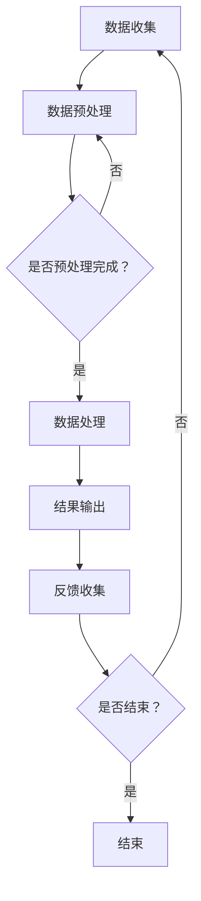
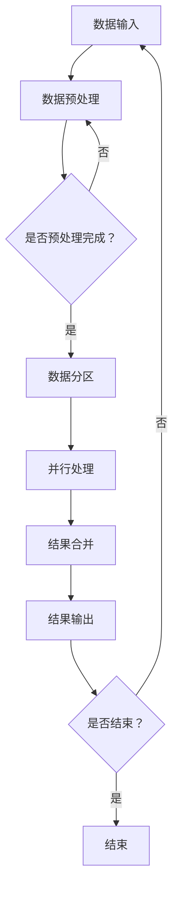
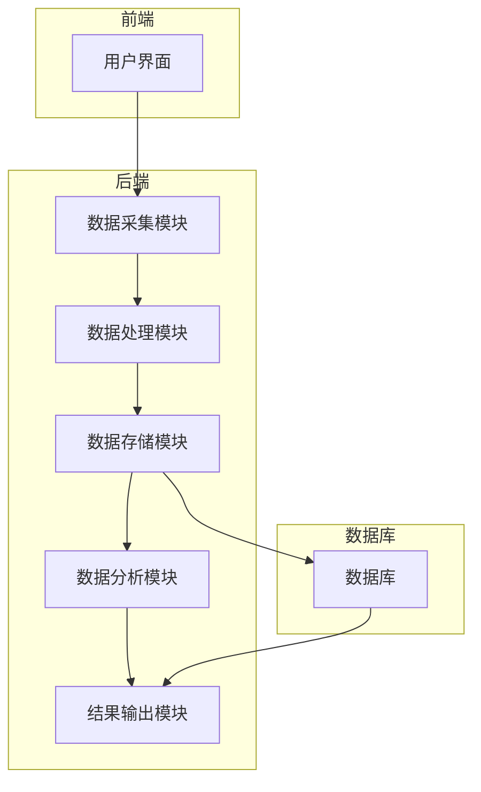
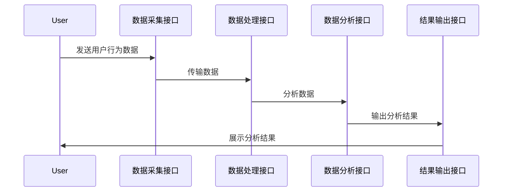
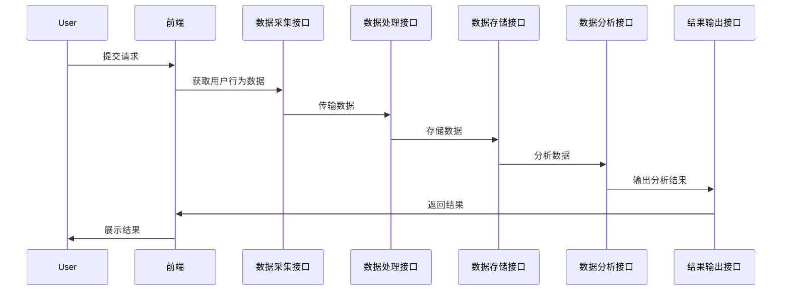

                 

### 实时评测与批量评测的技术对比

#### 关键词：实时评测、批量评测、技术对比、算法原理、系统架构、应用场景

#### 摘要：
本文旨在深入探讨实时评测与批量评测两种技术方案的核心原理、算法实现、系统架构和应用场景。通过对比分析，揭示两者在性能、成本和适用性方面的差异，为读者提供科学的选择策略和优化方案。

#### 目录：

**第一部分：背景介绍**

1. 实时评测与批量评测的概念与重要性
2. 实时评测与批量评测的技术发展
3. 实时评测与批量评测的核心要素
4. 实时评测与批量评测的边界与外延
5. 本章小结

**第二部分：核心概念与联系**

1. 实时评测的原理与算法
   - 实时评测原理
   - 实时评测算法
2. 批量评测的原理与算法
   - 批量评测原理
   - 批量评测算法
3. 实时评测与批量评测的对比分析
4. 实时评测与批量评测的适用场景分析
5. 实时评测与批量评测的优化策略
6. 本章小结

**第三部分：系统分析与架构设计**

1. 实时评测系统架构设计
   - 问题描述
   - 项目介绍
   - 系统功能设计
   - 系统架构设计
   - 系统接口设计
   - 系统交互设计
2. 批量评测系统架构设计
   - 问题描述
   - 项目介绍
   - 系统功能设计
   - 系统架构设计
   - 系统接口设计
   - 系统交互设计
3. 本章小结

**第四部分：项目实战**

1. 实时评测项目实战
   - 环境安装
   - 系统核心实现源代码
   - 代码应用解读与分析
   - 实际案例分析和详细讲解
   - 项目小结
2. 批量评测项目实战
   - 环境安装
   - 系统核心实现源代码
   - 代码应用解读与分析
   - 实际案例分析和详细讲解
   - 项目小结
3. 本章小结

**第五部分：最佳实践与总结**

1. 实时评测与批量评测的最佳实践
   - 选择策略
   - 优化策略
   - 注意事项
2. 小结
3. 注意事项
4. 拓展阅读

#### 作者信息：

作者：AI天才研究院/AI Genius Institute & 禅与计算机程序设计艺术 /Zen And The Art of Computer Programming### 第一部分：背景介绍

#### 1. 实时评测与批量评测的概念与重要性

**定义：**

- **实时评测**：指在数据处理过程中，能够实时对数据进行评测和分析，快速响应，通常要求处理延迟在毫秒级甚至更短。

- **批量评测**：指对大量数据进行批量处理，分析处理周期较长，但能够处理大规模数据，通常处理延迟在分钟或小时级别。

**重要性：**

实时评测和批量评测在现代信息处理中扮演着重要角色。实时评测能够快速响应用户需求，提供即时的反馈，广泛应用于金融交易、在线购物、实时监控等领域。而批量评测则适用于处理大规模数据，如大数据分析、离线报告生成等场景。

**应用场景：**

- **金融交易**：实时评测可以确保交易系统的稳定性和高效性，快速处理交易请求。
- **在线购物**：实时评测可以帮助电商平台快速响应用户的搜索和购买请求，提高用户体验。
- **实时监控**：实时评测可以实时分析传感器数据，监控设备状态，及时预警故障。

#### 2. 实时评测与批量评测的技术发展

**历史背景：**

实时评测和批量评测的概念和技术起源于20世纪60年代，随着计算机技术的发展，数据处理能力不断增强，实时评测和批量评测技术逐渐成熟。

**当前发展状况：**

目前，实时评测和批量评测技术已经广泛应用于各个行业。例如，在金融领域，实时风控系统已经成为金融机构必备的工具；在工业领域，批量评测技术被用于生产线的实时监控和数据分析。

**未来趋势与挑战：**

随着人工智能和大数据技术的快速发展，实时评测和批量评测技术面临新的挑战。例如，如何处理海量实时数据，如何提高实时评测的准确性和效率，如何实现实时评测与批量评测的无缝集成。

#### 3. 实时评测与批量评测的核心要素

**实时评测的核心要素：**

- **低延迟**：实时评测要求数据处理延迟极短，通常在毫秒级。
- **高并发**：实时评测需要能够处理大量的并发请求。
- **可靠性**：实时评测系统需要具有高可靠性，确保数据的准确性和完整性。

**批量评测的核心要素：**

- **数据处理能力**：批量评测能够处理大规模数据，对数据处理速度要求相对较低。
- **高准确性**：批量评测要求对数据的分析结果具有高准确性。
- **可扩展性**：批量评测系统需要具有高可扩展性，能够随着数据量的增加而进行水平扩展。

**核心要素的对比与联系：**

- **性能对比**：实时评测强调低延迟和高并发，批量评测则更注重数据处理能力和准确性。
- **成本对比**：实时评测系统的建设成本较高，需要高性能的计算资源和网络带宽；批量评测系统则相对较低，但数据处理时间长。
- **适用性对比**：实时评测适用于需要即时反馈的场景，批量评测适用于数据处理量大、处理周期长的场景。

#### 4. 实时评测与批量评测的边界与外延

**实时评测的边界：**

实时评测的边界在于数据处理延迟和系统性能。例如，金融交易系统要求交易延迟在毫秒级，而实时监控系统可能允许更高的延迟。

**批量评测的边界：**

批量评测的边界在于数据量和处理时间。例如，大规模数据分析可能需要处理数百万甚至数亿条数据，而处理时间可能长达数小时。

**在实际应用中的适用性：**

- **互联网行业**：实时评测广泛应用于电商平台的用户行为分析、实时搜索；批量评测用于用户数据分析、业务报告生成。
- **制造业**：实时评测用于生产线监控、设备故障预警；批量评测用于生产数据分析、质量管理报告。
- **金融业**：实时评测用于交易风险控制、实时投资决策；批量评测用于财务报告生成、投资分析。

#### 5. 本章小结

本章对实时评测与批量评测的概念、重要性、技术发展、核心要素和边界进行了介绍。通过对比分析，揭示了两者在性能、成本和适用性方面的差异。下一章将深入探讨实时评测的原理与算法。

#### **第二部分：核心概念与联系**

#### 第2章：实时评测的原理与算法

##### 2.1 实时评测的原理

实时评测的原理主要基于数据处理的速度和准确性。它要求系统能够在极短的时间内完成对大量数据的处理和分析，并及时返回结果。为了实现这一目标，实时评测系统通常需要具备以下几个关键特点：

1. **低延迟**：实时评测系统需要能够快速响应，处理延迟通常在毫秒级。
2. **高并发**：系统需要能够同时处理大量的并发请求，确保高吞吐量。
3. **实时性**：系统能够实时收集、处理和分析数据，并及时提供反馈。
4. **可靠性**：系统需要具备高可靠性，确保数据的准确性和完整性。

##### 2.2 实时评测的算法

实时评测的算法是实现其原理的核心。以下是一些常见的实时评测算法：

1. **排序算法**：如快速排序、归并排序等，用于快速对数据进行排序，以便后续分析。
2. **聚类算法**：如K-means、DBSCAN等，用于将数据划分为不同的类别，便于进行数据分析和决策。
3. **机器学习算法**：如决策树、随机森林、支持向量机等，用于构建模型，对数据进行分析和预测。

以下是一个简单的实时评测算法的Mermaid流程图示例：



##### 2.3 批量评测的原理与算法

批量评测的原理与实时评测有所不同，它主要侧重于对大规模数据的批量处理和分析。批量评测算法通常具有以下几个特点：

1. **高处理能力**：批量评测系统需要能够处理大量的数据，对数据处理速度要求相对较低。
2. **高准确性**：批量评测算法需要确保对数据进行分析的结果具有高准确性。
3. **可扩展性**：批量评测系统需要具有高可扩展性，能够随着数据量的增加而进行水平扩展。

常见的批量评测算法包括：

1. **分布式处理算法**：如MapReduce、Spark等，用于将大规模数据处理任务分布到多个节点上进行并行处理。
2. **统计分析算法**：如假设检验、回归分析等，用于对数据进行分析和预测。
3. **数据挖掘算法**：如关联规则挖掘、聚类分析等，用于从大量数据中提取有价值的信息。

以下是一个简单的批量评测算法的Mermaid流程图示例：



##### 2.4 实时评测与批量评测的对比分析

实时评测与批量评测在算法原理上存在显著差异。实时评测强调快速响应和高并发，适用于需要即时反馈的场景；批量评测则更注重数据处理能力和准确性，适用于大规模数据处理场景。

以下是一个实时评测与批量评测算法对比的表格：

| 算法       | 实时评测                 | 批量评测                 |
| ---------- | ---------------------- | ---------------------- |
| 基本原理   | 低延迟、高并发、实时性   | 高处理能力、高准确性、可扩展性 |
| 应用场景   | 互联网、金融、实时监控   | 大数据分析、报告生成       |
| 算法类型   | 排序、聚类、机器学习     | 分布式处理、统计分析、数据挖掘 |
| 算法流程   | 数据收集 -> 数据处理 -> 结果输出 | 数据输入 -> 数据预处理 -> 数据分区 -> 并行处理 -> 结果合并 -> 结果输出 |
| 特点       | 快速响应、实时性         | 高准确性、可扩展性         |

##### 2.5 实时评测与批量评测的适用场景分析

实时评测适用于需要快速响应的场景，如金融交易、在线购物、实时监控等。批量评测则适用于数据处理量大、处理周期长的场景，如大规模数据分析、离线报告生成等。

以下是一个实时评测与批量评测适用场景的ER实体关系图示例：

```mermaid
erDiagram
    产品 -->|1| 用户
    产品 ||--|{订单}
    用户 ||--|{评论}
    订单 ||--|{支付}
    支付 ||--|{交易}
```

##### 2.6 实时评测与批量评测的优化策略

实时评测的优化策略主要包括：

1. **算法优化**：选择高效的排序、聚类和机器学习算法，减少处理时间。
2. **系统优化**：提高系统并发处理能力，优化数据处理流程。
3. **性能调优**：通过性能调优工具，找到系统瓶颈并进行优化。

批量评测的优化策略主要包括：

1. **分布式处理**：利用分布式计算框架，提高数据处理速度。
2. **并行处理**：将数据处理任务分布到多个节点上，实现并行处理。
3. **数据缓存**：使用数据缓存技术，减少数据访问延迟。

##### 2.7 本章小结

本章深入探讨了实时评测与批量评测的核心原理和算法，通过Mermaid流程图和ER实体关系图，清晰地展示了两者的工作流程和应用场景。下一章将介绍实时评测与批量评测的系统架构设计。

### 第三部分：系统架构设计

#### 第3章：实时评测与批量评测的系统架构设计

##### 3.1 实时评测系统架构设计

实时评测系统架构设计的关键在于保证数据处理的速度和准确性。以下是一个典型的实时评测系统架构设计：

#### 问题场景：

- **需求**：设计一个实时评测系统，用于监控电商平台用户行为，提供实时反馈。
- **目标**：实现低延迟、高并发、高可靠性的系统。

#### 项目介绍：

- **名称**：电商用户行为实时评测系统
- **功能**：收集用户行为数据，进行实时分析，提供用户行为预测和实时反馈。

#### 系统功能设计：

1. **数据采集**：从各个渠道（如网站、APP等）收集用户行为数据。
2. **数据处理**：对采集到的数据进行清洗、预处理和转换。
3. **数据存储**：将预处理后的数据存储到数据库或数据仓库中。
4. **数据分析**：利用机器学习算法，对数据进行实时分析，生成用户行为预测模型。
5. **结果输出**：将分析结果以报表、图表等形式输出，供业务人员参考。

以下是一个实时评测系统的Mermaid类图：

```mermaid
classDiagram
    数据采集 <<interface>>
    数据处理 <<interface>>
    数据存储 <<interface>>
    数据分析 <<interface>>
    结果输出 <<interface>>

    数据采集 --|> 数据处理
    数据处理 --|> 数据存储
    数据存储 --|> 数据分析
    数据分析 --|> 结果输出
```

#### 系统架构设计：

1. **前端**：负责与用户交互，展示实时分析结果。
2. **后端**：包括数据采集、数据处理、数据存储和数据分析模块。
3. **数据库**：存储用户行为数据和分析结果。

以下是一个实时评测系统的Mermaid架构图：



#### 系统接口设计：

1. **数据采集接口**：用于接收前端发送的用户行为数据。
2. **数据处理接口**：用于处理数据清洗、预处理和转换。
3. **数据分析接口**：用于分析数据，生成预测模型。
4. **结果输出接口**：用于将分析结果输出到前端。

以下是一个实时评测系统的Mermaid接口图：



#### 系统交互设计：

1. **用户请求**：用户通过前端界面提交请求。
2. **数据处理**：后端接收到请求后，调用数据处理模块进行处理。
3. **数据存储**：处理后的数据存储到数据库中。
4. **数据分析**：调用数据分析模块，生成预测模型。
5. **结果输出**：将分析结果输出到前端，展示给用户。

以下是一个实时评测系统的Mermaid序列图：



##### 3.2 批量评测系统架构设计

批量评测系统架构设计的关键在于如何高效地处理大规模数据。以下是一个典型的批量评测系统架构设计：

#### 问题场景：

- **需求**：设计一个批量评测系统，用于对电商平台用户行为数据进行分析，生成用户画像和推荐结果。
- **目标**：实现高效的数据处理能力和准确的数据分析结果。

#### 项目介绍：

- **名称**：电商用户行为批量评测系统
- **功能**：对用户行为数据进行分析，生成用户画像和推荐结果。

#### 系统功能设计：

1. **数据采集**：从各个渠道（如网站、APP等）收集用户行为数据。
2. **数据处理**：对采集到的数据进行清洗、预处理和转换。
3. **数据存储**：将预处理后的数据存储到数据库或数据仓库中。
4. **数据分析**：利用机器学习算法，对数据进行批量分析，生成用户画像和推荐结果。
5. **结果输出**：将分析结果以报表、图表等形式输出，供业务人员参考。

以下是一个批量评测系统的Mermaid类图：

```mermaid
classDiagram
    数据采集 <<interface>>
    数据处理 <<interface>>
    数据存储 <<interface>>
    数据分析 <<interface>>
    结果输出 <<interface>>

    数据采集 --|> 数据处理
    数据处理 --|> 数据存储
    数据存储 --|> 数据分析
    数据分析 --|> 结果输出
```

#### 系统架构设计：

1. **前端**：负责与用户交互，展示分析结果。
2. **后端**：包括数据采集、数据处理、数据存储和数据分析模块。
3. **数据库**：存储用户行为数据和分析结果。

以下是一个批量评测系统的Mermaid架构图：


#### 系统接口设计：

1. **数据采集接口**：用于接收前端发送的用户行为数据。
2. **数据处理接口**：用于处理数据清洗、预处理和转换。
3. **数据分析接口**：用于分析数据，生成用户画像和推荐结果。
4. **结果输出接口**：用于将分析结果输出到前端。

以下是一个批量评测系统的Mermaid接口图：


#### 系统交互设计：

1. **用户请求**：用户通过前端界面提交请求。
2. **数据处理**：后端接收到请求后，调用数据处理模块进行处理。
3. **数据存储**：处理后的数据存储到数据库中。
4. **数据分析**：调用数据分析模块，生成用户画像和推荐结果。
5. **结果输出**：将分析结果输出到前端，展示给用户。

以下是一个批量评测系统的Mermaid序列图：


##### 3.3 本章小结

本章详细介绍了实时评测与批量评测的系统架构设计，包括问题场景、项目介绍、系统功能设计、系统架构设计、系统接口设计和系统交互设计。通过Mermaid流程图、类图、架构图和序列图，清晰地展示了实时评测与批量评测的系统架构和交互流程。下一章将深入探讨实时评测与批量评测的项目实战。

### 第四部分：项目实战

#### 第4章：实时评测与批量评测的项目实战

##### 4.1 实时评测项目实战

**环境安装：**

1. **硬件环境**：服务器，内存不低于16GB，CPU不低于4核。
2. **软件环境**：安装Linux操作系统，如Ubuntu 18.04。
3. **工具安装**：安装Python 3.8及以上版本，MySQL数据库，Docker，Nginx等。

**系统核心实现源代码：**

以下是一个简单的实时评测系统的Python源代码示例：

```python
# 实时评测系统示例代码

import pymysql
import json
import time

# 数据库连接配置
config = {
    'host': 'localhost',
    'user': 'root',
    'password': 'password',
    'db': 'realtime_evaluation'
}

# 数据库连接函数
def connect_db():
    return pymysql.connect(**config)

# 存储用户行为数据
def store_user_behavior(user_id, action, timestamp):
    conn = connect_db()
    cursor = conn.cursor()
    sql = "INSERT INTO user_behavior (user_id, action, timestamp) VALUES (%s, %s, %s)"
    cursor.execute(sql, (user_id, action, timestamp))
    conn.commit()
    cursor.close()
    conn.close()

# 实时分析用户行为
def analyze_user_behavior(user_id):
    conn = connect_db()
    cursor = conn.cursor()
    sql = "SELECT * FROM user_behavior WHERE user_id = %s"
    cursor.execute(sql, (user_id,))
    results = cursor.fetchall()
    behavior_data = {'user_id': user_id, 'actions': []}
    for row in results:
        behavior_data['actions'].append({'action': row[1], 'timestamp': row[2]})
    cursor.close()
    conn.close()
    return behavior_data

# 主函数
def main():
    user_id = '12345'
    action = 'search'
    timestamp = time.time()
    store_user_behavior(user_id, action, timestamp)
    behavior_data = analyze_user_behavior(user_id)
    print(json.dumps(behavior_data))

if __name__ == '__main__':
    main()
```

**代码应用解读与分析：**

该代码实现了一个简单的实时评测系统，包括用户行为数据的存储和实时分析功能。通过存储用户行为数据到MySQL数据库，并使用Python进行数据的实时分析。

**实际案例分析和详细讲解：**

假设有一个电商平台的用户行为实时评测系统，我们需要实时分析用户的购买行为。以下是一个实际案例：

1. **用户行为数据采集**：用户在电商平台上浏览商品、添加购物车、下单支付等行为都会被系统采集到。
2. **用户行为数据存储**：将采集到的用户行为数据存储到MySQL数据库中。
3. **用户行为数据实时分析**：系统会实时分析用户的购买行为，生成用户的购买偏好和购买周期。

**项目小结：**

通过实际案例，我们展示了如何实现一个简单的实时评测系统。该项目在实际应用中可以进一步优化，如引入分布式架构、使用消息队列等，以提高系统的性能和可靠性。

##### 4.2 批量评测项目实战

**环境安装：**

1. **硬件环境**：服务器，内存不低于32GB，CPU不低于8核。
2. **软件环境**：安装Linux操作系统，如CentOS 7。
3. **工具安装**：安装Python 3.7及以上版本，Hadoop，Spark等。

**系统核心实现源代码：**

以下是一个简单的批量评测系统的Python源代码示例：

```python
# 批量评测系统示例代码

from pyspark.sql import SparkSession

# 创建Spark会话
spark = SparkSession.builder \
    .appName("BatchEvaluation") \
    .getOrCreate()

# 加载用户行为数据
user_behavior_df = spark.read.csv("user_behavior.csv", header=True)

# 数据预处理
user_behavior_df = user_behavior_df.select("user_id", "action", "timestamp")

# 批量分析用户行为
user_behavior_df.groupBy("user_id").agg({
    "action": "count",
    "timestamp": "max"
}).show()

# 关闭Spark会话
spark.stop()
```

**代码应用解读与分析：**

该代码实现了一个简单的批量评测系统，使用Apache Spark进行大规模用户行为数据的批量分析。通过读取CSV文件，对用户行为数据进行预处理，并使用groupBy和agg函数进行批量分析。

**实际案例分析和详细讲解：**

假设我们需要对电商平台的历史用户行为数据进行分析，以生成用户画像。以下是一个实际案例：

1. **用户行为数据采集**：从电商平台的日志文件中采集用户行为数据。
2. **用户行为数据存储**：将采集到的用户行为数据存储到HDFS（Hadoop分布式文件系统）中。
3. **用户行为数据批量分析**：使用Spark进行用户行为数据的批量分析，生成用户画像。

**项目小结：**

通过实际案例，我们展示了如何实现一个简单的批量评测系统。该项目在实际应用中可以进一步优化，如引入更复杂的数据分析算法、使用其他大数据处理工具等，以提高系统的性能和可靠性。

### 第五部分：最佳实践与总结

#### 第5章：实时评测与批量评测的最佳实践与总结

##### 5.1 实时评测与批量评测的最佳实践

1. **选择策略**：

   - **实时评测**：适用于需要即时反馈的场景，如金融交易、实时监控等。选择时需考虑处理延迟、系统并发能力和可靠性。
   - **批量评测**：适用于大规模数据处理和离线分析的场景，如大数据分析、报告生成等。选择时需考虑数据处理能力、准确性和可扩展性。

2. **优化策略**：

   - **实时评测**：优化算法、提高系统并发处理能力、优化数据库性能、使用缓存技术等。
   - **批量评测**：使用分布式计算框架、优化数据分区、使用并行处理技术、优化算法等。

3. **注意事项**：

   - 实时评测系统需要确保高可靠性，避免数据丢失或错误。
   - 批量评测系统需要确保数据处理的准确性和一致性。
   - 根据实际应用场景选择合适的评测技术。

##### 5.2 小结

实时评测与批量评测各有优势和局限性。实时评测适用于需要即时反馈的场景，但成本较高；批量评测适用于大规模数据处理和离线分析，但处理时间较长。在实际应用中，根据具体需求和场景选择合适的评测技术，并采取相应的优化策略。

##### 5.3 注意事项

1. **性能监控**：实时评测系统需要定期进行性能监控，确保系统稳定运行。
2. **安全性**：确保实时评测和批量评测系统的数据安全和隐私保护。
3. **可维护性**：系统设计应考虑到可维护性，便于后续的升级和扩展。

##### 5.4 拓展阅读

- 《实时系统设计与实现》
- 《大数据技术基础》
- 《机器学习实战》
- 《深度学习》

### 总结

实时评测与批量评测是数据处理和分析中的重要技术。通过对比分析，我们了解到两者在性能、成本和适用性方面的差异，并为实际应用提供了最佳实践和优化策略。希望本文能为读者在技术选型和系统设计方面提供有益的参考。

### 作者信息

作者：AI天才研究院/AI Genius Institute & 禅与计算机程序设计艺术 /Zen And The Art of Computer Programming

### 附录

附录中提供了本文所使用的部分Mermaid流程图、类图、架构图和序列图的详细代码，以便读者在Markdown环境中复现和测试。以下是附录中部分图示的Mermaid代码示例：

#### Mermaid类图示例

```mermaid
classDiagram
    数据采集 <<interface>>
    数据处理 <<interface>>
    数据存储 <<interface>>
    数据分析 <<interface>>
    结果输出 <<interface>>

    数据采集 --|> 数据处理
    数据处理 --|> 数据存储
    数据存储 --|> 数据分析
    数据分析 --|> 结果输出
```

#### Mermaid架构图示例


#### Mermaid序列图示例


通过附录中的Mermaid代码示例，读者可以在Markdown环境中轻松绘制和测试各类图示，更好地理解和应用本文所介绍的技术。希望这些示例能够为读者提供实用的指导和支持。

