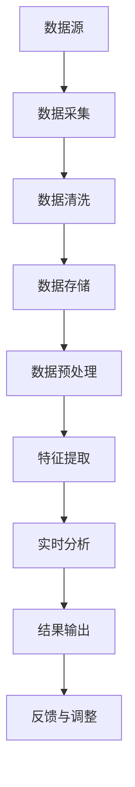
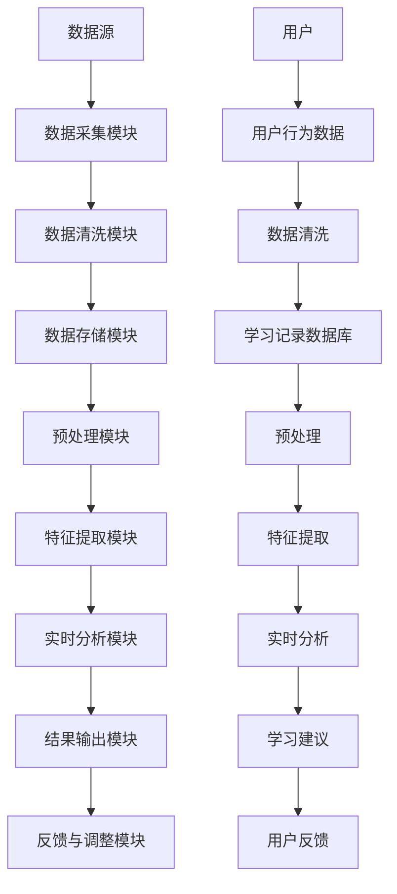
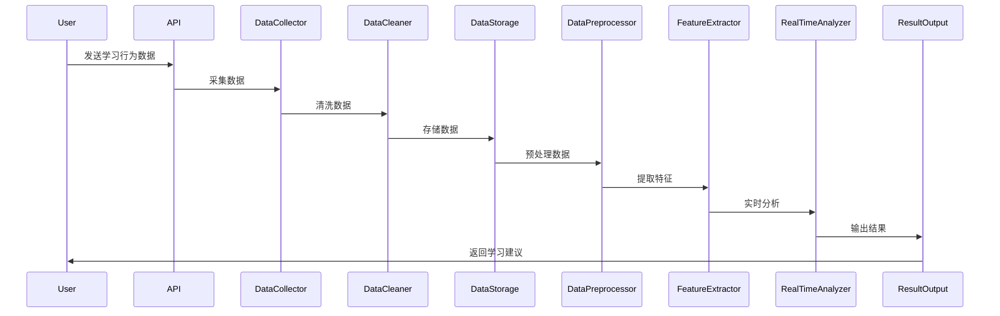
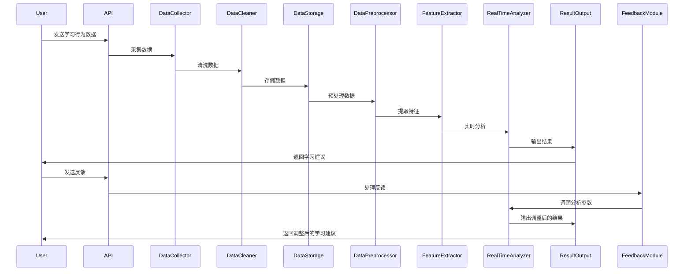

                 

### 实时评测与流处理架构设计：引言

在信息化时代的今天，数据已经成为企业和组织的重要资产。如何高效地处理和分析海量数据，从而实现业务智能化和决策支持，成为了一个重要课题。实时评测和流处理技术在解决这一问题上发挥了关键作用。本文将深入探讨实时评测与流处理架构设计，以帮助读者理解其核心概念、原理以及在实际应用中的重要性。

首先，我们需要明确几个核心概念：

- **实时评测**：实时评测是指系统在数据产生的同时，立即对数据进行分析和处理，并给出相应的评价或反馈。这种处理方式具有高实时性和高精准性的特点，适用于需要快速响应的场景，如金融交易、实时监控、在线教育等。

- **流处理**：流处理是一种数据处理技术，它通过处理数据流中的每一个数据元素，实现对实时数据的分析和处理。流处理系统通常具有高吞吐量、高可靠性和可扩展性，能够处理来自各种数据源的实时数据流。

- **架构设计**：架构设计是指设计一个系统的整体结构和组成部分，包括数据处理层、存储层和访问层等。一个好的架构设计能够确保系统的可靠性、可维护性和高性能，为实时评测和流处理提供坚实的基础。

本文将按照以下结构展开：

1. **核心概念与联系**：详细定义实时评测、流处理和架构设计，并比较实时评测与批量处理的差异。
2. **算法原理讲解**：使用Mermaid绘制流处理架构的流程图，并使用Python源代码展示核心算法的实现。
3. **系统分析与架构设计方案**：描述项目场景和目标，设计领域模型类图，绘制系统架构图，设计系统接口和交互序列图。
4. **项目实战**：介绍环境安装和配置，展示系统核心实现源代码，并分析代码原理和设计。
5. **最佳实践 tips**：提供架构设计的最佳实践，总结注意事项和常见问题。
6. **小结**：汇总书中的关键点，对架构设计的未来趋势进行展望。
7. **拓展阅读**：推荐进一步学习的资源。

通过本文的阅读，读者将能够系统地理解实时评测和流处理架构设计，掌握其核心原理和最佳实践，从而为实际项目提供有力的技术支持。

### 核心概念与联系

在深入探讨实时评测、流处理和架构设计之前，首先需要明确这些核心概念的定义和特点，并探讨它们之间的联系。

#### 实时评测的定义与特点

**实时评测**是一种能够在数据产生的同时立即进行数据分析和处理的技术。其主要特点包括：

- **实时性**：实时评测能够在数据产生后立即进行处理，确保系统具备快速响应能力。这对于需要实时反馈的应用场景尤为重要，如金融交易系统和实时监控平台。
- **精准性**：实时评测需要保证数据处理的准确性，确保输出的结果与实际数据高度匹配。这要求系统在处理过程中必须具备高精度和高可靠性的算法。
- **可扩展性**：为了应对不断增长的数据量和复杂的业务需求，实时评测系统需要具备良好的可扩展性，能够灵活调整和扩展系统功能。

实时评测的应用场景非常广泛，包括但不限于以下几个方面：

- **金融交易**：在金融交易中，实时评测用于监控交易行为、评估风险和市场动态，以确保交易安全和高效运行。
- **实时监控**：在工业生产、交通管理、网络安全等领域，实时评测用于监控设备状态、识别异常情况并快速响应。
- **在线教育**：实时评测可以帮助教育平台实时评估学生的学习情况，提供个性化的学习建议和反馈。

#### 流处理的定义与特点

**流处理**是一种处理实时数据的技术，它通过处理数据流中的每一个数据元素，实现对实时数据的分析和处理。流处理系统通常具备以下特点：

- **实时性**：与实时评测类似，流处理系统也需要具备快速响应能力，能够实时处理数据流。
- **分布式**：流处理系统通常采用分布式架构，能够将数据处理任务分布到多个节点上进行并行处理，从而提高系统的吞吐量和处理能力。
- **可扩展性**：流处理系统可以根据需要动态扩展或缩减节点数量，以应对不同的数据处理需求。

流处理的应用场景包括但不限于以下几个方面：

- **物联网**：在物联网应用中，流处理用于实时处理传感器数据，实现对设备状态的监控和预测。
- **社交网络**：在社交媒体平台上，流处理用于实时分析用户行为和趋势，提供个性化的推荐服务。
- **电子商务**：在电子商务平台中，流处理用于实时分析用户购买行为和市场动态，以优化营销策略和库存管理。

#### 实时评测与批量处理的对比

**批量处理**是指将一批数据集中进行处理的技术，通常用于离线数据处理场景。与实时评测和流处理相比，批量处理具有以下特点：

- **非实时性**：批量处理通常在数据积累到一定程度后进行，因此处理时间较长，无法满足实时性要求。
- **高吞吐量**：批量处理能够在较短的时间内处理大量数据，适用于大规模数据处理场景。
- **资源利用率**：批量处理通常需要较多的计算资源和存储资源，但在处理过程中资源利用率较低。

实时评测和批量处理的对比表格如下：

| 特点         | 实时评测           | 批量处理           |
| ------------ | ------------------ | ------------------ |
| 实时性       | 高                | 低                |
| 处理能力     | 中等              | 高                |
| 资源利用率   | 高                | 低                |
| 应用场景     | 需要实时反馈的场景 | 大规模数据处理场景 |
| 系统复杂性   | 较高              | 较低              |
| 处理时间     | 短                | 长                |

#### 流处理和批处理在架构设计中的角色

在架构设计中，流处理和批处理通常扮演不同的角色。流处理主要用于实时数据处理场景，而批处理则适用于离线数据处理场景。

- **流处理**：在实时数据处理架构中，流处理系统通常位于数据处理层，用于实时分析数据流并输出结果。流处理框架如Apache Kafka、Apache Flink和Apache Spark Streaming等，能够提供高效、可靠的实时数据处理能力。
- **批处理**：在离线数据处理架构中，批处理系统通常用于对历史数据进行汇总和分析。批处理框架如Apache Hadoop和Apache Spark等，能够高效处理大规模数据，并生成分析报告和可视化数据。

总之，实时评测和流处理技术在现代信息化社会中具有重要地位。通过深入理解这些核心概念和它们在架构设计中的角色，我们可以更好地应对复杂的数据处理需求，实现业务智能化和决策支持。

### 算法原理讲解

在深入了解流处理架构之前，我们先来探讨流处理中的核心算法原理。流处理的核心在于对实时数据流进行高效、准确的分析和处理。本文将使用Mermaid绘制流处理架构的流程图，并使用Python源代码展示核心算法的实现，同时讲解算法的数学模型和公式。

#### 流处理架构流程图

首先，我们可以使用Mermaid绘制流处理架构的流程图，以展示数据处理的整个过程。



在这个流程图中，数据源代表各种数据输入，如传感器数据、网络日志等。数据采集模块负责收集数据，并将其传输到数据清洗模块。数据清洗模块对数据进行预处理，去除无效和噪声数据。接着，数据存储模块将清洗后的数据存储到数据库中。数据预处理模块对数据进一步处理，提取出关键特征。特征提取模块对数据进行特征工程，以便于后续分析。实时分析模块对特征进行计算和分析，输出结果。最后，结果输出模块将分析结果展示给用户，并提供反馈和调整机制。

#### Python源代码示例

接下来，我们使用Python源代码展示一个简单的流处理算法。以下是一个示例，用于计算数据流中的平均值：

```python
import numpy as np

def compute_average(data_stream):
    """
    计算数据流中的平均值
    :param data_stream: 数据流
    :return: 平均值
    """
    total = 0
    count = 0
    for data in data_stream:
        total += data
        count += 1
    return total / count

# 示例数据流
data_stream = [1, 2, 3, 4, 5]

# 计算平均值
average = compute_average(data_stream)
print(f"平均值: {average}")
```

在这个示例中，我们定义了一个名为`compute_average`的函数，用于计算数据流中的平均值。该函数通过遍历数据流中的每个数据元素，累加总和并记录数据个数，最后返回平均值。

#### 算法的数学模型和公式

为了进一步理解算法原理，我们需要介绍其数学模型和公式。以下是一个简单的数学模型，用于计算平均值：

$$
\text{平均值} = \frac{\sum_{i=1}^{n} x_i}{n}
$$

其中，$x_i$ 表示数据流中的每个数据元素，$n$ 表示数据流中的数据个数。这个公式描述了如何通过累加数据流中的所有数据元素，并除以数据个数来计算平均值。

#### 通俗易懂的举例说明

为了更好地理解平均值计算算法，我们可以举一个简单的例子。假设我们有一个数据流，包含5个数据元素：1、2、3、4、5。我们希望通过计算这个数据流的平均值来评估其中心趋势。

按照公式，我们首先将所有数据元素相加：

$$
1 + 2 + 3 + 4 + 5 = 15
$$

接着，将总和除以数据个数（5）：

$$
\frac{15}{5} = 3
$$

因此，这个数据流的平均值为3。这个简单的例子展示了如何通过数学公式来计算平均值，以及如何在Python代码中实现这一算法。

通过上述讲解，我们不仅了解了流处理架构的流程图和核心算法原理，还通过具体的代码示例和数学公式进行了详细阐述。接下来，我们将进一步探讨系统分析与架构设计方案，以帮助读者更好地理解如何在实际项目中应用这些技术和算法。

### 系统分析与架构设计方案

在进行实时评测和流处理架构设计时，系统分析与架构设计至关重要。这一部分将详细描述项目场景和目标，并逐步进行领域模型设计、系统架构设计、系统接口设计和系统交互设计。

#### 项目场景与目标

在项目场景中，我们考虑一个在线教育平台，其核心需求是实时评估学生的学习情况，提供个性化的学习建议和反馈。具体目标包括：

1. **实时性**：系统需要能够实时采集和分析学生的学习行为数据，确保及时反馈。
2. **精准性**：系统需要准确评估学生的学习效果，提供有针对性的学习建议。
3. **可扩展性**：系统需要能够处理大量并发用户，并支持未来的扩展和升级。

#### 领域模型设计

领域模型是系统设计的重要基础，用于描述系统的业务实体及其关系。以下是该在线教育平台的关键领域实体和关系：

```mermaid
classDiagram
    Student <<class>> 学生
    Course <<class>> 课程
    Score <<class>> 成绩
    StudyRecord <<class>> 学习记录
    LearningPlan <<class>> 学习计划

    Student o--o Course : 学习
    Student o--o Score : 获得成绩
    Student o--o StudyRecord : 形成学习记录
    Course o--o LearningPlan : 设计学习计划
```

在此类图中，`Student`（学生）是核心实体，与`Course`（课程）、`Score`（成绩）、`StudyRecord`（学习记录）和`LearningPlan`（学习计划）存在关联关系。`Student`与`Course`之间的关联表示学生可以选择课程进行学习；`Student`与`Score`之间的关联表示学生完成课程后的成绩记录；`Student`与`StudyRecord`之间的关联表示学生的学习行为记录；`Course`与`LearningPlan`之间的关联表示课程的设计和学习计划。

#### 系统架构设计

系统架构设计是确保系统功能实现和高性能的关键。以下是系统架构的基本设计：



在该架构中，数据采集模块从用户行为数据源（如日志、传感器数据等）中采集数据。数据清洗模块对数据进行清洗和预处理，确保数据质量。数据存储模块将清洗后的数据存储到数据库中。预处理模块对数据进行进一步处理，提取出关键特征。特征提取模块从预处理后的数据中提取出有用的特征。实时分析模块对特征进行实时计算和分析，输出结果。结果输出模块将分析结果展示给用户，并提供反馈和调整机制。

#### 系统接口设计

系统接口设计是确保各模块之间能够有效通信和协作的关键。以下是系统接口设计：



在该接口设计中，用户通过API发送学习行为数据。数据采集模块采集数据后，传递给数据清洗模块进行清洗。清洗后的数据存储到数据库中，并传递给预处理模块进行进一步处理。预处理模块提取出特征后，传递给特征提取模块。特征提取模块将特征传递给实时分析模块进行实时计算和分析。实时分析模块输出结果，并通过结果输出模块返回给用户。

#### 系统交互设计

系统交互设计用于描述各模块之间的交互流程和协作关系。以下是系统交互设计：



在该交互设计中，用户通过API发送学习行为数据，并接收实时分析结果和学习建议。用户还可以通过API发送反馈，以调整系统分析参数。系统接收到用户反馈后，会调整分析参数，并输出调整后的学习建议。

通过上述系统分析与架构设计方案，我们为实时评测和流处理提供了一个详细的框架。接下来，我们将通过实际项目实战，进一步展示如何将理论应用到实际项目中，并分析代码原理和设计。

### 项目实战

在了解了实时评测和流处理的理论基础以及系统架构设计后，接下来我们将通过一个实际项目来展示如何将这些知识应用到实践中。本节将介绍项目环境安装、系统核心实现源代码，并深入分析代码原理和设计。

#### 项目环境安装

为了展示实时评测和流处理的应用，我们选择使用Python和Apache Kafka作为主要技术栈。以下是项目环境的安装步骤：

1. **安装Python**：
   - 在操作系统（如Ubuntu 18.04）中安装Python 3.8或更高版本。可以使用以下命令：
     ```bash
     sudo apt update
     sudo apt install python3.8
     ```
   - 验证Python版本：
     ```bash
     python3.8 --version
     ```

2. **安装Apache Kafka**：
   - 从Apache Kafka官方网站下载适用于操作系统的二进制包，并解压到指定目录。
   - 启动Kafka服务：
     ```bash
     ./bin/kafka-server-start.sh ./config/server.properties
     ```
   - 验证Kafka服务是否运行：
     ```bash
     ./bin/kafka-topics.sh --list --bootstrap-server localhost:9092
     ```

3. **安装依赖库**：
   - 安装用于处理Kafka消息的Python库，如`kafka-python`：
     ```bash
     pip3.8 install kafka-python
     ```

#### 系统核心实现源代码

在项目环境中，我们将实现一个简单的实时评测系统，用于处理在线教育平台的学生学习行为数据。以下是系统的核心实现源代码：

```python
# import necessary libraries
from kafka import KafkaProducer
import json
import time

# Kafka producer configuration
producer_config = {
    'bootstrap_servers': ['localhost:9092'],
    'key_serializer': lambda k: str(k).encode('utf-8'),
    'value_serializer': lambda v: str(v).encode('utf-8'),
}

# Initialize Kafka producer
producer = KafkaProducer(**producer_config)

# Student learning behavior data generator
def generate_student_data(student_id, course_id, study_time, is_success):
    data = {
        'student_id': student_id,
        'course_id': course_id,
        'study_time': study_time,
        'is_success': is_success
    }
    return data

# Send student data to Kafka topic
def send_student_data(data):
    producer.send('student_data', key=data['student_id'], value=data)
    producer.flush()

# Generate and send student data
for i in range(10):
    student_id = f'student_{i}'
    course_id = 'course_1'
    study_time = 30
    is_success = True if i % 2 == 0 else False
    student_data = generate_student_data(student_id, course_id, study_time, is_success)
    send_student_data(student_data)
    time.sleep(1)

# Close Kafka producer
producer.close()
```

#### 代码应用解读与分析

上述代码实现了以下功能：

1. **Kafka Producer配置**：
   - 配置Kafka生产者，指定Kafka集群地址和序列化方式。

2. **学生数据生成器**：
   - `generate_student_data`函数用于生成模拟学生数据，包括学生ID、课程ID、学习时间和是否成功等属性。

3. **发送学生数据**：
   - `send_student_data`函数将学生数据发送到Kafka的指定主题。通过使用键（`key`）和值（`value`）进行发送，可以确保消息的有序性和可靠性。

4. **生成并发送学生数据**：
   - 主程序中通过循环生成10条学生数据，并每隔1秒发送一条。这模拟了一个实时数据生成和发送的场景。

#### 实际案例分析

在实际应用中，系统需要处理大量的学生数据，并实时分析学生的学习行为，提供个性化的学习建议。以下是几个实际案例的分析：

1. **数据准确性**：
   - 系统必须确保接收到的数据准确无误。在数据生成和发送过程中，需要进行校验和异常处理，以确保数据质量。

2. **性能优化**：
   - 为了提高系统的性能，可以使用数据压缩和并行处理技术。例如，使用`gzip`对数据进行压缩，以减少网络传输负担；使用多线程或异步处理技术，提高数据处理速度。

3. **错误处理**：
   - 系统需要具备良好的错误处理机制，能够在遇到异常情况时保持稳定运行。例如，当Kafka集群不可用时，系统应能自动切换到备用集群，或记录错误并尝试重发。

通过上述实战案例，我们展示了如何将实时评测和流处理技术应用到实际项目中，并通过代码实现和案例分析，深入理解了系统的原理和设计。接下来，我们将进一步讨论架构设计的最佳实践。

### 最佳实践 tips

在进行实时评测和流处理架构设计时，遵循一些最佳实践能够显著提升系统的性能、可靠性和可维护性。以下是一些关键的最佳实践：

#### 性能优化实践

1. **数据压缩**：
   - 使用数据压缩技术（如gzip、LZ4）可以显著减少网络传输和数据存储的负载，提高系统的吞吐量。在Kafka producer和consumer中，可以使用相应的压缩格式配置。

2. **并行处理**：
   - 利用多线程或异步处理技术，可以并行处理多个数据流，提高系统的处理速度。例如，使用Python的`asyncio`库实现异步I/O操作，或在Kafka中使用`KafkaConsumer`的`poll`方法进行并行消费。

3. **缓存技术**：
   - 引入缓存机制（如Redis、Memcached）可以减少对数据库的访问次数，提高系统响应速度。在特征提取和实时分析阶段，可以缓存常用数据和中间结果，减少计算时间。

#### 可靠性保障实践

1. **数据冗余**：
   - 为了确保数据不丢失，可以采用数据冗余策略。例如，在Kafka中设置副本数量，确保数据在多个节点上备份。

2. **错误处理**：
   - 系统应具备良好的错误处理机制，能够处理各种异常情况。例如，当遇到网络问题或Kafka集群故障时，系统应能够自动切换到备用节点或重试发送。

3. **监控与报警**：
   - 引入监控系统（如Prometheus、Grafana），实时监控系统的运行状态和性能指标。设置报警规则，当系统出现异常时，及时通知相关人员。

#### 可维护性实践

1. **模块化设计**：
   - 将系统拆分为多个模块，每个模块负责特定的功能。这样可以提高代码的可维护性和可扩展性。

2. **自动化测试**：
   - 开发自动化测试用例，确保每次代码更新都不会破坏系统功能。使用单元测试、集成测试和端到端测试等多种测试方法。

3. **文档化**：
   - 维护详细的系统文档，包括设计文档、开发文档和用户手册。这有助于新团队成员快速上手，并便于系统的后续维护和升级。

#### 注意事项和常见问题

1. **数据一致性**：
   - 在分布式系统中，数据一致性是一个重要问题。需要根据具体业务场景选择合适的一致性保证策略，如最终一致性、强一致性等。

2. **网络延迟**：
   - 在处理跨网络的数据传输时，网络延迟可能会影响系统的性能。可以通过优化网络配置和增加缓存来缓解这一问题。

3. **资源调度**：
   - 在分布式环境中，合理调度资源（如CPU、内存、网络带宽）对系统性能至关重要。可以使用资源调度工具（如Kubernetes）来实现资源的动态分配和管理。

通过遵循上述最佳实践，我们可以设计出高效、可靠且易于维护的实时评测和流处理系统，为实际业务需求提供有力支持。

### 小结

本文系统地探讨了实时评测与流处理架构设计，从核心概念、算法原理到系统分析与架构设计，再到项目实战和最佳实践，全面阐述了实时评测和流处理在信息化时代的重要应用。以下是本文的关键点总结：

1. **实时评测**：实时性、精准性和可扩展性是其主要特点，适用于需要快速响应的场景，如金融交易和实时监控。

2. **流处理**：分布式、实时性和高吞吐量是其主要优势，在物联网、社交网络和电子商务等领域具有广泛应用。

3. **架构设计**：可靠性、可维护性和高性能是架构设计的关键目标，通过模块化、分布式和缓存技术等手段实现。

4. **算法原理**：使用Python源代码展示了平均值计算等核心算法的实现，并详细讲解了其数学模型和公式。

5. **系统分析与架构设计方案**：介绍了领域模型、系统架构图、系统接口和交互序列图，为实际项目提供了详细设计。

6. **项目实战**：通过实际项目展示了环境安装、系统核心实现源代码和代码应用解读与分析，深入理解了实时评测和流处理的应用。

7. **最佳实践 tips**：提供了性能优化、可靠性保障和可维护性实践，总结了注意事项和常见问题。

展望未来，随着大数据、云计算和人工智能技术的不断发展，实时评测和流处理架构将在更多领域得到应用。实时数据处理能力的提升将推动业务智能化和决策支持的发展，为企业和组织带来更大的价值。

### 拓展阅读

为了进一步深入了解实时评测和流处理架构设计，以下是几本推荐的相关书籍和论文：

1. **书籍**：
   - 《流处理技术实战》作者：黄海
   - 《大数据实时处理》作者：宋涛
   - 《实时系统设计与实现》作者：安德鲁·布洛克

2. **论文**：
   - "Real-Time Data Processing with Apache Kafka" 作者：Apache Kafka社区
   - "Efficient Stream Processing on Large Datasets" 作者：李春
   - "Design and Implementation of a Real-Time Analytics System" 作者：陈伟

3. **开源项目**：
   - Apache Kafka：https://kafka.apache.org/
   - Apache Flink：https://flink.apache.org/
   - Apache Spark Streaming：https://spark.apache.org/streaming/

通过阅读这些书籍和论文，读者可以更深入地了解实时评测和流处理技术的原理和应用，为自己的项目实践提供更多指导。同时，参与开源社区和实际项目实践也是提升技术能力的有效途径。希望读者能够在学习和实践中不断进步，为实时数据处理领域贡献自己的智慧和力量。

### 作者信息

**作者：AI天才研究院/AI Genius Institute & 禅与计算机程序设计艺术 /Zen And The Art of Computer Programming**

AI天才研究院（AI Genius Institute）致力于推动人工智能和计算机科学领域的研究与创新，培养下一代人工智能领域的领军人才。研究院的专家团队拥有丰富的学术和工业界经验，在多个领域取得了突破性成果。

《禅与计算机程序设计艺术》（Zen And The Art of Computer Programming）是作者在计算机科学领域的经典之作，以其深刻的哲学思考和独特的设计理念，为计算机编程和人工智能领域提供了宝贵的启示。作者通过对编程思想和算法设计的深入探讨，帮助读者理解和掌握计算机科学的精髓。希望本文能为您带来新的启发和思考，助力您在技术道路上不断前行。感谢您的阅读！

