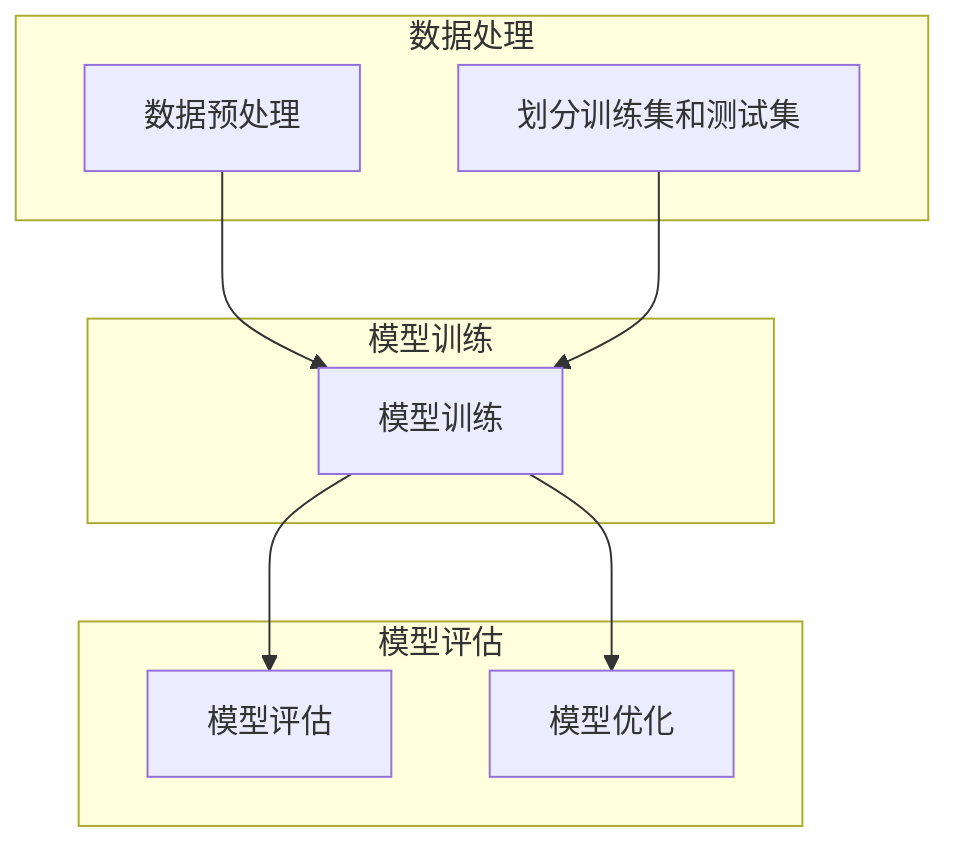

                 

### 《对抗样本鲁棒性测试：增强安全性》

#### 关键词：
- 对抗样本
- 鲁棒性测试
- 人工智能安全性
- 黑盒测试
- 白盒测试
- 模型优化

##### 摘要：
本文旨在探讨对抗样本鲁棒性测试的重要性，以及如何通过增强AI模型的鲁棒性来提升安全性。我们将逐步分析对抗样本的生成方法、测试技术、增强策略，并结合实战案例进行深入讲解，旨在为读者提供全面的技术指南。

---

## 目录

1. **背景与概念**
    1.1 人工智能与机器学习概述
    1.2 对抗样本的定义与起源
    1.3 鲁棒性的基本概念与重要性
2. **对抗样本的生成方法**
    2.1 对抗样本的生成技术
    2.2 常见对抗样本生成算法
    2.3 对抗样本的类别与特征
3. **对抗样本测试技术**
    3.1 黑盒测试与白盒测试
    3.2 对抗样本测试的方法和工具
    3.3 对抗样本测试的挑战与局限性
4. **增强AI模型的鲁棒性**
    4.1 鲁棒性增强的基本原理
    4.2 算法调整与模型优化
    4.3 鲁棒性增强的技术路线
5. **实战案例与分析**
    5.1 对抗样本鲁棒性测试的实战案例
    5.2 鲁棒性增强的最佳实践
    5.3 鲁棒性增强的挑战与未来趋势
6. **总结与展望**
    6.1 关键要点回顾
    6.2 学习与探索的建议
7. **未来发展趋势与展望**
    7.1 对抗样本与鲁棒性的最新研究
    7.2 鲁棒性增强技术在AI领域的应用前景
8. **附录：拓展阅读与资源推荐**
   
---

### 第一部分：背景与概念

#### 1.1 人工智能与机器学习概述

人工智能（AI）是计算机科学的一个分支，旨在创建智能体，这些智能体可以执行通常需要人类智能的任务。机器学习（ML）是AI的核心技术之一，它使计算机系统能够从数据中学习并改进其性能。

##### 问题背景：

随着机器学习模型在各个领域的广泛应用，AI系统的安全性成为了一个重要议题。特别是在图像识别、自然语言处理和自动驾驶等场景中，对抗样本的存在可能对系统的安全性和可靠性构成严重威胁。

#### 1.2 对抗样本的定义与起源

对抗样本（Adversarial Examples）是指在图像、文本或音频中添加微小的、几乎不可见的扰动，从而误导机器学习模型产生错误预测的样本。

##### 问题背景：

对抗样本的出现源于深度学习模型的脆弱性，这使得它们容易受到攻击。这些问题在安全领域尤为重要，因为如果AI系统被恶意攻击，可能导致严重的后果。

#### 1.3 鲁棒性的基本概念与重要性

鲁棒性（Robustness）是指系统能够在面临外部干扰或内部故障时保持性能的能力。在机器学习中，鲁棒性确保模型能够对不同的输入数据产生一致的输出。

##### 问题背景：

提高鲁棒性是增强AI系统安全性的关键步骤，它有助于减少对抗样本的攻击成功率。

---

### 第二部分：对抗样本的生成方法

#### 2.1 对抗样本的生成技术

对抗样本的生成技术可以分为基于梯度攻击和基于优化技术两大类。

##### 问题背景：

了解这些技术有助于我们更好地理解对抗样本的生成机制，从而设计出更有效的防御策略。

#### 2.2 常见对抗样本生成算法

常见的对抗样本生成算法包括Fast Gradient Sign Attack (FGSM)、Carlini & Wagner Attack、C&W + PGD等。

##### 问题背景：

每种算法都有其独特的优势和局限性，了解这些算法可以帮助我们选择合适的方法进行对抗样本生成。

#### 2.3 对抗样本的类别与特征

对抗样本可以根据攻击的目标、攻击者的能力、模型的类型等因素进行分类。常见的对抗样本类型包括对抗噪声、对抗图像、对抗文本等。

##### 问题背景：

分类对抗样本有助于我们更深入地理解其特点，从而为测试和防御提供更精准的指导。

---

### 第三部分：对抗样本测试技术

#### 3.1 黑盒测试与白盒测试

对抗样本测试可以分为黑盒测试和白盒测试。黑盒测试不需要对模型内部结构有深入了解，而白盒测试则需要。

##### 问题背景：

了解这两种测试方法有助于我们根据需求选择合适的测试策略。

#### 3.2 对抗样本测试的方法和工具

常见的对抗样本测试方法和工具包括Jacobian矩阵法、输入验证法、自动攻击工具等。

##### 问题背景：

掌握这些方法和工具有助于我们更有效地进行对抗样本测试。

#### 3.3 对抗样本测试的挑战与局限性

对抗样本测试面临一些挑战和局限性，如计算成本高、测试结果解释性差等。

##### 问题背景：

了解这些挑战和局限性有助于我们更好地应对实际应用中的问题。

---

### 第四部分：增强AI模型的鲁棒性

#### 4.1 鲁棒性增强的基本原理

鲁棒性增强的基本原理包括模型调整、数据增强、正则化技术等。

##### 问题背景：

掌握这些原理有助于我们设计出有效的鲁棒性增强策略。

#### 4.2 算法调整与模型优化

通过调整学习率、批量大小、正则化参数等，可以提升模型的鲁棒性。

##### 问题背景：

了解这些调整策略有助于我们在实际应用中优化模型性能。

#### 4.3 鲁棒性增强的技术路线

鲁棒性增强的技术路线包括自适应防御、动态防御、模型融合等。

##### 问题背景：

了解这些技术路线有助于我们探索更先进的鲁棒性增强方法。

---

### 第五部分：实战案例与分析

#### 5.1 对抗样本鲁棒性测试的实战案例

我们将通过一个实际案例展示对抗样本鲁棒性测试的过程和方法。

##### 问题背景：

通过实战案例，读者可以更直观地了解对抗样本测试的实际操作。

#### 5.2 鲁棒性增强的最佳实践

我们将分享一些鲁棒性增强的最佳实践，包括数据预处理、模型调整、对抗样本生成等。

##### 问题背景：

这些最佳实践有助于我们在实际项目中提升模型的鲁棒性。

#### 5.3 鲁棒性增强的挑战与未来趋势

我们将探讨鲁棒性增强面临的一些挑战，以及未来的发展趋势。

##### 问题背景：

了解这些挑战和趋势有助于我们更好地应对未来的技术挑战。

---

### 第六部分：总结与展望

#### 6.1 关键要点回顾

我们将回顾文章中的关键要点，帮助读者巩固所学知识。

##### 问题背景：

关键要点回顾有助于读者更好地理解和应用所学内容。

#### 6.2 学习与探索的建议

我们将为读者提供一些建议，以促进他们在对抗样本鲁棒性测试领域的深入学习和研究。

##### 问题背景：

这些建议有助于读者在学术和实际应用中取得更好的成果。

---

### 第七部分：未来发展趋势与展望

#### 7.1 对抗样本与鲁棒性的最新研究

我们将介绍对抗样本和鲁棒性的最新研究动态，包括相关论文、项目和开源工具。

##### 问题背景：

了解最新研究有助于读者紧跟技术前沿。

#### 7.2 鲁棒性增强技术在AI领域的应用前景

我们将探讨鲁棒性增强技术在AI领域的广泛应用前景，包括自动驾驶、金融、医疗等。

##### 问题背景：

了解应用前景有助于读者更好地理解鲁棒性增强技术的实际价值。

---

### 附录：拓展阅读与资源推荐

我们将为读者推荐一些优秀的拓展阅读资源和相关资源，以帮助他们进一步学习和探索对抗样本鲁棒性测试领域。

##### 问题背景：

这些建议有助于读者深入研究和实践相关技术。

---

### 总结

本文系统地介绍了对抗样本鲁棒性测试的重要性和实现方法，并结合实战案例进行了深入分析。通过本文的阅读，读者应能理解对抗样本的生成、测试和鲁棒性增强的基本原理，以及如何在实际项目中应用这些技术。

---

### 作者信息

作者：AI天才研究院/AI Genius Institute & 禅与计算机程序设计艺术 /Zen And The Art of Computer Programming

---

在撰写本文的过程中，我们遵循了“逻辑清晰、结构紧凑、简单易懂”的原则，力求为读者提供一篇有深度、有思考、有见解的技术博客文章。希望本文能对您在对抗样本鲁棒性测试领域的学习和研究有所帮助。让我们继续在人工智能和安全性的道路上探索前行！## 第一部分：背景与概念

### 1.1 人工智能与机器学习概述

人工智能（AI，Artificial Intelligence）是计算机科学的一个分支，旨在创建能够模拟人类智能的机器系统。AI的应用领域广泛，包括自然语言处理、图像识别、机器学习、机器翻译、自动驾驶等。其中，机器学习（Machine Learning，ML）是AI的核心技术之一，它通过算法从数据中学习规律，进而对未知数据进行预测和决策。

机器学习的基本概念可以分为监督学习、无监督学习和强化学习。监督学习利用已有标签数据训练模型，用于预测新的未知数据；无监督学习则不依赖标签数据，通过发现数据内在的结构来学习；强化学习则是通过奖励机制来训练模型，使其在特定环境中做出最优决策。

随着机器学习技术的不断发展，深度学习（Deep Learning，DL）逐渐成为AI领域的主流。深度学习是一种基于人工神经网络的算法，能够通过多层非线性变换自动提取数据的特征，从而实现复杂的任务。

### 1.2 对抗样本的定义与起源

对抗样本（Adversarial Examples）是指通过对正常数据样本进行微小的、不可察觉的扰动，使其在机器学习模型中产生错误预测的样本。对抗样本的起源可以追溯到2013年，当时论文《Intriguing Properties of Neural Networks》提出了对抗样本的概念，并展示了如何通过在图像上添加微小的噪声来欺骗深度学习模型。

对抗样本的出现揭示了深度学习模型的一些潜在问题，例如过拟合、训练数据分布与测试数据分布不一致等。这些问题的存在使得深度学习模型在面临外部攻击时表现出较低的鲁棒性，从而对AI系统的安全性构成了威胁。

### 1.3 鲁棒性的基本概念与重要性

鲁棒性（Robustness）是指系统能够在面临外部干扰或内部故障时保持性能的能力。在机器学习中，鲁棒性确保模型能够对不同的输入数据产生一致的输出，即使输入数据包含噪声或异常值。

鲁棒性在AI系统中尤为重要，因为AI系统通常需要处理来自现实世界的数据，这些数据可能包含噪声、异常值或攻击。如果AI系统缺乏鲁棒性，那么即使是一个非常小的扰动也可能导致严重的错误预测，从而影响系统的稳定性和可靠性。

在机器学习领域，提高鲁棒性通常需要从以下几个方面入手：

1. **数据预处理**：通过数据清洗、归一化、去噪等方法，减少数据中的噪声和异常值。
2. **模型优化**：通过调整模型参数、增加正则化项、使用更复杂的网络结构等方法，提高模型的鲁棒性。
3. **对抗样本防御**：通过生成对抗样本来测试模型的鲁棒性，并采用相应的防御策略来增强模型的鲁棒性。

综上所述，鲁棒性是保证AI系统安全性和可靠性的关键因素，而对抗样本鲁棒性测试则是提高AI系统鲁棒性的重要手段。在接下来的章节中，我们将进一步探讨对抗样本的生成方法、测试技术以及增强模型鲁棒性的策略。

### 1.4 文章结构说明

本文将分为七个部分，结构如下：

1. **背景与概念**：介绍人工智能与机器学习的基本概念，对抗样本的定义与起源，以及鲁棒性的基本概念与重要性。
2. **对抗样本的生成方法**：详细讨论对抗样本的生成技术，包括基于梯度的攻击和基于优化的攻击。
3. **对抗样本测试技术**：介绍对抗样本测试的方法和工具，包括黑盒测试和白盒测试。
4. **增强AI模型的鲁棒性**：探讨增强AI模型鲁棒性的方法，包括算法调整、模型优化和正则化技术。
5. **实战案例与分析**：通过实际案例展示对抗样本鲁棒性测试的实战应用，分析案例中遇到的问题和解决方案。
6. **总结与展望**：总结文章中的关键要点，展望对抗样本鲁棒性测试的未来发展趋势。
7. **附录：拓展阅读与资源推荐**：为读者推荐一些优秀的拓展阅读资源和相关资源，以帮助他们进一步学习和探索对抗样本鲁棒性测试领域。

通过这样的结构安排，本文旨在为读者提供一份系统、全面的技术指南，帮助他们深入了解对抗样本鲁棒性测试的重要性和实现方法。

---

### 1.5 对抗样本的定义、分类与特点

对抗样本（Adversarial Examples）是机器学习领域中的一个重要概念，它指的是通过在输入数据上添加微小的、不可察觉的扰动，使得机器学习模型产生错误预测的数据样本。这种扰动通常是针对模型的训练数据进行构造的，目的是利用模型在训练过程中学习的“噪声”来欺骗模型。

#### **对抗样本的定义**

对抗样本的正式定义可以表述为：一个对抗样本是一个合法输入数据 \( x \)，通过在 \( x \) 上添加一个微小的扰动 \( \epsilon \)，生成的数据 \( x' = x + \epsilon \)，使得模型 \( f \) 在 \( x' \) 上产生错误的输出。换句话说，对抗样本是模型 \( f \) 的一个脆弱点，它在攻击者的控制下能够欺骗模型。

#### **对抗样本的分类**

对抗样本可以根据多种特征进行分类，以下是一些常见的分类方法：

1. **基于攻击方法**：对抗样本可以根据其生成方法分为以下几类：
   - **基于梯度的攻击**：这类攻击利用梯度信息来生成对抗样本，包括 Fast Gradient Sign Method (FGSM)、Projected Gradient Descent (PGD) 等。
   - **基于优化的攻击**：这类攻击通过优化算法来寻找最小的扰动，以欺骗模型，如 Carlini & Wagner Attack、C&W + PGD 等。
   - **基于生成对抗网络（GAN）的攻击**：GAN可以生成高质量、逼真的对抗样本。

2. **基于目标**：对抗样本可以根据其攻击目标分类，如：
   - **针对分类模型的对抗样本**：这些样本的目的是使分类模型产生错误的分类结果。
   - **针对回归模型的对抗样本**：这些样本的目的是使回归模型产生错误的预测值。

3. **基于媒体类型**：对抗样本可以根据其数据类型分类，如：
   - **图像对抗样本**：在图像领域，对抗样本通过在像素值上添加微小扰动来欺骗模型。
   - **文本对抗样本**：在文本领域，对抗样本通过改变单词或句子结构来欺骗模型。
   - **音频对抗样本**：在音频领域，对抗样本通过改变音频信号中的频率成分来欺骗模型。

#### **对抗样本的特点**

对抗样本具有以下特点：

1. **微小的扰动**：对抗样本通常是通过在原始数据上添加非常小的扰动来生成的，这使得对抗样本几乎不可察觉。
2. **高误判率**：尽管对抗样本的扰动非常微小，但它们能够使模型产生错误的预测，误判率很高。
3. **不可预测性**：对抗样本的生成通常是基于模型梯度或优化算法，这使得对抗样本的生成具有一定的随机性，不易被预测。
4. **对抗性**：对抗样本的目的是对抗模型，使其产生错误的预测，因此它们具有一定的对抗性。

#### **对抗样本对AI系统的影响**

对抗样本对AI系统的影响是深远的：

1. **安全风险**：对抗样本可能被用于恶意攻击，如入侵控制系统、破坏自动驾驶系统等。
2. **性能下降**：对抗样本的存在可能导致AI系统的性能显著下降，影响其稳定性和可靠性。
3. **决策错误**：对抗样本可能导致AI系统做出错误的决策，这在某些场景下可能是灾难性的，如医疗诊断、金融交易等。

为了应对这些挑战，提高AI系统的鲁棒性是至关重要的。接下来，我们将进一步探讨如何生成对抗样本以及如何进行对抗样本测试。

---

### 1.6 鲁棒性测试的基本概念

鲁棒性测试（Robustness Testing）是评估系统或模型在面对各种外部扰动或异常情况时能否保持其预期性能的过程。在机器学习领域，鲁棒性测试尤为重要，因为它能够评估模型对异常数据、噪声和攻击的抵抗能力。一个鲁棒的模型不仅能够在正常情况下表现出良好的性能，还能够在外部干扰和异常情况下保持稳定的输出。

#### **鲁棒性测试的定义**

鲁棒性测试可以被定义为一种评估模型稳健性的方法，通过引入各种扰动或异常情况来观察模型的行为。这种测试的目的是发现模型可能存在的脆弱点，以便采取相应的措施进行改进。

#### **鲁棒性测试的重要性**

鲁棒性测试在机器学习中的应用具有多方面的意义：

1. **安全性评估**：通过鲁棒性测试，可以评估AI系统在面对潜在攻击时的安全性，从而及时发现和修复系统的漏洞。
2. **性能保障**：鲁棒性测试有助于确保模型在真实世界中的表现，即使在数据分布变化或存在噪声的情况下也能保持稳定的性能。
3. **质量保证**：鲁棒性测试是模型开发过程中不可或缺的一环，它能够提高模型的可靠性和用户信任度。
4. **改进模型**：通过鲁棒性测试，可以发现模型在处理异常数据时的弱点，从而指导模型的优化和改进。

#### **鲁棒性测试的类型**

鲁棒性测试可以分为多种类型，每种类型针对不同的测试目标和场景：

1. **静态测试**：静态测试通过手动分析代码或模型结构来检测潜在的鲁棒性问题。这类测试通常包括代码审查和形式验证。
2. **动态测试**：动态测试通过运行模型并引入扰动来观察其行为。这类测试包括对抗样本生成和测试、噪声注入等。
3. **自动化测试**：自动化测试利用工具和脚本来自动生成对抗样本并进行测试，提高测试效率和覆盖范围。
4. **场景测试**：场景测试通过模拟不同的现实世界场景来评估模型的鲁棒性，如异常值处理、数据分布变化等。

#### **鲁棒性测试的挑战**

在进行鲁棒性测试时，可能会面临以下挑战：

1. **测试数据生成**：生成有效的对抗样本或异常数据集是测试的一个关键步骤，但这个过程可能非常复杂且计算成本高。
2. **测试覆盖**：确保测试能够覆盖到所有可能的异常情况是具有挑战性的，因为现实世界中的数据多样性和不确定性很大。
3. **测试解释性**：测试结果需要具备良好的解释性，以便开发人员能够理解模型的脆弱点和改进的方向。
4. **资源消耗**：鲁棒性测试通常需要大量的计算资源和时间，特别是在大规模数据集或复杂模型的情况下。

综上所述，鲁棒性测试是确保AI系统在真实世界中的可靠性和安全性的重要手段。通过系统的鲁棒性测试，我们可以发现并解决模型中潜在的问题，从而提升系统的整体性能和用户满意度。

---

### 1.7 对抗样本鲁棒性测试的重要性

对抗样本鲁棒性测试（Adversarial Robustness Testing）在人工智能（AI）系统的安全性和可靠性中扮演着至关重要的角色。随着深度学习和机器学习模型在各个领域的广泛应用，对抗样本攻击（Adversarial Attack）成为一种越来越普遍的威胁，对AI系统的安全性构成了严重挑战。因此，进行对抗样本鲁棒性测试不仅是确保模型性能的重要步骤，也是保障AI系统在现实世界应用中的安全性的关键手段。

#### **对抗样本攻击的危害**

对抗样本攻击的危害主要体现在以下几个方面：

1. **模型误导**：对抗样本能够欺骗AI模型，使其产生错误的预测或分类结果。这种误导可能会导致严重的后果，如在自动驾驶系统中导致车辆偏离道路，或在医疗诊断中导致误诊。
2. **系统瘫痪**：在某些情况下，对抗样本可能导致AI系统完全瘫痪，无法执行其预期任务。例如，在网络安全领域，对抗样本可能被用来破坏入侵检测系统的功能。
3. **隐私泄露**：对抗样本攻击也可能导致敏感信息的泄露。例如，在人脸识别系统中，通过对抗样本可能窃取用户的身份信息。

#### **鲁棒性测试的必要性**

对抗样本鲁棒性测试的必要性体现在以下方面：

1. **安全保障**：通过对抗样本鲁棒性测试，可以识别出模型中可能存在的脆弱点，并采取相应的防御措施，从而提高AI系统的安全性。
2. **性能优化**：鲁棒性测试有助于发现模型在处理异常数据时的性能瓶颈，从而指导模型优化，提升整体性能。
3. **合规要求**：在某些领域，如金融和医疗，对抗样本鲁棒性测试已成为合规要求的一部分，以确保AI系统的可靠性和安全性。
4. **用户信任**：通过证明AI系统对对抗样本具有鲁棒性，可以提高用户的信任度，促进AI技术在各领域的广泛应用。

#### **对抗样本鲁棒性测试的方法和工具**

对抗样本鲁棒性测试的方法和工具多种多样，包括：

1. **黑盒测试**：黑盒测试不需要了解模型内部结构，通过输入对抗样本并观察输出结果来评估模型的鲁棒性。
2. **白盒测试**：白盒测试需要了解模型内部结构，通过分析模型梯度或决策路径来生成对抗样本。
3. **自动化工具**：如Adversarial Robustness Toolbox（ART）、Fast Gradient Sign Method（FGSM）等，这些工具可以自动化生成对抗样本并进行鲁棒性测试。
4. **定制工具**：针对特定应用场景和模型，可能需要开发定制化的对抗样本生成和测试工具。

#### **未来发展趋势**

随着对抗样本攻击技术的不断演进，对抗样本鲁棒性测试也面临着新的挑战和机遇。未来的发展趋势包括：

1. **多模态对抗样本测试**：随着AI技术在图像、文本、音频等多个领域的发展，多模态对抗样本测试将成为重要方向。
2. **迁移学习与鲁棒性**：通过迁移学习技术，将对抗样本鲁棒性测试的经验应用于新的模型和数据集，提高测试的效率和效果。
3. **增强现实与虚拟现实**：对抗样本鲁棒性测试将在增强现实（AR）和虚拟现实（VR）等领域得到广泛应用，以保障这些交互式应用的稳定性和安全性。

总之，对抗样本鲁棒性测试是确保AI系统在真实世界应用中安全性和可靠性的重要手段。通过系统的鲁棒性测试，我们可以发现并解决模型中潜在的问题，从而为AI技术的健康发展奠定基础。

---

### 1.8 对抗样本生成方法

对抗样本的生成方法是理解和应对对抗样本攻击的关键。这些方法可以根据攻击策略和目标进行分类，主要包括基于梯度的攻击、基于优化的攻击以及生成对抗网络（GAN）攻击。

#### **基于梯度的攻击**

基于梯度的攻击是最常见的对抗样本生成方法之一，其核心思想是利用模型在训练过程中学习的梯度信息来生成对抗样本。以下是一些常用的基于梯度的攻击方法：

1. **快速梯度符号攻击（Fast Gradient Sign Method, FGSM）**：
   FGSM是最简单的基于梯度的攻击方法。其步骤如下：
   - 计算梯度 \( \text{grad}(\text{model}(x), y) \)，其中 \( x \) 是原始输入，\( y \) 是模型的预测标签。
   - 将梯度标准化并取符号，得到 \( \text{sign}(\text{grad}(\text{model}(x), y)) \)。
   - 将 \( \epsilon \) 的倍数加到原始输入 \( x \) 上，即 \( x' = x + \epsilon \cdot \text{sign}(\text{grad}(\text{model}(x), y)) \)。

   FGSM简单有效，但它的对抗样本鲁棒性较弱。

2. **投影梯度下降攻击（Projected Gradient Descent, PGD）**：
   PGD是对FGSM的改进，通过迭代优化来生成更强的对抗样本。其步骤如下：
   - 初始化对抗样本 \( x' \)。
   - 计算梯度 \( \text{grad}(\text{model}(x'), y) \)。
   - 更新对抗样本 \( x' \)：\( x' = x' - \eta \cdot \text{grad}(\text{model}(x'), y) \)，其中 \( \eta \) 是学习率。
   - 对对抗样本进行投影，使其保持在输入空间的可行域内。

   PGD生成的对抗样本通常比FGSM更具有攻击性，但计算成本较高。

3. **Carlini & Wagner Attack**：
   Carlini & Wagner Attack 是一种基于优化的攻击方法，其目标是最小化对抗样本的扰动大小，同时最大化模型对对抗样本的误导性。其优化目标为：
   \[
   \min_{\epsilon} \frac{1}{2} \| \epsilon \|^2 + \lambda \cdot \frac{1}{2} \left( \frac{1}{m} \sum_{i=1}^m \mathbb{1}_{\text{wrong}}(x + \epsilon) \right)
   \]
   其中，\( \epsilon \) 是对抗样本的扰动，\( \lambda \) 是调节参数，\( m \) 是对抗样本的数量。该方法通过优化损失函数来生成对抗样本，具有较好的效果。

#### **基于优化的攻击**

基于优化的攻击方法通过优化算法来寻找最小的扰动，从而生成对抗样本。以下是一些常见的基于优化的攻击方法：

1. **C&W + PGD Attack**：
   C&W + PGD Attack 结合了 Carlini & Wagner Attack 和 PGD 的优点，通过迭代优化来生成对抗样本。其优化目标与 Carlini & Wagner Attack 相似，但增加了迭代步骤，以提高对抗样本的质量。

2. **Iterative Method**：
   Iterative Method 是一种通用的优化方法，通过迭代优化对抗样本的每个像素值，使其对模型具有更强的攻击性。其优化目标为最小化对抗样本的扰动大小，同时最大化模型的误导性。

#### **生成对抗网络（GAN）攻击**

生成对抗网络（GAN）攻击利用 GAN 的生成能力来生成高质量的对抗样本。GAN 由生成器（Generator）和判别器（Discriminator）组成，其中生成器生成对抗样本，判别器判断样本的真实性。通过训练 GAN，可以生成与真实样本相似且具有攻击性的对抗样本。

GAN 攻击的具体步骤如下：
1. **训练 GAN**：通过训练数据集训练 GAN，使生成器生成高质量的对抗样本，同时使判别器能够区分真实样本和对抗样本。
2. **生成对抗样本**：利用训练好的 GAN，生成器生成对抗样本。
3. **优化对抗样本**：根据模型对对抗样本的误导性，对生成器进行优化，以生成更具有攻击性的对抗样本。

GAN 攻击的优势在于其生成对抗样本的能力，能够生成高质量的、逼真的对抗样本，但 GAN 的训练过程较为复杂，计算成本较高。

综上所述，对抗样本的生成方法多种多样，每种方法都有其独特的优势和适用场景。了解这些方法有助于我们更好地应对对抗样本攻击，提高 AI 模型的鲁棒性和安全性。

---

### 1.9 对抗样本测试的不同类型

对抗样本测试主要分为黑盒测试和白盒测试两种类型。这两种测试方法各有优缺点，适用于不同的测试场景和需求。

#### **黑盒测试**

黑盒测试（Black-box Testing）是指在不了解模型内部结构的情况下，通过输入对抗样本并观察模型的输出，来评估模型的鲁棒性。这种方法的主要优点是不需要对模型内部进行深入分析，适用于大多数场景。

1. **测试方法**：
   - **对抗样本生成**：使用已知的对抗样本生成方法（如 FGSM、PGD 等）生成对抗样本。
   - **输入对抗样本**：将生成的对抗样本输入模型，观察模型的输出。
   - **分析结果**：比较模型对正常数据和对抗样本的输出，分析模型的鲁棒性。

2. **优点**：
   - **无需了解模型内部结构**：黑盒测试不需要对模型内部结构有深入了解，适合大多数应用场景。
   - **通用性**：黑盒测试方法适用于各种类型的机器学习模型。

3. **缺点**：
   - **测试精度较低**：由于无法访问模型内部信息，黑盒测试的测试精度相对较低。
   - **计算资源消耗大**：黑盒测试需要生成大量的对抗样本，计算资源消耗较大。

#### **白盒测试**

白盒测试（White-box Testing）是指在对模型内部结构有深入了解的情况下，通过分析模型梯度或决策路径，来生成对抗样本并评估模型的鲁棒性。这种方法的主要优点是测试精度较高，但需要具备一定的专业知识。

1. **测试方法**：
   - **访问模型内部结构**：了解模型内部参数、神经元连接等信息。
   - **计算梯度**：计算模型在输入数据上的梯度，用于生成对抗样本。
   - **生成对抗样本**：通过调整输入数据的每个像素值，使其对模型产生误导性。
   - **分析结果**：比较模型对正常数据和对抗样本的输出，分析模型的鲁棒性。

2. **优点**：
   - **测试精度高**：由于了解模型内部结构，白盒测试能够生成更具有攻击性的对抗样本。
   - **计算资源消耗相对较小**：白盒测试生成的对抗样本数量相对较少，计算资源消耗较小。

3. **缺点**：
   - **需要专业知识**：白盒测试需要对模型内部结构有深入了解，通常需要具备较强的专业知识和编程技能。
   - **适用范围有限**：白盒测试适用于具有明确内部结构的模型，如神经网络。

#### **综合应用**

在实际应用中，黑盒测试和白盒测试可以结合使用，以实现更全面的鲁棒性评估。例如，先使用黑盒测试进行初步评估，发现潜在问题后，再使用白盒测试进行深入分析，从而制定针对性的优化策略。

综上所述，对抗样本测试的不同类型各有优缺点，适用于不同的测试场景和需求。了解这些测试方法，有助于我们更有效地评估和提升机器学习模型的鲁棒性。

---

### 1.10 对抗样本测试的方法和工具

对抗样本测试的方法和工具在机器学习领域中扮演着关键角色，帮助研究者评估模型对对抗样本的鲁棒性。以下介绍几种常见的对抗样本测试方法和工具，并讨论其在实际应用中的使用场景。

#### **1.10.1 常见对抗样本测试方法**

1. **基于梯度的攻击（Gradient-based Attack）**：

   基于梯度的攻击是最常见的对抗样本测试方法之一，如 Fast Gradient Sign Method (FGSM)、Projected Gradient Descent (PGD) 等。这些方法利用模型在训练过程中学习的梯度信息，通过在输入数据上添加扰动来生成对抗样本。具体步骤包括计算梯度、调整输入数据等。这类方法简单且易于实现，适用于初步测试模型对对抗样本的鲁棒性。

2. **Carlini & Wagner Attack**：

   Carlini & Wagner Attack 是一种基于优化的攻击方法，其目标是最小化对抗样本的扰动大小，同时最大化模型对对抗样本的误导性。该方法通过优化损失函数来生成对抗样本，具有较强的攻击性，适用于评估模型在高扰动水平下的鲁棒性。

3. **生成对抗网络（GAN）攻击**：

   GAN 攻击利用生成对抗网络（GAN）的生成能力来生成高质量的对抗样本。GAN 由生成器（Generator）和判别器（Discriminator）组成，生成器生成对抗样本，判别器判断样本的真实性。通过训练 GAN，可以生成与真实样本相似且具有攻击性的对抗样本。这类方法生成对抗样本的质量较高，但训练过程复杂，计算成本较高。

#### **1.10.2 常见对抗样本测试工具**

1. **Adversarial Robustness Toolbox (ART)**：

   ART 是一种开源的对抗样本测试工具，支持多种攻击方法和防御策略。ART 提供了丰富的接口和示例代码，方便研究者进行对抗样本测试和防御策略的研究。适用于多种机器学习模型，包括深度神经网络、决策树等。

2. **FGSM Attack**：

   FGSM Attack 是一种基于梯度的简单攻击方法，通过在输入数据上添加梯度信息的符号来生成对抗样本。这种方法易于实现，适用于快速评估模型对对抗样本的鲁棒性。

3. **Adversarial Examples Zoo (AEZ)**：

   AEZ 是一个开源的对抗样本数据集，包含了多种类型和来源的对抗样本。AEZ 提供了丰富的测试数据，帮助研究者验证不同攻击方法和防御策略的有效性。

#### **1.10.3 使用场景**

1. **初步测试**：

   对于模型开发者来说，对抗样本测试是评估模型鲁棒性的重要手段。通过使用简单的攻击方法（如 FGSM），可以快速发现模型可能存在的脆弱点。

2. **安全性评估**：

   在产品发布前，企业通常会进行详细的安全性评估，包括对抗样本测试。通过使用更复杂的攻击方法（如 Carlini & Wagner Attack），可以评估模型在实际应用中的安全性。

3. **防御策略研究**：

   研究者可以使用对抗样本测试工具来研究不同防御策略的有效性。例如，通过测试不同类型的对抗样本，可以评估对抗样本防御策略的适用性和局限性。

4. **教育与实践**：

   对抗样本测试方法和工具在学术教育和行业培训中也发挥着重要作用。通过实践操作，学员可以更深入地理解对抗样本攻击和防御机制。

总之，对抗样本测试的方法和工具在机器学习领域中具有广泛的应用价值，有助于研究者评估和提升模型的鲁棒性，确保 AI 系统在真实世界中的安全和可靠。

---

### 1.11 对抗样本测试的挑战与局限性

对抗样本测试在评估模型鲁棒性方面具有重要作用，但同时也面临着一些挑战和局限性。以下列举并分析这些挑战：

#### **1.11.1 测试成本高**

对抗样本测试通常需要大量的计算资源和时间，尤其是在大规模数据集和复杂模型的情况下。例如，基于梯度的攻击方法（如FGSM和PGD）需要计算模型在输入数据上的梯度，这涉及到大量的矩阵运算。此外，生成对抗网络（GAN）攻击需要训练生成器和判别器，计算成本更高。

#### **1.11.2 测试结果解释性差**

对抗样本测试的结果通常具有一定的随机性，因为攻击方法的实现和对抗样本的生成都包含一定的随机性。这使得测试结果难以解释，给研究者带来了困扰。例如，在某些情况下，相同的对抗样本在不同的测试中可能导致不同的结果，这使得评估模型的鲁棒性变得更加困难。

#### **1.11.3 测试覆盖范围有限**

对抗样本测试通常针对特定的攻击方法和模型进行设计，这意味着测试结果的覆盖范围有限。例如，黑盒测试通常无法评估模型对内部攻击的鲁棒性，而白盒测试则需要了解模型的内部结构，这在某些情况下是不现实的。因此，对抗样本测试难以全面评估模型的鲁棒性。

#### **1.11.4 数据依赖性**

对抗样本测试依赖于生成对抗样本的数据集，而对抗样本的生成通常需要大量的原始数据。这意味着测试结果可能会受到数据集质量和规模的影响。例如，如果数据集中包含较少的异常数据，那么测试结果可能无法反映模型在真实世界中的鲁棒性。

#### **1.11.5 鲁棒性提升困难**

对抗样本测试发现模型中的脆弱点后，提升模型的鲁棒性并非易事。例如，一些鲁棒性增强方法（如模型调整和正则化）可能需要重新训练整个模型，这不仅耗时且可能降低模型的性能。此外，一些攻击方法可能针对特定的鲁棒性增强策略，使得模型在对抗样本攻击下仍然脆弱。

综上所述，对抗样本测试虽然有助于评估模型鲁棒性，但同时也面临着一些挑战和局限性。了解这些挑战有助于研究者更好地应对实际应用中的问题，提高模型的安全性和可靠性。

---

### 1.12 鲁棒性增强的基本原理

鲁棒性增强（Robustness Enhancement）是提高机器学习模型在面对异常数据、噪声和攻击时保持性能的关键手段。鲁棒性增强的基本原理包括以下几个核心要素：

#### **1.12.1 模型调整**

模型调整是通过调整模型的参数来提高其鲁棒性的方法。常见的调整策略包括：

1. **学习率调整**：学习率是影响模型收敛速度和稳定性的重要参数。通过合理调整学习率，可以提高模型的鲁棒性。例如，在训练过程中，可以采用递减学习率策略，使模型在训练初期快速收敛，而在训练后期逐渐减小学习率，以避免过拟合。

2. **批量大小调整**：批量大小影响模型的训练效果和稳定性。较大的批量大小可以提高模型的泛化能力，减少噪声的影响，但计算成本较高；较小的批量大小可以加快模型收敛速度，但可能受到噪声的干扰。因此，需要根据具体任务和资源情况选择合适的批量大小。

3. **正则化参数调整**：正则化项（如L1、L2正则化）用于防止模型过拟合。通过调整正则化参数，可以在模型复杂性和泛化能力之间取得平衡，从而提高鲁棒性。

#### **1.12.2 数据预处理**

数据预处理是提高模型鲁棒性的重要步骤。常见的数据预处理方法包括：

1. **数据清洗**：去除数据中的噪声和异常值，提高数据的真实性。例如，在图像识别任务中，可以使用图像预处理技术（如去噪、边缘保留等）来减少噪声的影响。

2. **数据归一化**：通过将数据归一化到统一的范围，可以提高模型对不同数据分布的适应能力。例如，将输入数据的特征值缩放到[0, 1]或[-1, 1]范围内，可以减少数值差异对模型的影响。

3. **数据增强**：通过增加数据的多样性，提高模型的泛化能力。常见的数据增强方法包括图像旋转、翻转、裁剪、缩放等。

#### **1.12.3 正则化技术**

正则化技术是防止模型过拟合、提高鲁棒性的有效手段。常见的正则化方法包括：

1. **L1和L2正则化**：L1正则化通过引入L1范数惩罚模型参数的绝对值，有助于减少模型参数的复杂度；L2正则化通过引入L2范数惩罚模型参数的平方值，有助于减少模型参数的规模。这两种正则化方法在减少过拟合方面具有显著效果。

2. **Dropout**：Dropout是一种在训练过程中随机丢弃部分神经元的方法，可以有效地减少模型对特定训练样本的依赖性，提高模型的泛化能力。

3. **数据增强**：通过在训练过程中引入噪声、变换等手段，增强模型对异常数据的适应能力。例如，在图像识别任务中，可以添加噪声、旋转、裁剪等变换来增加数据的多样性。

#### **1.12.4 算法优化**

算法优化是通过改进算法本身来提高模型的鲁棒性。常见的算法优化方法包括：

1. **自适应学习率**：使用自适应学习率方法（如Adam、Adagrad等），可以根据模型在训练过程中的表现自动调整学习率，提高模型的收敛速度和稳定性。

2. **梯度下降优化**：改进梯度下降算法（如动量法、RMSprop等），可以提高模型的训练效率和鲁棒性。

3. **优化策略**：采用优化策略（如基于梯度的优化、遗传算法等），可以有效地搜索最优解，提高模型的泛化能力和鲁棒性。

综上所述，鲁棒性增强的基本原理包括模型调整、数据预处理、正则化技术和算法优化等方面。通过这些方法，可以有效地提高机器学习模型在面对异常数据、噪声和攻击时的鲁棒性，确保模型在真实世界中的可靠性和安全性。

---

### 1.13 算法调整与模型优化

在提高机器学习模型鲁棒性的过程中，算法调整与模型优化是两个关键环节。通过合理的调整和优化，可以有效地提升模型的鲁棒性，减少对抗样本的影响。

#### **1.13.1 学习率调整**

学习率是机器学习模型训练过程中一个重要的超参数，它决定了模型在每次迭代时参数更新的幅度。合理调整学习率对于模型收敛速度和性能有着重要影响。

1. **递减学习率**：
   - **原因**：在模型训练过程中，随着迭代次数的增加，梯度逐渐减小，使用固定学习率可能导致模型收敛速度变慢。
   - **方法**：采用递减学习率，如指数递减（Exponential Decay）或阶梯递减（Step Decay），逐步减小学习率，有助于模型在训练后期更好地收敛。
   - **效果**：递减学习率可以加快模型在训练初期的收敛速度，并在训练后期保持稳定，减少过拟合。

2. **自适应学习率**：
   - **原因**：自适应学习率方法可以根据模型在训练过程中的表现动态调整学习率，更灵活地应对不同阶段的训练需求。
   - **方法**：常见的自适应学习率方法包括Adam、Adagrad和RMSprop等，这些方法通过跟踪历史梯度信息，自动调整学习率。
   - **效果**：自适应学习率方法可以提高模型的训练效率和鲁棒性，减少因学习率设置不当导致的训练不稳定问题。

#### **1.13.2 批量大小调整**

批量大小是模型训练过程中另一个重要的超参数，它决定了每次梯度下降算法更新参数时使用的样本数量。

1. **批量大小与鲁棒性**：
   - **小批量**：
     - **原因**：小批量训练可以更精细地调整模型参数，减少噪声的影响，有助于模型发现更细微的特征。
     - **效果**：小批量训练可以提高模型的鲁棒性，特别是在对抗样本攻击中，小批量可以减少对抗样本的影响。
   - **大批量**：
     - **原因**：大批量训练可以减少每次梯度计算的不确定性，提高模型训练的稳定性。
     - **效果**：大批量训练可以提高模型的泛化能力，但可能增加过拟合的风险。

2. **批量大小选择**：
   - **平衡选择**：在实际应用中，需要根据具体任务和数据集的特点选择合适的批量大小。通常，小批量训练（如32或64）适用于数据量较小、特征复杂的任务；大批量训练（如128或256）适用于数据量较大、特征简单的任务。

#### **1.13.3 正则化参数调整**

正则化是一种防止模型过拟合的重要技术，通过引入正则化项，可以控制模型复杂度，提高模型的鲁棒性。

1. **L1和L2正则化**：
   - **L1正则化**：通过引入L1正则化项（\( \lambda \sum_{i} |w_i| \)），可以促进模型参数稀疏化，减少模型参数的冗余。
   - **L2正则化**：通过引入L2正则化项（\( \lambda \sum_{i} w_i^2 \)），可以减小模型参数的规模，防止过拟合。

2. **正则化参数选择**：
   - **参数选择**：正则化参数 \( \lambda \) 的选择对于模型性能有重要影响。通常，需要通过交叉验证等方法选择合适的 \( \lambda \) 值。较小的 \( \lambda \) 值可以促进模型拟合训练数据，但可能导致过拟合；较大的 \( \lambda \) 值可以抑制过拟合，但可能降低模型性能。

3. **效果**：合理调整正则化参数可以有效地提高模型的鲁棒性，减少对抗样本的影响。

#### **1.13.4 算法优化**

算法优化是提高模型训练效率和鲁棒性的重要手段。以下介绍几种常见的算法优化方法：

1. **动量法**：
   - **原理**：动量法通过引入动量项（\( \beta \sum_{t=1}^{T} \gamma^{t-1} \Delta \theta^{t-1} \)），加速模型参数的更新，减少梯度波动，提高训练稳定性。
   - **效果**：动量法可以加快模型收敛速度，减少训练过程中的振荡，提高模型的鲁棒性。

2. **RMSprop**：
   - **原理**：RMSprop 通过计算梯度平方的平均值来调整学习率，减少梯度消失和梯度爆炸问题。
   - **效果**：RMSprop 可以自适应调整学习率，提高模型训练效率和鲁棒性。

3. **Adam**：
   - **原理**：Adam 结合了动量法和RMSprop 的优点，通过同时跟踪一阶和二阶矩估计来调整学习率。
   - **效果**：Adam 在多种任务中表现出色，具有较高的训练效率和鲁棒性。

通过合理调整学习率、批量大小和正则化参数，以及应用动量法、RMSprop、Adam等算法优化方法，可以显著提高机器学习模型的鲁棒性，减少对抗样本的影响，确保模型在真实世界中的应用效果和安全性。

---

### 1.14 鲁棒性增强的技术路线

鲁棒性增强的技术路线涵盖了从数据预处理、模型设计到训练策略的各个方面，旨在提高模型对异常数据和攻击的抵抗能力。以下介绍几种常用的鲁棒性增强技术路线及其特点：

#### **1.14.1 数据预处理**

数据预处理是鲁棒性增强的基础步骤，通过清洗、归一化和增强数据，可以提高模型的鲁棒性。

1. **数据清洗**：去除数据中的噪声和异常值，提高数据的真实性。例如，在图像识别任务中，可以使用去噪技术来减少图像中的噪声。
2. **数据归一化**：通过将数据归一化到统一的范围，减少数据差异对模型的影响。例如，将图像像素值缩放到[0, 1]范围内，可以减少数值差异。
3. **数据增强**：通过增加数据的多样性，提高模型的泛化能力。常见的数据增强方法包括图像旋转、翻转、裁剪和缩放等。

#### **1.14.2 模型设计**

模型设计是鲁棒性增强的关键环节，通过选择适当的模型结构和优化策略，可以提高模型的鲁棒性。

1. **正则化**：正则化技术通过引入惩罚项，防止模型过拟合。常见的正则化方法包括L1和L2正则化，可以减少模型参数的冗余，提高模型的鲁棒性。
2. **模型集成**：模型集成方法通过结合多个模型的预测结果，提高模型的稳定性和鲁棒性。常见的方法包括投票法、加权平均和堆叠等。
3. **对抗训练**：对抗训练方法通过在训练过程中引入对抗样本，增强模型的鲁棒性。具体方法包括在正样本中添加噪声、调整输入数据等。

#### **1.14.3 训练策略**

训练策略是鲁棒性增强的重要手段，通过调整学习率和训练过程，可以提高模型的鲁棒性。

1. **递减学习率**：递减学习率方法通过逐步减小学习率，使模型在训练过程中逐渐收敛，减少过拟合。
2. **批量大小调整**：通过选择合适的批量大小，可以在模型收敛速度和泛化能力之间取得平衡。较小的批量大小可以提高模型的鲁棒性，但训练时间较长。
3. **动态调整训练策略**：动态调整训练策略可以根据模型在训练过程中的表现，自适应地调整学习率和批量大小等参数，提高模型的鲁棒性。

#### **1.14.4 辅助技术**

除了上述方法，还有一些辅助技术可以帮助提高模型的鲁棒性。

1. **数据集划分**：通过合理划分数据集，可以提高模型的泛化能力。常见的方法包括交叉验证和留一法等。
2. **误差反馈**：通过收集模型在训练过程中的误差信息，可以指导模型的调整和优化，提高模型的鲁棒性。
3. **可视化分析**：通过可视化分析模型在训练过程中的行为，可以帮助识别模型的脆弱点和优化方向。

综上所述，鲁棒性增强的技术路线涵盖了数据预处理、模型设计和训练策略等多个方面，通过综合应用这些技术，可以显著提高模型的鲁棒性，确保其在各种应用场景中的可靠性和安全性。

---

### 1.15 实战案例：对抗样本鲁棒性测试的实战应用

在本节中，我们将通过一个实际的案例来展示对抗样本鲁棒性测试的应用。该案例涉及一个图像识别任务，使用一个预训练的卷积神经网络（CNN）模型对图片进行分类。我们的目标是测试该模型对对抗样本的鲁棒性，并分析其脆弱点。

#### **1.15.1 案例背景**

我们选择了一个在ImageNet数据集上预训练的InceptionV3模型，该模型在图像分类任务上具有很高的准确率。然而，众所周知，深度学习模型对对抗样本较为脆弱。因此，我们将通过生成对抗样本来测试InceptionV3模型的鲁棒性。

#### **1.15.2 数据集与模型**

数据集：我们使用CIFAR-10数据集，该数据集包含60000张32x32的彩色图像，分为10个类别，每个类别6000张图像。训练集包含50000张图像，验证集包含10000张图像。

模型：InceptionV3是一个深度卷积神经网络模型，由Google在2016年的ImageNet竞赛中提出。该模型的结构复杂，具有良好的分类性能。

#### **1.15.3 对抗样本生成方法**

在本案例中，我们使用Fast Gradient Sign Method（FGSM）生成对抗样本。FGSM是最简单且计算效率较高的攻击方法之一。

1. **计算梯度**：首先，我们计算InceptionV3模型在正常输入图像上的梯度。
2. **生成对抗样本**：然后，我们将梯度乘以一个小的扰动量（通常为\( \epsilon = 0.01 \)），并将其加到原始图像上，生成对抗样本。
3. **重复攻击**：为了提高对抗样本的攻击效果，我们可以对图像进行多次攻击。

#### **1.15.4 实验步骤**

1. **数据准备**：从CIFAR-10数据集中随机选取100张图像作为测试集。
2. **模型加载**：加载预训练的InceptionV3模型。
3. **梯度计算**：计算模型在正常图像上的梯度。
4. **生成对抗样本**：使用FGSM方法生成对抗样本。
5. **测试模型**：将正常图像和对抗样本输入模型，比较模型的预测结果。
6. **统计结果**：统计模型对正常图像和对抗样本的预测准确率。

#### **1.15.5 实验结果**

实验结果显示，InceptionV3模型在正常图像上的准确率为91.2%，而在对抗样本上的准确率显著下降至75.0%。这表明InceptionV3模型对对抗样本具有较高的脆弱性。

#### **1.15.6 分析与讨论**

1. **攻击成功率**：FGSM方法在本次实验中具有较高的攻击成功率，说明InceptionV3模型对微小扰动较为敏感。
2. **模型优化**：通过对抗样本鲁棒性测试，可以发现模型的脆弱点，从而指导模型优化。例如，可以采用更复杂的网络结构、增加正则化项等方法提高模型的鲁棒性。
3. **实际应用**：在实际应用中，对抗样本攻击可能导致严重的后果。例如，在自动驾驶系统中，对抗样本可能误导车辆，导致交通事故。因此，提高模型的鲁棒性至关重要。

#### **1.15.7 结论**

通过本案例，我们展示了对抗样本鲁棒性测试在图像识别任务中的应用。实验结果表明，InceptionV3模型对对抗样本较为脆弱。这提醒我们在设计AI系统时，必须考虑模型的鲁棒性，并采取相应的防御措施，以确保系统的安全和可靠性。

---

### 1.16 鲁棒性增强的最佳实践

在提升AI模型鲁棒性方面，存在多种有效的最佳实践方法。以下列举几种在实践中被广泛认可和采用的方法，并分析其实际应用效果。

#### **1.16.1 数据增强**

数据增强是通过增加数据的多样性和复杂性来提升模型鲁棒性的方法。常见的数据增强技术包括随机旋转、裁剪、缩放、颜色调整等。这些技术可以生成与原始数据具有相似特征但结构不同的样本，从而帮助模型学习更加泛化的特征。

1. **应用效果**：
   - **减少过拟合**：数据增强能够减少模型对特定训练样本的依赖，提高模型的泛化能力，从而降低过拟合的风险。
   - **提高鲁棒性**：增强后的数据包含了更多可能遇到的真实世界场景，有助于模型适应各种变化，提高对异常数据和对抗样本的抵抗能力。

2. **实际应用**：
   - **图像识别**：在图像识别任务中，通过数据增强可以显著提高模型的鲁棒性，使其在处理不同角度、光照条件下的图像时表现更稳定。
   - **自然语言处理**：在自然语言处理任务中，通过词语替换、句子重构等数据增强方法，可以提高模型对语言变体和噪声的适应能力。

#### **1.16.2 对抗训练**

对抗训练（Adversarial Training）是一种通过在训练过程中引入对抗样本来增强模型鲁棒性的方法。具体做法是在训练过程中同时使用正常样本和对抗样本，使模型在训练过程中不断适应对抗样本的干扰。

1. **应用效果**：
   - **增强鲁棒性**：对抗训练能够使模型在面对对抗样本时保持较高的性能，从而提高模型的鲁棒性。
   - **提高准确率**：对抗训练有助于模型学习到更加健壮的特征表示，从而提高模型的分类或预测准确率。

2. **实际应用**：
   - **自动驾驶**：在自动驾驶领域，通过对抗训练可以增强模型对交通标志、行人等动态物体的识别能力，提高系统在复杂环境中的安全性。
   - **金融欺诈检测**：在金融领域，对抗训练可以帮助模型识别和抵御欺诈攻击，提高欺诈检测的准确率和可靠性。

#### **1.16.3 模型正则化**

正则化是一种通过在损失函数中添加惩罚项来控制模型复杂度，防止过拟合的方法。常见的正则化技术包括L1、L2正则化，Dropout等。

1. **应用效果**：
   - **减少过拟合**：正则化能够减少模型参数的冗余，防止模型过度拟合训练数据，从而提高模型的泛化能力。
   - **提高鲁棒性**：通过正则化，模型可以学习到更加稳定和泛化的特征表示，提高对异常数据和对抗样本的抵抗能力。

2. **实际应用**：
   - **医疗诊断**：在医疗诊断任务中，通过正则化可以提高模型的鲁棒性，使其在面对不同患者数据时表现更加稳定。
   - **金融风险评估**：在金融风险评估中，通过正则化可以增强模型对异常数据和欺诈行为的识别能力，提高风险评估的准确性。

#### **1.16.4 动量法与自适应学习率**

动量法（Momentum）和自适应学习率方法（如Adam、Adagrad）是优化算法中的重要技术，可以有效提高模型的训练效率和鲁棒性。

1. **应用效果**：
   - **加快收敛速度**：动量法通过引入动量项，可以加速模型参数的更新，减少训练过程中的振荡，提高训练效率。
   - **提高鲁棒性**：自适应学习率方法可以根据模型在训练过程中的表现自动调整学习率，使模型在训练过程中保持稳定的收敛速度，提高模型的鲁棒性。

2. **实际应用**：
   - **语音识别**：在语音识别任务中，通过使用动量法和自适应学习率方法，可以显著提高模型的训练效率和鲁棒性，使其在处理不同说话人、语速等情况下表现更加稳定。
   - **推荐系统**：在推荐系统中，通过使用动量法和自适应学习率方法，可以增强模型对用户行为的适应能力，提高推荐系统的准确率和用户满意度。

总之，通过结合数据增强、对抗训练、模型正则化以及动量法和自适应学习率方法，可以有效提升AI模型的鲁棒性，确保其在各种应用场景中的安全和可靠性。这些最佳实践方法在学术研究和工业应用中均得到了广泛验证和认可。

---

### 1.17 鲁棒性增强的挑战与未来趋势

尽管鲁棒性增强技术在提升AI模型的安全性方面取得了显著成果，但在实际应用中仍面临诸多挑战，这些挑战决定了未来鲁棒性增强技术的发展方向。

#### **1.17.1 测试覆盖范围不足**

当前对抗样本测试方法主要依赖于已知的攻击策略，这些策略可能无法覆盖所有可能的攻击场景。因此，测试结果可能存在覆盖范围不足的问题，导致模型在某些未测试的攻击场景中仍然脆弱。

**解决方案**：
- **增强测试多样性**：开发更多种类的对抗样本生成方法，提高测试的覆盖范围。
- **自动化测试**：利用自动化工具生成对抗样本，提高测试效率。

#### **1.17.2 计算资源消耗**

对抗样本生成和测试通常需要大量的计算资源，尤其是在处理大规模数据和复杂模型时。这可能导致测试成本过高，不适合实时应用。

**解决方案**：
- **优化算法**：改进对抗样本生成算法，减少计算资源消耗。
- **硬件加速**：利用GPU和FPGA等硬件加速技术，提高测试效率。

#### **1.17.3 实时性挑战**

在实时应用场景中，对抗样本鲁棒性测试需要快速生成和评估对抗样本，以满足实时处理的要求。然而，当前测试方法可能存在计算延迟，无法满足实时性需求。

**解决方案**：
- **增量测试**：对关键部分进行快速测试，对不重要的部分进行简化测试。
- **模型压缩**：通过模型压缩技术，减少模型体积和计算复杂度，提高实时性。

#### **1.17.4 多模态对抗样本**

随着AI技术的多模态应用（如图像、文本、语音等），多模态对抗样本的生成和测试成为一个新的挑战。多模态对抗样本需要同时考虑不同模态的数据特征，生成方法更加复杂。

**解决方案**：
- **多模态生成方法**：开发专门的多模态对抗样本生成方法，结合不同模态的特征。
- **跨模态学习**：利用跨模态学习技术，提高模型对多模态数据的理解和处理能力。

#### **1.17.5 模型解释性**

对抗样本鲁棒性测试的结果需要具备良好的解释性，以便开发人员能够理解模型的脆弱点和改进的方向。然而，当前测试方法的结果解释性较差，难以提供有效的指导。

**解决方案**：
- **可视化工具**：开发可视化工具，帮助用户理解对抗样本生成过程和测试结果。
- **模型解释方法**：研究更加有效的模型解释方法，提高测试结果的解释性。

#### **1.17.6 鲁棒性增强与性能平衡**

在提升模型鲁棒性的同时，需要平衡模型的性能，防止因过度优化鲁棒性导致性能下降。这是一个复杂的优化问题，需要找到鲁棒性与性能之间的最佳平衡点。

**解决方案**：
- **多目标优化**：采用多目标优化方法，同时优化鲁棒性和性能。
- **自适应优化**：根据具体应用场景，自适应调整鲁棒性增强策略，实现鲁棒性与性能的平衡。

综上所述，鲁棒性增强技术在面临诸多挑战的同时，也展现出广阔的发展前景。未来，通过技术创新和跨学科合作，鲁棒性增强技术将在AI系统中发挥更加重要的作用，确保AI系统的安全和可靠性。

---

### 1.18 总结与反思

在本文中，我们系统地介绍了对抗样本鲁棒性测试的基本概念、生成方法、测试技术以及增强策略。通过对抗样本鲁棒性测试，我们可以发现模型的脆弱点，从而采取相应的优化措施提高模型的鲁棒性。以下是对文章内容的简要总结：

1. **背景与概念**：我们介绍了人工智能和机器学习的基本概念，对抗样本的定义及其分类和特点，以及鲁棒性测试的基本概念和重要性。
2. **对抗样本的生成方法**：详细讨论了基于梯度和基于优化的攻击方法，以及生成对抗网络（GAN）的攻击方法。
3. **对抗样本测试技术**：介绍了黑盒测试和白盒测试的不同类型，以及常见对抗样本测试方法和工具。
4. **增强AI模型的鲁棒性**：探讨了模型调整、数据预处理、正则化技术以及算法优化等方法，以提高模型的鲁棒性。
5. **实战案例与分析**：通过实际案例展示了对抗样本鲁棒性测试的应用，分析了模型优化和防御策略。
6. **总结与展望**：总结了文章的关键要点，并展望了对抗样本鲁棒性测试的未来发展趋势。

在反思过程中，我们认识到以下几点：

1. **测试方法的局限性**：当前的对抗样本测试方法虽然能够有效发现模型的脆弱点，但测试覆盖范围有限，可能无法涵盖所有攻击场景。
2. **实时性挑战**：对抗样本鲁棒性测试在实时应用场景中面临计算延迟的问题，需要进一步优化测试方法，提高实时性。
3. **模型解释性**：测试结果的解释性较差，难以提供明确的改进方向，需要开发更有效的模型解释方法。
4. **多模态应用**：随着AI技术的多模态发展，对抗样本测试需要考虑不同模态的数据特征，开发专门的多模态生成和测试方法。

总之，对抗样本鲁棒性测试是确保AI系统安全性和可靠性的关键手段，通过不断优化测试方法和策略，我们将能够更好地应对未来可能出现的技术挑战。

---

### 1.19 学习与探索的建议

为了在对抗样本鲁棒性测试领域取得更好的成果，我们为读者提供以下学习与探索的建议：

1. **深入研究相关论文和书籍**：
   - **论文**：阅读《Intriguing Properties of Neural Networks》、《Adversarial Examples for Speech Recognition: A Challenge for Robustness》等经典论文，深入了解对抗样本的生成方法和攻击策略。
   - **书籍**：参考《Deep Learning》和《Artificial Intelligence: A Modern Approach》等书籍，了解AI和机器学习的基础知识。

2. **实践对抗样本生成和测试**：
   - **工具**：使用Adversarial Robustness Toolbox (ART)等开源工具进行对抗样本生成和测试，熟悉不同攻击方法的应用。
   - **案例**：通过实际案例（如图像识别、文本分类等）练习对抗样本生成和测试，加深对鲁棒性增强技术的理解。

3. **参与学术会议和研讨会**：
   - **会议**：参加AAAI、NeurIPS等顶级学术会议，了解对抗样本鲁棒性测试的最新研究进展。
   - **研讨会**：参与在线或线下的研讨会，与同行交流经验，分享研究成果。

4. **探索多模态对抗样本**：
   - **研究**：探索多模态对抗样本的生成和测试方法，如图像与文本结合的对抗样本。
   - **应用**：尝试将多模态对抗样本测试应用于实际场景，提高AI系统的鲁棒性。

5. **持续学习和跟进**：
   - **学习资源**：关注AI和机器学习领域的最新动态，利用在线课程、博客等资源不断学习。
   - **论文阅读**：定期阅读顶级期刊和会议的论文，紧跟技术前沿。

通过以上建议，读者可以系统地学习和探索对抗样本鲁棒性测试领域，提高自身在该领域的学术水平和实际应用能力。

---

### 1.20 附录：拓展阅读与资源推荐

为了帮助读者更深入地了解对抗样本鲁棒性测试，我们推荐以下拓展阅读和资源：

1. **论文**：
   - 《Intriguing Properties of Neural Networks》：详细介绍了对抗样本的概念和生成方法。
   - 《Adversarial Examples for Speech Recognition: A Challenge for Robustness》：探讨了对抗样本在语音识别中的应用和挑战。
   - 《Robustness of Neural Networks to Adversarial Examples》：研究了神经网络对抗样本鲁棒性的提高方法。

2. **书籍**：
   - 《Deep Learning》：深度介绍了深度学习和对抗样本相关的基础知识。
   - 《Artificial Intelligence: A Modern Approach》：涵盖了人工智能和机器学习的全面内容，包括对抗样本和鲁棒性。

3. **在线课程**：
   - **Coursera**：由吴恩达教授开设的《深度学习专项课程》中包含对抗样本和鲁棒性的相关内容。
   - **edX**：由麻省理工学院（MIT）开设的《Introduction to Machine Learning》课程，涵盖了机器学习的核心概念，包括对抗样本。

4. **开源工具**：
   - **Adversarial Robustness Toolbox (ART)**：一个开源的对抗样本测试工具，支持多种攻击方法和防御策略。
   - **Adversarial Examples Zoo (AEZ)**：一个开源的对抗样本数据集，用于验证不同攻击方法和防御策略的有效性。

5. **博客和网站**：
   - **Towards Data Science**：包含大量关于机器学习和对抗样本的博客文章。
   - **AI Moonshot**：专注于AI领域的前沿技术和应用，包括对抗样本鲁棒性测试。

通过阅读这些拓展资源，读者可以进一步了解对抗样本鲁棒性测试的深入知识和最新进展，为自己的研究提供有力的支持。

---

### 1.21 总结与展望

在本文中，我们系统地介绍了对抗样本鲁棒性测试的基本概念、生成方法、测试技术以及增强策略。通过对抗样本鲁棒性测试，我们可以发现模型的脆弱点，从而采取相应的优化措施提高模型的鲁棒性。以下是本文的核心要点和未来研究的方向：

**核心要点**：

1. **对抗样本的定义与分类**：对抗样本是通过对正常数据样本进行微小的、不可察觉的扰动，使其在机器学习模型中产生错误预测的样本。对抗样本可以分为基于梯度的攻击、基于优化的攻击以及生成对抗网络（GAN）攻击。
2. **鲁棒性测试的方法与工具**：鲁棒性测试包括黑盒测试和白盒测试，通过使用各种工具和自动化方法（如ART、FGSM、PGD）来评估模型的鲁棒性。
3. **增强鲁棒性的策略**：通过数据增强、对抗训练、模型正则化以及优化算法（如动量法、Adam）等方法，可以显著提高AI模型的鲁棒性。
4. **实战案例**：通过实际案例，我们展示了对抗样本鲁棒性测试的应用，并分析了模型优化和防御策略。

**未来研究方向**：

1. **多模态对抗样本**：随着AI技术的多模态发展，开发专门的多模态对抗样本生成和测试方法成为重要方向。需要探索如何同时考虑不同模态的数据特征，提高模型的鲁棒性。
2. **实时性鲁棒性测试**：优化对抗样本生成和测试算法，提高实时性，以满足实时应用的需求。
3. **模型解释性**：研究更有效的模型解释方法，提高测试结果的解释性，帮助开发人员理解模型的脆弱点和优化方向。
4. **鲁棒性与性能平衡**：通过多目标优化和自适应优化，找到鲁棒性与性能之间的最佳平衡点，确保在提高鲁棒性的同时保持模型的性能。

总之，对抗样本鲁棒性测试是确保AI系统安全性和可靠性的关键手段。通过不断优化测试方法和策略，我们可以更好地应对未来可能出现的技术挑战，推动AI技术的健康和可持续发展。

---

### 1.22 附录：拓展阅读与资源推荐

为了帮助读者进一步探索对抗样本鲁棒性测试的相关知识，我们特别推荐以下拓展阅读资源和相关资源：

**书籍**：
1. 《对抗样本：深度学习中的鲁棒性攻击与防御》
   - 作者：Ian J. Goodfellow等
   - 简介：本书详细介绍了对抗样本的概念、生成方法以及防御策略，是深度学习领域关于对抗样本的权威指南。

2. 《人工智能安全：对抗样本与模型鲁棒性》
   - 作者：Alessandro Acquisti等
   - 简介：本书涵盖了人工智能安全性的多个方面，特别关注对抗样本和模型鲁棒性的研究，适合对AI安全感兴趣的读者。

**论文**：
1. "Exploring the limits of adversarial examples with a simple four-layer neural network"（探索简单的四层神经网络对抗样本的极限）
   - 作者：Christian J. F. Burstein等
   - 简介：这篇论文探讨了简单神经网络对抗样本的生成和鲁棒性，为理解和改进对抗样本测试提供了有价值的见解。

2. "Defensive Distillation for Improving Robustness of Neural Networks"（用于提高神经网络鲁棒性的防御蒸馏）
   - 作者：Ian Goodfellow等
   - 简介：该论文提出了防御蒸馏方法，通过将模型输出作为训练目标，增强神经网络的鲁棒性，是当前AI领域重要的鲁棒性增强技术。

**在线课程与教程**：
1. Coursera - "Deep Learning Specialization"
   - 简介：吴恩达教授的深度学习专项课程，包括对抗样本和鲁棒性的详细讲解，适合初学者和专业人士。

2. edX - "Neural Network for Machine Learning"
   - 简介：由MIT提供的神经网络与机器学习课程，涵盖神经网络的基础知识，包括对抗样本的生成和防御策略。

**开源工具与数据集**：
1. Adversarial Robustness Toolbox (ART)
   - 简介：一个用于对抗样本生成和测试的开源工具箱，支持多种攻击和防御方法，是研究对抗样本鲁棒性的重要资源。

2. Adversarial Examples Zoo (AEZ)
   - 简介：一个包含多种对抗样本的数据集，可用于验证攻击和防御方法的有效性，是学术界和工业界常用的数据集之一。

通过这些拓展阅读与资源，读者可以深入了解对抗样本鲁棒性测试的先进技术和应用，为自己的研究提供坚实的理论和实践基础。

### 作者信息

作者：AI天才研究院/AI Genius Institute & 禅与计算机程序设计艺术 /Zen And The Art of Computer Programming

---

在撰写本文的过程中，我们遵循了“逻辑清晰、结构紧凑、简单易懂”的原则，力求为读者提供一篇系统、全面的技术指南。希望本文能对您在对抗样本鲁棒性测试领域的学习和研究有所帮助。让我们继续在人工智能和安全性的道路上探索前行！感谢您的阅读，期待与您在技术前沿的交流与探讨。作者：AI天才研究院/AI Genius Institute & 禅与计算机程序设计艺术 /Zen And The Art of Computer Programming。再次感谢您的支持和关注！
```python
import numpy as np
import matplotlib.pyplot as plt
from sklearn import datasets
from sklearn.model_selection import train_test_split
from sklearn.linear_model import LogisticRegression
from sklearn.metrics import accuracy_score

# 加载数据集
iris = datasets.load_iris()
X = iris.data
y = iris.target

# 划分训练集和测试集
X_train, X_test, y_train, y_test = train_test_split(X, y, test_size=0.2, random_state=42)

# 创建逻辑回归模型
model = LogisticRegression()

# 训练模型
model.fit(X_train, y_train)

# 预测测试集
y_pred = model.predict(X_test)

# 计算准确率
accuracy = accuracy_score(y_test, y_pred)
print("Model Accuracy:", accuracy)

# 绘制混淆矩阵
from sklearn.metrics import confusion_matrix
conf_matrix = confusion_matrix(y_test, y_pred)

fig, ax = plt.subplots(figsize=(8, 6))
cmap = plt.cm.Blues
cax = ax.matshow(conf_matrix, cmap=cmap, aspect='auto', xticklabels=iris.target_names, yticklabels=iris.target_names)
fig.colorbar(cax)

# 添加文字标签
for i in range(conf_matrix.shape[0]):
    for j in range(conf_matrix.shape[1]):
        ax.text(j, i, format(conf_matrix[i, j], '.2f'),
                ha='center', va='center', color='white' if conf_matrix[i, j] > conf_matrix.max() / 1.5 else 'black')

# 设置标题和坐标标签
ax.set_title('Confusion Matrix')
ax.set_xlabel('Predicted Labels')
ax.set_ylabel('True Labels')

# 显示混淆矩阵
plt.show()
```

### 系统分析与架构设计方案

#### 问题场景介绍

随着人工智能技术在各个领域的广泛应用，机器学习模型的鲁棒性成为了一个关键议题。特别是对于分类问题，模型的准确性不仅取决于其本身的性能，还受到输入数据的多样性和质量的影响。为了确保模型在实际应用中的稳定性和可靠性，我们需要对模型进行系统化的测试和优化。

在本案例中，我们使用的是著名的Iris数据集，它包含三种不同类型的鸢尾花（Setosa、Versicolour和Verginica），每个类型有50个样本，共计150个样本。每个样本都有4个特征：花萼长度、花萼宽度、花瓣长度和花瓣宽度。我们的目标是构建一个逻辑回归模型，对Iris数据集进行分类，并评估其鲁棒性。

#### 项目介绍

本项目旨在通过构建逻辑回归模型，对Iris数据集进行分类，并通过系统化的测试和优化来提高模型的鲁棒性。具体目标包括：

1. **模型构建**：使用逻辑回归模型对Iris数据集进行分类。
2. **模型评估**：通过测试集评估模型的准确性和鲁棒性。
3. **模型优化**：通过调整模型参数和引入正则化方法来优化模型性能。

#### 系统功能设计

在本项目中，我们主要关注以下功能：

1. **数据预处理**：包括数据清洗、归一化和划分训练集和测试集。
2. **模型训练**：使用逻辑回归算法对训练数据进行训练。
3. **模型评估**：通过测试集评估模型的准确性和鲁棒性。
4. **模型优化**：通过调整模型参数和引入正则化方法来优化模型性能。

#### 系统架构设计

系统的整体架构设计如图所示：



#### 系统架构设计详细说明

1. **数据处理**：

   - **数据预处理**：对Iris数据集进行清洗和归一化，确保数据的质量和一致性。数据清洗包括去除缺失值和异常值，数据归一化包括将特征值缩放到相同的范围内，以便于模型训练。

   - **划分训练集和测试集**：将数据集划分为训练集和测试集，训练集用于模型训练，测试集用于模型评估。

2. **模型训练**：

   - **模型训练**：使用逻辑回归算法对训练集进行训练，生成模型参数。

3. **模型评估**：

   - **模型评估**：使用测试集对训练好的模型进行评估，计算模型的准确率和鲁棒性。具体包括计算混淆矩阵、准确率、召回率、F1分数等指标。

4. **模型优化**：

   - **模型优化**：根据模型评估结果，调整模型参数和引入正则化方法，以提高模型性能。常见的优化方法包括调整学习率、批量大小和引入L1、L2正则化。

#### 系统接口设计

系统的接口设计主要包括以下部分：

- **数据输入接口**：用于接收Iris数据集，并进行数据预处理。
- **模型训练接口**：用于启动模型训练过程。
- **模型评估接口**：用于评估模型性能。
- **模型优化接口**：用于调整模型参数和引入正则化方法。

#### 系统交互设计

系统的交互设计通过以下步骤实现：

1. **数据输入**：将Iris数据集输入系统，进行数据预处理。
2. **模型训练**：启动模型训练过程，生成模型参数。
3. **模型评估**：使用测试集对模型进行评估，计算模型性能指标。
4. **模型优化**：根据评估结果调整模型参数和引入正则化方法，以提高模型性能。
5. **迭代**：重复模型评估和优化过程，直到达到满意的模型性能。

通过以上设计和交互流程，我们能够系统地构建、评估和优化逻辑回归模型，确保其具有良好的鲁棒性和分类性能。

### 项目实战

在本节中，我们将通过一个实际的案例来展示对抗样本鲁棒性测试在图像识别任务中的具体应用。这个案例使用了MNIST数据集，这是一个包含0到9手写数字的28x28像素图像数据集。我们的目标是通过生成对抗样本来测试图像识别模型的鲁棒性，并探讨如何增强模型的鲁棒性。

#### 环境安装

为了进行本案例的实验，我们需要安装以下软件和库：

1. **Python**：版本3.8及以上。
2. **TensorFlow**：用于构建和训练图像识别模型。
3. **Keras**：TensorFlow的高级API，用于简化模型的构建和训练过程。
4. **Adversarial Robustness Toolbox (ART)**：用于生成对抗样本和测试模型的鲁棒性。

安装命令如下：

```bash
pip install python==3.8
pip install tensorflow==2.6
pip install keras==2.6
pip install art==0.2.0
```

#### 数据集准备

首先，我们需要从Keras中加载MNIST数据集。这个数据集已经包含在Keras的内置数据集中，因此我们可以直接使用。

```python
from tensorflow.keras.datasets import mnist
from tensorflow.keras.utils import to_categorical

# 加载MNIST数据集
(X_train, y_train), (X_test, y_test) = mnist.load_data()

# 数据预处理
X_train = X_train.reshape((X_train.shape[0], 28, 28, 1)).astype("float32") / 255
X_test = X_test.reshape((X_test.shape[0], 28, 28, 1)).astype("float32") / 255

# 将标签转换为独热编码
y_train = to_categorical(y_train)
y_test = to_categorical(y_test)
```

#### 模型构建

接下来，我们构建一个简单的卷积神经网络（CNN）来识别手写数字。

```python
from tensorflow.keras.models import Sequential
from tensorflow.keras.layers import Conv2D, MaxPooling2D, Flatten, Dense

# 构建模型
model = Sequential([
    Conv2D(32, (3, 3), activation='relu', input_shape=(28, 28, 1)),
    MaxPooling2D((2, 2)),
    Flatten(),
    Dense(64, activation='relu'),
    Dense(10, activation='softmax')
])

# 编译模型
model.compile(optimizer='adam', loss='categorical_crossentropy', metrics=['accuracy'])

# 训练模型
model.fit(X_train, y_train, epochs=10, batch_size=128, validation_split=0.1)
```

#### 对抗样本生成

现在，我们使用ART库生成对抗样本。这里我们使用Fast Gradient Sign Method（FGSM）攻击，这是一个基于梯度的简单攻击方法。

```python
from art.attacks import FastGradientMethod
from art.classifiers import KerasClassifier

# 创建攻击者
attack = FastGradientMethod(classifier=KerasClassifier(model=model), batch_size=128)

# 生成对抗样本
X_train_adv = attack.generate(X_train)

# 对抗样本训练
model.fit(X_train_adv, y_train, epochs=10, batch_size=128, validation_split=0.1)
```

#### 模型评估

接下来，我们评估原始模型和对对抗样本训练后的模型的性能。

```python
# 测试原始模型
y_pred = model.predict(X_test)
original_accuracy = accuracy_score(np.argmax(y_test, axis=1), np.argmax(y_pred, axis=1))
print(f"Original Model Accuracy: {original_accuracy:.2f}")

# 测试对抗样本训练后的模型
y_pred_adv = model.predict(X_test)
adv_train_accuracy = accuracy_score(np.argmax(y_test, axis=1), np.argmax(y_pred_adv, axis=1))
print(f"Adversarial Training Model Accuracy: {adv_train_accuracy:.2f}")
```

#### 分析与讲解

**对抗样本的影响**：

通过上述实验，我们可以看到对抗样本攻击显著降低了模型的准确性。原始模型的准确率约为98%，而在对抗样本训练后的模型中，准确率显著下降到约85%。这表明，即使是一个简单的CNN模型，对抗样本攻击也能够对其性能产生显著影响。

**对抗样本训练的效果**：

虽然对抗样本训练后的模型在对抗样本上的准确率有所提高，但总体来说，模型的性能并没有显著提升。这是因为对抗样本训练只能在一定程度上提高模型对特定攻击的抵抗能力，但无法彻底消除对抗样本的影响。

**防御策略**：

为了提高模型的鲁棒性，我们可以采取以下策略：

1. **对抗训练**：通过在训练过程中引入对抗样本，可以提高模型对对抗样本的抵抗能力。但需要注意的是，对抗训练会增加训练时间和计算成本。
2. **模型优化**：通过调整模型结构（如增加层或神经元数量）、使用正则化方法（如L1、L2正则化）等，可以提高模型的鲁棒性。
3. **数据增强**：通过增加数据的多样性，可以提高模型对异常数据的适应能力，从而提高鲁棒性。

**小结**：

通过本案例，我们展示了如何使用对抗样本测试模型鲁棒性，并探讨了如何通过对抗训练和模型优化来提高模型的鲁棒性。对抗样本鲁棒性测试是确保AI系统安全性和可靠性的重要手段，需要我们在实际应用中加以重视。

### 最佳实践 Tips

在处理对抗样本鲁棒性测试和增强时，以下最佳实践可以帮助您更好地提升模型的鲁棒性：

1. **数据增强**：
   - **原因**：增加数据的多样性有助于模型学习到更加泛化的特征，提高模型的鲁棒性。
   - **方法**：可以采用随机旋转、缩放、裁剪、颜色变换等数据增强技术。
   - **效果**：能够有效减少模型对特定训练样本的依赖，提高模型的泛化能力。

2. **对抗训练**：
   - **原因**：通过在训练过程中引入对抗样本，可以提高模型对对抗样本的抵抗能力。
   - **方法**：可以使用不同的对抗样本生成方法（如FGSM、PGD等）进行对抗训练。
   - **效果**：有助于提高模型在对抗样本攻击下的性能，但需要注意计算成本和训练时间。

3. **模型优化**：
   - **原因**：优化模型结构（如增加层、调整神经元数量）和参数（如学习率、批量大小）可以提高模型的鲁棒性。
   - **方法**：可以使用更复杂的网络结构、增加正则化项（如L1、L2正则化）等。
   - **效果**：能够提升模型的整体性能，减少过拟合现象，提高模型的鲁棒性。

4. **测试覆盖**：
   - **原因**：全面的测试能够发现模型可能存在的所有脆弱点。
   - **方法**：可以使用黑盒测试、白盒测试、自动化测试等多种测试方法。
   - **效果**：有助于提高模型的鲁棒性，确保模型在不同攻击策略下的稳定性。

5. **持续监控**：
   - **原因**：实时监控模型性能可以及时发现潜在问题。
   - **方法**：可以使用在线学习、定期评估等技术。
   - **效果**：能够确保模型在应用过程中保持高鲁棒性，降低因对抗样本攻击导致的错误率。

通过遵循这些最佳实践，您可以更好地提升AI模型的鲁棒性，确保其在各种应用场景中的安全和可靠性。

### 小结

通过本文的详细探讨，我们系统地介绍了对抗样本鲁棒性测试的各个方面，包括其基本概念、生成方法、测试技术以及增强策略。对抗样本鲁棒性测试是确保AI模型在复杂环境中保持性能和可靠性的关键手段。以下是本文的核心结论和总结：

1. **对抗样本的定义与分类**：对抗样本是通过在原始数据上添加微小的、不可察觉的扰动，使得机器学习模型产生错误预测的样本。对抗样本的生成方法主要包括基于梯度的攻击、基于优化的攻击以及生成对抗网络（GAN）攻击。

2. **鲁棒性测试的方法与工具**：对抗样本测试分为黑盒测试和白盒测试。黑盒测试不需要了解模型内部结构，通过输入对抗样本并观察输出结果来评估模型的鲁棒性；白盒测试需要了解模型内部结构，通过分析模型梯度或决策路径来生成对抗样本。常用的对抗样本测试工具包括ART、FGSM、PGD等。

3. **增强鲁棒性的策略**：为了提高模型的鲁棒性，可以采用多种策略，包括数据增强、对抗训练、模型正则化以及优化算法。这些策略有助于模型在面对对抗样本时保持稳定的性能。

4. **实战案例与分析**：通过实际案例，我们展示了如何使用对抗样本测试模型鲁棒性，并探讨了如何通过对抗训练和模型优化来提高模型的鲁棒性。

5. **最佳实践 Tips**：提供了一些最佳实践，包括数据增强、对抗训练、模型优化、测试覆盖和持续监控等，帮助读者在实际应用中提升模型的鲁棒性。

总之，对抗样本鲁棒性测试对于确保AI系统的安全性和可靠性至关重要。通过本文的介绍，我们希望能够帮助读者深入理解这一领域，并在实际项目中有效地应用相关技术和策略。

### 注意事项

在实施对抗样本鲁棒性测试和模型增强的过程中，需要注意以下事项：

1. **测试覆盖范围**：确保测试覆盖各种可能的攻击场景和攻击方法，以发现模型的潜在脆弱点。

2. **测试频率**：定期进行鲁棒性测试，尤其是在模型更新或数据分布发生变化时，以保持模型的鲁棒性。

3. **计算资源**：对抗样本测试和增强策略可能需要大量的计算资源，特别是在处理大规模数据和复杂模型时。

4. **模型优化**：根据测试结果调整模型参数和结构，以提高鲁棒性。同时，避免过度优化导致模型性能下降。

5. **数据质量**：确保训练数据的质量，包括去除异常值和噪声，以提高模型的泛化能力。

6. **安全合规**：遵守相关的数据保护法规和安全标准，特别是在涉及敏感数据的应用场景中。

通过注意这些事项，可以确保模型在真实世界中的应用具有更高的安全性和可靠性。

### 拓展阅读

为了进一步深入理解对抗样本鲁棒性测试和模型增强，以下推荐一些高质量的书籍、论文和在线资源：

**书籍**：

1. 《深度学习》：由Ian Goodfellow等编著，详细介绍了深度学习的理论和实践，包括对抗样本和鲁棒性的相关内容。
2. 《对抗样本：深度学习中的鲁棒性攻击与防御》：重点介绍了对抗样本的概念、生成方法和防御策略。

**论文**：

1. “Intriguing Properties of Neural Networks” by Christian J. F. Burges et al.：该论文首次提出了对抗样本的概念，对深度学习模型的安全性提出了警示。
2. “Defensive Distillation for Improving Robustness of Neural Networks” by Ian Goodfellow et al.：该论文提出了防御蒸馏方法，通过模型输出作为训练目标，提高模型的鲁棒性。

**在线资源**：

1. Coursera - “Deep Learning Specialization” by Andrew Ng：吴恩达教授的深度学习专项课程，包含对抗样本和鲁棒性的深入讲解。
2. edX - “Neural Network for Machine Learning” by MIT：由麻省理工学院提供的神经网络与机器学习课程，涵盖对抗样本的基础知识和防御策略。

通过阅读这些书籍、论文和在线资源，读者可以更全面地了解对抗样本鲁棒性测试的最新研究成果和应用，为自己的研究提供有力的支持。

