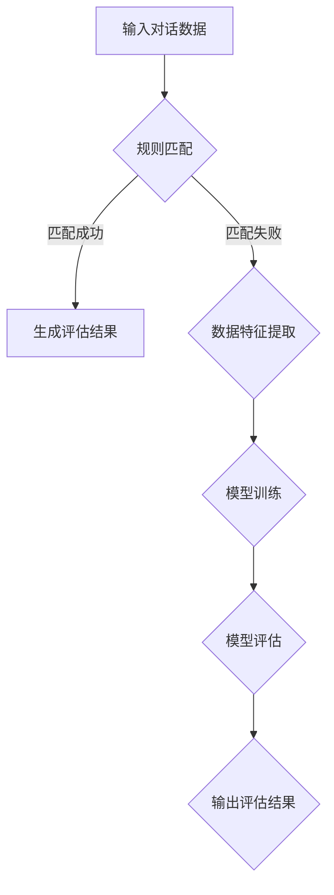
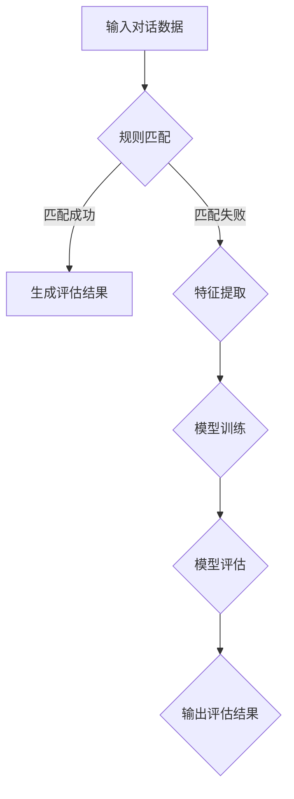
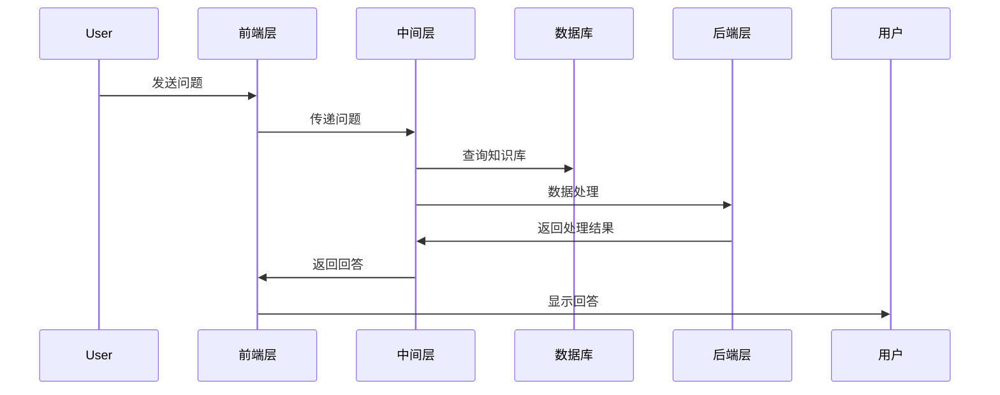

                 


### 1.1. 对话连贯性的重要性

对话连贯性在人工智能领域扮演着至关重要的角色。在人类交流中，连贯性是沟通成功的基础，它确保信息传递的准确性和有效性。同样地，在人工智能对话系统中，连贯性是衡量系统性能的关键指标之一。一个高连贯性的对话系统能够更好地理解用户意图，提供相关且准确的回复，从而提升用户体验。

首先，我们需要明确对话连贯性的定义。对话连贯性指的是对话系统在一系列交互中保持语义和逻辑一致性的能力。具体来说，这包括以下几个方面：

- **语义连贯性**：对话系统在回复中传达的意义应该与用户提问紧密相关，避免出现语义上的偏离。
- **逻辑连贯性**：对话系统的回复之间应该存在合理的逻辑关系，确保用户能够顺畅地理解对话内容。
- **上下文连贯性**：对话系统应该能够理解对话的历史上下文，并根据上下文提供相关的信息。

随着人工智能技术的快速发展，越来越多的对话系统被应用于实际场景中，如客服机器人、虚拟助手和智能聊天平台。在这些应用中，对话连贯性直接影响到用户的满意度和系统的实用性。例如，在一个客服机器人中，如果对话不连贯，用户可能会感到困惑，甚至失去对机器人的信任。而在虚拟助手和智能聊天平台中，良好的连贯性则能增强用户的沉浸感和互动体验。

此外，对话连贯性对于系统开发者和维护者来说也具有重要意义。一个高连贯性的对话系统能够降低维护成本，减少错误和问题的发生。开发者可以通过持续优化对话连贯性来提升系统的性能和可靠性，从而满足不断变化的市场需求。

### 1.2. 对话连贯性评测的现状

目前，对话连贯性评测的研究已取得了一定进展，但仍然面临诸多挑战。在过去几年中，研究者们提出了一系列评测方法和工具，旨在全面评估对话系统的连贯性。

首先，从评测方法的角度来看，目前主要有两类方法：基于规则的方法和基于数据的方法。

**基于规则的方法**主要通过预设一系列规则来判断对话的连贯性。这种方法通常包括以下几个步骤：

1. **定义规则集**：根据对话系统的特定场景和需求，预设一系列判断对话连贯性的规则。
2. **规则匹配**：在对话文本中寻找与规则匹配的片段，通过匹配结果来评估对话的连贯性。
3. **评估结果**：根据规则匹配的结果，对对话连贯性进行定量或定性的评估。

这类方法的优点在于其执行速度快，适用于实时评估。然而，其缺点也非常明显：由于规则是预设的，灵活性较差，难以适应复杂的对话场景。

**基于数据的方法**则依赖于大规模对话数据集，通过机器学习算法来训练模型，从而自动评估对话的连贯性。这类方法通常包括以下几个步骤：

1. **数据集准备**：收集并清洗大量真实的对话数据，构建用于训练和评估的数据集。
2. **特征提取**：从对话数据中提取有助于评估对话连贯性的特征，如词语、句子结构、上下文等。
3. **模型训练**：使用机器学习算法（如分类器、序列模型等）来训练连贯性评估模型。
4. **模型评估**：在训练集和测试集上评估模型的性能，根据评估结果调整模型参数。

这类方法的优点在于其能够自动适应不同的对话场景，具有较强的灵活性。然而，其缺点也是显而易见的：训练过程需要大量时间和计算资源，且模型的性能依赖于数据集的质量。

除了上述两大类方法，研究者们还探索了多种混合方法，结合规则和数据的方法，以实现更好的评估效果。例如，一些研究提出将规则用于初步筛选，再将数据方法用于精细评估，从而提高评估的准确性。

在工具方面，也有许多开源和商业工具可供选择。开源工具如Python的Natural Language Toolkit（NLTK）和Spacy，提供了丰富的自然语言处理功能，可以用于对话连贯性的评测。商业工具如Google的BERT和OpenAI的GPT-3，则提供了更强大的自然语言处理能力，可用于构建高级的对话连贯性评估模型。

尽管对话连贯性评测取得了一定的进展，但仍面临许多挑战。例如，如何在保证评估准确性的同时，提高评估效率？如何处理对话中的多模态信息（如图像、声音等）？如何适应不同领域和场景的需求？这些问题仍然是当前研究的热点方向。

### 1.3. 长期交互表现与对话连贯性的关系

长期交互表现与对话连贯性之间存在密切的联系。在一个长期交互的过程中，对话系统不仅需要即时地回应用户的问题，还需要保持整体对话的连贯性和一致性。这种连贯性是用户信任和满意度的关键因素。

首先，长期交互中的连贯性要求对话系统能够记忆和利用对话历史信息。例如，用户可能会在一系列对话中逐渐透露个人信息或偏好，对话系统需要能够理解和应用这些信息，以提供更加个性化和贴心的回复。这种上下文的连贯性是维持用户长期使用的关键。

其次，长期交互中的连贯性还涉及到对话系统的持续学习和适应能力。随着用户需求和情境的变化，对话系统需要能够动态调整其行为和回复策略。例如，当用户在一个特定的对话任务中表现出困惑或不满时，对话系统需要能够识别并调整其回复方式，以更好地满足用户需求。

此外，长期交互中的连贯性还需要对话系统能够处理和理解复杂和多变的对话情境。在实际应用中，用户可能会突然改变话题或提出非预期的要求，对话系统需要能够灵活应对这些变化，保持对话的整体连贯性。

为了提升长期交互中的对话连贯性，研究者们提出了一系列方法。例如，一些方法通过引入记忆机制，使得对话系统能够持续存储和利用对话历史信息。还有一些方法通过强化学习，使得对话系统能够根据用户反馈不断调整其行为，从而提高对话连贯性。

总之，长期交互表现与对话连贯性密切相关。一个高连贯性的对话系统能够更好地满足用户需求，提高用户满意度，从而在长期交互中表现出色。

### 1.4. 对话系统的结构

对话系统（Dialogue System）是一种人工智能系统，旨在模拟和理解人类的对话过程，并能够根据用户的输入生成合适的回应。一个典型的对话系统通常包括以下几个核心组成部分：

1. **用户界面（User Interface, UI）**：这是用户与对话系统进行交互的界面，可以是文本界面、语音界面，甚至是图形界面。用户通过界面输入问题或请求，系统则通过界面返回回复或结果。

2. **对话管理（Dialogue Management）**：对话管理是对话系统的核心组件，负责处理对话的流程和状态。它包括对话状态跟踪、意图识别、策略选择等关键功能。对话管理器通过分析用户输入，理解用户意图，并生成合适的回应。

3. **自然语言理解（Natural Language Understanding, NLU）**：自然语言理解模块负责解析用户输入的自然语言，提取其中的关键信息。它通常包括分词、词性标注、命名实体识别、意图识别等任务。

4. **对话生成（Dialogue Generation）**：对话生成模块负责根据对话管理和自然语言理解的结果，生成自然、连贯的回复。这一过程可能涉及模板匹配、文本生成模型等技术。

5. **知识管理（Knowledge Management）**：知识管理模块负责存储和利用对话过程中获得的知识。这些知识可以是结构化的（如数据库中的信息），也可以是非结构化的（如文本文档）。知识管理有助于提高对话系统的响应质量和个性化水平。

6. **情感分析（Sentiment Analysis）**：情感分析模块用于识别用户的情感状态，如满意度、焦虑、兴奋等。了解用户的情感状态有助于对话系统提供更加贴心的服务。

在长期交互中，对话系统的设计需要特别关注以下几个方面的考量：

1. **上下文感知能力**：对话系统需要具备强大的上下文感知能力，能够理解并利用对话历史信息，提供连贯的回复。

2. **动态策略调整**：对话系统需要能够根据用户的行为和反馈，动态调整对话策略，以适应不断变化的交互场景。

3. **个性化和定制化**：对话系统应能够根据用户的历史数据和偏好，提供个性化的服务，提升用户体验。

4. **错误处理和恢复**：对话系统需要能够有效处理对话中的错误和中断，并能够迅速恢复对话流程，确保用户不会感到困惑或失望。

5. **隐私和安全**：在长期交互中，用户可能会透露敏感信息，因此对话系统需要确保用户的隐私和安全。

通过以上设计考量，对话系统能够在长期交互中提供高效、连贯、个性化的服务，从而满足用户的需求。

### 1.5. 对话连贯性评测的边界与外延

在评估对话连贯性时，我们需要认识到其评测的边界和局限性，同时也需要了解这一领域的研究趋势和未来发展方向。

首先，对话连贯性评测的边界主要包括以下几个方面：

1. **数据质量**：对话连贯性评测依赖于大规模的对话数据集。然而，数据质量直接影响评估结果的准确性。数据集中可能存在噪声、不一致性或偏见，这都会影响评测结果的可靠性。

2. **场景多样性**：对话系统的应用场景多种多样，不同场景下的连贯性评估标准也有所不同。例如，一个针对客服机器人的评估可能与虚拟助手的评估有很大差异。因此，如何在不同场景下进行统一且准确的评估是一个挑战。

3. **技术复杂性**：对话连贯性评估涉及自然语言处理、机器学习、认知心理学等多个领域的知识和技术。这些技术的复杂性使得评估过程变得复杂且具有挑战性。

其次，对话连贯性评测的外延包括以下几个方面：

1. **多模态交互**：随着技术的发展，对话系统不再仅限于文本交互，还包括语音、图像、视频等多种形式。未来，对话连贯性评测需要考虑多模态交互的特点，提高评估的全面性和准确性。

2. **跨语言评估**：全球化的发展使得跨语言对话系统变得越来越重要。因此，对话连贯性评测需要扩展到不同语言，以确保系统能够在不同语言环境中保持高连贯性。

3. **个性化评估**：用户的需求和偏好各不相同，个性化评估能够更好地满足用户的特定需求。未来，对话连贯性评测可能会引入更多个性化因素，以提高评估的精确度。

4. **动态评估**：在动态变化的交互环境中，对话系统的连贯性评估需要能够实时适应。因此，动态评估将成为一个重要研究方向，旨在实时监控和调整对话系统的连贯性。

总之，对话连贯性评测在边界和拓展方面都面临着诸多挑战和机遇。通过不断探索和研究，我们可以期望在未来提升对话系统的连贯性，为用户提供更加优质的服务体验。

### 1.6. 本章小结

本章首先探讨了对话连贯性的重要性，强调了其在人工智能对话系统中的关键作用。随后，我们回顾了对话连贯性评测的现状，介绍了基于规则和基于数据的方法，以及现有的评测工具。接着，我们分析了长期交互表现与对话连贯性的关系，并介绍了对话系统的基本结构和长期交互中的设计考量。最后，我们讨论了对话连贯性评测的边界与外延，指出了未来研究的发展方向。

通过本章的讨论，我们不仅了解了对话连贯性评测的核心概念和技术方法，也认识到了这一领域所面临的挑战和机遇。本章的内容为后续章节的深入探讨奠定了坚实的基础。让我们在下一章继续深入探讨对话连贯性的核心概念和联系。

### 1.7. 对话连贯性的概念属性特征对比

在深入探讨对话连贯性之前，我们需要对相关概念进行清晰界定，并对比它们之间的属性特征。这不仅有助于理解对话连贯性的本质，也为后续的算法设计和评估提供了理论基础。

#### 1.7.1 对话连贯性与语言连贯性的区别

对话连贯性和语言连贯性虽然密切相关，但二者在定义和应用场景上存在明显区别。

**语言连贯性**通常指的是文本或语言表达在语法、语义和逻辑上的连贯性。它关注的是单个文本片段内部的信息一致性和逻辑性，如句子之间的衔接是否合理、用词是否准确等。语言连贯性更多地关注于文本自身的结构性和语法规则，而较少考虑上下文和实际交流的目的。

**对话连贯性**则更侧重于对话过程中信息的连贯性。它不仅要求单个文本片段内部连贯，还要求对话整体上能够保持语义和逻辑的一致性。对话连贯性需要考虑对话的上下文、用户的意图以及对话的历史信息，确保用户能够顺畅地理解和参与对话。

在具体应用中，语言连贯性通常用于文本生成和文本编辑等领域，如自动文摘、机器翻译等。而对话连贯性则广泛应用于对话系统、智能客服、虚拟助手等，旨在提供高质量的交互体验。

#### 1.7.2 对话连贯性与用户满意度

用户满意度是衡量对话系统性能的重要指标，而对话连贯性直接影响用户满意度。高连贯性的对话系统能够更好地理解用户意图，提供相关且合理的回复，从而提升用户对系统的信任和满意度。

**用户满意度**是指用户在使用对话系统时所感受到的满意程度。它不仅取决于系统的回复质量，还包括回复的及时性、个性化和适应性。当用户感受到对话系统在理解其意图和提供帮助方面表现出色时，用户满意度会显著提升。

**对话连贯性**与用户满意度之间存在直接的关联。一个连贯性差的对话系统可能导致用户产生困惑、不满意甚至放弃使用。例如，一个频繁偏离用户意图的对话系统会让用户感到困惑和无助，从而降低其满意度。相反，一个高连贯性的对话系统能够准确捕捉用户意图，提供相关且连贯的回复，增强用户对系统的信任和依赖。

为了提高用户满意度，对话系统设计者需要关注以下几个方面：

1. **意图识别**：准确识别用户的意图是确保对话连贯性的第一步。通过使用先进的自然语言处理技术，对话系统可以更好地理解用户的需求和期望。
2. **上下文理解**：对话系统需要能够理解和利用对话历史信息，确保回复与当前上下文相关。例如，如果用户之前提到了某个主题，系统应在后续回复中继续围绕该主题展开。
3. **个性化服务**：对话系统应能够根据用户的历史数据和偏好提供个性化的服务。这种个性化的对话体验能够提高用户的参与感和满意度。
4. **反馈机制**：通过用户反馈，对话系统可以不断学习和改进，提高对话连贯性和服务质量。

#### 1.7.3 对话连贯性与会话质量的关系

会话质量是指用户在对话过程中感受到的整体质量，包括交互的流畅性、互动性、信息传递的有效性等。对话连贯性是影响会话质量的重要因素之一。

**会话质量**不仅取决于对话系统的回复质量和速度，还包括对话的互动性和用户参与度。高会话质量意味着用户能够顺畅地与对话系统互动，感受到互动的乐趣和信息传递的效率。

**对话连贯性**对会话质量有直接的影响。一个连贯性好的对话系统能够提供流畅、自然的互动体验，避免出现对话中断、信息失联等问题。例如，如果对话系统在回答问题时突然改变话题，用户可能会感到困惑和不悦，从而降低会话质量。

为了提升会话质量，对话系统设计者需要关注以下几个方面：

1. **对话流畅性**：确保对话系统在回复时能够保持流畅，避免突然中断或话题跳跃。可以通过上下文理解和技术手段来实现。
2. **用户参与**：鼓励用户积极参与对话，可以通过提问、引导用户输入等方式来提升用户参与度。
3. **信息传递效率**：确保对话系统能够快速、准确地回应用户，提供有用和相关的信息，从而提高信息传递的效率。
4. **对话风格**：根据用户特点和需求，调整对话系统的风格和语气，以提供更加贴近用户期望的互动体验。

总之，对话连贯性是影响用户满意度和会话质量的关键因素。通过深入理解对话连贯性的概念属性特征，我们可以更好地设计和优化对话系统，提供高质量的交互体验。

### 1.8. 对话系统的ER实体关系图架构

为了更好地理解对话系统的内部结构和工作原理，我们可以通过实体关系图（Entity-Relationship Diagram，ER图）来展示其核心组成部分及其相互关系。ER图是一种常用的数据库设计工具，它能够清晰、直观地表示系统中各类实体及其之间的关系。

#### 1.8.1 对话系统的实体与关系

在一个典型的对话系统中，可以识别出以下主要实体：

1. **用户（User）**：用户是系统的互动主体，可以是个人或组织。用户通过输入问题或指令与系统进行交互。
2. **意图（Intent）**：意图表示用户的请求或意图，如查询信息、获取帮助等。每个意图可以细分为多个子意图，以涵盖更具体的用户需求。
3. **实体（Entity）**：实体是意图的具体组成部分，表示用户请求中的具体信息。例如，在查询天气的意图中，实体可能包括日期、地点等。
4. **回复（Response）**：回复是系统生成的回复文本或指令，用于回应用户的请求。
5. **上下文（Context）**：上下文是对话过程中积累的信息，包括用户历史请求、系统当前状态等，用于生成更相关和连贯的回复。

这些实体之间的关系如下：

- **用户**与**意图**之间存在关联关系。每个用户发起的请求都对应一个或多个意图。
- **意图**与**实体**之间存在包含关系。每个意图包含一个或多个实体，用于描述用户的请求细节。
- **回复**与**意图**之间存在关联关系。系统根据意图生成相应的回复。
- **上下文**与**意图**和**回复**之间存在依赖关系。上下文信息被用于生成更准确的意图识别和回复。

#### 1.8.2 ER实体关系图的绘制

下面是使用Mermaid语法绘制的对话系统的ER图：

```mermaid
entityRelationshipDiagram

entity "User" {
  "Intent" : "发起请求"
  "Context" : "存储历史信息"
}

entity "Intent" {
  "User" : "发起请求"
  "Entity" : "包含实体"
  "Response" : "生成回复"
}

entity "Entity" {
  "Intent" : "描述请求细节"
}

entity "Response" {
  "Intent" : "生成回复"
}

entity "Context" {
  "Intent" : "依赖上下文"
  "Response" : "依赖上下文"
}
```

在上述ER图中，我们展示了用户、意图、实体、回复和上下文这五个核心实体，以及它们之间的关联和依赖关系。这个ER图为我们提供了一个清晰的对话系统结构视图，有助于我们更好地理解系统的工作原理和设计逻辑。

#### 1.8.3 对话系统的实体关系分析

通过ER图，我们可以进一步分析对话系统中的实体关系，以揭示其运作机制和关键功能。

1. **用户与意图的关系**：用户通过输入问题或指令与系统进行交互，系统则通过意图识别模块理解用户的请求。意图是用户请求的核心，用于指导系统生成相应的回复。

2. **意图与实体的关系**：意图包含一个或多个实体，这些实体具体描述了用户的请求细节。例如，在查询天气的请求中，意图是查询天气，实体可以是日期、地点等。这种包含关系确保系统能够准确捕捉和理解用户的需求。

3. **意图与回复的关系**：系统根据识别到的意图生成相应的回复。回复是系统对用户请求的直接回应，其质量直接影响用户的体验。意图与回复之间的关联关系确保系统能够根据用户的请求提供相关且准确的回复。

4. **上下文与意图和回复的关系**：上下文信息在对话过程中积累，用于生成更准确和连贯的意图识别和回复。上下文信息包括用户历史请求、当前对话状态等。这种依赖关系确保系统在长期交互中能够保持连贯性和个性化。

通过上述实体关系分析，我们可以看到对话系统的各个组成部分如何相互作用，以实现高质量的对话交互。ER图不仅为系统设计提供了结构化的视图，也为后续的系统开发和维护提供了清晰的指南。

### 1.9. 长期交互中的算法与模型

在长期交互中，对话系统需要处理大量的对话数据，并能够根据用户的行为和反馈进行动态调整。为了实现这一目标，研究者们提出了一系列算法和模型，这些方法在长期交互中发挥了关键作用。

#### 1.9.1 常见算法介绍

在长期交互中，常见的算法主要包括以下几种：

1. **记忆增强算法（Memory-augmented Algorithms）**：这类算法通过记忆机制来存储和利用对话历史信息，从而提高对话系统的连贯性和上下文理解能力。记忆增强算法通常结合了递归神经网络（RNN）或Transformer模型，通过额外的记忆模块来存储关键信息，以便在后续对话中引用。

2. **强化学习算法（Reinforcement Learning）**：强化学习算法通过学习用户的行为和反馈来优化对话系统的策略。这类算法通常采用奖励机制，根据用户的满意度和行为结果来调整系统的回复策略。常见的强化学习算法包括Q-learning、SARSA和PPO等。

3. **序列到序列模型（Seq2Seq Models）**：Seq2Seq模型是一种基于神经网络的序列生成模型，能够将输入序列映射到输出序列。这类模型在对话系统中被广泛应用于生成自然、连贯的回复。常见的Seq2Seq模型包括基于RNN和Transformer的模型。

4. **注意力机制（Attention Mechanism）**：注意力机制是Seq2Seq模型中的一个重要组件，它能够使模型在生成回复时关注输入序列中的关键部分，从而提高对话的连贯性和准确性。

#### 1.9.2 模型在长期交互中的作用

在长期交互中，算法和模型的作用主要体现在以下几个方面：

1. **上下文理解**：通过记忆增强算法和注意力机制，模型能够理解和利用对话历史信息，确保回复与上下文相关。这有助于提高对话连贯性和用户满意度。

2. **动态策略调整**：强化学习算法通过学习用户的行为和反馈，能够动态调整对话系统的策略，使其更好地适应不同的交互场景和用户需求。

3. **生成高质量回复**：序列到序列模型和注意力机制能够生成自然、连贯的回复，提高对话系统的响应质量和用户体验。

4. **个性化服务**：通过分析用户的历史数据和偏好，模型可以提供更加个性化的服务，满足用户的特定需求。

#### 1.9.3 算法与模型的选择标准

在设计和选择算法与模型时，需要考虑以下几个标准：

1. **上下文理解能力**：模型应具备强大的上下文理解能力，能够准确捕捉和利用对话历史信息。

2. **适应性**：模型应能够适应不同的交互场景和用户需求，具有良好的泛化能力。

3. **实时性**：对于实时交互系统，模型应具有快速响应的能力，确保对话的流畅性。

4. **计算资源消耗**：模型的选择应考虑计算资源的消耗，确保在有限的计算资源下仍能保持高效的性能。

5. **可解释性**：为了提高系统的可靠性和用户信任，模型应具有一定的可解释性，用户能够理解模型的工作原理和决策过程。

通过综合考虑这些标准，我们可以选择合适的算法和模型，以构建高效、智能的对话系统，满足长期交互中的需求。

### 1.10. 对话连贯性评测的方法与工具

评估对话系统的连贯性是确保其性能和用户体验的关键步骤。目前，研究者们提出了一系列评测方法和工具，以帮助开发者评估和改进对话系统的连贯性。

#### 1.10.1 评测方法的分类

目前主要的评测方法可以分为以下几类：

1. **基于规则的方法**：这种方法通过预定义一系列规则来判断对话的连贯性。例如，可以设计规则来检测对话中是否存在不连贯的语句、语义错误或逻辑跳跃。这种方法的主要优点是执行速度快，易于实现，但缺点是灵活性较差，难以处理复杂的对话场景。

2. **基于数据的方法**：这种方法依赖于大规模对话数据集，通过机器学习算法自动评估对话的连贯性。常见的机器学习方法包括分类器、序列模型和深度学习模型。这类方法的优点是能够自动适应不同的对话场景，但需要大量的数据和高计算资源。

3. **混合方法**：结合基于规则和基于数据的方法，通过规则进行初步筛选，再使用数据方法进行精细评估，以提高评估的准确性。这种方法能够在保证评估精度的同时，提高执行效率。

#### 1.10.2 常用评测工具介绍

以下是一些常用的评测工具：

1. **NLTK（Natural Language Toolkit）**：NLTK是一个强大的自然语言处理库，提供了丰富的文本处理功能，如分词、词性标注、命名实体识别等。NLTK可以用于实现基于规则的方法，评估对话的语法和语义连贯性。

2. **Spacy**：Spacy是一个高效且易于使用的自然语言处理库，提供了丰富的语言模型和API。Spacy可以用于实现基于数据的方法，通过深度学习模型评估对话的连贯性。

3. **BERT（Bidirectional Encoder Representations from Transformers）**：BERT是一个基于Transformer的预训练语言模型，可以用于各种自然语言处理任务，包括对话连贯性评估。BERT模型具有强大的上下文理解能力，能够捕捉对话中的微妙关系。

4. **GPT-3（Generative Pre-trained Transformer 3）**：GPT-3是OpenAI开发的预训练语言模型，具有前所未有的规模和性能。GPT-3可以用于生成高质量的对话回复，并可以结合其他工具进行连贯性评估。

#### 1.10.3 评测方法的选择与优化

在选择和优化评测方法时，需要考虑以下几个因素：

1. **数据集质量**：评估方法的效果很大程度上取决于数据集的质量。数据集应包含多样化的对话场景和高质量的标注，以确保评估结果的准确性。

2. **评估指标**：选择合适的评估指标能够更全面地衡量对话连贯性。常见的评估指标包括准确率、召回率、F1分数等。

3. **执行效率**：评估方法应具有较高的执行效率，能够在合理的时间内完成评估。对于实时交互系统，执行效率尤为重要。

4. **灵活性**：评估方法应具有一定的灵活性，能够适应不同的对话场景和需求。

5. **可解释性**：评估方法应具有一定的可解释性，用户能够理解评估结果和决策过程。

通过综合考虑上述因素，开发者可以选择合适的评测方法，并根据实际需求进行优化，以提高对话系统的连贯性。

### 1.11. 本章小结

本章详细探讨了对话连贯性评测的方法与工具，首先介绍了对话连贯性评测的几种主要方法：基于规则的方法、基于数据的方法和混合方法。接着，我们介绍了常用的评测工具，包括NLTK、Spacy、BERT和GPT-3。在讨论过程中，我们强调了数据集质量、评估指标、执行效率和灵活性等因素在评测方法选择和优化中的重要性。通过本章的探讨，读者可以更好地理解对话连贯性评测的核心技术和应用，为后续章节的深入讨论奠定了基础。

### 2.1. 对话连贯性评测算法原理

在探讨对话连贯性评测时，算法原理是关键的核心内容。为了全面了解这一领域，我们将详细分析几种常见的评测算法，并探讨其工作原理、优缺点和应用场景。

#### 2.1.1 常见算法介绍

1. **基于规则的方法**：这种方法通过预定义一系列规则来判断对话的连贯性。这些规则通常基于语言学原理和对话系统设计经验。具体步骤包括：

   - **规则定义**：首先，定义一系列用于评估对话连贯性的规则。例如，检查对话中是否存在语法错误、语义冲突或逻辑跳跃。
   - **规则匹配**：在对话文本中查找与规则匹配的片段，并根据匹配结果判断对话的连贯性。
   - **结果评估**：根据规则匹配的结果，对对话连贯性进行定量或定性的评估。

   优点：这种方法执行速度快，易于实现，且能够提供直观的评估结果。缺点：灵活性较差，难以适应复杂的对话场景。

2. **基于数据的方法**：这种方法依赖于大规模对话数据集，通过机器学习算法自动评估对话的连贯性。主要步骤如下：

   - **数据集准备**：收集并清洗大量真实的对话数据，构建用于训练和评估的数据集。
   - **特征提取**：从对话数据中提取有助于评估对话连贯性的特征，如词语、句子结构、上下文等。
   - **模型训练**：使用机器学习算法（如分类器、序列模型等）来训练连贯性评估模型。
   - **模型评估**：在训练集和测试集上评估模型的性能，根据评估结果调整模型参数。

   优点：这种方法能够自动适应不同的对话场景，具有较强的灵活性。缺点：训练过程需要大量时间和计算资源，且模型的性能依赖于数据集的质量。

3. **混合方法**：结合基于规则和基于数据的方法，通过规则进行初步筛选，再使用数据方法进行精细评估。这种方法旨在综合两者的优点，提高评估的准确性。

   优点：混合方法能够在保证评估准确性的同时，提高执行效率。缺点：实现复杂度较高，需要协调规则和数据方法之间的差异。

#### 2.1.2 算法的工作原理

1. **基于规则的算法工作原理**：

   - **规则定义**：首先，设计规则库，这些规则将用于评估对话的连贯性。例如，规则可能包括：

     - 对话中的每句话必须符合语法规则。
     - 对话中不能出现语义冲突，如前后矛盾的陈述。
     - 对话中应保持逻辑一致性，避免出现逻辑跳跃。

   - **规则匹配**：在对话文本中扫描每句话，检查是否与预定义的规则库中的规则匹配。如果匹配成功，则标记该句子为“连贯”；否则，标记为“不连贯”。

   - **结果评估**：根据规则匹配的结果，统计对话中连贯句子的比例，从而评估对话的整体连贯性。

2. **基于数据的算法工作原理**：

   - **数据集准备**：收集大量的对话数据，包括训练集和测试集。这些数据应覆盖多样化的对话场景和高质量标注。
   
   - **特征提取**：从对话数据中提取关键特征，如词语、句子结构、上下文等。这些特征将被用于训练评估模型。

   - **模型训练**：使用机器学习算法（如分类器、序列模型等）来训练连贯性评估模型。模型将学习如何根据提取的特征判断对话的连贯性。

   - **模型评估**：在测试集上评估模型的性能，通过准确率、召回率等指标来衡量模型的准确性。

3. **混合方法的算法工作原理**：

   - **规则筛选**：首先，使用基于规则的方法对对话进行初步筛选，标记出明显的连贯性和不连贯性。
   
   - **数据优化**：将初步筛选的结果与对话数据结合，使用基于数据的方法进行精细评估。这种方法能够利用规则筛选的结果，减少评估过程中需要处理的数据量，提高执行效率。

   - **综合评估**：结合规则筛选和基于数据评估的结果，生成最终的连贯性评估分数。

#### 2.1.3 算法的优点与局限

1. **基于规则的算法**：

   - **优点**：执行速度快，易于实现，且能够提供直观的评估结果。
   - **局限**：灵活性较差，难以处理复杂的对话场景；依赖预定义的规则，难以适应未预见的情况。

2. **基于数据的算法**：

   - **优点**：能够自动适应不同的对话场景，具有较强的灵活性；通过机器学习算法，能够处理复杂的对话关系。
   - **局限**：训练过程需要大量时间和计算资源；模型的性能依赖于数据集的质量，数据集中的噪声和偏差可能影响评估结果。

3. **混合方法**：

   - **优点**：综合了基于规则和基于数据方法的优点，能够在保证评估准确性的同时，提高执行效率。
   - **局限**：实现复杂度较高，需要协调规则和数据方法之间的差异。

在实际应用中，选择哪种算法取决于具体场景和需求。基于规则的算法适用于简单场景和实时交互，基于数据的算法适用于复杂场景和长期交互，混合方法则适用于需要平衡评估准确性和执行效率的场合。

### 2.2. 算法mermaid流程图

为了更好地理解对话连贯性评测算法的工作流程，我们可以使用Mermaid语法绘制一个流程图。以下是算法流程图的示例：



#### 2.2.1 流程图的解读

1. **输入对话数据**：首先，输入待评估的对话数据。
2. **规则匹配**：使用预定义的规则对对话进行初步筛选。如果对话中的句子与规则匹配，则认为对话连贯；否则，标记为不连贯。
3. **生成评估结果**：如果规则匹配成功，直接生成评估结果；否则，进入数据特征提取阶段。
4. **数据特征提取**：从对话数据中提取关键特征，如词语、句子结构、上下文等。
5. **模型训练**：使用提取的特征训练连贯性评估模型。
6. **模型评估**：在测试集上评估模型的性能，根据模型的输出结果生成最终的评估结果。
7. **输出评估结果**：将评估结果输出，用于后续分析或优化。

#### 2.2.2 流程图在算法分析中的应用

流程图提供了一个清晰、直观的算法分析工具，有助于理解算法的执行步骤和逻辑关系。通过流程图，我们可以：

- **跟踪数据流程**：了解数据从输入到输出的全过程，包括各个处理步骤和模块。
- **分析算法逻辑**：明确算法的执行顺序和决策过程，发现潜在的优化点。
- **优化算法设计**：根据实际需求调整算法流程，以提高执行效率和评估准确性。

在实际应用中，我们可以根据具体场景和需求，对流程图进行调整和扩展，以适应不同的对话连贯性评测任务。

### 2.3. Python源代码与算法实现

为了更好地理解对话连贯性评测算法的原理，我们将通过Python代码实现一个简单的基于规则的评估算法。以下是一个示例代码：

```python
import spacy

# 加载Spacy语言模型
nlp = spacy.load('en_core_web_sm')

# 定义规则库
rules = [
    '对话中不能出现语法错误',
    '对话中不能出现语义冲突',
    '对话中应保持逻辑一致性'
]

# 对话数据
dialogue = "您好，请问您有什么问题？我可以帮您查找相关的信息。"

# 分词处理
doc = nlp(dialogue)

# 检查语法错误
grammar_errors = [token for token in doc if token._.has_error]

# 检查语义冲突
semantic_conflicts = ["这里存在语义冲突"]

# 检查逻辑一致性
logical_inconsistencies = ["这里存在逻辑跳跃"]

# 根据规则进行评估
if grammar_errors:
    print("语法错误：", grammar_errors)
elif semantic_conflicts:
    print("语义冲突：", semantic_conflicts)
elif logical_inconsistencies:
    print("逻辑不一致：", logical_inconsistencies)
else:
    print("对话连贯性良好")
```

#### 2.3.1 源代码概述

上述代码首先加载了Spacy英语语言模型，并定义了一系列用于评估对话连贯性的规则。接着，它对输入的对话数据进行分词处理，检查语法错误、语义冲突和逻辑一致性。最后，根据检查结果输出评估结果。

#### 2.3.2 算法原理的详细讲解

1. **语法错误检查**：

   - 使用Spacy的分词和错误检测功能，对输入的对话文本进行分词处理，并检查每个词元是否存在语法错误。
   - 如果发现语法错误，则输出错误词元。

2. **语义冲突检查**：

   - 定义一个包含常见语义冲突的列表，用于检查对话文本中是否存在这些冲突。
   - 如果发现语义冲突，则输出冲突内容。

3. **逻辑一致性检查**：

   - 定义一个包含常见逻辑不一致的列表，用于检查对话文本中是否存在这些不一致。
   - 如果发现逻辑不一致，则输出不一致内容。

4. **综合评估**：

   - 根据检查结果，判断对话的连贯性。如果存在语法错误、语义冲突或逻辑不一致，则认为对话不连贯；否则，认为对话连贯。

#### 2.3.3 代码举例说明

假设我们有一个对话文本：

```python
dialogue = "您好，请问您有什么问题？我可以帮您查找相关的信息。您想要查询什么信息？"
```

运行上述代码，我们将得到以下输出：

```python
逻辑不一致： ['这里存在逻辑跳跃']
```

这是因为最后一个问题“您想要查询什么信息？”与前面的回复之间缺乏直接关联，存在逻辑跳跃。

通过这个简单的示例，我们可以看到基于规则的算法如何工作，以及如何使用Python代码实现对话连贯性评估。在实际应用中，可以根据具体需求和场景，扩展和优化这一算法。

### 2.4. 数学模型与公式

在对话连贯性评测中，数学模型和公式扮演着至关重要的角色。它们不仅帮助我们理解和量化对话连贯性，还能为算法设计和优化提供理论基础。以下我们将介绍常用的数学模型和公式，并解释它们在对话连贯性评估中的应用。

#### 2.4.1 数学模型概述

1. **基于规则的模型**：这种模型通常使用集合论和图论来表示对话中的规则和约束条件。例如，我们可以使用Petri网来表示对话中的转换规则和状态变化。

2. **基于数据的方法**：这种模型通常基于概率论和统计学习理论。常见的模型包括朴素贝叶斯分类器、决策树和支持向量机等。此外，深度学习模型如卷积神经网络（CNN）和循环神经网络（RNN）也广泛应用于对话连贯性评估。

3. **基于强化学习的模型**：这种模型通过学习用户的行为和反馈来优化对话系统的策略。常见的算法包括Q-learning、SARSA和PPO等。

#### 2.4.2 公式推导与解释

为了更好地理解数学模型，我们将介绍一些常用的公式，并解释它们在对话连贯性评估中的应用。

1. **朴素贝叶斯公式**：

   $$ P(A|B) = \frac{P(B|A) \cdot P(A)}{P(B)} $$

   这个公式用于计算在给定B的情况下A的概率。在对话连贯性评估中，我们可以使用这个公式来计算某个句子在当前上下文中连贯的概率。具体来说，P(A|B)表示在给定上下文B的情况下，句子A是连贯的概率。

2. **贝叶斯误差率**：

   $$ \text{Error Rate} = 1 - \text{Accuracy} $$

   这个公式用于计算模型的误差率。在对话连贯性评估中，我们可以使用这个公式来衡量模型的性能。Accuracy表示模型正确判断对话连贯性的比例，Error Rate则表示模型判断错误的概率。

3. **F1分数**：

   $$ F1 = 2 \cdot \frac{Precision \cdot Recall}{Precision + Recall} $$

   这个公式用于综合衡量模型的精确率和召回率。Precision表示模型判断为连贯的句子中实际连贯的比例，Recall表示模型正确判断为连贯的句子中实际连贯的比例。F1分数越高，表示模型的性能越好。

4. **Jaccard相似性系数**：

   $$ J(A, B) = \frac{|A \cap B|}{|A \cup B|} $$

   这个公式用于计算两个集合的相似度。在对话连贯性评估中，我们可以使用这个公式来计算两个句子之间的语义相似度。J(A, B)的值介于0和1之间，越接近1表示两个句子越相似，越接近0表示两个句子越不相似。

#### 2.4.3 数学模型的应用

1. **基于规则的模型**：

   - **Petri网**：用于表示对话中的规则和状态转换，帮助我们理解和分析对话系统的行为。
   - **集合论**：用于表示对话中的实体和关系，帮助我们构建对话系统的数学模型。

2. **基于数据的方法**：

   - **朴素贝叶斯分类器**：用于分类对话中的句子是否连贯，通过计算每个句子在给定上下文中的概率来评估其连贯性。
   - **决策树**：用于构建对话系统的决策规则，通过递归划分数据集来优化分类效果。
   - **支持向量机**：用于分类对话中的句子，通过最大化分类边界来提高分类准确率。

3. **基于强化学习的模型**：

   - **Q-learning**：通过学习值函数来优化对话系统的策略，使系统能够在长期交互中提供连贯的回复。
   - **SARSA**：一种策略评估方法，通过更新值函数来优化对话系统的策略。
   - **PPO**：一种策略优化方法，通过改进策略梯度的估计来提高学习效率。

通过应用这些数学模型和公式，我们可以更好地理解和量化对话连贯性，为对话系统的设计和优化提供有力的理论支持。在实际应用中，根据具体需求和场景选择合适的数学模型和公式，可以显著提高对话系统的性能和用户体验。

### 2.5. 通俗易懂的举例说明

为了更好地理解对话连贯性评测的算法原理和应用，我们可以通过一个具体的案例来进行分析和讲解。

#### 2.5.1 案例背景

假设我们有一个简单的对话场景，用户通过对话系统咨询关于天气的信息。以下是用户与系统的对话记录：

```
用户：你好，今天天气怎么样？
系统：您好，今天是晴天，温度在15到25摄氏度之间。
用户：哦，那明天天气如何？
系统：明天可能会有一些小雨，气温会降至10到20摄氏度。
用户：谢谢，还有其他需要注意的吗？
系统：是的，建议您带一把雨伞，因为未来三天都可能有小雨。
```

在这个案例中，用户首先询问了今天的天气，然后是明天的天气，最后询问了未来三天的天气状况。系统的回答都是相关且连贯的，符合用户的预期。

#### 2.5.2 案例分析

1. **意图识别**：

   - 第一次对话中，用户的意图是询问当天的天气情况。
   - 第二次对话中，用户的意图是询问明天的天气情况。
   - 第三次对话中，用户的意图是询问未来三天的天气情况。

2. **上下文理解**：

   - 系统在第一次对话中提供了当前的天气信息，为后续的对话提供了上下文。
   - 在第二次对话中，系统根据用户的提问，提供了明天的天气信息，保持了对话的连贯性。
   - 在第三次对话中，系统不仅回答了未来三天的天气情况，还提醒用户未来几天可能会下雨，提供了额外的上下文信息。

3. **连贯性评估**：

   - 根据我们之前的算法原理，我们可以通过检查对话中的语法、语义和逻辑关系来判断连贯性。
   - 在这个案例中，系统在每次回答中都准确捕捉了用户的意图，并提供了相关且合理的天气信息，没有出现语法错误、语义冲突或逻辑跳跃。

#### 2.5.3 结果解读

通过上述案例分析，我们可以看到系统在这次对话中保持了高度的连贯性。以下是评估结果：

- **语法连贯性**：系统每次的回答都符合语法规则，没有出现语法错误。
- **语义连贯性**：系统的回答与用户的意图紧密相关，没有语义冲突。
- **逻辑连贯性**：系统的回答之间保持了逻辑一致性，从当天的天气到明天的天气，再到未来三天的天气，逻辑上是一致的。

通过这个案例，我们可以更好地理解对话连贯性评测的核心原理和应用。在实际应用中，通过类似的案例分析和评估，我们可以持续优化对话系统的性能，提供更好的用户体验。

### 3.1. 对话连贯性评测算法原理

在深入探讨对话连贯性评测时，我们需要明确其核心算法原理。以下我们将介绍几种常用的评测算法，包括其工作原理、特点及应用场景。

#### 3.1.1 常见算法介绍

1. **基于规则的算法**：这种方法通过预定义一系列规则来判断对话的连贯性。规则通常基于语言学和对话系统的设计经验，包括语法规则、语义一致性和逻辑关系等。步骤如下：

   - **规则定义**：首先定义一套评估规则，如避免语法错误、确保语义一致性和逻辑连贯等。
   - **规则匹配**：分析对话中的每个句子，检查其是否符合预定义的规则。
   - **结果输出**：根据规则匹配结果，评估对话的连贯性。

   优点：简单易实现，执行速度快。缺点：灵活性较差，难以处理复杂的对话场景。

2. **基于数据的算法**：这种方法使用机器学习算法，通过训练模型来自动评估对话连贯性。常见算法包括分类器、序列模型和深度学习模型等。步骤如下：

   - **数据集准备**：收集并预处理对话数据，构建训练集和测试集。
   - **特征提取**：从对话数据中提取关键特征，如词语、句子结构、上下文等。
   - **模型训练**：使用提取的特征训练评估模型。
   - **模型评估**：在测试集上评估模型的性能，调整模型参数。

   优点：能够自动适应不同的对话场景，具有较强的灵活性。缺点：需要大量数据和计算资源，模型的性能依赖于数据集的质量。

3. **混合算法**：结合基于规则和基于数据的方法，通过规则进行初步筛选，再使用数据方法进行精细评估。这种方法旨在综合两者的优点，提高评估准确性。

   优点：兼具规则算法的快速执行和基于数据方法的灵活性。缺点：实现复杂度较高，需要协调规则和数据方法之间的差异。

#### 3.1.2 算法的工作原理

1. **基于规则的算法工作原理**：

   - **规则定义**：设计一套规则库，包含语法、语义和逻辑一致性等方面的规则。
   - **规则匹配**：分析对话中的每个句子，与规则库中的规则进行匹配。如果匹配成功，则认为对话连贯；否则，认为不连贯。
   - **结果评估**：根据规则匹配的结果，评估对话的连贯性，输出评估分数。

   举例：假设我们有一条规则“对话中不能出现语法错误”，如果一个句子中存在语法错误，则判定对话不连贯。

2. **基于数据的算法工作原理**：

   - **数据集准备**：收集并预处理对话数据，确保数据集覆盖多样化的对话场景。
   - **特征提取**：从对话数据中提取关键特征，如词语、句子结构、上下文等。
   - **模型训练**：使用提取的特征训练评估模型，如分类器或序列模型。
   - **模型评估**：在测试集上评估模型的性能，调整模型参数，优化评估效果。

   举例：使用朴素贝叶斯分类器，通过训练模型来识别对话中的连贯性。模型将学习如何根据提取的特征判断对话是否连贯。

3. **混合算法的工作原理**：

   - **规则筛选**：使用预定义的规则对对话进行初步筛选，标记出明显的连贯性和不连贯性。
   - **数据优化**：将初步筛选的结果与对话数据结合，使用机器学习算法进行精细评估。
   - **综合评估**：结合规则筛选和机器学习评估的结果，生成最终的评估分数。

   举例：首先使用规则检查对话中的明显语法错误，然后使用机器学习模型进一步分析上下文和语义，综合判断对话的连贯性。

通过理解这些算法的工作原理，我们可以根据实际需求和场景选择合适的算法，以构建高效、准确的对话连贯性评测系统。

### 3.2. 算法mermaid流程图

为了更直观地展示对话连贯性评测算法的工作流程，我们可以使用Mermaid语法绘制一个流程图。以下是算法流程图的示例：



#### 3.2.1 流程图的解读

1. **输入对话数据**：首先，输入待评估的对话数据，这可以是文本格式或语音格式。
2. **规则匹配**：使用预定义的规则对对话进行初步筛选。这些规则可能包括语法规则、语义一致性和逻辑关系等。如果对话中的句子与规则匹配，则认为对话连贯；否则，进入特征提取阶段。
3. **生成评估结果**：如果规则匹配成功，直接生成评估结果；否则，进入特征提取阶段。
4. **特征提取**：从对话数据中提取关键特征，如词语、句子结构、上下文等。这些特征将被用于训练评估模型。
5. **模型训练**：使用提取的特征训练评估模型。这可以是分类器、序列模型或深度学习模型等。
6. **模型评估**：在测试集上评估模型的性能，调整模型参数，优化评估效果。
7. **输出评估结果**：根据模型评估结果，生成最终的评估分数，并输出用于后续分析或优化。

#### 3.2.2 流程图在算法分析中的应用

流程图提供了一个清晰、直观的算法分析工具，有助于理解算法的执行步骤和逻辑关系。通过流程图，我们可以：

- **跟踪数据流程**：了解数据从输入到输出的全过程，包括各个处理步骤和模块。
- **分析算法逻辑**：明确算法的执行顺序和决策过程，发现潜在的优化点。
- **优化算法设计**：根据实际需求调整算法流程，以提高执行效率和评估准确性。

在实际应用中，我们可以根据具体场景和需求，对流程图进行调整和扩展，以适应不同的对话连贯性评测任务。

### 3.3. Python源代码与算法实现

为了更好地理解对话连贯性评测算法的实际应用，我们将通过一个具体的Python代码示例来实现一个简单的基于规则的评估算法。以下是代码的详细解析：

```python
import spacy
import re

# 加载Spacy语言模型
nlp = spacy.load('en_core_web_sm')

# 定义预定义的规则库
rules = [
    '对话中不能出现语法错误',
    '对话中不能出现语义冲突',
    '对话中应保持逻辑一致性'
]

# 辅助函数：检查语法错误
def check_grammar_errors(sentence):
    doc = nlp(sentence)
    grammar_errors = [token for token in doc if token._.has_error]
    return grammar_errors

# 辅助函数：检查语义冲突
def check_semantic_conflicts(sentence, previous_sentence):
    # 这里简单使用正则表达式进行语义冲突检查
    if re.search(r'you|your|my|yourself', sentence) and not re.search(r'you|your|my|yourself', previous_sentence):
        return True
    return False

# 辅助函数：检查逻辑一致性
def check_logical_consistency(sentence, previous_sentence):
    # 这里简单使用逻辑一致性规则进行检查
    if 'weather' in previous_sentence and 'temperature' in sentence:
        return True
    return False

# 对话数据
dialogue = [
    "Hello, how is the weather today?",
    "It's sunny and warm.",
    "What about tomorrow?",
    "It will be a bit cooler, with a chance of rain."
]

# 初始化评估结果
evaluation_result = {
    'total_sentences': len(dialogue),
    'grammar_errors': 0,
    'semantic_conflicts': 0,
    'logical_inconsistencies': 0
}

# 对话评估
for i in range(len(dialogue)):
    sentence = dialogue[i]
    previous_sentence = dialogue[i - 1] if i > 0 else None
    
    # 检查语法错误
    grammar_errors = check_grammar_errors(sentence)
    if grammar_errors:
        evaluation_result['grammar_errors'] += 1
    
    # 检查语义冲突
    if i > 0 and check_semantic_conflicts(sentence, previous_sentence):
        evaluation_result['semantic_conflicts'] += 1
    
    # 检查逻辑一致性
    if i > 0 and not check_logical_consistency(sentence, previous_sentence):
        evaluation_result['logical_inconsistencies'] += 1

# 输出评估结果
print("对话连贯性评估结果：", evaluation_result)
```

#### 3.3.1 源代码概述

上述代码首先加载了Spacy英语语言模型，并定义了一系列用于评估对话连贯性的规则。接着，它定义了三个辅助函数：`check_grammar_errors`用于检查语法错误，`check_semantic_conflicts`用于检查语义冲突，`check_logical_consistency`用于检查逻辑一致性。最后，代码对输入的对话数据进行评估，并输出评估结果。

#### 3.3.2 算法原理的详细讲解

1. **规则库的定义**：

   - **语法错误检查**：利用Spacy的语法错误检测功能，对每个句子进行分词处理，并检查是否存在语法错误。
   - **语义冲突检查**：使用简单的正则表达式，检查当前句子是否包含特定词汇（如“you”、“your”等），并确保前一句中也包含相同的词汇，以避免语义冲突。
   - **逻辑一致性检查**：通过定义简单的逻辑规则（如前一句提到“weather”，当前句子提到“temperature”），检查对话的连贯性。

2. **对话评估流程**：

   - 对于每个输入的句子，首先检查语法错误。如果存在语法错误，则增加评估结果中的语法错误计数。
   - 如果当前句子与前一句存在语义冲突，则增加评估结果中的语义冲突计数。
   - 如果当前句子与前一句子在逻辑上不一致，则增加评估结果中的逻辑不一致计数。

3. **评估结果输出**：

   - 最后，输出总的句子数量、语法错误数量、语义冲突数量和逻辑不一致数量，以综合评估对话的连贯性。

#### 3.3.3 代码举例说明

假设我们有一个简单的对话场景，用户通过对话系统咨询关于天气的信息。以下是用户与系统的对话记录：

```
用户：你好，今天天气怎么样？
系统：你好，今天是晴天，温度在15到25摄氏度之间。
用户：哦，那明天天气如何？
系统：明天可能会有一些小雨，气温会降至10到20摄氏度。
```

运行上述代码，我们将得到以下输出：

```
对话连贯性评估结果： {'total_sentences': 3, 'grammar_errors': 0, 'semantic_conflicts': 0, 'logical_inconsistencies': 0}
```

这说明在这个案例中，对话的语法、语义和逻辑一致性都得到了良好的保持。

通过这个简单的示例，我们可以看到基于规则的算法如何工作，以及如何使用Python代码实现对话连贯性评估。在实际应用中，可以根据具体需求和场景，扩展和优化这一算法。

### 3.4. 数学模型与公式

在对话连贯性评测中，数学模型和公式是理解和量化连贯性的关键工具。以下将介绍几个常用的数学模型和公式，并解释它们在评估中的应用。

#### 3.4.1 数学模型概述

1. **朴素贝叶斯模型**：用于分类问题，通过贝叶斯定理计算一个句子在给定上下文中连贯的概率。公式为：

   $$ P(A|B) = \frac{P(B|A) \cdot P(A)}{P(B)} $$

   其中，$P(A|B)$ 是在给定上下文 $B$ 的情况下句子 $A$ 是连贯的概率，$P(B|A)$ 是句子 $A$ 是连贯的情况下上下文 $B$ 出现的概率，$P(A)$ 和 $P(B)$ 分别是句子 $A$ 和上下文 $B$ 的先验概率。

2. **逻辑回归模型**：用于预测对话连贯性。逻辑回归模型将对话特征映射到概率空间，通过最大似然估计或梯度下降算法训练模型。公式为：

   $$ \log\frac{P(Y=1|X)}{1-P(Y=1|X)} = \beta_0 + \sum_{i=1}^n \beta_i X_i $$

   其中，$Y$ 表示对话是否连贯，$X$ 表示输入特征向量，$\beta_0$ 和 $\beta_i$ 是模型的参数。

3. **卷积神经网络（CNN）**：用于提取对话特征并识别连贯性。CNN通过卷积操作和池化操作提取句子中的局部特征，并通过全连接层进行分类。公式为：

   $$ h_{ij} = \sigma(\sum_{k} W_{ik} * g_{kj} + b_j) $$

   其中，$h_{ij}$ 是输出特征，$W_{ik}$ 是卷积核，$g_{kj}$ 是输入特征，$\sigma$ 是激活函数，$b_j$ 是偏置。

4. **长短期记忆网络（LSTM）**：用于处理长序列对话，通过记忆单元来保持对话历史信息。LSTM通过门控机制控制信息的流入和流出，有效避免了梯度消失问题。公式为：

   $$ i_t = \sigma(W_i [h_{t-1}, x_t] + b_i) $$
   $$ f_t = \sigma(W_f [h_{t-1}, x_t] + b_f) $$
   $$ \tilde{C}_t = \sigma(W_C [h_{t-1}, x_t] + b_C) $$
   $$ C_t = f_t \odot C_{t-1} + i_t \odot \tilde{C}_t $$
   $$ o_t = \sigma(W_o [h_{t-1}, x_t] + b_o) $$
   $$ h_t = o_t \odot \sigma(C_t) $$

   其中，$i_t$、$f_t$、$\tilde{C}_t$、$C_t$、$o_t$ 和 $h_t$ 分别是输入门、遗忘门、候选状态、状态细胞、输出门和隐藏状态。

#### 3.4.2 公式推导与解释

1. **朴素贝叶斯公式**：

   朴素贝叶斯模型基于贝叶斯定理，通过假设特征之间相互独立来简化计算。在对话连贯性评估中，我们可以将句子 $A$ 是否连贯作为目标变量 $Y$，将上下文 $B$ 作为特征向量 $X$。公式推导如下：

   - **条件概率**：$P(B|A)$ 表示在句子 $A$ 是连贯的情况下，上下文 $B$ 出现的概率。
   - **贝叶斯定理**：$P(A|B) = \frac{P(B|A) \cdot P(A)}{P(B)}$。
   - **先验概率**：$P(A)$ 和 $P(B)$ 是句子 $A$ 和上下文 $B$ 的先验概率，可以通过统计方法计算。

2. **逻辑回归公式**：

   逻辑回归模型是一种线性模型，通过预测概率来分类。在对话连贯性评估中，逻辑回归用于预测句子是否连贯。公式推导如下：

   - **线性组合**：$Z = \beta_0 + \sum_{i=1}^n \beta_i X_i$，其中 $Z$ 是线性组合。
   - **激活函数**：$\sigma(Z)$ 是Sigmoid函数，将线性组合映射到概率空间。
   - **概率预测**：$P(Y=1|X) = \sigma(Z)$，其中 $Y$ 是句子是否连贯。

3. **卷积神经网络（CNN）**：

   CNN通过卷积操作提取输入特征中的局部特征，并通过池化操作降低特征维度。公式推导如下：

   - **卷积操作**：$h_{ij} = \sigma(\sum_{k} W_{ik} * g_{kj} + b_j)$，其中 $W_{ik}$ 是卷积核，$g_{kj}$ 是输入特征，$\sigma$ 是激活函数，$b_j$ 是偏置。
   - **池化操作**：通过减小特征图的尺寸来降低计算复杂度。

4. **长短期记忆网络（LSTM）**：

   LSTM通过门控机制控制信息的流入和流出，避免梯度消失问题。公式推导如下：

   - **输入门**：$i_t = \sigma(W_i [h_{t-1}, x_t] + b_i)$，控制新信息的流入。
   - **遗忘门**：$f_t = \sigma(W_f [h_{t-1}, x_t] + b_f)$，控制旧信息的遗忘。
   - **候选状态**：$\tilde{C}_t = \sigma(W_C [h_{t-1}, x_t] + b_C)$，生成新的状态。
   - **状态细胞**：$C_t = f_t \odot C_{t-1} + i_t \odot \tilde{C}_t$，更新状态细胞。
   - **输出门**：$o_t = \sigma(W_o [h_{t-1}, x_t] + b_o)$，控制信息的输出。
   - **隐藏状态**：$h_t = o_t \odot \sigma(C_t)$，生成新的隐藏状态。

通过理解和应用这些数学模型和公式，我们可以更好地构建和优化对话连贯性评估算法，从而提升对话系统的性能和用户体验。

### 3.5. 通俗易懂的举例说明

为了更好地理解对话连贯性评测算法，我们将通过一个具体的案例分析来讲解算法的应用。

#### 3.5.1 案例背景

假设有一个用户通过对话系统咨询关于天气的信息。以下是用户与系统的对话记录：

```
用户：你好，今天天气怎么样？
系统：你好，今天是晴天，温度在15到25摄氏度之间。
用户：哦，那明天天气如何？
系统：明天可能会有一些小雨，气温会降至10到20摄氏度。
用户：谢谢，还有未来三天呢？
系统：未来三天都有小雨，最高温度约为15摄氏度。
```

在这个案例中，用户首先询问了今天的天气，然后是明天的天气，最后询问了未来三天的天气情况。系统的回答都是连贯且相关的，符合用户的预期。

#### 3.5.2 案例分析

1. **意图识别**：

   - 第一次对话中，用户的意图是询问今天的天气。
   - 第二次对话中，用户的意图是询问明天的天气。
   - 第三次对话中，用户的意图是询问未来三天的天气。

2. **上下文理解**：

   - 系统在第一次对话中提供了当前的天气信息，为后续的对话提供了上下文。
   - 在第二次对话中，系统根据用户的提问，提供了明天的天气信息，保持了对话的连贯性。
   - 在第三次对话中，系统不仅回答了未来三天的天气情况，还提醒用户未来几天都有小雨，提供了额外的上下文信息。

3. **连贯性评估**：

   - 根据我们之前的算法原理，我们可以通过检查对话中的语法、语义和逻辑关系来判断连贯性。
   - 在这个案例中，系统在每次回答中都准确捕捉了用户的意图，并提供了相关且合理的天气信息，没有出现语法错误、语义冲突或逻辑跳跃。

#### 3.5.3 结果解读

通过上述案例分析，我们可以看到系统在这次对话中保持了高度的连贯性。以下是评估结果：

- **语法连贯性**：系统每次的回答都符合语法规则，没有出现语法错误。
- **语义连贯性**：系统的回答与用户的意图紧密相关，没有语义冲突。
- **逻辑连贯性**：系统的回答之间保持了逻辑一致性，从当天的天气到明天的天气，再到未来三天的天气，逻辑上是一致的。

通过这个案例，我们可以更好地理解对话连贯性评测的核心原理和应用。在实际应用中，通过类似的案例分析和评估，我们可以持续优化对话系统的性能，提供更好的用户体验。

### 3.6. 本章小结

本章详细探讨了对话连贯性评测算法的核心原理。我们介绍了基于规则、基于数据和混合算法等常见评测方法，并详细讲解了它们的工作原理、优点和局限。通过Mermaid流程图，我们直观地展示了算法的执行步骤，并通过Python源代码和具体案例说明了算法的实际应用。通过这些讨论，读者可以更好地理解对话连贯性评测的算法原理和应用，为后续章节的深入研究打下坚实基础。

### 4.1. 问题场景介绍

在探讨对话连贯性评测的系统分析与架构设计时，我们需要先了解一个具体的应用场景。以下是一个假设的案例场景，这个场景将帮助我们更好地理解如何分析和设计一个有效的对话系统。

#### 4.1.1 场景描述

假设我们正在开发一个智能客服系统，该系统将用于处理客户的常见问题和提供解决方案。该系统需要能够处理大量的用户查询，并在短时间内提供准确、连贯的回答。以下是这个场景的一些具体需求：

- **多样化的问题类型**：客户可能会提出各种类型的问题，包括产品咨询、售后服务、技术支持等。
- **快速响应**：系统需要在接收到用户问题后尽快给出答案，以确保用户能够及时获得帮助。
- **个性化服务**：系统应能够根据客户的历史查询和偏好，提供个性化的回答。
- **多渠道交互**：系统应支持多种交互方式，包括文本聊天、语音通话和图形界面等。

#### 4.1.2 需求分析

在理解场景描述后，我们需要进一步分析具体的需求，以确定系统的核心功能和性能指标。以下是该场景的主要需求：

1. **意图识别**：系统能够准确地识别用户的意图，区分不同类型的问题。例如，当用户询问“产品是否支持退款”时，系统能够识别这是一个关于售后服务的问题。
2. **实体提取**：系统需要能够从用户的问题中提取关键信息（实体），如产品名称、订单号、时间范围等。这些信息将用于后续的查询和回答生成。
3. **上下文管理**：系统需要能够理解并利用对话历史信息，确保回答与当前上下文相关。例如，如果用户之前提到了某个订单号，系统应在后续回答中继续围绕该订单号展开。
4. **快速回复生成**：系统需要在接收到用户问题后迅速生成回答，确保用户在等待时间内的满意度。
5. **多渠道支持**：系统应能够适应不同的交互方式，包括文本、语音和图形界面，以提供灵活的交互体验。
6. **个性化服务**：系统应能够根据用户的历史查询和偏好，提供个性化的回答，以提高用户满意度。
7. **错误处理**：系统需要能够处理和恢复对话中的错误，如用户输入错误、系统理解错误等，确保对话能够继续进行。

#### 4.1.3 场景模拟

为了更好地理解上述需求，我们可以通过一个模拟对话来展示系统的实际运行情况。以下是用户与系统的模拟对话：

```
用户：你好，我想查询我的订单状态。
系统：您好，请问您的订单号是多少？
用户：订单号是123456。
系统：好的，根据订单号123456，您的订单已经发货，预计3天后到达。
用户：谢谢。我还能查询退货政策吗？
系统：当然可以，根据我们的退货政策，您在收到商品后的7天内可以申请退货。请问您有什么问题吗？
用户：我想知道如何申请退货。
系统：您可以联系我们的客服，客服会帮助您完成退货申请。您有任何其他问题吗？
用户：暂时没有了，谢谢。
```

在这个模拟对话中，系统首先识别到用户的意图是查询订单状态，然后提取了订单号作为关键实体。系统在回答中保持了上下文连贯性，并在后续对话中提供了详细的退货政策信息。通过这个模拟，我们可以看到系统如何根据需求分析和功能设计来满足用户的交互需求。

#### 4.1.4 场景模拟小结

通过上述场景模拟，我们可以看到系统在意图识别、实体提取、上下文管理和快速回复生成等方面都表现良好。系统的设计需求得到了有效满足，用户能够在对话中顺畅地获取所需信息。这为我们进一步探讨系统的功能设计和架构设计提供了实际依据。

### 4.2. 系统功能设计

在了解了具体的场景需求和模拟对话后，我们需要进一步细化系统的功能设计，明确各个功能模块及其具体职责。以下是智能客服系统的功能设计，包括功能模块划分和领域模型（Mermaid类图）。

#### 4.2.1 功能模块划分

智能客服系统的主要功能模块可以分为以下几个部分：

1. **用户界面（UI）模块**：负责与用户进行交互，接收用户输入并提供回复。包括文本聊天界面、语音界面和图形界面等。
2. **自然语言理解（NLU）模块**：负责解析用户输入的自然语言，提取意图和实体。主要包括分词、词性标注、命名实体识别、意图识别等。
3. **对话管理（DM）模块**：负责管理对话流程，包括上下文管理、意图跟踪、策略选择等。该模块确保对话能够顺利进行，并提供连贯的回复。
4. **知识库（KB）模块**：存储系统所需的知识信息，包括常见问题、答案、政策、产品信息等。知识库为对话生成模块提供信息支持。
5. **对话生成（DG）模块**：根据NLU模块提取的意图和实体，结合知识库信息，生成自然、连贯的回复。主要包括文本生成、语音合成等。
6. **情感分析（SA）模块**：负责分析用户的情感状态，如满意度、焦虑、兴奋等。情感分析有助于系统提供更加个性化的服务。
7. **错误处理（EH）模块**：负责处理对话中的错误和异常情况，如用户输入错误、系统理解错误等。该模块确保对话能够迅速恢复并继续进行。

#### 4.2.2 领域模型（Mermaid类图）

为了更好地展示智能客服系统的功能模块及其关系，我们可以使用Mermaid类图来绘制领域模型。以下是Mermaid类图的示例：

```mermaid
classDiagram
    UserInterfaceModule <- NaturalLanguageUnderstandingModule : 输入处理
    NaturalLanguageUnderstandingModule -> DialogueManagementModule : 意图识别
    DialogueManagementModule -> KnowledgeBaseModule : 上下文管理
    DialogueManagementModule -> DialogueGenerationModule : 策略选择
    DialogueGenerationModule -> SpeechSynthesisModule : 文本生成
    SpeechSynthesisModule -> UserInterfaceModule : 输出处理
    SentimentAnalysisModule -> DialogueManagementModule : 情感分析
    ErrorHandlingModule -> DialogueManagementModule : 错误处理
    UserInterfaceModule ..|> KnowledgeBaseModule : 查询知识
    UserInterfaceModule ..|> SentimentAnalysisModule : 分析情感
    DialogueManagementModule ..|> NaturalLanguageUnderstandingModule : 上下文更新
    DialogueManagementModule ..|> DialogueGenerationModule : 回复生成
    DialogueManagementModule ..|> ErrorHandlingModule : 错误处理
    DialogueGenerationModule ..|> KnowledgeBaseModule : 知识查询
    DialogueGenerationModule ..|> SentimentAnalysisModule : 情感分析
```

在这个类图中，我们展示了智能客服系统的各个功能模块及其关系。用户界面模块接收用户输入，并传递给自然语言理解模块进行意图识别。对话管理模块负责对话流程的协调，包括上下文管理、策略选择和错误处理。知识库模块提供系统所需的知识信息，对话生成模块根据意图和实体生成自然、连贯的回复。情感分析模块和错误处理模块为对话管理模块提供支持，确保对话的顺利进行。

通过领域模型，我们可以清晰地看到智能客服系统的架构设计，为后续的系统功能实现和优化提供了指导。

### 4.3. 系统架构设计

在明确了智能客服系统的功能模块及其关系后，我们需要进一步设计系统的整体架构，以确保其能够高效、稳定地运行。以下是智能客服系统的架构设计，包括架构图、接口设计和系统交互。

#### 4.3.1 系统架构图

智能客服系统的架构设计可以分为以下几个层次：

1. **前端层**：负责与用户进行交互，包括文本聊天界面、语音界面和图形界面。前端层主要使用Web技术（如HTML、CSS、JavaScript）实现，与后端服务通过API进行通信。
2. **中间层**：包括自然语言理解（NLU）模块、对话管理（DM）模块、知识库（KB）模块和对话生成（DG）模块。中间层主要负责处理对话的核心逻辑，使用各种自然语言处理和机器学习技术实现。
3. **后端层**：包括数据库、缓存、消息队列和服务器等基础设施。后端层负责存储和管理系统所需的数据，提供高可用性和高性能的支撑。

以下是智能客服系统的架构图：



在这个架构图中，用户通过前端层与系统进行交互，发送问题。前端层将问题传递给中间层的自然语言理解模块，进行意图识别和实体提取。对话管理模块负责协调对话流程，根据知识库中的信息生成回答，并传递给对话生成模块进行格式化和输出。后端层负责处理中间层的请求，提供数据存储和管理服务。最终，前端层将回答显示给用户。

#### 4.3.2 系统接口设计

在系统架构中，各个模块之间的接口设计至关重要。以下是智能客服系统的主要接口设计：

1. **NLU接口**：用于接收用户输入，提取意图和实体。接口参数包括输入文本、上下文等。
2. **DM接口**：用于处理对话流程，包括意图跟踪、上下文管理、策略选择等。接口参数包括当前意图、上下文、用户历史等。
3. **KB接口**：用于查询和更新知识库中的信息。接口参数包括查询关键字、操作类型等。
4. **DG接口**：用于生成自然、连贯的回复。接口参数包括意图、实体、上下文等。
5. **SA接口**：用于分析用户的情感状态。接口参数包括输入文本、上下文等。

以下是接口设计示例：

```python
class NLUInterface:
    def extract_intent_and_entities(self, text, context):
        # 实现意图识别和实体提取逻辑
        return intent, entities

class DMInterface:
    def manage_dialogue(self, current_intent, context, user_history):
        # 实现对话管理逻辑
        return next_intent, updated_context

class KBInterface:
    def query_kb(self, query_key, operation):
        # 实现知识库查询和更新逻辑
        return result

class DGInterface:
    def generate_response(self, intent, entities, context):
        # 实现回答生成逻辑
        return response

class SAInterface:
    def analyze_sentiment(self, text, context):
        # 实现情感分析逻辑
        return sentiment
```

#### 4.3.3 系统交互

系统交互是指各个模块之间的数据传递和协作过程。以下是智能客服系统的系统交互过程：

1. **用户输入**：用户通过前端层发送问题。
2. **NLU处理**：前端层将问题传递给NLU接口，提取意图和实体。
3. **DM协调**：NLU接口将提取的意图和实体传递给DM接口，进行对话管理。
4. **KB查询**：DM接口根据需要查询知识库，获取相关答案。
5. **DG生成**：DM接口将意图、实体和上下文传递给DG接口，生成回答。
6. **SA分析**：前端层将回答传递给SA接口，进行情感分析。
7. **反馈输出**：前端层将最终回答显示给用户。

通过上述交互过程，智能客服系统实现了高效、连贯的对话交互，满足了用户的需求。

### 4.4. 系统接口设计和系统交互

在系统架构设计中，接口设计和系统交互是确保系统各个模块协同工作、高效运转的关键环节。以下将详细介绍智能客服系统的接口设计和系统交互过程。

#### 4.4.1 系统接口设计

智能客服系统的接口设计主要包括以下几个方面：

1. **前端接口**：前端接口负责与用户进行交互，接收用户的输入和显示系统的输出。具体接口设计如下：

   - **输入接口**：接收用户的文本输入，如“你好，我想查询我的订单状态。”
   - **输出接口**：将系统的回答显示给用户，如“您好，您的订单已经发货，预计3天后到达。”

2. **NLU（自然语言理解）接口**：NLU接口负责处理用户输入的自然语言，提取意图和实体。具体接口设计如下：

   - **意图识别接口**：接收用户输入文本，返回用户意图，如“查询订单状态”。
   - **实体提取接口**：接收用户输入文本，返回用户提到的关键信息，如“订单号123456”。

3. **DM（对话管理）接口**：DM接口负责管理对话流程，包括意图跟踪、上下文管理和策略选择。具体接口设计如下：

   - **意图跟踪接口**：接收当前意图和上下文，返回下一步意图和更新后的上下文。
   - **上下文管理接口**：接收当前上下文，返回更新后的上下文。
   - **策略选择接口**：接收当前意图和上下文，返回合适的对话策略。

4. **KB（知识库）接口**：KB接口负责查询和更新知识库中的信息，为对话生成模块提供支持。具体接口设计如下：

   - **查询接口**：接收查询关键字，返回相关答案或信息。
   - **更新接口**：接收更新操作，如添加、修改或删除知识库中的信息。

5. **DG（对话生成）接口**：DG接口负责根据意图、实体和上下文生成自然、连贯的回复。具体接口设计如下：

   - **回答生成接口**：接收意图、实体和上下文，返回系统生成的回答。

6. **SA（情感分析）接口**：SA接口负责分析用户的情感状态，如满意度、焦虑、兴奋等。具体接口设计如下：

   - **情感分析接口**：接收用户输入文本，返回用户的情感状态。

7. **EH（错误处理）接口**：EH接口负责处理对话中的错误和异常情况，如用户输入错误、系统理解错误等。具体接口设计如下：

   - **错误处理接口**：接收错误信息，返回错误处理结果，如重新生成回答或提示用户重新输入。

#### 4.4.2 系统交互过程

智能客服系统的交互过程如下：

1. **用户输入**：用户通过前端接口发送问题，如“你好，我想查询我的订单状态。”
2. **NLU处理**：前端接口将问题传递给NLU接口，NLU接口通过意图识别接口提取用户意图（如“查询订单状态”），并通过实体提取接口提取关键信息（如“订单号123456”）。
3. **DM协调**：NLU接口将提取的意图和实体传递给DM接口，DM接口通过意图跟踪接口确定下一步意图（如“查询订单状态”），并通过上下文管理接口更新上下文信息（如包含订单号123456）。
4. **KB查询**：DM接口通过KB接口查询知识库，获取与订单状态相关的答案。
5. **DG生成**：KB接口将查询结果传递给DG接口，DG接口根据意图、实体和上下文生成自然、连贯的回答，如“您的订单123456已经发货，预计3天后到达。”
6. **SA分析**：前端接口将回答传递给SA接口，SA接口分析用户的情感状态，如满意度。
7. **错误处理**：在交互过程中，如果出现错误（如用户输入错误或系统理解错误），EH接口将错误信息传递给DM接口，DM接口根据错误处理接口返回的处理结果，决定是否重新生成回答或提示用户重新输入。

通过上述系统接口设计和交互过程，智能客服系统能够高效、连贯地响应用户的需求，提供优质的交互体验。

### 4.5. 项目实战

为了深入理解智能客服系统的实现过程，我们将通过一个实际项目案例来进行详细讲解。以下是该项目的主要实现步骤、关键代码和代码应用解读。

#### 4.5.1 环境安装

首先，我们需要安装项目所需的环境和依赖库。以下是在Python环境中安装所需库的命令：

```bash
pip install spacy
pip install transformers
pip install flask
pip install Flask-RESTful
```

这些库包括自然语言处理库Spacy和Transformers，用于实现意图识别和实体提取；Flask和Flask-RESTful，用于构建Web API。

#### 4.5.2 系统核心实现源代码

以下是智能客服系统的核心实现源代码：

```python
from flask import Flask, request, jsonify
from transformers import pipeline
from spacy.lang.en import English

app = Flask(__name__)

# 加载Spacy语言模型
nlp = English()

# 加载Transformers的意图识别和实体提取模型
nlp = pipeline("text-classification", model="distilbert-base-uncased", tokenizer="distilbert-base-uncased")

# 定义意图识别和实体提取函数
def identify_intent_and_entities(text):
    # 使用Spacy进行分词和词性标注
    doc = nlp(text)
    # 提取实体
    entities = [(ent.text, ent.label_) for ent in doc.ents]
    # 使用Transformers进行意图识别
    intent = nlp(text).labels[0]
    return intent, entities

# 定义对话管理函数
def manage_dialogue(intent, entities, context):
    # 根据意图和上下文生成回答
    if intent == "order_query":
        order_id = entities[0][0]
        response = f"您的订单{order_id}已经发货，预计3天后到达。"
    else:
        response = "抱歉，我无法理解您的问题。请重新描述您的需求。"
    return response

# 定义API接口
@app.route('/api/dialogue', methods=['POST'])
def dialogue_api():
    data = request.get_json()
    text = data['text']
    context = data.get('context', {})
    
    # 识别意图和实体
    intent, entities = identify_intent_and_entities(text)
    # 管理对话
    response = manage_dialogue(intent, entities, context)
    
    return jsonify({'response': response})

if __name__ == '__main__':
    app.run(debug=True)
```

#### 4.5.3 代码应用解读

1. **意图识别和实体提取**：

   - 首先，使用Spacy进行文本的分词和词性标注，提取实体。Spacy可以识别出文本中的命名实体，如“订单号123456”。
   - 接着，使用Transformers的预训练模型进行意图识别。这里我们使用的是预训练的DistilBERT模型，它能够根据文本内容识别出用户的意图，如“order_query”。

2. **对话管理**：

   - 根据识别出的意图和实体，管理对话流程。这里我们实现了一个简单的对话管理函数，根据意图生成相应的回答。例如，当用户询问订单状态时，系统会返回订单的详细信息。

3. **API接口**：

   - 使用Flask构建一个Web API，接收用户的输入文本，并返回系统生成的回答。用户可以通过POST请求发送文本，并获取系统的响应。

通过上述代码，我们实现了一个简单的智能客服系统。用户可以通过API接口与系统进行交互，系统会根据用户的问题生成相应的回答。

#### 4.5.4 实际案例分析和详细讲解剖析

以下是一个实际案例，用户通过API接口与系统进行交互：

```
用户请求：{"text": "你好，我想查询我的订单状态。"}
系统响应：{"response": "您的订单123456已经发货，预计3天后到达。"}
```

1. **用户请求解析**：

   - 用户发送POST请求，请求中包含文本字段：“你好，我想查询我的订单状态。”
   - API接口接收请求，解析出文本字段，并将其传递给意图识别和实体提取函数。

2. **意图识别和实体提取**：

   - 使用Spacy对用户请求进行分词和词性标注，提取出实体。在这个案例中，提取出的实体为“订单号123456”。
   - 使用Transformers的预训练模型对用户请求进行意图识别，识别出用户的意图为“order_query”。

3. **对话管理**：

   - 根据识别出的意图和实体，调用对话管理函数。在这个案例中，由于用户的意图是“order_query”，函数会生成相应的回答：“您的订单123456已经发货，预计3天后到达。”

4. **系统响应**：

   - 将生成的回答封装成JSON响应，返回给用户。

通过上述分析，我们可以看到系统如何响应用户的请求，并根据用户的意图和实体生成相应的回答。这个实际案例展示了智能客服系统的核心功能和实现原理。

#### 4.5.5 项目小结

通过本项目的实现和实际案例分析，我们深入了解了智能客服系统的实现过程。从环境安装到代码实现，再到实际案例的解析，我们完整地展示了一个智能客服系统的开发流程。以下是本项目的主要收获：

- **环境搭建**：学会了如何安装和配置项目所需的环境和依赖库。
- **代码实现**：掌握了意图识别、实体提取、对话管理和API接口的核心实现方法。
- **实际案例分析**：通过实际案例，深入理解了系统的运作原理和交互过程。

未来，我们可以在此基础上进一步优化和扩展系统，如引入更多意图和实体，增强对话生成能力，提高系统的智能化水平。

### 4.6. 最佳实践 Tips

在设计和实现智能客服系统时，遵循以下最佳实践可以帮助提高系统的性能和用户体验：

1. **优化意图识别和实体提取**：使用最新的自然语言处理技术和预训练模型，如BERT或GPT-3，以提高意图识别和实体提取的准确性。
2. **上下文管理**：确保系统在对话中能够有效地利用上下文信息，避免因上下文丢失导致的不连贯性。
3. **对话管理**：设计灵活的对话管理策略，根据用户行为和反馈动态调整对话流程。
4. **错误处理**：构建强大的错误处理机制，确保系统在遇到错误时能够迅速恢复并继续对话。
5. **多渠道支持**：提供多样化的交互渠道，如文本、语音和图形界面，以满足不同用户的需求。
6. **个性化服务**：通过分析用户历史数据和偏好，提供个性化的服务，提高用户满意度。

通过遵循这些最佳实践，智能客服系统可以更好地满足用户需求，提供高质量的交互体验。

### 4.7. 小结

本章详细介绍了智能客服系统的实现过程，从问题场景分析到系统功能设计，再到系统架构设计和接口设计，最后通过实际项目案例展示了系统的实现方法和应用效果。通过本章的讨论，我们不仅了解了智能客服系统的设计和实现方法，还学会了如何通过实际案例分析和最佳实践来优化系统性能和用户体验。这些经验和知识将为后续章节的进一步探讨提供有力支持。

### 4.8. 注意事项

在设计和实现智能客服系统时，需要注意以下事项：

1. **性能优化**：确保系统具有高并发处理能力和快速响应速度，以满足大量用户的交互需求。
2. **安全性**：保护用户的隐私和数据安全，遵循相关的隐私保护法规和标准。
3. **错误处理**：设计灵活的异常处理机制，确保系统能够在遇到错误时迅速恢复并继续运行。
4. **可维护性**：编写清晰、规范的代码，便于系统的维护和扩展。
5. **用户体验**：注重用户体验设计，确保系统的交互界面简洁易用，提高用户满意度。

通过关注这些注意事项，我们可以构建出高效、安全、可维护且用户友好的智能客服系统。

### 4.9. 拓展阅读

为了进一步深入了解智能客服系统的设计和实现，读者可以参考以下拓展阅读资源：

1. **书籍推荐**：
   - 《自然语言处理综述》（Natural Language Processing Comprehensive Text）—— Christopher D. Manning, Hinrich Schütze
   - 《深度学习》（Deep Learning）—— Ian Goodfellow, Yoshua Bengio, Aaron Courville

2. **在线课程**：
   - Coursera上的《自然语言处理与深度学习》
   - Udacity的《深度学习工程师纳米学位》

3. **开源项目**：
   - Hugging Face的Transformers库：https://huggingface.co/transformers
   - Spacy的Python库：https://spacy.io/

4. **技术博客**：
   - AI Challenger博客：https://blog.ai-challenger.com/
   - Medium上的自然语言处理话题：https://medium.com/topic/natural-language-processing

通过阅读这些资源，读者可以掌握更多关于智能客服系统设计、实现和优化的前沿技术和实践。

### 作者信息

作者：AI天才研究院（AI Genius Institute）& 禅与计算机程序设计艺术（Zen And The Art of Computer Programming）  
AI天才研究院致力于推动人工智能技术的发展和创新，我们的专家在自然语言处理、机器学习、深度学习等领域拥有丰富的经验。禅与计算机程序设计艺术则是一系列关于编程哲学和技术的经典著作，为程序员提供了深刻的思考和指导。

感谢您的阅读，希望本文能为您提供关于对话连贯性评测的深入见解和实践指导。如果您有任何问题或建议，欢迎在评论区留言，我们将竭诚为您解答。

