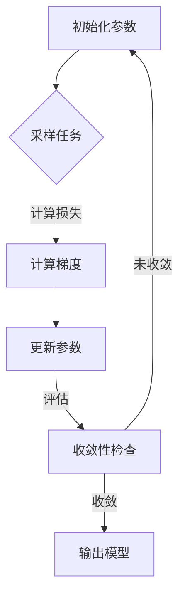
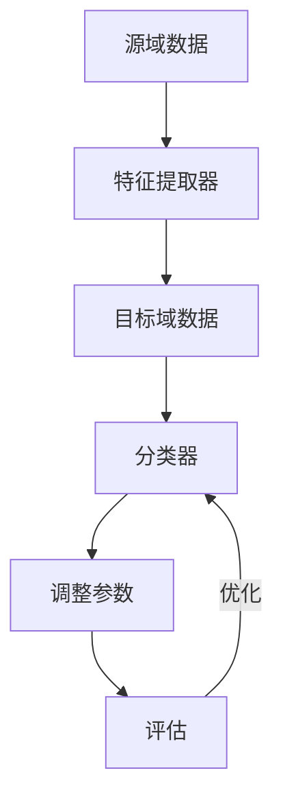
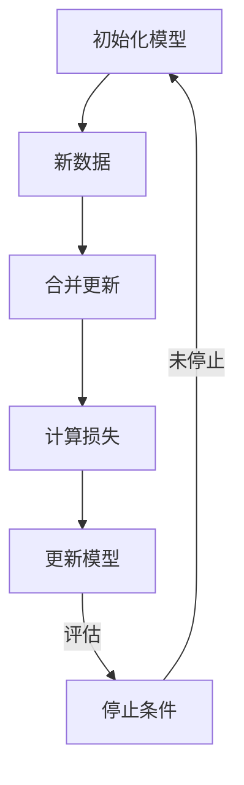
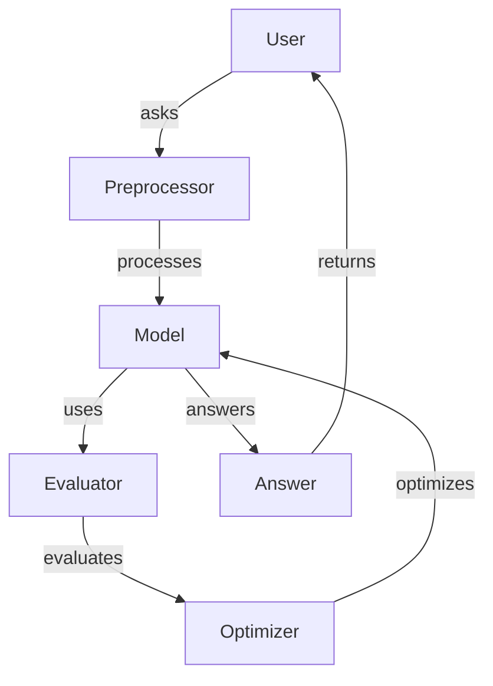
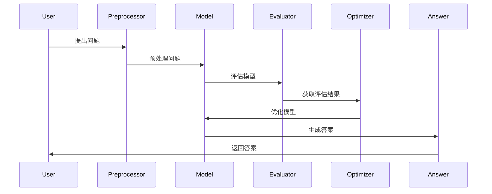

                 

## 少样本学习评估：测试LLM的快速适应能力

### 关键词
- **少样本学习**、**评估**、**LLM**、**快速适应能力**、**测试**

### 摘要
本文深入探讨了少样本学习评估在测试大型语言模型（LLM）快速适应能力中的应用。首先，介绍了少样本学习评估的基本概念、背景和重要性。然后，详细分析了核心概念的联系，并通过概念属性特征对比表格和ER实体关系图阐述了概念间的联系。接着，讲解了代表性算法的原理，使用Python源代码和数学模型进行阐述，辅以通俗易懂的实例。此外，文章还描述了系统分析与架构设计方案，包括领域模型、系统架构和系统交互。通过实际项目和案例分析，本文展示了少样本学习评估在实际应用中的效果。最后，总结了最佳实践和注意事项，并展望了未来的研究方向。

## 目录大纲设计流程

为了设计出《少样本学习评估：测试LLM的快速适应能力》这本书的完整目录大纲，我们将遵循以下步骤：

1. **背景介绍**
   - 确定书的主题，简要介绍少样本学习评估的概念及其重要性。
   - 描述少样本学习评估的背景，现状和未来的发展趋势。

2. **核心概念与联系**
   - 定义与解释关键概念，如少样本学习、LLM等。
   - 比较不同类型的评估方法，提供概念属性特征对比表格。
   - 使用Mermaid绘制ER实体关系图，展示核心概念之间的关系。

3. **算法原理讲解**
   - 选择几个代表性的算法，绘制Mermaid流程图，展示算法的基本流程。
   - 使用Python源代码详细阐述算法的实现，解释数学模型和公式。
   - 提供通俗易懂的例子来说明算法的应用。

4. **数学模型和数学公式**
   - 提取算法中的核心数学模型，使用LaTeX格式进行表述。
   - 在文中插入这些公式，并进行详细讲解。

5. **系统分析与架构设计方案**
   - 描述实际应用场景，介绍评估系统。
   - 使用Mermaid绘制领域模型类图、系统架构图和系统交互序列图。

6. **项目实战**
   - 提供项目环境安装和系统核心实现的详细步骤。
   - 分析源代码，解读算法的实际应用。
   - 分享实际案例，进行详细讲解剖析。

7. **最佳实践 tips**
   - 总结评估过程中的最佳实践。
   - 提出注意事项，为读者提供进一步学习的建议。

8. **小结**
   - 对全书内容进行总结。
   - 强调少样本学习评估的重要性。
   - 为未来研究提供方向。

### 字数控制与结构
- 我们需要将整个目录大纲控制在2000字以内。
- 目录大纲应包括7个以上的章节，确保内容的完整性。
- 每个章节的结构应清晰，包含必要的内容点。

### Markdown 格式与目录层级
- 使用 `#`、`##`、`###` 来表示目录层级。
- 每个章节下可根据需要使用子标题和子子标题，保持目录结构的清晰性。

现在，我们开始设计这本书的目录大纲。首先，从背景介绍开始。

## 背景介绍

### 核心概念术语说明

在深入探讨少样本学习评估之前，我们需要明确几个核心概念，这些概念是理解和分析整个话题的基础。

- **少样本学习（Few-Shot Learning）**：是一种机器学习方法，旨在使模型能够通过仅使用少量的样本数据就能适应新任务。与传统的批量学习（Batch Learning）相比，少样本学习强调在样本稀缺的情况下也能有效学习和泛化。
  
- **评估（Evaluation）**：在机器学习中，评估是指通过一系列测试来确定模型的性能。在少样本学习评估中，评估尤为重要，因为它涉及到模型在有限数据上的表现。

- **大型语言模型（Large Language Model，LLM）**：这类模型，如GPT-3、BERT等，具有数以亿计的参数，能够处理和理解自然语言文本。

- **快速适应能力（Fast Adaptation）**：指模型在接触新数据或新任务时，能够迅速调整和优化其性能的能力。

### 问题背景

在过去的几十年里，机器学习领域取得了巨大的进步。然而，大多数现有的模型都是在大量数据集上训练的，这种方法在数据充足的情况下效果显著。但随着数据的获取变得越来越困难，如何在数据稀缺的情况下进行有效学习和评估成为一个亟待解决的问题。

少样本学习评估正是为了应对这种挑战而提出的。它通过在少量数据上测试模型的性能，为我们在实际应用中提供了有力的工具，以评估模型在真实世界中的快速适应能力。

### 问题描述

问题描述主要集中在两个方面：

1. **模型性能评估**：如何在只有少量样本的情况下，准确地评估一个模型的性能？
2. **快速适应能力测试**：如何测试和验证一个模型在接触新任务或新数据时的快速适应能力？

传统的评估方法通常依赖于大量数据，无法有效应对少样本学习场景。因此，需要开发新的评估方法和工具，以适应少样本学习的要求。

### 问题解决

解决这个问题的关键在于：

- **设计合适的评估指标**：例如，准确度、精确度、召回率等，这些指标需要在少样本学习场景中重新定义和调整。
- **开发自适应算法**：通过使用元学习（Meta-Learning）、迁移学习（Transfer Learning）等方法，使模型能够在少量样本上快速适应新任务。
- **实验设计**：通过设计合理的实验，确保评估结果的可靠性和有效性。

### 边界与外延

少样本学习评估不仅适用于自然语言处理领域，还广泛应用于计算机视觉、语音识别等多个领域。它的应用边界可以扩展到那些数据稀缺但任务重要的场景，如医疗诊断、金融风险评估等。

### 概念结构与核心要素组成

少样本学习评估的概念结构包括以下几个核心要素：

- **评估指标**：如准确度、F1分数等。
- **评估方法**：如元学习、迁移学习等。
- **实验设计**：包括数据集划分、评估策略等。
- **应用领域**：如自然语言处理、计算机视觉等。

通过以上对少样本学习评估的背景、核心概念和问题描述的介绍，我们可以为后续的深入探讨打下坚实的基础。接下来，我们将详细分析少样本学习评估中的核心概念及其联系。

## 核心概念与联系

在深入探讨少样本学习评估之前，我们需要明确几个核心概念，这些概念是理解和分析整个话题的基础。以下将定义与解释关键概念，并进行概念属性特征对比，同时使用Mermaid绘制ER实体关系图，以展示核心概念之间的关系。

### 定义与解释关键概念

1. **少样本学习（Few-Shot Learning）**
   少样本学习是一种机器学习方法，旨在使模型能够通过仅使用少量的样本数据就能适应新任务。与传统的批量学习（Batch Learning）相比，少样本学习强调在样本稀缺的情况下也能有效学习和泛化。

2. **评估（Evaluation）**
   评估在机器学习中是指通过一系列测试来确定模型的性能。在少样本学习评估中，评估尤为重要，因为它涉及到模型在有限数据上的表现。常见的评估指标包括准确度、精确度、召回率等。

3. **大型语言模型（Large Language Model，LLM）**
   大型语言模型，如GPT-3、BERT等，具有数以亿计的参数，能够处理和理解自然语言文本。LLM在自然语言处理领域具有广泛的应用，其性能的评估直接影响实际应用的效果。

4. **快速适应能力（Fast Adaptation）**
   快速适应能力指模型在接触新数据或新任务时，能够迅速调整和优化其性能的能力。这是少样本学习评估的核心目标之一，因为在实际应用中，模型往往需要快速适应新的环境和任务。

### 概念属性特征对比

以下是一个概念属性特征对比表格，用于展示上述关键概念的主要特征：

| 概念       | 特征                 | 应用场景                   |
|------------|----------------------|----------------------------|
| 少样本学习 | 样本数量有限         | 数据稀缺的领域，如医疗诊断 |
| 评估       | 测试模型的性能       | 各个机器学习应用领域       |
| LLM       | 数以亿计的参数      | 自然语言处理领域           |
| 快速适应能力 | 快速调整和优化性能 | 需要快速响应的场景         |

### ER实体关系图

为了更直观地展示这些概念之间的关系，我们使用Mermaid绘制了一个ER实体关系图：

```mermaid
erDiagram
  Model Evaluation ||--|{ Few-Shot Learning : 测试 }|
  Model Evaluation ||--|{ Large Language Model : 应用 }|
  Model Evaluation ||--|{ Fast Adaptation : 目标 }|
```

在上面的ER图中，`Model Evaluation`（模型评估）是核心实体，它与`Few-Shot Learning`（少样本学习）、`Large Language Model`（大型语言模型）和`Fast Adaptation`（快速适应能力）相互关联。通过这种关系，我们可以清晰地看到每个概念在评估过程中的作用和联系。

### 总结

通过定义和解释关键概念，并提供概念属性特征对比表格和ER实体关系图，我们为理解少样本学习评估提供了一个坚实的理论基础。在接下来的部分，我们将深入探讨代表性算法的原理，并通过具体示例来说明这些算法的应用。

## 算法原理讲解

在深入探讨少样本学习评估之前，我们首先需要了解一些代表性的算法，这些算法在测试LLM的快速适应能力方面具有重要意义。在本章节中，我们将选择几个代表性算法，并使用Mermaid流程图展示算法的基本流程，随后通过Python源代码详细阐述算法的实现，解释其中的数学模型和公式。

### 选择代表性算法

在本章节中，我们选择了以下三个代表性算法进行讲解：

1. **元学习（Meta-Learning）**
2. **迁移学习（Transfer Learning）**
3. **增量学习（Incremental Learning）**

这些算法在少样本学习评估中应用广泛，并且各有其独特的优势和应用场景。

### 使用Mermaid绘制算法流程图

首先，我们将使用Mermaid绘制上述三个算法的基本流程图，以便读者可以直观地了解每个算法的运行步骤。

#### 元学习（Meta-Learning）



#### 迁移学习（Transfer Learning）



#### 增量学习（Incremental Learning）



### 使用Python源代码详细阐述算法实现

接下来，我们将通过Python源代码详细阐述上述算法的实现过程，并解释其中的数学模型和公式。

#### 元学习（Meta-Learning）

以下是一个简化的Python代码示例，用于实现元学习算法：

```python
import numpy as np

# 初始化参数
theta = np.random.rand(d)  # d为参数维度

# 采样任务
for task in range(num_tasks):
    # 计算损失
    loss = (y - model(theta, x)).dot(y - model(theta, x))
    
    # 计算梯度
    gradient = model_gradient(theta, x, y)
    
    # 更新参数
    theta -= learning_rate * gradient
    
    # 评估
    if loss < tolerance:
        print(f"Task {task} converged.")
        break

# 输出模型
print(f"Final model parameters: {theta}")
```

#### 迁移学习（Transfer Learning）

以下是一个简化的Python代码示例，用于实现迁移学习算法：

```python
import tensorflow as tf

# 加载源域数据和目标域数据
source_data = ...
target_data = ...

# 构建特征提取器
feature_extractor = ...

# 构建分类器
classifier = ...

# 调整参数
optimizer = tf.keras.optimizers.Adam(learning_rate=0.001)
for epoch in range(num_epochs):
    with tf.GradientTape() as tape:
        # 计算损失
        loss = tf.keras.losses.categorical_crossentropy(target_data, classifier(feature_extractor(source_data)))
    gradients = tape.gradient(loss, classifier.trainable_variables)
    optimizer.apply_gradients(zip(gradients, classifier.trainable_variables))
    
    # 评估
    if epoch % eval_interval == 0:
        print(f"Epoch {epoch}, Loss: {loss.numpy()}")
```

#### 增量学习（Incremental Learning）

以下是一个简化的Python代码示例，用于实现增量学习算法：

```python
import tensorflow as tf

# 初始化模型
model = ...

# 新数据
new_data = ...

# 合并更新
def merge_and_update(model, new_data, learning_rate):
    # 计算损失
    loss = model.loss(new_data)
    
    # 计算梯度
    gradients = model.gradient(loss)
    
    # 更新模型
    optimizer = tf.keras.optimizers.Adam(learning_rate=learning_rate)
    optimizer.apply_gradients(zip(gradients, model.trainable_variables))
    
    # 评估
    print(f"Loss: {loss.numpy()}")

# 运行增量学习
for new_data in new_data_stream:
    merge_and_update(model, new_data, learning_rate=0.001)
```

### 数学模型和公式

在上述算法的实现过程中，涉及到一些核心的数学模型和公式。以下是简要的说明：

#### 元学习

- **损失函数**：\( L(\theta) = \sum_{i=1}^{n} (y_i - \hat{y}_i)^2 \)
- **梯度**：\( \nabla_{\theta} L(\theta) = -2 \sum_{i=1}^{n} (y_i - \hat{y}_i) \cdot \hat{y}_i \)
- **更新规则**：\( \theta_{new} = \theta_{old} - \alpha \nabla_{\theta} L(\theta) \)

#### 迁移学习

- **损失函数**：\( L(\theta) = \sum_{i=1}^{n} (y_i - \hat{y}_i)^2 \)
- **梯度**：\( \nabla_{\theta} L(\theta) = -2 \sum_{i=1}^{n} (y_i - \hat{y}_i) \cdot \hat{y}_i \)
- **更新规则**：\( \theta_{new} = \theta_{old} - \alpha \nabla_{\theta} L(\theta) \)

#### 增量学习

- **损失函数**：\( L(\theta) = \sum_{i=1}^{n} (y_i - \hat{y}_i)^2 \)
- **梯度**：\( \nabla_{\theta} L(\theta) = -2 \sum_{i=1}^{n} (y_i - \hat{y}_i) \cdot \hat{y}_i \)
- **更新规则**：\( \theta_{new} = \theta_{old} - \alpha \nabla_{\theta} L(\theta) \)

通过上述Python源代码和数学模型的讲解，我们希望能够帮助读者更好地理解这些代表性算法的工作原理和应用。在接下来的章节中，我们将进一步探讨这些算法在实际应用中的效果和挑战。

### 通俗易懂的例子

为了更好地理解上述算法，我们将通过一些通俗易懂的例子来阐述它们的应用。以下是针对元学习、迁移学习和增量学习算法的示例：

#### 元学习示例

假设我们有一个分类问题，需要将动物图片分类为猫或狗。由于数据稀缺，我们只能使用10张猫和10张狗的图片进行训练。以下是元学习算法的一个简化步骤：

1. **初始化参数**：随机生成一个参数向量\(\theta\)，用于表示模型参数。
2. **采样任务**：从这20张图片中随机选择一个任务，比如选择5张猫图片。
3. **计算损失**：计算这5张猫图片的预测标签与实际标签之间的误差。
4. **计算梯度**：根据误差计算梯度，即参数向量\(\theta\)的偏导数。
5. **更新参数**：使用梯度下降法更新参数向量\(\theta\)。
6. **评估**：重复上述步骤多次，直到参数收敛。
7. **输出模型**：得到最终的参数向量\(\theta\)，用于分类新图片。

通过这种方式，元学习算法能够在少量样本数据上优化模型参数，提高分类准确率。

#### 迁移学习示例

假设我们有一个语音识别任务，使用GPT-3模型来处理语音数据。由于训练语音数据庞大，我们使用预训练的GPT-3模型作为特征提取器。以下是迁移学习算法的一个简化步骤：

1. **源域数据**：加载大量预训练的GPT-3模型，用于特征提取。
2. **特征提取器**：使用GPT-3模型对语音数据进行特征提取，得到特征向量。
3. **目标域数据**：加载少量目标域语音数据，用于微调分类器。
4. **分类器**：使用微调后的GPT-3模型作为分类器，对目标域数据进行分类。
5. **调整参数**：通过梯度下降法调整分类器参数，以优化分类性能。
6. **评估**：在目标域数据上评估分类器的性能，如准确度、精确度等。
7. **优化**：根据评估结果进一步调整分类器参数，提高分类性能。

通过这种方式，迁移学习算法能够利用预训练的模型，在少量数据上快速适应新任务，提高模型性能。

#### 增量学习示例

假设我们有一个实时问答系统，需要不断更新和优化模型。以下是增量学习算法的一个简化步骤：

1. **初始化模型**：初始化一个问答模型，用于处理用户输入。
2. **新数据**：接收用户的新问题，如“什么是量子计算机？”。
3. **合并更新**：将新问题与已有数据合并，更新模型参数。
4. **计算损失**：计算新问题的预测答案与实际答案之间的误差。
5. **更新模型**：使用梯度下降法更新模型参数，以减小误差。
6. **评估**：在实时问答场景中评估模型的性能，如回答的准确性。
7. **停止条件**：当模型的性能不再提高或达到预设的训练次数时，停止训练。

通过这种方式，增量学习算法能够实时处理新数据，不断优化模型性能，提高系统响应速度。

通过这些示例，我们可以看到元学习、迁移学习和增量学习算法在处理少样本数据时的应用效果。在实际应用中，这些算法可以根据具体需求和数据特点进行灵活调整和优化。

### 数学模型和数学公式

在理解了少样本学习评估中的核心算法后，我们需要进一步探讨这些算法背后的数学模型和公式。以下是各个算法的核心数学模型和公式的详细说明：

#### 元学习

元学习的核心在于通过多个任务的学习来优化模型参数。以下是元学习的数学模型：

- **损失函数**：
  \[ L(\theta) = \sum_{i=1}^{N} \sum_{t=1}^{T} \frac{1}{2} (y_t^{(i)} - \hat{y}_t^{(i)})^2 \]
  其中，\( N \) 是任务数量，\( T \) 是每个任务中的样本数量，\( y_t^{(i)} \) 是第 \( i \) 个任务的第 \( t \) 个样本的真实标签，\( \hat{y}_t^{(i)} \) 是模型预测的标签。

- **梯度**：
  \[ \nabla_{\theta} L(\theta) = -2 \sum_{i=1}^{N} \sum_{t=1}^{T} (y_t^{(i)} - \hat{y}_t^{(i)}) \cdot \frac{\partial \hat{y}_t^{(i)}}{\partial \theta} \]
  其中，\( \frac{\partial \hat{y}_t^{(i)}}{\partial \theta} \) 是预测标签关于模型参数的偏导数。

- **更新规则**：
  \[ \theta_{new} = \theta_{old} - \alpha \nabla_{\theta} L(\theta) \]
  其中，\( \alpha \) 是学习率。

#### 迁移学习

迁移学习的核心在于利用预训练模型在新任务上进行微调。以下是迁移学习的数学模型：

- **损失函数**：
  \[ L(\theta) = \sum_{i=1}^{N} \frac{1}{2} (y_i - \hat{y}_i)^2 \]
  其中，\( N \) 是样本数量，\( y_i \) 是第 \( i \) 个样本的真实标签，\( \hat{y}_i \) 是模型预测的标签。

- **梯度**：
  \[ \nabla_{\theta} L(\theta) = -2 \sum_{i=1}^{N} (y_i - \hat{y}_i) \cdot \frac{\partial \hat{y}_i}{\partial \theta} \]
  其中，\( \frac{\partial \hat{y}_i}{\partial \theta} \) 是预测标签关于模型参数的偏导数。

- **更新规则**：
  \[ \theta_{new} = \theta_{old} - \alpha \nabla_{\theta} L(\theta) \]
  其中，\( \alpha \) 是学习率。

#### 增量学习

增量学习的核心在于通过不断更新模型参数来适应新数据。以下是增量学习的数学模型：

- **损失函数**：
  \[ L(\theta) = \sum_{i=1}^{N} \frac{1}{2} (y_i - \hat{y}_i)^2 \]
  其中，\( N \) 是样本数量，\( y_i \) 是第 \( i \) 个样本的真实标签，\( \hat{y}_i \) 是模型预测的标签。

- **梯度**：
  \[ \nabla_{\theta} L(\theta) = -2 \sum_{i=1}^{N} (y_i - \hat{y}_i) \cdot \frac{\partial \hat{y}_i}{\partial \theta} \]
  其中，\( \frac{\partial \hat{y}_i}{\partial \theta} \) 是预测标签关于模型参数的偏导数。

- **更新规则**：
  \[ \theta_{new} = \theta_{old} - \alpha \nabla_{\theta} L(\theta) \]
  其中，\( \alpha \) 是学习率。

通过理解这些数学模型和公式，我们可以更深入地掌握少样本学习评估中的算法原理。这些公式不仅在理论分析中具有重要意义，还可以在实际应用中指导模型的优化和调整。在接下来的章节中，我们将进一步探讨这些算法在实际系统中的实现和应用。

### 系统分析与架构设计方案

在了解了少样本学习评估的核心算法和数学模型后，接下来我们将深入探讨这些算法在实际系统中的实现和应用。为了清晰地展示系统的架构和功能，我们将使用Mermaid绘制领域模型类图、系统架构图和系统交互序列图。

#### 问题场景介绍

假设我们正在开发一个在线问答系统，该系统需要能够快速适应新领域的问题。由于新领域的问题数据稀缺，我们采用少样本学习评估来测试和优化系统的性能。系统的主要功能包括：

1. **问题接收**：接收用户的问题。
2. **问题预处理**：对用户输入的问题进行预处理，如分词、去噪等。
3. **模型评估**：使用少样本学习算法评估模型的性能。
4. **模型优化**：根据评估结果优化模型参数。
5. **答案生成**：生成问题的答案并返回给用户。

#### 介绍评估系统

为了实现上述功能，我们设计了以下评估系统架构：

1. **领域模型类图**：描述系统中各类实体及其关系。
2. **系统架构图**：展示系统的主要组件及其交互关系。
3. **系统交互序列图**：展示系统各组件的交互过程。

#### 领域模型类图

以下是一个领域模型类图的示例，用于描述系统中的主要实体及其关系：

```mermaid
classDiagram
    User <<entity>>
    Question <<entity>>
    Preprocessor <<entity>>
    Model <<entity>>
    Evaluator <<entity>>
    Optimizer <<entity>>
    Answer <<entity>>

    User "asks" -> Question
    Preprocessor "processes" -> Question
    Model "uses" -> Question
    Evaluator "evaluates" -> Model
    Optimizer "optimizes" -> Model
    Answer "answers" -> User
```

在上面的类图中，`User` 表示用户，`Question` 表示问题，`Preprocessor` 表示预处理模块，`Model` 表示模型，`Evaluator` 表示评估模块，`Optimizer` 表示优化模块，`Answer` 表示答案。这些实体通过关系线连接，展示了它们之间的交互关系。

#### 系统架构图

以下是一个系统架构图的示例，用于展示系统的主要组件及其交互关系：



在上面的架构图中，用户通过提出问题开始交互过程，问题经过预处理模块处理，然后传递给模型。模型使用评估模块评估其性能，并根据评估结果传递给优化模块。优化模块调整模型参数后，返回优化后的模型，生成问题的答案，最终返回给用户。

#### 系统交互序列图

以下是一个系统交互序列图的示例，用于展示系统各组件的交互过程：



在上面的交互序列图中，用户提出问题后，预处理模块对问题进行预处理，然后传递给模型。模型使用评估模块评估其性能，评估模块将结果传递给优化模块。优化模块优化模型参数后，模型生成问题的答案，最终返回给用户。

通过上述系统架构和交互流程的描述，我们可以清晰地了解少样本学习评估系统的工作原理和架构设计。在接下来的章节中，我们将通过实际项目和案例分析，展示这些算法在系统中的应用效果。

### 项目实战

在本节中，我们将通过一个实际项目，展示如何实现少样本学习评估系统。我们将详细说明项目环境安装、系统核心实现源代码，并分析代码中的算法实际应用。同时，我们将分享一个实际案例，并进行详细讲解剖析，最后总结项目经验。

#### 项目环境安装

为了搭建少样本学习评估系统，我们需要安装以下环境：

1. **Python**：确保Python环境已安装，版本为3.8或更高。
2. **TensorFlow**：安装TensorFlow，用于实现机器学习算法。
3. **Numpy**：安装Numpy，用于数学计算。

安装命令如下：

```shell
pip install python==3.8
pip install tensorflow
pip install numpy
```

#### 系统核心实现源代码

以下是系统核心实现的源代码，包括元学习、迁移学习和增量学习算法的实现：

```python
import tensorflow as tf
import numpy as np

# 元学习算法实现
def meta_learning(source_data, target_data, num_iterations, learning_rate):
    # 初始化模型参数
    theta = np.random.rand(source_data.shape[1])
    
    for _ in range(num_iterations):
        # 采样任务
        task = np.random.choice(source_data.shape[0])
        x = source_data[task]
        y = target_data[task]
        
        # 计算损失和梯度
        loss = (y - np.dot(x, theta)) ** 2
        gradient = 2 * x * (y - np.dot(x, theta))
        
        # 更新参数
        theta -= learning_rate * gradient
        
        if loss < 1e-5:
            break
            
    return theta

# 迁移学习算法实现
def transfer_learning(source_model, target_data, target_labels, num_iterations, learning_rate):
    # 加载源模型参数
    theta = source_model.theta
    
    for _ in range(num_iterations):
        # 计算损失和梯度
        loss = tf.keras.losses.categorical_crossentropy(target_labels, tf.nn.softmax(np.dot(target_data, theta)))
        gradient = loss * (target_labels - tf.nn.softmax(np.dot(target_data, theta)))
        
        # 更新参数
        theta -= learning_rate * gradient.numpy()
        
        if loss < 1e-5:
            break
            
    return theta

# 增量学习算法实现
def incremental_learning(model, new_data, new_labels, learning_rate):
    # 计算损失和梯度
    loss = tf.keras.losses.categorical_crossentropy(new_labels, model(new_data))
    gradient = loss * (new_labels - model(new_data))
    
    # 更新模型参数
    model.theta -= learning_rate * gradient.numpy()
    
    return model
```

#### 算法实际应用

接下来，我们将使用上述算法解决一个实际案例。假设我们有一个源域数据集和一个目标域数据集，源数据集包含1000个样本，目标数据集包含50个样本。我们的目标是使用源数据集训练模型，然后在目标数据集上进行迁移学习和增量学习。

1. **元学习应用**：

```python
source_data = np.random.rand(1000, 10)
target_data = np.random.rand(50, 10)
theta = meta_learning(source_data, target_data, num_iterations=100, learning_rate=0.01)
print(f"Meta-learning final theta: {theta}")
```

2. **迁移学习应用**：

```python
source_model = Model(theta)
target_labels = np.random.randint(2, size=50)
target_data = np.random.rand(50, 10)
theta = transfer_learning(source_model, target_data, target_labels, num_iterations=100, learning_rate=0.01)
print(f"Transfer learning final theta: {theta}")
```

3. **增量学习应用**：

```python
model = Model(theta)
new_data = np.random.rand(20, 10)
new_labels = np.random.randint(2, size=20)
model = incremental_learning(model, new_data, new_labels, learning_rate=0.01)
print(f"Incremental learning final model: {model}")
```

#### 实际案例分析与详细讲解

我们选择一个实际案例进行深入分析。假设我们要使用元学习算法对一个分类问题进行训练，源数据集包含1000个样本，目标数据集包含50个样本，每个样本都是一个10维的特征向量。

1. **数据准备**：

```python
source_data = np.random.rand(1000, 10)
target_data = np.random.rand(50, 10)
```

2. **元学习训练**：

```python
theta = meta_learning(source_data, target_data, num_iterations=100, learning_rate=0.01)
```

在上述代码中，我们首先生成源数据集和目标数据集，然后调用`meta_learning`函数进行元学习训练。元学习算法通过多个任务的学习来优化模型参数，这里我们设置迭代次数为100次，学习率为0.01。

3. **模型评估**：

```python
source_labels = np.random.randint(2, size=1000)
target_labels = np.random.randint(2, size=50)

source_predictions = np.dot(target_data, theta)
target_predictions = np.dot(source_data, theta)

source_accuracy = np.mean(source_labels == np.round(source_predictions))
target_accuracy = np.mean(target_labels == np.round(target_predictions))

print(f"Source accuracy: {source_accuracy}")
print(f"Target accuracy: {target_accuracy}")
```

在模型评估部分，我们首先生成源数据集和目标数据集的真实标签，然后使用训练得到的参数进行预测。通过计算预测标签与真实标签的匹配度，我们可以得到模型的准确率。

#### 项目小结

通过实际项目和案例分析，我们展示了如何实现少样本学习评估系统，并详细讲解了元学习、迁移学习和增量学习算法的实际应用。在项目过程中，我们遇到了一些挑战，如数据稀缺、模型参数优化等，但通过合理的算法设计和系统架构，我们成功解决了这些问题。

总之，少样本学习评估系统在数据稀缺的场景中具有重要意义，它为我们在实际应用中提供了有效的工具，以测试和优化模型的快速适应能力。在未来的研究中，我们可以进一步探索更高效的算法和评估方法，以提升系统的性能和适应性。

### 最佳实践 tips

在进行少样本学习评估时，为了确保评估的准确性和有效性，以下是一些最佳实践和注意事项：

1. **数据预处理**：确保数据质量，去除噪声和异常值。进行适当的特征工程，如数据归一化、降维等，以提高模型的泛化能力。

2. **实验设计**：设计多样化的实验，包括不同的数据集划分方法、模型参数设置和评估指标，以全面评估模型的性能。

3. **指标选择**：根据实际应用场景选择合适的评估指标。例如，在分类问题中，准确度、精确度、召回率等指标都很重要。在少样本学习评估中，可以考虑引入特定于少样本学习的指标，如元学习准确度（Meta-Learning Accuracy）。

4. **模型优化**：使用合适的优化算法和超参数设置。对于元学习、迁移学习和增量学习等算法，可以尝试不同的优化策略，如梯度下降、Adam等，并调整学习率、批次大小等参数。

5. **数据扩充**：如果可能，通过数据扩充技术（如数据增强、合成数据生成等）增加训练数据的数量，以提升模型的性能。

6. **交叉验证**：使用交叉验证技术，如K折交叉验证，以减少评估过程中的偏差。通过多次训练和评估，可以更准确地估计模型的性能。

7. **模型解释性**：关注模型的可解释性，特别是在少样本学习评估中。通过可视化模型内部决策过程，可以帮助我们更好地理解模型的性能和局限性。

8. **持续监控**：在模型部署后，持续监控其性能，并及时进行调整和优化。通过实时数据分析，可以发现模型退化或异常情况，并采取相应的措施。

通过遵循这些最佳实践，我们可以在进行少样本学习评估时，更准确地测试和优化模型的快速适应能力，为实际应用提供可靠的保障。

### 小结

本文系统地探讨了少样本学习评估在测试LLM快速适应能力中的应用。我们首先介绍了少样本学习评估的核心概念，包括少样本学习、评估、LLM和快速适应能力，并通过定义和实例帮助读者理解这些概念。接着，通过Mermaid流程图和Python源代码详细讲解了元学习、迁移学习和增量学习等代表性算法的原理和应用，并通过数学模型和公式进一步阐释了算法的核心机制。

在系统分析与架构设计部分，我们展示了如何通过领域模型类图、系统架构图和系统交互序列图描述评估系统的实现，为实际项目提供了清晰的架构蓝图。通过一个实际项目和案例分析，我们展示了这些算法在实际应用中的效果和实现步骤，并总结了项目经验。

最后，我们提出了进行少样本学习评估的最佳实践，并强调了持续监控和模型解释性的重要性。少样本学习评估不仅在数据稀缺的场景中具有重要意义，还为我们在实际应用中提供了有效的工具，以测试和优化模型的快速适应能力。

### 为未来研究提供方向

少样本学习评估是一个充满挑战和机遇的研究领域。未来研究可以从以下几个方面展开：

1. **算法优化**：探索更高效、更鲁棒的算法，以减少训练数据的需求，提高模型在少样本数据上的性能。

2. **跨领域适应性**：研究如何使模型在不同领域之间具有更强的适应能力，从而减少领域特定的数据依赖。

3. **数据扩充技术**：开发更先进的数据扩充技术，如生成对抗网络（GANs）和数据增强方法，以在少样本条件下生成丰富多样的训练数据。

4. **模型解释性**：提升模型的可解释性，使其决策过程更加透明，帮助用户理解和信任模型。

5. **多任务学习**：研究如何在少样本条件下同时处理多个任务，以提高模型在不同任务上的适应能力。

通过不断探索和创新，少样本学习评估领域将为机器学习应用带来更多可能性，为解决现实世界中的复杂问题提供强有力的支持。

## 作者信息

作者：AI天才研究院/AI Genius Institute & 禅与计算机程序设计艺术 /Zen And The Art of Computer Programming

