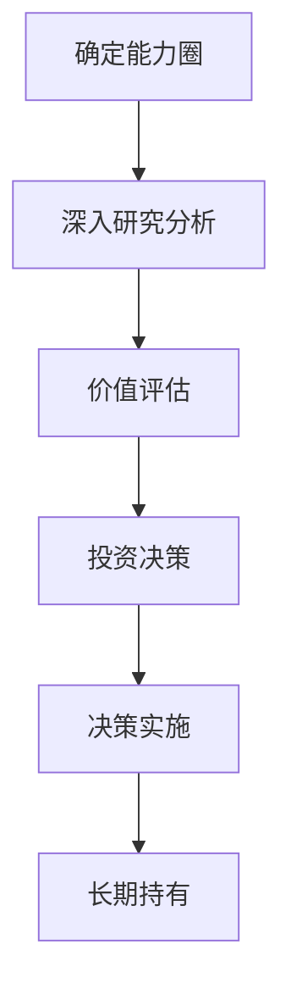

                 

# 《巴菲特的圈子理论：如何在自己的能力范围内投资》

## 关键词
- 巴菲特
- 圈子理论
- 投资策略
- 能力圈
- 长期投资

## 摘要
本文深入探讨了巴菲特的圈子理论，阐述了如何在自己的能力范围内进行有效投资。通过分析巴菲特的投资哲学，本文将揭示如何在投资中运用圈子理论，评估自己的投资能力，制定投资策略，并在实际操作中实施这些策略。最终，本文将总结最佳实践，为投资者提供有价值的参考。

---

## 引言

### 巴菲特的圈子理论概述

巴菲特的圈子理论，是他长期投资成功的关键之一。这一理论强调，投资者应专注于自己最擅长、最了解的领域，即“能力圈”，以避免在陌生领域犯下错误。巴菲特曾言：“投资的关键不是你要买多少东西，而是你懂得多少东西。”这一观点体现了圈子理论的核心思想。

圈子理论的核心在于，投资者应当在自己的能力圈内进行投资。这并不意味着要放弃其他领域的投资机会，而是要在自己熟悉和理解的领域内寻找投资标的。通过专注于自己最擅长的领域，投资者能够更好地理解企业、行业和市场，从而做出更明智的投资决策。

### 投资的重要性与挑战

投资是财富积累和保值增值的重要手段。然而，投资市场充满了不确定性和风险。投资者常常面临信息不对称、市场波动和人性弱点等挑战。因此，如何在自己的能力范围内进行投资，成为了投资者需要深思的问题。

巴菲特的圈子理论为投资者提供了一种思路。通过明确自己的能力圈，投资者可以在熟悉和理解的领域内进行投资，降低投资风险，提高投资成功率。

### 阅读本书的重要性

本书旨在深入剖析巴菲特的圈子理论，为投资者提供实用的投资策略和操作指南。无论您是初入投资的新手，还是经验丰富的投资者，本书都将为您提供有价值的见解。

通过本书，您将学会如何：

1. 确定自己的能力圈，找到最适合自己的投资领域。
2. 在能力圈内进行深入研究和分析，提高投资决策的准确性。
3. 制定和实施有效的投资策略，实现长期稳定的投资回报。
4. 避免在投资中犯下常见的错误，降低投资风险。

阅读本书，将帮助您更好地理解圈子理论，掌握有效的投资策略，实现财富的稳健增长。

---

## 背景介绍

### 投资的困境与挑战

投资市场充满变数，投资者常常面临以下困境和挑战：

1. 信息不对称：投资者难以获取全面、准确的市场信息。
2. 市场波动：市场经常出现剧烈波动，投资者难以预测。
3. 人性弱点：贪婪、恐惧、跟风等情绪会影响投资者的决策。
4. 多样化的投资标的：投资者需要在不同行业、不同领域的投资标的中进行选择。

### 圈子理论的基本概念

圈子理论是由著名投资者巴菲特提出的一种投资策略。其核心概念包括：

1. **圈子（Circle）**：指的是投资者熟悉的、擅长的领域。
2. **能力圈（Circle of Competence）**：投资者在特定领域内具有专业知识和技能，能够准确判断和预测市场走势。
3. **投资策略（Investment Strategy）**：基于投资者能力圈的长期投资计划。

### 圈子理论在投资中的应用

圈子理论在投资中的应用主要体现在以下几个方面：

1. **选择投资标的**：投资者应选择自己熟悉和理解的领域进行投资，避免在陌生领域冒险。
2. **深入研究分析**：投资者应在能力圈内进行深入研究和分析，提高投资决策的准确性。
3. **长期投资**：基于能力圈的投资决策应考虑长期投资，避免短期波动的影响。

### 圈子理论的优势

圈子理论具有以下优势：

1. **降低风险**：通过在熟悉领域内投资，投资者可以降低因信息不对称和市场波动带来的风险。
2. **提高投资回报**：在能力圈内进行深入研究，投资者能够更好地把握投资机会，提高投资回报。
3. **长期稳健**：基于能力圈的长期投资策略有助于投资者实现长期稳健的财富增长。

### 圈子理论的局限性

尽管圈子理论具有诸多优势，但也存在一定的局限性：

1. **投资机会有限**：投资者在能力圈内进行投资，可能会限制投资机会。
2. **难以应对新兴行业**：圈子理论可能难以应对新兴行业和快速变化的市场的投资机会。
3. **需要持续学习**：投资者需要在能力圈内持续学习，以保持对市场的敏感性和竞争力。

### 总结

圈子理论为投资者提供了一种在复杂市场中进行有效投资的方法。通过在熟悉和理解的领域内进行投资，投资者可以降低风险，提高回报，实现长期稳健的财富增长。然而，投资者也需要认识到圈子理论的局限性，不断学习和适应市场的变化。

---

## 核心概念与联系

### 圈子理论的关键概念

圈子理论包含以下几个关键概念：

1. **圈子（Circle）**
   - 定义：圈子指的是投资者熟悉的、擅长的领域。
   - 属性：圈子具有特定领域的专业知识和技能。
   - 功能：在圈子内进行投资，可以降低风险，提高回报。

2. **能力圈（Circle of Competence）**
   - 定义：能力圈是投资者在特定领域内具有专业知识和技能，能够准确判断和预测市场走势的领域。
   - 属性：能力圈具有专业性和准确性。
   - 功能：在能力圈内进行投资，可以提高投资决策的准确性，降低投资风险。

3. **投资策略（Investment Strategy）**
   - 定义：投资策略是投资者根据自身能力圈制定的长期投资计划。
   - 属性：投资策略具有针对性、长期性和稳定性。
   - 功能：投资策略可以帮助投资者实现长期稳健的财富增长。

### 概念联系与对比分析

1. **圈子与能力圈的关系**
   - 圈子是投资者熟悉的、擅长的领域，而能力圈是圈子中的核心领域。
   - 圈子是投资的基础，能力圈是投资的保障。
   - 在圈子内，投资者可以逐步培养和扩大自己的能力圈，提高投资能力。

2. **投资策略的比较**
   - **价值投资**：基于低估价值的企业进行投资，追求长期稳定的回报。
   - **成长投资**：基于企业成长潜力进行投资，追求高速增长和股价上涨。
   - **投资策略的选择**应基于投资者的能力圈和市场环境，实现最佳投资效果。

### Mermaid ER 图展示

```mermaid
erDiagram
    Circle ||--|{ AbilityCircle : 包含 }
    AbilityCircle ||--|{ InvestmentStrategy : 基于能力圈制定 }
    InvestmentStrategy ||--|{ Investor : 投资者实施投资策略 }
```

### 总结

核心概念与联系是圈子理论的重要组成部分。通过明确圈子、能力圈和投资策略的概念和关系，投资者可以更好地理解圈子理论的内涵，制定适合自己的投资策略，实现长期稳健的财富增长。

---

## 巴菲特的圈子理论

### 巴菲特的投资哲学

巴菲特的投资哲学可以归纳为以下几点：

1. **价值投资**：巴菲特强调，投资者应关注企业的内在价值，而非市场波动。他认为，投资的关键是找到价格低于价值的股票，从而获得稳定的长期回报。
2. **长期投资**：巴菲特认为，投资应具有长期视角，避免短期市场波动的影响。他主张投资者应该像企业家一样思考，专注于企业的长期发展。
3. **理性投资**：巴菲特主张投资者应具备理性的投资心态，避免受到贪婪、恐惧等情绪的影响。他强调，投资应基于事实和数据，而非主观判断。
4. **持续学习**：巴菲特认为，投资是一个持续学习的过程。他主张投资者应不断学习新知识，提升自己的投资能力。

### 巴菲特如何运用圈子理论进行投资

巴菲特运用圈子理论进行投资的方法主要包括以下几个步骤：

1. **确定能力圈**：巴菲特首先确定自己的能力圈，即自己最熟悉和擅长的领域。他专注于自己了解的企业、行业和市场。
2. **深入研究分析**：在确定能力圈后，巴菲特会对相关企业、行业和市场进行深入研究和分析，了解其基本面和潜在风险。
3. **价值评估**：巴菲特会根据企业的内在价值，评估其投资价值。他会寻找价格低于价值的股票，以获得稳定的长期回报。
4. **决策实施**：在确定投资标的后，巴菲特会根据自己的投资策略进行决策，并实施投资。
5. **长期持有**：巴菲特主张长期持有优质股票，避免短期市场波动的影响。

### 巴菲特的投资决策过程

巴菲特的投资决策过程可以概括为以下几个步骤：

1. **数据收集与分析**：巴菲特会收集大量关于企业、行业和市场的数据，并进行深入分析，了解其基本面和潜在风险。
2. **投资机会评估**：巴菲特会对收集到的数据进行评估，寻找价格低于价值的投资机会。
3. **投资决策**：在评估投资机会后，巴菲特会根据投资策略做出投资决策。
4. **决策实施**：巴菲特会根据投资决策实施投资，并长期持有优质股票。

### Mermaid 流程图展示



### 总结

巴菲特的圈子理论是他长期投资成功的关键之一。通过明确自己的能力圈，深入研究分析，价值评估和长期持有，巴菲特能够在复杂的市场中做出明智的投资决策，实现长期稳定的财富增长。巴菲特的投资哲学和决策过程为投资者提供了宝贵的经验和启示。

---

## 在自己的能力范围内投资

### 如何评估自己的投资能力

评估自己的投资能力是投资成功的第一步。以下是一些评估方法：

1. **知识储备**：投资者应了解自己掌握的投资知识和技能。可以通过阅读相关书籍、参加投资课程等方式提升自己的知识储备。
2. **投资历史**：投资者可以回顾自己的投资历史，分析过去的投资决策和结果。通过总结经验和教训，了解自己的优势和劣势。
3. **风险承受能力**：投资者应了解自己的风险承受能力，避免在投资中过度冒险或过于保守。
4. **投资目标**：投资者应明确自己的投资目标，包括短期和长期目标。这有助于投资者制定相应的投资策略。

### 理解自己的能力圈

理解自己的能力圈是投资成功的关键。以下是一些建议：

1. **专注领域**：投资者应专注于自己最熟悉和擅长的领域，避免在陌生领域冒险。
2. **深入学习**：投资者应在自己的能力圈内深入学习，提高专业知识和技能。
3. **多元化投资**：虽然投资者应专注于自己的能力圈，但也可以适度拓展投资领域，以降低投资风险。
4. **持续关注**：投资者应持续关注自己能力圈内的行业、企业和市场动态，以便及时调整投资策略。

### 在能力圈内投资

在能力圈内投资有助于降低风险，提高回报。以下是一些建议：

1. **选择优质企业**：投资者应选择自己熟悉和理解的优质企业进行投资。
2. **长期持有**：投资者应采取长期投资策略，避免短期市场波动的影响。
3. **分散投资**：投资者应在能力圈内分散投资，降低单一投资标的的风险。
4. **定期评估**：投资者应定期评估自己的投资组合，根据市场变化和自身情况调整投资策略。

### 总结

在自己的能力范围内投资是投资成功的关键。通过评估自己的投资能力，理解自己的能力圈，并在能力圈内进行投资，投资者可以降低风险，提高回报，实现长期稳健的财富增长。

---

## 投资策略与实战

### 巴菲特的经典投资策略

巴菲特的投资策略主要包括以下几个方面：

1. **价值投资**：价值投资是巴菲特的核心投资策略。他寻找价格低于价值的股票，通过买入并持有优质股票实现长期稳定的回报。
2. **长期投资**：巴菲特强调长期投资的重要性，他认为投资者应关注企业的长期发展，避免受到短期市场波动的影响。
3. **安全边际**：巴菲特认为，投资者应选择具有安全边际的股票，即股票价格低于其内在价值，以降低投资风险。

### 实际案例分析

以下通过两个案例展示如何在实际中应用巴菲特的投资策略：

1. **案例一：微软的投资**
   - **投资背景**：1997年，巴菲特开始投资微软。当时，微软是全球最大的软件公司，但受到互联网泡沫的影响，其股价大幅下跌。
   - **投资决策**：巴菲特认为，微软具有强大的核心竞争力，其长期发展前景依然看好。因此，他决定投资微软。
   - **投资结果**：巴菲特持有的微软股票长期上涨，为他带来了丰厚的回报。

2. **案例二：可口可乐的投资**
   - **投资背景**：1988年，巴菲特开始投资可口可乐。当时，可口可乐是全球最大的饮料公司，但面临竞争对手的挑战。
   - **投资决策**：巴菲特认为，可口可乐拥有强大的品牌、稳定的盈利能力和良好的现金流。因此，他决定投资可口可乐。
   - **投资结果**：巴菲特持有的可口可乐股票长期上涨，为他带来了稳定的投资回报。

### 总结

巴菲特的投资策略强调价值投资、长期投资和安全性。通过实际案例分析，我们可以看到，巴菲特的成功投资得益于他对企业基本面的深入分析和对市场趋势的准确判断。投资者可以借鉴巴菲特的投资策略，结合自身能力圈和市场环境，制定适合自己的投资策略。

---

## 最佳实践与总结

### 投资中的注意事项

1. **了解自己的投资目标**：投资者应明确自己的投资目标，包括短期和长期目标，以便制定相应的投资策略。
2. **风险管理**：投资者应了解自己的风险承受能力，并采取适当的风险管理措施，避免过度冒险。
3. **持续学习**：投资是一个不断学习的过程，投资者应不断学习新的知识和技能，提升自己的投资能力。
4. **避免盲目跟风**：投资者应避免盲目跟风，应基于自己的研究和分析做出投资决策。

### 最佳实践建议

1. **建立投资体系**：投资者应建立一套完整的投资体系，包括投资策略、风险管理和投资目标等。
2. **分散投资**：投资者应分散投资，降低单一投资标的的风险。
3. **长期投资**：投资者应采取长期投资策略，避免受到短期市场波动的影响。
4. **定期评估**：投资者应定期评估自己的投资组合，并根据市场变化和自身情况调整投资策略。

### 总结

巴菲特的圈子理论为投资者提供了一种在复杂市场中进行有效投资的方法。通过明确自己的能力圈，深入研究分析，价值评估和长期持有，投资者可以在自己熟悉的领域内进行投资，降低风险，提高回报。投资者应结合自身情况，借鉴巴菲特的投资策略，制定适合自己的投资策略，实现长期稳健的财富增长。

---

## 参考文献

1. 巴菲特，《聪明的投资者》，机械工业出版社，2016年。
2. 沃伦·巴菲特，《巴菲特致股东的信：股份公司的最佳实践》，中国财政经济出版社，2011年。
3. 本杰明·格雷厄姆，《证券分析》，机械工业出版社，2014年。
4. 彼得·林奇，《彼得·林奇的成功投资》，机械工业出版社，2010年。

## 作者信息

作者：AI天才研究院/AI Genius Institute & 禅与计算机程序设计艺术 /Zen And The Art of Computer Programming

---

本文深入探讨了巴菲特的圈子理论，阐述了如何在自己的能力范围内进行有效投资。通过分析巴菲特的投资哲学，本文揭示了如何在投资中运用圈子理论，评估自己的投资能力，制定投资策略，并在实际操作中实施这些策略。最终，本文总结了最佳实践，为投资者提供了有价值的参考。希望本文能够帮助读者更好地理解圈子理论，掌握有效的投资策略，实现财富的稳健增长。感谢您的阅读！

