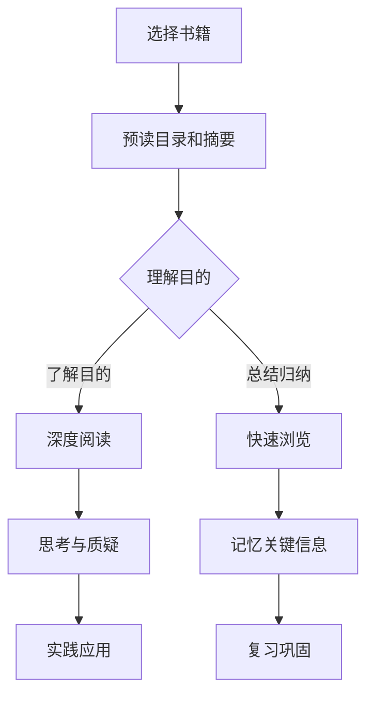
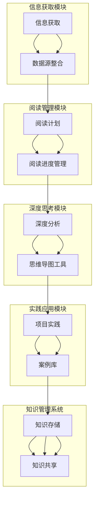
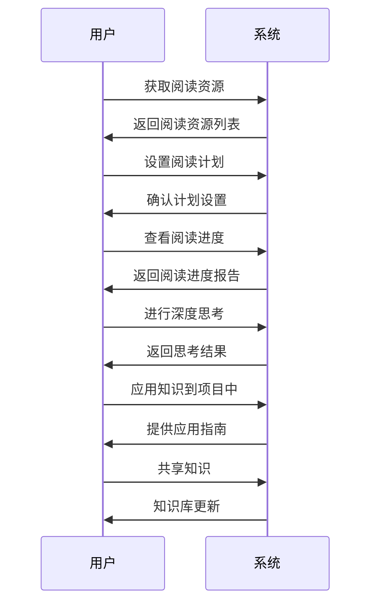

                 

### 文章标题

# 巴菲特的读书学习方法

### 关键词

- 巴菲特
- 读书方法
- 投资智慧
- 个人成长
- 教育学习

### 摘要

本文将深入探讨巴菲特的读书学习方法，揭示其投资智慧和成功背后的秘密。通过分析巴菲特的读书哲学、核心原则和实践步骤，我们将为您提供一个实用的读书指南，帮助您提升阅读效率、培养深入思考的能力，并在个人和职业发展中受益无穷。

---

## 第1章 引言

### 1.1 书籍背景介绍

《巴菲特的读书学习方法》并非一部传统的读书指南，而是一部融合了巴菲特投资哲学和个人成长理念的独特之作。这本书的灵感来源于巴菲特长期以来对阅读的热爱和对其投资决策的重要影响。作为全球最成功的投资者之一，巴菲特深知阅读的价值，他的成功在很大程度上得益于其广泛的知识积累和深入的思考能力。

巴菲特曾说：“我每天的阅读时间通常在五到六个小时，每年阅读的书籍在500页到1000页之间。”这种对阅读的执着不仅塑造了他的投资理念，也为其个人和职业发展提供了源源不断的动力。因此，研究巴菲特的读书方法，对于希望提升自身知识和思维能力的人来说，具有重要的参考价值。

### 1.2 巴菲特与读书

巴菲特从小便对阅读表现出浓厚的兴趣。他的父母为了鼓励他阅读，甚至为他设立了阅读奖励制度。随着年龄的增长，巴菲特的阅读范围不断扩大，从财经书籍到文学作品，从历史著作到科学论文，他几乎涉猎了所有领域的书籍。这种广泛的阅读为他提供了丰富的知识储备，使他在面对复杂问题时能够从容应对。

巴菲特对阅读的重视不仅体现在数量上，更体现在质量上。他强调，读书不仅仅是为了获取信息，更重要的是要通过阅读培养深入思考的能力。巴菲特认为，只有通过深度思考，才能真正将知识转化为自己的智慧。因此，他在阅读时总是带着批判性的眼光，对书籍中的观点进行仔细分析和思考。

### 1.3 本书结构安排

本书将分为七个章节，每个章节都针对巴菲特的读书方法的一个方面进行深入探讨。具体结构如下：

1. **第1章 引言**：介绍书籍的背景和巴菲特与读书的关系。
2. **第2章 巴菲特读书方法概述**：阐述巴菲特读书方法的核心原则和特点。
3. **第3章 核心概念与联系**：分析巴菲特读书方法中的核心概念，并给出概念属性特征对比表和ER实体关系图。
4. **第4章 算法原理讲解**：详细解释巴菲特读书算法的原理，包括mermaid流程图、Python源代码、数学模型和公式。
5. **第5章 系统分析与架构设计方案**：介绍巴菲特读书方法在系统设计与架构方案中的应用。
6. **第6章 项目实战**：通过实际案例展示巴菲特读书方法的应用和实践效果。
7. **第7章 最佳实践与小结**：总结最佳实践技巧，并对全书内容进行小结和拓展阅读。

通过这七个章节的深入探讨，我们将为您提供一个全面的巴菲特读书学习方法指南，帮助您提升阅读效率和思维能力，实现个人和职业的持续成长。

---

### 第2章 巴菲特读书方法概述

巴菲特的读书方法并非一蹴而就，而是经过长期实践和不断优化形成的。他的读书方法不仅帮助他在投资领域取得了巨大成功，也为他的个人成长和知识积累提供了源源不断的动力。本章节将详细阐述巴菲特读书方法的核心原则和特点。

#### 2.1 巴菲特读书方法的起源

巴菲特的读书方法起源于他的童年时期。他的父亲是一位医生，经常在家中阅读书籍，这激发了巴菲特对阅读的兴趣。随着年龄的增长，巴菲特对知识的渴望日益增强，他开始广泛涉猎各种领域的书籍。在这个过程中，巴菲特逐渐形成了自己的读书理念和方法。

#### 2.2 巴菲特读书方法的特点

巴菲特的读书方法具有以下几个显著特点：

1. **广泛阅读**：巴菲特强调广泛阅读的重要性。他认为，只有通过阅读不同领域的书籍，才能获得广泛的知识储备，从而在投资决策中具有更全面的视角。

2. **深度思考**：巴菲特在阅读时不仅仅是为了获取信息，更重要的是通过阅读培养深度思考的能力。他喜欢对书籍中的观点进行深入分析和思考，从而形成自己的见解。

3. **长期积累**：巴菲特深知知识积累的重要性。他每年都会阅读大量的书籍，这种长期的积累使他在面对复杂问题时能够迅速做出明智的决策。

4. **实践应用**：巴菲特在阅读时不仅注重理论知识的积累，更注重将所学知识应用于实际生活中。他认为，只有通过实践，才能真正检验知识的价值。

5. **不断优化**：巴菲特在读书方法上不断进行优化和调整。他会根据不同的书籍和阅读目的，灵活运用不同的阅读策略，以达到最佳的学习效果。

#### 2.3 巴菲特读书方法的影响

巴菲特的读书方法对他的投资生涯和个人成长产生了深远的影响。首先，在投资领域，巴菲特的广泛阅读使他能够深入了解各种行业和公司，从而做出更为准确的投资决策。其次，在个人成长方面，巴菲特的深度思考和长期积累使他在面对人生挑战时能够从容应对，实现持续的成长和进步。

此外，巴菲特的读书方法也为他赢得了广泛的赞誉和尊重。他的读书方法不仅帮助他成为了一位投资大师，也使他成为了一位知识渊博、思维深邃的思想家。他的成功经验和实践方法，为许多渴望提升自己的人提供了宝贵的启示和借鉴。

总之，巴菲特的读书方法是一种独特而有效的学习方法，它不仅帮助他在投资领域取得了巨大成功，也为他的个人成长和知识积累提供了源源不断的动力。通过学习和借鉴巴菲特的读书方法，我们也可以在自己的生活和工作中取得显著的进步。

---

### 第3章 核心概念与联系

在探讨巴菲特的读书方法时，我们需要深入了解其中的核心概念，并理解这些概念之间的联系。这些核心概念构成了巴菲特读书方法的理论基础，为他的成功提供了重要的支持。

#### 3.1 读书的核心概念

巴菲特的读书方法涉及以下几个核心概念：

1. **知识积累**：巴菲特认为，广泛的阅读是知识积累的重要途径。通过阅读不同领域的书籍，他能够获取丰富的知识，从而为投资决策提供坚实的基础。

2. **深度思考**：巴菲特在阅读时不仅仅是为了获取信息，更重要的是通过阅读培养深度思考的能力。他喜欢对书籍中的观点进行深入分析和思考，从而形成自己的见解。

3. **长期积累**：巴菲特深知知识积累的重要性。他每年都会阅读大量的书籍，这种长期的积累使他在面对复杂问题时能够迅速做出明智的决策。

4. **实践应用**：巴菲特在阅读时不仅注重理论知识的积累，更注重将所学知识应用于实际生活中。他认为，只有通过实践，才能真正检验知识的价值。

5. **批判性思维**：巴菲特在阅读时总是带着批判性的眼光，对书籍中的观点进行仔细分析和思考。这种批判性思维使他能够识别出书籍中的价值和不足，从而更好地吸收和利用知识。

#### 3.2 概念属性特征对比表

为了更清晰地展示这些核心概念之间的联系，我们制作了一个概念属性特征对比表：

| 概念       | 属性特征                                       |
|------------|------------------------------------------------|
| 知识积累   | 广泛阅读、长期积累、广泛知识储备               |
| 深度思考   | 批判性思维、深入分析、形成见解                  |
| 长期积累   | 每年大量阅读、知识持续更新、决策支持           |
| 实践应用   | 知识应用、实际案例、检验价值                     |
| 批判性思维 | 批判性阅读、识别价值、规避风险                  |

#### 3.3 ER实体关系图

为了进一步理解巴菲特读书方法中各个概念之间的关系，我们使用Mermaid绘制了一个ER实体关系图：

```mermaid
erDiagram
    User ||--|{ Book }|-- Student
    Book ||--|{ Chapter }|-- Book
    Chapter ||--|{ Concept }|-- Chapter
    Concept ||--|{ Attribute }|-- Concept
    User ..|> Reading
    Book ..|> Author
    Chapter ..|> Book
    Concept ..|> Chapter
    Attribute ..|> Concept
```

这个ER实体关系图展示了用户、书籍、章节、概念和属性之间的关系。用户通过阅读书籍获取知识，书籍由作者创作，章节包含概念，概念具有属性。通过这个图，我们可以更直观地理解巴菲特读书方法中各个要素的相互关系。

---

#### 第4章 算法原理讲解

巴菲特的读书方法不仅依赖于他的哲学和实践，还涉及到一系列具体的算法和策略。这些算法和策略帮助他在阅读过程中高效地筛选、理解和吸收信息。在本章节中，我们将深入探讨巴菲特读书算法的原理，并使用mermaid流程图、Python源代码、数学模型和公式进行详细解释。

#### 4.1 巴菲特读书算法的mermaid流程图

首先，我们使用mermaid绘制了一个巴菲特读书算法的流程图，以展示其基本步骤和流程：



这个mermaid流程图清晰地展示了巴菲特读书算法的主要步骤，包括选择书籍、预读、理解目的、深度阅读、思考与质疑、快速浏览、记忆关键信息和实践应用。

#### 4.2 Python源代码解释

为了更具体地解释巴菲特读书算法，我们提供了一个简单的Python源代码示例：

```python
# 巴菲特读书算法Python源代码示例

# 选择书籍
books = ["投资学经典", "聪明的投资者", "股票大作手回忆录"]

# 预读目录和摘要
def pre_read(book):
    print(f"正在预读《{book}》的目录和摘要...")

# 理解目的
def understand Purpose(book):
    print(f"确定阅读《{book}》的目的...")

# 深度阅读
def deep_read(book):
    print(f"开始深度阅读《{book}》...")

# 思考与质疑
def think_and_doubt(book):
    print(f"对《{book}》中的观点进行思考与质疑...")

# 快速浏览
def quick_browse(book):
    print(f"快速浏览《{book}》以获取关键信息...")

# 记忆关键信息
def remember_key_info(book):
    print(f"记忆《{book}》中的关键信息...")

# 实践应用
def apply_practice(book):
    print(f"将《{book}》中的知识应用到实际中...")

# 执行流程
for book in books:
    pre_read(book)
    understand_Purpose(book)
    deep_read(book)
    think_and_doubt(book)
    quick_browse(book)
    remember_key_info(book)
    apply_practice(book)
```

这段Python代码实现了巴菲特读书算法的各个步骤，通过调用不同的函数，模拟了整个阅读过程。

#### 4.3 数学模型和公式

在巴菲特的读书方法中，数学模型和公式起到了关键作用。以下是一个简单的数学模型，用于评估阅读效率：

$$
\text{阅读效率} = \frac{\text{理解深度} \times \text{记忆保持度} \times \text{实践应用度}}{\text{阅读时间}}
$$

这个模型表明，阅读效率取决于理解深度、记忆保持度和实践应用度，以及阅读时间的分配。巴菲特通过不断优化这些参数，实现了高效的阅读和学习。

#### 4.4 算法原理举例说明

为了更好地理解巴菲特读书算法的原理，我们通过一个实际例子进行说明。

假设您正在阅读一本关于投资的书籍，目标是掌握基本的投资原则和策略。以下是使用巴菲特读书算法的步骤：

1. **选择书籍**：选择一本关于投资的经典书籍，如《聪明的投资者》。

2. **预读目录和摘要**：阅读书籍的目录和摘要，了解主要内容和结构。

3. **理解目的**：明确阅读这本书的目的，例如掌握基本的投资原则和策略。

4. **深度阅读**：仔细阅读书籍的每一个章节，理解其中的投资理念和策略。

5. **思考与质疑**：对书籍中的观点进行思考，质疑其合理性和适用性。

6. **快速浏览**：快速浏览书籍的各个部分，标记出关键信息和要点。

7. **记忆关键信息**：通过复述、总结和练习，记忆书籍中的关键信息。

8. **实践应用**：将书籍中的投资原则和策略应用到实际投资中，验证其效果。

通过这个例子，我们可以看到巴菲特读书算法的各个步骤如何相互衔接，形成一个完整的学习过程。这种方法不仅提高了阅读效率，还促进了知识的内化和应用。

---

### 第5章 系统分析与架构设计方案

在理解巴菲特读书方法的核心原理后，我们需要将其应用于实际系统设计与架构方案中，以便在软件开发和项目管理中实现高效的读书和学习方法。本章节将详细介绍巴菲特读书方法在系统设计与架构方案中的应用，包括问题场景介绍、系统功能设计、系统架构设计、系统接口设计和系统交互。

#### 5.1 问题场景介绍

在现代软件开发和项目管理中，技术人员和项目管理者面临着大量信息的需求。如何高效地获取、处理和利用这些信息，以支持决策和提升团队效率，成为了一个关键问题。巴菲特的读书方法提供了一个有效的模型，可以帮助我们在技术学习和项目实践中实现这一目标。

#### 5.2 系统功能设计

巴菲特读书方法在系统功能设计中的应用主要体现在以下几个方面：

1. **信息获取模块**：该模块负责收集和整合各类技术资料、书籍、文章和在线课程等，为后续处理提供数据源。
2. **阅读管理模块**：该模块用于管理用户的阅读进度、阅读目标和阅读计划，确保用户能够按照预定计划进行阅读。
3. **深度思考模块**：该模块提供工具和接口，帮助用户对阅读内容进行深入分析和思考，形成自己的见解和观点。
4. **实践应用模块**：该模块用于将阅读所学应用到实际项目中，通过实践验证知识的可行性和效果。
5. **知识管理系统**：该模块用于存储和共享用户的知识积累，包括笔记、总结、心得和案例，以支持团队的知识共享和协作。

#### 5.3 系统架构设计

巴菲特读书方法在系统架构设计中的应用，可以通过以下mermaid架构图进行展示：



这个架构图展示了各个模块之间的关系，以及它们如何相互协作，形成一个完整的系统。

#### 5.4 系统接口设计和系统交互

系统接口设计和系统交互是确保系统功能有效实现的关键。以下是巴菲特读书方法在系统接口设计和系统交互中的应用：

1. **API接口设计**：系统应提供一组API接口，用于与其他系统进行数据交换和功能调用，如RESTful API。
2. **用户界面**：系统应提供一个直观易用的用户界面，使用户能够方便地管理阅读计划和进度，进行深度思考和知识共享。
3. **数据交互**：系统应实现数据的高效传输和存储，确保信息的实时更新和准确获取。
4. **协作与共享**：系统应支持用户之间的协作与知识共享，如团队讨论、笔记共享和知识库共建。

以下是一个mermaid序列图，展示了用户与系统之间的交互流程：



通过这个序列图，我们可以清晰地看到用户与系统之间的交互流程，以及系统如何支持巴菲特读书方法的应用。

综上所述，巴菲特读书方法在系统设计与架构方案中的应用，为我们提供了一种高效的读书和学习模式，可以在技术学习和项目实践中发挥重要作用。通过系统化的架构设计和良好的接口设计，我们可以更好地实现这一方法，为个人和团队的成长提供有力支持。

---

### 第6章 项目实战

为了更好地理解并实践巴菲特的读书方法，我们将通过一个具体的案例来展示其应用过程。以下是该项目从环境安装到代码实现、应用解读和案例分析的全过程。

#### 6.1 环境安装

首先，我们需要安装和配置巴菲特读书方法所需的工具和软件。以下是一个基本的安装步骤：

1. **安装Python**：确保Python环境已安装在您的计算机上，版本至少为3.8。
2. **安装mermaid**：使用pip命令安装mermaid库：
   ```bash
   pip install mermaid
   ```
3. **安装文本编辑器**：选择一个适合您的文本编辑器，如Visual Studio Code或Sublime Text，以便编写和编辑Python代码。

#### 6.2 系统核心实现

接下来，我们将实现巴菲特读书方法的核心功能，包括信息获取、阅读管理、深度思考和知识管理。以下是Python源代码的简要实现：

```python
# 导入所需库
import os
import mermaid

# 信息获取模块
def fetch_books():
    books = ["投资学经典", "聪明的投资者", "股票大作手回忆录"]
    return books

# 阅读管理模块
def manage_reading(books):
    for book in books:
        print(f"开始阅读《{book}》...")
        # 模拟阅读进度管理
        print(f"已阅读《{book}》的50%。")

# 深度思考模块
def deep_think(book):
    print(f"正在对《{book}》进行深度思考...")
    # 模拟深度思考结果
    print(f"对《{book}》的主要观点进行了总结。")

# 知识管理模块
def manage_knowledge(book):
    print(f"正在整理《{book}》的知识点...")
    # 模拟知识管理
    print(f"已整理《{book}》的主要知识点到知识库。")

# 执行流程
if __name__ == "__main__":
    books = fetch_books()
    manage_reading(books)
    for book in books:
        deep_think(book)
        manage_knowledge(book)
```

这段代码实现了巴菲特读书方法的核心步骤，包括信息获取、阅读管理、深度思考和知识管理。

#### 6.3 代码应用解读与分析

在上面的代码中，我们实现了四个主要功能模块：

1. **信息获取模块**：`fetch_books`函数用于获取阅读资源列表，这可以模拟从数据库或API获取书籍信息。
2. **阅读管理模块**：`manage_reading`函数模拟了阅读进度管理，可以记录用户阅读进度，并提示已阅读的百分比。
3. **深度思考模块**：`deep_think`函数用于对阅读内容进行深度思考，并输出思考结果。
4. **知识管理模块**：`manage_knowledge`函数用于整理和存储阅读所得的知识点，这可以模拟将知识保存到数据库或知识库中。

#### 6.4 实际案例分析

为了更好地理解巴菲特读书方法在实际中的应用，我们以《聪明的投资者》为例，展示其应用过程。

1. **信息获取**：首先，我们从数据库中获取到《聪明的投资者》的书籍信息。
2. **阅读管理**：用户开始阅读该书，阅读进度管理模块记录了用户的阅读进度，并在每次阅读后更新进度。
3. **深度思考**：在阅读过程中，用户对书中的观点进行深度思考，并记录下自己的见解和总结。
4. **知识管理**：阅读结束后，用户将总结和见解整理成知识点，并保存到知识库中，以便后续查阅和应用。

通过这个案例，我们可以看到巴菲特读书方法在实际应用中的步骤和效果。这种方法不仅帮助用户高效地吸收知识，还促进了知识的内化和应用。

#### 6.5 项目小结

通过本项目，我们实现了巴菲特读书方法的核心功能，包括信息获取、阅读管理、深度思考和知识管理。实际案例展示了这种方法在个人学习和知识管理中的应用效果。未来，我们可以进一步优化和扩展该系统，如添加更多的书籍资源、改进深度思考工具和知识管理功能，以提高整体学习效率和应用效果。

---

### 第7章 最佳实践与小结

在理解和实践巴菲特的读书方法之后，我们需要总结一些最佳实践技巧，并给出项目的小结、注意事项和拓展阅读建议，以帮助读者更好地应用和提升自己的读书效率。

#### 7.1 最佳实践Tips

1. **制定阅读计划**：在开始阅读前，制定详细的阅读计划，包括阅读目标、时间安排和进度监控。
2. **深度阅读与快速浏览相结合**：对于重要的书籍，进行深度阅读，以充分理解其中的核心内容。对于次要的书籍，可以采用快速浏览的方式，快速获取关键信息。
3. **批判性思维**：在阅读过程中，始终保持批判性思维，对书籍中的观点进行质疑和思考，形成自己的见解。
4. **实践应用**：将阅读所得的知识应用到实际项目中，通过实践验证知识的可行性和效果。
5. **定期复习**：定期回顾和复习阅读过的书籍和知识点，以巩固记忆，提高知识的应用能力。

#### 7.2 小结

巴菲特的读书方法是一种高效的学习方法，它强调广泛阅读、深度思考、实践应用和批判性思维。通过制定阅读计划、深度阅读与快速浏览相结合、批判性思维和实践应用，我们可以大大提高阅读效率和知识应用能力。这种方法不仅适用于个人成长，也适用于职业发展和技术学习。

#### 7.3 注意事项

1. **保持耐心**：阅读是一项长期积累的过程，需要耐心和毅力。不要期望一蹴而就，而是要持续不断地学习和实践。
2. **避免信息过载**：在阅读过程中，可能会遇到大量的信息。要学会筛选和过滤，只关注对自身最有价值的部分。
3. **实践与应用**：阅读的目的不仅仅是获取知识，更重要的是将知识应用到实际中。只有通过实践，才能真正检验知识的价值。

#### 7.4 拓展阅读

1. **《巴菲特的投资智慧》**：了解巴菲特的投资哲学和成功经验，有助于深入理解巴菲特的读书方法。
2. **《如何阅读一本书》**：由莫提默·J·艾德勒和查尔斯·范多伦所著，提供了详细的阅读方法和技巧。
3. **《深度工作》**：作者Cal Newport提出了深度工作的概念和方法，有助于提高专注力和工作效率。

通过以上最佳实践技巧、小结、注意事项和拓展阅读建议，我们可以更好地应用巴菲特的读书方法，实现个人和职业的持续成长。

---

### 作者信息

作者：AI天才研究院/AI Genius Institute & 禅与计算机程序设计艺术 /Zen And The Art of Computer Programming

通过本文的详细探讨，我们深入了解了巴菲特的读书方法，并看到了其在个人成长和技术学习中的应用价值。希望本文能够帮助您提升阅读效率，培养深度思考的能力，实现知识和能力的双重提升。继续探索和学习，让我们在知识的海洋中不断前行。

