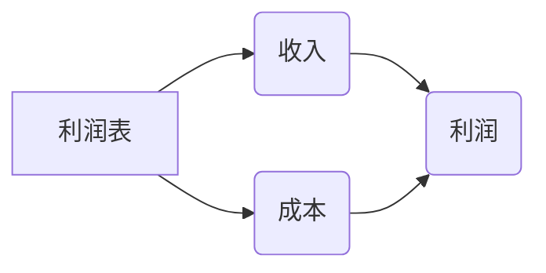
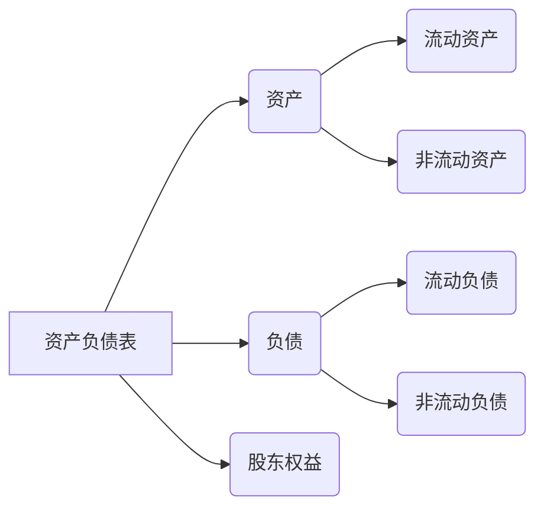
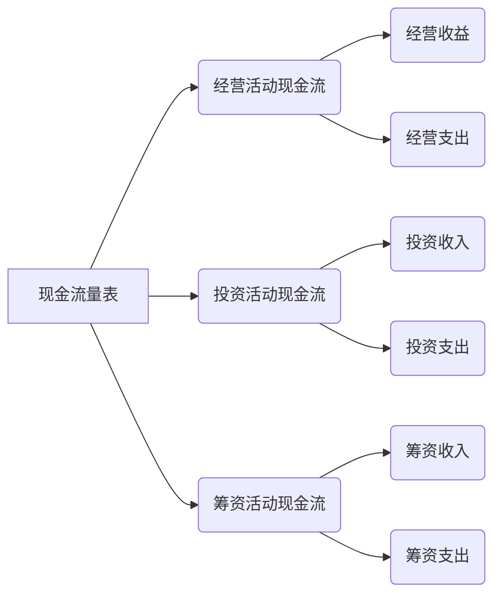

                 

## 巴菲特的读财报方法

> 关键词：巴菲特、财报分析、财务报表、投资策略、财务健康

> 摘要：本文将深入探讨巴菲特的读财报方法，详细解析其背后的核心概念、分析原则和具体步骤。通过巴菲特独特的视角，我们将了解到如何通过财务报表洞察企业的真实状况，为投资决策提供有力支持。

---

### 目录大纲

1. **背景介绍**
    1.1 问题背景
    1.2 问题解决
    1.3 边界与外延
    1.4 核心要素组成

2. **巴菲特的财报阅读原则**
    2.1 核心概念
    2.2 概念属性特征对比表格

3. **理解利润表**
    3.1 核心概念
    3.2 ER实体关系图架构

4. **解读资产负债表**
    4.1 核心概念
    4.2 ER实体关系图架构

5. **分析现金流量表**
    5.1 核心概念
    5.2 ER实体关系图架构

6. **巴菲特的财报分析方法**
    6.1 财务指标分析
    6.2 财报异常值分析
    6.3 财务报表综合分析

---

## 第一部分：背景介绍

### 第1章：问题背景

在投资领域，财务报表是投资者评估企业价值的重要工具。然而，面对复杂的财务报表，许多投资者感到困惑，难以从中提取出有效的信息。这种困境源自报表内容的复杂性和对财务知识的要求。

- **问题描述**：投资者在阅读财报时，往往难以理解各项数据的具体含义和相互关系。
- **问题原因**：财务报表包含了大量的专业术语和复杂的计算方法，缺乏清晰的指引和解释。

### 第2章：问题解决

巴菲特以其卓越的投资成绩，成为投资界的传奇人物。他的成功不仅依赖于对市场趋势的洞察，更依赖于对财务报表的深刻理解。巴菲特提出了自己的财报阅读方法，为投资者提供了宝贵的指导。

- **问题解决**：巴菲特通过自己的实践，总结了一套系统的财报阅读方法，帮助投资者更好地理解企业财务状况。
- **方法适用性**：巴菲特的财报阅读方法适用于各种类型的公司，但需要结合行业特点进行理解。

### 第3章：边界与外延

巴菲特的财报阅读方法不仅局限于某一种类型的公司，而是具有广泛适用性。然而，不同行业有不同的财务特征和经营模式，因此，在实际应用时，需要结合具体行业进行分析。

- **边界与外延**：财报阅读方法的主要边界在于财务报表的三个核心部分：利润表、资产负债表和现金流量表。
- **核心要素组成**：利润表、资产负债表和现金流量表是财务报表的三大核心部分，通过这三个报表，可以全面了解企业的财务状况。

## 第二部分：巴菲特的财报阅读原则

### 第4章：核心概念

巴菲特的财报阅读方法建立在几个核心概念之上，这些概念构成了他分析财务报表的基本框架。

- **经营业绩的真实性**：财务报表中的数据必须真实反映企业的经营状况，而非夸大或隐瞒。
- **财务状况的稳健性**：企业的财务状况必须稳健，具备应对经济波动和风险的能力。
- **现金流的可持续性**：企业的现金流必须可持续，以保证其长期发展的能力。

### 第5章：概念属性特征对比表格

为了更清晰地理解这三个核心概念，我们可以通过一个对比表格来展示它们的属性特征。

| 特征       | 利润表         | 资产负债表       | 现金流量表       |
|------------|----------------|------------------|------------------|
| 主要内容   | 收入、成本和利润 | 资产、负债和股东权益 | 经营活动、投资活动和筹资活动产生的现金流量 |
| 分析重点   | 盈利能力       | 财务稳定性       | 现金流动状况     |
| 重要性     | 提供收入来源   | 反映企业价值   | 预示企业未来   |

通过这个对比表格，我们可以看到每个报表在评估企业财务状况时的独特作用。

## 第三部分：具体分析

### 第6章：理解利润表

利润表是财务报表中最重要的一部分，它反映了企业在一定期间的经营成果。利润表的核心概念包括收入、成本和利润。

- **核心概念**：利润表是反映企业一定期间经营成果的财务报表。
- **ER实体关系图架构**：

通过这个ER实体关系图，我们可以清晰地看到利润表中的各个组成部分及其相互关系。

### 第7章：解读资产负债表

资产负债表是企业财务状况的快照，反映了企业在一定时间点的资产、负债和股东权益状况。

- **核心概念**：资产负债表是企业财务状况的快照，反映了企业在一定时间点的资产、负债和股东权益状况。
- **ER实体关系图架构**：

通过这个ER实体关系图，我们可以看到资产负债表中的各个部分及其相互关系。

### 第8章：分析现金流量表

现金流量表展示了企业一定时期内现金流入和流出的情况，是衡量企业现金流健康的重要指标。

- **核心概念**：现金流量表展示了企业一定时期内现金流入和流出的情况，是衡量企业现金流健康的重要指标。
- **ER实体关系图架构**：

通过这个ER实体关系图，我们可以看到现金流量表中的各个部分及其相互关系。

## 第四部分：巴菲特的财报分析方法

### 第9章：财务指标分析

巴菲特通过关键财务指标评估企业的经营状况，这些指标包括营业收入增长率、毛利率、净利润率、资产回报率、流动比率、速动比率和现金流量比率。

- **核心概念**：通过关键财务指标评估企业的经营状况。
- **指标对比表格**：

| 指标        | 说明                                       |
|-------------|------------------------------------------|
| 营业收入增长率 | 反映企业收入增长的速度                   |
| 毛利率       | 反映企业产品或服务的盈利能力             |
| 净利润率     | 反映企业盈利能力的一个综合指标           |
| 资产回报率   | 反映企业利用资产创造利润的能力           |
| 流动比率     | 反映企业短期偿债能力                     |
| 速动比率     | 反映企业短期偿债能力的另一种指标         |
| 现金流量比率 | 反映企业通过经营活动产生的现金流量能力   |

### 第10章：财报异常值分析

巴菲特在阅读财报时，会特别注意识别异常值，这些异常值可能预示着潜在的风险。

- **核心概念**：识别财报中的异常值，警惕潜在的风险。
- **异常值判断标准**：
  - 利润表：连续多个季度净利润增长率异常低于行业平均水平。
  - 资产负债表：流动比率和速动比率异常低于行业平均水平。
  - 现金流量表：经营活动现金流持续为负。

### 第11章：财务报表综合分析

巴菲特通过综合分析利润表、资产负债表和现金流量表，全面评估企业的财务状况。

- **核心概念**：结合多种财务指标，全面评估企业的财务状况。
- **综合分析方法**：
  - 利润表与现金流量表结合，评估企业的盈利能力和现金流动性。
  - 资产负债表与利润表结合，评估企业的财务稳定性和盈利能力。

## 结论

巴菲特的读财报方法为我们提供了一种系统化的方式来理解企业的财务状况。通过深入分析利润表、资产负债表和现金流量表，投资者可以更准确地评估企业的价值，为投资决策提供有力支持。

- **文章小结**：巴菲特的财报阅读方法为我们提供了一种系统化的方式来理解企业的财务状况，通过深入分析利润表、资产负债表和现金流量表，投资者可以更准确地评估企业的价值，为投资决策提供有力支持。
- **注意事项**：在实际应用中，投资者需要结合具体行业和企业特点，灵活运用巴菲特的方法，避免机械地套用。
- **拓展阅读**：建议读者进一步学习巴菲特的投资理论和财务报表分析方法，以便更好地应用于实际投资中。

## 作者信息

**作者：AI天才研究院/AI Genius Institute & 禅与计算机程序设计艺术 /Zen And The Art of Computer Programming**

---

通过本文，我们希望读者能够对巴菲特的读财报方法有更深入的理解，并能够在实际投资中灵活运用这些方法，提升投资决策的准确性和有效性。投资之路漫漫，但只要我们不断学习、实践和反思，就能在这个充满变数的市场中找到属于自己的成功之道。

