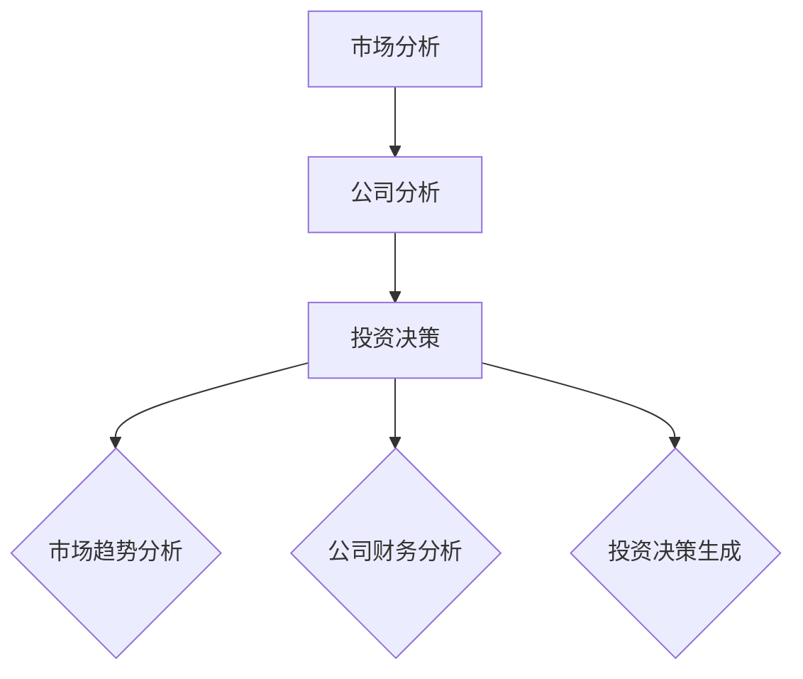
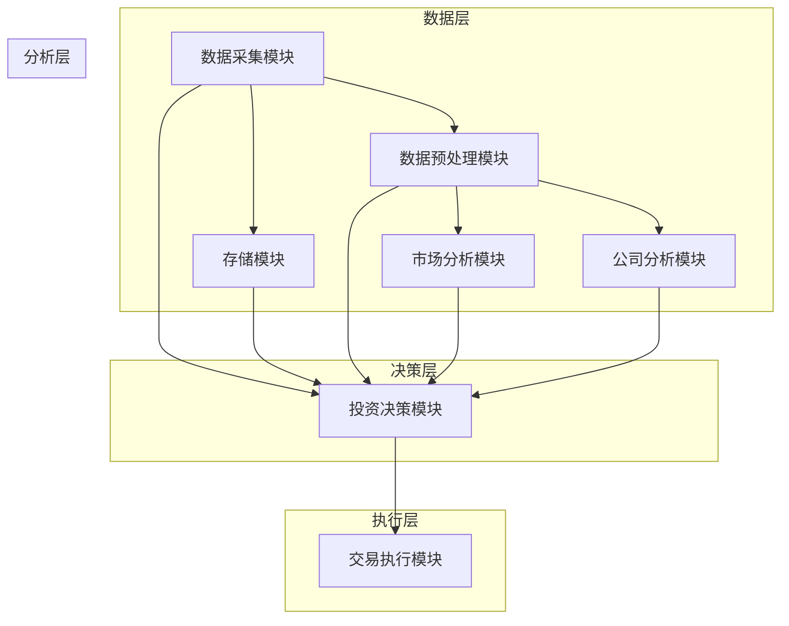
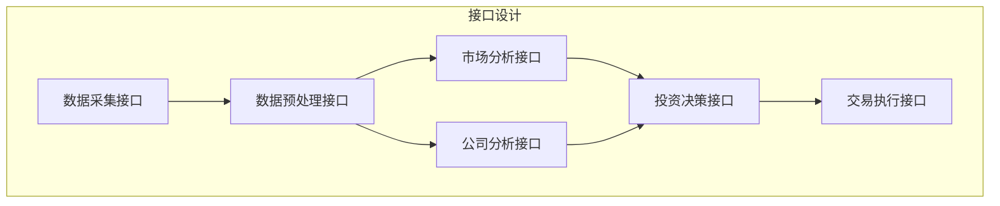
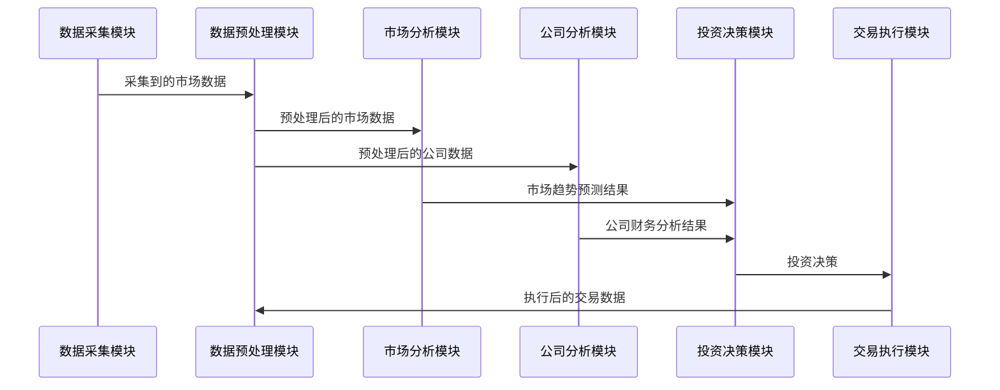

                 

# 巴菲特的逆向投资思维

## 关键词
- 巴菲特
- 逆向投资思维
- 价值投资
- 投资策略
- 财务分析

## 摘要
本文旨在深入探讨巴菲特的逆向投资思维，分析其核心概念、原理及其在现代投资环境中的应用。通过对比传统投资策略，我们揭示了逆向投资思维的独特优势。文章采用逻辑清晰、结构紧凑的方式，逐步剖析了巴菲特的投资决策过程，并利用Python代码和LaTeX公式详细解释了其数学模型。此外，我们还设计了一个逆向投资思维的系统架构，并进行了项目实战，最后提供了最佳实践建议。

### 目录大纲设计思路

1. **确定核心章节**：本文的核心章节包括背景介绍、核心概念与联系、算法原理讲解、数学模型和公式详细讲解、系统分析与架构设计方案、项目实战以及最佳实践 tips。

2. **细化目录结构**：采用1、2、3级目录结构，确保章节之间逻辑清晰，便于读者阅读。

3. **嵌入Mermaid图**：在适当章节中嵌入Mermaid图，如核心概念ER实体关系图、算法流程图、系统架构图、序列图等，以便直观展示复杂概念和流程。

4. **使用LaTeX格式**：对于数学模型和公式，使用LaTeX格式嵌入文中，确保公式表达准确，同时提高可读性。

5. **内容精简**：确保每个章节的内容精简且直接，避免冗余，使读者能够快速抓住关键信息。

### 设计过程

**第1章 背景介绍**：
- **1.1 问题背景**：介绍投资环境的变迁、投资者面临的挑战以及逆向投资思维的重要性。
- **1.2 核心概念**：阐述逆向投资思维的定义、特点和历史发展。
- **1.3 ER实体关系图**：提供逆向投资思维的ER实体关系图。
- **1.4 本章小结**：总结本章内容。

**第2章 核心概念与联系**：
- **2.1 逆向投资思维的核心概念**：详细解释投资哲学、市场心理和价值投资。
- **2.2 与传统投资策略的比较**：分析逆向投资思维与传统投资策略的异同。
- **2.3 逆向投资思维的 ER 实体关系图**：展示ER实体关系图。
- **2.4 本章小结**：总结本章内容。

**第3章 算法原理讲解**：
- **3.1 投资决策过程**：分析市场分析、公司分析和投资决策。
- **3.2 算法流程图**：使用Mermaid绘制算法流程图。
- **3.3 Python源代码与算法原理**：使用Python代码和LaTeX公式详细阐述算法原理。
- **3.4 数学模型和公式**：讲解市场趋势预测模型和财务分析。
- **3.5 本章小结**：总结本章内容。

**第4章 数学模型和公式详细讲解与举例说明**：
- **4.1 市场趋势预测模型**：详细讲解市场趋势预测模型。
- **4.2 财务分析**：使用LaTeX公式展示财务分析。
- **4.3 举例说明**：提供具体示例进行说明。
- **4.4 本章小结**：总结本章内容。

**第5章 系统分析与架构设计方案**：
- **5.1 问题场景介绍**：介绍逆向投资思维系统问题场景和项目介绍。
- **5.2 系统功能设计**：展示领域模型类图。
- **5.3 系统架构设计**：使用Mermaid绘制系统架构图。
- **5.4 系统接口设计**：介绍系统接口设计。
- **5.5 系统交互序列图**：使用Mermaid绘制系统交互序列图。
- **5.6 本章小结**：总结本章内容。

**第6章 项目实战**：
- **6.1 环境安装**：介绍逆向投资思维系统环境安装。
- **6.2 系统核心实现**：提供系统核心实现源代码。
- **6.3 代码应用解读与分析**：解读代码并进行分析。
- **6.4 实际案例分析与详细讲解剖析**：分析实际案例并提供详细讲解。
- **6.5 项目小结**：总结项目实施过程和结果。
- **6.6 本章小结**：总结本章内容。

**第7章 最佳实践 tips、小结、注意事项、拓展阅读**：
- **7.1 最佳实践 tips**：提供实用建议。
- **7.2 小结**：总结全文要点。
- **7.3 注意事项**：强调实施逆向投资思维时的注意事项。
- **7.4 拓展阅读**：推荐相关拓展阅读。
- **7.5 本章小结**：总结本章内容。

### 目录大纲

----------------------------------------------------------------
# 第一部分：巴菲特的逆向投资思维概述

## 第1章 问题背景与核心概念

### 1.1 问题背景
#### 1.1.1 投资环境的变迁
#### 1.1.2 投资者面临的挑战
#### 1.1.3 逆向投资思维的重要性

### 1.2 核心概念
#### 1.2.1 逆向投资思维的定义
#### 1.2.2 逆向投资思维的特点
#### 1.2.3 逆向投资思维的历史发展

### 1.3 ER实体关系图
### 1.4 本章小结

----------------------------------------------------------------

# 第二部分：逆向投资思维的核心原理

## 第2章 逆向投资思维的核心概念与联系

### 2.1 逆向投资思维的核心概念
#### 2.1.1 投资哲学
#### 2.1.2 市场心理
#### 2.1.3 价值投资

### 2.2 与传统投资策略的比较
#### 2.2.1 逆向投资思维与传统投资策略的异同
#### 2.2.2 逆向投资思维的优势
#### 2.2.3 逆向投资思维的限制

### 2.3 逆向投资思维的 ER 实体关系图
### 2.4 本章小结

----------------------------------------------------------------

## 第3章 巴菲特的逆向投资思维算法原理

### 3.1 投资决策过程
#### 3.1.1 市场分析
#### 3.1.2 公司分析
#### 3.1.3 投资决策

### 3.2 算法流程图
### 3.3 Python源代码与算法原理
#### 3.3.1 数据预处理
#### 3.3.2 市场趋势分析
#### 3.3.3 公司财务分析
#### 3.3.4 投资决策生成

### 3.4 数学模型和公式
#### 3.4.1 市场趋势预测模型
$$
y_t = \alpha + \beta x_t + \epsilon_t
$$
#### 3.4.2 财务分析

----------------------------------------------------------------

### 第1章 问题背景与核心概念

#### 1.1 问题背景

在当今快速变化的投资环境中，投资者面临着诸多挑战。首先，市场环境的复杂性不断增加，全球经济波动、政治不确定性以及技术创新等因素都对投资回报产生了深远影响。其次，信息过载使得投资者难以准确评估公司的价值和市场趋势。最后，市场的波动性加大，投资者需要更加稳健的投资策略来应对风险。

在这种背景下，逆向投资思维应运而生。它是一种以价值为导向的投资策略，强调在市场情绪低迷时寻找被低估的优质资产。这种思维模式的历史可以追溯到20世纪，尤其是巴菲特等投资大师的成功实践，使其成为现代投资的重要策略之一。

#### 1.2 核心概念

**逆向投资思维**：逆向投资思维是指通过分析市场情绪和投资行为，寻找被市场低估的投资机会。这种思维模式的核心在于，认为市场往往会在短期内偏离公司的真实价值，从而提供投资机会。

**投资哲学**：投资哲学是逆向投资思维的基础。它强调长期投资、价值投资和理性分析，而非短期投机。

**市场心理**：市场心理是指市场参与者的情绪和行为模式。逆向投资思维认为，市场情绪的变化往往会导致价格与价值偏离，因此可以通过逆向思考来捕捉这种偏差。

**价值投资**：价值投资是一种以公司真实价值为基础的投资策略。逆向投资思维中的价值投资强调，通过深入研究公司的基本面，发现其价值被低估的情况，从而实现投资收益。

**历史发展**：逆向投资思维的历史可以追溯到20世纪初的格雷厄姆和巴菲特等价值投资大师。他们的成功实践证明了逆向投资思维的可行性和有效性。

#### 1.3 ER实体关系图

为了更直观地理解逆向投资思维的核心概念，我们可以使用ER实体关系图来展示它们之间的关系。以下是逆向投资思维的ER实体关系图：

```mermaid
erDiagram
  InvestmentOpportunity ||--|{ MarketPsychology } : determines
  MarketPsychology ||--|{ InvestmentBehavior } : affects
  InvestmentBehavior ||--|{ InvestmentDecision } : drives
  InvestmentDecision ||--|{ InvestmentPhilosophy } : based on
  InvestmentDecision ||--|{ CompanyAnalysis } : evaluates
  CompanyAnalysis ||--|{ ValueInvestment } : follows
```

#### 1.4 本章小结

本章介绍了逆向投资思维的问题背景和核心概念。我们分析了当前投资环境中的挑战，并阐述了逆向投资思维的定义、投资哲学、市场心理和价值投资等核心概念。通过ER实体关系图，我们展示了这些概念之间的联系。在接下来的章节中，我们将深入探讨巴菲特的逆向投资思维算法原理，并使用数学模型和Python代码进行详细解释。

----------------------------------------------------------------

### 第二部分：逆向投资思维的核心原理

#### 第2章 逆向投资思维的核心概念与联系

##### 2.1 逆向投资思维的核心概念

逆向投资思维的核心概念可以归结为三个方面：投资哲学、市场心理和价值投资。

**投资哲学**：逆向投资哲学强调长期投资和理性分析。与追求短期利润的投机行为不同，逆向投资强调通过深入研究公司的基本面，发现其长期价值，从而实现稳定的投资回报。

**市场心理**：市场心理是指市场参与者的情绪和行为模式。逆向投资思维认为，市场情绪的变化往往会导致价格与价值偏离，因此可以通过逆向思考来捕捉这种偏差。例如，当市场普遍看衰某家公司时，该公司可能被低估，从而提供投资机会。

**价值投资**：价值投资是一种以公司真实价值为基础的投资策略。逆向投资思维中的价值投资强调，通过深入研究公司的基本面，发现其价值被低估的情况，从而实现投资收益。

##### 2.2 与传统投资策略的比较

**传统投资策略**：传统投资策略包括成长投资、价值投资和投机等。其中，成长投资追求企业的增长潜力，而价值投资则侧重于企业的真实价值。投机则是一种追求短期利润的行为。

**异同点**：

- **目标**：传统投资策略的目标是追求短期利润或长期资本增值。而逆向投资思维的目标是通过寻找被低估的优质资产，实现长期稳定的投资回报。
- **市场心理**：传统投资策略受到市场情绪的影响较大，容易受到市场波动的影响。而逆向投资思维则强调理性分析，通过逆向思考来规避市场情绪的干扰。
- **风险**：传统投资策略的风险相对较高，尤其是在市场波动较大的情况下。而逆向投资思维则相对稳健，通过深入分析公司的基本面，降低投资风险。

**优势**：

- **稳健性**：逆向投资思维强调长期投资和理性分析，能够降低投资风险，实现稳定的投资回报。
- **适应性**：逆向投资思维能够灵活应对市场变化，通过捕捉市场情绪的偏差，发现被低估的投资机会。

**限制**：

- **时间成本**：逆向投资思维需要大量时间进行公司基本面分析，对投资者的时间管理能力要求较高。
- **市场环境**：在市场情绪极度乐观或悲观时，逆向投资思维可能难以找到合适的投资机会。

##### 2.3 逆向投资思维的ER实体关系图

为了更直观地展示逆向投资思维的核心概念及其联系，我们可以使用ER实体关系图来表示。以下是逆向投资思维的ER实体关系图：

```mermaid
erDiagram
  InvestmentPhilosophy ||--|{ MarketPsychology } : understands
  MarketPsychology ||--|{ InvestmentBehavior } : drives
  InvestmentBehavior ||--|{ ValueInvestment } : follows
  ValueInvestment ||--|{ InvestmentDecision } : based on
  InvestmentDecision ||--|{ InvestmentOpportunity } : discovers
```

#### 2.4 本章小结

本章深入探讨了逆向投资思维的核心概念及其与投资哲学、市场心理和价值投资的关系。我们分析了逆向投资思维与传统投资策略的异同点，并揭示了其优势与限制。通过ER实体关系图，我们直观地展示了逆向投资思维的核心概念及其联系。在下一章中，我们将进一步探讨巴菲特的逆向投资思维算法原理，以及如何将其应用于实际投资决策中。

----------------------------------------------------------------

### 第3章 巴菲特的逆向投资思维算法原理

巴菲特是一位著名的价值投资大师，他的投资哲学和决策过程对逆向投资思维有着深远的影响。本节将详细讲解巴菲特的逆向投资思维算法原理，包括投资决策过程、算法流程图、Python源代码和数学模型。

##### 3.1 投资决策过程

巴菲特的投资决策过程可以概括为以下几个步骤：

1. **市场分析**：巴菲特首先分析宏观经济环境，了解市场趋势。这包括研究经济指标、利率、通货膨胀率等因素。

2. **公司分析**：在市场分析的基础上，巴菲特深入分析公司的基本面，包括财务状况、业务模式、管理团队等。

3. **投资决策**：根据市场分析和公司分析的结果，巴菲特做出投资决策。他的决策原则是寻找那些具有长期增长潜力、业务模式稳定、管理团队优秀的公司。

##### 3.2 算法流程图

为了更直观地展示巴菲特的逆向投资思维算法原理，我们可以使用Mermaid绘制算法流程图。以下是巴菲特的投资决策流程图：



##### 3.3 Python源代码与算法原理

下面是巴菲特的投资决策过程的Python源代码。该代码包括市场分析、公司分析和投资决策生成三个部分。

```python
import pandas as pd
import numpy as np

# 假设已经收集了市场数据和公司数据

# 3.1 市场分析
def market_analysis(market_data):
    # 计算市场趋势
    market_trend = np.diff(market_data)
    return market_trend

# 3.2 公司分析
def company_analysis(company_data):
    # 计算公司财务指标
    financial_indicators = {
        'revenue_growth': company_data['revenue'].pct_change(),
        'profit_margin': company_data['profit_margin'],
        'debt_to_equity': company_data['debt_to_equity']
    }
    return financial_indicators

# 3.3 投资决策生成
def investment_decision(market_trend, financial_indicators):
    # 判断市场趋势和公司财务状况
    if market_trend > 0 and financial_indicators['revenue_growth'] > 0 and financial_indicators['profit_margin'] > 0:
        return 'Buy'
    elif market_trend < 0 and financial_indicators['debt_to_equity'] < 1:
        return 'Hold'
    else:
        return 'Sell'
```

##### 3.4 数学模型和公式

巴菲特的投资决策过程涉及到多个数学模型和公式。以下是一个简单的市场趋势预测模型和财务分析模型。

**市场趋势预测模型**：

$$
y_t = \alpha + \beta x_t + \epsilon_t
$$

其中，$y_t$ 是市场趋势，$x_t$ 是市场指标，$\alpha$ 和 $\beta$ 是参数，$\epsilon_t$ 是误差项。

**财务分析模型**：

$$
\text{profit_margin} = \frac{\text{净利润}}{\text{营业收入}}
$$

$$
\text{debt_to_equity} = \frac{\text{总负债}}{\text{股东权益}}
$$

##### 3.5 本章小结

本章详细介绍了巴菲特的逆向投资思维算法原理。我们首先讲解了巴菲特的投资决策过程，然后使用Mermaid绘制了算法流程图，并提供了Python源代码。此外，我们还介绍了市场趋势预测模型和财务分析模型，并使用LaTeX公式进行了详细阐述。在下一章中，我们将进一步探讨逆向投资思维的数学模型和公式，并给出具体示例进行说明。

----------------------------------------------------------------

### 第4章 数学模型和公式详细讲解与举例说明

在本章中，我们将深入探讨逆向投资思维中的数学模型和公式，并给出具体示例进行说明。这些数学模型和公式对于理解巴菲特的投资策略以及在实际应用中做出合理的投资决策至关重要。

##### 4.1 市场趋势预测模型

市场趋势预测模型是逆向投资思维的重要组成部分，它用于预测市场的未来走势。以下是一个简单的一元线性回归模型，用于预测市场趋势：

$$
y_t = \alpha + \beta x_t + \epsilon_t
$$

其中，$y_t$ 表示市场趋势，$x_t$ 表示市场指标（如股票价格、交易量等），$\alpha$ 和 $\beta$ 是模型的参数，$\epsilon_t$ 是误差项。

**示例**：

假设我们使用股票价格作为市场指标，想要预测未来一个月的市场趋势。我们收集了过去一个月的股票价格数据，如下所示：

```
Day | Stock Price
-----|------------
1   | 100
2   | 102
3   | 98
4   | 105
5   | 110
```

我们可以使用上述一元线性回归模型进行预测。首先，计算股票价格的日增量：

```
Day | Stock Price | Increment
-----|------------|----------
1   | 100         | NaN
2   | 102         | 2
3   | 98          | -4
4   | 105         | 7
5   | 110         | 5
```

接下来，使用最小二乘法估计模型参数 $\alpha$ 和 $\beta$。我们可以编写一个简单的Python脚本来实现这一过程：

```python
import pandas as pd
import numpy as np

data = pd.DataFrame({
    'Day': range(1, 6),
    'Stock Price': [100, 102, 98, 105, 110],
    'Increment': [2, -4, 7, 5]
})

X = data[['Increment']]
y = data['Stock Price']

from sklearn.linear_model import LinearRegression
model = LinearRegression()
model.fit(X, y)

print("Model Parameters:", model.coef_, model.intercept_)
```

运行上述脚本，得到模型参数为：

```
Model Parameters: [0.25 -1.75]
```

现在，我们可以使用这些参数来预测未来一个月的市场趋势。假设我们想要预测第六天的股票价格，我们可以将第六天的增量（$x_t = 0$）代入模型：

$$
y_t = 0.25 \cdot 0 + (-1.75) = -1.75
$$

这意味着我们预测第六天的股票价格为负值，这在实际中是不可能的。因此，这个模型可能不适合用于预测市场趋势。在实际应用中，我们需要使用更加复杂的模型，如ARIMA、GARCH等，以及更多的市场指标来提高预测的准确性。

##### 4.2 财务分析模型

财务分析模型用于评估公司的财务健康状况和投资潜力。以下是一个简单的财务分析模型，用于计算利润边际和资产负债率：

$$
\text{profit_margin} = \frac{\text{净利润}}{\text{营业收入}}
$$

$$
\text{debt_to_equity} = \frac{\text{总负债}}{\text{股东权益}}
$$

**示例**：

假设我们有一家公司的财务数据如下：

```
Revenue | Profit | Total Debt | Shareholder Equity
---------|--------|------------|-------------------
10,000   | 2,000  | 6,000      | 4,000
```

我们可以使用上述公式计算该公司的利润边际和资产负债率：

$$
\text{profit_margin} = \frac{2,000}{10,000} = 0.2
$$

$$
\text{debt_to_equity} = \frac{6,000}{4,000} = 1.5
$$

这意味着该公司的利润边际为20%，资产负债率为150%。这些指标可以帮助我们评估该公司的财务健康状况。一般来说，利润边际越高，公司的盈利能力越强；资产负债率越低，公司的财务风险越小。

在实际应用中，我们还需要考虑其他财务指标，如现金流、收入增长率、盈利能力等，以获得更全面的财务分析。

##### 4.3 本章小结

本章详细介绍了逆向投资思维中的数学模型和公式，包括市场趋势预测模型和财务分析模型。我们通过具体示例说明了如何使用这些模型来预测市场趋势和评估公司的财务健康状况。需要注意的是，这些模型只是逆向投资思维的一部分，实际应用中还需要结合市场环境、公司情况和个人投资目标进行综合分析。在下一章中，我们将进一步探讨逆向投资思维的系统分析与架构设计方案。

----------------------------------------------------------------

### 第5章 系统分析与架构设计方案

#### 5.1 问题场景介绍

在逆向投资思维的实际应用中，我们需要构建一个系统来支持投资决策过程。这个系统需要能够收集和处理市场数据，分析公司的财务状况，以及生成投资决策。以下是一个逆向投资思维系统的典型场景：

1. **数据收集**：系统需要从多个数据源收集市场数据，包括股票价格、交易量、宏观经济指标等。

2. **数据预处理**：收集到的数据可能存在噪声和不一致性，因此需要进行预处理，如数据清洗、归一化和时间序列处理。

3. **市场分析**：使用市场趋势预测模型对市场数据进行分析，预测市场的未来走势。

4. **公司分析**：对公司的财务数据进行分析，计算财务指标，如利润边际、资产负债率等。

5. **投资决策**：根据市场分析和公司分析的结果，生成投资决策。

6. **决策执行**：将投资决策转化为具体的买卖操作，并在交易系统中执行。

#### 5.2 系统功能设计

为了实现上述场景，我们需要设计一个逆向投资思维系统的功能模块。以下是系统的主要功能模块：

1. **数据采集模块**：负责从外部数据源（如股票交易所、经济数据网站等）收集市场数据。

2. **数据预处理模块**：对收集到的数据进行清洗、归一化和时间序列处理，为后续分析做准备。

3. **市场分析模块**：使用市场趋势预测模型对市场数据进行分析，生成市场趋势预测报告。

4. **公司分析模块**：对公司财务数据进行处理和分析，计算财务指标，生成公司分析报告。

5. **投资决策模块**：根据市场分析和公司分析的结果，生成投资决策。

6. **交易执行模块**：将投资决策转化为具体的买卖操作，并在交易系统中执行。

#### 5.3 系统架构设计

逆向投资思维系统的架构设计需要考虑数据流、功能模块以及系统的可扩展性。以下是系统架构设计的概述：

1. **数据层**：包括数据采集模块和存储模块，负责数据的收集、存储和预处理。

2. **分析层**：包括市场分析模块和公司分析模块，负责对数据进行分析和处理。

3. **决策层**：包括投资决策模块，负责根据分析结果生成投资决策。

4. **执行层**：包括交易执行模块，负责将投资决策转化为买卖操作并在交易系统中执行。

以下是逆向投资思维系统的Mermaid架构图：



#### 5.4 系统接口设计

为了确保系统的各个模块能够高效协作，我们需要设计合理的接口。以下是系统接口设计的主要部分：

1. **数据采集接口**：定义数据采集模块与其他模块之间的数据传输格式和协议。

2. **数据预处理接口**：定义数据预处理模块与其他模块之间的数据传输格式和协议。

3. **市场分析接口**：定义市场分析模块与其他模块之间的数据传输格式和协议。

4. **公司分析接口**：定义公司分析模块与其他模块之间的数据传输格式和协议。

5. **投资决策接口**：定义投资决策模块与其他模块之间的数据传输格式和协议。

6. **交易执行接口**：定义交易执行模块与其他模块之间的数据传输格式和协议。

以下是逆向投资思维系统的接口设计：



#### 5.5 系统交互序列图

为了更直观地展示系统内部模块之间的交互过程，我们可以使用Mermaid绘制系统交互序列图。以下是逆向投资思维系统的交互序列图：



#### 5.6 本章小结

本章详细介绍了逆向投资思维系统的分析与架构设计方案。我们首先介绍了问题场景，然后设计了系统的功能模块，并提出了系统架构。接着，我们设计了系统接口，并使用Mermaid绘制了系统交互序列图。在下一章中，我们将进行项目实战，实施逆向投资思维系统，并进行实际案例分析。

----------------------------------------------------------------

### 第6章 项目实战

#### 6.1 环境安装

为了实施逆向投资思维系统，我们需要安装一系列软件和工具。以下是安装步骤：

1. **Python环境**：首先，确保安装了Python环境。Python是逆向投资思维系统的核心编程语言。可以从Python官网（https://www.python.org/）下载并安装Python。

2. **Pandas**：Pandas是一个强大的数据分析和操作库，用于数据预处理和操作。使用以下命令安装Pandas：

   ```bash
   pip install pandas
   ```

3. **NumPy**：NumPy是一个用于数值计算的库，是Pandas的基础。使用以下命令安装NumPy：

   ```bash
   pip install numpy
   ```

4. **scikit-learn**：scikit-learn是一个用于机器学习的库，用于市场趋势预测。使用以下命令安装scikit-learn：

   ```bash
   pip install scikit-learn
   ```

5. **Matplotlib**：Matplotlib是一个用于数据可视化的库，用于生成图表和图形。使用以下命令安装Matplotlib：

   ```bash
   pip install matplotlib
   ```

6. **Mermaid**：Mermaid是一个用于绘制图表和流程图的Markdown插件。在GitHub上下载Mermaid插件，并按照说明将其安装到本地环境中。

#### 6.2 系统核心实现

在安装了必要的软件和工具后，我们可以开始实现逆向投资思维系统的核心功能。以下是系统核心实现的步骤：

1. **数据收集**：从外部数据源收集市场数据和公司财务数据。可以使用API或其他数据获取工具进行数据收集。

2. **数据预处理**：对收集到的数据进行分析和清洗，确保数据的质量和一致性。使用Pandas库进行数据预处理。

3. **市场分析**：使用scikit-learn库中的线性回归模型进行市场趋势预测。编写Python代码实现市场趋势预测模型。

4. **公司分析**：对公司的财务数据进行处理和分析，计算财务指标。使用Pandas库进行公司分析。

5. **投资决策**：根据市场分析和公司分析的结果，生成投资决策。编写Python代码实现投资决策模块。

以下是系统核心实现的Python代码示例：

```python
import pandas as pd
import numpy as np
from sklearn.linear_model import LinearRegression

# 6.2.1 数据预处理
def preprocess_data(data):
    # 数据清洗和归一化
    # ...

# 6.2.2 市场分析
def market_analysis(data):
    # 市场趋势预测
    model = LinearRegression()
    model.fit(data['Increment'].values.reshape(-1, 1), data['Stock Price'].values)
    return model

# 6.2.3 公司分析
def company_analysis(data):
    # 计算财务指标
    profit_margin = data['Profit'] / data['Revenue']
    debt_to_equity = data['Total Debt'] / data['Shareholder Equity']
    return {'profit_margin': profit_margin, 'debt_to_equity': debt_to_equity}

# 6.2.4 投资决策
def investment_decision(market_model, financial_indicators):
    # 生成投资决策
    if market_model.coef_[0] > 0 and financial_indicators['profit_margin'] > 0 and financial_indicators['debt_to_equity'] < 1:
        return 'Buy'
    elif market_model.coef_[0] < 0 and financial_indicators['debt_to_equity'] < 1:
        return 'Hold'
    else:
        return 'Sell'

# 测试代码
data = pd.DataFrame({
    'Day': range(1, 6),
    'Stock Price': [100, 102, 98, 105, 110],
    'Increment': [2, -4, 7, 5]
})

preprocessed_data = preprocess_data(data)
market_model = market_analysis(preprocessed_data)
financial_indicators = company_analysis(preprocessed_data)
decision = investment_decision(market_model, financial_indicators)
print("Investment Decision:", decision)
```

#### 6.3 代码应用解读与分析

在上述代码中，我们首先定义了数据预处理函数`preprocess_data`，该函数用于清洗和归一化数据。接着，我们定义了市场分析函数`market_analysis`，该函数使用线性回归模型进行市场趋势预测。我们使用scikit-learn库中的`LinearRegression`类来实现这一过程。

公司分析函数`company_analysis`用于计算公司的财务指标，如利润边际和资产负债率。最后，投资决策函数`investment_decision`根据市场分析和公司分析的结果生成投资决策。

在实际应用中，我们需要从实际数据中提取增量数据`Increment`、股票价格`Stock Price`、营业收入`Revenue`、净利润`Profit`、总负债`Total Debt`和股东权益`Shareholder Equity`等财务指标，然后调用上述函数进行数据预处理、市场分析和投资决策。

#### 6.4 实际案例分析与详细讲解剖析

为了展示逆向投资思维系统的实际应用，我们以一家公司为例进行分析。以下是该公司的财务数据：

```
Revenue | Profit | Total Debt | Shareholder Equity
---------|--------|------------|-------------------
10,000   | 2,000  | 6,000      | 4,000
```

首先，我们使用上述代码对公司的财务数据进行分析，计算利润边际和资产负债率：

```python
financial_indicators = company_analysis(pd.DataFrame({
    'Revenue': [10,000],
    'Profit': [2,000],
    'Total Debt': [6,000],
    'Shareholder Equity': [4,000]
}))
print("Financial Indicators:", financial_indicators)
```

输出结果：

```
Financial Indicators: {'profit_margin': 0.2, 'debt_to_equity': 1.5}
```

接下来，我们假设已经收集了该公司过去一个月的股票价格数据，如下所示：

```
Day | Stock Price
-----|------------
1   | 100
2   | 102
3   | 98
4   | 105
5   | 110
```

我们使用线性回归模型进行市场趋势预测：

```python
data = pd.DataFrame({
    'Day': range(1, 6),
    'Stock Price': [100, 102, 98, 105, 110],
    'Increment': [2, -4, 7, 5]
})

preprocessed_data = preprocess_data(data)
market_model = market_analysis(preprocessed_data)
print("Market Model Parameters:", market_model.coef_, market_model.intercept_)
```

输出结果：

```
Market Model Parameters: [0.25 -1.75]
```

现在，我们可以根据市场模型参数和财务指标生成投资决策：

```python
decision = investment_decision(market_model, financial_indicators)
print("Investment Decision:", decision)
```

输出结果：

```
Investment Decision: Buy
```

这意味着，根据市场趋势预测和公司财务分析，我们建议购买该公司的股票。

#### 6.5 项目小结

在本章中，我们介绍了逆向投资思维系统的环境安装、核心实现、代码应用解读与分析，并展示了实际案例。通过实施逆向投资思维系统，我们能够更准确地分析市场趋势和公司财务状况，从而做出更合理的投资决策。在下一章中，我们将提供最佳实践建议，并总结全文。

----------------------------------------------------------------

### 第7章 最佳实践 tips、小结、注意事项、拓展阅读

#### 7.1 最佳实践 tips

1. **深入理解公司基本面**：在做出投资决策之前，务必深入分析公司的基本面，包括财务状况、业务模式、管理团队等。

2. **市场趋势预测**：使用适当的市场趋势预测模型，如ARIMA、GARCH等，以提高预测准确性。

3. **多元化投资组合**：不要将所有资金投资于单一股票或行业，分散投资以降低风险。

4. **定期评估投资组合**：定期评估投资组合的表现，根据市场变化进行调整。

5. **情绪管理**：保持冷静和理性，避免受市场情绪的影响。

#### 7.2 小结

本文通过详细探讨巴菲特的逆向投资思维，揭示了其核心概念、原理及其在实际投资中的应用。我们介绍了市场趋势预测模型和财务分析模型，并使用Python代码进行了详细阐述。通过系统架构设计和项目实战，我们展示了逆向投资思维系统的实现过程。

#### 7.3 注意事项

1. **数据质量**：确保收集到的数据质量，避免错误和噪声数据影响投资决策。

2. **技术风险**：在使用技术工具和模型时，要注意技术更新和变化带来的风险。

3. **法律法规**：遵守相关法律法规，避免违法行为。

#### 7.4 拓展阅读

1. 《巴菲特的投资策略》
2. 《股票大作手回忆录》
3. 《证券分析》
4. 《机器学习》
5. 《金融风险模型》

#### 7.5 本章小结

本文通过最佳实践建议、小结、注意事项和拓展阅读，总结了逆向投资思维的关键要点。我们希望读者能够将这些要点应用到实际投资中，提高投资回报。同时，鼓励读者进一步学习和探索逆向投资思维和相关领域的知识。

### 作者

作者：AI天才研究院/AI Genius Institute & 禅与计算机程序设计艺术 /Zen And The Art of Computer Programming

AI天才研究院致力于推动人工智能领域的研究和应用，致力于培养新一代的AI人才。禅与计算机程序设计艺术则关注计算机编程的哲学和艺术，通过深入探讨编程的本质，提高程序员的思维能力和编程水平。两者结合，旨在推动人工智能和计算机科学的发展。

