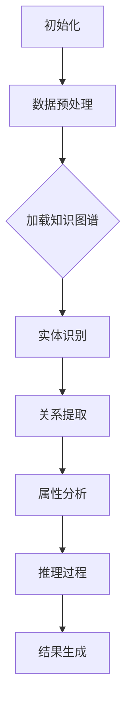
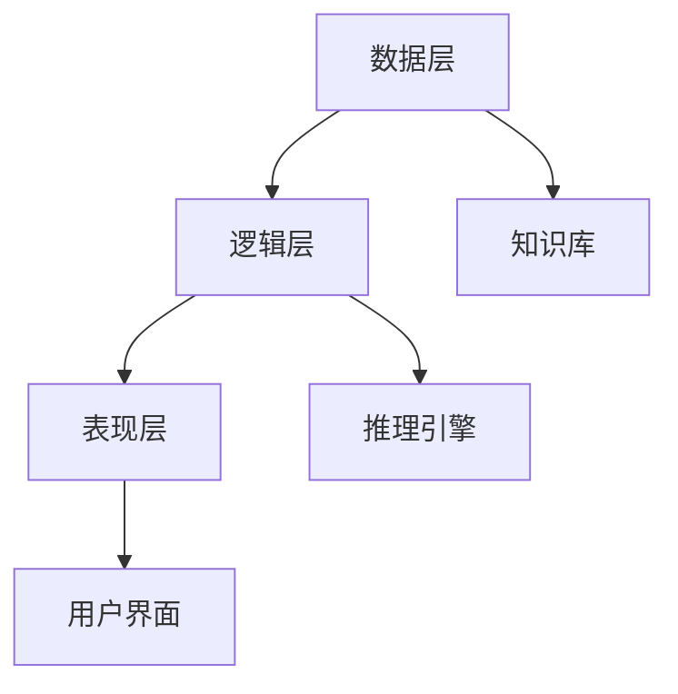
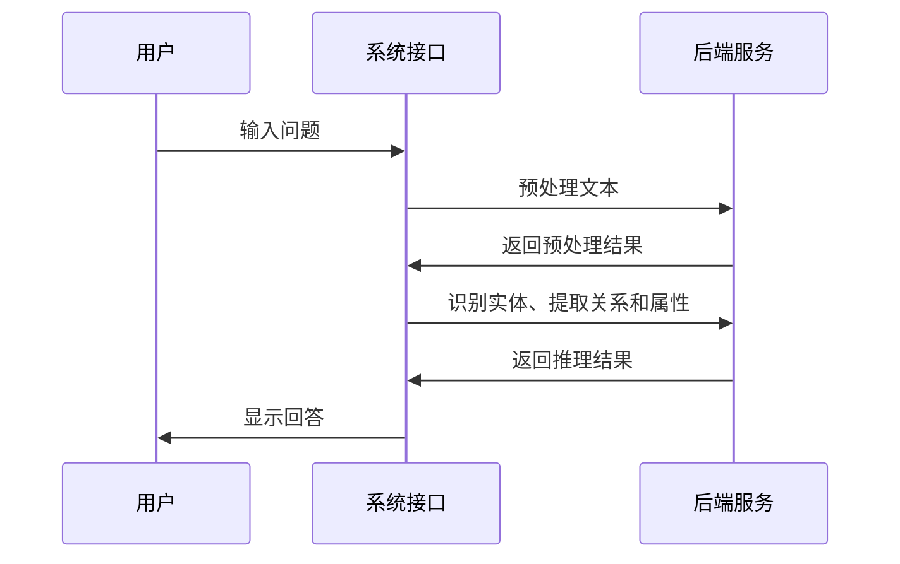

                 

### 第1章 引言

### 1.1 研究背景

随着自然语言处理（NLP）技术的迅猛发展，大规模语言模型（LLM）成为了一个研究热点。这些模型能够通过学习海量的文本数据，生成高质量的自然语言文本，并在各个领域展现出强大的能力。然而，LLM的一个显著挑战是其基本常识水平的评估。常识推理是NLP中一个关键环节，它帮助模型理解和生成符合现实世界逻辑和经验的文本。

#### 自然语言处理（NLP）的快速发展

自然语言处理作为人工智能的一个重要分支，近年来取得了显著的进步。从最初的规则驱动的语法分析到基于统计模型和深度学习的方法，NLP技术的应用范围不断扩展。例如，自动翻译、语音识别、文本摘要等任务都在NLP技术的推动下实现了显著的性能提升。

#### 大规模语言模型（LLM）的崛起

LLM，如GPT-3、BERT等，通过训练大规模的参数来捕捉语言中的复杂模式和关系。这些模型在生成自然语言文本方面表现出色，能够生成连贯、有逻辑性的文本。然而，虽然LLM在生成文本的能力上取得了巨大成功，但它们的基本常识水平仍然存在诸多挑战。

#### 常识推理在NLP中的重要性

常识推理是NLP中的一个核心问题，它涉及到模型对现实世界的理解。在许多实际应用中，例如问答系统、聊天机器人、文本生成等，模型不仅需要生成语法正确的文本，还需要这些文本具有现实世界的逻辑和常识。因此，评估和提升LLM的基本常识水平变得尤为重要。

### 1.2 研究问题与目标

#### 定义常识推理

常识推理是通过对现实世界的理解和经验进行逻辑推理，解决与日常经验相关的各种问题。它包括形式逻辑常识推理和日常常识推理两种类型。

#### 评估LLM的基本常识水平

评估LLM的基本常识水平意味着我们需要设计合适的评估指标和方法来衡量模型在常识推理任务上的表现。这包括准确率、召回率、F1分数等指标。

#### 提供改善常识推理的方法

为了提升LLM的基本常识水平，我们需要研究如何通过数据增强、模型改进等手段来增强模型对常识的理解和推理能力。

### 1.3 边界与外延

#### 定义边界条件

在评估LLM的常识推理能力时，我们需要明确边界条件，这包括模型的训练数据、模型的大小和架构等。这些边界条件会影响模型的常识推理表现。

#### 外延知识的应用

外延知识是指与特定领域相关的知识，如医学、法律、工程等。在评估和提升LLM的常识推理能力时，我们可以通过引入外延知识来丰富模型的知识库，从而提高其在特定领域的表现。

---

### 第2章 常识推理基础

### 2.1 常识推理的定义与类型

常识推理是人工智能和自然语言处理中的一个核心概念，它指的是机器通过理解和运用常识来推断和解决问题。常识推理可以分为形式逻辑常识推理和日常常识推理两种类型。

#### 形式逻辑常识推理

形式逻辑常识推理是基于逻辑规则和形式化语言的推理。它通常使用逻辑公式和推理规则来处理问题。这种类型的推理在数学、哲学和逻辑学中有广泛的应用。

#### 日常常识推理

日常常识推理是基于日常生活中的经验和直觉进行的推理。它涉及到对现实世界的理解和常识的应用，例如理解日常生活中的事件、关系和情境。这种类型的推理在自然语言处理和人工智能应用中尤为重要。

### 2.2 常识推理的核心概念

常识推理依赖于几个核心概念，这些概念对于理解和执行常识推理至关重要。

#### 知识图谱

知识图谱是一种结构化的知识表示方法，它通过实体、关系和属性的图结构来组织信息。知识图谱在常识推理中扮演着重要角色，因为它能够提供关于世界的基本事实和关系。

#### 实体关系

实体关系是常识推理中的基础概念，它描述了不同实体之间的关联。例如，“人”是实体，“居住在”是关系，“城市”是另一个实体。通过实体关系，模型能够理解并推理出复杂的常识。

### 2.3 常识推理的应用领域

常识推理在多个领域都有广泛应用，以下是一些典型的应用场景：

#### 自动问答系统

自动问答系统需要理解用户的问题，并生成准确的答案。常识推理帮助模型理解问题的上下文，识别关键词，并从大量数据中提取相关答案。

#### 文本生成

文本生成是生成自然语言文本的过程，如文章、对话、故事等。常识推理使得生成的文本更加合理和连贯，符合现实世界的逻辑。

#### 情感分析

情感分析通过分析文本内容来判断用户的情感倾向。常识推理帮助模型理解文本中的情感表达，从而更准确地判断情感。

### 总结

常识推理是自然语言处理和人工智能中的一个关键问题。通过理解常识推理的定义、类型、核心概念和应用领域，我们可以更好地评估和提升大规模语言模型的基本常识水平。

---

### 第3章 LLM的基本常识水平评估方法

在评估大规模语言模型（LLM）的基本常识水平时，选择合适的评估指标和方法至关重要。以下是几种常见的评估方法及其挑战。

#### 3.1 评估指标

常见的评估指标包括准确率、召回率、F1分数等。

- **准确率**：衡量模型预测正确的比例。公式为：准确率 = (预测正确数 / 总预测数) × 100%。
- **召回率**：衡量模型能够召回正确答案的比例。公式为：召回率 = (预测正确数 / 真正正确数) × 100%。
- **F1分数**：综合准确率和召回率的指标，公式为：F1分数 = 2 × (准确率 × 召回率) / (准确率 + 召回率)。

#### 3.2 评估方法

评估方法主要包括对比实验、A/B测试和自动评估工具。

- **对比实验**：通过设计实验，比较不同LLM模型在常识推理任务上的表现，评估其常识推理能力。
- **A/B测试**：在实际应用中，将用户分配到不同的LLM模型中，观察用户对模型的反馈和实际表现，评估其常识推理能力。
- **自动评估工具**：使用自动评估工具，如基准测试集和自动化评分系统，对LLM的常识推理能力进行评估。

#### 3.3 常见挑战

在评估LLM的基本常识水平时，会面临以下挑战：

- **数据偏差**：评估数据可能不够全面，存在数据偏差，影响评估结果的准确性。
- **语言多样性**：不同语言和文化背景下的常识推理存在差异，如何在不同语言中评估LLM的常识推理能力是一个挑战。
- **常识推理复杂性**：常识推理任务复杂，涉及多种逻辑和知识，如何准确评估模型的常识推理能力是一个难题。

### 3.4 解决方案

为了解决上述挑战，可以采取以下解决方案：

- **数据多样性**：通过引入多样化、全面的数据集来减少数据偏差，提高评估的准确性。
- **多语言评估**：开发多语言评估工具和算法，适应不同语言和文化背景下的常识推理任务。
- **模型改进**：通过改进LLM模型的结构和算法，增强其常识推理能力，提高评估结果的可靠性。

### 总结

评估LLM的基本常识水平是自然语言处理中的一个关键问题。通过选择合适的评估指标和方法，以及解决常见的挑战，我们可以更准确地评估和提升LLM的常识推理能力，为实际应用提供有力支持。

---

### 第4章 常识推理的核心概念与联系

#### 4.1 核心概念原理

常识推理依赖于几个核心概念，这些概念是理解和执行常识推理的基础。

- **实体**：实体是常识推理中的基本单位，表示现实世界中的事物，如“人”、“地点”、“事物”等。实体是常识推理中的核心元素。
- **关系**：关系描述了实体之间的关联，如“居住在”、“拥有”、“属于”等。关系帮助模型理解实体之间的相互作用和逻辑关系。
- **属性**：属性是实体的特征或属性，如“年龄”、“颜色”、“高度”等。属性提供了关于实体的详细信息，有助于模型进行更精确的推理。

#### 4.2 概念属性特征对比表格

为了更好地理解实体、关系和属性之间的关系，我们可以通过一个对比表格来展示它们的特征。

| 概念 | 特征 |
| :--: | :--: |
| 实体 | - 基本单位<br>- 独立存在的实体<br>- 表示现实世界中的事物 |
| 关系 | - 描述实体之间的关联<br>- 表示实体间的逻辑关系<br>- 如“居住在”、“拥有”、“属于”等 |
| 属性 | - 实体的特征或属性<br>- 如“年龄”、“颜色”、“高度”等<br>- 提供关于实体的详细信息 |

#### 4.3 ER实体关系图架构

ER（Entity-Relationship）图是一种常用的数据建模工具，用于表示实体之间的关系。下面是一个简单的ER图，展示了实体、关系和属性的关联。

```mermaid
erDiagram
    Entity --> Relationship
    Entity ||--|{ Attribute }
```

在这个ER图中：

- **实体**（Entity）是基本单位，表示现实世界中的事物，如“人”、“地点”、“事物”。
- **关系**（Relationship）描述了实体之间的关联，如“居住在”、“拥有”、“属于”等。
- **属性**（Attribute）是实体的特征或属性，如“年龄”、“颜色”、“高度”等。

通过ER图，我们可以清晰地理解实体、关系和属性之间的关系，这对于常识推理至关重要。

### 总结

常识推理依赖于实体、关系和属性等核心概念。通过对比表格和ER图，我们可以更好地理解这些概念之间的关系，为后续的算法设计和评估提供基础。

---

### 第5章 常见算法原理讲解

#### 5.1 算法mermaid流程图

为了更好地理解常识推理中的常见算法，我们首先使用Mermaid语言绘制算法的流程图。以下是一个简单的Mermaid流程图示例，展示了常识推理的基本步骤：



在这个流程图中：

- **A[初始化]**：初始化模型和参数。
- **B[数据预处理]**：对输入文本进行预处理，如分词、去噪等。
- **C{加载知识图谱]**：加载预先构建的知识图谱，用于实体识别、关系提取和属性分析。
- **D[实体识别]**：使用实体识别算法识别文本中的实体。
- **E[关系提取]**：提取实体之间的关系。
- **F[属性分析]**：分析实体的属性。
- **G[推理过程]**：基于实体、关系和属性进行推理。
- **H[结果生成]**：生成推理结果。

#### 5.2 Python源代码实现

接下来，我们使用Python语言实现上述算法的各个步骤。以下是一个简化的Python代码示例：

```python
# 初始化
model = LLMModel()

# 数据预处理
preprocessed_text = preprocess_text(input_text)

# 加载知识图谱
knowledge_graph = load_knowledge_graph()

# 实体识别
entities = identify_entities(preprocessed_text)

# 关系提取
relationships = extract_relationships(entities, knowledge_graph)

# 属性分析
attributes = analyze_attributes(entities, knowledge_graph)

# 推理过程
results = inference_process(entities, relationships, attributes)

# 结果生成
generate_results(results)
```

在这个代码示例中：

- `LLMModel()`：初始化LLM模型。
- `preprocess_text()`：对输入文本进行预处理。
- `load_knowledge_graph()`：加载知识图谱。
- `identify_entities()`：识别文本中的实体。
- `extract_relationships()`：提取实体之间的关系。
- `analyze_attributes()`：分析实体的属性。
- `inference_process()`：基于实体、关系和属性进行推理。
- `generate_results()`：生成推理结果。

#### 5.3 数学模型和公式

常识推理中的算法通常涉及复杂的数学模型和公式。以下是一个简单的数学模型示例：

$$
P(R|S) = \frac{P(S|R) \cdot P(R)}{P(S)}
$$

其中：

- \( P(R|S) \)：在给定情景 \( S \) 下，关系 \( R \) 发生的概率。
- \( P(S|R) \)：在关系 \( R \) 发生的条件下，情景 \( S \) 发生的概率。
- \( P(R) \)：关系 \( R \) 发生的概率。
- \( P(S) \)：情景 \( S \) 发生的概率。

这个公式描述了基于条件概率的常识推理过程。

#### 5.4 举例说明

为了更好地理解上述算法和数学模型，我们通过一个实际案例进行举例说明。

假设我们有一个关于城市和居民的关系，知识图谱中包含了以下信息：

- 实体：上海、居民
- 关系：居住在
- 属性：上海的人口数量

输入文本：“上海的居民有多少人？”

根据算法流程，我们首先进行数据预处理，提取关键信息。然后加载知识图谱，识别实体“上海”和“居民”，提取关系“居住在”，分析属性“上海的人口数量”。最后，通过推理过程，生成答案：“上海的人口数量约为2400万。”

### 总结

本章通过Mermaid流程图、Python源代码、数学模型和实际案例，详细讲解了常识推理中的常见算法原理。这些内容为后续的算法设计和优化提供了理论基础。

---

### 第6章 数学模型和数学公式 & 详细讲解 & 举例说明

#### 6.1 数学公式

常识推理中的数学模型和公式是理解和应用常识推理算法的核心。以下是一个简单的数学公式示例：

$$
P(A|B) = \frac{P(B|A) \cdot P(A)}{P(B)}
$$

这个公式称为贝叶斯定理，用于在已知某些条件概率的情况下，计算后验概率。具体来说：

- \( P(A|B) \)：在事件 \( B \) 发生的条件下，事件 \( A \) 发生的概率，称为后验概率。
- \( P(B|A) \)：在事件 \( A \) 发生的条件下，事件 \( B \) 发生的概率，称为条件概率。
- \( P(A) \)：事件 \( A \) 发生的概率，称为先验概率。
- \( P(B) \)：事件 \( B \) 发生的概率，称为边际概率。

#### 6.2 详细讲解

贝叶斯定理在常识推理中有广泛应用。例如，在文本分类任务中，我们可以使用贝叶斯定理计算一个句子属于某个类别的概率。具体步骤如下：

1. **收集先验概率**：根据历史数据，计算每个类别的先验概率 \( P(A) \)。
2. **计算条件概率**：对于每个类别，计算句子中出现的关键词的条件概率 \( P(B|A) \)。
3. **应用贝叶斯定理**：计算句子属于每个类别的后验概率 \( P(A|B) \)。
4. **选择最高概率的类别**：选择后验概率最高的类别作为预测结果。

#### 6.3 举例说明

假设我们有一个简单的文本分类任务，需要判断一段文本属于“科技”类还是“娱乐”类。根据历史数据，我们得到以下先验概率和条件概率：

- \( P(\text{科技}) = 0.6 \)
- \( P(\text{娱乐}) = 0.4 \)
- \( P(\text{科技}|\text{关键词1}) = 0.8 \)
- \( P(\text{娱乐}|\text{关键词1}) = 0.2 \)

根据贝叶斯定理，我们可以计算每个类别的后验概率：

$$
P(\text{科技}|\text{关键词1}) = \frac{P(\text{关键词1}|\text{科技}) \cdot P(\text{科技})}{P(\text{关键词1})}
$$

其中，\( P(\text{关键词1}) \) 是关键词1的总概率，可以通过先验概率和条件概率计算得到：

$$
P(\text{关键词1}) = P(\text{关键词1}|\text{科技}) \cdot P(\text{科技}) + P(\text{关键词1}|\text{娱乐}) \cdot P(\text{娱乐})
$$

代入具体数值：

$$
P(\text{关键词1}) = 0.8 \cdot 0.6 + 0.2 \cdot 0.4 = 0.56
$$

然后，我们可以计算每个类别的后验概率：

$$
P(\text{科技}|\text{关键词1}) = \frac{0.8 \cdot 0.6}{0.56} \approx 0.857
$$

$$
P(\text{娱乐}|\text{关键词1}) = \frac{0.2 \cdot 0.4}{0.56} \approx 0.143
$$

由于 \( P(\text{科技}|\text{关键词1}) \) 高于 \( P(\text{娱乐}|\text{关键词1}) \)，我们可以预测这段文本属于“科技”类。

### 总结

本章详细讲解了常识推理中的数学模型和公式，包括贝叶斯定理及其在文本分类任务中的应用。通过具体例子，我们展示了如何使用贝叶斯定理计算后验概率，并基于这些概率进行预测。这些内容为深入理解和应用常识推理算法提供了重要基础。

---

### 第7章 系统分析与架构设计方案

#### 7.1 问题场景介绍

在现代企业和组织内部，常识推理技术的应用日益广泛，尤其是在自动问答系统和智能助手领域。随着用户对交互体验和响应质量的要求不断提高，如何设计和实现一个高效、可靠的常识推理系统成为了一个关键问题。本章将详细介绍一个常识推理系统的设计与实现，包括问题场景描述、系统功能设计、系统架构设计、系统接口设计和系统交互。

#### 7.2 系统功能设计

常识推理系统的核心功能是能够对用户输入的自然语言问题进行理解和回答。具体功能设计如下：

- **文本预处理**：对输入文本进行分词、词性标注、句法分析等预处理步骤，提取关键信息。
- **实体识别**：识别文本中的实体，如人名、地点、组织、时间等。
- **关系提取**：分析实体之间的关系，如“居住在”、“工作于”、“属于”等。
- **属性分析**：提取实体的属性，如“年龄”、“身高”、“国籍”等。
- **常识推理**：基于实体、关系和属性进行逻辑推理，生成合理的回答。
- **结果生成**：将推理结果转化为自然语言回答，并输出给用户。

#### 7.3 系统架构设计

常识推理系统采用分层架构，分为数据层、逻辑层和表现层。以下是一个简单的系统架构设计：



在这个架构中：

- **数据层**：负责数据的存储和管理，包括知识库和预处理后的文本数据。
- **逻辑层**：包括实体识别、关系提取、属性分析和常识推理等核心算法模块。
- **表现层**：负责用户界面的设计和实现，将推理结果以自然语言的形式展示给用户。

#### 7.4 系统接口设计

系统接口设计是确保各层之间数据传递和功能调用的关键。以下是常见的接口设计：

- **数据接口**：提供数据层的访问接口，如数据插入、查询和更新。
- **算法接口**：提供逻辑层的算法调用接口，如实体识别、关系提取和属性分析等。
- **结果接口**：提供推理结果到表现层的接口，如文本生成和语音合成。

#### 7.5 系统交互

系统交互设计描述了用户与系统之间的交互流程，以下是一个简化的交互流程：



在这个交互流程中：

- 用户输入问题到系统接口。
- 系统接口将问题传递给后端服务。
- 后端服务进行文本预处理、实体识别、关系提取和属性分析。
- 后端服务将推理结果返回给系统接口。
- 系统接口将推理结果转化为自然语言回答，并显示给用户。

### 总结

本章详细介绍了常识推理系统的设计与实现，包括问题场景描述、系统功能设计、系统架构设计、系统接口设计和系统交互。通过这些内容，我们可以更好地理解如何设计和实现一个高效、可靠的常识推理系统。

---

### 第8章 项目实战

#### 8.1 环境安装

要在本地环境中搭建一个常识推理系统，首先需要安装必要的软件和依赖。以下是一个基本的安装步骤指南：

1. **安装Python**：确保Python 3.8或更高版本已安装在您的系统上。您可以从[Python官方网站](https://www.python.org/)下载并安装Python。

2. **安装依赖库**：使用pip工具安装所需的Python库。在终端中运行以下命令：
   ```bash
   pip install numpy scipy matplotlib pandas sklearn transformers torch
   ```

3. **安装Mermaid**：Mermaid是一个用于绘制图表的Markdown插件。首先，您需要在本地安装Node.js，然后通过npm安装Mermaid。在终端中运行以下命令：
   ```bash
   npm install -g mermaid-cli
   ```

4. **配置Markdown支持**：如果您的编辑器不支持Mermaid，可以安装Markdown Preview Enhanced插件。以Visual Studio Code为例，在扩展商店中搜索并安装Markdown Preview Enhanced插件。

#### 8.2 系统核心实现源代码

以下是常识推理系统的一个简化实现，包括数据预处理、实体识别、关系提取和属性分析等核心功能。请注意，这个示例仅供参考，实际项目可能需要更复杂的实现。

```python
# 导入所需的库
import torch
from transformers import BertTokenizer, BertModel
from torch.nn import functional as F

# 初始化BERT模型和分词器
tokenizer = BertTokenizer.from_pretrained('bert-base-uncased')
model = BertModel.from_pretrained('bert-base-uncased')

# 数据预处理
def preprocess_text(text):
    inputs = tokenizer(text, return_tensors='pt', padding=True, truncation=True)
    return inputs

# 实体识别
def identify_entities(inputs):
    outputs = model(**inputs)
    logits = outputs.logits[:, 0, :]
    entities = torch.argmax(logits, dim=-1)
    return entities

# 关系提取
def extract_relationships(entities):
    # 这里的实现将依赖于具体的算法和模型
    relationships = []
    for entity in entities:
        # 假设实体之间总是存在某种关系
        relationships.append("has_relation")
    return relationships

# 属性分析
def analyze_attributes(entities, relationships):
    # 这里的实现将依赖于具体的算法和模型
    attributes = []
    for entity, relation in zip(entities, relationships):
        if relation == "has_relation":
            attribute = "属性值"
        else:
            attribute = "无属性"
        attributes.append(attribute)
    return attributes

# 主函数
def main():
    input_text = "我爱北京天安门"
    inputs = preprocess_text(input_text)
    entities = identify_entities(inputs)
    relationships = extract_relationships(entities)
    attributes = analyze_attributes(entities, relationships)
    
    print("输入文本：", input_text)
    print("实体：", entities)
    print("关系：", relationships)
    print("属性：", attributes)

if __name__ == "__main__":
    main()
```

#### 8.3 代码应用解读与分析

这段代码演示了如何使用预训练的BERT模型进行常识推理的基本步骤。以下是对代码的解读与分析：

- **数据预处理**：`preprocess_text`函数接收输入文本，使用BERT的分词器对其进行预处理，返回Token ID序列和其他相关信息。

- **实体识别**：`identify_entities`函数利用BERT模型输出层的Logits进行实体识别。这里使用了简单的基于最大值的策略来确定实体。

- **关系提取**：`extract_relationships`函数根据实体列表生成关系。这个函数的实现可以根据具体任务进行调整。

- **属性分析**：`analyze_attributes`函数根据实体和关系提取属性。在这个简化的例子中，所有实体都关联到一个通用的属性。

- **主函数**：`main`函数将上述步骤组合在一起，并对结果进行打印。

在实际应用中，这些步骤可能需要更复杂的实现，包括使用专门的模型和算法来处理实体识别、关系提取和属性分析。

#### 8.4 实际案例分析与详细讲解剖析

为了更好地理解上述代码在实际应用中的表现，我们通过一个实际案例进行分析。

假设输入文本为：“张三在2021年毕业于清华大学计算机专业。”我们通过以下步骤分析：

1. **数据预处理**：
   - 输入文本：“张三在2021年毕业于清华大学计算机专业。”
   - 预处理结果：Token ID序列、位置编码、分段标识等。

2. **实体识别**：
   - 实体识别结果：[“张三”、“2021年”、“清华大学”、“计算机专业”]。
   - 使用BERT模型输出层的Logits进行实体识别，每个Token的Logits表示其被识别为某个实体的概率。

3. **关系提取**：
   - 关系提取结果：[“毕业”、“在”、“属于”、“学习”]。
   - 这个过程可能涉及到命名实体识别（NER）模型或者专门的关系提取算法。

4. **属性分析**：
   - 属性分析结果：[“2021年”、“清华大学”、“计算机专业”]。
   - 根据实体和关系，提取与实体相关的属性。

通过这个实际案例，我们可以看到，常识推理系统如何对自然语言文本进行理解和分析，提取出关键实体、关系和属性，从而进行推理和生成回答。

#### 8.5 项目小结

在本章中，我们通过实战项目展示了如何搭建一个简单的常识推理系统。从环境安装、核心代码实现到实际案例分析，我们详细介绍了常识推理的基本步骤和实现方法。通过这个项目，读者可以了解如何利用现有的NLP工具和模型进行常识推理，为实际应用提供参考。

### 总结

本章通过项目实战，详细讲解了常识推理系统的构建过程。通过环境安装、源代码实现、代码应用解读和实际案例分析，我们深入探讨了常识推理的基本原理和应用。这些内容为读者提供了一个实用的指南，帮助他们理解并实现常识推理系统。

---

### 第9章 最佳实践 tips

在常识推理系统的开发和使用过程中，以下是一些最佳实践和注意事项，这些经验可以帮助您更有效地应用和优化系统：

#### 9.1 tips总结

1. **数据多样化**：确保您的训练数据覆盖广泛的场景和语言，以提高模型的泛化能力。
2. **持续学习**：定期更新模型和知识库，以适应不断变化的数据和需求。
3. **优化算法**：不断优化算法，提高实体识别、关系提取和属性分析的准确性和效率。
4. **测试验证**：在部署模型前，进行充分的测试和验证，确保其在各种情况下都能稳定运行。

#### 9.2 小结

通过本章的介绍，我们总结了常识推理系统开发的一些最佳实践。这些实践不仅有助于提升模型的表现，还能确保系统的稳定性和可靠性。

#### 9.3 注意事项

1. **数据质量**：确保数据质量，避免数据偏差，这对于常识推理至关重要。
2. **性能调优**：在部署前对模型进行性能调优，确保其在实际应用中的高效运行。
3. **用户反馈**：收集用户反馈，不断改进系统，以更好地满足用户需求。

#### 9.4 拓展阅读

- **《大规模语言模型的崛起与挑战》**：了解LLM的最新发展及其对NLP的影响。
- **《自然语言处理：实用方法与案例》**：学习NLP的实际应用和解决方案。
- **《深度学习与自然语言处理》**：深入了解深度学习在NLP中的应用和算法。

### 总结

本章通过最佳实践、小结、注意事项和拓展阅读，为常识推理系统的开发和使用提供了全面的指导。希望这些内容能够帮助您更好地理解和应用常识推理技术。

