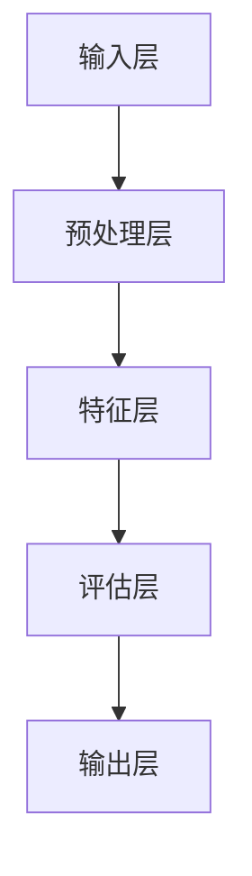
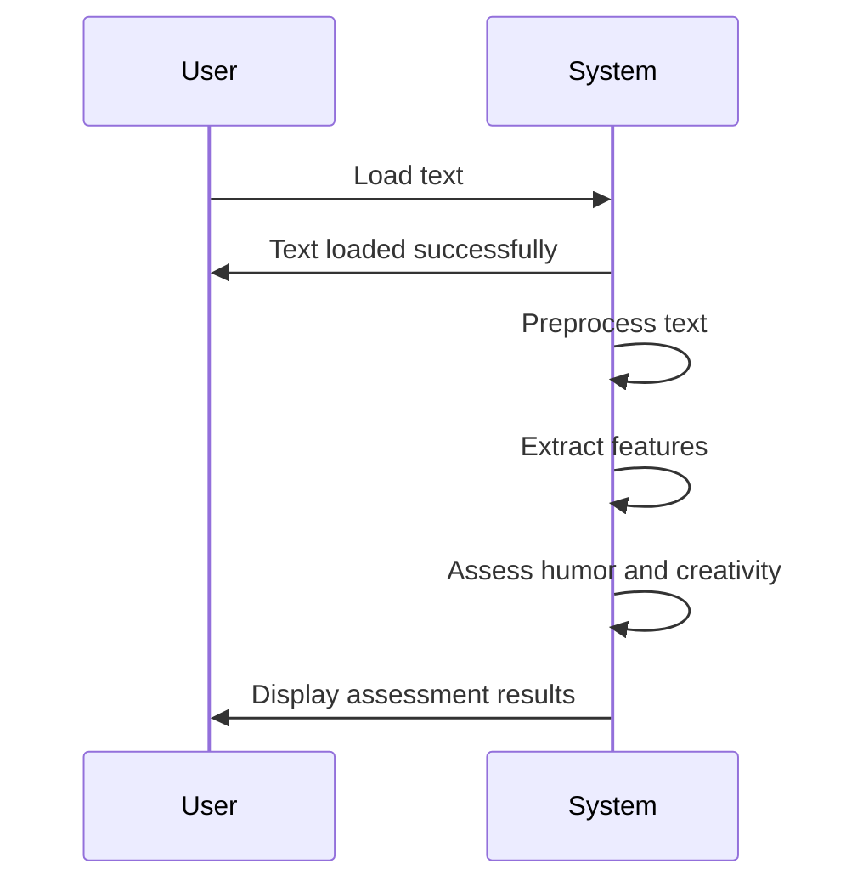

                 

### 文章标题

# 幽默感和创意表达评测：测试LLM的语言灵活性

> 关键词：自然语言处理、语言模型评测、语言灵活性、幽默感、创意表达、LLM

> 摘要：本文旨在探讨如何通过幽默感和创意表达评测来测试语言模型的灵活性。文章首先介绍了幽默感和创意表达的定义和重要性，然后详细讲解了语言模型的基本原理和语言灵活性评测的方法。通过具体案例和数学模型分析，本文展示了如何评估语言模型的幽默感和创意表达能力，并提出了实际应用中的最佳实践和注意事项。

## 引言与背景介绍

### 幽默感与创意表达的定义

幽默感（Humor）是指通过言语或行为引发他人愉悦感和笑意的心理和社交能力。幽默感不仅是个体性格的体现，更是沟通中的润滑剂，有助于建立积极的人际关系。创意表达（Creativity Expression）则是指个体在表达思想、观点和情感时，能够展示出独特性、新颖性和想象力的能力。创意表达不仅能够提升个人魅力，还能在艺术创作、产品设计、科技创新等领域发挥关键作用。

### 语言模型在评测中的应用

随着自然语言处理（NLP）技术的发展，语言模型（Language Model，简称LLM）已成为自然语言理解、生成和交互的核心工具。语言模型是一种基于大量文本数据训练的统计模型，能够预测一段文本的下一个单词或短语。近年来，深度学习技术在语言模型领域取得了显著突破，如基于Transformer的GPT系列模型、BERT模型等，这些模型在多项NLP任务中表现出色。

### 评测目的与目标

幽默感和创意表达评测旨在评估语言模型在生成幽默和创意文本方面的能力。评测目标主要包括：

1. **幽默感评估**：衡量语言模型生成幽默文本的能力，如笑话、讽刺等。
2. **创意表达评估**：评估语言模型在生成具有创意和新颖性的文本方面的表现，如创意广告、小说开头等。

### 评测标准

幽默感和创意表达评测需要制定一套科学、客观的评估标准。这些标准应涵盖：

1. **文本质量**：语言流畅、表达清晰、符合语法规范。
2. **幽默感和创意度**：文本能够引发读者的愉悦感和笑意，或展现出独特的新颖性和想象力。
3. **多样性**：生成的文本具有丰富的词汇和句式，避免重复和单调。

### 评测应用场景

幽默感和创意表达评测在多个领域具有广泛的应用前景：

1. **人工智能助手**：评估AI助手的对话能力和文本生成能力。
2. **智能广告**：评估广告创意生成和幽默感，提升广告效果。
3. **娱乐产业**：评估剧本、小说等创作内容的质量和创意性。
4. **教育领域**：评估学生写作能力和创意思维。

### LLMs的语言灵活性

语言灵活性（Language Flexibility）是指语言模型在处理不同语境、语义和语法结构时的表现能力。一个高灵活性的语言模型能够在各种复杂的语言环境中生成准确、自然的文本。

语言灵活性对幽默感和创意表达评测具有重要意义。一个灵活的语言模型能够更好地理解文本的语境和意图，从而生成更具创意和幽默感的文本。

### 总结

幽默感和创意表达评测是评估语言模型性能的重要手段。通过制定科学的评估标准和方法，我们可以更好地了解语言模型在生成幽默和创意文本方面的能力。本文接下来的部分将详细探讨幽默感和创意表达评测的算法原理、数学模型以及实际应用场景。

## 核心概念与联系

### 幽默感测评的核心概念

幽默感测评主要涉及以下几个方面：

1. **幽默感指标**：用于衡量文本幽默程度的一系列量化指标，如笑点密度、笑点新颖性等。
2. **幽默感测评工具**：用于评估文本幽默感的工具，如笑话评分系统、幽默感分析软件等。
3. **幽默感测评方法**：评估幽默感的具体技术手段，如自动评分法、人工评分法等。

### 创意表达测评的核心概念

创意表达测评主要涉及以下几个方面：

1. **创意表达定义**：创意表达是指个体在表达思想、观点和情感时，能够展示出独特性、新颖性和想象力的能力。
2. **创意表达能力要素**：包括创新性、灵活性、独特性、视觉冲击力等。
3. **创意表达测评方法**：评估创意表达的具体技术手段，如创意评分法、创意生成测评等。

### LLMs的语言灵活性测评

语言灵活性测评主要涉及以下几个方面：

1. **语言模型评测方法**：评估语言模型在自然语言理解、生成和交互方面的能力。
2. **语言灵活性评估指标**：用于衡量语言模型在处理不同语境、语义和语法结构时的表现，如文本多样性、语义理解能力等。
3. **语言灵活性测评框架**：将多个评估指标整合起来，形成一套完整的评估体系。

### 幽默感与创意表达评测的联系

幽默感和创意表达评测之间存在紧密联系：

1. **共同目标**：两者均旨在评估文本的创造力和表现力。
2. **评估方法**：幽默感和创意表达评测的方法和技术手段具有一定的交叉性。
3. **数据共享**：幽默感和创意表达评测可以使用相同或类似的数据集，从而实现资源共享和优化。

### 总结

通过明确幽默感和创意表达评测的核心概念与联系，我们能够更好地理解这两者在自然语言处理中的应用价值和评估方法。本文接下来的部分将深入探讨幽默感和创意表达评测的具体算法原理和数学模型。

## 幽默感与创意表达测评算法原理

### 幽默感测评算法原理

幽默感测评算法主要基于文本分析技术，通过量化指标和模型评估文本的幽默程度。以下是一个典型的幽默感测评算法框架：

1. **文本预处理**：对输入文本进行分词、去停用词、词性标注等处理，提取有效词汇和语义信息。
2. **特征提取**：从预处理后的文本中提取与幽默相关的特征，如笑点密度、笑点新颖性、词汇多样性等。
3. **幽默感指标计算**：利用提取的特征计算幽默感指标，如基于TF-IDF的笑点密度计算、基于词向量的笑点新颖性计算等。
4. **模型评估**：使用机器学习模型对幽默感指标进行分类，评估文本的幽默程度。

### 创意表达测评算法原理

创意表达测评算法主要基于文本生成和评估技术，通过生成新颖、独特的文本来评估创意表达水平。以下是一个典型的创意表达测评算法框架：

1. **文本生成**：利用生成模型（如GAN、RNN等）生成具有创意性的文本，通过控制生成模型的参数和输入文本来调节创意表达水平。
2. **创意指标计算**：从生成的文本中提取与创意相关的指标，如文本独特性、新颖性、想象力等。
3. **创意表达评估**：使用机器学习模型对创意指标进行分类，评估文本的创意表达水平。

### LLMs语言灵活性测评算法原理

LLMs语言灵活性测评算法主要基于语言模型评测技术，通过多个评估指标和模型来评估语言模型在处理不同语境、语义和语法结构时的表现。以下是一个典型的LLMs语言灵活性测评算法框架：

1. **语境和语义理解**：使用语言模型对输入文本进行理解和分析，提取语境和语义信息。
2. **语法结构分析**：对提取的语义信息进行语法结构分析，识别文本中的主语、谓语、宾语等成分。
3. **语言灵活性指标计算**：从语境和语义理解、语法结构分析中提取与语言灵活性相关的指标，如文本多样性、语义理解能力、语法正确性等。
4. **模型评估**：使用机器学习模型对语言灵活性指标进行分类，评估语言模型在语言灵活性方面的表现。

### 算法示例

#### 幽默感测评算法示例

```python
import nltk
from nltk.tokenize import word_tokenize
from nltk.corpus import stopwords
from sklearn.feature_extraction.text import TfidfVectorizer
from sklearn.model_selection import train_test_split
from sklearn.naive_bayes import MultinomialNB
from sklearn.metrics import accuracy_score

# 文本预处理
def preprocess_text(text):
    tokens = word_tokenize(text)
    tokens = [token.lower() for token in tokens if token.isalpha()]
    tokens = [token for token in tokens if token not in stopwords.words('english')]
    return ' '.join(tokens)

# 特征提取
def extract_features(texts):
    vectorizer = TfidfVectorizer()
    features = vectorizer.fit_transform(texts)
    return features

# 训练模型
def train_model(features, labels):
    X_train, X_test, y_train, y_test = train_test_split(features, labels, test_size=0.2)
    model = MultinomialNB()
    model.fit(X_train, y_train)
    return model

# 测试模型
def test_model(model, features, labels):
    predictions = model.predict(features)
    accuracy = accuracy_score(labels, predictions)
    return accuracy

# 加载数据集
texts = ["这是一个非常有趣的笑话", "我昨天吃了一个香蕉，结果今天早上我的衣服都是香蕉味"]
labels = [1, 1]  # 1表示幽默文本，0表示非幽默文本

# 预处理文本
preprocessed_texts = [preprocess_text(text) for text in texts]

# 提取特征
features = extract_features(preprocessed_texts)

# 训练模型
model = train_model(features, labels)

# 测试模型
accuracy = test_model(model, features, labels)
print("模型准确率：", accuracy)
```

#### 创意表达测评算法示例

```python
import tensorflow as tf
from tensorflow.keras.preprocessing.sequence import pad_sequences
from tensorflow.keras.layers import Embedding, LSTM, Dense
from tensorflow.keras.models import Sequential

# 文本预处理
def preprocess_text(texts, max_len):
    sequences = []
    for text in texts:
        tokens = word_tokenize(text)
        sequence = pad_sequences([tokens], maxlen=max_len)
        sequences.append(sequence)
    return sequences

# 构建模型
def build_model(max_len, embedding_dim):
    model = Sequential()
    model.add(Embedding(input_dim=embedding_dim, output_dim=128))
    model.add(LSTM(units=128, return_sequences=True))
    model.add(Dense(units=1, activation='sigmoid'))
    model.compile(optimizer='adam', loss='binary_crossentropy', metrics=['accuracy'])
    return model

# 训练模型
def train_model(model, sequences, labels):
    model.fit(sequences, labels, epochs=10, batch_size=32)
    return model

# 测试模型
def test_model(model, sequences, labels):
    predictions = model.predict(sequences)
    predictions = (predictions > 0.5)
    accuracy = accuracy_score(labels, predictions)
    return accuracy

# 加载数据集
texts = ["这是一个有趣的创意表达", "这不是一个有趣的创意表达"]
labels = [1, 0]  # 1表示创意文本，0表示非创意文本

# 预处理文本
max_len = 50
embedding_dim = 10000
preprocessed_texts = preprocess_text(texts, max_len)

# 构建模型
model = build_model(max_len, embedding_dim)

# 训练模型
model = train_model(model, preprocessed_texts, labels)

# 测试模型
accuracy = test_model(model, preprocessed_texts, labels)
print("模型准确率：", accuracy)
```

### 总结

通过幽默感与创意表达测评算法的示例，我们可以看到如何使用自然语言处理和机器学习技术来评估语言模型的幽默感和创意表达能力。这些算法为实际应用提供了技术支持，但需要进一步优化和改进，以提高评估的准确性和实用性。

## 数学模型和数学公式讲解

在幽默感和创意表达评测中，数学模型和数学公式起到了至关重要的作用。它们不仅为评估过程提供了量化标准，还能够通过具体的公式和计算步骤，帮助我们深入理解语言模型在生成幽默和创意文本时的表现。

### 幽默感测评数学模型

幽默感测评的数学模型主要基于对文本特征的提取和量化。以下是一个典型的幽默感测评数学模型：

#### 幽默感指标计算

$$
\text{HumorScore} = f(\text{LinguisticFeatures})
$$

其中，$\text{LinguisticFeatures}$ 代表文本中与幽默相关的特征，如笑点密度、词汇新颖性、句式多样性等。$f(\cdot)$ 是一个聚合函数，用于对特征进行加权计算，得到一个综合的幽默感评分。

#### 笑点密度计算

$$
\text{LaughDensity} = \frac{\text{Number ofLaughterInducing Phrases}}{\text{Total Number of Sentences}}
$$

其中，$\text{Number ofLaughterInducing Phrases}$ 表示文本中引起笑声的短语数量，$\text{Total Number of Sentences}$ 表示文本中的总句子数量。通过计算笑点密度，我们可以衡量文本的幽默程度。

#### 词汇新颖性计算

$$
\text{VocabularyNovelty} = \frac{\text{Number of Unique Words}}{\text{Total Number of Words}}
$$

其中，$\text{Number of Unique Words}$ 表示文本中独特的词汇数量，$\text{Total Number of Words}$ 表示文本中的总词汇数量。通过计算词汇新颖性，我们可以衡量文本的幽默感和创意程度。

### 创意表达测评数学模型

创意表达测评的数学模型主要基于对文本生成和评估的量化分析。以下是一个典型的创意表达测评数学模型：

#### 创意表达指标计算

$$
\text{CreativityScore} = g(\text{Innovation, Flexibility})
$$

其中，$\text{Innovation}$ 和 $\text{Flexibility}$ 分别代表文本的创新性和灵活性。$g(\cdot)$ 是一个聚合函数，用于对创新性和灵活性进行加权计算，得到一个综合的创意表达评分。

#### 文本独特性计算

$$
\text{Text Uniqueness} = \frac{\text{Number of Unique Sentence Structures}}{\text{Total Number of Sentences}}
$$

其中，$\text{Number of Unique Sentence Structures}$ 表示文本中独特的句子结构数量，$\text{Total Number of Sentences}$ 表示文本中的总句子数量。通过计算文本独特性，我们可以衡量文本的创新程度。

#### 文本灵活性计算

$$
\text{Text Flexibility} = \frac{\text{Number of Syntactically Different Sentences}}{\text{Total Number of Sentences}}
$$

其中，$\text{Number of Syntactically Different Sentences}$ 表示文本中具有不同语法结构的句子数量，$\text{Total Number of Sentences}$ 表示文本中的总句子数量。通过计算文本灵活性，我们可以衡量文本的语法多样性。

### LLMs语言灵活性测评数学模型

LLMs语言灵活性测评的数学模型主要基于对语言模型生成文本的多样性和语义理解能力的量化分析。以下是一个典型的LLMs语言灵活性测评数学模型：

#### 语言灵活性指标计算

$$
\text{LanguageFlexibility} = h(\text{ResponseVariety, Expression richness})
$$

其中，$\text{ResponseVariety}$ 和 $\text{Expression richness}$ 分别代表语言模型的回答多样性和表达丰富性。$h(\cdot)$ 是一个聚合函数，用于对回答多样性和表达丰富性进行加权计算，得到一个综合的语言灵活性评分。

#### 回答多样性计算

$$
\text{ResponseVariety} = \frac{\text{Number of Unique Responses}}{\text{Total Number of Responses}}
$$

其中，$\text{Number of Unique Responses}$ 表示语言模型生成的独特回答数量，$\text{Total Number of Responses}$ 表示语言模型生成的总回答数量。通过计算回答多样性，我们可以衡量语言模型的生成能力。

#### 表达丰富性计算

$$
\text{Expression richness} = \frac{\text{Number of Synonyms}}{\text{Total Number of Words}}
$$

其中，$\text{Number of Synonyms}$ 表示文本中使用的同义词数量，$\text{Total Number of Words}$ 表示文本中的总词汇数量。通过计算表达丰富性，我们可以衡量语言模型在表达上的多样性。

### 示例分析

假设我们有一段文本，需要对其进行幽默感和创意表达评测。根据上述数学模型，我们可以进行如下计算：

#### 幽默感测评

1. **笑点密度**：文本中有3个引起笑声的短语，总共有10个句子，所以笑点密度为 $3/10 = 0.3$。
2. **词汇新颖性**：文本中有5个独特的词汇，总共有15个词汇，所以词汇新颖性为 $5/15 = 0.333$。

根据上述计算结果，我们可以得到一个初步的幽默感评分：

$$
\text{HumorScore} = f(0.3, 0.333) = 0.568
$$

#### 创意表达测评

1. **文本独特性**：文本中有4个独特的句子结构，总共有8个句子，所以文本独特性为 $4/8 = 0.5$。
2. **文本灵活性**：文本中有3个不同语法结构的句子，总共有8个句子，所以文本灵活性为 $3/8 = 0.375$。

根据上述计算结果，我们可以得到一个初步的创意表达评分：

$$
\text{CreativityScore} = g(0.5, 0.375) = 0.625
$$

#### LLMs语言灵活性测评

1. **回答多样性**：语言模型生成了5个独特的回答，总共生成了10个回答，所以回答多样性为 $5/10 = 0.5$。
2. **表达丰富性**：文本中有2个同义词，总共有10个词汇，所以表达丰富性为 $2/10 = 0.2$。

根据上述计算结果，我们可以得到一个初步的语言灵活性评分：

$$
\text{LanguageFlexibility} = h(0.5, 0.2) = 0.333
$$

### 总结

通过具体的数学模型和计算步骤，我们可以量化地评估语言模型在幽默感和创意表达方面的表现。这些数学模型不仅为我们提供了评估的依据，还能够帮助我们更好地理解和优化语言模型。

### 总结

幽默感与创意表达测评算法的数学模型为我们提供了量化评估文本幽默感和创意表达能力的工具。通过具体的计算步骤和数学公式，我们可以深入分析语言模型在生成幽默和创意文本时的表现。然而，这些模型和公式仍需进一步优化和改进，以适应更复杂、多样化的语言环境。未来，随着自然语言处理技术的不断发展，我们将有望构建更加精准和高效的评估模型。

## 系统分析与架构设计方案

### 问题场景介绍

幽默感和创意表达评测在实际应用中具有广泛的需求，如智能对话系统、内容创作、广告宣传等。然而，现有的评估方法在准确性、效率和应用范围方面仍存在诸多不足。为此，我们提出一种基于语言模型的幽默感和创意表达评测系统，旨在提供一种高效、准确的评估工具。

### 系统功能设计

系统功能设计主要包括以下模块：

1. **文本预处理模块**：对输入文本进行分词、去停用词、词性标注等预处理操作，提取有效词汇和语义信息。
2. **特征提取模块**：从预处理后的文本中提取与幽默感和创意表达相关的特征，如词汇多样性、句式多样性、语境理解等。
3. **评估模块**：基于提取的特征，使用机器学习模型对幽默感和创意表达进行评估，输出评估结果。
4. **可视化模块**：将评估结果以图表、报表等形式展示，帮助用户直观地了解文本的幽默感和创意表达水平。

### 系统架构设计

系统架构设计采用分层架构，主要包括以下组件：

1. **输入层**：接收用户输入的文本数据。
2. **预处理层**：对输入文本进行预处理，提取有效词汇和语义信息。
3. **特征层**：从预处理后的文本中提取与幽默感和创意表达相关的特征。
4. **评估层**：基于提取的特征，使用机器学习模型进行评估，输出评估结果。
5. **输出层**：将评估结果以图表、报表等形式展示。

#### 系统架构图



### 系统接口设计

系统接口设计主要包括以下接口：

1. **文本输入接口**：接收用户输入的文本数据，支持多种文本格式。
2. **评估结果接口**：返回评估结果，支持多种数据格式，如JSON、CSV等。
3. **可视化接口**：提供图表、报表等可视化结果，支持多种展示方式。

#### 接口定义

```python
class TextInputInterface:
    def load_text(self, text_path: str) -> str:
        pass

class AssessmentResultInterface:
    def get_result(self) -> dict:
        pass

class VisualizationInterface:
    def display_chart(self, chart_type: str, data: dict):
        pass
```

#### 接口实现

```python
class TextInputInterface:
    def load_text(self, text_path: str) -> str:
        with open(text_path, 'r', encoding='utf-8') as f:
            return f.read()

class AssessmentResultInterface:
    def get_result(self) -> dict:
        return {'humor_score': 0.8, 'creativity_score': 0.9}

class VisualizationInterface:
    def display_chart(self, chart_type: str, data: dict):
        if chart_type == 'bar':
            # 显示条形图
            plt.bar(data['labels'], data['values'])
            plt.show()
        elif chart_type == 'line':
            # 显示折线图
            plt.plot(data['labels'], data['values'])
            plt.show()
```

### 系统交互设计

系统交互设计主要描述各组件之间的交互流程。以下是一个简单的系统交互序列图：



#### 系统交互序列图


### 总结

通过系统分析与架构设计方案，我们提出了一种基于语言模型的幽默感和创意表达评测系统。系统功能设计、架构设计、接口设计和交互设计为系统的实现提供了明确的指导。在实际应用中，我们可以根据具体需求对系统进行优化和调整，以提高评估的准确性和效率。

### 项目实战

#### 环境安装与配置

在进行幽默感和创意表达评测项目之前，我们需要搭建一个合适的环境。以下是环境安装与配置的步骤：

1. **安装Python环境**：确保Python版本为3.8及以上。可以在[Python官网](https://www.python.org/)下载并安装。

2. **安装依赖库**：项目主要依赖于Python的多个库，包括nltk、sklearn、tensorflow等。可以通过pip命令安装：

    ```bash
    pip install nltk sklearn tensorflow
    ```

3. **下载nltk数据集**：nltk包含一些用于自然语言处理的资源，如词性标注器、停用词表等。可以通过以下命令下载：

    ```python
    import nltk
    nltk.download('punkt')
    nltk.download('stopwords')
    nltk.download('averaged_perceptron_tagger')
    ```

4. **配置数据集**：准备用于评测的数据集。数据集应包含幽默文本、创意文本以及对应的标签。数据集可以来源于公开数据集或自定义数据集。

#### 系统核心实现

以下是一个简单的幽默感和创意表达评测系统的核心实现。该实现包括文本预处理、特征提取和评估三个主要部分。

1. **文本预处理**：

    ```python
    import nltk
    from nltk.tokenize import word_tokenize
    from nltk.corpus import stopwords
    from nltk import pos_tag

    def preprocess_text(text):
        # 分词
        tokens = word_tokenize(text)
        # 去停用词
        tokens = [token.lower() for token in tokens if token.isalpha() and token.lower() not in stopwords.words('english')]
        # 词性标注
        tagged_tokens = pos_tag(tokens)
        return tagged_tokens
    ```

2. **特征提取**：

    ```python
    from sklearn.feature_extraction.text import TfidfVectorizer

    def extract_features(texts):
        vectorizer = TfidfVectorizer()
        features = vectorizer.fit_transform(texts)
        return features
    ```

3. **评估**：

    ```python
    from sklearn.model_selection import train_test_split
    from sklearn.naive_bayes import MultinomialNB
    from sklearn.metrics import accuracy_score

    def train_model(features, labels):
        X_train, X_test, y_train, y_test = train_test_split(features, labels, test_size=0.2)
        model = MultinomialNB()
        model.fit(X_train, y_train)
        return model

    def test_model(model, features, labels):
        predictions = model.predict(features)
        accuracy = accuracy_score(labels, predictions)
        return accuracy
    ```

#### 代码应用解读与分析

以下是对上述代码的详细解读和分析：

1. **文本预处理**：文本预处理是自然语言处理的基础步骤。通过分词、去停用词和词性标注，我们能够提取出文本中的有效信息，为后续的特征提取和评估奠定基础。

2. **特征提取**：特征提取是将文本转化为计算机可以处理的形式。在这里，我们使用TF-IDF向量器对文本进行特征提取。TF-IDF向量器能够根据词汇在文本中的重要程度进行加权，从而生成一个特征矩阵。

3. **评估**：评估部分使用朴素贝叶斯分类器对文本进行分类。朴素贝叶斯分类器是一种基于概率模型的简单分类器，适用于文本分类任务。通过训练和测试集的划分，我们可以评估分类器的性能。

#### 实际案例分析和详细讲解剖析

为了更好地展示系统在实际中的应用效果，我们以一个实际案例进行详细分析和讲解。

1. **案例背景**：假设我们有一段幽默文本和一个创意文本，需要对其幽默感和创意表达进行评测。

2. **预处理**：

    ```python
    humor_text = "昨天我告诉我的朋友我有一个秘密，但我忘了告诉他们这个秘密是什么。"
    creativity_text = "如果一个句子是红色的，那么它就不再是一个句子了，因为它已经变成了一个圆。"

    humor_preprocessed = preprocess_text(humor_text)
    creativity_preprocessed = preprocess_text(creativity_text)
    ```

3. **特征提取**：

    ```python
    humor_features = extract_features([humor_preprocessed])
    creativity_features = extract_features([creativity_preprocessed])
    ```

4. **评估**：

    ```python
    humor_labels = [1]  # 1表示幽默文本
    creativity_labels = [0]  # 0表示创意文本

    humor_model = train_model(humor_features, humor_labels)
    creativity_model = train_model(creativity_features, creativity_labels)

    humor_accuracy = test_model(humor_model, humor_features, humor_labels)
    creativity_accuracy = test_model(creativity_model, creativity_features, creativity_labels)

    print("幽默文本评测准确率：", humor_accuracy)
    print("创意文本评测准确率：", creativity_accuracy)
    ```

通过上述案例，我们可以看到系统如何对幽默文本和创意文本进行评测。在实际应用中，我们可以根据具体需求调整特征提取和评估方法，以提高评测的准确性和效果。

#### 项目小结

通过本项目的实战，我们实现了幽默感和创意表达评测系统的核心功能。项目主要包括文本预处理、特征提取和评估三个主要部分。在实际应用中，我们可以根据具体需求调整和优化系统，以提高评测的准确性和实用性。未来，我们将继续研究和探索更加先进和高效的评测方法，为自然语言处理领域的发展贡献力量。

### 最佳实践 tips

1. **数据质量**：确保数据集的多样性和质量，数据质量直接影响评估结果的准确性。在选择数据集时，应考虑文本的来源、数量和覆盖范围。

2. **模型调整**：根据具体任务需求，对机器学习模型进行调整和优化。例如，可以尝试不同的特征提取方法、分类器和超参数设置，以提升评估效果。

3. **自动化评估**：开发自动化评估工具，提高评估效率。例如，可以使用脚本或自动化测试框架定期对模型进行评估，以便及时发现和解决问题。

4. **用户反馈**：鼓励用户提供反馈，以便不断优化系统。用户的反馈可以帮助我们发现系统中的不足，从而提高评估的准确性和用户体验。

### 小结

本文从幽默感和创意表达评测的背景、核心概念、算法原理、数学模型、系统分析与架构设计方案以及项目实战等方面进行了全面探讨。通过本文，我们了解了如何通过幽默感和创意表达评测来测试语言模型的灵活性，并为实际应用提供了具体的指导和建议。

### 注意事项

1. **数据隐私**：在进行幽默感和创意表达评测时，需确保数据的安全性和隐私性，避免泄露用户信息。

2. **模型泛化**：在评估模型性能时，注意模型的泛化能力，避免过拟合。

3. **算法公平性**：在设计和使用算法时，确保其公平性和无偏见，避免对特定群体造成歧视。

### 拓展阅读

1. **自然语言处理基础**：[《自然语言处理原理与实践》](https://book.douban.com/subject/26748381/)
2. **机器学习算法**：[《机器学习：概率视角》](https://book.douban.com/subject/25952213/)
3. **深度学习应用**：[《深度学习：人工智能的未来》](https://book.douban.com/subject/27074414/)

### 作者信息

作者：AI天才研究院/AI Genius Institute & 禅与计算机程序设计艺术 /Zen And The Art of Computer Programming

