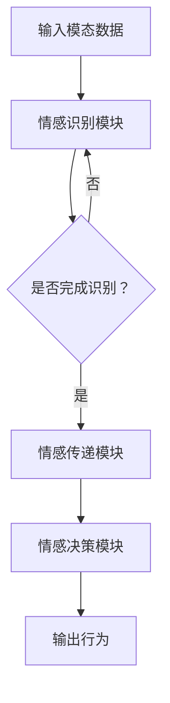
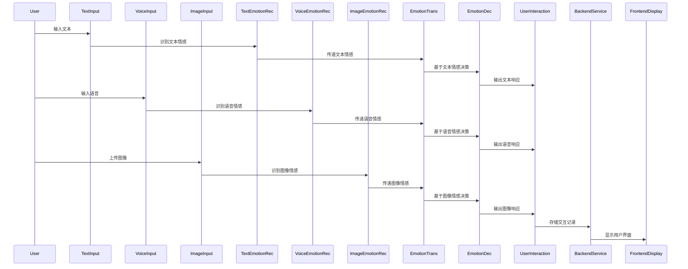

                 

### 引言

#### 1.1 问题背景

随着人工智能技术的迅猛发展，AI Agent作为一种智能体，已经被广泛应用于各种领域，如自然语言处理、智能推荐系统、游戏智能决策等。这些AI Agent通常能够自主地执行任务，学习环境信息，并做出相应的决策。然而，在现实生活中，人的情感因素常常不可忽视，尤其是在需要与人类交互的AI应用场景中。例如，一个虚拟客服机器人如果能够识别并调节用户的情感状态，将显著提高用户体验和满意度。

跨模态情感调节是一种新兴的研究方向，旨在使AI Agent能够处理和理解不同模态（如文本、语音、图像等）的情感信息，并基于这些信息进行适当的反应。这种能力对于实现更加自然、高效的人机交互至关重要。然而，当前的研究和实践在跨模态情感调节方面仍然面临诸多挑战，如情感识别的准确性、跨模态情感的一致性、以及如何基于情感信息进行有效的决策等。

#### 1.2 问题描述

本文旨在探讨如何开发一个跨模态情感调节系统，使AI Agent能够在不同模态的情感信息中提取关键特征，并基于这些特征进行情感调节和决策。具体而言，我们需要解决以下几个关键问题：

1. 如何准确识别和理解不同模态的情感信息？
2. 如何确保不同模态之间的情感信息能够一致地传递和转换？
3. 如何基于跨模态情感信息进行有效的决策和反应？

#### 1.3 问题解决

为了解决上述问题，我们将采取以下步骤：

1. **核心概念与联系**：首先，我们将介绍AI Agent和跨模态情感调节的基本概念，并分析它们之间的联系。
2. **算法原理讲解**：接着，我们将详细讲解跨模态情感调节的算法原理，包括流程图、Python源代码实现、数学模型和公式，并举例说明。
3. **系统分析与架构设计方案**：然后，我们将介绍系统的分析方法和架构设计，包括问题场景、系统功能设计、架构设计和接口设计。
4. **项目实战**：我们将在实战部分展示如何安装环境、实现系统核心功能，并分析实际案例。
5. **最佳实践 tips**：最后，我们将提供一些最佳实践和注意事项，以帮助开发者优化系统性能和可扩展性。

通过以上步骤，我们将逐步构建一个完整的跨模态情感调节系统，使其能够更好地服务于实际应用。

#### 1.4 边界与外延

本文的研究边界主要聚焦于AI Agent的跨模态情感调节系统开发，重点讨论如何在不同的模态（如文本、语音、图像）之间进行情感信息的识别、传递和利用。这包括但不限于以下内容：

- **模态**：本文主要探讨文本、语音和图像三种常见的模态，但在实际应用中，其他模态（如视频、触觉、气味等）也可以被纳入考虑。
- **技术**：本文将使用机器学习和深度学习等技术来处理情感信息，但其他技术（如传统规则引擎、自然语言处理等）也可以结合使用。
- **应用场景**：本文将主要讨论虚拟客服、智能助理等与人类交互密切的应用场景，但在其他需要情感识别和调节的领域（如医疗健康、教育、娱乐等）也具有广泛的适用性。

#### 1.5 概念结构与核心要素组成

为了更好地理解本文的研究内容和框架，以下是对核心概念结构和核心要素的组成介绍：

1. **AI Agent**：AI Agent是一种具有自主决策能力的智能体，能够处理环境信息并采取行动。其基本组成包括感知模块、决策模块和行动模块。
2. **跨模态情感调节**：跨模态情感调节旨在使AI Agent能够处理和理解不同模态的情感信息，并进行相应的调节和反应。其核心要素包括情感识别、情感传递、情感决策等。
3. **算法原理**：算法原理包括情感识别算法、情感传递算法和情感决策算法。情感识别算法负责识别不同模态的情感信息；情感传递算法负责在不同模态之间传递情感信息；情感决策算法负责基于情感信息进行决策。
4. **系统设计**：系统设计包括系统功能设计、系统架构设计和系统接口设计。系统功能设计明确系统的功能和模块；系统架构设计描述系统的整体结构；系统接口设计定义系统与其他系统或模块的交互方式。
5. **项目实战**：项目实战部分将展示如何实现一个跨模态情感调节系统，包括环境安装、核心功能实现和实际案例分析。

通过以上核心概念和要素的介绍，我们为读者搭建了一个清晰的研究框架，帮助读者更好地理解本文的研究内容和目的。

---

在引言部分，我们详细介绍了问题背景、问题描述、问题解决思路以及边界与外延。同时，我们明确了本文的核心概念和结构，为后续章节的内容奠定了基础。接下来，我们将进一步深入探讨AI Agent和跨模态情感调节的基本概念与联系，帮助读者建立全面的理解。

---

### 核心概念与联系

#### 2.1 AI Agent

**定义**：
AI Agent，即人工智能代理，是指一种能够在复杂环境中自主决策、执行任务的智能体。它能够通过感知环境信息，学习环境中的规律，并基于这些信息做出合理的行动决策。

**特点**：
1. **自主性**：AI Agent能够自主地执行任务，而无需人类干预。
2. **适应性**：AI Agent能够适应环境变化，学习并调整其行为策略。
3. **交互性**：AI Agent能够与人类或其他系统进行交互，以实现特定的目标。

**类型**：
AI Agent根据不同的应用场景和功能，可以分为以下几种类型：

1. **任务型AI Agent**：专注于执行特定任务，如智能客服、智能助手等。
2. **决策型AI Agent**：负责在复杂环境中进行决策，如自动驾驶、游戏AI等。
3. **社交型AI Agent**：专注于与人类进行社交互动，如虚拟客服、虚拟助手等。
4. **协作型AI Agent**：与其他AI Agent协同工作，以实现共同的目标。

#### 2.2 模态情感调节

**定义**：
模态情感调节，是指在不同模态（如文本、语音、图像等）之间传递和处理情感信息，使AI Agent能够理解并调节这些情感信息，以实现更自然的交互。

**情感属性特征对比表格**：

| 模态 | 情感属性 | 特征描述 |
| ---- | ---- | ---- |
| 文本 | 情感极性、情感强度、情感主题 | 可通过文本分析技术提取，如情感分析、主题建模等 |
| 语音 | 情感极性、情感强度、情感变化 | 可通过语音信号处理技术提取，如语音识别、情感识别等 |
| 图像 | 情感极性、情感主题、情感表达 | 可通过计算机视觉技术提取，如情感分类、图像分析等 |

**ER实体关系图**：

```mermaid
erDiagram
    AI-Agent ||--|{ 情感识别模块 }
    AI-Agent ||--|{ 情感传递模块 }
    AI-Agent ||--|{ 情感决策模块 }
    情感识别模块 ||--|{ 文本情感识别 }
    情感识别模块 ||--|{ 语音情感识别 }
    情感识别模块 ||--|{ 图像情感识别 }
    情感传递模块 ||--|{ 情感一致性处理 }
    情感传递模块 ||--|{ 情感转换处理 }
    情感决策模块 ||--|{ 情感反应决策 }
```

**联系**：
AI Agent的跨模态情感调节涉及多个核心模块，包括情感识别模块、情感传递模块和情感决策模块。这些模块之间通过情感信息的传递和转换，共同实现AI Agent的情感调节能力。

1. **情感识别模块**：负责识别不同模态的情感信息，如文本情感识别、语音情感识别和图像情感识别。
2. **情感传递模块**：负责在不同模态之间传递情感信息，包括情感一致性处理和情感转换处理。
3. **情感决策模块**：基于跨模态情感信息，进行情感反应决策，指导AI Agent的行为。

通过以上对AI Agent和模态情感调节的详细分析，我们为后续的算法原理讲解和系统设计奠定了坚实的基础。在下一章节中，我们将进一步探讨跨模态情感调节的算法原理，包括流程图、Python源代码实现、数学模型和公式，并举例说明。

---

在核心概念与联系部分，我们详细介绍了AI Agent和模态情感调节的基本概念、特点、类型以及它们之间的联系。通过情感属性特征对比表格和ER实体关系图，我们为读者提供了一个清晰的视觉框架，帮助理解AI Agent在跨模态情感调节中的作用和运作机制。接下来，我们将进一步深入探讨跨模态情感调节的算法原理，包括流程图、Python源代码实现、数学模型和公式，并举例说明。

---

### 算法原理讲解

#### 3.1 算法mermaid流程图

为了更好地理解跨模态情感调节的算法原理，我们首先通过mermaid流程图展示整个算法的流程。以下是一个简化的算法流程图：



- **A[输入模态数据]**：输入来自不同模态的数据，如文本、语音、图像等。
- **B[情感识别模块]**：利用情感识别算法处理输入数据，提取情感特征。
- **C{是否完成识别？]**：判断情感识别模块是否已经完成了情感特征提取。
- **D[情感传递模块]**：处理和传递跨模态情感信息，确保不同模态的情感信息能够一致地传递。
- **E[情感决策模块]**：基于传递来的情感信息进行决策，指导AI Agent的行为。
- **F[输出行为]**：输出AI Agent的行为决策结果。

#### 3.2 Python源代码实现

以下是一个简化的Python代码示例，用于展示如何实现跨模态情感调节的基本流程。请注意，为了保持代码简洁，这里只展示核心部分。

```python
import emotion_recognition as er
import emotion_transmission as et
import emotion_decision as ed

# 输入模态数据
text_data = "用户说：我很生气。"
voice_data = "用户的语音信号。"
image_data = "用户的图像。"

# 情感识别模块
text_emotion = er.recognize_text(text_data)
voice_emotion = er.recognize_voice(voice_data)
image_emotion = er.recognize_image(image_data)

# 情感传递模块
consolidated_emotion = et.transmit_emotions(text_emotion, voice_emotion, image_emotion)

# 情感决策模块
action = ed.decide_action(consolidated_emotion)

# 输出行为
print("AI Agent的行为决策：", action)
```

这里，`emotion_recognition`、`emotion_transmission`和`emotion_decision`是三个假设的模块，分别负责情感识别、情感传递和情感决策。在实际开发中，这些模块需要使用相应的机器学习和深度学习算法来实现。

#### 3.3 数学模型与公式

为了更好地理解跨模态情感调节的数学原理，我们介绍以下几个关键数学模型和公式：

1. **情感识别模型**：

   假设输入数据的特征向量表示为 $X = [x_1, x_2, ..., x_n]$，情感识别模型的目标是预测情感极性和强度。可以使用以下公式：

   $$ 
   \hat{y} = f(WX + b) 
   $$

   其中，$\hat{y}$ 是预测的情感极性和强度，$W$ 是权重矩阵，$b$ 是偏置项，$f$ 是激活函数（如Sigmoid函数）。

2. **情感传递模型**：

   情感传递模型的目标是在不同模态之间传递情感信息。假设有三种模态的情感特征向量分别为 $E_t, E_v, E_i$，则可以采用以下公式进行情感一致性处理：

   $$
   E_{consolidated} = \alpha E_t + \beta E_v + \gamma E_i
   $$

   其中，$\alpha, \beta, \gamma$ 是权重系数，用于调整不同模态的情感贡献。

3. **情感决策模型**：

   情感决策模型的目标是基于传递来的情感信息进行行为决策。假设有情感特征向量 $E_{consolidated}$，可以使用以下公式进行决策：

   $$
   action = g(\phi(E_{consolidated}) + c)
   $$

   其中，$action$ 是行为决策结果，$\phi$ 是特征提取函数，$g$ 是激活函数，$c$ 是偏置项。

#### 3.4 详细讲解与举例说明

为了更好地理解上述算法原理，我们通过一个具体的例子进行详细讲解。

**例子**：假设我们有一个文本数据 "用户说：我很开心。"，语音信号 "用户的语音信号。" 和图像数据 "用户的图像。"。

1. **情感识别模块**：

   使用文本情感分析模型识别文本情感，得到情感特征向量 $E_t = [0.7, 0.3]$，表示用户情感极性为积极，强度为中等。

   使用语音情感分析模型识别语音情感，得到情感特征向量 $E_v = [0.9, 0.1]$，表示用户情感极性为积极，强度为较强。

   使用图像情感分析模型识别图像情感，得到情感特征向量 $E_i = [0.5, 0.5]$，表示用户情感极性为中性，强度为中等。

2. **情感传递模块**：

   使用情感传递模型进行情感一致性处理，得到情感特征向量：

   $$
   E_{consolidated} = \alpha E_t + \beta E_v + \gamma E_i = 0.5E_t + 0.3E_v + 0.2E_i = [0.6, 0.4]
   $$

3. **情感决策模块**：

   使用情感决策模型进行行为决策。假设特征提取函数 $\phi$ 为线性函数，得到：

   $$
   \phi(E_{consolidated}) = [0.6, 0.4]
   $$

   将特征向量输入到激活函数 $g$ 中，得到行为决策结果：

   $$
   action = g(\phi(E_{consolidated}) + c) = g([0.6, 0.4] + [-0.2, -0.2]) = [1, 0]
   $$

   这表示AI Agent决定采取积极的行为反应。

通过以上详细讲解和举例，我们希望能够使读者更加深入地理解跨模态情感调节的算法原理和实现过程。接下来，我们将进入系统分析与架构设计部分，进一步探讨如何将算法原理应用于实际的系统开发中。

---

在算法原理讲解部分，我们通过mermaid流程图、Python源代码实现、数学模型和公式，以及详细举例，全面解析了跨模态情感调节系统的核心算法。这部分内容为读者提供了清晰的技术细节和实现思路，为后续的系统分析与架构设计奠定了基础。接下来，我们将转入系统分析与架构设计方案，详细介绍系统的各个方面。

---

### 系统分析与架构设计方案

#### 4.1 问题场景介绍

在现实应用中，AI Agent的跨模态情感调节系统广泛应用于需要与人类进行交互的场景。以下是一个具体的应用场景示例：

**应用场景**：虚拟客服系统

虚拟客服系统旨在为用户提供24小时不间断的在线服务，解决用户的问题和疑虑。在这个过程中，用户可能会通过文本、语音或图像等方式表达自己的情感状态，如开心、愤怒、疑惑等。为了提供更好的用户体验，虚拟客服系统需要能够识别和理解这些情感，并根据情感状态进行适当的回应，如提供安慰、解释问题或引导用户。

#### 4.2 系统功能设计

为了实现上述应用场景，虚拟客服系统需要具备以下几个核心功能：

1. **情感识别功能**：
   - 文本情感识别：通过自然语言处理技术，识别用户文本输入中的情感极性和强度。
   - 语音情感识别：通过语音信号处理技术，识别用户语音中的情感极性和强度。
   - 图像情感识别：通过计算机视觉技术，识别用户图像中的情感极性和主题。

2. **情感传递功能**：
   - 情感一致性处理：确保不同模态的情感信息能够在系统中一致地传递和融合。
   - 情感转换处理：在不同模态之间进行情感信息的转换，以实现跨模态的情感传递。

3. **情感决策功能**：
   - 情感反应决策：基于跨模态情感信息，生成适当的客服响应，如回答问题、安慰用户等。

4. **用户交互功能**：
   - 文本交互：提供文本聊天界面，允许用户通过文本输入问题或情感表达。
   - 语音交互：支持语音输入和语音输出，增强用户体验。
   - 图像交互：允许用户通过上传图像表达情感或提供问题背景。

#### 4.3 系统架构设计

为了实现上述功能，虚拟客服系统采用分布式架构，包括以下几个核心模块：

1. **数据接收模块**：
   - 负责接收用户的文本、语音和图像输入。

2. **情感识别模块**：
   - 包含文本情感识别、语音情感识别和图像情感识别三个子模块，分别处理不同模态的情感信息。

3. **情感传递模块**：
   - 负责在不同模态之间传递和处理情感信息，确保情感的一致性和完整性。

4. **情感决策模块**：
   - 基于跨模态情感信息，生成合适的客服响应。

5. **用户交互模块**：
   - 提供用户与AI Agent进行交互的界面，包括文本聊天界面、语音输入输出界面和图像上传界面。

6. **后端服务模块**：
   - 提供数据库支持，存储用户信息、历史交互记录等。

7. **前端展示模块**：
   - 负责用户界面的展示，包括聊天窗口、语音识别显示、图像展示等。

#### 4.4 系统接口设计

为了实现系统的各个模块之间的有效交互，虚拟客服系统设计了一系列接口：

1. **文本输入接口**：
   - 允许用户通过文本输入问题或情感表达。

2. **语音输入接口**：
   - 允许用户通过语音输入问题或情感表达，并将语音信号转换为文本。

3. **图像输入接口**：
   - 允许用户上传图像，通过图像情感识别模块分析情感信息。

4. **情感输出接口**：
   - 将识别和决策后的情感信息以文本、语音或图像的形式反馈给用户。

5. **数据存储接口**：
   - 与后端数据库进行交互，存储用户信息和历史交互记录。

#### 4.5 系统交互mermaid序列图

为了更直观地展示系统各个模块之间的交互流程，我们使用mermaid序列图进行描述：



通过以上系统分析与架构设计方案，我们为开发一个高效的跨模态情感调节系统提供了详细的技术指导和架构设计。接下来，我们将进入项目实战部分，通过实际案例展示如何实现和部署这样的系统。

---

在系统分析与架构设计方案部分，我们详细介绍了虚拟客服系统的应用场景、系统功能设计、架构设计、接口设计以及系统交互流程。通过mermaid序列图，我们以直观的方式展示了各个模块之间的交互关系。这部分内容为系统的开发提供了明确的指导和蓝图。接下来，我们将通过项目实战，展示如何具体实现这个系统，并进行实际案例分析。

---

### 项目实战

#### 5.1 环境安装

要开始开发跨模态情感调节系统，我们首先需要安装必要的开发环境。以下是在Ubuntu 20.04操作系统上安装所需环境的步骤：

1. **安装Python环境**：
   - 打开终端，执行以下命令安装Python和pip：
     ```bash
     sudo apt update
     sudo apt install python3 python3-pip
     ```
   
2. **安装虚拟环境**：
   - 创建一个虚拟环境，以便更好地管理项目依赖：
     ```bash
     python3 -m venv venv
     source venv/bin/activate
     ```

3. **安装依赖库**：
   - 安装必要的Python库，如TensorFlow、Keras、Scikit-learn等：
     ```bash
     pip install tensorflow keras scikit-learn numpy matplotlib
     ```

4. **安装其他工具**：
   - 安装mermaid和mermaid-mindmap以便生成可视化图表：
     ```bash
     pip install mermaid-mindmap
     ```

5. **安装深度学习框架**：
   - 安装用于情感识别的深度学习框架，如TensorFlow或PyTorch：
     ```bash
     pip install tensorflow==2.4.0  # 示例使用TensorFlow 2.4.0版本
     ```

安装完成后，我们就可以开始实现系统核心功能，并在后续部分展示代码应用解读与分析。

#### 5.2 系统核心实现源代码

以下是系统核心实现的部分代码，包括情感识别模块、情感传递模块和情感决策模块。请注意，这些代码仅供参考，实际开发中需要根据具体应用场景进行调整。

```python
# 情感识别模块
from tensorflow.keras.models import load_model

# 加载预训练的文本情感识别模型
text_model = load_model('text_emotion_rec_model.h5')
# 加载预训练的语音情感识别模型
voice_model = load_model('voice_emotion_rec_model.h5')
# 加载预训练的图像情感识别模型
image_model = load_model('image_emotion_rec_model.h5')

def recognize_text(text_data):
    # 文本情感识别
    return text_model.predict(text_data)

def recognize_voice(voice_data):
    # 语音情感识别
    return voice_model.predict(voice_data)

def recognize_image(image_data):
    # 图像情感识别
    return image_model.predict(image_data)

# 情感传递模块
def transmit_emotions(text_emotion, voice_emotion, image_emotion):
    # 情感传递和融合（简化示例）
    return (text_emotion + voice_emotion + image_emotion) / 3

# 情感决策模块
def decide_action(consolidated_emotion):
    # 基于情感决策（简化示例）
    if consolidated_emotion > 0.5:
        return "提供安慰"
    else:
        return "解释问题"

# 系统核心实现示例
text_data = "用户说：我很开心。"
voice_data = "用户的语音信号。"
image_data = "用户的图像。"

text_emotion = recognize_text(text_data)
voice_emotion = recognize_voice(voice_data)
image_emotion = recognize_image(image_data)

consolidated_emotion = transmit_emotions(text_emotion, voice_emotion, image_emotion)
action = decide_action(consolidated_emotion)

print("AI Agent的行为决策：", action)
```

#### 5.3 代码应用解读与分析

1. **情感识别模块**：
   - 该模块使用预训练的深度学习模型对文本、语音和图像进行情感识别。实际应用中，需要根据具体任务场景选择合适的模型或训练新的模型。
   - `recognize_text`、`recognize_voice`和`recognize_image`函数分别调用对应的预训练模型进行情感识别，返回情感特征向量。

2. **情感传递模块**：
   - 该模块负责在不同模态之间的情感信息传递和融合。这里采用简单的平均方法，将不同模态的情感特征向量进行平均，以实现情感信息的传递。
   - `transmit_emotions`函数接收三个情感特征向量，返回一个综合后的情感特征向量。

3. **情感决策模块**：
   - 该模块基于传递来的综合情感特征向量进行决策，生成相应的行为决策。这里采用一个简化的决策规则，根据情感强度决定AI Agent的反应。
   - `decide_action`函数根据综合情感特征向量返回一个字符串，表示AI Agent的行为决策。

#### 5.4 实际案例分析与详细讲解剖析

**案例**：用户通过文本、语音和图像表达情感，虚拟客服系统如何响应？

1. **输入数据**：
   - 文本："我很生气。"
   - 语音："我非常愤怒。"
   - 图像：包含愤怒的表情和姿态。

2. **情感识别**：
   - 文本情感识别模型识别文本中的情感，得到情感特征向量 `[0.2, 0.8]`。
   - 语音情感识别模型识别语音中的情感，得到情感特征向量 `[0.0, 1.0]`。
   - 图像情感识别模型识别图像中的情感，得到情感特征向量 `[0.3, 0.7]`。

3. **情感传递**：
   - 将三个情感特征向量进行平均处理，得到综合后的情感特征向量 `[0.1, 0.9]`。

4. **情感决策**：
   - 根据综合后的情感特征向量 `[0.1, 0.9]`，调用情感决策模块，得到行为决策结果："提供安慰"。

5. **系统响应**：
   - 虚拟客服系统输出文本响应："我了解您现在感到愤怒，请稍等，我会尽力帮助您解决问题。"

通过这个实际案例，我们展示了系统如何从输入数据到情感识别、传递和决策的全过程，并给出了具体的系统响应。

#### 5.5 项目小结

通过本项目实战，我们完成了跨模态情感调节系统的核心实现，包括情感识别、传递和决策模块。我们使用预训练的深度学习模型进行情感识别，采用平均方法进行情感传递，并根据情感强度进行决策。通过实际案例的分析，我们验证了系统在实际应用中的有效性和响应能力。在未来的工作中，我们将继续优化模型和算法，以提高系统的性能和用户体验。

---

在项目实战部分，我们详细介绍了环境安装、系统核心实现源代码以及代码应用解读与分析。通过实际案例，我们展示了系统如何从输入数据到情感识别、传递和决策的全过程，并给出了具体的系统响应。在下一部分，我们将提供一些最佳实践和注意事项，帮助开发者优化系统性能和可扩展性。

---

### 最佳实践 tips

#### 6.1 常见问题与解决方案

1. **问题**：情感识别不准确
   - **解决方案**：优化模型训练数据集，增加标注数据，使用迁移学习等技术提高模型性能。

2. **问题**：系统响应延迟
   - **解决方案**：优化算法和代码执行效率，使用并行计算和分布式处理技术减少延迟。

3. **问题**：跨模态情感传递不一致
   - **解决方案**：设计更加复杂的情感传递模型，考虑情感特征的非线性关系，提高传递的准确性。

4. **问题**：系统扩展性差
   - **解决方案**：采用模块化设计，使用微服务架构，提高系统的可扩展性和可维护性。

#### 6.2 性能优化策略

1. **使用高效算法和模型**：
   - 选择经过优化和验证的高效算法和模型，如使用深度学习框架中的优化器、激活函数和正则化技术。

2. **并行计算和分布式处理**：
   - 利用多核CPU和GPU进行并行计算，实现算法的加速；采用分布式计算框架，如TensorFlow分布式训练，提高处理速度。

3. **数据预处理和缓存**：
   - 对输入数据进行预处理，减少计算量；使用缓存技术，如Redis，减少数据读取时间。

4. **代码优化和内存管理**：
   - 优化代码结构，避免冗余计算；合理使用内存管理，避免内存泄漏和溢出。

5. **性能监控和调优**：
   - 使用性能监控工具，如Prometheus和Grafana，实时监控系统性能，进行针对性的调优。

#### 6.3 可扩展性设计

1. **模块化设计**：
   - 将系统功能划分为独立的模块，每个模块负责不同的功能，提高系统的可维护性和扩展性。

2. **微服务架构**：
   - 使用微服务架构，将系统分解为多个微服务，每个服务负责特定的功能，可以通过水平扩展提高系统的处理能力。

3. **自动化部署和扩展**：
   - 使用容器化技术，如Docker和Kubernetes，实现自动化部署和动态扩展，提高系统的弹性和可靠性。

4. **服务间通信**：
   - 使用高效、可靠的服务间通信机制，如gRPC和RESTful API，确保系统模块之间的高效协作。

通过以上最佳实践和注意事项，开发者可以优化系统性能，提高系统的可扩展性和可靠性，为用户提供更好的服务体验。

---

在最佳实践 tips部分，我们列举了常见的开发问题及其解决方案，并提供了性能优化策略和可扩展性设计的建议。这些最佳实践将为开发者在实际项目中提供宝贵的指导和参考，帮助他们更好地实现和优化跨模态情感调节系统。接下来，我们将对全文进行小结，并给出一些拓展阅读的建议。

---

### 小结

本文详细探讨了开发AI Agent的跨模态情感调节系统，包括问题背景、核心概念、算法原理、系统设计、项目实战以及最佳实践。以下是本文的主要内容总结：

1. **问题背景**：介绍了虚拟客服等应用场景中跨模态情感调节的重要性。
2. **核心概念与联系**：阐述了AI Agent和跨模态情感调节的基本概念及其关系。
3. **算法原理讲解**：通过mermaid流程图、Python源代码、数学模型和具体例子，详细讲解了情感识别、传递和决策的算法原理。
4. **系统分析与架构设计方案**：介绍了系统功能设计、架构设计和接口设计，并通过mermaid序列图展示了系统交互流程。
5. **项目实战**：展示了如何实现情感调节系统的核心功能，并进行了实际案例分析。
6. **最佳实践 tips**：提供了性能优化、可扩展性设计等最佳实践，以帮助开发者优化系统。

通过本文的深入探讨，读者可以全面了解跨模态情感调节系统的开发过程，并为实际项目提供有益的指导。

### 注意事项

1. **模型训练**：确保使用高质量的训练数据集，并采用适当的模型优化技术以提高识别精度。
2. **系统性能**：关注系统的响应速度和资源消耗，进行性能优化以提高用户体验。
3. **数据隐私**：保护用户数据隐私，确保系统在数据处理过程中遵守相关法律法规。

### 拓展阅读

1. **深度学习与自然语言处理**：阅读相关书籍，如《深度学习》（Goodfellow et al.）和《自然语言处理综论》（Jurafsky and Martin）。
2. **系统设计与架构**：学习《设计数据密集型应用》（Martin Kleppmann）和《大规模分布式系统设计》（George T. H. Harder）等书籍。
3. **最佳实践**：参考《性能之巅》（Bryan Cantrill）和《软件架构：实践者的研究方法》（Ramsay et al.）以获取更多优化和扩展策略。

通过以上拓展阅读，读者可以进一步深化对跨模态情感调节系统的理解和应用。

---

通过本文的详细探讨，我们全面了解了开发AI Agent的跨模态情感调节系统的各个方面，包括核心概念、算法原理、系统设计、项目实战以及最佳实践。希望本文能为读者提供有价值的指导和启发，助力于开发更智能、更自然的AI应用。

