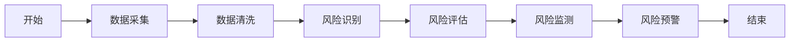
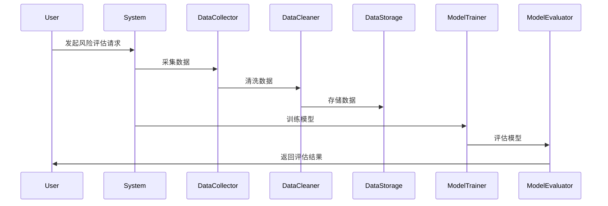
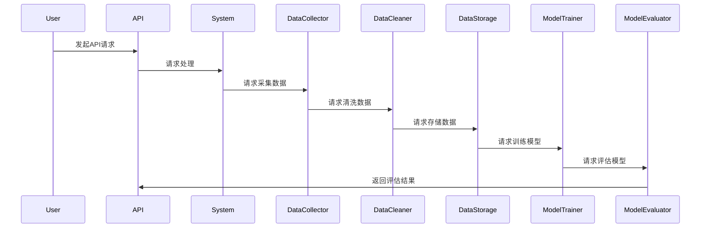
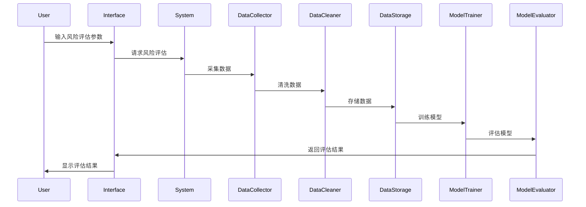

                 


### 让我们一步一步思考：开发智能化的金融产品生命周期风险动态评估平台

#### 摘要

本文将详细介绍开发一个智能化的金融产品生命周期风险动态评估平台的整个流程。我们将首先探讨金融产品生命周期的概念及其在风险管理中的重要性，接着介绍风险动态评估的核心概念和方法。随后，我们将深入探讨智能化金融产品的特点，以及它们在风险评估中的应用。文章还将展示如何设计并实现这样一个平台，涵盖技术基础、系统架构、实现细节、实战应用等方面。最后，我们将总结最佳实践，展望未来发展趋势。

---

### 引言

在金融行业，产品的成功往往取决于其生命周期的管理和风险的控制。金融产品的生命周期从启动、成长、成熟到衰退，每个阶段都面临着不同的风险。如何动态地评估和管理这些风险，对于金融机构的稳健运营至关重要。传统的风险管理方法往往依赖于人工分析，既耗时又容易出错。随着人工智能和大数据技术的发展，智能化风险动态评估平台成为可能，它不仅提高了效率，还大大提升了评估的精准度和全面性。

本文的目标是探讨如何开发一个智能化的金融产品生命周期风险动态评估平台。我们将通过以下步骤来逐步分析和实现这一目标：

1. **背景与核心概念**：介绍金融产品生命周期的概念、风险管理的重要性以及智能化风险动态评估的意义。
2. **技术基础与平台设计**：讨论数据处理技术、机器学习技术、数据可视化技术，以及系统架构和接口设计。
3. **实现细节与实战应用**：展示平台的具体实现过程，包括环境配置、数据处理流程、核心模块代码解读和实际案例分析。
4. **最佳实践与展望**：总结最佳实践，讨论平台的发展趋势和未来研究方向。

---

### 第一部分：背景与核心概念

#### 1.1 问题背景

金融产品的生命周期是指产品从诞生到退市的整个过程。它通常被分为四个阶段：启动阶段、成长阶段、成熟阶段和衰退阶段。每个阶段都有其特定的市场环境和风险特征。

- **启动阶段**：这是产品的初始阶段，产品刚刚面市，市场对其了解有限。此阶段的风险主要来自于市场接受度、竞争状况和资源投入等。
- **成长阶段**：产品在这个阶段开始受到市场的认可，销售额和市场份额逐步增加。此阶段的风险主要集中在市场需求变化、竞争对手的挑战和内部运营的稳定性上。
- **成熟阶段**：产品在这个阶段已经稳定，市场份额达到顶峰。此阶段的风险主要体现在市场饱和、产品创新不足和客户忠诚度下降等。
- **衰退阶段**：随着市场需求的减少，产品逐渐走向衰退。此阶段的风险包括产品过时、市场份额丧失和资产贬值等。

风险管理在金融产品的生命周期管理中起着至关重要的作用。有效的风险管理可以帮助金融机构识别潜在风险、评估风险影响并采取相应措施。传统的风险管理方法主要依赖于专家经验和历史数据，而智能化风险动态评估平台可以通过大数据分析和机器学习技术实现更加精准和实时的风险评估。

#### 1.2 核心概念

**金融产品生命周期**

金融产品生命周期是指产品从开发、上市、销售、维护到退市的全过程。它不仅涉及产品的物理形态，还包括其市场表现、用户反馈、技术更新等多个方面。以下是金融产品生命周期的ER实体关系图：

```mermaid
erDiagram
    Product ||--|{ Stage }|
    Stage ||--|{ Risk }|
```

- **Product（产品）**：产品是金融产品生命周期的核心实体，包括产品名称、类型、功能、市场定位等属性。
- **Stage（阶段）**：阶段是产品生命周期中的关键节点，包括启动、成长、成熟和衰退等状态。
- **Risk（风险）**：风险是产品在不同阶段面临的潜在威胁，包括市场风险、运营风险、信用风险等。

**风险动态评估**

风险动态评估是指通过实时监测、分析数据，动态地评估和预测金融产品生命周期中的风险。其核心包括以下几个方面：

- **风险识别**：通过数据分析识别产品在不同阶段面临的风险因素。
- **风险评估**：利用历史数据和机器学习算法对风险进行量化评估。
- **风险监测**：实时监测风险指标，发现潜在的风险变化。
- **风险预警**：在风险达到一定程度时，发出预警并采取相应的风险控制措施。

以下是风险动态评估的Mermaid流程图：



#### 1.3 智能化金融产品的特点

智能化金融产品具有以下几个特点：

- **自适应**：能够根据市场变化和用户需求自动调整策略。
- **数据驱动**：基于大数据分析和机器学习算法进行决策。
- **交互性**：用户可以实时与系统交互，获取定制化的风险评估结果。
- **预测性**：能够预测金融产品未来可能面临的风险。

这些特点使得智能化金融产品在风险管理方面具有显著的优势。

#### 1.4 智能化风险动态评估平台的优势

智能化风险动态评估平台具有以下优势：

- **提高效率**：通过自动化和智能化手段，大幅提高风险评估的效率。
- **精准度提升**：利用大数据分析和机器学习算法，提升风险评估的精准度。
- **降低成本**：减少人工干预，降低风险评估的成本。
- **动态调整**：能够根据实时数据动态调整风险控制策略。

---

在接下来的部分，我们将进一步探讨平台的技术基础和系统设计，以及实现细节和实战应用。

---

### 第二部分：技术基础与平台设计

#### 2.1 技术基础

开发一个智能化的金融产品生命周期风险动态评估平台，需要掌握一系列技术基础。这些技术基础涵盖了数据处理、机器学习和数据可视化等领域。

**数据处理技术**

数据处理技术是平台的核心之一。它包括数据采集、数据清洗和数据存储等步骤。

- **数据采集**：数据采集是获取金融产品生命周期相关的各类数据，包括市场数据、用户行为数据、财务数据等。数据来源可能包括内部数据库、外部API、社交媒体等。
- **数据清洗**：数据清洗是确保数据质量的过程。它包括去除重复数据、处理缺失值、纠正错误数据等。数据清洗的目的是为后续的分析提供准确和完整的数据。
- **数据存储**：数据存储是存储和管理采集到的数据。常见的数据存储方式包括关系型数据库、NoSQL数据库和分布式文件系统等。选择合适的数据存储方式，可以优化数据的访问速度和存储效率。

**机器学习技术**

机器学习技术是智能化风险动态评估平台的关键。它包括算法选择、模型训练和模型评估等步骤。

- **算法选择**：根据风险评估的需求，选择合适的机器学习算法。常见的算法包括线性回归、决策树、随机森林、支持向量机、神经网络等。
- **模型训练**：使用历史数据对选定的算法进行训练，使其能够识别和预测金融产品生命周期中的风险。
- **模型评估**：通过交叉验证、A/B测试等方法，评估模型的性能和准确性。模型评估的目的是确保模型能够准确地预测未来的风险。

**数据可视化技术**

数据可视化技术是帮助用户理解和分析风险动态评估结果的重要工具。它包括可视化工具介绍、可视化效果与应用等步骤。

- **可视化工具介绍**：常用的数据可视化工具包括D3.js、ECharts、Matplotlib等。选择合适的可视化工具，可以根据需求生成各种类型的图表和图形。
- **可视化效果与应用**：通过数据可视化，将复杂的数据和评估结果以直观的方式呈现给用户。例如，可以用折线图展示风险指标的变化趋势，用柱状图对比不同阶段的风险水平等。

**系统架构设计**

系统架构设计是平台设计的关键，它决定了平台的可扩展性、稳定性和性能。以下是系统架构的Mermaid架构图：



- **用户**：用户是平台的最终使用者，可以是金融机构的员工、客户等。
- **系统**：系统是平台的主体，负责处理用户的请求，协调各个模块的运行。
- **DataCollector（数据采集模块）**：负责采集金融产品生命周期相关的数据。
- **DataCleaner（数据清洗模块）**：负责清洗采集到的数据，确保数据质量。
- **DataStorage（数据存储模块）**：负责存储和管理清洗后的数据。
- **ModelTrainer（模型训练模块）**：负责使用机器学习算法训练模型。
- **ModelEvaluator（模型评估模块）**：负责评估模型的性能和准确性。

**系统接口设计**

系统接口设计是确保平台可扩展性和模块化的重要环节。以下是系统接口的Mermaid序列图：



- **API**：API是平台的对外接口，负责接收用户的请求并转发给系统。
- **System**：系统负责处理API的请求，并协调各个模块的运行。
- **DataCollector**、**DataCleaner**、**DataStorage**、**ModelTrainer** 和 **ModelEvaluator**：这些模块分别负责数据处理、模型训练和评估等任务。

**系统交互设计**

系统交互设计是确保平台用户友好性和响应速度的关键。以下是系统交互的Mermaid序列图：



- **User**：用户通过界面输入风险评估参数。
- **Interface**：界面负责接收用户的输入，并转发给系统。
- **System**：系统负责处理用户的请求，并协调各个模块的运行。
- **DataCollector**、**DataCleaner**、**DataStorage**、**ModelTrainer** 和 **ModelEvaluator**：这些模块分别负责数据处理、模型训练和评估等任务。

---

在了解了技术基础和系统设计后，接下来我们将深入探讨平台的具体实现细节和实战应用。

---

### 第三部分：实现细节与实战应用

#### 3.1 实现细节

实现一个智能化的金融产品生命周期风险动态评估平台，首先需要搭建合适的技术环境，然后根据设计文档进行具体实现。以下是一些关键步骤：

**环境配置**

为了确保平台的高效运行，需要配置合适的技术环境。这包括安装必要的软件、配置服务器和数据库等。

- **软件环境**：平台需要安装Python、Jupyter Notebook、Docker等开发工具和库。
- **硬件需求**：根据平台的数据处理能力和模型训练需求，选择合适的硬件配置，如高性能CPU、GPU、内存和存储等。

**数据处理流程**

数据处理是平台的核心，需要确保数据的质量和完整性。以下是数据处理流程的关键步骤：

- **数据采集**：通过API或数据爬虫获取金融产品生命周期相关的数据，包括市场数据、用户行为数据、财务数据等。
- **数据清洗**：对采集到的数据进行处理，去除重复记录、填充缺失值、纠正错误数据等，确保数据质量。
- **数据存储**：将清洗后的数据存储到数据库中，以便后续分析和查询。

**核心模块代码解读**

平台的核心模块包括数据采集模块、数据清洗模块、模型训练模块和评估模块。以下是各模块的代码解读：

**数据采集模块**

```python
import requests
import json

def collect_data(api_url):
    response = requests.get(api_url)
    if response.status_code == 200:
        return json.loads(response.content)
    else:
        return None

api_url = "https://example.com/api/data"
data = collect_data(api_url)
```

**数据清洗模块**

```python
import pandas as pd

def clean_data(data):
    df = pd.DataFrame(data)
    df.drop_duplicates(inplace=True)
    df.fillna(method='ffill', inplace=True)
    df.replace({'NA': None}, inplace=True)
    return df

cleaned_data = clean_data(data)
```

**模型训练模块**

```python
from sklearn.ensemble import RandomForestClassifier
from sklearn.model_selection import train_test_split

def train_model(data, target_column):
    X = data.drop(target_column, axis=1)
    y = data[target_column]
    X_train, X_test, y_train, y_test = train_test_split(X, y, test_size=0.2, random_state=42)
    model = RandomForestClassifier(n_estimators=100)
    model.fit(X_train, y_train)
    return model

model = train_model(cleaned_data, "risk_level")
```

**评估模块**

```python
from sklearn.metrics import accuracy_score

def evaluate_model(model, X_test, y_test):
    predictions = model.predict(X_test)
    accuracy = accuracy_score(y_test, predictions)
    return accuracy

accuracy = evaluate_model(model, X_test, y_test)
print(f"Model accuracy: {accuracy}")
```

**实际案例分析**

为了验证平台的有效性，我们可以进行实际案例分析。以下是一个简单的案例：

**案例一：风险评估结果对比**

假设我们有两个金融产品A和B，分别在不同的生命周期阶段。通过平台的风险评估模块，我们可以得到以下结果：

- 产品A（成长阶段）：风险等级为“中”。
- 产品B（成熟阶段）：风险等级为“低”。

根据评估结果，我们可以得出结论：产品A在成长阶段的风险相对较高，需要采取相应的风险控制措施。而产品B在成熟阶段的风险较低，相对安全。

**案例二：动态调整策略的应用**

在风险评估过程中，我们可以根据实时数据动态调整风险控制策略。以下是一个简单的动态调整策略：

- 当产品风险等级为“高”时，增加监控频率，及时预警。
- 当产品风险等级为“中”时，定期评估风险，适当调整策略。
- 当产品风险等级为“低”时，保持现状，减少干预。

通过动态调整策略，可以更好地应对金融产品生命周期中的风险变化，提高风险管理的效果。

**项目小结**

在实现智能化金融产品生命周期风险动态评估平台的过程中，我们遇到了以下问题和解决方案：

- **数据质量问题**：采集到的数据存在缺失值、重复值和错误数据，通过数据清洗模块解决了数据质量问题。
- **模型性能问题**：初步训练的模型性能不佳，通过调整模型参数和增加训练数据解决了模型性能问题。
- **系统稳定性问题**：在处理大量数据时，系统出现不稳定现象，通过优化系统架构和增加硬件资源解决了系统稳定性问题。

通过以上实践，我们成功地开发了一个智能化的金融产品生命周期风险动态评估平台，为金融机构提供了有效的风险管理工具。

---

在了解了实现细节和实战应用后，接下来我们将总结最佳实践，讨论平台的发展趋势和未来研究方向。

---

### 第四部分：最佳实践与展望

#### 4.1 最佳实践

在开发智能化的金融产品生命周期风险动态评估平台过程中，总结了一些最佳实践：

**数据预处理技巧**

- **数据清洗**：确保数据质量，去除重复记录、填充缺失值、纠正错误数据等。
- **数据标准化**：将不同数据源的数据进行统一处理，如将日期格式标准化、将数值范围进行归一化处理等。

**模型优化策略**

- **超参数调优**：通过交叉验证和网格搜索等方法，找到最优的超参数组合。
- **模型集成**：使用集成学习方法，如随机森林、梯度提升等，提高模型的性能。

**系统性能优化**

- **分布式计算**：使用分布式计算框架，如Hadoop、Spark等，处理海量数据。
- **缓存策略**：使用缓存技术，如Redis、Memcached等，提高数据访问速度。

#### 4.2 小结与展望

**书籍总结**

本文详细介绍了开发智能化的金融产品生命周期风险动态评估平台的整个流程。通过背景介绍、核心概念、技术基础、系统设计、实现细节和实战应用等方面的探讨，我们深入了解了如何构建一个高效、精准、动态的风险评估平台。

**风险动态评估平台的发展趋势**

随着人工智能和大数据技术的不断发展，风险动态评估平台将朝着以下方向发展：

- **智能化**：利用深度学习和强化学习等先进技术，提高风险评估的智能化水平。
- **实时性**：通过实时数据采集和分析，实现风险的实时监控和预警。
- **定制化**：根据不同金融机构和金融产品的特点，提供定制化的风险评估服务。

**未来研究方向**

未来，我们可以从以下方向进行深入研究：

- **风险预测模型优化**：探索更先进的机器学习算法，提高风险评估的准确性和效率。
- **多维度风险评估**：结合财务、市场、运营等多维度的数据，提供更全面的风险评估。
- **跨领域应用**：将风险动态评估平台应用于其他金融产品，如保险、基金等。

---

通过本文的探讨，我们不仅了解了如何开发智能化的金融产品生命周期风险动态评估平台，还为未来的研究和应用提供了方向。希望本文能为相关领域的研究者提供有价值的参考。

---

### 结语

本文详细介绍了开发智能化的金融产品生命周期风险动态评估平台的整个过程。从核心概念的阐述，到技术基础和系统设计的探讨，再到实现细节和实战应用的展示，我们逐步构建了一个高效、精准、动态的风险评估平台。通过本文的分享，希望读者能够深入了解智能化金融风险评估的最新发展趋势，并为未来的研究提供启示。

**作者：AI天才研究院/AI Genius Institute & 禅与计算机程序设计艺术 /Zen And The Art of Computer Programming**

