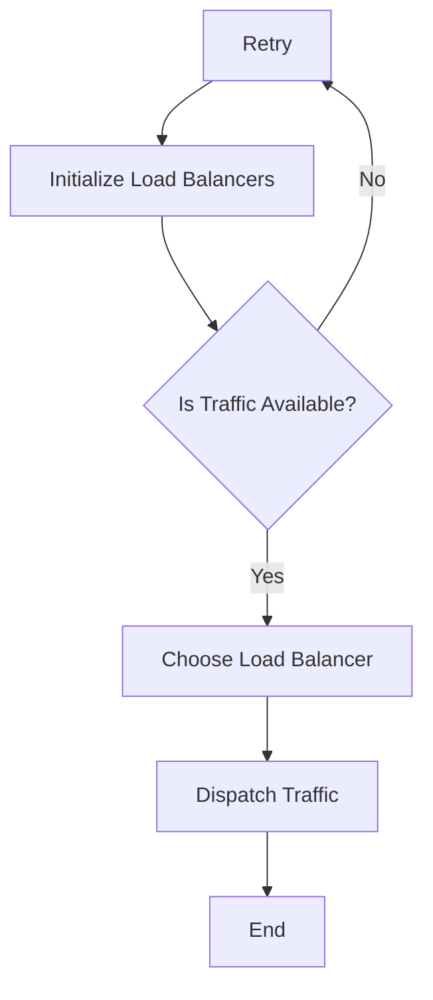
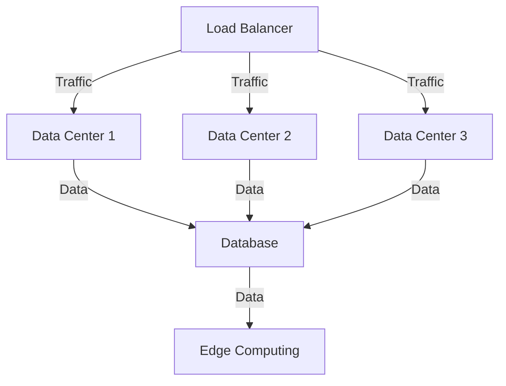
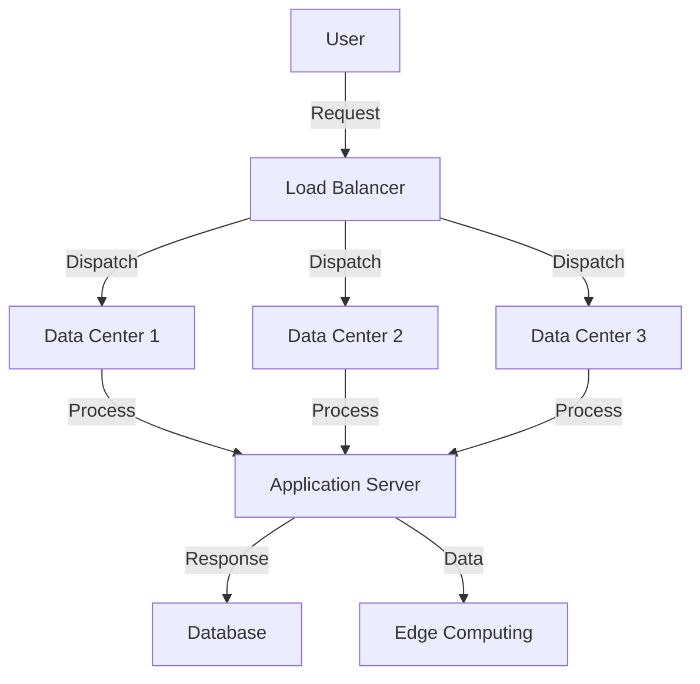
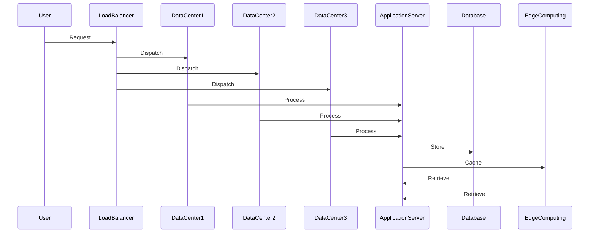

                 


### Introduction: The Importance of Resilient Multi-region Architectures for LLM Applications

In the digital age, where artificial intelligence (AI) and machine learning (ML) are rapidly transforming industries, ensuring the availability and reliability of AI applications has become paramount. Among these applications, Large Language Models (LLM) have garnered significant attention due to their transformative potential in natural language processing (NLP), data analysis, and decision support systems. However, the deployment of LLMs presents unique challenges, particularly in ensuring their availability across multiple regions or data centers.

The concept of "异地多活架构" (Resilient Multi-region Architecture) emerges as a crucial approach to addressing these challenges. At its core,异地多活架构 involves designing and deploying an AI application that can seamlessly operate across multiple geographically dispersed regions or data centers. This architecture ensures that the application remains highly available, resilient to failures, and capable of providing consistent performance, even in the face of regional outages or system disruptions.

This article aims to delve into the intricacies of异地多活架构，exploring its significance, core concepts, and practical implementation strategies. By the end of this article, readers will have a comprehensive understanding of how to design and deploy LLM applications that are robust, reliable, and highly available across multiple regions.

### Keywords

- 异地多活架构
- LLM应用
- 高可用性
- 失效恢复
- 地理分布
- 负载均衡
- 数据一致性

### Abstract

This article presents a detailed exploration of the concept of resilient multi-region architectures, specifically designed to enhance the availability and reliability of Large Language Model (LLM) applications. We begin by providing an overview of the problem background and the significance of deploying AI applications in a distributed environment. The article introduces key concepts and relationships related to异地多活架构，including core components and their attributes. We then delve into the principles and flowcharts of algorithms used in this architecture, followed by mathematical models and formulas necessary for a thorough understanding.

The subsequent sections describe the system analysis and architecture design, including problem scenarios, project contexts, system function design, and interface design. A comprehensive project practice chapter covers environment setup, core system implementation, and practical case analysis. Finally, the article concludes with best practices, a summary of key points, and suggestions for further reading, providing readers with actionable insights and a roadmap for implementing resilient multi-region architectures in LLM applications.

## The Background and Significance of Resilient Multi-region Architectures

In today's interconnected world, the deployment of AI applications, particularly Large Language Models (LLM), is increasingly becoming a necessity rather than a luxury. The ability to process, analyze, and generate human-like text has wide-ranging applications across various industries, from healthcare and finance to customer service and content creation. However, the deployment of these sophisticated models is fraught with challenges, especially concerning their availability and reliability.

### Problem Background

The proliferation of AI applications, coupled with the growing demand for real-time data processing and analysis, has led to a surge in the need for high-performance computing resources. Organizations are increasingly adopting cloud-based solutions to leverage the scalability and flexibility offered by cloud service providers. However, relying on a single data center or region for hosting AI applications poses significant risks. A regional outage, hardware failure, or even a simple network disruption can lead to a complete service interruption, resulting in lost revenue, damaged reputation, and diminished user trust.

### Problem Description

The problem of ensuring the availability and reliability of LLM applications in a distributed environment can be summarized as follows:

- **Service Disruption**: A regional outage can disrupt service availability, leading to downtime and potential revenue loss.
- **Performance Degradation**: In a highly distributed environment, ensuring consistent performance across multiple regions is challenging, especially during peak usage periods.
- **Data Consistency**: Maintaining data consistency across multiple regions is crucial for applications that rely on real-time data processing and analysis.
- **Scalability**: As the demand for AI applications grows, ensuring that the architecture can scale horizontally to accommodate increased load is essential.

### Problem Solution

To address these challenges, the concept of "异地多活架构" (Resilient Multi-region Architecture) emerges as a viable solution. This architecture involves designing and deploying AI applications in a way that ensures high availability, resilience, and performance across multiple regions. By distributing the application's infrastructure across multiple data centers, organizations can achieve several key benefits:

- **High Availability**: With a resilient multi-region architecture, the application remains available even if one region experiences an outage or failure.
- **Fault Tolerance**: The architecture is designed to handle failures gracefully, ensuring minimal impact on the overall system.
- **Performance Consistency**: By leveraging load balancing and caching mechanisms, the architecture can ensure consistent performance across regions.
- **Data Consistency**: Techniques such as distributed databases and data replication ensure that data is consistent across regions.

### Boundary and Scope

The scope of异地多活架构 encompasses several key aspects:

- **Geographic Distribution**: The architecture must be designed to operate across multiple geographic regions, each potentially hosting different instances of the application.
- **System Components**: The architecture includes various components, such as load balancers, data centers, and edge computing devices, all working together to ensure high availability and performance.
- **Network Connectivity**: Ensuring reliable and high-speed network connectivity between regions is crucial for the seamless operation of the architecture.
- **Application Design**: The architecture must be designed to handle distributed data processing and ensure data consistency across regions.

In summary, the concept of异地多活架构 is vital for ensuring the availability and reliability of LLM applications in a distributed environment. By addressing the challenges of service disruption, performance degradation, and data consistency, this architecture provides a robust framework for deploying AI applications that can withstand the complexities of modern computing environments.

## Core Concepts and Relationships

### Introduction to Core Concepts

In the design of resilient multi-region architectures for LLM applications, understanding the core concepts is crucial. These concepts form the foundation upon which the entire architecture is built. The following are some of the key concepts that we will explore:

1. **Load Balancer**: A load balancer distributes incoming network traffic across multiple servers to ensure optimal performance and resource utilization.
2. **Data Center**: A data center is a facility that houses computer systems and associated components, providing the necessary infrastructure for data storage, processing, and networking.
3. **Edge Computing**: Edge computing involves processing data at the network edge, closer to the source of data generation, to reduce latency and bandwidth usage.
4. **Distributed Database**: A distributed database is a system of databases whose data is distributed over several physical locations, providing high availability and fault tolerance.
5. **Replication**: Replication involves creating and maintaining copies of data across multiple regions to ensure data consistency and availability.

### Attributes of Core Concepts

To better understand these concepts, let's examine their attributes:

| Concept | Attributes |
| --- | --- |
| Load Balancer | - Distributes traffic |
| Data Center | -地理位置 |
| Edge Computing | -靠近数据源 |
| Distributed Database | -数据分布 |
| Replication | -数据复制 |

### Comparison Table of Core Concepts

Here is a comparison table that highlights the key differences and similarities between these concepts:

| Concept | Description | Main Benefits | Drawbacks |
| --- | --- | --- | --- |
| Load Balancer | Distributes network traffic | Improved performance, load distribution | Requires monitoring and management |
| Data Center | Houses computing infrastructure | High reliability, centralized management | Higher cost, potential for single points of failure |
| Edge Computing | Processes data at network edge | Reduced latency, lower bandwidth usage | Limited computing resources |
| Distributed Database | Splits data across multiple locations | High availability, fault tolerance | Complexity in data management |
| Replication | Creates multiple data copies | Data redundancy, faster access | Increased storage requirements |

### ER Diagram

To visualize the relationships between these core concepts, we can create an Entity-Relationship (ER) diagram. This diagram will illustrate how each concept interacts with others within the architecture.

```mermaid
erDiagram
    LoadBalancer ||--|{ DataCenter }|--| Replication : "uses"
    DataCenter ||--|{ LoadBalancer }|--| EdgeComputing : "connects_to"
    EdgeComputing ||--|{ DistributedDatabase }|--| Replication : "uses"
```

In this ER diagram, we can see that Load Balancers use Data Centers and Replication systems. Data Centers connect to Edge Computing devices. Edge Computing devices use Distributed Databases, which, in turn, use Replication to ensure data consistency and availability.

### Conclusion

Understanding the core concepts and their relationships is essential for designing a resilient multi-region architecture. By leveraging these concepts and their attributes, we can build a robust and scalable system capable of meeting the demands of modern AI applications. The comparison table and ER diagram provide a comprehensive overview of these concepts, enabling us to develop a deeper understanding of their roles within the architecture.

## Algorithm Principles and Flowcharts

### Algorithm Overview

The algorithms used in resilient multi-region architectures for LLM applications are designed to ensure high availability, fault tolerance, and performance consistency. One of the key algorithms in this context is the Load Balancing algorithm. This algorithm plays a crucial role in distributing network traffic across multiple data centers and load balancers to optimize resource utilization and ensure optimal performance.

### Algorithm Principles

The Load Balancing algorithm works on several fundamental principles:

1. **Round Robin**: This principle involves distributing incoming network traffic sequentially to each available load balancer.
2. **Weighted Round Robin**: This principle assigns different weights to each load balancer based on their processing capabilities, distributing traffic accordingly.
3. **Least Connections**: This principle directs traffic to the load balancer with the fewest active connections, ensuring even load distribution.
4. **IP Hashing**: This principle uses the source IP address of the incoming request to determine the destination load balancer, providing a consistent user experience.

### Algorithm Flowchart

To illustrate the principles of the Load Balancing algorithm, we can create a flowchart using Mermaid syntax. The following is an example of a Mermaid flowchart that demonstrates the Round Robin principle:



In this flowchart, the algorithm starts by initializing the load balancers. It then checks if traffic is available. If traffic is available, it selects a load balancer using the Round Robin principle and dispatches the traffic. If traffic is not available, the algorithm retries the process.

### Explanation of the Flowchart

1. **Start**: The algorithm begins by initializing the load balancers.
2. **Initialize Load Balancers**: This step ensures that all load balancers are properly configured and ready to handle incoming traffic.
3. **Is Traffic Available?**: The algorithm checks if there is any incoming network traffic. If there is no traffic, it retries the process.
4. **Choose Load Balancer**: Using the Round Robin principle, the algorithm selects a load balancer to handle the incoming traffic.
5. **Dispatch Traffic**: The selected load balancer is then dispatched to handle the incoming traffic.
6. **End**: The algorithm ends after successfully dispatching the traffic to the load balancer.

### Practical Application

To further illustrate the practical application of the Load Balancing algorithm, let's consider a Python implementation of the Round Robin principle:

```python
load_balancers = ["LB1", "LB2", "LB3"]

def dispatch_traffic(traffic):
    if not traffic:
        return "No traffic to dispatch."
    
    current_balancer = load_balancers[0]
    load_balancers.pop(0)
    load_balancers.append(current_balancer)
    
    return f"Dispatching traffic to {current_balancer}."

# Example usage
print(dispatch_traffic("Incoming traffic: HTTP/1.1"))
```

In this Python code, we create a list of load balancers and define a function to dispatch traffic using the Round Robin principle. When we call the function with an incoming traffic parameter, it selects the first load balancer from the list, dispatches the traffic, and then moves it to the end of the list for the next iteration.

### Conclusion

Understanding the principles and flowcharts of algorithms like Load Balancing is essential for designing and implementing resilient multi-region architectures for LLM applications. By leveraging these algorithms, we can ensure high availability, fault tolerance, and performance consistency across multiple regions. The Mermaid flowchart and Python implementation provide a clear and practical illustration of how these algorithms work in real-world scenarios.

## Mathematical Models and Formulas

### Introduction to Mathematical Models

In the design and implementation of resilient multi-region architectures for LLM applications, mathematical models and formulas play a crucial role in ensuring that the algorithms function correctly and efficiently. These models provide a quantitative basis for understanding the behavior of key components, such as load balancers, data centers, and distributed databases. In this section, we will explore the mathematical models and formulas used in these architectures.

### Load Balancing Algorithm

The Load Balancing algorithm is fundamental to ensuring optimal distribution of network traffic across multiple data centers. One of the key formulas used in this algorithm is the **Round Robin Distribution Formula**. This formula helps determine the order in which load balancers should be selected to distribute traffic evenly.

#### Round Robin Distribution Formula

Let \( n \) be the total number of load balancers available, and \( i \) be the current iteration. The formula to calculate the next load balancer to be selected is:

$$
L_i = (i \mod n) + 1
$$

Where:
- \( L_i \) is the index of the load balancer selected in the \( i \)-th iteration.
- \( n \) is the total number of load balancers.
- \( i \) is the current iteration number.

#### Example Calculation

Suppose we have 3 load balancers (LB1, LB2, LB3). If we want to select a load balancer in the 5th iteration:

$$
L_5 = (5 \mod 3) + 1 = 2 + 1 = 3
$$

So, in the 5th iteration, LB3 would be selected.

### Performance Metrics

In addition to the Load Balancing formula, it's important to consider performance metrics such as **Response Time** and **Throughput**. These metrics help assess the efficiency of the architecture under different load conditions.

#### Response Time Formula

Response Time (RT) is the time taken to process an incoming request. The formula for Response Time is:

$$
RT = \frac{1}{\frac{1}{T_1} + \frac{1}{T_2} + \ldots + \frac{1}{T_n}}
$$

Where:
- \( T_1, T_2, \ldots, T_n \) are the processing times for each load balancer.

#### Throughput Formula

Throughput (TP) is the number of requests processed per unit of time. The formula for Throughput is:

$$
TP = \frac{n}{\frac{1}{T_1} + \frac{1}{T_2} + \ldots + \frac{1}{T_n}}
$$

Where:
- \( n \) is the total number of requests.
- \( T_1, T_2, \ldots, T_n \) are the processing times for each load balancer.

### Example Explanation

Consider a scenario where we have three load balancers with processing times of \( T_1 = 1 \) second, \( T_2 = 2 \) seconds, and \( T_3 = 3 \) seconds.

#### Response Time Calculation

$$
RT = \frac{1}{\frac{1}{1} + \frac{1}{2} + \frac{1}{3}} = \frac{1}{1 + 0.5 + 0.3333} = \frac{1}{1.8333} \approx 0.5455 \text{ seconds}
$$

#### Throughput Calculation

$$
TP = \frac{3}{\frac{1}{1} + \frac{1}{2} + \frac{1}{3}} = \frac{3}{1 + 0.5 + 0.3333} = \frac{3}{1.8333} \approx 1.6363 \text{ requests per second}
$$

### Conclusion

Mathematical models and formulas are essential for designing and analyzing resilient multi-region architectures. By understanding and applying these formulas, we can optimize the performance of our systems, ensuring high availability and efficiency. The examples provided in this section demonstrate how these models can be used to calculate key performance metrics and make informed decisions about system design and operation.

## System Analysis and Architecture Design

### Introduction

In the previous sections, we have explored the core concepts, algorithms, and mathematical models that form the foundation of resilient multi-region architectures for LLM applications. Now, it's time to delve into the system analysis and architecture design, which is crucial for implementing these concepts effectively. This section will provide a comprehensive overview of the system analysis process, architecture design, and the interactions between various components.

### Problem Scenario

Let's consider a scenario where a company has a mission-critical Large Language Model (LLM) application that needs to be available and performant for its global user base. The application is responsible for providing real-time language translation and text analysis services. To ensure high availability and performance, the company decides to adopt a resilient multi-region architecture, distributing its infrastructure across multiple geographic locations.

### Project Context

The project context involves the following key aspects:

1. **Business Requirements**: The application must be highly available, with minimal downtime, and provide consistent performance to users worldwide.
2. **Technical Requirements**: The architecture must support horizontal scalability, fault tolerance, and data consistency across regions.
3. **User Base**: The application serves a global user base, with varying levels of traffic and latency requirements.

### System Function Design

The system function design involves defining the primary functions and components of the architecture. These include:

1. **Load Balancer**: Distributes incoming network traffic across multiple data centers to optimize performance and resource utilization.
2. **Data Center**: Houses the computing resources and infrastructure required for running the LLM application.
3. **Edge Computing Devices**: Processes data at the network edge to reduce latency and bandwidth usage.
4. **Distributed Database**: Stores and manages the application's data across multiple regions to ensure data consistency and availability.

### Architecture Design

The architecture design is a high-level blueprint of the system components and their interactions. Here, we will use Mermaid diagrams to illustrate the architecture.

#### Data Center Layout



In this diagram, the Load Balancer distributes traffic across three data centers (Data Center 1, Data Center 2, and Data Center 3). Each data center hosts the application infrastructure and connects to a centralized database (Database) via the Edge Computing devices.

#### System Architecture Overview



In this system architecture overview, users send requests to the Load Balancer, which dispatches the requests to the available data centers. The Application Servers in each data center process the requests, interact with the Database, and return responses to the users. The Edge Computing devices facilitate data processing and storage at the network edge.

### System Interface Design

The system interface design involves defining the interfaces between the various components, including APIs, databases, and communication protocols. Here's a high-level overview of the system interfaces:

- **Load Balancer API**: Used to manage and configure the load balancing rules and traffic distribution.
- **Application Server API**: Used for interacting with the LLM application and processing user requests.
- **Database Interface**: Used for managing data storage, retrieval, and consistency across regions.
- **Edge Computing Interface**: Used for processing and caching data at the network edge.

### System Interaction

The system interaction involves the coordination and communication between the different components. Here, we will use Mermaid diagrams to illustrate the system interaction.



In this sequence diagram, the user sends a request to the Load Balancer, which dispatches the request to the available data centers. The Application Servers in each data center process the requests and interact with the Database and Edge Computing devices to store, retrieve, and cache data as needed.

### Conclusion

System analysis and architecture design are critical steps in implementing a resilient multi-region architecture for LLM applications. By understanding the problem scenario, project context, system function design, and architecture design, we can create a robust and scalable system that meets the high availability and performance requirements of modern AI applications. The Mermaid diagrams provided in this section serve as valuable tools for visualizing and communicating the architecture and its components.

## Project Practice

### Introduction

In this section, we will delve into the practical implementation of a resilient multi-region architecture for LLM applications. This practical approach will guide you through the setup of the necessary environment, the implementation of core system components, and a detailed analysis of a real-world case study. By following these steps, you will gain hands-on experience and a deeper understanding of how to deploy and manage LLM applications in a distributed environment.

### Environment Setup

To start, you will need to set up the environment for deploying the LLM application across multiple regions. Here are the steps involved:

1. **Install Required Software**: Ensure that you have the necessary software installed, including virtualization tools (e.g., Docker), container orchestration systems (e.g., Kubernetes), and cloud services (e.g., AWS, Azure, or Google Cloud Platform).
2. **Configure Cloud Services**: Create cloud accounts and configure the necessary resources, such as virtual private clouds (VPCs), subnets, and security groups.
3. **Set Up Load Balancers**: Configure load balancers to distribute traffic across multiple regions. You can use cloud-native load balancers or third-party solutions.
4. **Deploy Infrastructure as Code**: Use infrastructure as code (IaC) tools (e.g., Terraform, CloudFormation) to automate the deployment of your infrastructure. This ensures consistency and repeatability across environments.

### Core System Implementation

Once the environment is set up, you can proceed with the implementation of the core system components. Here's a high-level overview of the steps involved:

1. **Containerize the LLM Application**: Create Dockerfiles to containerize the LLM application, including all dependencies and configuration files. This ensures that the application runs consistently across different environments.
2. **Deploy Application Servers**: Deploy the containerized LLM application to multiple data centers using container orchestration systems like Kubernetes. Define Kubernetes deployment configurations to manage the lifecycle of application instances.
3. **Set Up Data Storage and Replication**: Use distributed databases or cloud-based storage solutions to manage data across regions. Configure data replication to ensure data consistency and availability.
4. **Implement Load Balancing**: Configure the load balancer to distribute traffic evenly across the application servers in different regions. Use health checks and auto-scaling features to ensure high availability and performance.

### Code Analysis and Explanation

Let's take a closer look at the key components of the codebase for the LLM application. Here's a breakdown of the main components and their roles:

1. **Load Balancer Configuration**:
   ```yaml
   apiVersion: v1
   kind: Service
   metadata:
     name: load-balancer
   spec:
     selector:
       app: llm-app
     ports:
       - protocol: TCP
         port: 80
         targetPort: 8080
   ```

   This Kubernetes Service configuration sets up a load balancer that distributes traffic to the LLM application pods based on the specified selector.

2. **Kubernetes Deployment**:
   ```yaml
   apiVersion: apps/v1
   kind: Deployment
   metadata:
     name: llm-app
   spec:
     replicas: 3
     selector:
       matchLabels:
         app: llm-app
     template:
       metadata:
         labels:
           app: llm-app
       spec:
         containers:
         - name: llm-container
           image: llm-app:latest
           ports:
           - containerPort: 8080
   ```

   This Kubernetes Deployment configuration manages the lifecycle of LLM application instances, ensuring that three replicas are always running to provide high availability.

3. **Data Replication Configuration**:
   ```yaml
   apiVersion: v1
   kind: PersistentVolumeClaim
   metadata:
     name: data-pvc
   spec:
     accessModes:
       - ReadWriteOnce
     resources:
       requests:
         storage: 10Gi
   ```

   This Persistent Volume Claim (PVC) configuration defines the storage requirements for data replication across regions.

### Practical Case Analysis

For a practical case analysis, let's consider a scenario where a user from Europe requests a language translation service. Here's how the system would handle the request:

1. **User Request**: The user sends a translation request to the load balancer in Europe.
2. **Load Balancing**: The load balancer distributes the request to one of the available LLM application servers in Europe based on the Round Robin algorithm.
3. **Application Processing**: The LLM application server processes the translation request, accessing the distributed database to retrieve and store translation data.
4. **Data Replication**: The database replicates the translation data to the other regions to ensure data consistency and availability.
5. **Response**: The LLM application server returns the translated text to the user, and the load balancer handles any subsequent requests in a similar manner.

### Detailed Explanation and Project Summary

By following the steps outlined above, you can successfully deploy a resilient multi-region architecture for an LLM application. Key points to consider include:

- **High Availability**: Load balancing and replication ensure that the application remains available even if one region or server fails.
- **Performance Consistency**: Load balancing distributes traffic evenly across regions, ensuring consistent performance.
- **Scalability**: Kubernetes and container orchestration enable horizontal scalability, allowing the system to handle increased load.
- **Data Consistency**: Distributed databases and replication ensure that data is consistent across regions.

In conclusion, implementing a resilient multi-region architecture for LLM applications involves careful planning and execution. By following the practical steps and guidelines provided in this section, you can deploy and manage a robust, scalable, and highly available system that meets the demands of modern AI applications.

## Best Practices, Summary, and Considerations

### Best Practices

When designing and implementing a resilient multi-region architecture for LLM applications, adhering to best practices is crucial for ensuring high availability, performance, and scalability. Here are some key best practices to consider:

1. **Modularization**: Design your system in a modular fashion, separating concerns such as data processing, storage, and load balancing. This approach simplifies maintenance and upgrades.
2. **Automated Deployment**: Use infrastructure as code (IaC) tools to automate the deployment and management of your infrastructure. This ensures consistency and repeatability across different environments.
3. **Monitoring and Logging**: Implement robust monitoring and logging solutions to track the health and performance of your system. This helps you identify and resolve issues quickly.
4. **Load Balancing Algorithms**: Choose the appropriate load balancing algorithm based on your specific requirements, such as Round Robin, Weighted Round Robin, or Least Connections.
5. **Data Replication Strategies**: Implement data replication strategies that ensure data consistency and availability across regions. Techniques such as synchronous or asynchronous replication can be used based on your requirements.

### Summary

In this article, we have explored the importance of resilient multi-region architectures for LLM applications. We discussed the problem background, core concepts, algorithms, mathematical models, system analysis, architecture design, and practical implementation steps. By following the best practices outlined, you can design and deploy a robust, scalable, and highly available system that meets the demands of modern AI applications.

### Considerations

As you embark on designing and implementing a resilient multi-region architecture, consider the following important points:

1. **Disaster Recovery**: Develop a comprehensive disaster recovery plan to ensure that your system can recover from regional outages or system failures.
2. **Performance Testing**: Conduct thorough performance testing to ensure that your system can handle peak loads and maintain consistent performance across regions.
3. **Security**: Implement robust security measures to protect your system from unauthorized access and data breaches.
4. **Geographic Distribution**: Choose the right geographic distribution strategy to ensure optimal performance and latency for your user base.
5. **Maintenance and Upgrades**: Regularly maintain and upgrade your system components to ensure that they are up-to-date and functioning efficiently.

### Further Reading

For those interested in delving deeper into resilient multi-region architectures and LLM applications, here are some recommended resources:

1. **"Designing Data-Intensive Applications" by Martin Kleppmann**: A comprehensive guide to designing scalable and reliable data systems.
2. **"Kubernetes: Up and Running" by Kelsey Hightower**: A practical guide to container orchestration using Kubernetes.
3. **"Reaper: Lessons Learned from Building and Running a Multi-Region Cloud Database" by Google Cloud**: A detailed case study on building and managing a multi-region cloud database.
4. **"Building Microservices" by Sam Newman**: A guide to designing and implementing microservices architecture for scalable systems.

By leveraging these resources and the insights gained from this article, you can develop a resilient multi-region architecture that powers your LLM applications with high availability, performance, and scalability.

