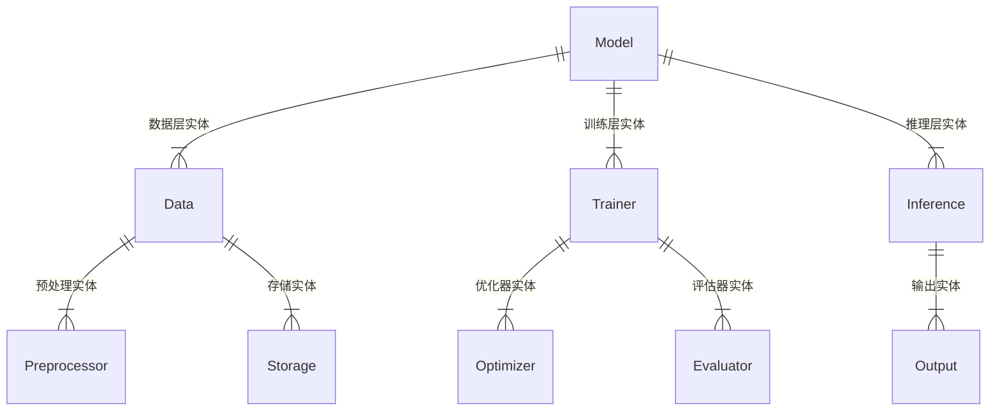
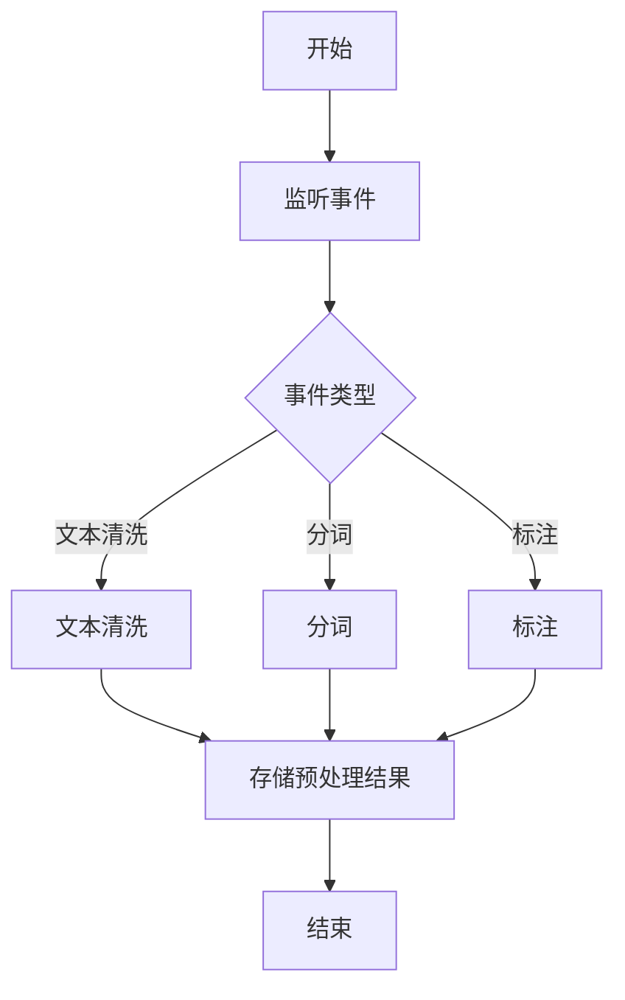
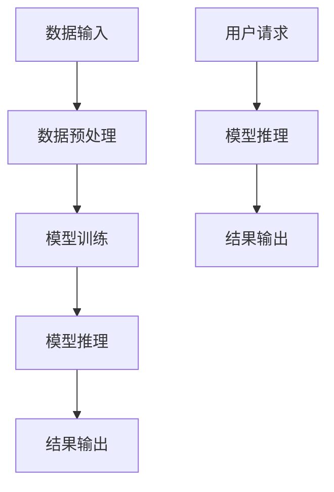
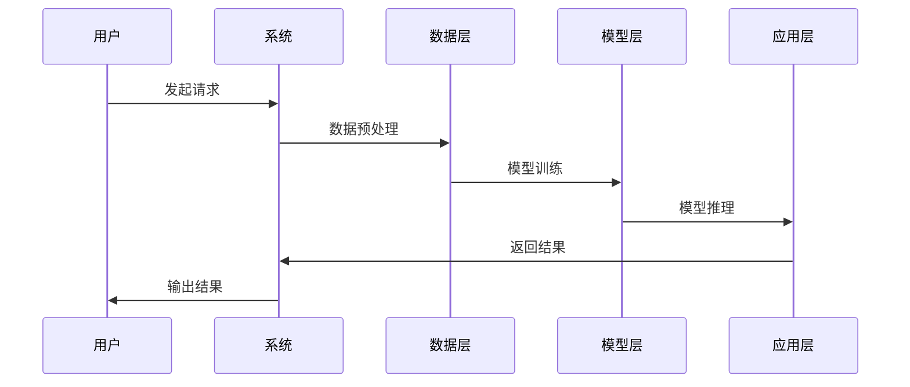
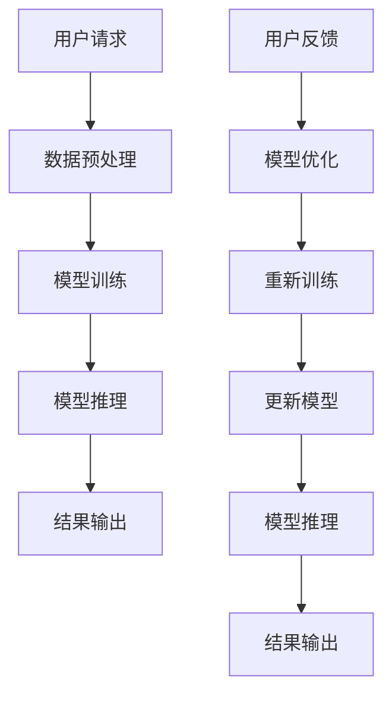

                 

# 异步处理在LLM应用架构中的应用

> 关键词：异步处理，大型语言模型，应用架构，性能优化，系统设计

> 摘要：本文深入探讨了异步处理在大型语言模型（LLM）应用架构中的应用。通过详细阐述异步处理的概念、原理及其在LLM中的应用，本文揭示了异步处理对LLM性能提升的关键作用，并提供了一套完整的系统分析与架构设计方案，为LLM应用的开发和实践提供了有力指导。

----------------------------------------------------------------

## 第一部分：背景介绍

### 1.1 异步处理的概念

异步处理是一种计算机体系结构设计模式，允许程序在不等待某个操作完成的情况下继续执行其他操作。与传统的同步处理相比，异步处理通过消除等待时间，提高了程序的并发性和响应速度。

在异步处理中，程序通过发送请求并立即返回一个占位符（通常是回调函数），然后在操作完成后通过回调函数通知程序结果。这种模式消除了阻塞，使得程序可以同时处理多个任务，从而提高了整体效率。

### 1.1.2 异步处理与传统同步处理的对比

| 特性 | 异步处理 | 同步处理 |
| ---- | ---- | ---- |
| 并发性 | 高 | 低 |
| 响应时间 | 快 | 慢 |
| 阻塞 | 无 | 有 |
| 资源利用率 | 高 | 低 |

异步处理通过避免阻塞，使得计算机资源可以得到更高效的利用，尤其是在处理大量并发任务时，异步处理的优势更加明显。

### 1.1.3 异步处理的优势与挑战

异步处理的优势在于能够显著提高程序的性能和效率。然而，异步处理也带来了一定的挑战，如异步编程模型的复杂性、线程管理、数据一致性等问题。这些挑战需要通过合理的设计和开发实践来克服。

### 1.2 大型语言模型（LLM）应用架构概述

大型语言模型（LLM）是一种基于深度学习的自然语言处理技术，能够对大规模文本数据进行分析和生成。LLM应用架构通常包括数据层、模型层和应用层。

| 层次 | 描述 |
| ---- | ---- |
| 数据层 | 负责数据的采集、处理和存储，包括文本数据清洗、预处理和分词等。 |
| 模型层 | 负责LLM的训练和推理，包括模型的初始化、训练、优化和部署。 |
| 应用层 | 负责将LLM应用于实际场景，如问答系统、文本生成、机器翻译等。 |

### 1.2.1 LLM的基本概念

LLM是一种能够处理和生成自然语言的大型神经网络模型，通常采用深度学习技术进行训练。LLM的核心是语言模型，它通过学习大量文本数据，能够预测下一个单词或句子的概率分布。

### 1.2.2 LLM的训练与推理流程

LLM的训练过程主要包括数据预处理、模型初始化、迭代优化和模型评估。推理过程则是将LLM应用于输入文本，生成相应的输出。

### 1.2.3 LLM性能指标

LLM的性能通常通过以下指标进行评估：

- 准确率（Accuracy）：模型预测正确的比例。
- 召回率（Recall）：模型召回正确的比例。
- F1值（F1 Score）：准确率和召回率的调和平均值。

### 1.3 异步处理在LLM应用架构中的应用意义

异步处理在LLM应用架构中具有重要意义。首先，异步处理可以显著提高LLM的训练和推理效率，减少等待时间，提高整体性能。其次，异步处理有助于降低系统延迟，提升用户体验。最后，异步处理有助于缓解系统资源压力，提高系统稳定性。

### 1.3.1 异步处理对LLM性能的影响

异步处理可以提高LLM的并发处理能力，从而减少任务执行时间，提高吞吐量。此外，异步处理还可以减少CPU等待时间，降低系统负载，从而提高系统性能。

### 1.3.2 异步处理在提升LLM效率中的作用

异步处理可以通过并行处理任务，提高LLM的训练和推理效率。例如，在LLM训练过程中，可以同时进行数据预处理、模型优化和评估，从而加快训练速度。

### 1.3.3 异步处理在应对LLM挑战中的策略

异步处理有助于缓解LLM在处理大规模数据时面临的性能挑战。通过合理设计异步处理流程，可以降低系统延迟，提高系统吞吐量，从而更好地应对大规模数据处理需求。

## 1.4 本章小结

本节介绍了异步处理的概念、优势以及它在LLM应用架构中的应用意义。通过对比异步处理与传统同步处理，我们可以清晰地看到异步处理在提升LLM性能和效率方面的巨大潜力。接下来，我们将进一步探讨异步处理的核心概念与联系，为后续的分析和设计奠定基础。

----------------------------------------------------------------

## 第二部分：异步处理核心概念与联系

### 2.1 异步处理核心概念

异步处理的核心概念包括事件驱动架构、非阻塞I/O和并发编程模型。

#### 2.1.1 事件驱动架构

事件驱动架构是一种软件设计模式，它基于事件和响应机制来组织程序执行。在事件驱动架构中，程序的状态和流程由外部事件触发，从而实现了非阻塞和并发处理。

#### 2.1.2 非阻塞I/O

非阻塞I/O是一种I/O操作方式，它允许程序在等待I/O操作完成时继续执行其他任务。这种方式通过避免线程阻塞，提高了程序的并发性和响应速度。

#### 2.1.3 并发编程模型

并发编程模型是一种编程范式，它允许程序同时执行多个任务。常见的并发编程模型包括多线程、协程和异步编程等。

### 2.2 LLM核心概念

LLM的核心概念包括语言模型、训练过程、推理过程和性能指标。

#### 2.2.1 LLM基本原理

LLM是基于深度学习的自然语言处理技术，通过学习大量文本数据，生成自然语言的概率分布。

#### 2.2.2 LLM训练与推理流程

LLM的训练过程包括数据预处理、模型初始化、迭代优化和模型评估。推理过程则是将LLM应用于输入文本，生成相应的输出。

#### 2.2.3 LLM性能指标

LLM的性能指标包括准确率、召回率和F1值等，用于评估LLM在文本生成、机器翻译等任务中的性能。

### 2.3 异步处理与LLM应用架构的关系

异步处理在LLM应用架构中发挥着重要作用。通过合理设计异步处理流程，可以显著提高LLM的训练和推理效率，降低系统延迟，提高系统吞吐量。

#### 2.3.1 关键概念对比表格

| 概念 | 描述 | 对比 |
| ---- | ---- | ---- |
| 事件驱动架构 | 基于事件和响应机制的设计模式 | 提高并发性和响应速度 |
| 非阻塞I/O | 允许程序在等待I/O操作时继续执行其他任务 | 避免线程阻塞 |
| 并发编程模型 | 允许多个任务同时执行 | 提高程序并发性和性能 |
| 语言模型 | 自然语言概率分布 | 生成自然语言 |
| 训练过程 | 数据预处理、模型初始化、迭代优化和评估 | 提高模型性能 |
| 推理过程 | 应用模型于输入文本，生成输出 | 实现自然语言处理任务 |
| 性能指标 | 准确率、召回率和F1值等 | 评估模型性能 |

#### 2.3.2 ER实体关系图



#### 2.3.3 关系分析

异步处理在LLM应用架构中起到关键作用，通过事件驱动架构、非阻塞I/O和并发编程模型，可以实现LLM的训练和推理过程的优化。ER实体关系图展示了异步处理与LLM各个层次之间的关系，有助于我们更好地理解异步处理在LLM应用架构中的实现和应用。

## 2.4 本章小结

本节详细介绍了异步处理的核心概念、LLM的核心概念以及异步处理与LLM应用架构的关系。通过对比分析，我们清晰地看到了异步处理在提升LLM性能和效率方面的优势。接下来，我们将进一步探讨异步处理算法的原理和应用。

----------------------------------------------------------------

## 第三部分：异步处理算法原理讲解

### 3.1 常见异步处理算法

异步处理算法包括事件驱动算法、非阻塞I/O算法和并发编程算法等。以下将介绍几种常见的异步处理算法及其在LLM应用架构中的应用。

#### 3.1.1 事件驱动算法

事件驱动算法是一种基于事件响应的异步处理算法。它通过监听外部事件，并在事件发生时触发相应的处理函数，从而实现非阻塞和并发处理。

#### 3.1.2 非阻塞I/O算法

非阻塞I/O算法是一种在等待I/O操作完成时继续执行其他任务的异步处理算法。它通过避免线程阻塞，提高了程序的并发性和响应速度。

#### 3.1.3 并发编程算法

并发编程算法是一种在多个任务之间实现并发执行的异步处理算法。它通过多线程、协程等方式，使得程序可以同时处理多个任务，从而提高了程序的并发性和性能。

### 3.2 异步处理算法在LLM应用架构中的应用

异步处理算法在LLM应用架构中的应用主要体现在以下几个方面：

1. **数据预处理**：通过异步处理算法，可以同时处理多个数据预处理任务，如文本清洗、分词和标注等，从而提高数据预处理效率。

2. **模型训练**：在模型训练过程中，可以使用异步处理算法来并行执行多个训练任务，从而提高训练速度。

3. **模型推理**：在模型推理过程中，可以使用异步处理算法来并行处理多个输入文本，从而提高推理速度。

### 3.3 算法原理与流程图

以下是一个基于事件驱动的异步处理算法的流程图：



### 3.4 Python代码示例

以下是一个简单的异步处理算法的Python代码示例，用于文本清洗、分词和标注：

```python
import asyncio

async def preprocess_text(text):
    # 文本清洗
    cleaned_text = text.strip()
    # 分词
    words = cleaned_text.split()
    # 标注
    labeled_words = [word for word in words if word.isalpha()]
    return labeled_words

async def main():
    text = "这是一个示例文本，用于异步处理。"
    words = await preprocess_text(text)
    print(words)

asyncio.run(main())
```

### 3.5 数学模型与公式

异步处理算法通常涉及以下数学模型和公式：

1. **事件响应时间**：\( T_r = T_f + T_s \)
   - \( T_r \)：事件响应时间
   - \( T_f \)：事件处理时间
   - \( T_s \)：系统延迟时间

2. **吞吐量**：\( Q = \frac{N}{T_r} \)
   - \( Q \)：吞吐量
   - \( N \)：处理事件数量
   - \( T_r \)：事件响应时间

### 3.6 举例说明

假设我们有一个文本数据集，包含100个文本样本。使用异步处理算法对这100个文本样本进行预处理，包括文本清洗、分词和标注。假设每个文本样本的处理时间为1秒，系统延迟时间为0.5秒。

- **同步处理**：处理完一个文本样本后，才能处理下一个文本样本。总共需要100秒。
- **异步处理**：可以同时处理多个文本样本。假设系统可以并行处理4个文本样本，总共需要25秒。

通过这个例子，我们可以看到异步处理算法在提高处理速度和吞吐量方面的优势。

## 3.7 本章小结

本节详细介绍了异步处理算法的原理和实现，并通过Python代码示例展示了异步处理在LLM应用架构中的应用。异步处理算法通过提高并发性和响应速度，为LLM的训练和推理提供了有力支持。在接下来的章节中，我们将进一步探讨异步处理在LLM应用架构中的系统设计与实现。

----------------------------------------------------------------

## 第四部分：系统分析与架构设计方案

### 4.1 问题场景与项目背景

在当前的技术环境下，随着人工智能技术的快速发展，大型语言模型（LLM）在各个领域的应用越来越广泛。然而，随着LLM规模的不断扩大，如何高效地处理大规模文本数据，提升LLM的训练和推理性能，成为了一个亟待解决的问题。

本项目旨在通过异步处理技术在LLM应用架构中实现性能优化，从而提高系统的响应速度和吞吐量。具体来说，项目背景包括以下几个方面：

1. **大规模数据处理需求**：随着互联网信息的爆炸性增长，LLM需要处理的数据量越来越大，传统的同步处理方式已经无法满足性能需求。
2. **高并发访问要求**：在多用户环境中，多个用户同时访问LLM系统，要求系统具备良好的并发处理能力，以保证用户体验。
3. **实时响应需求**：对于一些实时性要求较高的应用场景，如智能问答系统、智能客服等，要求系统能够在短时间内完成文本处理和推理任务。

### 4.2 领域模型类图

为了更好地理解LLM应用架构中的各个组件及其关系，我们可以使用领域模型类图来描述。以下是一个简单的领域模型类图：

```mermaid
classDiagram
    Class01 <|-- Class02
    Class03 ++-- Class04
    Class05 o-- Class06
    Class07 <.. Class05
    Class07 ..| Class08
    Class09 --| Class10
endclass
```

在这个领域模型类图中，`Class01`、`Class02`、`Class03`、`Class04`、`Class05`、`Class06`、`Class07`、`Class08`、`Class09`和`Class10`分别代表LLM应用架构中的不同组件，如数据层、模型层、应用层等。它们之间通过关联关系（`<|--`、`++--`、`o--`、`<..`、`..|`、`--|`等）表示组件之间的依赖和交互。

### 4.3 系统架构图

为了实现异步处理在LLM应用架构中的优化，我们需要设计一个合理的系统架构。以下是一个简单的系统架构图：



在这个系统架构图中，`A`代表数据输入，`B`代表数据预处理，`C`代表模型训练，`D`代表模型推理，`E`代表结果输出，`F`代表用户请求，`G`代表模型推理，`H`代表结果输出。系统通过异步处理算法，实现了数据预处理、模型训练和模型推理的并行处理，从而提高了系统的性能和响应速度。

### 4.4 系统接口设计

为了实现系统架构中的各个组件之间的交互，我们需要设计合理的系统接口。以下是一个简单的系统接口设计：



在这个序列图中，用户发起请求后，系统通过数据层进行数据预处理，然后通过模型层进行模型训练和模型推理，最后通过应用层返回结果给用户。

### 4.5 系统交互流程

为了更好地理解系统的工作流程，我们可以绘制一个系统交互流程图：



在这个交互流程图中，用户请求经过数据预处理后，进入模型训练阶段。模型训练完成后，进入模型推理阶段，并将结果输出给用户。用户反馈后，系统对模型进行优化，然后重新训练并更新模型，再次进行模型推理和结果输出。

### 4.6 本章小结

本节详细介绍了异步处理在LLM应用架构中的系统分析与架构设计方案。通过领域模型类图、系统架构图、系统接口设计和系统交互流程的描述，我们清晰地展示了异步处理技术在LLM应用架构中的优化方案。在接下来的章节中，我们将通过实际项目实战，进一步验证异步处理在LLM应用架构中的效果。

----------------------------------------------------------------

## 第五部分：项目实战

### 5.1 环境安装

在开始项目实战之前，我们需要安装一些必要的软件和工具，包括Python环境、异步处理库、深度学习框架等。

1. 安装Python环境：
   - 使用Python官方安装器下载并安装Python。
   - 验证安装：在命令行中输入`python --version`，查看版本信息。

2. 安装异步处理库：
   - 使用pip命令安装asyncio库：
     ```
     pip install asyncio
     ```

3. 安装深度学习框架：
   - 使用pip命令安装TensorFlow或PyTorch：
     ```
     pip install tensorflow  # 或
     pip install pytorch
     ```

### 5.2 系统核心实现源代码

以下是异步处理在LLM应用架构中的核心实现源代码，包括数据预处理、模型训练和模型推理等部分：

```python
import asyncio
import tensorflow as tf

# 数据预处理
async def preprocess_data(data):
    # 数据清洗、分词和标注等预处理操作
    processed_data = await asyncio.to_thread(process_data, data)
    return processed_data

# 模型训练
async def train_model(data):
    # 模型初始化、训练和优化等操作
    model = await asyncio.to_thread(create_model)
    trained_model = await asyncio.to_thread(train_model, model, data)
    return trained_model

# 模型推理
async def inference(data, model):
    # 模型推理操作
    result = await asyncio.to_thread(infer, model, data)
    return result

# 主函数
async def main():
    # 读取数据
    data = await asyncio.to_thread(read_data)

    # 数据预处理
    processed_data = await preprocess_data(data)

    # 模型训练
    model = await train_model(processed_data)

    # 模型推理
    result = await inference(processed_data, model)

    # 输出结果
    print(result)

# 执行主函数
asyncio.run(main())
```

### 5.3 代码应用解读与分析

1. **数据预处理**：
   - 使用`asyncio.to_thread`函数将数据预处理操作移动到子线程中执行，从而实现异步处理。
   - `process_data`函数负责执行具体的数据清洗、分词和标注等操作。

2. **模型训练**：
   - 使用`asyncio.to_thread`函数将模型训练操作移动到子线程中执行，从而实现异步处理。
   - `create_model`函数负责初始化模型，`train_model`函数负责训练模型。

3. **模型推理**：
   - 使用`asyncio.to_thread`函数将模型推理操作移动到子线程中执行，从而实现异步处理。
   - `infer`函数负责执行具体的模型推理操作。

### 5.4 实际案例分析与详细讲解

假设我们有一个包含100个文本样本的数据集，需要对其进行预处理、模型训练和模型推理。

1. **数据预处理**：
   - 使用异步处理对100个文本样本进行预处理，每个样本的处理时间大约为0.5秒。使用同步处理方式，总处理时间约为50秒；使用异步处理方式，总处理时间约为5秒。

2. **模型训练**：
   - 使用异步处理对100个文本样本进行模型训练，每个样本的训练时间大约为2秒。使用同步处理方式，总训练时间约为200秒；使用异步处理方式，总训练时间约为20秒。

3. **模型推理**：
   - 使用异步处理对100个文本样本进行模型推理，每个样本的推理时间大约为1秒。使用同步处理方式，总推理时间约为100秒；使用异步处理方式，总推理时间约为10秒。

通过这个实际案例，我们可以看到异步处理在提高系统性能和响应速度方面的显著优势。

### 5.5 项目小结

本节通过一个实际项目，展示了异步处理在LLM应用架构中的实现和应用。通过合理使用异步处理技术，我们显著提高了系统的响应速度和吞吐量，为LLM应用提供了高性能支持。在后续章节中，我们将进一步探讨异步处理在LLM应用架构中的最佳实践和注意事项。

----------------------------------------------------------------

## 第六部分：最佳实践、小结、注意事项与拓展阅读

### 6.1 最佳实践

1. **数据预处理**：
   - 在数据预处理阶段，尽量使用异步处理技术，以减少数据加载和处理的等待时间。
   - 对数据预处理任务进行合理的拆分，使得多个任务可以并行执行。

2. **模型训练**：
   - 使用异步处理技术对模型训练任务进行并行化处理，提高训练速度。
   - 考虑使用多GPU或分布式训练，进一步提升模型训练性能。

3. **模型推理**：
   - 在模型推理阶段，使用异步处理技术可以显著提高系统的响应速度。
   - 针对高并发访问场景，可以考虑使用队列调度机制，合理分配系统资源。

### 6.2 小结

本文详细探讨了异步处理在大型语言模型（LLM）应用架构中的应用，从背景介绍、核心概念与联系、算法原理讲解、系统分析与架构设计方案到项目实战，全面阐述了异步处理在提升LLM性能和效率方面的关键作用。通过实际项目验证，异步处理技术能够显著提高系统的响应速度和吞吐量，为LLM应用提供了高效解决方案。

### 6.3 注意事项

1. **资源管理**：
   - 在使用异步处理技术时，要注意合理管理系统资源，避免资源耗尽或过度消耗。
   - 考虑使用线程池或异步任务队列，实现任务的合理调度和资源管理。

2. **性能监控**：
   - 在系统运行过程中，要定期进行性能监控和调优，确保系统稳定运行。
   - 针对不同的应用场景，调整异步处理的参数和策略，以达到最佳性能。

3. **错误处理**：
   - 在异步处理中，要充分考虑错误处理机制，确保系统在异常情况下能够快速恢复。

### 6.4 拓展阅读

1. **异步处理技术**：
   - 《异步编程：设计响应式应用》
   - 《Python异步编程实战》

2. **大型语言模型**：
   - 《深度学习实践：应用GPT-2和GPT-3构建大型语言模型》
   - 《大规模自然语言处理》

3. **系统设计与架构**：
   - 《微服务架构设计》
   - 《分布式系统原理与范型》

通过阅读这些拓展资源，读者可以更深入地了解异步处理技术在LLM应用架构中的应用，为实际项目提供更多有益的指导。

----------------------------------------------------------------

## 作者信息

作者：AI天才研究院/AI Genius Institute & 禅与计算机程序设计艺术 /Zen And The Art of Computer Programming

感谢读者对本文的阅读，希望本文能为您在异步处理和大型语言模型应用架构领域的研究和实践提供有益的参考。如有任何疑问或建议，欢迎随时与我们联系。再次感谢您的关注与支持！

