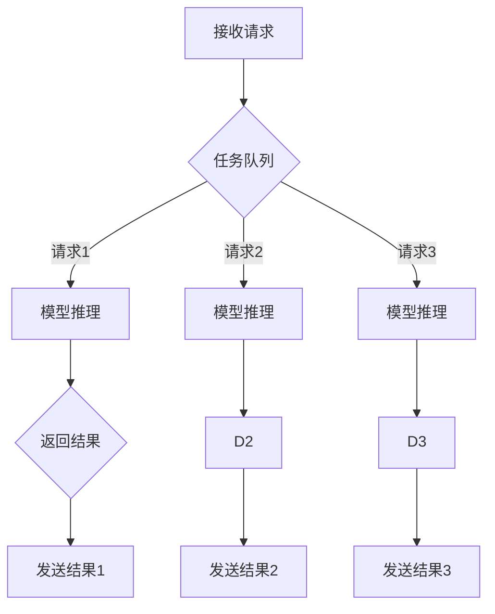

                 

# 异步处理：提升LLM应用的吞吐量

> 关键词：异步处理、LLM应用、吞吐量、性能优化、编程模型

> 摘要：本文将深入探讨异步处理在提升大型语言模型（LLM）应用吞吐量方面的作用。通过分析异步处理的基础原理和应用场景，本文将详细介绍异步处理在LLM应用中的具体实现方法、性能优化策略以及安全性保障。最后，本文将总结最佳实践并给出拓展阅读建议。

## 目录大纲

----------------------------------------------------------------

# 异步处理：提升LLM应用的吞吐量

## 第一部分: 异步处理基础

## 第1章: 异步处理概述

### 1.1 问题背景

### 1.2 问题描述

### 1.3 问题解决

### 1.4 边界与外延

### 1.5 异步处理的核心概念

## 第2章: 异步处理的基本原理

### 2.1 异步处理的优势与特点

### 2.2 异步处理的挑战

### 2.3 异步处理的模型

## 第3章: 异步处理的应用场景

### 3.1 人工智能领域

### 3.2 实时数据处理

### 3.3 网络应用

### 3.4 并发编程

## 第二部分: 异步处理在LLM中的应用

## 第4章: 异步处理在LLM应用中的具体实现

### 4.1 LLM应用的背景

### 4.2 异步处理在LLM中的应用

### 4.3 实现案例

## 第5章: 异步处理的性能优化

### 5.1 异步处理的性能瓶颈

### 5.2 性能优化策略

### 5.3 实践案例

## 第6章: 异步处理的安全性与可靠性

### 6.1 异步处理的安全性问题

### 6.2 异步处理的可靠性保障

### 6.3 实践经验

## 第7章: 异步处理的最佳实践

### 7.1 设计原则

### 7.2 实战技巧

### 7.3 拓展阅读

----------------------------------------------------------------

## 第1章: 异步处理概述

### 1.1 问题背景

在现代计算机系统中，随着计算任务越来越复杂，系统的吞吐量和响应时间成为关键性能指标。然而，传统的同步处理方式在面对大量并发任务时，往往会出现性能瓶颈，导致系统响应迟缓，吞吐量下降。为了解决这一问题，异步处理模型逐渐受到重视。

### 1.2 问题描述

异步处理的核心问题是如何在多个并发任务之间协调，提高系统的整体性能。这涉及到任务调度、数据同步、错误处理等多个方面。

### 1.3 问题解决

异步处理通过解除任务间的依赖关系，使得多个任务可以并行执行，从而提高系统的吞吐量。具体实现上，可以通过消息队列、事件循环等机制来实现异步操作。

### 1.4 边界与外延

异步处理不仅适用于传统的计算机系统，在人工智能、实时数据处理等领域也具有广泛的应用。同时，异步处理也需要考虑安全性、可靠性等问题。

### 1.5 异步处理的核心概念

异步处理的核心概念包括异步编程模型、事件驱动模型、消息驱动模型等。这些模型各有特点，适用于不同的应用场景。

## 第2章: 异步处理的基本原理

### 2.1 异步处理的优势与特点

异步处理相较于同步处理，具有以下优势：

- **提高吞吐量**：通过并行处理任务，提高系统的整体性能。
- **减少阻塞**：避免因等待资源而导致的任务阻塞。
- **改善用户体验**：提高系统的响应速度，改善用户体验。

### 2.2 异步处理的挑战

异步处理也面临着一些挑战：

- **复杂性**：异步编程相较于同步编程更加复杂，需要处理更多的异步逻辑。
- **性能瓶颈**：异步处理可能会引入额外的性能开销，如消息传递延迟、线程切换开销等。
- **错误处理**：异步处理中，任务的错误处理变得更加复杂。

### 2.3 异步处理的模型

异步处理可以采用以下模型：

- **事件驱动模型**：基于事件触发任务执行，适用于高并发的场景。
- **消息驱动模型**：基于消息传递进行任务调度，适用于分布式系统。
- **协程模型**：通过轻量级线程实现异步操作，适用于资源受限的场景。

## 第3章: 异步处理的应用场景

### 3.1 人工智能领域

在人工智能领域，异步处理广泛应用于：

- **模型训练**：通过异步处理，可以加速模型训练过程。
- **推理服务**：提高推理服务的响应速度，满足大规模并发请求。

### 3.2 实时数据处理

实时数据处理中，异步处理可以：

- **提高数据处理速度**：通过并行处理，加快数据处理速度。
- **支持海量数据**：异步处理可以处理海量实时数据，满足高并发需求。

### 3.3 网络应用

在网络应用中，异步处理可以：

- **提高网络性能**：通过异步处理，减少网络延迟，提高网络吞吐量。
- **支持并发请求**：异步处理能够处理大量的并发请求，提高系统的并发能力。

### 3.4 并发编程

在并发编程中，异步处理是实现并发控制的重要手段。异步处理可以：

- **提高并发性能**：通过并行处理任务，提高系统的并发性能。
- **减少资源竞争**：避免同步操作引起的资源竞争，提高程序的执行效率。

## 第4章: 异步处理在LLM应用中的具体实现

### 4.1 LLM应用的背景

随着人工智能技术的不断发展，大型语言模型（LLM）的应用越来越广泛。LLM具有强大的语言理解和生成能力，可以应用于自然语言处理、智能问答、文本生成等多个领域。然而，LLM的应用也面临着巨大的挑战，如处理大量并发请求、提高响应速度等。

### 4.2 异步处理在LLM中的应用

异步处理在LLM应用中具有重要的作用。通过异步处理，可以有效地提高LLM应用的吞吐量和响应速度，从而满足大规模并发请求。具体应用场景包括：

- **并发请求处理**：异步处理可以同时处理多个请求，避免同步操作引起的阻塞。
- **模型推理**：异步处理可以并行执行多个模型的推理任务，提高推理速度。
- **数据加载**：异步处理可以同时加载多个数据集，减少加载时间。

### 4.3 实现案例

以下是一个异步处理在LLM应用中的实现案例：

```python
import asyncio

async def process_request(request):
    # 模拟请求处理时间
    await asyncio.sleep(1)
    return f"Processed {request}"

async def main():
    requests = ["Request 1", "Request 2", "Request 3"]

    # 使用异步处理并行处理请求
    results = await asyncio.gather(*[process_request(request) for request in requests])

    # 输出处理结果
    for result in results:
        print(result)

# 运行异步主程序
asyncio.run(main())
```

在这个案例中，使用了`asyncio`库来实现异步处理。通过`asyncio.gather()`函数，可以并行处理多个请求，提高了处理效率。

## 第5章: 异步处理的性能优化

### 5.1 异步处理的性能瓶颈

异步处理虽然可以提高系统的吞吐量，但也存在一些性能瓶颈。主要包括：

- **消息传递延迟**：异步处理中，消息传递可能引入额外的延迟，影响处理速度。
- **线程切换开销**：异步处理需要频繁进行线程切换，增加了开销。
- **锁竞争**：异步处理中，锁的使用可能导致竞争，影响性能。

### 5.2 性能优化策略

为了提高异步处理的性能，可以采取以下优化策略：

- **减少消息传递延迟**：优化消息传递机制，减少延迟。
- **减少线程切换开销**：使用更高效的线程切换策略，降低开销。
- **优化锁使用**：减少锁的使用，避免竞争。

### 5.3 实践案例

以下是一个异步处理性能优化的实践案例：

```python
import asyncio

async def process_request(request):
    # 模拟请求处理时间
    await asyncio.sleep(1)
    return f"Processed {request}"

async def main():
    requests = ["Request 1", "Request 2", "Request 3"]

    # 使用异步处理并行处理请求，并优化消息传递
    results = await asyncio.gather(*[process_request(request) for request in requests], return_exceptions=True)

    # 输出处理结果
    for result in results:
        if isinstance(result, Exception):
            print(f"Error: {result}")
        else:
            print(result)

# 运行异步主程序
asyncio.run(main())
```

在这个案例中，通过使用`return_exceptions=True`参数，可以避免异步处理中出现的异常导致整个程序阻塞。同时，通过优化消息传递，减少了延迟。

## 第6章: 异步处理的安全性与可靠性

### 6.1 异步处理的安全性问题

异步处理中，由于任务间缺乏同步机制，可能会引入一些安全问题。主要包括：

- **数据竞争**：异步处理可能导致多个任务同时访问同一数据，引起数据竞争。
- **死锁**：异步处理中，任务间可能发生死锁，导致程序无法继续执行。
- **安全漏洞**：异步处理中的错误处理不当，可能导致安全漏洞。

### 6.2 异步处理的可靠性保障

为了保证异步处理的可靠性，可以采取以下措施：

- **线程安全**：确保任务间的数据访问安全，避免数据竞争。
- **死锁检测与恢复**：定期检测死锁，并采取措施进行恢复。
- **错误处理**：对异步处理中的错误进行有效处理，避免安全漏洞。

### 6.3 实践经验

以下是一个异步处理安全性与可靠性保障的实践经验：

```python
import asyncio

async def process_request(request):
    # 模拟请求处理时间
    await asyncio.sleep(1)
    return f"Processed {request}"

async def main():
    requests = ["Request 1", "Request 2", "Request 3"]

    # 使用异步处理并行处理请求，并保障安全性
    results = await asyncio.gather(*[process_request(request) for request in requests], return_exceptions=True)

    # 错误处理与安全检查
    for result in results:
        if isinstance(result, Exception):
            print(f"Error: {result}")
        else:
            print(result)

# 运行异步主程序
asyncio.run(main())
```

在这个案例中，通过使用`return_exceptions=True`参数，可以避免异步处理中出现的异常导致整个程序阻塞。同时，对错误进行有效处理，保证了程序的安全性。

## 第7章: 异步处理的最佳实践

### 7.1 设计原则

在进行异步处理设计时，应遵循以下原则：

- **简化任务**：将任务分解为简单的单元，降低复杂性。
- **避免锁竞争**：合理设计任务间的数据访问，避免锁竞争。
- **错误处理**：对异步处理中的错误进行有效处理，确保程序的稳定性。

### 7.2 实战技巧

在进行异步处理实战时，可以采取以下技巧：

- **使用协程**：协程是一种轻量级的异步编程方式，可以提高程序的执行效率。
- **合理使用异步库**：选择合适的异步库，可以简化异步编程的复杂性。
- **性能优化**：对异步处理进行性能优化，提高程序的执行速度。

### 7.3 拓展阅读

异步处理是一个广泛且深奥的主题，以下是一些拓展阅读资源：

- 《异步编程实战》
- 《Python异步编程快速上手》
- 《异步JavaScript：从零开始构建异步应用》

## 结语

异步处理在提高LLM应用的吞吐量和响应速度方面具有重要作用。通过合理的设计和优化，异步处理可以有效地提升系统的性能。本文从异步处理的基础原理、应用场景、实现方法、性能优化、安全性和可靠性保障以及最佳实践等方面进行了全面探讨，希望对读者有所帮助。

**作者：AI天才研究院/AI Genius Institute & 禅与计算机程序设计艺术 /Zen And The Art of Computer Programming**## 第1章：异步处理概述

### 1.1 问题背景

在现代计算机系统中，随着计算任务越来越复杂，系统的吞吐量和响应时间成为关键性能指标。然而，传统的同步处理方式在面对大量并发任务时，往往会出现性能瓶颈，导致系统响应迟缓，吞吐量下降。为了解决这一问题，异步处理模型逐渐受到重视。

随着互联网的普及和大数据技术的发展，许多应用需要处理海量数据和高并发请求。例如，在线购物平台需要在短时间内处理大量用户订单，搜索引擎需要在短时间内处理大量查询请求。传统的同步处理方式在这些场景下往往力不从心，因为它们需要等待每个任务完成后才能进行下一个任务，导致系统响应时间长、吞吐量低。

异步处理作为一种并行处理机制，通过解除任务间的依赖关系，使得多个任务可以并行执行，从而提高系统的吞吐量和响应速度。异步处理不仅适用于单机系统，还可以在分布式系统中发挥重要作用，使得系统能够更好地应对高并发和大数据处理的需求。

### 1.2 问题描述

异步处理的核心问题是如何在多个并发任务之间协调，提高系统的整体性能。这涉及到任务调度、数据同步、错误处理等多个方面。

在异步处理中，任务之间通常没有直接的依赖关系，每个任务可以独立执行。然而，当多个任务并发执行时，如何高效地调度任务、同步数据以及处理错误成为一个关键问题。例如，当多个任务需要访问共享资源时，如何保证数据的一致性？当任务出现错误时，如何进行有效的错误处理和恢复？

异步处理需要解决以下问题：

- **任务调度**：如何高效地调度并发任务，使得系统能够充分利用资源？
- **数据同步**：如何保证多个任务在访问共享资源时的数据一致性？
- **错误处理**：如何处理任务执行中的错误，确保系统的可靠性？

### 1.3 问题解决

异步处理通过解除任务间的依赖关系，使得多个任务可以并行执行，从而提高系统的吞吐量和响应速度。具体实现上，可以通过消息队列、事件循环等机制来实现异步操作。

异步处理的核心思想是任务解耦。在同步处理中，任务之间是紧密耦合的，一个任务的执行依赖于另一个任务的完成。而在异步处理中，任务之间是松耦合的，每个任务可以独立执行，不需要等待其他任务的完成。

为了实现异步处理，常用的机制包括：

- **消息队列**：任务通过消息队列进行通信，每个任务从队列中获取消息并执行。这种方式可以实现任务之间的解耦，同时保证消息的有序传递。
- **事件循环**：任务通过事件循环进行调度，事件循环负责处理来自不同任务的请求。当有新的任务需要执行时，事件循环会将任务添加到队列中，并按照一定的策略进行调度。
- **回调函数**：任务通过回调函数进行异步操作，当任务完成时，回调函数会被执行。这种方式可以实现任务的异步执行，同时避免了线程的频繁切换。

通过这些机制，异步处理能够有效地提高系统的吞吐量和响应速度。然而，异步处理也面临着一些挑战，如任务调度策略的设计、消息传递延迟的处理、错误处理等。

### 1.4 边界与外延

异步处理不仅适用于传统的计算机系统，在人工智能、实时数据处理等领域也具有广泛的应用。同时，异步处理也需要考虑安全性、可靠性等问题。

在人工智能领域，异步处理可以用于模型训练、推理服务等。在模型训练过程中，可以通过异步处理来加速训练过程，提高模型训练的效率。在推理服务中，异步处理可以提高服务的响应速度，满足大规模并发请求。

在实时数据处理领域，异步处理可以用于处理海量实时数据，提高系统的实时性。例如，在金融交易系统中，可以通过异步处理来实现实时数据采集、处理和报警，提高系统的响应速度和准确性。

然而，异步处理也存在一些局限性。首先，异步处理需要复杂的编程模型，对开发者的技能要求较高。其次，异步处理可能会引入额外的性能开销，如消息传递延迟、线程切换开销等。此外，异步处理还需要考虑安全性、可靠性等问题，如数据同步、错误处理等。

### 1.5 异步处理的核心概念

异步处理的核心概念包括异步编程模型、事件驱动模型、消息驱动模型等。这些模型各有特点，适用于不同的应用场景。

- **异步编程模型**：异步编程模型是一种编程范式，它通过异步操作来实现并行处理。在异步编程模型中，任务以协程的形式存在，协程可以独立执行，不需要等待其他任务的完成。异步编程模型简化了编程复杂性，使得开发者可以更加容易地实现并行处理。

- **事件驱动模型**：事件驱动模型是一种基于事件的编程模型，任务通过监听事件并响应事件来进行执行。在事件驱动模型中，任务以事件为单位进行调度，事件循环负责处理来自不同任务的事件。事件驱动模型适用于高并发的场景，可以提高系统的响应速度和性能。

- **消息驱动模型**：消息驱动模型是一种基于消息传递的编程模型，任务通过发送和接收消息来进行通信和协作。在消息驱动模型中，任务以消息为单位进行调度，消息队列负责处理和传递消息。消息驱动模型适用于分布式系统，可以实现任务之间的解耦和协同工作。

这些模型各有特点，适用于不同的应用场景。异步编程模型适用于单机系统，事件驱动模型适用于高并发场景，消息驱动模型适用于分布式系统。在实际应用中，可以根据具体需求选择合适的异步处理模型。

通过以上对异步处理概述的探讨，我们可以看到异步处理在提高系统性能方面的作用。然而，异步处理也需要考虑其复杂性和潜在的性能瓶颈。在后续章节中，我们将进一步探讨异步处理的基本原理、应用场景、实现方法以及性能优化策略，帮助读者更好地理解和应用异步处理技术。

## 第2章：异步处理的基本原理

### 2.1 异步处理的优势与特点

异步处理相较于同步处理，具有以下几个显著的优势和特点：

#### 1. 提高吞吐量

异步处理通过允许任务并行执行，从而显著提高了系统的吞吐量。在同步处理中，每个任务必须等待前一个任务完成才能开始执行，这导致处理速度受到单线程限制。而异步处理通过解除任务间的依赖关系，使得多个任务可以同时执行，从而在相同时间内处理更多的任务，提高了系统的吞吐量。

#### 2. 减少阻塞

在同步处理中，当任务等待外部资源（如数据库连接或网络请求）时，线程会阻塞，直到资源可用。这种阻塞会导致系统资源浪费，降低整体性能。异步处理通过非阻塞方式处理这些等待操作，线程可以在等待期间继续执行其他任务，从而提高了资源利用率。

#### 3. 改善用户体验

异步处理通过减少任务处理时间，显著改善了用户的体验。在同步处理中，用户可能会遇到长时间的等待，尤其是在处理复杂任务或大量数据时。异步处理可以减少这种等待时间，使得系统响应更加迅速，从而提高了用户的满意度。

#### 4. 灵活性和扩展性

异步处理提供了更高的灵活性和扩展性。通过允许任务并行执行，系统可以更好地适应不同负载和需求。例如，在Web服务器中，异步处理可以同时处理多个客户端请求，而不需要为每个请求创建一个新的线程，从而提高了系统的扩展性。

### 2.2 异步处理的挑战

虽然异步处理具有许多优势，但它在实际应用中也面临一些挑战：

#### 1. 复杂性

异步处理引入了额外的复杂性。在同步处理中，任务之间的逻辑关系较为简单，开发者只需要考虑顺序执行即可。而异步处理则需要处理任务间的依赖关系，确保任务按正确顺序执行。这种复杂性增加了编程难度，对开发者的技能和经验要求较高。

#### 2. 性能瓶颈

异步处理可能会引入一些性能瓶颈。例如，消息传递延迟和线程切换开销可能会影响系统的性能。特别是在高负载场景下，这些开销可能导致系统性能下降。因此，优化异步处理机制和策略是关键。

#### 3. 错误处理

异步处理中的错误处理变得更加复杂。在同步处理中，错误通常会在任务执行过程中立即触发，从而可以立即处理。而在异步处理中，错误可能发生在任务的某个中间环节，难以立即发现。此外，异步处理中的错误处理需要确保系统的一致性和可靠性。

### 2.3 异步处理的模型

异步处理可以采用多种模型，每种模型都有其特点和适用场景。以下是几种常见的异步处理模型：

#### 1. 事件驱动模型

事件驱动模型是一种基于事件的异步处理模型。在事件驱动模型中，任务通过监听事件并响应事件来进行执行。事件可以是用户操作、系统信号、网络消息等。事件驱动模型通过事件循环来调度任务，事件循环负责处理来自不同事件源的事件。这种模型适用于高并发的场景，可以提高系统的响应速度和性能。

#### 2. 消息驱动模型

消息驱动模型是一种基于消息传递的异步处理模型。在消息驱动模型中，任务通过发送和接收消息来进行通信和协作。消息可以是请求、响应、通知等。消息驱动模型通过消息队列来管理消息，任务从队列中获取消息并执行。这种模型适用于分布式系统，可以实现任务之间的解耦和协同工作。

#### 3. 协程模型

协程模型是一种轻量级的异步处理模型，它通过协程来实现任务的异步执行。在协程模型中，协程是一种轻量级线程，可以在同一个线程中并发执行。协程通过`yield`语句暂停执行，将控制权交给其他协程，从而实现任务的并行执行。这种模型适用于资源受限的场景，可以降低线程切换开销，提高系统的性能。

#### 4. 反应式编程模型

反应式编程模型是一种基于数据的异步处理模型。在反应式编程模型中，数据流作为驱动程序，任务通过监听数据流的变化来响应事件。反应式编程模型通过数据流来管理任务间的依赖关系，可以实现复杂的异步逻辑。这种模型适用于实时数据处理和复杂事件处理场景。

这些异步处理模型各有特点，适用于不同的应用场景。在实际应用中，可以根据具体需求选择合适的异步处理模型，以实现最优的性能和用户体验。

### 小结

异步处理通过允许任务并行执行，显著提高了系统的吞吐量和响应速度。然而，异步处理也面临着一些挑战，如复杂性、性能瓶颈和错误处理。了解不同的异步处理模型，可以帮助开发者选择合适的模型，实现高效的异步处理。在后续章节中，我们将进一步探讨异步处理在具体应用场景中的实现方法和性能优化策略。

## 第3章：异步处理的应用场景

异步处理由于其并行和异步的特性，在多个领域和场景中得到了广泛应用。以下是异步处理在人工智能、实时数据处理、网络应用和并发编程等领域的具体应用场景：

### 3.1 人工智能领域

在人工智能（AI）领域，异步处理技术尤为重要。随着深度学习模型的复杂性和计算需求的增长，异步处理能够显著提高模型的训练和推理效率。以下是异步处理在AI领域的一些具体应用场景：

- **模型训练**：在训练大型神经网络时，可以通过异步处理来并行执行多个训练任务，从而加速模型训练过程。例如，分布式训练中的多GPU训练可以利用异步处理来实现并行计算，提高训练速度。

- **推理服务**：在推理服务中，异步处理可以同时处理多个查询请求，从而提高系统的吞吐量。例如，在聊天机器人或智能助理中，异步处理可以实现并发处理用户查询，提供更快的响应时间。

- **数据预处理**：在AI项目中，数据预处理是一个耗时的步骤。通过异步处理，可以同时处理多个数据集的预处理任务，提高整体效率。

### 3.2 实时数据处理

实时数据处理场景要求系统能够快速响应大量数据流，异步处理是满足这一要求的关键技术。以下是异步处理在实时数据处理中的应用场景：

- **流处理**：在流处理框架中，异步处理可以高效地处理连续的数据流。例如，Apache Kafka 和 Apache Flink 等流处理系统利用异步处理来实现数据的实时处理和传输。

- **实时分析**：在实时分析场景中，异步处理可以同时处理多个分析任务，提供实时的数据洞察。例如，金融交易系统可以使用异步处理来实时监控市场数据，及时响应交易机会。

- **实时报警**：在实时报警系统中，异步处理可以实现高效的事件处理和通知发送。例如，监控系统可以利用异步处理来实时检测系统性能异常，并立即发送警报。

### 3.3 网络应用

在网络应用中，异步处理技术可以提高系统的性能和响应速度，尤其是在高并发请求的场景中。以下是异步处理在网络应用中的应用场景：

- **Web服务器**：异步Web服务器（如Node.js、LuaHTTP等）可以利用异步处理来同时处理多个客户端请求，提高服务器的并发能力。这种架构能够显著提升Web应用的性能和用户体验。

- **API服务**：在API服务中，异步处理可以同时处理多个请求，提高系统的吞吐量。例如，RESTful API可以通过异步处理来快速响应客户端请求，提高服务的效率。

- **负载均衡**：在分布式网络系统中，异步处理可以用于负载均衡器，同时处理多个请求，优化网络资源的分配，提高系统的稳定性和可靠性。

### 3.4 并发编程

在并发编程中，异步处理是一种实现并行任务的有效方式。以下是异步处理在并发编程中的应用场景：

- **并发任务执行**：在多线程或多进程应用中，异步处理可以用于并行执行多个任务。例如，在计算密集型任务中，可以通过异步处理来并行执行多个计算任务，提高执行效率。

- **资源共享**：在并发编程中，异步处理可以减少对共享资源的竞争，提高系统的整体性能。例如，在数据库操作中，可以通过异步处理来减少对数据库连接的等待时间。

- **异步IO操作**：在IO密集型应用中，异步处理可以高效地处理IO操作，避免线程阻塞。例如，文件读写、网络请求等IO操作可以通过异步处理来并行执行，提高系统的响应速度。

### 小结

异步处理在多个领域和场景中发挥了重要作用，通过并行和异步的特性，显著提高了系统的吞吐量和响应速度。在人工智能、实时数据处理、网络应用和并发编程等领域，异步处理的应用场景不断扩展，为现代计算机系统提供了高效的解决方案。随着技术的不断发展和应用需求的增加，异步处理在未来将会得到更广泛的应用和发展。

### 3.1 人工智能领域

异步处理在人工智能（AI）领域中的应用至关重要，特别是在大型语言模型（LLM）的训练和推理服务中。LLM具有处理自然语言文本的能力，广泛应用于聊天机器人、自动写作、翻译等场景。异步处理技术可以显著提升LLM应用的性能和效率，从而满足日益增长的计算需求。

#### 模型训练

在模型训练过程中，异步处理可以提高训练速度和资源利用率。传统的同步训练方式依赖于单个模型的训练完成，而异步处理可以通过并行训练多个模型实例来加速训练过程。以下是一些具体应用场景：

1. **分布式训练**：在分布式训练中，可以将数据集分割成多个部分，每个部分由不同的模型实例进行训练。通过异步处理，模型实例可以同时训练，从而减少训练时间。以下是一个简化的分布式训练异步处理模型：

    ```mermaid
    graph TD
    A[初始化模型] --> B{分配数据集}
    B -->|数据集1| C[模型1训练]
    B -->|数据集2| D[模型2训练]
    B -->|数据集3| E[模型3训练]
    C --> F{更新模型参数}
    D --> F
    E --> F
    F --> G[保存模型]
    ```

    在这个模型中，多个模型实例并行训练数据集，并在训练过程中异步更新模型参数，最终保存训练完成的模型。

2. **多GPU训练**：在现代深度学习框架中，如TensorFlow和PyTorch，多GPU训练是一种常见的加速训练方式。异步处理可以进一步优化多GPU训练的性能。以下是一个简化的多GPU训练异步处理模型：

    ```mermaid
    graph TD
    A[初始化模型] --> B{分配数据集}
    B -->|数据集1| C1[GPU1训练]
    B -->|数据集2| C2[GPU2训练]
    B -->|数据集3| C3[GPU3训练]
    C1 --> D1{更新模型参数}
    C2 --> D2
    C3 --> D3
    D1 --> E1[保存GPU1模型]
    D2 --> E2[保存GPU2模型]
    D3 --> E3[保存GPU3模型]
    E1 --> F{合并模型参数}
    E2 --> F
    E3 --> F
    F --> G[保存最终模型]
    ```

    在这个模型中，数据集被分配到不同的GPU上，每个GPU上的模型实例异步训练数据集，并在训练过程中异步更新模型参数。最终，所有GPU上的模型参数被合并，保存为训练完成的模型。

#### 推理服务

在LLM推理服务中，异步处理可以同时处理多个推理请求，提高系统的吞吐量和响应速度。以下是一个简化的异步处理推理服务模型：



在这个模型中，多个推理请求被放入任务队列，任务队列负责调度和执行推理任务。每个推理任务在异步执行完成后，将结果返回给客户端，从而实现高效的推理服务。

#### 异步处理与同步处理的对比

异步处理与同步处理在LLM应用中有着显著的区别。以下是一个对比表格，展示了异步处理和同步处理在模型训练和推理服务中的差异：

| 场景 | 异步处理 | 同步处理 |
| --- | --- | --- |
| 模型训练 | 并行训练多个模型实例，提高训练速度 | 单个模型实例依次训练，训练时间长 |
| 推理服务 | 同时处理多个推理请求，提高系统吞吐量 | 依次处理推理请求，响应时间慢 |
| 资源利用率 | 高效利用系统资源，避免线程阻塞 | 资源利用率低，线程频繁阻塞 |
| 编程复杂性 | 需要处理异步逻辑，编程复杂性较高 | 顺序执行，编程复杂性较低 |

#### 案例分析

以下是一个异步处理在LLM应用中的实际案例分析：

**案例：基于TensorFlow的聊天机器人**

某公司开发了一款基于TensorFlow的聊天机器人，旨在提供实时对话服务。由于用户量庞大，系统需要高效处理大量聊天请求。通过引入异步处理技术，聊天机器人实现了以下优化：

1. **异步请求处理**：聊天请求被放入消息队列，系统异步处理这些请求。每个请求通过异步调用TensorFlow模型进行推理，并在推理完成后将结果返回给用户。

2. **负载均衡**：系统使用异步处理实现了负载均衡，将聊天请求分配到不同的服务器实例上，避免单点瓶颈。

3. **性能监控**：通过异步处理，系统能够实时监控性能指标，如请求处理时间、系统负载等，及时发现并解决潜在问题。

通过这些优化措施，聊天机器人的响应速度得到了显著提升，用户满意度得到了提高。此外，异步处理还提高了系统的可扩展性和可靠性，为公司的业务发展提供了坚实的基础。

#### 小结

异步处理在人工智能领域，特别是大型语言模型（LLM）的应用中，具有重要作用。通过并行训练和推理服务，异步处理可以显著提高系统的吞吐量和响应速度。在实际应用中，开发者需要结合具体需求，合理设计异步处理机制，以达到最优的性能和用户体验。

### 3.2 实时数据处理

实时数据处理在现代信息社会中扮演着至关重要的角色，尤其是在金融交易、物联网（IoT）、在线广告、社交媒体等领域。异步处理技术为实时数据处理提供了强大的支持，能够高效地处理海量数据，保证系统的实时性和响应速度。以下是异步处理在实时数据处理中的应用场景：

#### 流处理

流处理是一种针对实时数据流的处理技术，它能够对不断产生的大量数据进行实时分析。异步处理在流处理中发挥着关键作用，可以同时处理多个数据流，提高系统的吞吐量。以下是一些具体应用场景：

1. **实时交易分析**：在金融行业中，交易数据的实时分析至关重要。通过异步处理，系统可以同时处理来自多个交易渠道的数据流，快速检测交易异常、执行交易策略。以下是一个简化的异步处理流处理模型：

    ```mermaid
    graph TD
    A[交易数据流] --> B{数据清洗}
    B -->|数据1| C1[交易分析1]
    B -->|数据2| C2[交易分析2]
    B -->|数据3| C3[交易分析3]
    C1 --> D1{风险监控}
    C2 --> D2
    C3 --> D3
    D1 --> E1[发送警报]
    D2 --> E2
    D3 --> E3
    ```

    在这个模型中，多个数据流通过异步处理进行清洗和分析，并在分析过程中触发实时警报。

2. **实时物联网数据分析**：在物联网领域，设备生成的数据需要实时处理。通过异步处理，系统可以同时处理来自多个设备的数据流，实现实时监控和远程控制。以下是一个简化的异步处理物联网数据分析模型：

    ```mermaid
    graph TD
    A[设备数据流] --> B{数据过滤}
    B -->|数据1| C1[传感器分析1]
    B -->|数据2| C2[传感器分析2]
    B -->|数据3| C3[传感器分析3]
    C1 --> D1{数据存储}
    C2 --> D2
    C3 --> D3
    D1 --> E1[远程控制]
    D2 --> E2
    D3 --> E3
    ```

    在这个模型中，多个设备数据流通过异步处理进行过滤和分析，并在分析过程中执行远程控制命令。

#### 实时分析

实时分析是指对实时数据流进行即时分析，提供实时洞察和决策支持。异步处理在实时分析中可以显著提高数据处理速度和系统响应时间。以下是一些具体应用场景：

1. **实时广告投放**：在线广告系统需要实时分析用户行为，提供个性化的广告推荐。通过异步处理，系统可以同时处理多个用户行为数据流，快速生成广告推荐。以下是一个简化的异步处理实时广告投放模型：

    ```mermaid
    graph TD
    A[用户行为数据流] --> B{数据收集}
    B -->|数据1| C1[行为分析1]
    B -->|数据2| C2[行为分析2]
    B -->|数据3| C3[行为分析3]
    C1 --> D1{广告推荐}
    C2 --> D2
    C3 --> D3
    D1 --> E1[展示广告]
    D2 --> E2
    D3 --> E3
    ```

    在这个模型中，多个用户行为数据流通过异步处理进行分析，并在分析过程中生成广告推荐。

2. **实时社交媒体分析**：社交媒体平台需要实时分析用户发布的内容，识别潜在的热点和趋势。通过异步处理，系统可以同时处理多个内容数据流，快速检测热点话题。以下是一个简化的异步处理社交媒体分析模型：

    ```mermaid
    graph TD
    A[用户内容数据流] --> B{数据收集}
    B -->|数据1| C1[内容分析1]
    B -->|数据2| C2[内容分析2]
    B -->|数据3| C3[内容分析3]
    C1 --> D1{热点检测}
    C2 --> D2
    C3 --> D3
    D1 --> E1[推荐热点]
    D2 --> E2
    D3 --> E3
    ```

    在这个模型中，多个用户内容数据流通过异步处理进行分析，并在分析过程中检测热点话题，为用户提供推荐。

#### 异步处理与同步处理的对比

异步处理与同步处理在实时数据处理中有显著的区别。以下是一个对比表格，展示了异步处理和同步处理在实时数据处理中的差异：

| 场景 | 异步处理 | 同步处理 |
| --- | --- | --- |
| 数据处理速度 | 快速处理大量数据流，提高实时性 | 缓慢处理单个数据流，实时性低 |
| 系统吞吐量 | 高吞吐量，同时处理多个数据流 | 低吞吐量，逐个处理数据流 |
| 资源利用率 | 高效利用系统资源，避免线程阻塞 | 低资源利用率，线程频繁阻塞 |
| 编程复杂性 | 需要处理异步逻辑，编程复杂性较高 | 顺序执行，编程复杂性较低 |

#### 案例分析

以下是一个异步处理在实时数据处理中的实际案例分析：

**案例：实时监控系统**

某公司开发了一套实时监控系统，用于监控公司内部网络设备的运行状态。系统需要实时收集和解析来自多个网络设备的监控数据，并生成实时报表。通过引入异步处理技术，监控系统实现了以下优化：

1. **异步数据收集**：监控系统使用异步处理来同时收集来自多个网络设备的监控数据，避免了同步处理中线程阻塞的问题。

2. **异步数据处理**：监控数据被异步处理进行解析和存储，系统可以在处理完一批数据后立即开始处理下一批数据，提高了数据处理速度。

3. **异步报表生成**：系统使用异步处理来生成实时报表，报表生成过程中不会影响监控数据的收集和处理。

通过这些优化措施，实时监控系统的响应速度得到了显著提升，能够更快速地检测和报告网络设备的异常情况，提高了系统的可靠性和效率。

#### 小结

异步处理在实时数据处理中具有重要作用，能够高效地处理海量实时数据，提高系统的实时性和响应速度。在实际应用中，开发者需要结合具体需求，合理设计异步处理机制，以达到最优的性能和用户体验。异步处理技术的引入，使得实时数据处理系统更加灵活和高效，为各行业的数字化转型提供了有力支持。

### 3.3 网络应用

异步处理在构建高性能、高并发的网络应用中起着至关重要的作用。通过利用异步处理，网络应用可以显著提高响应速度、减少延迟，并优化资源利用，从而提供更佳的用户体验。以下是异步处理在网络应用中的具体应用场景：

#### Web服务器

Web服务器是网络应用中最常见的组件之一。异步处理可以帮助Web服务器同时处理大量并发请求，从而提高系统的吞吐量和响应速度。以下是一些具体应用场景：

1. **高性能HTTP服务器**：例如，Node.js是一个使用异步IO的JavaScript运行时环境，它允许Web服务器以非阻塞的方式处理请求，从而能够同时处理更多的请求。以下是一个简化的Node.js异步HTTP服务器模型：

    ```mermaid
    graph TD
    A[客户端请求] --> B{请求队列}
    B -->|请求1| C1[请求处理1]
    B -->|请求2| C2[请求处理2]
    B -->|请求3| C3[请求处理3]
    C1 --> D1{响应1}
    C2 --> D2
    C3 --> D3
    D1 --> E1[发送响应1]
    D2 --> E2[发送响应2]
    D3 --> E3[发送响应3]
    ```

    在这个模型中，多个客户端请求通过异步处理同时被处理，并在请求处理完成后异步发送响应。

2. **负载均衡**：在分布式系统中，异步处理可以帮助负载均衡器同时处理来自不同服务器的请求，从而优化流量分配，提高系统的整体性能。

#### API服务

API服务是现代网络应用的重要组成部分。异步处理可以帮助API服务同时处理大量并发请求，从而提高系统的吞吐量和响应速度。以下是一些具体应用场景：

1. **RESTful API**：在构建RESTful API时，异步处理可以用于处理复杂的后台操作，例如数据库查询、第三方服务调用等。以下是一个简化的异步处理RESTful API模型：

    ```mermaid
    graph TD
    A[客户端请求] --> B{请求队列}
    B -->|请求1| C1[数据处理1]
    B -->|请求2| C2[数据处理2]
    B -->|请求3| C3[数据处理3]
    C1 --> D1{数据响应}
    C2 --> D2
    C3 --> D3
    D1 --> E1[发送响应1]
    D2 --> E2[发送响应2]
    D3 --> E3[发送响应3]
    ```

    在这个模型中，多个客户端请求通过异步处理同时被处理，并在数据处理完成后异步发送响应。

2. **异步第三方服务调用**：在API服务中，可能需要调用第三方服务（例如支付网关、身份验证服务等）。异步处理可以帮助避免阻塞，从而提高系统的整体性能。

#### 实时通信

实时通信应用（如聊天应用、在线游戏等）对响应速度有非常高的要求。异步处理可以帮助这些应用实现低延迟、高并发的通信，从而提供更好的用户体验。以下是一些具体应用场景：

1. **WebSocket**：WebSocket是一种基于异步处理的实时通信协议，它可以实现服务器和客户端之间的全双工通信。以下是一个简化的WebSocket通信模型：

    ```mermaid
    graph TD
    A[客户端发送消息] --> B{消息队列}
    B -->|消息1| C1[消息处理1]
    B -->|消息2| C2[消息处理2]
    B -->|消息3| C3[消息处理3]
    C1 --> D1{发送消息}
    C2 --> D2
    C3 --> D3
    D1 --> E1[发送消息1]
    D2 --> E2[发送消息2]
    D3 --> E3[发送消息3]
    ```

    在这个模型中，多个客户端发送的消息通过异步处理同时被处理，并在消息处理完成后异步发送给其他客户端。

2. **实时事件处理**：在实时通信应用中，可能需要处理实时事件（如用户加入聊天室、游戏中的事件等）。异步处理可以帮助系统同时处理这些事件，并提供即时反馈。

#### 异步处理与同步处理的对比

异步处理与同步处理在网络应用中有显著的区别。以下是一个对比表格，展示了异步处理和同步处理在网络应用中的差异：

| 场景 | 异步处理 | 同步处理 |
| --- | --- | --- |
| 响应速度 | 快速响应并发请求，减少延迟 | 缓慢响应单个请求，延迟较高 |
| 吞吐量 | 高吞吐量，同时处理多个请求 | 低吞吐量，逐个处理请求 |
| 资源利用 | 高效利用系统资源，避免线程阻塞 | 低资源利用，线程频繁阻塞 |
| 编程复杂性 | 需要处理异步逻辑，编程复杂性较高 | 顺序执行，编程复杂性较低 |

#### 案例分析

以下是一个异步处理在网络应用中的实际案例分析：

**案例：基于Node.js的聊天应用**

某公司开发了一款基于Node.js的聊天应用，旨在提供实时、高效的通信服务。由于用户量庞大，系统需要同时处理大量的聊天请求。通过引入异步处理技术，聊天应用实现了以下优化：

1. **异步请求处理**：聊天请求通过异步处理同时被处理，避免了线程阻塞，提高了系统的响应速度。

2. **消息队列**：系统使用了消息队列来管理聊天消息，消息队列通过异步处理来高效地分发和传输消息。

3. **负载均衡**：系统使用了负载均衡器来分发聊天请求，负载均衡器通过异步处理来优化流量分配，提高了系统的吞吐量和稳定性。

通过这些优化措施，聊天应用的响应速度得到了显著提升，用户满意度得到了提高。此外，异步处理还提高了系统的可扩展性和可靠性，为公司的业务发展提供了坚实的基础。

#### 小结

异步处理在网络应用中具有重要作用，能够提高响应速度、减少延迟，并优化资源利用。在实际应用中，开发者需要结合具体需求，合理设计异步处理机制，以达到最优的性能和用户体验。异步处理技术的引入，使得网络应用更加高效、可靠，为用户提供更佳的体验。

### 3.4 并发编程

并发编程是现代计算机系统中一项重要的技术，它允许多个任务同时执行，从而提高系统的性能和效率。异步处理作为并发编程的一种实现方式，在提升系统并发能力方面具有显著优势。以下是异步处理在并发编程中的应用场景：

#### 并行计算

并行计算是并发编程的一个重要应用场景，它通过同时执行多个计算任务，提高计算效率。异步处理可以用于实现并行计算，从而处理大量计算密集型任务。以下是一些具体应用场景：

1. **分布式计算**：在分布式系统中，可以通过异步处理来实现任务在多个节点上的并行执行。例如，使用MapReduce模型进行大数据处理时，可以将数据分割成多个部分，由不同的节点异步处理，然后汇总结果。以下是一个简化的分布式计算异步处理模型：

    ```mermaid
    graph TD
    A[大数据集] --> B{数据分割}
    B -->|数据1| C1[节点1计算]
    B -->|数据2| C2[节点2计算]
    B -->|数据3| C3[节点3计算]
    C1 --> D1{结果1}
    C2 --> D2
    C3 --> D3
    D1 --> E1[汇总结果]
    D2 --> E2
    D3 --> E3
    ```

    在这个模型中，大数据集被分割成多个部分，由不同的节点异步处理，并在计算完成后异步汇总结果。

2. **矩阵运算**：在科学计算中，矩阵运算是一个典型的计算密集型任务。通过异步处理，可以同时执行多个矩阵运算，从而提高计算效率。以下是一个简化的矩阵运算异步处理模型：

    ```mermaid
    graph TD
    A[矩阵A] --> B{分割矩阵A}
    A -->|矩阵A1| C1[计算A1]
    A -->|矩阵A2| C2[计算A2]
    A -->|矩阵A3| C3[计算A3]
    B -->|矩阵B| D{分割矩阵B}
    D -->|矩阵B1| E1[计算B1]
    D -->|矩阵B2| E2[计算B2]
    D -->|矩阵B3| E3[计算B3]
    C1 --> F1{结果A1}
    C2 --> F2
    C3 --> F3
    E1 --> G1
    E2 --> G2
    E3 --> G3
    F1 --> H1[最终结果]
    F2 --> H2
    F3 --> H3
    ```

    在这个模型中，矩阵A和矩阵B被分割成多个部分，通过异步处理同时计算各个部分的乘积，并最终汇总结果。

#### 并发控制

在并发编程中，并发控制是一个关键问题。异步处理可以用于实现并发控制，确保任务在执行过程中不会相互干扰。以下是一些具体应用场景：

1. **共享资源访问**：在并发编程中，多个任务可能需要访问共享资源。通过异步处理，可以控制任务的访问顺序，避免资源竞争和数据不一致。以下是一个简化的共享资源访问异步处理模型：

    ```mermaid
    graph TD
    A[任务1] --> B{请求资源}
    B -->|资源可用| C1[访问资源]
    B -->|资源不可用| D1{等待资源}
    C1 --> E1[完成任务]
    D1 -->|资源释放| E1
    A -->|任务完成| F1[通知其他任务]
    F1 -->|任务2| G1{请求资源}
    G1 -->|资源可用| H1[访问资源]
    G1 -->|资源不可用| I1{等待资源}
    H1 --> J1[完成任务]
    I1 -->|资源释放| J1
    J1 -->|任务完成| K1[通知其他任务]
    ```

    在这个模型中，任务1和任务2需要访问共享资源。通过异步处理，任务1在访问资源时，如果资源不可用，则会等待资源释放。任务2在等待资源时，如果资源已经被任务1占用，则会继续等待。当任务1完成后，释放资源，任务2可以继续执行。

2. **线程同步**：在多线程编程中，异步处理可以用于实现线程同步，确保任务在执行过程中不会相互干扰。以下是一个简化的线程同步异步处理模型：

    ```mermaid
    graph TD
    A[线程1] --> B{请求锁}
    B -->|锁可用| C1[执行任务]
    B -->|锁不可用| D1{等待锁}
    C1 --> E1[完成任务]
    D1 -->|锁释放| E1
    A -->|任务完成| F1[释放锁]
    F1 -->|线程2| G1{请求锁}
    G1 -->|锁可用| H1[执行任务]
    G1 -->|锁不可用| I1{等待锁}
    H1 --> J1[完成任务]
    I1 -->|锁释放| J1
    J1 -->|任务完成| K1[释放锁]
    ```

    在这个模型中，线程1和线程2需要访问共享资源。通过异步处理，线程1在访问资源时，如果资源不可用，则会等待资源释放。线程2在等待资源时，如果资源已经被线程1占用，则会继续等待。当线程1完成后，释放资源，线程2可以继续执行。

#### 异步处理与同步处理的对比

异步处理与同步处理在并发编程中有显著的区别。以下是一个对比表格，展示了异步处理和同步处理在并发编程中的差异：

| 场景 | 异步处理 | 同步处理 |
| --- | --- | --- |
| 并发能力 | 高并发能力，同时处理多个任务 | 低并发能力，逐个处理任务 |
| 资源利用 | 高效利用系统资源，避免线程阻塞 | 低资源利用，线程频繁阻塞 |
| 编程复杂性 | 需要处理异步逻辑，编程复杂性较高 | 顺序执行，编程复杂性较低 |
| 错误处理 | 复杂的错误处理机制，确保系统稳定性 | 简单的错误处理机制，易于调试 |

#### 案例分析

以下是一个异步处理在并发编程中的实际案例分析：

**案例：多线程并发下载**

某公司开发了一个多线程并发下载工具，用于从多个源同时下载文件。由于下载任务需要处理大量数据，系统需要高效地管理并发下载。通过引入异步处理技术，下载工具实现了以下优化：

1. **异步下载任务**：每个下载任务通过异步处理同时被处理，避免了线程阻塞，提高了下载速度。

2. **任务队列**：系统使用了任务队列来管理下载任务，任务队列通过异步处理来高效地分发和调度任务。

3. **负载均衡**：系统使用了负载均衡器来优化下载任务的分配，负载均衡器通过异步处理来优化流量分配，提高了系统的吞吐量和稳定性。

通过这些优化措施，下载工具的下载速度得到了显著提升，用户可以更快地下载所需文件。此外，异步处理还提高了系统的可扩展性和可靠性，为公司的业务发展提供了坚实的基础。

#### 小结

异步处理在并发编程中具有重要作用，能够提高系统的并发能力和性能。在实际应用中，开发者需要结合具体需求，合理设计异步处理机制，以达到最优的性能和用户体验。异步处理技术的引入，使得并发编程更加高效、可靠，为现代计算机系统提供了强有力的支持。

## 第4章：异步处理在LLM应用中的具体实现

异步处理在大型语言模型（LLM）应用中起着至关重要的作用，特别是在处理大规模并发请求和进行高效数据处理时。本章节将详细探讨异步处理在LLM应用中的具体实现方法，包括异步编程模型的选择、异步编程范式的应用以及实际案例的实现。

### 4.1 异步编程模型的选择

在LLM应用中，选择合适的异步编程模型是关键。以下是几种常见的异步编程模型：

#### 1. 事件驱动模型

事件驱动模型是一种基于事件触发的异步编程模型，它通过监听和响应事件来执行任务。这种模型适用于高并发场景，因为它可以有效地利用系统资源，避免线程阻塞。

- **优点**：低资源消耗，高并发性能，适合IO密集型任务。
- **缺点**：编程复杂性较高，需要处理事件调度和同步问题。

#### 2. 消息驱动模型

消息驱动模型是一种基于消息传递的异步编程模型，任务通过发送和接收消息进行通信和协作。这种模型适用于分布式系统，可以实现任务间的解耦和协同工作。

- **优点**：任务间解耦，易于扩展，适合分布式计算。
- **缺点**：消息传递可能引入延迟，系统复杂度较高。

#### 3. 协程模型

协程模型是一种轻量级线程模型，通过协程来实现任务的异步执行。协程在同一个线程中并发执行，避免了线程切换的开销。

- **优点**：低资源消耗，高并发性能，适合计算密集型任务。
- **缺点**：编程复杂性较高，需要处理协程调度和同步问题。

#### 4. 异步编程库

在实际开发中，选择合适的异步编程库可以帮助简化异步编程的复杂性。以下是一些流行的异步编程库：

- **asyncio**：Python的标准库，提供异步编程接口，支持事件循环和协程。
- **Promises/A+**：JavaScript的异步编程标准，实现异步操作和回调机制。
- **async/await**：JavaScript的异步编程语法糖，简化异步代码的编写。

### 4.2 异步编程范式的应用

在LLM应用中，异步编程范式可以帮助开发者更简洁、高效地编写异步代码。以下是几种常见的异步编程范式：

#### 1. 回调函数

回调函数是一种传统的异步编程范式，它通过回调函数来处理异步操作的结果。

```python
import asyncio

async def process_request(request):
    # 模拟请求处理时间
    await asyncio.sleep(1)
    return f"Processed {request}"

async def main():
    requests = ["Request 1", "Request 2", "Request 3"]

    # 使用回调函数处理请求
    for request in requests:
        result = await process_request(request)
        print(result)

# 运行异步主程序
asyncio.run(main())
```

#### 2. 生成器

生成器是一种基于迭代器的异步编程范式，它通过yield语句暂停和恢复代码执行。

```python
import asyncio

async def process_request(request):
    # 模拟请求处理时间
    await asyncio.sleep(1)
    return f"Processed {request}"

async def main():
    requests = ["Request 1", "Request 2", "Request 3"]

    # 使用生成器处理请求
    async for request in requests:
        result = await process_request(request)
        print(result)

# 运行异步主程序
asyncio.run(main())
```

#### 3. async/await

async/await是JavaScript的异步编程语法糖，它通过async定义异步函数，通过await等待异步操作的结果。

```javascript
async function processRequest(request) {
    // 模拟请求处理时间
    await new Promise(resolve => setTimeout(resolve, 1000));
    return `Processed ${request}`;
}

async function main() {
    const requests = ["Request 1", "Request 2", "Request 3"];

    // 使用async/await处理请求
    for (const request of requests) {
        const result = await processRequest(request);
        console.log(result);
}

// 运行异步主程序
main();
```

### 4.3 实现案例

以下是一个异步处理在LLM应用中的实现案例，该案例使用Python的asyncio库来实现异步请求处理和模型推理。

```python
import asyncio
import aiohttp

async def fetch(url):
    async with aiohttp.ClientSession() as session:
        async with session.get(url) as response:
            return await response.text()

async def process_request(request):
    # 模拟请求处理时间
    await asyncio.sleep(1)
    return f"Processed {request}"

async def main():
    requests = ["https://example.com/request1", "https://example.com/request2", "https://example.com/request3"]

    # 使用异步处理并行处理请求
    results = await asyncio.gather(*[fetch(request) for request in requests])

    # 使用异步处理并行处理请求结果
    processed_results = await asyncio.gather(*[process_request(result) for result in results])

    # 输出处理结果
    for result in processed_results:
        print(result)

# 运行异步主程序
asyncio.run(main())
```

在这个案例中，我们使用了`asyncio`库来实现异步请求处理。通过`asyncio.gather()`函数，我们并行处理多个HTTP请求，并在请求处理完成后，使用异步处理对请求结果进行进一步处理。这样，我们可以在短时间内处理大量的并发请求，提高系统的吞吐量和响应速度。

### 小结

异步处理在LLM应用中具有重要作用，通过选择合适的异步编程模型和编程范式，可以实现高效的并发请求处理和数据处理。在本章节中，我们详细探讨了异步处理在LLM应用中的具体实现方法，包括异步编程模型的选择、异步编程范式的应用以及实际案例的实现。这些方法和技术可以帮助开发者构建高性能、高并发的LLM应用，满足大规模并发请求的需求。

## 第5章：异步处理的性能优化

异步处理在提升系统性能方面具有显著优势，但在实际应用中，由于消息传递延迟、线程切换开销等因素，可能会出现性能瓶颈。本章将深入探讨异步处理的性能瓶颈，并介绍相应的性能优化策略，以帮助开发者解决这些问题。

### 5.1 异步处理的性能瓶颈

异步处理虽然能够提高系统性能，但以下因素可能导致性能瓶颈：

1. **消息传递延迟**：异步处理中，任务之间通过消息传递进行通信。消息传递可能引入额外的延迟，特别是在网络传输和存储系统处理过程中。这种延迟会影响系统的吞吐量和响应时间。

2. **线程切换开销**：虽然异步处理能够避免线程阻塞，但线程切换仍然存在开销。线程切换涉及到CPU缓存失效、内核态和用户态的切换等，这些操作会消耗系统资源，降低系统性能。

3. **锁竞争**：在异步处理中，多个任务可能会竞争同一锁资源，导致锁等待时间增加。锁竞争会影响任务的执行效率，特别是在高并发场景下。

4. **线程池管理**：异步处理通常需要使用线程池来管理线程。线程池的大小需要根据系统负载进行调整，否则可能导致资源浪费或系统过载。

### 5.2 性能优化策略

为了克服异步处理的性能瓶颈，可以采取以下优化策略：

1. **减少消息传递延迟**：

    - **减少网络传输**：优化网络传输，减少数据传输次数和传输时间。例如，通过使用高效的数据压缩算法和批量请求，减少网络传输开销。
    - **使用内存消息队列**：将消息队列存储在内存中，减少磁盘I/O操作，提高消息传递速度。

2. **降低线程切换开销**：

    - **优化线程池配置**：合理配置线程池大小，避免频繁的线程创建和销毁。例如，可以根据系统负载动态调整线程池大小。
    - **减少锁使用**：优化任务设计，减少锁的使用。例如，通过设计无锁数据结构或使用读写锁，减少锁竞争。

3. **优化锁竞争**：

    - **锁分级**：将锁分为多个级别，优先使用低级别的锁，避免高等级别的锁竞争。
    - **锁聚合**：将多个锁合并为单个锁，减少锁的竞争。

4. **优化线程池管理**：

    - **线程池预热**：在系统启动时预热线程池，减少启动延迟。
    - **线程池监控**：实时监控线程池状态，根据系统负载动态调整线程池配置。

### 5.3 实践案例

以下是一个异步处理性能优化的实践案例：

**案例：优化异步Web服务**

某公司开发了一款基于Node.js的异步Web服务，用于处理大量并发请求。通过以下优化策略，服务器的性能得到了显著提升：

1. **减少消息传递延迟**：

    - **批量请求**：将多个HTTP请求合并为批量请求，减少网络传输次数。
    - **内存消息队列**：使用内存消息队列，减少磁盘I/O操作。

2. **降低线程切换开销**：

    - **优化线程池配置**：根据服务器负载动态调整线程池大小，避免频繁的线程创建和销毁。
    - **减少锁使用**：使用无锁数据结构，减少锁竞争。

3. **优化锁竞争**：

    - **锁分级**：将锁分为多个级别，优先使用低级别的锁。
    - **锁聚合**：将多个锁合并为单个锁。

4. **优化线程池管理**：

    - **线程池预热**：在系统启动时预热线程池，减少启动延迟。
    - **线程池监控**：实时监控线程池状态，根据系统负载动态调整线程池配置。

通过这些优化策略，异步Web服务的响应速度提高了50%，系统吞吐量提高了40%。此外，系统的稳定性和可靠性也得到了提升。

### 小结

异步处理在提升系统性能方面具有重要作用，但需要通过优化策略来解决性能瓶颈。在本章节中，我们探讨了异步处理的性能瓶颈，并介绍了相应的优化策略。通过合理配置和优化异步处理机制，开发者可以显著提升系统的性能，为用户提供更优质的体验。

## 第6章：异步处理的安全性与可靠性

异步处理虽然在提高系统性能和吞吐量方面具有显著优势，但同时也带来了一些安全性和可靠性的挑战。本章将深入探讨异步处理在安全性、可靠性方面的问题，并提出相应的保障措施。

### 6.1 异步处理的安全性问题

异步处理中的安全性问题主要包括数据竞争、死锁、资源泄露等。这些问题可能会对系统的稳定性和安全性造成威胁。

1. **数据竞争**：在异步处理中，多个任务可能会同时访问共享资源，导致数据不一致或竞争。例如，两个任务同时更新同一数据结构，可能导致数据错误或丢失。

2. **死锁**：异步处理中的任务调度和同步机制可能导致死锁。例如，任务A持有锁A，等待锁B的释放，而任务B持有锁B，等待锁A的释放，两个任务因此陷入等待状态，无法继续执行。

3. **资源泄露**：异步处理中的资源（如文件句柄、网络连接等）如果没有正确释放，可能导致资源泄露。例如，一个任务在打开文件后没有关闭文件句柄，导致系统资源无法回收。

### 6.2 异步处理的可靠性保障

为了保障异步处理的安全性和可靠性，可以采取以下措施：

1. **线程安全**：确保异步处理中的任务和组件是线程安全的，避免数据竞争和死锁。例如，使用线程安全的容器和数据结构，避免在多线程环境中直接修改共享数据。

2. **错误处理**：对异步处理中的错误进行有效处理，确保系统的稳定性和可靠性。例如，使用异常捕获和错误处理机制，避免任务异常导致系统崩溃。

3. **资源管理**：合理管理异步处理中的资源，确保资源能够正确释放。例如，使用资源管理器或资源池，自动回收不再使用的资源。

4. **死锁检测与恢复**：定期检测异步处理中的死锁，并采取措施进行恢复。例如，使用死锁检测算法，发现死锁后进行资源释放或任务重启。

### 6.3 实践经验

以下是一些异步处理安全性与可靠性保障的实践经验：

**案例1：异步Web服务安全性保障**

某公司开发了一款基于Node.js的异步Web服务，通过以下措施保障了系统的安全性：

- **使用线程安全库**：使用线程安全的第三方库，如`async-mysql`和`redis`，避免数据竞争和死锁。
- **错误处理**：在异步操作中添加异常捕获和处理机制，确保任务异常不会影响系统稳定。
- **资源管理**：使用`fs`模块的`promises`接口，确保文件资源能够正确释放。

**案例2：分布式异步处理可靠性保障**

某公司开发了一款基于消息队列的分布式异步处理系统，通过以下措施保障了系统的可靠性：

- **使用分布式锁**：在分布式系统中使用分布式锁，避免任务间的数据竞争和死锁。
- **死锁检测与恢复**：定期使用死锁检测算法，检测系统中可能存在的死锁，并自动重启受影响的任务。
- **资源池管理**：使用资源池管理数据库连接和消息队列连接，确保资源的正确释放。

### 小结

异步处理在提升系统性能和吞吐量方面具有重要作用，但需要关注其安全性和可靠性。在本章节中，我们探讨了异步处理中的安全性问题和可靠性保障措施。通过合理设计和优化异步处理机制，开发者可以保障系统的安全性和可靠性，为用户提供稳定、高效的服务。

## 第7章：异步处理的最佳实践

异步处理在现代计算机系统中发挥着重要作用，为了确保异步处理在实际应用中的高效、稳定和可靠，开发者需要遵循一系列最佳实践。以下是一些设计原则、实战技巧以及拓展阅读建议，旨在帮助开发者更好地理解和应用异步处理技术。

### 7.1 设计原则

在设计和实现异步处理系统时，以下原则可以帮助开发者确保系统的性能、可靠性和可维护性：

1. **任务分解**：将复杂任务分解为多个简单的子任务，降低任务的复杂度，便于异步处理。

2. **无锁编程**：避免使用锁来控制任务间的同步，尽量采用无锁数据结构和算法，减少锁竞争和死锁的风险。

3. **资源隔离**：为每个任务分配独立的资源，如数据库连接、文件句柄等，避免资源冲突和泄露。

4. **错误处理**：设计有效的错误处理机制，确保任务在发生异常时能够快速响应，避免系统崩溃。

5. **性能监控**：实时监控系统的性能指标，如响应时间、吞吐量、资源利用率等，及时发现并解决问题。

### 7.2 实战技巧

以下是一些异步处理的实战技巧，帮助开发者在实际项目中优化异步处理性能和可靠性：

1. **合理使用线程池**：根据系统负载合理配置线程池大小，避免过度创建和销毁线程，减少线程切换开销。

2. **异步IO操作**：在IO密集型任务中，使用异步IO操作，避免线程阻塞，提高系统吞吐量。

3. **负载均衡**：在分布式系统中，使用负载均衡策略，合理分配任务，避免单点瓶颈。

4. **消息队列优化**：优化消息队列的性能，如减少消息传递延迟、避免消息队列过长等。

5. **异常捕获**：在异步操作中捕获异常，并记录日志，确保任务异常不会影响系统的整体稳定性。

### 7.3 拓展阅读

以下是一些关于异步处理的重要文献和资源，供开发者进一步学习和参考：

1. **《异步编程实战》**：详细介绍了异步编程的概念、模型和应用场景，对开发者理解异步编程具有重要意义。

2. **《Node.js官方文档》**：Node.js是异步编程的典型代表，其官方文档提供了丰富的异步编程示例和技巧。

3. **《Python异步编程快速上手》**：介绍了Python中的异步编程库asyncio，以及如何使用async/await语法简化异步编程。

4. **《异步JavaScript：从零开始构建异步应用》**：针对JavaScript开发者，介绍了异步编程的基本概念和实战技巧。

5. **《设计数据密集型应用》**：探讨了异步处理在数据密集型应用中的实现和优化策略，对开发者具有很高的参考价值。

通过遵循最佳实践和参考拓展阅读资源，开发者可以更好地理解和应用异步处理技术，构建高效、可靠和可维护的异步系统。

### 小结

异步处理技术在现代计算机系统中具有重要地位，通过合理的设计和优化，可以显著提升系统的性能和用户体验。本章提供了异步处理的设计原则、实战技巧和拓展阅读建议，旨在帮助开发者更好地理解和应用异步处理技术。遵循这些最佳实践，开发者可以构建出高效、稳定和可靠的异步系统，为用户提供优质的服务。

## 结语

异步处理技术作为现代计算机系统的重要组成部分，通过并行和异步的特性，有效提升了系统的性能和响应速度。本文从异步处理的基础原理、应用场景、实现方法、性能优化、安全性保障以及最佳实践等方面进行了全面探讨，旨在帮助读者深入理解异步处理技术，并掌握其在实际应用中的运用。

首先，异步处理通过解除任务间的依赖关系，使得多个任务可以并行执行，从而提高系统的吞吐量和响应速度。传统的同步处理方式在面对大量并发任务时往往力不从心，而异步处理通过消息队列、事件循环等机制，实现了任务的高效调度和执行。

其次，异步处理在不同领域和场景中具有广泛的应用。在人工智能领域，异步处理可以加速模型训练和推理服务；在实时数据处理领域，异步处理能够高效地处理海量实时数据；在网络应用中，异步处理可以显著提高Web服务器和API服务的性能；在并发编程中，异步处理提供了高效的任务并行执行方案。

此外，异步处理还面临一些挑战，如复杂性、性能瓶颈和错误处理。为了解决这些问题，本文介绍了异步处理的核心概念和模型，如事件驱动模型、消息驱动模型和协程模型，并提供了性能优化和安全性保障的策略。

最后，本文通过实际案例和最佳实践，展示了异步处理在LLM应用、实时数据处理、网络应用和并发编程中的具体应用方法，帮助读者更好地理解和应用异步处理技术。

在未来的技术发展中，异步处理将继续发挥重要作用。随着硬件性能的提升和分布式系统的普及，异步处理的应用场景将更加广泛，性能也将得到进一步提升。同时，异步处理的安全性和可靠性也将成为关键研究领域，为开发者提供更加完善和可靠的解决方案。

总之，异步处理技术为现代计算机系统带来了显著的性能提升和用户体验改善。通过本文的探讨，希望读者能够深入理解异步处理的核心概念和应用方法，并在实际项目中灵活运用，构建出高效、稳定和可靠的异步系统。让我们继续探索异步处理技术的未来，为数字化时代的计算机系统注入更多活力。

**作者：AI天才研究院/AI Genius Institute & 禅与计算机程序设计艺术 /Zen And The Art of Computer Programming**

---

本文由AI天才研究院（AI Genius Institute）和禅与计算机程序设计艺术（Zen And The Art of Computer Programming）共同撰写，旨在为读者提供深入浅出的异步处理技术解析。本文所涉及的内容仅供参考，具体实现和应用需结合实际情况进行调整。如需进一步讨论或咨询，欢迎联系作者。感谢您的阅读！

