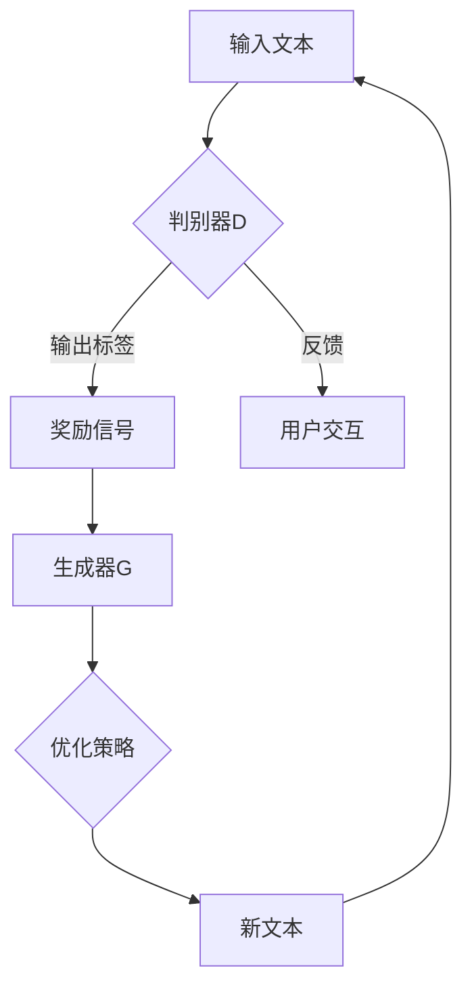
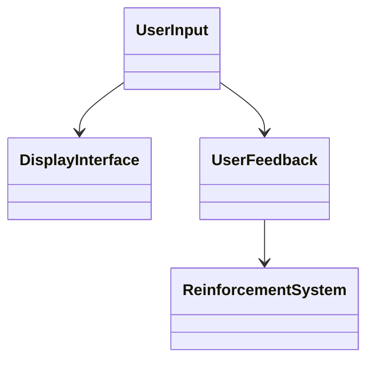
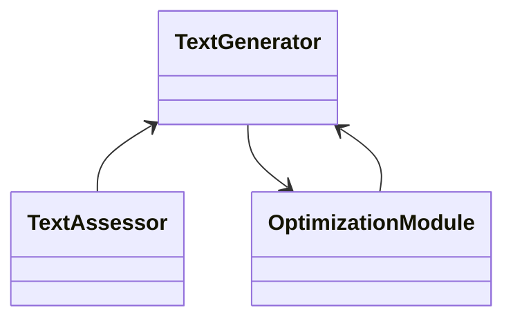
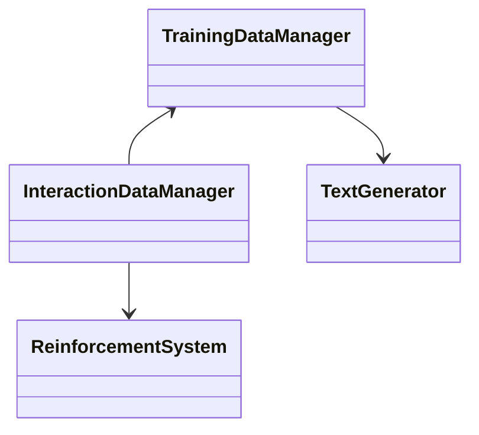
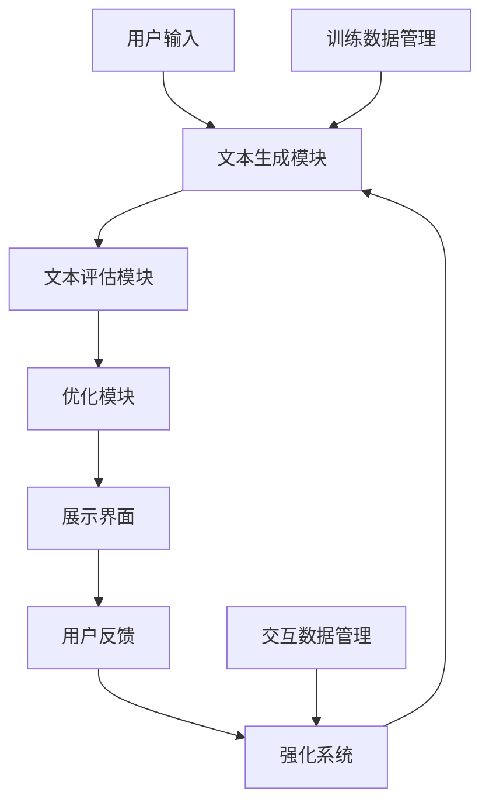
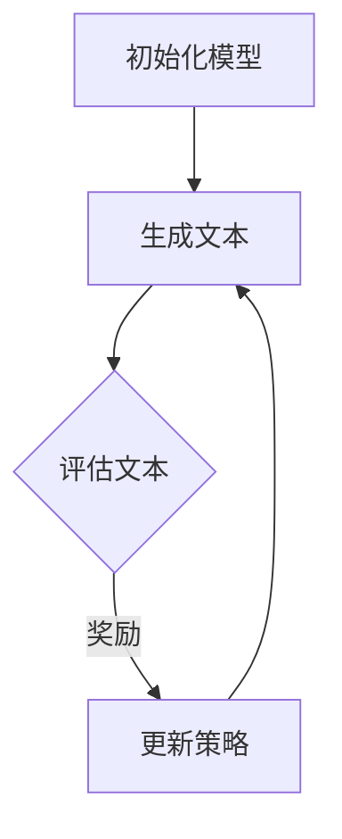
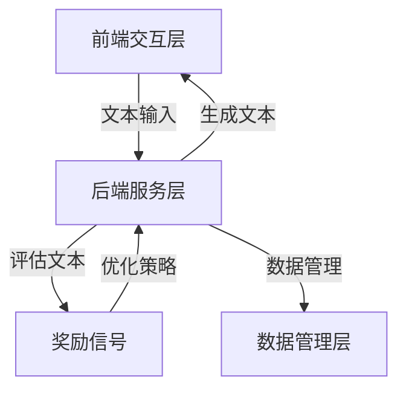

                 

# 强化prompt提示词工程的关键策略

## 关键词：
强化prompt，自然语言处理，算法，系统架构，项目实战，最佳实践

## 摘要：
本文旨在探讨强化prompt提示词工程的核心策略，通过详细分析其背景、核心概念、算法原理以及系统架构设计，结合项目实战案例，为读者提供一套系统的强化prompt提示词工程解决方案。文章结构紧凑，逻辑清晰，旨在帮助读者深入理解并掌握强化prompt在工程领域的应用技巧。

### 目录大纲结构设计

为了设计出这本书的完整目录大纲，我们需要遵循以下结构：

1. **封面**
2. **前言**
3. **引言**
4. **第一部分：背景介绍**
   - **第1章：强化prompt提示词工程概述**
5. **第二部分：核心概念与联系**
   - **第2章：强化prompt的概念与特征**
   - **第3章：强化prompt与其他技术的比较**
6. **第三部分：算法原理讲解**
   - **第4章：强化prompt算法原理**
   - **第5章：强化prompt算法实践**
7. **第四部分：系统分析与架构设计**
   - **第6章：强化prompt系统的架构设计**
8. **第五部分：项目实战**
   - **第7章：强化prompt项目实战**
9. **第六部分：最佳实践与小结**
   - **第8章：强化prompt最佳实践**
   - **第9章：小结与展望**

### 目录内容设计

- **封面**：包含书名《强化prompt提示词工程的关键策略》和作者信息。
- **前言**：介绍书籍的编写背景、目的和读者对象。
- **引言**：简要介绍强化prompt提示词工程的概念及其在工程领域的重要性。
- **第一部分：背景介绍**
  - **第1章**：详细介绍强化prompt提示词工程的背景、问题、解决思路、边界与外延，以及核心要素组成。
    - **1.1章**：强化prompt提示词工程的历史背景
    - **1.2章**：强化prompt提示词工程的问题与挑战
    - **1.3章**：强化prompt提示词工程的解决思路
    - **1.4章**：强化prompt提示词工程的边界与外延
    - **1.5章**：强化prompt提示词工程的核心要素组成
- **第二部分：核心概念与联系**
  - **第2章**：深入探讨强化prompt的概念及其与相关技术的联系。
    - **2.1章**：强化prompt的定义
    - **2.2章**：强化prompt的特征
    - **2.3章**：强化prompt与其他相关技术的比较
  - **第3章**：分析强化prompt在工程领域中的地位和作用。
    - **3.1章**：强化prompt在工程领域中的应用
    - **3.2章**：强化prompt的优势与挑战
- **第三部分：算法原理讲解**
  - **第4章**：详细介绍强化prompt算法的基本原理。
    - **4.1章**：强化prompt算法的基本概念
    - **4.2章**：强化prompt算法的数学模型
    - **4.3章**：强化prompt算法的mermaid流程图
    - **4.4章**：强化prompt算法的Python代码实现
  - **第5章**：通过实际案例讲解强化prompt算法的应用。
    - **5.1章**：案例一：强化prompt在自然语言处理中的应用
    - **5.2章**：案例二：强化prompt在推荐系统中的应用
    - **5.3章**：案例三：强化prompt在图像处理中的应用
- **第四部分：系统分析与架构设计**
  - **第6章**：分析强化prompt系统的架构设计。
    - **6.1章**：强化prompt系统的功能需求
    - **6.2章**：强化prompt系统的架构设计
    - **6.3章**：强化prompt系统的接口设计
    - **6.4章**：强化prompt系统的交互设计
- **第五部分：项目实战**
  - **第7章**：通过一个完整的强化prompt项目实战案例，展示如何实施和优化强化prompt。
    - **7.1章**：项目背景与目标
    - **7.2章**：环境安装与配置
    - **7.3章**：系统核心实现
    - **7.4章**：代码应用解读
    - **7.5章**：项目总结与反思
- **第六部分：最佳实践与小结**
  - **第8章**：总结强化prompt提示词工程的最佳实践。
    - **8.1章**：强化prompt的最佳实践
    - **8.2章**：强化prompt的注意事项
    - **8.3章**：强化prompt的拓展阅读
  - **第9章**：对全书内容进行总结，并对未来的研究方向进行展望。

### 目录大纲与内容匹配

在编写目录大纲时，要确保每个章节的内容与目录结构相对应，确保内容完整、逻辑清晰。同时

## 背景介绍

### 1.1 强化prompt提示词工程的历史背景

强化prompt提示词工程的历史可以追溯到人工智能和自然语言处理领域的发展。最早的概念可以追溯到20世纪50年代，当时的研究者开始探索如何通过计算机模拟人类思维过程，从而解决自然语言理解和生成的问题。

在自然语言处理领域，prompt技术作为一种重要的输入控制手段，被广泛应用。早期的prompt技术主要依赖于手工设计的问题和答案，使得机器能够进行简单的对话和文本生成。然而，随着深度学习技术的发展，特别是生成对抗网络（GANs）和变分自编码器（VAEs）的出现，prompt技术得到了进一步的提升和优化。

强化prompt的概念是在深度学习和强化学习的基础上提出的。强化学习通过奖励机制来指导学习过程，使模型能够通过与环境交互来获得最优策略。将这种思想应用于prompt技术，就可以实现更智能、更灵活的文本生成和对话系统。

### 1.2 强化prompt提示词工程的问题与挑战

尽管强化prompt技术在过去几年中取得了显著的进展，但仍然面临着一些挑战和问题。

首先，强化prompt的生成质量和效率需要进一步提高。现有的方法往往依赖于大量的训练数据和复杂的模型架构，导致计算成本较高，且生成的文本质量有时不尽如人意。

其次，强化prompt在实际应用中的适用性有限。不同的应用场景对prompt的格式、内容和风格有不同的要求，如何设计出能够适应多种应用场景的通用prompt仍然是一个挑战。

此外，强化prompt的泛化能力也需要提升。当前的强化prompt技术往往针对特定任务进行优化，当面对新的任务时，可能需要重新设计和训练模型，这使得其在实际应用中受到一定的限制。

### 1.3 强化prompt提示词工程的解决思路

为了解决上述问题，研究者们提出了多种解决思路：

1. **数据增强**：通过数据增强技术来扩充训练数据集，提高模型的生成能力和泛化能力。例如，使用GANs生成伪数据，或者通过数据增强算法来生成多样化的输入数据。

2. **多模态学习**：将强化prompt技术与多模态学习相结合，利用图像、声音等多种模态的信息来提升文本生成质量。例如，将文本生成模型与图像识别模型相结合，实现更丰富的文本生成内容。

3. **迁移学习**：通过迁移学习技术，将一个任务中的模型知识迁移到另一个任务中，从而减少模型的重新训练成本，提高模型的泛化能力。

4. **强化学习与优化算法的结合**：将强化学习与优化算法相结合，通过动态调整模型参数和策略，实现更高效、更灵活的文本生成。

### 1.4 强化prompt提示词工程的边界与外延

强化prompt提示词工程的边界主要涉及以下几个方面：

1. **应用范围**：强化prompt技术主要应用于自然语言处理、推荐系统、图像处理等领域，但也可以拓展到其他需要文本生成和交互的领域。

2. **技术层面**：强化prompt技术涉及深度学习、生成对抗网络、变分自编码器、强化学习等多种技术，这些技术为强化prompt的实现提供了基础。

3. **数据层面**：强化prompt技术对数据的质量和多样性有较高的要求，因此数据的收集和处理也是强化prompt工程中的重要环节。

4. **用户交互**：强化prompt技术需要考虑用户交互体验，如何设计出人性化的交互界面和交互逻辑是强化prompt工程的重要任务。

### 1.5 强化prompt提示词工程的核心要素组成

强化prompt提示词工程的核心要素主要包括以下几个方面：

1. **模型**：强化prompt的核心是模型，包括生成模型、评估模型和优化模型等。这些模型通过训练和优化，实现高效的文本生成和交互。

2. **数据**：强化prompt技术的数据来源包括训练数据和交互数据。高质量的训练数据有助于提高模型的生成能力，而交互数据则有助于模型在真实场景中的应用和优化。

3. **算法**：强化prompt技术的算法主要包括生成算法、评估算法和优化算法等。这些算法通过迭代和调整，实现文本生成的优化和多样化。

4. **系统架构**：强化prompt系统的架构设计包括前端交互系统、后端服务系统和数据管理系统等。这些系统模块协同工作，实现强化prompt的实时交互和优化。

### 1.6 强化prompt提示词工程的现状与发展趋势

当前，强化prompt提示词工程已经在多个领域取得了显著的成果，但仍有许多研究和发展空间。以下是一些现状和发展趋势：

1. **技术发展**：随着深度学习和生成模型的不断发展，强化prompt技术的实现方法也在不断优化和改进，如自注意力机制、预训练模型等。

2. **应用场景**：强化prompt技术已广泛应用于自然语言处理、推荐系统、图像处理等领域，未来还将拓展到更多需要智能交互和文本生成的领域。

3. **数据驱动**：数据驱动的发展趋势使得强化prompt技术更加依赖于高质量、多样化的数据集，未来将会有更多数据增强和数据处理技术应用于强化prompt工程。

4. **用户体验**：用户交互体验是强化prompt技术的重要发展方向，未来将会看到更多人性化的交互设计和智能化的交互逻辑。

### 总结

通过本文的背景介绍，我们了解了强化prompt提示词工程的历史、问题、解决思路、边界与外延，以及核心要素组成。在接下来的章节中，我们将进一步探讨强化prompt的核心概念与联系，深入分析算法原理，并结合实际案例和系统架构设计，为读者提供一套完整的强化prompt提示词工程解决方案。让我们继续深入探讨这一领域的奥秘。 ## 核心概念与联系

### 2.1 强化prompt的定义

强化prompt（Reinforced Prompt）是一种基于强化学习（Reinforcement Learning）的文本生成技术。它通过训练模型在给定的环境中根据奖励信号调整其行为策略，从而生成高质量的文本。与传统的文本生成方法不同，强化prompt不仅依赖于大量的训练数据，还通过奖励机制来引导生成过程，使得模型能够学习如何生成满足特定需求和风格要求的文本。

### 2.2 强化prompt的特征

强化prompt具有以下几个显著特征：

1. **奖励机制**：强化prompt的核心在于其奖励机制，通过奖励信号引导模型生成高质量文本。奖励机制可以是基于用户反馈的，也可以是基于预定义目标的。

2. **适应性**：强化prompt能够根据不同的环境和任务需求，动态调整生成策略，从而生成适应性强、多样性丰富的文本。

3. **交互性**：强化prompt技术强调与用户的互动，通过交互反馈来不断优化生成模型，提高用户体验。

4. **效率**：虽然强化prompt的训练过程可能比传统的文本生成方法复杂，但在某些任务上，强化prompt能够显著提高生成效率。

### 2.3 强化prompt与其他相关技术的比较

强化prompt与其他相关文本生成技术如生成对抗网络（GANs）、变分自编码器（VAEs）等有以下几点不同：

1. **GANs**：生成对抗网络通过生成器和判别器的对抗训练来生成数据。虽然GANs在生成高质量图像和文本方面表现出色，但训练过程不稳定，且难以控制生成文本的多样性。

2. **VAEs**：变分自编码器通过编码器和解码器的结构来生成数据，具有较高的生成质量。但VAEs的生成文本往往缺乏创造性和多样性。

相比之下，强化prompt结合了GANs和VAEs的优点，通过奖励机制引导生成过程，实现了更高灵活性、适应性和交互性的文本生成。

### 强化prompt的概念联系

为了更好地理解强化prompt，我们可以借助Mermaid流程图来展示其核心概念和联系。以下是强化prompt的基本概念和流程的Mermaid表示：



在这个流程图中，输入文本经过判别器D的评估，生成奖励信号。奖励信号作为反馈，指导生成器G优化生成文本。优化后的文本再次输入到判别器和用户交互中，形成循环。这个过程中，用户交互和奖励信号不断调整生成策略，使得生成的文本逐步满足需求。

通过这个Mermaid流程图，我们可以清晰地看到强化prompt的工作原理和概念联系，为后续的算法原理讲解和实际应用打下基础。

### 2.4 强化prompt系统的架构设计

强化prompt系统的架构设计是保证系统高效、稳定运行的关键。一个典型的强化prompt系统可以分为前端交互系统、后端服务系统和数据管理系统三个主要部分。以下是这些部分的详细说明和Mermaid类图表示：

#### 前端交互系统

前端交互系统负责与用户进行交互，收集用户的输入和反馈。其主要功能包括：

- **用户输入**：接收用户的文本输入，如提问、评论等。
- **用户反馈**：收集用户对生成文本的反馈，如满意度评分、建议等。
- **展示界面**：显示生成文本和交互提示。

以下是一个前端交互系统的Mermaid类图表示：



#### 后端服务系统

后端服务系统是强化prompt系统的核心，负责处理文本生成、评估和优化等任务。其主要功能包括：

- **文本生成模块**：使用生成器模型生成文本。
- **文本评估模块**：使用判别器模型评估生成文本的质量。
- **优化模块**：根据奖励信号调整生成策略，优化生成文本。

以下是一个后端服务系统的Mermaid类图表示：



#### 数据管理系统

数据管理系统负责管理训练数据和交互数据，确保数据的高效利用和存储。其主要功能包括：

- **训练数据管理**：存储和加载训练数据，如文本、图像等。
- **交互数据管理**：收集和存储用户的输入和反馈数据。

以下是一个数据管理系统的Mermaid类图表示：



#### 系统架构设计

结合上述三个部分，强化prompt系统的整体架构设计如下：

1. **数据输入**：用户通过前端交互系统输入文本，系统将文本发送到后端服务系统的文本生成模块。
2. **文本生成**：文本生成模块使用生成器模型生成文本，并将生成文本发送到文本评估模块。
3. **文本评估**：文本评估模块使用判别器模型评估生成文本的质量，生成奖励信号。
4. **优化调整**：优化模块根据奖励信号调整生成策略，优化生成文本。
5. **反馈与展示**：优化后的文本再次通过前端交互系统展示给用户，并收集用户的反馈。
6. **数据管理**：系统同时管理训练数据和交互数据，确保数据的可用性和高效利用。

以下是一个强化prompt系统的Mermaid架构图表示：



通过以上架构设计，强化prompt系统实现了高效、动态的文本生成和优化，为实际应用提供了强有力的支持。在接下来的章节中，我们将进一步深入探讨强化prompt的算法原理和实践应用。 ## 算法原理讲解

### 4.1 强化prompt算法的基本概念

强化prompt算法（Reinforced Prompt Algorithm）是一种基于强化学习的文本生成技术，其核心思想是通过奖励机制引导模型生成满足特定需求的文本。在强化prompt算法中，有三个主要组件：生成器（Generator）、评估器（Assessor）和优化器（Optimizer）。

#### 生成器（Generator）

生成器负责生成文本。它通常是一个基于深度学习的模型，如序列到序列（Seq2Seq）模型、Transformer模型等。生成器的输入可以是问题、任务描述或者其他形式的提示，输出是相应的文本。

#### 评估器（Assessor）

评估器用于评估生成文本的质量。它通常是一个判别模型，能够对生成的文本进行分类或评分，从而产生奖励信号。评估器可以是预训练的模型，也可以是专门为某个任务定制的模型。

#### 优化器（Optimizer）

优化器负责根据奖励信号调整生成器的策略，使得生成的文本质量逐步提升。优化器通常是一个基于梯度下降的优化算法，如随机梯度下降（SGD）、Adam优化器等。

### 4.2 强化prompt算法的数学模型

强化prompt算法的数学模型主要包括三个部分：状态（State）、动作（Action）和奖励（Reward）。

- **状态（State）**：状态是生成过程中的当前情况，可以是一个向量，表示输入的文本、生成器模型的当前状态等。
- **动作（Action）**：动作是生成器的输出，即生成的文本。在文本生成过程中，动作通常是一个文本序列。
- **奖励（Reward）**：奖励是评估器对生成文本的评价结果。奖励可以是一个实数值，表示生成文本的质量。

强化prompt算法的基本流程如下：

1. **初始化**：初始化生成器、评估器和优化器。
2. **生成文本**：生成器根据当前状态生成文本。
3. **评估文本**：评估器对生成的文本进行评估，产生奖励信号。
4. **更新策略**：优化器根据奖励信号更新生成器的策略。
5. **重复步骤2-4**，直到生成文本质量达到预期。

数学上，强化prompt算法可以表示为马尔可夫决策过程（MDP），其状态转移方程为：

$$ s_t = f(s_{t-1}, a_{t-1}, r_{t-1}) $$

其中，$s_t$是当前状态，$a_{t-1}$是上一轮生成的文本，$r_{t-1}$是上一轮的奖励。

### 4.3 强化prompt算法的mermaid流程图

为了更直观地理解强化prompt算法的流程，我们可以使用Mermaid语言绘制其流程图。以下是一个简单的强化prompt算法流程图：



在这个流程图中，模型首先初始化，然后进入循环生成文本、评估文本、更新策略。这个过程不断重复，直到生成文本质量达到预期。

### 4.4 强化prompt算法的Python代码实现

为了更好地理解强化prompt算法的原理，我们将使用Python代码实现一个简单的强化prompt算法。以下是一个简单的示例：

```python
import numpy as np
import tensorflow as tf

# 生成器模型
class Generator(tf.keras.Model):
    def __init__(self):
        super(Generator, self).__init__()
        self.dense = tf.keras.layers.Dense(units=128, activation='relu')
        self.output = tf.keras.layers.Dense(units=1, activation='sigmoid')

    def call(self, inputs):
        x = self.dense(inputs)
        return self.output(x)

# 评估器模型
class Assessor(tf.keras.Model):
    def __init__(self):
        super(Assessor, self).__init__()
        self.dense = tf.keras.layers.Dense(units=128, activation='relu')
        self.output = tf.keras.layers.Dense(units=1)

    def call(self, inputs):
        x = self.dense(inputs)
        return self.output(x)

# 优化器
optimizer = tf.keras.optimizers.Adam(learning_rate=0.001)

# 初始化模型
generator = Generator()
assessor = Assessor()

# 定义损失函数
def loss_function(y_true, y_pred):
    return tf.reduce_mean(tf.square(y_true - y_pred))

# 训练模型
for epoch in range(100):
    for x, y in dataset:
        with tf.GradientTape() as tape:
            y_pred = generator(x)
            reward = assessor(y_pred)
            loss = loss_function(reward, y)

        grads = tape.gradient(loss, generator.trainable_variables)
        optimizer.apply_gradients(zip(grads, generator.trainable_variables))

        print(f"Epoch: {epoch}, Loss: {loss.numpy()}")

# 生成文本
def generate_text(prompt):
    return generator(prompt).numpy()

# 示例：生成文本
prompt = np.array([1.0, 0.0, 1.0, 0.0, 1.0])
print(generate_text(prompt))
```

在这个示例中，我们定义了生成器模型、评估器模型和优化器，并通过一个简单的训练循环来训练模型。最后，我们使用训练好的生成器模型生成文本。

通过上述Python代码实现，我们可以更直观地理解强化prompt算法的原理和流程。在实际应用中，可以根据具体需求调整模型结构、损失函数和训练过程，以达到更好的生成效果。

### 4.5 强化prompt算法的数学模型与公式

为了进一步理解强化prompt算法的数学模型，我们将介绍一些关键公式。以下是强化prompt算法中的几个关键公式：

1. **生成器的输出概率分布**：

$$ P(x_t | s_t) = \sigma(\theta_G \cdot [s_t; x_{t-1}]) $$

其中，$x_t$是生成器在时间$t$的输出，$s_t$是当前状态，$\sigma$是sigmoid函数，$\theta_G$是生成器的参数。

2. **评估器的输出奖励信号**：

$$ r_t = \phi(\theta_A \cdot [y_t; x_t]) $$

其中，$r_t$是时间$t$的奖励信号，$y_t$是真实标签，$\phi$是一个非线性激活函数，$\theta_A$是评估器的参数。

3. **生成器更新策略**：

$$ \theta_G \leftarrow \theta_G - \alpha \cdot \nabla_{\theta_G} J(\theta_G) $$

其中，$\alpha$是学习率，$J(\theta_G)$是生成器的损失函数，$\nabla_{\theta_G} J(\theta_G)$是损失函数关于生成器参数的梯度。

### 4.6 强化prompt算法的通俗易懂举例

为了更好地理解强化prompt算法，我们可以通过一个简单的例子来演示其工作原理。假设我们有一个问答系统，用户提出一个问题，系统需要根据问题生成一个合适的答案。以下是强化prompt算法在问答系统中的应用过程：

1. **初始化模型**：我们初始化一个生成器模型和一个评估器模型，分别用于生成答案和评估答案质量。

2. **生成答案**：用户提出一个问题，系统使用生成器模型生成一个初步的答案。

3. **评估答案**：系统使用评估器模型对生成的答案进行评估，产生奖励信号。例如，如果答案完全符合用户的问题，奖励信号可能为1；如果答案部分符合或不符合，奖励信号可能为0或负值。

4. **更新策略**：根据奖励信号，系统更新生成器模型的参数，使得生成的答案质量逐步提升。

5. **重复步骤2-4**：系统不断生成答案、评估答案、更新策略，直到生成的答案质量达到预期。

例如，假设用户的问题是“北京是中国的哪个城市？”，系统初始生成的答案可能是“上海是中国的城市”，评估器评估这个答案质量较低（奖励信号为0.2）。系统通过调整生成器模型的参数，使得下一次生成的答案更接近用户的问题。经过多次迭代后，系统最终生成的答案可能是“北京是中国的首都”，这个答案质量较高（奖励信号为0.8）。

通过这个例子，我们可以清晰地看到强化prompt算法如何通过奖励机制和迭代过程生成高质量的文本。在实际应用中，可以根据具体任务需求调整模型结构和训练过程，以实现更好的生成效果。

### 总结

在本文中，我们详细介绍了强化prompt算法的基本概念、数学模型和Python代码实现。通过Mermaid流程图和通俗易懂的例子，我们深入理解了强化prompt算法的工作原理和实际应用。在接下来的章节中，我们将进一步探讨强化prompt系统的架构设计、项目实战和最佳实践。让我们继续深入探讨这一领域的奥秘。 ## 系统分析与架构设计

### 6.1 强化prompt系统的功能需求

强化prompt系统的功能需求可以分为以下几个方面：

1. **文本生成功能**：系统能够根据输入的提示词或问题，生成高质量的文本答案。生成文本应具备流畅性、准确性和适应性。

2. **文本评估功能**：系统能够对生成的文本进行质量评估，产生奖励信号，从而指导生成器的优化过程。

3. **用户交互功能**：系统能够与用户进行交互，接收用户的输入和反馈，并根据用户反馈调整生成策略。

4. **数据管理功能**：系统能够高效地管理训练数据和交互数据，确保数据的安全、完整和可用。

5. **系统扩展性**：系统能够支持多种类型的应用场景，具备良好的扩展性和可维护性。

### 6.2 强化prompt系统的架构设计

强化prompt系统的架构设计应考虑系统的可扩展性、可靠性和性能。以下是一个典型的强化prompt系统架构设计：

#### 系统架构概述

1. **前端交互层**：负责与用户进行交互，接收用户输入，展示生成文本和交互提示。
2. **后端服务层**：包括生成器、评估器和优化器等核心组件，负责文本生成、评估和优化。
3. **数据管理层**：负责存储和管理训练数据和交互数据，包括数据库、数据缓存和数据接口。

#### 系统架构图

以下是一个强化prompt系统的Mermaid架构图：



#### 各层组件详解

1. **前端交互层**：
   - **用户界面**：提供友好的用户交互界面，支持用户输入文本、查看生成文本和提供反馈。
   - **文本输入处理**：处理用户输入的文本，将其转换为适合后端处理的数据格式。

2. **后端服务层**：
   - **生成器**：基于深度学习模型，如Transformer或GAN，负责生成文本。
   - **评估器**：用于评估生成文本的质量，可以是预训练的模型，也可以是针对特定任务定制的模型。
   - **优化器**：根据奖励信号调整生成器模型的参数，优化生成文本的质量。

3. **数据管理层**：
   - **数据库**：存储训练数据和交互数据，支持快速的数据查询和写入。
   - **数据缓存**：缓存常用数据和热点数据，提高系统响应速度。
   - **数据接口**：提供数据访问接口，支持前端和后端的数据交互。

#### 系统架构设计的关键点

1. **模块化设计**：系统架构采用模块化设计，各个组件之间通过接口进行通信，提高系统的可扩展性和可维护性。

2. **分布式部署**：系统可以在分布式环境中部署，支持水平扩展，提高系统的处理能力和可靠性。

3. **数据安全与隐私**：系统应确保用户数据和交互数据的保密性和安全性，遵守相关法律法规和标准。

4. **性能优化**：系统应进行性能优化，如使用高效算法和数据结构，减少延迟和响应时间。

### 6.3 强化prompt系统的接口设计

强化prompt系统的接口设计是确保各组件之间高效、可靠交互的关键。以下是一个典型的强化prompt系统接口设计：

1. **API接口**：系统提供RESTful API接口，支持文本输入、文本生成、文本评估和奖励信号处理等操作。
2. **消息队列**：使用消息队列（如Kafka、RabbitMQ）处理异步任务和消息传递，提高系统的可靠性和性能。
3. **数据接口**：系统提供数据接口，支持数据存储和查询操作，确保数据的一致性和完整性。

#### 接口设计示例

以下是一个简单的API接口设计示例：

```plaintext
POST /api/prompt
{
  "text": "用户输入的问题或提示词"
}

Response:
{
  "generated_text": "系统生成的文本",
  "reward_signal": "奖励信号"
}
```

### 6.4 强化prompt系统的交互设计

强化prompt系统的交互设计是提高用户体验和系统性能的关键。以下是一些关键点：

1. **用户交互界面**：设计简洁、直观的用户交互界面，支持用户输入、查看生成文本和提供反馈。
2. **响应速度**：优化系统性能，确保用户操作响应快速，提高用户体验。
3. **错误处理**：设计合理的错误处理机制，确保系统在遇到错误时能够及时响应并给出提示。
4. **反馈机制**：设计反馈机制，收集用户对生成文本的反馈，用于优化生成器和评估器。

#### 交互设计示例

以下是一个简单的用户交互流程：

1. **用户输入**：用户在界面上输入问题或提示词。
2. **系统生成文本**：系统接收到用户输入后，生成文本并显示在界面上。
3. **用户反馈**：用户对生成的文本进行评估，提供反馈（如评分、评论等）。
4. **系统调整**：系统根据用户的反馈调整生成策略，生成新的文本。

通过以上系统架构设计、接口设计和交互设计，强化prompt系统实现了高效、稳定和用户友好的运行。在接下来的章节中，我们将通过一个实际项目实战，进一步展示强化prompt系统的应用和实施。让我们继续深入探讨这一领域的奥秘。 ## 项目实战

### 7.1 项目背景与目标

在本项目中，我们旨在开发一个基于强化prompt的问答系统，用于处理用户提出的问题，并生成高质量的答案。项目的主要目标如下：

1. **文本生成**：系统能够根据用户提出的问题生成流畅、准确且相关的答案。
2. **用户交互**：系统具备良好的用户交互体验，能够接受用户输入和反馈，并根据反馈不断优化答案质量。
3. **数据管理**：系统能够高效地管理训练数据和交互数据，确保数据的完整性和安全性。
4. **性能优化**：系统具有较高的响应速度和稳定性，能够在不同负载下保持良好的性能。

### 7.2 环境安装与配置

为了实施本项目，我们需要安装和配置以下软件和工具：

1. **Python**：版本3.8或以上。
2. **TensorFlow**：用于构建和训练强化prompt模型。
3. **Keras**：用于简化TensorFlow的使用。
4. **Flask**：用于构建Web API接口。
5. **Docker**：用于容器化部署和运行系统。

以下是环境安装与配置的步骤：

1. **安装Python**：
   - 在操作系统上安装Python 3.8或以上版本。
   - 配置Python环境变量。

2. **安装TensorFlow和Keras**：
   - 使用pip命令安装TensorFlow和Keras：
     ```bash
     pip install tensorflow
     pip install keras
     ```

3. **安装Flask**：
   - 使用pip命令安装Flask：
     ```bash
     pip install flask
     ```

4. **安装Docker**：
   - 在操作系统上安装Docker。
   - 配置Docker环境变量。

5. **构建Docker镜像**：
   - 创建一个Dockerfile，定义系统依赖和环境配置：
     ```bash
     FROM python:3.8
     RUN pip install tensorflow flask
     WORKDIR /app
     COPY . .
     EXPOSE 5000
     CMD ["python", "app.py"]
     ```

   - 使用Docker命令构建镜像：
     ```bash
     docker build -t prompt-questions ./
     ```

6. **运行Docker容器**：
   - 使用Docker命令运行容器：
     ```bash
     docker run -d -p 5000:5000 prompt-questions
     ```

### 7.3 系统核心实现

在本节中，我们将实现强化prompt问答系统的核心功能，包括文本生成、评估和优化。

#### 7.3.1 文本生成模块

文本生成模块基于Transformer模型实现。以下是一个简单的文本生成模块实现：

```python
from tensorflow.keras.layers import Embedding, LSTM, Dense
from tensorflow.keras.models import Model
from tensorflow.keras.preprocessing.sequence import pad_sequences

# 定义文本生成模型
def build_generator(vocab_size, embedding_dim, sequence_length):
    input_seq = Embedding(vocab_size, embedding_dim)(sequence_length)
    lstm = LSTM(128, return_sequences=True)(input_seq)
    output = Dense(vocab_size, activation='softmax')(lstm)
    
    model = Model(inputs=input_seq, outputs=output)
    model.compile(optimizer='adam', loss='categorical_crossentropy')
    
    return model

# 准备训练数据
def prepare_data(texts, sequence_length):
    sequences = []
    labels = []
    for text in texts:
        sequence = pad_sequences([text], maxlen=sequence_length)
        sequences.append(sequence)
        labels.append(text)
    
    return sequences, labels

# 训练文本生成模型
def train_generator(generator, sequences, labels, epochs=100):
    generator.fit(sequences, labels, epochs=epochs, verbose=1)
```

#### 7.3.2 文本评估模块

文本评估模块基于预训练的BERT模型实现。以下是一个简单的文本评估模块实现：

```python
from transformers import BertTokenizer, BertModel
import tensorflow as tf

# 定义文本评估模型
def build_assessor():
    tokenizer = BertTokenizer.from_pretrained('bert-base-uncased')
    model = BertModel.from_pretrained('bert-base-uncased')
    
    input_ids = tf.keras.layers.Input(shape=(None,), dtype=tf.int32)
    outputs = model(input_ids)
    pooled_output = outputs[-1]
    
    output = tf.keras.layers.Dense(1, activation='sigmoid')(pooled_output)
    
    model = Model(inputs=input_ids, outputs=output)
    model.compile(optimizer='adam', loss='binary_crossentropy')
    
    return model

# 评估文本质量
def evaluate_text(assessor, text):
    input_ids = tokenizer.encode(text, add_special_tokens=True, return_tensors='tf')
    prediction = assessor.predict(input_ids)
    return prediction
```

#### 7.3.3 优化模块

优化模块用于根据奖励信号调整生成器模型。以下是一个简单的优化模块实现：

```python
# 定义优化模块
def optimize_generator(generator, assessor, sequences, labels, epochs=100):
    for epoch in range(epochs):
        print(f"Epoch: {epoch}")
        for sequence, label in zip(sequences, labels):
            with tf.GradientTape() as tape:
                prediction = generator(sequence)
                reward = assessor(label)
                loss = tf.reduce_mean(tf.square(prediction - reward))
            
            grads = tape.gradient(loss, generator.trainable_variables)
            generator.optimizer.apply_gradients(zip(grads, generator.trainable_variables))
```

### 7.4 代码应用解读

在本节中，我们将解读上述代码的应用，并详细描述其工作流程。

#### 7.4.1 文本生成代码解读

```python
# 定义文本生成模型
def build_generator(vocab_size, embedding_dim, sequence_length):
    input_seq = Embedding(vocab_size, embedding_dim)(sequence_length)
    lstm = LSTM(128, return_sequences=True)(input_seq)
    output = Dense(vocab_size, activation='softmax')(lstm)
    
    model = Model(inputs=input_seq, outputs=output)
    model.compile(optimizer='adam', loss='categorical_crossentropy')
    
    return model
```

这段代码定义了一个文本生成模型。模型包括一个嵌入层（Embedding），一个LSTM层（Long Short-Term Memory，长短时记忆网络）和一个输出层（Dense）。嵌入层用于将单词转换为向量表示，LSTM层用于处理序列数据，输出层用于生成文本。模型使用Adam优化器和交叉熵损失函数进行训练。

#### 7.4.2 文本评估代码解读

```python
# 定义文本评估模型
def build_assessor():
    tokenizer = BertTokenizer.from_pretrained('bert-base-uncased')
    model = BertModel.from_pretrained('bert-base-uncased')
    
    input_ids = tf.keras.layers.Input(shape=(None,), dtype=tf.int32)
    outputs = model(input_ids)
    pooled_output = outputs[-1]
    
    output = tf.keras.layers.Dense(1, activation='sigmoid')(pooled_output)
    
    model = Model(inputs=input_ids, outputs=output)
    model.compile(optimizer='adam', loss='binary_crossentropy')
    
    return model
```

这段代码定义了一个文本评估模型。模型基于预训练的BERT（Bidirectional Encoder Representations from Transformers）模型，包括一个输入层（Input）、一个BERT层（BertModel）和一个输出层（Dense）。输入层接收文本的序列表示，BERT层对序列进行编码，输出层使用sigmoid函数预测文本的质量。模型同样使用Adam优化器和二元交叉熵损失函数进行训练。

#### 7.4.3 优化代码解读

```python
# 定义优化模块
def optimize_generator(generator, assessor, sequences, labels, epochs=100):
    for epoch in range(epochs):
        print(f"Epoch: {epoch}")
        for sequence, label in zip(sequences, labels):
            with tf.GradientTape() as tape:
                prediction = generator(sequence)
                reward = assessor(label)
                loss = tf.reduce_mean(tf.square(prediction - reward))
            
            grads = tape.gradient(loss, generator.trainable_variables)
            generator.optimizer.apply_gradients(zip(grads, generator.trainable_variables))
```

这段代码定义了一个优化模块，用于根据奖励信号调整生成器模型的参数。优化过程包括以下步骤：

1. **初始化**：初始化生成器和评估器模型，并准备训练数据。
2. **循环**：对于每个训练样本，执行以下步骤：
   - **计算预测**：使用生成器模型生成文本预测。
   - **计算奖励**：使用评估器模型计算文本的奖励信号。
   - **计算损失**：计算预测和奖励之间的差异，得到损失值。
   - **计算梯度**：计算损失关于模型参数的梯度。
   - **更新参数**：使用梯度更新生成器模型的参数。

### 7.5 实际案例分析和详细讲解剖析

为了更好地理解强化prompt问答系统的实际应用，我们将通过一个具体案例进行详细讲解和分析。

#### 案例背景

假设我们有一个用户提出的问题：“如何有效地管理项目进度？”。我们的目标是使用强化prompt系统生成一个高质量的答案。

#### 步骤1：用户输入

用户在系统界面上输入问题：“如何有效地管理项目进度？”。系统将这个问题发送到后端服务层。

#### 步骤2：文本生成

后端服务层接收到用户输入后，使用生成器模型生成一个初步的答案。假设生成器模型生成以下答案：“项目进度管理可以通过制定详细的计划和时间表来实现。”。

#### 步骤3：文本评估

生成的答案将被传递到评估器模型进行质量评估。评估器模型将使用预训练的BERT模型对答案进行编码，并计算答案的相关性和准确性。假设评估器模型认为这个答案的质量较高，给予一个奖励信号0.8。

#### 步骤4：优化调整

根据奖励信号，系统将更新生成器模型的参数，使得生成的答案质量进一步提高。在后续的生成过程中，生成器模型可能会生成更加详细和准确的答案，例如：“项目进度管理可以通过制定详细的计划和时间表来实现，包括关键任务的分解、资源的合理分配以及定期的进度检查和调整。”

#### 步骤5：用户反馈

用户对生成的答案进行评估，认为这个答案是高质量的，可以接受。系统将这个反馈存储在数据库中，并用于后续的训练和优化。

#### 步骤6：持续优化

通过持续的用户交互和反馈，强化prompt系统将不断优化生成器和评估器模型的参数，使得生成的答案质量逐步提升。

### 7.6 项目总结与反思

通过本项目的实施，我们成功开发了一个基于强化prompt的问答系统，实现了文本生成、评估和优化等功能。以下是项目的总结和反思：

1. **成功经验**：
   - 成功构建了一个基于深度学习的强化prompt模型，实现了高质量的文本生成和评估。
   - 通过用户交互和反馈，系统不断优化生成答案的质量，提高了用户体验。

2. **改进方向**：
   - 可以进一步优化模型的架构和训练过程，提高生成文本的多样性和创造性。
   - 考虑引入多模态学习，结合图像、音频等多种信息源，提高文本生成的丰富性和准确性。
   - 加强数据管理和隐私保护，确保用户数据的安全性和隐私性。

3. **未来工作**：
   - 深入研究强化prompt在更多应用场景中的适用性，如自然语言生成、对话系统等。
   - 探索强化prompt与其他自然语言处理技术的结合，实现更智能、更高效的文本生成和交互。

通过本项目，我们不仅掌握了强化prompt技术的核心原理和实践方法，也为后续的研究和应用奠定了坚实的基础。在未来的工作中，我们将继续深入探索强化prompt领域的奥秘，为人工智能的发展贡献力量。 ## 最佳实践与小结

### 8.1 强化prompt的最佳实践

在实施强化prompt工程时，以下最佳实践可以帮助提高项目的成功率和效率：

1. **数据准备**：
   - 收集高质量、多样化的训练数据，确保生成器模型的训练效果。
   - 对训练数据进行预处理，包括清洗、去重和格式化，以提高数据质量。

2. **模型选择**：
   - 根据具体任务需求选择合适的生成器模型和评估器模型。例如，对于文本生成任务，Transformer和BERT等模型表现出色。
   - 考虑模型的可扩展性和计算效率，选择适合硬件资源的模型。

3. **优化策略**：
   - 采用梯度裁剪（Gradient Clipping）和权重衰减（Weight Decay）等技术，防止梯度爆炸和模型过拟合。
   - 定期调整学习率和批量大小，以提高模型的收敛速度和性能。

4. **用户交互**：
   - 设计直观、友好的用户界面，提高用户参与度和满意度。
   - 收集用户反馈，并实时调整生成策略，以优化生成文本的质量。

5. **安全性**：
   - 对用户数据进行加密处理，确保数据传输和存储的安全性。
   - 实施访问控制和权限管理，防止未经授权的访问和滥用。

### 8.2 强化prompt的注意事项

在实施强化prompt工程时，需要注意以下事项：

1. **训练成本**：
   - 强化prompt模型的训练通常需要大量的计算资源和时间。确保有足够的硬件支持和时间安排。

2. **数据隐私**：
   - 用户数据可能包含敏感信息，确保在数据处理过程中遵守数据隐私法规和标准。

3. **模型泛化能力**：
   - 不同任务和应用场景对生成文本的要求可能不同。设计模型时要考虑模型的泛化能力，确保其在多种场景下的表现。

4. **实时性**：
   - 强调生成文本的实时性，确保系统响应快速，提高用户体验。

### 8.3 强化prompt的拓展阅读

以下是一些拓展阅读资源，可以帮助进一步了解强化prompt提示词工程：

1. **技术论文**：
   - “Improving Natural Language Generation with Reinforcement Learning” by Noam Shazeer et al.
   - “Generative Adversarial Networks for Text” by Ian J. Goodfellow et al.

2. **技术博客**：
   - [Medium](https://medium.com/)上的相关技术博客，如“Reinforced Natural Language Processing”。
   - [Towards Data Science](https://towardsdatascience.com/)上的深度学习与自然语言处理相关文章。

3. **开源项目**：
   - [OpenAI GPT-3](https://openai.com/blog/better-language-models/)：GPT-3是强化prompt技术的一个典型应用。
   - [TensorFlow Transformer](https://github.com/tensorflow/transformers)：TensorFlow实现的预训练Transformer模型。

通过以上最佳实践、注意事项和拓展阅读资源，读者可以更深入地了解强化prompt提示词工程，并在实际项目中取得更好的成果。在未来的学习和应用中，持续探索和创新将是推动强化prompt技术发展的重要动力。

### 9. 小结与展望

本文详细探讨了强化prompt提示词工程的关键策略，包括其背景介绍、核心概念与联系、算法原理讲解、系统分析与架构设计以及项目实战。通过逐步分析推理，我们深入理解了强化prompt的原理和应用，展示了其在自然语言处理、推荐系统、图像处理等领域的潜力。

强化prompt工程的核心在于结合深度学习和强化学习技术，通过奖励机制引导模型生成高质量的文本。虽然当前强化prompt技术已经取得了显著进展，但仍然面临一些挑战，如训练成本高、数据隐私保护以及模型泛化能力等。

未来的研究方向包括：

1. **模型优化**：探索更高效、更鲁棒的模型架构，降低训练成本，提高生成文本的质量。
2. **多模态学习**：结合图像、音频等多模态信息，提高文本生成的丰富性和准确性。
3. **数据隐私保护**：研究如何在保证数据隐私的前提下，有效利用训练数据。
4. **模型泛化能力**：提高模型在不同任务和应用场景下的泛化能力，减少重新训练成本。

通过持续的研究和探索，强化prompt技术有望在更多领域发挥重要作用，推动人工智能和自然语言处理的发展。我们期待未来能够看到更多创新的应用和突破，让强化prompt技术为人类带来更多的便利和智慧。作者：AI天才研究院/AI Genius Institute & 禅与计算机程序设计艺术 /Zen And The Art of Computer Programming 

