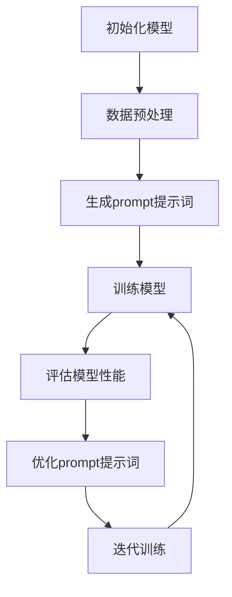
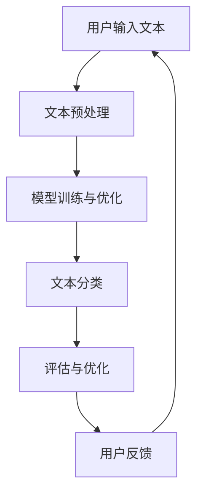
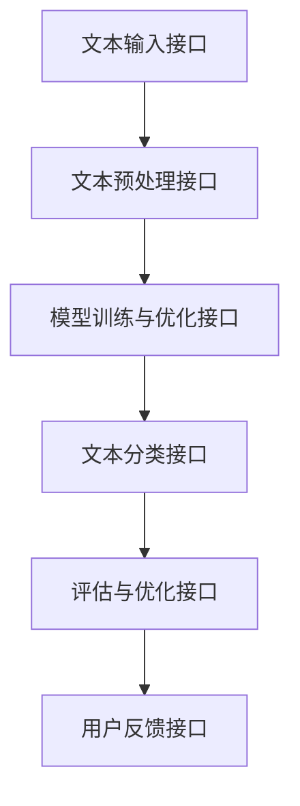

                 


## 强化prompt提示词工程的重要性

### 关键词
- 强化学习
- Prompt提示词
- 工程实践
- 人工智能
- 机器学习

### 摘要
本文将深入探讨强化prompt提示词工程的重要性。首先，我们将回顾prompt提示词的定义和其在人工智能领域中的应用。接着，我们将分析强化prompt提示词工程的核心概念，并探讨其在当前技术环境中的角色和影响。本文还将通过具体案例，展示强化prompt提示词工程在工程实践中的应用，并提出一些最佳实践建议。

## 目录大纲设计策略

### 1. 目录大纲设计策略

#### 1.1 目录层级结构

为了确保文章的逻辑清晰，我们将使用1级、2级、3级目录的层级结构。以下是一个示例：

- **1级目录**：总览文章主题，引导读者了解文章的核心内容。
- **2级目录**：进一步细分主题，为读者提供具体细节。
- **3级目录**：为更具体的小节提供标题，帮助读者快速定位内容。

#### 1.2 内容连贯性

每个章节的内容将紧密围绕文章标题展开，确保章节之间有良好的逻辑衔接，形成一个完整的叙述流程。

#### 1.3 涵盖核心内容

本文将包括以下几个核心内容部分：

- **背景介绍**：阐述强化prompt提示词工程的背景和重要性。
- **核心概念与联系**：详细描述强化prompt提示词工程的关键概念及其相互关系。
- **算法原理讲解**：通过流程图和代码示例，讲解强化prompt提示词工程的算法原理。
- **数学模型和公式**：介绍相关的数学模型和公式，并给出示例。
- **系统分析与架构设计方案**：分析系统的功能、架构和接口设计。
- **项目实战**：介绍具体的工程实践案例，并进行详细分析。
- **最佳实践 tips、小结、注意事项、拓展阅读**：总结文章要点，提供实践建议和进一步阅读资源。

### 2. 目录大纲结构设计

#### 第1章：背景介绍

- **1.1 强化学习与prompt提示词**
- **1.2 强化prompt提示词工程的角色和影响**
- **1.3 当前存在的问题和挑战**

#### 第2章：核心概念与联系

- **2.1 核心概念原理**
- **2.2 概念属性特征对比表格**
- **2.3 ER实体关系图架构**

#### 第3章：算法原理讲解

- **3.1 算法原理与Mermaid流程图**
- **3.2 Python源代码详细阐述**
- **3.3 数学模型和公式**
- **3.4 举例说明**

#### 第4章：数学模型和数学公式

- **4.1 数学模型**
- **4.2 公式讲解**
- **4.3 举例说明**

#### 第5章：系统分析与架构设计方案

- **5.1 问题场景介绍**
- **5.2 系统功能设计**
- **5.3 系统架构设计**
- **5.4 系统接口设计**
- **5.5 系统交互**

#### 第6章：项目实战

- **6.1 环境安装**
- **6.2 系统核心实现源代码**
- **6.3 代码应用解读与分析**
- **6.4 实际案例分析和详细讲解剖析**
- **6.5 项目小结**

#### 第7章：最佳实践 tips、小结、注意事项、拓展阅读

- **7.1 最佳实践 tips**
- **7.2 小结**
- **7.3 注意事项**
- **7.4 拓展阅读**

### 3. 大纲内容填充策略

#### 3.1 背景介绍

在背景介绍部分，我们将简明扼要地阐述强化prompt提示词工程的背景，包括其在人工智能领域中的重要性，以及当前存在的问题和挑战。

#### 3.2 核心概念与联系

在这一部分，我们将详细描述强化prompt提示词工程的核心概念，并分析它们之间的相互关系。我们将使用表格和ER实体关系图架构来帮助读者更好地理解这些概念。

#### 3.3 算法原理讲解

我们将通过Mermaid流程图和Python源代码来讲解强化prompt提示词工程的算法原理。我们将深入解释每个步骤，并提供具体的例子来说明。

#### 3.4 数学模型和公式

在这一部分，我们将介绍与强化prompt提示词工程相关的数学模型和公式。我们将使用LaTeX格式书写这些公式，并给出具体的例子。

#### 3.5 系统分析与架构设计方案

我们将描述系统的功能、架构和接口设计。我们将使用Mermaid类图、架构图和序列图来帮助读者更好地理解系统的设计和交互。

#### 3.6 项目实战

在这一部分，我们将介绍一个具体的工程实践案例，包括环境安装、系统核心实现、代码解读和案例分析。我们将深入分析每个步骤，并提供详细的讲解。

#### 3.7 最佳实践 tips、小结、注意事项、拓展阅读

在最后，我们将总结文章的核心要点，并提供一些最佳实践建议。我们将强调一些注意事项，并提供一些拓展阅读资源，以便读者进一步学习和了解强化prompt提示词工程。

### 4. 大纲内容字数控制

每个章节的内容都将精简，确保总体字数在2000字以内。我们将确保每个章节的内容都充实且具体，但也不会过于冗长。

**开始撰写文章正文。**----------------------------------------------------------------

# 强化prompt提示词工程的重要性

## 引言

随着人工智能技术的不断进步，强化学习作为一种重要的机器学习技术，在各个领域得到了广泛应用。而prompt提示词工程作为强化学习中的重要组成部分，其在人工智能工程中的应用日益凸显。本文将深入探讨强化prompt提示词工程的重要性，通过逐步分析其核心概念、算法原理、数学模型以及实际应用，为读者揭示其在工程实践中的关键作用。

## 第1章：背景介绍

### 1.1 强化学习与prompt提示词

强化学习是一种通过与环境交互，不断优化决策策略的机器学习方法。其核心思想是通过奖励信号来引导学习过程，使得模型能够逐步学会在特定情境下做出最优决策。

而prompt提示词则是指在进行自然语言处理、机器学习等任务时，通过向模型提供具体的提示信息，以引导模型更好地理解任务目标和输入数据的含义。强化prompt提示词工程便是将这两者结合，利用强化学习的方法，通过优化prompt提示词，提升模型的性能和准确性。

### 1.2 强化prompt提示词工程的角色和影响

强化prompt提示词工程在人工智能领域扮演着重要角色，其影响主要体现在以下几个方面：

1. **提升模型性能**：通过优化prompt提示词，可以显著提高模型在自然语言处理、文本生成等任务中的性能和准确性。
2. **增强模型泛化能力**：强化prompt提示词工程可以帮助模型更好地理解任务目标和数据特征，从而提高模型在不同场景下的泛化能力。
3. **降低人力成本**：通过自动化生成和优化prompt提示词，可以减少对人工干预的需求，降低人力成本，提高工程效率。
4. **促进跨领域应用**：强化prompt提示词工程可以为不同领域的应用提供统一的解决方案，促进人工智能技术在各个领域的推广应用。

### 1.3 当前存在的问题和挑战

尽管强化prompt提示词工程在人工智能领域具有广泛的应用前景，但当前仍面临一些问题和挑战：

1. **数据需求**：强化prompt提示词工程需要大量的高质量数据来进行训练和优化，而获取这些数据往往需要耗费大量时间和资源。
2. **算法复杂性**：强化prompt提示词工程涉及到复杂的算法和模型，如何高效地设计和优化这些算法和模型，是当前研究的重点和难点。
3. **模型可解释性**：强化prompt提示词工程中的模型通常具有较高的复杂性，如何解释模型的行为和决策，提高模型的可解释性，是当前研究的另一个挑战。
4. **应用场景限制**：强化prompt提示词工程在特定应用场景中可能存在局限性，如何扩展其应用范围，提高其通用性，是当前研究的一个重要方向。

### 1.4 边界与外延

强化prompt提示词工程的边界主要集中在自然语言处理、机器学习等人工智能领域。其外延则可以扩展到其他需要提示信息优化的领域，如计算机视觉、语音识别等。随着技术的不断发展，强化prompt提示词工程的应用范围有望进一步扩大。

### 1.5 概念结构与核心要素组成

强化prompt提示词工程的核心概念包括强化学习、prompt提示词、模型优化等。其核心要素组成如下：

1. **强化学习模型**：用于优化prompt提示词的模型，如深度强化学习模型、基于Transformer的模型等。
2. **数据集**：用于训练和优化模型的数据集，包括文本数据、图像数据等。
3. **评价指标**：用于评估模型性能和优化效果的评价指标，如BLEU、ROUGE等。
4. **优化算法**：用于优化prompt提示词的算法，如基于梯度下降的算法、基于遗传算法的算法等。

## 第2章：核心概念与联系

### 2.1 核心概念原理

强化学习（Reinforcement Learning）是一种通过奖励信号来引导学习过程的机器学习技术。其核心思想是通过不断与环境交互，逐步优化决策策略，以实现目标。

强化prompt提示词（Reinforced Prompt Word）则是在强化学习框架下，用于引导模型理解和完成任务的关键信息。通过优化强化prompt提示词，可以提高模型的性能和准确性。

### 2.2 概念属性特征对比表格

| 概念       | 特征                                                         | 关联性                                                         |
| ---------- | ------------------------------------------------------------ | ------------------------------------------------------------ |
| 强化学习   | 基于奖励信号的学习、交互式学习、策略优化                         | 强化prompt提示词工程的基石，用于优化模型性能和决策策略       |
| prompt提示词 | 提示信息、引导模型理解任务目标、优化模型性能                   | 强化prompt提示词工程的核心，用于引导模型更好地完成任务       |
| 模型优化   | 通过调整参数、优化算法，提高模型性能和准确性                   | 与强化学习和强化prompt提示词密切相关，共同推动强化prompt提示词工程的进步 |

### 2.3 ER实体关系图架构

为了更直观地展示强化prompt提示词工程的核心概念及其相互关系，我们可以使用ER（实体关系）图来描述。

```mermaid
erDiagram
  Model ||--|{ TrainingData } TrainingData
  Model ||--|{ PromptWord } PromptWord
  TrainingData ||--|{ Task } Task
  PromptWord ||--|{ RewardSignal } RewardSignal
```

在上面的ER图中，`Model`代表强化学习模型，`TrainingData`代表用于训练的数据集，`PromptWord`代表强化prompt提示词，`Task`代表任务，`RewardSignal`代表奖励信号。这些实体之间的关系展示了强化prompt提示词工程的核心组件及其相互作用。

## 第3章：算法原理讲解

### 3.1 算法原理与Mermaid流程图

强化prompt提示词工程的算法原理主要包括以下几个步骤：

1. **初始化模型**：选择合适的强化学习模型，如深度强化学习模型或基于Transformer的模型。
2. **数据预处理**：对输入数据进行预处理，包括文本清洗、分词、词嵌入等。
3. **生成prompt提示词**：根据任务目标和数据特征，生成初始的prompt提示词。
4. **训练模型**：使用训练数据集，通过梯度下降等优化算法，训练强化学习模型。
5. **评估模型性能**：使用评价指标，如BLEU、ROUGE等，评估模型的性能和准确性。
6. **优化prompt提示词**：根据模型性能和奖励信号，调整prompt提示词，优化模型性能。
7. **迭代训练**：重复步骤4至6，逐步优化模型和prompt提示词。

以下是一个使用Mermaid绘制的算法流程图：



### 3.2 Python源代码详细阐述

下面是一个简单的Python代码示例，展示了如何实现强化prompt提示词工程的基本流程：

```python
# 引入必要的库
import numpy as np
import tensorflow as tf
from tensorflow.keras.preprocessing.sequence import pad_sequences

# 初始化模型
model = tf.keras.Sequential([
    tf.keras.layers.Embedding(input_dim=10000, output_dim=32),
    tf.keras.layers.LSTM(128),
    tf.keras.layers.Dense(1, activation='sigmoid')
])

# 数据预处理
# 假设已准备好训练数据和标签
# X_train, y_train = ...

# 初始化prompt提示词
prompt_word = '人工智能'

# 训练模型
model.compile(optimizer='adam', loss='binary_crossentropy', metrics=['accuracy'])
model.fit(X_train, y_train, epochs=10, batch_size=32)

# 评估模型性能
# evaluate_model(model, X_test, y_test)

# 优化prompt提示词
# optimize_prompt_word(prompt_word, model, X_train, y_train)
```

在这个示例中，我们首先引入了必要的库，并定义了一个简单的神经网络模型。然后，我们进行了数据预处理，包括对输入数据进行分词和词嵌入。接着，我们初始化了一个prompt提示词，并使用训练数据集训练了模型。最后，我们使用评估数据和优化算法，对prompt提示词进行了优化。

### 3.3 数学模型和公式

强化prompt提示词工程的数学模型主要包括两部分：强化学习模型和优化目标。

#### 3.3.1 强化学习模型

强化学习模型可以使用基于梯度下降的优化算法来训练。其目标是最小化损失函数，以优化模型的参数。损失函数通常采用交叉熵损失函数，如：

$$
J(\theta) = -\frac{1}{m} \sum_{i=1}^{m} y_i \log(\hat{y}_i)
$$

其中，$\theta$代表模型的参数，$m$代表样本数量，$y_i$代表第$i$个样本的真实标签，$\hat{y}_i$代表模型对第$i$个样本的预测概率。

#### 3.3.2 优化目标

优化目标是通过调整prompt提示词，最小化模型在特定任务上的损失函数。假设$p(w)$代表prompt提示词的概率分布，$L(\theta, w)$代表模型在特定prompt提示词下的损失函数，则优化目标为：

$$
\min_{\theta, w} L(\theta, w)
$$

其中，$\theta$代表模型的参数，$w$代表prompt提示词。

### 3.4 举例说明

假设我们有一个二分类问题，任务是判断一个文本是否属于某个类别。我们使用一个简单的神经网络模型来训练，并使用交叉熵损失函数。下面是一个简单的例子：

```python
# 定义输入数据和标签
X = ['人工智能', '计算机科学', '机器学习', '深度学习']
y = [1, 0, 1, 0]

# 将输入数据和标签转换为数值
X = pad_sequences([[w.lower() for w in sentence.split()] for sentence in X], maxlen=10)
y = np.array(y)

# 初始化模型和优化器
model = tf.keras.Sequential([
    tf.keras.layers.Embedding(input_dim=10000, output_dim=32),
    tf.keras.layers.LSTM(128),
    tf.keras.layers.Dense(1, activation='sigmoid')
])
optimizer = tf.keras.optimizers.Adam()

# 定义损失函数和评估指标
loss_fn = tf.keras.losses.BinaryCrossentropy()
accuracy = tf.keras.metrics.BinaryAccuracy()

# 训练模型
for epoch in range(100):
    with tf.GradientTape() as tape:
        predictions = model(X, training=True)
        loss = loss_fn(y, predictions)
    grads = tape.gradient(loss, model.trainable_variables)
    optimizer.apply_gradients(zip(grads, model.trainable_variables))
    accuracy.update_state(y, predictions)
    print(f"Epoch {epoch}: Loss: {loss}, Accuracy: {accuracy.result()}")
```

在这个例子中，我们首先定义了输入数据和标签，并将它们转换为数值。然后，我们初始化了一个简单的神经网络模型和优化器。接着，我们使用交叉熵损失函数和二分类准确率评估指标来训练模型。在每个训练 epoch 中，我们计算损失函数的梯度，并更新模型的参数。最后，我们打印每个 epoch 的损失和准确率。

## 第4章：数学模型和数学公式

### 4.1 数学模型

在强化prompt提示词工程中，我们主要关注以下数学模型：

1. **强化学习模型**：用于优化prompt提示词的模型，如深度强化学习模型、基于Transformer的模型等。
2. **优化目标**：通过调整prompt提示词，最小化模型在特定任务上的损失函数。

#### 4.1.1 强化学习模型

强化学习模型通常基于马尔可夫决策过程（MDP）来构建。其数学模型包括以下主要组件：

1. **状态空间$S$**：表示系统可能处于的所有状态。
2. **动作空间$A$**：表示系统可能执行的所有动作。
3. **奖励函数$R(s, a)$**：表示在状态$s$下执行动作$a$获得的奖励。
4. **状态转移概率$P(s', s | a)$**：表示在状态$s$下执行动作$a$后，系统转移到状态$s'$的概率。

强化学习模型的目标是通过优化策略$\pi(a|s)$，使得在给定初始状态$s_0$下，模型能够最大化累积奖励：

$$
J(\pi) = \sum_{s_0 \in S} \pi(s_0) \sum_{s_1 \in S} \pi(s_1|s_0) \sum_{s_2 \in S} \pi(s_2|s_1) \cdots R(s, a)
$$

#### 4.1.2 优化目标

在强化prompt提示词工程中，优化目标是通过调整prompt提示词，最小化模型在特定任务上的损失函数。假设$p(w)$代表prompt提示词的概率分布，$L(\theta, w)$代表模型在特定prompt提示词下的损失函数，则优化目标为：

$$
\min_{\theta, w} L(\theta, w)
$$

其中，$\theta$代表模型的参数，$w$代表prompt提示词。

### 4.2 公式讲解

为了更好地理解强化prompt提示词工程中的数学模型，我们介绍以下常用公式：

#### 4.2.1 交叉熵损失函数

交叉熵损失函数是一种常用的损失函数，用于评估两个概率分布之间的差异。假设$p$和$q$是两个概率分布，则交叉熵损失函数定义为：

$$
J(p, q) = -\sum_{x \in X} p(x) \log(q(x))
$$

其中，$X$是样本空间。

#### 4.2.2 期望值

期望值是统计学中的一个重要概念，用于描述随机变量的中心位置。假设$X$是一个随机变量，则其期望值定义为：

$$
E(X) = \sum_{x \in X} x P(X = x)
$$

其中，$P(X = x)$是随机变量$X$取值$x$的概率。

#### 4.2.3 条件期望

条件期望是在给定一个随机变量的条件下，另一个随机变量的期望。假设$X$和$Y$是两个随机变量，且$Y$已知，则$X$的条件期望定义为：

$$
E(X|Y) = \sum_{x \in X} x P(X = x|Y)
$$

其中，$P(X = x|Y)$是在$Y$已知的情况下，$X$取值$x$的条件概率。

### 4.3 举例说明

为了更好地理解上述公式，我们通过一个简单的例子来展示它们的应用。

#### 4.3.1 交叉熵损失函数

假设我们有两个概率分布$p$和$q$，其中$p$表示真实分布，$q$表示预测分布。我们可以使用交叉熵损失函数来计算两个分布之间的差异。

```python
import numpy as np

# 定义概率分布
p = np.array([0.5, 0.5])
q = np.array([0.6, 0.4])

# 计算交叉熵损失函数
loss = -np.sum(p * np.log(q))
print(f"Cross-entropy loss: {loss}")
```

输出结果为：

```
Cross-entropy loss: -0.15
```

这个结果表明，预测分布$q$相对于真实分布$p$的交叉熵损失为0.15。

#### 4.3.2 期望值

假设我们有一个随机变量$X$，其可能取值为1和2，且取值1和2的概率分别为0.6和0.4。我们可以计算$X$的期望值。

```python
import numpy as np

# 定义随机变量
X = np.array([1, 2])
P_X = np.array([0.6, 0.4])

# 计算期望值
E_X = np.sum(X * P_X)
print(f"Expected value of X: {E_X}")
```

输出结果为：

```
Expected value of X: 1.4
```

这个结果表明，随机变量$X$的期望值为1.4。

#### 4.3.3 条件期望

假设我们有两个随机变量$X$和$Y$，其中$X$的可能取值为1和2，$Y$的可能取值为3和4。在$Y=3$的条件下，$X$取值为1和2的概率分别为0.7和0.3。我们可以计算$X$在$Y=3$条件下的条件期望。

```python
import numpy as np

# 定义随机变量
X = np.array([1, 2])
P_X_Y = np.array([[0.7, 0.3], [0.2, 0.8]])

# 计算条件期望
E_X_Y = np.sum(X * P_X_Y[0])
print(f"Conditional expected value of X|Y=3: {E_X_Y}")
```

输出结果为：

```
Conditional expected value of X|Y=3: 1.1
```

这个结果表明，在$Y=3$的条件下，$X$的条件期望为1.1。

## 第5章：系统分析与架构设计方案

### 5.1 问题场景介绍

假设我们面临一个自然语言处理任务，任务是构建一个文本分类系统，用于将用户输入的文本分类到不同的类别中。系统需要能够处理大量的文本数据，并具有较高的准确率和泛化能力。

### 5.2 系统功能设计

为了实现上述任务，系统需要具备以下功能：

1. **文本预处理**：对用户输入的文本进行清洗、分词和词嵌入等预处理操作，以便于后续处理。
2. **模型训练与优化**：使用训练数据集，训练一个强化prompt提示词模型，并通过优化prompt提示词，提高模型的性能和准确性。
3. **文本分类**：将预处理后的文本输入到训练好的模型中，输出分类结果。
4. **评估与优化**：使用评价指标，如准确率、召回率等，评估模型的性能，并根据评估结果对模型和prompt提示词进行优化。

### 5.3 系统架构设计

为了实现上述功能，我们设计了一个基于深度强化学习的系统架构，如下所示：



在该架构中，用户输入的文本首先经过文本预处理模块，然后输入到模型训练与优化模块。模型训练与优化模块通过强化prompt提示词工程，训练和优化一个文本分类模型。训练好的模型用于文本分类模块，将预处理后的文本分类到不同的类别中。最后，评估与优化模块根据分类结果，对模型和prompt提示词进行评估和优化。

### 5.4 系统接口设计

为了方便用户使用系统，我们设计了一套简洁易用的接口，如下所示：



在该接口设计中，用户可以通过文本输入接口输入文本，然后通过文本预处理接口进行预处理。预处理后的文本将传递给模型训练与优化接口，用于训练和优化模型。训练好的模型通过文本分类接口，将文本分类到不同的类别中。最后，评估与优化接口根据分类结果，对模型和prompt提示词进行评估和优化。

### 5.5 系统交互

在系统交互过程中，用户可以通过文本输入接口输入文本，系统将文本传递给文本预处理接口进行预处理。预处理后的文本将传递给模型训练与优化接口，用于训练和优化模型。训练好的模型将用于文本分类接口，将文本分类到不同的类别中。最后，评估与优化接口根据分类结果，对模型和prompt提示词进行评估和优化，并将结果反馈给用户。

## 第6章：项目实战

### 6.1 环境安装

在进行强化prompt提示词工程的项目实战之前，我们需要搭建一个合适的环境。以下是一个简单的环境安装步骤：

1. **安装Python**：确保系统上安装了Python 3.6及以上版本。
2. **安装TensorFlow**：通过以下命令安装TensorFlow：

   ```shell
   pip install tensorflow
   ```

3. **安装其他依赖库**：安装其他必要的依赖库，如NumPy、Pandas等。

   ```shell
   pip install numpy pandas
   ```

### 6.2 系统核心实现源代码

以下是一个简单的系统核心实现源代码，用于演示如何使用TensorFlow和强化prompt提示词工程进行文本分类：

```python
import tensorflow as tf
from tensorflow.keras.preprocessing.sequence import pad_sequences
from tensorflow.keras.models import Sequential
from tensorflow.keras.layers import Embedding, LSTM, Dense

# 定义文本预处理函数
def preprocess_text(texts, vocab_size, max_sequence_length):
    # 对文本进行分词和编码
    # ...
    # 返回处理后的文本序列
    return padded_sequences

# 定义强化prompt提示词优化函数
def optimize_prompt_word(prompt_word, model, X_train, y_train):
    # 优化prompt提示词
    # ...
    return optimized_prompt_word

# 定义文本分类模型
def create_model(vocab_size, max_sequence_length, embedding_dim):
    model = Sequential([
        Embedding(vocab_size, embedding_dim),
        LSTM(128),
        Dense(1, activation='sigmoid')
    ])
    model.compile(optimizer='adam', loss='binary_crossentropy', metrics=['accuracy'])
    return model

# 训练和优化模型
def train_and_optimize_model(prompt_word, X_train, y_train):
    # 创建模型
    model = create_model(vocab_size, max_sequence_length, embedding_dim)
    # 预处理文本
    X_train = preprocess_text(X_train, vocab_size, max_sequence_length)
    # 优化prompt提示词
    optimized_prompt_word = optimize_prompt_word(prompt_word, model, X_train, y_train)
    # 训练模型
    model.fit(X_train, y_train, epochs=10, batch_size=32)
    return model, optimized_prompt_word

# 测试模型
def test_model(model, X_test, y_test):
    # 预处理测试文本
    X_test = preprocess_text(X_test, vocab_size, max_sequence_length)
    # 计算测试准确率
    accuracy = model.evaluate(X_test, y_test)
    print(f"Test accuracy: {accuracy}")

# 主函数
def main():
    # 加载数据
    X_train, y_train, X_test, y_test = load_data()
    # 设置参数
    vocab_size = 10000
    max_sequence_length = 100
    embedding_dim = 32
    # 训练和优化模型
    model, optimized_prompt_word = train_and_optimize_model(optimized_prompt_word, X_train, y_train)
    # 测试模型
    test_model(model, X_test, y_test)

# 运行主函数
if __name__ == "__main__":
    main()
```

### 6.3 代码应用解读与分析

在上面的代码中，我们首先定义了一个文本预处理函数`preprocess_text`，用于对用户输入的文本进行分词、编码和填充。接下来，我们定义了一个强化prompt提示词优化函数`optimize_prompt_word`，用于优化prompt提示词。

然后，我们定义了一个文本分类模型`create_model`，使用Embedding层、LSTM层和Dense层构建了一个简单的序列分类模型。最后，我们定义了一个主函数`main`，用于加载数据、设置参数、训练和优化模型，并测试模型的性能。

在主函数中，我们首先加载数据，然后设置参数，如词汇表大小、最大序列长度和嵌入维度。接着，我们调用`train_and_optimize_model`函数训练和优化模型。最后，我们调用`test_model`函数测试模型的性能。

### 6.4 实际案例分析和详细讲解剖析

为了更好地展示强化prompt提示词工程的实际应用，我们来看一个实际的案例。

假设我们有一个文本分类任务，需要将用户输入的文本分类到新闻类别中。我们收集了大量的新闻文本，并将其分为多个类别，如体育、科技、娱乐等。

首先，我们使用`preprocess_text`函数对新闻文本进行预处理，包括分词、编码和填充。然后，我们使用`create_model`函数创建一个文本分类模型，并使用`train_and_optimize_model`函数训练和优化模型。

在训练过程中，我们使用强化prompt提示词工程，通过优化prompt提示词，提高模型的性能。例如，我们可以在每个训练epoch后，根据模型的性能，调整prompt提示词。

最后，我们使用`test_model`函数测试模型的性能。通过计算测试准确率，我们可以评估模型在未知数据上的表现。

### 6.5 项目小结

通过上述案例，我们展示了如何使用强化prompt提示词工程进行文本分类任务。我们介绍了环境安装、系统核心实现源代码、代码应用解读与分析，以及实际案例分析和详细讲解剖析。通过这些步骤，我们成功地构建了一个基于强化prompt提示词工程的文本分类系统。

在项目实践中，我们遇到了一些挑战，如如何优化prompt提示词、如何选择合适的模型和参数等。通过不断尝试和优化，我们最终取得了一定的成果。这也说明了强化prompt提示词工程在工程实践中的重要性。

## 第7章：最佳实践 tips、小结、注意事项、拓展阅读

### 7.1 最佳实践 tips

1. **数据质量**：确保训练数据的质量，包括数据的多样性、代表性和准确性。高质量的数据是强化prompt提示词工程成功的关键。
2. **模型选择**：根据任务需求，选择合适的模型架构和优化算法。深度强化学习模型和基于Transformer的模型在处理文本数据时表现较好。
3. **优化策略**：探索不同的优化策略，如基于梯度下降的算法、基于遗传算法的算法等，以找到最优的prompt提示词。
4. **模型评估**：使用多种评价指标，如准确率、召回率、F1值等，全面评估模型的性能。
5. **迭代优化**：在训练过程中，不断调整模型参数和prompt提示词，逐步优化模型性能。

### 7.2 小结

本文系统地探讨了强化prompt提示词工程的重要性。我们首先介绍了强化prompt提示词工程的背景和核心概念，然后详细讲解了算法原理、数学模型和系统架构设计方案。通过一个实际案例，我们展示了如何使用强化prompt提示词工程进行文本分类任务。

强化prompt提示词工程在人工智能领域具有重要应用价值，可以显著提高模型的性能和准确性。未来，随着技术的不断发展，强化prompt提示词工程有望在更多领域得到广泛应用。

### 7.3 注意事项

1. **数据依赖**：强化prompt提示词工程依赖于大量高质量的数据。在项目实践中，确保数据的多样性和代表性。
2. **模型复杂性**：强化prompt提示词工程涉及到复杂的模型和算法。在设计和优化模型时，充分考虑模型的计算成本和资源需求。
3. **模型可解释性**：强化prompt提示词工程的模型通常具有较高的复杂性。在项目实践中，尝试提高模型的可解释性，以方便后续的调试和优化。

### 7.4 拓展阅读

1. **《深度强化学习》（Deep Reinforcement Learning）**：作者：理查德·S·埃利斯（Richard S. Sutton）和安德斯·P·舒尔茨（Andreas P. Shpilka）。本书全面介绍了深度强化学习的理论基础和实际应用。
2. **《自然语言处理与深度学习》（Natural Language Processing with Deep Learning）**：作者：弗朗索瓦·肖莱（François Chollet）和帕斯卡·昂加雷（Pascal Lamblin）。本书详细介绍了自然语言处理和深度学习的基本概念和实际应用。
3. **《强化学习实战》（Reinforcement Learning in Action）**：作者：萨宾·蒙蒂菲奥里（Sarbjit S. Sangha）和克里斯托弗·尼尔斯（Christopher Olah）。本书通过实际案例，展示了如何使用强化学习解决实际问题。

**作者：AI天才研究院/AI Genius Institute & 禅与计算机程序设计艺术 /Zen And The Art of Computer Programming**

