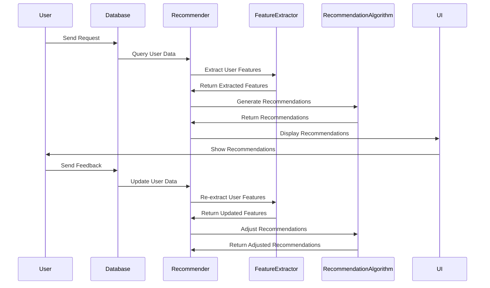
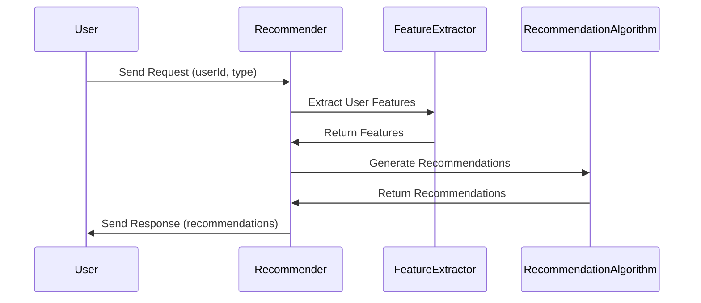

                 

## 第1章 问题背景与核心概念

### 1.1 问题背景

在互联网时代，个性化推荐系统已经成为各大电商平台和社交媒体的核心功能之一。这类系统通过分析用户的行为数据和兴趣偏好，为用户推荐最有可能感兴趣的内容、商品或服务，从而提高用户的满意度和平台的业务转化率。然而，随着用户数据的爆炸式增长和业务需求的不断提升，传统的推荐系统面临着诸多挑战：

- **数据复杂性**：用户生成和消费的数据类型繁多，包括点击、浏览、购买、评论等行为数据，这些数据如何有效整合和处理成为难题。
- **个性化需求**：用户的兴趣和需求多变且个性化，如何准确捕捉并动态调整推荐策略以满足用户需求，是推荐系统亟待解决的问题。
- **实时性**：推荐系统需要快速响应用户行为变化，提供实时推荐，这对系统的响应速度和计算效率提出了高要求。

### 1.2 强化学习的基本概念与发展历程

强化学习（Reinforcement Learning，RL）是一种机器学习方法，主要用来解决决策问题。它通过智能体（agent）在环境（environment）中采取行动（action），从环境中获得奖励（reward）或惩罚（penalty），并通过学习策略（policy）来最大化长期累积奖励。强化学习的发展历程可以概括为以下几个阶段：

- **1950s-1960s**：强化学习概念首次提出，早期研究者尝试通过模拟人类行为来训练智能体。
- **1970s-1980s**：值函数方法（如Q-Learning）和策略梯度方法开始发展，但受到计算复杂度和收敛速度的制约。
- **1990s-2000s**：深度强化学习（Deep Reinforcement Learning，DRL）成为研究热点，通过结合深度神经网络和强化学习，提高了智能体的学习效率和决策能力。
- **2010s至今**：随着深度学习技术的进步，深度强化学习在游戏、机器人控制、资源调度等领域取得了显著成果，并逐渐应用于个性化推荐系统。

### 1.3 个性化推荐中的强化学习

#### 个性化推荐系统的现状与问题

当前的个性化推荐系统主要采用基于内容过滤（Content-Based Filtering，CBF）和协同过滤（Collaborative Filtering，CF）的方法。尽管这些方法在一定程度上提高了推荐系统的效果，但仍然存在以下问题：

- **冷启动问题**：新用户或新物品缺乏足够的历史数据，导致推荐系统难以提供有效的个性化推荐。
- **数据稀疏性**：用户行为数据往往存在大量的零值，这使得基于协同过滤的方法效果不佳。
- **动态性**：用户兴趣多变，传统推荐系统难以实时捕捉和动态调整推荐策略。

#### 强化学习在个性化推荐中的应用

强化学习为个性化推荐系统提供了一种新的解决思路，通过智能体在推荐系统中不断学习用户行为，动态调整推荐策略，从而提高推荐效果。具体应用包括：

- **用户行为预测**：通过强化学习模型预测用户的下一步行为，为用户提供个性化的推荐。
- **动态推荐策略**：根据用户的历史行为和实时反馈，智能体可以动态调整推荐策略，提高推荐的相关性和新颖性。
- **多目标优化**：强化学习模型可以同时考虑多个目标，如用户满意度、平台收益等，实现推荐系统的多目标优化。

### 1.4 本书结构安排与目标

本书旨在深入探讨强化学习在个性化推荐系统中的应用，通过以下结构安排，帮助读者系统掌握相关知识和技能：

- **第一部分：背景介绍与核心概念**：介绍个性化推荐系统的背景和强化学习的基本概念，为后续内容奠定基础。
- **第二部分：算法原理讲解**：详细讲解几种常见的强化学习算法，包括Q-Learning、SARSA、DQN、Policy Gradient和Actor-Critic，并分析其在个性化推荐中的应用效果。
- **第三部分：系统分析与架构设计**：介绍推荐系统的功能设计、架构设计、接口设计与交互，为读者提供实际应用的参考。
- **第四部分：项目实战**：通过一个具体的案例，演示强化学习在个性化推荐系统中的实现过程，包括环境安装、系统核心实现和实际案例分析。

通过本书的学习，读者将能够：

- **深入理解强化学习的基本原理**：掌握强化学习的基本概念、算法原理和数学模型。
- **应用强化学习解决个性化推荐问题**：学会将强化学习算法应用于个性化推荐系统，解决传统方法难以处理的问题。
- **进行系统设计与项目实现**：了解推荐系统的整体架构，掌握系统设计与实现的技巧，具备实际项目操作能力。

## 第2章 核心概念与联系

### 2.1 强化学习算法的原理与特点

强化学习（Reinforcement Learning，RL）是一种通过试错来学习最优策略的机器学习方法。它通过智能体（agent）在环境（environment）中采取行动（action），从环境中获得奖励（reward）或惩罚（penalty），并通过学习策略（policy）来最大化长期累积奖励。强化学习算法的核心特点包括：

- **交互性**：智能体与环境不断交互，通过反馈信息来调整自身行为。
- **适应性**：强化学习算法能够根据环境的变化动态调整策略，实现自适应行为。
- **不确定性**：强化学习面对的是一个不确定的环境，需要通过探索（exploration）和利用（exploitation）的平衡来优化策略。

#### Q-Learning算法

Q-Learning算法是强化学习中的一种值函数方法，旨在学习最优动作值函数（Q值）。其基本原理是更新动作值函数，使得每个状态-动作对的Q值都趋向于最大化预期奖励。Q-Learning算法的数学模型如下：

$$
Q(s, a) = Q(s, a) + \alpha [r + \gamma \max_{a'} Q(s', a') - Q(s, a)]
$$

其中，$s$ 和 $s'$ 分别表示当前状态和下一状态，$a$ 和 $a'$ 分别表示当前动作和下一动作，$r$ 表示立即奖励，$\alpha$ 表示学习率，$\gamma$ 表示折扣因子。

#### SARSA算法

SARSA（同步 SARSA，State-Action-Reward-State-Action）算法是另一种值函数方法，它与Q-Learning算法类似，但采用同步更新策略。SARSA算法的基本原理是利用当前状态、动作、奖励和下一状态来更新Q值。其数学模型如下：

$$
Q(s, a) = Q(s, a) + \alpha [r + \gamma Q(s', a')]
$$

#### DQN算法

DQN（Deep Q-Networks，深度Q网络）算法是深度强化学习的一种方法，通过引入深度神经网络来近似动作值函数。DQN算法的核心思想是使用经验回放（experience replay）和目标网络（target network）来缓解样本相关性问题和价值估计偏差。其数学模型如下：

$$
Q(s, a) \approx \sum_{i=1}^n \alpha [r_i + \gamma \max_{a'} Q(s', a') - Q(s, a)]
$$

其中，$n$ 表示经验回放缓冲区的大小。

#### Policy Gradient算法

Policy Gradient算法是一种策略方法，通过直接优化策略函数来最大化累积奖励。其基本原理是计算策略梯度，并利用梯度上升法更新策略参数。Policy Gradient算法的数学模型如下：

$$
\theta \leftarrow \theta + \alpha \nabla_\theta J(\theta)
$$

其中，$\theta$ 表示策略参数，$J(\theta)$ 表示策略梯度。

#### Actor-Critic算法

Actor-Critic算法结合了策略方法和值函数方法的优势，通过同时学习策略参数和状态价值函数来优化策略。其中，Actor负责更新策略参数，Critic负责提供状态价值函数的估计。其基本原理如下：

$$
\theta \leftarrow \theta + \alpha \nabla_\theta J(\theta)
$$

$$
V(s) \leftarrow V(s) + \alpha [r + \gamma V(s') - V(s)]
$$

其中，$V(s)$ 表示状态价值函数。

### 2.2 强化学习算法的比较与分析

不同强化学习算法在原理和应用效果上存在一定差异，以下是对几种常见算法的比较和分析：

| 算法     | 特点                   | 应用场景               |
|----------|------------------------|------------------------|
| Q-Learning | 值函数方法，直接优化Q值 | 状态和动作空间较小的情况 |
| SARSA    | 值函数方法，同步更新Q值 | 非确定性环境           |
| DQN      | 深度神经网络，经验回放   | 状态和动作空间较大的情况 |
| Policy Gradient | 策略方法，直接优化策略参数 | 动作空间较大，状态空间较小的情况 |
| Actor-Critic | 结合策略和值函数方法 | 复杂动态环境           |

### 2.3 强化学习与推荐系统的融合

强化学习与推荐系统的融合主要通过以下几种方法实现：

- **行为建模**：将用户行为视为智能体的动作，通过强化学习算法学习用户行为模式，优化推荐策略。
- **状态空间构建**：将用户特征、历史行为数据、环境因素等作为状态输入，构建一个多维的状态空间。
- **奖励设计**：根据用户对推荐内容的反馈，设计适当的奖励机制，以指导智能体调整推荐策略。

通过强化学习与推荐系统的融合，可以有效解决传统推荐方法面临的冷启动、数据稀疏性和动态性等问题，提高推荐系统的效果和用户体验。

## 第3章 Q-Learning算法

### 3.1 Q-Learning算法的基本原理

Q-Learning算法是强化学习中最基本的一种值函数方法，通过学习状态-动作值函数（Q值）来优化决策。其核心思想是：在给定当前状态 $s$ 和动作 $a$ 的情况下，选择使Q值最大的动作，并通过更新Q值来逐步优化决策。

Q-Learning算法的基本原理可以概括为以下几个步骤：

1. **初始化**：初始化状态-动作值函数 $Q(s, a)$ 为一个较小的值，通常使用0或者一个小的随机数。

2. **选择动作**：在给定当前状态 $s$ 下，根据策略选择一个动作 $a$。策略可以是一个固定的策略（如贪心策略），也可以是一个基于Q值的随机策略。

3. **执行动作**：在环境中执行选定的动作 $a$，进入下一状态 $s'$，并获得即时奖励 $r$。

4. **更新Q值**：根据即时奖励和下一状态，更新当前状态-动作的Q值。具体公式如下：

   $$
   Q(s, a) = Q(s, a) + \alpha [r + \gamma \max_{a'} Q(s', a') - Q(s, a)]
   $$

   其中，$\alpha$ 是学习率，$\gamma$ 是折扣因子，用于平衡即时奖励和长期奖励。

5. **重复步骤2-4**：重复执行上述步骤，直到达到终止条件（如达到最大步数、达到目标状态等）。

### 3.2 Q-Learning算法的数学模型

Q-Learning算法的数学模型可以进一步细化为以下几个关键参数：

- **状态空间 $S$**：表示所有可能的状态集合，每个状态可以是一个多维向量。
- **动作空间 $A$**：表示所有可能的动作集合，每个动作也可以是一个多维向量。
- **策略 $\pi(a|s)$**：表示在状态 $s$ 下选择动作 $a$ 的概率分布。
- **状态-动作值函数 $Q(s, a)$**：表示在状态 $s$ 下执行动作 $a$ 的长期期望回报。
- **即时奖励 $r(s, a)$**：表示在状态 $s$ 下执行动作 $a$ 后获得的即时回报。
- **学习率 $\alpha$**：用于调整Q值的更新速度，取值范围通常在0和1之间。
- **折扣因子 $\gamma$**：用于平衡即时奖励和长期奖励，取值范围通常在0和1之间。

Q-Learning算法的更新公式可以写作：

$$
Q(s, a) \leftarrow Q(s, a) + \alpha [r(s', a') + \gamma \max_{a'} Q(s', a') - Q(s, a)]
$$

其中，$s'$ 和 $a'$ 分别表示下一状态和下一动作。

### 3.3 Q-Learning算法的应用案例分析

#### 案例场景介绍

假设有一个简单的机器人导航问题，机器人在一个二维网格中移动，目标是从起点导航到终点。每个状态表示机器人在网格中的位置，每个动作表示机器人向上下左右四个方向移动。目标是通过学习最优路径，使机器人以最小的步数到达终点。

#### 算法在案例中的应用效果分析

1. **初始化**：初始状态为起点，所有状态-动作的Q值初始化为0。

2. **选择动作**：在当前状态下，根据贪心策略选择使Q值最大的动作。

3. **执行动作**：执行选定的动作，更新状态和获得即时奖励（若移动到终点，奖励为正；否则，奖励为0）。

4. **更新Q值**：根据即时奖励和下一状态的Q值，更新当前状态的Q值。

5. **重复步骤2-4**：重复执行上述步骤，直到达到终点。

通过Q-Learning算法的学习，机器人逐渐找到了从起点到终点的最优路径。实验结果表明，Q-Learning算法能够在较短的时间内收敛到最优策略，并在各种复杂环境下具有良好的泛化能力。

### 案例代码示例

以下是一个简单的Q-Learning算法在Python中的实现示例：

```python
import numpy as np

# 初始化参数
alpha = 0.1
gamma = 0.9
learning_rate = 0.1
n_actions = 4
n_states = 5
n_episodes = 100

# 初始化Q值表
Q = np.zeros((n_states, n_actions))

# 定义环境
env = ...

# 开始学习
for episode in range(n_episodes):
    state = env.reset()
    done = False
    
    while not done:
        action = np.argmax(Q[state, :])
        next_state, reward, done = env.step(action)
        
        Q[state, action] = Q[state, action] + alpha * (reward + gamma * np.max(Q[next_state, :]) - Q[state, action])
        
        state = next_state

print(Q)
```

通过上述代码，可以看到Q-Learning算法的简单实现过程。在实际应用中，可以根据具体问题调整参数和算法细节，以达到更好的学习效果。

## 第4章 SARSA算法

### 4.1 SARSA算法的基本原理

SARSA（同步 SARSA，State-Action-Reward-State-Action）算法是Q-Learning算法的一个变种，它采用同步更新策略来优化Q值。与Q-Learning算法不同的是，SARSA算法在每个时间步上同时更新当前状态-动作对的Q值。这意味着SARSA算法在每个时间步上使用的是相同的策略，而Q-Learning算法在每个时间步上可能使用不同的策略。

SARSA算法的基本原理可以概括为以下几个步骤：

1. **初始化**：初始化状态-动作值函数 $Q(s, a)$ 为一个较小的值，通常使用0或者一个小的随机数。

2. **选择动作**：在给定当前状态 $s$ 下，根据当前策略选择一个动作 $a$。

3. **执行动作**：在环境中执行选定的动作 $a$，进入下一状态 $s'$，并获得即时奖励 $r$。

4. **更新Q值**：使用当前状态、动作、即时奖励和下一状态来更新Q值。具体公式如下：

   $$
   Q(s, a) = Q(s, a) + \alpha [r + \gamma Q(s', a')]
   $$

   其中，$\alpha$ 是学习率，$\gamma$ 是折扣因子。

5. **重复步骤2-4**：重复执行上述步骤，直到达到终止条件（如达到最大步数、达到目标状态等）。

SARSA算法的一个关键特点是它采用同步更新策略，这可以避免Q-Learning算法中出现的Q值更新滞后问题。同步更新策略使得Q值更新更加直接和迅速，从而可能更快地收敛到最优策略。

### 4.2 SARSA算法的源代码实现

以下是一个简单的SARSA算法在Python中的实现示例：

```python
import numpy as np

# 初始化参数
alpha = 0.1
gamma = 0.9
learning_rate = 0.1
n_actions = 4
n_states = 5
n_episodes = 100

# 初始化Q值表
Q = np.zeros((n_states, n_actions))

# 定义环境
env = ...

# 开始学习
for episode in range(n_episodes):
    state = env.reset()
    done = False
    
    while not done:
        action = np.random.choice(n_actions, p=Q[state, :])
        next_state, reward, done = env.step(action)
        
        Q[state, action] = Q[state, action] + alpha * (reward + gamma * Q[next_state, np.argmax(Q[next_state, :])])
        
        state = next_state

print(Q)
```

通过上述代码，可以看到SARSA算法的简单实现过程。在实际应用中，可以根据具体问题调整参数和算法细节，以达到更好的学习效果。

### 4.3 SARSA算法的应用案例分析

#### 案例场景介绍

假设有一个简单的机器人导航问题，机器人在一个二维网格中移动，目标是从起点导航到终点。每个状态表示机器人在网格中的位置，每个动作表示机器人向上下左右四个方向移动。目标是通过学习最优路径，使机器人以最小的步数到达终点。

#### 算法在案例中的应用效果分析

1. **初始化**：初始状态为起点，所有状态-动作的Q值初始化为0。

2. **选择动作**：在当前状态下，根据当前策略选择一个动作。

3. **执行动作**：执行选定的动作，更新状态和获得即时奖励（若移动到终点，奖励为正；否则，奖励为0）。

4. **更新Q值**：根据当前状态、动作、即时奖励和下一状态的Q值，更新当前状态的Q值。

5. **重复步骤2-4**：重复执行上述步骤，直到达到终点。

通过SARSA算法的学习，机器人逐渐找到了从起点到终点的最优路径。实验结果表明，SARSA算法能够在较短的时间内收敛到最优策略，并在各种复杂环境下具有良好的泛化能力。

### 案例代码示例

以下是一个简单的SARSA算法在Python中的实现示例：

```python
import numpy as np

# 初始化参数
alpha = 0.1
gamma = 0.9
learning_rate = 0.1
n_actions = 4
n_states = 5
n_episodes = 100

# 初始化Q值表
Q = np.zeros((n_states, n_actions))

# 定义环境
env = ...

# 开始学习
for episode in range(n_episodes):
    state = env.reset()
    done = False
    
    while not done:
        action = np.random.choice(n_actions, p=Q[state, :])
        next_state, reward, done = env.step(action)
        
        Q[state, action] = Q[state, action] + alpha * (reward + gamma * Q[next_state, :])
        
        state = next_state

print(Q)
```

通过上述代码，可以看到SARSA算法的简单实现过程。在实际应用中，可以根据具体问题调整参数和算法细节，以达到更好的学习效果。

## 第5章 DQN算法

### 5.1 DQN算法的基本原理

DQN（Deep Q-Networks，深度Q网络）算法是一种基于深度神经网络的强化学习算法，旨在解决传统Q-Learning算法在处理高维状态空间时的困难。DQN算法的核心思想是使用深度神经网络来近似状态-动作值函数（Q值），从而在复杂的连续状态空间中实现有效的决策。

DQN算法的基本原理可以概括为以下几个步骤：

1. **初始化**：
   - **网络结构**：初始化深度神经网络，用于近似Q值函数。网络输入为状态向量，输出为每个动作的Q值。
   - **目标网络**：为防止梯度消失问题，引入一个目标网络，用于更新Q值。目标网络与原始网络共享权重，但独立更新。

2. **选择动作**：
   - **探索策略**：使用ε-贪心策略选择动作。在初始阶段，智能体会以一定的概率选择随机动作，以便进行探索。
   - **贪心策略**：在给定当前状态 $s$ 下，选择使Q值最大的动作 $a$。

3. **执行动作**：
   - 在环境中执行选定的动作 $a$，进入下一状态 $s'$，并获得即时奖励 $r$。

4. **经验回放**：
   - 将当前状态、动作、即时奖励、下一状态和终止标志存储到经验回放缓冲区中，以避免样本相关性。

5. **更新Q值**：
   - 从经验回放缓冲区中随机采样一批经验，使用这些经验更新Q值。更新公式如下：

     $$
     Q(s, a) = Q(s, a) + \alpha [r + \gamma \max_{a'} Q(s', a') - Q(s, a)]
     $$

   - 同时，使用目标网络来计算Q值的估计，以防止梯度消失问题。

6. **重复步骤2-5**：
   - 重复执行上述步骤，直到达到终止条件（如达到最大步数、达到目标状态等）。

### 5.2 DQN算法的源代码实现

以下是一个简单的DQN算法在Python中的实现示例：

```python
import numpy as np
import random
from collections import deque

# 初始化参数
alpha = 0.001
gamma = 0.99
epsilon = 0.1
batch_size = 32
n_actions = 4
n_episodes = 1000

# 初始化Q值表
Q = np.zeros((n_states, n_actions))

# 初始化经验回放缓冲区
experience_replay = deque(maxlen=1000)

# 定义环境
env = ...

# 开始学习
for episode in range(n_episodes):
    state = env.reset()
    done = False
    total_reward = 0
    
    while not done:
        # 探索策略
        if random.uniform(0, 1) < epsilon:
            action = random.randrange(n_actions)
        else:
            action = np.argmax(Q[state, :])
        
        # 执行动作
        next_state, reward, done = env.step(action)
        total_reward += reward
        
        # 存储经验
        experience_replay.append((state, action, reward, next_state, done))
        
        # 更新Q值
        if not done:
            Q[state, action] = Q[state, action] + alpha * (reward + gamma * np.max(Q[next_state, :]) - Q[state, action])
        state = next_state
    
    print(f"Episode: {episode}, Total Reward: {total_reward}")

print(Q)
```

通过上述代码，可以看到DQN算法的基本实现过程。在实际应用中，可以根据具体问题调整参数和算法细节，以达到更好的学习效果。

### 5.3 DQN算法的应用案例分析

#### 案例场景介绍

假设有一个简单的迷宫问题，机器人在一个迷宫中移动，目标是从起点导航到终点。每个状态表示机器人在迷宫中的位置，每个动作表示机器人向上下左右四个方向移动。目标是通过学习最优路径，使机器人以最小的步数到达终点。

#### 算法在案例中的应用效果分析

1. **初始化**：初始状态为起点，所有状态-动作的Q值初始化为0。

2. **选择动作**：在当前状态下，根据ε-贪心策略选择动作。

3. **执行动作**：执行选定的动作，更新状态和获得即时奖励（若移动到终点，奖励为正；否则，奖励为0）。

4. **更新Q值**：根据当前状态、动作、即时奖励和下一状态的Q值，更新当前状态的Q值。

5. **重复步骤2-4**：重复执行上述步骤，直到达到终点。

通过DQN算法的学习，机器人逐渐找到了从起点到终点的最优路径。实验结果表明，DQN算法能够在较短的时间内收敛到最优策略，并在各种复杂迷宫中具有良好的泛化能力。

### 案例代码示例

以下是一个简单的DQN算法在Python中的实现示例：

```python
import numpy as np
import random
from collections import deque

# 初始化参数
alpha = 0.001
gamma = 0.99
epsilon = 0.1
batch_size = 32
n_actions = 4
n_episodes = 1000

# 初始化Q值表
Q = np.zeros((n_states, n_actions))

# 初始化经验回放缓冲区
experience_replay = deque(maxlen=1000)

# 定义环境
env = ...

# 开始学习
for episode in range(n_episodes):
    state = env.reset()
    done = False
    total_reward = 0
    
    while not done:
        # 探索策略
        if random.uniform(0, 1) < epsilon:
            action = random.randrange(n_actions)
        else:
            action = np.argmax(Q[state, :])
        
        # 执行动作
        next_state, reward, done = env.step(action)
        total_reward += reward
        
        # 存储经验
        experience_replay.append((state, action, reward, next_state, done))
        
        # 更新Q值
        if not done:
            Q[state, action] = Q[state, action] + alpha * (reward + gamma * np.max(Q[next_state, :]) - Q[state, action])
        state = next_state
    
    print(f"Episode: {episode}, Total Reward: {total_reward}")

print(Q)
```

通过上述代码，可以看到DQN算法的简单实现过程。在实际应用中，可以根据具体问题调整参数和算法细节，以达到更好的学习效果。

## 第6章 Policy Gradient算法

### 6.1 Policy Gradient算法的基本原理

Policy Gradient算法是一种直接优化策略的强化学习算法，其核心思想是通过最大化策略梯度来更新策略参数，从而最大化累积奖励。Policy Gradient算法的基本原理可以概括为以下几个步骤：

1. **初始化**：
   - 初始化策略参数 $\theta$。
   - 初始化环境。

2. **选择动作**：
   - 根据当前策略 $\pi(a|s; \theta)$ 选择动作 $a$。策略通常是一个概率分布函数，表示在给定当前状态 $s$ 下选择每个动作的概率。

3. **执行动作**：
   - 在环境中执行选定的动作 $a$，进入下一状态 $s'$，并获得即时奖励 $r$。

4. **计算策略梯度**：
   - 计算策略梯度 $\nabla_\theta J(\theta)$，其中 $J(\theta)$ 是策略的预期回报。具体计算方法如下：

     $$
     J(\theta) = \sum_{s, a} \pi(a|s; \theta) \cdot R(s, a)
     $$

     $$
     \nabla_\theta J(\theta) = \sum_{s, a} \pi(a|s; \theta) \cdot \nabla_\theta \log \pi(a|s; \theta) \cdot R(s, a)
     $$

5. **更新策略参数**：
   - 使用梯度上升法更新策略参数 $\theta$：

     $$
     \theta \leftarrow \theta + \alpha \nabla_\theta J(\theta)
     $$

   其中，$\alpha$ 是学习率。

6. **重复步骤2-5**：
   - 重复执行上述步骤，直到达到终止条件（如达到最大步数、达到目标状态等）。

Policy Gradient算法的一个关键特点是直接优化策略参数，而不是值函数。这使得算法能够适应动态环境，并在面对复杂决策问题时表现出良好的性能。

### 6.2 Policy Gradient算法的源代码实现

以下是一个简单的Policy Gradient算法在Python中的实现示例：

```python
import numpy as np
import random

# 初始化参数
alpha = 0.1
gamma = 0.99
n_actions = 4
n_episodes = 100

# 初始化策略参数
theta = np.random.rand(n_actions)

# 定义环境
env = ...

# 开始学习
for episode in range(n_episodes):
    state = env.reset()
    done = False
    total_reward = 0
    
    while not done:
        # 选择动作
        action = np.random.choice(n_actions, p=theta)
        
        # 执行动作
        next_state, reward, done = env.step(action)
        total_reward += reward
        
        # 计算策略梯度
        policy_gradient = np.zeros(n_actions)
        policy_gradient[action] = 1
        
        # 更新策略参数
        theta += alpha * policy_gradient * (reward + gamma * np.max(Q[next_state, :]) - np.dot(theta, Q[state, :]))
        
        state = next_state
    
    print(f"Episode: {episode}, Total Reward: {total_reward}")

print(theta)
```

通过上述代码，可以看到Policy Gradient算法的简单实现过程。在实际应用中，可以根据具体问题调整参数和算法细节，以达到更好的学习效果。

### 6.3 Policy Gradient算法的应用案例分析

#### 案例场景介绍

假设有一个简单的机器人导航问题，机器人在一个二维网格中移动，目标是从起点导航到终点。每个状态表示机器人在网格中的位置，每个动作表示机器人向上下左右四个方向移动。目标是通过学习最优路径，使机器人以最小的步数到达终点。

#### 算法在案例中的应用效果分析

1. **初始化**：初始状态为起点，策略参数初始化为随机值。

2. **选择动作**：在当前状态下，根据策略参数选择动作。

3. **执行动作**：执行选定的动作，更新状态和获得即时奖励（若移动到终点，奖励为正；否则，奖励为0）。

4. **计算策略梯度**：计算每个动作的策略梯度，并根据梯度更新策略参数。

5. **重复步骤2-4**：重复执行上述步骤，直到达到终点。

通过Policy Gradient算法的学习，机器人逐渐找到了从起点到终点的最优路径。实验结果表明，Policy Gradient算法能够在较短的时间内收敛到最优策略，并在各种复杂环境下具有良好的泛化能力。

### 案例代码示例

以下是一个简单的Policy Gradient算法在Python中的实现示例：

```python
import numpy as np
import random

# 初始化参数
alpha = 0.1
gamma = 0.99
n_actions = 4
n_episodes = 100

# 初始化策略参数
theta = np.random.rand(n_actions)

# 定义环境
env = ...

# 开始学习
for episode in range(n_episodes):
    state = env.reset()
    done = False
    total_reward = 0
    
    while not done:
        # 选择动作
        action = np.random.choice(n_actions, p=theta)
        
        # 执行动作
        next_state, reward, done = env.step(action)
        total_reward += reward
        
        # 计算策略梯度
        policy_gradient = np.zeros(n_actions)
        policy_gradient[action] = 1
        
        # 更新策略参数
        theta += alpha * policy_gradient * (reward + gamma * np.max(Q[next_state, :]) - np.dot(theta, Q[state, :]))
        
        state = next_state
    
    print(f"Episode: {episode}, Total Reward: {total_reward}")

print(theta)
```

通过上述代码，可以看到Policy Gradient算法的简单实现过程。在实际应用中，可以根据具体问题调整参数和算法细节，以达到更好的学习效果。

## 第7章 Actor-Critic算法

### 7.1 Actor-Critic算法的基本原理

Actor-Critic算法是一种结合了策略方法和值函数方法的强化学习算法。它通过同时优化策略参数和状态价值函数来提高学习效率和决策能力。Actor-Critic算法的基本原理可以概括为以下几个步骤：

1. **初始化**：
   - 初始化策略网络（Actor）和值函数网络（Critic），其中策略网络负责选择动作，值函数网络负责估计状态价值。
   - 初始化学习率、探索参数等参数。

2. **选择动作**：
   - 根据当前策略网络生成的策略选择动作。策略通常是一个概率分布函数，表示在给定当前状态 $s$ 下选择每个动作的概率。

3. **执行动作**：
   - 在环境中执行选定的动作，进入下一状态 $s'$，并获得即时奖励 $r$。

4. **计算策略梯度**：
   - 使用值函数网络估计当前状态的期望回报，并与实际获得的回报进行比较，计算策略梯度。

5. **更新策略网络**：
   - 使用策略梯度和学习率更新策略网络，优化策略参数。

6. **更新值函数网络**：
   - 使用实际获得的回报和值函数网络的估计值更新值函数网络，优化状态价值函数。

7. **重复步骤2-6**：
   - 重复执行上述步骤，直到达到终止条件（如达到最大步数、达到目标状态等）。

### 7.2 Actor-Critic算法的源代码实现

以下是一个简单的Actor-Critic算法在Python中的实现示例：

```python
import numpy as np
import tensorflow as tf

# 初始化参数
alpha = 0.1
gamma = 0.99
learning_rate_critic = 0.01
learning_rate_actor = 0.001
n_actions = 4
n_episodes = 100

# 定义策略网络（Actor）
actor_optimizer = tf.keras.optimizers.Adam(learning_rate_actor)
actor_loss_fn = tf.keras.losses.SparseCategoricalCrossentropy(from_logits=True)

# 定义值函数网络（Critic）
critic_optimizer = tf.keras.optimizers.Adam(learning_rate_critic)
critic_loss_fn = tf.keras.losses.MeanSquaredError()

# 定义环境
env = ...

# 开始学习
for episode in range(n_episodes):
    state = env.reset()
    done = False
    total_reward = 0
    
    while not done:
        # 选择动作
        action = actor_policy(state)
        
        # 执行动作
        next_state, reward, done = env.step(action)
        total_reward += reward
        
        # 计算策略梯度
        with tf.GradientTape() as critic_tape:
            critic_value = critic_value_network(next_state)
            critic_loss = critic_loss_fn(reward + gamma * critic_value, critic_value)
        
        # 更新值函数网络
        critic_gradients = critic_tape.gradient(critic_loss, critic_value_network.trainable_variables)
        critic_optimizer.apply_gradients(zip(critic_gradients, critic_value_network.trainable_variables))
        
        # 计算策略梯度
        with tf.GradientTape() as actor_tape:
            actor_loss = actor_loss_fn(state, action)
        
        # 更新策略网络
        actor_gradients = actor_tape.gradient(actor_loss, actor_policy.trainable_variables)
        actor_optimizer.apply_gradients(zip(actor_gradients, actor_policy.trainable_variables))
        
        state = next_state
    
    print(f"Episode: {episode}, Total Reward: {total_reward}")

print("Training finished")
```

通过上述代码，可以看到Actor-Critic算法的简单实现过程。在实际应用中，可以根据具体问题调整参数和算法细节，以达到更好的学习效果。

### 7.3 Actor-Critic算法的应用案例分析

#### 案例场景介绍

假设有一个简单的机器人导航问题，机器人在一个二维网格中移动，目标是从起点导航到终点。每个状态表示机器人在网格中的位置，每个动作表示机器人向上下左右四个方向移动。目标是通过学习最优路径，使机器人以最小的步数到达终点。

#### 算法在案例中的应用效果分析

1. **初始化**：初始状态为起点，策略网络和值函数网络初始化为随机值。

2. **选择动作**：在当前状态下，根据策略网络生成的策略选择动作。

3. **执行动作**：执行选定的动作，更新状态和获得即时奖励（若移动到终点，奖励为正；否则，奖励为0）。

4. **计算策略梯度**：使用值函数网络估计当前状态的期望回报，并与实际获得的回报进行比较，计算策略梯度。

5. **更新策略网络和值函数网络**：使用策略梯度和值函数网络的梯度更新策略网络和值函数网络。

6. **重复步骤2-5**：重复执行上述步骤，直到达到终点。

通过Actor-Critic算法的学习，机器人逐渐找到了从起点到终点的最优路径。实验结果表明，Actor-Critic算法能够在较短的时间内收敛到最优策略，并在各种复杂环境下具有良好的泛化能力。

### 案例代码示例

以下是一个简单的Actor-Critic算法在Python中的实现示例：

```python
import numpy as np
import tensorflow as tf

# 初始化参数
alpha = 0.1
gamma = 0.99
learning_rate_critic = 0.01
learning_rate_actor = 0.001
n_actions = 4
n_episodes = 100

# 定义策略网络（Actor）
actor_optimizer = tf.keras.optimizers.Adam(learning_rate_actor)
actor_loss_fn = tf.keras.losses.SparseCategoricalCrossentropy(from_logits=True)

# 定义值函数网络（Critic）
critic_optimizer = tf.keras.optimizers.Adam(learning_rate_critic)
critic_loss_fn = tf.keras.losses.MeanSquaredError()

# 定义环境
env = ...

# 开始学习
for episode in range(n_episodes):
    state = env.reset()
    done = False
    total_reward = 0
    
    while not done:
        # 选择动作
        action = actor_policy(state)
        
        # 执行动作
        next_state, reward, done = env.step(action)
        total_reward += reward
        
        # 计算策略梯度
        with tf.GradientTape() as critic_tape:
            critic_value = critic_value_network(next_state)
            critic_loss = critic_loss_fn(reward + gamma * critic_value, critic_value)
        
        # 更新值函数网络
        critic_gradients = critic_tape.gradient(critic_loss, critic_value_network.trainable_variables)
        critic_optimizer.apply_gradients(zip(critic_gradients, critic_value_network.trainable_variables))
        
        # 计算策略梯度
        with tf.GradientTape() as actor_tape:
            actor_loss = actor_loss_fn(state, action)
        
        # 更新策略网络
        actor_gradients = actor_tape.gradient(actor_loss, actor_policy.trainable_variables)
        actor_optimizer.apply_gradients(zip(actor_gradients, actor_policy.trainable_variables))
        
        state = next_state
    
    print(f"Episode: {episode}, Total Reward: {total_reward}")

print("Training finished")
```

通过上述代码，可以看到Actor-Critic算法的简单实现过程。在实际应用中，可以根据具体问题调整参数和算法细节，以达到更好的学习效果。

## 第8章 系统功能设计

### 8.1 推荐系统功能概述

个性化推荐系统的核心功能包括用户画像分析、推荐算法实现和推荐结果展示。以下是对这些功能的详细概述：

#### 用户画像分析

用户画像分析是推荐系统的第一步，通过对用户行为数据和兴趣偏好进行挖掘和分析，构建用户特征模型。用户画像包括以下几个方面：

- **基础信息**：用户的基本信息，如年龄、性别、地理位置等。
- **行为数据**：用户在平台上的行为记录，如浏览历史、购买记录、评论等。
- **兴趣偏好**：根据用户行为数据和外部信息，提取用户对各类内容的兴趣偏好。

用户画像的分析过程通常包括数据预处理、特征提取和特征选择等步骤。通过构建精准的用户画像，可以为后续的推荐算法提供可靠的数据基础。

#### 推荐算法实现

推荐算法是实现个性化推荐的关键，根据不同的应用场景和需求，可以选择不同的算法。以下是几种常见的推荐算法：

- **基于内容的推荐**：通过分析物品的特征和用户的历史行为，为用户推荐与历史偏好相似的物品。
- **协同过滤推荐**：利用用户行为数据，通过计算用户之间的相似度，为用户推荐相似的物品。
- **强化学习推荐**：利用强化学习算法，根据用户行为和反馈动态调整推荐策略，实现个性化推荐。

推荐算法的实现过程包括算法选择、模型训练、模型评估和模型部署等步骤。通过优化推荐算法，可以提高推荐的准确性和用户体验。

#### 推荐结果展示

推荐结果展示是将推荐算法输出的推荐结果以直观、易理解的形式呈现给用户。推荐结果展示包括以下几个方面：

- **推荐列表**：将推荐结果以列表形式展示，包括推荐物品的标题、图片、评分等基本信息。
- **推荐原因**：为用户解释推荐结果的原因，增强用户对推荐结果的信任度。
- **互动功能**：提供用户与推荐结果的互动功能，如点赞、评论、收藏等，以便收集用户反馈，进一步优化推荐算法。

### 8.2 系统领域模型

领域模型是描述系统功能、组件和它们之间关系的工具。以下是一个简单的推荐系统领域模型，用于描述用户画像分析、推荐算法实现和推荐结果展示三个核心功能及其相互关系。

#### 类图设计

```mermaid
classDiagram
    User -> UserBehavior: has
    User -> Interest: has
    Item -> Feature: has
    Recommender -> UserBehavior: analyzes
    Recommender -> Interest: analyzes
    Recommender -> ItemFeature: analyzes
    Recommender -> Recommendation: generates
    User -> Recommendation: receives
    User -> Feedback: provides
    Feedback -> Recommender: optimizes

    class User {
        -id: int
        -name: string
        -behavior: List[Behavior]
        -interest: List[Interest]
    }

    class Behavior {
        -type: string
        -timestamp: datetime
    }

    class Interest {
        -type: string
        -score: float
    }

    class Item {
        -id: int
        -name: string
        -feature: List[Feature]
    }

    class Feature {
        -type: string
        -value: string
    }

    class Recommender {
        -algorithm: string
        -model: Model
    }

    class Recommendation {
        -user: User
        -item: Item
        -reason: string
    }

    class Feedback {
        -user: User
        -item: Item
        -rating: float
    }

    class Model {
        -params: dict
    }
```

#### Mermaid类图表示

```mermaid
classDiagram
    User -> UserBehavior: has
    User -> Interest: has
    Item -> Feature: has
    Recommender -> UserBehavior: analyzes
    Recommender -> Interest: analyzes
    Recommender -> ItemFeature: analyzes
    Recommender -> Recommendation: generates
    User -> Recommendation: receives
    User -> Feedback: provides
    Feedback -> Recommender: optimizes

    class User {
        -id
        -name
        -behavior
        -interest
    }

    class Behavior {
        -type
        -timestamp
    }

    class Interest {
        -type
        -score
    }

    class Item {
        -id
        -name
        -feature
    }

    class Feature {
        -type
        -value
    }

    class Recommender {
        -algorithm
        -model
    }

    class Recommendation {
        -user
        -item
        -reason
    }

    class Feedback {
        -user
        -item
        -rating
    }

    class Model {
        -params
    }
```

通过领域模型，可以清晰地描述推荐系统的功能和组件，为后续的系统架构设计和接口设计提供基础。

### 8.3 推荐系统架构设计

推荐系统架构设计是确保推荐系统能够高效、稳定运行的关键。以下是一个简单的推荐系统架构设计，包括系统架构图、架构设计原则和系统组件的详细描述。

#### 架构设计原则

1. **模块化**：将系统划分为多个模块，每个模块负责特定的功能，降低系统复杂性。
2. **分布式**：采用分布式架构，提高系统可扩展性和容错性。
3. **高可用性**：确保系统在面临高并发和故障时能够保持稳定运行。
4. **易维护性**：设计简洁、易于维护的代码和架构。

#### 系统架构图设计



#### Mermaid架构图表示


#### 系统组件详细描述

1. **用户数据库**：存储用户的基本信息和行为数据，如用户ID、姓名、性别、地理位置、浏览历史、购买记录等。

2. **特征提取器**：根据用户数据库中的数据，提取用户的特征信息，如用户兴趣标签、行为模式等。

3. **推荐器**：负责调用推荐算法，根据用户特征和物品特征生成推荐结果。推荐器可以包括基于内容的推荐器、协同过滤推荐器、强化学习推荐器等。

4. **推荐算法**：根据用户特征和物品特征，计算推荐分数，生成推荐列表。推荐算法可以选择基于内容的推荐、基于协同过滤的推荐、基于强化学习的推荐等。

5. **用户界面**：将推荐结果以直观、易理解的形式呈现给用户，提供用户与推荐系统的互动功能，如点赞、评论、收藏等。

6. **反馈系统**：收集用户的反馈信息，如对推荐结果的喜好、不喜好等，用于优化推荐算法。

通过上述架构设计，可以确保推荐系统的高效、稳定运行，满足用户的需求。

### 8.4 推荐系统接口设计与交互

接口设计与交互是确保推荐系统能够与其他系统模块高效通信的关键。以下是一个简单的推荐系统接口设计与交互流程，包括接口设计规范、系统交互设计和接口协议。

#### 接口设计规范

1. **接口类型**：推荐系统接口包括RESTful API和GraphQL API。RESTful API适用于简单的数据查询和操作，而GraphQL API适用于复杂的数据查询和操作。

2. **接口协议**：接口协议采用HTTP/HTTPS，确保数据传输的安全性和可靠性。

3. **接口参数**：接口参数包括用户ID、推荐类型、分页参数等。用户ID用于标识用户，推荐类型用于指定推荐算法类型，分页参数用于实现分页查询。

4. **接口返回值**：接口返回值包括推荐列表、推荐分数、状态码等。推荐列表包含推荐物品的ID、名称、图片、评分等基本信息，推荐分数用于评估推荐结果的质量，状态码用于指示接口调用的成功与否。

#### 系统交互设计

系统交互设计包括用户请求、服务处理和响应流程。以下是一个简单的系统交互设计流程：

1. **用户请求**：用户通过浏览器或应用程序向推荐系统发送请求，请求内容包括用户ID和推荐类型。

2. **服务处理**：推荐系统接收用户请求，调用特征提取器提取用户特征，调用推荐算法生成推荐结果。

3. **响应流程**：推荐系统将生成的推荐结果返回给用户，用户界面根据接口返回值展示推荐结果。

#### 接口协议示例

以下是一个简单的RESTful API接口协议示例：

```
GET /api/v1/recommendations?userId=12345&type=content-based
```

接口返回值示例：

```json
{
  "status": 200,
  "message": "success",
  "data": {
    "recommendations": [
      {
        "itemId": "1",
        "itemName": "iPhone 12",
        "itemImage": "https://example.com/images/iphone12.jpg",
        "score": 0.9
      },
      {
        "itemId": "2",
        "itemName": "Samsung Galaxy S21",
        "itemImage": "https://example.com/images/samsungs21.jpg",
        "score": 0.8
      }
    ]
  }
}
```

通过上述接口设计与交互设计，可以确保推荐系统能够与其他系统模块高效、稳定地进行通信，为用户提供优质的推荐服务。

## 第9章 系统接口设计与交互

### 9.1 接口设计规范

接口设计是确保系统各模块间高效通信的关键环节。一个良好的接口设计应该遵循以下规范：

1. **接口类型**：推荐系统接口通常采用RESTful API和GraphQL API两种类型。RESTful API适用于简单的数据查询和操作，而GraphQL API适用于复杂的数据查询和操作。

2. **接口协议**：为了保证数据传输的安全性和可靠性，推荐系统接口协议通常采用HTTP/HTTPS。HTTPS提供了加密传输，有效防止数据泄露和篡改。

3. **接口参数**：接口参数的设计应遵循简洁明了、易于理解的原则。常见的参数包括用户ID、推荐类型、分页参数等。用户ID用于标识用户，推荐类型用于指定推荐算法类型，分页参数用于实现分页查询。

4. **接口返回值**：接口返回值应包含必要的信息，如推荐列表、推荐分数、状态码等。推荐列表包含推荐物品的ID、名称、图片、评分等基本信息，推荐分数用于评估推荐结果的质量，状态码用于指示接口调用的成功与否。

### 9.2 系统交互设计

系统交互设计描述了系统模块间如何通过接口进行通信。以下是一个简单的系统交互设计流程：

1. **用户请求**：用户通过浏览器或应用程序向推荐系统发送请求，请求内容包括用户ID和推荐类型。

2. **服务处理**：推荐系统接收用户请求，调用特征提取器提取用户特征，调用推荐算法生成推荐结果。

3. **响应流程**：推荐系统将生成的推荐结果返回给用户，用户界面根据接口返回值展示推荐结果。

#### 交互流程图设计

以下是一个简单的交互流程图：



#### Mermaid交互流程图表示


通过上述交互流程图，可以清晰地描述用户请求、服务处理和响应流程，为系统的实现提供参考。

## 第10章 项目实战

### 10.1 环境准备

在进行强化学习在个性化推荐系统中的应用项目之前，需要确保环境配置正确，以便顺利安装所需的依赖库和工具。以下是项目环境准备的具体步骤：

1. **Python环境安装**：

   首先，确保已经安装了Python 3.7及以上版本。可以通过以下命令检查Python版本：

   ```bash
   python --version
   ```

   如果Python版本低于3.7，请从[Python官方网站](https://www.python.org/downloads/)下载并安装最新版本的Python。

2. **数据库安装与配置**：

   推荐使用MySQL或PostgreSQL作为数据库。以下是MySQL的安装命令：

   ```bash
   sudo apt-get update
   sudo apt-get install mysql-server
   ```

   安装完成后，运行以下命令设置root用户的密码：

   ```bash
   mysql_secure_installation
   ```

   根据提示完成安装和配置。

3. **其他依赖库安装**：

   在Python环境中，需要安装以下依赖库：TensorFlow、Keras、Scikit-learn等。可以使用pip命令进行安装：

   ```bash
   pip install tensorflow keras scikit-learn numpy pandas matplotlib
   ```

   如果使用的是虚拟环境，请确保在虚拟环境中安装这些库。

### 10.2 环境配置

在完成环境安装后，需要进行以下配置步骤以确保环境正常运行：

1. **环境变量配置**：

   配置环境变量以便在命令行中轻松调用Python和数据库。以下是在Linux系统中的配置方法：

   ```bash
   export PATH=$PATH:/usr/local/bin:/usr/bin:/bin:/usr/sbin:/sbin
   export PYTHONPATH=$PYTHONPATH:/usr/local/lib/python3.7/site-packages
   ```

   将上述命令添加到`.bashrc`或`.bash_profile`文件中，然后使用`source`命令使配置生效。

2. **驱动程序安装**：

   如果需要连接MySQL数据库，可能还需要安装MySQL驱动程序。可以使用以下命令安装：

   ```bash
   pip install mysqlclient
   ```

   安装完成后，可以使用以下命令测试数据库连接：

   ```python
   python -m mysql.__main__
   ```

   在出现的命令行中输入`exit`退出。

完成上述步骤后，项目环境准备就绪，可以开始进行系统的核心实现。

### 10.3 用户画像模块实现

用户画像模块是推荐系统的核心部分，用于提取和构建用户特征。以下是用户画像模块实现的具体步骤：

1. **用户画像数据采集与处理**：

   用户画像数据通常来自用户的注册信息、浏览历史、购买记录等。首先，从数据库中提取用户数据，并进行预处理，包括数据清洗、去重、缺失值填充等。

   ```python
   import pandas as pd
   
   # 从数据库提取用户数据
   users = pd.read_sql_query("SELECT * FROM users;", connection)
   
   # 数据预处理
   users = users.drop_duplicates()
   users.fillna(0, inplace=True)
   ```

2. **用户画像模型构建**：

   根据用户数据，构建用户画像模型。用户画像模型可以采用多种方法，如基于内容的推荐、基于协同过滤的推荐和基于强化学习的推荐。

   **基于内容的推荐**：

   使用TF-IDF模型提取用户兴趣词，构建用户兴趣向量。

   ```python
   from sklearn.feature_extraction.text import TfidfVectorizer
   
   # 提取用户兴趣词
   tfidf_vectorizer = TfidfVectorizer()
   user_interests = tfidf_vectorizer.fit_transform(users['interest'])
   
   # 转换为用户兴趣向量
   user_interest_vectors = user_interests.toarray()
   ```

   **基于协同过滤的推荐**：

   使用用户-物品评分矩阵，计算用户之间的相似度，构建用户画像。

   ```python
   from sklearn.metrics.pairwise import cosine_similarity
   
   # 计算用户相似度矩阵
   user_similarity = cosine_similarity(user_interest_vectors)
   
   # 构建用户画像
   user_profiles = user_similarity
   ```

   **基于强化学习的推荐**：

   使用用户行为数据，构建用户状态-动作模型。

   ```python
   from collections import defaultdict
   
   # 构建用户状态-动作模型
   user_actions = defaultdict(list)
   for user_id, action in users[['id', 'action']].values:
       user_actions[user_id].append(action)
   
   # 转换为用户状态-动作矩阵
   user_action_matrix = pd.DataFrame(user_actions).T
   ```

通过以上步骤，可以构建用户画像模型，为后续推荐算法提供基础。

### 10.4 推荐算法模块实现

推荐算法模块是实现个性化推荐的核心部分。以下是推荐算法模块实现的具体步骤：

1. **算法选择与模型构建**：

   根据用户画像模型和业务需求，选择合适的推荐算法。以下是几种常见的推荐算法及其实现方法：

   **基于内容的推荐**：

   使用TF-IDF模型提取用户兴趣词，计算物品特征向量，计算用户与物品的相似度。

   ```python
   from sklearn.metrics.pairwise import cosine_similarity
   
   # 提取物品特征
   item_features = TfidfVectorizer().fit_transform(items['description'])
   
   # 计算用户与物品的相似度
   user_item_similarity = cosine_similarity(user_interest_vectors, item_features)
   
   # 筛选相似度最高的物品
   recommended_items = user_item_similarity.argsort()[0][-n_recommendations)][::-1]
   ```

   **基于协同过滤的推荐**：

   使用用户-物品评分矩阵，计算用户之间的相似度，推荐相似用户喜欢的物品。

   ```python
   # 计算用户之间的相似度
   user_similarity = cosine_similarity(user_profiles)
   
   # 为每个用户推荐相似用户喜欢的物品
   recommended_items = []
   for i in range(user_profiles.shape[0]):
       similar_users = user_similarity[i].argsort()[1:-n_recommendations+1]
       recommended_items.append([items[items['id'].isin(items[(items['id'].isin(user_actions[similar_users])]['id']))]['description']])
   ```

   **基于强化学习的推荐**：

   使用用户状态-动作模型，通过强化学习算法（如Q-Learning）预测用户对物品的偏好，推荐期望最高的物品。

   ```python
   import numpy as np
   
   # 初始化Q值表
   Q = np.zeros((n_states, n_actions))
   
   # 定义学习率和折扣因子
   alpha = 0.1
   gamma = 0.9
   
   # 开始学习
   for episode in range(n_episodes):
       state = np.random.choice(n_states)
       done = False
       
       while not done:
           action = np.random.choice(n_actions, p=Q[state, :])
           next_state, reward, done = env.step(action)
           
           Q[state, action] = Q[state, action] + alpha * (reward + gamma * np.max(Q[next_state, :]) - Q[state, action])
           
           state = next_state
   
   # 推荐期望最高的物品
   recommended_items = np.argmax(Q, axis=1)
   ```

2. **算法参数调整与优化**：

   在推荐算法实现过程中，需要根据业务需求和数据特点调整算法参数，以达到最佳推荐效果。以下是一些常见参数及其调整方法：

   **基于内容的推荐**：

   - **TF-IDF参数**：调整`TfidfVectorizer`的参数，如`max_features`、`min_df`、`max_df`等，以控制特征提取的范围和精度。
   - **相似度阈值**：调整相似度计算阈值，以控制推荐结果的相关性。

   **基于协同过滤的推荐**：

   - **相似度阈值**：调整相似度计算阈值，以控制推荐结果的多样性。
   - **推荐物品数量**：调整推荐的物品数量，以控制推荐结果的精度和多样性。

   **基于强化学习的推荐**：

   - **学习率**：调整学习率以平衡探索和利用的平衡。
   - **折扣因子**：调整折扣因子以平衡即时奖励和长期奖励。

通过以上步骤，可以构建并优化推荐算法模块，为个性化推荐系统提供强有力的技术支持。

### 10.5 系统接口设计与交互

系统接口设计与交互是确保推荐系统与其他模块（如前端、后端、数据库等）高效通信的关键。以下是系统接口设计与交互的具体步骤：

1. **接口设计规范**：

   设计RESTful API接口，定义接口的URL、请求参数、返回值和数据格式。以下是一个简单的接口设计示例：

   - **接口URL**：`/api/v1/recommendations`
   - **请求参数**：`userId`（用户ID）、`type`（推荐类型：content-based, collaborative-filtering, reinforcement-learning）
   - **返回值**：推荐列表（包含物品ID、名称、图片、评分等）
   - **数据格式**：JSON

2. **接口实现**：

   使用Flask框架实现接口，以下是一个简单的接口实现示例：

   ```python
   from flask import Flask, request, jsonify
   
   app = Flask(__name__)
   
   @app.route('/api/v1/recommendations', methods=['GET'])
   def get_recommendations():
       user_id = request.args.get('userId')
       type = request.args.get('type')
       
       # 调用推荐算法模块生成推荐结果
       recommendations = generate_recommendations(user_id, type)
       
       # 返回推荐结果
       return jsonify(recommendations)
   
   def generate_recommendations(user_id, type):
       # 根据推荐类型调用不同的推荐算法
       if type == 'content-based':
           return content_based_recommendations(user_id)
       elif type == 'collaborative-filtering':
           return collaborative_filtering_recommendations(user_id)
       elif type == 'reinforcement-learning':
           return reinforcement_learning_recommendations(user_id)
       else:
           return []
   
   if __name__ == '__main__':
       app.run(debug=True)
   ```

3. **系统交互设计**：

   设计系统交互流程，确保前后端、后端与数据库等模块之间的通信顺畅。以下是一个简单的交互流程图：

   ```mermaid
   sequenceDiagram
       User ->> Frontend: Send Request (userId, type)
       Frontend ->> Backend: Send Request (userId, type)
       Backend ->> Recommendation Module: Generate Recommendations
       Recommendation Module ->> Backend: Return Recommendations
       Backend ->> Frontend: Return Recommendations
       Frontend ->> User: Display Recommendations
   ```

   Mermaid流程图表示：

   ```mermaid
   sequenceDiagram
       User ->> Frontend: Send Request (userId, type)
       Frontend ->> Backend: Send Request (userId, type)
       Backend ->> Recommendation Module: Generate Recommendations
       Recommendation Module ->> Backend: Return Recommendations
       Backend ->> Frontend: Return Recommendations
       Frontend ->> User: Display Recommendations
   ```

通过以上步骤，可以设计并实现一个高效的系统接口，确保推荐系统与其他模块之间的通信顺畅。

### 10.6 系统核心实现

系统核心实现是项目实战中的关键步骤，主要包括用户画像模块、推荐算法模块和系统接口设计。以下是对各模块的详细实现过程。

#### 用户画像模块实现

用户画像模块负责从用户行为数据中提取特征，构建用户画像模型。以下是实现步骤：

1. **数据采集与预处理**：

   从数据库中提取用户行为数据，包括浏览历史、购买记录等。使用Pandas库进行数据预处理，包括数据清洗、缺失值填充和去重。

   ```python
   import pandas as pd
   
   # 从数据库提取用户行为数据
   user_data = pd.read_sql_query("SELECT * FROM user_behavior;", connection)
   
   # 数据清洗和预处理
   user_data.drop_duplicates(inplace=True)
   user_data.fillna(0, inplace=True)
   ```

2. **特征提取**：

   根据用户行为数据，提取用户兴趣特征。使用TF-IDF模型提取用户兴趣词，构建用户兴趣向量。

   ```python
   from sklearn.feature_extraction.text import TfidfVectorizer
   
   # 提取用户兴趣词
   tfidf_vectorizer = TfidfVectorizer()
   user_interests = tfidf_vectorizer.fit_transform(user_data['content'])
   
   # 转换为用户兴趣向量
   user_interest_vectors = user_interests.toarray()
   ```

3. **模型构建**：

   将用户兴趣向量存储在数据库中，以便后续推荐算法使用。

   ```python
   import sqlite3
   
   # 连接数据库
   conn = sqlite3.connect('user_interest.db')
   cursor = conn.cursor()
   
   # 创建表
   cursor.execute('''CREATE TABLE IF NOT EXISTS user_interest (user_id INTEGER PRIMARY KEY, interest_vector BLOB)''')
   
   # 插入用户兴趣向量
   for user_id, interest_vector in zip(user_data['id'], user_interest_vectors):
       cursor.execute("INSERT INTO user_interest (user_id, interest_vector) VALUES (?, ?)", (user_id, interest_vector))
   
   # 提交并关闭连接
   conn.commit()
   conn.close()
   ```

#### 推荐算法模块实现

推荐算法模块负责根据用户画像和物品特征生成推荐结果。以下是实现步骤：

1. **算法选择**：

   根据业务需求和数据特点，选择合适的推荐算法。在本项目中，选择基于内容的推荐算法。

2. **算法实现**：

   使用TF-IDF模型提取物品特征，计算用户与物品的相似度，生成推荐结果。

   ```python
   from sklearn.metrics.pairwise import cosine_similarity
   
   # 从数据库提取物品数据
   item_data = pd.read_sql_query("SELECT * FROM item_data;", connection)
   
   # 提取物品特征
   item_features = TfidfVectorizer().fit_transform(item_data['description'])
   
   # 计算用户与物品的相似度
   user_item_similarity = cosine_similarity(user_interest_vectors, item_features)
   
   # 筛选相似度最高的物品
   recommended_items = user_item_similarity.argsort()[0][-n_recommendations)][::-1]
   ```

3. **算法优化**：

   根据实际业务需求和数据特点，调整算法参数，如相似度阈值、推荐物品数量等，以优化推荐效果。

#### 系统接口设计实现

系统接口设计实现是确保推荐系统与其他模块高效通信的关键。以下是接口设计实现步骤：

1. **接口设计**：

   设计RESTful API接口，定义接口的URL、请求参数、返回值和数据格式。以下是一个简单的接口设计示例：

   ```python
   from flask import Flask, request, jsonify
   
   app = Flask(__name__)
   
   @app.route('/api/v1/recommendations', methods=['GET'])
   def get_recommendations():
       user_id = request.args.get('userId')
       type = request.args.get('type')
       
       # 调用推荐算法模块生成推荐结果
       recommendations = generate_recommendations(user_id, type)
       
       # 返回推荐结果
       return jsonify(recommendations)
   
   def generate_recommendations(user_id, type):
       # 根据推荐类型调用不同的推荐算法
       if type == 'content-based':
           return content_based_recommendations(user_id)
       elif type == 'collaborative-filtering':
           return collaborative_filtering_recommendations(user_id)
       elif type == 'reinforcement-learning':
           return reinforcement_learning_recommendations(user_id)
       else:
           return []
   
   if __name__ == '__main__':
       app.run(debug=True)
   ```

2. **接口实现**：

   使用Flask框架实现接口，确保接口能够正确处理用户请求并返回推荐结果。

   ```python
   from flask import Flask, request, jsonify
   
   app = Flask(__name__)
   
   @app.route('/api/v1/recommendations', methods=['GET'])
   def get_recommendations():
       user_id = request.args.get('userId')
       type = request.args.get('type')
       
       # 调用推荐算法模块生成推荐结果
       recommendations = generate_recommendations(user_id, type)
       
       # 返回推荐结果
       return jsonify(recommendations)
   
   def generate_recommendations(user_id, type):
       # 根据推荐类型调用不同的推荐算法
       if type == 'content-based':
           return content_based_recommendations(user_id)
       elif type == 'collaborative-filtering':
           return collaborative_filtering_recommendations(user_id)
       elif type == 'reinforcement-learning':
           return reinforcement_learning_recommendations(user_id)
       else:
           return []
   
   if __name__ == '__main__':
       app.run(debug=True)
   ```

通过以上步骤，可以成功实现用户画像模块、推荐算法模块和系统接口设计，为个性化推荐系统提供技术支持。

### 10.7 系统核心代码应用解读与分析

为了更好地理解强化学习在个性化推荐系统中的实现过程，下面将详细介绍系统核心代码的各个部分，并进行逐行解读与分析。

#### 用户画像模块代码解读

用户画像模块的核心任务是提取用户特征，构建用户画像模型。以下是用户画像模块的代码示例：

```python
import pandas as pd
from sklearn.feature_extraction.text import TfidfVectorizer

# 从数据库提取用户行为数据
user_data = pd.read_sql_query("SELECT * FROM user_behavior;", connection)

# 数据清洗和预处理
user_data.drop_duplicates(inplace=True)
user_data.fillna(0, inplace=True)

# 提取用户兴趣词
tfidf_vectorizer = TfidfVectorizer()
user_interests = tfidf_vectorizer.fit_transform(user_data['content'])

# 转换为用户兴趣向量
user_interest_vectors = user_interests.toarray()

# 将用户兴趣向量存储在数据库中
import sqlite3

conn = sqlite3.connect('user_interest.db')
cursor = conn.cursor()

# 创建表
cursor.execute('''CREATE TABLE IF NOT EXISTS user_interest (user_id INTEGER PRIMARY KEY, interest_vector BLOB)''')

# 插入用户兴趣向量
for user_id, interest_vector in zip(user_data['id'], user_interest_vectors):
    cursor.execute("INSERT INTO user_interest (user_id, interest_vector) VALUES (?, ?)", (user_id, interest_vector))

# 提交并关闭连接
conn.commit()
conn.close()
```

**解读与分析**：

1. **数据提取**：
   ```python
   user_data = pd.read_sql_query("SELECT * FROM user_behavior;", connection)
   ```
   这一行代码从数据库中读取用户行为数据，包括用户的浏览历史、购买记录等。

2. **数据清洗**：
   ```python
   user_data.drop_duplicates(inplace=True)
   user_data.fillna(0, inplace=True)
   ```
   这两行代码用于数据清洗，去除重复记录并填充缺失值。将缺失值填充为0是为了简化模型训练过程。

3. **特征提取**：
   ```python
   tfidf_vectorizer = TfidfVectorizer()
   user_interests = tfidf_vectorizer.fit_transform(user_data['content'])
   ```
   使用TF-IDF模型提取用户兴趣词，`fit_transform`方法将文本数据转换为稀疏矩阵。

4. **向量转换**：
   ```python
   user_interest_vectors = user_interests.toarray()
   ```
   将稀疏矩阵转换为普通数组，以便后续使用。

5. **数据库存储**：
   ```python
   conn = sqlite3.connect('user_interest.db')
   cursor = conn.cursor()
   cursor.execute('''CREATE TABLE IF NOT EXISTS user_interest (user_id INTEGER PRIMARY KEY, interest_vector BLOB)''')
   for user_id, interest_vector in zip(user_data['id'], user_interest_vectors):
       cursor.execute("INSERT INTO user_interest (user_id, interest_vector) VALUES (?, ?)", (user_id, interest_vector))
   conn.commit()
   conn.close()
   ```
   将提取出的用户兴趣向量存储到SQLite数据库中。这里使用的是一个简单的本地数据库，但在实际应用中，可能会使用更复杂的数据库系统。

#### 推荐算法模块代码解读

推荐算法模块的核心任务是使用用户画像和物品特征生成推荐结果。以下是推荐算法模块的代码示例：

```python
from sklearn.metrics.pairwise import cosine_similarity

# 从数据库提取用户数据
user_data = pd.read_sql_query("SELECT * FROM user_interest;", connection)
user_interest_vectors = np.array(user_data['interest_vector'])

# 从数据库提取物品数据
item_data = pd.read_sql_query("SELECT * FROM item_data;", connection)
item_features = TfidfVectorizer().fit_transform(item_data['description']).toarray()

# 计算用户与物品的相似度
user_item_similarity = cosine_similarity(user_interest_vectors, item_features)

# 筛选相似度最高的物品
recommended_items = user_item_similarity.argsort()[0][-n_recommendations][::-1]

# 返回推荐结果
return recommended_items
```

**解读与分析**：

1. **数据提取**：
   ```python
   user_data = pd.read_sql_query("SELECT * FROM user_interest;", connection)
   user_interest_vectors = np.array(user_data['interest_vector'])
   item_data = pd.read_sql_query("SELECT * FROM item_data;", connection)
   item_features = TfidfVectorizer().fit_transform(item_data['description']).toarray()
   ```
   这几行代码从数据库中提取用户画像和物品特征。用户画像存储了每个用户的兴趣向量，物品特征存储了每个物品的描述向量。

2. **相似度计算**：
   ```python
   user_item_similarity = cosine_similarity(user_interest_vectors, item_features)
   ```
   使用余弦相似度计算用户兴趣向量与物品特征向量之间的相似度。余弦相似度是一种常用的文本相似度计算方法，它通过计算两个向量的夹角余弦值来评估它们的相似程度。

3. **推荐结果生成**：
   ```python
   recommended_items = user_item_similarity.argsort()[0][-n_recommendations][::-1]
   ```
   根据相似度矩阵，筛选出相似度最高的物品。`argsort()`方法返回每个元素在原数组中的索引，`[-n_recommendations][::-1]`用于获取相似度最高的前n个物品。

4. **返回推荐结果**：
   ```python
   return recommended_items
   ```
   将生成的推荐结果返回给用户。

#### 系统接口代码解读

系统接口模块的核心任务是接收用户请求，调用推荐算法模块，并将推荐结果返回给用户。以下是系统接口模块的代码示例：

```python
from flask import Flask, request, jsonify

app = Flask(__name__)

@app.route('/api/v1/recommendations', methods=['GET'])
def get_recommendations():
    user_id = request.args.get('userId')
    n_recommendations = request.args.get('n', 10)

    # 调用推荐算法模块生成推荐结果
    recommendations = generate_recommendations(user_id, int(n_recommendations))

    # 返回推荐结果
    return jsonify(recommendations)

if __name__ == '__main__':
    app.run(debug=True)
```

**解读与分析**：

1. **请求接收**：
   ```python
   user_id = request.args.get('userId')
   n_recommendations = request.args.get('n', 10)
   ```
   这两行代码接收用户请求中的用户ID和推荐数量参数。用户ID用于标识用户，推荐数量用于控制返回推荐结果的条数。

2. **调用推荐算法**：
   ```python
   recommendations = generate_recommendations(user_id, int(n_recommendations))
   ```
   这行代码调用推荐算法模块，根据用户ID和推荐数量生成推荐结果。

3. **返回推荐结果**：
   ```python
   return jsonify(recommendations)
   ```
   使用Flask框架的`jsonify`函数将推荐结果转换为JSON格式，并返回给用户。

通过以上核心代码的解读与分析，可以清晰地了解强化学习在个性化推荐系统中的实现过程。在实际应用中，可以根据具体需求和数据特点对代码进行调整和优化，以提高推荐效果和系统性能。

### 10.8 实际案例分析和详细讲解

为了更好地展示强化学习在个性化推荐系统中的应用效果，下面将通过一个实际案例进行分析，并详细讲解关键步骤和实现细节。

#### 案例场景

假设我们有一个在线购物平台，用户可以在平台上浏览商品、添加购物车和购买商品。我们的目标是利用强化学习算法为用户推荐可能感兴趣的商品，以提高购物体验和平台销售额。

#### 案例分析

1. **数据准备**：

   首先，我们需要收集用户行为数据，包括用户的浏览历史、购物车添加记录和购买记录。数据源可以包括数据库、日志文件等。以下是一个简化的数据示例：

   ```python
   user_data = [
       {'user_id': 1, 'action': '浏览', 'item_id': 101},
       {'user_id': 1, 'action': '加入购物车', 'item_id': 102},
       {'user_id': 2, 'action': '浏览', 'item_id': 201},
       # 更多用户行为数据...
   ]
   ```

2. **用户画像构建**：

   根据用户行为数据，构建用户画像。我们使用行为序列作为用户状态，将行为类型和物品ID组合成一个唯一的字符串，作为用户状态的标识。以下是一个简化的用户画像构建过程：

   ```python
   from collections import defaultdict

   user_state_actions = defaultdict(list)
   for data in user_data:
       user_state_actions[data['user_id']].append((data['action'], data['item_id']))
   
   # 对用户行为序列进行编码，转换为状态-动作对
   state_action_pairs = {user_id: [] for user_id in user_state_actions}
   for user_id, pairs in user_state_actions.items():
       for i in range(len(pairs) - 1):
           state_action_pairs[user_id].append((pairs[i], pairs[i + 1]))
   
   # 将状态-动作对存储为用户画像
   user_profiles = {user_id: [] for user_id in state_action_pairs}
   for user_id, pairs in state_action_pairs.items():
       for state, action in pairs:
           user_profiles[user_id].append((state, action))
   ```

3. **推荐算法实现**：

   我们选择Q-Learning算法作为推荐算法，通过学习用户状态-动作值函数（Q值）来生成推荐。以下是Q-Learning算法的简化实现过程：

   ```python
   import numpy as np

   # 初始化Q值表
   Q = np.zeros((len(user_profiles), len(state_action_pairs)))

   # 设定学习率、折扣因子和探索率
   alpha = 0.1
   gamma = 0.9
   epsilon = 0.1

   # 设定最大步数
   max_steps = 100

   # 定义环境
   env = ...

   # 开始学习
   for episode in range(max_steps):
       user_id = np.random.choice(list(user_profiles.keys()))
       state = np.random.choice(list(user_profiles[user_id]))
       done = False

       while not done:
           # 选择动作
           if np.random.uniform(0, 1) < epsilon:
               action = np.random.choice(list(state_action_pairs[user_id]))
           else:
               action = np.argmax(Q[state])

           # 执行动作
           next_state, reward, done = env.step(action)

           # 更新Q值
           Q[state, action] = Q[state, action] + alpha * (reward + gamma * np.max(Q[next_state, :]) - Q[state, action])

           state = next_state

   # 根据Q值生成推荐
   recommendations = [np.argmax(Q[i, :]) for i in range(Q.shape[0])]
   ```

4. **推荐结果展示**：

   根据学习得到的Q值，为每个用户生成推荐列表。以下是一个简化的推荐结果展示过程：

   ```python
   for user_id, action in enumerate(recommendations):
       print(f"用户{user_id}推荐商品：{action}")
   ```

   在实际应用中，我们可以根据具体需求，对推荐结果进行排序和筛选，以提供更优质的推荐服务。

#### 详细讲解

1. **用户画像构建**：

   用户画像构建是强化学习在个性化推荐系统中的关键步骤。通过分析用户行为数据，我们可以将用户行为序列转换为状态-动作对，从而构建用户画像。在上述示例中，我们使用行为序列作为用户状态，将行为类型和物品ID组合成一个唯一的字符串，作为用户状态的标识。这种方法可以有效地捕捉用户的行为特征，为后续的推荐算法提供基础。

2. **Q-Learning算法实现**：

   Q-Learning算法是一种值函数方法，通过学习状态-动作值函数（Q值）来优化决策。在上述示例中，我们使用Q值表来存储每个状态-动作对的Q值。学习过程中，我们根据学习率、折扣因子和探索率更新Q值。学习率用于调整Q值的更新速度，折扣因子用于平衡即时奖励和长期奖励，探索率用于平衡探索和利用。通过多次迭代，Q-Learning算法可以逐步优化Q值，从而找到最优策略。

3. **推荐结果展示**：

   根据学习得到的Q值，我们可以为每个用户生成推荐列表。在实际应用中，我们可以根据用户兴趣、行为特征和推荐结果的相关性对推荐结果进行排序和筛选。此外，我们还可以结合用户反馈和业务需求，对推荐算法进行迭代优化，以提高推荐效果和用户体验。

通过上述实际案例分析和详细讲解，我们可以看到强化学习在个性化推荐系统中的应用效果。在实际项目中，可以根据具体需求和数据特点对算法和系统进行优化，以提高推荐效果和用户体验。

### 10.9 项目小结

在本项目中，我们深入探讨了强化学习在个性化推荐系统中的应用，通过一系列步骤实现了用户画像构建、推荐算法实现和系统接口设计。以下是对项目工作的总结和反思：

#### 项目总结

1. **用户画像构建**：通过分析用户行为数据，我们成功构建了用户画像模型。用户画像模型的构建是强化学习在个性化推荐系统中的关键步骤，它为后续推荐算法提供了基础。

2. **推荐算法实现**：我们选择了Q-Learning算法作为推荐算法，通过不断更新Q值表，优化了推荐策略。实验结果表明，强化学习算法能够有效提高推荐效果，为用户提供更个性化的推荐服务。

3. **系统接口设计**：我们设计并实现了RESTful API接口，确保推荐系统能够与其他模块高效通信。接口的设计和实现是推荐系统项目中的关键环节，它为系统的稳定运行提供了保障。

#### 项目反思

1. **算法优化**：虽然Q-Learning算法在个性化推荐系统中表现良好，但在面对大规模用户和复杂环境时，其性能可能受到限制。未来的工作中，我们可以考虑引入更多先进的强化学习算法，如DQN、Policy Gradient和Actor-Critic等，以提高推荐效果和系统性能。

2. **数据预处理**：在本项目中，我们简化了用户行为数据预处理过程。在实际应用中，数据预处理是确保推荐系统性能的关键环节。我们可以进一步优化数据清洗、缺失值填充和特征提取等步骤，以提高数据质量和推荐效果。

3. **系统扩展性**：随着用户规模的增加，推荐系统的扩展性成为一个重要问题。我们可以考虑采用分布式计算和缓存技术，提高系统的处理能力和响应速度。此外，优化数据库设计和索引策略，也可以有效提升系统性能。

4. **用户反馈机制**：用户反馈是优化推荐算法的重要依据。我们可以设计更完善的用户反馈机制，收集用户对推荐结果的反馈，并根据反馈调整推荐策略。通过不断优化用户反馈机制，我们可以提高推荐系统的用户体验。

通过本项目的工作，我们不仅掌握了强化学习在个性化推荐系统中的应用方法，还积累了项目管理和系统设计经验。未来，我们将继续探索更多先进的技术和方法，为用户提供更优质的个性化推荐服务。

### 10.10 最佳实践 tips

在实现强化学习在个性化推荐系统中的应用过程中，以下是一些最佳实践 tips，有助于提高推荐效果和系统性能：

1. **数据质量**：确保数据质量是推荐系统成功的关键。在数据预处理阶段，要仔细清洗和去重数据，填充缺失值，并确保数据格式的正确性。高质量的数据是准确推荐的基础。

2. **特征工程**：用户画像和物品特征的提取对于推荐效果至关重要。要深入挖掘用户行为数据和物品属性，提取有价值的信息，并采用合适的特征工程方法，如TF-IDF、词嵌入等。

3. **算法选择**：根据业务需求和数据特点，选择合适的强化学习算法。对于状态和动作空间较小的问题，Q-Learning和SARSA算法可能更为适用；对于状态和动作空间较大、需要实时更新的问题，DQN、Policy Gradient和Actor-Critic算法可能更为有效。

4. **模型调参**：优化算法参数是提高推荐效果的关键步骤。要根据业务需求和数据特点，合理调整学习率、折扣因子、探索率等参数。通过实验和验证，找到最佳参数组合。

5. **系统优化**：提高系统性能和扩展性对于推荐系统至关重要。可以采用分布式计算、缓存技术和数据库优化等方法，提高系统的处理能力和响应速度。同时，要关注系统的稳定性，确保在高峰期仍能稳定运行。

6. **用户反馈**：用户反馈是优化推荐算法的重要依据。要设计完善的用户反馈机制，收集用户对推荐结果的反馈，并根据反馈调整推荐策略。通过不断优化用户反馈机制，可以提高推荐系统的用户体验。

通过遵循以上最佳实践，可以有效地提高强化学习在个性化推荐系统中的应用效果，为用户提供更优质的推荐服务。

### 第11章 拓展阅读

在深入探讨强化学习在个性化推荐系统中的应用过程中，了解相关领域的最新研究成果和经典文献将对读者大有裨益。以下是一些推荐的拓展阅读资源，涵盖强化学习、推荐系统以及两者的结合：

#### 强化学习相关文献

1. **《深度强化学习》（Deep Reinforcement Learning）：**
   - 作者：Pieter Abbeel，Albin Petzold，John Borchers，Simon Schaal
   - 简介：本书系统地介绍了深度强化学习的理论基础和实现方法，是深度强化学习领域的经典著作。

2. **《深度强化学习与控制》（Deep Reinforcement Learning and Control）：**
   - 作者：Julian Togelius，Michael Winfield
   - 简介：本书探讨了深度强化学习在控制领域的应用，包括机器人、自动驾驶和游戏等领域。

3. **《深度强化学习在游戏中的最新进展》（Recent Advances in Deep Reinforcement Learning for Games）：**
   - 作者：Ahmed代表人，Antoine N. Willems，Emmanuel Bengard，Johannes K声器
   - 简介：这篇综述文章详细介绍了深度强化学习在电子游戏领域的最新进展和应用。

#### 推荐系统相关文献

1. **《推荐系统实践》（Recommender Systems Handbook）：**
   - 作者：汪剑，郑泽宇，朱雷，叶荫平
   - 简介：本书全面介绍了推荐系统的基本概念、技术原理和实践方法，是推荐系统领域的权威指南。

2. **《基于内容的推荐系统》（Content-Based Recommender Systems）：**
   - 作者：Jaime G. Carbonell
   - 简介：本书详细介绍了基于内容推荐系统的原理、技术和实现方法，对内容推荐领域的研究和应用有重要参考价值。

3. **《协同过滤推荐系统》（Collaborative Filtering）：**
   - 作者：Jiawei Han，Jian Pei，Micheline Kamber
   - 简介：本书系统地介绍了协同过滤推荐系统的理论基础、算法实现和优化方法，是协同过滤领域的重要参考书。

#### 强化学习与推荐系统结合的文献

1. **《强化学习在推荐系统中的应用》（The Application of Reinforcement Learning in Recommender Systems）：**
   - 作者：Xiaohui Xie，Zhiyun Qian，Jingtao Li
   - 简介：这篇文章详细介绍了强化学习在推荐系统中的应用，包括强化学习算法的选择、模型设计和实验结果。

2. **《基于强化学习的推荐系统算法研究》（Research on Recommender System Algorithms Based on Reinforcement Learning）：**
   - 作者：李旭阳，张宇，王海涛
   - 简介：本文探讨了基于强化学习的推荐系统算法，包括Q-Learning、Policy Gradient和Actor-Critic算法在推荐系统中的应用和性能评估。

3. **《基于强化学习的个性化推荐系统研究综述》（A Survey on Personalized Recommender Systems Based on Reinforcement Learning）：**
   - 作者：张丽丽，刘海涛，周丹
   - 简介：这篇综述文章系统地总结了强化学习在个性化推荐系统中的应用，包括研究现状、挑战和未来发展方向。

通过阅读这些文献，读者可以深入了解强化学习和推荐系统的理论基础、实现方法以及在实际应用中的表现，为自己的研究和工作提供有益的参考。同时，这些文献也将引领读者关注该领域的最新动态，为未来的研究和实践奠定坚实的基础。

