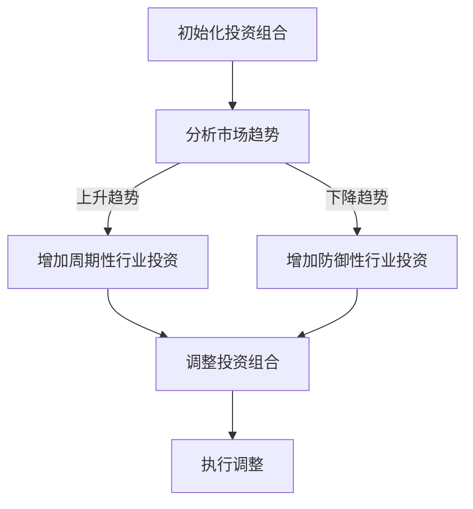
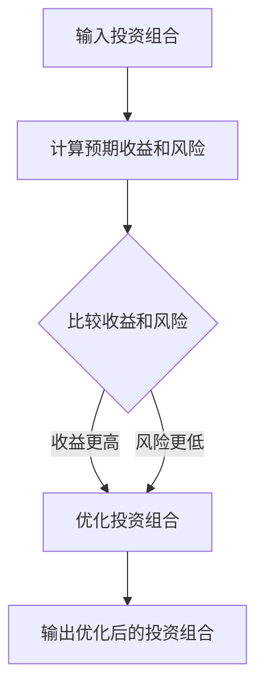
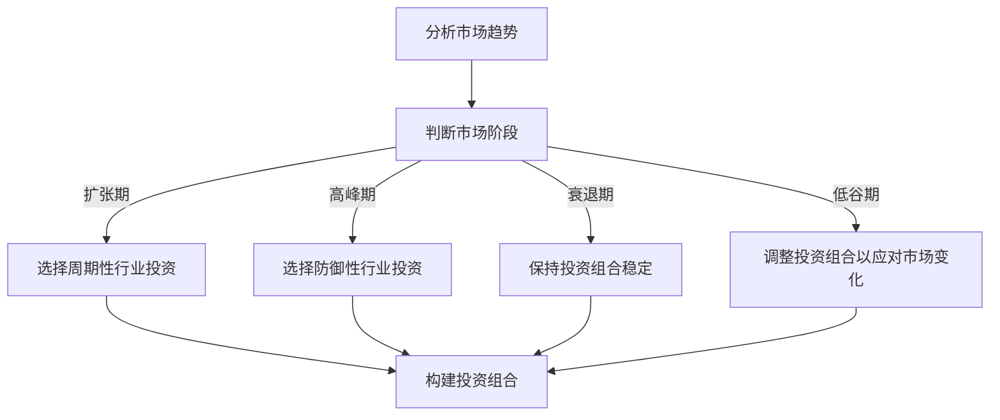
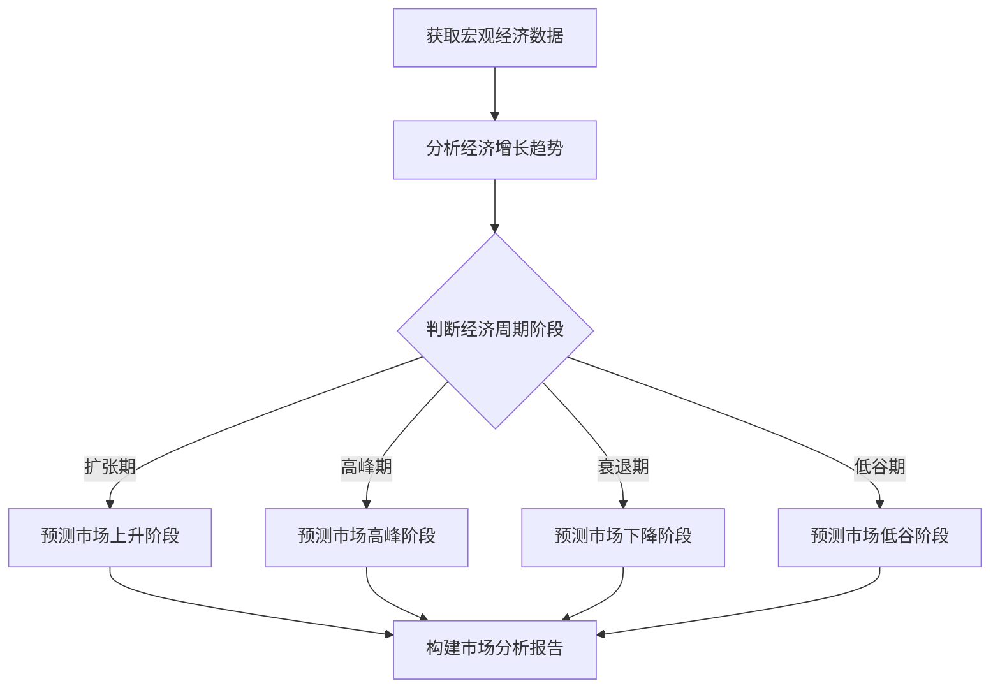
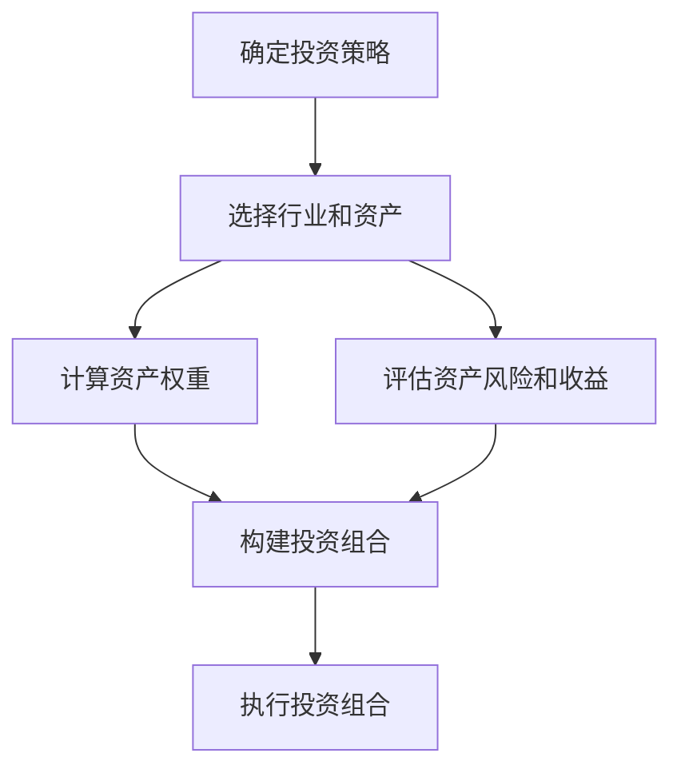

                 

### 文章标题

《彼得林奇的行业轮动策略》

### 关键词

投资策略、行业轮动、彼得·林奇、投资组合优化、数学模型、案例分析

### 摘要

本文深入剖析了著名投资大师彼得·林奇提出的行业轮动策略。通过介绍行业轮动的概念、核心概念与联系，以及详细的算法原理讲解和数学模型，本文展示了彼得·林奇如何运用这一策略进行投资决策。同时，通过系统分析与架构设计方案，以及实际案例的讲解，本文为读者提供了行业轮动策略的实践指导，旨在帮助投资者更好地理解和应用这一策略。

## 目录

1. **行业轮动策略概述**

   - 1.1 行业轮动的概念与背景
   - 1.2 彼得·林奇的行业轮动策略
   - 1.3 行业轮动的核心概念与联系
   - 1.4 行业轮动策略的数学模型与公式
   - 1.5 行业轮动策略的实践与应用
   - 1.6 行业轮动策略的案例分析
   - 1.7 最佳实践 tips

2. **行业轮动策略实践**

   - 2.1 实践准备
   - 2.2 系统核心实现
   - 2.3 项目实战
   - 2.4 拓展与深化

## 第一部分：行业轮动策略概述

### 1.1 行业轮动的概念与背景

行业轮动是指经济周期中，不同行业在经济增长过程中的波动和演变规律。经济周期通常分为扩张期、高峰期、衰退期和低谷期。在扩张期，经济增长带动相关行业快速发展；在高峰期，经济增长达到顶峰，行业竞争加剧；在衰退期，经济增长放缓，行业利润下降；在低谷期，经济增长低迷，行业面临调整。

彼得·林奇是著名的美国投资大师，他在其职业生涯中通过深入研究行业轮动规律，提出了独特的行业轮动策略。他认为，投资者应该根据经济周期的不同阶段，灵活调整投资组合，以最大限度地降低风险并提高收益。

#### 行业轮动的定义

行业轮动是指在经济周期中，各个行业在市场表现和盈利能力上呈现出的轮换现象。具体来说，是指在经济周期从低谷到高峰的过程中，不同行业依次经历增长、繁荣和衰退的阶段。

#### 行业轮动的重要性

行业轮动策略对于投资者来说至关重要，因为它可以帮助投资者识别市场趋势，合理配置投资组合，从而实现资产的稳定增值。以下是一些行业轮动的重要性：

1. **优化投资组合**：行业轮动策略可以帮助投资者在不同的经济周期中，根据市场变化调整投资组合，避免单一行业投资带来的风险。
2. **抓住市场机遇**：通过行业轮动策略，投资者可以在行业复苏时抓住投资机会，实现资产的快速增长。
3. **分散投资风险**：行业轮动策略通过在不同行业中分散投资，可以有效地降低投资组合的整体风险。
4. **提高投资收益**：行业轮动策略可以帮助投资者在经济周期中的不同阶段，选择最有利的投资方向，提高整体投资收益。

### 1.2 彼得·林奇的行业轮动策略

彼得·林奇是著名的美国基金经理，他在职业生涯中取得了卓越的投资业绩。他提出的行业轮动策略是他成功的重要原因之一。彼得·林奇的行业轮动策略主要包括以下几个方面：

#### 彼得·林奇的投资哲学

1. **长期投资**：彼得·林奇认为，投资者应该持有长期投资的理念，专注于基本面分析，而不是短期市场波动。
2. **分散投资**：他认为，通过在不同行业和不同类型的股票中分散投资，可以有效降低投资风险。
3. **价值投资**：彼得·林奇主张投资于具有良好基本面和成长潜力的公司，而不是单纯追求股票价格的短期上涨。

#### 行业轮动策略的核心思想

1. **跟随市场趋势**：彼得·林奇认为，投资者应该密切关注市场趋势，并根据市场趋势调整投资组合。当市场处于上升阶段时，应增加对周期性行业的投资；当市场处于下降阶段时，应增加对防御性行业的投资。
2. **灵活调整**：彼得·林奇强调，投资者应该根据市场变化灵活调整投资组合，避免过度依赖单一行业或股票。

#### 行业轮动策略的具体实践

1. **市场分析**：彼得·林奇通过深入研究宏观经济数据和行业发展趋势，预测市场趋势和行业轮动的方向。
2. **投资组合构建**：根据市场分析和预测结果，构建具有良好分散性和适应市场变化的投资组合。
3. **定期调整**：定期对投资组合进行调整，确保投资组合与市场趋势保持一致。

### 1.3 行业轮动的核心概念与联系

行业轮动策略的成功离不开对核心概念的理解。以下是行业轮动中的核心概念及其联系：

#### 核心概念解析

1. **经济周期**：经济周期是指经济活动在一段时间内所呈现出的波动规律。经济周期通常分为扩张期、高峰期、衰退期和低谷期。
2. **行业波动**：行业波动是指特定行业在经济增长过程中的波动和演变规律。不同行业在周期中的表现不同，有的行业可能先经历增长，有的行业可能后经历增长。
3. **市场趋势**：市场趋势是指股票市场在一段时间内的整体走势。市场趋势可以分为上升趋势、下降趋势和震荡趋势。

#### 概念属性特征对比表格

| 概念         | 属性特征                                       |
| ------------ | ---------------------------------------------- |
| 经济周期     | 包括扩张期、高峰期、衰退期和低谷期             |
| 行业波动     | 不同行业在周期中的波动和演变规律               |
| 市场趋势     | 股票市场在一段时间内的整体走势               |

#### ER实体关系图架构

以下是行业轮动中的ER实体关系图：

```mermaid
erDiagram
    EconomyCycle ||--|{ IndustryWave }|-- MarketTrend
    IndustryWave ||--|{ CompanyPerformance }|-- MarketTrend
    MarketTrend ||--|{ InvestorDecision }|-- EconomyCycle
```

### 1.4 行业轮动策略的数学模型与公式

行业轮动策略的数学模型和公式是理解彼得·林奇投资策略的关键。以下是投资决策算法、投资组合优化算法和数学模型与公式的详细讲解。

#### 投资决策算法

投资决策算法是指投资者根据市场趋势和经济周期，对投资组合进行调整的算法。以下是投资决策算法的mermaid流程图：



#### 投资组合优化算法

投资组合优化算法是指通过数学模型和算法，对投资组合进行优化，以达到最大化收益或最小化风险的目标。以下是投资组合优化算法的mermaid流程图：



#### 数学模型与公式讲解

行业轮动策略的数学模型主要包括投资决策算法和投资组合优化算法。以下是具体的数学模型和公式：

1. **投资决策算法**

   - 投资组合调整因子 = 市场趋势 × 行业波动
   - 投资组合调整策略 = 投资组合调整因子 × 投资组合初始权重

   公式表示为：

   $$ \text{投资组合调整策略} = \text{投资组合调整因子} \times \text{投资组合初始权重} $$

2. **投资组合优化算法**

   - 预期收益 = 每个资产预期收益 × 资产权重
   - 预期风险 = 每个资产预期风险 × 资产权重

   公式表示为：

   $$ \text{预期收益} = \sum_{i=1}^{n} \text{每个资产预期收益} \times \text{资产权重} $$
   $$ \text{预期风险} = \sum_{i=1}^{n} \text{每个资产预期风险} \times \text{资产权重} $$

### 1.5 行业轮动策略的实践与应用

行业轮动策略的应用主要包括投资策略分析、市场分析和投资组合构建。以下是对这些内容的详细讲解。

#### 投资策略分析

投资策略分析是指投资者根据市场趋势和经济周期，选择合适的投资策略。以下是投资策略分析的mermaid流程图：



#### 市场分析

市场分析是指投资者对宏观经济数据和行业发展趋势进行深入研究，以预测市场趋势。以下是市场分析的mermaid流程图：



#### 投资组合构建

投资组合构建是指根据投资策略和市场分析结果，构建合理的投资组合。以下是投资组合构建的mermaid流程图：



### 1.6 行业轮动策略的案例分析

案例分析是验证行业轮动策略有效性的重要手段。以下是具体的案例分析。

#### 案例介绍

本次案例以2008年至2010年的金融危机期间为背景，分析彼得·林奇如何运用行业轮动策略进行投资决策。

#### 案例分析

1. **市场趋势分析**：2008年至2010年，全球经济陷入金融危机，市场趋势呈现下降趋势。彼得·林奇通过市场分析，判断市场处于衰退期。

2. **投资决策**：根据市场趋势分析结果，彼得·林奇决定增加对防御性行业的投资，如医疗保健、公用事业等。

3. **投资组合构建**：彼得·林奇在投资组合中增加了防御性行业的权重，同时减少了周期性行业的权重。

4. **投资效果**：在金融危机期间，防御性行业表现相对稳健，彼得·林奇的投资组合实现了较好的风险控制，并获得了稳定的收益。

#### 案例解读

本次案例表明，行业轮动策略在市场下跌阶段具有较好的风险控制能力。通过灵活调整投资组合，投资者可以在危机中保持资产稳定，等待市场回暖。

### 1.7 最佳实践 tips

1. **关注市场趋势**：投资者应密切关注市场趋势，准确判断经济周期阶段，以指导投资决策。

2. **分散投资**：在投资组合中分散投资，避免过度依赖单一行业或股票，降低投资风险。

3. **定期调整**：定期对投资组合进行调整，确保投资组合与市场趋势保持一致。

4. **深入研究**：投资者应深入分析行业发展趋势和公司基本面，选择有潜力的行业和公司进行投资。

5. **灵活应对**：市场变化多端，投资者应保持灵活性，根据市场变化及时调整投资策略。

## 第二部分：行业轮动策略实践

### 2.1 实践准备

在开始行业轮动策略的实践之前，投资者需要进行充分的准备工作。以下是一些具体的实践准备步骤：

1. **环境安装**：安装必要的投资分析工具和软件，如股票分析软件、数据分析工具等。

2. **资料准备**：收集宏观经济数据、行业数据、公司财务报表等资料，为投资决策提供数据支持。

3. **市场分析**：通过市场分析工具和软件，对市场趋势进行分析，判断经济周期阶段。

4. **投资组合构建**：根据市场分析结果，构建合理的投资组合，确定各行业的投资权重。

### 2.2 系统核心实现

在行业轮动策略的实施过程中，系统核心实现是关键环节。以下是对系统核心实现的详细讲解。

1. **源代码解读**：系统核心实现通常涉及投资决策算法、投资组合优化算法等。通过解读源代码，可以深入理解系统的工作原理和算法实现。

2. **代码应用解读与分析**：对系统核心实现的代码进行应用解读，分析代码在实际投资决策中的应用效果，以及如何调整和优化。

### 2.3 项目实战

项目实战是验证行业轮动策略有效性的重要手段。以下是对项目实战的详细讲解。

1. **某个行业的轮动策略应用**：以某个具体行业为例，分析行业轮动策略在该行业中的应用，包括投资决策、市场分析和投资组合构建。

2. **实际案例分析与详细讲解剖析**：通过具体案例分析，详细讲解行业轮动策略的应用效果，分析策略的优势和不足。

3. **项目小结**：总结项目实战的经验和教训，提出改进措施，为后续投资决策提供参考。

### 2.4 拓展与深化

在行业轮动策略的应用过程中，不断进行拓展与深化是提高投资效果的必要手段。以下是对拓展与深化的详细讲解。

1. **深度分析**：通过深入研究行业发展趋势、市场变化等因素，提高对市场趋势的判断准确性。

2. **策略优化**：根据市场变化和投资效果，不断优化投资策略，提高投资收益。

3. **未来趋势展望**：分析行业轮动策略在未来的发展趋势和前景，为投资者提供战略指导。

## 结论

彼得·林奇的行业轮动策略是一种基于市场趋势和经济周期的投资策略。通过深入研究行业轮动的核心概念和联系，投资者可以更好地理解行业轮动策略的原理和实施方法。在实际应用中，投资者应关注市场趋势，灵活调整投资组合，以实现资产增值。本文通过对行业轮动策略的深入剖析和实际案例分析，为投资者提供了实用的投资策略和实践指导。

### 作者

作者：AI天才研究院/AI Genius Institute & 禅与计算机程序设计艺术 /Zen And The Art of Computer Programming

---

本文详细阐述了彼得·林奇的行业轮动策略，包括其核心概念、数学模型、实践应用和案例分析。通过本文，读者可以深入了解行业轮动策略的原理和实施方法，为自身的投资决策提供有力支持。在实际应用中，投资者应根据市场变化灵活调整投资组合，以实现资产增值。本文作者由AI天才研究院及禅与计算机程序设计艺术共同撰写，旨在为读者提供高质量的技术博客内容。

