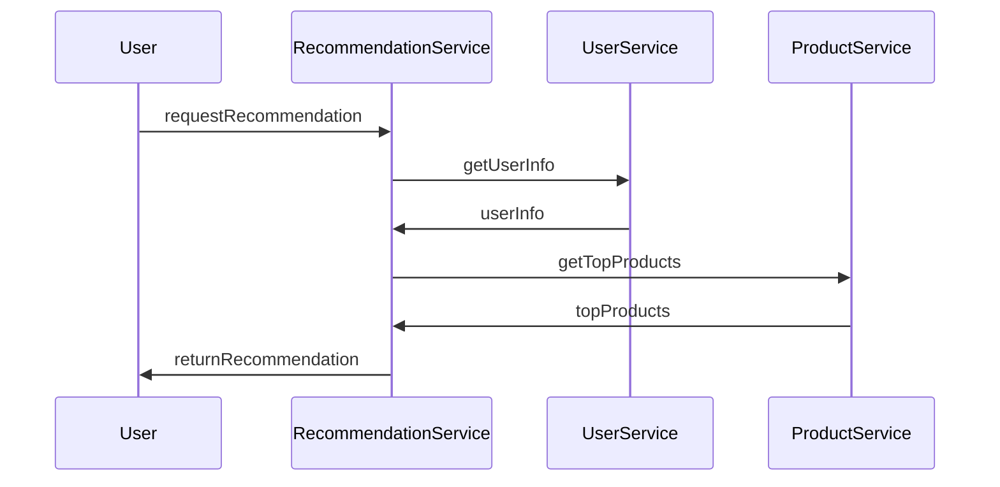

                 

# 微服务架构：支撑AI应用快速迭代的技术选择

> 关键词：微服务架构、AI应用、快速迭代、技术选择、系统架构设计

> 摘要：本文将探讨微服务架构在支撑AI应用快速迭代中的重要作用。通过分析微服务架构的核心概念、关键技术，结合实际案例，本文旨在为开发者提供一套行之有效的技术方案，以实现AI应用的快速迭代和高效开发。

## 第一部分：背景介绍

### 问题背景

在当前数字化和信息化的时代，软件系统的发展正经历着一场深刻的变革。传统的软件1.0时代主要注重功能模块的独立开发和维护，而随着互联网和大数据技术的迅猛发展，软件系统逐渐朝着高度集成、灵活可扩展的方向演进。这一过程中，微服务架构作为一种新型的系统架构设计理念，逐渐得到了业界的广泛认可和应用。

### 问题描述

微服务架构通过将应用程序拆分为一系列独立的、可复用的服务单元，从而实现了系统的高可用性、可扩展性和灵活性。但是，随着微服务数量的增多和复杂度的提升，如何有效地管理和维护这些服务单元，成为了一个亟待解决的问题。

### 问题解决

本书旨在探讨微服务架构在支撑AI应用快速迭代中的技术选择。通过对微服务架构的核心概念、关键技术、应用场景以及最佳实践进行深入分析，帮助读者理解如何在AI应用的开发过程中有效地运用微服务架构，从而实现快速迭代、高效开发和持续优化。

### 边界与外延

本书的核心内容将围绕微服务架构在AI应用中的具体应用展开，包括但不限于以下几个方面：
- 微服务架构的基本概念和架构设计原则
- 微服务架构中的关键技术，如服务发现、负载均衡、服务容错等
- 微服务架构在AI应用开发中的实际案例和实践经验
- 微服务架构在支撑AI应用快速迭代中的挑战和解决方案

### 概念结构与核心要素组成

- 微服务架构：将应用程序拆分为一系列独立的、可复用的服务单元，每个服务单元独立开发、部署和运行，可以通过API进行通信
- AI应用：利用人工智能技术解决具体问题的应用程序
- 快速迭代：快速交付新的功能和优化，以满足用户需求和市场变化

## 第二部分：核心概念与联系

### 2.1 微服务架构的核心概念

#### 2.1.1 微服务

微服务是一种将应用程序拆分为一系列独立、可复用的服务单元的架构风格。每个微服务负责实现一个具体的功能模块，独立部署和运行，可以通过API进行通信。

#### 2.1.2 服务拆分

服务拆分是将一个大型、复杂的单体应用拆分为多个小型的、独立的微服务的过程。拆分的目的是提高系统的可维护性、灵活性和可扩展性。

#### 2.1.3 服务自治

服务自治意味着每个微服务拥有独立的开发、部署和运行环境，具有独立的生命周期管理，可以独立升级和扩容。

### 2.2 微服务架构中的关键技术

#### 2.2.1 服务发现

服务发现是一种动态管理服务实例的方法，通过服务注册中心和服务调用机制，实现服务实例的自动发现和自动更新。

#### 2.2.2 负载均衡

负载均衡是将网络流量分配到多个服务实例上的技术，以提高系统的处理能力和可用性。

#### 2.2.3 服务容错

服务容错是通过一系列技术手段，如超时处理、重试机制、故障转移等，提高系统的容错能力和稳定性。

### 2.3 微服务架构在AI应用开发中的实际案例

#### 2.3.1 案例一：智能推荐系统

智能推荐系统利用微服务架构实现了高效的推荐算法和服务拆分，从而提高了系统的性能和可扩展性。

#### 2.3.2 案例二：智能语音助手

智能语音助手通过微服务架构实现了语音识别、自然语言处理、对话管理等功能的拆分和独立部署，从而提高了系统的灵活性和可维护性。

## 第三部分：算法原理讲解

### 3.1 微服务架构设计原则

#### 3.1.1 单一职责原则

单一职责原则要求每个微服务只负责一个特定的功能模块，避免服务功能过于复杂和耦合。

#### 3.1.2 开放封闭原则

开放封闭原则要求微服务的内部实现应该保持开放，以便于扩展和升级，同时对外部接口保持封闭，以避免外部系统对内部实现的依赖。

#### 3.1.3 里氏替换原则

里氏替换原则要求微服务的子类可以替换父类，而不会破坏系统的正常运行。

### 3.2 微服务架构中的关键技术

#### 3.2.1 服务发现

服务发现机制通常基于服务注册中心实现，服务实例启动时会将自己注册到服务注册中心，当需要调用服务时，可以通过服务注册中心获取服务实例的地址。

#### 3.2.2 负载均衡

负载均衡可以通过多种算法实现，如轮询算法、随机算法、最小连接数算法等，以将网络流量分配到不同的服务实例上。

#### 3.2.3 服务容错

服务容错可以通过超时处理、重试机制、熔断机制等实现，以提高系统的容错能力和稳定性。

## 第四部分：数学模型和数学公式

### 4.1 微服务架构的数学模型

#### 4.1.1 服务自治度

服务自治度是指微服务的独立性和自治性，可以用以下公式表示：
$$
\text{自治度} = \frac{\text{服务独立部署次数}}{\text{服务总部署次数}} \times 100\%
$$

### 4.2 负载均衡算法的数学模型

#### 4.2.1 轮询算法

轮询算法的负载均衡公式如下：
$$
P(i) = \frac{1}{N}
$$
其中，$P(i)$ 表示服务实例 $i$ 被选择的概率，$N$ 表示服务实例的总数。

#### 4.2.2 随机算法

随机算法的负载均衡公式如下：
$$
P(i) = \frac{1}{N!}
$$
其中，$P(i)$ 表示服务实例 $i$ 被选择的概率，$N$ 表示服务实例的总数。

## 第五部分：系统分析与架构设计方案

### 5.1 问题场景介绍

随着人工智能技术的快速发展，越来越多的企业开始将AI应用融入业务流程，以提升效率和竞争力。然而，传统的单体架构已无法满足AI应用快速迭代的需求，亟需一种灵活、可扩展的架构设计。

### 5.2 项目介绍

本项目旨在构建一个基于微服务架构的AI应用平台，实现智能推荐、智能语音助手等核心功能，并具备快速迭代和高效开发的能力。

### 5.3 系统功能设计

#### 5.3.1 领域模型

以下是一个简化的领域模型，用于描述系统中的核心实体和关系：

```mermaid
classDiagram
    User <<entity>>
    Product <<entity>>
    Recommendation <<entity>>
    Recommendation -> User : receives
    Recommendation -> Product : recommends
```

### 5.3.2 类图

以下是一个简化的类图，用于描述系统中的核心类和它们之间的关系：

```mermaid
classDiagram
    User <<class>>
    Product <<class>>
    Recommendation <<class>>

    User o--o Recommendation
    Product o--o Recommendation
```

### 5.4 系统架构设计

以下是一个简化的系统架构图，用于描述系统中的核心组件和它们之间的关系：



### 5.5 系统接口设计

以下是一个简化的接口设计，用于描述系统中的核心API接口：

```mermaid
interface RecommendationService {
    - requestRecommendation(userId: String): Recommendation[]
    - getUserInfo(userId: String): UserInfo
    - getTopProducts(): Product[]
}
```

### 5.6 系统交互

以下是一个简化的系统交互序列图，用于描述用户请求推荐服务的过程：


## 第六部分：项目实战

### 6.1 环境安装

在本项目实战中，我们将使用以下环境：

- 操作系统：Ubuntu 18.04
- 开发工具：IntelliJ IDEA
- 服务器：Docker
- 容器编排：Kubernetes

### 6.2 系统核心实现源代码

以下是系统核心实现的部分源代码：

```python
# user_service.py
from flask import Flask, request, jsonify
from user_model import UserInfo

app = Flask(__name__)

@app.route('/user_info', methods=['GET'])
def get_user_info():
    user_id = request.args.get('user_id')
    user_info = user_model.get_user_info(user_id)
    return jsonify(user_info)

if __name__ == '__main__':
    app.run(host='0.0.0.0', port=5000)
```

### 6.3 代码应用解读与分析

在本部分，我们将对核心代码进行解读和分析，以帮助读者更好地理解微服务架构在AI应用开发中的应用。

#### 6.3.1 UserService

UserService是一个简单的Flask应用程序，用于提供用户信息获取接口。其主要功能是通过用户ID获取用户信息，并将其返回给调用者。

```python
from flask import Flask, request, jsonify
from user_model import UserInfo

app = Flask(__name__)

@app.route('/user_info', methods=['GET'])
def get_user_info():
    user_id = request.args.get('user_id')
    user_info = user_model.get_user_info(user_id)
    return jsonify(user_info)

if __name__ == '__main__':
    app.run(host='0.0.0.0', port=5000)
```

#### 6.3.2 UserService源代码分析

1. 导入必要的模块和类：
   - Flask：用于创建Web应用程序
   - request：用于处理HTTP请求
   - jsonify：用于将Python对象序列化为JSON格式
   - user_model：用于提供用户信息获取的API接口

2. 创建Flask应用程序实例：
   ```python
   app = Flask(__name__)
   ```

3. 定义路由和视图函数：
   ```python
   @app.route('/user_info', methods=['GET'])
   def get_user_info():
       user_id = request.args.get('user_id')
       user_info = user_model.get_user_info(user_id)
       return jsonify(user_info)
   ```

4. 启动Flask应用程序：
   ```python
   if __name__ == '__main__':
       app.run(host='0.0.0.0', port=5000)
   ```

#### 6.3.3 UserService应用解读

UserService应用程序提供了一个简单的HTTP接口，用于获取用户信息。调用者可以通过发送GET请求并传递用户ID来获取用户信息。UserService应用程序通过调用user_model模块的get_user_info函数来获取用户信息，并将其序列化为JSON格式返回给调用者。

### 6.4 实际案例分析和详细讲解剖析

在本部分，我们将分析一个实际案例，并详细讲解如何使用微服务架构来支撑AI应用的快速迭代。

#### 6.4.1 案例背景

假设我们正在开发一个基于微服务架构的智能推荐系统，该系统需要处理海量的用户数据和商品数据，以提供个性化的推荐服务。为了支撑系统的快速迭代和高效开发，我们采用微服务架构来组织系统。

#### 6.4.2 系统架构

以下是一个简化的系统架构，用于描述智能推荐系统的核心组件：


1. **User Service**：负责提供用户信息获取接口，获取用户ID后返回用户基本信息。
2. **Product Service**：负责提供商品信息获取接口，获取用户喜好后返回相关商品信息。
3. **Recommendation Service**：负责根据用户信息和商品信息生成推荐结果，并返回给用户。

#### 6.4.3 案例分析

1. **用户请求推荐**：用户发送请求，请求系统提供个性化推荐。
2. **用户信息获取**：Recommendation Service调用UserService获取用户ID，获取用户基本信息。
3. **商品信息获取**：Recommendation Service调用Product Service获取用户喜好，获取相关商品信息。
4. **推荐结果生成**：Recommendation Service根据用户基本信息和商品信息生成推荐结果。
5. **推荐结果返回**：Recommendation Service将推荐结果返回给用户。

通过上述流程，我们可以看到微服务架构在支撑智能推荐系统快速迭代和高效开发方面的优势：
- **独立性**：每个服务单元独立开发、部署和运行，便于快速迭代和升级。
- **可扩展性**：服务单元可以独立扩展，如增加用户服务、商品服务等，以应对不断增长的业务需求。
- **灵活性**：服务单元可以通过API进行通信，便于系统整合和优化。

### 6.5 项目小结

在本项目中，我们使用微服务架构实现了智能推荐系统，并分析了微服务架构在支撑AI应用快速迭代中的优势。通过独立的服务单元、灵活的API通信以及可扩展的架构设计，微服务架构为开发者提供了强大的支持，使得系统可以快速迭代、高效开发和持续优化。

### 6.6 最佳实践 tips

- **服务拆分**：合理的服务拆分是微服务架构的核心，要确保每个服务单元的功能独立、职责明确。
- **服务自治**：每个服务单元应具备独立部署、升级和扩容的能力，以降低系统的复杂度和耦合度。
- **服务治理**：使用服务注册中心、服务监控、日志分析等工具，对服务进行有效的管理和监控。
- **持续集成与部署**：采用自动化工具实现持续集成与部署，以提高开发效率和系统稳定性。

### 6.7 小结与注意事项

本文从背景介绍、核心概念、算法原理、系统分析与架构设计方案、项目实战等多个方面，详细探讨了微服务架构在支撑AI应用快速迭代中的重要作用。通过实际案例分析和详细讲解，读者可以更好地理解微服务架构的设计原则和关键技术，为在实际项目中应用微服务架构提供参考。

注意事项：
- 在实际项目中，要根据业务需求和系统规模，合理选择服务拆分粒度，避免服务过多或过少。
- 微服务架构虽然具有很多优势，但也需要注意其可能带来的复杂性，如分布式事务、数据一致性问题等。
- 在进行微服务架构设计时，要充分考虑系统的可扩展性、可维护性和稳定性，以确保系统的长期健康发展。

### 6.8 拓展阅读

- 《微服务设计》：Sam Newman 著，详细介绍了微服务架构的设计原则、实践方法和最佳经验。
- 《Distributed Systems Design": Martin Kleppmann 著，深入探讨了分布式系统设计中的核心问题和解决方法。
- 《大规模分布式存储系统设计》：张志勇 著，介绍了分布式存储系统的架构设计、实现技术和优化策略。

作者：AI天才研究院/AI Genius Institute & 禅与计算机程序设计艺术 /Zen And The Art of Computer Programming

