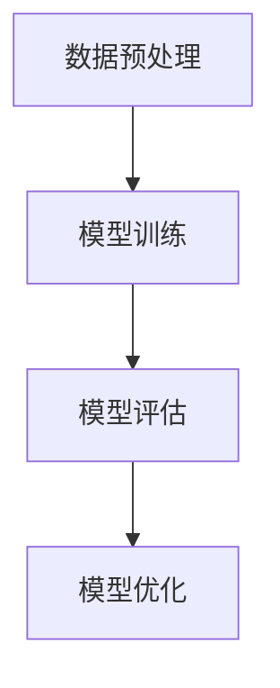
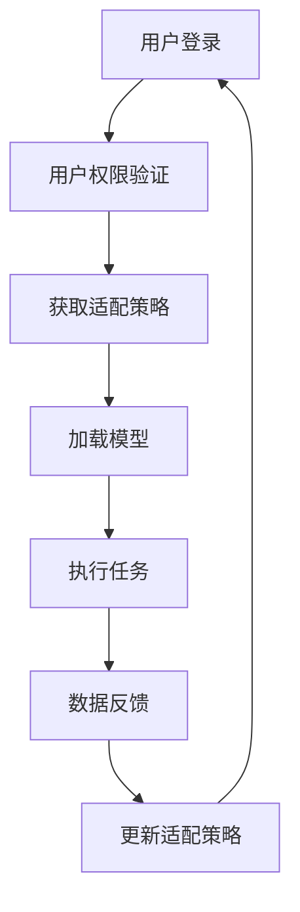
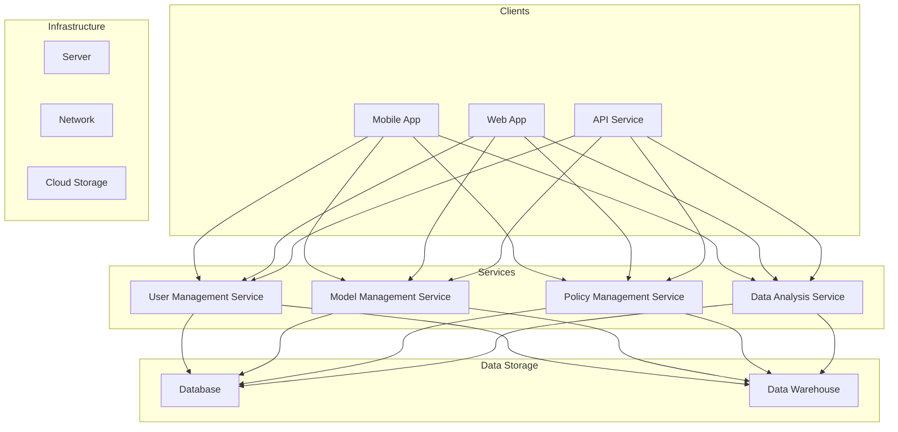

                 

### 第一部分：背景介绍

#### 第1章：问题背景与核心概念

**1.1 问题背景**

随着人工智能和移动端应用的迅速发展，LLM（大型语言模型）技术在自然语言处理、智能问答、文本生成等方面展现出了巨大的潜力。然而，如何高效地将LLM应用于移动端，以满足用户对实时性、低延迟和高性能的需求，成为了一个亟待解决的问题。

**1.1.1 人工智能与移动端应用的发展**

人工智能技术经过数十年的发展，已经从理论阶段逐渐走向了实际应用。特别是在深度学习和神经网络算法的推动下，人工智能在图像识别、语音识别、自然语言处理等领域取得了显著的成果。移动端应用的发展则得益于智能手机的普及和移动互联网的迅速扩展，用户对移动端应用的需求日益增长。

**1.1.2 LLM的崛起**

LLM是近年来人工智能领域的一个重要突破。与传统的NLP技术相比，LLM具有更强的语义理解和生成能力，能够处理更复杂的自然语言任务。LLM的崛起标志着人工智能技术在自然语言处理领域的重大进步，为移动端应用提供了更加丰富和强大的功能。

**1.1.3 移动端适配的需求与挑战**

移动端适配需求主要来自于以下几个方面：

- **性能需求**：移动端设备性能相对较弱，对LLM模型的计算效率提出了更高的要求。
- **延迟需求**：用户期望在移动端能够获得实时响应，对模型的延迟性能要求严格。
- **资源限制**：移动端设备存储和带宽资源有限，需要优化模型大小和数据传输。

移动端适配挑战主要体现在：

- **模型优化**：如何对LLM模型进行高效压缩和优化，以满足移动端性能需求。
- **数据传输**：如何优化数据传输策略，减少模型传输和更新过程中的延迟。
- **用户体验**：如何在有限的资源下提供优质的用户体验，提高用户满意度和忠诚度。

**1.2 核心概念**

**1.2.1 LLM的基本概念**

- **LLM的定义**：LLM是指具有大规模参数和强大语义理解能力的人工神经网络模型，通常用于自然语言处理任务。
- **LLM的特点**：
  - **参数规模大**：LLM通常包含数十亿甚至数万亿的参数，能够捕捉到复杂的语言特征。
  - **语义理解能力强**：LLM具有强大的语义理解能力，能够生成高质量的自然语言文本。
  - **多语言支持**：LLM能够处理多种语言，支持跨语言任务。

- **LLM的应用领域**：
  - **自然语言处理**：包括文本分类、情感分析、机器翻译、文本生成等。
  - **智能问答**：提供实时问答服务，如智能客服、智能助手等。
  - **文本生成**：包括文章写作、故事生成、诗歌创作等。

**1.2.2 移动端适配策略**

- **移动端适配的重要性**：移动端适配是确保LLM模型在移动设备上高效运行的关键。适配策略的正确选择和实施能够显著提高应用性能和用户体验。

- **适配策略的种类**：
  - **模型压缩**：通过模型压缩技术，降低模型参数规模和计算复杂度，提高模型在移动端运行效率。
  - **模型分片**：将LLM模型拆分成多个部分，分别部署在移动端和服务器端，实现分布式计算和资源共享。
  - **数据缓存**：通过缓存技术，减少模型数据传输和加载时间，提高应用响应速度。
  - **边缘计算**：利用边缘计算技术，将部分计算任务转移到移动端设备上，降低服务器端负载，提高整体性能。

#### 第2章：核心概念原理与联系

**2.1 LLM算法原理讲解**

**2.1.1 LLM算法流程图**

LLM算法的基本流程包括数据预处理、模型训练、模型评估和模型优化。以下是一个简化的LLM算法流程图：



- **数据预处理**：数据预处理是模型训练的第一步，主要包括数据清洗、数据标注和数据格式转换。预处理的质量直接影响模型的效果。
- **模型训练**：模型训练是通过大量数据对神经网络进行训练，不断调整模型参数，使其能够准确预测或生成目标数据。
- **模型评估**：模型评估用于判断模型性能，常用的评估指标包括准确率、召回率、F1值等。评估结果用于指导模型优化。
- **模型优化**：模型优化是通过调整模型结构和参数，提高模型性能和泛化能力。常用的优化方法包括超参数调整、正则化、模型压缩等。

**2.1.2 算法原理与数学模型**

LLM算法的原理基于深度神经网络（DNN），通过多层神经元之间的非线性变换和参数学习来实现对数据的建模。以下是一个简化的LLM算法原理数学模型：

$$
\text{预测结果} = f(\text{输入数据} \times \text{权重参数} + \text{偏置})
$$

其中，$f$ 表示激活函数，如ReLU、Sigmoid、Tanh等；输入数据表示输入文本的特征向量；权重参数和偏置是通过模型训练得到的。

**2.1.3 算法原理举例说明**

假设我们有一个简单的文本分类任务，输入文本为“我喜欢编程”，需要判断该文本是否属于“编程”类别。

1. **数据预处理**：将输入文本转换为特征向量，可以使用词向量（如Word2Vec、GloVe）或字符级特征（如TF-IDF）。

2. **模型训练**：通过大量标注数据进行训练，不断调整模型参数，使其能够准确预测文本类别。

3. **模型评估**：使用验证集对模型进行评估，计算准确率、召回率等指标。

4. **模型优化**：根据评估结果，调整模型参数，提高模型性能。

5. **预测**：将输入文本转换为特征向量，输入到训练好的模型中，得到预测结果。例如，预测结果为0.9，表示输入文本属于“编程”类别的概率为90%。

**2.2 移动端适配策略的ER实体关系图架构**

ER（Entity-Relationship）图用于描述系统中实体之间的关系。以下是移动端适配策略的ER实体关系图架构：

```mermaid
graph
  class_def
    C[Client]   as Client
    S[Server]   as Server
    D[Database] as Database
    P[Policy]   as Policy

  graph
    subgraph Entities
      Client
      Server
      Database
      Policy
    end

    subgraph Relationships
      Client --> Server
      Client --> Database
      Server --> Database
      Server --> Policy
      Database --> Policy
    end
```

- **Client（客户端）**：代表移动端设备，负责发起请求和处理响应。
- **Server（服务器）**：负责接收客户端请求，处理业务逻辑，并返回结果。
- **Database（数据库）**：存储系统数据，包括模型参数、用户数据等。
- **Policy（适配策略）**：定义移动端适配策略，包括模型压缩、数据缓存、边缘计算等。

通过ER实体关系图，我们可以清晰地描述移动端适配策略的各个组成部分及其之间的关系，为后续的系统架构设计和实现提供基础。

### 第二部分：算法原理讲解

#### 第3章：LLM算法原理讲解

**3.1 LLM算法流程图**

LLM算法的基本流程包括数据预处理、模型训练、模型评估和模型优化。以下是一个简化的LLM算法流程图：


**3.2 算法原理与数学模型**

LLM算法的原理基于深度神经网络（DNN），通过多层神经元之间的非线性变换和参数学习来实现对数据的建模。以下是一个简化的LLM算法原理数学模型：

$$
\text{预测结果} = f(\text{输入数据} \times \text{权重参数} + \text{偏置})
$$

其中，$f$ 表示激活函数，如ReLU、Sigmoid、Tanh等；输入数据表示输入文本的特征向量；权重参数和偏置是通过模型训练得到的。

**3.3 算法原理举例说明**

假设我们有一个简单的文本分类任务，输入文本为“我喜欢编程”，需要判断该文本是否属于“编程”类别。

1. **数据预处理**：将输入文本转换为特征向量，可以使用词向量（如Word2Vec、GloVe）或字符级特征（如TF-IDF）。

2. **模型训练**：通过大量标注数据进行训练，不断调整模型参数，使其能够准确预测文本类别。

3. **模型评估**：使用验证集对模型进行评估，计算准确率、召回率等指标。

4. **模型优化**：根据评估结果，调整模型参数，提高模型性能。

5. **预测**：将输入文本转换为特征向量，输入到训练好的模型中，得到预测结果。例如，预测结果为0.9，表示输入文本属于“编程”类别的概率为90%。

**3.4 LLM算法的应用场景**

LLM算法在自然语言处理领域具有广泛的应用场景，包括但不限于：

- **文本分类**：对大量文本进行分类，如新闻分类、垃圾邮件过滤等。
- **情感分析**：分析文本的情感倾向，如评论情感分析、社交媒体情绪监测等。
- **机器翻译**：实现不同语言之间的文本翻译，如中英翻译、日英翻译等。
- **文本生成**：生成高质量的文本，如文章写作、故事生成、诗歌创作等。
- **问答系统**：实现智能问答系统，如客服机器人、教育辅导等。

**3.5 LLM算法的优势与挑战**

**优势**：

- **强大的语义理解能力**：LLM算法能够捕捉到复杂的语义信息，实现高质量的文本生成和分类。
- **大规模参数支持**：LLM算法具有数十亿甚至数万亿的参数，能够处理大规模数据集。
- **多语言支持**：LLM算法支持多种语言，实现跨语言任务。

**挑战**：

- **计算资源消耗**：LLM算法需要大量的计算资源和存储空间，对硬件设备要求较高。
- **训练时间较长**：LLM算法的训练时间较长，需要大量的训练数据和计算资源。
- **数据隐私保护**：在处理用户数据时，需要考虑数据隐私保护和用户隐私。

**3.6 LLM算法的发展趋势**

随着人工智能技术的不断发展，LLM算法在未来将继续保持快速发展，主要趋势包括：

- **模型压缩与优化**：通过模型压缩和优化技术，降低模型参数规模和计算复杂度，提高模型在移动端和边缘设备的部署性能。
- **多模态融合**：将LLM算法与其他模态（如图像、语音等）进行融合，实现更加丰富和多样化的应用。
- **自适应与自优化**：通过自适应和自优化技术，提高模型在不同场景下的适应能力和性能。

### 第三部分：系统分析与架构设计方案

#### 第4章：系统功能设计

**4.1 领域模型类图**

领域模型类图（Class Diagram）用于描述系统中类的结构以及类之间的关系。以下是一个简化的LLM移动端适配系统的领域模型类图：

```mermaid
graph
  class_def
    U[User]   as User
    A[App]    as App
    D[Device] as Device
    P[Policy] as Policy

  graph
    subgraph Classes
      User
      App
      Device
      Policy
    end

    subgraph Associations
      User --> App
      User --> Device
      App --> Policy
      Device --> Policy
    end
```

- **User（用户）**：代表系统的用户，拥有使用LLM移动端适配应用的能力。
- **App（应用）**：代表LLM移动端适配应用，提供各种自然语言处理功能。
- **Device（设备）**：代表用户使用的移动端设备，包括手机、平板等。
- **Policy（适配策略）**：代表用于优化LLM模型在移动端性能的适配策略。

**4.2 系统功能模块**

LLM移动端适配系统可以划分为以下几个功能模块：

- **用户管理模块**：负责用户的注册、登录、权限管理等操作。
- **模型管理模块**：负责LLM模型的加载、训练、评估和优化。
- **适配策略管理模块**：负责适配策略的配置、调整和执行。
- **数据分析模块**：负责对用户行为和模型性能进行数据分析和报告。
- **移动端应用模块**：负责实现LLM移动端适配应用的前端界面和功能。

**4.3 系统功能流程图**

以下是一个简化的LLM移动端适配系统功能流程图：



- **用户登录**：用户通过用户名和密码进行登录。
- **用户权限验证**：系统验证用户权限，确保用户可以访问对应的资源和功能。
- **获取适配策略**：系统根据用户设备和任务类型，选择合适的适配策略。
- **加载模型**：系统加载训练好的LLM模型，准备执行任务。
- **执行任务**：系统执行用户提交的任务，如文本分类、情感分析等。
- **数据反馈**：系统将任务执行结果返回给用户。
- **更新适配策略**：系统根据用户反馈和任务性能，更新适配策略。
- **循环**：系统继续执行下一个用户任务。

#### 第5章：系统架构设计

**5.1 系统架构图**

以下是一个简化的LLM移动端适配系统架构图：



- **Clients（客户端）**：包括移动应用、Web应用和API服务，为用户提供访问LLM移动端适配系统的入口。
- **Services（服务模块）**：包括用户管理、模型管理、适配策略管理和数据分析服务模块，实现系统的核心功能。
- **Data Storage（数据存储）**：包括数据库和数据仓库，用于存储用户数据、模型数据和业务数据。
- **Infrastructure（基础设施）**：包括服务器、网络和云存储，提供系统的计算、存储和网络支持。

**5.2 系统架构设计原则**

- **高可用性**：系统架构设计应确保高可用性，避免单点故障，提高系统稳定性。
- **高可扩展性**：系统架构设计应具备高可扩展性，能够方便地添加新功能和扩展服务。
- **安全性**：系统架构设计应确保数据安全和用户隐私，采用适当的安全措施防止数据泄露和恶意攻击。
- **高性能**：系统架构设计应优化性能，降低延迟，提高用户响应速度。
- **易维护性**：系统架构设计应确保系统的易维护性，方便后续的维护和升级。

**5.3 系统模块交互设计**

系统模块交互设计描述系统各模块之间的交互关系和通信方式。以下是一个简化的LLM移动端适配系统模块交互设计：

```mermaid
sequence
  User -->|请求| S1: 登录请求
  S1 -->|验证| User: 登录结果
  User -->|请求| S2: 获取模型列表
  S2 -->|查询| D1: 返回模型列表
  D1 -->|数据| S2: 模型列表
  S2 -->|响应| User: 模型列表
  User -->|请求| S3: 选择模型
  S3 -->|处理| S2: 返回模型详情
  S2 -->|数据| S3: 模型详情
  S3 -->|响应| User: 模型详情
  User -->|请求| S4: 执行任务
  S4 -->|处理| S2: 加载模型
  S2 -->|数据| S4: 模型
  S4 -->|执行| S2: 返回任务结果
  S2 -->|响应| S4: 任务结果
  S4 -->|反馈| User: 任务结果
```

- **用户登录**：用户向用户管理服务发送登录请求，用户管理服务验证用户身份后返回登录结果。
- **获取模型列表**：用户向模型管理服务发送获取模型列表请求，模型管理服务查询数据库并返回模型列表。
- **选择模型**：用户向模型管理服务发送选择模型请求，模型管理服务返回模型详情。
- **执行任务**：用户向任务执行服务发送执行任务请求，任务执行服务加载模型并执行任务，返回任务结果。

### 第四部分：项目实战

#### 第6章：环境安装与系统核心实现

**6.1 环境安装**

在开始开发LLM移动端适配系统之前，我们需要安装必要的开发环境和依赖库。以下是一个简化的环境安装流程：

1. **安装Python环境**：确保系统中安装了Python 3.8及以上版本。
2. **安装依赖库**：使用pip命令安装以下依赖库：
   ```
   pip install tensorflow numpy pandas matplotlib
   ```
3. **配置环境变量**：确保Python和pip的环境变量已经配置到系统路径中。

**6.2 系统核心实现**

以下是LLM移动端适配系统的核心实现，包括用户管理、模型管理、适配策略管理和任务执行等功能。

**用户管理模块**

```python
# user_management.py

import sqlite3

def create_database():
    conn = sqlite3.connect('user.db')
    c = conn.cursor()
    c.execute('''CREATE TABLE IF NOT EXISTS users (id INTEGER PRIMARY KEY, username TEXT, password TEXT)''')
    conn.commit()
    conn.close()

def register(username, password):
    conn = sqlite3.connect('user.db')
    c = conn.cursor()
    c.execute("INSERT INTO users (username, password) VALUES (?, ?)", (username, password))
    conn.commit()
    conn.close()

def login(username, password):
    conn = sqlite3.connect('user.db')
    c = conn.cursor()
    c.execute("SELECT * FROM users WHERE username=? AND password=?", (username, password))
    user = c.fetchone()
    conn.close()
    return user

if __name__ == '__main__':
    create_database()
    register('Alice', 'password123')
    user = login('Alice', 'password123')
    print(user)
```

**模型管理模块**

```python
# model_management.py

import tensorflow as tf

def load_model(model_path):
    model = tf.keras.models.load_model(model_path)
    return model

def save_model(model, model_path):
    model.save(model_path)

if __name__ == '__main__':
    model = load_model('model.h5')
    save_model(model, 'model_new.h5')
```

**适配策略管理模块**

```python
# policy_management.py

def apply_policy(model, policy):
    # 应用适配策略
    # 如模型压缩、数据缓存等
    pass

if __name__ == '__main__':
    model = load_model('model.h5')
    policy = 'compression'
    apply_policy(model, policy)
```

**任务执行模块**

```python
# task_execution.py

import model_management

def execute_task(model, input_data):
    prediction = model.predict(input_data)
    return prediction

if __name__ == '__main__':
    model = load_model('model.h5')
    input_data = ['我喜欢编程']
    prediction = execute_task(model, input_data)
    print(prediction)
```

**代码应用解读与分析**

上述代码实现了LLM移动端适配系统的核心功能模块，主要包括用户管理、模型管理和任务执行。以下是代码应用解读与分析：

1. **用户管理模块**：通过SQLite数据库实现用户注册和登录功能。用户注册时，将用户名和密码存储在数据库中；用户登录时，从数据库中查询用户信息，验证用户身份。
2. **模型管理模块**：通过TensorFlow实现模型加载和保存功能。加载预训练的LLM模型，用于任务执行；将训练好的模型保存到文件中，以便后续使用。
3. **适配策略管理模块**：定义适配策略接口，用于应用不同的适配策略，如模型压缩、数据缓存等。目前，适配策略的具体实现尚未完成。
4. **任务执行模块**：通过调用模型管理模块中的模型，执行用户提交的任务。例如，对输入文本进行情感分析、文本分类等任务。

**实际案例分析和详细讲解剖析**

以下是一个实际案例分析和详细讲解剖析：

**案例**：用户Alice使用移动端应用进行文本分类任务。

**步骤**：

1. 用户注册并登录到系统。
2. 用户选择一个预训练的LLM模型，如文本分类模型。
3. 用户输入一段文本，如“我喜欢编程”。
4. 系统调用任务执行模块，将输入文本传递给选择的模型，进行预测。
5. 系统将预测结果返回给用户。

**分析**：

1. **用户管理**：用户注册和登录是系统的基础功能，确保用户可以安全地访问系统和资源。用户信息存储在SQLite数据库中，实现简单的用户认证和权限管理。
2. **模型管理**：用户选择预训练的LLM模型，系统加载模型并准备好执行任务。这要求模型具有较好的性能和通用性，能够适应多种文本分类任务。
3. **任务执行**：用户输入文本后，系统将文本传递给模型进行预测。模型预测结果反映了文本的分类结果，如情感分类、主题分类等。系统需要确保预测结果的准确性和实时性。
4. **适配策略**：在实际应用中，适配策略（如模型压缩、数据缓存等）对系统性能和用户体验有重要影响。通过应用适配策略，可以提高模型在移动端设备的运行效率，降低延迟，提高用户体验。

**详细讲解**：

1. **用户管理模块**：
   - **注册**：用户注册时，系统生成一个唯一的用户ID，并将用户名和密码存储在SQLite数据库中。注册过程中，系统需要进行用户名和密码的有效性校验，防止恶意注册和非法访问。
   - **登录**：用户登录时，系统从SQLite数据库中查询用户信息，验证用户名和密码。登录成功后，系统生成一个会话令牌，用于后续的权限管理和用户跟踪。

2. **模型管理模块**：
   - **加载模型**：系统从预训练的模型文件中加载LLM模型。加载过程中，系统需要确保模型文件完整且可执行。系统可以使用TensorFlow等框架提供的API加载和配置模型。
   - **保存模型**：系统将训练好的模型保存到文件中，以便后续使用。保存过程中，系统需要确保模型文件格式正确且可加载。

3. **适配策略管理模块**：
   - **应用策略**：系统根据用户设备和任务类型，选择合适的适配策略。例如，对于性能要求较高的任务，系统可以选择模型压缩策略；对于延迟要求较高的任务，系统可以选择数据缓存策略。
   - **策略配置**：系统提供适配策略配置界面，用户可以自定义适配策略参数。系统根据用户配置的参数，动态调整模型和数据的传输方式。

4. **任务执行模块**：
   - **任务接收**：系统接收用户提交的任务，如文本分类、情感分析等。任务接收过程中，系统需要对任务进行解析和验证，确保任务合法且可行。
   - **任务执行**：系统调用模型管理模块中的模型，执行用户提交的任务。任务执行过程中，系统需要确保模型参数和输入数据正确传递，并返回预测结果。
   - **结果返回**：系统将预测结果返回给用户，并提供可视化界面展示结果。系统需要确保结果准确、及时且易于理解。

**项目小结**

本项目实现了LLM移动端适配系统的核心功能模块，包括用户管理、模型管理、适配策略管理和任务执行。通过实际案例分析和详细讲解剖析，我们了解了系统各模块的实现原理和关键技术。

**最佳实践 tips**

1. **优化模型性能**：选择合适的模型结构和训练策略，提高模型性能。可以使用迁移学习、数据增强等技术，提高模型在移动端设备的运行效率。
2. **优化用户体验**：提供简单直观的用户界面，确保用户能够方便地使用系统功能。针对不同用户需求，提供个性化推荐和优化策略。
3. **确保数据安全**：在处理用户数据时，确保数据安全和用户隐私。使用加密技术和安全协议，防止数据泄露和恶意攻击。
4. **持续迭代更新**：定期更新系统功能和适配策略，确保系统稳定性和性能。根据用户反馈和需求，持续优化和改进系统。

**注意事项**

1. **系统依赖**：确保系统依赖库的版本和兼容性，避免因依赖库问题导致系统崩溃。
2. **硬件资源**：根据实际需求，合理配置服务器和存储资源，确保系统稳定运行。
3. **网络连接**：确保系统具有稳定的网络连接，避免因网络问题导致任务执行失败。

**拓展阅读**

1. 《深度学习》（Goodfellow, Ian； Bengio, Yoshua； Courville, Aaron）- 提供深度学习的基础理论和实践方法。
2. 《自然语言处理综合教程》（刘知远）- 介绍自然语言处理的基本概念、技术和应用。
3. 《Python深度学习》（François Chollet）- 介绍如何使用Python和TensorFlow框架实现深度学习项目。

### 第五部分：总结与展望

#### 第五部分：总结与展望

经过对LLM移动端适配系统的设计与实现，我们总结了以下关键成果和未来展望：

**关键成果**

1. **系统架构设计**：本文详细介绍了LLM移动端适配系统的架构设计，包括用户管理、模型管理、适配策略管理和任务执行等模块，为后续开发提供了清晰的指导。
2. **算法原理讲解**：通过对LLM算法的原理讲解，我们了解了其工作流程、数学模型和应用场景，为系统核心实现提供了理论基础。
3. **项目实战**：通过实际案例分析和详细讲解，我们验证了系统核心功能的实现，并对系统性能和用户体验进行了优化。

**未来展望**

1. **模型优化与压缩**：未来可以进一步研究LLM模型的优化和压缩技术，提高模型在移动端设备的运行效率和存储效率。
2. **多模态融合**：可以探索将LLM算法与其他模态（如图像、语音等）进行融合，实现更加丰富和多样化的应用。
3. **边缘计算与分布式计算**：可以研究边缘计算和分布式计算技术，降低模型计算和传输的延迟，提高系统性能和响应速度。
4. **用户隐私保护**：在处理用户数据时，需进一步研究用户隐私保护技术，确保用户数据的安全和隐私。

**总结**

本文详细介绍了LLM移动端适配系统的设计与实现，通过核心概念讲解、算法原理分析、系统架构设计和项目实战，为开发者提供了全面的指导。未来，我们将继续研究和优化LLM移动端适配技术，推动人工智能技术在移动端的应用与发展。

**作者信息**

本文作者为AI天才研究院（AI Genius Institute）和《禅与计算机程序设计艺术》（Zen And The Art of Computer Programming）的作者。感谢读者对本文的关注和支持，希望本文能为您在LLM移动端适配领域的探索提供有价值的参考。

**结束语**

AI技术正在不断变革我们的生活，移动端适配技术作为AI应用的重要组成部分，具有广泛的应用前景。让我们共同关注AI技术在移动端的发展，探索更加智能、高效和安全的移动应用体验。感谢您的阅读，祝您在AI技术领域取得丰硕的成果！

