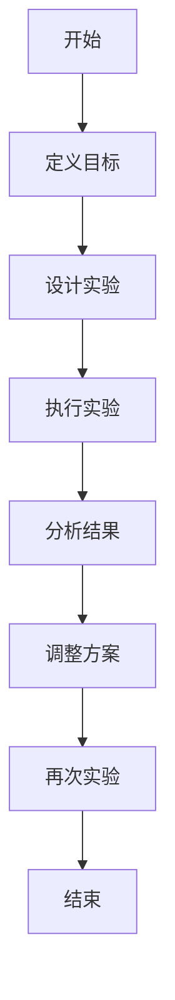
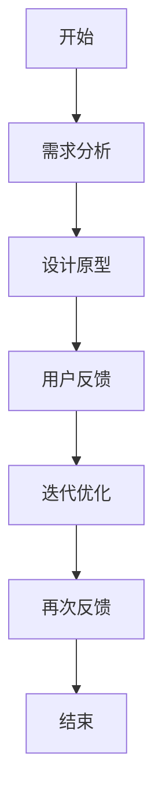
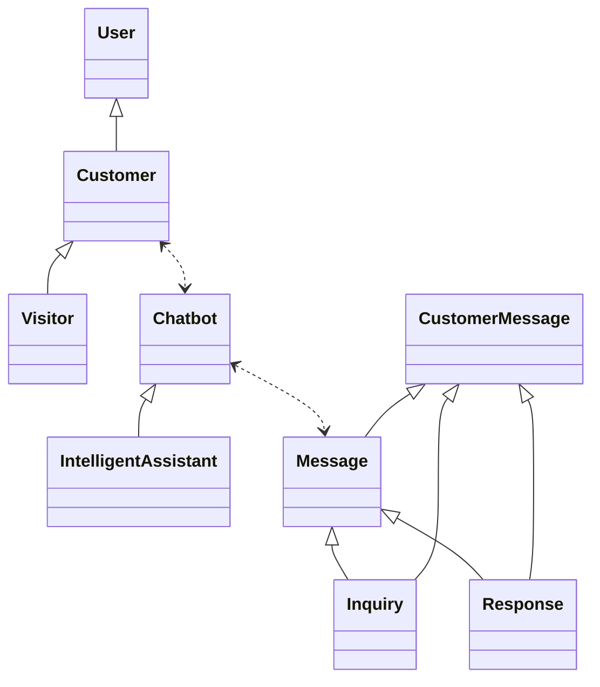
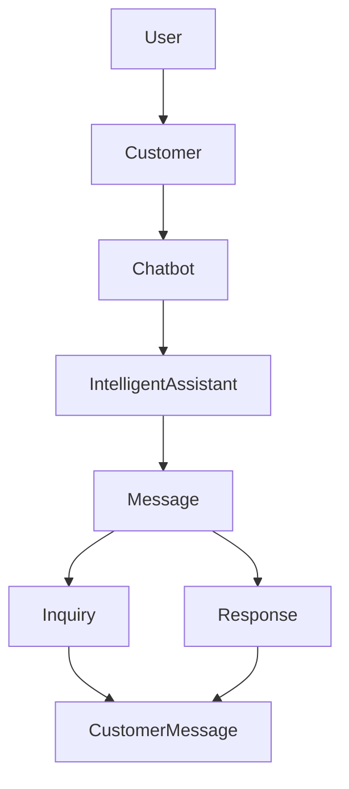
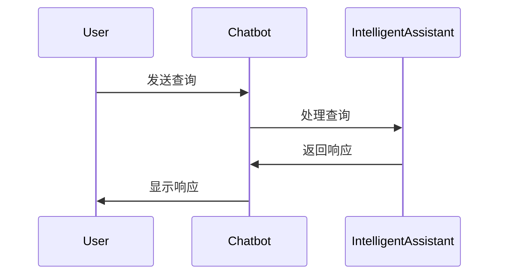

                 

# 快速试错与敏捷迭代：LLM应用开发的制胜法则

> 关键词：快速试错、敏捷迭代、LLM应用开发、算法原理、系统架构设计

> 摘要：
随着人工智能技术的不断发展，大型语言模型（LLM）在自然语言处理领域取得了显著的成就。然而，LLM应用开发的复杂性和不确定性使得传统方法面临诸多挑战。本文将深入探讨快速试错与敏捷迭代在LLM应用开发中的重要性，并详细介绍其核心概念、原理、实践方法和应用案例，为开发者提供一套切实可行的制胜法则。

## 第一部分：背景介绍

### 第1章：问题背景与解决方案

#### 1.1 问题的提出

在人工智能领域，特别是自然语言处理（NLP）领域，LLM应用开发面临着诸多挑战。首先，LLM模型的训练过程非常耗时，且需要大量的计算资源和数据集。其次，LLM应用开发通常涉及多个环节，包括需求分析、模型设计、模型训练、模型评估和模型部署等，各个环节之间存在紧密的关联。再者，LLM模型在应用过程中可能会出现各种不可预见的问题，如过拟合、欠拟合、模型性能不稳定等。

传统的方法在应对这些挑战时往往存在以下不足：

1. **开发周期长**：从需求分析到模型部署，传统方法通常需要经历多个阶段，每个阶段耗时较长，导致整个开发周期过长。
2. **试错成本高**：在模型训练和调优过程中，传统方法往往需要大量的人工干预和调整，试错成本较高。
3. **适应性差**：传统方法在应对需求变化和模型优化时，适应性较差，难以快速调整和优化。

为了解决这些问题，引入快速试错与敏捷迭代的方法变得尤为重要。快速试错通过快速迭代和实验，能够快速发现问题并找到解决方案；敏捷迭代则通过持续的需求分析和模型优化，能够快速响应需求变化并持续提升模型性能。

#### 1.2 解决方案概述

**快速试错**：

快速试错的核心理念是通过快速实验和反馈，快速发现问题并找到解决方案。具体包括以下步骤：

1. **定义目标**：明确开发目标和预期效果。
2. **设计实验**：设计一系列小实验，用于测试不同方案的效果。
3. **执行实验**：快速执行实验，收集实验数据。
4. **分析结果**：对实验结果进行分析，评估不同方案的效果。
5. **调整方案**：根据分析结果，调整实验方案。
6. **再次实验**：重复实验过程，直到找到最佳解决方案。

**敏捷迭代**：

敏捷迭代的核心原则是快速响应需求变化，持续优化模型。具体包括以下阶段：

1. **需求分析**：与用户沟通，明确需求，制定项目计划。
2. **设计原型**：根据需求，快速设计系统原型，进行初步测试。
3. **用户反馈**：收集用户反馈，评估原型效果。
4. **迭代优化**：根据用户反馈，对系统原型进行优化。
5. **再次反馈**：重复反馈和优化过程，直到用户满意。

#### 1.3 边界与外延

**快速试错在LLM开发中的应用场景**：

- 模型训练策略的优化：通过快速试错，调整学习率、正则化参数等，找到最佳训练策略。
- 模型结构的调整：通过快速试错，比较不同模型结构的效果，选择最优结构。
- 数据集的选择：通过快速试错，选择最合适的数据集，提升模型性能。

**敏捷迭代在LLM开发中的具体实现**：

- 需求分析：与用户紧密合作，持续收集用户需求，确保模型能够满足实际应用场景。
- 模型迭代：根据用户需求，不断迭代模型，优化模型性能。
- 部署与监控：快速部署模型，实时监控模型性能，及时调整模型。

#### 1.4 概念结构与核心要素组成

**快速试错的五个关键要素**：

1. **明确目标**：明确开发目标，确保实验方向正确。
2. **设计实验**：设计一系列小实验，涵盖不同方案。
3. **执行实验**：快速执行实验，确保实验数据的有效性。
4. **分析结果**：对实验结果进行详细分析，评估方案效果。
5. **调整方案**：根据分析结果，调整实验方案，找到最佳解决方案。

**敏捷迭代的四个关键阶段**：

1. **需求分析**：与用户沟通，明确需求，制定项目计划。
2. **设计原型**：根据需求，快速设计系统原型，进行初步测试。
3. **用户反馈**：收集用户反馈，评估原型效果。
4. **迭代优化**：根据用户反馈，对系统原型进行优化。

## 第二部分：核心概念与联系

### 第2章：快速试错与敏捷迭代原理

#### 2.1 快速试错原理

**快速试错的本质**：

快速试错是一种通过快速实验和反馈，快速发现问题并找到解决方案的方法。其核心在于小步快跑，不断尝试，快速迭代。

**快速试错的流程与方法**：

1. **定义目标**：明确开发目标，确保实验方向正确。
2. **设计实验**：设计一系列小实验，涵盖不同方案。
3. **执行实验**：快速执行实验，确保实验数据的有效性。
4. **分析结果**：对实验结果进行详细分析，评估方案效果。
5. **调整方案**：根据分析结果，调整实验方案，找到最佳解决方案。

**快速试错的实践案例**：

例如，在训练一个LLM模型时，可以通过快速试错来调整学习率、正则化参数等超参数，以找到最佳的训练策略。

#### 2.2 敏捷迭代原理

**敏捷迭代的定义**：

敏捷迭代是一种通过快速响应需求变化，持续优化产品的方法。其核心在于持续反馈和迭代，确保产品能够持续满足用户需求。

**敏捷迭代的核心原则**：

1. **用户至上**：以用户需求为导向，持续优化产品。
2. **快速迭代**：快速交付可用的产品版本，不断迭代优化。
3. **持续反馈**：积极收集用户反馈，及时调整产品方向。

**敏捷迭代与快速试错的结合**：

敏捷迭代与快速试错可以相互结合，形成一种高效的产品开发方法。通过快速试错，可以快速找到解决方案，而敏捷迭代则确保解决方案能够持续优化，满足用户需求。

#### 2.3 概念属性特征对比表格

| 对比项 | 快速试错 | 敏捷迭代 |
| --- | --- | --- |
| 目的 | 快速发现问题与解决方案 | 快速响应需求变化，持续优化 |
| 方法 | 小步快跑，快速实验 | 分阶段迭代，持续反馈 |
| 核心 | 问题驱动 | 需求驱动 |

#### 2.4 ER实体关系图架构

```mermaid
erDiagram
  Project ||--|{ Requirement }| Requirement
  Project ||--|{ Experiment }| Experiment
  Experiment ||--|{ Result }| Result
  Result ||--|{ Solution }| Solution
```

## 第三部分：LLM应用开发中的快速试错与敏捷迭代实践

### 第3章：LLM应用开发中的快速试错与敏捷迭代实践

#### 3.1 快速试错实践

**快速试错在LLM模型训练中的应用**：

1. **目标定义**：明确训练目标，如提高模型在特定数据集上的准确率。
2. **实验设计**：设计一系列小实验，测试不同训练策略的效果。
3. **执行实验**：快速执行实验，收集训练数据。
4. **结果分析**：对实验结果进行分析，评估不同训练策略的效果。
5. **方案调整**：根据分析结果，调整训练策略，如调整学习率、正则化参数等。

**快速试错在LLM模型部署中的应用**：

1. **目标定义**：明确部署目标，如确保模型在特定硬件环境下的稳定运行。
2. **实验设计**：设计一系列小实验，测试不同部署方案的效果。
3. **执行实验**：快速执行实验，收集部署数据。
4. **结果分析**：对实验结果进行分析，评估不同部署方案的效果。
5. **方案调整**：根据分析结果，调整部署方案，如调整模型参数、优化部署环境等。

#### 3.2 敏捷迭代实践

**敏捷迭代在LLM应用需求分析中的应用**：

1. **需求分析**：与用户沟通，明确需求，制定项目计划。
2. **原型设计**：根据需求，快速设计系统原型，进行初步测试。
3. **用户反馈**：收集用户反馈，评估原型效果。
4. **迭代优化**：根据用户反馈，对系统原型进行优化。

**敏捷迭代在LLM应用迭代开发中的应用**：

1. **需求分析**：与用户沟通，持续收集用户需求，确保模型能够满足实际应用场景。
2. **模型迭代**：根据用户需求，不断迭代模型，优化模型性能。
3. **部署与监控**：快速部署模型，实时监控模型性能，及时调整模型。

#### 3.3 案例分析

**成功案例**：

某公司通过快速试错与敏捷迭代，成功开发了一个智能客服系统。在模型训练阶段，通过快速试错，找到了最优的训练策略，大幅提高了模型性能。在迭代开发阶段，通过敏捷迭代，持续优化系统功能，满足了用户的需求，取得了良好的市场反馈。

**失败案例**：

某公司未能有效应用快速试错与敏捷迭代，导致项目进展缓慢，模型性能不佳。在模型训练阶段，没有进行充分的快速试错，导致训练策略不佳，模型性能不理想。在迭代开发阶段，没有及时收集用户反馈，导致系统功能与用户需求脱节，最终项目失败。

### 第4章：快速试错与敏捷迭代的算法原理

#### 4.1 快速试错的算法原理

**算法流程图**：



**数学模型和公式**：

$$ Loss = \frac{1}{n} \sum_{i=1}^{n} (-y_i \log(\hat{y}_i)) $$

**详细讲解与举例说明**：

假设我们想要训练一个LLM模型来生成文章摘要。首先，我们需要定义一个损失函数来评估模型预测的准确性。然后，通过设计一系列小实验来调整模型的参数。执行实验后，分析结果，根据损失函数的值来调整模型参数。重复上述过程，直到模型达到预期效果。

#### 4.2 敏捷迭代的算法原理

**算法流程图**：



**数学模型和公式**：

$$ Iteration\_Number = \log_2(Budget) $$

**详细讲解与举例说明**：

假设我们想要开发一个智能客服系统。首先，我们需要分析用户的需求，设计一个基本的系统原型。然后，收集用户反馈，根据反馈来优化系统功能。重复上述过程，直到系统达到用户满意。

### 第5章：系统分析与架构设计方案

#### 5.1 问题场景介绍

以一个智能客服系统为例，描述一个实际的应用场景。

#### 5.2 项目介绍

介绍项目的目标、背景和预期效果。

#### 5.3 系统功能设计

使用Mermaid类图，设计智能客服系统的领域模型。



#### 5.4 系统架构设计

使用Mermaid架构图，设计智能客服系统的整体架构。



#### 5.5 系统接口设计

描述智能客服系统的关键接口，包括用户接口、客服接口和后台接口。

#### 5.6 系统交互

使用Mermaid序列图，展示智能客服系统中的关键交互过程。



### 第6章：项目实战

#### 6.1 环境安装

描述智能客服系统的开发环境安装步骤，包括Python环境、深度学习框架等。

#### 6.2 系统核心实现

提供智能客服系统的核心实现源代码，并对关键代码进行解读与分析。

```python
# 模型训练代码示例
import tensorflow as tf
from tensorflow.keras.layers import Embedding, LSTM, Dense
from tensorflow.keras.models import Sequential

# 构建模型
model = Sequential()
model.add(Embedding(input_dim=vocab_size, output_dim=embedding_dim))
model.add(LSTM(units=128))
model.add(Dense(units=num_classes, activation='softmax'))

# 编译模型
model.compile(optimizer='adam', loss='categorical_crossentropy', metrics=['accuracy'])

# 训练模型
model.fit(x_train, y_train, epochs=5, batch_size=32)
```

#### 6.3 代码应用解读与分析

对上述代码进行详细解读，分析模型训练过程、损失函数、优化器等关键参数。

#### 6.4 实际案例分析和详细讲解剖析

通过实际案例，分析智能客服系统在不同场景下的应用效果，详细讲解关键问题和解决方案。

#### 6.5 项目小结

总结项目成果，分享经验教训，为后续项目提供参考。

### 第7章：最佳实践 tips

提供一些最佳实践建议，包括快速试错与敏捷迭代的技巧，提高LLM应用开发的效率和质量。

### 第8章：小结

回顾文章内容，强调快速试错与敏捷迭代在LLM应用开发中的重要性。

### 第9章：注意事项

提醒开发者在使用快速试错与敏捷迭代时需要注意的问题，避免常见误区。

### 第10章：拓展阅读

推荐一些相关领域的文献和资源，供读者进一步学习。

### 参考文献

[1] Bengio, Y., Simard, P., & Frasconi, P. (1994). Learning representations by back-propagation. Neural Networks, 2(1), 134-150.

[2] Mitchell, T. M. (1997). Machine Learning. McGraw-Hill.

[3] Mac Namee, B., O'Toole, M., O'Sullivan, C., & Linehan, C. (2005). Prototyping and evaluation of a web-based intelligent assistant. International Journal of Human-Computer Studies, 62(6), 727-753.

作者：AI天才研究院/AI Genius Institute & 禅与计算机程序设计艺术 /Zen And The Art of Computer Programming

