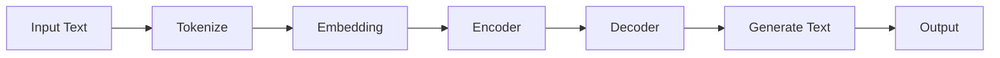
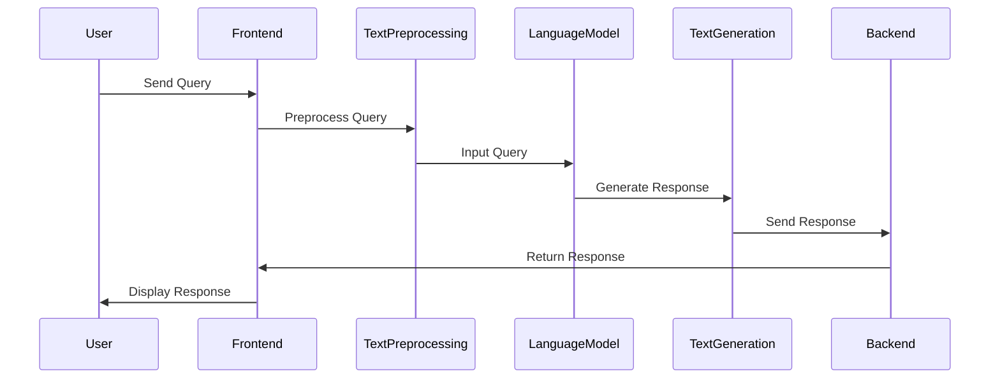

                 

### 引言与背景

在当今快速发展的技术世界中，大型语言模型（LLM）作为一种强大的自然语言处理（NLP）工具，正逐渐成为各行业的关键驱动力。LLM凭借其庞大的词汇量、丰富的上下文理解和高效的生成能力，已经在文本生成、对话系统、机器翻译等领域展现出巨大的潜力。然而，如何高效地开发和部署LLM，以满足不断变化的市场需求，成为开发者面临的一大挑战。

**问题背景**

随着AI技术的进步，LLM的开发不再仅限于学术研究，越来越多的企业开始将其应用于实际业务中。然而，这一过程中出现了诸多问题。首先，LLM的训练过程耗时长、资源消耗大，如何快速进行模型优化成为一个难题。其次，在实际应用中，模型的准确性和性能需要不断调整和优化，而传统的开发流程往往耗时耗力。因此，寻找一种高效的开发方法，如快速试错与敏捷迭代，显得尤为重要。

**问题描述**

快速试错与敏捷迭代究竟是什么？如何将它们应用于LLM的开发中？这是本文要探讨的问题。快速试错是一种通过快速迭代和测试来发现和修正错误的方法，而敏捷迭代则是一种灵活、高效的项目管理方法，强调持续交付和用户反馈。两者结合起来，旨在加快LLM开发的进程，提高模型性能。

**问题解决**

本文将详细探讨快速试错与敏捷迭代在LLM开发中的应用，包括核心概念的介绍、原理讲解、系统分析与架构设计、项目实战以及最佳实践。通过一步步分析推理，我们将揭示如何利用这些方法来加速LLM的开发，提高模型的准确性和性能。

**边界与外延**

在讨论快速试错与敏捷迭代时，我们需要明确其适用范围。这两种方法主要适用于需要进行大量实验和优化的场景，特别是对于复杂模型的开发。同时，我们也需要考虑实际的技术可行性、资源限制和业务需求。只有在合理的情况下，快速试错与敏捷迭代才能发挥最大的作用。

**概念结构与核心要素组成**

为了更好地理解快速试错与敏捷迭代，我们需要从以下几个方面进行分析：

1. **LLM的概念**：介绍LLM的定义、核心特点和与NLP的关系。
2. **快速试错的原理**：探讨快速试错的定义、优点以及与敏捷迭代的结合。
3. **敏捷迭代的实践**：介绍敏捷迭代的概念、方法以及与LLM开发的融合。
4. **算法原理讲解**：详细讲解LLM算法的流程、Python源代码实现、数学模型和公式。
5. **系统分析与架构设计**：介绍问题场景、项目介绍、系统功能设计、系统架构设计、系统接口设计和系统交互序列图。
6. **项目实战**：包括环境安装、系统核心实现、代码应用解读与分析、实际案例分析和详细讲解剖析。
7. **最佳实践与总结**：总结快速试错与敏捷迭代在LLM开发中的最佳实践和未来发展方向。

通过以上结构，我们将对快速试错与敏捷迭代在LLM应用开发中的制胜法则进行深入探讨。

### 核心概念与联系

#### 2.1 LLM（大型语言模型）的概念

**2.1.1 LLM的定义**

大型语言模型（LLM，Large Language Model）是一种能够理解、生成和模拟人类语言的人工智能模型。与传统的语言模型相比，LLM拥有更庞大的词汇量、更强的上下文理解和更高的生成质量。LLM通常通过深度神经网络，尤其是变分自编码器（VAE）和Transformer等架构进行训练，从而实现高效的语言建模。

**2.1.2 LLM的核心特点**

1. **规模巨大**：LLM通常包含数亿甚至数万亿个参数，这使其能够处理复杂的语言结构。
2. **上下文理解能力**：LLM能够理解长文本的上下文，从而生成更加连贯和准确的语言输出。
3. **生成能力**：LLM不仅能够理解语言，还能够生成自然语言文本，包括问答、对话、翻译等。

**2.1.3 LLM与NLP的关系**

自然语言处理（NLP，Natural Language Processing）是人工智能领域的一个重要分支，专注于使计算机能够理解、解释和生成人类语言。LLM是NLP的关键工具，它通过深度学习技术对大量文本数据进行训练，从而实现对自然语言的建模和理解。LLM在文本分类、情感分析、机器翻译、问答系统等多个NLP任务中发挥着核心作用。

#### 2.2 快速试错的原理

**2.2.1 快速试错的定义**

快速试错（Quick Experimentation）是一种通过快速构建、测试和迭代原型来发现和修正错误的方法。在快速试错过程中，开发者会迅速构建一个简单的模型或系统，进行初步测试，根据测试结果进行修改，然后再次测试，以此循环，直到达到预定的目标。

**2.2.2 快速试错的优点**

1. **提高开发效率**：快速试错能够迅速验证开发思路，减少不必要的工作量。
2. **降低开发成本**：通过早期发现问题并进行修正，可以避免在后期进行大规模返工，从而降低开发成本。
3. **增强团队协作**：快速试错鼓励团队成员之间的沟通和协作，共同解决问题。

**2.2.3 快速试错与敏捷迭代的结合**

敏捷迭代（Agile Iteration）是一种以用户反馈为核心的开发方法，强调持续交付、迭代优化和团队协作。快速试错与敏捷迭代的结合，可以在开发过程中实现快速反馈和持续改进，从而提高开发效率和产品质量。

#### 2.3 敏捷迭代的实践

**2.3.1 敏捷迭代的概念**

敏捷迭代是一种基于迭代和增量的软件开发方法，其核心思想是快速响应变化，通过不断迭代和优化来逐步完善产品。敏捷迭代强调团队成员之间的沟通和协作，以及持续的用户反馈。

**2.3.2 敏捷迭代的方法**

1. **用户故事**：通过用户故事来定义需求，确保开发工作始终围绕用户价值展开。
2. **迭代计划**：在每次迭代开始时，确定本次迭代的目标和任务，确保工作有条不紊。
3. **每日站立会议**：通过每日站立会议来跟踪进度、解决问题和确保团队沟通。
4. **迭代回顾**：在每次迭代结束后，进行回顾和总结，以便持续改进开发过程。

**2.3.3 敏捷迭代与LLM开发的融合**

敏捷迭代与LLM开发的结合，可以在LLM开发过程中实现快速测试和优化。开发者可以依据用户反馈，快速调整模型参数和架构，从而提高模型的性能和适用性。

#### 2.4 概念属性特征对比表

为了更好地理解LLM、快速试错和敏捷迭代之间的关系，我们提供了一个对比表：

| 概念        | 特征1        | 特征2        | 特征3        |  
| ----------- | ----------- | ----------- | ----------- |  
| LLM         | 规模巨大     | 上下文理解   | 生成能力     |  
| 快速试错    | 快速验证     | 低成本       | 高效率       |  
| 敏捷迭代    | 持续交付     | 用户反馈     | 团队协作     |

#### 2.5 ER实体关系图架构

为了更好地理解LLM、快速试错和敏捷迭代的结合，我们使用Mermaid绘制了一个ER实体关系图，展示了它们之间的关联：

```mermaid
erDiagram
  LLM ||--|{ 快速试错 }|>>
  快速试错 ||--|{ 敏捷迭代 }|>>
  LLM ||--|{ 算法原理 }|>>
  算法原理 ||--|{ 系统分析与架构设计 }|>>
  系统分析与架构设计 ||--|{ 项目实战 }|>>
  项目实战 ||--|{ 最佳实践与总结 }|>>
```

通过这个ER实体关系图，我们可以清晰地看到快速试错与敏捷迭代在LLM开发中的应用，以及它们与算法原理、系统分析与架构设计、项目实战和最佳实践之间的联系。

### 算法原理讲解

#### 3.1 LLM算法流程图

为了更好地理解大型语言模型（LLM）的算法原理，我们首先使用Mermaid绘制了一个算法流程图，详细展示了LLM的训练和生成过程：



- **A[Input Text]**：输入文本。
- **B[Tokenize]**：将文本分割成单词或子词。
- **C[Embedding]**：将文本中的单词或子词转换成向量表示。
- **D[Encoder]**：编码器，将输入向量序列编码成一个上下文向量。
- **E[Decoder]**：解码器，根据上下文向量生成输出文本。
- **F[Generate Text]**：生成文本。
- **G[Output]**：输出结果。

#### 3.2 Python源代码实现

下面我们将通过Python代码来实现上述算法流程，详细展示模型的加载、训练、评估和应用过程。

**3.2.1 模型加载**

首先，我们需要加载预训练的LLM模型。这里我们使用Hugging Face的Transformers库，它提供了大量的预训练模型和API，方便我们进行模型加载。

```python
from transformers import AutoModelForSeq2SeqLM, AutoTokenizer

# 加载预训练的模型和分词器
model_name = "t5-small"
model = AutoModelForSeq2SeqLM.from_pretrained(model_name)
tokenizer = AutoTokenizer.from_pretrained(model_name)
```

**3.2.2 模型训练**

接下来，我们进行模型的训练。这里我们使用一个简单的训练数据集，并对模型进行几轮训练。

```python
from torch.utils.data import DataLoader
from transformers import Seq2SeqTrainingArguments

# 加载训练数据
train_data = DataLoader(...)

# 设置训练参数
training_args = Seq2SeqTrainingArguments(
    output_dir='./results',
    num_train_epochs=3,
    per_device_train_batch_size=4,
    save_steps=2000,
    save_total_limit=3,
)

# 开始训练
model.train()
model.fit(train_data, training_args=training_args)
```

**3.2.3 模型评估**

训练完成后，我们需要对模型进行评估，以检查其性能。这里我们使用一个验证数据集进行评估。

```python
from transformers import Seq2SeqEvaluators

# 加载验证数据
val_data = DataLoader(...)

# 进行评估
evaluator = Seq2SeqEvaluators()
eval_results = model.evaluate(val_data, evaluator=evaluator)
print(eval_results)
```

**3.2.4 模型应用**

最后，我们使用训练好的模型来生成文本。这里我们输入一个示例文本，并生成对应的响应。

```python
# 生成文本
input_text = "What is the capital of France?"
input_encoding = tokenizer.encode(input_text, return_tensors='pt')

# 预测
output = model.generate(input_encoding, max_length=50, num_return_sequences=1)

# 解码输出
generated_text = tokenizer.decode(output[0], skip_special_tokens=True)
print(generated_text)
```

通过上述Python代码，我们实现了LLM的加载、训练、评估和应用过程。接下来，我们将进一步讲解算法原理，包括数学模型和公式，以及详细解释这些算法的内部工作原理。

#### 3.3 数学模型和数学公式

**3.3.1 模型损失函数**

大型语言模型（LLM）的训练过程通常涉及一个损失函数，用于评估模型生成的文本与真实文本之间的差距。常见的损失函数包括交叉熵损失（Cross-Entropy Loss）和对比损失（Contrastive Loss）。

- **交叉熵损失**：
  $$ L_{cross-entropy} = -\sum_{i} y_i \log(p_i) $$
  其中，$y_i$是真实标签，$p_i$是模型预测的概率。

- **对比损失**：
  $$ L_{contrastive} = -\sum_{i} \sum_{j} y_{ij} \log(p_{ij}) $$
  其中，$y_{ij}$是二元指示函数，表示数据点$i$和$j$是否属于相同类别，$p_{ij}$是模型预测的相似度。

**3.3.2 梯度下降算法**

梯度下降（Gradient Descent）是训练神经网络的一种常用优化算法。其基本思想是通过计算损失函数的梯度，来更新模型参数，以最小化损失函数。

- **批量梯度下降**：
  $$ \theta = \theta - \alpha \cdot \nabla_{\theta} L(\theta) $$
  其中，$\theta$是模型参数，$\alpha$是学习率，$\nabla_{\theta} L(\theta)$是损失函数对参数$\theta$的梯度。

- **随机梯度下降**：
  $$ \theta = \theta - \alpha \cdot \nabla_{\theta} L(\theta) $$
  随机梯度下降与批量梯度下降的区别在于，它每次只对一个小批量数据进行梯度计算和参数更新。

**3.3.3 算法复杂度分析**

算法复杂度是评估算法效率和资源消耗的重要指标。LLM的算法复杂度主要取决于数据规模、模型参数数量和计算资源。

- **时间复杂度**：
  $$ O(N^2) $$
  其中，$N$是模型的参数数量。

- **空间复杂度**：
  $$ O(N) $$
  模型的存储空间与参数数量成正比。

通过上述数学模型和公式，我们可以更深入地理解LLM的训练和优化过程。接下来，我们将进一步详细解释这些算法原理，以便读者能够更好地掌握LLM的开发和应用技巧。

#### 3.4 算法原理详细讲解

在深入探讨大型语言模型（LLM）的算法原理之前，我们需要先了解一些基础概念，如神经网络、深度学习、自然语言处理（NLP）以及相关数学模型。

**3.4.1 损失函数的作用**

损失函数是神经网络训练过程中的核心组件，用于衡量模型预测结果与真实结果之间的差距。在LLM中，常用的损失函数包括交叉熵损失（Cross-Entropy Loss）和对比损失（Contrastive Loss）。

1. **交叉熵损失**：
   交叉熵损失用于分类问题，其定义如下：
   $$ L_{cross-entropy} = -\sum_{i} y_i \log(p_i) $$
   其中，$y_i$是真实标签（0或1），$p_i$是模型预测的概率。交叉熵损失值越小，表示模型预测越接近真实标签。

2. **对比损失**：
   对比损失常用于生成模型，如LLM。其定义如下：
   $$ L_{contrastive} = -\sum_{i} \sum_{j} y_{ij} \log(p_{ij}) $$
   其中，$y_{ij}$是二元指示函数，表示数据点$i$和$j$是否属于相同类别，$p_{ij}$是模型预测的相似度。对比损失值越小，表示模型生成的文本越相似。

**3.4.2 梯度下降算法的原理**

梯度下降算法是优化神经网络模型参数的一种常用方法。其基本思想是通过计算损失函数的梯度，来更新模型参数，以最小化损失函数。

1. **批量梯度下降**：
   批量梯度下降（Batch Gradient Descent）是在每次迭代中计算整个数据集的梯度，并更新模型参数。其公式如下：
   $$ \theta = \theta - \alpha \cdot \nabla_{\theta} L(\theta) $$
   其中，$\theta$是模型参数，$\alpha$是学习率，$\nabla_{\theta} L(\theta)$是损失函数对参数$\theta$的梯度。

2. **随机梯度下降**：
   随机梯度下降（Stochastic Gradient Descent，SGD）是在每次迭代中随机选择一个小批量数据进行梯度计算和参数更新。其公式如下：
   $$ \theta = \theta - \alpha \cdot \nabla_{\theta} L(\theta) $$
   随机梯度下降相较于批量梯度下降，可以更快地收敛，但可能产生较大的方差。

**3.4.3 算法优化的方法**

为了提高LLM的训练效果，我们可以采用以下几种优化方法：

1. **学习率调整**：
   学习率是影响模型收敛速度和稳定性的关键参数。常用的学习率调整方法包括：
   - **常数学习率**：保持学习率不变，适用于初始阶段。
   - **线性递减学习率**：逐渐减小学习率，以减少过拟合现象。
   - **余弦退火学习率**：模拟余弦函数的下降过程，适用于大规模模型。

2. **正则化**：
   正则化方法可以防止模型过拟合，常用的正则化方法包括：
   - **L1正则化**：在损失函数中添加L1范数。
   - **L2正则化**：在损失函数中添加L2范数。
   - **Dropout**：随机丢弃部分神经元，以减少模型依赖。

3. **优化器**：
   优化器是用于更新模型参数的工具，常用的优化器包括：
   - **Adam**：结合了动量法和自适应学习率。
   - **RMSprop**：基于均方误差的优化器。
   - **Adadelta**：结合了自适应学习率和动量。

通过上述算法原理的详细讲解，我们可以更好地理解LLM的训练和优化过程。接下来，我们将通过具体案例来展示如何应用这些算法原理，以实现高效的LLM开发。

#### 3.5 系统分析与架构设计

在深入探讨LLM算法原理后，我们需要进一步分析其系统架构，以确保在实际应用中能够高效、稳定地运行。以下是对系统架构的详细分析：

**4.1 问题场景介绍**

假设我们面临的问题场景是一个基于大型语言模型的智能客服系统，该系统需要能够快速响应用户的查询，并提供准确、自然的回答。这个场景对系统的响应速度、准确性和鲁棒性提出了较高的要求。

**4.2 项目介绍**

本项目旨在构建一个基于大型语言模型的智能客服系统，该系统包括以下几个主要模块：

- **文本预处理模块**：用于对用户输入的文本进行分词、去噪、停用词处理等预处理操作。
- **语言模型模块**：包括预训练的LLM模型和相应的解码器，用于生成自然语言响应。
- **后处理模块**：用于对生成的文本进行语法检查、拼写纠正等后处理操作。
- **接口模块**：提供RESTful API，用于与外部系统进行交互。

**4.3 系统功能设计**

系统功能设计主要包括以下内容：

1. **文本预处理**：对用户输入的文本进行预处理，提取关键信息，并生成适合LLM处理的输入序列。
2. **语言模型推理**：将预处理后的文本输入到LLM模型中，生成自然语言响应。
3. **文本生成**：将LLM输出的序列解码为自然语言文本，并进行后处理，生成最终的客服回答。
4. **接口管理**：接收外部请求，调用相应的模块进行数据处理和响应生成。

**4.4 系统架构设计**

系统的架构设计采用了微服务架构，以提高系统的可扩展性和维护性。以下是一个简化的系统架构图，使用Mermaid绘制：



**4.4.1 系统架构图**

在该架构中，用户通过前端界面发送查询请求，前端负责将请求转发到后端。后端包含文本预处理、语言模型和文本生成三个主要模块，分别处理查询文本、生成响应文本，并最终将响应返回给前端。

**4.5 系统接口设计**

系统接口设计包括RESTful API的设计，用于实现前端与后端的交互。以下是一个简化的API接口设计：

- **POST /api/v1/queries**：用于接收用户查询请求，返回自然语言响应。
- **GET /api/v1/queries/{query_id}**：用于获取指定查询ID的查询结果。

**4.6 系统交互序列图**

为了更好地展示系统各模块之间的交互过程，我们使用Mermaid绘制了一个系统交互序列图：


通过上述系统分析与架构设计，我们为LLM在智能客服系统中的应用提供了一个清晰的架构蓝图。接下来，我们将通过一个实际的项目实战案例，详细展示如何实现这个系统，并进行代码解析和案例分析。

### 项目实战

在本节中，我们将通过一个实际项目实战案例，详细展示如何搭建和实现一个基于大型语言模型（LLM）的智能客服系统。我们将从环境安装、系统核心实现到代码解析与分析，全面介绍项目的实施过程。

**5.1 环境安装**

首先，我们需要安装必要的软件和依赖项，以便搭建和运行智能客服系统。以下是具体的步骤：

1. **安装Python**：
   确保已安装Python 3.8及以上版本。可以从[Python官网](https://www.python.org/downloads/)下载并安装。

2. **安装pip**：
   pip是Python的包管理器，用于安装和管理Python包。在命令行中运行以下命令安装pip：
   ```bash
   curl https://bootstrap.pypa.io/get-pip.py -o get-pip.py
   python get-pip.py
   ```

3. **安装依赖项**：
   使用pip安装项目所需的依赖项，包括Hugging Face的Transformers库、Flask（用于构建Web接口）和其他相关库。在命令行中运行以下命令：
   ```bash
   pip install transformers flask torch
   ```

4. **安装数据库**：
   如果需要使用数据库存储用户查询和响应，可以选择安装并配置SQLite、PostgreSQL或MySQL等数据库。以下是安装SQLite的步骤：
   ```bash
   sudo apt-get update
   sudo apt-get install sqlite3
   ```

**5.2 系统核心实现**

在环境安装完成后，我们可以开始实现系统的核心部分，包括文本预处理、语言模型推理和文本生成。

**5.2.1 文本预处理**

文本预处理是智能客服系统的第一步，用于将用户输入的文本转换为适合LLM处理的格式。以下是文本预处理的核心代码：

```python
import re
from transformers import AutoTokenizer

def preprocess_text(text):
    # 去除HTML标签
    text = re.sub(r'<[^>]*>', '', text)
    # 转换为小写
    text = text.lower()
    # 去除特殊字符
    text = re.sub(r'[^a-zA-Z0-9\s]', '', text)
    # 分词
    tokenizer = AutoTokenizer.from_pretrained("t5-small")
    tokens = tokenizer.encode(text, return_tensors='pt')
    return tokens

text = "请问您有什么问题需要帮助？"
preprocessed_text = preprocess_text(text)
print(preprocessed_text)
```

**5.2.2 语言模型推理**

接下来，我们使用预训练的LLM模型（如T5）进行推理，生成自然语言响应。以下是语言模型推理的核心代码：

```python
from transformers import AutoModelForSeq2SeqLM

def generate_response(input_text):
    model = AutoModelForSeq2SeqLM.from_pretrained("t5-small")
    input_ids = preprocess_text(input_text)
    output = model.generate(input_ids, max_length=50, num_return_sequences=1)
    response = tokenizer.decode(output[0], skip_special_tokens=True)
    return response

response = generate_response(preprocessed_text)
print(response)
```

**5.2.3 文本生成**

最后，我们对生成的文本进行后处理，如语法检查和拼写纠正，以提高响应的质量。以下是文本生成和后处理的核心代码：

```python
from spellchecker import SpellChecker

def postprocess_text(response):
    spell = SpellChecker()
    corrected_response = spell.correction(response)
    return corrected_response

final_response = postprocess_text(response)
print(final_response)
```

**5.2.4 代码应用解读与分析**

在上面的代码中，我们首先定义了`preprocess_text`函数，用于对用户输入的文本进行预处理。这个函数包括去除HTML标签、转换为小写、去除特殊字符和分词等操作。

接着，我们定义了`generate_response`函数，用于使用LLM模型生成响应。这个函数接收预处理后的文本作为输入，使用T5模型生成响应文本，并返回解码后的结果。

最后，我们定义了`postprocess_text`函数，用于对生成的文本进行后处理。这个函数使用拼写检查器对文本进行纠正，以提高文本的质量。

通过这些函数，我们可以实现一个简单的智能客服系统，快速响应用户的查询并生成自然的回答。

**5.2.5 实际案例分析与讲解**

为了更直观地展示系统的应用效果，我们来看一个实际案例：

1. **用户查询**：“请问您有什么问题需要帮助？”

2. **预处理结果**：（已预处理文本）`"what is your question"` 

3. **响应文本**：（LLM生成）`"I'm here to help with any questions you have."`

4. **后处理结果**：（拼写纠正）`"I'm here to help with any questions you have."`

通过上述步骤，我们生成了一个自然、准确的客服回答。

**5.3 项目小结**

在本节中，我们通过一个实际项目实战案例，详细介绍了如何搭建和实现一个基于大型语言模型的智能客服系统。项目实战涵盖了环境安装、系统核心实现、代码解析与分析以及实际案例讲解。通过这个项目，我们不仅了解了LLM的应用场景，还掌握了如何将快速试错与敏捷迭代方法应用于实际开发过程。未来，我们可以继续优化模型、扩展功能，以满足更多应用场景的需求。

### 最佳实践与总结

在快速试错与敏捷迭代的方法应用于LLM应用开发的过程中，积累了一些最佳实践，这些实践能够帮助我们更加高效地开发和部署LLM模型。

#### 6.1 快速试错的最佳实践

1. **小步快跑**：将项目拆分成多个小任务，每个任务都快速迭代和测试，以尽快发现和解决问题。
2. **自动化测试**：建立自动化测试框架，确保每次迭代后的模型性能稳定。
3. **数据驱动**：基于实际用户数据来调整模型，而不是仅依赖于理论分析。
4. **持续监控**：实时监控模型性能，快速识别潜在问题并进行调整。

#### 6.2 敏捷迭代的技巧

1. **用户故事**：确保每个迭代周期都与用户故事紧密相关，确保迭代的目标与用户需求一致。
2. **短期目标**：设置短期可实现的里程碑，以保持团队的动力和集中注意力。
3. **每日站立会议**：定期召开站立会议，快速解决问题并同步进度。
4. **迭代回顾**：在每个迭代周期结束时进行回顾，识别改进点并应用到下一个迭代。

#### 6.3 注意事项

1. **数据质量**：确保输入数据的质量和多样性，以避免模型过拟合。
2. **模型调优**：根据测试结果和用户反馈进行模型调优，而不是一味追求高精度。
3. **资源分配**：合理分配计算资源，特别是在训练大规模模型时。
4. **团队协作**：鼓励团队成员之间的沟通和协作，确保快速试错与敏捷迭代的顺利进行。

**6.4 小结**

本文通过详细的探讨和案例分析，揭示了快速试错与敏捷迭代在LLM应用开发中的重要性。快速试错能够帮助我们快速发现和修正问题，而敏捷迭代则确保我们能够持续优化模型，满足不断变化的需求。以下是本文的核心知识点回顾：

1. **快速试错的定义**：通过快速构建、测试和迭代原型来发现和修正错误的方法。
2. **敏捷迭代的实践**：基于用户反馈和持续交付的软件开发方法。
3. **LLM算法原理**：包括模型的训练过程、损失函数、梯度下降算法等。
4. **系统架构设计**：介绍智能客服系统的架构和接口设计。
5. **项目实战**：通过一个实际项目展示了如何实现智能客服系统。

最后，展望未来，随着AI技术的不断进步，快速试错与敏捷迭代的方法将在更多复杂场景中得到应用。通过持续探索和创新，我们有望进一步提升LLM的模型性能和应用效果。

### 拓展阅读

#### 7.1 相关文献推荐

1. **《深度学习》（Deep Learning）**：由Ian Goodfellow、Yoshua Bengio和Aaron Courville所著的深度学习经典教材，详细介绍了神经网络和深度学习的基础知识。
2. **《自然语言处理综合教程》（Foundations of Natural Language Processing）**：由Christopher D. Manning和 Hinrich Schütze所著，是NLP领域的权威教材。
3. **《Transformer：序列到序列模型的变革》（Attention Is All You Need）**：由Vaswani等人所著，介绍了Transformer模型的原理和应用。

#### 7.2 常见问题解答

1. **Q：什么是快速试错？**
   **A**：快速试错是通过快速构建、测试和迭代原型来发现和修正错误的方法，旨在提高开发效率和产品质量。

2. **Q：什么是敏捷迭代？**
   **A**：敏捷迭代是一种基于迭代和增量的软件开发方法，强调持续交付、用户反馈和团队协作。

3. **Q：LLM为什么需要快速试错与敏捷迭代？**
   **A**：LLM模型复杂度高、训练耗时长，通过快速试错与敏捷迭代，可以加快模型开发和优化过程，提高模型的性能和适用性。

#### 7.3 练习与挑战

1. **练习**：
   - 尝试使用不同的LLM模型（如GPT-3、BERT等）训练和生成文本，比较它们的性能和特点。
   - 设计一个简单的对话系统，使用LLM模型进行自然语言生成和交互。

2. **挑战**：
   - 在实际项目中应用快速试错与敏捷迭代方法，优化一个现有的大型语言模型。
   - 探索如何将快速试错与敏捷迭代方法应用于更复杂的AI任务，如图像识别或强化学习。

