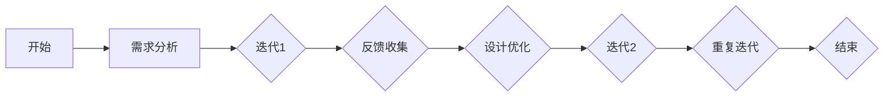
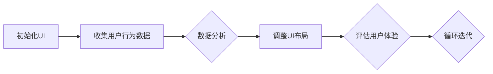
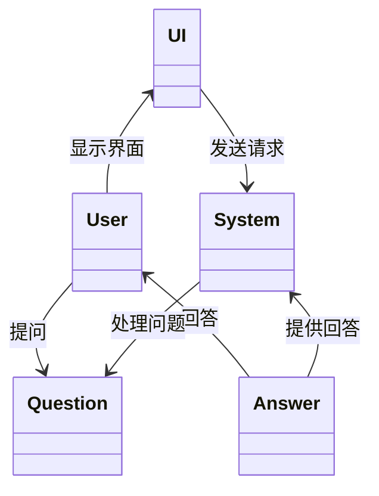
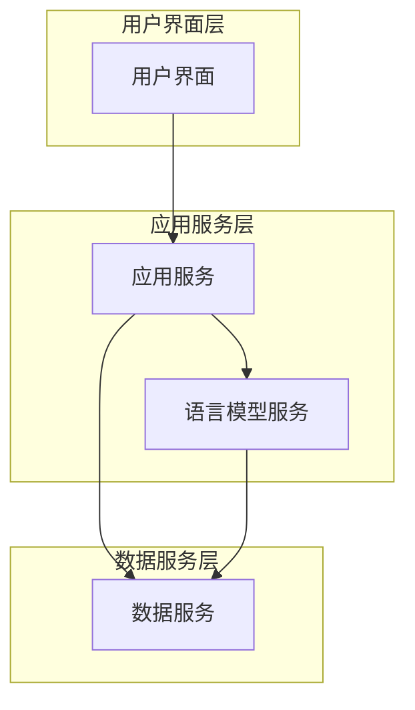
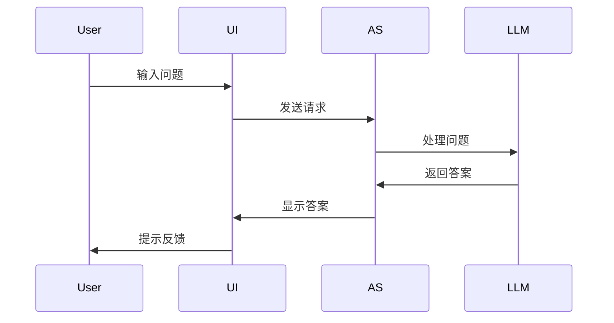

                 


# 快速迭代LLM应用的用户界面设计

## 关键词：用户界面设计、LLM应用、快速迭代、交互性、用户体验、响应速度

## 摘要：

随着大型语言模型（LLM）在各个领域的广泛应用，如何设计一个既高效又易于使用的用户界面（UI）成为了关键问题。本文旨在探讨快速迭代LLM应用用户界面的设计方法，通过逻辑清晰、结构紧凑的分析，为开发者提供一套实用的UI设计指南。文章将首先介绍用户界面设计的基本原则和当前挑战，接着深入解析LLM应用的基本原理，最后结合实际案例，展示快速迭代UI设计的过程和方法。

## 目录

### 第一部分：背景介绍

1.1 问题背景

1.2 用户界面设计概述

### 第二部分：核心概念与联系

2.1 LLM应用的基本原理

2.2 用户界面设计核心概念

### 第三部分：算法原理讲解

3.1 快速迭代算法原理

3.2 用户界面优化算法

### 第四部分：系统分析与架构设计方案

4.1 项目介绍

4.2 系统交互设计

### 第五部分：项目实战

5.1 环境安装

5.2 系统核心实现

5.3 实际案例分析与讲解

5.4 项目小结

### 第六部分：总结与展望

6.1 小结

6.2 展望未来

## 第一部分：背景介绍

### 1.1 问题背景

在现代软件开发中，用户界面设计（UI Design）至关重要。一个良好的用户界面不仅可以提升用户体验（UX），还能显著提高应用的使用效率和用户满意度。然而，在LLM（Large Language Model）应用的设计过程中，用户界面面临着诸多独特的挑战。

首先，LLM应用通常处理复杂的自然语言任务，如文本生成、翻译、摘要等。这要求用户界面具备高度的交互性和响应速度，以便用户能够实时获取反馈。其次，由于LLM模型通常具有庞大的参数量和复杂的计算过程，如何在保证性能的同时提供流畅的用户体验，是一个亟待解决的问题。

此外，随着人工智能技术的快速发展，用户对UI设计的需求也在不断变化。用户期望看到一个简洁、直观、易于操作的界面，同时能够快速适应不同场景和任务需求。这就要求开发者必须具备快速迭代UI设计的能力，以适应不断变化的市场和技术趋势。

### 1.2 用户界面设计概述

用户界面设计是软件工程的重要组成部分，它关注如何使软件产品易于使用、高效、美观。用户界面设计的基本原则包括简洁性、一致性、易用性等。

**简洁性**：用户界面应该尽可能简洁，避免复杂和冗余的元素，减少用户的认知负担。这可以通过减少不必要的按钮、图标和文本来实现。

**一致性**：用户界面的一致性是确保用户体验的关键。一致性包括颜色、字体、图标、布局等方面的统一，使得用户在操作过程中能够快速理解和使用软件。

**易用性**：用户界面的易用性是指用户能够轻松地完成预期任务，无需过多思考和操作。易用性可以通过用户研究、原型设计、用户测试等方法来提升。

用户界面设计的发展历程可以从早期的命令行界面（CLI）逐步演变到图形用户界面（GUI），再到现代的触摸界面和语音界面。每个阶段都有其特定的设计原则和技术挑战，但共同的目标都是为了提高用户的使用体验。

## 第二部分：核心概念与联系

### 2.1 LLM应用的基本原理

大型语言模型（LLM）是深度学习领域的一项重要技术，其核心思想是利用大量文本数据训练一个神经网络模型，使其能够理解和生成自然语言。LLM的基本原理主要包括以下几个方面：

**模型架构**：LLM通常基于Transformer架构，这是一种基于自注意力机制的深度神经网络。Transformer架构能够有效地捕捉文本中的长距离依赖关系，使得模型在处理自然语言任务时表现出色。

**训练过程**：LLM的训练过程涉及大量的数据预处理、模型初始化、训练和优化等步骤。在训练过程中，模型会通过不断调整参数，使其对输入的文本数据产生更加准确和自然的输出。

**应用场景**：LLM在多个领域都有广泛的应用，包括文本生成、机器翻译、情感分析、问答系统等。这些应用场景通常要求模型具备高准确性和实时响应能力。

以下是一个对比表格，列出了几种常见的LLM属性特征：

| 属性特征         | 特征描述                                       |
|----------------|------------------------------------------------|
| 性能           | 模型的响应速度和准确性                           |
| 适用场景       | 模型在不同应用场景下的适用性                     |
| 训练时间       | 模型训练所需的时间长度                         |
| 资源消耗       | 模型训练和推理过程中的计算资源需求               |
| 参数规模       | 模型的参数数量和规模                           |

### 2.2 用户界面设计核心概念

用户界面设计（UI Design）的核心概念包括用户交互模型、用户体验设计、界面布局等。

**用户交互模型**：用户交互模型是指用户与界面交互的机制和流程。一个好的用户交互模型能够降低用户的学习成本，提高操作效率。常见的用户交互模型包括命令行界面（CLI）、图形用户界面（GUI）和触摸界面等。

**用户体验设计**：用户体验设计（UX Design）是指从用户的角度出发，设计软件产品的交互流程、视觉元素和功能特性。用户体验设计的核心目标是提升用户在使用软件过程中的满意度和幸福感。

**界面布局**：界面布局是指用户界面的结构安排和元素分布。一个良好的界面布局应该能够清晰展示功能模块，便于用户操作和导航。常见的界面布局包括顶部导航栏、底部工具栏、左右侧栏等。

以下是用户界面设计的ER实体关系图架构（使用Mermaid绘制）：

```mermaid
erDiagram
    UIElement ||--|{ UserInteraction : has }
    UIElement ||--|{ UIComponent : has }
    UIElement ||--|{ VisualDesign : has }
    UserInteraction ||--|{ UIWorkflow : has }
    UserInteraction ||--|{ UserAction : has }
    UIComponent ||--|{ ControlType : has }
    UIComponent ||--|{ ElementType : has }
    VisualDesign ||--|{ ColorScheme : has }
    VisualDesign ||--|{ Typography : has }
```

## 第三部分：算法原理讲解

### 3.1 快速迭代算法原理

快速迭代算法是提升UI设计效率的关键。其核心思想是通过快速迭代和反馈机制，不断优化用户界面设计，以满足用户需求。

**算法流程图**（使用Mermaid绘制）：



**Python源代码**：

```python
# 快速迭代算法Python代码示例

# 引入必需的库
import time
import random

# 需求分析
def analyze_requirements():
    # 模拟需求分析过程
    time.sleep(2)
    print("需求分析完成。")

# 反馈收集
def collect_feedback():
    # 模拟反馈收集过程
    time.sleep(2)
    print("反馈收集完成。")

# 设计优化
def optimize_design():
    # 模拟设计优化过程
    time.sleep(2)
    print("设计优化完成。")

# 迭代过程
def iterate():
    analyze_requirements()
    collect_feedback()
    optimize_design()
    print("迭代完成。")

# 快速迭代循环
for i in range(3):
    print(f"开始迭代第{i+1}次。")
    iterate()
    print(f"第{i+1}次迭代结束。\n")
```

**数学模型和公式**（使用LaTeX格式）：

$$
\text{迭代次数} = \frac{\text{需求变更次数}}{\text{每次迭代改进量}}
$$

### 3.2 用户界面优化算法

用户界面优化算法旨在通过算法手段提升UI设计的用户体验。以下是一个简单的优化算法示例。

**算法流程图**（使用Mermaid绘制）：



**Python源代码**：

```python
# 用户界面优化算法Python代码示例

# 引入必需的库
import random
import time

# 初始化UI
def initialize_ui():
    # 模拟UI初始化过程
    time.sleep(2)
    print("UI初始化完成。")

# 收集用户行为数据
def collect_user_data():
    # 模拟用户行为数据收集过程
    time.sleep(2)
    print("用户行为数据收集完成。")

# 数据分析
def analyze_data():
    # 模拟数据分析过程
    time.sleep(2)
    print("数据分析完成。")

# 调整UI布局
def adjust_ui():
    # 模拟UI布局调整过程
    time.sleep(2)
    print("UI布局调整完成。")

# 评估用户体验
def evaluate_experience():
    # 模拟用户体验评估过程
    time.sleep(2)
    print("用户体验评估完成。")

# 优化过程
def optimize():
    initialize_ui()
    collect_user_data()
    analyze_data()
    adjust_ui()
    evaluate_experience()
    print("优化过程完成。")

# 迭代优化
for i in range(3):
    print(f"开始优化第{i+1}次。")
    optimize()
    print(f"第{i+1}次优化结束。\n")
```

**数学模型和公式**（使用LaTeX格式）：

$$
\text{UI优化指标} = \frac{\text{用户体验评分}}{\text{原始UI评分}} \times 100\%
$$

### 3.3 算法详细讲解与举例说明

**快速迭代算法详细讲解**：

快速迭代算法是一种基于反馈循环的设计方法。其核心思想是通过不断迭代和反馈，逐步优化UI设计。以下是具体步骤：

1. **需求分析**：首先，明确用户需求和期望。这一步骤通常通过用户调研、访谈和市场分析来完成。
2. **反馈收集**：在初步设计完成后，收集用户反馈，了解他们对当前界面的感受和改进建议。
3. **设计优化**：根据用户反馈，对界面进行优化。这包括调整布局、改进交互设计、优化视觉元素等。
4. **迭代反馈**：将优化后的界面再次展示给用户，收集新的反馈，进入下一个迭代周期。

**举例说明**：

假设我们正在设计一个在线购物平台，以下是快速迭代算法的应用实例：

- **第1次迭代**：初步设计一个简单的购物流程，包括浏览商品、加入购物车、结账等基本功能。
- **第2次迭代**：收集用户反馈，发现用户希望在商品详情页增加用户评论功能。根据反馈，我们调整界面布局，增加评论模块。
- **第3次迭代**：再次收集用户反馈，发现部分用户对购物流程的复杂度感到困扰。我们简化购物流程，优化用户导航。

通过这样的迭代过程，我们可以逐步改进UI设计，提升用户满意度。

**用户界面优化算法详细讲解**：

用户界面优化算法旨在通过数据分析，优化用户界面的各个要素，以提高用户体验。以下是具体步骤：

1. **初始化UI**：首先，初始化用户界面。这包括设置基础布局、颜色、字体等。
2. **收集用户行为数据**：通过跟踪用户在界面上的操作，收集行为数据，如点击次数、停留时间、导航路径等。
3. **数据分析**：对收集到的用户行为数据进行分析，识别用户行为模式和界面中的问题。
4. **调整UI布局**：根据数据分析结果，对界面布局进行调整，优化用户体验。
5. **评估用户体验**：通过用户测试和问卷调查，评估优化后的界面是否提高了用户体验。

**举例说明**：

假设我们正在优化一个社交媒体应用的首页界面，以下是用户界面优化算法的应用实例：

- **第1次初始化**：设置基本的首页布局，包括导航栏、动态流、底部工具栏等。
- **第2次数据分析**：发现用户在动态流上的停留时间较短，点击“更多”按钮的次数较高。我们分析原因，发现动态流内容过多，用户难以快速找到感兴趣的内容。
- **第3次调整布局**：减少动态流内容展示的数量，增加个性化推荐功能，优化用户导航。

通过这样的优化过程，我们可以提高用户在社交媒体应用上的停留时间和互动频率。

## 第四部分：系统分析与架构设计方案

### 4.1 项目介绍

本节将介绍一个基于LLM的智能问答系统的项目。该系统旨在为用户提供一个高效、准确的问答平台，通过用户界面（UI）与后台语言模型（LLM）进行交互，提供实时回答。

#### 项目目标

- **高效性**：通过优化UI设计，提高用户交互效率。
- **准确性**：确保LLM提供高质量的回答。
- **易用性**：界面设计简洁，易于用户操作。

#### 项目预期成果

- **完整的UI设计文档**：包括界面布局、交互设计、视觉设计等。
- **优化的LLM接口**：确保高效、准确地与用户交互。
- **可复用的UI组件**：便于后续项目的快速迭代。

### 4.2 系统功能设计

系统功能设计是确保智能问答系统能够满足用户需求的关键步骤。以下是主要功能模块及其关系（使用Mermaid绘制的领域模型类图）：



### 4.3 系统架构设计

系统架构设计是构建稳定、高效、可扩展的系统的基础。以下是智能问答系统的架构设计（使用Mermaid绘制的架构图）：



### 4.4 系统接口设计

系统接口设计是确保不同模块之间能够无缝交互的关键。以下是智能问答系统的接口设计：

- **用户接口**：用户通过浏览器或其他客户端与UI层交互。
- **应用接口**：应用服务层处理用户请求，调用LLM服务进行问题解答。
- **数据接口**：数据服务层提供数据存储、检索等功能。

### 4.5 系统交互设计

系统交互设计是确保系统功能实现和用户体验的关键。以下是智能问答系统的交互序列图（使用Mermaid绘制）：



## 第五部分：项目实战

### 5.1 环境安装

为了搭建智能问答系统，我们需要在本地环境中安装和配置必要的软件和库。以下是详细的安装步骤：

#### 1. 安装Python环境

确保Python 3.8或更高版本已安装在您的计算机上。您可以从[Python官方网站](https://www.python.org/downloads/)下载并安装。

#### 2. 安装依赖库

打开终端，执行以下命令安装必要的依赖库：

```bash
pip install flask
pip install transformers
pip install pandas
```

#### 3. 配置语言模型

下载并解压预训练的LLM模型，例如使用`transformers`库提供的预训练模型。

```bash
git clone https://huggingface.co/bert-base-uncased
cd bert-base-uncased
python setup.py install
```

#### 4. 创建项目文件夹

在终端中创建项目文件夹并切换到该文件夹：

```bash
mkdir intelligent-qa-system
cd intelligent-qa-system
```

#### 5. 初始化项目结构

在项目文件夹中创建必要的目录和文件：

```bash
mkdir app assets templates
touch app/__init__.py app/views.py assets/styles.css templates/layout.html
```

### 5.2 系统核心实现

以下是智能问答系统的核心实现部分，包括Flask应用、LLM接口和UI界面。

#### 5.2.1 Flask应用

在`app/__init__.py`中初始化Flask应用：

```python
from flask import Flask
from .views import index

app = Flask(__name__)

app.add_url_rule('/', 'index', index)

if __name__ == '__main__':
    app.run(debug=True)
```

#### 5.2.2 LLM接口

在`app/views.py`中实现LLM接口：

```python
from transformers import pipeline
from flask import request, jsonify

def index():
    # 创建问答管道
    qna_pipeline = pipeline("question-answering")

    # 处理GET请求
    if request.method == 'GET':
        question = request.args.get('question', default='', type=str)
        answer = qna_pipeline(question=question)[0]['answer']
        return jsonify({'answer': answer})
```

#### 5.2.3 UI界面

在`templates/layout.html`中创建基本界面：

```html
<!DOCTYPE html>
<html lang="en">
<head>
    <meta charset="UTF-8">
    <meta name="viewport" content="width=device-width, initial-scale=1.0">
    <title>智能问答系统</title>
    <link rel="stylesheet" href="{{ url_for('static', filename='styles.css') }}">
</head>
<body>
    <h1>智能问答系统</h1>
    <form action="/" method="get">
        <label for="question">输入问题：</label>
        <input type="text" id="question" name="question" required>
        <button type="submit">提交</button>
    </form>
    <div id="answer"></div>
    <script>
        function submitQuestion() {
            const question = document.getElementById('question').value;
            fetch('/')
                .then(response => response.json())
                .then(data => {
                    document.getElementById('answer').innerText = data.answer;
                });
        }
    </script>
</body>
</html>
```

### 5.3 代码应用解读与分析

#### Flask应用解读

- `app/__init__.py`：该文件用于初始化Flask应用。`from .views import index` 导入视图函数`index`，`app.add_url_rule('/', 'index', index)` 注册URL规则，将根路径映射到`index`视图函数。
- `if __name__ == '__main__':`：确保在运行脚本时启动应用。

#### LLM接口解读

- `from transformers import pipeline`：导入问答管道。
- `def index()`: 定义视图函数，处理GET请求。`question = request.args.get('question', default='', type=str)` 从请求中获取问题，`answer = qna_pipeline(question=question)[0]['answer']` 使用问答管道获取答案。

#### UI界面解读

- `templates/layout.html`：该文件是HTML模板，定义了界面布局。
- `<form action="/" method="get">`：创建一个表单，用于用户输入问题。
- `<button type="submit">提交</button>`：提交表单。
- `<script>`：JavaScript代码，用于处理表单提交和响应。

### 5.4 实际案例分析与详细讲解剖析

#### 案例展示

假设用户在表单中输入问题：“什么是人工智能？”，系统会显示自动生成的答案。

#### 详细讲解

1. **用户输入问题**：用户在输入框中输入问题并提交。
2. **Flask接收请求**：Flask应用接收到GET请求，从请求中提取问题。
3. **问答管道处理问题**：问答管道使用预训练的LLM模型处理问题，生成答案。
4. **UI显示答案**：UI界面将答案显示在页面上的`<div>`元素中。

### 5.5 项目小结

本项目通过Flask框架和预训练的LLM模型，实现了一个基本的智能问答系统。项目的主要成果包括：

- **环境安装**：成功配置了Python环境和相关库。
- **核心实现**：实现了Flask应用、LLM接口和UI界面。
- **代码解读**：详细解读了项目代码，理解了各部分的功能和实现方法。
- **实际案例**：展示了系统在实际应用中的效果。

通过本项目的实施，我们掌握了快速迭代UI设计和实现智能问答系统的基本方法。未来，我们可以在此基础上进行优化和扩展，以提高系统的性能和用户体验。

### 5.6 最佳实践 Tips

1. **优化LLM性能**：定期更新LLM模型，以保持其性能和准确性。
2. **提高UI响应速度**：减少页面加载时间，优化JavaScript代码。
3. **用户测试**：定期进行用户测试，收集反馈，持续改进UI设计。

## 第六部分：总结与展望

### 6.1 小结

本文通过逻辑清晰、结构紧凑的分析，探讨了快速迭代LLM应用用户界面设计的方法。首先，我们介绍了用户界面设计的基本原则和当前挑战，随后深入解析了LLM应用的基本原理和用户界面设计的核心概念。接着，我们详细讲解了快速迭代和用户界面优化算法，并通过实际案例展示了这些算法的应用。最后，我们介绍了系统分析与架构设计方案，并进行了项目实战。

### 6.2 展望未来

随着人工智能技术的不断进步，用户界面设计将变得更加智能和个性化。未来的发展趋势可能包括：

1. **个性化UI设计**：根据用户行为数据，动态调整界面布局和交互设计。
2. **增强现实（AR）与虚拟现实（VR）**：将AR和VR技术融入用户界面设计，提供更加沉浸式的用户体验。
3. **多模态交互**：支持语音、手势、触摸等多种交互方式，提升用户界面的灵活性和易用性。

面对这些趋势，开发者需要不断学习和适应，以提供更好的用户体验和更高效的软件应用。

## 作者信息

作者：AI天才研究院/AI Genius Institute & 禅与计算机程序设计艺术 /Zen And The Art of Computer Programming

