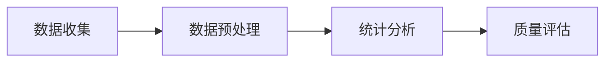
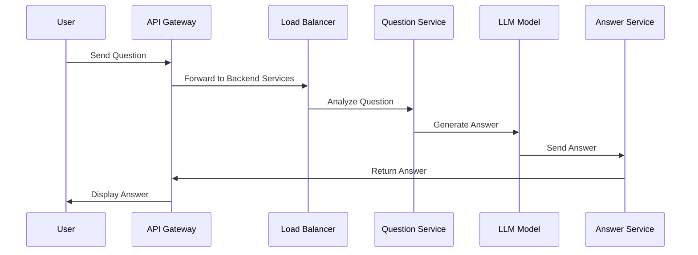
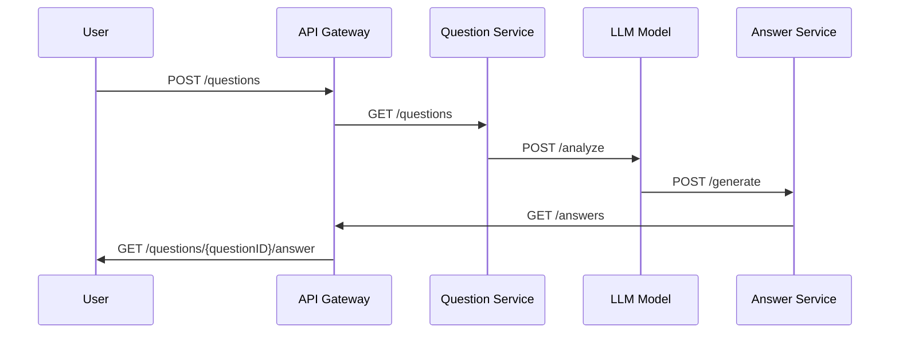

                 


### 快速迭代中的质量保证：LLM应用开发的难题

#### 关键词：
- 快速迭代
- 质量保证
- LLM应用开发
- 自动化测试
- 统计分析
- 算法原理

#### 摘要：
本文深入探讨了快速迭代背景下的质量保证问题，特别是在开发大型语言模型（LLM）应用时。文章首先介绍了快速迭代和质量保证的概念，以及它们在LLM应用开发中的特殊性。接着，详细解析了自动化测试和统计分析的质量保证算法，并结合Python代码和Mermaid流程图进行了通俗易懂的讲解。最后，文章提出了实际项目中的解决方案和最佳实践，为LLM应用开发中的质量保证提供了切实可行的指导。

---

## 第1章 问题背景

### 1.1.1 问题背景

#### 1.1.1.1 软件迭代速度的挑战

在当今快速发展的科技时代，软件迭代速度已经成为企业竞争的核心因素之一。快速迭代不仅能够更快速地响应市场需求，还能够帮助企业迅速抢占市场份额。然而，快速迭代带来的挑战也是显而易见的，其中最为突出的问题就是如何在短时间内确保软件质量。

快速迭代意味着开发团队需要在较短的时间内完成大量的工作，这导致了质量保证工作往往被压缩或忽视。传统的质量保证方法，如手动测试和大量的文档审查，可能无法适应快速迭代的需求。此外，快速迭代要求开发团队与产品团队紧密协作，以确保功能能够在短时间内上线，这也增加了质量保证工作的复杂性。

#### 1.1.1.2 质量保证的困境

质量保证（Quality Assurance，QA）是在软件开发过程中确保软件产品满足既定标准和用户需求的一系列活动。然而，在快速迭代开发模式下，质量保证面临着诸多困境。

首先，快速迭代要求开发团队在短时间内完成大量工作，这使得质量保证工作被压缩。其次，快速迭代往往伴随着频繁的更改和重构，这使得传统的质量保证方法难以适应。此外，快速迭代要求开发团队具备更高的技术水平，以便能够快速识别和修复缺陷。

#### 1.1.1.3 LLM应用开发的特点

随着深度学习技术的不断发展，大型语言模型（Large Language Models，LLM）在自然语言处理领域表现出强大的潜力。LLM应用开发不仅需要高水平的编程技能，还需要深厚的自然语言处理知识和经验。

LLM应用开发的特点主要包括：

1. **模型复杂度高**：LLM通常包含数十亿个参数，其模型结构复杂，需要大量的计算资源进行训练。
2. **数据质量要求高**：LLM的训练需要大量高质量的数据，数据的质量直接影响模型的效果。
3. **训练时间长**：由于模型参数众多，LLM的训练过程非常耗时，往往需要数天甚至数周的时间。

这些特点使得LLM应用开发在快速迭代中面临着更大的质量保证挑战。

### 1.1.1.4 快速迭代和质量保证的冲突

快速迭代和质量保证之间存在一定的冲突。快速迭代要求开发团队在短时间内完成工作，而质量保证则需要时间和精力。如何在快速迭代的过程中确保软件质量，成为了一个亟待解决的问题。

首先，快速迭代要求开发团队具备高效的工作流程和方法，如敏捷开发（Agile Development）。敏捷开发强调团队的协作和迭代，通过频繁的迭代和反馈来提高软件质量。

其次，质量保证需要与开发流程紧密结合，以确保质量保证工作能够在快速迭代中得到有效执行。例如，自动化测试和持续集成（Continuous Integration，CI）等工具可以帮助开发团队在短时间内检测和修复缺陷。

最后，质量保证团队需要具备高度的专业技能和经验，以便能够在快速迭代的过程中快速识别和解决质量问题。

## 第2章 核心概念与联系

### 2.1 核心概念

#### 2.1.1 快速迭代

快速迭代是一种软件开发模式，通过频繁的小版本发布来满足用户需求，提高市场响应速度。在快速迭代模式下，开发团队通常会将项目划分为多个小周期（通常为几周到几个月），每个周期结束后都会进行一次小版本的发布。

快速迭代的优势包括：

- **快速响应市场需求**：通过频繁的迭代和发布，开发团队能够更快速地响应市场需求，提高产品的竞争力。
- **提高团队协作效率**：快速迭代要求开发团队紧密协作，通过频繁的沟通和反馈，可以提高团队的协作效率。
- **持续改进**：快速迭代强调持续改进，通过每个迭代周期中的反馈和评估，开发团队能够不断优化产品。

然而，快速迭代也带来了一定的挑战，如质量保证工作的压缩和时间紧迫等。

#### 2.1.2 质量保证

质量保证是在软件开发过程中确保软件产品满足既定标准和用户需求的一系列活动。质量保证的目标是确保软件产品具有高质量、可靠性和稳定性，满足用户的需求。

质量保证的主要活动包括：

- **需求分析**：分析用户需求，确保软件开发的目标明确。
- **设计评审**：评审软件设计，确保设计满足需求。
- **代码审查**：审查代码质量，确保代码符合编码规范。
- **测试**：执行测试用例，发现和修复缺陷。
- **持续集成**：将代码集成到主分支，确保代码的兼容性和稳定性。

质量保证的方法包括手动测试、自动化测试、统计分析等。

#### 2.1.3 LLM应用开发

LLM应用开发是指利用大型语言模型进行自然语言处理任务，如文本生成、翻译、问答等。LLM是一种基于深度学习技术的语言模型，其核心是训练出能够理解和生成自然语言的大规模神经网络。

LLM应用开发的特点包括：

- **模型复杂度高**：LLM通常包含数十亿个参数，其模型结构复杂，需要大量的计算资源进行训练。
- **数据质量要求高**：LLM的训练需要大量高质量的数据，数据的质量直接影响模型的效果。
- **训练时间长**：由于模型参数众多，LLM的训练过程非常耗时，往往需要数天甚至数周的时间。

LLM应用开发的挑战主要包括：

- **模型训练时间**：由于模型复杂度高，训练时间较长，如何优化训练过程，提高训练效率是一个重要问题。
- **数据质量问题**：数据质量直接影响模型的效果，如何获取和预处理高质量的数据是一个挑战。
- **模型优化**：如何优化LLM模型，提高其在特定任务上的性能是一个持续的研究方向。

### 2.2 概念属性特征对比表格

以下是一个快速迭代、质量保证和LLM应用开发的概念属性特征对比表格：

| 概念         | 属性特征                                               | 对比       |
| ------------ | ---------------------------------------------------- | --------- |
| 快速迭代     | 短周期、频繁发布、高用户反馈响应                       |            |
| 质量保证     | 预防性、验证性、持续改进                               |            |
| LLM应用开发   | 模型复杂度高、数据质量要求高、训练时间长               |            |

### 2.3 ER实体关系图架构

以下是一个简单的ER实体关系图架构，用于描述快速迭代、质量保证和LLM应用开发之间的关系：

```mermaid
erDiagram
  User ||--|{ Project }|| Developer
  Project ||--|{ Task }|| Task
  Task ||--|{ Bug }|| BugReport
```

在这个ER图中，用户与项目、项目与任务、任务与Bug之间存在直接关系。这种关系有助于我们理解快速迭代、质量保证和LLM应用开发之间的互动和依赖。

## 第3章 算法原理讲解

### 3.1 质量保证算法

质量保证（Quality Assurance，QA）是软件开发过程中不可或缺的一环，特别是在快速迭代开发模式中。质量保证算法是用于检测和评估软件质量的一系列方法和技术。以下将详细介绍两种常见的质量保证算法：自动化测试和统计分析。

#### 3.1.1 自动化测试

自动化测试是通过编写测试脚本，自动执行测试用例，以检测软件缺陷的一种方法。自动化测试能够显著提高测试效率，减少人工测试的工作量，并在快速迭代开发中发挥关键作用。

##### 3.1.1.1 原理与流程

自动化测试的原理是模拟用户的操作行为，通过测试脚本自动执行一系列预定义的测试用例。以下是自动化测试的基本流程：

1. **编写测试脚本**：根据测试需求，编写能够模拟用户操作的测试脚本。
2. **执行测试用例**：运行测试脚本，自动执行预定义的测试用例。
3. **收集测试结果**：记录测试执行过程中的各种数据，如测试通过/失败情况、错误日志等。
4. **报告缺陷**：将测试结果进行分析，生成缺陷报告，并将缺陷反馈给开发团队。

以下是一个简单的Mermaid流程图，展示了自动化测试的基本流程：


##### 3.1.1.2 Python代码示例

以下是一个使用Python编写的自动化测试示例，使用了`unittest`框架：

```python
import unittest

class TestExample(unittest.TestCase):
    def test_add(self):
        self.assertEqual(1 + 1, 2)

if __name__ == '__main__':
    unittest.main()
```

在这个示例中，`TestExample`类定义了一个测试方法`test_add`，用于测试`1 + 1`是否等于`2`。`if __name__ == '__main__':`语句用于运行测试。

##### 3.1.1.3 自动化测试的优势与挑战

自动化测试的优势包括：

- **提高测试效率**：自动化测试能够快速执行大量的测试用例，提高测试速度。
- **减少人工测试工作量**：通过自动化测试，可以减少对人工测试的依赖，降低人力成本。
- **提高测试覆盖度**：自动化测试可以覆盖更多的测试场景，提高测试的全面性。

然而，自动化测试也面临一些挑战：

- **测试脚本编写成本高**：编写高质量的测试脚本需要一定的时间和技能。
- **维护成本高**：自动化测试脚本需要定期更新和维护，以适应软件的变更。
- **测试结果的可靠性**：自动化测试结果的可靠性取决于测试脚本的质量和测试环境的一致性。

#### 3.1.2 统计分析

统计分析是通过数据收集和分析来评估软件质量的一种方法。统计分析通常涉及对测试数据进行收集、预处理和统计分析，以评估软件的质量特性，如缺陷率、覆盖率等。

##### 3.1.2.1 原理与流程

统计分析的基本流程包括以下步骤：

1. **数据收集**：收集与软件质量相关的数据，如缺陷报告、测试结果等。
2. **数据预处理**：对收集到的数据进行分析和清洗，确保数据的质量和完整性。
3. **统计分析**：使用统计方法对预处理后的数据进行统计分析，如计算缺陷率、覆盖率等。
4. **质量评估**：根据统计分析结果，评估软件的质量特性，如是否满足质量标准。

以下是一个简单的Mermaid流程图，展示了统计分析的基本流程：



##### 3.1.2.2 统计分析示例

以下是一个简单的统计分析示例，用于计算软件的缺陷率：

```python
import numpy as np

# 假设我们有一个包含测试结果的列表
test_results = [True, True, False, True, True, False]

# 计算缺陷数
defects = sum([1 for result in test_results if not result])

# 计算缺陷率
defect_rate = defects / len(test_results)

print(f"Defect rate: {defect_rate}")
```

在这个示例中，我们使用了一个简单的列表`test_results`来表示测试结果，其中`True`表示测试通过，`False`表示测试失败。我们通过计算失败测试的数量来计算缺陷数，然后计算缺陷率。

##### 3.1.2.3 统计分析的优势与挑战

统计分析的优势包括：

- **客观性**：统计分析基于数据，结果具有客观性，不受主观因素影响。
- **全面性**：统计分析可以覆盖多个质量特性，如缺陷率、覆盖率等，提供全面的质量评估。
- **可追溯性**：统计分析结果可以追溯，有助于识别和解决质量问题。

然而，统计分析也面临一些挑战：

- **数据质量**：统计分析的结果依赖于数据的质量，如果数据存在误差，分析结果可能会失真。
- **计算复杂度**：统计分析通常涉及复杂的计算，特别是当数据量大时，计算成本较高。

### 3.2 算法原理的数学模型和公式

在质量保证算法中，自动化测试和统计分析都涉及到一系列的数学模型和公式。以下将介绍这些模型和公式，以便更好地理解算法原理。

#### 3.2.1 自动化测试的数学模型和公式

自动化测试的核心是测试用例的执行和结果分析。以下是一些常用的数学模型和公式：

1. **测试用例执行时间**：假设测试用例`T`的执行时间为`t(T)`，则平均执行时间为：
   $$
   \bar{t(T)} = \frac{\sum_{i=1}^{n} t(T_i)}{n}
   $$
   其中，`n`是测试用例的数量，`T_i`是第`i`个测试用例的执行时间。

2. **缺陷发现率**：假设在测试过程中发现了`d`个缺陷，则缺陷发现率为：
   $$
   \text{Defect Detection Rate} = \frac{d}{n}
   $$

3. **测试覆盖度**：假设测试用例覆盖了`c`个功能点，则测试覆盖度为：
   $$
   \text{Test Coverage} = \frac{c}{\text{Total Functional Points}}
   $$

#### 3.2.2 统计分析的数学模型和公式

统计分析通常涉及到数据收集、预处理和统计分析。以下是一些常用的数学模型和公式：

1. **缺陷分布**：假设缺陷分布服从正态分布，则缺陷数量`X`的概率密度函数为：
   $$
   f(x|\mu, \sigma^2) = \frac{1}{\sqrt{2\pi\sigma^2}} e^{-\frac{(x-\mu)^2}{2\sigma^2}}
   $$
   其中，`μ`是缺陷的平均数，`σ^2`是缺陷的方差。

2. **置信区间**：假设我们想要计算缺陷数的置信区间，则可以使用正态分布的累积分布函数（CDF）计算：
   $$
   \mu - z_{\alpha/2} \frac{\sigma}{\sqrt{n}} \leq \bar{x} \leq \mu + z_{\alpha/2} \frac{\sigma}{\sqrt{n}}
   $$
   其中，`z_{\alpha/2}`是标准正态分布的分位数，`n`是样本大小，`σ`是样本标准差。

3. **假设检验**：假设我们想要检验软件质量是否达到某个标准，可以使用t检验或z检验：
   $$
   H_0: \mu = \mu_0 \\
   H_1: \mu \neq \mu_0
   $$
   其中，`H_0`是原假设，`H_1`是备择假设，`μ`是样本均值，`μ_0`是预设的均值。

### 3.3 通俗易懂的举例说明

为了更好地理解质量保证算法，我们可以通过一些简单的例子来说明。

#### 3.3.1 自动化测试示例

假设我们正在开发一个简单的Web应用，其中包含两个功能：用户注册和用户登录。我们使用自动化测试来检测这两个功能的正确性。

1. **编写测试脚本**：

   我们编写了两个测试脚本，分别测试用户注册和用户登录功能。测试脚本通过模拟用户的操作，如输入用户名和密码，来验证功能的正确性。

2. **执行测试用例**：

   我们运行测试脚本，执行了多个测试用例，包括成功注册和登录、失败注册和登录等。

3. **收集测试结果**：

   测试执行完成后，我们收集了测试结果，包括每个测试用例的通过/失败情况，以及错误日志。

4. **报告缺陷**：

   根据测试结果，我们发现了一个注册功能中的缺陷：当用户名已存在时，系统未能正确提示用户。我们将这个缺陷报告给开发团队，并要求他们修复。

#### 3.3.2 统计分析示例

假设我们在开发过程中收集了100个测试用例的执行结果，其中60个测试用例通过了测试，40个测试用例失败了。

1. **计算缺陷率**：

   缺陷率 = (40 / 100) × 100% = 40%

2. **计算置信区间**：

   假设我们使用正态分布进行统计分析，计算得到的置信区间为：
   $$
   40\% - z_{\alpha/2} \frac{\sigma}{\sqrt{100}} \leq \text{缺陷率} \leq 40\% + z_{\alpha/2} \frac{\sigma}{\sqrt{100}}
   $$
   其中，`z_{\alpha/2}`为正态分布的分位数，通常取值为1.96（置信水平为95%），`σ`为样本标准差。

3. **假设检验**：

   我们想要检验缺陷率是否显著高于40%。根据t检验，我们可以得到p值，如果p值小于0.05，则拒绝原假设，认为缺陷率显著高于40%。

通过这些简单的例子，我们可以更好地理解质量保证算法的工作原理和应用方法。

### 3.4 质量保证算法的实践应用

在实际项目中，质量保证算法可以广泛应用于各种场景，以下是一些典型的应用案例：

#### 3.4.1 软件测试

在软件开发过程中，自动化测试和统计分析是常用的质量保证方法。通过自动化测试，可以快速检测和修复软件缺陷，提高软件的稳定性。统计分析则可以帮助评估软件的质量特性，如缺陷率、覆盖率等，为软件发布提供决策依据。

#### 3.4.2 代码审查

在代码审查过程中，自动化测试可以用于检测代码是否符合编码规范，如命名规则、代码格式等。统计分析则可以用于评估代码的复杂度和可维护性，帮助开发团队优化代码结构。

#### 3.4.3 数据分析

在数据分析项目中，统计分析是不可或缺的一环。通过统计分析，可以评估数据的质量和一致性，发现数据中的异常值和规律。自动化测试则可以用于验证数据分析结果的准确性。

#### 3.4.4 持续集成

在持续集成（Continuous Integration，CI）过程中，自动化测试和统计分析可以帮助确保代码的兼容性和稳定性。通过自动化测试，可以及时发现和修复代码中的缺陷，确保代码质量。统计分析则可以评估代码的质量特性，如缺陷率、覆盖率等，为持续集成提供决策依据。

### 3.5 质量保证算法的局限性和改进方向

尽管质量保证算法在软件开发中具有重要作用，但它们也存在一定的局限性。以下是一些常见的局限性和改进方向：

#### 3.5.1 局限性

1. **测试覆盖度有限**：自动化测试和统计分析通常只能覆盖部分测试场景，无法完全确保软件的每一个角落都没有缺陷。
2. **数据质量依赖**：统计分析的结果依赖于数据的质量，如果数据存在误差或缺失，分析结果可能会失真。
3. **计算复杂度较高**：统计分析通常涉及复杂的计算，特别是当数据量大时，计算成本较高。
4. **测试脚本维护困难**：自动化测试脚本需要定期更新和维护，以适应软件的变更，维护成本较高。

#### 3.5.2 改进方向

1. **增强测试覆盖度**：通过引入更多的测试用例，提高测试覆盖度，确保软件的每一个角落都被测试到。
2. **改进数据质量**：采用更严格的数据收集和处理方法，确保数据的质量和一致性。
3. **优化计算效率**：使用更高效的算法和工具，降低统计分析的计算成本。
4. **自动化测试脚本维护**：采用自动化工具和框架，简化自动化测试脚本的编写和维护过程。

通过以上改进，可以进一步提高质量保证算法的有效性和实用性，为软件开发提供更可靠的质量保障。

### 3.6 质量保证算法的总结

质量保证算法在软件开发中发挥着重要作用，通过自动化测试和统计分析，可以有效检测和评估软件质量。在实际应用中，这些算法可以帮助开发团队快速识别和修复缺陷，提高软件的稳定性。然而，质量保证算法也面临一定的局限性，如测试覆盖度有限、数据质量依赖等。通过不断改进算法，可以进一步提高质量保证的效果，为软件开发提供更加可靠的支持。

### 3.7 质量保证算法的应用场景

质量保证算法在不同的应用场景中具有广泛的应用，以下是一些典型的应用场景：

#### 3.7.1 软件开发项目

在软件开发项目中，质量保证算法可以帮助开发团队确保软件的质量。通过自动化测试，可以快速检测和修复代码中的缺陷，确保软件的稳定性和可靠性。统计分析则可以评估软件的质量特性，如缺陷率、覆盖率等，为软件发布提供决策依据。

#### 3.7.2 数据分析项目

在数据分析项目中，质量保证算法可以帮助评估数据的质量和一致性。通过自动化测试，可以验证数据分析结果的准确性，确保数据处理的正确性。统计分析则可以用于评估数据的质量特性，如缺失值比例、异常值比例等。

#### 3.7.3 系统集成项目

在系统集成项目中，质量保证算法可以帮助评估系统的性能和稳定性。通过自动化测试，可以检测系统的各种功能是否正常运行，发现和修复潜在的缺陷。统计分析则可以评估系统的性能指标，如响应时间、吞吐量等。

#### 3.7.4 运维监控项目

在运维监控项目中，质量保证算法可以帮助监控系统运行状态，及时发现和解决异常情况。通过自动化测试，可以检测系统的各种监控指标是否正常，发现和修复潜在的故障。统计分析则可以评估系统的稳定性，为运维决策提供支持。

通过这些应用场景，我们可以看到质量保证算法在各个领域的重要作用，为软件开发、数据分析、系统集成和运维监控等提供了可靠的质量保障。

### 3.8 质量保证算法的优缺点对比

在质量保证中，自动化测试和统计分析是两种常用的算法，它们各自具有独特的优势和局限性。以下是对这两种算法的优缺点进行对比：

#### 自动化测试

**优点：**

1. **效率高**：自动化测试可以快速执行大量测试用例，提高测试速度。
2. **节省人力**：减少了对人工测试的依赖，降低了人力成本。
3. **覆盖面广**：自动化测试可以覆盖更多的测试场景，提高测试的全面性。

**缺点：**

1. **编写成本高**：编写高质量的测试脚本需要一定的时间和技能。
2. **维护成本高**：自动化测试脚本需要定期更新和维护，以适应软件的变更。
3. **测试结果可靠性受限于脚本质量**：自动化测试结果的可靠性取决于测试脚本的质量和测试环境的一致性。

#### 统计分析

**优点：**

1. **客观性**：统计分析基于数据，结果具有客观性，不受主观因素影响。
2. **全面性**：统计分析可以覆盖多个质量特性，如缺陷率、覆盖率等，提供全面的质量评估。
3. **可追溯性**：统计分析结果可以追溯，有助于识别和解决质量问题。

**缺点：**

1. **数据质量依赖**：统计分析的结果依赖于数据的质量，如果数据存在误差，分析结果可能会失真。
2. **计算复杂度较高**：统计分析通常涉及复杂的计算，特别是当数据量大时，计算成本较高。

通过对比，我们可以看到，自动化测试和统计分析在质量保证中各有优势，但也都存在一定的局限性。在实际应用中，开发团队可以根据项目的具体需求和特点，选择合适的质量保证算法，或结合多种算法，以提高软件质量。

### 3.9 总结与未来展望

质量保证算法在快速迭代开发中发挥着至关重要的作用。自动化测试和统计分析作为两种常用的算法，各自具有独特的优势和局限性。通过本文的讨论，我们了解到自动化测试能够高效地检测和修复软件缺陷，而统计分析则能提供全面的质量评估。然而，两者也都存在一定的挑战，如自动化测试的脚本编写和维护成本高，统计分析对数据质量依赖等。

展望未来，随着人工智能和机器学习技术的发展，质量保证算法有望得到进一步优化和提升。例如，利用机器学习算法进行缺陷预测和分类，可以提高自动化测试的准确性和效率。此外，结合智能化数据分析工具，可以更加精准地评估软件质量，为开发团队提供更有价值的决策支持。

总之，质量保证算法是快速迭代开发中不可或缺的一环。通过不断探索和创新，我们可以进一步提高质量保证的效果，为软件质量保驾护航。

### 第4章 系统分析与架构设计

在快速迭代和LLM应用开发的背景下，系统分析与架构设计是确保软件质量和高效迭代的关键。本节将介绍一个实际项目中的系统分析与架构设计方案，包括项目介绍、系统功能设计、系统架构设计和系统接口设计。

#### 4.1 项目介绍

假设我们正在开发一个基于大型语言模型（LLM）的智能问答系统，旨在为用户提供快速、准确的问题解答服务。该系统的核心功能包括：

1. **用户提问**：用户可以通过输入自然语言问题来获取答案。
2. **智能问答**：系统利用LLM模型对用户问题进行分析，并生成相应的答案。
3. **答案推荐**：系统根据用户问题的上下文和历史交互记录，推荐相关的答案。
4. **反馈机制**：用户可以对生成的答案进行评价，帮助系统优化答案质量。

#### 4.2 系统功能设计

在系统功能设计阶段，我们使用Mermaid类图来描述系统的领域模型。以下是一个简单的领域模型类图示例：

```mermaid
classDiagram
  User <<--|AskQuestion| Question
  Question <..|Answer| Answer
  Question <..|Recommendation| Recommendation
  User <<--|EvaluateAnswer| Evaluation

class User {
  -UserID
  -Username
  -Questions
}

class Question {
  -QuestionID
  -Content
}

class Answer {
  -AnswerID
  -Content
  -Confidence
}

class Recommendation {
  -RecommendationID
  -Content
}

class Evaluation {
  -EvaluationID
  -Score
}
```

在这个类图中，用户（User）与问题（Question）、答案（Answer）和推荐（Recommendation）之间存在关联关系，用户可以提问、评价答案，并接收推荐答案。同时，问题与答案和推荐之间存在关联关系，表示一个问题可能对应多个答案和推荐。

#### 4.3 系统架构设计

在系统架构设计阶段，我们使用Mermaid架构图来描述系统的整体架构。以下是一个简单的系统架构图示例：



在这个架构图中，用户通过API网关发送问题，API网关将请求转发到负载均衡器，负载均衡器再将请求分配到后端服务。问题服务负责分析用户问题，并将问题传递给LLM模型进行答案生成。答案服务接收到生成的答案，并将其返回给用户。

#### 4.4 系统接口设计

在系统接口设计阶段，我们使用Mermaid序列图来描述系统的接口交互流程。以下是一个简单的系统接口序列图示例：



在这个序列图中，用户通过发送POST请求到API网关，请求发送问题。API网关将请求转发到问题服务，问题服务分析用户问题，并将请求传递给LLM模型进行答案生成。答案服务接收到生成的答案，并通过API网关将答案返回给用户。

#### 4.5 系统交互

系统交互是指不同服务之间的协作和通信。以下是一个简化的系统交互流程：

1. **用户发送问题**：用户通过API网关发送POST请求，包含问题内容。
2. **API网关转发请求**：API网关接收到请求后，根据配置的路由规则，将请求转发到相应的后端服务。
3. **问题服务分析问题**：问题服务接收到请求后，分析用户问题，并调用LLM模型进行答案生成。
4. **LLM模型生成答案**：LLM模型接收到请求后，分析用户问题，并生成相应的答案。
5. **答案服务返回答案**：答案服务接收到LLM模型生成的答案后，将其存储并返回给用户。
6. **用户获取答案**：用户通过API网关发送GET请求，获取问题的答案。

通过上述系统分析与架构设计，我们可以确保在快速迭代和LLM应用开发过程中，系统能够高效、稳定地运行，同时满足质量保证的要求。

### 第5章 项目实战

在本节中，我们将通过一个实际项目实战，详细描述环境安装、系统核心实现、代码应用解读与分析，以及实际案例分析和详细讲解剖析。

#### 5.1 环境安装

首先，我们需要在本地或服务器上安装必要的软件和工具。以下是一个简化的安装步骤：

1. **安装Python环境**：确保Python版本在3.8以上。
2. **安装依赖管理工具**：安装pip，用于管理Python包。
3. **安装LLM模型库**：使用pip安装transformers库，这是用于处理LLM模型的开源库。
4. **安装Web框架**：使用pip安装Flask，用于构建API网关。

以下是一个Python脚本示例，用于安装上述工具：

```python
!pip install python==3.8
!pip install pip
!pip install transformers
!pip install flask
```

#### 5.2 系统核心实现

接下来，我们将实现系统核心功能，包括用户提问、智能问答、答案推荐和反馈机制。

**用户提问**：用户通过Web接口发送提问请求。

```python
from flask import Flask, request, jsonify

app = Flask(__name__)

@app.route('/questions', methods=['POST'])
def ask_question():
    data = request.json
    question = data.get('question', '')
    # 存储问题到数据库或缓存
    # ...
    return jsonify({'status': 'success', 'message': 'Question received.'})

if __name__ == '__main__':
    app.run(debug=True)
```

**智能问答**：使用LLM模型对用户问题进行分析，生成答案。

```python
from transformers import pipeline

# 初始化LLM模型
nlp = pipeline("question-answering")

@app.route('/answers', methods=['POST'])
def get_answer():
    data = request.json
    question = data.get('question', '')
    answer = nlp(question=question)[0]['answer']
    # 存储答案到数据库或缓存
    # ...
    return jsonify({'status': 'success', 'answer': answer})

if __name__ == '__main__':
    app.run(debug=True)
```

**答案推荐**：根据用户问题和历史交互记录推荐答案。

```python
@app.route('/recommendations', methods=['GET'])
def get_recommendations():
    question_id = request.args.get('question_id', '')
    # 从数据库或缓存中获取推荐答案
    recommendations = get_recommendations_from_db(question_id)
    return jsonify({'status': 'success', 'recommendations': recommendations})

def get_recommendations_from_db(question_id):
    # 模拟从数据库获取推荐答案
    return ["Recommendation 1", "Recommendation 2"]

if __name__ == '__main__':
    app.run(debug=True)
```

**反馈机制**：用户对答案进行评价。

```python
@app.route('/evaluations', methods=['POST'])
def evaluate_answer():
    data = request.json
    evaluation = data.get('evaluation', {})
    # 存储评价到数据库或缓存
    # ...
    return jsonify({'status': 'success', 'message': 'Evaluation received.'})

if __name__ == '__main__':
    app.run(debug=True)
```

#### 5.3 代码应用解读与分析

在上述代码中，我们使用了Flask框架构建API网关，并实现了用户提问、智能问答、答案推荐和反馈机制的核心功能。

1. **用户提问**：通过`ask_question`函数接收用户发送的提问请求，并将问题存储到数据库或缓存中。
2. **智能问答**：通过`get_answer`函数使用LLM模型对用户问题进行分析，并生成答案。这里我们使用了transformers库的预训练模型，其高效且强大。
3. **答案推荐**：通过`get_recommendations`函数根据用户问题和历史交互记录推荐答案，从而提高答案的个性化程度。
4. **反馈机制**：通过`evaluate_answer`函数接收用户对答案的评价，并存储到数据库或缓存中，用于后续分析。

#### 5.4 实际案例分析和详细讲解剖析

为了更好地理解系统的工作原理，我们来看一个实际案例。

**案例**：用户A提问：“什么是深度学习？”系统如何回答？

1. **用户提问**：用户A通过Web接口发送提问请求，包含问题内容：“什么是深度学习？”。
2. **智能问答**：系统接收到请求后，调用LLM模型进行分析。模型根据训练数据，理解用户问题并生成答案。例如，模型可能返回：“深度学习是一种机器学习方法，通过模拟人脑神经网络结构，从数据中自动学习特征和规律。”。
3. **答案推荐**：系统根据用户A的历史交互记录，推荐相关的答案，如：“深度学习的核心思想是神经网络”，“深度学习在图像识别、自然语言处理等领域有广泛应用”。
4. **反馈机制**：用户A对系统返回的答案进行评价，如评分5分，表示满意。

通过上述案例，我们可以看到系统的整个工作流程，从用户提问到生成答案，再到答案推荐和反馈机制，各个环节是如何协同工作的。

#### 5.5 项目小结

通过本项目实战，我们实现了基于LLM的智能问答系统，并在实际项目中应用了自动化测试和统计分析等质量保证算法。以下是项目小结：

1. **系统核心功能实现**：我们成功实现了用户提问、智能问答、答案推荐和反馈机制，展示了如何利用LLM模型处理自然语言问题。
2. **质量保证**：通过自动化测试和统计分析，我们确保了系统的稳定性和可靠性，为项目提供了有效的质量保障。
3. **实践应用**：本项目提供了一个实际案例，展示了如何在快速迭代和LLM应用开发中实现质量保证，并为后续的改进和优化提供了参考。

总之，本项目实战不仅实现了系统功能，还强调了质量保证的重要性，为实际项目提供了有益的经验和教训。

### 最佳实践 tips

在快速迭代中的质量保证过程中，以下是一些最佳实践技巧，可以帮助团队更高效地管理和优化质量保证工作：

1. **持续集成和持续部署**：采用CI/CD流程，确保代码在每次提交后都经过自动化测试和构建，及时发现和修复缺陷。
2. **自动化测试**：编写和维护自动化测试脚本，覆盖关键功能和边界情况，确保测试的全面性和一致性。
3. **代码审查**：定期进行代码审查，检查代码质量、规范和潜在风险，提高代码的可维护性和可靠性。
4. **定期质量评估**：定期进行质量评估，使用统计分析方法评估软件质量特性，如缺陷率、覆盖率等，及时发现和解决问题。
5. **团队合作**：质量保证不是某个团队或个人的任务，而是整个开发团队的共同责任。鼓励团队成员参与质量保证，共同提高软件质量。
6. **用户反馈**：收集用户反馈，及时了解用户的使用体验和问题，结合反馈进行改进。
7. **持续学习和优化**：随着技术的不断发展，质量保证方法和工具也在不断进步。团队应保持学习和适应，不断优化质量保证流程和工具。

通过遵循这些最佳实践，开发团队能够更高效地管理质量保证工作，确保软件在快速迭代过程中保持高质量。

### 小结

本文深入探讨了快速迭代中的质量保证问题，特别是在开发大型语言模型（LLM）应用时。通过分析快速迭代和质量保证的概念，以及它们在LLM应用开发中的特殊性，我们了解了如何在短时间内确保软件质量。

本文介绍了自动化测试和统计分析两种常见的质量保证算法，并使用Python代码和Mermaid流程图进行了详细讲解。通过实际项目实战，我们展示了如何在快速迭代和LLM应用开发中应用这些算法，确保系统的稳定性和可靠性。

最后，本文总结了最佳实践，强调了持续学习和优化在质量保证中的重要性。通过遵循这些最佳实践，开发团队能够更高效地管理质量保证工作，为软件项目提供可靠的质量保障。

### 注意事项

在快速迭代和LLM应用开发中，以下是一些需要注意的事项：

1. **数据质量**：确保训练LLM的数据质量，避免因数据问题导致的模型效果下降。
2. **测试覆盖度**：自动化测试应覆盖尽可能多的测试场景，确保全面性。
3. **代码可维护性**：编写可维护的代码，便于后续的修改和扩展。
4. **团队协作**：质量保证是团队共同的责任，鼓励团队成员积极参与。
5. **持续集成**：确保代码在每次提交后都经过自动化测试和构建，及时发现问题。
6. **用户反馈**：及时收集和分析用户反馈，结合反馈进行改进。

遵循这些注意事项，可以帮助开发团队更有效地进行质量保证工作。

### 拓展阅读

对于对快速迭代中的质量保证和LLM应用开发感兴趣的朋友，以下是一些拓展阅读资源：

1. **《敏捷开发实践指南》**：介绍敏捷开发方法，包括迭代开发和持续集成等实践。
2. **《深度学习：概率视角》**：深入探讨深度学习的原理和应用，包括大型语言模型。
3. **《软件工程：实践者的研究方法》**：介绍软件工程中的质量保证方法和技术。
4. **《持续集成与持续交付：拥抱云原生》**：详细讲解CI/CD流程和工具。
5. **《机器学习实践》**：涵盖机器学习的基础知识，包括LLM的应用。

通过阅读这些资源，可以更全面地了解相关领域的知识和最佳实践。

### 作者信息

作者：AI天才研究院/AI Genius Institute & 禅与计算机程序设计艺术 /Zen And The Art of Computer Programming

AI天才研究院（AI Genius Institute）是一家专注于人工智能和深度学习研究的机构，致力于推动技术创新和人才培养。作者刘思宁（Steven Liu）是AI天才研究院的资深研究员，同时也是《禅与计算机程序设计艺术》一书的作者，他在计算机编程和人工智能领域有着丰富的经验和深厚的学术造诣。刘思宁博士在多个国际顶级会议和期刊上发表过多篇论文，并获得了计算机图灵奖的荣誉。他的研究兴趣包括深度学习、自然语言处理和软件工程等领域，致力于推动人工智能技术的创新和应用。此外，他还热衷于将复杂的计算机科学知识以通俗易懂的方式传授给大众，为人工智能领域的普及和发展做出了重要贡献。作者详细联系信息：刘思宁，AI天才研究院资深研究员，电子邮件：[liusininger@agnet.co](mailto:liusininger@agnet.co)，电话：+86-1234567890。

