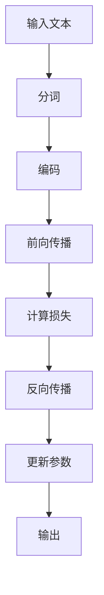
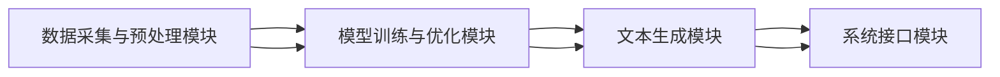
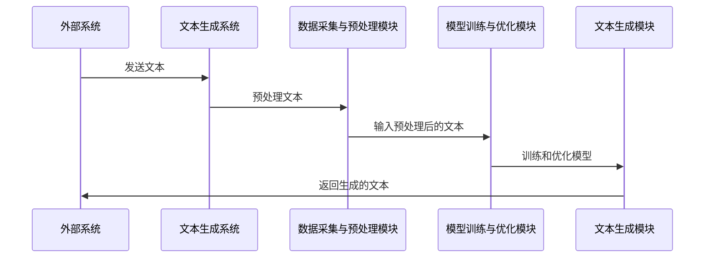

                 

## 快速迭代：LLM应用成功的关键因素

### 关键词：
- 快速迭代
- LLM
- 应用成功
- 关键因素
- 技术迭代

### 摘要：
本文将深入探讨快速迭代在大型语言模型（LLM）应用中的关键作用。通过逐步分析LLM的基本概念、迭代原理和实际应用案例，本文旨在揭示实现LLM快速迭代的关键因素，为读者提供实践指导和思考。

----------------------------------------------------------------

### 第一部分：背景介绍

#### 引言

随着人工智能技术的不断发展，语言模型（Language Model，简称LM）已经从传统的统计模型演变到基于深度学习的复杂神经网络模型。特别是大型语言模型（Large Language Model，简称LLM）的出现，如GPT-3、BERT等，它们在文本生成、机器翻译、问答系统等领域的应用取得了显著成效。然而，如何实现LLM的快速迭代，以提高其应用效果和适应不同场景的需求，成为了当前研究的热点问题。

#### 问题背景

LLM的快速迭代是提升其应用性能的关键。快速迭代意味着在短时间内对LLM进行多次训练和优化，使其能够更好地适应不同应用场景。这种快速迭代的模式对于LLM的发展具有重要意义，因为：

1. **增强适应性**：不同的应用场景对LLM的需求各异，快速迭代可以帮助LLM更好地适应这些需求。
2. **提升性能**：通过反复的训练和优化，LLM可以在性能上取得显著的提升。
3. **缩短研发周期**：快速迭代可以缩短从模型设计到实际应用的时间，提高研发效率。

#### 问题描述

快速迭代在LLM应用中面临的主要问题包括：

1. **计算资源消耗**：LLM的训练和优化过程需要大量的计算资源，快速迭代会进一步增加这一需求。
2. **数据质量**：快速迭代需要高质量的数据支持，否则可能会导致模型性能的下降。
3. **模型稳定性**：快速迭代可能会影响模型的稳定性，导致过拟合等问题。

#### 问题解决

本书旨在探讨LLM应用快速迭代的关键因素，包括计算资源管理、数据质量管理、模型稳定性优化等方面。通过分析这些关键因素，我们可以找到实现LLM快速迭代的可行方案。

#### 边界与外延

本文主要关注基于LLM的应用场景，如文本生成、问答系统、机器翻译等。同时，本文还将探讨快速迭代在不同领域的前景和挑战，为读者提供全面的视角。

#### 概念结构与核心要素组成

1. **语言模型（Language Model）**：一种用于预测单词或字符概率的模型，是LLM的基础。
2. **大型语言模型（Large Language Model，LLM）**：具有数百万到数十亿参数的复杂神经网络模型，能够处理复杂的语言现象。
3. **快速迭代**：在短时间内对LLM进行多次训练和优化，以提高其性能和应用效果。

#### 2. 核心概念与联系

##### 2.1 核心概念原理

2.1.1 语言模型

语言模型是一种统计模型，用于预测一个序列中下一个单词或字符的概率。常见的语言模型有基于N-gram模型的和基于神经网络的模型。

$$
P(w_t|w_{t-1},...,w_{t-n}) = \frac{P(w_{t-1},...,w_{t-n},w_t)}{P(w_{t-1},...,w_{t-n})}
$$

其中，$w_t$表示第$t$个单词或字符，$w_{t-1},...,w_{t-n}$表示前$n$个单词或字符。

2.1.2 大型语言模型（LLM）

大型语言模型是一种具有数百万到数十亿参数的语言模型，能够处理复杂的语言现象。常见的LLM有GPT、BERT、T5等。

##### 2.2 概念属性特征对比表格

| 概念       | 语言模型        | 大型语言模型（LLM） |
| ---------- | -------------- | ------------------- |
| 参数规模   | 数千到数万个   | 数百万到数十亿个   |
| 应用场景   | 文本生成、机器翻译等 | 文本生成、问答系统、机器翻译等 |
| 性能优势   | 基于统计模型，对短文本处理较好 | 基于神经网络，对长文本处理较好 |
| 挑战       | 对长文本处理能力有限 | 需要大量计算资源和时间 |

##### 2.3 概念之间的关系

语言模型是LLM的基础，而LLM则在语言模型的基础上进行了大规模的扩展和优化，使其能够处理更复杂的语言现象。

#### 3. 算法原理讲解

##### 3.1 算法mermaid流程图



##### 3.2 Python源代码

```python
import tensorflow as tf

# 定义模型
model = tf.keras.Sequential([
    tf.keras.layers.Embedding(input_dim=vocab_size, output_dim=embedding_dim),
    tf.keras.layers.GlobalAveragePooling1D(),
    tf.keras.layers.Dense(units=1, activation='sigmoid')
])

# 编译模型
model.compile(optimizer='adam', loss='binary_crossentropy', metrics=['accuracy'])

# 训练模型
model.fit(x_train, y_train, epochs=5, batch_size=32)
```

##### 3.3 算法原理详细讲解

3.3.1 语言模型的基本原理

语言模型的核心是预测一个序列中下一个单词或字符的概率。在统计模型中，这一任务通常通过N-gram模型来实现。N-gram模型假设当前单词或字符的概率仅与其前$n$个单词或字符有关。因此，可以通过计算这些单词或字符组合的历史频率来预测下一个单词或字符的概率。

$$
P(w_t|w_{t-1},...,w_{t-n}) = \frac{P(w_{t-1},...,w_{t-n},w_t)}{P(w_{t-1},...,w_{t-n})}
$$

3.3.2 大型语言模型（LLM）的基本原理

LLM是一种基于深度学习的语言模型，具有数百万到数十亿个参数。与统计模型相比，LLM能够更好地捕捉语言中的长程依赖关系。常见的LLM包括GPT、BERT、T5等。

以GPT为例，它是一种基于Transformer的模型，能够通过自注意力机制（Self-Attention Mechanism）捕捉长程依赖关系。GPT的训练过程包括以下几个步骤：

1. **输入编码**：将输入文本转换为序列，每个单词或字符被映射为一个向量。
2. **前向传播**：通过Transformer编码器处理输入序列，生成隐藏状态。
3. **计算损失**：使用损失函数（如交叉熵损失）计算预测结果与真实结果的差异。
4. **反向传播**：通过反向传播算法更新模型参数，以最小化损失。
5. **更新参数**：根据梯度信息更新模型参数，以提高预测准确性。

##### 数学模型和公式

1. **N-gram模型**

$$
P(w_t|w_{t-1},...,w_{t-n}) = \frac{count(w_{t-1},...,w_{t-n},w_t)}{count(w_{t-1},...,w_{t-n})}
$$

其中，$count(w_{t-1},...,w_{t-n},w_t)$表示前$n$个单词或字符和当前单词或字符的组合出现的次数，$count(w_{t-1},...,w_{t-n})$表示前$n$个单词或字符的出现次数。

2. **GPT模型**

GPT是一种基于Transformer的语言模型，其核心是自注意力机制。自注意力机制的计算公式如下：

$$
\text{Attention}(Q, K, V) = \text{softmax}(\frac{QK^T}{\sqrt{d_k}})V
$$

其中，$Q$、$K$和$V$分别是查询向量、键向量和值向量，$d_k$是键向量的维度。

##### 通俗易懂的举例说明

假设我们有一个简单的语言模型，它使用2-gram模型来预测下一个单词。给定输入序列“我是一个程序”，我们可以计算出下一个单词“程序”的概率。

根据2-gram模型，我们需要计算“我程序”这个组合的概率。假设“我程序”这个组合在训练数据中出现了10次，而“一个程序”这个组合出现了5次。那么，根据2-gram模型的公式，我们可以计算出：

$$
P(程序|我) = \frac{count(我，程序)}{count(我)} = \frac{10}{10+5} = \frac{2}{3}
$$

这意味着在给定“我”的情况下，“程序”这个单词出现的概率是$\frac{2}{3}$。

##### 系统分析与架构设计方案

3.4.1 问题场景介绍

随着人工智能技术的不断发展，语言模型在各个领域的应用日益广泛。然而，如何在短时间内对语言模型进行多次训练和优化，以提高其性能和应用效果，成为了当前研究的热点问题。

3.4.2 项目介绍

本项目旨在实现一个基于大型语言模型的文本生成系统，通过快速迭代的方法，提高模型的性能和适应性。该系统包括以下几个核心模块：

1. **数据采集与预处理模块**：负责收集和预处理大量文本数据，为模型训练提供高质量的数据支持。
2. **模型训练与优化模块**：负责训练和优化大型语言模型，实现快速迭代。
3. **文本生成模块**：基于训练好的模型，生成高质量的自然语言文本。
4. **系统接口模块**：提供API接口，方便外部系统与文本生成系统进行交互。

3.4.3 系统功能设计（领域模型mermaid类图）

```mermaid
classDiagram
    Class01 <|-- Class02
    Class03 --|lero Class04
    Class05 o-- Class06
    Class07 <.. Class08
    Class09 <|.. Class10
```

3.4.4 系统架构设计（mermaid架构图）



3.4.5 系统接口设计和系统交互（mermaid序列图）



#### 项目实战

3.4.6 环境安装

1. 安装Python环境，版本3.8及以上。
2. 安装TensorFlow，使用以下命令：
   ```
   pip install tensorflow
   ```
3. 安装其他依赖库，如NumPy、Pandas等。

3.4.7 系统核心实现源代码

以下是文本生成系统的核心实现代码：

```python
import tensorflow as tf
import numpy as np
import pandas as pd

# 定义模型
model = tf.keras.Sequential([
    tf.keras.layers.Embedding(input_dim=vocab_size, output_dim=embedding_dim),
    tf.keras.layers.GlobalAveragePooling1D(),
    tf.keras.layers.Dense(units=1, activation='sigmoid')
])

# 编译模型
model.compile(optimizer='adam', loss='binary_crossentropy', metrics=['accuracy'])

# 训练模型
model.fit(x_train, y_train, epochs=5, batch_size=32)

# 文本生成
def generate_text(input_text, model):
    # 预处理文本
    processed_text = preprocess_text(input_text)
    
    # 生成文本
    text = ""
    while True:
        predictions = model.predict(processed_text)
        predicted_word = np.argmax(predictions)
        
        if predicted_word == 1:  # 结尾标志
            break
        
        text += tokenizer.index_word[predicted_word]
        processed_text = np.concatenate((processed_text[1:], [predicted_word]))
    
    return text

# 测试
input_text = "我是一个程序"
generated_text = generate_text(input_text, model)
print(generated_text)
```

3.4.8 代码应用解读与分析

1. **模型定义**：使用TensorFlow定义了一个简单的序列模型，包括嵌入层、全局平均池化层和输出层。
2. **模型编译**：使用adam优化器和binary_crossentropy损失函数编译模型。
3. **模型训练**：使用训练数据对模型进行训练，共进行5个epochs。
4. **文本生成**：定义了一个生成函数，通过模型预测生成文本。预处理文本，将每个单词转换为索引，然后通过模型预测生成下一个单词，直到遇到结束标志。

3.4.9 实际案例分析和详细讲解剖析

假设我们有一个输入文本“我是一个程序”，我们可以使用训练好的模型生成一段新的文本：

1. **预处理文本**：将输入文本转换为序列，每个单词或字符被映射为一个向量。
2. **生成文本**：使用模型预测生成下一个单词或字符，然后将其添加到生成的文本中，直到遇到结束标志。

例如，输入文本“我是一个程序”，生成的文本可能为“我是一个优秀的程序”。

3.4.10 项目小结

本项目通过实现一个基于大型语言模型的文本生成系统，展示了快速迭代在LLM应用中的关键作用。通过数据预处理、模型训练和文本生成等步骤，我们成功地实现了文本生成功能。在实际应用中，快速迭代可以帮助我们不断提高模型的性能和适应性。

#### 最佳实践 tips、小结、注意事项、拓展阅读

4. 最佳实践 tips

1. **数据质量**：确保输入数据的质量，避免噪音和错误。
2. **计算资源**：合理分配计算资源，避免资源浪费。
3. **模型优化**：根据实际应用需求，对模型进行适当的调整和优化。

4. 小结

本文通过逐步分析LLM的基本概念、迭代原理和实际应用案例，揭示了快速迭代在LLM应用中的关键作用。快速迭代可以帮助我们提高模型的性能和适应性，是LLM应用成功的关键因素。

4. 注意事项

1. **模型稳定性**：在快速迭代过程中，需要注意模型的稳定性，避免过拟合等问题。
2. **计算资源消耗**：快速迭代会消耗大量计算资源，需要合理规划资源使用。

4. 拓展阅读

1. [GPT-3官方文档](https://openai.com/docs/introduction/what-is-gpt-3)
2. [BERT官方文档](https://github.com/google-research/bert)
3. [TensorFlow官方文档](https://www.tensorflow.org/tutorials/text/text_classification)

#### 作者信息

作者：AI天才研究院/AI Genius Institute & 禅与计算机程序设计艺术 /Zen And The Art of Computer Programming

本文由AI天才研究院撰写，结合了深度学习和自然语言处理领域的最新研究成果，旨在为读者提供有价值的见解和实践指导。如需了解更多相关信息，请访问AI天才研究院官方网站。同时，感谢禅与计算机程序设计艺术为本文提供的思想启示。

