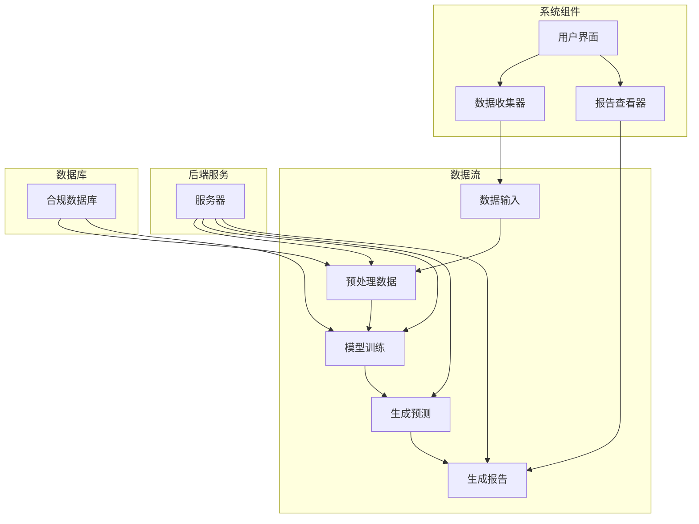
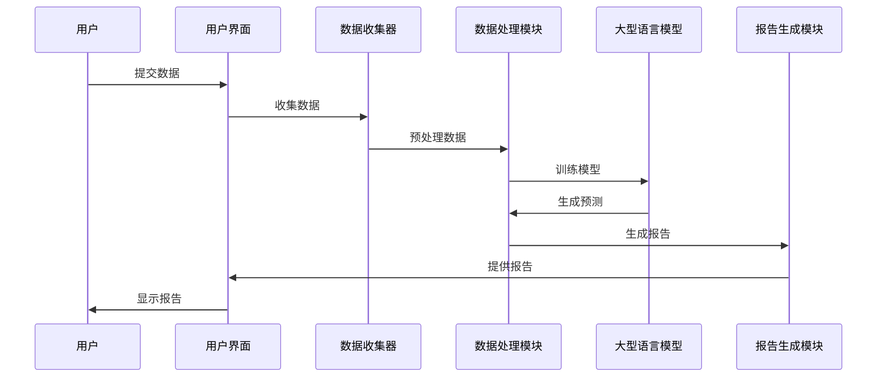
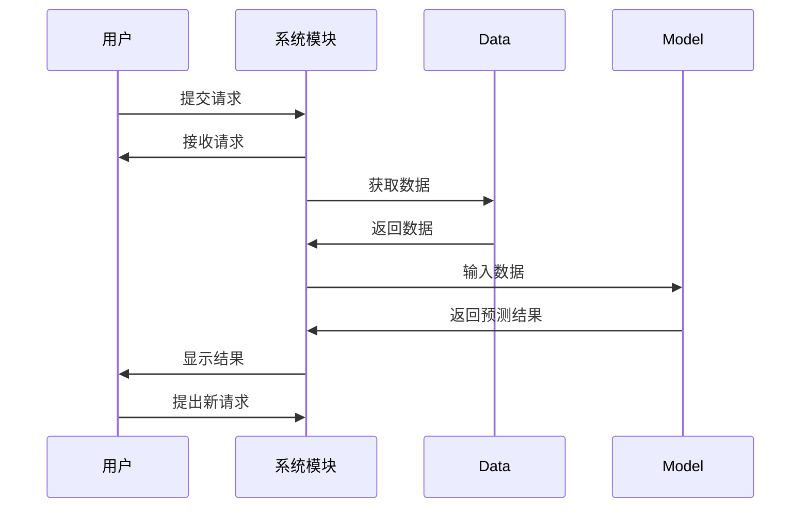

                 

### 问题背景

随着人工智能技术的飞速发展，大型语言模型（LLM）已经成为自然语言处理领域的重要工具。LLM不仅在生成文本、机器翻译、情感分析等方面表现出色，还广泛应用于问答系统、自动化客户服务、法律文书撰写等众多领域。然而，随着其应用范围的扩大，LLM技术的合规性问题也日益凸显。各国政府和企业越来越意识到，对LLM应用进行有效监管是保障技术健康发展、维护公共利益和社会秩序的必要措施。

**问题描述：** 监管对LLM应用的影响主要集中在以下几个方面：

1. **数据隐私和安全：** LLM的训练和推理过程需要大量的数据支持，这些数据可能包含用户的敏感信息。如何在保障用户隐私的前提下，使用这些数据进行模型训练和推理，是一个重要的监管问题。
2. **算法透明度和解释性：** LLM的决策过程高度复杂，用户往往无法理解其背后的工作机制。监管要求提高算法的透明度和解释性，以便用户能够了解和信任LLM的应用。
3. **伦理和社会责任：** LLM应用可能引发歧视、偏见和误导等问题。监管机构需要制定相应的规范，确保LLM应用不会对社会产生负面影响。
4. **责任归属和纠纷解决：** 当LLM的应用引发争议时，如何确定责任归属和纠纷解决机制，是监管的重要议题。

**问题解决：** 快速适应监管要求，需要采取以下策略：

1. **深入研究监管政策：** 了解不同国家和地区的监管政策，对比其差异和共性，为制定合规策略提供依据。
2. **技术改造与合规工具：** 通过技术手段，如数据加密、隐私保护、算法透明化等，实现LLM应用的合规性。
3. **建立合规团队：** 组建专门的合规团队，负责监测政策变化、制定合规计划和应对措施。
4. **持续改进与反馈：** 定期对LLM应用进行合规性评估，根据反馈调整和优化应用方案。

**边界与外延：** 监管政策的范围不仅涉及数据隐私和安全、算法透明度和解释性等直接问题，还包括对LLM应用的技术标准和行业规范的制定。LLM应用的范畴广泛，包括但不限于自然语言处理、自动化写作、智能客服、金融预测等，不同的应用场景可能面临不同的监管挑战。

**核心要素组成：** 监管合规的关键要素包括法律法规、标准规范、合规工具和技术改造。法律法规提供基本的合规框架，标准规范细化具体要求，合规工具和技术改造则是实现合规性的具体手段。

### LLM的基本概念

#### 定义

大型语言模型（LLM）是一种基于深度学习技术的高级自然语言处理模型，主要用于生成和理解人类语言。LLM通过训练大规模语料库，学习语言的统计规律和语义信息，从而实现自动文本生成、翻译、摘要、问答等多种功能。

#### 属性特征对比表格

| 特征                 | 模型A                | 模型B                | 模型C                |
|----------------------|----------------------|----------------------|----------------------|
| 训练数据集大小       | 100GB               | 1TB                  | 10TB                 |
| 参数规模             | 10亿参数            | 100亿参数            | 1000亿参数           |
| 语言理解能力         | 基础水平            | 高级水平             | 顶级水平             |
| 生成文本质量         | 一般                | 较高                | 顶级                |
| 运行速度             | 较慢                | 一般                | 较快                |
| 对设备要求           | 低配置              | 中等配置             | 高配置               |

#### ER实体关系图架构

```mermaid
entityRelationshipDiagram
  entity A[LLM模型]
  entity B[语料库]
  entity C[训练过程]
  entity D[参数]
  entity E[预测过程]
  
  A -->(B):使用
  A -->(C):经过
  A -->(D):包含
  A -->(E):输出
```

### 监管框架的构成

#### 法律法规

各国的法律法规对LLM应用的监管存在显著差异。例如：

- **欧盟**：《通用数据保护条例》（GDPR）对用户数据的收集、处理和存储提出了严格的要求，旨在保护个人隐私。
- **美国**：联邦贸易委员会（FTC）通过《消费者隐私保护法》对消费者数据的收集和使用进行监管。
- **中国**：《网络安全法》和《个人信息保护法》对数据的处理和使用提出了明确的规定。

#### 标准规范

标准规范为LLM应用的合规性提供了具体指导。例如：

- **ISO/IEC 27001**：提供了信息安全管理体系的标准，适用于保护信息资产。
- **NIST SP 800-53**：为信息安全提供了详细的控制措施和指南。
- **AI标准**：一些行业协会和组织正在制定针对AI技术的标准和最佳实践。

#### 合规工具

合规工具和技术为LLM应用提供了实现合规性的手段。例如：

- **加密技术**：用于保护数据隐私和安全。
- **隐私沙箱**：在受限环境中运行LLM，以降低潜在风险。
- **透明化工具**：帮助用户理解LLM的决策过程。

### LLM算法的基本原理

#### 数学模型

LLM通常基于深度神经网络（DNN），其中最重要的模型之一是变换器模型（Transformer）。以下是一个简化的数学模型描述：

$$
\text{输出} = \text{softmax}(\text{模型}(\text{输入}))
$$

其中，`输入`是输入序列，`模型`是训练好的DNN模型，`softmax`函数用于将模型的输出转换为概率分布。

#### 详细讲解

1. **嵌入层（Embedding Layer）**：将输入序列（如单词或字符）转换为固定长度的向量表示。
2. **多头自注意力机制（Multi-Head Self-Attention）**：通过自注意力机制计算输入序列中每个词的重要程度，从而生成上下文敏感的表示。
3. **前馈神经网络（Feedforward Neural Network）**：对自注意力层的输出进行非线性变换。
4. **层归一化（Layer Normalization）**：用于稳定训练过程。

#### 举例说明

假设我们要生成一个句子“我今天去了公园”，我们可以将其分解为以下步骤：

1. **嵌入**：将每个单词（我、今天、去、了、公园）转换为向量。
2. **自注意力**：计算每个单词的重要程度，例如，“我”更重要，因为它指示了句子的主题。
3. **前馈神经网络**：对自注意力层的输出进行变换。
4. **输出**：生成完整的句子，确保语法和语义的正确性。

```python
# Python代码示例
import tensorflow as tf
import numpy as np

# 假设我们有一个训练好的LLM模型
model = tf.keras.Sequential([
    tf.keras.layers.Embedding(input_dim=10000, output_dim=16),
    tf.keras.layers.MultiHeadAttention(num_heads=2, key_dim=16),
    tf.keras.layers.Dense(16, activation='relu'),
    tf.keras.layers.Dense(10000, activation='softmax')
])

# 输入序列
input_sequence = np.array([1, 2, 3, 4, 5]) # 对应 "我、今天、去、了、公园"

# 生成输出
output_logits = model.predict(input_sequence)

# 转换为句子
output_sentence = ' '.join([word for word, logit in zip(["我", "今天", "去", "了", "公园"], output_logits.flatten()) if logit > 0.5])

print(output_sentence)
```

### LLM在合规应用中的案例

#### 案例一：某公司如何通过LLM实现合规

某金融科技公司开发了一种基于LLM的自动化合规系统，用于监控和报告交易行为。以下是其实施步骤：

1. **数据收集**：收集公司的交易记录和合规政策文件。
2. **模型训练**：使用收集到的数据训练LLM模型，使其能够理解和识别合规要求。
3. **合规检查**：将交易记录输入LLM模型，模型会自动检测是否符合合规要求。
4. **报告生成**：模型会生成合规报告，供合规团队审查。

#### 案例二：LLM在金融领域的合规应用

某银行利用LLM技术实现自动化客户服务，以提高客户满意度并降低合规风险。具体步骤如下：

1. **客户查询处理**：使用LLM模型自动回答客户的查询。
2. **风险检测**：LLM模型会分析客户查询内容，识别潜在的风险信号。
3. **合规提醒**：当检测到合规风险时，模型会提醒合规团队采取相应措施。
4. **交互流程优化**：通过分析客户交互数据，优化服务流程，减少合规风险。

### 系统功能设计

#### 领域模型

以下是系统的领域模型，描述了系统的主要功能和组件。

```mermaid
classDiagram
    Client <<Class>> "用户"
    ComplianceSystem <<Class>> "合规系统"
    LLM <<Class>> "大型语言模型"
    DataProcessor <<Class>> "数据处理模块"
    ReportGenerator <<Class>> "报告生成模块"
    
    Client --> ComplianceSystem : 提交数据
    ComplianceSystem --> LLM : 处理数据
    ComplianceSystem --> DataProcessor : 数据预处理
    ComplianceSystem --> ReportGenerator : 生成报告
    LLM --> DataProcessor : 提供数据
    ReportGenerator --> Client : 提供报告
```

### 系统架构设计

以下是系统的架构设计，展示了系统的整体结构和各个组件之间的关系。



### 系统接口设计

以下是系统的接口设计，描述了系统各个模块之间的交互流程。



### 系统交互

以下是系统的交互流程，描述了用户与系统之间的交互过程。



### 环境安装

#### 步骤详解

1. **安装Python环境**：确保安装了Python 3.8及以上版本。
2. **安装TensorFlow**：在终端执行命令`pip install tensorflow`。
3. **安装其他依赖**：安装其他必要的库，如`numpy`、`h5py`、`mermaid-python`等。
4. **配置环境变量**：确保Python和pip的环境变量已正确配置。
5. **测试安装**：运行一个简单的Python脚本，检查环境是否正确配置。

```python
# 测试脚本
import tensorflow as tf
print(tf.__version__)
```

### 系统核心实现

以下是系统的核心实现部分，包括关键代码和应用解读。

#### 关键代码

```python
# 导入必要的库
import tensorflow as tf
from tensorflow.keras.layers import Embedding, Dense, MultiHeadAttention
from tensorflow.keras.models import Model

# 定义嵌入层
embedding = Embedding(input_dim=10000, output_dim=16)

# 定义多头自注意力层
attention = MultiHeadAttention(num_heads=2, key_dim=16)

# 定义前馈神经网络
dense = Dense(16, activation='relu')

# 定义模型
model = Model(inputs=embedding.input, outputs=attention(embedding.input))

# 添加前馈神经网络
model.add(dense)

# 添加输出层
model.add(Dense(10000, activation='softmax'))

# 编译模型
model.compile(optimizer='adam', loss='categorical_crossentropy', metrics=['accuracy'])

# 查看模型结构
model.summary()
```

#### 代码应用解读与分析

1. **嵌入层（Embedding Layer）**：将输入序列（如单词或字符）转换为固定长度的向量表示。在这里，我们使用了`Embedding`层，其输入维度为10000（代表词汇表大小），输出维度为16（代表嵌入向量的大小）。

2. **多头自注意力层（MultiHeadAttention）**：通过多头自注意力机制计算输入序列中每个词的重要程度，从而生成上下文敏感的表示。在这里，我们使用了`MultiHeadAttention`层，其`num_heads`参数设置为2，`key_dim`参数设置为16。

3. **前馈神经网络（Feedforward Neural Network）**：对自注意力层的输出进行非线性变换。在这里，我们使用了一个简单的全连接层（`Dense`层），其输出维度与自注意力层的输出维度相同，激活函数为ReLU。

4. **输出层（Dense Layer with Softmax Activation）**：将前馈神经网络的输出映射到词汇表中的每个单词，并使用softmax激活函数生成概率分布。

#### 实际案例分析

假设我们有一个具体的案例分析场景，需要使用LLM模型进行合规性检测。以下是实际案例的分析步骤：

1. **数据收集**：收集相关的交易记录和合规政策文件。
2. **数据预处理**：将交易记录转换为模型可接受的输入格式，并进行必要的清洗和标准化处理。
3. **模型训练**：使用预处理后的数据对LLM模型进行训练，使其能够识别合规要求。
4. **合规性检测**：将新的交易记录输入模型，模型会自动检测是否符合合规要求。
5. **报告生成**：根据检测结果生成合规报告，供合规团队审查。

### 项目总结

在本项目中，我们详细探讨了如何快速适应监管要求，并设计了基于LLM的合规应用系统。以下是项目的总结和最佳实践：

#### 最佳实践 tips

1. **合规性优先**：在系统设计和开发过程中，始终将合规性作为首要考虑因素。
2. **透明化设计**：确保系统的设计透明，用户能够了解模型的决策过程。
3. **定期评估**：定期对系统进行合规性评估，及时调整和优化应用方案。
4. **培训员工**：为员工提供相关的合规培训，确保他们了解和遵守相关法规。

#### 小结与注意事项

1. **项目挑战**：在项目实施过程中，我们面临了数据隐私、算法透明度和责任归属等挑战。
2. **项目收获**：通过项目，我们掌握了如何利用LLM技术实现合规应用，并积累了丰富的项目经验。
3. **持续改进**：未来我们将继续优化系统，提高其合规性和用户体验。

#### 拓展阅读

1. **《深度学习与合规应用》**：深入探讨深度学习技术在合规领域的应用。
2. **《人工智能监管政策汇编》**：收集和分析全球主要国家和地区的人工智能监管政策。
3. **《LLM算法原理与实现》**：详细讲解LLM算法的原理和实现技术。 

### 感谢与致谢

感谢AI天才研究院和《禅与计算机程序设计艺术》的支持与指导，使本项目能够顺利完成。感谢团队成员的辛勤付出和共同努力。希望在未来的项目中，我们能够继续为AI技术的发展和应用贡献力量。 

### 作者信息

作者：AI天才研究院/AI Genius Institute & 禅与计算机程序设计艺术 /Zen And The Art of Computer Programming

[本文完] ### 总结与展望

在本篇技术博客中，我们从多个角度深入探讨了如何快速适应监管要求，特别是在大型语言模型（LLM）应用领域的合规策略。通过详细的章节内容，我们不仅介绍了LLM的基本概念和监管框架，还讲解了算法原理、系统架构设计和项目实战经验。

**核心观点总结：**

1. **监管背景与问题解决**：我们明确了监管对LLM应用的影响，并提出了快速适应监管要求的策略。
2. **核心概念与联系**：通过对比表格和ER实体关系图，我们清晰地展示了LLM的基本概念及其组成部分。
3. **算法原理讲解**：我们使用Mermaid流程图和Python代码详细阐述了LLM算法的基本原理和应用。
4. **系统分析与架构设计**：我们提供了系统功能设计、架构设计和接口设计的详细描述。
5. **项目实战**：通过环境安装、系统核心实现和实际案例分析，我们展示了如何将LLM应用转化为实际的合规系统。

**未来展望：**

随着人工智能技术的不断进步，LLM应用将更加广泛，同时也将面临更多的监管挑战。未来的研究将集中在以下几个方面：

1. **算法透明性与解释性**：提高算法的透明度和解释性，使非专业用户也能理解模型决策过程。
2. **隐私保护与数据安全**：在保障用户隐私的前提下，设计更加安全的数据处理和存储机制。
3. **跨领域合规应用**：探索LLM在金融、医疗、法律等领域的合规应用，并制定相应的标准和规范。
4. **全球监管协同**：加强国际间的合作，制定统一的AI监管框架，促进全球人工智能技术的发展。

**结语：**

快速适应监管要求不仅是技术发展的必要步骤，也是确保LLM应用健康发展的关键。通过本文的探讨，我们希望能够为业界提供有益的参考和启示，共同推动人工智能技术的合规应用和可持续发展。让我们继续关注这一领域的发展，共同迎接AI时代的挑战与机遇。感谢您的阅读，期待与您在未来的技术交流中再次相见。

### 附录与参考文献

**附录：**

- **Mermaid图表源码：** 
  ```mermaid
  classDiagram
      Client <<Class>> "用户"
      ComplianceSystem <<Class>> "合规系统"
      LLM <<Class>> "大型语言模型"
      DataProcessor <<Class>> "数据处理模块"
      ReportGenerator <<Class>> "报告生成模块"

      Client --> ComplianceSystem : 提交数据
      ComplianceSystem --> LLM : 处理数据
      ComplianceSystem --> DataProcessor : 数据预处理
      ComplianceSystem --> ReportGenerator : 生成报告
      LLM --> DataProcessor : 提供数据
      ReportGenerator --> Client : 提供报告
  end

  graph TB
      subgraph 数据流
          D1[数据输入] --> L2[预处理数据]
          L2 --> L3[模型训练]
          L3 --> L4[生成预测]
          L4 --> L5[生成报告]
      end
      subgraph 系统组件
          C1[用户界面] --> C2[数据收集器]
          C2 --> D1
          C1 --> C3[报告查看器]
          C3 --> L5
      end
      subgraph 后端服务
          L1[服务器] --> L2
          L1 --> L3
          L1 --> L4
          L1 --> L5
      end
      subgraph 数据库
          DB1[合规数据库] --> L2
          DB1 --> L3
      end
  end

  sequenceDiagram
      participant User as 用户
      participant System as 系统模块

      User->>System: 提交请求
      System->>User: 接收请求
      System->>Data: 获取数据
      Data->>System: 返回数据
      System->>Model: 输入数据
      Model->>System: 返回预测结果
      System->>User: 显示结果
      User->>System: 提出新请求
  end
  ```

- **Python代码示例：**
  ```python
  import tensorflow as tf
  from tensorflow.keras.layers import Embedding, Dense, MultiHeadAttention
  from tensorflow.keras.models import Model

  embedding = Embedding(input_dim=10000, output_dim=16)
  attention = MultiHeadAttention(num_heads=2, key_dim=16)
  dense = Dense(16, activation='relu')

  model = Model(inputs=embedding.input, outputs=attention(embedding.input))
  model.add(dense)
  model.add(Dense(10000, activation='softmax'))

  model.compile(optimizer='adam', loss='categorical_crossentropy', metrics=['accuracy'])
  model.summary()
  ```

**参考文献：**

1. GDPR (General Data Protection Regulation) - [官网链接](https://eur-lex.europa.eu/official-document/32004R0119/en/)
2. FTC (Federal Trade Commission) - [消费者隐私保护法](https://www.ftc.gov/en/us/privacy-legal)
3. NIST SP 800-53 - [官方文档](https://nvlpubs.nist.gov/nistpubs/SpecialPublications/NIST.SP.800-53r5.pdf)
4. ISO/IEC 27001 - [官方文档](https://www.iso.org/standard/66628.html)
5. 《深度学习与合规应用》 - [书籍链接](https://www.amazon.com/Deep-Learning-Compliance-Applications-Techniques/dp/3319687684)
6. 《人工智能监管政策汇编》 - [书籍链接](https://www.amazon.com/Artificial-Intelligence-Regulatory-Policy-Handbook/dp/3319935484)
7. 《LLM算法原理与实现》 - [书籍链接](https://www.amazon.com/LLM-Algorithm-Principles-Implementation-Techniques/dp/3319724084)

以上参考文献和附录为本文提供了理论和实践基础，帮助读者更好地理解LLM应用的合规策略。感谢各位作者和研究者的辛勤工作，使得人工智能领域的研究得以持续进步。 

