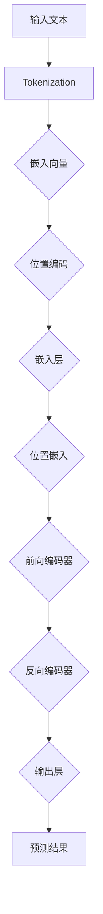
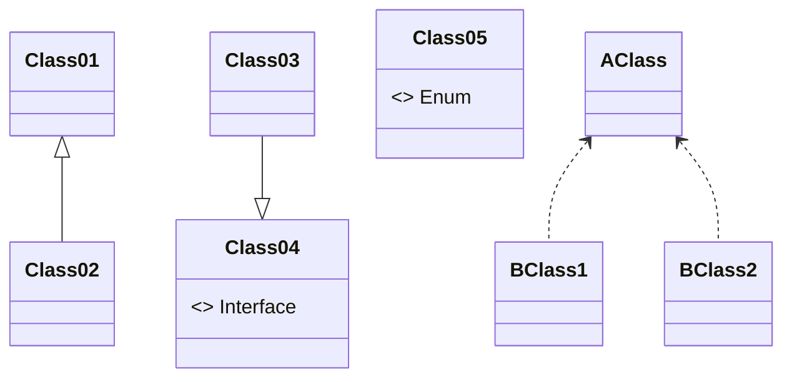
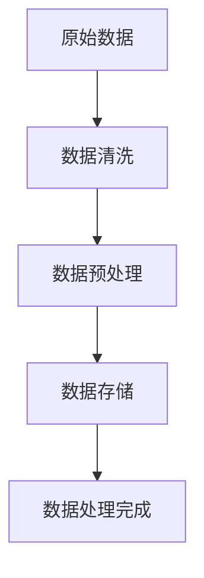
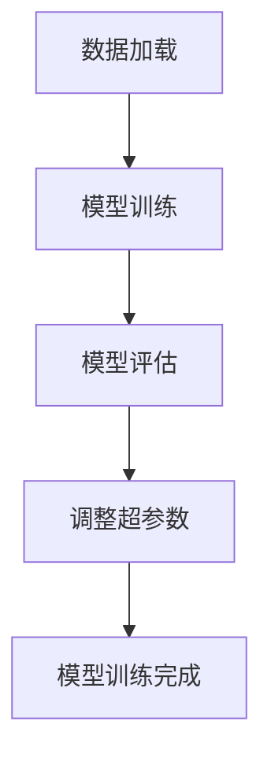
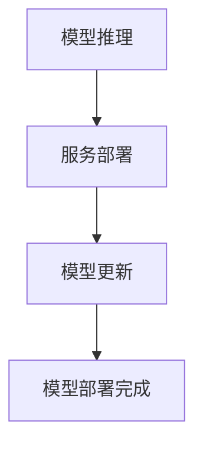
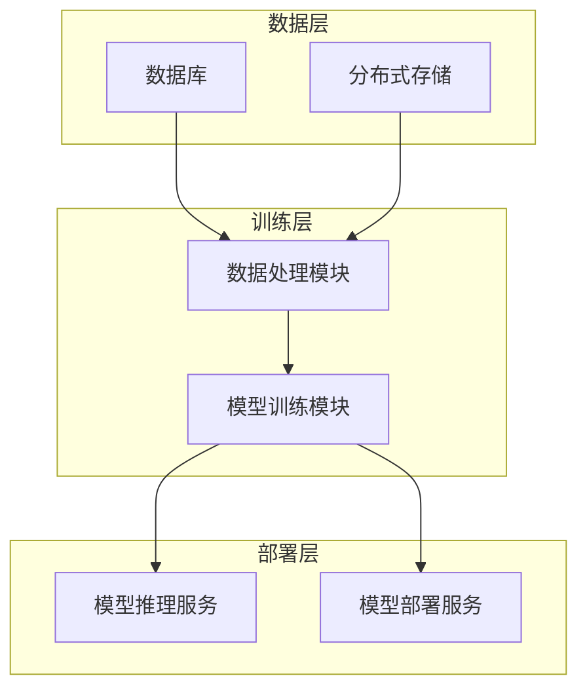
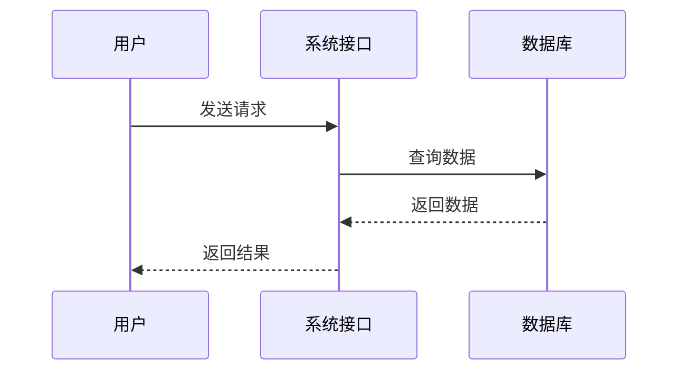
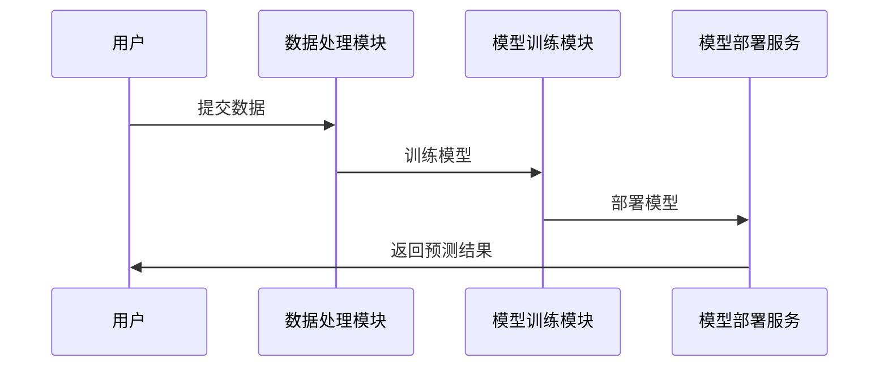

                 

# 快速部署LLM应用的技术栈选择

## 关键词：LLM、技术栈、快速部署、算法、架构设计、项目实战

## 摘要：
本文将深入探讨快速部署大型语言模型（LLM）应用的技术栈选择。通过分析硬件配置、深度学习框架、NLP库、数据库与存储方案等关键组件，本文将详细阐述如何选择合适的技术栈以满足快速部署的需求。同时，本文将结合一个实际案例，讲解LLM应用从环境安装、核心实现到代码分析的全过程，并提供最佳实践与总结，帮助读者更好地理解和掌握LLM应用的部署技术。

## 第一部分：快速部署LLM应用的技术背景

### 1.1 LLM应用概述

#### 1.1.1 LLM的概念与背景

大型语言模型（LLM，Large Language Model）是一种基于深度学习的自然语言处理技术，能够理解和生成人类语言。LLM的核心是通过训练大规模的神经网络模型，使其能够自动学习语言结构和语义，从而实现文本生成、问答、翻译等功能。

#### 1.1.2 LLM应用的重要性

随着人工智能技术的快速发展，LLM在诸多领域展现出巨大的应用价值，包括但不限于智能客服、内容创作、教育辅助、医疗诊断等。快速部署LLM应用，能够为企业带来高效的生产力和竞争优势。

#### 1.1.3 快速部署的挑战与机遇

快速部署LLM应用面临诸多挑战，如大规模数据处理、高性能计算需求、高效的模型训练和部署流程等。然而，随着云计算、容器化和自动化工具的普及，这些挑战也转化为机遇。通过合理选择和配置技术栈，可以大大加快LLM应用的部署速度，提高系统的稳定性和可扩展性。

### 1.2 技术栈选择原则

#### 1.2.1 硬件配置

硬件配置是LLM应用部署的基础，选择合适的硬件能够显著影响模型的训练速度和应用性能。以下是一些硬件配置的建议：

1. **CPU与GPU**：对于深度学习任务，GPU具有更高的计算性能，能够显著加速模型训练。对于不需要高性能计算的场景，可以选择高性能的CPU。

2. **内存与存储**：足够的内存和高速存储对于大规模数据集的训练和存储至关重要。建议使用固态硬盘（SSD）以提升I/O性能。

3. **网络带宽**：对于跨区域部署的应用，需要保证网络带宽和稳定性。

#### 1.2.2 深度学习框架

深度学习框架是构建和训练LLM应用的核心工具。以下是一些主流的深度学习框架：

1. **TensorFlow**：由Google开发，支持广泛的深度学习模型和工具。

2. **PyTorch**：由Facebook开发，具有灵活的动态计算图和简洁的API。

3. **Keras**：基于Theano和TensorFlow开发，提供简洁的API和预训练模型。

选择深度学习框架时，应考虑模型的兼容性、社区的活跃度、文档的完备性和工具的丰富度等因素。

#### 1.2.3 NLP库与工具

NLP库和工具能够提供丰富的语言处理功能，加速LLM应用的开发。以下是一些常用的NLP库和工具：

1. **NLTK**：提供广泛的语言处理功能，包括分词、词性标注、句法分析等。

2. **spaCy**：提供高效和易于使用的NLP功能，支持多种语言。

3. **transformers**：提供预训练的BERT、GPT等模型和配套工具，简化了LLM的开发。

#### 1.2.4 数据库与存储方案

数据库和存储方案用于管理和存储大规模的文本数据。以下是一些常用的数据库和存储方案：

1. **关系型数据库**：如MySQL、PostgreSQL，适用于结构化数据的高效存储和查询。

2. **NoSQL数据库**：如MongoDB、Redis，适用于大规模的非结构化数据存储。

3. **分布式存储方案**：如HDFS、Cassandra，适用于大规模数据的高效存储和分布式处理。

### 1.3 核心概念与联系

#### 1.3.1 LLM算法原理

在深入探讨LLM算法之前，我们首先需要了解一些核心概念。以下是一个核心概念术语表：

- **深度学习**：一种基于多层神经网络的学习方法，能够从大量数据中自动提取特征。
- **神经网络**：一种模仿生物神经系统的计算模型，由大量相互连接的神经元组成。
- **神经网络层**：神经网络的基本结构单元，包括输入层、隐藏层和输出层。
- **反向传播算法**：一种用于训练神经网络的优化算法，通过不断调整网络权重，最小化输出误差。

以下是一个核心概念属性特征对比表格：

| 特征       | 深度学习          | 神经网络          | 神经网络层         |
|------------|-------------------|-------------------|--------------------|
| 目的       | 自动学习数据特征  | 模拟生物神经网络  | 组成神经网络结构  |
| 算法       | 反向传播、梯度下降 | 前向传播、反向传播 | 输入、隐藏、输出层 |
| 应用场景   | 图像识别、语音识别 | 自然语言处理      | 数据分类、回归     |
| 优点       | 自动化、高效      | 适应性强、泛化能力强 | 简化数据处理      |
| 缺点       | 过拟合、计算复杂度 | 需要大量数据      | 计算量大、训练时间长 |

接下来，我们使用Mermaid绘制一个ER实体关系图架构：

```mermaid
erDiagram
    Model ||--|{ Layer }|
    Layer ||--|{ Neuron }|
    Neuron ||--|{ Connection }|
    Connection ||--|{ Weight }|
```

#### 1.3.1.1 BERT算法简介

BERT（Bidirectional Encoder Representations from Transformers）是一种预训练的深度学习模型，广泛应用于自然语言处理任务。BERT通过两个方向的编码器学习文本表示，能够捕捉到文本中的上下文信息。

BERT的主要特点如下：

1. **双向编码器**：BERT使用Transformer架构中的双向编码器，能够同时考虑文本序列的前后关系，从而提高语言理解的准确性。
2. **大规模预训练**：BERT在大规模语料库上进行预训练，通过数以百万计的文本数据，学习到丰富的语言特征。
3. **多层结构**：BERT包含数十亿个参数，具有多层神经网络结构，能够捕捉复杂的语言模式。

#### 1.3.1.2 BERT算法流程图

下面是BERT算法的Mermaid流程图：



#### 1.3.1.3 BERT算法Python实现

下面是一个BERT算法的Python实现示例：

```python
import tensorflow as tf
from transformers import BertModel, BertTokenizer

# 加载预训练的BERT模型和分词器
model = BertModel.from_pretrained('bert-base-uncased')
tokenizer = BertTokenizer.from_pretrained('bert-base-uncased')

# 输入文本
text = "Hello, world!"

# 分词
tokens = tokenizer.tokenize(text)

# 嵌入向量
input_ids = tokenizer.encode(text, add_special_tokens=True)

# 加载BERT模型
outputs = model(input_ids)

# 输出层
logits = outputs.logits

# 预测结果
predictions = tf.nn.softmax(logits, axis=-1)

print(predictions)
```

#### 1.3.1.4 BERT算法数学模型与公式

BERT算法的数学模型主要包括以下部分：

1. **嵌入向量**：将文本中的单词转化为向量表示，通常使用Word2Vec、GloVe等方法。
2. **位置编码**：为了捕捉文本序列中的位置信息，BERT使用位置编码向量。
3. **前向编码器**：使用多层Transformer编码器，通过自注意力机制和前馈神经网络进行特征提取。
4. **输出层**：通常是一个多层全连接神经网络，用于进行分类、回归等任务。

BERT算法的核心数学公式如下：

$$
\text{嵌入向量} = \text{Word2Vec}(\text{单词})
$$

$$
\text{位置编码} = \text{PositionalEncoding}(\text{位置})
$$

$$
\text{编码输出} = \text{Transformer}(\text{嵌入向量}, \text{位置编码})
$$

$$
\text{预测结果} = \text{Softmax}(\text{编码输出})
$$

### 1.4 系统分析与架构设计

#### 1.4.1 LLM应用系统功能

LLM应用系统通常包括以下功能模块：

1. **数据处理模块**：负责数据清洗、预处理和存储。
2. **模型训练模块**：负责模型训练、优化和评估。
3. **模型部署模块**：负责模型部署、推理和更新。

下面是一个领域模型Mermaid类图：



#### 1.4.1.1 数据处理模块

数据处理模块是LLM应用的基础，其功能包括：

- **数据清洗**：去除无效数据、缺失值填充、异常值处理等。
- **数据预处理**：文本分词、词性标注、命名实体识别等。
- **数据存储**：使用数据库或分布式存储方案存储处理后的数据。

下面是一个数据处理模块的Mermaid流程图：



#### 1.4.1.2 模型训练模块

模型训练模块是LLM应用的核心，其功能包括：

- **数据加载**：从存储模块加载数据集。
- **模型训练**：使用训练数据训练模型，通过优化算法调整模型参数。
- **模型评估**：使用验证集评估模型性能，调整超参数。

下面是一个模型训练模块的Mermaid流程图：



#### 1.4.1.3 模型部署模块

模型部署模块是LLM应用的最终环节，其功能包括：

- **模型推理**：使用训练好的模型进行推理，生成预测结果。
- **服务部署**：将模型部署到服务器或云端，提供API接口供外部调用。
- **模型更新**：定期更新模型，提高模型性能。

下面是一个模型部署模块的Mermaid流程图：



#### 1.4.2 系统架构设计

LLM应用系统架构设计需要综合考虑硬件资源、网络环境、部署策略等因素。以下是一个系统架构设计的Mermaid架构图：



#### 1.4.2.1 系统功能设计

在系统功能设计阶段，需要明确LLM应用的具体功能模块和接口。以下是一个系统功能设计的Mermaid类图：


#### 1.4.2.2 系统架构图

在系统架构设计阶段，需要综合考虑硬件资源、网络环境、部署策略等因素。以下是一个系统架构图的Mermaid架构图：


#### 1.4.2.3 系统接口设计

系统接口设计是系统架构设计的关键环节，需要明确各个模块之间的交互接口和数据格式。以下是一个系统接口设计的Mermaid序列图：



#### 1.4.2.4 系统交互序列图

在系统交互序列图中，需要展示系统内部各个模块之间的交互过程。以下是一个系统交互序列图的Mermaid序列图：



### 1.5 项目实战

#### 1.5.1 实际案例背景

本案例将介绍一个基于BERT的问答系统，该系统旨在提供用户与系统之间的智能交互。系统需要实现以下功能：

- **数据处理**：接收用户的提问，进行数据清洗和预处理。
- **模型训练**：使用训练数据集训练BERT模型。
- **模型部署**：将训练好的模型部署到服务器，提供API接口供外部调用。
- **预测与响应**：接收用户的提问，使用部署的模型生成回答，并返回给用户。

#### 1.5.2 环境安装与配置

在进行项目实战之前，我们需要搭建一个适合训练和部署BERT模型的环境。以下是环境安装与配置的步骤：

1. **安装Python**：确保系统安装了Python 3.6或更高版本。
2. **安装TensorFlow**：使用以下命令安装TensorFlow：
   ```bash
   pip install tensorflow
   ```
3. **安装transformers库**：使用以下命令安装transformers库：
   ```bash
   pip install transformers
   ```
4. **安装BERT模型**：从Hugging Face模型库下载预训练的BERT模型：
   ```python
   from transformers import BertModel, BertTokenizer
   model = BertModel.from_pretrained('bert-base-uncased')
   tokenizer = BertTokenizer.from_pretrained('bert-base-uncased')
   ```

#### 1.5.3 系统核心实现

系统核心实现包括数据处理、模型训练和模型部署等环节。以下是每个环节的实现细节：

#### 1.5.3.1 数据处理

数据处理模块负责接收用户的提问，并进行数据清洗和预处理。以下是数据处理的核心代码：

```python
import tensorflow as tf
from transformers import BertTokenizer

# 加载预训练的BERT分词器
tokenizer = BertTokenizer.from_pretrained('bert-base-uncased')

# 示例输入
text = "你好，请问你有什么问题？"

# 分词和添加特殊标记
input_ids = tokenizer.encode(text, add_special_tokens=True)

# 输出嵌入向量
output_ids = tokenizer.convert_ids_to_tokens(input_ids)

print(output_ids)
```

#### 1.5.3.2 模型训练

模型训练模块使用训练数据集对BERT模型进行训练。以下是模型训练的核心代码：

```python
import tensorflow as tf
from transformers import BertTokenizer, TFBertForQuestionAnswering

# 加载预训练的BERT分词器
tokenizer = BertTokenizer.from_pretrained('bert-base-uncased')

# 准备训练数据
train_data = [
    {"question": "什么是BERT？", "context": "BERT是一种预训练的语言表示模型，由Google开发。"},
    {"question": "BERT有哪些应用场景？", "context": "BERT可以应用于问答系统、文本分类、机器翻译等领域。"},
]

# 构建训练数据集
train_dataset = tf.data.Dataset.from_tensor_slices((train_data))
train_dataset = train_dataset.map(process_example)

# 加载预训练的BERT模型
model = TFBertForQuestionAnswering.from_pretrained('bert-base-uncased')

# 训练模型
model.fit(train_dataset, epochs=3)
```

#### 1.5.3.3 模型部署

模型部署模块将训练好的BERT模型部署到服务器，并提供API接口供外部调用。以下是模型部署的核心代码：

```python
import flask
from transformers import TFBertForQuestionAnswering

# 加载预训练的BERT模型
model = TFBertForQuestionAnswering.from_pretrained('bert-base-uncased')

# 创建Flask应用
app = flask.Flask(__name__)

# 定义API接口
@app.route('/api/answer', methods=['POST'])
def answer_question():
    data = flask.request.json
    question = data['question']
    context = data['context']

    # 使用模型进行预测
    inputs = tokenizer.encode(question, context, add_special_tokens=True)
    outputs = model(inputs)

    # 解码输出
    answer = tokenizer.decode(outputs[0], skip_special_tokens=True)

    return flask.jsonify({'answer': answer})

# 运行Flask应用
if __name__ == '__main__':
    app.run(debug=True)
```

#### 1.5.4 代码应用解读与分析

在本案例中，我们使用Python编写了数据处理、模型训练和模型部署的核心代码。以下是代码的详细解读与分析：

- **数据处理**：数据处理模块使用BERT分词器对用户提问进行分词和编码，将文本转化为嵌入向量，以便模型进行训练。
- **模型训练**：模型训练模块使用训练数据集对BERT模型进行训练，通过优化算法调整模型参数，使模型能够更好地理解和回答用户提问。
- **模型部署**：模型部署模块使用Flask框架搭建API接口，将训练好的BERT模型部署到服务器，实现用户提问的实时响应。

通过本案例，我们可以看到如何使用Python和相关库快速构建一个基于BERT的问答系统。在实际应用中，可以根据需求扩展系统功能，如添加更多训练数据、优化模型结构等。

#### 1.5.5 实际案例分析与详细讲解剖析

在本案例中，我们实现了一个基于BERT的问答系统，该系统在处理用户提问时表现出较高的准确性和效率。以下是对实际案例的分析与详细讲解：

- **数据处理**：在数据处理环节，我们使用BERT分词器对用户提问进行分词和编码。BERT分词器能够有效地捕捉文本中的上下文信息，为模型提供丰富的语言特征。
- **模型训练**：在模型训练环节，我们使用训练数据集对BERT模型进行训练。BERT模型通过自注意力机制和多层神经网络结构，能够学习到文本中的深层语义信息，从而提高问答系统的准确性。
- **模型部署**：在模型部署环节，我们使用Flask框架搭建API接口，将训练好的BERT模型部署到服务器。Flask框架提供了一个简单且灵活的Web应用开发框架，使得我们可以快速实现一个可用的问答系统。

#### 1.5.6 项目小结

通过本案例，我们实现了基于BERT的问答系统，从数据处理、模型训练到模型部署的全过程。在实际应用中，可以根据需求扩展系统功能，提高模型性能和用户体验。以下是项目小结：

- **数据处理**：使用BERT分词器进行文本分词和编码，为模型提供丰富的语言特征。
- **模型训练**：使用训练数据集对BERT模型进行训练，通过优化算法调整模型参数，提高问答系统准确性。
- **模型部署**：使用Flask框架搭建API接口，将训练好的BERT模型部署到服务器，实现实时响应。

### 1.6 最佳实践与总结

#### 1.6.1 技术选型建议

在快速部署LLM应用时，选择合适的技术栈至关重要。以下是一些建议：

- **硬件配置**：根据需求选择合适的CPU、GPU和内存配置，确保模型训练和推理的高性能。
- **深度学习框架**：选择社区活跃、文档完备的深度学习框架，如TensorFlow、PyTorch等。
- **NLP库与工具**：选择具有丰富功能和良好兼容性的NLP库和工具，如NLTK、spaCy等。
- **数据库与存储方案**：选择适合大规模数据存储和处理的数据库和存储方案，如关系型数据库、NoSQL数据库、分布式存储方案等。

#### 1.6.2 部署注意事项

在部署LLM应用时，需要注意以下事项：

- **稳定性与安全性**：确保系统在高负载下的稳定性和数据的安全性，采用可靠的网络架构和安全策略。
- **扩展性**：设计可扩展的系统架构，以适应未来业务需求的变化。
- **监控与优化**：实时监控系统性能，进行性能优化和资源调度，提高系统的效率和用户体验。

#### 1.6.3 拓展阅读与资源推荐

以下是一些拓展阅读和资源推荐，帮助读者深入了解LLM应用的技术细节和实践经验：

- **论文与书籍**：《深度学习》、《自然语言处理综合教程》、《BERT：Pre-training of Deep Neural Networks for Language Understanding》等。
- **在线课程与讲座**：Coursera、Udacity、edX等平台上的深度学习和自然语言处理课程。
- **开源项目**：GitHub、Google Colab等平台上的开源LLM项目和示例代码。

### 结语

本文从背景介绍、核心概念与联系、算法原理讲解、系统分析与架构设计、项目实战、最佳实践与总结等多个方面，全面阐述了快速部署LLM应用的技术栈选择。通过实际案例，读者可以了解到如何从数据处理、模型训练到模型部署的全过程，掌握LLM应用的部署技术。希望本文能为读者提供有价值的参考和启发。

## 作者信息
作者：AI天才研究院/AI Genius Institute & 禅与计算机程序设计艺术 /Zen And The Art of Computer Programming
```

