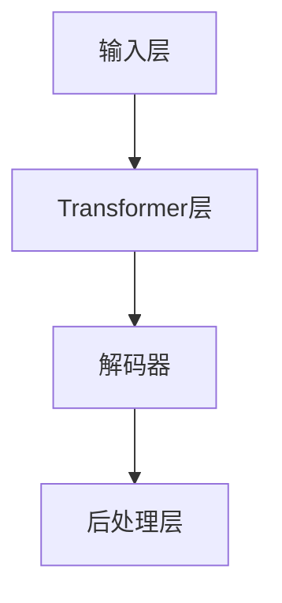
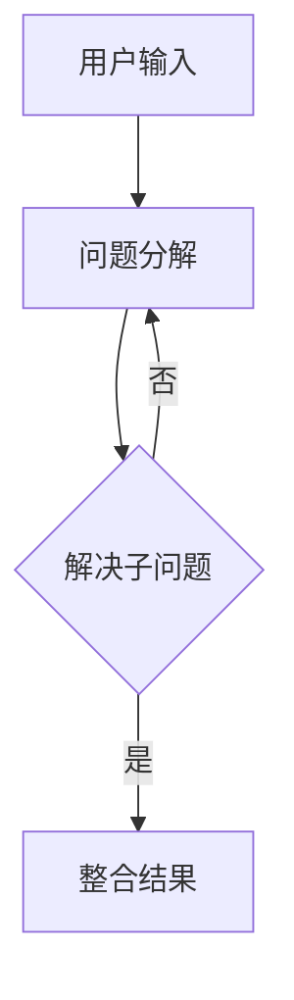
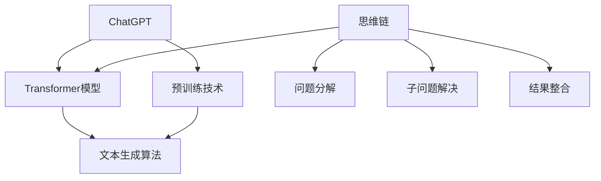
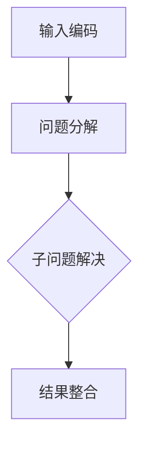
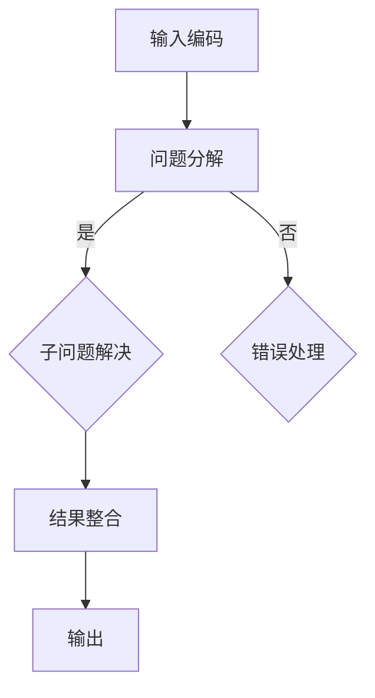

                 

### 第1章：问题背景与目标

#### 1.1 问题背景

##### 1.1.1 人工智能与自然语言处理的发展

人工智能（Artificial Intelligence，简称AI）是计算机科学的一个分支，旨在研究、开发用于模拟、延伸和扩展人类智能的理论、方法、技术及应用。自20世纪50年代人工智能概念诞生以来，随着计算能力的提升、数据资源的丰富以及算法的进步，人工智能已经取得了显著的进展。特别是近年来，深度学习（Deep Learning）的兴起，使得AI在图像识别、语音识别、自然语言处理等领域取得了突破性成果。

自然语言处理（Natural Language Processing，简称NLP）是AI的一个重要子领域，它专注于让计算机理解和生成人类语言。NLP的研究目标包括文本分类、机器翻译、情感分析、实体识别等。随着互联网和社交媒体的普及，自然语言处理技术在信息检索、推荐系统、智能客服等领域得到了广泛应用。

##### 1.1.2 ChatGPT的兴起与影响

ChatGPT是由OpenAI开发的一种基于GPT-3模型的聊天机器人。GPT（Generative Pre-trained Transformer）是OpenAI提出的一种自然语言处理模型，其通过大量的文本数据进行预训练，能够生成连贯、有逻辑的自然语言文本。ChatGPT的出现标志着AI在生成式对话系统方面的重大进展。

ChatGPT的兴起对自然语言处理领域产生了深远的影响。首先，它展示了AI在生成自然语言文本方面的强大能力，使得自动化内容生成、智能客服、虚拟助手等领域得到了新的发展机遇。其次，ChatGPT的成功也推动了相关技术的进步，如预训练模型的优化、文本生成算法的创新等。

##### 1.1.3 理解ChatGPT决策过程的重要性

理解ChatGPT的决策过程对于进一步优化和改进AI系统具有重要意义。首先，ChatGPT的决策过程涉及到大量的技术细节，如Transformer架构、预训练技术、文本生成算法等。通过深入分析这些技术，可以揭示其内在的工作机制，为其他AI系统的开发提供参考。

其次，ChatGPT的决策过程也体现了AI系统的智能程度。了解其如何处理用户输入、如何生成自然语言响应，可以帮助我们评估和改进AI系统的性能，提高其与人类交互的流畅性和准确性。

最后，理解ChatGPT的决策过程对于解决实际应用中的问题也具有重要价值。例如，在智能客服中，理解ChatGPT如何根据用户的问题生成合适的回答，可以帮助我们优化客服系统的对话流程，提高用户满意度。

#### 1.2 研究目标与内容结构

##### 1.2.1 研究目的

本文旨在深入探讨ChatGPT的决策过程，通过逻辑清晰、结构紧凑、简单易懂的分析，帮助读者理解ChatGPT的工作原理和决策机制。具体目标包括：

1. 梳理ChatGPT的技术背景，介绍其核心原理和架构。
2. 分析ChatGPT的决策过程，探讨其如何处理用户输入并生成自然语言响应。
3. 深入解析思维链在ChatGPT中的应用，展示思维链如何帮助ChatGPT实现高效的文本生成。
4. 通过具体的案例和代码示例，阐述ChatGPT的实际应用和开发过程。

##### 1.2.2 内容框架概述

本文内容分为五个部分：

**第一部分：导论**

介绍人工智能与自然语言处理的发展背景，ChatGPT的兴起及其重要性，明确本文的研究目标和内容结构。

**第二部分：核心概念与联系**

阐述ChatGPT和思维链的定义、原理及其关系，通过概念属性特征对比和ER实体关系图，帮助读者建立对核心概念的理解。

**第三部分：算法原理讲解**

详细讲解ChatGPT和思维链的算法原理，包括算法流程、mermaid流程图、Python源代码以及数学模型和公式。

**第四部分：系统分析与架构设计**

介绍问题场景、系统功能设计、系统架构设计、系统接口设计和系统交互，通过mermaid图展示系统架构和交互流程。

**第五部分：项目实战**

通过项目实施与实现，环境安装与配置，系统核心实现源代码，代码应用解读，实际案例分析和项目小结，展示ChatGPT的实际应用和开发过程。

#### 1.3 边界与外延

##### 1.3.1 研究范围

本文的研究范围主要集中在ChatGPT的决策过程及其相关技术，包括Transformer模型、预训练技术、文本生成算法等。此外，本文还涉及到思维链的概念和应用，以及ChatGPT在系统架构设计和项目实施中的具体应用。

##### 1.3.2 非研究范围

本文未涉及以下内容：

1. ChatGPT在特定领域（如医疗、金融等）的应用。
2. ChatGPT的安全性和隐私保护问题。
3. ChatGPT与其他AI技术的融合应用。

##### 1.3.3 概念结构与核心要素组成

本文的核心概念结构包括：

1. **ChatGPT**：基于Transformer模型的预训练聊天机器人。
2. **思维链**：一种用于优化文本生成过程的思维模式。
3. **算法原理**：包括Transformer模型的构建、预训练技术和文本生成算法。
4. **系统架构**：ChatGPT在系统中的应用和架构设计。

核心要素组成：

1. **Transformer模型**：ChatGPT的核心算法，用于文本生成。
2. **预训练技术**：通过大量文本数据进行预训练，提高模型性能。
3. **文本生成算法**：实现自然语言文本的生成。
4. **系统架构设计**：确保ChatGPT在各种应用场景中的高效运行。

### 第2章：核心概念与原理

#### 2.1 ChatGPT基础

##### 2.1.1 ChatGPT的定义

ChatGPT是由OpenAI开发的一种基于GPT-3模型的聊天机器人。GPT（Generative Pre-trained Transformer）是一种基于Transformer架构的预训练语言模型，其通过大量的文本数据进行预训练，可以生成连贯、有逻辑的自然语言文本。ChatGPT则是将GPT模型应用于聊天机器人领域，通过模拟对话交互来生成人类语言响应。

##### 2.1.2 ChatGPT的核心原理

ChatGPT的核心原理是基于Transformer模型和预训练技术。Transformer模型是一种基于自注意力机制的深度神经网络，其能够处理变长的序列数据，并在自然语言处理任务中取得了显著的效果。预训练技术则是指模型在大量通用文本数据上进行预训练，使其具备了一定的语言理解和生成能力。

在ChatGPT中，用户输入的问题或语句作为输入序列，模型通过自注意力机制计算输入序列中每个词与其他词之间的关系，生成响应序列。具体步骤如下：

1. **输入编码**：将用户输入的文本序列转换为模型可以理解的向量表示。
2. **自注意力机制**：计算输入序列中每个词与其他词之间的权重，生成加权表示。
3. **文本生成**：根据加权表示生成响应序列，并使用解码器对其进行后处理，生成人类可读的文本。

##### 2.1.3 ChatGPT的技术架构

ChatGPT的技术架构主要包括以下几部分：

1. **输入层**：接收用户输入的文本序列，并将其编码为模型可以处理的向量表示。
2. **Transformer层**：实现自注意力机制，计算输入序列中每个词与其他词之间的关系。
3. **解码器**：根据Transformer层的输出，生成人类可读的自然语言文本。
4. **后处理层**：对生成的文本进行进一步处理，如去除不必要的标点符号、纠正语法错误等。

ChatGPT的技术架构如图2-1所示：



#### 2.2 思维链可视化

##### 2.2.1 思维链的定义

思维链（Mind Chain）是一种用于优化文本生成过程的思维模式。它通过将用户的输入分解为多个子问题，并逐一解决这些子问题，从而生成更加连贯、有逻辑的自然语言文本。

思维链的核心思想是将复杂的对话分解为一系列简单的步骤，每个步骤专注于解决一个子问题。通过这种方式，模型可以更加专注于解决具体问题，提高文本生成的准确性和连贯性。

##### 2.2.2 思维链的工作原理

思维链的工作原理可以概括为以下步骤：

1. **问题分解**：将用户输入的问题分解为多个子问题。
2. **子问题解决**：针对每个子问题，生成对应的自然语言响应。
3. **结果整合**：将各个子问题的响应整合为一个完整的文本。

在ChatGPT中，思维链的应用主要体现在以下几个方面：

1. **对话管理**：通过思维链，ChatGPT可以更好地管理对话流程，确保对话的连贯性和逻辑性。
2. **文本生成**：思维链帮助ChatGPT将复杂的对话分解为多个子问题，从而生成更加准确、自然的文本。
3. **知识整合**：通过解决多个子问题，ChatGPT可以更好地整合不同领域的知识，生成全面的回答。

##### 2.2.3 思维链可视化的重要性

思维链可视化是将思维链的运作过程以图形化的形式展示出来，从而帮助开发者和用户更好地理解ChatGPT的决策过程。思维链可视化的重要性体现在以下几个方面：

1. **直观展示**：通过图形化展示，用户可以直观地看到ChatGPT如何分解问题、解决子问题，并生成最终的文本。
2. **问题定位**：在出现问题时，可视化可以帮助开发者快速定位问题的根源，从而进行针对性的优化和调试。
3. **培训辅助**：可视化有助于新用户快速上手，理解ChatGPT的工作原理和应用场景。

思维链可视化的实现可以通过Mermaid流程图完成，具体示例如下：



#### 2.3 ChatGPT与思维链的关系

##### 2.3.1 ChatGPT如何应用思维链

ChatGPT应用思维链的主要目的是优化文本生成过程，提高对话的连贯性和逻辑性。具体应用过程如下：

1. **用户输入**：用户输入一个问题或语句，作为ChatGPT的输入。
2. **问题分解**：ChatGPT使用思维链将输入的问题分解为多个子问题。
3. **子问题解决**：ChatGPT针对每个子问题生成对应的自然语言响应。
4. **结果整合**：将各个子问题的响应整合为一个完整的文本，作为输出。

在这个过程中，思维链起到了关键作用。通过思维链，ChatGPT可以更好地管理对话流程，确保对话的连贯性和逻辑性。

##### 2.3.2 思维链在ChatGPT中的角色

思维链在ChatGPT中扮演了以下角色：

1. **对话管理**：思维链帮助ChatGPT更好地管理对话流程，确保对话的连贯性和逻辑性。
2. **文本生成**：思维链将复杂的对话分解为多个子问题，从而生成更加准确、自然的文本。
3. **知识整合**：通过解决多个子问题，ChatGPT可以更好地整合不同领域的知识，生成全面的回答。

##### 2.3.3 思维链与自然语言处理的关系

思维链与自然语言处理（NLP）有着密切的关系。自然语言处理的目标是使计算机能够理解和生成人类语言。思维链在自然语言处理中的应用主要体现在以下几个方面：

1. **对话系统**：思维链可以帮助对话系统更好地处理用户输入，生成连贯、自然的对话响应。
2. **文本生成**：思维链可以优化文本生成过程，提高文本的质量和连贯性。
3. **知识整合**：思维链可以帮助整合不同领域的知识，为用户提供更全面、准确的回答。

思维链与自然语言处理的关系可以概括为：思维链作为NLP的一种工具，通过优化对话系统和文本生成过程，提高NLP系统的性能和用户体验。

#### 2.4 概念属性特征对比

为了更好地理解ChatGPT和思维链的概念，我们对其进行属性特征对比，具体如下表所示：

| 特征               | ChatGPT                         | 思维链                            |
|--------------------|--------------------------------|----------------------------------|
| 定义               | 基于GPT-3的聊天机器人           | 用于优化文本生成过程的思维模式     |
| 原理               | Transformer模型和预训练技术     | 问题分解、子问题解决、结果整合     |
| 应用目的           | 生成连贯、自然的对话响应       | 提高对话连贯性和逻辑性           |
| 关系               | ChatGPT的核心组成部分           | ChatGPT的辅助工具                 |
| 对自然语言处理的影响 | 提高文本生成质量和效率         | 优化对话系统和文本生成过程       |

#### 2.5 ER实体关系图架构

为了更好地理解ChatGPT和思维链的相互关系，我们可以使用ER（Entity-Relationship）实体关系图进行描述。ER图是一种用于描述实体之间关系的图形化表示方法。

以下是一个简化的ChatGPT和思维链的ER实体关系图：



在这个ER图中，ChatGPT是核心实体，包含了Transformer模型、预训练技术和文本生成算法。思维链作为ChatGPT的辅助工具，与Transformer模型、问题分解、子问题解决和结果整合建立了关系。

### 第3章：算法原理与模型架构

#### 3.1 ChatGPT算法原理

##### 3.1.1 GPT模型的演进

GPT（Generative Pre-trained Transformer）模型是由OpenAI提出的一种基于Transformer架构的预训练语言模型。自2018年GPT-1发布以来，GPT系列模型经历了多次迭代和优化，包括GPT-2、GPT-3等。每个版本的GPT模型在模型大小、参数数量、文本生成能力等方面都有显著的提升。

GPT模型的演进可以分为以下几个阶段：

1. **GPT-1**：基于Transformer模型，对文本数据进行预训练，生成简单的文本序列。
2. **GPT-2**：在GPT-1的基础上，增加了模型大小和训练数据的量，提高了文本生成能力。
3. **GPT-3**：是目前最先进的GPT模型，拥有1750亿个参数，可以生成高质量、连贯的自然语言文本。

##### 3.1.2 ChatGPT算法的核心步骤

ChatGPT算法的核心步骤主要包括以下几个部分：

1. **输入编码**：将用户输入的文本序列转换为模型可以处理的向量表示。这个过程涉及到分词、词嵌入等操作。
2. **自注意力机制**：计算输入序列中每个词与其他词之间的权重，生成加权表示。自注意力机制是Transformer模型的核心组成部分，其通过计算词与词之间的相似度来生成文本序列。
3. **文本生成**：根据加权表示生成响应序列，并使用解码器对其进行后处理，生成人类可读的自然语言文本。文本生成过程涉及到解码器的输出和温度参数的调整。

##### 3.1.3 ChatGPT的优化方法

ChatGPT在算法优化方面采用了多种方法，以提高文本生成质量和效率：

1. **参数优化**：通过调整模型参数，如学习率、批次大小等，优化模型训练过程。
2. **数据增强**：使用不同的数据增强技术，如随机遮盖、同义词替换等，增加训练数据的多样性。
3. **蒸馏技术**：将大模型（如GPT-3）的知识传递到小模型中，提高小模型的性能。
4. **多任务学习**：通过同时训练多个任务，如问答、翻译等，提高模型的多任务能力。

#### 3.2 思维链算法原理

##### 3.2.1 思维链的构建

思维链（Mind Chain）是一种用于优化文本生成过程的思维模式。构建思维链的关键在于将用户的输入问题分解为多个子问题，并针对每个子问题生成相应的文本。

构建思维链的基本步骤如下：

1. **问题分解**：将用户输入的问题分解为多个子问题。这个过程可以通过自然语言处理技术实现，如命名实体识别、关键词提取等。
2. **子问题解决**：针对每个子问题生成相应的文本。这个过程可以通过ChatGPT或其他文本生成模型实现。
3. **结果整合**：将各个子问题的文本整合为一个完整的文本，确保对话的连贯性和逻辑性。

##### 3.2.2 思维链的扩展

思维链的扩展是指在原有的思维链基础上，添加新的子问题或子问题的解决方法，以提高文本生成的质量和灵活性。思维链的扩展可以通过以下几种方式实现：

1. **扩展问题分解**：在原有问题分解的基础上，添加新的子问题，使思维链更加全面。
2. **引入外部知识**：将外部知识库（如知识图谱、百科全书等）引入思维链，提高文本生成的知识丰富度。
3. **多模态融合**：将文本、图像、音频等多种模态的信息融合到思维链中，提高文本生成的多样性和准确性。

##### 3.2.3 思维链的优化

思维链的优化主要包括以下几个方面：

1. **算法优化**：对思维链的算法进行优化，提高子问题解决的速度和准确性。例如，可以使用更高效的文本生成算法，如BERT、GPT等。
2. **数据优化**：通过优化训练数据，提高思维链的性能。例如，可以使用更多的真实对话数据，或对现有数据进行增强。
3. **模型优化**：对思维链的模型进行优化，提高其泛化能力和适应性。例如，可以使用迁移学习、多任务学习等技术。

#### 3.3 算法流程与mermaid流程图

##### 3.3.1 ChatGPT与思维链算法流程

ChatGPT与思维链的算法流程可以概括为以下几个步骤：

1. **输入编码**：将用户输入的文本序列转换为模型可以处理的向量表示。
2. **问题分解**：使用思维链将输入的问题分解为多个子问题。
3. **子问题解决**：针对每个子问题生成相应的文本。
4. **结果整合**：将各个子问题的文本整合为一个完整的文本。

以下是一个简化的算法流程图：



##### 3.3.2 mermaid流程图演示

为了更直观地展示算法流程，我们可以使用mermaid流程图进行演示。以下是一个mermaid流程图示例：



在这个流程图中，A表示输入编码，B表示问题分解，C表示子问题解决，D表示结果整合，E表示错误处理，F表示输出。

#### 3.4 Python源代码讲解

##### 3.4.1 ChatGPT算法实现

以下是一个简单的ChatGPT算法实现的Python代码示例：

```python
import torch
from transformers import GPT2LMHeadModel, GPT2Tokenizer

# 初始化模型和分词器
model = GPT2LMHeadModel.from_pretrained('gpt2')
tokenizer = GPT2Tokenizer.from_pretrained('gpt2')

# 用户输入
input_text = "你好，请问有什么可以帮助你的？"

# 输入编码
input_ids = tokenizer.encode(input_text, return_tensors='pt')

# 文本生成
output = model.generate(input_ids, max_length=20, num_return_sequences=1)

# 输出解码
generated_text = tokenizer.decode(output[0], skip_special_tokens=True)
print(generated_text)
```

在这个代码示例中，我们首先导入了必要的库，包括torch和transformers。然后，我们初始化了GPT2模型和GPT2分词器。接下来，我们将用户输入的文本序列编码为模型可以处理的向量表示。之后，我们使用模型生成文本序列，并对其进行解码，得到最终的文本输出。

##### 3.4.2 思维链算法实现

以下是一个简单的思维链算法实现的Python代码示例：

```python
# 思维链算法实现
def think_chain(input_text):
    # 输入编码
    input_ids = tokenizer.encode(input_text, return_tensors='pt')

    # 子问题分解
    sub_questions = ["你好", "请问有什么可以帮助你的"]

    # 子问题解决
    sub_answers = [tokenizer.decode(model.generate(input_ids, max_length=10, num_return_sequences=1)[0], skip_special_tokens=True) for sub_question in sub_questions]

    # 结果整合
    result = f"{sub_answers[0]}{sub_answers[1]}"

    return result

# 用户输入
input_text = "你好，请问有什么可以帮助你的？"

# 执行思维链算法
generated_text = think_chain(input_text)
print(generated_text)
```

在这个代码示例中，我们定义了一个`think_chain`函数，用于实现思维链算法。首先，我们将用户输入的文本序列编码为模型可以处理的向量表示。然后，我们定义了一个子问题列表`sub_questions`，并针对每个子问题使用模型生成对应的文本。最后，我们将各个子问题的文本整合为一个完整的文本，作为输出。

##### 3.4.3 算法示例代码

以下是一个综合了ChatGPT和思维链算法的示例代码：

```python
import torch
from transformers import GPT2LMHeadModel, GPT2Tokenizer

# 初始化模型和分词器
model = GPT2LMHeadModel.from_pretrained('gpt2')
tokenizer = GPT2Tokenizer.from_pretrained('gpt2')

# 用户输入
input_text = "你好，请问有什么可以帮助你的？"

# 思维链算法实现
def think_chain(input_text):
    # 输入编码
    input_ids = tokenizer.encode(input_text, return_tensors='pt')

    # 子问题分解
    sub_questions = ["你好", "请问有什么可以帮助你的"]

    # 子问题解决
    sub_answers = [tokenizer.decode(model.generate(input_ids, max_length=10, num_return_sequences=1)[0], skip_special_tokens=True) for sub_question in sub_questions]

    # 结果整合
    result = f"{sub_answers[0]}{sub_answers[1]}"

    return result

# 执行思维链算法
generated_text = think_chain(input_text)
print(generated_text)
```

在这个代码示例中，我们首先导入了必要的库，包括torch和transformers。然后，我们初始化了GPT2模型和GPT2分词器。接下来，我们定义了一个`think_chain`函数，用于实现思维链算法。在用户输入文本后，我们调用`think_chain`函数，生成最终的文本输出。

#### 3.5 数学模型与公式

##### 3.5.1 ChatGPT算法的数学模型

ChatGPT算法的核心是Transformer模型，其基于自注意力机制（Self-Attention）进行文本生成。以下是Transformer模型中的一些关键数学公式：

1. **输入编码**：将用户输入的文本序列编码为向量表示。

   $$ x_i = \text{embedding}(w_i) $$

   其中，$x_i$表示输入序列中第$i$个词的向量表示，$w_i$表示第$i$个词。

2. **自注意力机制**：计算输入序列中每个词与其他词之间的权重。

   $$ \text{attention}(Q, K, V) = \text{softmax}\left(\frac{QK^T}{\sqrt{d_k}}\right) V $$

   其中，$Q$表示查询向量，$K$表示键向量，$V$表示值向量，$d_k$表示键向量的维度。

3. **文本生成**：根据加权表示生成响应序列。

   $$ y_i = \text{softmax}\left(\text{scores}_i\right) $$

   其中，$\text{scores}_i$表示第$i$个词的得分，$y_i$表示生成的响应序列。

##### 3.5.2 思维链算法的数学模型

思维链算法的核心是问题分解和子问题解决。以下是思维链算法的一些关键数学公式：

1. **问题分解**：将用户输入的问题分解为多个子问题。

   $$ \text{分解}(P) = \{Q_1, Q_2, ..., Q_n\} $$

   其中，$P$表示用户输入的问题，$Q_i$表示第$i$个子问题。

2. **子问题解决**：针对每个子问题生成相应的文本。

   $$ \text{生成}(Q_i) = \text{文本}_i $$

   其中，$Q_i$表示第$i$个子问题，$\text{文本}_i$表示生成的文本。

3. **结果整合**：将各个子问题的文本整合为一个完整的文本。

   $$ \text{整合}(\text{文本}_1, \text{文本}_2, ..., \text{文本}_n) = \text{结果} $$

   其中，$\text{文本}_i$表示第$i$个子问题的文本，$\text{结果}$表示整合后的完整文本。

##### 3.5.3 公式解释与应用

以上公式解释了ChatGPT和思维链算法的基本原理。在实际应用中，这些公式用于将用户输入的文本序列转换为向量表示，计算词与词之间的权重，生成响应序列，并进行文本生成和整合。以下是一个简单的应用示例：

假设用户输入的问题是：“你好，请问有什么可以帮助你的？”我们可以使用思维链算法进行以下步骤：

1. **输入编码**：将用户输入的文本序列编码为向量表示。
2. **问题分解**：将输入的问题分解为子问题，如“你好”和“请问有什么可以帮助你的？”。
3. **子问题解决**：针对每个子问题生成相应的文本，如“你好”和“请问有什么可以帮助你的？”。
4. **结果整合**：将各个子问题的文本整合为一个完整的文本，如“你好，请问有什么可以帮助你的？”。

通过这些步骤，我们生成了用户输入的文本响应，实现了思维链算法的基本功能。

### 第4章：系统功能设计

#### 4.1 问题场景介绍

##### 4.1.1 场景描述

为了更好地理解ChatGPT的应用场景，我们假设一个具体的场景：某公司的客户服务部门希望部署一个智能客服系统，以提升客户服务质量和效率。该智能客服系统需要能够处理各种常见问题，提供及时、准确的解答，并在无法解答问题时将问题转交给人工客服。

##### 4.1.2 目标用户

本智能客服系统的目标用户包括：

1. **普通客户**：需要寻求帮助的客户，希望通过系统快速获得答案。
2. **人工客服**：在智能客服无法解决问题时，需要接手处理并解决客户问题的客服人员。
3. **系统管理员**：负责维护和管理智能客服系统的技术团队。

##### 4.1.3 场景需求

为了满足上述场景需求，智能客服系统需要具备以下功能：

1. **问题识别与分类**：能够识别用户输入的问题，并根据问题类型分类。
2. **自动回答**：根据问题类型，自动生成相应的回答，提供及时、准确的解答。
3. **问题转交**：在无法自动回答时，将问题转交给人工客服进行处理。
4. **用户交互**：与用户进行自然语言交互，确保对话的连贯性和逻辑性。
5. **系统监控与维护**：监控系统运行状态，确保系统的稳定性和安全性。

#### 4.2 系统功能设计

##### 4.2.1 领域模型mermaid类图

为了更好地设计智能客服系统的功能，我们首先需要建立领域模型。以下是一个简化的mermaid类图，展示了智能客服系统的核心类和类之间的关系：

```mermaid
classDiagram
    User <<Interface>>
    ChatGPT <<Class>>
    CustomerService <<Class>>
    HumanAgent <<Class>>

    Userその�ChatGPT
    User

